# 03 机器学习

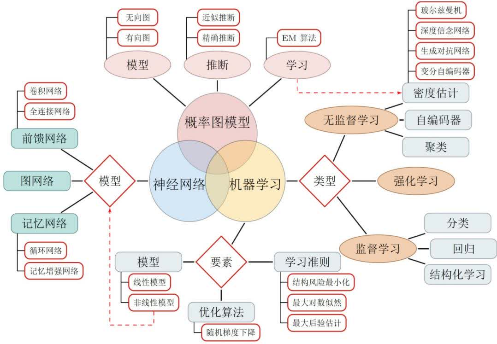

## 1. 机器学习基础

- **有标注数据且目标明确**：监督学习
- **无标签数据且需探索结构**：无监督学习
- **需动态决策且可定义奖励**：强化学习


### 1.1 机器学习的三个基本要素

模型、策略和算法：

- **模型**：监督学习的假设空间，定义了所有可能的预测函数或条件概率分布的集合。
- **策略**：选择最优模型的评价准则，通常通过损失函数和风险最小化实现。
  - 核心概念：0-1 损失函数、平方损失函数、交叉熵损失函数、过拟合与正则化等。
- **算法**：实现策略的具体优化方法，用于从假设空间中求解最优模型参数。
  - 例如：梯度下降法。

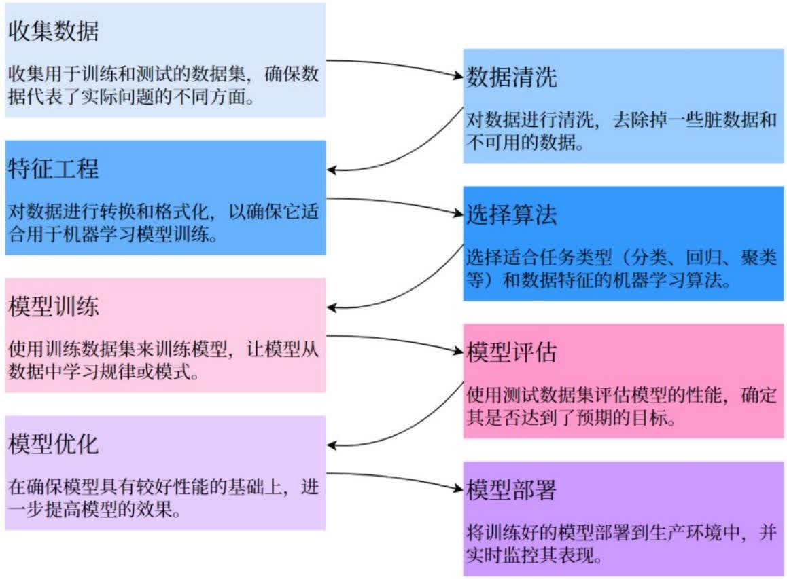

### 1.3 监督学习 (Supervised Learning)

**核心思想**：通过带标签的数据训练模型，已知输入和输出，建立输入与输出的映射关系，核心目标是预测或分类。其特点是依赖明确的“正确答案”反馈，效果评估直观。

#### 1.3.1 典型任务

- **分类（Classification）**：预测离散标签（如垃圾邮件识别、图像分类）。
  - 常见算法：KNN、决策树、逻辑斯蒂回归（Logistic Regression）
  - 分类问题根据其类别数量，又可分为二分类（Binary Classification）和多分类（Multi-class Classification）问题。
- **回归（Regression）**：预测连续值（如房价预测、温度趋势）。
  - 常见算法：线性回归等。

#### 1.3.2 关键特点

- 依赖标注数据，模型通过最小化预测误差（如交叉熵、均方误差）优化参数。
- 需要大量高质量标注数据，标注成本高。

#### 1.3.3 常见算法

线性回归、逻辑回归、支持向量机（SVM）、决策树、神经网络。

#### 1.3.4 监督学习实现步骤

1. 得到一个有限的训练数据集。
2. 确定包含所有学习模型的集合。
3. 确定模型选择的准则，也就是学习策略。
4. 实现求解最优模型的算法，也就是学习算法。
5. 通过学习算法选择最优模型。
6. 利用得到的最优模型，对新数据进行预测或分析。

## 模型评估策略

### 1. 模型评估

- **数据集（Data Set）**：多条记录的集合。
  - 训练集（Training Set）：用于训练模型的数据。
  - 验证集（Validation Set）：用于调节超参数的数据。
  - 测试集（Test Set）：用于评估模型性能的数据。
- **损失函数和经验风险**：
  - 经验风险（Empirical Risk）是监督学习中衡量模型在训练集上表现的核心指标，即所有训练样本的损失函数值的均值。
- **训练误差和测试误差**

### 1.2 模型选择

- 过拟合和欠拟合
- 正则化和交叉验证
  - **交叉验证（Cross-Validation）**：是一种通过多次划分数据集来评估机器学习模型性能的技术，旨在避免过拟合并提升模型的泛化能力。

## 分类问题 和 回归问题

监督学习问题主要可以划分为两类，即：**分类问题**和**回归问题**。

- **分类问题**：预测数据属于哪一类别。
  - 特点：离散。常见评估指标包括准确率、召回率等。
  - 举例：预测数据属于哪一种类型。例如房屋出售预测，通过大量数据训练模型，然后去预测某个给定房屋能不能出售出去，属于“能够出售”还是“不能出售”。
- **回归问题**：根据数据预测一个数值。
  - 特点：连续。
  - 举例：给出房屋一些特征，预测房屋出售的概率。得到的结果将不再是“可以售出(1)”和“不能售出(0)”，而是一个连续的数值，例如 0.5。这就是一个典型的回归问题。

### 回归问题的分类

- 按照输入变量的个数：一元回归和多元回归
- 按照模型类型：线性回归和非线性回归

回归学习常用的损失函数：例如平方损失函数。

## 2. 线性模型

### 2.1 线性回归

**原理**: 用线性函数拟合数据，用 MSE 计算损失，然后用梯度下降法(GD)找到一组使 MSE 最小的权重。  
**定义**： 回归（预测连续数值）

#### 线性回归的推导

我们期望的预测函数（假设空间）可表示为：$h_\theta(x) = \theta_0 + \theta_1 x_1 + \dots + \theta_n x_n = \sum_{i=0}^n \theta_i x_i = \theta^T x$。
拟合值跟实际值之间肯定会产生一个误差（$\epsilon$）：$y^{(i)} = \theta^T x^{(i)} + \epsilon^{(i)}$。
假设误差 $\epsilon^{(i)}$ 具有独立同分布的特点，并且符合高斯（正态）分布，其均值为 0，方差为 $\sigma^2$。误差函数与正态分布的公式组合：$p(\epsilon^{(i)}) = \frac{1}{\sqrt{2\pi}\sigma} \exp\left(-\frac{(\epsilon^{(i)})^2}{2\sigma^2}\right)$。
将 $\epsilon$ 代入后得到给定 $x$ 预测 $y$ 的条件概率：$p(y^{(i)} | x^{(i)};\theta) = \frac{1}{\sqrt{2\pi}\sigma} \exp\left(-\frac{(y^{(i)}-\theta^T x^{(i)})^2}{2\sigma^2}\right)$。
引入似然函数（即所有样本概率乘积）：$L(\theta) = \prod_{i=1}^m p(y^{(i)}|x^{(i)};\theta) = \prod_{i=1}^m \frac{1}{\sqrt{2\pi}\sigma} \exp\left(-\frac{(y^{(i)}-\theta^T x^{(i)})^2}{2\sigma^2}\right)$。
由于函数是一个累乘的式子，将其取对数，将乘法变成加法，即为对数似然：$\log L(\theta) = \sum_{i=1}^m \log \left( \frac{1}{\sqrt{2\pi}\sigma} \exp\left(-\frac{(y^{(i)}-\theta^T x^{(i)})^2}{2\sigma^2}\right) \right)$，化简后得到：$\log L(\theta) = m \log \frac{1}{\sqrt{2\pi}\sigma} - \frac{1}{2\sigma^2} \sum_{i=1}^m (y^{(i)}-\theta^T x^{(i)})^2$。
为了使得似然函数最大（极大似然估计），等价于让减去的那一项最小。因此得到最小二乘法损失函数 $J(\theta)$：$J(\theta) = \frac{1}{2} \sum_{i=1}^m (y^{(i)}-\theta^T x^{(i)})^2$。

**求解 $J(\theta)$ 的极小值（正规方程推导）**：
将其写成矩阵形式：$J(\theta) = \frac{1}{2} (X\theta - y)^T (X\theta - y)$。
对 $\theta$ 求偏导并令其为 0：$\frac{\partial J(\theta)}{\partial \theta} = X^T X \theta - X^T y = 0$。
解得最终的参数值（解析解）：$\theta = (X^T X)^{-1} X^T y$。

### 2.1.1 什么是回归？哪些模型可用于解决回归问题？

指分析因变量和自变量之间关系的分析方法。

- **线性回归**: 对异常值非常敏感。
- **多项式回归**: 如果指数选择不当，容易过拟合。
- **岭回归 (Ridge)**：通过引入惩罚项 (L2)，处理自变量高度相关（共线性）的情况。
- **Lasso 回归**：引入 L1 正则化。
- **弹性网络回归 (ElasticNet)**：结合 L1 和 L2。

| 模型类别 | 模型名称 | 核心特点 |
|---|---|---|
| **线性模型** | 线性回归 (Linear Regression) | 基础模型，拟合线性关系，可解释性强 |
| | 岭回归 (Ridge Regression) | 引入 L2 正则化，处理特征共线性 |
| | Lasso 回归 (Lasso Regression) | 引入 L1 正则化，兼具特征选择功能 |
| | 弹性网络 (ElasticNet) | 结合 L1 和 L2 正则化，平衡岭回归和 Lasso |
| **非线性模型**| 决策树回归 (Decision Tree) | 直观易理解，可处理非线性关系 |
| | 随机森林回归 (Random Forest) | 集成多个决策树，降低过拟合风险 |
| | 梯度提升树(XGBoost, LightGBM等) | 串行集成弱学习器，预测精度高 |
| | 支持向量机回归 (SVR) | 通过核函数处理非线性，对异常值相对稳健 |
| **其他专用模型**| 逻辑回归 (Logistic Regression) | 注意：用于二分类或多分类，输出概率 |
| | 多项式回归 (Polynomial Regression)| 通过特征变换拟合非线性关系 |
| | 泊松回归 (Poisson Regression) | 因变量为计数数据时使用 |

### 2.1.2 线性回归的损失函数为什么是均方差/均方误差？

损失函数 (loss function) 是用于衡量模型预测结果与真实值之间差异的数学函数。
参数优化目标: 我们需要找到最优的参数组合 $\theta = [\theta_0, \theta_1, \dots, \theta_n]$ ，使得损失函数值最小。映射关系表示: 将 $x$ 到 $y$ 的映射函数 $f$ 表示为参数 $\theta$ 的函数，通过迭代方法逐步减小损失函数值。

从数学和极大似然估计的角度证明为什么损失函数是均方误差：
假设真实值与预测值之间的残差 $\epsilon$ 满足正态分布，即：$f(\epsilon_{i}; \mu, \sigma^2) = \frac{1}{\sqrt{2\pi}\sigma} \exp \left( - \frac{(\epsilon_{i} - \mu)^2}{2\sigma^2} \right)$。
根据极大似然估计的定义：$L(\mu, \sigma^2) = \prod_{i=1}^n \frac{1}{\sqrt{2\pi}\sigma} \exp \left( - \frac{(\epsilon_{i} - \mu)^2}{2\sigma^2} \right)$。
取对数似然得：$\log L(\mu, \sigma^2) = -\frac{n}{2}\log(2\pi\sigma^2) - \frac{1}{2\sigma^2} \sum_{i=1}^n (\epsilon_{i} - \mu)^2$。
要让似然概率最大，也就是要使得减号后的部分 $\sum (\epsilon_{i} - \mu)^2$ 尽可能小。理论上由于误差符合均值为 $0$ 的正态分布（即要求 $\mu=0$ ），那么问题就等价于最小化：$\sum_{i=1}^n \epsilon_{i}^2 = \sum_{i=1}^n (y_{i} - \hat{y}_{i})^2$。
这就推导出了均方误差（MSE）作为线性回归损失函数的合理性。

### 2.1.3 什么是线性回归？什么时候使用它？

线性回归是一种统计学习方法，用于建立自变量（特征）和因变量（目标）之间的线性关系。
利用最小二乘函数对一个或多个自变量和因变量之间关系进行建模的一种回归分析。

使用条件：
1. 自变量与因变量呈直线关系。
2. 因变量符合正态分布。
3. 因变量数值之间独立。
4. 方差是否齐性。

### 2.1.4 梯度下降与随机梯度下降 (SGD) 的推导

**梯度下降的核心思想非常直观**：
沿着函数梯度（导数）的反方向，以小步幅迭代更新参数，逐步逼近函数的最小值点。如果把损失函数看作一座山，梯度下降就是蒙住双眼寻找能最快下山的路线。

在简单的线性回归或复杂神经网络中，如果参数沿着损失函数的负梯度方向变化，损失函数便能减少最快。通用参数更新公式如下：
$$
\theta_{k+1} = \theta_k - \alpha \cdot \nabla L(\theta_k)
$$
**符号说明**：
- $\theta_k$：当前第 $k$ 步迭代的模型参数（权重向量）。
- $\nabla L(\theta_k)$：损失函数 $L$ 在当前参数点处求得的梯度向量。
- $\alpha$：每次迭代更新的“步长”，在机器学习中被称为**学习率 (Learning Rate)**。学习率是一个极关键的超参数，过小导致收敛缓慢，过大导致震荡甚至梯度爆炸发散。

**学习率与局部最优**：
普通的梯度下降不一定能够找到全局最优解，对于非凸函数，它有可能陷入局部最优解（或停滞于平缓的鞍点）。
- **优点**：适用性极广（只要损失函数可导）；计算物理逻辑简单。
- **缺点**：对于平缓地形收敛速度慢；容易陷入局部最优谷底。

**梯度下降算法的分类**：
- **批量梯度下降 (BGD, Batch GD)**：遍历全部完整数据集计算总 loss，然后算函数对各个参数的整体平均梯度进行一次更新。
- **随机梯度下降 (SGD, Stochastic GD)**：每次迭代仅随机抽出**一个样本**计算梯度并火速更新。
- **小批量梯度下降 (MBGD, Mini-batch GD)**：每次迭代选取一小批样本（如 `batch_size=32/64/128`）计算平均梯度进行更新，是当前深度学习极其高效且主流的折中方案。

**梯度下降详细推导（以多元线性回归为例）**：

**1. 定义预测函数**
$$
h_\theta(x) = \theta_0 + \theta_1 x_1 + \dots + \theta_n x_n = \theta^T X
$$
**2. 定义损失函数（MSE 的缩放版）**
$$
J(\theta) = \frac{1}{2m} \sum_{i=1}^m (h_\theta(x^{(i)}) - y^{(i)})^2
$$
*(注：公式中特意乘上了常数 $\frac{1}{2}$ 是为了在下一步求求导时能与平方项掉下来的 $2$ 完美约分抹去。)*

**3. 对每个参数 $\theta_j$ 算梯度求偏导**
$$
\frac{\partial J(\theta)}{\partial \theta_j} = \frac{1}{m} \sum_{i=1}^m (h_\theta(x^{(i)}) - y^{(i)}) \cdot x_j^{(i)}
$$

**4. 执行单步梯度下降更新**
$$
\theta_j := \theta_j - \alpha \frac{\partial J(\theta)}{\partial \theta_j} = \theta_j - \frac{\alpha}{m} \sum_{i=1}^m (h_\theta(x^{(i)}) - y^{(i)}) x_j^{(i)}
$$

| 名称 | 全称 | 训练样本 | 优点 | 缺点 |
|---|---|---|---|---|
| **BGD** | 批量梯度下降 | 更新每一参数都用所有样本 | 一定能得到最优解（凸函数时全局最优） | 耗时间长，计算量大 |
| **SGD** | 随机梯度下降 | 每次更新随机选择 1 个样本 | 迭代速度快，能跳出局部最优解 | 1. 需要设定超参数（学习率）；2. 对特征缩放敏感 |
| **MBGD**| 小批量梯度下降 | 每次更新选择 $m$ 个样本（$1 < m < \text{all}$）算平均梯度 | 结合前两者优点，平衡了速度和收敛稳定性 | 需要调优 batch size |

**总结**：SGD 训练速度快，适合大样本；BGD 保证收敛，但耗时；MBGD 综合二者，通常是首选。

**SGDRegressor 的实现思路**：
1. 先用 `train_test_split` 将数据随机分类成训练数据和测试数据。
2. 使用 `StandardScaler` 类的 `fit` 方法将数据标准化，获取平均值和标准差。
3. 用同一标准（特征 $x$ 和目标变量 $y$ 分别对应其 scaler）对训练数据和测试数据标准化。

### 2.1.5 Adam 优化器

Adam优化器的推导过程清晰地展示了它如何通过自适应学习率和动量机制，高效地引导模型参数走向最优解。
下面这张流程图概括了其核心步骤，之后我们会逐步详解每个环节。

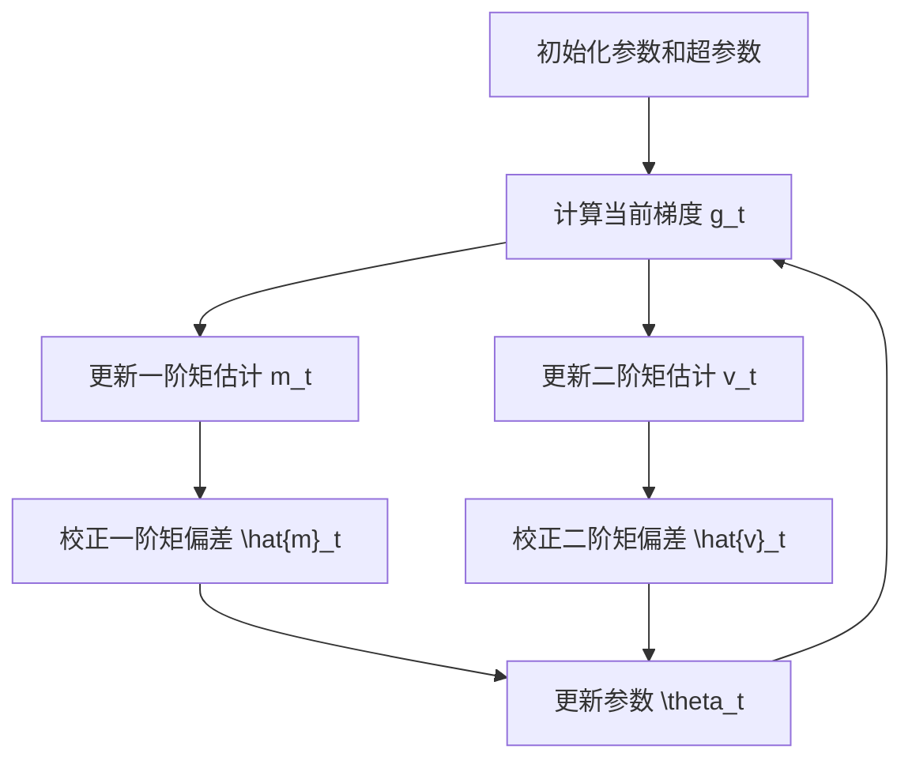
```mermaid
flowchart TD
    A["初始化参数和超参数"] --> B["计算当前梯度 g_t"]
    B --> C["更新一阶矩估计 m_t"]
    B --> D["更新二阶矩估计 v_t"]
    C --> E["校正一阶矩偏差 \hat{m}_t"]
    D --> F["校正二阶矩偏差 \hat{v}_t"]
    E --> G["更新参数 \theta_t"]
    F --> G
    G --> B
```

### 💡 理解 Adam 的构建思想

在深入数学细节前，了解 Adam 的设计动机很有帮助。你可以将模型优化想象成在一个复杂地形（损失函数曲面）上寻找最低点。Adam 的成功在于它巧妙地结合了两种强大思路的优点：

- **动量（Momentum）效应**：类似物体下山时的惯性，Adam 会考虑过去的梯度方向，从而在正确的方向上获得加速，并抑制震荡，帮助它更稳定地穿过狭窄的山谷或平坦区域。
- **自适应学习率（RMSProp）**：Adam 为每个参数单独调整“步长”。对于坡度陡峭（历史梯度大）的方向，它会谨慎地迈小步；对于坡度平缓（历史梯度小）的方向，它会自信地迈大步。

Adam 通过计算梯度的一阶矩（均值，体现动量）和二阶矩（未中心化的方差，体现自适应学习率），并将二者结合来实现上述目标。

### 🔧 Adam 的逐步推导

现在我们一步步拆解 Adam 的工作流程。以下计算在每次迭代（时间步 $t$）中进行。

#### 1. 初始化
首先，需要初始化以下变量：
- **模型参数** $\theta_0$
- **一阶矩估计** $m_0 = \mathbf{0}$ （相当于初始动量为零）
- **二阶矩估计** $v_0 = \mathbf{0}$ （相当于初始的梯度平方积累为零）
- **超参数设定**：
  - 初始学习率 $\alpha$（默认 0.001）
  - 一阶矩衰减率 $\beta_1$（默认 0.9，控制动量记忆）
  - 二阶矩衰减率 $\beta_2$（默认 0.999，控制方差记忆）
  - 稳定常数 $\epsilon$（默认 $10^{-8}$，防止除零错误）

#### 2. 计算当前梯度
在第 $t$ 步，计算损失函数 $f(\theta)$ 关于当前参数 $\theta_{t-1}$ 的梯度：
$$
g_t = \nabla_\theta f_t(\theta_{t-1})
$$
**符号说明**：
- $g_t$：当前 mini-batch 上的真实随机梯度，指明了当前点最陡峭的上升方向。

#### 3. 更新一阶矩估计（动量项 Momentum）
Adam 使用指数移动平均来维护历史梯度的一阶矩（即动量）：
$$
m_t = \beta_1 m_{t-1} + (1 - \beta_1) g_t
$$
**符号说明**：
- $m_t$：带衰减的梯度平均值，类似物理下山时的惯性。
- $\beta_1$：起到了平滑作用，越接近 1，历史方向的影响越持久，越能帮助跨越峡谷、抑制梯度震荡。

#### 4. 更新二阶矩估计（自适应学习率 RMSProp）
Adam 同时维护梯度元素平方的指数移动平均（二阶矩）：
$$
v_t = \beta_2 v_{t-1} + (1 - \beta_2) g_t^2
$$
**符号说明**：
- $v_t$：历史梯度的平方和积累。对于历史梯度一直很大的参数，该值会显著飙升；对于历史梯度平缓的参数，该值较小。
- $g_t^2$：表示 element-wise（元素级别）的平方操作。

#### 5. 执行偏差校正 (Bias Correction)
由于 $m_0$ 和 $v_0$ 均初始化为 0，在训练初期（$t$ 较小时），$m_t$ 和 $v_t$ 会严重被低估（偏向于 0）。因此必须进行校正放大：
$$
\hat{m}_t = \frac{m_t}{1 - \beta_1^t} \quad , \quad \hat{v}_t = \frac{v_t}{1 - \beta_2^t}
$$
**符号说明**：
- $\beta_1^t$：随着迭代步数 $t$ 的增加，$1-\beta^t$ 这个分母会逐渐趋近于 1，从而让这种校正放大作用在训练后期平稳地退出。

#### 6. 更新模型参数
最终，Adam 结合校正后的一阶和二阶矩，利用自适应学习率更新参数：
$$
\theta_t = \theta_{t-1} - \frac{\alpha}{\sqrt{\hat{v}_t} + \epsilon} \cdot \hat{m}_t
$$
**公式直觉**：
- $\hat{m}_t$：取代了暴燥的原生梯度，提供了极其稳定的前进方向。
- $\frac{\alpha}{\sqrt{\hat{v}_t}}$：自适应阻尼器。对于历史波动极大的参数维度（$\hat{v}_t$ 很大），会严重拖慢真实学习率（步长变小），防止更新越界爆飞；而对于历史梯度平坦的维度，真实学习率则能保持自信的大步前进。

### 💻 PyTorch 代码实现

```python
import torch
import torch.optim as optim

# 定义一个简单的模型  
model = torch.nn.Linear(10, 1)  

# 定义 Adam 优化器，传入模型参数和超参数  
optimizer = optim.Adam(model.parameters(), lr=0.001, betas=(0.9, 0.999), eps=1e-08)

# 在训练循环中
for epoch in range(100):
    # ... 前向传播计算损失 loss ...
    
    optimizer.zero_grad()    # 清空上一轮的梯度
    loss.backward()          # 反向传播，计算当前梯度 g_t
    optimizer.step()         # 执行上述推导步骤，更新参数

# 注：optim.Adam 中的 betas 参数对应上述公式里的 β1 和 β2
```

### 📊 Adam 推导总结

| 核心步骤与核心公式 | 物理意义 / 作用 |
|---|---|
| **梯度计算** $g_t = \nabla_\theta J(\theta_{t-1})$ | 找到当前最陡的上升方向 (更新将反向) |
| **一阶矩估计 (动量)** $m_t = \beta_1 m_{t-1} + (1-\beta_1)g_t$ | 积累历史梯度方向，获得惯性，减少震荡，加速收敛 |
| **二阶矩估计 (自适应)** $v_t = \beta_2 v_{t-1} + (1-\beta_2)g_t^2$ | 估计梯度平方的指数平均，用于为每个参数自适应调整学习率 |
| **偏差校正** $\hat{m}_t = \frac{m_t}{1-\beta_1^t}, \hat{v}_t = \frac{v_t}{1-\beta_2^t}$ | 修正训练初期矩估计低估的偏差，使其更准确 |
| **参数更新** $\theta_t = \theta_{t-1} - \frac{\alpha}{\sqrt{\hat{v}_t} + \epsilon} \odot \hat{m}_t$ | 结合校正后的动量方向和自适应学习率，进行最终参数更新 |

### 2.1.6 什么是最小二乘法（最小平方法）？

它通过最小化误差的平方和寻找数据的最佳函数匹配。

#### 最小二乘法的求解过程
好的，我们来详细推导最小二乘法的求解过程，特别是针对一元线性回归的情况。

**问题设定**：
假设我们有 $n$ 个数据点：$(x_1, y_1), (x_2, y_2), \dots, (x_n, y_n)$，我们希望找到一条直线 $y = ax + b$ 来最佳拟合这些点。

**1. 定义损失函数（残差平方和）**
对于每个数据点，预测值为 $\hat{y}_i = ax_i + b$，残差为 $e_i = y_i - \hat{y}_i = y_i - (ax_i + b)$。最小二乘法的目标是最小化所有残差的平方和：
$$
S(a,b) = \sum_{i=1}^n e_i^2 = \sum_{i=1}^n (y_i - a x_i - b)^2
$$
**符号说明**：
- $S(a,b)$：残差平方和（即损失函数），代表预测回归线与所有真实数据点在纵轴（Y 轴）方向上的总累计偏差。
- $n$：训练集样本总数量。
- $y_i, x_i$：第 $i$ 个数据点的真实目标值（因变量）与特征值（自变量）。
- $\hat{y}_i$：根据当前拟合参数计算出的模型预测值。
- $a, b$：一元线性方程的斜率（权重）与截距（偏置），即模型待求解的参数。
- $e_i$：真实的观测值与模型预测值之间的绝对距离（残差误差）。

**2. 对参数求偏导并令其为零**
为了找到使 $S(a,b)$ 最小的 $a$ 和 $b$，我们分别对 $a$ 和 $b$ 求偏导数，并令其等于零。
- **对 $b$ 求偏导**：
$$
\frac{\partial S}{\partial b} = -2 \sum_{i=1}^n (y_i - a x_i - b) = 0 \quad \Rightarrow \quad \sum_{i=1}^n y_i - a \sum_{i=1}^n x_i - nb = 0 \quad \Rightarrow \quad b = \bar{y} - a \bar{x}
$$
- **对 $a$ 求偏导**：
$$
\frac{\partial S}{\partial a} = -2 \sum_{i=1}^n x_i(y_i - a x_i - b) = 0
$$

**3. 代入 $b$ 的表达式求解 $a$**
将 $b = \bar{y} - a\bar{x}$ 代入对 $a$ 的偏导公式中：
$$
\sum_{i=1}^n x_i(y_i - a x_i - (\bar{y} - a\bar{x})) = 0
$$
展开并化简后得到：
$$
\sum_{i=1}^n x_i(y_i - \bar{y}) - a \sum_{i=1}^n x_i(x_i - \bar{x}) = 0
$$

**4. 整理最终公式**
将方程左右移项，分子和分母进一步化简，得到一元线性回归的最终参数解析解：
$$
a = \frac{\sum_{i=1}^n (x_i - \bar{x})(y_i - \bar{y})}{\sum_{i=1}^n (x_i - \bar{x})^2} \quad , \quad b = \bar{y} - a\bar{x}
$$

**5. 矩阵形式推导（多元线性回归）**
对于更一般的多元特征线性回归，方程整体通常表示为 $y = X\beta + \epsilon$。为了寻找到全局最优的参数向量 $\beta$，我们使用矩阵微积分直接求解。

**损失函数（残差平方向量展开）**：
$$
S(\beta) = (y - X\beta)^T(y - X\beta)
$$

对待求的参数向量 $\beta$ 直接求梯度并令其为零，可以得到著名的**正规方程 (Normal Equation)**：
$$
\frac{\partial S}{\partial \beta} = -2X^T(y - X\beta) = 0 \quad \Rightarrow \quad X^T X\beta = X^T y
$$

如果特征正交、样本不重复，使得矩阵 $X^T X$ 满秩且可逆，则多元线性回归有直接的解析解：
$$
\beta = (X^TX)^{-1} X^T y
$$
**符号说明**：
- $S(\beta)$：多元线性回归的目标损失函数，将多维残差整合为了点乘求和结构。
- $y$：大小为 $n \times 1$ 的标签列向量（包含训练集中所有的真实预测值）。
- $X$：大小为 $n \times (p + 1)$ 的设计矩阵（每行代表一个样本，共 $p$ 个特征数据列，加上最后一列总是 $1$ 来对齐截距项 / 常数项）。
- $\beta$：大小为 $(p + 1) \times 1$ 的待求参数列向量（包含对所有特征施加的权重及那个平移截距）。
- $\epsilon$：不可知或随机噪声干扰列向量。
- $X^T$：特征矩阵的转置。
- $X^T X$：各个特征之间的协方差结构矩阵（未中心化版本）。如果不可逆（即特征存在强共线性），则计算时必然除零崩溃，需要通过 L1 / L2 正则化加护盾（即变成 Ridge 岭回归或 Lasso）。
- $(X^TX)^{-1}$：对协方差矩阵求逆元。

**总结**
最小二乘法的推导基于：
1. 定义残差平方和作为损失函数。
2. 通过求偏导找到极值点。
3. 解正规方程组得到参数估计。
4. 该方法在满足高斯-马尔可夫定理假设时，能给出最佳线性无偏估计。

### 2.1.7 常见的损失函数有哪些？

理解常见的损失函数对于构建有效的机器学习模型非常重要。下面这个表格汇总了核心损失函数的特点，方便你快速对比。

| 损失函数 | 主要应用场景 | 核心特点与公式要点 |
|---|---|---|
| **0-1损失** | 理想化的二分类问题 | 非黑即白：预测正确损失为0，错误为1。数学性质差(非凸、不可导)，实际很少直接用于优化。 |
| **均方误差 (MSE)** | 回归任务 (预测连续值) | 衡量预测值与真实值差距的平方和。公式：$\text{MSE}=\frac{1}{n}\sum(y_{\text{true}}-y_{\text{pred}})^2$。对较大误差惩罚重，对异常值敏感。 |
| **平均绝对误差 (MAE)** | 回归任务 (需抗异常值干扰) | 衡量预测值与真实值差距的绝对值之和。公式：$\text{MAE}=\frac{1}{n}\sum\|y_{\text{true}}-y_{\text{pred}}\|$。对异常值鲁棒性更强，梯度恒定但存在零点不可导问题。 |
| **分位数损失** | 预测区间或容忍高估/低估倾向的回归任务 | 通过给定分位点 $\tau$，为高估和低估给予不同惩罚。不假设误差分布对称，可获取预测区间。 |
| **交叉熵损失** | 分类任务 (特别是二分类与多分类) | 衡量预测概率分布与真实分布之间的差异。与Softmax激活函数配合使用，梯度性质优良，能有效缓解梯度消失。 |
| **合页损失 (Hinge Loss)** | 二分类，经典支持向量机 (SVM) | 不仅要求分类正确，还要求有一定的置信度边界。公式：$L= \max(0, 1 - y_{\text{true}} y_{\text{pred}})$。使得SVM的解具有稀疏性。 |

#### 如何选择损失函数

选择损失函数并无绝对法则，但可以参考以下思路：

**明确任务类型**：
- **回归任务**：预测一个连续值。若数据中异常值较少，希望模型快速收敛于常见模式，可选用 MSE。若数据中存在显著异常值，需要模型更稳健，则 MAE 或 Huber Loss是更好选择。如果需要了解预测值的不确定性范围，考虑分位数损失。
- **分类任务**：预测一个类别标签。绝大多数情况下，交叉熵损失是首选，它与 Softmax 组合能提供良好的概率解释和高效的梯度传播。

**考虑模型特性与优化需求**：
- 使用 SVM 时，自然选择合页损失 (Hinge Loss)。
- 若追求模型的稀疏解（即部分特征权重为零），可考虑在损失函数后添加 L1 正则化项。
- 对于类别极度不平衡的分类任务（如欺诈检测），可在标准交叉熵基础上使用加权交叉熵或 Focal Loss。

#### 2.1.7.1 均方误差 (MSE)

| 特性维度 | 详情描述 |
|---|---|
| **核心公式** | 均方误差的体现：$\text{MSE} = \frac{1}{n}\sum_{i=1}^n(y_i - \hat{y}_i)^2$ |
| **直观意义** | 衡量模型预测值与真实值的平均偏离程度，值越小，预测越准。 |
| **主要优点** | 数学性质良好（处处可导），便于优化；放大较大误差，使模型训练更关注修正大错误。 |
| **主要缺点** | 对异常值敏感（因其平方项会放大异常点的误差）；损失值的大小与原始数据量纲不一致。 |
| **核心作用** | 作为损失函数指导模型参数优化；作为评估指标衡量模型最终性能。 |
| **关键数学性质** | 均方误差可以分解为方差和偏差的平方之和。 |

#### 计算与直观理解

均方误差的计算逻辑非常清晰：
1. **计算误差**：对于每一个数据点，计算模型的预测值 $\hat{y}_i$ 与真实值 $y_i$ 之间的差值。
2. **平方误差**：将每个差值进行平方。这样做主要有两个目的：一是避免正负误差相互抵消，二是给予较大的误差更大的权重，使模型更关注修正严重的预测错误。
3. **求平均值**：将所有样本的平方误差求和后除以样本数量 $n$，得到平均平方误差。这个值越小，说明模型的预测输出与真实值之间的整体差距越小，模型的预测能力也就越好。

#### 作为损失函数的作用
在训练线性回归等模型时，均方误差最常扮演的角色是损失函数。模型训练的目标就是找到一组参数，使得这个损失函数的值最小化。由于其函数曲线是光滑的凸函数，具有良好的数学性质，可以通过梯度下降等优化算法高效地找到这个最优解。

#### 方差-偏差分解
从数理统计的角度看，均方误差有一个非常重要的性质：它可以分解为模型的方差、偏差的平方两部分之和，即 $\text{MSE} = \text{Var} + \text{Bias}^2$。
- **偏差 (Bias)**：衡量了模型预测值的平均值与真实值之间的差距，即模型本身的拟合能力。高偏差通常意味着模型过于简单，未能捕捉到数据中的基本规律（欠拟合）。
- **方差 (Variance)**：衡量了模型对于不同训练集的敏感程度，即模型的稳定性。高方差意味着模型过于复杂，对训练数据中的噪声也进行了学习，导致泛化能力差（过拟合）。这个分解揭示了模型泛化误差的来源，指导我们在降低偏差和降低方差之间做出权衡。

#### 优缺点与相关指标

**优缺点分析**：
- **优点**：
  - 便于优化：作为凸函数且处处可导，使其易于使用梯度下降法等优化算法。
  - 惩罚大误差：平方项放大了较大误差的影响，在训练中能更有效地驱动模型修正重大错误。
- **缺点**：
  - 对异常值敏感：由于平方项的存在，个别极端大的误差会显著拉高 MSE，可能对模型参数产生不成比例的影响，降低鲁棒性。
  - 量纲不一致：MSE的单位是原始数据单位的平方，有时不便于直接解释。为此，常使用其平方根——均方根误差 (RMSE) 来使误差指标与原始数据量纲一致。

**与其他指标的关系**：
在评估回归模型时，除了 MSE 和 RMSE，平均绝对误差 (MAE) 也是常用指标。MAE 是预测值与真实值绝对差的平均值（$\text{MAE} = \frac{1}{n} \sum_{i=1}^n \|y_i - \hat{y}_i\|$）。它与 MSE 的主要区别在于，MAE对所有误差给予线性惩罚，而 MSE 给予大误差更大的惩罚。因此，如果数据中存在较多异常值，MAE 通常比 MSE 更稳定；而如果希望模型极力避免大的预测失误，MSE 是更合适的选择。

#### 2.1.7.2 交叉熵损失（Cross-Entropy Loss）

交叉熵损失是分类任务中常用的损失函数，用来衡量模型预测概率分布与真实标签分布之间的差异。

模型有没有把高概率分给正确类别：
- 如果正确类别的预测概率很高，损失就小。
- 如果正确类别的预测概率很低，损失就大。

交叉熵损失会惩罚“对正确类别不自信”或“判断错误”的预测。

#### 数学表达

**二分类（Binary Classification）**
对于单个样本，二分类交叉熵（BCE）公式为：$L = -[y \log(\hat{y}) + (1-y)\log(1-\hat{y})]$。
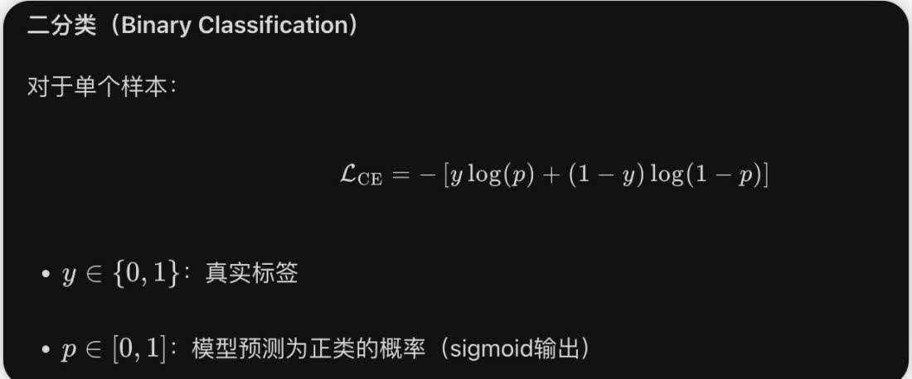

**多分类（Multi-Class Classification）**
对于单个样本，多分类交叉熵（CCE）公式为：$L = -\sum_{c=1}^M y_c \log(\hat{y}_c)$。
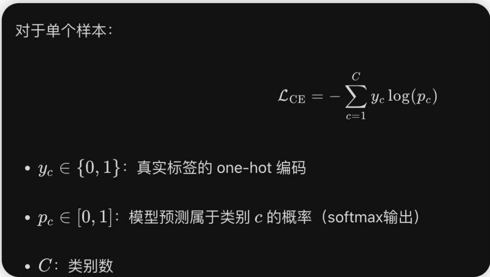

#### 为什么用交叉熵？

**1. 与极大似然估计的理论一致性**
交叉熵损失函数等价于最小化负对数似然（Negative Log-Likelihood），这是概率统计中优化模型参数的自然方法。从概率角度看，分类问题可以看作寻找使观测数据出现概率最大的模型参数，交叉熵损失函数的数学形式与极大似然估计（MLE）的目标完全一致。
例如：$-\log(0.9) \approx 0.105$，$-\log(0.1) \approx 2.30$。

**2. 解决梯度消失问题**
当使用 Sigmoid 激活函数时，交叉熵损失的梯度与预测误差成正比，而 MSE 损失的梯度受 Sigmoid 函数梯度影响。
- **交叉熵梯度**：$\frac{\partial L}{\partial z} = \sigma(z) - y$
- **MSE梯度**：$\frac{\partial L}{\partial z} = (\sigma(z) - y) \cdot \sigma(z) \cdot (1 - \sigma(z))$

当 $\sigma(z)$ 接近 0 或 1 时，MSE 梯度趋近于 0，导致学习速度极慢（在模型预测接近正确值或高置信度错误时，反向传播的梯度会变得极小，导致权重更新缓慢甚至停止）。而交叉熵的梯度不受此影响，始终与误差成正比。

**3. 与 Softmax/Sigmoid 激活函数的天然兼容性**
在多分类任务中，交叉熵与 Softmax 组合使用时，计算可以简化，且数值稳定性更好。
- 交叉熵 + Softmax 的组合可以简化为：$-\log\left(\frac{e^{z_i}}{\sum_j e^{z_j}}\right) = -z_i + \log\left(\sum_j e^{z_j}\right)$。
- 这种组合在实现上更高效，避免了单独计算 Softmax 再取对数的数值不稳定性。

**4. 对错误预测的指数级惩罚机制**
交叉熵对错误预测的惩罚是对数级别增长的（而非线性），这使得模型能够更快地学习并纠正错误。当预测概率与真实标签相差越大，损失增长越快。
- 例如：正确类预测概率为 0.1 时，损失为 $-\log(0.1) \approx 2.30$；预测概率为 0.01 时，损失为 $-\log(0.01) \approx 4.60$，惩罚强度翻倍。

#### 为什么不是其他损失函数？

- **MSE**：适合回归问题，但对分类问题不敏感，结合 Sigmoid 时梯度消失问题严重。
- **Hinge Loss**：适用于 SVM 等硬分类模型，但不提供概率解释。
- **Kullback-Leibler散度**：与交叉熵相关，但交叉熵是更直接的损失函数

#### ⚠️ 常见误区
1. **不是只能用于分类**：虽然主要用于分类，但本质上是衡量两个分布的差异，也可用于生成模型（如 VAE、GAN）。
2. **不是“平方误差”的替代品**：回归任务用 MSE，分类任务用交叉熵，二者目标不同。
3. **$\log(0)$ 问题**：实际中会加小常数 $\epsilon$（如 `1e-7`）避免 $\log(0)$ 导致 `NaN`。

#### 💻 代码示例（PyTorch）
```python
import torch
import torch.nn as nn

# 多分类  
criterion = nn.CrossEntropyLoss() # 内部包含 softmax  
logits = torch.tensor([[2.0, 1.0, 0.1], [0.5, 1.5, 2.0]]) # 模型原始输出（未归一化）  
labels = torch.tensor([0, 2]) # 真实类别索引

loss = criterion(logits, labels) 
print(loss) # 输出标量损失值
```

#### 📊 可视化理解
当真实标签为 1 时，损失随预测概率 $p$ 的变化：
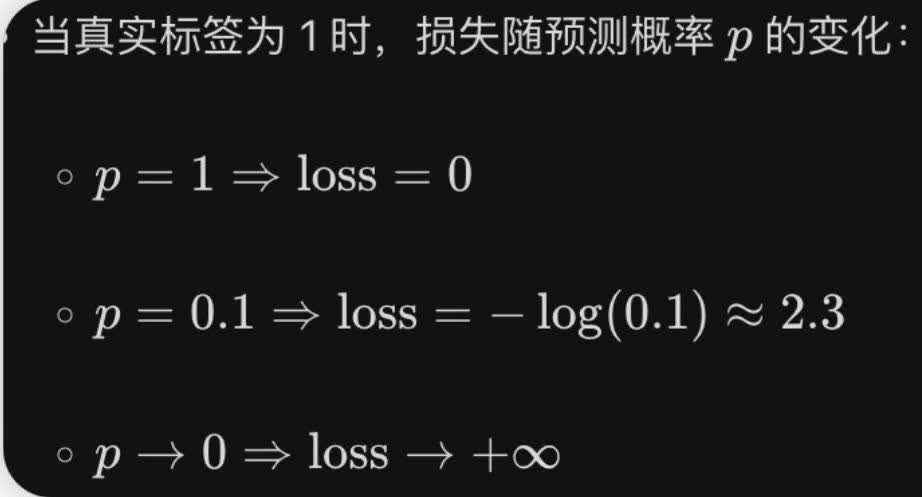

**💡 总结一句话**：
交叉熵损失 = 分类任务中的“误差标尺”，它用概率的语言告诉你：模型对正确类别的“信心”有多差。

#### 2.1.7.3 交叉熵损失（Cross-Entropy Loss）计算示例

下面通过一个具体的分类任务例子，来说明交叉熵损失的计算过程。

#### 场景设定
假设我们有一个 3 类分类问题（猫、狗、鸟），模型对某一张图片的预测输出（经过 softmax 后）为：
- **预测概率分布**：猫 0.2，狗 0.7，鸟 0.1
- **真实标签**（ground truth，图片是“狗”）：猫 0，狗 1，鸟 0 (One-hot 编码)

#### 🧮 交叉熵损失公式
对于单个样本，交叉熵损失定义为：$\text{Loss} = - \sum_{i=1}^C y_i \log(p_i)$。
其中：
- $C$ 是类别数（这里是3）。
- $y_i$ 是真实标签的 one-hot 向量（只有正确类为1，其余为0）。
- $p_i$ 是模型预测该类别的概率（softmax输出）。

#### 🔢 代入数值计算
$\text{Loss} = - (0 \cdot \log(0.2) + 1 \cdot \log(0.7) + 0 \cdot \log(0.1)) = -\log(0.7)$。
计算可得：$-\log(0.7) \approx -(-0.3567) = 0.3567$。
*(注：在深度学习中，通常使用自然对数 $\ln$ 作为底数。)*

**结论**：
这个样本的交叉熵损失约为 0.357。
如果模型对正确类别的预测概率越高（比如 0.99），损失就越小（接近 0）；如果预测概率很低（比如 0.1），损失就会很大（例如 $-\log(0.1) \approx 2.30$）。

#### 💡 补充说明
- 在 **PyTorch** 中，常用 `nn.CrossEntropyLoss()`，它内部会自动对输入 logits 做 softmax，不需要手动加 softmax。
- 在 **TensorFlow/Keras** 中，`SparseCategoricalCrossentropy(from_logits=True)` 也有类似行为。

---

#### 2.1.7.4 其他常见损失函数简述与公式

1. **0-1损失**：理想化的二分类问题。
2. **均方差损失 (MSE)**：回归任务（预测连续值），衡量预测值与真实值差距的平方和；公式：$\text{MSE} = (1/n) \sum(y_{\text{true}} - y_{\text{pred}})^2$。
3. **平均绝对误差 (MAE)**：回归任务（需抗异常值干扰）；公式：$\text{MAE} = (1/n) \sum|y_{\text{true}} - y_{\text{pred}}|$。对异常值鲁棒性更强，梯度恒定但存在零点不可导问题。
4. **分位数损失 (Quantile Loss)**：分位数回归可以通过给定不同的分位点，拟合目标值的不同分位数。实现了分别用不同的系数控制高估和低估的损失，进而实现分位数回归。
5. **交叉熵损失**：分类任务（特别是二分类与多分类）。
6. **合页损失 (Hinge Loss)**：一种二分类损失函数，是 SVM 的损失函数本质。合页损失（加 L2 正则化）的公式如下：$J_{\text{hinge}} = \sum_{i=1}^N \max(0, 1 - \operatorname{sgn}(y_i)\hat{y}_i)$。

### 2.1.8 有哪些评估回归模型的指标？

衡量线性回归法最好的指标：$R^2$ (R Squared)

| 指标 | 公式 | 意义 |
|---|---|---|
| **MSE (均方误差)** | $\text{MSE} = \frac{1}{m}\sum_{i=1}^m (y_i - \hat{y}_i)^2$ | 值越大，表明预测效果越差。 |
| **RMSE (均方根误差)** | $\text{RMSE} = \sqrt{\frac{1}{m}\sum_{i=1}^m (y_i - \hat{y}_i)^2}$ | 放大了较大误差之间的差距，值越小其意义越大。 |
| **MAE (平均绝对误差)** | $\text{MAE} = \frac{1}{m}\sum_{i=1}^m \|y_i - \hat{y}_i\|$ | 反应的就是真实误差。 |
| **$R^2$ (R Squared)** | $R^2 = 1 - \frac{\sum (y_i - \hat{y}_i)^2}{\sum (y_i - \bar{y})^2} = 1 - \frac{\text{MSE}(y, \hat{y})}{\text{Var}(y)}$ | 1. $R^2 \le 1$，越大越好。<br>2. 预测模型不犯任何错误时：$R^2 = 1$。<br>3. 模型等于基准模型时（用均值预测）：$R^2 = 0$。<br>4. $R^2 < 0$：模型还不如基准模型，数据可能不存在线性关系。<br>*本质：$1 - \frac{\text{我们模型的误差}}{\text{基准模型的误差}} =$ 模型拟合住的部分。* |

### 2.1.9 什么是正规方程？（Normal Equation）

正规方程（Normal Equation）是在线性回归中，直接求解参数的一种方法。它基于最小二乘法，通过数学推导（对代价函数求偏导并令其为 0）直接找到使误差平方和最小的参数值，而不需要像梯度下降那样反复迭代。因直接解出方程组得名“正规方程组”。

公式为：$\theta = (X^T X)^{-1} X^T y$

**与梯度下降法的对比：**

| 特性 | 正规方程 | 梯度下降 |
|---|---|---|
| **是否需要学习率 $\alpha$** | 不需要 | 需要 |
| **是否需要迭代** | 一次计算计算矩阵求逆即可 | 需要多次迭代 |
| **计算复杂度** | $\approx O(n^3)$ （其中 $n$ 为特征维度） | $O(k n^2)$ ($k$ 为迭代次数) |
| **适用场景** | 特征数 $n < 10,000$ | 特征数 $n$很大时也可适用 |

*(注：原文档表格中复杂度标称有误，正规方程求逆矩阵的时间复杂度约为理论上的 $O(n^3)$ )*

### 2.1.10 梯度下降法找到的一定是下降最快的方向吗？

不一定，它只是目标函数在**当前点的局部切平面上**下降最快的方向。在实际执行中，**牛顿方向**（考虑海森矩阵，即二阶导数）才一般被认为是下降最快的全局方向，可以达到超线性的收敛速度。梯度下降类的算法的收敛速度一般是线性甚至次线性的（特别是遇到带复杂约束或病态条件的问题时）。

### 2.1.11 MBGD（小批量梯度下降）需要注意什么?

1. **如何选择批量大小 $m$？** 一般 $m$ 取 2 的幂次方（如 32, 64, 128），能充分利用底层硬件（如 GPU）的矩阵运算加速。
2. **数据打乱（Shuffle）**：一般会在每次遍历整个训练数据（一个 epoch）之前，先对所有的数据进行随机排序，然后再按顺序挑选 $m$ 个样本，直到遍历完所有数据。

---
*(附加引导：什么是正态分布？为什么要重视它？如何检查变量是否遵循正态分布？如何建立价格预测模型？需要预处理吗？这些通常作为基础统计学或数据分析特征工程的前置课题。)*

### 2.1.12 补充知识：偏导数

偏导数是多元函数微分学中的核心概念，它帮助我们理解函数随着某个特定变量变化时的行为。

**核心意义**：
偏导数衡量的是**当其他所有自变量都固定不变时，函数沿某一个特定自变量方向的变化率**。

例如一个函数：$f(x, y) = x^2 + 3y$
- 对 $x$ 求偏导（把 $y$ 当作常数）：$\frac{\partial f}{\partial x} = 2x$
- 对 $y$ 求偏导（把 $x$ 当作常数）：$\frac{\partial f}{\partial y} = 3$

**在机器学习中的作用**：
机器学习里，损失函数通常和多个参数有关，如 $J(w, b)$。这时就要分别求偏导 $\frac{\partial J}{\partial w}$ 和 $\frac{\partial J}{\partial b}$，这样才能知道每个参数该往哪个方向去调整，这也是**梯度下降的基础**。

**偏导数核心要点梳理**：

| 对比维度 | 偏导数 (Partial Derivative) |
|---|---|
| **核心思想** | 衡量多元函数沿单个坐标轴方向的变化率 |
| **操作原则** | 求导时，将其他自变量视为常数，只对单一目标变量求导 |
| **数学符号** | $\frac{\partial f}{\partial x}$ 或 $f_x$（符号 $\partial$ 读作 "partial" 或 "偏"） |
| **几何意义** | 表示多元函数图像（如曲面）被垂直于相关坐标轴的平面切割后，所得切割曲线在某点的切线斜率 |
| **主要价值** | 研究多元函数性质、支撑优化算法（如梯度下降法）、求解偏微分方程的基础 |

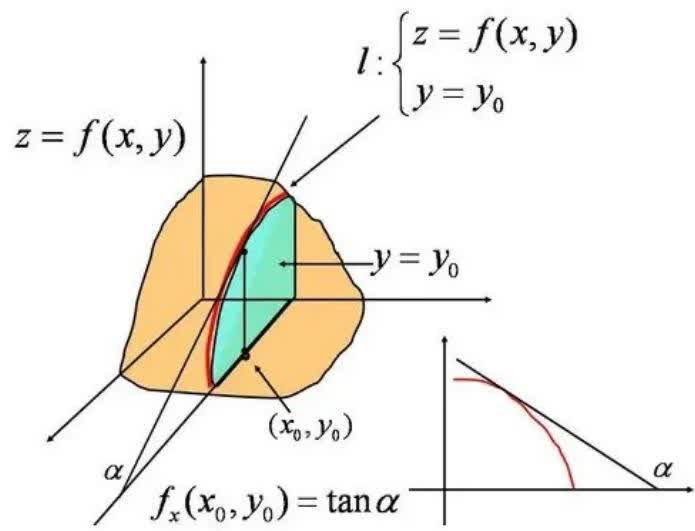

数学上，对于二元函数 $z = f(x, y)$，在点 $(x_0, y_0)$ 处对 $x$ 的偏导数定义就是用来强调这是单变量且剥去其余干扰的导数变化（记为 $\partial$）。

### 2.2 逻辑回归 (Logistic Regression)

| 特征 | 线性回归 | 逻辑回归 (LR) |
|---|---|---|
| **主要任务** | 回归 (预测连续数值) | 分类 (预测概率或类别) |
| **输出形式** | 任意实数 | 通过 Sigmoid 函数映射到 $(0,1)$ 区间，表示概率 |
| **核心函数** | 线性函数 $y=wx+b$ | 逻辑函数 (Sigmoid)，将线性输出转化为概率 |
| **损失函数** | 均方误差 (MSE) | 交叉熵损失 (Cross-Entropy Loss) |
| **输出假设** | 因变量服从正态分布 (高斯分布) | 因变量服从二项分布 (伯努利分布) |
| **关系表示** | 直线 | S形曲线 (Sigmoid曲线) |
| **典型应用** | 房价预测、销售额趋势分析 | 垃圾邮件识别、医疗诊断 |

**逻辑回归 = 线性回归 + Sigmoid 函数**

也称为“对数几率回归”。

**知识点提炼**
1. **分类**：经典的二分类算法！
2. **LR 的过程**：面对一个分类问题，建立代价函数，然后通过优化方法迭代求解出最优的模型参数，最后测试验证这个求解的模型的好坏。
3. **分类本质**：Logistic 回归虽然名字里带“回归”，但是它实际上是一种分类方法，主要用于二分类问题（即输出只有两种，分别代表两个类别）。
4. **定性变量**：回归模型中 $y$ 是一个定性变量（比如 $y = 0$ 或 $1$），logistic 方法主要应用于研究某些事件发生的概率。
5. **本质原理**：极大似然估计
6. **激活函数**：Sigmoid
7. **代价函数** (Cost Function)：交叉熵 (Cross-Entropy)

**优点**：
1. 速度快，适合二分类问题。
2. 简单易于理解，能直接看到各个特征的权重。
3. 能容易地更新模型吸收新的数据。

**缺点**：
对数据和场景的适应能力有局限性，不如决策树算法适应性那么强。

LR 中最核心的概念是 Sigmoid 函数，它可以看成 LR 的激活函数。

**Regression 常规步骤**：
1. 寻找 $h$ 函数（即预测函数）
2. 构造 $J$ 函数（损失函数）
3. 想办法（迭代）使得 $J$ 函数最小并求得回归参数（$\theta$）

**LR 伪代码**：
```python
# LR 核心训练步骤
初始化线性函数参数为 1
构造 Sigmoid 函数  
重复循环 I 次:  
    计算数据集梯度  
    更新线性函数参数  
确定最终的 Sigmoid 模型参数  
输入训练（测试）数据集  
运用最终 Sigmoid 函数求解分类
```

### LR 的推导

- **LR 模型的表达式**：$h_\theta(x) = \frac{1}{1+e^{-\theta^T x}}$，其导数具有性质 $g'(x) = g(x)(1-g(x))$。
- **似然函数表达式**：$L(\theta) = \prod_{i=1}^m P(y^{(i)}|x^{(i)};\theta) = \prod_{i=1}^m (h_\theta(x^{(i)}))^{y^{(i)}} (1-h_\theta(x^{(i)}))^{1-y^{(i)}}$
- **对数似然函数**：$\ln L(\theta) = \sum_{i=1}^m \left[ y^{(i)} \ln h_\theta(x^{(i)}) + (1-y^{(i)}) \ln (1-h_\theta(x^{(i)})) \right]$
- **梯度下降更新参数**：对对数似然函数求导后，参数更新公式为 $\theta_j := \theta_j + \alpha \sum_{i=1}^m (y^{(i)} - h_\theta(x^{(i)})) x_j^{(i)}$。

### 2.2.1 为什么 LR 要使用 sigmoid 函数？

1. 广义模型推导所得  
2. 满足统计的最大熵模型  
3. 性质优秀，方便使用

（Sigmoid 函数是平滑的，而且任意阶可导，一阶二阶导数可以直接由函数值得到不用进行求导，这在实现中很实用）

### 2.2.2 为什么常常要做特征组合（特征交叉）？

LR模型属于线性模型，线性模型不能很好处理非线性特征，特征组合可以引入 非线性特征，提升模型的表达能力。

另外，基本特征可以认为是全局建模，组合特征更加精细，是个性化建模，但对全局建模会对部分样本有偏，

对每一个样本建模又会导致数据爆炸，过拟合，所以基本特征+特征组合兼顾了全局和个性化。

### 2.2.3 为什么LR比线性回归要好？

LR 和线性回归首先都是广义的线性回归，

其次经典线性模型的优化目标函数是最小二乘，

而LR则是似然函数，

另外线性回归在整个实数域范围内进行预测，敏感度一致，而分类范围，需要在[0,1]。

LR就是一种减小预测范围，将预测值限定为[0,1]间的一种回归模型，因而对于这类问题来说，LR 的鲁棒性比线性回归的要好

### 2.2.4 LR 参数求解的优化方法？(机器学习中常用的最优化方法)

梯 度 下 降 法 ， 随 机 梯 度 下 降 法 ， 牛 顿 法 ， 拟 牛 顿 法（LBFGS，BFGS,OWLQN）

目的都是求解某个函数的极小值。

### 2.2.5 工程上，怎么实现 LR 的并行化？有哪些并行化的工具？

LR的并行化最主要的就是对目标函数梯度计算的并行化。

无损的并行化：算法天然可以并行，并行只是提高了计算的速度和解决问题的规模，但和正常执行的结果是一样的。

有损的并行化：算法本身不是天然并行的，需要对算法做一些近似来实现并行化，这样并行化之后的双方和正常执行的结果并不一致，但是相似的。

基于 Batch 的算法都是可以进行无损的并行化的。而基于 SGD 的算法都只能进行有损的并行化。

为了实现并行，首先需要将数据分发到不同的工作节点。主要有两种策略，通常结合使用：

数据并行（按行划分）：这是最常用和直观的方法。将训练样本集划分成多个小块，每个计算节点只处理其中一部分样本。这种方式直接解决了样本数量巨大带来的内存和计算瓶颈

。例如，有1亿条训练数据，可以分配到 100台机器，每台机器只处理 100万条。模型并行（按列划分）：当模型的特征维度极高（例如上亿维）时，即便是单个样本的特征向量也可能无法存放在一台机器的内存中。这时需要将特征向量进行切分，不同的节点负责更新和维护不同特征维度对应的参数

。例如，一个高维特征向量可以被拆分成10段，由10个节点分别计算其对应特征的梯度。

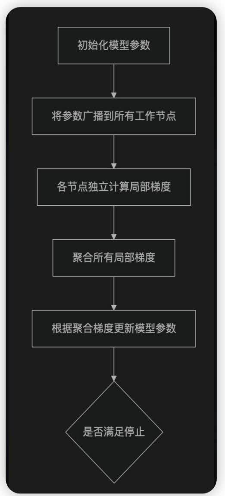

常用并行化工具

在实际工程中，我们通常会使用成熟的分布式计算框架来实现上述流程，而非从头造轮子。

Apache Spark (MLlib)：这是目前业界最流行的选择。Spark 的内存计算模型非常适用于 需 要 多 次迭 代的 机 器 学 习 算 法 。 其 核 心 优 势 在 于 ： 高 阶 API： 提供了LogisticRegressionWithLBFGS 等高级接口，内部已经实现了并行化，开箱即用。

内存计算：将数据缓存在内存中，极大加速了迭代计算过程。

强大的通信优化：支持广播变量（broadcast）来高效分发模型参数，避免重复传输；提供 treeAggregate 进行高效的树形聚合。MPI (Message Passing Interface)：这是一种更底层的消息传递库，常用于高性能计算集群。使用MPI实现LR并行化给予开发者极大的控制权，但编程复杂度也更高。你需要手动实现节点间的通信、数据分布和同步等细节。

### 2.2.6 LR 如何解决低维不可分问题？

通过特征变换的方式把低维空间转换到高维空间，而在低维空间不可分的数据，到高维空间中线性可分的几率会高一些。

具体方法：核函数，如：高斯核，多项式核等等

### 2.2.7 LR 与最大熵模型 MaxEnt 的关系?

没有本质区别。LR是最大熵对应类别为二类时的特殊情况，也就是当 LR类别扩展到多类别时，就是最大熵模型。

### 2.2.8 为什么 LR 用交叉熵损失而不是平方损失（MSE）？

假设 $\hat{y} = \sigma(z), z = w \cdot x + b$。

如果使用**均方误差 (MSE)**作为损失函数 $C = \frac{1}{2}(y - \hat{y})^2$，求得的梯度为：$\frac{\partial C}{\partial w} = (\hat{y} - y) \sigma'(z) x$。这会受到 Sigmoid 函数导数 $\sigma'(z)$ 的影响。

如果使用**交叉熵**作为损失函数 $C = -\frac{1}{n}\sum[y\ln\hat{y} + (1-y)\ln(1-\hat{y})]$，求得的梯度化简后为：$\frac{\partial C}{\partial w} = \frac{1}{n}\sum x (\sigma(z) - y)$。它没有受到 Sigmoid 函数导数的影响，且真实值与预测值差别越大，梯度越大，更新速度越快。

**记忆点**：MSE 的导数里面有 Sigmoid 函数的导数。因为 Sigmoid 的导数最大值仅为 0.25，在预测完全错误时导数趋近 0 导致“梯度消失”，此时更新数据太慢。而交叉熵导数里完美约掉了 Sigmoid 导数。

### 2.2.9 LR 能否解决非线性分类问题？

可以解决。主要途径是使用 **Kernel Trick（核技巧）**，或通过手动构建特征交叉项（Feature Crosses）将数据映射到高维线性可分空间。  
不过，通常使用的kernel都是隐式的，也就是找不到显式地把数据从低维映射到高维的函数，而只能计算高维空间中数据点的内积。$\sum _ { i } a _ { i } \langle x _ { i } , x \rangle + b$

### 2.2.10 用什么来评估LR模型？

1.由于LR是用来预测概率的，可以用 AUC-ROC曲线以及混淆矩阵来确定其性能。

2.LR中类似于校正R2 的指标是AIC。AIC是对模型系数数量惩罚模型的拟合度量。因此，更偏爱有最小的 AIC 的模型。

### 2.2.11 LR 如何解决多分类问题？（OvR vs OvO）

| | OvR (One vs Rest) | OvO (One vs One) |
|---|---|---|
| **字面含义** | 一对剩余 | 一对一 |
| **算法思想** | 将某类样本看做一类，其他所有分为另一类。形成 $n$ 个二分类模型，预测时概率最高的模型胜出。 | 从类别中每次挑出 2 种两两结合，形成 $C_n^2$ 个模型，采用投票制，得票最多的胜出。 |
| **区别** | 训练耗时相对较少 | $OvO$ 耗时较多，但分类边界通常更准确 |
| **代码调用** | 默认支持多分类，分类方式为 `multi_class='ovr'` | `multi_class='multinomial'` 搭配 `solver='newton-cg'` |

### 2.2.12 在训练的过程当中，如果有很多的特征高度相关或者说有一个特征重复了100遍，会造成怎样的影响？

如果在损失函数最终收敛的情况下，其实就算有很多特征高度相关也不会影响分类器的效果。但是对特征本身来说的话，假设只有一个特征，在不考虑采样的情况下，你现在将它重复100遍。训练以后完以后，数据还是这么多，但是这个特征本身重复了100遍，实质上 将原来的特征分成了 100 份，每一个特征都是原来特征权重值的百分之一。如果在随机采样的情况下，其实训练收敛完以后，还是可以认为这100个特征和原来那一个特征扮演的效果一样，只是可能中间很多特征的值正负相消了。

### 2.2.13 为什么在训练的过程当中将高度相关的特征去掉？

去掉高度相关的特征会让模型的可解释性更好。

可以大大提高训练的速度。如果模型当中有很多特征高度相关的话，就算损失函数本身收敛了，但实际上参数是没有收敛的，这样会拉低训练的速度。

其次是特征多了，本身就会增大训练的时间。

### 2.3 Lasso

定义：所有参数绝对值之和，即 L1 范数，对应的回归方法。

Lasso(alpha ${ \bf \mathbf { \varepsilon } } = { \bf 0 . 1 }$ ) # 设置学习率

$$
L ( x , y ) \equiv \sum _ { i = 1 } ^ { n } ( y _ { i } - h _ { \theta } ( x _ { i } ) ) ^ { 2 } + \lambda \sum _ { i = 1 } ^ { n } | \theta _ { i } |
$$
**符号说明**：
- $L(x, y)$：带 L1 正则化的代价函数。
- $n$：样本数量或特征数量（此处通常指代所有样本或所有模型参数维度上的累加）。
- $y_i$：第 $i$ 个样本的真实标签值。
- $h_\theta(x_i)$：模型基于输入特征 $x_i$ 和参数 $\theta$ 的预测值。
- $(y_i - h_\theta(x_i))^2$：平方误差拟合项，衡量模型预测与实际的偏差。
- $\lambda$：正则化系数（惩罚力度），控制模型复杂度。
- $\theta_i$：模型的第 $i$ 个参数（权重）。$|\theta_i|$ 即为其绝对值惩罚项（L1 范数）。

### 2.4 Ridge

定义：所有参数平方和，即L2范数，对应的回归方法。

通过对系数的大小施加惩罚来解决 普通最小二乘法 的一些问题。

Ridge(alpha=0.1) # 设置惩罚项系数

$$
L ( x , y ) \equiv \sum _ { i = 1 } ^ { n } ( y _ { i } - h _ { \theta } ( x _ { i } ) ) ^ { 2 } + \lambda \sum _ { i = 1 } ^ { n } \theta _ { i } ^ { 2 }
$$
**符号说明**：
- $\lambda \sum \theta_i^2$：L2 正则化惩罚项（参数的平方和范数），用于将参数权重均匀压缩变小，防止某几个维度权重过大。其余符号同上。

### 2.5 Lasso vs Ridge

| 区别与联系 | Lasso | Ridge |
|---|---|---|
| **正则化项** | L1 范数 | L2 范数 |
| **特征选择** | 可以（使不重要特征权重归 0，变稀疏） | 不可以 |
| **贝叶斯先验** | 满足拉普拉斯分布 | 满足高斯分布 |
| **鲁棒性（防离群点）** | 对异常值相对较好 | 相对较差 (因为平方项会放大极值惩罚) |
| **联系** | 都可以用来解决标准线性回归的过拟合问题，评价指标都是 $R^2$ | （同左） |

### 2.6 线性回归 vs LR

| | 线性回归 | 逻辑回归 (LR) |
|---|---|---|
| **构建方法** | 最小二乘法 (MSE) | 最大似然估算 (似然函数) |
| **解决问题** | 解决回归问题预测连续值，若用于分类鲁棒性极差 | 解决分类问题 |
| **输出限制** | 整个实数域上的连续值 | 经过 Sigmoid 映射到 $(0,1)$ 内，再由阈值转化为类别 |
| **联系** | 两者皆属于广义上的线性回归。都是通过一系列输入特征拟合一条曲线来完成未知输入的预测。 | （同左） |

## 3. 验证方式

### 3.1 什么是过拟合？产生过拟合原因?

过拟合是指模型在**训练集**上的效果很好，但在**测试集**上的预测效果很差。

主要原因：
1. 数据有噪声
2. 训练数据不足，有限的训练数据
3. 训练模型过度导致模型非常复杂

### 3.2 如何避免过拟合问题？

| 序号 | 方法 | 说明 |
|---|---|---|
| 1 | **Early Stopping** | 在发生过拟合之前提前结束训练。 |
| 2 | **数据集扩增** | 原有数据增加、原有数据加随机噪声、重采样。 |
| 3 | **正则化** | 引入范数概念（L1/L2），增强模型泛化能力。 |
| 4 | **Dropout** | 每次训练时丢弃一些节点，增强泛化能力。 |
| 5 | **批量标准化 (Batch Normalization)** | 对每层激活值进行归一化处理，加快收敛。 |
| 6 | **减小模型复杂度** | 使用更简单的模型结构。 |
| 7 | **Bagging** | 多个子模型训练后集成。 |
| 8 | **贝叶斯方法** | 引入参数的先验分布，正则化模型。 |
| 9 | **决策树剪枝** | 限制决策树的深度或叶子节点数。 |
| 10 | **集成方法** | 如随机森林 (Random Forest) 等。 |

### 3.3 什么是机器学习的欠拟合？

模型复杂度过低或者数据集太小，导致对模型数据的拟合程度不高，因此模型在**训练集**上的效果就不好。

### 3.4 如何避免欠拟合问题？

1. 增加样本的数量
2. 增加样本特征的个数
3. 可以进行特征维度扩展（如多项式扩展、核函数等）
4. 减少正则化参数 $\lambda$
5. 使用集成学习方法，如 Bagging

### 3.5 什么是交叉验证？交叉验证的作用是什么？

将原始数据集划分为两部分：一部分为**训练集**用来训练模型，另外一部分作为**测试集**测试模型效果。

**作用**：
1. 交叉验证用来评估模型在新数据集上的预测效果，也可以一定程度上减小模型的过拟合。
2. 还可以从有限的数据中获取尽可能多的有效信息。

### 3.6 交叉验证主要有哪几种方法？

1. **留出法 (Holdout)**：简单地将原始数据集划分为训练集、验证集、测试集三个部分。
2. **$k$ 折交叉验证 ($k$-Fold)**：一般取 5 折交叉验证或者 10 折交叉验证。
3. **LOO 留一法 (Leave-One-Out)**：只留一个样本作为数据的测试集，其余作为训练集。只适用于较少的数据集。
4. **Bootstrap 方法**：会引入样本偏差。

### 3.7 什么是 K 折交叉验证？

将原始数据集划分为 $k$ 个子集，将其中一个子集作为验证集，其余 $k-1$ 个子集作为训练集，如此训练和验证一轮称为一次交叉验证。

交叉验证重复 $k$ 次，每个子集都做一次验证集，得到 $k$ 个模型，加权平均 $k$ 个模型的结果作为评估整体模型的依据。

### 3.8 如何在 K 折交叉验证中选择 K？

$k$ 越大不一定效果越好，而且越大的 $k$ 会加大训练时间。在选择 $k$ 时，需要考虑**最小化数据集之间的方差**。比如对于 2 分类任务，若采用 2 折交叉验证时训练集中都是 A 类别、验证集中都是 B 类别，则交叉验证效果会非常差。

### 3.9 网格搜索（GridSearchCV）

一种调优方法，在参数列表中进行**穷举搜索**，对每种情况进行训练，找到最优的参数。以 SVM 调参为例：

```python
from sklearn.model_selection import GridSearchCV, train_test_split
from sklearn.svm import SVC
from sklearn.datasets import load_iris

iris = load_iris()
x_train, x_test, y_train, y_test = train_test_split(iris.data, iris.target, random_state=10)

param_grid = {
    'gamma': [0.001, 0.01, 0.1, 1, 10, 100],
    'C': [0.001, 0.01, 0.1, 1, 10, 100]
}
print("Parameters:", param_grid)

grid_search = GridSearchCV(SVC(), param_grid, cv=5)
grid_search.fit(x_train, y_train)

test_score  = grid_search.score(x_test, y_test)
best_score  = grid_search.best_score_
best_params = grid_search.best_params_

print(f"Test set score: {test_score:.2f}")
print(f"Best parameters: {best_params}")
print(f"Best score on train set: {best_score:.2f}")

# 示例输出:
# Test set score: 0.97
# Best parameters: {'C': 10, 'gamma': 0.1}
# Best score on train set: 0.98
```

### 3.10 随机搜索（RandomizedSearchCV）

与网格搜索穷举全部参数组合不同，随机搜索在参数空间中**随机采样**一定数量的组合进行训练，在尚未穷举时能快速找到较优的参数。

```python
import numpy as np
from scipy.stats import reciprocal
from sklearn.model_selection import RandomizedSearchCV
from tensorflow import keras
from tensorflow.keras.wrappers.scikit_learn import KerasRegressor
from tensorflow.keras.models import Sequential
from tensorflow.keras.layers import Dense

# 构建模型的工厂函数
def build_model(hidden_layers=1, layer_size=30, learning_rate=3e-3):
    model = Sequential()
    model.add(Dense(layer_size, activation='relu', input_shape=x_train.shape[1:]))
    for _ in range(hidden_layers):
        model.add(Dense(layer_size, activation='selu'))
    model.add(Dense(1))
    optimizer = keras.optimizers.Adam(learning_rate)
    model.compile(loss='mse', optimizer=optimizer)
    return model

kr_model = KerasRegressor(build_model)

# 定义回调函数
callbacks = [
    keras.callbacks.TensorBoard('./search_logs'),
    keras.callbacks.ModelCheckpoint('./search_logs/best.h5', save_best_only=True),
    keras.callbacks.EarlyStopping(patience=5, min_delta=1e-2),
]

# 定义随机搜索的参数空间
param_random = {
    'hidden_layers': [1, 2, 3, 4, 5],
    'layer_size': np.arange(1, 100),
    'learning_rate': reciprocal(1e-4, 1e-2),
}

# 运行随机搜索
random_search_cv = RandomizedSearchCV(kr_model, param_random, n_iter=10, n_jobs=-1, cv=3)
random_search_cv.fit(
    x_train, y_train, epochs=20,
    validation_data=(x_valid, y_valid), callbacks=callbacks)

# 查看最优参数
print(random_search_cv.best_params_)
print(random_search_cv.best_score_)

# 获得最优模型
best_model = random_search_cv.best_estimator_.model
best_model.evaluate(x_test, y_test)
```


## 4. 分类

### 4.1 什么是准确率、精准率、召回率和 F1 分数？混淆矩阵

**混淆矩阵 (Confusion Matrix)**

| | **预测为正 (1)** | **预测为负 (0)** |
|---|---|---|
| **实际为正 (1)** | TP (真正例) | FN (假负例) |
| **实际为负 (0)** | FP (假正例) | TN (真负例) |

- **TP** (True Positive)：实际为正，预测也为正 ✅
- **TN** (True Negative)：实际为负，预测也为负 ✅
- **FP** (False Positive)：实际为负，预测为正（误报）❌
- **FN** (False Negative)：实际为正，预测为负（漏报）❌

**准确率 (Accuracy)** $= \frac{TP + TN}{TP+TN+FP+FN}$ = 预测正确的结果占总样本的百分比

### 4.2 模型常用的评估指标有哪些？

#### 4.2.1 Precision（查准率）

**精准率 (Precision)** $= \frac{TP}{TP+FP}$ = 所有被预测为正的样本中实际为正的样本的概率。

#### 4.2.2 Recall（查全率）

**召回率 (Recall)** $= \frac{TP}{TP+FN}$ = 在实际为正的样本中被预测为正样本的概率。

查准率和查全率是一对矛盾的度量，一般而言，查准率高时，查全率往往偏低；而查全率高时，查准率往往偏低。

### 4.2 模型常用的评估指标有哪些？

#### 4.2.1 Precision（查准率）

**精准率 (Precision)** $= \frac{TP}{TP+FP}$ = 所有被预测为正的样本中实际为正的样本的概率。

#### 4.2.2 Recall（查全率）

**召回率 (Recall)** $= \frac{TP}{TP+FN}$ = 在实际为正的样本中被预测为正样本的概率。

查准率和查全率是一对矛盾的度量，一般而言，查准率高时，查全率往往偏低；而查全率高时，查准率往往偏低。

#### 4.2.3 P-R 曲线

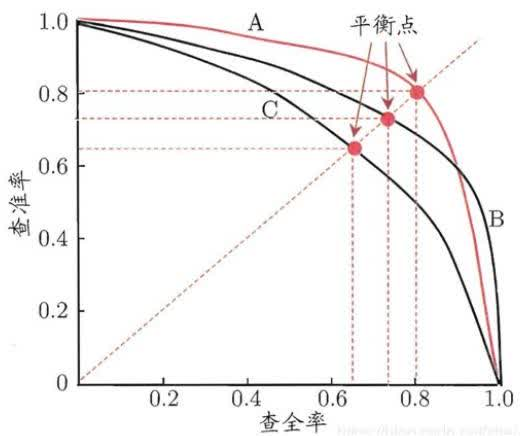

- 横轴为召回率（查全率），纵轴为精准率（查准率）。
- 引入**平衡点 (BEP)**：表示"查准率 = 查全率"时的取值，值越大表明分类器性能越好。

#### 4.2.4 F1-Score

$$
F_1 = 2 \cdot \frac{\text{Precision} \cdot \text{Recall}}{\text{Precision} + \text{Recall}} \quad \Longleftrightarrow \quad \frac{2}{F_1} = \frac{1}{P} + \frac{1}{R}
$$
**符号说明**：
- $F_1$：F1 分数，精确率和召回率的调和平均数，综合衡量模型分类能力。
- $\text{Precision} / P$：精确率（查准率），预测为正的样本中实际为正的比例。
- $\text{Recall} / R$：召回率（查全率），实际为正的样本中被正确预测为正的比例。

准确率和召回率的权衡：只有在召回率 Recall 和精准率 Precision 都高的情况下，F1 Score 才会很高，比 BEP 更为常用。

#### 4.2.5 ROC 和 AUC

**4.2.5.1 什么是 ROC 曲线？如何判断 ROC 曲线的好坏？**

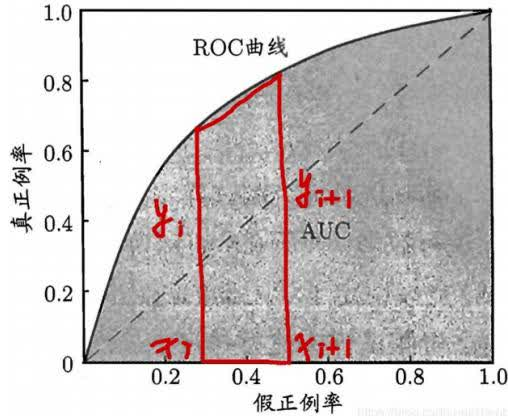

ROC 曲线：横轴为 **FPR**，纵轴为 **TPR**。

| 指标 | 含义 | 公式 |
|---|---|---|
| **TPR (True Positive Rate)** | 真正率 = 灵敏度 = 召回率 | $\frac{TP}{TP+FN}$ |
| **FPR (False Positive Rate)** | 假正率 = 1 - 特异度 | $\frac{FP}{FP+TN}$ |

- **FPR 的含义**：所有确实为"假"的样本中，被误判为真的样本比例。
- TPR 越高，同时 FPR 越低（即 ROC 曲线越陡），那么模型的性能就越好。

**4.2.5.2 什么是 AUC？**

$$
AUC = \frac{1}{2} \sum_{i=1}^{m-1} (x_{i+1} - x_i) \cdot (y_i + y_{i+1})
$$
**符号说明**：
- $AUC$：ROC 曲线下的面积 (Area Under Curve)。
- $m$：按预测概率排序后的类别阈值点总数。
- $x_i, x_{i+1}$：ROC 曲线在不同阈值时的横坐标 False Positive Rate (FPR)。
- $y_i, y_{i+1}$：ROC 曲线在不同阈值时的纵坐标 True Positive Rate (TPR)。
- 该公式运用梯形法则求面积积分。

**AUC**：ROC 曲线下的面积，取值范围在 $[0.5, 1]$ 之间。衡量二分类模型优劣的一种评价指标，表示**正例排在负例前面的概率**。

**4.2.5.3 如何解释 AUC-ROC 分数？**

AUC 值越高，预测准确率越高；AUC 如果小于 0.5，说明预测诊断比随机猜测还差，实际情况中通常不应出现，可能是状态变量标准设置有误，需要排查。

### 4.3 多标签分类怎么解决？

**问题转换**：
- **二元关联 (Binary Relevance)**：将多标签问题转化为多个独立的二分类问题。
- **分类器链 (Classifier Chains)**：建立分类器序列，后一个分类器利用前一个的预测结果。
- **标签 Powerset (Label Powerset)**：将标签组合视为单一分类问题。

**改编算法**：kNN 的多标签版本由 `MLkNN` 表示。

**集成方法**：`Scikit-Multilearn` 库提供不同的组合分类功能。


## 5. 正则化

**手推 L1、L2**：

模型权重 $w$ 可以看成一个随机变量，符合某种分布。根据**最大后验概率估计 (MAP)**：

$$
P(w|X,y) = \frac{P(y|X,w) \cdot P(w)}{P(X,y)} \quad \Rightarrow \quad \text{MAP} = \log P(y|X,w) + \log P(w)
$$
**符号说明**：
- $w$：模型需要学习的参数矩阵（如权重）。
- $X, y$：已知的观测数据特征和对应的真实标签。
- $P(w|X,y)$：参数 $w$ 的后验概率（即在观测到数据后该参数成立的概率）。
- $P(y|X,w)$：似然函数（在给定参数下，模型预测出真实标签的概率密度）。
- $P(w)$：参数 $w$ 的先验概率（如高斯分布、拉普拉斯分布假设）。
- $P(X,y)$：边缘概率（常数证据因子，求极值时通常被忽略）。
- $\text{MAP}$：最大后验估计 (Maximum a Posteriori)，将乘法转对数加法以优化。

- **假设 $w$ 符合高斯分布 (Gaussian)**：$\log P(w) = -\frac{1}{2\sigma^2}\sum_j w_j^2 + C$，等价于 **L2 正则化**（Ridge）。
- **假设 $w$ 符合拉普拉斯分布 (Laplace)**：$\log P(w) = -\lambda\sum_j |w_j| + C$，等价于 **L1 正则化**（Lasso）。


### 5.1 什么是正则化？如何理解正则化？

**定义**：在损失函数后加上一个**正则化项（惩罚项）**，也就是常说的结构风险最小化策略（损失 + 正则化）。一般模型越复杂，正则化值越大。

正则化项是用来对模型中某些参数进行约束，正则化的一般形式：

$$
\min \frac{1}{n} \sum_{i=1}^{n} L(y_i, f(x_i)) + \lambda J(f)
$$
**符号说明**：
- $\min$：求整体表达式的极小值。
- $n$：训练样本总量。
- $L(y_i, f(x_i))$：损失函数项（经验风险），衡量模型预测值 $f(x_i)$ 与真实值 $y_i$ 差距。
- $\lambda$：正则化超参数，控制模型拟合与复杂度的平衡。
- $J(f)$：惩罚函数项（结构风险），反映模型空间复杂度（参数大小等）。

第一项是损失函数（经验风险），第二项是正则化项 $\lambda J(f)$。加上惩罚项后，要使损失最小，参数就要尽可能小，从而使模型更加简单，防止过拟合。

### 5.2 L0、L1、L2 正则化？

- **L0 范数**：计算向量中非零元素的个数。L0 和 L1 的目的都是使参数稀疏化。
- **L1 范数**：比 L0 范数更容易优化求解。对应 **Lasso 回归**。
- **L2 范数**：各元素平方和的开方。对应 **Ridge 回归**。

### 5.3 L1 和 L2 正则化有什么区别？

| | **L1 正则** | **L2 正则** |
|---|---|---|
| **定义** | 向量中各元素绝对值之和 | 向量中各元素平方和的开方 |
| **贝叶斯先验** | 拉普拉斯分布 | 高斯分布 |
| **作用** | 产生稀疏权值矩阵（稀疏模型），可用于**特征选择** | **防止模型过拟合**，权重趋于平滑均匀 |
| **联系** | 都能够降低损失函数，防止模型过拟合 | （同左） |


### 5.4 L1 在 0 处不可导是怎么处理的？

1. **坐标轴下降法**：沿着坐标轴方向优化，即 Lasso 回归的损失函数不可导时采用此法。
2. **近端梯度下降 (Proximal Gradient Descent)**
3. **交替方向乘子法 (ADMM)**

### 5.5 L1 正则化产生稀疏性的原因？对稀疏矩阵的理解？

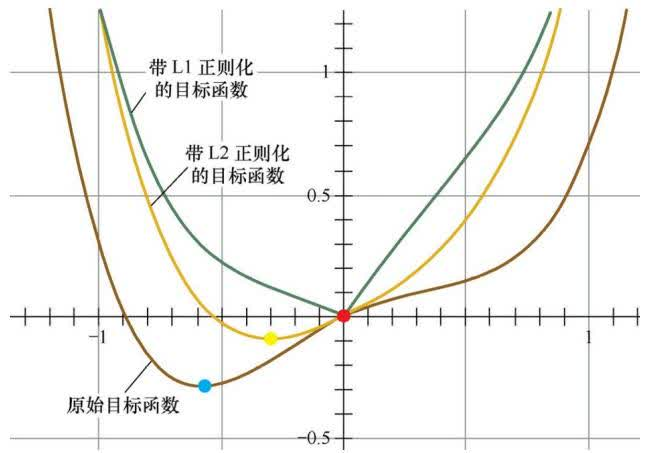

L1 正则化会使得许多参数的最优值变成 0，这样模型就稀疏了。

**稀疏矩阵**：有很多元素为 0，少数参数为非零值。只有少部分特征对模型有贡献，稀疏参数的引入使得一些特征对应的参数是 0，从而可以剔除无效特征，实现**特征选择**，提高模型的泛化能力，降低过拟合的可能。

### 5.6 为何要常对数据做归一化？

1. 归一化后加快梯度下降对最优解的收敛速度。
2. 归一化有可能提高精度。

### 5.7 归一化的种类

| 类型 | 描述 | 公式 |
|---|---|---|
| **线性归一化 (Min-Max)** | 利用 max 和 min 进行归一化。若 max 和 min 不稳定，常用经验值替代 | $x' = \frac{x - \min(x)}{\max(x) - \min(x)}$ |
| **标准差归一化 (Z-Score)** | 利用所有样本的均值和方差将样本归一化为标准正态分布 | $x' = \frac{x - \mu}{\sigma}$ |
| **非线性归一化** | 如指数、对数、三角函数等 | 视具体函数而定 |

### 5.8 归一化和标准化的区别

**标准化**：依照特征矩阵的**列**处理数据，通过求 z-score 的方法，将样本的特征值转换到同一量纲下。

**归一化**：依照特征矩阵的**行**处理数据，目的在于样本向量在点乘运算或其他核函数计算相似性时，拥有统一的标准，即都转化为"单位向量"。

- **归一化的目的**：方便比较，可以加快网络的收敛速度。
- **标准化的目的**：利用 z-score 方法将数据转化为符合特定分布的数据，方便进行下一步处理，不为比较。

### 5.9 需要归一化的算法有哪些？这些模型需要归一化的主要原因？

**需要归一化的典型算法**：线性回归、逻辑回归、KNN、SVM、神经网络。

**主要原因**：特征值相差很大时，运用梯度下降时损失等高线是椭圆形，需要多次迭代才能达到最优点。归一化后等高线接近圆形，促使 SGD 往原点迭代，迭代次数大幅减少。

### 5.10 树形结构不需要归一化的原因？

因为树模型不关心变量的值，而是关心变量分布和变量之间的条件概率。

树模型的构造通过寻找**最优分裂点**完成，样本点的数值缩放不影响分裂点的位置，对树模型的结构不造成影响。此外，树模型不能进行梯度下降（树模型是阶跃函数，不可导），因此也不需要归一化。

## 6. 特征工程

将原始数据转换为可以更好地表示问题的特征形式。特征工程分三步：
1. **数据预处理**
2. **特征选择**
3. **特征提取**

### 6.1 特征选择

通常特征选择的准则是**信息增益**或**信息增益率**。

**特征选择的划分依据**：如果这一特征将训练数据集分割成子集，使得各个子集在当前条件下有最好的分类，那么就应该选择这个特征。（将数据集划分为纯度更高、不确定性更小的子集的过程。）

#### 6.1.1 什么是特征选择？为什么需要它？特征选择的目标？

指从已有的 $M$ 个特征中选择 $N$ 个特征使得系统的特定指标最优化，是从原始特征中选择出一些最有效特征以降低数据集维度的过程。

**原因**：
1. 减少特征数量、降维，使模型泛化能力更强，减少过拟合。
2. 增强对特征和特征值之间的理解。

**目标**：选择离散程度高且与目标相关性强的特征。

#### 6.1.2 有哪些特征选择技术？

1. **过滤法**：按照发散性或者相关性对各个特征进行评分，设定阈值或者待选择阈值的个数，从而选择特征。
2. **包装法**：根据目标函数（通常是预测效果评分），每次选择若干特征或者排除若干特征，常用方法是**递归特征消除法**。
3. **嵌入法**：先使用 ML 的算法和模型进行训练，得到各个特征的权重系数，根据系数从大到小选择特征；常用方法主要是**基于惩罚项的特征选择法**。

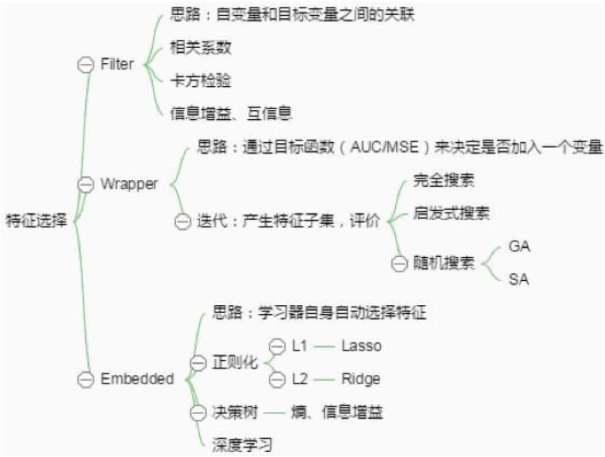

### 6.2 特征提取

常见的降维方法除了基于 L1 惩罚项的模型以外，另外还有 **PCA** 和 **LDA**，本质是要将原始的样本映射到维度更低的样本空间中：
- **PCA**：为了让映射后的样本具有最大的**发散性**。
- **LDA**：为了让映射后的样本有最好的**分类性能**。

### 6.3 特征选择 vs 特征提取

两者都是降维的方法。

| | 特征选择 | 特征提取 |
|---|---|---|
| **本质** | 不改变变量的含义，仅筛选留下对目标影响较大的变量 | 通过映射（变换）的方法，将高维特征向量变换为低维特征向量 |
| **代表算法** | 过滤法、包装法、嵌入法 | PCA、LDA、t-SNE、Autoencoder |

### 6.4 为什么要处理类别特征？怎么处理？

除了决策树等少量模型能直接处理字符串形式的输入，对于 LR、SVM 等模型来说，类别特征必须经过处理转化成数值特征才能正常工作。

**主要方法**：**序号编码 (Ordinal Encoding)**；**独热编码 (One-Hot Encoding)**；**二进制编码 (Binary Encoding)**。

#### 6.4.1 特征降维

当数据集的特征数量非常大时，特征降维可以帮助减少计算复杂度并避免过拟合。

| 方法 | 类型 | 描述 |
|---|---|---|
| **PCA**（主成分分析） | 无监督 | 通过线性变换将原始特征映射到新空间，使主成分尽可能保留数据的方差。 |
| **LDA**（线性判别分析） | 有监督 | 通过最大化类间距离与类内距离的比率来降维。 |
| **t-SNE** | 无监督 | 一种非线性降维技术，特别适合可视化高维数据。 |
| **自编码器 (Autoencoder)** | 无监督 | 一种神经网络模型，通过压缩编码器来实现数据的降维。 |

### 6.5 什么是组合特征？

为了提高复杂关系的拟合能力，在特征工程中经常会把一阶离散特征两两组合，构成高级特征。例如，特征 $a$ 有 $m$ 个取值，特征 $b$ 有 $n$ 个取值，将二者组合就有 $m \times n$ 个组合情况，需要学习的参数个数也是 $m \times n$ 个。

### 6.6 怎么有效地找到组合特征？

可以用**基于决策树的方法**：先根据样本的数据和特征构造出一棵决策树，然后从根节点到叶节点的每一条路径，都可以当作一种组合方式。

### 6.7 如何处理高维组合特征？

当每个特征都有千万级别，就无法学习 $m \times n$ 规模的参数了。

**解决方案**：将每个特征分别用 $k$ 维的低维向量表示，需要学习的参数变为 $m \times k + n \times k$ 个，等价于**矩阵分解**。

### 6.8 如何解决数据不平衡问题？

主要由数据分布不平衡造成，解决方法如下：

1. **采样**：对小样本加噪声采样，对大样本进行下采样。
2. **特殊加权**：如在 Adaboost 或 SVM 中对样本加权。
3. 采用**对不平衡数据集不敏感的算法**。
4. **改变评价标准**：用 AUC/ROC 而不是 Accuracy 来评价。
5. 采用 **Bagging/Boosting/Ensemble** 等方法。
6. 考虑数据的**先验分布**。

### 6.9 数据中有噪声如何处理？

**噪声检测常见方法**：
- **距离检测**：寻找数据集中与其他观测值及均值差距最大的点作为异常。
- **聚类方法检测**：将类似的取值组织成"群"或"簇"，落在"簇"集合之外的值被视为离群点。

**数据平滑方法**（在分箱技术中，需确定如何分箱以及如何对每个箱子中的数据进行平滑）：
- **按平均值平滑**：对同一箱值中的数据求平均值，用平均值替代该箱中所有数据。
- **按边界值平滑**：用距离较小的边界值替代箱中每一数据。
- **按中值平滑**：取箱子的中值，替代箱子中所有数据。

**分箱方法有 4 种**：等深分箱法、等宽分箱法、最小熵法、用户自定义区间法。

### 6.10 FM 因子分解机（Factorization Machine）

基于矩阵分解的机器学习算法，用于解决数据稀疏的业务场景（如推荐业务）中特征组合的问题。

**示例**：以广告点击率预测为例，根据用户与广告的特征，预测用户是否会点击广告。

| clicked | userId | userGender | itemTag |
|---|---|---|---|
| 1 | 1 | 男 | 篮球 |
| 0 | 1 | 男 | 化妆品 |
| 0 | 2 | 女 | 篮球 |
| 1 | 2 | 女 | 化妆品 |

对于 CTR 点击的分类预测中，分类变量一般进行 **One-Hot 编码**，但这会带来数据的**稀疏性**，使特征空间变大。

| clicked | userId | userGender_男 | userGender_女 | itemTag_篮球 | itemTag_化妆品 |
|---|---|---|---|---|---|
| 1 | 1 | 1 | 0 | 1 | 0 |
| 0 | 1 | 1 | 0 | 0 | 1 |
| 0 | 2 | 0 | 1 | 1 | 0 |
| 1 | 2 | 0 | 1 | 0 | 1 |

#### 6.10.1 SVM vs FM

1. **SVM** 的二元特征交叉参数是**独立的**，而 **FM** 的是两个 $k$ 维向量 $v_i, v_j$ 的内积，交叉参数**相互影响**。
2. FM 可以在原始形式下进行优化学习，而基于 Kernel 的非线性 SVM 通常需要在**对偶形式**下进行。
3. FM 的模型预测与训练样本独立，而 SVM 则与部分训练样本有关（即**支持向量**）。

### 6.11 FFM（Field-aware Factorization Machine）

在 FM 的基础上引入 **Field（类别）**的概念。将同一个 field 的特征单独进行 One-Hot，在 FFM 中，每一维特征都会针对其他特征的每个 field，分别学习一个隐变量。该隐变量不仅与特征相关，也与 field 相关。

FFM 中每一维特征都归属于一个特定的 field，field 和 feature 是一对多的关系：

| field | user field (U) | | | | | item field (I) | |
|---|---|---|---|---|---|---|---|
| clicked | userId | userGender_男 | userGender_女 | userAge_[20,30] | userAge_[30,40] | itemTag_篮球 | itemTag_化妆品 |
| 1 | 1 | 1 | 0 | 1 | 0 | 1 | 0 |
| 0 | 1 | 1 | 0 | 1 | 0 | 0 | 1 |
| 0 | 2 | 0 | 1 | 0 | 1 | 1 | 0 |
| 1 | 2 | 0 | 1 | 0 | 1 | 0 | 1 |

实现 FM & FFM 最流行的 Python 库有：`LibFM`、`LibFFM`、`xlearn` 和 `tffm`。

> **名词解释**：点击率 CTR = Click-Through Rate；转化率 CVR = Conversion Rate


## 7. 决策树

### 7.1 熵的定义与意义

在信息论与机器学习中，**熵（Entropy）** 是衡量“随机变量有多不确定”的核心指标，由克劳德·香农（Claude Shannon）于 1948 年提出，因此也常称为**香农熵**。  
可以把熵理解成“混乱程度”或“不确定性大小”：

- 熵越大，说明结果越难预测；
- 熵越小，说明结果越稳定、越容易判断。

#### 7.1.1 离散随机变量的熵

对于取值为 $\{x_1, x_2, \dots, x_n\}$ 的离散随机变量 $X$，如果其概率分布为 $p(x_i)=P(X=x_i)$，则熵定义为：

$$
H(X) = -\sum_{i=1}^{n} p(x_i)\log_b p(x_i)
$$

当问题退化为**二分类**时，如果其中一类的概率为 $p$，另一类的概率为 $1-p$，并且对数底取 2，那么熵函数可以写成：
$$
H(p) = -[p\log_2 p + (1-p)\log_2(1-p)]
$$

它的图像如下。可以看到：当 $p=0.5$ 时熵最大，表示最不确定；当 $p=0$ 或 $p=1$ 时熵为 0，表示完全确定。

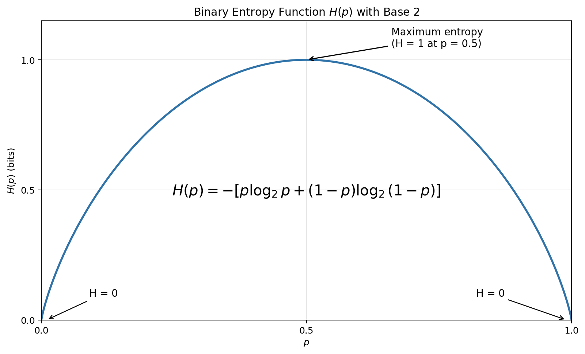

**符号说明**：

- $H(X)$：随机变量 $X$ 的信息熵。
- $X$：一个离散随机变量。
- $x_i$：随机变量 $X$ 的第 $i$ 个可能取值。
- $p(x_i)$：随机变量取值为 $x_i$ 的概率。
- $n$：随机变量可能取值的总数。
- $b$：对数的底数。机器学习里通常取 $b=2$，此时熵的单位是 bit。

**几个常见结论**：

- 当某一个结果的概率为 1 时，$H(X)=0$，表示系统完全确定；
- 当所有结果等概率出现时，熵最大，说明最不确定；
- 对离散随机变量而言，熵总是非负的，即 $H(X)\ge 0$；
- 约定 $0\log 0 = 0$，避免概率为 0 时公式失去意义。

#### 7.1.2 连续随机变量的熵（微分熵）

对于连续随机变量，熵的对应形式叫做**微分熵**：

$$
H(X) = -\int_{-\infty}^{+\infty} f(x)\log_b f(x)\,dx
$$

**符号说明**：

- $f(x)$：连续随机变量 $X$ 的概率密度函数。
- $\int dx$：对所有连续取值进行积分累加。

需要注意的是：**微分熵可以为负数**，它更强调连续分布之间的相对不确定性，因此和离散情形下的熵不能简单直接类比。

#### 7.1.3 熵的直观意义与机器学习中的作用

从直观上看，熵反映的是“结果有多乱”：

| 情况 | 说明 |
|---|---|
| $H(X)=0$ | 完全确定，没有不确定性 |
| $0 < H(X) < H_{\max}$ | 有一定不确定性 |
| $H(X)=H_{\max}$ | 最不确定，最混杂 |

在机器学习里，熵常被用来衡量一个数据集标签的**纯度**：

- 熵越低，说明样本越纯；
- 熵越高，说明不同类别混杂得越厉害。

因此，熵在机器学习中有几个非常重要的用途：

- **决策树特征选择**：信息增益 $IG = H(Y) - H(Y|X)$ 是 ID3 选择分裂特征的核心依据。
- **分类损失设计**：交叉熵由香农熵发展而来，是逻辑回归和神经网络分类任务的核心损失函数。
- **特征筛选**：互信息 $I(X;Y)=H(X)+H(Y)-H(X,Y)$ 可用于衡量特征与标签之间的关联程度。

> **本节小结**：熵是决策树、交叉熵、互信息等概念的基础。对于决策树来说，我们最关心的是：能否通过某个特征的划分，让数据集的熵显著下降。下一节的“信息增益”，就是对这种“熵下降了多少”的量化。
---

### 7.2 ID3 算法

ID3 是 Ross Quinlan 于 1986 年提出的经典决策树生成算法，以信息论为基础，采用**信息增益最大化**的贪心策略，自顶向下递归构建决策树，核心用于离散型属性的分类任务。

#### 7.2.1 信息增益的基础：经验熵与经验条件熵

ID3 的核心思想是：每一步都选择**能让数据集不确定性下降最多**的特征进行划分。  
因此在理解 ID3 之前，先要理解两个基础概念：**经验熵**和**经验条件熵**。

**1. 经验熵（Empirical Entropy）**

经验熵记作 $H(D)$，表示在**不看任何特征**时，当前数据集 $D$ 的类别分布有多混乱。  
如果一个数据集里样本类别越混杂，经验熵越大；如果样本几乎都属于同一类，经验熵越小。

其公式为：
$$
H(D) = -\sum_{k=1}^{K} p_k \log_2 p_k
$$

**符号说明**：

- $H(D)$：数据集 $D$ 的经验熵。
- $D$：当前节点上的训练数据集。
- $K$：类别总数。
- $p_k$：数据集 $D$ 中第 $k$ 类样本所占比例，通常写作 $p_k = \frac{|D_k|}{|D|}$。
- $D_k$：数据集 $D$ 中属于第 $k$ 类的样本集合。
- $|D|$、$|D_k|$：分别表示数据集 $D$ 和第 $k$ 类样本集合 $D_k$ 的样本数量。

**2. 经验条件熵（Empirical Conditional Entropy）**

经验条件熵记作 $H(D|A)$，表示按特征 $A$ 对数据集 $D$ 划分之后，各子集内部还剩下多少不确定性。  
它本质上是“划分后各子集熵的加权平均”。

其公式为：
$$
H(D|A) = \sum_{i=1}^{m} \frac{|D_i|}{|D|} H(D_i)
$$

**符号说明**：

- $H(D|A)$：已知特征 $A$ 后，数据集 $D$ 的经验条件熵。
- $A$：候选划分特征。
- $m$：特征 $A$ 的取值个数或分支数。
- $D_i$：按特征 $A$ 的第 $i$ 个取值划分后的第 $i$ 个子集。
- $\frac{|D_i|}{|D|}$：第 $i$ 个子集在整体数据集中的占比，也是加权系数。
- $H(D_i)$：子集 $D_i$ 的经验熵。
- $|D_i|$：子集 $D_i$ 的样本数量。

这里要注意：$K$ 表示**类别数**，而 $m$ 表示**特征 $A$ 划分出的分支数**，两者不是同一个概念。

**直观理解**：

- 经验熵 $H(D)$ 看的是“划分前整体有多乱”；
- 经验条件熵 $H(D|A)$ 看的是“按特征 $A$ 划分后还剩多少乱”；
- 如果一个特征划分后能让各子集明显更纯，那么它对应的经验条件熵就会更小。

#### 7.2.2 信息增益的定义与计算

ID3 用来选择特征的核心指标就是**信息增益（Information Gain）**。  
特征 $A$ 对训练数据集 $D$ 的信息增益，等于“划分前的不确定性”减去“划分后的剩余不确定性”：

$$
\text{Gain}(D, A) = H(D) - H(D|A)
$$

**符号说明**：

- $\text{Gain}(D, A)$：特征 $A$ 在数据集 $D$ 上带来的信息增益。
- $H(D)$：划分前数据集 $D$ 的不确定性。
- $H(D|A)$：按特征 $A$ 划分后的剩余不确定性。

把经验熵和经验条件熵代入后，可以写成：
$$
\text{Gain}(D, A) = H(D) - \sum_{i=1}^{m} \frac{|D_i|}{|D|} H(D_i)
$$

**符号说明**：

- $\sum_{i=1}^{m} \frac{|D_i|}{|D|} H(D_i)$：按特征 $A$ 划分后，各子集经验熵的加权平均，也就是经验条件熵 $H(D|A)$。
- 其余符号含义与上文保持一致。

**含义**：

- 如果 $\text{Gain}(D, A)$ 越大，说明特征 $A$ 让数据集变得越纯；
- 如果 $\text{Gain}(D, A)$ 越小，说明特征 $A$ 的区分能力越弱；
- ID3 在做特征选择时，会优先选择**信息增益最大**的特征。

#### 7.2.3 ID3 特征选择的计算流程

ID3 在每个节点上选择划分特征时，本质上是在做一件事：  
**比较所有候选特征的信息增益，选出信息增益最大的那个特征。**

一个完整的计算流程可以按下面 5 步理解：

**1. 先计算当前节点的经验熵**

对当前节点上的数据集 $D$ 计算：
$$
H(D) = -\sum_{k=1}^{K} p_k \log_2 p_k
$$

这一步是在衡量：如果暂时什么特征都不看，当前节点的数据到底有多混杂。

**2. 对每个候选特征分别进行划分**

假设当前有多个候选特征 $A_1, A_2, \dots, A_n$，就依次用每个特征去划分数据集。  
如果特征 $A$ 有 $m$ 个取值，就会得到：
$$
D_1, D_2, \dots, D_m
$$

也就是说，ID3 会先把每个候选特征都“试切一遍”。

**3. 计算该特征划分后的经验条件熵**

对某个特征 $A$，按它划分后的条件熵为：
$$
H(D|A) = \sum_{i=1}^{m} \frac{|D_i|}{|D|} H(D_i)
$$

这一步是在算：用特征 $A$ 划分之后，剩下的混乱程度还有多少。

**4. 计算该特征的信息增益**

然后利用：
$$
\text{Gain}(D, A) = H(D) - H(D|A)
$$

得到特征 $A$ 的信息增益。

如果某个特征划分后让条件熵显著下降，那么它的信息增益就会更大。

**5. 选信息增益最大的特征作为当前节点的划分特征**

把所有候选特征的信息增益都算出来后，选择最大的那个：
$$
A^* = \arg\max_A \text{Gain}(D, A)
$$

这就是 ID3 在当前节点的最终选择。

选出特征后，再把数据送到对应子节点，在每个子节点上重复相同流程，直到满足停止条件。

**构建步骤**：
1. 根节点：计算所有特征的信息增益，选增益最大的特征作为分裂特征。
2. **离散特征**：按特征不同取值生成多个子节点；**连续特征（二元切分）**：按"特征值 > 阈值"/"≤ 阈值"生成两个子节点。
3. 子节点递归重复，直到：a) 节点样本全属同一类；b) 无剩余特征；c) 信息增益低于阈值。
4. 最终叶节点标记为该节点样本的**多数类**。

**二元切分法（处理连续特征）**：

对连续特征 $A$，候选阈值为相邻值的中点：$\text{threshold}_i = \frac{v_i + v_{i+1}}{2}$，选增益最大的阈值作为切分点。

- **优势**：无需手动离散化，由数据自动选择最优切分点，每次切分仅生成 2 个子节点，计算量大幅减少。

#### 7.2.4 为什么信息增益偏向取值较多的特征（缺点）？

信息增益的一个典型缺点是：它容易偏向于选择**取值较多的特征**。

原因是：

- 当某个特征的取值很多时，它更容易把数据集切成很多很小的子集；
- 子集一旦很小，就更容易显得“纯”，从而使划分后的条件熵变小；
- 由于信息增益等于 $H(D) - H(D|A)$，当 $H(D|A)$ 变小时，信息增益就会变大。

例如，“学号”这类几乎每个样本都不同的特征，虽然在训练集上可能把数据切得非常纯，但它通常没有真正的泛化能力。  
这也是为什么后面 C4.5 会进一步引入**信息增益率**来修正这种偏差。

#### 7.2.5 ID3 算法计算示例

下面用一个简单的分类任务说明 ID3 如何根据**信息增益**选择根节点。目标是根据“是否刷题”和“是否近视”预测“是否通过面试”。

| 样本 | 是否刷题 | 是否近视 | 是否通过面试 |
|---|---|---|---|
| 1 | 是 | 是 | 是 |
| 2 | 是 | 否 | 是 |
| 3 | 是 | 是 | 是 |
| 4 | 是 | 否 | 是 |
| 5 | 是 | 是 | 否 |
| 6 | 否 | 否 | 否 |
| 7 | 否 | 是 | 否 |
| 8 | 否 | 否 | 否 |

数据集 $D$ 中共有 8 个样本，其中“通过面试”4 个，“未通过面试”4 个，因此总体熵为：
$$
H(D) = -\frac{4}{8}\log_2\frac{4}{8} - \frac{4}{8}\log_2\frac{4}{8} = 1
$$

先计算特征“是否刷题”的信息增益。按该特征划分后：

- $D_{\text{刷题=是}}$ 有 5 个样本，其中 4 个“通过”、1 个“未通过”；
- $D_{\text{刷题=否}}$ 有 3 个样本，全部“未通过”。

于是：
$$
H(D_{\text{刷题=是}}) = -\frac{4}{5}\log_2\frac{4}{5} - \frac{1}{5}\log_2\frac{1}{5} \approx 0.722
$$

$$
H(D_{\text{刷题=否}}) = 0
$$

$$
H(D|\text{是否刷题}) = \frac{5}{8}\times 0.722 + \frac{3}{8}\times 0 \approx 0.451
$$

$$
\text{Gain}(D, \text{是否刷题}) = 1 - 0.451 = 0.549
$$

再计算“是否近视”的信息增益。按该特征划分后：

- $D_{\text{近视=是}}$ 中有 2 个“通过”、2 个“未通过”；
- $D_{\text{近视=否}}$ 中也有 2 个“通过”、2 个“未通过”。

因此两个子集的熵都为 1：
$$
H(D|\text{是否近视}) = \frac{4}{8}\times 1 + \frac{4}{8}\times 1 = 1
$$

$$
\text{Gain}(D, \text{是否近视}) = 1 - 1 = 0
$$

比较两个特征的信息增益：

- $\text{Gain}(D, \text{是否刷题}) = 0.549$
- $\text{Gain}(D, \text{是否近视}) = 0$

因此，**ID3 会优先选择“是否刷题”作为根节点分裂特征**。这说明 ID3 的决策标准就是：每次选择能让数据集纯度提升最多的特征。

### 7.3 C4.5 算法

C4.5 在 ID3 基础上改进，用**信息增益率**选择特征，在树的构造过程中会进行剪枝操作优化，能够自动完成对连续属性的离散化处理。

#### 7.3.1 信息增益率的定义与计算

**为什么用信息增益率而不是信息增益？**

信息增益偏向于选择取值较多的特征（会产生很多分支，模型过拟合风险更大）。信息增益率通过对取值多的特征加上惩罚（以特征熵为分母），校正了这一偏差。

**核心公式（信息增益率, Gain Ratio）**：
$$
\text{GainRatio}(D, A) = \frac{\text{Gain}(D, A)}{\text{SplitInfo}(D, A)}
$$

其中分裂信息为：
$$
\text{SplitInfo}(D, A) = -\sum_{i=1}^{m} \frac{|D_i|}{|D|} \log_2 \frac{|D_i|}{|D|}
$$

**符号说明**：

- $\text{GainRatio}(D, A)$：特征 $A$ 在数据集 $D$ 上的信息增益率。
- $\text{Gain}(D, A)$：特征 $A$ 的信息增益，来自 ID3 的划分标准。
- $\text{SplitInfo}(D, A)$：特征 $A$ 把数据集切分得有多“碎”的度量，也叫分裂信息。
- $m$：特征 $A$ 的分支数或取值数。
- $D_i$：按特征 $A$ 的第 $i$ 个取值划分后的子集。
- $\frac{|D_i|}{|D|}$：第 $i$ 个子集占总体样本的比例。

直观上，信息增益率等于“信息收益 / 划分代价”，因此能缓解 ID3 偏好多值特征的问题。

#### 7.3.2 C4.5 特征选择的计算流程

C4.5 和 ID3 一样，也是在每个节点上比较候选特征，只不过它最终比较的不是信息增益，而是**信息增益率**。

一个完整的计算流程可以按下面 6 步理解：

**1. 先计算当前节点的经验熵**

对当前节点的数据集 $D$ 计算：
$$
H(D) = -\sum_{k=1}^{K} p_k \log_2 p_k
$$

这一步表示划分前数据集本身有多混杂。

**2. 对每个候选特征进行划分**

假设当前考察某个特征 $A$，按该特征划分后得到：
$$
D_1, D_2, \dots, D_m
$$

其中每个 $D_i$ 是一个子集。

**3. 计算该特征的信息增益**

先按 ID3 的方式算出信息增益：
$$
\text{Gain}(D, A) = H(D) - \sum_{i=1}^{m} \frac{|D_i|}{|D|} H(D_i)
$$

这一步表示：特征 $A$ 能让不确定性减少多少。

**4. 计算该特征的分裂信息**

然后再计算分裂信息：
$$
\text{SplitInfo}(D, A) = -\sum_{i=1}^{m} \frac{|D_i|}{|D|} \log_2 \frac{|D_i|}{|D|}
$$

这一步是在衡量：特征 $A$ 把数据切得有多“碎”。

**5. 计算信息增益率**

再将前两步结合起来，得到：
$$
\text{GainRatio}(D, A) = \frac{\text{Gain}(D, A)}{\text{SplitInfo}(D, A)}
$$

可以把它理解成：

- 分子：信息收益
- 分母：划分代价

因此它能对“取值特别多、只是在机械切碎数据”的特征进行惩罚。

**6. 在所有候选特征中选择增益率最大的特征**

最后比较所有候选特征的信息增益率，选择最大的那个：
$$
A^* = \arg\max_A \text{GainRatio}(D, A)
$$

这就是 C4.5 在当前节点上的最终划分选择。

#### 7.3.3 如何使用信息增益率？

在候选特征中**先筛选出信息增益高于平均水平**的特征，然后在这些特征中再选择**信息增益率最高**的特征。

#### 7.3.4 C4.5 相对 ID3 的改进

1. **连续特征离散化**：取相邻两样本值的平均值作为二元分类点，选信息增益最大的点作为切分阈值。
2. **采用信息增益率**：$\text{GainRatio}(A) = \frac{IG(A)}{H(A)}$，校正信息增益偏向多取值特征的问题。
3. **缺失值处理**：将数据分为有/无缺失两部分，分别加权计算信息增益比，缺失样本按各子节点比例分配权重。
4. **引入剪枝**：包括先剪枝（构造时停止）和后剪枝（构造完后遍历剪枝）。

#### 7.3.5 C4.5 算法计算示例

继续使用上一节的面试例子，但这次额外加入一个“学号”特征。由于每个样本的学号都不重复，这个特征正好可以说明为什么 C4.5 要用**信息增益率**而不是单纯的信息增益。

| 样本 | 是否刷题 | 学号 | 是否通过面试 |
|---|---|---|---|
| 1 | 是 | 001 | 是 |
| 2 | 是 | 002 | 是 |
| 3 | 是 | 003 | 是 |
| 4 | 是 | 004 | 是 |
| 5 | 是 | 005 | 否 |
| 6 | 否 | 006 | 否 |
| 7 | 否 | 007 | 否 |
| 8 | 否 | 008 | 否 |

对于“学号”这个特征，每个分支都只包含 1 个样本，因此每个子节点都完全纯净，条件熵为 0：
$$
H(D|\text{学号}) = 0
$$

于是它的信息增益达到最大：
$$
\text{Gain}(D, \text{学号}) = H(D) - H(D|\text{学号}) = 1 - 0 = 1
$$

如果只看信息增益，ID3 会误以为“学号”是最好的划分特征。但“学号”只是把样本切得很碎，并不具备泛化能力。

C4.5 会进一步计算**分裂信息**：
$$
\text{SplitInfo}(D, A) = -\sum_{i=1}^{m} \frac{|D_i|}{|D|}\log_2\frac{|D_i|}{|D|}
$$

对于“学号”，8 个分支的大小都为 $\frac{1}{8}$，所以：
$$
\text{SplitInfo}(D, \text{学号}) = -8 \times \frac{1}{8}\log_2\frac{1}{8} = 3
$$

于是其信息增益率为：
$$
\text{GainRatio}(D, \text{学号}) = \frac{1}{3} \approx 0.333
$$

再看“是否刷题”。上一节已经算出：
$$
\text{Gain}(D, \text{是否刷题}) = 0.549
$$

它的分裂信息为：
$$
\text{SplitInfo}(D, \text{是否刷题}) = -\frac{5}{8}\log_2\frac{5}{8} - \frac{3}{8}\log_2\frac{3}{8} \approx 0.954
$$

因此：
$$
\text{GainRatio}(D, \text{是否刷题}) = \frac{0.549}{0.954} \approx 0.575
$$

比较两个特征的信息增益率：

- $\text{GainRatio}(D, \text{是否刷题}) \approx 0.575$
- $\text{GainRatio}(D, \text{学号}) \approx 0.333$

因此，**C4.5 最终会选择“是否刷题”，而不会选择“学号”**。这正体现了 C4.5 的核心思想：对“取值很多、但只是机械切碎数据”的特征进行惩罚，避免像 ID3 那样偏好多值属性。

### 7.4 CART 算法 (Classification and Regression Trees)

**分类与回归树**——使用**二元切分法**处理连续型数值，生成严格的**二叉树**。

- **分类树**：使用**基尼指数 (Gini)** 作为分割标准，选 Gini 最小（纯度最高）的特征进行分割。
- **回归树**：使用**平方误差**作为分割标准。

**基尼指数 (Gini)**：表示在样本集合中一个随机选中的样本被分错的概率。
$$
\text{Gini}(p) = \sum_{k=1}^{K} p_k(1-p_k) = 1 - \sum_{k=1}^{K} p_k^2
$$

**符号说明**：

- $\text{Gini}(p)$：基尼指数（Gini Impurity），衡量样本集合的不纯度，值越小纯度越高。
- $K$：目标变量的类别总数。
- $p_k$：样本集合中属于第 $k$ 类的概率或占比。
- $(1-p_k)$：该类样本被错分到其他类的概率。

对某个候选切分点 $t$，CART 分类树比较的是切分后的加权基尼指数：
$$
\text{Gini}(D, t) = \frac{|D_{\text{left}}|}{|D|}\text{Gini}(D_{\text{left}}) + \frac{|D_{\text{right}}|}{|D|}\text{Gini}(D_{\text{right}})
$$

**符号说明**：

- $\text{Gini}(D, t)$：使用切分点 $t$ 对数据集 $D$ 进行二元划分后得到的加权基尼指数。
- $D$：当前节点上的训练数据集。
- $t$：连续特征的候选切分阈值。
- $D_{\text{left}}$、$D_{\text{right}}$：按照切分规则分到左子树和右子树的样本集合。
- $\frac{|D_{\text{left}}|}{|D|}$、$\frac{|D_{\text{right}}|}{|D|}$：左右子集在父节点中的样本占比，用作加权系数。
- $\text{Gini}(D_{\text{left}})$、$\text{Gini}(D_{\text{right}})$：左右子集各自的基尼指数。

如果是回归树，则常用平方误差最小化作为划分标准：
$$
\text{SSE}(D, t) = \sum_{x_i \in D_{\text{left}}}(y_i - c_{\text{left}})^2 + \sum_{x_i \in D_{\text{right}}}(y_i - c_{\text{right}})^2
$$

**符号说明**：

- $\text{SSE}(D, t)$：回归树在切分点 $t$ 下的平方误差和（Sum of Squared Errors）。
- $x_i$：第 $i$ 个样本的输入特征。
- $y_i$：第 $i$ 个样本的真实输出值。
- $D_{\text{left}}$、$D_{\text{right}}$：切分后得到的左右两个样本子集。
- $c_{\text{left}}$、$c_{\text{right}}$：左子区域和右子区域的预测值，通常取各区域目标值的均值。

Gini 指数越小，集合纯度越高；Gini 指数越大，集合越不纯。

**CART 算法由两步组成**：
1. **决策树生成**：基于训练数据集生成决策树，生成的决策树要尽量大。
2. **决策树剪枝**：用验证数据集对已生成的树进行剪枝，以**损失函数最小**为剪枝标准。

#### 7.4.1 CART 分类树的计算流程

在分类任务里，CART 使用基尼指数来决定“当前节点该怎么切分”。  
一个完整的计算流程通常可以按下面 6 步理解：

**1. 先计算当前节点的基尼指数**

先对当前节点的数据集 $D$ 计算：
$$
\text{Gini}(D) = 1 - \sum_{k=1}^{K} p_k^2
$$

这一步的作用有两个：

- 判断当前节点是否已经足够纯。如果 $\text{Gini}(D)=0$，说明样本已经全属于同一类，可以直接停止划分；
- 作为“划分前混杂程度”的参照，后面可以和不同切分后的结果进行对比。

**2. 枚举候选切分点**

如果当前特征是连续值，就通常取相邻样本值的中点作为候选切分点，例如：
$$
t_1,\ t_2,\ \dots,\ t_s
$$

每一个候选切分点 $t$ 都会把数据集分成左右两个子集：
$$
D_{\text{left}} = \{x \in D \mid x \le t\}, \qquad D_{\text{right}} = \{x \in D \mid x > t\}
$$

**3. 计算每个子集自己的基尼指数**

对每个候选切分点 $t$，都要分别计算：
$$
\text{Gini}(D_{\text{left}}), \qquad \text{Gini}(D_{\text{right}})
$$

这一步是在衡量：切分之后，左右两个子节点各自还“乱不乱”。

**4. 计算切分后的加权基尼指数**

然后把左右两个子集按样本占比加权，得到这个切分点对应的总体不纯度：
$$
\text{Gini}(D, t) = \frac{|D_{\text{left}}|}{|D|}\text{Gini}(D_{\text{left}}) + \frac{|D_{\text{right}}|}{|D|}\text{Gini}(D_{\text{right}})
$$

这个值越小，说明该切分点越好。

**5. 在所有候选切分点中选最优切分**

把所有候选切分点算一遍后，选择使加权基尼指数最小的切分点：
$$
t^* = \arg\min_t \text{Gini}(D, t)
$$

如果同时还要在多个特征之间比较，则可以写成：
$$
(A^*, t^*) = \arg\min_{A, t} \text{Gini}(D, A, t)
$$

也就是说：CART 每一步都选“切完以后最纯”的那个特征和切分点。

**6. 递归重复，直到满足停止条件**

选出最优切分后，把数据送到左右子节点，再在每个子节点上重复上面的过程，直到出现以下情况之一：

- 节点中的样本已经属于同一类；
- 节点样本数太少，不适合继续切分；
- 树深度达到限制；
- 继续划分带来的纯度提升很小。

**回归树怎么理解？**

如果是 CART 回归树，整体流程是一样的，只是把“基尼指数”替换成“平方误差和”：
$$
\text{SSE}(D, t) = \sum_{x_i \in D_{\text{left}}}(y_i - c_{\text{left}})^2 + \sum_{x_i \in D_{\text{right}}}(y_i - c_{\text{right}})^2
$$

然后选择使 $\text{SSE}(D, t)$ 最小的切分点即可。  
所以可以把它记成：

- **CART 分类树**：选使 $\text{Gini}(D,t)$ 最小的切分
- **CART 回归树**：选使 $\text{SSE}(D,t)$ 最小的切分

#### 7.4.2 CART 分类树计算示例

下面用一个简单的二分类例子说明 CART 如何利用**基尼指数**选择最优切分点。目标是根据“学习时长”预测“是否通过考试”。

| 样本 | 学习时长（小时） | 是否通过考试 |
|---|---|---|
| 1 | 1 | 否 |
| 2 | 2 | 否 |
| 3 | 3 | 是 |
| 4 | 4 | 是 |
| 5 | 5 | 是 |

在根节点处，数据集 $D$ 中“通过”3 个，“未通过”2 个，因此：
$$
\text{Gini}(D) = 1 - \left(\frac{3}{5}\right)^2 - \left(\frac{2}{5}\right)^2 = 0.48
$$

由于 CART 采用二元切分，候选阈值可以取相邻样本值的中点，例如 $2.5$、$3.5$、$4.5$ 等。下面比较其中两个切分点。

当切分点为 $t = 2.5$ 时：

- 左子集 $D_{\text{left}} = \{1, 2\}$，全部为“未通过”，所以 $\text{Gini}(D_{\text{left}})=0$；
- 右子集 $D_{\text{right}} = \{3, 4, 5\}$，全部为“通过”，所以 $\text{Gini}(D_{\text{right}})=0$。

加权后的基尼指数为：
$$
\text{Gini}(D, t=2.5) = \frac{2}{5}\times 0 + \frac{3}{5}\times 0 = 0
$$

当切分点为 $t = 3.5$ 时：

- 左子集 $D_{\text{left}} = \{1, 2, 3\}$ 中有 1 个“通过”、2 个“未通过”；
- 右子集 $D_{\text{right}} = \{4, 5\}$ 中全部为“通过”。

因此：
$$
\text{Gini}(D_{\text{left}}) = 1 - \left(\frac{1}{3}\right)^2 - \left(\frac{2}{3}\right)^2 = \frac{4}{9}
$$

$$
\text{Gini}(D_{\text{right}}) = 0
$$

$$
\text{Gini}(D, t=3.5) = \frac{3}{5}\times \frac{4}{9} + \frac{2}{5}\times 0 = \frac{4}{15} \approx 0.267
$$

比较两个切分点：

- $\text{Gini}(D, t=2.5) = 0$
- $\text{Gini}(D, t=3.5) \approx 0.267$

因此，**CART 会选择切分点 $t=2.5$，得到规则“学习时长 $\leq 2.5$ 吗？”作为当前节点的最优二叉划分**。如果是回归树，则把分类树中的基尼指数替换成切分后的**平方误差和**即可，思路完全类似。

#### 7.4.3 为什么 CART 使用基尼指数而非信息熵？

信息熵需要计算对数，计算量大；

基尼指数直接针对二分类计算，运算更简单。由于 CART 树是严格的二叉树（每次 yes/no 划分），使用基尼指数更匹配其结构，计算效率更高。

#### 7.4.4 基尼系数存在的问题
- 偏向于多值属性。
- 当类数较大时，求解比较困难。
- 倾向于支持在两个分区中生成大小相同的测试。

### 7.5 ID3 vs C4.5 vs CART

| 对比项 | ID3 | C4.5 | CART |
|---|---|---|---|
| **分叉情况** | 多叉树 | 多叉树 | **二叉树** |
| **应用类型** | 分类树 | 分类树 | 分类树 + 回归树 |
| **特征选择方式** | 信息增益 | 信息增益率 | 分类：Gini；回归：平方误差 |
| **特征复用** | 不复用 | 离散不复用，连续复用 | 复用 |
| **优点** | 简单直观 | 产生规则易于理解；准确率较高；实现简单 | 适用范围广（分类+回归） |
| **缺点** | ①不能直接处理连续数据；②信息增益偏向多取值特征；③缺失值处理差；④无剪枝易过拟合 | ①多次扫描数据效率低；②只适合小规模数据集 | 计算量相对较大 |


### 7.6 决策树总结

**定义**：决策树就是一棵树，其中根节点和内部节点是输入特征的判定条件，叶子节点就是最终结果。

- **损失函数**：通常是正则化的极大似然函数。
- **目标**：以损失函数为目标函数的最小化。
- **算法**：递归地选择最优特征，并根据该特征对训练数据进行分割，使得对各个子数据集有最好的分类。
- **量化纯度的指标**：Gini 指数、熵、错误率

#### 7.6.1 决策树的数据 split 原理或流程？

1. 将所有样本看做一个节点。
2. 根据纯度量化指标，计算每一个特征的"纯度"，根据最不纯的特征进行数据划分。
3. 重复上述步骤，直到每一个叶子节点都足够"纯"或者达到停止条件。

**记忆要点**：按照基尼指数、信息增益来选择特征，保证划分后纯度尽可能高。

#### 7.6.2 构造决策树的步骤？

1. **特征选择**
2. **决策树的生成**（包含预剪枝）—— 只考虑局部最优
3. **决策树的剪枝**（后剪枝）—— 只考虑全局最优

#### 7.6.3 决策树算法中如何避免过拟合和欠拟合？

- **过拟合**：选择能够反映业务逻辑的训练集；**剪枝操作**（前置剪枝和后置剪枝）；K 折交叉验证。
- **欠拟合**：增加树的深度；使用随机森林 (Random Forest)。

#### 7.6.4 决策树怎么剪枝？

剪枝（Pruning）是决策树防止过拟合、控制**模型复杂度**的核心手段。主要分为**预剪枝（Pre-Pruning）**和**后剪枝（Post-Pruning）**两大类策略，其中后剪枝在实际应用中（如 CART）更为常用且效果更好。

**剪枝的根本原因（过拟合风险）**：
当决策树任其自然生长时，可能会导致每个叶子节点最终只包含一个训练样本。此时虽然训练误差（如 RSS）降为 0，但这棵树极其庞大，彻底失去了对新数据的泛化预测能力。由于叶子节点的数量 $|T|$ 直接反映了模型的物理复杂度，我们需要引入正则化来合理控制它。

**1. 预剪枝（建树过程中提前停止，限制生长）**  
在决策树构建过程中，对每个节点在划分前进行评估，若当前节点的划分不能带来泛化性能提升（或触发了预设阈值限制），则提前停止划分并将该节点标记为叶节点。

- **常见控制参数（如在 sklearn 中）**：`max_depth`（最大深度）、`min_samples_split`（继续划分最小样本）、`min_samples_leaf`（叶子最小样本）。
- **缺点**：思路虽然简单且能减少训练计算量，但容易导致**欠拟合（视野短视）**，因此不如后剪枝常用。

**2. 后剪枝（建树完成后自底向上修剪）**  
先从训练集中生成一棵任其生长、深度极大的完整决策树，然后自底向上地对内部节点进行考察，计算将该子树整体替换为一个叶节点后模型的表现。若是，则执行剪枝操作。
- **带正则化惩罚的代价复杂度剪枝（如 CART）**：
  引入结构风险评估，在损失函数（如 RSS）中显式地加入关于叶子节点数量 $|T|$ 的惩罚项。完整的正则化代价函数公式为：
  $$
  C_\alpha(T) = \sum_{m=1}^{|T|} \sum_{x_i \in R_m} (y_i - \bar{y}_{R_m})^2 + \alpha |T|
  $$
  这里的 $\alpha$ 是正则化系数（代价复杂度参数），也就是“每多保留一个叶子节点所要付出（或抵消）的误差代价”：
  - $\alpha$ 越大，惩罚越重，模型被剪得越厉害、留下的树越简单。
  - $\alpha = 0$ 时退化为不剪枝的原始复杂树。
- **剪枝后的子树序列与寻找最优 $\alpha$**：
  算法会利用动态规划高效率地由下至上计算，避免重复运算，并依次剪去那些即使丢掉增加的误差也极为轻微的薄弱分支，从而生成一系列由复杂到简单的子树序列集合 $\{T_0, T_1, \dots, T_\alpha\}$。最后通常利用**交叉验证（Cross Validation）**在此序列中选择出能使验证集误差最小、完美平衡偏差与方差的最佳 $\alpha$ 与对应子树 $T_\alpha$。

#### 7.6.5 决策树的优缺点？

**优点**：
1. 模型可读性好，具有描述性，有助于人工分析。
2. 效率高，决策树只需一次性构建，反复使用，每次预测的最大计算次数不超过决策树的深度。

**缺点**：
1. 即使做了预剪枝，也经常会过拟合，泛化性能差。
2. 对中间值的缺失敏感。
3. ID3 算法计算信息增益时偏向数值较多的特征。

#### 7.6.6 决策树和条件概率分布的关系？

决策树可以表示成给定条件下类的条件概率分布。决策树中的每一条路径都对应划分的一个条件概率分布，每一个叶子节点是通过多个条件之后的划分空间，在叶子节点中计算每个类的条件概率，必然会倾向于某一个类（该类概率最大）。

#### 7.6.7 为什么使用贪心启发式搜索建立决策树，而不是暴力搜索建立最优决策树？

因为从所有可能的决策树中直接寻找一棵绝对最优的决策树是一个 **NP 完全问题 (NP-Complete Problem)**。

> **什么是 NP 完全问题？**
> 在计算机科学与计算复杂性理论中，**P 问题**是指能在“多项式时间（如 $O(n^2), O(n^3)$ 等可接受的计算时间）”内算得出答案的问题；**NP 问题**是指不能保证快速算出答案、但如果别人给你一个猜测答案，你能“在多项式时间内验证它对不对”的问题。
> 而 **NP 完全 (NP-C) 问题**是 NP 问题中最难的扛把子：目前全人类都找不到任何能在多项式时间内**求出**完美绝对最优解的算法。若想暴力破解求解，其所需的时间会随着题目规模的扩大呈指数级甚至阶乘级（如 $O(2^n)$ 或 $O(n!)$）爆炸式增长。（著名的“旅行商问题 TSP”就是一例）。

**在决策树中的具体体现**：
假设我们有 $N$ 个特征，每个特征还有无数个切分点。如果我们想构建一棵“对当前训练集分类误差绝对最小、且树结构绝对最精简”的最优决策树，我们必须穷举遍历全宇宙中所有可能的特征先后排列组合和所有的树图结构。这种分支的组合数量随着 $N$ 的增加是天文数字，即便是超级计算机也无法在地球毁灭前暴力算完。

**降维打击的解决方案（启发式贪心算法）**：
既然“全局绝对最优解”求不出来，我们就退而求其次寻找“局部相对最优解”。这正是 ID3、C4.5 和 CART 算法的核心逻辑——**启发式贪心策略 (Greedy Heuristic Strategy)**。
即：每次在一个节点面临分裂时，算法只当“短视眼”，只挑出**能在当前这一步**使得数据集纯度提升最大（信息增益最高 / 误差下降最多）的特征进行切分，不管这一步切分会不会对后续分支造成次优影响，且切完就不再回头重新调整。这种贪心方法极其高效，能在非常短的时间内迅速生成一棵“表现足够好”的实用决策树。

#### 7.6.8 如果特征很多，决策树最后没有用到的特征一定是无用的吗？

不是无用的，从两个角度考虑：
1. **特征替代性**：如果已使用的特征 A 和 B 可以替代特征 C，特征 C 可能没被使用，但单独拿出来训练依然有效。
2. **路径条件包含**：决策树的每一条路径是计算条件概率的条件，前面的条件如果包含了后面的条件，只是这个条件在这棵树中是无用的，但单独拿出来也可以帮助分析数据。

#### 7.6.9 决策树怎么做回归？

决策树不仅能做分类（预测离散标签），也能做回归（预测连续数值），最典型的代表就是 **CART 回归树**。其核心特征在于利用**递归二分法**将输入特征空间不断切分成互不重叠的小区域。回归树的构建基本步骤和底层运作机制如下：

**1. 空间划分与预测值计算**
- **空间划分**：将整个高维多特征空间 $X$ 切分成 $J$ 个互不重叠的矩形区域 $R_1, R_2, \dots, R_J$，每个区域最终对应一个预测回归结果。
- **预测值计算**：当一个新的样本点落入第 $j$ 个区域 $R_j$ 时，该区域的回归预测值 $\hat{y}_{R_j}$ 为**该区域内所有训练数据真实 $y$ 值的算术均值**。
  $$
  \hat{y}_{R_j} = \frac{1}{n_j}\sum_{x_i \in R_j} y_i \quad \text{（其中 } n_j \text{ 是区域 } R_j \text{ 内的样本数）}
  $$

**2. 切分点选择与优化目标（贪婪式的递归二分法）**
回归树不依靠追求纯度的“信息增益”，而是将寻找**残差平方和（RSS）最小化**作为寻找切分阈值的唯一标准。其总的 RSS 优化目标定义为寻找使下列公式整体最小的划分：
$$
RSS = \sum_{j=1}^J \sum_{x_i \in R_j} (y_i - \bar{y}_{R_j})^2
$$
然而遍历全量划分是不可能完成的 NP-C 问题，所以算法使用了极其巧妙且高效率的**自顶向下贪婪式递归二分法**：
- **纵横向划分限制**：每一次切分都只能垂直于坐标轴（即只选定一个单一特征列进行大于/小于切分），绝不进行多特征斜向切分。
- **划分标准**：遍历所有可用特征 $x_j$ 的所有可能切分点 $s$，尝试将当前空间“一刀切”劈成两半：
  $$
  R_1(j, s) = \{x \mid x_j < s\} \quad , \quad R_2(j, s) = \{x \mid x_j \ge s\}
  $$
- **计算 RSS 增量（只计变化区域）**：
  分别计算这两拨新划分子集 $R_1$ 和 $R_2$ 的独立残差平方和。为了优化计算效率，每次划分底层算法只计算当前受劈裂影响区域的 RSS 变化，而非每次都重新求全盘：
  $$
  RSS_{split} = \sum_{x_i \in R_1(j,s)} (y_i - \hat{y}_{R_1})^2 + \sum_{x_i \in R_2(j,s)} (y_i - \hat{y}_{R_2})^2
  $$
- **绝不回头（贪心性质）**：作为一种纯粹的贪婪算法，回归树每一次都只挑出能让当下这一步分支的 $RSS_{split}$ 降到最低的特征列 $j$ 和切分点 $s$ 作为“当前最优刀”。只要这一刀切完，它便绝不会再反悔返回去重试其它早期被淘汰的切分。

#### 7.6.10 决策树算法的停止条件？

决策树的分裂停止条件可以主要分为两大类：**自然终止条件**（算法在逻辑上已无法继续或纯度已满）和**人工干预条件**（即带有剪枝目的的工程控制）。

**一、自然终止条件（三种核心情况）**：
1. **条件一（样本同类别）**：当前节点包含的样本全属于同一类别，纯度达到最高时无需再划分。（例如：该节点落入了 100个样本，标签全是一水儿的“建议看韩剧”，直接打上该标签即可成为叶子节点）。
2. **条件二（属性耗尽 / 样本特征全同）**：当前可用的分裂属性集为空（所有特征都已经被用过且按规则不可重复使用），或者剩余的所有样本在各个属性上的取值完全相同（例如所有特征维度条件一模一样，但由于现实噪声，这群人确实有一半得了病一半没得病）。此时由于无法再找出一个物理特征来进行切割，只能强行停止，取此时集合中**数量最多**的类别作为该叶子节点的最终分类。
3. **条件三（样本为空）**：某个属性的分支一路走下来，发现当前节点包含的样本集合干脆为空了（例如在训练集记录里，压根不存在“打雷+下雪+气温零下 20 度”还能出门打高尔夫的那一行数据）。碰到空节点时绝不能抛弃不管，必须生造一个叶子节点，并取其**父节点中数量最多的类别**作为自己的命运继承类别。

**二、人工干预条件（即预剪枝设置，为防过拟合）**：
1. **最小节点样本数触发**：当某节点里的数据量小于指定底线数量时，强制不继续分裂数据，防止因为极个别极端异常样本画出一条分支导致严酷过拟合。
2. **信息增益/基尼下降小于极限阈值**：哪怕分裂这刀能带来稍微一丁点纯度提升，但这提升实在太小（低出设定的 $\epsilon$ 阈值），算法觉得不划算，也会主动停止分裂。
3. **决策树深度达到指定上限**：到了预设的 `max_depth` 也就是树最高生长的控制层，底层强行全员变为叶子节点终止生长。

#### 7.6.11 为什么决策树之前用 PCA 会好一点？

决策树的本质在于选取特征进行分支。PCA 解除了特征之间的耦合性，并且按照贡献度给特征排了个序，这样更加方便决策树选取特征。

### 7.7 Hard Voting vs Soft Voting

在集成学习（如随机森林，或通过 `VotingClassifier` 强行绑定多个异构模型）执行**分类任务**时，如何综合并裁决各大基学习器的意见是一个核心步骤。最主流的两种策略就是 Hard Voting（硬投票）和 Soft Voting（软投票）。

- **Hard Voting（硬投票 - 少数服从多数）**：
  这是一种极其保守、直观的“一刀切”式民主策略。每个基模型只能交出自己最终拍板的分类标签。集成系统无脑统计所有具体类别的绝对票数，得票最多的标签自动胜出。

  **硬投票数学公式**：
  假设我们共有 $T$ 个基分类器，第 $i$ 个分类器对输入样本 $x$ 给出的预测类别为 $h_i(x) \in \{c_1, c_2, \dots, c_k\}$。则硬投票最终确定的预测类别 $H(x)$ 为该类目下所有分类器的指示和的最大值：
  $$
  H(x) = \arg\max_{c_j} \sum_{i=1}^T \mathbb{I}(h_i(x) = c_j)
  $$
  **符号说明**：
  - $H(x)$：集成系统对输入样本 $x$ 的最终预测分类。
  - $T$：参与投票的基分类器总个数（即评审团人数）。
  - $c_j$：所有可能的分类预测目标类别之一。
  - $h_i(x)$：第 $i$ 个基分类器独立对样本 $x$ 给出的“硬性”类别判定。
  - $\mathbb{I}(\cdot)$：**指示函数**（Indicator function）。当括号里的条件判定为真时（即预测类别对了），计算值为 1，否则为 0。公式上的 $\sum \mathbb{I}$ 本质上就是一台在给类别 $c_j$ 计票的唱票机。
  - $\arg\max_{c_j}$：遍历所有备选类别 $c_j$，并最终返回那个使得累加票数达到最大值的冠军类别名。

  - *局限性*：它根本不关心各个模型判断时的底气或确信度，哪怕某个模型有 100% 的不可辩驳的把握，也会被另外两个只有 51% 小微胜算的模型用人海战术淹没。

- **Soft Voting（软投票 - 加权概率平均）**：
  软投票不再看死板的硬标签，而是要求每个基模型交出它对各个类别的**置信度预测概率**。集成系统会将所有模型提供的概率列表直接进行**算术平均**，最终选择平均概率封顶的那个类作为输出。

  **软投票数学公式**：
  假设第 $i$ 个分类器认为样本 $x$ 属于类别 $c_j$ 的预测概率为 $P(y=c_j \mid x, h_i)$。则软投票的最终预测类别 $H(x)$ 为所有模型产生的概率均值的最高项：
  $$
  H(x) = \arg\max_{c_j} \frac{1}{T} \sum_{i=1}^T P(y=c_j \mid x, h_i)
  $$
  **符号说明**：
  - $H(x)$：集成系统最后拍板的分类预测。
  - $T$：基分类器的总个数。
  - $P(y=c_j \mid x, h_i)$：第 $i$ 个基分类器 $h_i$ 认为样本 $x$ 属于类别 $c_j$ 的**置信度概率值**（介于 0 到 1 之间）。
  - $\frac{1}{T}\sum$：将所有模型对特定类别 $c_j$ 押注的概率汇总，并除以总模型数 $T$ 求其算术平均阈值。
  - $\arg\max_{c_j}$：选出所有类别中“平均胜算概率”冲到最高的那个天命类别。

  - *优势*：这种方法赋予了高度自信的模型拥有“一票定音”或实质上更大的发言权（例如，一个预测概率为 0.99 的神仙模型，可以通过平均直接将另外几个概率停留在 0.4 徘徊的模型拉爆）。因为保留了完整的概率宽度信息，避免了信息粗暴流失，**软投票在绝大多数场景下的综合泛化表现都优于硬投票**。

**💡 计算对比示例：为什么软投票更好？**
假设我们有一个二分类任务（预测目标是“猫”或“狗”），并且集成了 3 个基分类器。对于某个极其迷惑的样本 $X$，三个模型的预测情况如下：
- **模型 A**：极其确信它是狗（预测概率：猫 1%，狗 **99%**） $\rightarrow$ 硬标签结论：**狗**
- **模型 B**：非常犹豫，勉强觉得是猫（预测概率：猫 **51%**，狗 49%） $\rightarrow$ 硬标签结论：**猫**
- **模型 C**：非常犹豫，同样勉强觉得是猫（预测概率：猫 **52%**，狗 48%） $\rightarrow$ 硬标签结论：**猫**

**如果在该场景下使用 Hard Voting（硬投票）**：
- 计票统筹：猫得到 2 票（模型 B、C），狗得到 1 票（模型 A）。
- 最终预测结果：2 > 1，少数服从多数，判定该样本为 **猫**。
- *毒点暴漏*：模型 A 极其确凿无误的 99% 诊断，被另外两个“刚刚过 50% 及格线”的庸医模型用人海一致战术给彻底淹没了。

**如果改用 Soft Voting（软投票）**：
- 算术平均猫的系统总爆发概率：$(1\% + 51\% + 52\%) \div 3 = 104\% \div 3 \approx \color{red}{\textbf{34.67\%}}$
- 算术平均狗的系统总爆发概率：$(99\% + 49\% + 48\%) \div 3 = 196\% \div 3 \approx \color{green}{\textbf{65.33\%}}$
- 最终预测结果：选择平均面最高的一方（65.33% > 34.67%），力挽狂澜判定该样本为 **狗**。
- *完美防反*：软投票依靠置信概率，精准量化了模型 A 那 99% 的绝对主导权，拯救了这起误判。

**两者对比总结**：

| 特征维度 | **Hard Voting (硬投票)** | **Soft Voting (软投票)** |
|---|---|---|
| **核心思想** | 统计模型输出的**最终标签预测数**，得票数最高者胜 | 计较各模型输出的**类别预测概率均值**，均值最高者胜 |
| **sklearn 参数** | `voting='hard'` | `voting='soft'` |
| **对基模型的要求** | 最低限制，任何能输出分类结果的模型均可（调用 `predict`） | 必须且只能组合原生支持计算概率的分类器（调用 `predict_proba`） |
| **代码注意事项** | 各套件分类器的默认使用方式 | 对于 SVM 这种基于几何边界不直接产出真实概率的模型，必须显式开启 `probability=True` 让其内部做二次拟合才能被软投票兼容调用 |

```python
from sklearn import datasets
from sklearn.model_selection import train_test_split
from sklearn.ensemble import VotingClassifier
from sklearn.linear_model import LogisticRegression
from sklearn.svm import SVC
from sklearn.tree import DecisionTreeClassifier

X, y = datasets.make_moons(n_samples=500, noise=0.3, random_state=42)
X_train, X_test, y_train, y_test = train_test_split(X, y, random_state=42)

voting_clf = VotingClassifier(
    estimators=[
        ('log_clf', LogisticRegression()),
        ('svc_clf', SVC(probability=False)),
        ('dt_clf', DecisionTreeClassifier(random_state=666))
    ],
    voting='hard'
)
voting_clf.fit(X_train, y_train)
voting_clf.score(X_test, y_test)
```


## 8. KNN（K 近邻算法）

**k 近邻（k-Nearest Neighbors，kNN）**：
- 既是分类算法，也可用于回归任务。
- 是一种基本的分类与回归方法，属于**监督学习**算法。
- 核心思想：**"物以类聚"**，即相似样本在特征空间中聚集。

对于一个新样本，找到训练集中离它最近的 $K$ 个样本，再用这 $K$ 个邻居的结果来决定它的输出。

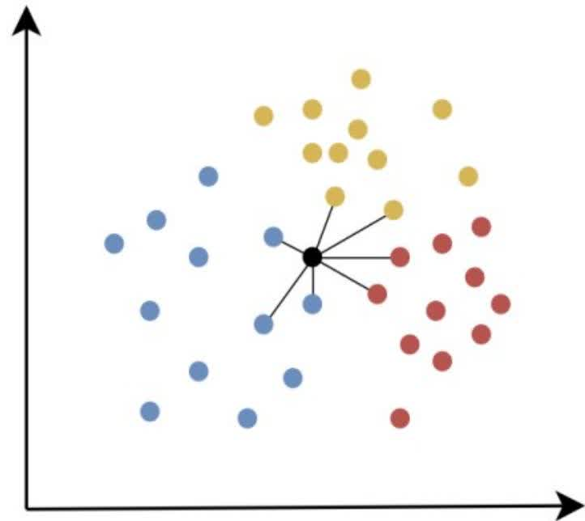

### 8.1 分类流程

1. 选择 $K$ 值
2. 计算新样本和所有训练样本的距离
3. 选出最近的 $K$ 个邻居
4. 统计这 $K$ 个邻居中哪个类别最多
5. 把新样本归到该类别

> **新样本**：就是"你现在要预测的那个数据"，也叫"待分类样本"。
> **所有训练样本**：就是"以前已经有答案的历史数据"，也叫"训练集里的样本"。

### 8.2 常见距离度量

| 距离类型 | 公式 | 描述 |
|---|---|---|
| **欧氏距离 (Euclidean)** | $d(x,y) = \sqrt{\sum_{i=1}^{n}(x_i - y_i)^2}$ | 连接两点的线段长度，最常用 |
| **曼哈顿距离 (Manhattan)** | $d(x,y) = \sum_{i=1}^{n}|x_i - y_i|$ | 沿坐标轴行进的总距离，又称出租车距离 |
| **切比雪夫距离 (Chebyshev)** | $d(x,y) = \max(|x_i - y_i|)$ | 各坐标数值差的最大值 |
| **闵可夫斯基距离 (Minkowski)** | $d(x,y) = \left(\sum_{i=1}^{n}|x_i - y_i|^p
ight)^{1/p}$ | 欧氏 ($p=2$) 和曼哈顿 ($p=1$) 的推广 |

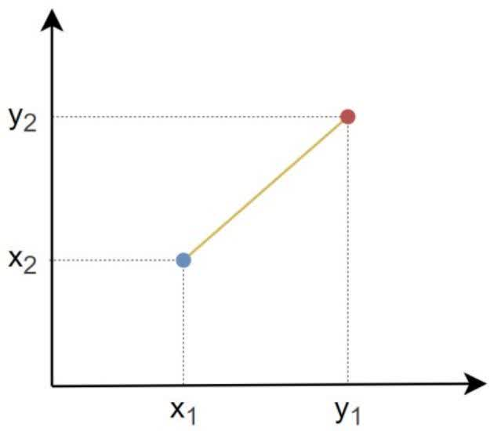

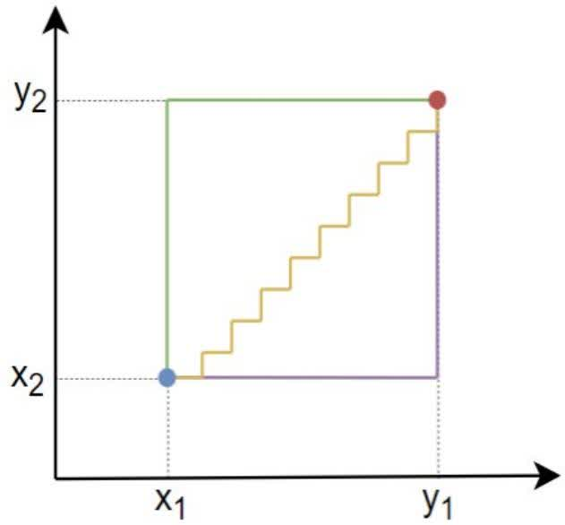

> 曼哈顿距离得名于纽约曼哈顿的网格街道布局——车辆只能沿水平和垂直方向行驶，两点间的实际行驶距离等于沿街道的总路程，而非直线距离。

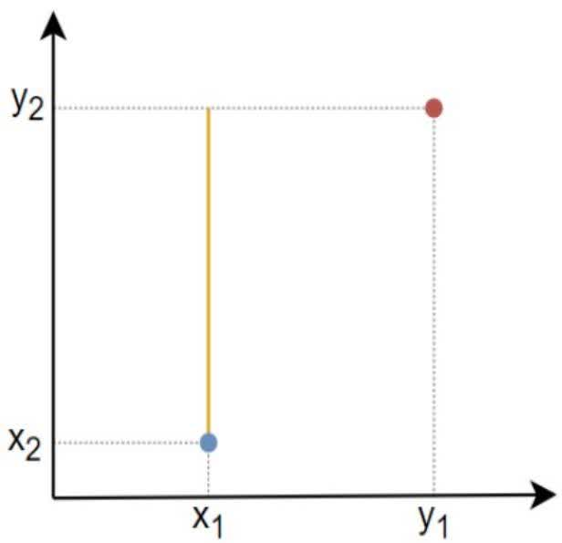

> 在国际象棋中，国王从起点到终点的最少步数就等于两点之间的切比雪夫距离。

### 8.3 K 值选择

- **K 过小**：易受噪声干扰（**过拟合**）。
- **K 过大**：会忽略局部特征（**欠拟合**）。
- 通常通过**交叉验证**选择最佳 K 值（一般 3～10）。

### 8.4 应用场景

- **分类**：统计 $K$ 个近邻各类别的数量，将待分类样本归为数量最多的类别。
- **回归**：取 $K$ 个近邻的平均值作为预测结果（如房价预测，需特征维度适中）。

### 8.5 在 kNN 的样本搜索中，如何进行高效的匹配查找？

在 kNN 的样本搜索里，高效匹配的核心是：**尽量少比较样本**。

1. **线性扫描**：最直接的方法，把查询样本和所有训练样本都算一遍距离，再选最近的 $k$ 个。
   - 优点：简单，结果精确。
   - 缺点：数据量大时很慢，时间复杂度 $O(n)$。

2. **构建空间索引（减少比较次数）**：
   - **非重叠划分**（代表：**k-d Tree**）：把空间切成互不重叠的区域，查询时先走最可能的区域，再根据当前最近距离剪枝。
   - **重叠划分**（代表：**R-Tree**）：用一组会重叠的包围区域组织数据，优先访问离查询点更近的包围区域，并剪掉明显不可能包含最近邻的分支。

3. **近似最近邻搜索（ANN）**：当数据维度高、样本很多时，k-d Tree、R-Tree 往往效率下降，更常用近似方法：**HNSW**、**LSH**、**IVF**、**PQ**。不保证绝对最优最近邻，但速度通常快很多，现代向量检索系统中很常见。

**总结**：

| 场景 | 推荐方法 |
|---|---|
| 小数据 | 线性扫描 |
| 低维空间 | k-d Tree |
| 空间对象 / GIS | R-Tree |
| 高维向量、大规模检索 | 近似最近邻（如 HNSW） |

### 8.6 不平衡的样本可以给 KNN 的预测结果造成哪些问题，有没有好的解决方式？

输入实例的 $K$ 邻近点中，大数量类别的点会比较多，但其实可能都离实例较远，这样会影响最后的分类。

**解决方式**：给近邻按距离分配不同权重：
- 距离近 → 权重**大**
- 距离远 → 权重**小**

这样不是简单看"谁数量多"，而是看"谁又近又多"。

### 8.7 为了解决 KNN 算法计算量过大的问题，可以使用分组的方式，简述其原理

**方法（先粗筛，再精查）**：

1. 将训练样本划分为若干组，并为每组求一个**代表点（如质心）**。
2. 分类时，先计算待分类样本到各组代表点的距离，选取最近的一组或几组。
3. 再仅在这些候选组内进行 KNN 搜索。
4. 根据组内最近邻完成分类。

本质上是通过**分组和剪枝**减少参与距离计算的样本数，尤其适用于大样本数据集。

### 8.8 如何优化 K-Means?

**优化方向**：

1. **改进初始聚类中心选择**：使用 **KMeans++**，避免初始点选得太差，减少迭代次数，提高聚类效果。
2. **减少距离计算量**：在样本分配阶段，利用三角不等式、**KD-Tree**、**Ball Tree** 等方法减少样本点与所有聚类中心之间的距离计算。
3. **采用小批量计算**：使用 **Mini-Batch KMeans**，每次只用一部分样本更新聚类中心，显著提升大规模数据集上的计算效率。
4. **降维后再聚类**：先用 PCA 等方法降维，再进行 KMeans，减少计算复杂度。

### 8.9 为什么 K-Means 和 kNN 使用欧氏距离而不是曼哈顿距离？

曼哈顿距离只计算水平或垂直距离，有维度的限制；而**欧氏距离**可用于任何空间的距离计算问题。

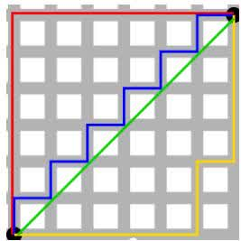

- 绿色线 = 欧氏距离；红色线 = 曼哈顿距离；蓝色和黄色线 = 曼哈顿距离的等价路径。
- **欧氏距离**：两点之间的**最短距离**。
- **曼哈顿距离**：投影到坐标轴的长度之和，又称出租车距离。
- **切比雪夫距离**：各坐标数值差的**最大值**。

### 8.10 参数说明以及调参

| 参数 | 说明 |
|---|---|
| `n_neighbors` | 邻居节点数量（即 K 值） |
| `weights` | 邻居权重策略：`'uniform'` 为等权，`'distance'` 为距离越近权重越高 |
| `p` | 距离度量：`p=1` 为曼哈顿距离，`p=2` 为欧氏距离（默认） |
| `leaf_size` | 传递给 BallTree 或 KDTree，表示构造树的叶子大小，默认值 30 |
| `n_jobs` | 并发执行的 job 数量，用于查找邻近数据点；`-1` 使用全部 CPU |

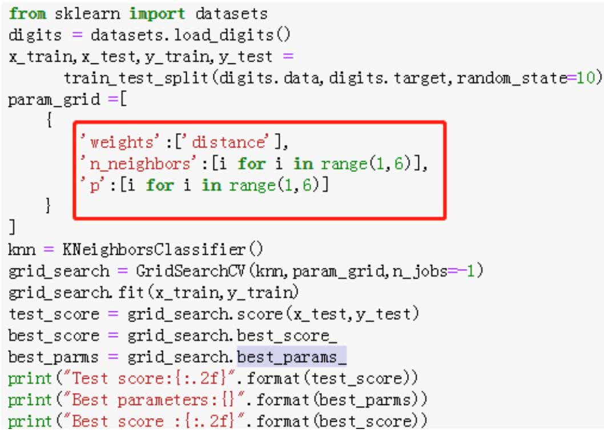

```python
Test score: 0.99
Best parameters: {'n_neighbors': 3, 'p': 2, 'weights': 'distance'}
Best score: 0.98
```


## 9. SVM (支持向量机)

SVM 又叫**最大间隔分类器**，最早用来解决二分类问题。

**SVM 有三宝**：间隔，对偶，核技巧。

**常用核函数**：
- 多项式核函数 $K(x,y) = (x \cdot y + c)^d$
- 线性核函数 $K(x,y) = x \cdot y$

在 `sklearn` 中使用：
1. `SVC(kernel='poly')`：表示算法使用多项式核函数；
2. `SVC(kernel='rbf')`：表示算法使用高斯（RBF）核函数；

SVM 算法的本质就是求解目标函数的最优化问题：
$$
\min rac{1}{2} \|w\|^2 + C \sum_{i=1}^{m} \xi_i
$$

**SVM 的推导**：

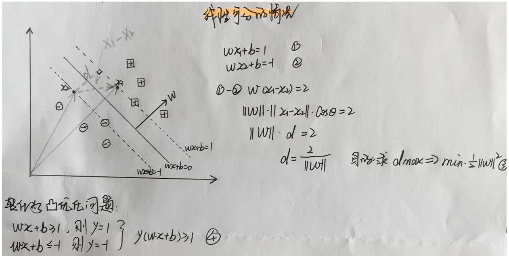

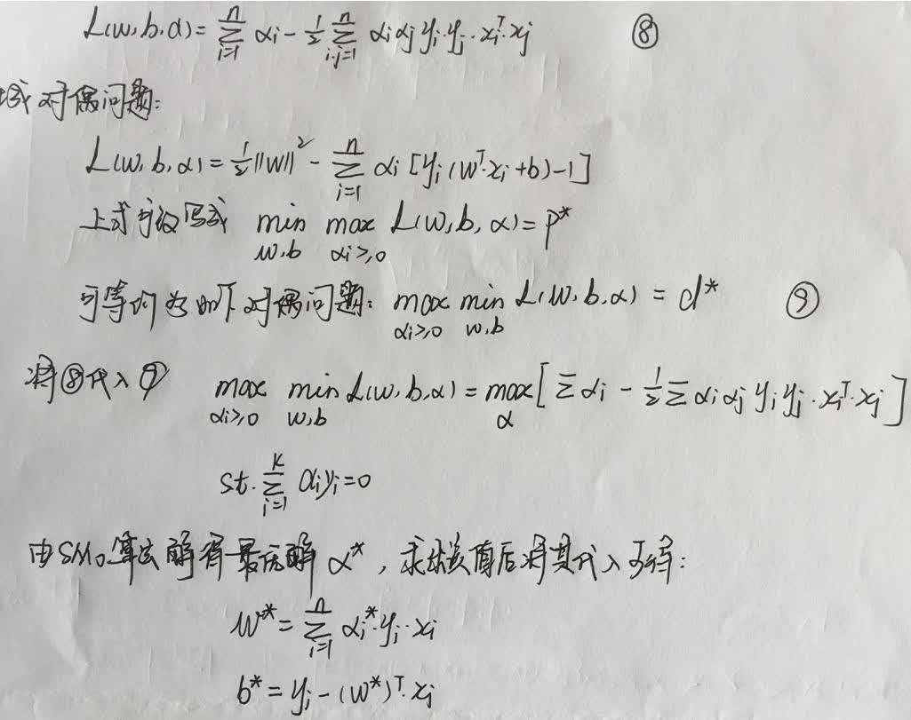


### 9.1 SVM 的原理是什么？

SVM 是一种二分类模型。它的基本模型是在特征空间中寻找**间隔最大化**的分离超平面的线性分类器。（间隔最大使得它有别于感知机）

1. 当训练样本**线性可分**时，通过硬间隔最大化，学习一个**线性分类器**，即线性可分支持向量机；
2. 当训练数据**近似线性可分**时，引入松弛变量，通过软间隔最大化，学习一个**线性分类器**，即线性支持向量机；
3. 当训练数据**线性不可分**时，通过使用核技巧及软间隔最大化，学习**非线性支持向量机**。

> **注**：以上各 SVM 的数学推导应该熟悉：硬间隔最大化（几何间隔） → 学习的对偶问题 → 软间隔最大化（引入松弛变量） → 非线性支持向量机（核技巧）

### 9.2 SVM 为什么采用间隔最大化？

当训练数据线性可分时，存在无穷个分离超平面可以将两类数据正确分开。

感知机利用误分类最小策略求得分离超平面，此时的解有无穷多个。线性可分支持向量机利用**间隔最大化**求得最优分离超平面，这样得到的解是唯一的。另一方面，此时的分离超平面所产生的分类结果是最鲁棒的，对未知实例的泛化能力最强。

### 9.3 为什么 SVM 要引入核函数？

原始空间线性不可分时，可以使用一个非线性映射**将原始数据变换到另一个高维特征空间**，在这个空间中样本变得线性可分。

**解决方法**：常用的一般是径向基（RBF）函数（其它有：线性核、多项式核、拉普拉斯核等）。

### 9.4 为什么 SVM 对缺失数据敏感？

这里说的缺失数据是指缺失某些特征数据，向量数据不完整。SVM 没有处理缺失值的天然策略。而 SVM 希望样本在特征空间中线性可分，所以特征空间的好坏对 SVM 的性能很重要。缺失特征数据将影响训练结果的好坏并改变两点之间的距离衡量。

### 9.5 SVM 核函数之间的区别与选择

一般在分类问题中选择线性核和高斯核（RBF 核）。

**高斯核函数（RBF）**:
$$
K(x,y) = e^{-\gamma \|x - y\|^2}
$$
**符号说明**：
- $K(x,y)$：通过核函数映射到高维空间后，计算两个向量的内积相似度。
- $e$：自然常数 $2.718...$
- $\|x - y\|^2$：数据点 $x$ 和 $y$ 之间的欧几里得距离平方和。
- $\gamma$ (gamma)：控制核函数分布宽度的超参数，$\gamma$ 越大，单一样本的作用范围越小，映射维度带来的界限越崎岖，越容易过拟合。
- **本质**：将每一个样本点映射到一个无穷维的特征空间。高斯核升维的本质，使得线性不可分的数据变得线性可分。

| 模型 | 线性核 (Linear Kernel) | 高斯核 (RBF Kernel) |
|---|---|---|
| **区别** | 用于线性可分数据 | 用于线性不可分数据，参数多，结果依赖参数调整（需交叉验证） |
| **特征多，样本少** | 适用（此时在高维特征空间本就容易线性可分，RBF 容易过拟合） | - |
| **特征少，样本适中** | - | 适用（通过高斯核映射到高维空间处理非线性） |
| **特征少，样本极多** | 适用（先手工构建部分特征转化为线性可分，因为 RBF 计算慢） | - |

### 9.6 SVM 如何处理多分类问题？

SVM 本身是二分类算法，处理多分类一般有两种做法：
1. **直接法**：直接在目标函数上修改，将多个分类面的参数求解合并到一个最优化问题里。看似简单，但计算量非常大。
2. **间接法**：通过对分类器进行组合。
   - **一对多 (One-vs-Rest, OVR)**：对每个类都训练出一个分类器。将这一类设为正类，其余设为负类。针对 $k$ 个类训练 $k$ 个分类器，新样本预测时取概率或得分最高的那个类。缺点是数据不平衡，bias 较高。
   - **一对一 (One-vs-One, OVO)**：针对任意两个类训练出一个分类器，如果有 $k$ 类，一共训练出 $C_k^2$ 个分类器。当新样本来时，用所有分类器测试，被判为某类的票数加一，最后票数最多的类别为最终类。

### 9.7 带核的 SVM 为什么能分类非线性问题？

核函数的本质是两个函数的**内积**，而这个函数在 SVM 中可以表示成对于输入值的高维映射。注意核并不是直接对应映射，核只不过是高维特征空间中坐标内积的简便计算方式（核技巧）。

### 9.8 RBF 核一定是线性可分的吗？

**不一定**。RBF 核比较难调参，且容易出现维度灾难（无穷维的概念是从泰勒展开得出的）。如果有严重的噪声，即使在高维空间也可能无法完美且合理地线性可分。

### 9.9 常用核函数及其条件？

- **线性核**：主要用于线性可分情况。
- **多项式核**
- **RBF 核（径向基核/高斯核）**：取值依赖于特定点间的距离。
- **拉普拉斯核**：也是一种径向基核。
- **Sigmoid 核函数**
- 傅里叶核、样条核等。

### 9.10 为什么要将求解 SVM 的原始问题转换为对偶问题？

1. 对偶问题将原始问题中的不等式约束转为了对偶问题中的**等式约束与简单的边界约束**；
2. 方便**核函数的自然引入**（对偶形式中只涉及样本内积）；
3. **改变了问题的复杂度**：由求特征向量 $w$ 转化为求拉格朗日乘子 $\alpha$。在原始问题下，求解复杂度与特征维度相关；在对偶问题下，只与样本数量相关。对偶问题是凸优化问题，可以进行较好的求解。

### 9.11 SVM 怎么输出预测概率？

把 SVM 的输出距离（Margin 得分）当作 $x$，经过一层 **LR（逻辑回归，Sigmoid 函数）**模型得到概率，其中 LR 的 $W$ 和 $b$ 参数为使得总体交叉熵最小的值（Platt Scaling 法）。

### 9.12 如何处理数据偏斜（不平衡）？

可以对数量多的类使得惩罚系数 $C$ 越小（表示越不重视错误），相反让数量少的类惩罚系数 $C$ 变大（加大错分惩罚）。在 `sklearn` 中通过 `class_weight='balanced'` 或传入字典实现。

### 9.13 线性回归 vs 逻辑回归 (LR) vs SVM

| 比较维度 | 逻辑回归 (LR) | 支持向量机 (SVM) |
|---|---|---|
| **参数化模型** | 是 | 否（SVM 最终只由支持向量决定） |
| **合适的数据集** | 较大 | 较小 |
| **损失函数** | 对数损失 (Log Loss) | 合页损失 (Hinge Loss) |
| **类别不平衡影响** | 影响大 | 影响小 |
| **依赖数据分布** | 是 | 否 |
| **损失考虑的样本** | 考虑了所有点的损失，通过非线性操作减小了远离超平面点的权重 | **仅考虑支持向量的损失** |
| **联系** | ①都是用来处理线性二分类问题的分类器；②都是线性模型（不加核时）；③都属于判别模型；④都可加正则化、加核函数变非线性。 |

> **三者横向对比**：
> - **线性回归**做分类考虑了所有点到决策面的距离，数据分布不均时误差非常大；
> - **LR** 通过 Sigmoid 进行了非线性映射，使得远离决策面的数据作用减弱；
> - **SVM** 直接去掉了远离决策面的数据，**只考虑支持向量**的影响。

### 9.14 参数说明与调参

`SVC(C=1.0, kernel='rbf', degree=3, gamma='auto', coef0=0.0, shrinking=True, probability=False, tol=0.001, cache_size=200, class_weight=None, verbose=False, max_iter=-1, decision_function_shape='ovr', random_state=None)`

**核心参数**：
1. `C`：惩罚系数，用来平衡分类间隔和错分样本，默认 `1.0`。$C$ 越大，容错空间越小，容易过拟合。
2. `kernel`：核函数。选 `'rbf'`, `'linear'`, `'poly'`, `'sigmoid'`，默认 `'rbf'`。
3. `degree`：多项式 `'poly'` 的最高次幂，默认 3。
4. `gamma`：核函数的系数（`'poly'`, `'rbf'`, `'sigmoid'`），默认 `'auto'`（等于 1/特征数）。
5. `coef0`：核函数中的独立项，`'poly'` 和 `'sigmoid'` 有效。
6. `probability`：是否启用概率估计。
7. `class_weight`：类别权重，解决数据偏斜。
8. `decision_function_shape`：多分类策略 `'ovo'` 或 `'ovr'`。

### 9.15 LinearSVC vs SVC

| 特性 | **LinearSVC** | **SVC** |
|---|---|---|
| **可选惩罚与损失函数** | 多（L1/L2 惩罚，Hinge/Squared Hinge） | 少 |
| **处理超大数据集 (>1万)** | 速度快，推荐使用 | 计算复杂度 $O(n^2)$，极慢 |
| **输入矩阵** | 支持稠密与稀疏矩阵 | 支持 |
| **联系** | 多分类默认使用 OVR 策略 | 多分类默认使用 OVR 策略 |


## 10. 集成学习 (Ensemble Learning)

**定义**：通过结合多个学习器（例如同种算法但是参数不同，或者不同算法），一般会获得比任意单个学习器都要好的性能，尤其是在这些学习器都是"弱学习器"的时候提升效果会很明显。

### 10.1 Boosting (提升法)

可以用于回归和分类问题。它每一步产生一个弱预测模型（如决策树），并将其加权累加到总模型中；如果每一步的弱预测模型生成都是依据**损失函数的梯度的负方向**，则称之为梯度提升（Gradient Boosting）。梯度提升算法首先给定一个目标损失函数，它的定义域是所有可行的弱函数集合。

提升算法通过迭代地选择一个负梯度方向上的基函数来逐渐逼近局部最小值。

**提升的理论意义**：如果一个问题存在弱分类器，则可以通过提升的办法得到强分类器。

#### 10.1.1 梯度提升决策树 (GBDT)

**DT** 表示使用决策树作为基学习器，使用的是 **CART 回归树**。

GBDT 是迭代的，但 GBDT 每一次的计算都是为了**减少上一次的残差**，进而在残差减少（负梯度）的方向上建立一个新的模型。其弱学习器限定了只能使用 CART 回归树模型。

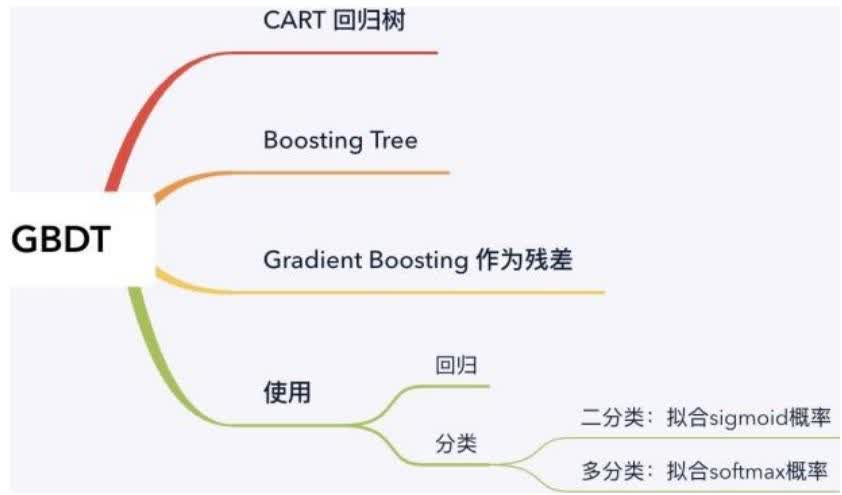

**残差 = (实际值 - 预测值)**

**Q1: GBDT 训练过程中如何选择特征？**  
GBDT 使用的基学习器是 CART 树，CART 树是二叉树，每次使用 yes or no 进行特征选择。对于数值连续特征使用的是最小均方误差，离散值使用 Gini 指数。在每次划分特征的时候会遍历所有可能的划分点找到最优的分裂点，这也是为什么 GBDT 会比 RF 慢的主要原因之一。

**Q2: GBDT 如何防止过拟合？由于 GBDT 是前向加法模型，前面的树往往起决定性作用，如何改进？**  
1. 一般使用**缩减因子 (Shrinkage/Learning Rate)** 对每棵树进行降权。
2. 可以使用带有 dropout 的 GBDT 算法（DART 树），随机丢弃生成的决策树，然后再从剩下的决策树集中迭代优化提升树。
3. 行、列子采样 (Subsample)。

**Q3: GBDT 的调参步骤？**  
1. **步长与迭代次数**：开始寻找一个较小的步长（如 0.1）来网格搜索最好的迭代次数（`n_estimators`）。
2. **决策树参数**：找到合适的迭代次数后，对决策树的最大深度 (`max_depth`) 和内部节点再划分所需最小样本数 (`min_samples_split`) 进行网格搜索。
3. **叶子节点参数**：再对 `min_samples_split` 和 `min_samples_leaf` 一起调参。
4. **特征与采样参数**：最后对最大特征数 (`max_features`) 和子采样比例 (`subsample`) 进行网格搜索。

**核心参数说明表：**

| 参数 | 说明 |
|---|---|
| `learning_rate` | 学习率。小的学习率需要更多的树 (`n_estimators`)；建议 $\le 0.1$ |
| `n_estimators` | 最多训练多少棵树 (迭代次数) |
| `max_depth` | 每棵子树的最大深度，默认为 3。数据量和特征不多时可不管；很大时建议限制（通常 3-10） |
| `max_leaf_nodes` | 最大叶子节点数量，可以防止过拟合 |
| `max_features` | 划分时考虑的特征数量（列采样）。特征不多时可设为 None |
| `subsample` | 子采样比例（无放回的行采样），默认 1.0，建议 0.5~0.8 |
| `min_samples_leaf` | 叶子节点最少的样本数，默认 1 |
| `min_samples_split`| 子树继续划分的条件，默认为 2。数据大时可增大该值 |

**Q4: GBDT 对类别特征 (Categorical) 要不要 One-hot 编码？**  
从效果角度讲，直接使用 Category 特征和 One-hot 是等价的，不同的是 Category 特征的特征空间更小。Microsoft 在 LightGBM 文档中指出，Category 特征可以直接输入，不需要 One-hot 编码，准确度差不多但速度快 8 倍。而 sklearn 的 Tree 方法在接口上不支持 Category 输入，所以只能用 One-hot 编码。

**Q5: 为什么 GBDT 用负梯度当做残差？**  
我们希望找到一个函数 $f(x)$ 使得损失 $L(y, f(x))$ 最小，那么 $f(x)$ 就得沿着使损失函数 $L$ 减小的方向变化：
$$
f(x_1) = f(x) - rac{\partial L(y, f(x))}{\partial f(x)}
$$
同时，新的学习器是由当前学习器 $f(x)$ 与本次要产生的回归树 $T_1$ 相加得到的：
$$
f(x_1) = f(x) + T_1
$$
因此，为了让损失函数减小，需要令新加入的树拟合负梯度：
$$
T_1 = -rac{\partial L(y, f(x))}{\partial f(x)}
$$
1. 负梯度的方向可证模型优化下去一定会收敛。
2. 对于一些绝对值损失函数来说，最大的残差方向并不是梯度下降最好的方向，因此统一使用负梯度作为伪残差进行拟合更具普适性。

#### 10.1.2 自适应提升 (AdaBoost)

**定义**: 是一种提升方法，将多个弱分类器组合成强分类器。AdaBoost 既可以用作分类，也可以用作回归。

**算法实现**：
1. 提高上一轮被错误分类的样本的权值，降低被正确分类的样本的权值；
2. 线性加权求和。误差率小的基学习器拥有较大的权重，误差率大的基学习器拥有较小的权重。

| 优点 | 实际应用 |
|---|---|
| (1) 精度很高的分类器 | (1) 用于二分类或多分类 |
| (2) 提供的是框架，可以使用各种方法构建弱分类器 | (2) 特征选择 |
| (3) 简单，不需要做特征筛选 | (3) 分类任务的 baseline |
| (4) 不易发生严重过拟合 | |

**Q1: 为什么 AdaBoost 能提高整体精度？**  
根据前向分布加法模型，AdaBoost 算法每一次都会降低整体的误差，虽然单个模型误差会有波动，但是整体的误差却在降低，整体模型拟合能力在提高。

**Q2: AdaBoost (加权累加) 和 加权平均 有什么不同？**  
- **AdaBoost** 的 $m$ 个基学习器是**有顺序关系**的，第 $k$ 个基学习器根据前 $k-1$ 个学习器得到的误差更新数据分布后再进行学习。
- **加权平均** (如 Bagging 变体) 的 $m$ 个学习器是可以**并行处理**的，在同一个数据分布上独立学习，最后进行加权。

**Q3: 迭代次数如何控制？**  
一般使用 Early Stopping 进行控制。

**Q4: 基学习器应该怎么选择？**  
Sklearn 中的 AdaBoost 接口默认使用决策树作为基分类器，因为决策树表现良好且对样本权重敏感。但也支持根据数据分布选择对应的分类器，如逻辑回归（LR）或简单的线性模型。

#### 10.1.3 极端梯度提升 (XGBoost)

基于 Boosting 增强策略的加法模型，训练时采用前向分布算法进行贪婪学习，每次迭代都学习一棵 CART 树来拟合之前 $t-1$ 棵树预测结果与真实值的**残差（经过二阶泰勒展开）**。

XGBoost 对 GBDT 进行了一系列优化：损失函数二阶泰勒展开、目标函数加入正则项、支持列并行、默认缺失值处理等，在可扩展性和训练速度上有了巨大的提升，但其核心思想还是 GBDT。

**推导指示图**：

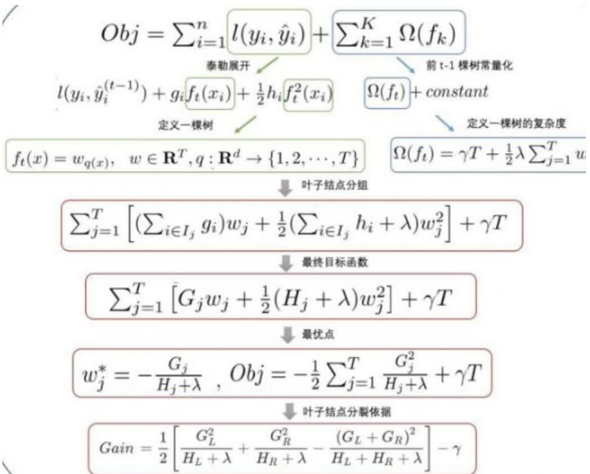

XGBoost 的学习分为 3 步：① 集成思想 ② 损失函数分析 ③ 求解。

**Q1: 为什么使用泰勒二阶展开？**  
- **精准性**：相比 GBDT 的一阶展开，二阶泰勒展开能更为精准地逼近真实的损失函数。
- **可扩展性**：损失函数支持自定义，只需要新的损失函数一阶、二阶可导即可，统一了优化流程。

**Q2: XGBoost 的"并行"体现在哪里？**  
XGBoost 的并行**不是**指树与树之间的并行（本质仍是 Boosting，需要串行生成树）。  
其并行指的是**特征维度的并行**：在训练前，将每个特征按特征值预排序并存储为 Block 结构；在寻找最佳分割点时，可以利用多线程对每个 Block（特征）并行计算增益。

**Q3: XGBoost 为什么快？**  
| 优化点 | 原理说明 |
|---|---|
| **分块并行 (Block)** | 训练前按特征值排序存储为 Block，节点分裂时多线程**并行遍历所有特征**寻找候选点。 |
| **候选分位点近似** | 借助直方图近似算法，不遍历所有特征值，而是取常数个分位点作为候选分割点。 |
| **CPU Cache 命中优化**| 使用预取方法，对每个线程分配连续 Buffer 读取梯度信息。 |
| **Out-of-core 计算** | 数据过大时，可将 Block 划分到不同硬盘来提高吞吐。 |

**Q4: XGBoost 防止过拟合的方法？**  
| 手段 | 描述 |
|---|---|
| **目标函数正则项** | 损失函数中加入了**叶子节点个数**和**叶子节点权重的 L2 正则化**项。 |
| **列抽样 (Colsample)** | 训练树/节点分裂时只使用部分特征。 |
| **子采样 (Subsample)** | 类似随机森林，每轮建立新树不使用全部样本。 |
| **Shrinkage (缩减)** | 即学习率 (Learning Rate)，缩小每棵树的权重，给之后的推导留出空间。 |

**Q5: XGBoost 如何处理缺失值？**  
在节点寻找最佳分割点时，**不考虑该列缺失的样本**，只利用 non-missing 样本计算切分点，极大减少了计算开销。  
分裂后，对含有缺失值的样本，XGBoost 会分别将其分配到左子树和右子树计算一遍增益，选择增益更大的方向作为该特征缺失值样本的**默认分支方向**。如果训练集中没有缺失而在预测时遇到了，默认划分到右节点。

**Q6: 如何处理不平衡数据？**  
1. 如果评估指标是 **AUC**：设置 `scale_pos_weight` 来平衡正负权重（如正负比 1:10，则设为 10）。
2. 如果在意**绝对预测概率**：不应使用 `scale_pos_weight` 破坏真实分布，而是设置 `max_delta_step` 为一个有限数字帮助收敛。

**Q7: 叶子结点的权重如何计算出来？**  
XGBoost 目标函数最终推导形式（按叶子节点重新组合）为：
$$
Obj^{(t)} = \sum_{j=1}^{T} \left[ G_j w_j + \frac{1}{2} (H_j + \lambda) w_j^2 \right] + \gamma T
$$
**符号说明**：
- $Obj^{(t)}$：第 $t$ 轮迭代时基于一阶导数和二阶泰勒展开的总体近似目标函数值。
- $\sum_{j=1}^{T}$：对新加入的这棵树拥有的总共有 $T$ 个叶子节点逐个累加结构风险误差。
- $G_j$：落入第 $j$ 个叶子节点内所有样本损失函数在上一轮预测点处的一阶偏导数 $g_i$ 累加之和。
- $H_j$：所有样本损失函数在上一轮预测点处的二阶偏导数 $h_i$ 累加之和。
- $w_j$：第 $j$ 个叶子节点的预测输出值（权重）。
- $\lambda$：用于 L2 正则化的惩罚项超参数，约束叶子节点的输出大小。
- $\gamma$ (Gamma) / $min\_split\_loss$：生成新叶子节点（即切分特征带来的树广度增加 $T$ 增多）的惩罚阈值，控制模型粗细。
利用一元二次函数求极值的原理，当目标函数达到最小时，第 $j$ 个叶子结点的最优权重 $w_j^*$ 为：
$$
w_j^* = -\frac{G_j}{H_j + \lambda} \quad , \quad Obj = -\frac{1}{2} \sum_{j=1}^{T} \frac{G_j^2}{H_j + \lambda} + \gamma T
$$
**符号说明**：
- $w_j^*$：二次抛物线最值原理推导出的——使目标函数最小的第 $j$ 个叶子结点的最优输出值。
- $Obj$（最优 Obj）：将最优叶子取值 $w_j^*$ 回代得到的纯基于一二阶导和惩罚项的“结构最小损失分”。这也常用于计算“新一次分裂带来的 Gain 增益”。

**Q8: 树停止生长的条件？**  
1. **增益 $< 0$**：新引入分裂带来的 Gain 为负时，可能放弃分裂（也可能先建树后剪枝）。
2. **达到最大深度 (`max_depth`)**：防止树太深而过拟合。
3. **最小样本权重和 (`min_child_weight`)**：如果子节点的权重和（在平方损失下即为样本数）过小，停止分裂，防止分得太细。

**Q9: 高维稀疏场景下 GBDT 为何不如 LR？**  
树模型在高维稀疏场景下，容易利用某个极稀疏但偶尔与 Label 对齐的特征做切分（形成只包含极少样本的叶子节点），从而导致严重过拟合。而 LR 这种带 L1/L2 正则化的线性分类模型，参数会受到全局惩罚压缩，更为稳健。

**Q10: XGBoost 的剪枝策略？**  
XGBoost 采用贪心策略，先一直建树到最大深度（自顶向下），然后再**自底向上回溯检查**。如果某节点分裂不能产生正的增益，则将该节点剪枝。

**Q11: Scalability (可扩展性) 如何体现？**  
1. **基分类器**：除了支持 CART 树，还支持线性模型（gblinear）。
2. **目标函数**：支持自定义任意一阶、二阶可导的 Loss Function。
3. **计算维度**：Block 结构支持并行化和外存计算 (Out-of-core)。

**Q12: XGBoost 调参一般步骤？**  
1. 确定较小的 Learning Rate（如 0.1），用 CV 寻优 `n_estimators`。
2. 调节树参数：`max_depth` (决定树深度，通常 3~10) 和 `min_child_weight` (控制节点继续划分)。
3. 调节 `gamma`（最小划分损失阈值）。
4. 调节采样参数：`subsample` (行的采样) 和 `colsample_bytree` (列的采样)。
5. 调节正则化参数：`alpha` (L1) 和 `lambda` (L2)。
6. 最终大幅降低 Learning rate，同比例扩大 `n_estimators` 以提升微调效果。

**Q13: 与 LightGBM 相比，XGBoost 近似算法慢在哪里？**  
XGBoost 在构建树的**每一层**都要重新动态构建直方图，因为它的直方图需要根据每个样本当前的残差二阶导数 $\approx$ 权重重新统计。而 LightGBM 做了一定优化并在部分场景中更彻底地利用了直方图做差加速，建立一次直方图后开销更小。


#### 10.1.4 LightGBM

**基本思想**：先把连续的浮点特征值离散化成 $k$ 个整数（Bin），同时构造一个宽度为 $k$ 的直方图（Histogram）。在遍历数据时，根据离散化后的值作为索引在直方图中累积统计量。遍历一次数据后，直方图累积了需要的统计量，然后直接根据直方图的离散值遍历寻找最优的分割点。

基于决策树算法的分布式梯度提升框架。是对 GBDT 的高效实现，原理上与 GBDT 及 XGBoost 类似，都采用损失函数的负梯度作为当前决策树的残差近似值去拟合新树。

| 维度 | LightGBM 特性说明 |
|---|---|
| **Histogram 算法** | 先把连续的浮点特征值离散化成 $k$ 个整数，同时构造一个宽度为 $k$ 的直方图，极大降低内存占用并加速计算。 |
| **Leaf-wise 生长策略** | 带有最大深度限制（max_depth）的 Leaf-wise 生长策略。相比 XGBoost 的 Level-wise（按层生长），能降低更多的误差，得到更好精度。 |
| **直方图做差加速** | 父节点的直方图可以通过兄弟节点的直方图做差得到，速度提升一倍。 |
| **类别特征直接支持** | 直接支持 Category 特征，无需 One-Hot 编码。 |
| **单机速度优势** | 速度通常是 XGBoost 的多倍，内存占用为 XGBoost 的 $1/6$ 左右。 |
| **缺点** | 基于 Histogram 会有信息损失（对噪点敏感）；Leaf-wise 容易长出极深树产生过拟合（必须设置 `max_depth` 限制）。 |

#### 10.1.5 CatBoost

**原理**：专门处理类别型特征棒，能在训练期间直接处理 categorical features 而不需要预处理阶段显式做 One-hot。

具体实现（Target Statistics）方法：
1. 将输入样本集进行随机排序，生成多组随机排列。
2. 将浮点型或属性标记转化为整数。
3. 统计类别特征的 Target 历史均值，并加入先验平滑作为数值编码特征输入：
$$
	ext{编码均值} = rac{\sum_{j=1}^{p-1} [x_{\sigma_j, k} = x_{\sigma_p, k}] Y_{\sigma_j} + a \cdot P}{\sum_{j=1}^{p-1} [x_{\sigma_j, k} = x_{\sigma_p, k}] + a}
$$

### 10.2 Bagging (套袋法)

**1. Bagging 的定义与核心思想**
Bagging 是 **Bootstrap aggregating**（自助聚合法）的缩写。它的核心思想可以用“人多力量大”或“三个臭皮匠顶个诸葛亮”来概括：通过构建并结合多个互相独立的基学习器（Base Learners）的集体决策，来共同提升预测的准确性。其主要目的是**显著降低单一模型过拟合的风险，极大提高整体模型的泛化能力**。

**2. 为什么要使用 Bagging？（应对过拟合的痛点）**
在真实采集的数据中，往往存在着个别标注错误的任务“噪声点”或极端异常值。
- **形象比喻**：如果把训练模型当做学生刷题，数据集里的噪声就像是《五年高考三年模拟》里印刷错误的参考答案。如果一个单独的学生死记硬背（单一模型极度过拟合了这些噪声），那么他在考场（真实场景）遇到类似题目时，就会因为强行套用错误答案而做出荒谬的判断。
- **Bagging 的作用机理**：Bagging 相当于找来了一个班的 $T$ 个学生。因为每个学生分配到的练习册（被采样的训练子集）都不完全一样，部分学生恰好完美避开了印错答案的题。最终大考做题时，大家一起**投票表决**，个别做出极端错误预测的学生会被“集体智慧”的正确大盘拉回来，使得集体决策远比单一模型可靠。

**3. Bagging 的采样与底层训练过程**
假设最初的原始数据集为 $D = \{(x_1, y_1), (x_2, y_2), \dots, (x_m, y_m)\}$：
- **采样方法（Bootstrapping）**：从原始数据集 $D$ 中使用**有放回随机采样**。每次随机抽一个样本放进子集，再原封不动退回池中，让它下次仍有概率被抽到。重复 $m$ 次，即可得到一个同样包含 $m$ 个样本的采样集 $D_t$（在这个新集合里，通常只包含原数据集 60%-80% 左右的不重复样本，剩下的都是被重复抽到的双胞胎乃至多胞胎）。
- **并行训练**：对 $t = 1, 2, \dots, T$ 轮重复上述操作，生成互相独立的 $T$ 个采样集。然后利用这 $T$ 个不同的喂料数据集，**完全并行地**训练出 $T$ 个基学习器 $G_1(x), G_2(x), \dots, G_T(x)$。

**4. 结合策略（分类与回归）**
当全套模型组合完毕，面对一个全新的未知样本需要预测时：
- **分类任务**：采用少数服从多数的**投票法（Majority Voting）**，$T$ 个学习器各自输出一个类别一票，得票最高者即为最终确定的类别。
- **回归任务**：采用**平均法（Arithmetic Mean）**，将 $T$ 个学习器独立输出的具体数值进行**算术平均运算**作为最终结果，这能极大程度削峰填谷，降低极端离群预测值带来的不良影响。

> **经典组合代表作**：
> - Bagging 思想 + 决策树基分类器 = 随机森林 (Random Forest, RF)
> - *对比：AdaBoost + 决策树 = 提升树；Gradient Boosting + 决策树 = GBDT*

#### 10.2.1 随机森林 (Random Forest, RF)

**定义**: 通过集成学习思想将多棵树集成的一种算法，本质属于 Bagging 集成方法，基本单元是决策树。工作原理是生成多个独立训练的树模型，预测时结合单树预测结果，通常优于单分类器。

**算法思想**:
随机选择样本 (放回) $\rightarrow$ 随机选择特征 $\rightarrow$ 构建决策树 $\rightarrow$ 随机森林投票(平均)

| 优点 | 缺点 |
|---|---|
| **完全并行化**计算，速度快。 | 解决回归问题时表现较差，无法输出平滑连续的预测。 |
| **强抗噪与泛化能力**。引入了两个维度的随机性，降低了方差，对异常值/缺失值不敏感。 | 在噪音极大的分类或回归问题上偶尔也会过拟合。 |
| **无需交叉验证**。自带 OOB (袋外样本) 误差估计。 | 无法精准控制模型内部运行逻辑（黑盒预测）。 |
| 继承决策树优点：可做特征重要性排序，无需规范化处理特征。 | 对于有效特征极少的数据，分类效果可能不佳。 |

**Q1: 随机森林的"随机性"体现在哪里？**  
1. **样本随机**：决策树的训练样本是有放回随机采样的（Bootstraping）。
2. **特征随机**：决策树节点分裂时，候选特征集合也是无放回随机采样的子集（通常取 $\sqrt{m}$ 或 $\log_2(m)$ 个特征）。

**Q2: 为什么要有放回的抽样 (保证基础样本集差异)？**  
若不放回抽样且全量抽样，那每棵树的样本集就全一样了；有放回抽样保证了单树训练集既有一部分样本重复，又有一部分样本遗漏（OOB 约占 36.8%），增加了各决策树基模型的差异性。集成学习靠的就是“和而不同”，差异性越大数据集成结果越鲁棒。

**Q3: 需要剪枝吗？**  
**不需要剪枝**。RF 通过随机选择变量与样本，并通过百上千棵树的投票平滑方差，天然防止过拟合。一般 RF 只需要控制树的数量（规模），让每棵树在自己的数据集上尽可能深地生长表达细节即可。

**Q4: 随机森林如何处理缺失值？**  
1. **初次填补**：若是分类变量缺失，用众数补；若是连续变量缺失，用中位数补。
2. **迭代精炼**：用方法1填补后构建森林并计算相似度矩阵（基于样本落在同一个叶子的频率），然后回头利用相似度矩阵进行加权平均/多数投票重填缺失值，反复迭代 4-6 次直至稳定。

**Q5: 随机森林如何评估特征重要性？**  
1. **Decrease GINI (基于基尼下降)**：当前节点的 `Gini` 减去分裂后左右子节点的 `Gini` 之和（计算加权），整棵树所有该特征产生的 Gini 减少量相加即为重要度。
2. **Decrease Accuracy (基于 OOB 置换)**：用 OOB 样本测出 Error1；然后把 OOB 样本里第 $j$ 列特征顺序随机打乱，测出 Error2。Error2 - Error1 差值越大，说明特征 $j$ 越重要（被破坏后影响大）。

**Q6: RF 分类和回归问题如何预测 $y$ 值？**  
RF 是加权平等的模型。分类问题使用 $k$ 棵树多数表决；回归问题使用 $k$ 棵树预测值的均值。

**Q7: 为什么 RF 的树比 GBDT 的要深？**  
RF 是通过独立并行树的平滑平均来降低**方差 (Variance)** 的集成模型，要求单棵树要有极强的表达能力（即低偏差、高方差的深树）。而 GBDT 是通过串行学习残差来降低**偏差 (Bias)**，要求每棵树是弱分类器以防过拟合，所以只需浅树（即高偏差、低方差）。

### 10.3 核心算法对比总结表

#### 10.3.1 Bagging vs Boosting

| 对比项 | Bagging (代表: 随机森林) | Boosting (代表: AdaBoost, GBDT) |
|---|---|---|
| **样本选择** | 有放回的随机采样（Bootstrap），权重全相等 | 使用全部样本，但每个样本在各轮的权重不同 |
| **权重分配** | 个体学习器权重相等 | 预测准确率高的学习器权重更大，低者权重小 |
| **训练并行性** | 可以**完全并行**训练 | 必须且只能**串行**训练（下一轮依赖上一轮残差/误差） |
| **预测决策** | 简单投票选举 / 简单平均 | 各个体预测结果加权求和 |
| **误差优化原理**| 采样子集增加差异性，平滑平均以**降低方差 (Variance)** | 一步步修正错误以**降低偏差 (Bias)** |

#### 10.3.2 随机森林 (RF) vs GBDT

| 对比项 | 随机森林 (Random Forest) | GBDT (Gradient Boosting Decision Tree) |
|---|---|---|
| **架构体制** | 并行算法 (Bagging) | 串行算法 (Boosting) |
| **样本选择** | 有放回随机采样 | 使用所有样本（非随机情况）拟合上一轮伪残差 |
| **基学习器深度** | 深树（易产生低偏差、高方差） | 浅树限制（弱学习器，易产生高偏差、低方差） |
| **异常值容忍度** | 不敏感（多数投票抹平极端值） | 敏感（残差大容易带偏后续树的拟合重心） |

#### 10.3.3 AdaBoost vs GBDT

| 对比项 | AdaBoost | GBDT |
|---|---|---|
| **迭代依据** | 不断调整**样本分布权重**，分错的样本权重增大 | 保持样本权重原样，不断生成新树拟合**现有损失的负梯度（残差）** |
| **基学习器** | 各种基分类器均可（逻辑回归，树等） | 只能是 CART 回归树 |
| **异常值抗性** | 弱（离群点易造成错误累积被分配极大权重）| 相对弱，但如果使用 Huber/Abs 损失可以增强鲁棒性 |

#### 10.3.4 XGBoost vs GBDT

| 对比项 | GBDT | XGBoost |
|---|---|---|
| **基分类器** | 仅支持 CART 树 | 不仅支持 CART，还支持线性分类器（gblinear） |
| **导数信息** | 仅使用一阶导数（Gradient）求负梯度拟合 | 对损失函数进行**二阶泰勒展开**（使用一阶 G 和二阶 H） |
| **正则项** | 仅通过学习率、早停等手段抗过拟合 | **自带正则项**控制树复杂度（节点个数 $\gamma$ + 权重和 $\lambda$） |
| **特征分裂准则** | 计算所有特征点（Level-wise）| 提供特征分段/直方图等**并行算法**和贪心扫描加速寻找 |
| **列抽样/缺失值**| 无原生支持 | **原生支持列抽样**防过拟合；自动学习并在内部为**缺失值**指定默认分支 |

#### 10.3.5 XGBoost vs LightGBM

| 对比项 | XGBoost | LightGBM |
|---|---|---|
| **树的切分策略** | 传统的 **Level-wise**（按层分裂，不易过拟合但低效） | 带有深度限制的 **Leaf-wise**（按叶子节点纯度下降分裂，降残差更猛） |
| **寻找分裂点** | 基于预排序（近似分位点块机制也比较费内存） | **直方图算法（Histogram）**，内存和速度极具优势（直方图做差） |
| **类别特征处理** | 需要事先转换为数值或 One-hot | **直接原生支持**无需编码处理 |
| **多指标早停策略**| 仅根据 Evaluation List 的最后一项 | 受所有评价指标联合影响 |


## 11. 无监督学习 (Unsupervised Learning)

**核心思想**：无需标签数据，通过算法自主发现数据内部模式。其特点是探索性分析能力强，适用于未知结构的数据。
**典型任务**：
- **聚类 (Clustering)**：将数据点分成 $K$ 个簇，让组内尽可能相似，组间尽可能不同。
- **降维 (Dimensionality Reduction)**：压缩数据维度。
- **生成 (Generation)**：学习数据分布以生成新样本。

### 11.1 无监督学习应用场景扩展

| 领域 | 应用场景 |
|---|---|
| **客户分群** | **用户兴趣聚类**：依据行为划分内容偏好。<br>**生命周期划分**：识别潜在流失/高价值用户。<br>**地理分群**：区域化营销。 |
| **异常检测** | **医疗健康**：识别异常生理信号或罕见疾病。<br>**物联网(IoT)**：检测传感器异常预测故障。<br>**供应链/能源**：发现物流延迟、电网异常等。 |
| **降维与特征** | **基因组学**：降维识别关键生物标记。<br>**图像处理**：人脸特征压缩提取。<br>**NLP**：词嵌入降维可视化分析语义。 |
| **主题建模** | **新闻分类/学术分析**：聚合文章主题提取趋势。<br>**用户反馈**：挖掘评论中的隐含主题。 |

### 11.2 聚类算法 (Clustering)

**原理**：对大量未知标注的数据集，按数据的内在相似性划分为多个类别，使类别内的数据相似度较大而类别间的数据相似度较小。

**常用算法**：
1. **K-Means (K 均值)**
2. **Learning Vector Quantization (学习向量量化)**
3. **Mixture-of-Gaussian (高斯混合聚类)**
4. **DBSCAN (密度聚类)**
5. **AGNES (层次聚类)**

#### 11.2.1 K-Means 聚类

**步骤**：
1. **初始化**：随机初始化 $K$ 个簇中心坐标。
2. **分配样本**：计算所有点到 $K$ 个簇中心的距离，划分进最近的簇。
3. **更新质心**：更新簇中心坐标为当前簇内节点的均值。
4. **迭代**：重复步骤 2、3 直到簇中心坐标不再改变（收敛）。

**Q1: K 值如何选取？**  
- **肘部法则 (Elbow Method)**：绘制 K 和损失函数 (SSE) 的关系图，选拐点处的 K 值。
- **经验选取**：人工根据业务经验定几个 K，多次随机初始化中心选最优的（实际中最常用）。

**Q2: 初始点的选择对结果的影响？**  
初始点不同最终分类结果也可能不同，随机选择的中心可能导致 K-Means 陷入局部最优解（可以使用 **K-Means++** 优化初始中心）。

**Q3: K-Means 不适用哪些数据？**  
1. **强相关/非凸数据集**：很难收敛，需用 Kernel K-Means 映射到高维。
2. **密度不一或多离群点 (Outliers)**：抗噪能力弱，此时应使用 **DBSCAN 密度聚类**。

**Q4: 常用的距离度量？**  
主要使用**欧几里得距离**，有时使用余弦相似度。

**Q5: 为什么一定会收敛？**  
每次迭代都会用簇内点的平均值更新质心，这必定会使得**误差平方和 (SSE)** 减小或不变，SSE 有下界 0，故必然收敛：
$$
SSE = \sum_{i=1}^{K}\sum_{x \in C_i} (x - \mu_i)^2
$$
**符号说明**：
- $SSE$：误差平方和 (Sum of Squared Error)，衡量簇内所有样本与自己归属簇中心偏离的集中度。聚类算法寻找 SSE 最小的状态。
- $K$：自定义的簇/群组总数。
- $C_i$：第 $i$ 个聚类簇的组合集合。
- $x$：空间中属于当前第 $i$ 簇的某个样本点向量。
- $\mu_i$：第 $i$ 个聚类簇的当前质心（聚类中心均值坐标向量）。

**Q6: 为什么计算前要归一化？**  
由于依靠距离度量，各维度量级不同会严重左右结果（例如工资 5 万比年龄 30 岁影响大极大），不归一化相当于小量级特征完全失效。

#### 11.2.2 K-Means vs KNN

| 对比项 | KNN (K-Nearest Neighbors) | K-Means (K 均值) |
|---|---|---|
| **算法类型** | 监督学习（分类/回归算法） | 无监督学习（聚类算法） |
| **输入数据** | 带 Label 的验证数据 | 无 Label 的杂乱数据 |
| **训练过程** | Memory-based（基于记忆的懒惰学习），无显式训练过程 | 有明显的迭代训练（寻找质心）过程 |
| **K 的含义** | 寻找离新样本**最近的 $K$ 个已标注邻居** | 假设整个数据集划分为 **$K$ 个簇** |
| **相似点** | \multicolumn{2}{c|}{都包含“在数据集中找离它最近的点”的过程，底层常用 KD 树加速计算距离。} |

### 11.3 降维算法 (Dimensionality Reduction)

**定义**: 把一个多因素高维问题转化成较低维度的问题，减少冗余信息，保留关键结构。

**降维的作用**:
1. 缓解维度灾难。
2. 压缩数据的同时让信息损失最小化。
3. 方便 2D/3D 可视化。

#### 11.3.1 PCA (主成分分析) - 线性降维

**原理**: 无监督降维。通过正交变换，选择样本点投影后**方差最大**的方向，方差越大含的信息量越大。优化目标是：**最大化投影方差** + **最小化重构误差（到超平面的距离）**。

**计算过程**:
1. 零均值化（去中心化）。
2. 计算协方差矩阵。
3. 计算协方差矩阵的特征值与特征向量（常用 SVD 分解加速）。
4. 取特征值最大的前 $k$ 个对应的特征向量，构建投影矩阵。

> **PCA 白化**: PCA 投影后（消除了特征相关性），在各个坐标上再除以其标准差（方差归一化）。

#### 11.3.2 SVD (奇异值分解)

将 $m 	imes n$ 的实数矩阵 $A$ 分解为：
$$
A = U \Sigma V^T
$$
**符号说明**：
- $A$：任意实数特征数据矩阵（原始 $m \times n$ 高维未压缩矩阵）。
- $U$：左奇异矩阵（由 $AA^T$ 的特征向量组成，属 $m \times m$ 对角阵，代表列空间方向信息）。
- $\Sigma$：主对角线上包含非负奇异值的矩形矩阵（按大小降序提取奇异值，$m \times n$）。
- $V^T$：右奇异矩阵的转置（由 $A^TA$ 的特征向量组成，属 $n \times n$ 对角阵，代表行空间方向信息）。
其中 $U$ 是左奇异矩阵，$V$ 是右奇异矩阵，$\Sigma$ 是对角线包含奇异值的矩阵。

**为什么用 SVD 降维？**
1. **快速截断**：前 10% 甚至 1% 的奇异值之和就占了全部的 99% 以上。
2. **多向主成分**：可获取行和列两个方向的主成分。
3. **数值稳定性**：比直接用 PCA 计算 $X^T X$ 协方差矩阵更稳定，不易丢失精度。

#### 11.3.3 LDA (线性判别分析) - 线性降维

**原理**: 有监督降维。将高维数据投影到低维上，使得**同类数据投影点尽可能接近（类内方差小），不同类投影点尽可能远离（类间方差大）**。降维最多降到类别数 $K-1$ 维。

#### 11.3.4 降维算法对比

**PCA vs SVD**:
- 都是矩阵分解，PCA 分解协方差矩阵，SVD 直接分解原始矩阵。
- SVD 更稳定，PCA 的底层计算库通常都是调用的 SVD。

**LDA vs PCA**:
| 对比项 | LDA (线性判别) | PCA (主成分分析) |
|---|---|---|
| **监督性质** | 有监督 | 无监督 |
| **降维目标** | 选分类性能最好（类间大、类内小）的方向 | 选数据投影方差最大（信息富集）的方向 |
| **维度限制** | 最多降到 $K-1$ 维 | 无限制 |
| **依赖统计** | 更依赖均值分类（若样本依赖方差则效果不如 PCA） | 依赖方差提取 |
| **相同点** | \multicolumn{2}{c|}{都假设数据符合高斯分布，都使用了矩阵特征分解的思想。} |

#### 11.3.5 非线性降维

1. **t-SNE (t 分布随机邻近嵌入)**：通过 KL 散度优化，保持高维与低维空间邻近样本对的相似性。极度适合可视化（如 MNIST），但计算复杂度高，难保全局结构。
2. **流形学习 (Manifold Learning)**：假设数据在低维流形上（如 LLE、Isomap），保留局部几何结构。对噪声敏感。
3. **自编码器 (Autoencoder)**：通过神经网络的编码器-解码器学习低维表示。适合端到端非线性特征提取，但解释性弱。

---

## 12. 概率模型与其他

### 12.1 朴素贝叶斯 (Naive Bayes, NB)

**原理**: 基于贝叶斯定理与**特征条件独立假设**的生成式分类方法。
$$
P(Y|X) = rac{P(X|Y) P(Y)}{P(X)}
$$
通过学习得到联合概率，计算新样本在各类别下的后验概率，取概率最大的类。

**Q1: 为什么叫"朴素"？ / 为什么引入独立假设？**  
为了避免极大特征维度导致的组合爆炸与样本稀疏，NB 强行假设在类别 $Y$ 确定的条件下，$X$ 的各个特征分量相互独立。

**Q2: 优缺点？**  
- **优点**：小规模数据表现好，适合多分类和增量训练；对缺失数据不敏感，算得快。
- **缺点**：对连续数据的表达敏感；特征独立性在现实中大多不成立（如果属性间强相关，效果变差）。

**Q3: 估计 $P(X|Y)$ 为 0 怎么办？**  
采用拉普拉斯平滑（常用的平滑系数 $\lambda=1$），给分子分母加上微小的常数，避免条件概率为 0 摧毁整个乘积的后验概率计算。

**Q4: NB vs LR (逻辑回归)？**  
| 对比项 | 朴素贝叶斯 (NB) | 逻辑回归 (LR) |
|---|---|---|
| **模型种类** | 生成模型 (联合概率) | 判别模型 (条件概率) |
| **求解思路** | 统计频率得出 $P(Y)$ 和 $P(X|Y)$ | 最大化对数似然函数求 $W$ |
| **先验假设** | 强依赖特征独立性假设 | 无独立性要求 |
| **适用场景** | 数据集较小 | 大规模数据集适用 |

### 12.2 深度学习基础提问

**Q: 深度学习与传统机器学习的区别？**  
传统机器学习需要人工进行特征工程（Feature Engineering），而深度学习可以通过深层神经网络结构**自动抽象提取特征**，鲁棒性和泛化上限更高，但也因此像黑盒且需要极大数据量。

**Q: 偏差与方差的平衡？**  
- **偏差 (Bias)**：预测均值与真实值的偏离程度（模型抓取主干规律的能力）。低偏差可能高方差（过拟合）。
- **方差 (Variance)**：模型在不同训练子集上预测结果的分散程度。低方差可能高偏差（欠拟合）。
- 好的模型需要在二者中取得 Trade-off。

### 12.3 综合实战面经 Q&A

**Q1: 用极其有限的 RAM 处理 1000 列 100 万行的数据，如何降维与训练？**  
1. **抽样缩小**：随机采样，如先截取 30 万行探索规律。
2. **特征分治**：分离连续变量与分类型变量。连续变量做相关性分析剔除共线性；分类变量做卡方检验挑选高相关。
3. **主成分截断**：使用增量 PCA（Incremental PCA）。
4. **流式训练**：利用 SGD 建立线性模型，或用 Vowpal Wabbit 等在线学习工具（Online Learning）分批载入。

**Q2: 协方差和相关系数的区别？**  
- **协方差 (Covariance)**：衡量整体误差方向，且受变量度量衡大小影响极大（如工资是万级，年龄是十级，无法互绝对比）。
- **相关系数 (Correlation)**：是**协方差的标准化形式**（除以两者的标准差），将值压缩在 $[-1, 1]$ 之间，排除了量纲影响，适合直观比较。

**Q3: 完整机器学习项目的流程？**  
1. **定义问题与获取数据**
2. **探索性数据分析 (EDA)**：描述性统计、可视化以理解数据规律。
3. **数据准备**：数据预处理（清洗缺失值/异常值）、特征工程、特征选择。
4. **评估算法**：切分训练/验证集，选定 Evaluation 指标，粗筛线性和非线性算法 Baseline。
5. **优化模型**：对入选的高潜力模型进行网格调参、进行**模型集成 (Ensemble)**。
6. **最终部署与输出**：在隐匿测试集验证，泛化无误后，模型序列化上线。

**Q4: 如果测试集有缺失值且分布在中位数 1 个标准差内，大约会有多少数据受影响？**  
在正态分布中，落在均值上下 1 个标准差内地数据占约 68%。如果缺失值皆处于此区间，则剩余约 32% 的极端数据将不受这批中心地带缺失值平替处理的负面影响。

**Q5: 把类别变量当连续变量处理可以吗？**  
除非类别变量本身具备**自然有序性（Ordinal）**，如（小学=1，初中=2，高中=3），否则直接当连续变量计算会导致极大的错误距离度量。无序类别变量必须使用 One-hot 编码或 Target 编码。

**Q6: “买了这个的客户，也买了...”属于哪种算法结果？**  
属于协同过滤（Collaborative Filtering）或关联规则（Association Rules，如 Apriori 算法）驱动的推荐系统。

**Q7: p 值是什么？**  
在假设检验中，$P$ 值是指当原假设为真时，所得到的样本观察结果或更极端结果出现的概率。$P$ 值越小（如 $< 0.05$），发生概率越小，我们就越有理由拒绝原假设（证明本次事件不是靠随机发生的）。

---
## 13. 强化学习 (Reinforcement Learning, RL)

**核心思想**：智能体（Agent）通过与环境的不断试错交互来学习策略，以达到最大化累积奖励（Cumulative Reward）的目的。

**关键要素**：
- **Agent（智能体）**：执行动作的实体。
- **Environment（环境）**：智能体所处的场景。
- **State（状态）**：环境的当前表现。
- **Action（动作）**：智能体的行为选择。
- **Reward（奖励）**：环境对动作的延时反馈信号。
