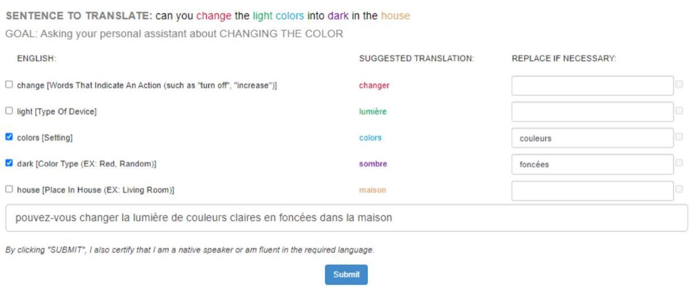
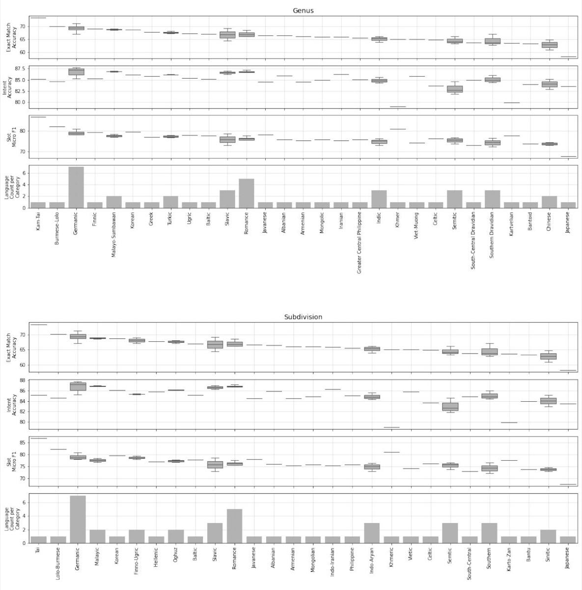
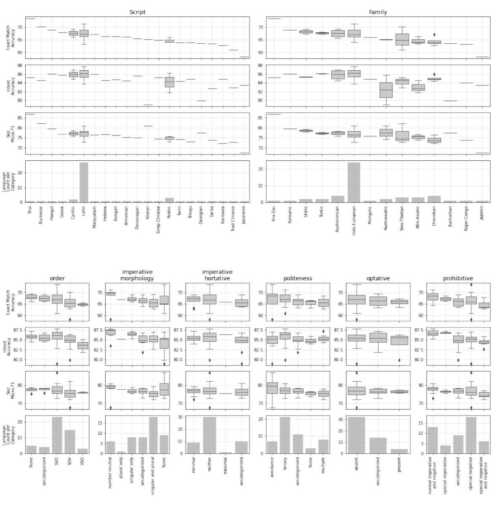

MASSIVE: A 1M-Example Multilingual Natural Language Understanding Dataset with 51 Typologically-Diverse Languages   

<table><tr><td> Jack FitzGerald*</td><td>Christopher Hench</td><td>Charith Peris</td></tr><tr><td> Scott Mackie</td><td> Kay Rottmann</td><td>Ana Sanchez</td></tr><tr><td>Aaron Nash</td><td>Liam Urbach</td><td>Vishesh Kakarala</td></tr><tr><td> Richa Singh</td><td>Swetha Ranganath</td><td>Laurie Crist</td></tr><tr><td>Misha Britan</td><td>Wouter Leeuwis</td><td>Gokhan Tur</td></tr><tr><td></td><td>Prem Natarajan</td><td></td></tr></table>

# Abstract

We present the MASSIVE dataset— Multilingual Amazon Slu resource package (SLURP) for Slot-filling, Intent classification, and Virtual assistant Evaluation. MASSIVE contains 1M realistic, parallel, labeled virtual assistant utterances spanning 51 languages, 18 domains, 60 intents, and 55 slots. MASSIVE was created by tasking professional translators to localize the English-only SLURP dataset into 50 typologically diverse languages from 29 genera. We also present modeling results on XLM-R and mT5, including exact match accuracy, intent classification accuracy, and slot-filling F1 score. We have released our dataset, modeling code, and models publicly.

# 1 Introduction and Description

Natural Language Understanding (NLU) is a machine’s ability to understand the meaning and relevant entities from text. For instance, given the utterance what is the temperature in new york, an NLU model might classify the intent as weather_query and fill the slots as weather_descriptor: temperature and place_name: new york. Our particular focus of NLU is one component of Spoken Language Understanding (SLU), in which raw audio is first converted to text before NLU is performed (Young, 2002; Wang et al., 2005; Tur and Mori, 2011). SLU is the foundation of voice-based virtual assistants like Alexa, Siri, and Google Assistant. Though virtual assistants have advanced incredibly in the past decade, they still only support a small fraction of the world’s $^ { 7 , 0 0 0 + }$ languages (Simons, 2022). Challenges for multilingualism span the software stack and a variety of operational considerations, but one difficulty in creating massively multilingual NLU models is the lack of labeled data for training and evaluation, particularly data that is realistic for the task and that is natural for each given language. High naturalness typically requires human-based vetting, which is often costly.

We present MASSIVE (Multilingual Amazon SLU Resource Package (SLURP) for Slot filling, Intent classification, and Virtual assistant Evaluation), a new 1M-example dataset composed of realistic, human-created virtual assistant utterance text spanning 51 languages, 60 intents, 55 slot types, and 18 domains. With the English seed data included, there are $5 8 7 \mathrm { k }$ train utterances, $1 0 4 \mathrm { k }$ dev utterances, $1 5 2 \mathrm { k }$ test utterances, and $1 5 3 \mathrm { k }$ utterances currently held out for the MMNLU-22 competition, which will be released after the competition. We have released our data, code, and models 1.

MASSIVE was created by localizing the SLURP NLU dataset (created only in English) in a parallel manner. SLURP is described further in Section 2, linguistic analyses of the dataset in Section 3, and the localization process in Section 4.3. Results for Massively Multilingual NLU (MMNLU) modeling, in which a single model can perform NLU on any of the incoming languages, are given in Section 5.

# 2 Related Work

Prior researchers have emphasized the need to explore the unique challenges of low-resource languages (Simpson et al., 2008; Strassel and Tracey, 2016; Cruz and Cheng, 2020; Lakew et al., 2020; Marivate et al., 2020; Magueresse et al., 2020; Goyal et al., 2021), while the growing number and size of language models (mBERT (Devlin, 2018), RoBERTa (Liu et al., 2019b), XLM (Lample and Conneau, 2019), XLM-R (Conneau et al., 2020), mBART (Liu et al., 2020), MARGE (Lewis et al., 2020), and mT5 (Xue et al., 2021) pre-trained on massively multilingual corpora have allowed for significant improvements in supporting them. However, the creation of evaluation datasets for specific tasks has not kept pace. Some tasks, such as Named Entity Recognition (NER) or translation, lend themselves to mining existing corpora (Tiedemann, 2012; Pan et al., 2017; Hu et al., 2020), while others such as NLU, the focus here, require the creation of new data and schema-specific annotations. Beyond the cost, even identifying a sufficient number of speakers for data generation and quality control can be difficult. Most studies have thus focused on collecting data for one such low-resource language and determining the utility of multilingual models or cross-lingual learning from more readily available languages. Moreover, such datasets are often isolated collections, creating an environment of multiple datasets not easily comparable across the different languages or tasks. There have been exceptions, such as SQuAD (Rajpurkar et al., 2016) and XQuAd (Artetxe et al., 2019), ATIS (Price, 1990), its Hindi and Turkish extension (Upadhyay et al., 2018), and MultiATIS $^ { + + }$ (Xu et al., 2020), and Snips (Coucke et al., 2018) with its addition of French (Saade et al., 2019), where researchers have extended popular English benchmark datasets to new languages. This work focuses on the general multi-domain NLU task and builds off the SLURP (Bastianelli et al., 2020) benchmark dataset to extend to an unprecedented 50 new languages.

For the task of NLU, the ATIS dataset has been popular in the NLP community since its first release. MultiATIS $^ { + + }$ was one of the first efforts to extend an NLU dataset across a significant number of languages (nine), yet remained in the limited domain of airline bookings. While proving an asset, it has been questioned what is left to learn from such a dataset (Tur et al., 2010). Facebook released a general Intelligent Virtual Assistant (IVA) dataset across the domains of Alarm, Reminder, and Weather (Schuster et al., 2019) created for the purpose of demonstrating cross-lingual transfer learning; and so did not need to be parallel or have an equal number of datapoints, resulting in far fewer examples in Thai $( 5 \mathrm { k } )$ compared to Spanish (7.6k) and English (43k). The Snips datasets (both the original English only and the English and French releases) are most similar to the NLU contained in the MASSIVE dataset, spanning smart home and music domains for a generic voice-based virtual assistant.

The first iteration for the foundation of the MASSIVE dataset was the NLU Evaluation Benchmarking Dataset, with $2 5 \mathrm { k }$ utterances across 18 domains (Liu et al., 2019a). The authors updated the dataset and added audio and ASR transcriptions in the release of the Spoken Language Understanding Resource Package (SLURP) (Bastianelli et al., 2020), allowing for full end-to-end Spoken Language Understanding (SLU) evaluation similar to the Fluent Speech Commands dataset (Lugosch et al., 2019) and Chinese Audio-Textual Spoken Language Understanding (CATSLU) (Zhu et al., 2019). An overview of selected existing NLU datasets can be seen in Table 1.

We release the MASSIVE dataset along with baselines from large pre-trained models fine-tuned on the NLU slot and intent prediction tasks. Early cross-lingual and multilingual NLU modeling approaches used projection or alignment methods (Yarowsky et al., 2001), focusing on string matching, edit distance, or consonant signatures (Ehrmann et al., 2011), lookup lexicons for lowresource languages (Mayhew et al., 2017), and aligning (Xie et al., 2018) or jointly training word embeddings (Singla et al., 2018). More recently, researchers have borrowed encoders from pre-trained neural translation models before building subsequent classifiers and NER models (Eriguchi et al., 2018; Schuster et al., 2019), also focusing on language-agnostic and language specific features to learn what information to share between languages (Chen et al., 2019b). Generative parsing has been demonstrated using sequence-to-sequence models and pointer networks (Rongali et al., 2020). With the rise of BERT and large pre-trained language models, we have also seen impressive demonstrations of zero-shot performance, where subword tokenization WordPiece overlap helps but is not even necessary to realize improvements (Pires et al., 2019; K et al., 2020), as well as production multilingual NLU improvements with distillation and full fine-tuning (FitzGerald et al., 2022). The translation task has then been incoporated in the pretraining (Wang et al., 2021) of these models or even as part of the final NLU hypothesis for streamlined multilingual production systems (FitzGerald,

Table 1: Selected NLU benchmark datasets with number of languages, utterances per language, domain count, intent count, and slot count.   

<table><tr><td>Name</td><td>#Lang</td><td>Utt per Lang</td><td>Domains</td><td>Intents</td><td>Slots</td></tr><tr><td>MASSIVE</td><td>51</td><td>19,521</td><td>18</td><td>60</td><td>55</td></tr><tr><td>SLURP (Bastianelli et al., 2020)</td><td>1</td><td>16,521</td><td>18</td><td>60</td><td>55</td></tr><tr><td>NLU Evaluation Data (Liu et al., 2019a)</td><td>1</td><td>25,716</td><td>18</td><td>54</td><td>56</td></tr><tr><td>Airline Travel Information System (ATIS) (Price,1990)</td><td>1</td><td>5,871</td><td>1</td><td>26</td><td>129</td></tr><tr><td>ATIS with Hindi and Turkish (Upadhyay et al., 2018)</td><td>3</td><td>1,315-5,871</td><td>1</td><td>26</td><td>129</td></tr><tr><td>MultiATIS++ (Xu et al., 2020)</td><td>9</td><td>1,422-5,897</td><td>1</td><td>21-26</td><td>99-140</td></tr><tr><td>Snips (Coucke et al., 2018)</td><td>1</td><td>14,484</td><td>-</td><td>7</td><td>53</td></tr><tr><td>Snips with French (Saade et al., 2019)</td><td>2</td><td>4,818</td><td>2</td><td>14-15</td><td>11-12</td></tr><tr><td>Task Oriented Parsing (TOP) (Gupta et al., 2018)</td><td>1</td><td>44,873</td><td>2</td><td>25</td><td>36</td></tr><tr><td>Multilingual Task-Oriented Semantic Parsing (MTOP) (Li et al., 2021)</td><td>6</td><td>15,195-22,288</td><td>11</td><td>104-113</td><td>72-75</td></tr><tr><td>Cross-lingual Multilingual Task Oriented Dialog (Schuster et al., 2019)</td><td>3</td><td>5,083-43,323</td><td>3</td><td>12</td><td>11</td></tr><tr><td>Microsoft Dialog Challenge (Li et al., 2018b)</td><td>1</td><td>38,276</td><td>3</td><td>11</td><td>29</td></tr><tr><td>Fluent Speech Commands (FSC) (Lugosch et al., 2019)</td><td>1</td><td>30,043</td><td>-</td><td>31</td><td>-</td></tr><tr><td>Chinese Audio-Textual Spoken Language Understanding (CATSLU) (Zhu et al., 2019)</td><td>1</td><td>16,258</td><td>4</td><td>-</td><td>94</td></tr></table>

2020). Researchers have propped up training data by translating and projecting labels into the target language (Xu et al., 2020) and discovered more sophisticated approaches to alignment such as translate and fill using mT5 to train the filler (Nicosia et al., 2021). Recent work has even delved into the application of these techniques to lower-resource languages such as Persian. For example, ParsiNLU explores a variety of NLU tasks for Parsi, finetuning mT5 of various sizes (Khashabi et al., 2021). Similarly these techniques have also been used, even a bit earlier, for text summarization (Farahani et al., 2021).

# 3 Language Selection and Linguistic Analysis

# 3.1 Language Selection

The languages in MASSIVE were chosen according to the following considerations. First, we acquired cost and worker availability estimates for over 100 languages, providing a constraint to our choices given our fixed budget. Second, we determined existing languages available in major virtual assistants, such that the dataset could be used to benchmark today’s systems. Third, we categorized the full pool of languages according to their genera as taken from the World Atlas of Linguistic Structures (WALS) database (Dryer and Haspelmath, 2013), where a genus is a language group that is clear to most linguists without systematic comparative analysis. Genus is a better indicator of typological diversity, which we sought to maximize, than language family (Dryer, 1989). Fourth, we used the eigenvector centrality of Wikipedia articles, tweets, and book translations (Ronen et al., 2014) as proxies for the internet influence and thus the resource availability of a given language, particularly for self-supervised pretraining applications, and we chose languages spanning the breadth of resource availability. Fifth, we examined the script of each language, seeking to increase script diversity to drive experimentation in tokenization and normalization.

Ultimately, we created 50 new, distinct text corpora, representing 49 different spoken languages. Mandarin Chinese was collected twice, once with native speakers who use the traditional set of characters, and once with native speakers who use the modern simplified set of characters. There are 14 language families in the dataset. The term “language family” usually refers to a group of languages which are known to be genetically related, that is, they all descend from a common ancestor language. In MASSIVE, we also include “language isolates” as families. These are languages that have no clear relationship to any known language. Our choices are given in Table 2.

# 3.2 Scripts

There are 21 distinct scripts used in the dataset. The majority of languages in MASSIVE (28 including English) use some variety of the Latin alphabet, which is also the most widely used script in the world. The Arabic script is used for three languages, the Cyrillic script for two languages, and the remaining 18 languages have “unique” scripts, in the sense that only one language in the dataset uses that script. Fourteen scripts are unique to a single language, although they may belong to a larger family of writing systems. For example, the Dravidian languages in MASSIVE have their own scripts, but are all members of the general Brahmi class of scripts. The other two scripts are unique in that only one language in the dataset uses them, but they are more widely used in the real world: Ge’ez and Chinese. Ge’ez is represented by Amharic in the dataset, but is used for several languages in East Africa, such as Tigrinya. The Chinese script is represented by Mandarin, but is used by other languages in China such as Cantonese.

<table><tr><td>Code</td><td>Name</td><td>Script</td><td>Genus</td><td>Code</td><td>Name</td><td>Script</td><td>Genus</td><td>Code</td><td>Name</td><td>Script</td><td>Genus</td></tr><tr><td>af-ZA</td><td>Afrikaans</td><td>Latn</td><td>Germanic</td><td>hy-AM</td><td>Armenian</td><td>Armn</td><td>Armenian</td><td>pl-PL</td><td>Polish</td><td>Latn</td><td>Slavic</td></tr><tr><td>am-ET</td><td>Amharic</td><td>Ethi</td><td>Semitic</td><td>id-ID</td><td>Indonesian</td><td>Latn</td><td>Malayo-Sumbawan</td><td>pt-PT</td><td>Portuguese</td><td>Latn</td><td>Romance</td></tr><tr><td>ar-SA</td><td>Arabic</td><td>Arab</td><td>Semitic</td><td>is-IS</td><td>Icelandic</td><td>Latn</td><td>Germanic</td><td>ro-RO</td><td>Romanian</td><td>Latn</td><td>Romance</td></tr><tr><td>az-AZ</td><td>Azerbaijani</td><td>Latn</td><td>Turkic</td><td>it-IT</td><td>Italian</td><td>Latn</td><td>Romance</td><td>ru-RU</td><td>Russian</td><td>Cyrl</td><td>Slavic</td></tr><tr><td>bn-BD</td><td>Bengali</td><td>Beng</td><td>Indic</td><td>ja-JP</td><td>Japanese</td><td>Jpan</td><td>Japanese</td><td>sl-SI</td><td>Slovenian</td><td>Latn</td><td>Slavic</td></tr><tr><td>cy-GB</td><td>Welsh</td><td>Latn</td><td>Celtic</td><td>jv-ID</td><td>Javanese</td><td>Latn</td><td>Javanese</td><td>sq-AL</td><td>Albanian</td><td>Latn</td><td>Albanian</td></tr><tr><td>da-DK</td><td>Danish</td><td>Latn</td><td>Germanic</td><td>ka-GE</td><td>Georgian</td><td>Geor</td><td>Kartvelian</td><td>sv-SE</td><td>Swedish</td><td>Latn</td><td>Germanic</td></tr><tr><td>de-DE</td><td>German</td><td>Latn</td><td>Germanic</td><td>km-KH</td><td>Khmer</td><td>Khmr</td><td>Khmer</td><td>sw-KE</td><td>Swahili</td><td>Latn</td><td>Bantoid</td></tr><tr><td>el-GR</td><td>Greek</td><td>Grek</td><td>Greek</td><td>kn-IN</td><td>Kannada</td><td>Knda</td><td>Southern Dravidian</td><td>ta-IN</td><td>Tamil</td><td>Taml</td><td>Southern Dravidian</td></tr><tr><td>en-US</td><td>English</td><td>Latn</td><td>Germanic</td><td>ko-KR</td><td>Korean</td><td>Kore</td><td>Korean</td><td>te-IN</td><td>Telugu</td><td>Telu</td><td>South-Central Dravidian</td></tr><tr><td>es-ES</td><td>Spanish</td><td>Latn</td><td>Romance</td><td>lv-LV</td><td>Latvian</td><td>Latn</td><td>Baltic</td><td>th-TH</td><td>Thai</td><td>Thai</td><td>Kam-Tai</td></tr><tr><td>fa-IR</td><td>Persian</td><td>Arab</td><td>Iranian</td><td>ml-IN</td><td>Malayalam</td><td>Mlym</td><td>Southern Dravidian</td><td>tl-PH</td><td>Tagalog</td><td>Latn</td><td>Greater Central Philippine</td></tr><tr><td>fi-FI</td><td>Finnish</td><td>Latn</td><td>Finnic</td><td>mn-MN</td><td>Mongolian</td><td>Cyrl</td><td>Mongolic</td><td>tr-TR</td><td>Turkish</td><td>Latn</td><td>Turkic</td></tr><tr><td>fr-FR</td><td>French</td><td>Latn</td><td>Romance</td><td>ms-MY</td><td>Malay</td><td>Latn</td><td>Malayo-Sumbawan</td><td>ur-PK</td><td>Urdu</td><td>Arab</td><td>Indic</td></tr><tr><td>he-IL</td><td>Hebrew</td><td>Hebr</td><td>Semitic</td><td>my-MM</td><td>Burmese</td><td>Mymr</td><td>Burmese-Lolo</td><td>vi-VN</td><td>Vietnamese</td><td>Latn</td><td>Viet-Muong</td></tr><tr><td>hi-IN</td><td>Hindi</td><td>Deva</td><td>Indic</td><td>nb-NO</td><td>Norwegian</td><td>Latn</td><td>Germanic</td><td>zh-CN</td><td>Mandarin</td><td>Hans</td><td>Chinese</td></tr><tr><td>hu-HU</td><td>Hungarian</td><td>Latn</td><td>Ugric</td><td>nl-NL</td><td>Dutch</td><td>Latn</td><td>Germanic</td><td>zh-TW</td><td>Mandarin</td><td>Hant</td><td>Chinese</td></tr></table>

Table 2: The 51 languages of MASSIVE, including scripts and genera.

# 3.3 Sentence Types

MASSIVE consists of utterances directed at a device, rather than a person, which has some consequences for the type of linguistic patterns it contains. Specifically, the corpus primarily consists of interrogatives (i.e., questions) and imperatives (commands or requests). There are relatively few declarative utterances in the set. This is in contrast to many large datasets from other sources (e.g., wikipedia, movie scripts, newspapers) which contain a high proportion of declaratives, since the language is collected from situations where humans are communicating with humans.

In the context of a voice assistant, a user typically asks a device to perform an action or answer a question, so declaratives are less common. For instance, a person might use an imperative “tell me if it calls for rain today” or ask a question “will it rain today,” but they would not tell their device “it’s raining today.” When declaratives are used with voice assistants, they generally have the pragmatic effect of a directive. For instance, a virtual assistant can respond to the declarative “it’s cold in here” by turning up the temperature (Thattai et al., 2020). Although syntactically it looks like a declarative, such an utterance has the force of an imperative.

The standard unit of analysis in linguistics is the declarative sentence, and there is relatively less known about imperatives and questions. MASSIVE presents an opportunity to study these sentence forms, and the parallel nature of the corpus makes cross-linguistic comparisons even easier.

# 3.4 Word Order

Languages have intricate rules for ordering words depending on the word-type and sentence-type. In English, the word order for statements (“you are leaving”) is different from questions (“are you leaving?”). This is not mandatory, and sometimes the pitch of the voice is enough to indicate a question (e.g. “you’re leaving?” with a rising intonation).

When considering word order at a typological level, it is common to simplify the situation and consider only affirmative declarative sentences and only three grammatical elements: the verb (V), its subject (S), and its object (O). This makes for six possible word orders: SVO, SOV, VOS, VSO, OVS, and OSV. All six orders have been documented, although the overwhelming majority of languages use Subject-initial ordering, while Object-initial ordering is extremely rare.

In MASSIVE, 39 languages are subject-initial (24 SVO and 15 SOV), while only three are verb-initial (VSO specifically). No object-initial languages are represented. Five languages are marked in WALS as having no preferred word order, and four do not have any word order data at all.

# 3.5 Imperative Marking

The languages in MASSIVE have a variety of ways of indicating the imperative mood of an utterance. The majority of them (33) use some kind of verb morphology, such as adding a suffix. About half of those languages (18) have distinct imperative marking for singular or plural addressees. The utterances in MASSIVE are technically directed at a single addressee, the voice assistant, but since some languages use the plural as an indicator of politeness (see below) all varieties of imperatives will likely occur in this dataset. There are ten languages without any special morphology, and they indicate imperative through other means, such as word order or vocabulary choice.

Ten languages in the dataset have a specialized distinction between imperatives, for commands directed at another individual, and “hortatives”, where the command also includes the speaker. English verbs are not directly marked for hortative, but the auxiliary verb “let” can convey the mood instead. For example, “write this down” is an imperative and only the addressee need write anything, while “let’s write this down” is a hortative and the speaker is also expected to write. The pervasiveness of hortatives in the context of a voice assistant is an open question.

Four languages have “optative” moods, which are subtly different from imperatives. In the optative, a speaker expresses a wish or desire, as opposed to giving a direct command. However, in the right context, an optative may carry the same pragmatic weight as an imperative, and strongly imply that someone ought to do something. English has no specific optative form, but a similar mood can be conveyed using conditionals. For example, “buy this bag for me” is an imperative while “if only someone would buy me this bag” is closer to an optative. Optative forms are not well studied in linguistics, as they require specific contexts which can be difficult to create during field work, but they may be more common in device-directed utterances.

Lastly, some languages distinguish between imperatives, when telling someone to do something, and “prohibitives”, when telling someone not to do something. In the MASSIVE set, there are 18 languages with specialized negative particles which can only co-occur with imperative verbs. Vietnamese for instance uses the words “chang” or ˘ “không” to negate declarative sentences, but uses “chó” or “dung” to negate imperatives. Another ten languages have special verbs for the prohibitive, although these may overlap with other grammatical features of the language. In Spanish, for example, the prohibitive form of a verb is the same as the subjunctive form.

# 3.6 Politeness

Many languages encode different levels of politeness through their use of pronouns. Many European languages distinguish between “familiar” and “formal” pronouns, with the “formal” pronouns often morphologically identical to a plural. In French, the second-person singular “tu” is used between friends, while the second-person plural “vous” is used when speaking to a group, or to an individual of higher social rank (such as an employee to a manager). These politeness systems are heavily influenced by social context, and the MASSIVE dataset gives us a chance to see how people adapt their language when speaking to a virtual assistant instead of another human.

Nearly half of the languages in MASSIVE (21) make a two-way formal/informal distinction in their second-person pronouns. This is probably due to the fact that most MASSIVE languages are European, and the binary politeness distinctions are the most common strategy in that family. A further eight languages have more than two levels of formality, such as informal, formal, and honorific. Seven languages have an “avoidance” strategy, which means that pronouns are omitted entirely in a polite scenario. Finally, eleven languages have no data on politeness in WALS at all.

# 4 Collection Setup and Execution

# 4.1 Heldout Evaluation Split

We randomly sampled a subset of the English seed data which was then paraphrased by professional annotators, resulting in new, more challenging utterances, including $49 \%$ more slots per utterance. These utterances were localized along with the other splits to be used as a held out evaluation set for the Massively Multilingual NLU-22 competition and workshop 2

# 4.2 Vendor Selection and Onboarding

The MASSIVE dataset was collected using a customized workflow powered by Amazon MTurk. We required a vendor pool with the capability and resources to collect a large multilingual dataset. Our original vendor pool consisted of five vendors adjudicated based on previous engagements. This vendor pool was reduced to three based on engagement and resource availability. Vendors for each language were selected based on their resource availability and proposed cost. A majority of languages were supported by a single vendor, while some languages required cross-vendor support to be completed with the required quality and within the required timeline.

We offered two mechanisms to vendors for evaluating workers to be selected for each language. The first, which was used to select workers for the translation task, was an Amazon MTurk-hosted fluency test where workers listen to questions and statements in the relevant language and were evaluated using a multiple-choice questionnaire. The second, which was used to select workers for the judgment task, was a test with a set of three judgments that the vendor could use to assess if workers were able to detect issues in the translated utterances. In order to further improve worker selection quality, we created a translator quiz using the Amazon MTurk instructions that were created for translation and judgment tasks, coupled with customized locallanguage examples. The workers were required to prove that they understood the instructions for the project based on a series of questions.

Before commencing operations, an initial pilot run of this customized workflow was completed in three languages. A few workers per vendor were chosen to engage in this exercise. The pilot run helped improve clarity of instructions, determine reporting methods, and share open questions.

should be retained. The metadata of the released dataset includes whether the worker elected to “localize,” “translate,” or keep the slot “unchanged,” primarily for the purposes of researchers evaluating machine translation systems, where it would be unreasonable to expect the system to “localize” to a specific song name the worker selected.

After the slot task, the second worker is asked to translate or localize the entire phrase using the slot task output provided by the first worker (see Figure 2). The phrase worker can decide to keep the slot as it was translated, modify it, or remove it entirely if it is not relevant for the language in that scenario. This worker is also responsible for aligning grammatical genders or prepositional affixes to any of the slots.

Note that this two-step system alleviates the annotation burden often encountered with such work. Traditionally in such collections, workers would be given a light annotation guide and asked to highlight spans of the slots in a translated or localized utterance. In this system, the first step of slot translation and subsequent insertion obviates the need for workers to understand nuanced span notation, which can be complex for highly inflected languages (prepositions outside the span in English would not be carried over in the localization, but would be in the traditional span annotation workflow).

# 4.3 Collection Workflows

The collection was conducted by locale on an individual utterance level. Each utterance from the “train,” “dev,” “test,” and “heldout” splits of the SLURP dataset went through two sequential task workflows and a judgment workflow. The first task is slot translation or localization (see Figure 1). Workers are presented the entire utterance with colored highlighting of the slot values for the utterance (if any) and then presented with each slot value and its corresponding label individually. The worker is asked to either localize or translate the slot, depending on whether the value should be translated (e.g., “tomorrow”) or localized (e.g., the movie “La La Land”, which in French is “Pour l’amour d’Hollywood.” Other entities like regionally known songs or artists could also be localized to a more relevant, known song or artist for that language or region). There is also an option to keep the slot as is, such as for names (e.g., “Taylor Swift”) or proper nouns where the original English spelling

# 4.4 Quality Assurance

The output of the second workflow (the fully localized utterance) is judged by three workers for (1) whether the utterance matches the intent semantically, (2) whether the slots match their labels semantically, (3) grammaticality and naturalness, (4) spelling, and (5) language identification—English or mixed utterances are acceptable if that is natural for the language, but localizations without any tokens in the target language were not accepted. See Figure 3 for how this is presented to the Amazon MTurk worker. These judgments are also included in the metadata of the dataset. In addition to the workers judging each other’s work, the collection system had alarms in place for workers with high rejection rates, high rates of slot deletion, and high rates of English tokens in the translations. Workers were also monitored to see if their tasks were primarily machine translated. Such workers were removed from the pool and all of their work was resubmitted to be completed by the other workers.

Additionally, the authors performed several deep dives into languages with which they were familiar.

# 5 Model Benchmarking

# 5.1 Setup

As initial model benchmarks, we fine-tuned publicly-available pre-trained language models on the MASSIVE dataset and evaluated them on intent classification and slot filling. Our models of choice for this exercise were XLM-Roberta (XLM-R; Conneau et al. 2020) and mT5 (Xue et al., 2021).

In the case of XLM-R, we utilized the pretrained encoder with two separate classification heads trained from scratch, based on JointBERT (Chen et al., 2019a). The first classification head used the pooled output from the encoder to predict the intent and the second used the sequence output to predict the slots. As pooling for the intent classification head, we experimented with using hidden states from the first position, averaged hidden states across the sequence, and the maximally large hidden state from the sequence.

With mT5, we explored two separate architectures. In one architecture, we only used the pre-trained encoder extracted from mT5, and we trained two classification heads from scratch similarly to the XLM-R setup. We refer to this setup as mT5 Encoder-Only. In the other architecture, we used the full sequence-to-sequence mT5 model in text-to-text mode, where the input is “Annotate:” followed by the unlabeled utterance. The decoder output is a sequence of labels (including the Other label) for all of the tokens followed by the intent. We did not add the slots and intents to the vocabulary, but we instead allowed them to be tokenized into subwords. We refer to this model as mT5 Text-to-Text. For all models, we used the Base size, which corresponds to 270M parameters for XLM-R, 258M parameters for mT5 Encoder-Only, and 580M parameters for mT5 Text-to-Text, including 192M parameters for embeddings for all three.

For each model, we performed 128 trials of hyperparameter tuning using the Tree of Parzen Estimators algorithm and Asynchronous Successive Halving Algorithm (ASHA) (Li et al., 2018a) for scheduling, which are both part of the hyperopt library (Bergstra et al., 2013) integrated into the ray[tune] library (Liaw et al., 2018), which is itself integrated into the Trainer from the transformers library (Wolf et al., 2020), which we used for modeling and for our pretrained models. Our hyperparameter search spaces, sampling types, and final choices are given in Table 5. We trained our models with the Adam optimizer (Kingma and Ba, 2017) and chose the best performing model checkpoint based on overall exact match accuracy across all locales. Hyperparameter tuning and fine-tuning was performed using single p3dn.24xlarge instances ( $_ { \mathrm { ~ 8 ~ x ~ } }$ Nvidia v100) for XLM-R and mT5 Text-to-Text and a single g4dn.metal instance ( $\boldsymbol { \mathrm { ~ \ 8 ~ x ~ } }$ Nvidia T4) for mT5 Encoder-Only. Hyperparameter tuning times were less than 4 days per model and training times were less than 1 day per model.

Our dataset includes several languages where white spacing is not used as a word delimiter. In some cases, spaces do occur, but they might serve as phrase delimiters or denote the end of a sentence. Three of these written languages, Japanese, Chinese (Traditional), and Chinese (Simplified), do not use spaces anywhere except to identify the end of a sentence. For these languages, we separate each character in the unlabeled input with a whitespace. We leave exploration of more sophisticated techniques (such as MeCab for Japanese; Kudo 2005) to future work. We use the default spacing provided by annotators for all other languages.

Zero-shot performance was also assessed, in which the models were trained on English data, validation was performed on all languages, and testing was performed on all non-English locales.

# 5.2 Results and Analysis

Table 3 shows the results for each model and training setup, including those for the best performing locale, the worst performing locale, and locale-averaged results for intent accuracy, microaveraged slot F1 score, and exact match accuracy. Zero-shot exact match performance is 25-37 points worse than that of full-dataset training runs. Additionally, the variance in task performance across locales is significantly greater for the zero-shot setup than for full-dataset training. For example, there is a 15 point difference in exact match accuracy between the highest and lowest locales for mT5 Text-to-Text when using the full training set, while the gap expands to 44 points with zero-shot.

We compared the pretraining data quantities by language for XLM-R to its per-language task performance values, and in the zero shot setup, we found a Pearson correlation of 0.54 for exact match accuracy, 0.58 for intent accuracy, and 0.46 for micro-averaged slot F1 score. In the full dataset training setup, the correlations decrease to 0.42 for exact match accuracy, 0.47 for intent accuracy, and 0.24 for micro-averaged slot F1 score. This suggests that the constant per-language data quantities in MASSIVE help to mitigate the effects of the language-skewed pretraining data distribution.

<table><tr><td rowspan="2">Model</td><td colspan="3">Intent Acc (%)</td><td colspan="3">Slot F1 (%)</td><td colspan="3">Exact Match Acc (%)</td></tr><tr><td>High</td><td>Low</td><td>Avg</td><td>High</td><td>Low</td><td>Avg</td><td>High</td><td>Low</td><td>Avg</td></tr><tr><td>mT5 Base Text-to-Text</td><td>87.9 ± 1.2 en-US</td><td>79.0 ± 1.5</td><td>85.3± 0.2</td><td>86.8 ± 0.7</td><td>67.6 ± 0.4</td><td>76.8 ± 0.1</td><td>73.4 ± 1.6</td><td>58.3 ±1.8</td><td>66.6± 0.2</td></tr><tr><td>mT5 Base</td><td>89.0 ± 1.1</td><td>km-KH 79.1 ± 1.5</td><td>86.1± 0.2</td><td>th-TH 85.7± 0.7</td><td>ja-JP 64.5 ± 0.4</td><td>75.4 ± 0.1</td><td>th-TH 72.3 ±1.6</td><td>ja-JP 57.8 ±1.8</td><td>65.9 ± 0.2</td></tr><tr><td>Encoder-Only XLM-R Base</td><td>en-US 88.3 ± 1.2 en-US</td><td>km-KH 77.2 ± 1.5</td><td>85.1± 0.2</td><td>th-TH 83.5± 0.7 th-TH</td><td>ja-JP 63.3 ± 0.4 ja-JP</td><td>73.6±0.1</td><td>th-TH 70.1 ±1.6 th-TH</td><td>ja-JP 55.8 ±1.8 ja-JP</td><td>63.7 ± 0.2</td></tr></table>

(a) Test results when using the full training set

Table 3: Modeling results for (a) training runs on the full training dataset and (b) zero-shot training runs, in which training was performed only with en-US data, validation was performed with all locales, and testing was performed on all locales except for en-US. Each table includes the highest locale, the lowest locale, and locale-averaged results for intent accuracy, micro-averaged slot F1 score, and exact match accuracy. Intervals for $9 5 \%$ confidence are given assuming normal distributions.   

<table><tr><td rowspan="2">Model</td><td colspan="3">Intent Acc (%)</td><td colspan="3">Slot F1 (%)</td><td colspan="3">Exact Match Acc (%)</td></tr><tr><td>High</td><td>Low</td><td>Avg</td><td>High</td><td>Low</td><td>Avg</td><td>High</td><td>Low</td><td>Avg</td></tr><tr><td>mT5 Base Text-to-Text</td><td>79.9 ± 1.4 nl-NL</td><td>25.7 ± 1.6 ja-JP</td><td>62.9 ± 0.2</td><td>64.3 ± 0.7 de-DE</td><td>13.9 ± 0.3 ja-JP</td><td>44.8 ± 0.1</td><td>53.2 ±1.8 Sv-SE</td><td>9.4 ±1.0 ja-JP</td><td>34.7 ± 0.2</td></tr><tr><td rowspan="3">mT5 Base Encoder-Only XLM-R Base</td><td>76.4 ± 1.5</td><td>27.1 ± 1.6</td><td>61.2 ±0.2</td><td>59.5 ± 1.0</td><td>6.3 ± 0.2</td><td>41.6 ± 0.1</td><td>44.3 ± 1.8</td><td>4.2 ± 0.7</td><td>28.8±0.2</td></tr><tr><td>nl-NL 85.2 ± 1.3</td><td>ja-JP 44.8±1.8</td><td>70.6± 0.2</td><td>th-TH 68.4± 0.7</td><td>ja-JP 15.4 ± 0.3</td><td>50.3± 0.1</td><td>sv-SE 57.9 ± 1.8</td><td>ja-JP 9.8 ± 1.1</td><td></td></tr><tr><td>Sv-SE</td><td> ja-JP</td><td></td><td>Sv-SE</td><td>ja-JP</td><td></td><td>Sv-SE</td><td> ja-JP</td><td>38.7 ± 0.2</td></tr></table>

(b) Zero-shot test results after training only on en-US

In Thai, for which spacing is optional, the model can learn from artificial spacing in the input (around where the slots will be) to improve task performance. For Khmer, the workers had a difficult time adapting their translations and localizations to properly-slotted outputs given the space-optional nature of the language. Additionally, for Japanese and Chinese, we added spaces between all characters when modeling. These single-character inputs differ from the non-spaced inputs used during pretraining, which would be chunked into groups of characters by the tokenizer with corresponding embeddings. By splitting into single characters, we don’t allow the model to the use embeddings learned for chunks of characters. This is a likely major cause of the drop in exact match accuracy for Japanese from $5 8 . 3 \%$ when training on the full dataset to $9 . 4 \%$ for zero shot. In the zero shot setup, the model relies solely on pretrained data representations, and individually-spaced characters are rare in the pretraining data. That said, character spacing was necessary in order to properly assign the slots to the right characters. As mentioned in Section 5.1, we leave exploration of more sophisticated spacing techniques for slot filling (such as MeCab; Kudo 2005) to future work.

Discounting for artificial spacing effects, Germanic genera and Latin scripts performed the best overall (See Appendix E), which is unsurprising given the amount of pretraining data for those genera and scripts, as well as the quantity of Germanic and Latin-script languages in MASSIVE. Within the Germanic genera, Swedish, English, Danish, Norwegian, and Dutch all performed comparably (within $9 5 \%$ confidence bounds) for exact match accuracy. Icelandic was the lowest-performing Germanic language, likely due to a lack of pretraining data, as well as to its linguistic evolution away from the others due to isolated conditions.

# 6 Conclusion

We have released a truly MASSIVE multilingual dataset for NLU spanning 51 typologically diverse languages. Our hope is that MASSIVE will encourage many new innovations in massively multilingual NLU, other NLP tasks such as machine translation, and new linguistic analyses, such as with imperative morphologies.

# References

Mikel Artetxe, Sebastian Ruder, and Dani Yogatama. 2019. On the cross-lingual transferability of monolingual representations. CoRR, abs/1910.11856.

Emanuele Bastianelli, Andrea Vanzo, Pawel Swietojanski, and Verena Rieser. 2020. SLURP: A spoken language understanding resource package. In Proceedings of the 2020 Conference on Empirical Methods in Natural Language Processing (EMNLP), pages 7252–7262, Online. Association for Computational Linguistics.

James Bergstra, Daniel Yamins, and David Cox. 2013. Making a science of model search: Hyperparameter optimization in hundreds of dimensions for vision architectures. In Proceedings of the 30th International Conference on Machine Learning, volume 28 of Proceedings of Machine Learning Research, pages 115– 123, Atlanta, Georgia, USA. PMLR.

Qian Chen, Zhu Zhuo, and Wen Wang. 2019a. Bert for joint intent classification and slot filling. ArXiv, abs/1902.10909.

Xilun Chen, Ahmed Hassan Awadallah, Hany Hassan, Wei Wang, and Claire Cardie. 2019b. Multisource cross-lingual model transfer: Learning what to share. In Proceedings of the 57th Annual Meeting of the Association for Computational Linguistics, pages 3098–3112, Florence, Italy. Association for Computational Linguistics.

Alexis Conneau, Kartikay Khandelwal, Naman Goyal, Vishrav Chaudhary, Guillaume Wenzek, Francisco Guzmán, Edouard Grave, Myle Ott, Luke Zettlemoyer, and Veselin Stoyanov. 2020. Unsupervised cross-lingual representation learning at scale. In Proceedings of the 58th Annual Meeting of the Association for Computational Linguistics, pages 8440– 8451, Online. Association for Computational Linguistics.

Alice Coucke, Alaa Saade, Adrien Ball, Théodore Bluche, Alexandre Caulier, David Leroy, Clément Doumouro, Thibault Gisselbrecht, Francesco Caltagirone, Thibaut Lavril, Maël Primet, and Joseph Dureau. 2018. Snips voice platform: an embedded spoken language understanding system for privateby-design voice interfaces.

Jan Christian Blaise Cruz and Charibeth Cheng. 2020. Establishing baselines for text classification in lowresource languages.

Jacob Devlin. 2018. Multiligual bert.

Matthew S. Dryer. 1989. Large linguistic areas and language sampling. Studies in Language, 13:257–292.

Matthew S. Dryer and Martin Haspelmath, editors. 2013. WALS Online. Max Planck Institute for Evolutionary Anthropology, Leipzig.

Maud Ehrmann, Marco Turchi, and Ralf Steinberger. 2011. Building a multilingual named entityannotated corpus using annotation projection. In Proceedings of the International Conference Recent Advances in Natural Language Processing 2011, pages 118–124, Hissar, Bulgaria. Association for Computational Linguistics.

Akiko Eriguchi, Melvin Johnson, Orhan Firat, Hideto Kazawa, and Wolfgang Macherey. 2018. Zero-shot cross-lingual classification using multilingual neural machine translation.

Mehrdad Farahani, Mohammad Gharachorloo, and Mohammad Manthouri. 2021. Leveraging parsbert and pretrained mt5 for persian abstractive text summarization. 2021 26th International Computer Conference, Computer Society of Iran (CSICC).

Jack FitzGerald, Shankar Ananthakrishnan, Konstantine Arkoudas, Davide Bernardi, Abhishek Bhagia, Claudio Delli Bovi, Jin Cao, Rakesh Chada, Amit Chauhan, Luoxin Chen, Anurag Dwarakanath, Satyam Dwivedi, Turan Gojayev, Karthik Gopalakrishnan, Thomas Gueudre, Dilek Hakkani-Tur, Wael Hamza, Jonathan Hueser, Kevin Martin Jose, Haidar Khan, Beiye Liu, Jianhua Lu, Alessandro Manzotti, Pradeep Natarajan, Karolina Owczarzak, Gokmen Oz, Enrico Palumbo, Charith Peris, Chandana Satya Prakash, Stephen Rawls, Andy Rosenbaum, Anjali Shenoy, Saleh Soltan, Mukund Harakere Sridhar, Liz Tan, Fabian Triefenbach, Pan Wei, Haiyang Yu, Shuai Zheng, Gokhan Tur, and Prem Natarajan. 2022. Alexa teacher model: Pretraining and distilling multi-billion-parameter encoders for natural language understanding systems). In Proceedings of the 28th ACM SIGKDD Conference on Knowledge Discovery and Data Mining, KDD. ACM.

Jack G. M. FitzGerald. 2020. Stil – simultaneous slot filling, translation, intent classification, and language identification: Initial results using mbart on multiatis $^ { + + }$ .

Naman Goyal, Cynthia Gao, Vishrav Chaudhary, PengJen Chen, Guillaume Wenzek, Da Ju, Sanjana Krishnan, Marc’Aurelio Ranzato, Francisco Guzman, and Angela Fan. 2021. The flores-101 evaluation benchmark for low-resource and multilingual machine translation.

Sonal Gupta, Rushin Shah, Mrinal Mohit, Anuj Kumar, and Mike Lewis. 2018. Semantic parsing for task oriented dialog using hierarchical representations. In Proceedings of the 2018 Conference on Empirical Methods in Natural Language Processing, pages 2787–2792, Brussels, Belgium. Association for Computational Linguistics.

Junjie Hu, Sebastian Ruder, Aditya Siddhant, Graham Neubig, Orhan Firat, and Melvin Johnson. 2020. Xtreme: A massively multilingual multi-task benchmark for evaluating cross-lingual generalization.

Karthikeyan K, Zihan Wang, Stephen Mayhew, and Dan Roth. 2020. Cross-lingual ability of multilingual bert: An empirical study.

Daniel Khashabi, Arman Cohan, Siamak Shakeri, Pedram Hosseini, Pouya Pezeshkpour, Malihe Alikhani, Moin Aminnaseri, Marzieh Bitaab, Faeze Brahman, Sarik Ghazarian, Mozhdeh Gheini, Arman Kabiri, Rabeeh Karimi Mahabadi, Omid Memarrast, Ahmadreza Mosallanezhad, Erfan Noury, Shahab Raji, Mohammad Sadegh Rasooli, Sepideh Sadeghi, Erfan Sadeqi Azer, Niloofar Safi Samghabadi, Mahsa Shafaei, Saber Sheybani, Ali Tazarv, and Yadollah Yaghoobzadeh. 2021. Parsinlu: A suite of language understanding challenges for persian.

Diederik P. Kingma and Jimmy Ba. 2017. Adam: A method for stochastic optimization.

Takumitsu Kudo. 2005. Mecab : Yet another part-ofspeech and morphological analyzer.

Surafel M. Lakew, Matteo Negri, and Marco Turchi. 2020. Low resource neural machine translation: A benchmark for five african languages.

Guillaume Lample and Alexis Conneau. 2019. Crosslingual language model pretraining.

Mike Lewis, Marjan Ghazvininejad, Gargi Ghosh, Armen Aghajanyan, Sida Wang, and Luke Zettlemoyer. 2020. Pre-training via paraphrasing.

Haoran Li, Abhinav Arora, Shuohui Chen, Anchit Gupta, Sonal Gupta, and Yashar Mehdad. 2021. MTOP: A comprehensive multilingual task-oriented semantic parsing benchmark. In Proceedings of the 16th Conference of the European Chapter of the Association for Computational Linguistics: Main Volume, pages 2950–2962, Online. Association for Computational Linguistics.

Liam Li, Kevin G. Jamieson, Afshin Rostamizadeh, Ekaterina Gonina, Moritz Hardt, Benjamin Recht, and Ameet S. Talwalkar. 2018a. Massively parallel hyperparameter tuning. ArXiv, abs/1810.05934.

Xiujun Li, Yu Wang, Siqi Sun, Sarah Panda, Jingjing Liu, and Jianfeng Gao. 2018b. Microsoft dialogue challenge: Building end-to-end task-completion dialogue systems.

Richard Liaw, Eric Liang, Robert Nishihara, Philipp Moritz, Joseph E Gonzalez, and Ion Stoica. 2018. Tune: A research platform for distributed model selection and training. arXiv preprint arXiv:1807.05118.

Xingkun Liu, Arash Eshghi, Pawel Swietojanski, and Verena Rieser. 2019a. Benchmarking natural language understanding services for building conversational agents.

Yinhan Liu, Jiatao Gu, Naman Goyal, Xian Li, Sergey Edunov, Marjan Ghazvininejad, Mike Lewis, and Luke Zettlemoyer. 2020. Multilingual denoising pre-training for neural machine translation.

Yinhan Liu, Myle Ott, Naman Goyal, Jingfei Du, Mandar Joshi, Danqi Chen, Omer Levy, Mike Lewis, Luke Zettlemoyer, and Veselin Stoyanov. 2019b. Roberta: A robustly optimized bert pretraining approach.

Loren Lugosch, Mirco Ravanelli, Patrick Ignoto, Vikrant Singh Tomar, and Yoshua Bengio. 2019. Speech Model Pre-Training for End-to-End Spoken Language Understanding. In Proc. Interspeech 2019, pages 814–818.

Alexandre Magueresse, Vincent Carles, and Evan Heetderks. 2020. Low-resource languages: A review of past work and future challenges.

Vukosi Marivate, Tshephisho Sefara, Vongani Chabalala, Keamogetswe Makhaya, Tumisho Mokgonyane, Rethabile Mokoena, and Abiodun Modupe. 2020. Investigating an approach for low resource language dataset creation, curation and classification: Setswana and sepedi. In Proceedings of the first workshop on Resources for African Indigenous Languages, pages 15–20, Marseille, France. European Language Resources Association (ELRA).

Stephen Mayhew, Chen-Tse Tsai, and Dan Roth. 2017. Cheap translation for cross-lingual named entity recognition. In Proceedings of the 2017 Conference on Empirical Methods in Natural Language Processing, pages 2536–2545, Copenhagen, Denmark. Association for Computational Linguistics.

Massimo Nicosia, Zhongdi Qu, and Yasemin Altun. 2021. Translate & Fill: Improving zero-shot multilingual semantic parsing with synthetic data. In Findings of the Association for Computational Linguistics: EMNLP 2021, pages 3272–3284, Punta Cana, Dominican Republic. Association for Computational Linguistics.

Xiaoman Pan, Boliang Zhang, Jonathan May, Joel Nothman, Kevin Knight, and Heng Ji. 2017. Crosslingual name tagging and linking for 282 languages. In ACL.

Telmo Pires, Eva Schlinger, and Dan Garrette. 2019. How multilingual is multilingual BERT? In Proceedings of the 57th Annual Meeting of the Association for Computational Linguistics, pages 4996– 5001, Florence, Italy. Association for Computational Linguistics.

P. J. Price. 1990. Evaluation of spoken language systems: the ATIS domain. In Speech and Natural Language: Proceedings of a Workshop Held at Hidden Valley, Pennsylvania, June 24-27,1990.

Pranav Rajpurkar, Jian Zhang, Konstantin Lopyrev, and Percy Liang. 2016. Squad: $^ { 1 0 0 , 0 0 0 + }$ questions for machine comprehension of text.

Shahar Ronen, Bruno Gonçalves, Kevin Z. Hu, Alessandro Vespignani, Steven Pinker, and César A. Hidalgo. 2014. Links that speak: The global language network and its association with global fame. Proceedings of the National Academy of Sciences, 111(52):E5616–E5622.

Subendhu Rongali, Luca Soldaini, Emilio Monti, and Wael Hamza. 2020. Don’t parse, generate! a sequence to sequence architecture for task-oriented semantic parsing. Proceedings of The Web Conference 2020.

Alaa Saade, Alice Coucke, Alexandre Caulier, Joseph Dureau, Adrien Ball, Théodore Bluche, David Leroy, Clément Doumouro, Thibault Gisselbrecht, Francesco Caltagirone, Thibaut Lavril, and Maël Primet. 2019. Spoken language understanding on the edge.

Sebastian Schuster, Sonal Gupta, Rushin Shah, and Mike Lewis. 2019. Cross-lingual transfer learning for multilingual task oriented dialog. In Proceedings of the 2019 Conference of the North American Chapter of the Association for Computational Linguistics: Human Language Technologies, Volume 1 (Long and Short Papers), pages 3795–3805, Minneapolis, Minnesota. Association for Computational Linguistics.

Gary Simons, editor. 2022. Ethnologue: Languages of the World, twenty-fifth edition. SIL International, Dallas, TX, USA.

Heather Simpson, Christopher Cieri, Kazuaki Maeda, Kathryn Baker, and Boyan Onyshkevych. 2008. Human language technology resources for less commonly taught languages: Lessons learned toward creation of basic language resources. Collaboration: interoperability between people in the creation of language resources for less-resourced languages, 7.

Karan Singla, Dogan Can, and Shrikanth Narayanan. 2018. A multi-task approach to learning multilingual representations. In Proceedings of the 56th Annual Meeting of the Association for Computational Linguistics (Volume 2: Short Papers), pages 214– 220, Melbourne, Australia. Association for Computational Linguistics.

Stephanie Strassel and Jennifer Tracey. 2016. LORELEI language packs: Data, tools, and resources for technology development in low resource languages. In Proceedings of the Tenth International Conference on Language Resources and Evaluation (LREC’16), pages 3273–3280, Portorož, Slovenia. European Language Resources Association (ELRA).

Govind Thattai, Gokhan Tur, and Prem Natarajan. 2020. New alexa features: Interactive teaching by customers.

Jörg Tiedemann. 2012. Parallel data, tools and interfaces in opus. In Proceedings of the Eight International Conference on Language Resources and Evaluation (LREC’12), Istanbul, Turkey. European Language Resources Association (ELRA).

Gokhan Tur, Dilek Hakkani-Tür, and Larry Heck. 2010. What is left to be understood in atis? In 2010 IEEE Spoken Language Technology Workshop, pages 19– 24. IEEE.

Gokhan Tur and Renato De Mori. 2011. Spoken language understanding: Systems for extracting semantic information from speech.

Shyam Upadhyay, Manaal Faruqui, Gokhan Tür, Hakkani-Tür Dilek, and Larry Heck. 2018. (almost) zero-shot cross-lingual spoken language understanding. In 2018 IEEE International Conference on Acoustics, Speech and Signal Processing (ICASSP), pages 6034–6038.

Chao Wang, Judith Gaspers, Thi Ngoc Quynh Do, and Hui Jiang. 2021. Exploring cross-lingual transfer learning with unsupervised machine translation. In Findings of the Association for Computational Linguistics: ACL-IJCNLP 2021, pages 2011–2020, Online. Association for Computational Linguistics.

Ye-Yi Wang, Li Deng, and Alex Acero. 2005. Spoken language understanding. IEEE Signal Processing Magazine, 22:16–31.

Thomas Wolf, Lysandre Debut, Victor Sanh, Julien Chaumond, Clement Delangue, Anthony Moi, Pierric Cistac, Tim Rault, Rémi Louf, Morgan Funtowicz, Joe Davison, Sam Shleifer, Patrick von Platen, Clara Ma, Yacine Jernite, Julien Plu, Canwen Xu, Teven Le Scao, Sylvain Gugger, Mariama Drame, Quentin Lhoest, and Alexander M. Rush. 2020. Transformers: State-of-the-art natural language processing. In Proceedings of the 2020 Conference on Empirical Methods in Natural Language Processing: System Demonstrations, pages 38–45, Online. Association for Computational Linguistics.

Jiateng Xie, Zhilin Yang, Graham Neubig, Noah A. Smith, and Jaime Carbonell. 2018. Neural crosslingual named entity recognition with minimal resources. In Proceedings of the 2018 Conference on Empirical Methods in Natural Language Processing, pages 369–379, Brussels, Belgium. Association for Computational Linguistics.

Weijia Xu, Batool Haider, and Saab Mansour. 2020. End-to-end slot alignment and recognition for crosslingual NLU. In Proceedings of the 2020 Conference on Empirical Methods in Natural Language Processing (EMNLP), pages 5052–5063, Online. Association for Computational Linguistics.

Linting Xue, Noah Constant, Adam Roberts, Mihir Kale, Rami Al-Rfou, Aditya Siddhant, Aditya Barua, and Colin Raffel. 2021. mT5: A massively multilingual pre-trained text-to-text transformer. In Proceedings of the 2021 Conference of the North American Chapter of the Association for Computational Linguistics: Human Language Technologies, pages 483–498, Online. Association for Computational Linguistics.

David Yarowsky, Grace Ngai, and Richard Wicentowski. 2001. Inducing multilingual text analysis tools via robust projection across aligned corpora. In Proceedings of the First International Conference on Human Language Technology Research.

Steve J. Young. 2002. Talking to machines (statistically speaking). In INTERSPEECH.

Su Zhu, Zijian Zhao, Tiejun Zhao, Chengqing Zong, and Kai Yu. 2019. Catslu: The 1st chinese audiotextual spoken language understanding challenge. In 2019 International Conference on Multimodal Interaction, ICMI ’19, pages 521–525, New York, NY, USA. Association for Computing Machinery.

# A Additional Linguistic Characteristics

Additional linguistic characteristics of our languages are given in Table 4.

# B The Collection System

Screenshots from our collection workflow are given in Figures 1, 2, and 3.

# C Hyperparameters

The hyperparameter search spaces and the chosen hyperparameters are given in Tables 5 and 6.

# D Results for All Languages

Results for all languages are given for exact match accuracy in Table 7, intent accuracy in Table 8, and micro-averaged slot-filling F1 in Table 9.

# E A summary of model performance on language characteristics

We pick our best performing model, mT5 Text-toText, and provide a summary of its performance on different language characteristics in Figures 4 and 5.

Table 4: Additional linguistic characteristics of the MASSIVE languages.   

<table><tr><td rowspan=1 colspan=17>Name       Code  WALS ISO Family               Script          PolitenessImperative MorphologyImperativeSubdivisionOrderOptative1Prohibitive639-3Hortative</td></tr><tr><td rowspan=1 colspan=4>Afrikaans    af-ZA  afr</td><td rowspan=1 colspan=1>afr</td><td rowspan=1 colspan=1>Indo-European</td><td rowspan=1 colspan=4>Germanic   Latin      -</td><td rowspan=1 colspan=2></td><td rowspan=1 colspan=5>-</td></tr><tr><td rowspan=1 colspan=4>Albanian     sq-AL alb</td><td rowspan=1 colspan=1>aln</td><td rowspan=1 colspan=1>Indo-European</td><td rowspan=1 colspan=4>Albanian   Latin     SvO None</td><td rowspan=1 colspan=2>singular only</td><td rowspan=1 colspan=5>minimal  present special negative</td></tr><tr><td rowspan=1 colspan=4>Amharic     am-ET amh</td><td rowspan=1 colspan=1>amh</td><td rowspan=1 colspan=1>Afro-Asiatic</td><td rowspan=1 colspan=2>Semtic     Ge&#x27;ez</td><td rowspan=1 colspan=2>SOV</td><td rowspan=1 colspan=2>singular and plural</td><td rowspan=1 colspan=1>neither</td><td rowspan=1 colspan=2>-special</td><td></td><td></td></tr><tr><td rowspan=2 colspan=4>Arabic      ar-SA  ams</td><td rowspan=2 colspan=1>arb</td><td rowspan=2 colspan=1>Afro-Asiatic</td><td></td><td></td><td></td><td></td><td></td><td></td><td></td><td></td><td></td><td></td><td></td></tr><tr><td></td><td></td><td></td><td></td><td></td><td></td><td></td><td></td><td></td><td rowspan=2 colspan=2>special imperative and negativespecial negative</td></tr><tr><td rowspan=1 colspan=4>Armenian    hy-AM arm</td><td rowspan=1 colspan=1>hye</td><td rowspan=1 colspan=1>Indo-European</td><td rowspan=1 colspan=1>Armenian</td><td rowspan=1 colspan=2>Armenian   None</td><td rowspan=1 colspan=1>binary</td><td rowspan=1 colspan=2>singular and plural</td><td rowspan=1 colspan=1>neither</td><td rowspan=1 colspan=2>absent special negative</td></tr><tr><td></td><td></td><td></td><td></td><td></td><td></td><td></td><td rowspan=1 colspan=1>Latin</td><td rowspan=1 colspan=1>SOV</td><td rowspan=1 colspan=1></td><td rowspan=1 colspan=2></td><td rowspan=1 colspan=1>-</td><td rowspan=1 colspan=2>present</td><td></td><td></td></tr><tr><td rowspan=2 colspan=4>Bengali      bn-BD ben</td><td rowspan=2 colspan=1>ben</td><td rowspan=2 colspan=1>Indo-European</td><td rowspan=2 colspan=1>Indo-Aryan</td><td rowspan=2 colspan=1>Bengali</td><td rowspan=2 colspan=1>SOV</td><td rowspan=2 colspan=1></td><td rowspan=2 colspan=2></td><td rowspan=2 colspan=1>-</td><td></td><td></td><td></td><td></td></tr><tr><td></td><td></td><td rowspan=1 colspan=2></td></tr><tr><td rowspan=1 colspan=4>Burmese     my-MMbrm</td><td rowspan=1 colspan=1>mya</td><td rowspan=1 colspan=1>Sino-Tibetan</td><td rowspan=1 colspan=1>Lolo-Burmese</td><td rowspan=1 colspan=1>Burmese</td><td rowspan=1 colspan=1>SOV</td><td rowspan=1 colspan=1>avoidance</td><td rowspan=1 colspan=2>None</td><td rowspan=1 colspan=1>neither</td><td rowspan=1 colspan=2>absent special negative</td><td rowspan=1 colspan=2>special negative</td></tr><tr><td rowspan=1 colspan=1>Dutch</td><td rowspan=1 colspan=1>nl-NL</td><td></td><td rowspan=1 colspan=1>dut</td><td rowspan=1 colspan=1>nld</td><td rowspan=1 colspan=1>Indo-European</td><td rowspan=1 colspan=1>Germanic</td><td rowspan=1 colspan=1>Latin</td><td rowspan=1 colspan=1>None</td><td rowspan=1 colspan=1>binary</td><td rowspan=1 colspan=2>number neutral</td><td rowspan=1 colspan=1>neither</td><td rowspan=1 colspan=2>=</td><td rowspan=1 colspan=2>normal imperative and negative</td></tr><tr><td rowspan=1 colspan=1>French</td><td rowspan=1 colspan=1>fr-FR</td><td></td><td rowspan=1 colspan=1>fre</td><td rowspan=1 colspan=1>fra</td><td rowspan=1 colspan=1>Indo-European</td><td rowspan=1 colspan=1>Romance</td><td rowspan=1 colspan=1>Latin</td><td rowspan=1 colspan=1>SvO</td><td rowspan=1 colspan=1>binary</td><td rowspan=1 colspan=2>singular only</td><td rowspan=1 colspan=1>neither</td><td rowspan=1 colspan=2>absent</td><td rowspan=1 colspan=2>normal imperative and negative</td></tr><tr><td rowspan=1 colspan=1>Georgian</td><td rowspan=1 colspan=2>ka-GE</td><td rowspan=1 colspan=1>geo</td><td rowspan=1 colspan=1>kat</td><td rowspan=1 colspan=1>Kartvelian</td><td rowspan=1 colspan=1>Karto-Zan</td><td rowspan=1 colspan=1>Georgian</td><td rowspan=1 colspan=1>SOV</td><td rowspan=1 colspan=1>binary</td><td rowspan=1 colspan=2>None</td><td rowspan=1 colspan=1>neither</td><td rowspan=1 colspan=2>present</td><td rowspan=1 colspan=2></td></tr><tr><td rowspan=1 colspan=1>Greek</td><td rowspan=1 colspan=2>el-GR</td><td rowspan=1 colspan=1>grk</td><td rowspan=1 colspan=1>ell</td><td rowspan=1 colspan=1>Indo-European</td><td rowspan=1 colspan=1>Hellenic</td><td rowspan=1 colspan=1>Greek</td><td rowspan=1 colspan=1>None</td><td rowspan=1 colspan=1>binary</td><td rowspan=1 colspan=2>singular and plural</td><td rowspan=1 colspan=1>minimal</td><td rowspan=1 colspan=2>absent</td><td rowspan=1 colspan=2>special imperative and negative</td></tr><tr><td rowspan=1 colspan=1>Hebrew</td><td rowspan=1 colspan=2>he-IL</td><td rowspan=1 colspan=1>heb</td><td rowspan=1 colspan=1>heb</td><td rowspan=1 colspan=1>Afro-Asiatic</td><td rowspan=1 colspan=1>Semtic</td><td rowspan=1 colspan=1>Hebrew</td><td rowspan=1 colspan=1>SvO</td><td rowspan=1 colspan=1>None</td><td rowspan=1 colspan=2>singular and plural</td><td rowspan=1 colspan=1>minimal</td><td rowspan=1 colspan=2>absent</td><td rowspan=1 colspan=2>special imperative and negative</td></tr><tr><td rowspan=1 colspan=1>Hindi</td><td rowspan=1 colspan=2>hi-IN</td><td rowspan=1 colspan=1>hin</td><td rowspan=1 colspan=1>hin</td><td rowspan=1 colspan=1>Indo-European</td><td rowspan=1 colspan=1>Indo-Aryan</td><td rowspan=1 colspan=1>Devanagari</td><td rowspan=1 colspan=1>SOV</td><td rowspan=1 colspan=1>multiple</td><td rowspan=1 colspan=2>singular and plural</td><td rowspan=1 colspan=1>neither</td><td rowspan=1 colspan=1>absent</td><td rowspan=1 colspan=1>special</td><td rowspan=1 colspan=2>negative</td></tr><tr><td rowspan=1 colspan=1>Italian</td><td rowspan=1 colspan=2>it-IT</td><td rowspan=1 colspan=1>ita</td><td rowspan=1 colspan=1>ita</td><td rowspan=1 colspan=1>Indo-European</td><td rowspan=1 colspan=1>Romance</td><td rowspan=1 colspan=1>Latin</td><td rowspan=1 colspan=1>SvO</td><td rowspan=1 colspan=1>binary</td><td rowspan=1 colspan=2>singular only</td><td rowspan=1 colspan=1>neither</td><td rowspan=1 colspan=2>-</td><td rowspan=1 colspan=2>imperative</td></tr><tr><td rowspan=1 colspan=1>Japanese</td><td rowspan=1 colspan=2>ja-JP</td><td rowspan=1 colspan=1>jpn</td><td rowspan=1 colspan=1>jpn</td><td rowspan=1 colspan=1>Japonic</td><td rowspan=1 colspan=1>Japanese</td><td rowspan=1 colspan=1>Japanese</td><td rowspan=1 colspan=1>SOV</td><td rowspan=1 colspan=1>avoidance</td><td rowspan=1 colspan=2>number neutral</td><td rowspan=1 colspan=1>neither</td><td rowspan=1 colspan=2>absent</td><td rowspan=1 colspan=2>negative</td></tr><tr><td rowspan=1 colspan=1>Javanese</td><td rowspan=1 colspan=2>jv-ID</td><td rowspan=1 colspan=1>jav</td><td rowspan=1 colspan=1> jav</td><td rowspan=1 colspan=1>Austronesian</td><td></td><td></td><td></td><td></td><td></td><td></td><td></td><td></td><td></td><td></td><td></td></tr><tr><td rowspan=1 colspan=1>Kannada</td><td rowspan=1 colspan=2>kn-IN</td><td rowspan=1 colspan=1>knd</td><td rowspan=1 colspan=1>kan</td><td rowspan=1 colspan=1>Dravidian</td><td rowspan=1 colspan=1>Southern</td><td rowspan=1 colspan=1>Kannada</td><td rowspan=1 colspan=1>SOV</td><td rowspan=1 colspan=1>multiple</td><td rowspan=1 colspan=2>singular and plural</td><td rowspan=1 colspan=1>minimal</td><td rowspan=1 colspan=1>absent</td><td rowspan=1 colspan=1>special</td><td rowspan=1 colspan=2>special imperative and negative</td></tr><tr><td rowspan=1 colspan=1>Khmer</td><td rowspan=1 colspan=2>km-KH</td><td rowspan=1 colspan=1>khm</td><td rowspan=1 colspan=1>khm</td><td rowspan=1 colspan=1>Austoasiatic</td><td rowspan=1 colspan=1>Khmeric</td><td rowspan=1 colspan=1>Khmer</td><td rowspan=1 colspan=1>SvO</td><td rowspan=1 colspan=1>avoidance</td><td rowspan=1 colspan=2>None</td><td rowspan=1 colspan=1></td><td rowspan=1 colspan=1>absent</td><td rowspan=1 colspan=1>special</td><td rowspan=1 colspan=2>negative</td></tr><tr><td rowspan=1 colspan=1>Korean</td><td rowspan=1 colspan=2>ko-KR</td><td rowspan=1 colspan=1>kor</td><td rowspan=1 colspan=1>kor</td><td rowspan=1 colspan=1>Koreanic</td><td rowspan=1 colspan=1>Korean</td><td rowspan=1 colspan=1>Hangul</td><td rowspan=1 colspan=1>SOV</td><td rowspan=1 colspan=1>avoidance</td><td rowspan=1 colspan=2>number neutral</td><td rowspan=1 colspan=1>neither</td><td rowspan=1 colspan=1>absent</td><td rowspan=1 colspan=1>special</td><td rowspan=1 colspan=1>negative</td><td rowspan=1 colspan=1></td></tr><tr><td rowspan=1 colspan=1>Latvian</td><td rowspan=1 colspan=2>lv-LV</td><td rowspan=1 colspan=1>lat</td><td rowspan=1 colspan=1>lav</td><td rowspan=1 colspan=1>Indo-European</td><td rowspan=1 colspan=1>Baltic</td><td rowspan=1 colspan=1>Latin</td><td rowspan=1 colspan=1>SvO</td><td rowspan=1 colspan=1>binary</td><td rowspan=1 colspan=1>plural only</td><td rowspan=1 colspan=1></td><td rowspan=1 colspan=1>neither</td><td rowspan=1 colspan=1>absent</td><td rowspan=1 colspan=1>normal</td><td rowspan=1 colspan=1>imperative</td><td rowspan=1 colspan=1>and negative</td></tr><tr><td rowspan=1 colspan=1>Malay</td><td rowspan=1 colspan=2>ms-MY</td><td rowspan=1 colspan=1>mly</td><td rowspan=1 colspan=1>zsm</td><td rowspan=1 colspan=1>Austronesian</td><td rowspan=1 colspan=1>Malayic</td><td rowspan=1 colspan=1>Latin</td><td rowspan=1 colspan=1></td><td></td><td></td><td></td><td></td><td></td><td></td><td></td><td></td></tr><tr><td rowspan=1 colspan=1>Malayalam</td><td rowspan=1 colspan=2>ml-IN</td><td rowspan=1 colspan=1>mym</td><td rowspan=1 colspan=1>mal</td><td rowspan=1 colspan=1>Dravidian</td><td rowspan=1 colspan=1>Southern</td><td rowspan=1 colspan=1>Malayalam</td><td rowspan=1 colspan=1>SOV</td><td rowspan=1 colspan=1>multiple</td><td rowspan=1 colspan=1>singular and plural</td><td rowspan=1 colspan=1></td><td rowspan=1 colspan=1>neither</td><td rowspan=1 colspan=1>absent</td><td rowspan=1 colspan=1>special</td><td rowspan=1 colspan=1>negative</td><td rowspan=1 colspan=1></td></tr><tr><td rowspan=1 colspan=1>Mandarin (simp)</td><td rowspan=1 colspan=2>zh-CN</td><td rowspan=1 colspan=1>mnd</td><td rowspan=1 colspan=1>cmn</td><td rowspan=1 colspan=1>Sino-Tibetan</td><td rowspan=1 colspan=1>Sinitic</td><td rowspan=1 colspan=1>Simp Chinese</td><td rowspan=1 colspan=1>SvO</td><td rowspan=1 colspan=1>binary</td><td rowspan=1 colspan=1>None</td><td rowspan=1 colspan=1></td><td rowspan=1 colspan=1>neither</td><td rowspan=1 colspan=1>absent</td><td rowspan=1 colspan=1>special</td><td rowspan=1 colspan=1>negative</td><td rowspan=1 colspan=1></td></tr><tr><td rowspan=1 colspan=1>Mandarin (trad)</td><td rowspan=1 colspan=2>zh-TW</td><td rowspan=1 colspan=1>mnd</td><td rowspan=1 colspan=1>cmn</td><td rowspan=1 colspan=1>Sino-Tibetan</td><td rowspan=1 colspan=1>Sinitic</td><td rowspan=1 colspan=1>Trad Chinese</td><td rowspan=1 colspan=1>SvO</td><td rowspan=1 colspan=1>binary</td><td rowspan=1 colspan=1>None</td><td rowspan=1 colspan=1></td><td rowspan=1 colspan=1>neither</td><td rowspan=1 colspan=1>absent</td><td rowspan=1 colspan=1>special</td><td rowspan=1 colspan=1>special negative</td><td rowspan=1 colspan=1></td></tr><tr><td rowspan=1 colspan=1>Mongolian</td><td rowspan=1 colspan=2>mn-MN</td><td rowspan=1 colspan=1></td><td rowspan=1 colspan=1>mon</td><td rowspan=1 colspan=1>Mongolic</td><td rowspan=1 colspan=1>Mongolian</td><td rowspan=1 colspan=1>Cyrillic</td><td rowspan=1 colspan=1></td><td></td><td></td><td></td><td></td><td></td><td></td><td></td><td></td></tr><tr><td rowspan=1 colspan=1>Norwegian</td><td rowspan=1 colspan=2>nb-NO</td><td rowspan=1 colspan=1>nor</td><td rowspan=1 colspan=1>nob</td><td rowspan=1 colspan=1>Indo-European</td><td rowspan=1 colspan=1>Germanic</td><td rowspan=1 colspan=1>Latin</td><td rowspan=1 colspan=1>SvO</td><td rowspan=1 colspan=1>binary</td><td rowspan=1 colspan=1>number neutral</td><td rowspan=1 colspan=1></td><td rowspan=1 colspan=1>neither</td><td rowspan=1 colspan=1>absent</td><td rowspan=1 colspan=1>normal</td><td rowspan=1 colspan=1>imperative</td><td rowspan=1 colspan=1>and negative</td></tr><tr><td rowspan=1 colspan=1>Persian</td><td rowspan=1 colspan=2>fa-IR</td><td rowspan=1 colspan=1>prs</td><td rowspan=1 colspan=1>pes</td><td rowspan=1 colspan=1>Indo-European</td><td rowspan=1 colspan=1>Indo-Iranian</td><td rowspan=1 colspan=1>Arabic</td><td rowspan=1 colspan=1>SOV</td><td rowspan=1 colspan=1>binary</td><td rowspan=1 colspan=1>singular only</td><td rowspan=1 colspan=1></td><td rowspan=1 colspan=1>maximal</td><td rowspan=1 colspan=1>absent</td><td rowspan=1 colspan=1>normal</td><td rowspan=1 colspan=1>imperative</td><td rowspan=1 colspan=1>and negative</td></tr><tr><td rowspan=1 colspan=1>Polish</td><td rowspan=1 colspan=2>pl-PL</td><td rowspan=1 colspan=1>pol</td><td rowspan=1 colspan=1>pol</td><td rowspan=1 colspan=1>Indo-European</td><td rowspan=1 colspan=1>Slavic</td><td rowspan=1 colspan=1>Latin</td><td rowspan=1 colspan=1>SVO</td><td rowspan=1 colspan=1>binary</td><td rowspan=1 colspan=1>singular and plural</td><td rowspan=1 colspan=1></td><td rowspan=1 colspan=1>neither</td><td rowspan=1 colspan=1></td><td rowspan=1 colspan=1>normal</td><td rowspan=1 colspan=1>imperative</td><td rowspan=1 colspan=1>and negative</td></tr><tr><td rowspan=1 colspan=1>Portuguese</td><td rowspan=1 colspan=2>pt-PT</td><td rowspan=1 colspan=1>por</td><td rowspan=1 colspan=1>por</td><td rowspan=1 colspan=1>Indo-European</td><td rowspan=1 colspan=1>Romance</td><td rowspan=1 colspan=1>Latin</td><td rowspan=1 colspan=1>SvO</td><td rowspan=1 colspan=1>binary</td><td rowspan=1 colspan=1>singular only</td><td rowspan=1 colspan=1></td><td rowspan=1 colspan=1>neither</td><td rowspan=1 colspan=1>-</td><td rowspan=1 colspan=1>special</td><td rowspan=1 colspan=1>imperative</td><td rowspan=1 colspan=1></td></tr><tr><td rowspan=1 colspan=1>Romanian</td><td rowspan=1 colspan=2>ro-RO</td><td rowspan=1 colspan=1>rom</td><td rowspan=1 colspan=1>ron</td><td rowspan=1 colspan=1>Indo-European</td><td rowspan=1 colspan=1>Romance</td><td rowspan=1 colspan=1>Latin</td><td rowspan=1 colspan=1>SvO</td><td rowspan=1 colspan=1>multiple</td><td rowspan=1 colspan=1>singular only</td><td rowspan=1 colspan=1></td><td rowspan=1 colspan=1>minimal</td><td rowspan=1 colspan=1></td><td rowspan=1 colspan=1>special</td><td rowspan=1 colspan=1>imperative</td><td rowspan=1 colspan=1></td></tr><tr><td rowspan=1 colspan=1>Slovenian</td><td rowspan=1 colspan=2>sl-SI</td><td rowspan=1 colspan=1>slo</td><td rowspan=1 colspan=1>slv</td><td rowspan=1 colspan=1>Indo-European</td><td rowspan=1 colspan=1>Slavic</td><td rowspan=1 colspan=1>Latin</td><td rowspan=1 colspan=1>SVO</td><td rowspan=1 colspan=1></td><td rowspan=1 colspan=1>singular and plural</td><td rowspan=1 colspan=1></td><td rowspan=1 colspan=1>neither</td><td rowspan=1 colspan=1>absent</td><td rowspan=1 colspan=1>normal</td><td rowspan=1 colspan=1>imperative</td><td rowspan=1 colspan=1>and negative</td></tr><tr><td rowspan=1 colspan=1>Spanish</td><td rowspan=1 colspan=2>es-ES</td><td rowspan=1 colspan=1>spa</td><td rowspan=1 colspan=1>spa</td><td rowspan=1 colspan=1>Indo-European</td><td rowspan=1 colspan=1>Romance</td><td rowspan=1 colspan=1>Latin</td><td rowspan=1 colspan=1>SvO</td><td rowspan=1 colspan=1>binary</td><td rowspan=1 colspan=1>singular and plural</td><td rowspan=1 colspan=1></td><td rowspan=1 colspan=1>neither</td><td rowspan=1 colspan=1>absent</td><td rowspan=1 colspan=1>special</td><td rowspan=1 colspan=1>imperative</td><td rowspan=1 colspan=1></td></tr><tr><td rowspan=1 colspan=1>Swedish</td><td rowspan=1 colspan=1>sv-SE</td><td></td><td rowspan=1 colspan=1>swe</td><td rowspan=1 colspan=1>swe</td><td rowspan=1 colspan=1>Indo-European</td><td rowspan=1 colspan=1>Germanic</td><td rowspan=1 colspan=1>Latin</td><td rowspan=1 colspan=1>SvO</td><td rowspan=1 colspan=1>binary</td><td rowspan=1 colspan=1>number neutral</td><td rowspan=1 colspan=1></td><td rowspan=1 colspan=1>neither</td><td rowspan=1 colspan=1>absent</td><td rowspan=1 colspan=1>normal</td><td rowspan=1 colspan=1>imperative</td><td rowspan=1 colspan=1>and negative</td></tr><tr><td rowspan=1 colspan=1>Tagalog</td><td rowspan=1 colspan=1>tl-PH</td><td></td><td rowspan=1 colspan=1>tag</td><td rowspan=1 colspan=1>tgl</td><td rowspan=1 colspan=1>Austronesian</td><td rowspan=1 colspan=1>Philippine</td><td rowspan=1 colspan=1>Latin</td><td rowspan=1 colspan=1>VSO</td><td rowspan=1 colspan=1>multiple</td><td rowspan=1 colspan=1>singular and plural</td><td rowspan=1 colspan=1></td><td rowspan=1 colspan=1>neither</td><td rowspan=1 colspan=1>present</td><td rowspan=1 colspan=1>special</td><td rowspan=1 colspan=1>negative</td><td rowspan=1 colspan=1></td></tr><tr><td rowspan=1 colspan=1>Thai</td><td rowspan=1 colspan=1>th-TH</td><td></td><td rowspan=1 colspan=1>tha</td><td rowspan=1 colspan=1>tha</td><td rowspan=1 colspan=1>Kra-Dai</td><td rowspan=1 colspan=1>Tai</td><td rowspan=1 colspan=1>Thai</td><td rowspan=1 colspan=1>SVO</td><td rowspan=1 colspan=1>avoidance</td><td rowspan=1 colspan=1>None</td><td rowspan=1 colspan=1></td><td rowspan=1 colspan=1>neither</td><td rowspan=1 colspan=1>absent</td><td rowspan=1 colspan=1>special</td><td rowspan=1 colspan=1>negative</td><td rowspan=1 colspan=1></td></tr><tr><td rowspan=1 colspan=1>Turkish</td><td rowspan=1 colspan=1>tr-TR</td><td></td><td rowspan=1 colspan=1>tur</td><td rowspan=1 colspan=1>tur</td><td rowspan=1 colspan=1>Turkic</td><td rowspan=1 colspan=1>Oghuz</td><td rowspan=1 colspan=1>Latin</td><td rowspan=1 colspan=1>SOV</td><td rowspan=1 colspan=1>binary</td><td rowspan=1 colspan=1>singular and plural</td><td rowspan=1 colspan=1></td><td rowspan=1 colspan=1>minimal</td><td rowspan=1 colspan=1>absent</td><td rowspan=1 colspan=1>normal</td><td rowspan=1 colspan=1>imperative</td><td rowspan=1 colspan=1>and negative</td></tr><tr><td rowspan=1 colspan=1>Urdu</td><td rowspan=1 colspan=1>ur-PK</td><td rowspan=1 colspan=1></td><td rowspan=1 colspan=1>urd</td><td rowspan=1 colspan=1>urd</td><td rowspan=1 colspan=1>Indo-European</td><td rowspan=1 colspan=1>Indo-Aryan</td><td rowspan=1 colspan=1>Arabic</td><td rowspan=1 colspan=1>SOV</td><td rowspan=1 colspan=1>multiple</td><td rowspan=1 colspan=1></td><td rowspan=1 colspan=1></td><td rowspan=1 colspan=1></td><td rowspan=1 colspan=1>absent</td><td rowspan=1 colspan=1></td><td rowspan=1 colspan=1></td><td rowspan=1 colspan=1></td></tr><tr><td rowspan=1 colspan=1>Vietnamese</td><td rowspan=1 colspan=1>vi-VN</td><td rowspan=1 colspan=1></td><td rowspan=1 colspan=1>vie</td><td rowspan=1 colspan=1>vie</td><td rowspan=1 colspan=1>Austoasiatic</td><td rowspan=1 colspan=1>Vietic</td><td rowspan=1 colspan=1>Latin</td><td rowspan=1 colspan=1>SVO</td><td rowspan=1 colspan=1>avoidance</td><td rowspan=1 colspan=1>None</td><td rowspan=1 colspan=1></td><td rowspan=1 colspan=1>neither</td><td rowspan=1 colspan=1>absent</td><td rowspan=1 colspan=1>special</td><td rowspan=1 colspan=1>negative</td><td rowspan=1 colspan=1></td></tr><tr><td rowspan=1 colspan=5>Welsh      cy-GB wel  cym</td><td rowspan=1 colspan=1>Indo-European</td><td rowspan=1 colspan=3>Celtic     Latin     VSO</td><td rowspan=1 colspan=1>binary</td><td rowspan=1 colspan=7>singular and plural   neither         special negative</td></tr></table>

# What changes would you make to these words?

  
Figure 1: Slot localization task as presented to Amazon MTurk worker.

What changes would you make to these words?

Note: Please use the Chrome browser for these tasks.

our goalis to translate the SENTENCE TO TRANSLATE and produce a naturally sounding sentence in your language

If the SUGGESTED TRANSLATION fits the GOAL, Useitin the TRANSLATED SENTENCE box.

Ifthe that will apear.

lfodi the boxtotheleftintheENGLISHcolumn,andenterthewordDELETE,inEnglishinteREPLACEIFNECESSARYboxthatwilaea

UsetheWordEasaAAE later.

# COMPLETEDTASKS EXAMPLES and GUIDELINES (click to expand)

  
Figure 2: Phrase localization task as presented to Amazon MTurk worker.

# How would you rate these sentences?

Note:Please use the Chrome browser for these tasks.

ei play music, etc.

# COMPLETED TASKS EXAMPLESand GUIDELINES (click to expand)

Part A: Content

DRIGINAL SENTENCE: can you change the light colors into dark in the house

TRANSLATED SENTENCE TO RATE: pouvez-vous changer la lumiere de couleurs claires en foncées dans la maison

1. Does the sentence match the GOAL? (ignore DELETE)

$\circledcirc$ Yes

It is a reasonable interpretation of the GOAL

2. Do allthese terms match the categories [in square brackets]? (ignore DELETE)

changer [Words That Indicate An Action (such as "turn of', "increase")]   
lumiere [Type Of Device]   
couleurs [Setting]   
foncees [Color Type (EX: Red, Random)]

$\circledcirc$ Yes $\bigcirc$ No

There are no words in square brackets [

Part B: Grammar

ORIGINAL SENTENCE: can you change the light colors into dark in the house

TRANSLATED SENTENCE TO RATE: pouvez-vous changerla Iumiere de couleurs claires en foncées dans la maison

3. Read the sentence outloud.lgnore anyspeling,punctuation,orcapitalization errors.Doesitsound natural? (ignore DELETE)

$\circledcirc$ Perfect (sounds natural in your language) $\bigcirc$ Good enough (easily understood and sounds almost natural in your language) $\bigcirc$ Some errors (the meaning can be understood but it doesn't sound natural in your language) $\bigcirc$ Severe errors (the meaning cannot be understood and doesn't sound natural in your language) $\bigcirc$ Completely unnatural (nonsensical, cannot be understood at all)

4rall

$\circledcirc$ All words are spelled correctly $\bigcirc$ There are 1-2 spelling erors $\bigcirc$ There are more than 2 spelling errors

Part C: Language

DRIGINAL SENTENCE: can you change the light colors into dark in the house

RANSLATED SENTENCE TO RATE: pouvez-vous changer la lumiere de couleurs claires en foncées dans la maison

The following sentence contains words in the following languages (check allthat apply): (ignore DELETE)

French (France)

English

Other

# Submit

<table><tr><td></td><td>XLM-R Base</td><td>mT5 Text-to-Text</td><td>mT5 Encoder-Only</td></tr><tr><td>Adam β1</td><td>[0.8, 0.9,0.99]</td><td>[0.8, 0.9,0.99]</td><td>[0.8, 0.9,0.99]</td></tr><tr><td></td><td>choice</td><td>choice</td><td>choice</td></tr><tr><td></td><td>0.9</td><td>0.8</td><td>0.8</td></tr><tr><td>Adam β2</td><td>[0.95,0.99,0.999,0.9999] choice</td><td>[0.95,0.99,0.999,0.9999] choice</td><td>[0.95,0.99,0.999,0.9999] choice</td></tr><tr><td></td><td>0.9999</td><td>0.9999</td><td>0.999</td></tr><tr><td>Adam e</td><td>[1e-06,1e-07,le-08,1e-09]</td><td>[1e-06,1e-07,1e-08,1e-09]</td><td>[le-06,le-07,1e-08,1e-09]</td></tr><tr><td></td><td>choice</td><td>choice</td><td>choice</td></tr><tr><td></td><td>1e-08</td><td>1e-09</td><td>1e-09</td></tr><tr><td>Batch Size</td><td>[32,64,128,256,512,1024]</td><td>[8,16,32, 64]</td><td></td></tr><tr><td></td><td>choice</td><td>choice</td><td></td></tr><tr><td></td><td>1024</td><td>64</td><td></td></tr><tr><td>Dropout, Attention</td><td>[0.0, 0.5,0.05]</td><td></td><td>[0.0, 0.5,0.05]</td></tr><tr><td></td><td>quniform</td><td></td><td>quniform</td></tr><tr><td></td><td>0.0</td><td></td><td>0.45</td></tr><tr><td>Dropout,Feedforward</td><td>[0.0, 0.5, 0.05]</td><td>[0.0, 0.5, 0.05]</td><td>[0.0, 0.5,0.05]</td></tr><tr><td></td><td>quniform</td><td>quniform</td><td>quniform</td></tr><tr><td></td><td>0.45</td><td>0.05</td><td>0.25</td></tr><tr><td>Encoder Layer Used</td><td>[7,8,9,10,11]</td><td></td><td>[7, 8,9,10, 11]</td></tr><tr><td></td><td>choice</td><td></td><td>choice</td></tr><tr><td></td><td>11</td><td></td><td>9</td></tr><tr><td>Generation Num Beams</td><td></td><td>[1,2,3]</td><td></td></tr><tr><td></td><td></td><td>choice</td><td></td></tr><tr><td>Gradient Accumulation Steps</td><td></td><td>2</td><td></td></tr><tr><td></td><td></td><td></td><td>[4,8,16,32, 64] choice</td></tr><tr><td></td><td></td><td></td><td>64</td></tr><tr><td>Hid Dim Class Head</td><td>[256,512,728,1024,2048]</td><td></td><td>[256,512,728,1024,2048]</td></tr><tr><td></td><td>choice</td><td></td><td>choice</td></tr><tr><td></td><td>2048</td><td></td><td>1024</td></tr><tr><td>Intent Class Pooling</td><td>[first, max, mean]</td><td></td><td>[first, max, mean]</td></tr><tr><td></td><td>choice</td><td></td><td>choice</td></tr><tr><td></td><td>max</td><td></td><td>first</td></tr><tr><td>LR Scheduler</td><td>[linear,constant_with_warmup]</td><td>[linear,constant_with_warmup]</td><td>[linear,constant_with_warmup]</td></tr><tr><td></td><td>choice constant_with_warmup</td><td>choice linear</td><td>choice constant_with_warmup</td></tr><tr><td>Learning Rate</td><td>[1e-07,0.0001,1e-07]</td><td>[1e-07,0.001,1e-07]</td><td>[1e-07,0.001,1e-07]</td></tr><tr><td></td><td>qloguniform</td><td>qloguniform</td><td>qloguniform</td></tr><tr><td></td><td>2.8e-05</td><td>8e-05</td><td>0.0003525</td></tr><tr><td>Num Layers Class Head</td><td>[0,1,2, 3]</td><td></td><td>[0,1,2,3]</td></tr><tr><td></td><td>choice</td><td></td><td>choice</td></tr><tr><td></td><td>1</td><td></td><td>1</td></tr><tr><td>Slot Loss Coefficient</td><td>[0.5,1.0,2.0,4.0,8.0,16.0]</td><td></td><td></td></tr><tr><td></td><td></td><td></td><td>[0.5,1.0,2.0,4.0,8.0,16.0]</td></tr><tr><td></td><td>choice 4.0</td><td></td><td>choice</td></tr><tr><td>Tot Epochs,LR Sched</td><td></td><td></td><td>4.0</td></tr><tr><td></td><td>[3,30,1]</td><td>[3,30,1]</td><td>[3,30,1]</td></tr><tr><td></td><td>quniform</td><td>quniform</td><td>quniform</td></tr><tr><td>Warmup Steps</td><td>26</td><td>22</td><td>15</td></tr><tr><td></td><td>[0,1000,100]</td><td>[0,1000,100]</td><td>[0,1000,100]</td></tr><tr><td></td><td>quniform</td><td>quniform</td><td>quniform</td></tr><tr><td></td><td>800</td><td>200</td><td>600</td></tr><tr><td>Weight Decay</td><td>[0.0, 0.5, 0.01]</td><td>[0.0, 0.5, 0.01]</td><td>[0.0, 0.5, 0.01]</td></tr><tr><td></td><td>quniform</td><td>quniform</td><td>quniform</td></tr><tr><td></td><td></td><td></td><td></td></tr><tr><td></td><td>0.21</td><td>0.16</td><td>0.07</td></tr></table>

Table 5: The full-dataset hyperparameter search space, the sampling technique, and the chosen hyperparameter for our 3 models. The search space for the “quniform” and “qloguniform” sampling techniques is given as [min, max, increment].

<table><tr><td></td><td>XLM-R Base</td><td>mT5 Text-to-Text</td><td>mT5 Encoder-Only</td></tr><tr><td>Adam β1</td><td>[0.8,0.9,0.99]</td><td>[0.8,0.9,0.99]</td><td>[0.8,0.9,0.99]</td></tr><tr><td></td><td>choice 0.99</td><td>choice 0.8</td><td>choice 0.8</td></tr><tr><td>Adam β2</td><td>[0.95,0.99,0.999,0.9999] choice</td><td>[0.95,0.99,0.999,0.9999]</td><td>[0.95,0.99,0.999,0.9999]</td></tr><tr><td>Adam e</td><td>0.9999 [1e-06,le-07,le-08,1e-09]</td><td>choice 0.999 [le-06,1e-07,1e-08,1e-09]</td><td>choice 0.9999 [1e-06,le-07,le-08,1e-09]</td></tr><tr><td></td><td>choice 1e-09</td><td>choice 1e-09</td><td>choice 1e-08</td></tr><tr><td>Batch Size</td><td></td><td></td><td></td></tr><tr><td>Dropout,Attention</td><td>[0.0,0.5, 0.05] quniform</td><td></td><td>[0.0,0.5,0.05] quniform</td></tr><tr><td>Dropout,Feedforward</td><td>0.35 [0.0,0.5, 0.05] quniform</td><td>[0.0,0.5,0.05] quniform</td><td>0.4 [0.0,0.5,0.05] quniform</td></tr><tr><td>Encoder Layer Used</td><td>0.25 [7,8,9,10, 11] choice</td><td>0.2</td><td>0.2 [7,8,9,10,11] choice</td></tr><tr><td>Freeze Layers</td><td>10 [xlmr.embeddings.word_embeddings.weight, null]</td><td>[shared.weight, shared.weight + lm_head.weight, null]</td><td>8 [mt5.shared.weight, null]</td></tr><tr><td>Generation Num Beams</td><td>choice xlmr.embeddings.word_embeddings.weight</td><td>choice null [1,2,3]</td><td>choice mt5.shared.weight</td></tr><tr><td>Gradient Accumulation Steps</td><td>[1,2,4,8,16,32] choice</td><td>choice 3 [4,8,16,32, 64]</td><td>[4,8,16,32, 64]</td></tr><tr><td>Hid Dim Class Head</td><td>8 [728,1024,2048,3072,4096,8192,16384] choice</td><td>choice 64</td><td>choice 32 [256,512,728,1024,2048]</td></tr><tr><td>Intent Class Pooling</td><td>8192 [first, max, mean] choice</td><td></td><td>choice 2048 [first, max,mean]</td></tr><tr><td>LR Scheduler</td><td>max [linear, constant_with_warmup] choice</td><td>[linear,constant_with_warmup]</td><td>choice mean [linear,constant_with_warmup]</td></tr><tr><td>Learning Rate</td><td>constant_with_warmup [1e-07,0.0001,1e-07] qloguniform</td><td>choice linear [1e-07,0.001,1e-07]</td><td>choice linear [1e-07,0.001,1e-07]</td></tr><tr><td>Num Layers Class Head</td><td>4.7e-06 [0,1,2,3] choice</td><td>qloguniform 3.4e-05</td><td>qloguniform 6.19e-05 [0,1,2,3]</td></tr><tr><td>Slot Loss Coefficient</td><td>2 [0.5,1.0,2.0,4.0,8.0,16.0]</td><td></td><td>choice 3 [0.5,1.0,2.0,4.0,8.0,16.0]</td></tr><tr><td>Tot Epochs,LR Sched</td><td>choice 2.0 [50,1500,50]</td><td>[50,1500,50]</td><td>choice 4.0 [30,1500,10]</td></tr><tr><td>Warmup Steps</td><td>quniform 850 [0,1000,100]</td><td>quniform 950</td><td>quniform 300</td></tr><tr><td></td><td></td><td>quniform</td><td>quniform</td></tr><tr><td>Weight Decay</td><td>500 [0.0,0.5,0.01]</td><td>300 [0.0,0.5,0.01]</td><td>700 [0.0,0.5,0.01]</td></tr><tr><td></td><td>quniform</td><td>[0,1000,100]</td><td>[0,1000,100]</td></tr></table>

Table 6: The zero-shot hyperparameter search space, the sampling technique, and the chosen hyperparameter for our 3 models. The search space for the “quniform” and “qloguniform” sampling techniques is given as [min, max, increment].

Exact Match Accuracy $( \% )$   

<table><tr><td></td><td>mT5 T2T Full</td><td>mT5 Enc Full</td><td>XLM-R Full</td><td>mT5 T2T Zero</td><td>mT5 Enc Zero</td><td>XLM-R Zerc</td></tr><tr><td>th-TH</td><td>73.4 ± 1.6</td><td>72.3 ± 1.6</td><td>70.1 ± 1.6</td><td>33.5 ± 1.7</td><td>40.8 ± 1.8</td><td>46.3 ± 1.8</td></tr><tr><td>en-US</td><td>72.5 ± 1.6</td><td>72.0 ± 1.6</td><td>69.7 ± 1.7</td><td></td><td></td><td></td></tr><tr><td>Sv-SE</td><td>71.2 ± 1.6</td><td>70.6 ± 1.6</td><td>69.7 ± 1.7</td><td>53.2 ± 1.8</td><td>44.3 ± 1.8</td><td>57.9 ± 1.8</td></tr><tr><td>da-DK</td><td>70.2 ± 1.6</td><td>70.3 ± 1.6</td><td>68.2 ± 1.7</td><td>47.6 ± 1.8</td><td>41.0 ± 1.8</td><td>54.4 ± 1.8</td></tr><tr><td>my-MM</td><td>70.1 ± 1.6</td><td>69.4 ± 1.7</td><td>65.5 ± 1.7</td><td>24.4 ± 1.5</td><td>22.2 ± 1.5</td><td>33.1 ± 1.7</td></tr><tr><td>nb-NO</td><td>70.0 ± 1.6</td><td>68.8 ± 1.7</td><td>66.8 ± 1.7</td><td>48.5 ± 1.8</td><td>41.0 ± 1.8</td><td>53.7 ± 1.8</td></tr><tr><td>nl-NL</td><td>69.4 ± 1.7</td><td>68.1 ± 1.7</td><td>66.6 ± 1.7</td><td>52.4 ± 1.8</td><td>41.0 ± 1.8</td><td>51.7 ± 1.8</td></tr><tr><td>ru-RU</td><td>69.2 ± 1.7</td><td>67.2 ± 1.7</td><td>66.2 ± 1.7</td><td>50.5 ± 1.8</td><td>42.6 ± 1.8</td><td>52.8 ± 1.8</td></tr><tr><td>fi-FI</td><td>69.1 ± 1.7</td><td>68.8± 1.7</td><td>66.9 ± 1.7</td><td>41.3 ± 1.8</td><td>35.8± 1.7</td><td>49.8 ± 1.8</td></tr><tr><td>ms-MY</td><td>69.1 ± 1.7</td><td>67.3 ± 1.7</td><td>65.6 ± 1.7</td><td>39.3 ± 1.8</td><td>33.1 ± 1.7</td><td>45.5 ± 1.8</td></tr><tr><td>de-DE</td><td>69.0 ± 1.7</td><td>68.9 ± 1.7</td><td>65.7 ± 1.7</td><td>52.0 ± 1.8</td><td>40.0 ± 1.8</td><td>45.4 ± 1.8</td></tr><tr><td>ko-KR</td><td>68.8± 1.7</td><td>68.0 ± 1.7</td><td>67.5 ± 1.7</td><td>33.7 ± 1.7</td><td>24.1 ± 1.5</td><td>44.8 ± 1.8</td></tr><tr><td>ro-RO</td><td>68.6± 1.7</td><td>65.1 ± 1.7</td><td>64.5 ± 1.7</td><td>45.4 ± 1.8</td><td>35.7± 1.7</td><td>51.6 ± 1.8</td></tr><tr><td>id-ID</td><td>68.6 ± 1.7</td><td>67.2 ± 1.7</td><td>64.8 ± 1.7</td><td>46.0 ± 1.8</td><td>37.4 ± 1.7</td><td>50.7 ± 1.8</td></tr><tr><td>af-ZA</td><td>68.3 ± 1.7</td><td>66.8 ± 1.7</td><td>64.9 ± 1.7</td><td>39.9 ± 1.8</td><td>34.9 ± 1.7</td><td>43.9 ± 1.8</td></tr><tr><td>tr-TR</td><td>68.1 ± 1.7</td><td>67.7 ± 1.7</td><td>65.2 ± 1.7</td><td>37.2 ± 1.7</td><td>27.4 ± 1.6</td><td>43.8 ± 1.8</td></tr><tr><td>el-GR</td><td>67.8 ± 1.7</td><td>66.7 ± 1.7</td><td>64.0 ± 1.7</td><td>43.5 ± 1.8</td><td>36.8 ± 1.7</td><td>41.9 ± 1.8</td></tr><tr><td>pt-PT</td><td>67.6 ± 1.7</td><td>66.0 ± 1.7</td><td>64.6 ± 1.7</td><td>47.6 ± 1.8</td><td>39.8 ± 1.8</td><td>48.6 ± 1.8</td></tr><tr><td>hu-HU</td><td>67.2 ± 1.7</td><td>67.7 ± 1.7</td><td>65.4 ±1.7</td><td>38.7 ± 1.8</td><td>33.7 ± 1.7</td><td>44.7 ± 1.8</td></tr><tr><td>az-AZ</td><td>67.2 ± 1.7</td><td>66.2 ± 1.7</td><td>65.2 ± 1.7</td><td>28.3 ± 1.6</td><td>20.2 ± 1.4</td><td>37.2 ± 1.7</td></tr><tr><td>is-IS</td><td>67.1 ± 1.7</td><td>66.8 ± 1.7</td><td>64.3 ± 1.7</td><td>28.5± 1.6</td><td>23.4 ± 1.5</td><td>32.7 ± 1.7</td></tr><tr><td>ml-IN</td><td>67.1 ± 1.7</td><td>67.2 ± 1.7</td><td>64.9 ± 1.7</td><td>32.5 ± 1.7</td><td>27.2 ± 1.6</td><td>40.1 ± 1.8</td></tr><tr><td>lv-LV</td><td>67.0 ± 1.7</td><td>67.0 ± 1.7</td><td>66.6 ± 1.7</td><td>34.3 ± 1.7</td><td>27.4 ± 1.6</td><td>37.8 ± 1.7</td></tr><tr><td>it-IT</td><td>66.8 ± 1.7</td><td>64.8 ± 1.7</td><td>63.1 ± 1.7</td><td>45.1 ± 1.8</td><td>38.1 ± 1.7</td><td>45.2 ± 1.8</td></tr><tr><td>all</td><td>66.6± 0.2</td><td>65.9± 0.2</td><td>63.7 ± 0.2</td><td>34.7± 0.2</td><td>28.8±0.2</td><td>38.7± 0.2</td></tr><tr><td>jv-ID</td><td>66.6 ± 1.7</td><td>65.4 ± 1.7</td><td>59.3 ± 1.8</td><td>19.0 ± 1.4</td><td>15.3 ± 1.3</td><td>11.7 ± 1.2</td></tr><tr><td>sq-AL</td><td>66.5 ± 1.7</td><td>65.1 ± 1.7</td><td>63.6 ± 1.7</td><td>35.5 ± 1.7</td><td>28.9 ± 1.6</td><td>35.1 ± 1.7</td></tr><tr><td>he-IL</td><td>66.2 ± 1.7</td><td>65.9 ± 1.7</td><td>64.5 ± 1.7</td><td>28.1 ± 1.6</td><td>26.6 ± 1.6</td><td>37.8 ± 1.7</td></tr><tr><td>es-ES</td><td>66.2 ± 1.7</td><td>64.3 ± 1.7</td><td>62.8 ± 1.7</td><td>50.4 ± 1.8</td><td>39.7 ± 1.8</td><td>47.6 ± 1.8</td></tr><tr><td>fr-FR</td><td>66.2 ± 1.7</td><td>65.1 ± 1.7</td><td>62.2 ± 1.7</td><td>47.2 ± 1.8</td><td>39.5 ± 1.8</td><td>48.6 ± 1.8</td></tr><tr><td>bn-BD</td><td>66.2 ± 1.7</td><td>66.0 ± 1.7</td><td>63.4 ± 1.7</td><td>27.3 ± 1.6</td><td>21.6 ± 1.5</td><td>36.3 ± 1.7</td></tr><tr><td>hy-AM</td><td>66.1 ± 1.7</td><td>65.8 ± 1.7</td><td>63.1 ± 1.7</td><td>34.8 ± 1.7</td><td>26.3 ± 1.6</td><td>39.0 ± 1.8</td></tr><tr><td>mn-MN</td><td>66.0 ± 1.7</td><td>65.4 ± 1.7</td><td>63.4± 1.7</td><td>24.3± 1.5</td><td>16.4 ± 1.3</td><td>33.3 ± 1.7</td></tr><tr><td>fa-IR</td><td>65.9 ± 1.7</td><td>67.3 ± 1.7</td><td>67.0 ± 1.7</td><td>38.7 ± 1.8</td><td>31.5 ± 1.7</td><td>49.6 ± 1.8</td></tr><tr><td>sl-SL</td><td>65.9 ± 1.7</td><td>65.6 ± 1.7</td><td>64.3± 1.7</td><td>36.3 ± 1.7</td><td>29.9 ± 1.6</td><td>38.4 ± 1.7</td></tr><tr><td>tl-PH</td><td>65.6 ± 1.7</td><td>65.6 ± 1.7</td><td>61.1 ± 1.8</td><td>34.3 ± 1.7</td><td>26.9 ± 1.6</td><td>26.9 ± 1.6</td></tr><tr><td>hi-IN</td><td>65.4 ± 1.7</td><td>64.7 ± 1.7</td><td>63.4 ± 1.7</td><td>35.1 ± 1.7</td><td>29.4 ± 1.6</td><td>42.6 ± 1.8</td></tr><tr><td>km-KH</td><td>65.1 ± 1.7</td><td>65.0 ± 1.7</td><td>60.5 ± 1.8</td><td>24.9 ± 1.6</td><td>34.7 ± 1.7</td><td>35.3 ± 1.7</td></tr><tr><td>vi-VN</td><td>65.0 ± 1.7</td><td>64.5 ± 1.7</td><td>64.5 ± 1.7</td><td>26.8 ± 1.6</td><td>23.9 ± 1.5</td><td>44.1 ± 1.8</td></tr><tr><td>cy-GB</td><td>64.9 ± 1.7</td><td>63.3 ± 1.7</td><td>60.1 ± 1.8</td><td>10.0 ± 1.1</td><td>8.3±1.0</td><td>17.1 ± 1.4</td></tr><tr><td>zh-CN</td><td>64.8 ± 1.7</td><td>62.9 ± 1.7</td><td>60.4 ±1.8</td><td>25.0 ± 1.6</td><td>14.1 ± 1.3</td><td>17.7 ± 1.4</td></tr><tr><td>pl-PL</td><td>64.4 ± 1.7</td><td>64.0 ± 1.7</td><td>60.9 ± 1.8</td><td>45.9 ± 1.8</td><td>39.9 ± 1.8</td><td>49.1 ± 1.8</td></tr><tr><td>ar-SA</td><td>64.1 ± 1.7</td><td>63.4 ± 1.7</td><td>61.2 ± 1.8</td><td>29.6 ± 1.6</td><td>28.7 ± 1.6</td><td>31.2 ± 1.7</td></tr><tr><td>ur-PK</td><td>64.0 ± 1.7</td><td>62.4 ± 1.7</td><td>59.0 ± 1.8</td><td>24.0 ± 1.5</td><td>19.3 ± 1.4</td><td>30.5 ± 1.7</td></tr><tr><td>ta-IN</td><td>63.8 ± 1.7</td><td>63.5 ± 1.7</td><td>61.4 ± 1.7</td><td>34.3 ± 1.7</td><td>27.9 ± 1.6</td><td>37.0± 1.7</td></tr><tr><td>te-IN</td><td></td><td>65.3 ± 1.7</td><td>62.2 ± 1.7</td><td>28.3 ± 1.6</td><td>22.5 ± 1.5</td><td>36.6 ± 1.7</td></tr><tr><td>ka-GE</td><td>63.8 ± 1.7 63.6 ± 1.7</td><td>63.5 ± 1.7</td><td>62.8 ± 1.7</td><td>32.5 ± 1.7</td><td>30.5 ± 1.7</td><td>36.8 ± 1.7</td></tr><tr><td>am-ET</td><td>63.4 ± 1.7</td><td>63.0 ± 1.7</td><td>59.3 ± 1.8</td><td>16.1 ± 1.3</td><td>12.0 ± 1.2</td><td>23.8 ± 1.5</td></tr><tr><td>sw-KE</td><td>63.3 ± 1.7</td><td>63.3 ± 1.7</td><td>58.5± 1.8</td><td>17.1 ± 1.4</td><td>15.2 ± 1.3</td><td>13.9 ± 1.2</td></tr><tr><td>kn-IN</td><td>62.8 ± 1.7</td><td>62.3 ± 1.7</td><td>59.4 ± 1.8</td><td>30.3 ± 1.7</td><td>21.7 ± 1.5</td><td>33.4 ± 1.7</td></tr><tr><td>zh-TW</td><td>61.0 ± 1.8</td><td>59.2 ± 1.8</td><td>58.0± 1.8</td><td>27.4 ± 1.6</td><td>15.3 ± 1.3</td><td>18.1 ± 1.4</td></tr><tr><td>ja-JP</td><td>58.3 ± 1.8</td><td>57.8± 1.8</td><td>55.8± 1.8</td><td>9.4 ± 1.0</td><td>4.2± 0.7</td><td>9.8 ± 1.1</td></tr></table>

Table 7: Exact match accuracy by language for our three models using the full dataset and the zero-shot setup.

Intent Accuracy $( \% )$   

<table><tr><td></td><td>mT5 T2T Full</td><td>mT5 Enc Full</td><td>XLM-R Full</td><td>mT5 T2T Zero</td><td>mT5 Enc Zero</td><td>XLM-R Zerc</td></tr><tr><td>en-US</td><td>87.9± 1.2</td><td>89.0 ± 1.1</td><td>88.3± 1.2</td><td></td><td></td><td></td></tr><tr><td>Sv-SE</td><td>87.8 ± 1.2</td><td>88.5 ± 1.1</td><td>87.9 ± 1.2</td><td>77.1 ± 1.5</td><td>76.0 ± 1.5</td><td>85.2 ± 1.3</td></tr><tr><td>nb-NO</td><td>87.6± 1.2</td><td>87.7 ± 1.2</td><td>87.3 ± 1.2</td><td>76.3 ± 1.5</td><td>72.8 ± 1.6</td><td>83.6± 1.3</td></tr><tr><td>da-DK</td><td>87.5± 1.2</td><td>88.0 ± 1.2</td><td>86.9 ± 1.2</td><td>76.8 ± 1.5</td><td>73.4 ± 1.6</td><td>83.1 ± 1.3</td></tr><tr><td>ro-RO</td><td>87.2 ± 1.2</td><td>87.0 ± 1.2</td><td>86.9 ± 1.2</td><td>73.0 ± 1.6</td><td>70.1 ± 1.6</td><td>80.8 ± 1.4</td></tr><tr><td>nl-NL</td><td>87.2 ± 1.2</td><td>87.6 ± 1.2</td><td>86.8± 1.2</td><td>79.9 ± 1.4</td><td>76.4 ± 1.5</td><td>82.1 ± 1.4</td></tr><tr><td>ru-RU</td><td>87.0± 1.2</td><td>86.8± 1.2</td><td>87.2 ± 1.2</td><td>76.2 ± 1.5</td><td>73.8 ± 1.6</td><td>81.3 ± 1.4</td></tr><tr><td>id-ID</td><td>87.0± 1.2</td><td>86.8 ± 1.2</td><td>87.1 ± 1.2</td><td>77.0 ± 1.5</td><td>74.1 ± 1.6</td><td>83.1 ± 1.3</td></tr><tr><td>fr-FR</td><td>86.9 ± 1.2</td><td>87.2 ± 1.2</td><td>86.3 ± 1.2</td><td>76.9 ± 1.5</td><td>74.1 ± 1.6</td><td>80.8 ± 1.4</td></tr><tr><td>it-IT</td><td>86.8± 1.2</td><td>87.6 ± 1.2</td><td>86.6± 1.2</td><td>72.3 ± 1.6</td><td>71.5 ± 1.6</td><td>76.4 ± 1.5</td></tr><tr><td>ms-MY</td><td>86.8 ± 1.2</td><td>86.9 ± 1.2</td><td>86.1 ± 1.2</td><td>69.9 ± 1.6</td><td>66.0 ± 1.7</td><td>76.7 ± 1.5</td></tr><tr><td>es-ES</td><td>86.7 ± 1.2</td><td>86.8± 1.2</td><td>86.9 ± 1.2</td><td>76.6 ± 1.5</td><td>75.9 ± 1.5</td><td>78.8 ± 1.5</td></tr><tr><td>pt-PT</td><td>86.7 ± 1.2</td><td>86.9 ± 1.2</td><td>86.7 ± 1.2</td><td>74.0 ± 1.6</td><td>74.5 ± 1.6</td><td>79.5 ± 1.5</td></tr><tr><td>fa-IR</td><td>86.3 ± 1.2</td><td>87.2 ± 1.2</td><td>87.0± 1.2</td><td>69.0 ± 1.7</td><td>66.3 ± 1.7</td><td>81.1 ± 1.4</td></tr><tr><td>pl-PL</td><td>86.3 ± 1.2</td><td>87.1 ± 1.2</td><td>85.8 ± 1.3</td><td>76.4 ± 1.5</td><td>74.1 ± 1.6</td><td>80.7 ± 1.4</td></tr><tr><td>de-DE</td><td>86.2 ± 1.2</td><td>86.8 ± 1.2</td><td>85.7± 1.3</td><td>77.3 ± 1.5</td><td>73.9 ± 1.6</td><td>77.6 ± 1.5</td></tr><tr><td>az-AZ</td><td>86.2 ± 1.2</td><td>86.4 ± 1.2</td><td>86.2 ± 1.2</td><td>57.0 ± 1.8</td><td>55.5 ± 1.8</td><td>70.9 ± 1.6</td></tr><tr><td>tr-TR</td><td>86.1 ± 1.2</td><td>87.1 ± 1.2</td><td>86.3± 1.2</td><td>66.5 ± 1.7</td><td>63.7± 1.7</td><td>78.4 ± 1.5</td></tr><tr><td>ko-KR</td><td>86.1 ± 1.2</td><td>86.4 ± 1.2</td><td>86.5 ± 1.2</td><td>60.0 ± 1.8</td><td>61.9 ± 1.7</td><td>77.0 ± 1.5</td></tr><tr><td>af-ZA</td><td>86.0 ± 1.2</td><td>86.9 ± 1.2</td><td>85.6 ± 1.3</td><td>68.5 ± 1.7</td><td>66.5 ± 1.7</td><td>71.7 ± 1.6</td></tr><tr><td>ml-IN</td><td>86.0 ± 1.2</td><td>86.5± 1.2</td><td>85.1 ± 1.3</td><td>60.6 ± 1.8</td><td>57.8± 1.8</td><td>70.1 ± 1.6</td></tr><tr><td>sq-AL</td><td>85.9 ± 1.3</td><td>86.4 ± 1.2</td><td>86.4 ± 1.2</td><td>62.9 ± 1.7</td><td>62.0 ± 1.7</td><td>67.6 ± 1.7</td></tr><tr><td>sl-SL</td><td>85.9 ± 1.3</td><td>86.8 ± 1.2</td><td>86.3 ± 1.2</td><td>61.5 ± 1.7</td><td>59.8± 1.8</td><td>69.5 ± 1.7</td></tr><tr><td>el-GR</td><td>85.8 ± 1.3</td><td>86.6 ± 1.2</td><td>86.2 ± 1.2</td><td>71.9 ± 1.6</td><td>69.8 ± 1.6</td><td>74.0 ± 1.6</td></tr><tr><td>vi-VN</td><td>85.8± 1.3</td><td>87.2 ± 1.2</td><td>86.3± 1.2</td><td>64.2 ± 1.7</td><td>62.7 ± 1.7</td><td>79.2 ± 1.5</td></tr><tr><td>hi-IN</td><td>85.6± 1.3</td><td>86.2 ± 1.2</td><td>85.8± 1.3</td><td>62.4 ± 1.7</td><td>59.3 ± 1.8</td><td>74.8 ± 1.6</td></tr><tr><td>hu-HU</td><td>85.4 ± 1.3</td><td>86.9 ± 1.2</td><td>86.2 ± 1.2</td><td>68.0 ± 1.7</td><td>66.4 ± 1.7</td><td>77.1 ± 1.5</td></tr><tr><td>all</td><td>85.3± 0.2</td><td>86.1± 0.2</td><td>85.1± 0.2</td><td>62.9± 0.2</td><td>61.2± 0.2</td><td>70.6± 0.2</td></tr><tr><td>is-IS</td><td>85.3 ± 1.3</td><td>85.9 ± 1.3</td><td>85.3 ± 1.3</td><td>59.0 ± 1.8</td><td>55.9 ± 1.8</td><td>66.7 ± 1.7</td></tr><tr><td>fi-FI</td><td>85.3 ± 1.3</td><td>86.7 ± 1.2</td><td>85.5 ± 1.3</td><td>69.7 ± 1.7</td><td>68.5 ± 1.7</td><td>80.2 ± 1.4</td></tr><tr><td>zh-CN</td><td>85.2 ± 1.3</td><td>85.8± 1.3</td><td>84.9 ± 1.3</td><td>55.7 ± 1.8</td><td>51.6 ± 1.8</td><td>61.9 ± 1.7</td></tr><tr><td>lv-LV</td><td>85.2 ± 1.3</td><td>86.6 ± 1.2</td><td>86.1 ± 1.2</td><td>61.0 ± 1.8</td><td>60.0± 1.8</td><td>69.2 ± 1.7</td></tr><tr><td>th-TH</td><td>85.2 ± 1.3</td><td>85.5 ± 1.3</td><td>84.7 ± 1.3</td><td>72.8 ± 1.6</td><td>69.6 ± 1.7</td><td>77.4 ± 1.5</td></tr><tr><td>tl-PH</td><td>85.1 ± 1.3</td><td>87.0± 1.2</td><td>84.6 ± 1.3</td><td>64.9 ± 1.7</td><td>63.8± 1.7</td><td>63.7 ± 1.7</td></tr><tr><td>mn-MN</td><td>84.9 ± 1.3</td><td>86.0 ± 1.2</td><td>84.3 ± 1.3</td><td>47.8 ± 1.8</td><td>47.2 ± 1.8</td><td>64.4 ± 1.7</td></tr><tr><td>kn-IN</td><td>84.9 ± 1.3</td><td>84.9 ± 1.3</td><td>84.0± 1.3</td><td>56.7 ± 1.8</td><td>51.8 ± 1.8</td><td>63.5 ± 1.7</td></tr><tr><td>te-IN</td><td>84.9 ± 1.3</td><td>85.5± 1.3</td><td>84.5± 1.3</td><td>55.0 ± 1.8</td><td>52.2 ± 1.8</td><td>68.2 ± 1.7</td></tr><tr><td>bn-BD</td><td>84.8 ± 1.3</td><td>85.8 ±1.3</td><td>84.1 ± 1.3</td><td>56.5 ± 1.8</td><td>52.1 ± 1.8</td><td>66.0 ± 1.7</td></tr><tr><td>he-IL</td><td>84.6 ±1.3</td><td>86.2 ± 1.2</td><td>85.9 ± 1.3</td><td>64.7 ± 1.7</td><td>64.0 ± 1.7</td><td>73.2 ± 1.6</td></tr><tr><td>my-MM</td><td>84.6 ± 1.3</td><td>85.2 ± 1.3</td><td>83.6 ± 1.3</td><td>58.3 ± 1.8</td><td>58.4± 1.8</td><td>67.6 ± 1.7</td></tr><tr><td>jv-ID</td><td>84.5 ± 1.3</td><td>85.3± 1.3</td><td>82.9 ± 1.4</td><td>47.6 ± 1.8</td><td>49.3 ± 1.8</td><td>46.5 ± 1.8</td></tr><tr><td>hy-AM</td><td>84.5± 1.3</td><td>85.6 ±1.3</td><td>84.4 ± 1.3</td><td>63.8 ± 1.7</td><td>62.2 ± 1.7</td><td>71.6 ± 1.6</td></tr><tr><td>ta-IN</td><td>84.4 ± 1.3</td><td>85.2 ± 1.3</td><td>83.5± 1.3</td><td>61.3 ± 1.8</td><td>58.0 ± 1.8</td><td>68.1 ± 1.7</td></tr><tr><td>ur-PK</td><td>84.3 ± 1.3</td><td>85.1 ± 1.3</td><td>83.2 ±1.3</td><td>47.2 ± 1.8</td><td>49.0 ± 1.8</td><td>65.6 ± 1.7</td></tr><tr><td>sw-KE</td><td></td><td>85.8± 1.3</td><td>83.1 ± 1.3</td><td>45.6 ± 1.8</td><td>44.7 ± 1.8</td><td>46.6 ± 1.8</td></tr><tr><td>cy-GB</td><td>84.0± 1.3 83.7 ± 1.3</td><td>84.9 ± 1.3</td><td>82.6± 1.4</td><td>29.6 ± 1.6</td><td>33.1 ± 1.7</td><td>46.9 ± 1.8</td></tr><tr><td>ja-JP</td><td>83.5± 1.3</td><td>85.8 ± 1.3</td><td>83.9 ± 1.3</td><td>25.7 ± 1.6</td><td>27.1 ± 1.6</td><td>44.8 ± 1.8</td></tr><tr><td>zh-TW</td><td></td><td>83.8± 1.3</td><td>83.0 ±1.3</td><td>56.1 ± 1.8</td><td>52.2 ± 1.8</td><td>60.4 ± 1.8</td></tr><tr><td>am-ET</td><td>82.9 ± 1.4 82.7 ± 1.4</td><td>84.2 ± 1.3</td><td>81.7 ± 1.4</td><td>36.8 ± 1.7</td><td>36.6 ± 1.7</td><td>51.9 ± 1.8</td></tr><tr><td>ar-SA</td><td>81.8 ± 1.4</td><td>82.2 ± 1.4</td><td>80.7 ± 1.4</td><td>59.0 ± 1.8</td><td>58.8±1.8</td><td>62.8± 1.7</td></tr><tr><td>ka-GE</td><td>79.9 ± 1.4</td><td>81.3 ± 1.4</td><td>80.3± 1.4</td><td>59.3 ± 1.8</td><td>58.4± 1.8</td><td>61.2 ± 1.8</td></tr><tr><td>km-KH</td><td>79.0 ± 1.5</td><td>79.1 ± 1.5</td><td>77.2 ± 1.5</td><td>60.2 ± 1.8</td><td>58.7 ± 1.8</td><td>61.3 ± 1.8</td></tr></table>

Table 8: Intent accuracy by language for our three models using the full dataset and the zero-shot setup.

Micro-Averaged Slot F1 (%)   

<table><tr><td></td><td>mT5 T2T Full</td><td>mT5 Enc Full</td><td>XLM-R Full</td><td>mT5 T2T Zero</td><td>mT5 Enc Zero</td><td>XLM-R Zerc</td></tr><tr><td>th-TH</td><td>86.8 ± 0.7</td><td>85.7± 0.7</td><td>83.5± 0.7</td><td>34.5± 0.9</td><td>59.5 ± 1.0</td><td>57.4 ± 1.0</td></tr><tr><td>my-MM</td><td>82.2 ± 0.7</td><td>82.1 ± 0.7</td><td>79.0 ± 0.7</td><td>26.0 ± 0.8</td><td>38.0 ± 0.9</td><td>48.9 ± 0.9</td></tr><tr><td>en-US</td><td>81.6 ± 0.5</td><td>80.4± 0.5</td><td>78.7 ± 0.6</td><td></td><td></td><td></td></tr><tr><td>km-KH</td><td>81.0± 0.8</td><td>81.9± 0.8</td><td>77.9 ± 0.8</td><td>27.9 ± 0.9</td><td>58.2 ± 1.0</td><td>53.6 ± 1.0</td></tr><tr><td>Sv-SE</td><td>80.9 ± 0.6</td><td>79.6± 0.6</td><td>78.5± 0.6</td><td>64.2 ± 0.7</td><td>56.8 ± 0.7</td><td>68.4 ± 0.7</td></tr><tr><td>nb-NO</td><td>80.0±0.6</td><td>77.8 ± 0.6</td><td>76.0 ± 0.6</td><td>58.8±0.7</td><td>56.0 ± 0.7</td><td>65.1± 0.7</td></tr><tr><td>ko-KR</td><td>79.6 ± 0.7</td><td>78.9 ± 0.7</td><td>77.8 ± 0.7</td><td>46.8± 0.8</td><td>36.0 ± 0.8</td><td>56.0± 0.8</td></tr><tr><td>da-DK</td><td>79.4 ± 0.6</td><td>79.1 ± 0.6</td><td>77.7± 0.6</td><td>58.5± 0.7</td><td>54.6 ± 0.7</td><td>64.6 ± 0.7</td></tr><tr><td>fi-FI</td><td>79.4 ± 0.7</td><td>79.2 ± 0.7</td><td>77.2 ± 0.7</td><td>49.1 ± 0.8</td><td>48.9 ± 0.8</td><td>62.1± 0.8</td></tr><tr><td>de-DE</td><td>78.8 ± 0.6</td><td>78.6 ± 0.6</td><td>76.2 ± 0.6</td><td>64.3± 0.7</td><td>55.6±0.7</td><td>60.0±0.7</td></tr><tr><td>ru-RU</td><td>78.7 ± 0.6</td><td>76.3 ± 0.6</td><td>74.9 ± 0.6</td><td>61.6 ± 0.7</td><td>55.4 ± 0.7</td><td>63.3 ± 0.7</td></tr><tr><td>ms-MY</td><td>78.4±0.6</td><td>77.4 ± 0.6</td><td>75.5 ± 0.6</td><td>51.5± 0.7</td><td>48.2 ± 0.7</td><td>55.9± 0.7</td></tr><tr><td>af-ZA</td><td>78.3 ± 0.6</td><td>76.5± 0.6</td><td>74.6 ± 0.6</td><td>51.9 ± 0.7</td><td>52.3 ± 0.7</td><td>57.3 ± 0.7</td></tr><tr><td>is-IS</td><td>78.2±0.6</td><td>77.7 ± 0.6</td><td>75.2 ± 0.6</td><td>39.3± 0.7</td><td>37.9 ± 0.7</td><td>45.2± 0.7</td></tr><tr><td>nl-NL</td><td>78.1 ± 0.6</td><td>76.5 ± 0.6</td><td>75.5 ± 0.6</td><td>61.6 ± 0.7</td><td>54.3 ± 0.7</td><td>62.4± 0.7</td></tr><tr><td>jv-ID</td><td>78.1 ± 0.6</td><td>76.1 ± 0.6</td><td>70.9 ± 0.7</td><td>29.6 ± 0.7</td><td>26.7 ± 0.7</td><td>24.7 ± 0.6</td></tr><tr><td>hu-HU</td><td>78.0± 0.6</td><td>77.5± 0.6</td><td>75.3 ± 0.6</td><td>46.1 ± 0.7</td><td>45.8± 0.7</td><td>56.8± 0.7</td></tr><tr><td>tr-TR</td><td>77.9 ± 0.6</td><td>76.1 ± 0.7</td><td>74.9 ± 0.7</td><td>48.8± 0.8</td><td>41.9 ± 0.8</td><td>52.8±0.8</td></tr><tr><td>lv-LV</td><td>77.8 ± 0.6</td><td>77.1 ± 0.6</td><td>76.3 ± 0.6</td><td>47.2 ± 0.8</td><td>41.6 ± 0.7</td><td>53.0± 0.8</td></tr><tr><td>ka-GE</td><td>77.6± 0.7</td><td>77.1 ± 0.7</td><td>76.8 ± 0.7</td><td>43.5 ± 0.9</td><td>48.6± 0.9</td><td>55.9 ± 0.9</td></tr><tr><td>ro-RO</td><td>77.6 ± 0.6</td><td>74.1± 0.6</td><td>72.4 ± 0.6</td><td>56.3± 0.7</td><td>48.6± 0.7</td><td>60.8± 0.7</td></tr><tr><td>el-GR</td><td>77.0± 0.6</td><td>75.5 ± 0.6</td><td>73.4 ± 0.6</td><td>54.8 ± 0.7</td><td>51.7 ± 0.7</td><td>54.4± 0.7</td></tr><tr><td>id-ID</td><td>76.9 ± 0.6</td><td>75.6± 0.6</td><td>73.6 ± 0.6</td><td>55.6± 0.7</td><td>51.0 ± 0.7</td><td>59.7± 0.7</td></tr><tr><td>all</td><td>76.8 ± 0.1</td><td>75.4 ± 0.1</td><td>73.6 ± 0.1</td><td>44.8 ± 0.1</td><td>41.6 ± 0.1</td><td>50.3 ± 0.1</td></tr><tr><td>az-AZ</td><td>76.8 ± 0.6</td><td>75.6 ± 0.7</td><td>74.1 ± 0.7</td><td>40.4 ± 0.7</td><td>33.8±0.7</td><td>46.6 ± 0.8</td></tr><tr><td>he-IL</td><td>76.7 ± 0.6</td><td>75.1 ± 0.7</td><td>74.0 ± 0.7</td><td>30.6± 0.7</td><td>35.5± 0.7</td><td>49.3± 0.8</td></tr><tr><td>pt-PT</td><td>76.6±0.6</td><td>74.9 ± 0.6</td><td>73.3 ± 0.6</td><td>56.3± 0.7</td><td>46.6±0.7</td><td>58.2±0.7</td></tr><tr><td>ml-IN</td><td>76.6± 0.7</td><td>76.1 ± 0.7</td><td>74.8 ± 0.7</td><td>42.1 ± 0.8</td><td>45.5 ± 0.8</td><td>52.5± 0.8</td></tr><tr><td>it-IT</td><td>76.4 ± 0.6</td><td>73.7 ± 0.6</td><td>72.3 ± 0.6</td><td>58.7± 0.7</td><td>50.0± 0.7</td><td>57.3± 0.7</td></tr><tr><td>bn-BD</td><td>76.4 ± 0.6</td><td>75.1 ± 0.6</td><td>73.4 ± 0.6</td><td>39.6± 0.7</td><td>37.2 ± 0.7</td><td>52.3± 0.7</td></tr><tr><td>cy-GB</td><td>76.3 ± 0.6</td><td>73.5±0.6</td><td>71.2 ± 0.6</td><td>21.8± 0.6</td><td>21.5 ± 0.5</td><td>30.1± 0.6</td></tr><tr><td>sq-AL</td><td>75.9 ± 0.6</td><td>73.7 ± 0.6</td><td>72.0 ± 0.6</td><td>48.3± 0.7</td><td>41.9 ± 0.7</td><td>50.0 ± 0.7</td></tr><tr><td>tl-PH</td><td>75.8± 0.6</td><td>74.6 ± 0.6</td><td>71.6 ± 0.6</td><td>44.7 ± 0.6</td><td>37.1 ± 0.6</td><td>36.1 ± 0.6</td></tr><tr><td>mn-MN</td><td>75.8± 0.6</td><td>74.1 ± 0.6</td><td>73.7 ± 0.7</td><td>36.6 ± 0.7</td><td>26.9 ± 0.7</td><td>45.0± 0.7</td></tr><tr><td>ar-SA</td><td>75.7± 0.7</td><td>75.4 ± 0.7</td><td>73.8± 0.7</td><td>39.7± 0.8</td><td>44.6 ± 0.8</td><td>48.4± 0.8</td></tr><tr><td>fr-FR</td><td>75.6 ± 0.6</td><td>73.5± 0.6</td><td>70.9 ± 0.6</td><td>54.2 ± 0.7</td><td>51.2 ± 0.7</td><td>59.1 ± 0.7</td></tr><tr><td>es-ES</td><td>75.5±0.6</td><td>72.8± 0.6</td><td>71.0± 0.6</td><td>61.1± 0.7</td><td>50.4± 0.7</td><td>57.1 ± 0.7</td></tr><tr><td>fa-IR</td><td>75.4± 0.6</td><td>76.6 ± 0.6</td><td>76.6 ± 0.6</td><td>49.4± 0.7</td><td>46.9 ± 0.7</td><td>60.2± 0.6</td></tr><tr><td>sl-SL</td><td>75.4± 0.6</td><td>74.3 ± 0.6</td><td>72.2 ± 0.7</td><td>49.0± 0.7</td><td>45.6± 0.7</td><td>53.1±0.7</td></tr><tr><td>hy-AM</td><td>75.3 ± 0.7</td><td>74.1 ± 0.7</td><td>72.4 ± 0.7</td><td>41.7 ± 0.7</td><td>39.1 ± 0.7</td><td>50.0±0.8</td></tr><tr><td>hi-IN</td><td>75.0 ± 0.6</td><td>73.5± 0.6</td><td>72.3 ± 0.6</td><td>49.6± 0.7</td><td>45.1 ± 0.7</td><td>54.6± 0.7</td></tr><tr><td>zh-CN</td><td>74.5 ± 0.5</td><td>71.2 ± 0.5</td><td>70.0 ± 0.5</td><td>33.4± 0.5</td><td>20.9 ± 0.5</td><td>24.8 ± 0.5</td></tr><tr><td>ta-IN</td><td>74.3 ± 0.7</td><td>72.6 ± 0.7</td><td>71.8 ± 0.7</td><td>45.8± 0.8</td><td>45.9 ± 0.8</td><td>50.3 ± 0.8</td></tr><tr><td>vi-VN</td><td>74.2 ± 0.5</td><td>72.3 ± 0.5</td><td>73.3 ± 0.5</td><td>28.8 ± 0.5</td><td>36.0± 0.6</td><td>53.9 ± 0.6</td></tr><tr><td>am-ET</td><td>73.8± 0.7</td><td>73.7 ± 0.7</td><td>70.0 ± 0.7</td><td>25.9± 0.7</td><td>21.3 ± 0.6</td><td>39.0 ± 0.8</td></tr><tr><td>sw-KE</td><td>73.8± 0.6</td><td>72.9± 0.6</td><td>68.7± 0.7</td><td>25.9± 0.6</td><td>28.2 ± 0.6</td><td>27.7 ± 0.6</td></tr><tr><td>te-IN</td><td>73.0± 0.7</td><td>74.7 ± 0.7</td><td>71.4 ± 0.7</td><td>41.1 ± 0.7</td><td>39.4 ± 0.7</td><td>51.6 ± 0.7</td></tr><tr><td>ur-PK</td><td>73.0 ± 0.6</td><td>71.2 ± 0.6</td><td>68.0 ± 0.6</td><td>40.1± 0.6</td><td>32.6± 0.6</td><td>41.4± 0.6</td></tr><tr><td>zh-TW</td><td>72.9 ± 0.5</td><td>68.8± 0.6</td><td>68.7± 0.6</td><td>34.4± 0.6</td><td>22.6± 0.5</td><td>25.2± 0.5</td></tr><tr><td>pl-PL</td><td>72.9 ± 0.7</td><td>71.7 ± 0.7</td><td>69.0 ± 0.7</td><td>53.4 ± 0.7</td><td>49.3 ± 0.7</td><td>58.0 ± 0.7</td></tr><tr><td>kn-IN</td><td>72.2 ± 0.7</td><td>71.3 ± 0.7</td><td>69.2± 0.7</td><td>40.4± 0.8</td><td>38.3 ± 0.8</td><td>47.8± 0.8</td></tr><tr><td>ja-JP</td><td>67.6± 0.4</td><td>64.5 ± 0.4</td><td>63.3± 0.4</td><td>13.9 ± 0.3</td><td>6.3±0.2</td><td>15.4 ± 0.3</td></tr></table>

Table 9: Micro-averaged slot-filling F1 by language for our three models using the full dataset and the zero-shot setup.

  
Figure 4: mT5 Text-to-Text performance grouped by Genus and Subdivision. The categories of each language characteristic are sorted by exact match accuracy for readability. The number of languages falling into each category is provided in the bar chart in the lowest panel for each characteristic.

  
Figure 5: mT5 Text-to-Text performance grouped by Script, Family, Order, Politeness, Imperative Morphology, Imperative Hortative, Optative and Prohibitive. As with Figure 4, the categories of each language characteristic are sorted by exact match accuracy for readability. The number of languages falling into each category is provided in the bar chart in the lowest panel for each characteristic.