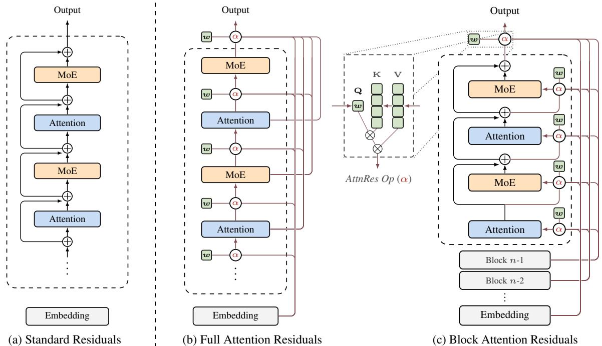
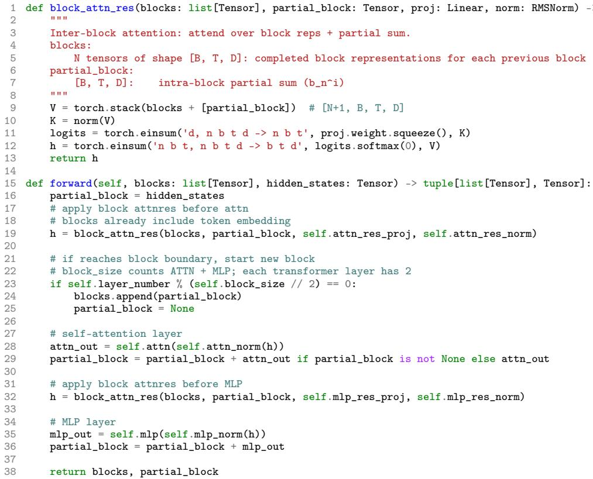
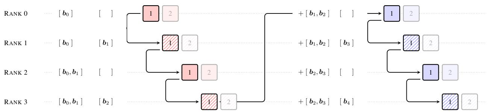
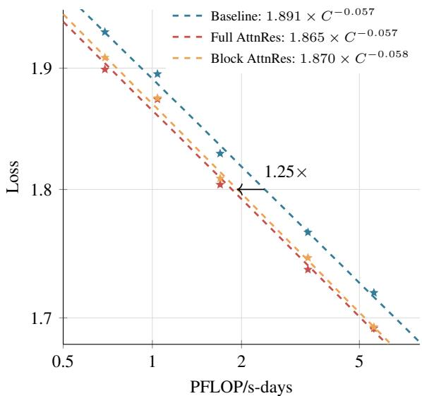
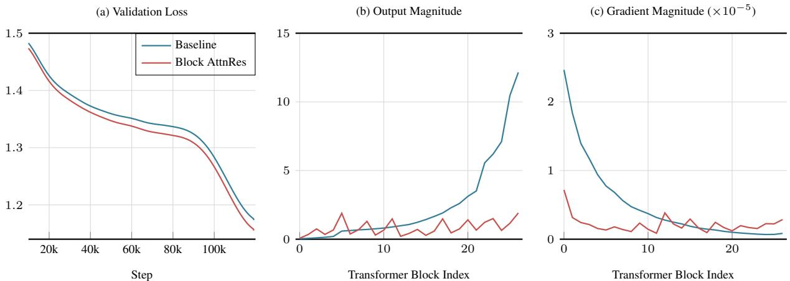
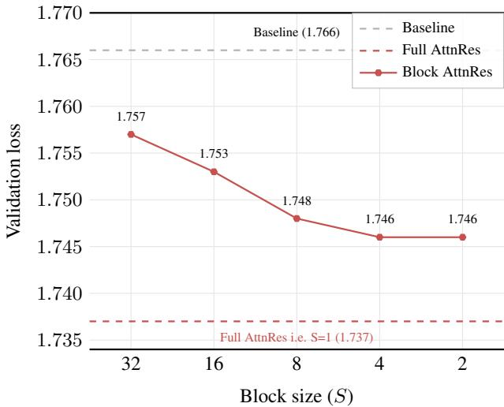
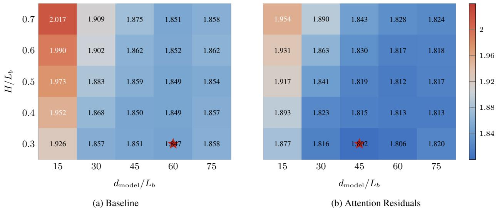
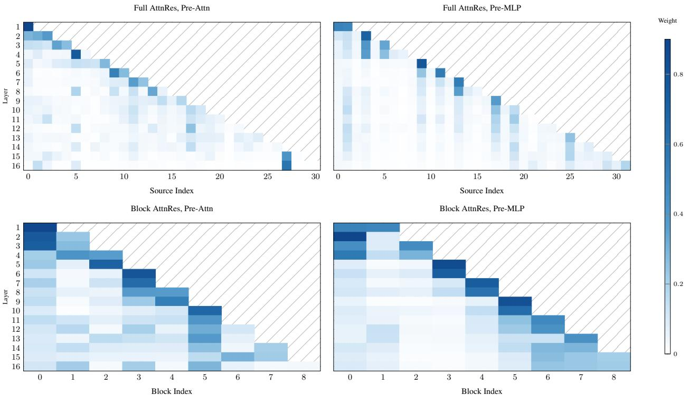
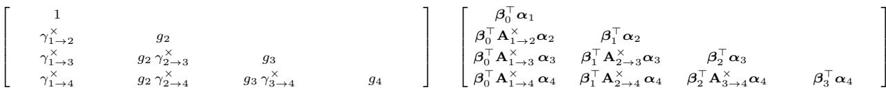
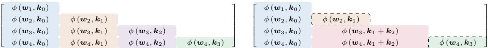

# TECHNICAL REPORT OF ATTENTION RESIDUALS
# 注意力残差技术报告

# Kimi Team
# Kimi 团队

https://github.com/MoonshotAI/Attention-Residuals

# ABSTRACT
# 摘要

Residual connections [12] with PreNorm [60] are standard in modern LLMs, yet they accumulate all layer outputs with fixed unit weights. This uniform aggregation causes uncontrolled hidden-state growth with depth, progressively diluting each layer's contribution [27]. We propose Attention Residuals (AttnRes), which replaces this fixed accumulation with softmax attention over preceding layer outputs, allowing each layer to selectively aggregate earlier representations with learned, input-dependent weights. To address the memory and communication overhead of attending over all preceding layer outputs for large-scale model training, we introduce Block AttnRes, which partitions layers into blocks and attends over block-level representations, reducing the memory footprint while preserving most of the gains of full AttnRes. Combined with cache-based pipeline communication and a two-phase computation strategy, Block AttnRes becomes a practical drop-in replacement for standard residual connections with minimal overhead.

中文：现代大语言模型通常采用带有 PreNorm 的残差连接，但它会用固定为 1 的权重累加所有层的输出。这种统一累加会导致隐藏状态的幅值随着深度不断增长，从而逐步稀释每一层的相对贡献。本文提出 Attention Residuals（AttnRes），用对先前层输出做 softmax 注意力来替代固定累加，使每一层能够使用学习得到、并随输入而变化的权重，选择性地聚合更早层的表示。为了解决大规模训练中“对所有历史层做注意力”带来的显存和通信开销，作者进一步提出 Block AttnRes：先把层划分成若干块，只对块级表示做注意力，在保留大部分 Full AttnRes 收益的同时显著降低内存占用。配合基于缓存的流水线通信和两阶段计算策略，Block AttnRes 可以以很小的额外代价，作为标准残差连接的直接替代。

Scaling law experiments confirm that the improvement is consistent across model sizes, and ablations validate the benefit of content-dependent depth-wise selection. We further integrate AttnRes into the Kimi Linear architecture [69] (48B total / 3B activated parameters) and pre-train on 1.4T tokens, where AttnRes mitigates PreNorm dilution, yielding more uniform output magnitudes and gradient distribution across depth, and improves downstream performance across all evaluated tasks.

中文：缩放律实验表明，这种改进在不同模型规模下都稳定成立；消融实验则验证了“基于内容的深度方向选择”本身是有效的。作者还将 AttnRes 集成进 Kimi Linear 架构（总参数 48B、激活参数 3B），并在 1.4T token 上进行预训练。结果显示，AttnRes 能缓解 PreNorm 的“贡献稀释”问题，使不同深度上的输出幅值和梯度分布更加均匀，并在所有评测的下游任务上带来性能提升。

Figure 1: Overview of Attention Residuals. (a) Standard Residuals: standard residual connections with uniform additive accumulation. (b) Full AttnRes: each layer selectively aggregates all previous layer outputs via learned attention weights. (c) Block AttnRes: layers are grouped into blocks, reducing memory from $O(Ld)$ to $O(Nd)$.

图 1：Attention Residuals 总览。(a) 标准残差：以统一相加的方式累积各层输出；(b) Full AttnRes：每一层通过学习得到的注意力权重，有选择地聚合所有历史层输出；(c) Block AttnRes：将层分成若干块，把内存开销从 $O(Ld)$ 降到 $O(Nd)$。

# 1 Introduction
# 1 引言

Standard residual connections [12] are the de facto building block of modern LLMs [35, 51, 9]. The update $h_l = h_{l-1} + f_{l-1}(h_{l-1})$ is widely understood as a gradient highway that lets gradients bypass transformations via identity mappings, enabling stable training at depth. Yet residuals also play a second role that has received less attention. Unrolling the recurrence shows that every layer receives the same uniformly weighted sum of all prior layer outputs; residuals define how information aggregates across depth. Unlike sequence mixing and expert routing, which now employ learnable input-dependent weighting [53, 20, 9], this depth-wise aggregation remains governed by fixed unit weights, with no mechanism to selectively emphasize or suppress individual layer contributions.

中文：标准残差连接已经成为现代大语言模型的事实标准构件。更新公式 $h_l = h_{l-1} + f_{l-1}(h_{l-1})$ 通常被理解为一种“梯度高速公路”：梯度可以通过恒等映射绕过复杂变换，从而支持深层网络的稳定训练。但残差连接还有一个常被忽略的作用。把递推式展开后可以看到，每一层实际接收到的是所有先前层输出的等权求和，也就是说，残差同时规定了“信息如何沿深度方向聚合”。与序列混合、专家路由等已经采用可学习且依赖输入的权重分配不同，深度方向上的聚合至今仍由固定的单位权重控制，无法选择性地突出或抑制某一层的贡献。

In practice, PreNorm [60] has become the dominant paradigm, yet its unweighted accumulation causes hidden-state magnitudes to grow as $O(L)$ with depth, progressively diluting each layer's relative contribution [27]. Early-layer information is buried and cannot be selectively retrieved; empirically, a significant fraction of layers can be pruned with minimal loss [11]. Recent efforts such as scaled residual paths [54] and multi-stream recurrences [72] remain bound to the additive recurrence, while methods that do introduce cross-layer access [36, 56] are difficult to scale. The situation parallels the challenges that recurrent neural networks (RNNs) faced over the sequence dimension before attention provided an alternative.

中文：在实践中，PreNorm 已经成为主流方案，但它的无权重累加会让隐藏状态的幅值随深度按 $O(L)$ 增长，从而不断稀释每一层的相对贡献。早期层的信息被埋入累计残差中，后续层无法有选择地取回；经验上，甚至可以裁掉相当一部分层而只带来很小损失。像缩放残差路径、多流递推这样的改进仍然受限于“加法递推”这一框架，而那些允许跨层访问的方法往往又难以扩展到大规模训练。这一局面很像早期序列建模里 RNN 面临的问题：在注意力机制出现之前，信息只能沿时间方向递归压缩。

We observe a formal duality between depth-wise accumulation and the sequential recurrence in RNNs. Building on this duality, we propose Attention Residuals (AttnRes), which replaces the fixed accumulation with softmax attention over prior layer outputs, where $\alpha_{i \to l}$ are computed from a single learned pseudo-query $\boldsymbol{w}_l \in \mathbb{R}^d$ for each layer. This lightweight design enables content-aware retrieval across depth with only one $d$-dimensional vector per layer. Standard residuals and recurrence-based variants can all be shown to perform depth-wise linear attention; AttnRes generalizes them to depth-wise softmax attention, completing for depth the same linear-to-softmax transition that transformed sequence modeling.

中文：作者观察到，深度方向上的残差累加与 RNN 在时间方向上的递归，存在一种形式上的对偶关系。基于这种对偶性，本文提出 Attention Residuals（AttnRes）：它不再固定地累加历史层输出，而是对这些输出施加 softmax 注意力，其中每个 $\alpha_{i \to l}$ 都由该层唯一的一个可学习伪查询向量 $\boldsymbol{w}_l \in \mathbb{R}^d$ 计算得到。这个设计非常轻量，每层只多出一个 $d$ 维向量，却可以在深度方向上实现基于内容的选择性检索。作者进一步指出，标准残差及其他递推式变体其实都可以看成“深度方向上的线性注意力”；而 AttnRes 则把它推广为“深度方向上的 softmax 注意力”，相当于把序列建模中从线性到 softmax 的那次范式转变复制到了网络深度维度。

In standard training, Full AttnRes adds negligible overhead, since the required layer outputs are already retained for backpropagation. At scale, however, activation recomputation and pipeline parallelism are common, so these outputs must be explicitly preserved and transmitted. We therefore introduce Block AttnRes: layers are partitioned into $N$ blocks, each compressed into a single representation with standard residual summation, and only these block summaries are used for cross-block attention. This reduces both memory and communication to $O(Nd)$ and, with infrastructure optimizations, makes AttnRes practical at scale.

中文：在普通训练设置下，Full AttnRes 几乎不会增加额外成本，因为它需要的层输出本来就要为反向传播保留。但在大规模训练中，激活重计算与流水线并行非常常见，这些历史输出就必须被显式保留并跨阶段传输。为此，作者提出 Block AttnRes：把网络层划分为 $N$ 个块，每个块内部仍用标准残差把输出压成一个块级表示，只在这些块摘要之间做跨块注意力。这样可以把内存与通信开销都降到 $O(Nd)$，再配合系统层优化，就能让 AttnRes 具备实际可扩展性。

Scaling-law experiments show that AttnRes consistently outperforms the baseline across compute budgets, and Block AttnRes can match a baseline trained with about $1.25\times$ more compute. We further integrate the method into Kimi Linear and observe more bounded output magnitudes, more uniform gradients across depth, and better downstream performance on all evaluated tasks.

中文：缩放律实验表明，在不同计算预算下 AttnRes 都稳定优于基线；其中 Block AttnRes 的效果甚至可以匹配一个多用约 $1.25\times$ 计算量训练出来的基线模型。把它集成进 Kimi Linear 后，作者还观察到更受控的输出幅值、更均匀的跨层梯度分布，以及在所有下游任务上的整体提升。

# Contributions
# 贡献

- Attention Residuals. We propose AttnRes, which replaces fixed residual accumulation with learned softmax attention over depth, and its scalable variant Block AttnRes that reduces memory and communication from $O(Ld)$ to $O(Nd)$. Through a unified structured-matrix analysis, we show that standard residuals and prior recurrence-based variants correspond to depth-wise linear attention, while AttnRes performs depth-wise softmax attention.
- Infrastructure for scale. We develop system optimizations that make Block AttnRes practical and efficient at scale, including cross-stage caching that eliminates redundant transfers under pipeline parallelism and a two-phase inference strategy that amortizes cross-block attention via online softmax [31]. The resulting training overhead is marginal, and inference latency overhead is less than $2\%$ on typical workloads.
- Comprehensive evaluation and analysis. We validate AttnRes through scaling law experiments, component ablations, and downstream benchmarks on a 48B-parameter model pre-trained on 1.4T tokens, demonstrating consistent improvements over standard residual connections. Training dynamics analysis further reveals that AttnRes mitigates PreNorm dilution, yielding bounded hidden-state magnitudes and more uniform gradient distribution across depth.

中文：

- 注意力残差。本文提出 AttnRes，用可学习的深度 softmax 注意力替代固定残差累加；同时提出可扩展版本 Block AttnRes，把内存和通信开销从 $O(Ld)$ 降到 $O(Nd)$。通过统一的结构矩阵分析，作者说明标准残差及既有递推式方法本质上对应深度方向的线性注意力，而 AttnRes 对应深度方向的 softmax 注意力。
- 面向大规模训练的系统实现。本文提出了一系列系统优化，使 Block AttnRes 在大规模训练中切实可用，包括跨流水线阶段缓存以消除冗余传输，以及借助 online softmax 的两阶段推理策略来摊薄跨块注意力开销。最终训练额外成本很小，典型推理任务上的时延开销低于 $2\%$。
- 全面的实验与分析。作者通过缩放律实验、组件消融和下游基准测试，对在 1.4T token 上预训练的 48B 模型进行了系统验证，证明 AttnRes 持续优于标准残差连接。训练动态分析还显示，它能缓解 PreNorm 稀释问题，使隐藏状态幅值更受控、梯度在深度上分布更均匀。

# 2 Motivation
# 2 动机

Notation. Consider a batch of input sequences with shape $B \times T \times d$, where $B$ is batch size, $T$ is sequence length, and $d$ is hidden dimension. For clarity, we write formulas for a single token: $\boldsymbol{h}_l \in \mathbb{R}^d$ denotes the hidden state entering layer $l$, where $l \in \{1, \ldots, L\}$ and $L$ is the total number of layers. The token embedding is $\boldsymbol{h}_1$, and $f_l$ denotes the transformation of layer $l$. In Transformer models, each self-attention or MLP sublayer is treated as an individual layer.

中文：记号约定如下。输入序列的一个 batch 形状为 $B \times T \times d$，其中 $B$ 是 batch size，$T$ 是序列长度，$d$ 是隐藏维度。为简化表达，后文公式都针对单个 token 书写：$\boldsymbol{h}_l \in \mathbb{R}^d$ 表示进入第 $l$ 层时的隐藏状态，$l \in \{1, \ldots, L\}$，其中 $L$ 是总层数；token embedding 记为 $\boldsymbol{h}_1$；$f_l$ 表示第 $l$ 层的变换。在 Transformer 中，作者把每个自注意力或 MLP 子层都视为一个独立层。

# 2.1 Training Deep Networks via Residuals
# 2.1 通过残差训练深层网络

Residual Learning. Residual learning [12] is critical for training deep networks because it allows gradients to bypass transformations. Each layer updates the hidden state as:

中文：残差学习之所以关键，是因为它允许梯度绕过复杂变换直接传播。每一层的更新公式为：

$$
\boldsymbol{h}_l = \boldsymbol{h}_{l-1} + f_{l-1}(\boldsymbol{h}_{l-1})
$$

Expanding the recurrence, the hidden state at layer $l$ is the sum of the embedding and all preceding layer outputs:

中文：把递推式展开后，第 $l$ 层的隐藏状态就是 token embedding 与此前所有层输出的总和：

$$
\boldsymbol{h}_l = \boldsymbol{h}_1 + \sum_{i=1}^{l-1} f_i(\boldsymbol{h}_i)
$$

The key insight is identity mapping: every layer keeps a direct path along which both information and gradients can flow unchanged. During backpropagation, the gradient with respect to an intermediate hidden state is:

中文：其核心在于恒等映射。每一层都保留了一条不经过变换的直接路径，使信息和梯度都能原样通过。反向传播时，中间隐藏状态的梯度为：

$$
\frac{\partial \mathcal{L}}{\partial \boldsymbol{h}_l} =
\frac{\partial \mathcal{L}}{\partial \boldsymbol{h}_L}
\cdot
\prod_{j=l}^{L-1}
\left(
\mathbf{I} + \frac{\partial f_j}{\partial \boldsymbol{h}_j}
\right)
$$

Expanding the product yields an identity term plus higher-order Jacobian terms, and the identity term is always preserved, giving every layer a direct gradient path regardless of depth.

中文：把这个乘积展开后，会得到一个恒等项加上一系列更高阶的 Jacobian 项。无论网络有多深，这个恒等项都不会消失，因此损失函数到任意层之间始终存在一条直接梯度通路。

Generalizing Residuals. Although effective, fixed unit coefficients treat every layer contribution equally. Highway networks [45] relax this with learned element-wise gates:

中文：虽然标准残差有效，但固定为 1 的系数意味着所有层贡献被一视同仁。Highway 网络通过可学习的逐元素门控放宽了这一限制：

$$
\boldsymbol{h}_l =
(1 - \boldsymbol{g}_l) \odot \boldsymbol{h}_{l-1}
+ \boldsymbol{g}_l \odot f_{l-1}(\boldsymbol{h}_{l-1})
$$

where $\boldsymbol{g}_l \in [0,1]^d$ interpolates between identity and transformation. More generally, both standard residuals and Highway networks fit the weighted recurrence

中文：其中 $\boldsymbol{g}_l \in [0,1]^d$ 用来在恒等路径和变换路径之间插值。更一般地，标准残差和 Highway 都可以写成如下加权递推：

$$
\boldsymbol{h}_l =
\alpha_l \cdot \boldsymbol{h}_{l-1}
+ \beta_l \cdot f_{l-1}(\boldsymbol{h}_{l-1})
$$

with residual setting $\alpha_l = \beta_l = 1$, and Highway setting $\alpha_l = 1 - g_l$, $\beta_l = g_l$.

中文：其中标准残差对应 $\alpha_l = \beta_l = 1$，Highway 对应 $\alpha_l = 1 - g_l$、$\beta_l = g_l$。

Limitations. Whether fixed or gated, these methods still let each layer access only its immediate input $\boldsymbol{h}_{l-1}$, a single compressed state that mixes all earlier layers. This causes three issues: no selective access, irreversible information loss, and output growth in deeper layers.

中文：但无论是固定权重还是门控权重，这些方法都只允许当前层访问直接前驱 $\boldsymbol{h}_{l-1}$。这个状态已经把更早层的信息压缩混合到了一起，因此会带来三个问题：一是无法针对不同任务或子层选择性访问不同历史层；二是一旦信息在聚合中丢失，就无法在后续层中有针对性地恢复；三是越靠后的层为了保持影响力，往往被迫输出更大的值，进而影响训练稳定性。

# 3 Attention Residuals: A Unified View of Time and Depth
# 3 注意力残差：时间与深度的统一视角

The limitations above resemble classical bottlenecks in sequence modeling, which suggests looking for sequence-style solutions along the depth dimension.

中文：上述限制与早期序列建模中的瓶颈非常相似，因此作者尝试把解决序列问题的方法迁移到深度维度。

The Duality of Time and Depth. Like RNNs over time, residual connections compress all prior information into a single state $\boldsymbol{h}_l$ over depth. In sequence modeling, Transformers replaced recurrence with attention, allowing each position to access all previous positions with input-dependent weights. We propose doing the same over depth:

中文：时间与深度存在对偶性。RNN 在时间上把历史压缩进一个状态，标准残差在深度上也把更早层的信息压缩进当前隐藏状态。Transformer 通过注意力替代时间递归，使每个位置都能以依赖输入的权重访问所有过去位置。本文把同样的思路应用到深度方向：

$$
\boldsymbol{h}_l =
\alpha_{0l} \cdot \boldsymbol{h}_1
+ \sum_{i=1}^{l-1} \alpha_{il} \cdot f_i(\boldsymbol{h}_i)
$$

where $\alpha_{i \to l}$ are attention weights satisfying $\sum_{i=0}^{l-1} \alpha_{i \to l} = 1$. Because network depth is typically much smaller than sequence length, $O(L^2)$ attention over depth is computationally feasible.

中文：其中 $\alpha_{i \to l}$ 是注意力权重，并满足 $\sum_{i=0}^{l-1} \alpha_{i \to l} = 1$。由于网络深度通常远小于序列长度，所以在深度维度上做 $O(L^2)$ 的注意力，在计算上是可行的。

# 3.1 Full Attention Residuals
# 3.1 全注意力残差

The attention weights are written as $\alpha_{i \to l} = \phi(\boldsymbol{q}_l, \boldsymbol{k}_i)$ with a kernel $\phi$. Different choices of $\phi$ recover different residual variants; here the authors choose a softmax-style kernel with RMSNorm:

中文：注意力权重可写成 $\alpha_{i \to l} = \phi(\boldsymbol{q}_l, \boldsymbol{k}_i)$，其中 $\phi$ 是核函数。不同的 $\phi$ 会对应不同的残差变体；本文选择的是带 RMSNorm 的 softmax 形式：

$$
\alpha_{il} =
\frac{\phi(\boldsymbol{q}_l, \boldsymbol{k}_i)}
{\sum_{j=0}^{l-1} \phi(\boldsymbol{q}_l, \boldsymbol{k}_j)}
$$

For each layer $l$, the authors use a learned pseudo-query $\boldsymbol{q}_l = \boldsymbol{w}_l$, and define keys and values from the embedding and previous layer outputs. The input to layer $l$ becomes:

中文：对于每一层 $l$，作者使用一个学习得到的伪查询向量 $\boldsymbol{q}_l = \boldsymbol{w}_l$，并将 embedding 以及历史层输出作为 key 与 value。于是第 $l$ 层的输入写成：

$$
h_l = \sum_{i=0}^{l-1} \alpha_{il} \cdot v_i
$$

This is Full AttnRes. For each token it requires $O(L^2 d)$ arithmetic and $O(Ld)$ memory to store earlier outputs. The arithmetic cost is acceptable because depth is modest, but the $O(Ld)$ memory and communication become challenging under activation recomputation and pipeline parallelism.

中文：这就是 Full AttnRes。对每个 token 而言，它的计算量是 $O(L^2 d)$，需要保存历史层输出的内存是 $O(Ld)$。由于层数通常不算特别大，算术开销还可以接受；真正麻烦的是激活重计算和流水线并行场景下的 $O(Ld)$ 内存与通信成本。

The pseudo-query is deliberately decoupled from the current hidden state. This means attention for multiple layers can be computed in parallel before their forward results are available, enabling a blockwise two-phase execution schedule and reducing local memory I/O. But local batching alone cannot remove the $O(Ld)$ cross-stage communication cost, which motivates Block AttnRes.

中文：一个重要设计点是，伪查询向量与当前隐藏状态解耦。这样一来，即便某些层的前向结果尚未算出，也可以提前并行计算这批层的注意力权重，从而支持后续的分块两阶段执行策略，并降低本地内存 I/O。不过，仅仅在本地做 batching 还无法消除跨流水线阶段的 $O(Ld)$ 通信成本，这正是引出 Block AttnRes 的原因。

# 3.2 Block Attention Residuals
# 3.2 块注意力残差

Block AttnRes partitions the $L$ layers into $N$ blocks. Inside each block, the layer outputs are summed into one block representation; across blocks, attention is applied only to the $N$ block-level representations plus the token embedding. This reduces memory and communication from $O(Ld)$ to $O(Nd)$.

中文：Block AttnRes 将总共 $L$ 层划分成 $N$ 个块。块内各层输出先求和，形成一个块级表示；跨块时，只对这 $N$ 个块表示以及 token embedding 做注意力。这样便能把内存和通信开销从 $O(Ld)$ 降到 $O(Nd)$。

Specifically, let each block contain $S = L / N$ layers, and denote the set of layer indices in block $n$ as $B_n$. The block representation is

中文：具体来说，若每个块有 $S = L / N$ 层，第 $n$ 个块的层索引集合记为 $B_n$，则块表示定义为：

$$
b_n = \sum_{j \in B_n} f_j(h_j)
$$

The partial sum over the first $i$ layers inside the block is denoted $b_n^i$, so the full block summary is $b_n = b_n^S$. RMSNorm is again used to avoid large-magnitude blocks dominating the attention weights.

中文：块内前 $i$ 层的部分和记为 $b_n^i$，完整块表示就是 $b_n = b_n^S$。这里仍使用 RMSNorm，以避免幅值较大的块或部分和在 softmax 中占据不合理优势。

Figure 2: PyTorch-style pseudo code for Block Attention Residuals.

图 2：Block Attention Residuals 的 PyTorch 风格伪代码。

In the blockwise variant, the first layer of each block attends to the previous block representations and the embedding, while later layers also attend to the evolving partial sum inside the current block. This preserves exactness while dramatically reducing the number of stored sources.

中文：在块版本中，每个块的第一层会对前面所有块的表示和 embedding 做注意力；块内后续层则在此基础上，再额外关注当前块不断增长的部分和。这样既保持了计算逻辑的严谨性，又显著减少了需要长期保留的源表示数量。

The block count $N$ interpolates between two extremes: $N = L$ recovers Full AttnRes, while $N = 1$ degenerates to standard residual accumulation with the embedding isolated as $b_0$. Empirically, using about 8 blocks recovers most of the gains across scales.

中文：块数 $N$ 构成了一个连续折中：当 $N = L$ 时，就退化为 Full AttnRes；当 $N = 1$ 时，则几乎回到标准残差，只是把 embedding 单独视为 $b_0$。实验显示，在不同规模下，大约 8 个块就已经能恢复 Full AttnRes 的大部分收益。

# 4 Infrastructure Design
# 4 系统设计

Block AttnRes introduces new system challenges compared with standard residuals. During large-scale training, block representations must travel across pipeline stages; during inference, repeated access to accumulated block representations adds latency; and long-context prefilling makes the cache expensive. The authors address these issues with cross-stage caching during training and a two-phase computation plus sequence-sharded prefilling during inference.

中文：与标准残差相比，Block AttnRes 会带来新的系统层挑战。大规模训练时，块表示需要跨流水线阶段传输；推理时，反复访问已累计的块表示会增加时延；长上下文 prefilling 又会让缓存成本上升。为此，作者在训练阶段设计了跨阶段缓存，在推理阶段设计了两阶段计算与沿序列分片的 prefilling 方案。

Figure 3: Cache-based pipeline communication example.

图 3：基于缓存的流水线通信示意图。

# 4.1 Training
# 4.1 训练

For small-scale training, AttnRes brings almost no extra memory cost because the activations are already retained for backpropagation. In large-scale distributed training, however, pipeline parallelism becomes the key bottleneck. Full AttnRes requires all $L$ layer outputs to be transmitted, while Block AttnRes reduces this to $N$ block representations.

中文：在小规模训练里，AttnRes 几乎不增加显存，因为这些激活本来就要为反向传播保存。但到了大规模分布式训练，流水线并行就成了关键瓶颈。Full AttnRes 需要跨阶段传输全部 $L$ 个层输出，而 Block AttnRes 把这个数量降低成了 $N$ 个块表示。

With a naive implementation, every stage repeatedly transmits the full accumulated block history. Under an interleaved pipeline schedule with $P$ physical stages and $V$ virtual stages, the per-token communication cost is

中文：如果采用朴素实现，每个阶段都会反复传输“截至当前为止的全部块历史”。在一个有 $P$ 个物理 stage、每个物理 stage 又划分为 $V$ 个虚拟 stage 的交错流水线中，其每个 token 的通信代价为：

$$
\mathrm{Comm}_{\mathrm{naive}} =
\sum_{j=1}^{C-1} j N_p d
=
\frac{C(C-1)}{2} N_p d
$$

where $C = PV$ is the total number of chunks and $N_p$ is the average number of block representations produced per physical stage.

中文：其中 $C = PV$ 是总 chunk 数，$N_p$ 是每个物理 stage 平均产生的块表示数量。

Cross-stage caching removes this redundancy. Blocks received in earlier virtual stages are kept locally and need not be re-sent. Communication becomes

中文：跨阶段缓存可以消除这部分冗余。先前虚拟 stage 已经接收过的块会保存在本地，后续就不必重复发送。于是通信量变为：

$$
\mathrm{Comm}_{\mathrm{cached}} =
\underbrace{\frac{P(P-1)}{2} N_p d}_{\text{first virtual stage}}
+
\underbrace{(V-1) P^2 N_p d}_{\text{subsequent virtual stages}}
$$

Caching reduces the peak per-transition cost from $O(C)$ to $O(P)$, effectively giving a $V\times$ improvement and allowing the communication to overlap with 1F1B steady-state computation.

中文：这样可以把单次阶段切换的峰值通信开销从 $O(C)$ 降到 $O(P)$，相当于获得了约 $V$ 倍的改善，并能在 1F1B 稳态阶段实现与计算的重叠。

Algorithm 1: Two-phase computation for block $n$

算法 1：块 $n$ 的两阶段计算。

<table><tr><td>Input: Pseudo queries {wl}t∈Bn, block representations {bo,...,bn-1}</td></tr><tr><td>/* Phase 1: Parallel inter-block attention */</td></tr><tr><td>1 Q←[wl]l∈Bn</td></tr><tr><td>2 K,V←[b0;...;bn-1]</td></tr><tr><td>3 {o(1),m(1),e(1)}l∈Bn ← ATTNWITHSTATS(Q,K,V)</td></tr><tr><td>/* Phase 2: Sequential intra-block attention + online softmax merge */</td></tr><tr><td>4 i←0</td></tr><tr><td>5 for l ∈ Bn do</td></tr><tr><td>6 if i = 0 then h←o(1)</td></tr><tr><td>7 else compute intra-block attention and merge with online softmax</td></tr><tr><td>8 i←i+1</td></tr><tr><td>9 bn←bn-1+fi(hl)</td></tr></table>

Memory overhead remains close to standard architectures because activation checkpointing removes intermediate attention states, and the checkpointed input has the same size as the hidden state it replaces. In wall-clock time, Block AttnRes adds negligible overhead without pipeline parallelism, and less than $4\%$ end-to-end overhead when pipeline parallelism is enabled.

中文：显存开销方面，Block AttnRes 与标准架构差异很小，因为激活检查点会移除中间注意力状态，而被保存的输入张量大小与它替代的隐藏状态相同。实际耗时上，没有流水线并行时，Block AttnRes 的训练额外开销几乎可以忽略；开启流水线并行后，端到端训练开销仍控制在 $4\%$ 以内。

# 4.2 Inference
# 4.2 推理

The same two-phase strategy applies to both Full and Block AttnRes. Layers are grouped into blocks of size $S$: Phase 1 batches inter-block queries, and Phase 2 handles sequential intra-block lookback. For Full AttnRes this reduces per-layer I/O from $O(Ld)$ to $O((S+N)d)$; for Block AttnRes it additionally reduces stored representations from $L$ to $N$.

中文：同样的两阶段策略既适用于 Full AttnRes，也适用于 Block AttnRes。具体做法是把层按大小为 $S$ 的块分组：Phase 1 批量计算跨块查询，Phase 2 顺序处理块内回看。对 Full AttnRes 而言，这能把单层 I/O 从 $O(Ld)$ 降到 $O((S+N)d)$；对 Block AttnRes 而言，它还会进一步把需要保存的表示从 $L$ 个降到 $N$ 个。

Under a naive implementation, each layer scans all previous blocks, leading to $O(L \cdot N)$ memory accesses. Because pseudo-query vectors are independent of the current hidden state, all $S = L/N$ queries in a block can be batched into one matrix multiplication, amortizing the reads.

中文：在朴素实现中，每层都要扫描所有先前块，因此总内存访问量是 $O(L \cdot N)$。由于伪查询向量与当前隐藏状态无关，同一块内的 $S = L/N$ 个查询可以合并成一次矩阵乘法，从而把原本重复的读取摊薄掉。

Phase 1 computes the inter-block attention for all $S$ layers in one shot and returns both outputs and softmax statistics; Phase 2 then computes the intra-block attention sequentially and merges the two parts with online softmax [31]. This keeps the per-layer memory access cost to roughly $(\frac{N}{S} + 3)d$ reads and $2d$ writes.

中文：Phase 1 一次性算出同一块中所有 $S$ 层的跨块注意力，并返回输出以及 softmax 统计量；Phase 2 再顺序计算块内注意力，并用 online softmax 把两部分精确合并。最终，单层内存访问成本大约只剩 $(\frac{N}{S} + 3)d$ 次读取和 $2d$ 次写入。

Table 1: Memory access cost per token per layer incurred by the residual mechanism under each scheme.

表 1：不同残差机制下，每个 token、每一层的额外内存访问成本。

<table><tr><td rowspan="2"></td><td rowspan="2">Operation</td><td rowspan="2">Read</td><td rowspan="2">Write</td><td colspan="2">Total I/O</td></tr><tr><td>Symbolic</td><td>Typical</td></tr><tr><td>Standard Residuals</td><td>Residual Merge</td><td>2d</td><td>d</td><td>3d</td><td>3d</td></tr><tr><td rowspan="5">mHC (m streams)</td><td>Compute αl, βl, Al</td><td>md</td><td>m²+2m</td><td></td><td></td></tr><tr><td>Apply α</td><td>md+m</td><td>d</td><td rowspan="3">(8m+2)d+2m²+4m</td><td rowspan="3">34d</td></tr><tr><td>Apply β</td><td>d+m</td><td>md</td></tr><tr><td>Apply Aᵀ</td><td>md+m²</td><td>md</td></tr><tr><td>Residual Merge</td><td>2md</td><td>md</td><td></td></tr><tr><td rowspan="4">AttnRes</td><td>Full Phase 1 (amortized)</td><td>(N-1)d</td><td>d</td><td rowspan="2">(S+N)d</td><td rowspan="2">24d</td></tr><tr><td>Full Phase 2</td><td>(S-1)d</td><td>d</td></tr><tr><td>Block Phase 1 (amortized)</td><td>N/S·d</td><td>d</td><td rowspan="2">(N/S+5)d</td><td rowspan="2">5.5d</td></tr><tr><td>Block Phase 2</td><td>2d</td><td>d</td></tr></table>

Memory-efficient prefilling. Storing block representations during prefilling requires $N \cdot T \cdot d$ elements, which would consume about 15 GB for a 128K-token sequence with 8 blocks. The paper mitigates this by sharding the block representations across the sequence dimension over tensor-parallel devices, reducing the per-device footprint to $N \cdot (T/P) \cdot d$ and further lowering it with chunked prefill.

中文：长上下文 prefilling 也会带来显存压力。若直接缓存块表示，需要保存 $N \cdot T \cdot d$ 个元素；对于 128K token、8 个块的情况，约需 15 GB。作者通过沿序列维度把块表示分片到多个 tensor-parallel 设备上，把单卡负担降到 $N \cdot (T/P) \cdot d$，再结合分块 prefill，可以进一步把额外开销压到很低。

# 5 Experiments
# 5 实验

Architecture Details. The architecture is identical to Kimi Linear [69], a Mixture-of-Experts Transformer following the Moonlight / DeepSeek-V3 design. The only modification is replacing standard residuals with AttnRes. Each layer adds only one RMSNorm and one pseudo-query vector $\boldsymbol{w}_l \in \mathbb{R}^d$, which is negligible relative to total parameters. Importantly, all pseudo-query vectors are initialized to zero so that the initial attention weights are uniform over source layers.

中文：实验所用架构与 Kimi Linear 完全一致，它本质上是一个遵循 Moonlight / DeepSeek-V3 设计的 MoE Transformer。唯一改动就是把标准残差替换为 AttnRes。每层只额外引入一个 RMSNorm 和一个伪查询向量 $\boldsymbol{w}_l \in \mathbb{R}^d$，相对于整个模型的参数量几乎可以忽略。特别关键的是，所有伪查询向量都要用零初始化，这样训练一开始的注意力权重就是均匀分布，从而避免训练早期不稳定。

# 5.1 Scaling Laws
# 5.1 缩放律

The authors sweep five model sizes and train three variants for each: a PreNorm baseline, Full AttnRes, and Block AttnRes with about 8 blocks. All variants within the same size use identical hyperparameters chosen under the baseline, which makes the comparison conservative. They fit standard power-law curves of the form $\mathcal{L} = A \times C^{-\alpha}$, where $\mathcal{L}$ is validation loss and $C$ is compute in PFLOP/s-days.

中文：作者选取了五种模型规模，并在每个规模上训练三种版本：PreNorm 基线、Full AttnRes，以及大约 8 个块的 Block AttnRes。同一规模组内三者共享在基线下选定的超参数，因此这种对比本身是偏保守的。随后，作者用标准幂律形式 $\mathcal{L} = A \times C^{-\alpha}$ 拟合缩放曲线，其中 $\mathcal{L}$ 为验证损失，$C$ 为 PFLOP/s-days 计量的计算量。

Table 2: Baseline vs Block AttnRes vs Full AttnRes vs mHC-lite: model configurations, hyperparameters, and validation loss.

表 2：基线、Block AttnRes、Full AttnRes 与 mHC-lite 的模型配置、超参数和验证损失对比。

<table><tr><td rowspan="2">#Act. Params</td><td rowspan="2">Tokens</td><td rowspan="2">Lb</td><td rowspan="2">H</td><td rowspan="2">dmodel</td><td rowspan="2">d</td><td rowspan="2">lr</td><td rowspan="2">batch size</td><td colspan="4">Val. Loss</td></tr><tr><td>Baseline</td><td>Block AttnRes</td><td>Full AttnRes</td><td>mHC-lite</td></tr><tr><td>194M</td><td>38.7B</td><td>12</td><td>12</td><td>896</td><td>400</td><td>2.99×10-3</td><td>192</td><td>1.931</td><td>1.909</td><td>1.899</td><td>1.906</td></tr><tr><td>241M</td><td>45.4B</td><td>13</td><td>13</td><td>960</td><td>432</td><td>2.80×10-3</td><td>256</td><td>1.895</td><td>1.875</td><td>1.874</td><td>1.869</td></tr><tr><td>296M</td><td>62.1B</td><td>14</td><td>14</td><td>1024</td><td>464</td><td>2.50×10-3</td><td>320</td><td>1.829</td><td>1.809</td><td>1.804</td><td>1.807</td></tr><tr><td>436M</td><td>87.9B</td><td>16</td><td>16</td><td>1168</td><td>528</td><td>2.20×10-3</td><td>384</td><td>1.766</td><td>1.746</td><td>1.737</td><td>1.747</td></tr><tr><td>528M</td><td>119.0B</td><td>17</td><td>17</td><td>1264</td><td>560</td><td>2.02×10-3</td><td>432</td><td>1.719</td><td>1.693</td><td>1.692</td><td>1.694</td></tr></table>

Figure 4: Scaling law curves for Attention Residuals.

图 4：Attention Residuals 的缩放律曲线。

Across the full compute range, both Full and Block AttnRes reach lower loss than the baseline, and Block AttnRes closely tracks Full AttnRes at large scale. According to the fitted curves, at 5.6 PFLOP/s-days, Block AttnRes reaches 1.692 versus the baseline's 1.714, which corresponds to roughly a $1.25\times$ compute advantage.

中文：在整个计算量区间里，Full 与 Block AttnRes 的验证损失都低于基线，而 Block AttnRes 在大模型区间非常接近 Full 版本。按拟合曲线估算，在 5.6 PFLOP/s-days 的计算预算下，Block AttnRes 的损失为 1.692，优于基线的 1.714，相当于大约多赚到了 $1.25\times$ 的有效计算量。

# 5.2 Main Results
# 5.2 主要结果

The largest experiment uses the full Kimi Linear 48B configuration: 27 Transformer blocks (54 layers), 48B total parameters and 3B activated parameters. Block AttnRes uses 6 layers per block, yielding 9 blocks plus the token embedding as 10 depth-wise sources.

中文：最大的实验采用完整的 Kimi Linear 48B 配置：27 个 Transformer block、也就是 54 层，总参数 48B、激活参数 3B。这里的 Block AttnRes 采用每块 6 层，因此共有 9 个块，再加上 token embedding，一共得到 10 个深度方向信息源。

The training recipe follows the 1.4T-token Kimi Linear setup: 4096-token context, Muon optimizer, WSD learning-rate schedule, and global batch size of 8M tokens. Training proceeds in two stages: 1T-token pre-training, followed by about 400B high-quality tokens for mid-training. The context is later extended to 32K tokens.

中文：训练配方沿用 Kimi Linear 的 1.4T token 方案：4096 token 上下文、Muon 优化器、WSD 学习率调度、全局 batch size 为 8M token。训练分为两个阶段：先在 1T token 上预训练，再用约 400B 高质量 token 做中训，之后再逐步把上下文扩展到 32K。

Figure 5: Training dynamics of Baseline and Block AttnRes.

图 5：Baseline 与 Block AttnRes 的训练动态对比。

Training dynamics. AttnRes maintains lower validation loss throughout training, keeps output magnitudes more bounded across depth, and yields a more uniform gradient distribution. This directly supports the paper's claim that AttnRes mitigates PreNorm dilution.

中文：从训练动态来看，AttnRes 在整个训练过程中都保持更低的验证损失，同时使深层输出幅值不再单调膨胀，梯度在不同深度上的分布也更加均匀。这直接支持了作者的核心论点：AttnRes 的确缓解了 PreNorm 的“深度稀释”问题。

Table 3: Performance comparison of AttnRes with the baseline, both after the same pre-training recipe.

表 3：在相同预训练配方下，AttnRes 与基线模型的下游性能对比。

<table><tr><td colspan="2"></td><td>Baseline</td><td>AttnRes</td></tr><tr><td rowspan="7">General</td><td>MMLU</td><td>73.5</td><td>74.6</td></tr><tr><td>MMLU-Pro</td><td>52.2</td><td>52.2</td></tr><tr><td>GPQA-Diamond</td><td>36.9</td><td>44.4</td></tr><tr><td>BBH</td><td>76.3</td><td>78.0</td></tr><tr><td>ARC-Challenge</td><td>64.6</td><td>65.7</td></tr><tr><td>HellaSwag</td><td>83.2</td><td>83.4</td></tr><tr><td>TriviaQA</td><td>69.9</td><td>71.8</td></tr><tr><td rowspan="6">Math &amp; Code</td><td>GSM8K</td><td>81.7</td><td>82.4</td></tr><tr><td>MGSM</td><td>64.9</td><td>66.1</td></tr><tr><td>Math</td><td>53.5</td><td>57.1</td></tr><tr><td>CMath</td><td>84.7</td><td>85.1</td></tr><tr><td>HumanEval</td><td>59.1</td><td>62.2</td></tr><tr><td>MBPP</td><td>72.0</td><td>73.9</td></tr><tr><td rowspan="2">Chinese</td><td>CMMLU</td><td>82.0</td><td>82.9</td></tr><tr><td>C-Eval</td><td>79.6</td><td>82.5</td></tr></table>

Downstream performance. Following the Kimi Linear protocol, the paper evaluates general reasoning, math-and-code reasoning, and Chinese understanding. Block AttnRes matches or outperforms the baseline on all benchmarks, with especially large gains on multi-step reasoning and code generation.

中文：下游评测沿用了 Kimi Linear 的协议，覆盖通用推理、数学与代码、以及中文理解三大类任务。结果显示，Block AttnRes 在所有基准上都不弱于基线，并且在多步推理与代码生成任务上提升尤为明显。

Table 4: Ablation on key components of AttnRes (16-layer model).

表 4：AttnRes 关键组件消融实验（16 层模型）。

<table><tr><td>Variant</td><td>Loss</td></tr><tr><td>Baseline (PreNorm)</td><td>1.766</td></tr><tr><td>DenseFormer [36]</td><td>1.767</td></tr><tr><td>mHC [59]</td><td>1.747</td></tr><tr><td>AttnRes Full</td><td>1.737</td></tr><tr><td>w/ input-dependent query</td><td>1.731</td></tr><tr><td>w/ input-independent mixing</td><td>1.749</td></tr><tr><td>w/ sigmoid</td><td>1.741</td></tr><tr><td>w/ RMSNorm</td><td>1.743</td></tr><tr><td>SWA (W = 8)</td><td>1.764</td></tr><tr><td>Block (S = 4)</td><td>1.746</td></tr><tr><td>w/ multihead (H = 16)</td><td>1.752</td></tr><tr><td>w/o RMSNorm</td><td>1.750</td></tr></table>

Figure 6: Effect of block size on validation loss (16-layer model).

图 6：块大小对验证损失的影响（16 层模型）。

# 5.3 Ablation Study
# 5.3 消融研究

The ablation study validates several design decisions. Compared with prior residual generalizations such as DenseFormer and mHC, Full AttnRes achieves the best loss, while Block AttnRes retains most of the gain with much lower memory overhead. Sliding-window aggregation helps only a little, suggesting that access to distant layers matters more than merely keeping a local window.

中文：消融实验验证了若干关键设计点。与 DenseFormer、mHC 这类已有残差泛化方法相比，Full AttnRes 取得了最优损失；Block AttnRes 则在显著降低内存开销的同时保留了大部分收益。相比之下，只保留一个局部滑窗的做法提升有限，这说明“能否访问远处层”比“在近邻层里多看几层”更重要。

The authors further test input-dependent queries, input-independent mixing, sigmoid instead of softmax, multihead depth aggregation, and removing RMSNorm. The results show that content-dependent weighting, competitive softmax normalization, and RMSNorm on keys are all important.

中文：作者还分别测试了输入相关查询、输入无关混合、用 sigmoid 替代 softmax、多头深度聚合，以及移除 RMSNorm 等改动。结果表明，基于内容的动态权重、具备竞争性的 softmax 归一化、以及作用于 key 的 RMSNorm，都是这个方法成功的重要因素。

Figure 7: Architecture sweep under fixed compute.

图 7：固定计算预算下的架构搜索结果。

# 5.4 Analysis
# 5.4 分析

## 5.4.1 Optimal Architecture
## 5.4.1 最优架构

Under fixed compute and parameter budgets, the paper sweeps model width, depth, and head count to ask whether AttnRes changes the preferred architectural trade-off. Both the baseline and AttnRes favor larger $d_{\mathrm{model}} / L_b$ and smaller $H / L_b$, but AttnRes is better in every tested configuration and shifts the optimum toward a deeper, narrower model.

中文：作者在固定计算量和参数量的前提下，系统地扫描模型宽度、深度和头数，考察 AttnRes 是否会改变架构设计的最佳折中。结果显示，无论是基线还是 AttnRes，都更偏好较大的 $d_{\mathrm{model}} / L_b$ 和较小的 $H / L_b$；但 AttnRes 在所有配置上都更优，并且把最优点从“相对更宽”推向了“相对更深、更窄”的区域。

Figure 8: Depth-wise attention weight distributions for a 16-head model with full and block Attention Residuals.

图 8：16 头模型中，Full 与 Block Attention Residuals 的深度注意力权重分布。

## 5.4.2 Analyzing Learned AttnRes Patterns
## 5.4.2 学习到的 AttnRes 模式分析

The learned depth-wise weights reveal three patterns: locality is preserved because each layer still attends most strongly to its immediate predecessor; the embedding remains useful throughout the network; and attention layers and MLP layers exhibit different depth-wise receptive fields. Block AttnRes preserves these qualitative structures while producing sharper decisions.

中文：学习得到的深度权重展现出三种重要模式：第一，局部性仍然保留，因为每层最关注的通常还是直接前驱；第二，embedding 在整个网络中都保有非平凡权重；第三，注意力层与 MLP 层在深度方向上的“感受野”明显不同。Block AttnRes 也保留了这些结构特征，而且决策分布通常更尖锐。

Table 5: Comparison of residual update mechanisms.

表 5：不同残差更新机制对比。

<table><tr><td>Method</td><td>Update rule</td><td>Weight</td><td>Source</td></tr><tr><td>Residual [12]</td><td>h_l = h_{l-1} + f_{l-1}(h_{l-1})</td><td>Fixed</td><td>h_{l-1}</td></tr><tr><td>ReZero [2]</td><td>h_l = h_{l-1} + α · f_{l-1}(h_{l-1})</td><td>Static</td><td>h_{l-1}</td></tr><tr><td>LayerScale [50]</td><td>h_l = h_{l-1} + diag(λ_l) · f_{l-1}(h_{l-1})</td><td>Static</td><td>h_{l-1}</td></tr><tr><td>Highway [45]</td><td>h_l = (1-g_l)h_{l-1} + g_l f_{l-1}(h_{l-1})</td><td>Dynamic</td><td>h_{l-1}</td></tr><tr><td>HC / mHC [72, 59]</td><td>multi-stream recurrence</td><td>Dynamic</td><td>m streams</td></tr><tr><td>DenseFormer [36]</td><td>learned static depth mixing</td><td>Static</td><td>[h_1, ..., h_{l-1}]</td></tr><tr><td>AttnRes (Full)</td><td>softmax attention over all previous layers</td><td>Dynamic</td><td>[h_1, ..., h_{l-1}]</td></tr><tr><td>AttnRes (Block)</td><td>softmax attention over block summaries</td><td>Dynamic</td><td>[b_0, ..., b_{n-1}, b_n^i]</td></tr></table>

# 6 Discussions
# 6 讨论

## 6.1 Sequence-Depth Duality
## 6.1 序列-深度对偶

Residual connections propagate information over depth by a fixed recurrence, much like RNNs propagate information over time. On the sequence side, recent work formalizes recurrent updates as state updates on a self-supervised loss. The paper argues that many depth-wise residual variants line up with corresponding sequence-side recurrent architectures. AttnRes takes the next step: just as Transformers replaced temporal recurrence with self-attention, AttnRes replaces depth-wise recurrence with cross-layer attention.

中文：残差连接通过固定递推在深度上传播信息，这与 RNN 在时间上传播信息非常相似。序列侧的一些工作已经把这种递推统一解释为针对自监督目标的状态更新。本文进一步指出，许多深度方向的残差变体，都可以与序列侧的某类递归模型建立对应关系。AttnRes 则更进一步：就像 Transformer 用自注意力替代了时间递归一样，它用跨层注意力替代了深度递归。

## 6.2 Residual Connections as Structured Matrices
## 6.2 把残差连接看成结构矩阵

The paper introduces a depth mixing matrix $\mathbf{M} \in \mathbb{R}^{L \times L}$, where $\mathbf{M}_{il}$ denotes how much layer $l$ weights the output of layer $i$. In this view, all residual mechanisms are weighted aggregations over earlier-layer outputs, differing only in how the weights are generated and what structural constraints are imposed on $\mathbf{M}$.

中文：作者引入了一个深度混合矩阵 $\mathbf{M} \in \mathbb{R}^{L \times L}$，其中 $\mathbf{M}_{il}$ 表示第 $l$ 层对第 $i$ 层输出赋予的权重。从这个视角看，各类残差机制本质上都是对历史层输出做加权聚合，区别只在于权重是如何生成的，以及矩阵 $\mathbf{M}$ 是否受到低秩、半可分等结构约束。

Concretely, the input to layer $l$ can be written as

中文：具体地，第 $l$ 层输入可以写成：

$$
\boldsymbol{h}_l = \sum_{i=0}^{l-1} \mathbf{M}_{il} \boldsymbol{v}_i
$$

where $\boldsymbol{v}_0 = \boldsymbol{h}_1$ and $\boldsymbol{v}_i = f_i(\boldsymbol{h}_i)$ for $i \ge 1$. Standard residuals correspond to an all-ones lower triangular matrix; Highway corresponds to a 1-semiseparable matrix with input-dependent gates; mHC corresponds to a higher-rank semiseparable structure induced by multi-stream transitions; Full AttnRes yields a dense input-dependent matrix; and Block AttnRes lies between low-rank blockwise sharing and full per-layer access.

中文：其中 $\boldsymbol{v}_0 = \boldsymbol{h}_1$，对 $i \ge 1$ 有 $\boldsymbol{v}_i = f_i(\boldsymbol{h}_i)$。标准残差对应一个全 1 的下三角矩阵；Highway 对应带输入相关门控的 1-半可分矩阵；mHC 对应由多流转移矩阵诱导出的更高秩半可分结构；Full AttnRes 对应一个稠密、依赖输入的矩阵；而 Block AttnRes 则位于“按块共享权重”和“逐层完全访问”之间。

Figure 9: Depth mixing matrices for representative residual variants.

图 9：几种代表性残差变体对应的深度混合矩阵。

The structured-matrix view serves two purposes. It explains why existing residual methods can be seen as depth-wise linear attention, and it suggests new kernel choices for depth mixing. In particular, if the kernel decomposes into feature maps as in linear attention, then depth-wise attention collapses back into a recurrence. AttnRes is distinguished by explicitly adopting depth-wise softmax attention.

中文：这种结构矩阵视角有两个作用。其一，它解释了为什么很多已有残差方法都可以看作“深度方向的线性注意力”；其二，它也提示了未来可以如何替换深度混合核函数。特别地，如果核函数像线性注意力那样可以分解为特征映射内积，那么深度注意力就会重新坍缩为递推形式。而 AttnRes 的关键区别，正是在于它明确采用了深度方向上的 softmax 注意力。

# 7 Related Work
# 7 相关工作

The related-work discussion covers three lines: normalization and depth stability, multi-state recurrences, and cross-layer connectivity. Normalization-focused methods try to reconcile stable magnitudes with stable gradients; multi-state recurrences widen the hidden state to alleviate compression; and cross-layer methods give direct access to earlier layers. AttnRes differs in combining input-dependent softmax weighting with direct access to all previous layers, while retaining a scalable blockwise variant.

中文：相关工作主要分成三类：一类关注归一化与深度稳定性，试图同时兼顾幅值稳定与梯度稳定；一类关注多状态递推，通过扩展隐藏状态来减轻信息压缩；还有一类直接研究跨层连接，让当前层能够访问更早层的输出。AttnRes 的特点在于把“输入相关的 softmax 权重”与“对所有历史层的直接访问”结合起来，同时又提供了可扩展的按块版本。

# Conclusion
# 结论

Inspired by the duality between sequence and depth, the paper introduces AttnRes, which replaces fixed uniform residual accumulation with learned, input-dependent depth-wise attention. Full AttnRes brings strong gains but requires access to all earlier outputs. Block AttnRes preserves most of those gains while reducing the memory footprint and communication burden to a practical level. Together with cross-stage caching and a two-phase computation strategy, it becomes a drop-in replacement for standard residual connections in large-scale training and inference.

中文：本文从“序列与深度的对偶性”出发，提出了 AttnRes，用学习得到、依赖输入的深度注意力替代固定且均匀的残差累加。Full AttnRes 虽然效果更强，但必须访问所有历史层输出；Block AttnRes 则在保留大部分收益的同时，把显存与通信代价降低到了可落地的范围。再配合跨阶段缓存和两阶段计算策略，它就能够在大规模训练和推理中，作为标准残差连接的直接替代。

# References
# References / 参考文献

[1] Jacob Austin et al. Program Synthesis with Large Language Models. 2021. arXiv: 2108.07732 [cs.PL]. URL: https://arxiv.org/abs/2108.07732.
[2] Thomas Bachlechner et al. ReZero is All You Need: Fast Convergence at Large Depth. 2020. arXiv: 2003.04887 [cs.LG]. URL: https://arxiv.org/abs/2003.04887.
[3] Dzmitry Bahdanau, Kyunghyun Cho, and Yoshua Bengio. Neural Machine Translation by Jointly Learning to Align and Translate. 2016. arXiv: 1409.0473 [cs.CL]. URL: https://arxiv.org/abs/1409.0473.
[4] Chen Chen and Lai Wei. Post-LayerNorm Is Back: Stable, Expressive, and Deep. 2026. arXiv: 2601.19895 [cs.LG]. URL: https://arxiv.org/abs/2601.19895.
[5] Mark Chen et al. Evaluating Large Language Models Trained on Code. 2021. arXiv: 2107.03374 [cs.LG]. URL: https://arxiv.org/abs/2107.03374.
[6] Peter Clark et al. "Think you have Solved Question Answering? Try ARC, the AI2 Reasoning Challenge". In: arXiv:1803.05457v1 (2018).
[7] Karl Cobbe et al. Training Verifiers to Solve Math Word Problems. 2021. arXiv: 2110.14168 [cs.LG]. URL: https://arxiv.org/abs/2110.14168.
[8] Tri Dao and Albert Gu. "Transformers are SSMs: Generalized Models and Efficient Algorithms Through Structured State Space Duality". In: CoRR abs/2405.21060 (2024). DOI: 10.48550/ARXIV.2405.21060. URL: https://doi.org/10.48550/arXiv.2405.21060.
[9] DeepSeek-AI et al. DeepSeek-V3 Technical Report. 2025. arXiv: 2412.19437 [cs.CL]. URL: https://arxiv.org/abs/2412.19437.
[10] Yanwen Fang et al. Cross-Layer Retrospective Retrieving via Layer Attention. 2023. arXiv: 2302.03985 [cs.CV]. URL: https://arxiv.org/abs/2302.03985.
[11] Andrey Gromov et al. The Unreasonable Ineffectiveness of the Deeper Layers. 2025. arXiv: 2403.17887 [cs.CL]. URL: https://arxiv.org/abs/2403.17887.
[12] Kaiming He et al. Deep Residual Learning for Image Recognition. 2015. arXiv: 1512.03385 [cs.CV]. URL: https://arxiv.org/abs/1512.03385.
[13] Dan Hendrycks et al. Measuring Massive Multitask Language Understanding. 2021. arXiv: 2009.03300 [cs.CY]. URL: https://arxiv.org/abs/2009.03300.
[14] Dan Hendrycks et al. Measuring Mathematical Problem Solving With the MATH Dataset. 2021. arXiv: 2103.03874 [cs.LG]. URL: https://arxiv.org/abs/2103.03874.
[15] Jordan Hoffmann et al. Training Compute-Optimal Large Language Models. 2022. arXiv: 2203.15556 [cs.CL]. URL: https://arxiv.org/abs/2203.15556.
[16] Shengding Hu et al. MiniCPM: Unveiling the Potential of Small Language Models with Scalable Training Strategies. 2024. arXiv: 2404.06395 [cs.CL]. URL: https://arxiv.org/abs/2404.06395.
[17] Gao Huang et al. Densely Connected Convolutional Networks. 2018. arXiv: 1608.06993 [cs.CV]. URL: https://arxiv.org/abs/1608.06993.
[18] Yanping Huang et al. "GPipe: Efficient Training of Giant Neural Networks using Pipeline Parallelism". In: Advances in NeurIPS. 2019.
[19] Yuzhen Huang et al. "C-Eval: A multi-level multi-discipline Chinese evaluation suite for foundation models". In: Advances in NeurIPS 36 (2023), pp. 62991-63010.
[20] Robert A. Jacobs et al. "Adaptive Mixtures of Local Experts". In: Neural Computation 3.1 (1991), pp. 79-87.
[21] Mandar Joshi et al. "TriviaQA: A large scale distantly supervised challenge dataset for reading comprehension". In: arXiv preprint arXiv:1705.03551 (2017).
[22] Jared Kaplan et al. Scaling Laws for Neural Language Models. 2020. arXiv: 2001.08361 [cs.LG]. URL: https://arxiv.org/abs/2001.08361.
[23] Angelos Katharopoulos et al. "Transformers are RNNs: Fast Autoregressive Transformers with Linear Attention". In: Proceedings of ICML. 2020.
[24] Jonas Knupp et al. Depth-Recurrent Attention Mixtures: Giving Latent Reasoning the Attention it Deserves. 2026. arXiv: 2601.21582 [cs.AI]. URL: https://arxiv.org/abs/2601.21582.
[25] Aitor Lewkowycz et al. Solving Quantitative Reasoning Problems with Language Models. 2022. arXiv: 2206.14858 [cs.CL]. URL: https://arxiv.org/abs/2206.14858.
[27] Tianyu Li et al. SiameseNorm: Breaking the Barrier to Reconciling Pre/Post-Norm. 2026. arXiv: 2602.08064 [cs.LG]. URL: https://arxiv.org/abs/2602.08064.
[28] Jingyuan Liu et al. Muon is Scalable for LLM Training. 2025. arXiv: 2502.16982 [cs.LG]. URL: https://arxiv.org/abs/2502.16982.
[29] Brian Mak and Jeffrey Flanigan. Residual Matrix Transformers: Scaling the Size of the Residual Stream. 2025. arXiv: 2506.22696 [cs.LG]. URL: https://arxiv.org/abs/2506.22696.
[30] Gaurav Menghani, Ravi Kumar, and Sanjiv Kumar. LAuReL: Learned Augmented Residual Layer. 2025. arXiv: 2411.07501 [cs.LG]. URL: https://arxiv.org/abs/2411.07501.
[31] Maxim Milakov and Natalia Gimelshein. Online normalizer calculation for softmax. 2018. arXiv: 1805.02867 [cs.PF]. URL: https://arxiv.org/abs/1805.02867.
[32] Tsendsuren Munkhdalai et al. "Metalearned Neural Memory". In: arXiv abs/1907.09720 (2019).
[33] Deepak Narayanan et al. Efficient Large-Scale Language Model Training on GPU Clusters Using Megatron-LM. 2021. arXiv: 2104.04473 [cs.CL]. URL: https://arxiv.org/abs/2104.04473.
[34] Toan Q. Nguyen and Julian Salazar. "Transformers without Tears: Improving the Normalization of Self-Attention". In: Proceedings of IWSLT. 2019.
[35] OpenAI et al. GPT-4 Technical Report. 2024. arXiv: 2303.08774 [cs.CL]. URL: https://arxiv.org/abs/2303.08774.
[36] Matteo Pagliardini et al. DenseFormer: Enhancing Information Flow in Transformers via Depth Weighted Averaging. 2024. arXiv: 2402.02622 [cs.CL]. URL: https://arxiv.org/abs/2402.02622.
[37] Bowen Peng et al. "YaRN: Efficient context window extension of large language models". In: arXiv preprint arXiv:2309.00071 (2023).
[38] Matthew E. Peters et al. "Deep Contextualized Word Representations". In: Proceedings of NAACL. 2018.
[39] Reiner Pope et al. Efficiently Scaling Transformer Inference. 2022. arXiv: 2211.05102 [cs.LG].
[40] Zhen Qin et al. HGRN2: Gated Linear RNNs with State Expansion. 2024. arXiv: 2404.07904 [cs.CL].
[41] David Rein et al. "GPQA: A graduate-level google-proof Q&A benchmark". In: First Conference on Language Modeling. 2024.
[42] Imanol Schlag, Kazuki Irie, and Jürgen Schmidhuber. "Linear Transformers Are Secretly Fast Weight Programmers". In: Proceedings of ICML. 2021.
[43] Jürgen Schmidhuber. "Learning to control fast-weight memories: An alternative to dynamic recurrent networks". In: Neural Computation 4.1 (1992), pp. 131-139.
[44] Freda Shi et al. Language Models are Multilingual Chain-of-Thought Reasoners. 2022. arXiv: 2210.03057 [cs.CL]. URL: https://arxiv.org/abs/2210.03057.
[45] Rupesh Kumar Srivastava, Klaus Greff, and Jürgen Schmidhuber. Highway Networks. 2015. arXiv: 1505.00387 [cs.LG]. URL: https://arxiv.org/abs/1505.00387.
[46] Yu Sun et al. "Learning to (Learn at Test Time): RNNs with Expressive Hidden States". In: arXiv abs/2407.04620 (2024).
[47] Yutao Sun et al. Retentive Network: A Successor to Transformer for Large Language Models. 2023. arXiv: 2307.08621 [cs.CL].
[48] Mirac Suzgun et al. "Challenging big-bench tasks and whether chain-of-thought can solve them". In: arXiv preprint arXiv:2210.09261 (2022).
[49] Shawn Tan et al. "Scaling Stick-Breaking Attention: An Efficient Implementation and In-depth Study". In: Proceedings of ICLR. 2025.
[50] Hugo Touvron et al. Going deeper with Image Transformers. 2021. arXiv: 2103.17239 [cs.CV]. URL: https://arxiv.org/abs/2103.17239.
[51] Hugo Touvron et al. LLaMA: Open and Efficient Foundation Language Models. 2023. arXiv: 2302.13971 [cs.CL].
[52] Ashish Vaswani et al. "Attention Is All You Need". In: Advances in NeurIPS. 2017.
[53] Ashish Vaswani et al. "Attention Is All You Need". In: Advances in NeurIPS. 2017.
[54] Hongyu Wang et al. DeepNet: Scaling Transformers to 1,000 Layers. 2022. arXiv: 2203.00555 [cs.CL]. URL: https://arxiv.org/abs/2203.00555.
[55] Yubo Wang et al. "MMLU-Pro: A more robust and challenging multi-task language understanding benchmark". In: Advances in NeurIPS 37 (2024), pp. 95266-95290.
[56] Da Xiao et al. "MUDDFormer: Breaking Residual Bottlenecks in Transformers via Multiway Dynamic Dense Connections". In: Proceedings of ICML. 2025.
[57] Guangxuan Xiao et al. "Efficient streaming language models with attention sinks". In: arXiv preprint arXiv:2309.17453 (2023).
[58] Tian Xie. Your DeepSeek mHC Might Not Need the "m". Zhihu blog post. 2026.
[59] Zhenda Xie et al. mHC: Manifold-Constrained Hyper-Connections. 2026. arXiv: 2512.24880 [cs.CL]. URL: https://arxiv.org/abs/2512.24880.
[60] Ruibin Xiong et al. On Layer Normalization in the Transformer Architecture. 2020. arXiv: 2002.04745 [cs.LG]. URL: https://arxiv.org/abs/2002.04745.
[61] Bowen Yang et al. Rope to Nope and Back Again: A New Hybrid Attention Strategy. 2025. arXiv: 2501.18795 [cs.CL]. URL: https://arxiv.org/abs/2501.18795.
[62] Songlin Yang, Jan Kautz, and Ali Hatamizadeh. "Gated Delta Networks: Improving Mamba2 with Delta Rule". In: Proceedings of ICLR. 2025.
[63] Songlin Yang et al. "Gated Linear Attention Transformers with Hardware-Efficient Training". In: Proceedings of ICML. 2024.
[64] Yongyi Yang and Jianyang Gao. mHC-lite: You Don't Need 20 Sinkhorn-Knopp Iterations. 2026. arXiv: 2601.05732 [cs.LG]. URL: https://arxiv.org/abs/2601.05732.
[65] Rowan Zellers et al. "HellaSwag: Can a Machine Really Finish Your Sentence?" In: Proceedings of ACL. 2019.
[66] Biao Zhang and Rico Sennrich. "Root mean square layer normalization". In: Advances in NeurIPS 32 (2019).
[67] Yifan Zhang et al. Deep Delta Learning. 2026. arXiv: 2601.00417 [cs.LG]. URL: https://arxiv.org/abs/2601.00417.
[68] Yilang Zhang et al. ANCRe: Adaptive Neural Connection Reassignment for Efficient Depth Scaling. 2026. arXiv: 2602.09009 [cs.LG]. URL: https://arxiv.org/abs/2602.09009.
[69] Yu Zhang et al. Kimi Linear: An Expressive, Efficient Attention Architecture. 2025. arXiv: 2510.26692 [cs.CL].
[70] Shu Zhong et al. Understanding Transformer from the Perspective of Associative Memory. 2025. arXiv: 2505.19488 [cs.LG]. URL: https://arxiv.org/abs/2505.19488.
[71] Zhanchao Zhou et al. "Value Residual Learning". In: Proceedings of ACL. 2025.
[72] Defa Zhu et al. Hyper-Connections. 2025. arXiv: 2409.19606 [cs.LG]. URL: https://arxiv.org/abs/2409.19606.
[73] Zhijian Zhuo et al. HybridNorm: Towards Stable and Efficient Transformer Training via Hybrid Normalization. 2025. arXiv: 2503.04598 [cs.CL]. URL: https://arxiv.org/abs/2503.04598.

# A Contributions
# A 贡献说明

The authors are listed in order of the significance of their contributions, with those in project leadership roles appearing last.

中文：作者按贡献重要性排序，承担项目统筹或领导角色的作者列在最后。

Guangyu Chen  
Yu Zhang  
Jianlin Su  
Weixin Xu  
Siyuan Pan  
Yaoyu Wang  
Yucheng Wang  
Guanduo Chen  
Bohong Yin  
Yutian Chen  
Junjie Yan  
Ming Wei  
Y. Zhang  
Fanqing Meng  
Chao Hong  
Xiaotong Xie  
Shaowei Liu  
Enzhe Lu  
Yunpeng Tai  
Yanru Chen  
Xin Men  
Haiqing Guo  
Y. Charles  
Haoyu Lu  
Lin Sui  
Jinguo Zhu  
Zaida Zhou  
Weiran He  
Weixiao Huang  
Xinran Xu  
Yuzhi Wang  
Guokun Lai  
Yulun Du  
Yuxin Wu  
Zhilin Yang  
Xinyu Zhou

# B Optimized Inference I/O for Full Attention Residuals
# B Full Attention Residuals 的推理 I/O 优化

A naive implementation of Full AttnRes scans all preceding layer outputs at every layer, so memory traffic grows linearly with depth. However, because the pseudo-query $\boldsymbol{w}_l$ is independent of both the input and hidden state, the inter-block accesses can be batched across layers in a two-phase schedule, greatly reducing total I/O.

中文：在朴素实现中，Full AttnRes 的每一层都要扫描所有更早层输出，因此内存流量会随着深度线性增长。但由于伪查询 $\boldsymbol{w}_l$ 与输入和隐藏状态都无关，作者可以把跨块访问按照“两阶段调度”在多层之间一起 batch，从而显著降低总 I/O。

The block partition used here is only an inference scheduling device. Unlike Block AttnRes, it does not change the model architecture or replace per-layer sources with block summaries; it only makes the amortization argument explicit.

中文：这里引入的块划分只是推理调度技巧，并不会像 Block AttnRes 那样改变模型结构，也不会把逐层源表示替换成块摘要；它只是为了把摊还分析写清楚。

Let the model have $L$ layers and hidden size $d$, partitioned into $N$ contiguous blocks of size $S = L / N$. Inference proceeds block by block: Phase 1 jointly computes inter-block attention for all $S$ layers in the current block, while Phase 2 handles intra-block dependencies sequentially.

中文：设模型共有 $L$ 层、隐藏维度为 $d$，并被划分成 $N$ 个连续块，每块大小为 $S = L / N$。推理按块进行：Phase 1 联合计算当前块内全部 $S$ 层的跨块注意力；Phase 2 再顺序处理块内依赖。

# Phase 1: Batched Inter-block Attention
# Phase 1：批量跨块注意力

For block $n$, the queries $\{w_l\}_{l \in B_n}$ are known before execution starts, so the $(n-1)S$ preceding key-value pairs only need to be read once and can be reused for all $S$ queries. The read cost for block $n$ is

中文：对于第 $n$ 个块，$\{w_l\}_{l \in B_n}$ 在执行前就已知，因此前面 $(n-1)S$ 个 key-value 对只需读取一次，就能被当前块内所有 $S$ 个查询复用。于是块 $n$ 的读取代价为：

$$
\mathrm{Read}_{\mathrm{inter}}^{(n)} = 2(n-1)Sd
$$

Summing over all $N$ blocks and using $SN=L$ gives

中文：对所有 $N$ 个块求和，并利用 $SN=L$，得到：

$$
\mathrm{Read}_{\mathrm{inter}} = \sum_{n=1}^{N} 2(n-1)Sd = dL(N-1)
$$

Phase 1 also writes one $d$-dimensional output per layer, so

中文：Phase 1 还会为每层写出一个 $d$ 维输出，因此：

$$
\mathrm{Write}_{\mathrm{inter}} = Ld
$$

# Phase 2: Sequential Intra-block Attention
# Phase 2：顺序块内注意力

Within a block, layer $t$ depends on the $t-1$ layers before it, so these accesses must remain sequential. The read cost within one block is

中文：在同一块内部，第 $t$ 层依赖它之前的 $t-1$ 层，因此这些访问仍必须顺序执行。单个块内的读取代价为：

$$
\mathrm{Read}_{\mathrm{intra}}^{(n)} =
\sum_{t=1}^{S} 2(t-1)d
=
S(S-1)d
$$

and the intra-block write cost is

中文：对应的块内写入代价为：

$$
\mathrm{Write}_{\mathrm{intra}}^{(n)} = Sd
$$

# Total Amortized I/O per Layer
# 每层的总摊还 I/O

Summing both phases over all $N$ blocks yields

中文：把两阶段在所有 $N$ 个块上相加，可得：

$$
\mathrm{Read}_{\mathrm{total}} = dL(N-1) + N \cdot S(S-1)d,
\qquad
\mathrm{Write}_{\mathrm{total}} = 2Ld
$$

Dividing by $L$ and using $SN=L$, the amortized per-layer cost becomes

中文：再除以 $L$，并利用 $SN=L$，就得到每层的摊还开销：

$$
\mathrm{Read\ per\ layer} = (N-1)d + (S-1)d = (S+N-2)d,
\qquad
\mathrm{Write\ per\ layer} = 2d
$$

Batching inter-block reads therefore reduces the per-layer I/O from $\mathcal{O}(L)$ to $\mathcal{O}(S+N)$. This matches the same two-phase idea used by Block AttnRes: the expensive part is amortized across a block, while sequential work is kept local.

中文：因此，批量化跨块读取把单层 I/O 从 $\mathcal{O}(L)$ 降到了 $\mathcal{O}(S+N)$。这与 Block AttnRes 使用的两阶段思想完全一致：昂贵的跨块部分在一个块内做摊还，必须顺序的部分则尽量局部化。
