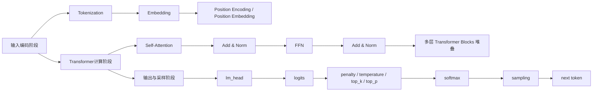

# LLM推理参数详解

## 1. 先说结论

大模型常见参数，大致可以分成 4 类：

- 控制随机性：`temperature`、`top_k`、`top_p`
- 控制重复：`frequency_penalty`、`presence_penalty`
- 控制输出长度与停止：`max_tokens`、`stop`
- 控制返回形式与调试：`n`、`seed`、`logprobs`

最重要的一点是：

- 这些参数大多数都**不属于 Transformer 内部结构**
- 它们通常作用在：

$$
\text{Transformer前向} \rightarrow \text{lm\_head} \rightarrow \text{logits} \rightarrow \text{sampling}
$$

也就是说，它们大多数是**推理采样阶段参数**，不是模型训练结构本身的一部分。

---

## 2. LLM推理的整体链路

不要一上来把整条链路拉太长，可以先分成 3 个大阶段来看：

### 2.0 整体大图

先看整体结构图：



这个图可以先只看最上面三块：

- 输入编码阶段
- Transformer计算阶段
- 输出与采样阶段

如果要细看，再往下看每个大阶段内部的小步骤。

### 2.1 第一阶段：输入编码阶段

这一阶段的目标是：

- 把文本变成模型能处理的向量表示

小阶段包括：

- `Tokenization`
  - 把文本切成 token
- `Embedding`
  - 把 token id 映射成向量
- `Position Encoding / Position Embedding`
  - 给模型补充位置信息

这一阶段结束后，可以理解成：

- 模型已经拿到了“带位置信息的输入表示”

---

### 2.2 第二阶段：Transformer计算阶段

这一阶段的目标是：

- 让每个 token 和上下文交互
- 得到上下文化后的隐藏表示

小阶段包括：

- `Self-Attention`
  - 看上下文里哪些 token 更重要
- `Add & Norm`
  - 做残差连接和层归一化
- `FFN`
  - 对当前位置表示再做非线性加工
- `Add & Norm`
  - 再做一次残差连接和层归一化

这些步骤会在多层 `Transformer Blocks` 中反复堆叠。

这一阶段结束后，可以得到：

- `Hidden States`

也就是：

- 每个位置在结合上下文之后的表示

---

### 2.3 第三阶段：输出与采样阶段

这一阶段的目标是：

- 把隐藏表示变成下一个 token 的概率
- 再根据采样策略选出最终输出

小阶段包括：

- `lm_head`
  - 把 hidden states 映射成整个词表的分数
- `logits`
  - 当前时刻每个候选 token 的原始分数
- `penalty / temperature / top_k / top_p`
  - 对分数和候选集合做推理控制
- `softmax`
  - 把 logits 转成概率分布
- `sampling`
  - 从概率分布中选出下一个 token

这一阶段结束后，会得到：

- `next token`

---

### 2.4 用一句话串起来

如果只保留大阶段，可以记成：

$$
\text{输入编码}
\rightarrow
\text{Transformer计算}
\rightarrow
\text{输出与采样}
$$

如果按“小阶段”理解，可以记成：

- 输入编码阶段
  - `Tokenization`
  - `Embedding`
  - `Position`
- Transformer计算阶段
  - `Self-Attention`
  - `Add & Norm`
  - `FFN`
  - `Add & Norm`
- 输出与采样阶段
  - `lm_head`
  - `logits`
  - `softmax`
  - `sampling`

很多推理参数，主要都是在第三阶段起作用，而不是在 Transformer 内部 block 里起作用。

---

## 3. 控制随机性的参数

### 3.1 `temperature`

`temperature` 用来控制输出的随机性。

它通常作用在 softmax 之前：

$$
p_i = \mathrm{softmax}\left(\frac{z_i}{T}\right)
$$

其中：

- \(z_i\) 是第 \(i\) 个 token 的 logit
- \(T\) 是 `temperature`

也就是说，它的作用位置是：

$$
\text{logits}
\rightarrow
\frac{z_i}{T}
\rightarrow
\text{softmax}
\rightarrow
\text{概率分布}
$$

规律是：

- `temperature` 越低，分布越尖锐，越偏向选最高概率 token
- `temperature` 越高，分布越平缓，更多低概率 token 会被保留下来

可以简单理解成：

- `低 temperature` = 更稳、更确定
- `高 temperature` = 更多样、更随机

常见场景：

- 问答、代码、分类、rerank：一般偏低
- 创意写作、脑暴：一般可以高一点

---

### 3.2 `top_k`

`top_k` 的意思是：

- 只保留概率最高的前 `k` 个 token
- 其他 token 不参与采样

例如：

- `top_k = 50`

表示每一步只从前 50 个最可能的 token 中选。

它的作用位置也是在 `logits` 出来之后、采样之前。

更严谨地说，常见实现会这样做：

- 先找出分数最高的前 `k` 个 token
- 其余 token 的 logit 直接设为 `-\infty`
- 然后再做 `softmax`
- 最后只在这 `k` 个 token 里采样

也就是：

$$
\text{logits}
\rightarrow
\text{保留 top-}k
\rightarrow
\text{其余置为 } -\infty
\rightarrow
\text{softmax}
\rightarrow
\text{在 top-}k \text{ 内采样}
$$

可以理解成：

- `top_k` 控制的是“候选个数”

---

### 3.3 `top_p`

`top_p` 也叫 nucleus sampling。

它的意思是：

- 按概率从高到低累加
- 直到累计概率达到 \(p\)
- 只从这部分 token 中采样

例如：

- `top_p = 0.9`

表示：

- 只从累计概率达到 0.9 的那一批 token 中选

和 `top_k` 的区别是：

- `top_k`：固定数量
- `top_p`：固定概率质量

更严谨地说，`top_p` 往往会先根据 logits 排序，再找到累计概率达到阈值 \(p\) 的最小候选集合，只保留这部分 token，其余 token 的 logit 设为 `-\infty`，然后再做 `softmax`：

$$
\text{logits}
\rightarrow
\text{排序}
\rightarrow
\text{保留累计概率达到 } p \text{ 的最小集合}
\rightarrow
\text{其余置为 } -\infty
\rightarrow
\text{softmax}
\rightarrow
\text{在 nucleus 内采样}
$$

可以理解成：

- `top_p` 控制的是“候选概率范围”

---

## 4. 控制重复的参数

### 4.1 `frequency_penalty`

`frequency_penalty` 的作用是：

- 某个 token 出现次数越多
- 对它的惩罚越大

它的目的是：

- 减少模型反复重复相同词语
- 减少啰嗦输出

它不在 Transformer block 里，而是在采样前对 logits 做调整。

可以抽象理解成：

$$
z_i' = z_i - \lambda_f \cdot c_i
$$

其中：

- \(z_i\) 是原始 logit
- \(c_i\) 是该 token 已出现次数
- \(\lambda_f\) 可以理解为 frequency penalty 系数

所以：

- 出现越多，logit 被扣得越多
- 后面再被选中的概率就越小

---

### 4.2 `presence_penalty`

`presence_penalty` 的作用是：

- 某个 token 只要出现过
- 就给它一个惩罚

它更强调：

- 鼓励模型换新词
- 鼓励模型拓展新内容

同样，它也发生在采样阶段，而不是 Transformer 内部。

可以抽象理解成：

$$
z_i' = z_i - \lambda_p \cdot \mathbb{I}(c_i > 0)
$$

其中：

- \(c_i > 0\) 表示该 token 之前出现过
- \(\mathbb{I}(\cdot)\) 是指示函数

区别可以这样记：

- `frequency_penalty`：看重复了多少次
- `presence_penalty`：只看有没有出现过

---

## 5. 控制输出长度和停止的参数

### 5.1 `max_tokens`

`max_tokens` 表示：

- 最多生成多少个 token

有些框架也会写成：

- `max_new_tokens`

本质作用差不多，都是控制最大输出长度。

它的作用不是改模型分布，而是限制生成过程最多走多少步。

---

### 5.2 `stop`

`stop` 表示：

- 当生成结果里出现某些指定字符串时，就停止输出

例如：

```text
stop = ["\nUser:", "</answer>"]
```

常见用途：

- 对话模板控制
- 结构化输出控制
- 防止模型多说

它作用在生成循环里，不属于 Transformer 结构本身。

---

## 6. 控制返回形式和调试的参数

### 6.1 `n`

`n` 表示：

- 一次生成返回几份候选结果

例如：

- `n = 3`

表示一次返回 3 个候选答案。

---

### 6.2 `seed`

`seed` 表示：

- 随机种子

如果推理后端支持固定随机种子，那么它有助于提高结果可复现性。

但要注意：

- 即使设置了 `seed`
- 后端实现、并行策略、浮点误差等也可能让结果并不是绝对完全一致

---

### 6.3 `logprobs`

`logprobs` 表示：

- 返回生成 token 的对数概率

有些接口还支持：

- `top_logprobs`

表示返回当前位置概率最高的若干候选 token 的对数概率。

这个参数很适合做：

- rerank
- 分类
- 置信度分析
- 输出调试

例如在 `yes/no` 型判别任务中，可以直接看：

$$
\log p(\text{yes}), \quad \log p(\text{no})
$$

来判断模型当前更倾向哪个答案。

---

## 7. 这些参数在 Transformer 的哪个环节起作用

这个问题很重要。

很多人会把这些参数误以为是 Transformer 内部层的参数，但其实大多数不是。

完整链路可以写成：

$$
\text{输入}
\rightarrow
\text{Embedding}
\rightarrow
\text{Self-Attention}
\rightarrow
\text{FFN}
\rightarrow
\text{Hidden States}
\rightarrow
\text{lm\_head}
\rightarrow
\text{logits}
\rightarrow
\text{temperature / penalty / top-k / top-p}
\rightarrow
\text{softmax}
\rightarrow
\text{sampling}
\rightarrow
\text{next token}
$$

其中可以这样区分：

### 7.1 属于 Transformer 内部结构的

- `Self-Attention`
- `FFN`
- `Residual / Add`
- `LayerNorm`
- `Embedding`
- `lm_head`

这些是模型结构本身。

### 7.2 不属于 Transformer 结构、而属于采样控制的

- `temperature`
- `top_k`
- `top_p`
- `frequency_penalty`
- `presence_penalty`
- `stop`
- `max_tokens`
- `n`
- `seed`
- `logprobs`

这些更准确地说是：

- 推理参数
- 解码参数
- 采样控制参数

补充一点：

- `temperature` 通常是在 `softmax` 之前对 logits 做缩放
- `top_k`、`top_p` 通常是在 `softmax` 之前对候选 token 集合做裁剪
- `frequency_penalty`、`presence_penalty` 通常是在 `softmax` 之前对部分 token 的 logits 做减分

所以这些参数虽然都属于“采样控制”，但它们控制的并不是同一个动作：

- 有的在改分布形状
- 有的在砍候选集合
- 有的在压重复 token

---

## 8. 常见参数怎么理解最直观

可以用一句话记住：

- `temperature`：控制“敢不敢偏离最高概率答案”
- `top_k`：控制“最多允许多少个候选”
- `top_p`：控制“允许多大概率范围内的候选”
- `frequency_penalty`：控制“重复越多，罚得越重”
- `presence_penalty`：控制“只要出现过，就少重复”
- `max_tokens`：控制“最多说多长”
- `stop`：控制“遇到哪里停”
- `logprobs`：控制“能不能看到每一步的概率信息”

---

## 8.1 参数在推理链路中的顺序图

如果从一次“生成下一个 token”的过程来看，常见推理参数大致作用在下面这条链路里：

$$
\text{Transformer前向}
\rightarrow
\text{lm\_head}
\rightarrow
\text{logits}
\rightarrow
\text{penalty调整}
\rightarrow
\text{temperature缩放}
\rightarrow
\text{top-k / top-p裁剪}
\rightarrow
\text{softmax}
\rightarrow
\text{sampling}
\rightarrow
\text{next token}
$$

其中可以这样理解：

- `penalty调整`
  - 主要对应 `frequency_penalty`、`presence_penalty`
  - 它们会先对部分 token 的 logit 做减分

- `temperature缩放`
  - 对应 `temperature`
  - 它会调整 logits 的分布陡峭程度

- `top-k / top-p裁剪`
  - 对应 `top_k`、`top_p`
  - 它们会进一步缩小允许采样的候选集合

- `softmax`
  - 把处理后的 logits 转成概率分布

- `sampling`
  - 真正从概率分布里选出下一个 token

需要注意：

- 不同推理框架在内部实现细节上，顺序可能会略有差异
- 但从理解角度看，上面这条链路已经足够准确
- 核心结论不变：这些参数大多都发生在 `logits` 出来之后，而不是 Transformer block 内部

---

## 9. 常见使用建议

### 9.1 问答 / 知识问答

建议：

- `temperature` 低一些
- `top_p` 不要太大
- 一般不需要太高的多样性

目标：

- 稳定
- 准确
- 少发散

### 9.2 代码生成

建议：

- `temperature` 更低
- 尽量减少随机性
- 必要时结合 `stop`

目标：

- 减少错误
- 提高可复现性

### 9.3 创意写作 / 脑暴

建议：

- `temperature` 可以高一点
- `top_p` 可以放宽

目标：

- 多样性
- 发散性
- 创造性

### 9.4 分类 / rerank / yes-no 判断

建议：

- `temperature` 很低甚至接近 0
- 更关注 `logprobs`
- 一般不需要高随机采样

目标：

- 稳定判断
- 概率可分析

---

## 10. 一句话总结

LLM 常见参数里，最核心的一点不是去死记每个名字，而是先理解它们分别控制什么：

- 控制概率分布形状：`temperature`
- 控制候选范围：`top_k`、`top_p`
- 控制重复程度：`frequency_penalty`、`presence_penalty`
- 控制输出边界：`max_tokens`、`stop`
- 控制返回和调试信息：`n`、`seed`、`logprobs`

更进一步地说：

- 它们大多数都不是 Transformer 内部结构
- 而是在 `logits -> sampling` 这个推理阶段起作用
