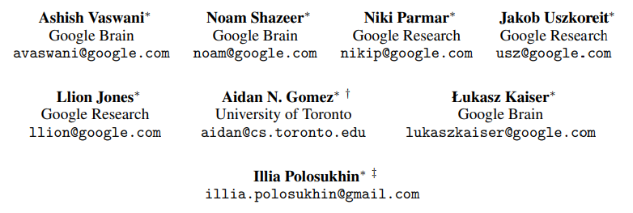
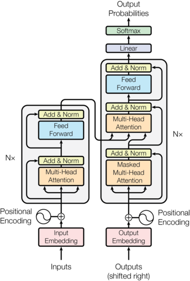
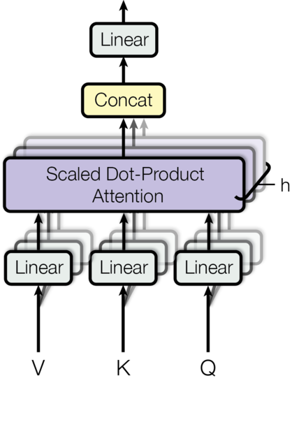
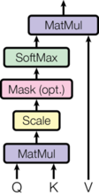
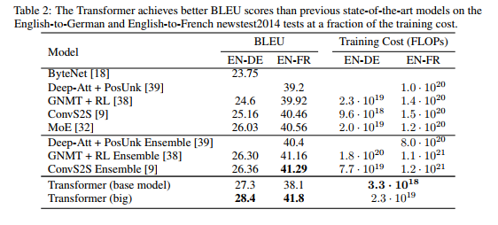
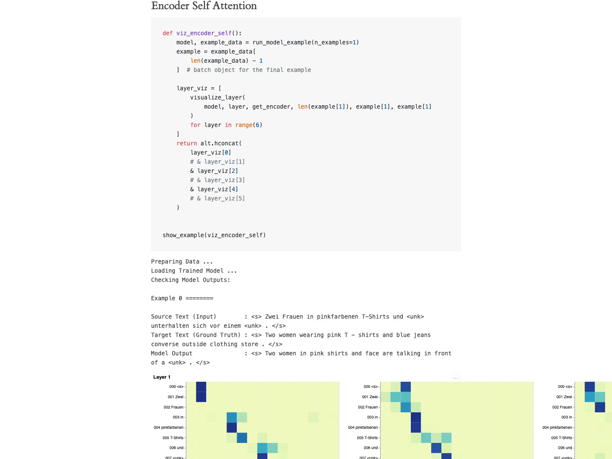
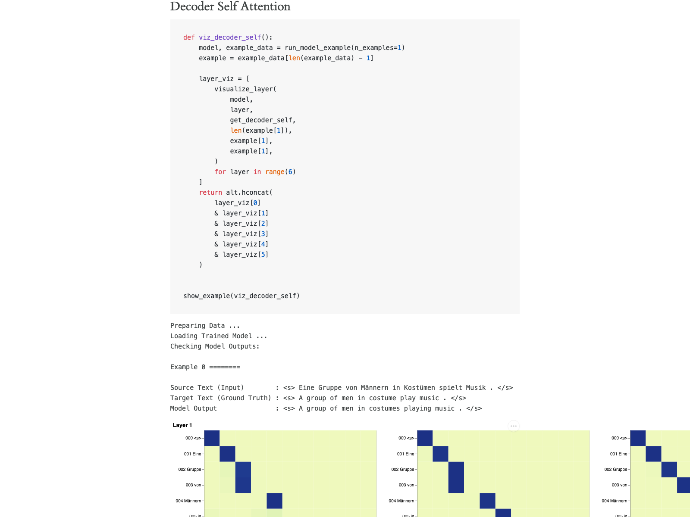
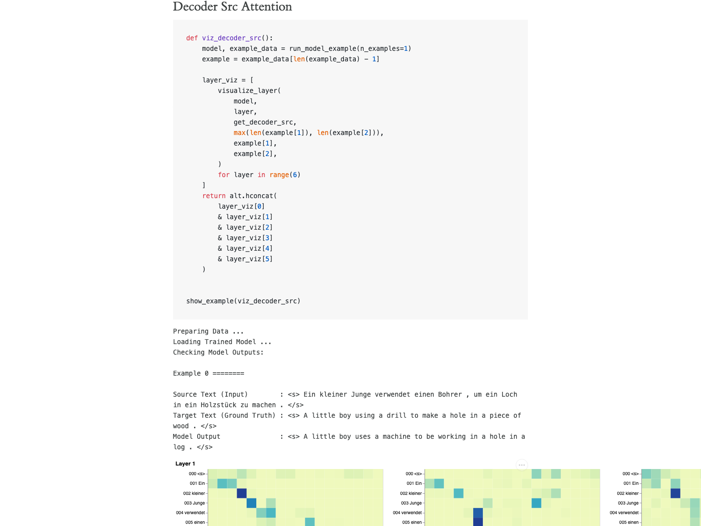

# The Annotated Transformer 中文导读（细化版）

> 原文：<https://nlp.seas.harvard.edu/annotated-transformer/>
>
> 说明：本文不是逐字翻译，而是按原文的章节结构，补全“公式含义、代码对应、训练与推理流程、易错点”。

## 1. 这篇文章到底做了什么

`The Annotated Transformer` 的核心不是“提出新模型”，而是把 `Attention Is All You Need` 从论文变成可运行代码，并且边写边解释。

它同时完成了三件事：

1. 解释标准 Transformer 的结构与信息流。
2. 给出 PyTorch 实现（模块拆解清晰）。
3. 演示训练、解码、可视化、真实任务落地。

换句话说，它回答的是：

- “Transformer 公式怎么落到代码？”
- “代码里的每个类为什么这样写？”
- “训练和推理时张量到底怎么走？”

## 2. 原文结构总览（你应该重点读哪里）

原文主线大致是：

1. Background
2. Model Architecture
3. Attention
4. Position-wise FFN / Embedding / Positional Encoding
5. Full Model + Inference
6. Training（Mask、Batch、Optimizer、Label Smoothing）
7. Toy Example
8. Real World Example
9. Attention Visualization

最关键的是两段：

- `Model Architecture`：理解模型本体。
- `Training`：理解它为什么能稳定训起来。

## 3. 先建立全局图：一个输入到输出的最短链路

对于机器翻译任务，数据流可以先记成：

1. 源句子 `src` -> `src embedding + positional encoding`。
2. 进入 `N` 层 Encoder，得到 `memory`。
3. 目标前缀 `tgt`（右移）-> `tgt embedding + positional encoding`。
4. 进入 `N` 层 Decoder（含 masked self-attn + src-attn）。
5. `Generator(Linear + log_softmax)` 输出每个位置的词概率。
6. 训练时算 loss，推理时按策略逐 token 生成。

## 4. Model Architecture：整体架构要点

标准 Transformer 是 `Encoder-Decoder` 架构：

- 左边：`N` 层 Encoder Stack。
- 右边：`N` 层 Decoder Stack。
- 底部：输入/输出 embedding。
- 顶部：词表映射层（Generator）。

在文章代码里，你会看到这些关键构件：

- `Encoder`
- `Decoder`
- `EncoderLayer`
- `DecoderLayer`
- `MultiHeadedAttention`
- `PositionwiseFeedForward`
- `Generator`
- `make_model(...)`

## 5. Encoder and Decoder Stacks（重点细化）

### 5.1 Encoder Stack：每层做什么

单层 Encoder 的计算可写为：

\[
\mathbf{z}=\mathrm{LayerNorm}(\mathbf{x}+\mathrm{MHA}(\mathbf{x},\mathbf{x},\mathbf{x}))
\]

\[
\mathbf{y}=\mathrm{LayerNorm}(\mathbf{z}+\mathrm{FFN}(\mathbf{z}))
\]

含义：

- 第一子层：Self-Attention，做跨 token 信息交互。
- 第二子层：FFN，做位置内非线性变换。
- 每个子层都包一层“残差 + LayerNorm”（源码里由 `SublayerConnection` 抽象）。

### 5.2 Decoder Stack：比 Encoder 多了什么

单层 Decoder 一般有三步：

\[
\mathbf{z}_1=\mathrm{LayerNorm}(\mathbf{x}+\mathrm{MaskedMHA}(\mathbf{x},\mathbf{x},\mathbf{x}))
\]

\[
\mathbf{z}_2=\mathrm{LayerNorm}(\mathbf{z}_1+\mathrm{MHA}(\mathbf{z}_1,\mathbf{m},\mathbf{m}))
\]

\[
\mathbf{y}=\mathrm{LayerNorm}(\mathbf{z}_2+\mathrm{FFN}(\mathbf{z}_2))
\]

其中 \(\mathbf{m}\) 是 Encoder 输出 `memory`。

核心差异：

1. `Masked Self-Attention`：当前位不能看未来位（保证自回归）。
2. `Encoder-Decoder Attention`：Decoder 读取源句编码结果。
3. 再做 FFN。

### 5.3 为什么“堆叠 N 层”有效

- 浅层更偏局部模式，深层逐步抽象语义。
- 每层都可做“信息混合 + 特征重映射”。
- 残差连接让深层训练更稳定。

### 5.4 代码对应点（建议你对照看）

- `EncoderLayer.forward(x, mask)`：两次 `sublayer` 调用。
- `DecoderLayer.forward(x, memory, src_mask, tgt_mask)`：三次 `sublayer` 调用。
- `clones(module, N)`：把单层模块复制成 `N` 层堆栈。

## 6. Attention：这篇文章真正的核心

缩放点积注意力：

\[
\mathrm{Attention}(Q,K,V)=\mathrm{softmax}\left(\frac{QK^T}{\sqrt{d_k}}\right)V
\]

三步理解：

1. `QK^T`：相关性打分。
2. `/sqrt(d_k)`：防止点积过大导致 softmax 饱和、梯度变差。
3. 乘 `V`：对 value 做加权聚合。

### 6.1 三种 Attention 用法（原文强调）

1. Encoder self-attn：`Q=K=V=encoder states`
2. Decoder masked self-attn：`Q=K=V=decoder prefix states`
3. Encoder-decoder attn：`Q=decoder states, K=V=encoder memory`

### 6.2 Multi-Head Attention 的意义

每个 head 学一套投影：

\[
\mathrm{head}_i=\mathrm{Attention}(QW_i^Q,KW_i^K,VW_i^V)
\]

\[
\mathrm{MultiHead}(Q,K,V)=\mathrm{Concat}(head_1,...,head_h)W^O
\]

好处：不同 head 能学习不同关系模式（局部、长依赖、对齐等）。

## 7. FFN、Embedding、Positional Encoding

### 7.1 Position-wise FFN

\[
\mathrm{FFN}(x)=\max(0,xW_1+b_1)W_2+b_2
\]

- 按位置独立应用同一 MLP。
- 不负责 token 间交互（交互由 attention 完成）。

### 7.2 Embedding and Softmax

- 输入 token -> embedding。
- Decoder 输出隐状态 -> `Generator`（线性到词表）-> `log_softmax`。
- 常见技巧：输入 embedding 与输出 projection 权重共享（原文实现有体现）。

### 7.3 Positional Encoding（正余弦）

\[
PE_{(pos,2i)}=\sin\left(pos/10000^{2i/d_{model}}\right)
\]

\[
PE_{(pos,2i+1)}=\cos\left(pos/10000^{2i/d_{model}}\right)
\]

要点：

- Transformer 自身不带时序偏置，必须显式注入位置信息。
- 不同维度对应不同频率，便于模型表达相对位置关系。

## 8. Inference：推理时模型如何“逐字生成”

原文的 `greedy_decode` 演示了自回归生成：

1. 先跑 Encoder 得到 `memory`。
2. Decoder 只输入已生成前缀（初始是 `<bos>`）。
3. 构造 `subsequent_mask` 防止看未来。
4. 取最后位置分布，选下一个 token。
5. 拼回序列，循环到 `<eos>` 或最大长度。

这和今天大多数生成式模型的推理机制是一致的（只是工程优化不同）。

## 9. Training：为什么它能训稳

### 9.1 Batches and Masking

训练最关键的两个 mask：

1. `src padding mask`：屏蔽 padding 位。
2. `tgt causal mask`（subsequent mask）：防止目标句偷看未来词。

源码里常见入口：

- `Batch` 类里生成 `src_mask` / `tgt_mask`。
- `subsequent_mask(size)` 生成上三角屏蔽。

### 9.2 训练循环（run_epoch）

标准流程：

1. 前向：`model(src, tgt, src_mask, tgt_mask)`
2. 计算损失：`criterion`
3. 反向：`loss.backward()`
4. 更新：`optimizer.step()`

原文把 `loss 计算 + 反向 + 更新`封装在 `SimpleLossCompute` 里，教学可读性很高。

### 9.3 Optimizer 与 Noam 学习率

经典调度公式：

\[
\mathrm{lrate}=d_{model}^{-0.5}\cdot\min(step^{-0.5},\ step\cdot warmup^{-1.5})
\]

解释：

- 训练初期 warmup 线性升高学习率，避免不稳定。
- 过了 warmup 后按反平方根衰减，兼顾收敛与稳定。

### 9.4 Regularization 与 Label Smoothing

Label Smoothing 核心思想：

- 不把正确标签概率设成 1.0，而是稍微分散到其他类别。
- 减少模型过度自信，通常提升泛化与校准。

## 10. Toy Example 与 Real World Example：为什么要看

### 10.1 Toy Example

价值：最小可运行闭环。你能快速验证：

- 模型能前向、能反向、能解码。
- 关键代码接口如何串起来。

### 10.2 Real World Example

价值：从“教学 demo”走向真实数据（如翻译任务）时，数据管线、batch、训练脚本怎么组织。

## 11. Attention Visualization：如何读图才有收获

原文给了三类可视化：

1. Encoder Self-Attention
2. Decoder Self-Attention
3. Decoder-Source Attention

建议看图方法：

1. 固定一个 token，观察它最关注哪些位置。
2. 对比不同 head，找出头间分工差异。
3. 对比不同层，观察“浅层局部/深层抽象”的趋势。

### 11.1 Encoder Self-Attention

### 11.2 Decoder Self-Attention

### 11.3 Decoder Src-Attention

## 12. 文章中你最该掌握的函数清单（代码导航）

如果你准备二刷原文，可以按下面函数快速定位：

1. `make_model`：模型组装入口。
2. `EncoderLayer` / `DecoderLayer`：核心层逻辑。
3. `MultiHeadedAttention` + `attention`：注意力实现。
4. `PositionalEncoding`：位置编码。
5. `Batch` + `subsequent_mask`：训练 mask。
6. `NoamOpt`：学习率调度。
7. `LabelSmoothing`：正则化。
8. `run_epoch` / `SimpleLossCompute`：训练循环。
9. `greedy_decode`：推理流程。

## 13. 常见误区（读这篇时容易踩坑）

1. 只记公式，不看张量 shape。
2. 把 `self-attn` 和 `src-attn` 混为一谈。
3. 忽略 mask，导致不理解自回归约束。
4. 看懂结构图，但没跟代码类名对应。
5. 忽略学习率调度和 label smoothing 对训练稳定性的作用。

## 14. 推荐阅读顺序（实践导向）

1. `make_model`（先看全局拼装）
2. `EncoderLayer` / `DecoderLayer`
3. `attention` / `MultiHeadedAttention`
4. `PositionalEncoding` / `FFN`
5. `Batch` / `subsequent_mask`
6. `NoamOpt` / `LabelSmoothing`
7. `run_epoch`
8. `greedy_decode`
9. `Attention Visualization`

## 15. 一句话总结

这篇文章的价值在于：它把 Transformer 从“会背概念”变成“能写、能训、能解释、能 debug”。

---

## 附：原文关键链接

- Annotated Transformer 主页：<https://nlp.seas.harvard.edu/annotated-transformer/>
- 架构章节：<https://nlp.seas.harvard.edu/annotated-transformer/#model-architecture>
- 注意力可视化：<https://nlp.seas.harvard.edu/annotated-transformer/#attention-visualization>
- Encoder Self-Attention：<https://nlp.seas.harvard.edu/annotated-transformer/#encoder-self-attention>
- Decoder Self-Attention：<https://nlp.seas.harvard.edu/annotated-transformer/#decoder-self-attention>
- Decoder Src-Attention：<https://nlp.seas.harvard.edu/annotated-transformer/#decoder-src-attention>
