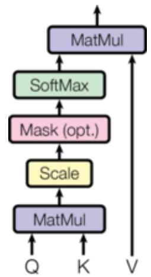

# Transformer

# The Annotated Transformer

Attention is All You Need

Ashish Vaswani\* Google Brain avaswani@google.com

Noam Shazeer\* Google Brain noam@google.com

Niki Parmar\* Google Research nikip@google.com Jakob Uszkoreit\* Google Research usz@google .com

Llion Jones\* Google Research llion@google.com

Aidan N. Gomez\* † University of Toronto aidan@cs.toronto.edu

Lukasz Kaiser\* Google Brain lukaszkaiser@google.com

Illia Polosukhin\* ‡ illia.polosukhin@gmail.com

• v2022: Austin Huang Suraj Subramanian Jonathan Sum Khalid Almubarak and Stella Biderman.

• Original: Sasha Rush.

The Transformer has been on a lot of people’s minds over the last year five years. This post presents an annotated version of the paper in the form of a line-by-line implementation. It reorders and deletes some sections from the original paper and adds comments throughout. This document itself is a working notebook, and should be a completely usable implementation. Code is available here.

# Table of Contents

• Prelims   
• Background   
• Part 1: Model Architecture   
• Model Architecture 0 Encoder and Decoder Stacks ◦ Position-wise Feed-Forward Networks ◦ Embeddings and Softmax ◦ Positional Encoding

◦ Full Model ◦ Inference:

• Part 2: Model Training

• Training

Batches and Masking   
Training Loop   
Training Data and Batching   
Hardware and Schedule   
Optimizer   
Regularization

• A First Example ◦ Synthetic Data ◦ Loss Computation ◦ Greedy Decoding • Part 3: A Real World Example ◦ Data Loading ◦ Iterators ◦ Training the System

• Additional Components: BPE, Search, Averaging

• Results

◦ Attention Visualization ◦ Encoder Self Attention ◦ Decoder Self Attention ◦ Decoder Src Attention • Conclusion

# Prelims

#

# 代码块

# 代码块

1 $- q$ $\scriptstyle 1 = = \varnothing$ $\scriptstyle = = \mathcal { O }$

# 代码块

1 import os   
2 from os.path import exists   
3 import torch   
4 import torch.nn as nn   
5 from torch.nn.functional import log_softmax, pad   
6 import math   
7 import copy   
8 import time   
9 from torch.optim.lr_scheduler import LambdaLR   
10 import pandas as pd   
11 import altair as alt   
12 from torchtext.data.functional import to_map_style_dataset   
13 from torch.utils.data import DataLoader   
14 from torchtext.vocab import build_vocab_from_iterator   
15 import torchtext.datasets as datasets   
16 import spacy   
17 import GPUtil   
18 import warnings   
19 from torch.utils.data.distributed import DistributedSampler   
20 import torch.distributed as dist   
21 import torch.multiprocessing as mp   
22 from torch.nn.parallel import DistributedDataParallel as DDP   
23   
24   
25   
26 warnings.filterwarnings("ignore")   
27 RUN_EXAMPLES $=$ True

# 代码块

1   
2 return __name__ $= =$ "__main__"def show_example(fn, args=[]):   
3 if __name__ $= =$ "__main__" and RUN_EXAMPLES:   
4 return fn(\*args)   
5   
6   
7 def execute_example(fn, $\mathsf { a r g s } \mathsf { = } \left[ \mathsf { 1 } \right]$ ):   
8 if __name__ $= =$ "__main__" and RUN_EXAMPLES:   
9 fn(\*args)   
10   
11   
12 class DummyOptimizer(torch.optim.Optimizer):   
13 def __init__(self):   
14 self.param_groups $=$ [{"lr": 0}]   
15 Nonedef step(self):   
16 Nonedef zero_grad(self, set_to_none $^ { \prime \pm }$ False):   
17 Noneclass DummyScheduler:   
18 def step(self):   
19 None

My comments are blockquoted. The main text is all from the paper itself.

# Background

The goal of reducing sequential computation also forms the foundation of the Extended Neural GPU, ByteNet and ConvS2S, all of which use convolutional neural networks as basic building block, computing hidden representations in parallel for all input and output positions. In these models, the number of operations required to relate signals from two arbitrary input or output positions grows in the distance between positions, linearly for ConvS2S and logarithmically for ByteNet. This makes it more difficult to learn dependencies between distant positions. In the Transformer this is reduced to a constant number of operations, albeit at the cost of reduced effective resolution due to averaging attention-weighted positions, an effect we counteract with Multi-Head Attention.

Self-attention, sometimes called intra-attention is an attention mechanism relating different positions of a single sequence in order to compute a representation of the sequence. Selfattention has been used successfully in a variety of tasks including reading comprehension, abstractive summarization, textual entailment and learning task-independent sentence representations. End-to-end memory networks are based on a recurrent attention mechanism instead of sequencealigned recurrence and have been shown to perform well on simplelanguage question answering and language modeling tasks.

To the best of our knowledge, however, the Transformer is the first transduction model relying entirely on self-attention to compute representations of its input and output without using sequence aligned RNNs or convolution.

# Part 1: Model Architecture

# Model Architecture

Most competitive neural sequence transduction models have an encoder-decoder structure (cite). Here, the encoder maps an input sequence of symbol representations $( \times 1 , . . . , x \mathsf { n } ) ( x 1 , . . . , x n )$ to a sequence of continuous representations $\scriptstyle z = ( z 1 , \ldots , z n ) z = ( z 1 , \ldots , z n )$ . Given zz, the decoder then generates an output sequence $( \mathsf { y 1 } , . . . , \mathsf { y m } ) ( \mathsf { y 1 } , . . . , \mathsf { y m } )$ of symbols one element at a time. At each step the model is auto-regressive (cite), consuming the previously generated symbols as additional input when generating the next.

# 代码块

1 class EncoderDecoder(nn.Module):   
2 """   
3 A standard Encoder-Decoder architecture. Base for this and many   
4 other models.   
5 """def __init__(self, encoder, decoder, src_embed, tgt_embed, generator):   
6 super(EncoderDecoder, self).__init__()   
7 self.encoder $=$ encoder   
8 self.decoder $=$ decoder   
9 self.src_embed $=$ src_embed   
10 self.tgt_embed $=$ tgt_embed   
11 self.generator $=$ generator   
12   
13 def forward(self, src, tgt, src_mask, tgt_mask):   
14 "Take in and process masked src and target sequences."return   
self.decode(self.encode(src, src_mask), src_mask, tgt, tgt_mask)   
15   
16 def encode(self, src, src_mask):   
17 return self.encoder(self.src_embed(src), src_mask)   
18   
19 def decode(self, memory, src_mask, tgt, tgt_mask):   
20 return self.decoder(self.tgt_embed(tgt), memory, src_mask, tgt_mask)

# 代码块

class Generator(nn.Module):   
2 "Define standard linear $^ +$ softmax generation step."def __init__(self, d_model, vocab):   
3 super(Generator, self).__init__()   
4 self.proj $=$ nn.Linear(d_model, vocab)   
5   
6 def forward(self, x): return log_softmax(self.proj $( \times )$ , dim $\lvert = - 1$ )

The Transformer follows this overall architecture using stacked self-attention and point-wise, fully connected layers for both the encoder and decoder, shown in the left and right halves of Figure 1, respectively.

# Encoder and Decoder Stacks

# Encoder

The encoder is composed of a stack of $N { = } G N { = } 6$ identical layers.

# 代码块

def clones(module, N): 2 "Produce N identical layers."return nn.ModuleList([copy.deepcopy(module) for _ in range(N)])

# 代码块

1 class Encoder(nn.Module):   
2 "Core encoder is a stack of N layers"def __init__(self, layer, N):   
3 super(Encoder, self).__init__()   
4 self.layers $=$ clones(layer, N)   
5 self.norm $=$ LayerNorm(layer.size)   
6   
7 def forward(self, x, mask):   
8 "Pass the input (and mask) through each layer in turn."for layer in   
self.layers:   
9 $\textsf { x } = \textsf { l a y e r } ( \textsf { x } , \ \mathsf { m a s k } )$   
10 return self.norm(x)

We employ a residual connection (cite) around each of the two sub-layers, followed by layer normalization (cite).

# 代码块

1 class LayerNorm(nn.Module): 2 "Construct a layernorm module (See citation for details)."def __init__(self, features, $\mathsf { e p s } \mathsf { = } \mathsf { 1 e } ^ { - } 6$ ):   
3 super(LayerNorm, self).__init__()   
4 self.a_2 $=$ nn.Parameter(torch.ones(features))   
5 self.b_2 $=$ nn.Parameter(torch.zeros(features))   
6 self.eps $=$ eps   
7   
8 def forward(self, x):   
9 mean $=$ x.mean( $^ { - 1 }$ , keepdim=True)   
10 std $=$ x.std( $^ { - 1 }$ , keepdim $\mid =$ True)   
11 return self.a_2 $\star$ ( $\times$ - mean) / (std $^ +$ self.eps) $^ +$ self.b_2

That is, the output of each sub-layer is LayerNorm(x+Sublayer(x))LayerNorm(x+Sublayer(x)), where Sublayer(x)Sublayer $( \chi )$ is the function implemented by the sub-layer itself. We apply dropout (cite) to the output of each sub-layer, before it is added to the sub-layer input and normalized.

To facilitate these residual connections, all sub-layers in the model, as well as the embedding layers, produce outputs of dimension dmode $\mathtt { 1 = 5 1 2 }$ dmode $= 5 1 2$ .

# 代码块

1 class SublayerConnection(nn.Module):   
2 """   
3 A residual connection followed by a layer norm.   
4 Note for code simplicity the norm is first as opposed to last.   
5 """def __init__(self, size, dropout):   
6 super(SublayerConnection, self).__init__()   
self.norm $=$ LayerNorm(size)   
8 self.dropout $=$ nn.Dropout(dropout)   
9   
10 def forward(self, x, sublayer):   
11 "Apply residual connection to any sublayer with the same size."return   
x + self.dropout(sublayer(self.norm $( \times )$ ))

Each layer has two sub-layers. The first is a multi-head self-attention mechanism, and the second is a simple, position-wise fully connected feed-forward network.

# 代码块

1 class EncoderLayer(nn.Module):   
2 "Encoder is made up of self-attn and feed forward (defined below)"def   
_init__(self, size, self_attn, feed_forward, dropout):   
3 super(EncoderLayer, self).__init__()   
4 self.self_attn $=$ self_attn   
5 self.feed_forward $=$ feed_forward   
6 self.sublayer $=$ clones(SublayerConnection(size, dropout), 2)   
7 self.size $=$ size   
8   
9 def forward(self, x, mask):   
10 "Follow Figure 1 (left) for connections."   
11 $\times \ =$ self.sublayer[0](x, lambda x: self.self_attn(x, x, x, mask))   
12 return self.sublayer[1](x, self.feed_forward)

# Decoder

The decoder is also composed of a stack of $N { = } G N { = } 6$ identical layers.

# 代码块

class Decoder(nn.Module):   
2 "Generic N layer decoder with masking."def __init__(self, layer, N):   
3 super(Decoder, self).__init__()   
4 self.layers $=$ clones(layer, N)   
5 self.norm $=$ LayerNorm(layer.size)   
6   
7 def forward(self, x, memory, src_mask, tgt_mask):   
8 for layer in self.layers:   
9 $\times \quad =$ layer(x, memory, src_mask, tgt_mask)   
10 return self.norm(x)

In addition to the two sub-layers in each encoder layer, the decoder inserts a third sub-layer, which performs multi-head attention over the output of the encoder stack. Similar to the

encoder, we employ residual connections around each of the sub-layers, followed by layer normalization.

# 代码块

1 class DecoderLayer(nn.Module):   
2 "Decoder is made of self-attn, src-attn, and feed forward (defined   
below)"def __init__(self, size, self_attn, src_attn, feed_forward, dropout):   
3 super(DecoderLayer, self).__init__()   
4 self.size $=$ size   
5 self.self_attn $=$ self_attn   
6 self.src_attn $=$ src_attn   
7 self.feed_forward $=$ feed_forward   
8 self.sublayer $=$ clones(SublayerConnection(size, dropout), 3)   
9   
10 def forward(self, x, memory, src_mask, tgt_mask):   
11 "Follow Figure 1 (right) for connections."   
12 $\mathsf { m } =$ memory   
13 $\times \ =$ self.sublayer[0](x, lambda x: self.self_attn(x, x, x, tgt_mask))   
14 $\times \ =$ self.sublayer[1](x, lambda x: self.src_attn(x, m, m, src_mask))   
15 return self.sublayer[2](x, self.feed_forward)

We also modify the self-attention sub-layer in the decoder stack to prevent positions from attending to subsequent positions. This masking, combined with fact that the output embeddings are offset by one position, ensures that the predictions for position ii can depend only on the known outputs at positions less than ii.

# 代码块

1 def subsequent_mask(size):   
2 "Mask out subsequent positions."   
3 attn_shape $=$ (1, size, size)   
4 subsequent_mask $=$ torch.triu(torch.ones(attn_shape), diagonal $= 1$ ).type(   
5 torch.uint8   
6 )   
7 return subsequent_mask $\begin{array} { r l } { \mathbf { \Sigma } } & { { } = \mathbf { \Sigma } } \end{array} \left. \begin{array} { l l } { \mathbf { \Sigma } } \\ { \mathbf { \Sigma } } \end{array} \right. $

Below the attention mask shows the position each tgt word (row) is allowed to look at (column). Words are blocked for attending to future words during training.

# 代码块

1 def example_mask():   
2 LS_data $=$ pd.concat(   
3 [   
4 pd.DataFrame(   
5 {   
6 "Subsequent Mask": subsequent_mask(20)[0][x, y].flatten(),   
7 "Window": y,   
8 "Masking": x,   
9 }   
10 )   
11 for y in range(20)   
12 for $\times$ in range(20)   
13 ]   
14 )   
15   
16 return (   
17 alt.Chart(LS_data)   
18 .mark_rect()   
19 .properties(height $= 2 5 \Theta$ , width $_ { 1 } = 2 5 \Theta$ )   
20 .encode(   
21 alt.X("Window:O"),   
22 alt.Y("Masking:O"),   
23 alt.Color("Subsequent Mask:Q", scale $=$ alt.Scale(scheme="viridis")),   
24 )   
25 .interactive()   
26 )   
27   
28   
29 show_example(example_mask)

# Attention

An attention function can be described as mapping a query and a set of key-value pairs to an output, where the query, keys, values, and output are all vectors. The output is computed as a weighted sum of the values, where the weight assigned to each value is computed by a compatibility function of the query with the corresponding key.

We call our particular attention “Scaled Dot-Product Attention”. The input consists of queries and keys of dimension dkdk, and values of dimension dvdv. We compute the dot products of the query with all keys, divide each by dkdk, and apply a softmax function to obtain the weights on the values.

In practice, we compute the attention function on a set of queries simultaneously, packed together into a matrix $\mathsf { Q } Q$ The keys and values are also packed together into matrices KK and VV. We compute the matrix of outputs as:

# 代码块

1 Attention $( \boldsymbol { 0 } , \mathsf { K } , \mathsf { V } ) = \mathsf { s }$ oftmax(QKTdk)VAttention $( Q , K , V ) =$ softmax(dkQKT)V

# 代码块

1 def attention(query, key, value, mask $\underline { { \underline { { \mathbf { \Pi } } } } }$ None, dropout $=$ None):   
2 "Compute 'Scaled Dot Product Attention'"   
3 ${ \mathsf { d } } _ { - } { \mathsf { k } } { \mathsf { \Omega } } =$ query.size(-1)   
4 scores $=$ torch.matmul(query, key.transpose(-2, -1)) / math.sqrt(d_k)   
5 if mask is not None:   
6 scores $=$ scores.masked_fill(mask $\begin{array} { r l } { \mathbf { \omega } = } & { { } \odot } \end{array}$ , -1e9)   
7 p_attn $=$ scores.softmax( $\mathrm { \check { d } } \dot { 1 } \boldsymbol { \mathfrak { m } } = - 1$ )   
8 if dropout is not None:   
9 p_attn $=$ dropout(p_attn)   
10 return torch.matmul(p_attn, value), p_attn

The two most commonly used attention functions are additive attention (cite), and dot-product (multiplicative) attention. Dot-product attention is identical to our algorithm, except for the scaling factor of 1dkdk1. Additive attention computes the compatibility function using a feedforward network with a single hidden layer. While the two are similar in theoretical complexity, dot-product attention is much faster and more space-efficient in practice, since it can be implemented using highly optimized matrix multiplication code.

While for small values of dkdk the two mechanisms perform similarly, additive attention outperforms dot product attention without scaling for larger values of dkdk (cite). We suspect that for large values of dkdk, the dot products grow large in magnitude, pushing the softmax function into regions where it has extremely small gradients (To illustrate why the dot products get large, assume that the components of qq and kk are independent random variables with mean 00 and variance 11. Then their dot product, q⋅k=∑i=1dkqikiq⋅k=∑i=1dkqiki, has mean 00 and variance dkdk.). To counteract this effect, we scale the dot products by 1dkdk1.

Multi-head attention allows the model to jointly attend to information from different representation subspaces at different positions. With a single attention head, averaging inhibits this.

# 代码块

1 MultiHead(Q,K,V) $=$ Concat(head1,...,headh)WOwhere headi $=$ Attention(QWiQ,KWiK,VWiV)MultiHead $( Q , K , V ) =$ Concat(head1,...,headh)WOwhere headi $\equiv$ Attention(QWiQ,KWiK,VWiV)

Where the projections are parameter matrices WiQ $\in$ Rdmodel $\times$ dkWiQ∈Rdmodel×dk, WiK $\in$ Rdmodel $\times$ dkWiK $\in$ Rdmodel $\times$ dk, WiV $\in$ Rdmodel $\times$ dvWiV∈Rdmodel $\times$ dv and WO∈Rhdv $\times$ dmodelWO∈Rhdv $\times$ dmodel.

In this work we employ $h = 8 h = 8$ parallel attention layers, or heads. For each of these we use dk=dv=dmodel/h=64dk=dv=dmodel/ $h { = } 6 4$ . Due to the reduced dimension of each head, the total computational cost is similar to that of single-head attention with full dimensionality.

代码块   
1 class MultiHeadedAttention(nn.Module):   
2 def __init__(self, h, d_model, dropout $= 0 . 1$ ):   
3 "Take in model size and number of heads."super(MultiHeadedAttention,   
self).__init__()   
4 assert d_model $\% \ h \ = = \ \Theta \#$ We assume d_v always equals d_ k   
5 self.d_k $=$ d_model // h   
6 self.h $= { \textrm { h } }$   
7 self.linears $=$ clones(nn.Linear(d_model, d_model), 4)   
8 self.attn $=$ None   
9 self.dropout $=$ nn.Dropout( ${ \mathsf { p } } =$ dropout)   
10   
11 def forward(self, query, key, value, mask $\cdot ^ { = }$ None):   
12 "Implements Figure 2"if mask is not None:   
13   
14 mask $=$ mask.unsqueeze(1)   
15 nbatches $=$ query.size(0)   
16   
17   
18 query, key, value $=$ [   
19 lin(x).view(nbatches, -1, self.h, self.d_k).transpose(1, 2)   
20 for lin, $\times$ in zip(self.linears, (query, key, value))   
21 ]   
22   
23   
24 x, self.attn $=$ attention(   
25 query, key, value, mask $\underline { { \underline { { \mathbf { \Pi } } } } }$ mask, dropout=self.dropout   
26 )   
27   
28   
29 $\times \ =$ (   
30 x.transpose(1, 2)   
31 .contiguous()   
32 .view(nbatches, -1, self.h $\star$ self.d_k)   
33 )   
34 del query   
35 del key   
36 del value   
37 return self.linears[-1](x)

# Applications of Attention in our Model

The Transformer uses multi-head attention in three different ways: 1) In “encoder-decoder attention” layers, the queries come from the previous decoder layer, and the memory keys and values come from the output of the encoder. This allows every position in the decoder to attend over all positions in the input sequence. This mimics the typical encoder-decoder attention mechanisms in sequence-to-sequence models such as (cite).

2. The encoder contains self-attention layers. In a self-attention layer all of the keys, values and queries come from the same place, in this case, the output of the previous layer in the encoder. Each position in the encoder can attend to all positions in the previous layer of the encoder.

3. Similarly, self-attention layers in the decoder allow each position in the decoder to attend to all positions in the decoder up to and including that position. We need to prevent leftward information flow in the decoder to preserve the auto-regressive property. We implement this inside of scaled dot-product attention by masking out (setting to $- \infty { - } \infty )$ all values in the input of the softmax which correspond to illegal connections.

# Position-wise Feed-Forward Networks

In addition to attention sub-layers, each of the layers in our encoder and decoder contains a fully connected feed-forward network, which is applied to each position separately and identically. This consists of two linear transformations with a ReLU activation in between.

代码块

FFN(x)=max(0,xW1+b1)W2+b2FFN(x)=max(0,xW1+b1)W2+b21

While the linear transformations are the same across different positions, they use different parameters from layer to layer. Another way of describing this is as two convolutions with kernel size 1. The dimensionality of input and output is dmode $\mathtt { 1 = 5 1 2 }$ dmode $\lvert = 5 1 2$ , and the inner-layer has dimensionality dff=2048dff=2048.

# 代码块

class PositionwiseFeedForward(nn.Module): "Implements FFN equation."def __init__(self, d_model, d_ff, dropout $= 0 . 1$ ): 3 super(PositionwiseFeedForward, self).__init__() 4 self. $w _ { - } 1 ~ =$ nn.Linear(d_model, d_ff) 5 self. $w \_ 2 =$ nn.Linear(d_ff, d_model) 6 self.dropout $=$ nn.Dropout(dropout) 7 8 def forward(self, x): 9 return self.w_2(self.dropout(self.w_1(x).relu()))

# Embeddings and Softmax

Similarly to other sequence transduction models, we use learned embeddings to convert the input tokens and output tokens to vectors of dimension dmodeldmodel. We also use the usual learned linear transformation and softmax function to convert the decoder output to predicted next-token probabilities. In our model, we share the same weight matrix between the two embedding layers and the pre-softmax linear transformation, similar to (cite). In the embedding layers, we multiply those weights by dmodeldmodel.

# 代码块

1 class Embeddings(nn.Module):   
2 def __init__(self, d_model, vocab):   
3 super(Embeddings, self).__init__()   
4 self.lut $=$ nn.Embedding(vocab, d_model)   
5 self.d_model $=$ d_model   
6   
7 def forward(self, x):   
8 return self.lut(x) $\star$ math.sqrt(self.d_model)

# Positional Encoding

Since our model contains no recurrence and no convolution, in order for the model to make use of the order of the sequence, we must inject some information about the relative or absolute position of the tokens in the sequence. To this end, we add “positional encodings” to the input embeddings at the bottoms of the encoder and decoder stacks. The positional encodings have the same dimension dmodeldmodel as the embeddings, so that the two can be summed. There are many choices of positional encodings, learned and fixed (cite).

In this work, we use sine and cosine functions of different frequencies:

# 代码块

PE(pos,2i) $=$ sin(pos/100002i/dmodel)PE(pos,2i)=sin(pos/100002i/dmodel)

# 代码块

PE(pos,2i+1) $=$ cos(pos/100002i/dmodel)PE(pos,2i+1)=cos(pos/100002i/dmodel)

where pospos is the position and ii is the dimension. That is, each dimension of the positional encoding corresponds to a sinusoid. The wavelengths form a geometric progression from $2 \pi 2 \pi$ to 10000⋅2π10000⋅2π. We chose this function because we hypothesized it would allow the model

to easily learn to attend by relative positions, since for any fixed offset kk, PEpos+kPEpos+k can be represented as a linear function of PEposPEpos.

In addition, we apply dropout to the sums of the embeddings and the positional encodings in both the encoder and decoder stacks. For the base model, we use a rate of Pdrop $\mathord { \left. \kern - delimiterspace \right.} = 0 . 1 $ Pdrop=0.1.

# 代码块

1 class PositionalEncoding(nn.Module):   
2 "Implement the PE function."def __init__(self, d_model, dropout,   
max_len $= 5 \Theta \Theta \Theta$ ):   
3 super(PositionalEncoding, self).__init__()   
4 self.dropout $=$ nn.Dropout( ${ \mathsf { p } } =$ dropout)   
5   
6   
7 pe $=$ torch.zeros(max_len, d_model)   
8 position $=$ torch.arange(0, max_len).unsqueeze(1)   
9 div_term $=$ torch.exp(   
10 torch.arange(0, d_model, 2) $\star$ -(math.log(10000.0) / d_model)   
11 )   
12 pe[:, 0::2] $=$ torch.sin(position $\star$ div_term)   
13 pe[:, 1::2] $=$ torch.cos(position $\star$ div_term)   
14 pe $=$ pe.unsqueeze(0)   
15 self.register_buffer("pe", pe)   
16   
17 def forward(self, x):   
18 $\mathrm { ~  ~ \times ~ } = \mathrm { ~  ~ \times ~ } +$ self.pe[:, : x.size(1)].requires_grad_(False)   
19 return self.dropout $( \times )$

Below the positional encoding will add in a sine wave based on position. The frequency and offset of the wave is different for each dimension.

# 代码块

1 def example_positional():   
2 pe $=$ PositionalEncoding(20, 0)   
3 y $=$ pe.forward(torch.zeros(1, 100, 20))   
4   
5 data $=$ pd.concat(   
6 [   
7 pd.DataFrame(   
8 {   
9 "embedding": y[0, :, dim],   
10 "dimension": dim,   
11 "position": list(range(100)),   
12 }   
13 )   
14 for dim in [4, 5, 6, 7]   
15 ]   
16 )   
17   
18 return (   
19 alt.Chart(data)   
20 .mark_line()   
21 .properties(width $= 8 \Theta \Theta$ )   
22 .encode( $\ x =$ "position", $y =$ "embedding", color $\underline { { \underline { { \cdot } } } } =$ "dimension:N")   
23 .interactive()   
24 )   
25   
26   
27 show_example(example_positional)

We also experimented with using learned positional embeddings (cite) instead, and found that the two versions produced nearly identical results. We chose the sinusoidal version because it may allow the model to extrapolate to sequence lengths longer than the ones encountered during training.

# Full Model

Here we define a function from hyperparameters to a full model.

# 代码块

1 def make_model(   
2 src_vocab, tgt_vocab, $N { = } 6$ , d_model $= 5 1 2$ , d_ff $= 2 \Theta 4 8$ , $h { = } 8$ , dropout $= 0 . 1$ ):   
3 "Helper: Construct a model from hyperparameters."   
4 c $=$ copy.deepcopy   
5 attn $=$ MultiHeadedAttention(h, d_model)   
6 ff $=$ PositionwiseFeedForward(d_model, d_ff, dropout)   
7 position $=$ PositionalEncoding(d_model, dropout)   
8 model $=$ EncoderDecoder(   
9 Encoder(EncoderLayer(d_model, c(attn), c(ff), dropout), N),   
10 Decoder(DecoderLayer(d_model, c(attn), c(attn), c(ff), dropout), N),   
11 nn.Sequential(Embeddings(d_model, src_vocab), c(position)),   
12 nn.Sequential(Embeddings(d_model, tgt_vocab), c(position)),   
13 Generator(d_model, tgt_vocab),   
14 )   
15   
16   
17 if p.dim() > 1:   
18 nn.init.xavier_uniform_(p)   
19 return model

# Inference:

Here we make a forward step to generate a prediction of the model. We try to use our transformer to memorize the input. As you will see the output is randomly generated due to the fact that the model is not trained yet. In the next tutorial we will build the training function and try to train our model to memorize the numbers from 1 to 10.

# 代码块

1 def inference_test():   
2 test_model $=$ make_model(11, 11, 2)   
3 test_model.eval()   
4 src $=$ torch.LongTensor([[1, 2, 3, 4, 5, 6, 7, 8, 9, 10]])   
5 src_mask $=$ torch.ones(1, 1, 10)   
6   
7 memory $=$ test_model.encode(src, src_mask)   
8 ys $=$ torch.zeros(1, 1).type_as(src)   
9   
10 for i in range(9):   
11 out $=$ test_model.decode(   
12 memory, src_mask, ys, subsequent_mask(ys.size(1)).type_as(src.data)   
13 )   
14 prob $=$ test_model.generator(out[:, -1])   
15 _, next_word $=$ torch.max(prob, dim $\lvert = 1$ )   
16 next_word $=$ next_word.data[0]   
17 ys $=$ torch.cat(   
18 [ys, torch.empty(1, 1).type_as(src.data).fill_(next_word)], dim $^ { 1 = 1 }$   
19 )   
20   
21 print("Example Untrained Model Prediction:", ys)   
22   
23   
24 def run_tests():   
25 for _ in range(10):   
26 inference_test()   
27   
28   
show_example(run_tests)29

# 代码块

1 Example Untrained Model Prediction: tensor([[0, 0, 0, 0, 0, 0, 0, 0, 0, 0]]) 2 Example Untrained Model Prediction: tensor([[0, 3, 4, 4, 4, 4, 4, 4, 4, 4]]) 3 Example Untrained Model Prediction: tensor([[ 0, 10, 10, 10, 3, 2, 5, 7, 9, 6]])

4 Example Untrained Model Prediction: tensor([[ 0, 4, 3, 6, 10, 10, 2, 6, 2, 2]])   
5 Example Untrained Model Prediction: tensor([[ 0, 9, 0, 1, 5, 10, 1, 5, 10, 6]])   
6 Example Untrained Model Prediction: tensor([[ 0, 1, 5, 1, 10, 1, 10, 10, 10, 10]])   
7 Example Untrained Model Prediction: tensor([[ 0, 1, 10, 9, 9, 9, 9, 9, 1, 5]])   
8 Example Untrained Model Prediction: tensor([[ 0, 3, 1, 5, 10, 10, 10, 10, 10, 10]])   
9 Example Untrained Model Prediction: tensor([[ 0, 3, 5, 10, 5, 10, 4, 2, 4, 2]])   
10 Example Untrained Model Prediction: tensor([[0, 5, 6, 2, 5, 6, 2, 6, 2, 2]])

# Part 2: Model Training

# Training

This section describes the training regime for our models.

We stop for a quick interlude to introduce some of the tools needed to train a standard encoder decoder model. First we define a batch object that holds the src and target sentences for training, as well as constructing the masks.

# Batches and Masking

# 代码块

1 class Batch:   
2 """Object for holding a batch of data with mask during training."""def   
_init__(self, src, tgt $: =$ None, pad $^ { = 2 }$ ): $\# 2 = < b l a n k >$   
3 self.src $=$ src   
4 self.src_mask $=$ (src ! $=$ pad).unsqueeze(-2)   
5 if tgt is not None:   
6 self.tgt $=$ tgt[:, :-1]   
7 self.tgt_y $= { \tt \ t g t }$ [:, 1:]   
8 self.tgt_mask $=$ self.make_std_mask(self.tgt, pad)   
9 self.ntokens $=$ (self.tgt_y $\downarrow =$ pad).data.sum()   
10   
11 @staticmethoddef make_std_mask(tgt, pad):   
12 "Create a mask to hide padding and future words."   
13 tgt_mask $=$ (tgt $\downarrow =$ pad).unsqueeze(-2)   
14 tgt_mask $=$ tgt_mask & subsequent_mask(tgt.size(-1)).type_as(   
15 tgt_mask.data   
16 )

Next we create a generic training and scoring function to keep track of loss. We pass in a generic loss compute function that also handles parameter updates.

# Training Loop

# 代码块

1 class TrainState:   
2 """Track number of steps, examples, and tokens processed"""   
3   
4 step: int $\qquad = \quad \Theta$ # Steps in the current epoch   
5 accum_step: int $\qquad = \quad \Theta$ # Number of gradient accumulation steps   
6 samples: int $=$ 0 # total # of examples used   
7 tokens: int $=$ 0 $\#$ total # of tokens processed

# 代码块

1 def run_epoch(   
2 data_iter,   
3 model,   
4 loss_compute,   
5 optimizer,   
6 scheduler,   
7 mode="train",   
8 accum_iter $^ { = 1 }$ ,   
9 train_state $^ { \prime \pm }$ TrainState(),   
10 ):   
11 """Train a single epoch"""   
12 start $=$ time.time()   
13 total_tokens $\qquad = \quad \Theta$   
14 total_loss $\qquad = \quad \Theta$   
15 tokens $\begin{array} { r l } { \mathit { \Theta } } & { { } = \mathit { \Theta } \left( \cdot \right) } \end{array}$   
16 n_accum $=$ 0for i, batch in enumerate(data_iter):   
17 out $=$ model.forward(   
18 batch.src, batch.tgt, batch.src_mask, batch.tgt_mask   
19 )   
20 loss, loss_node $=$ loss_compute(out, batch.tgt_y, batch.ntokens)   
21 $=$   
22 loss_node.backward()   
23 train_state.step $\mathrel { + } \texttt { 1 }$   
24 train_state.samples $+ =$ batch.src.shape[0]   
25 train_state.tokens $+ =$ batch.ntokens   
26 if i % accum_iter $\begin{array} { r l } { \mathbf { \omega } = } & { { } \odot } \end{array}$ :   
27 optimizer.step()   
28 optimizer.zero_grad(set_to_none $=$ True)   
29 n_accum $\mathrel { + } \texttt { 1 }$   
30 train_state.accum_step $\mathrel { + } \texttt { 1 }$   
31 scheduler.step()   
32   
33 total_loss $+ =$ loss   
34 total_tokens $+ =$ batch.ntokens   
35 tokens $+ =$ batch.ntokens   
36 if i % $4 \Theta ~ = = ~ 1$ and (mode $= =$ "train" or mode $= =$ "train+log"):   
37 lr $=$ optimizer.param_groups[0]["lr"]   
38 elapsed $=$ time.time() - start   
39 print(   
40 (   
41 "Epoch Step: %6d | Accumulation Step: %3d | Loss: %6.2f "   
42 + "| Tokens / Sec: %7.1f | Learning Rate: %6.1e"   
43 )   
44 % (i, n_accum, loss / batch.ntokens, tokens / elapsed, lr)   
45 )   
46 start $=$ time.time()   
47 tokens $=$ 0del loss   
48 del loss_node   
49 return total_loss / total_tokens, train_state

# Training Data and Batching

We trained on the standard WMT 2014 English-German dataset consisting of about 4.5 million sentence pairs. Sentences were encoded using byte-pair encoding, which has a shared sourcetarget vocabulary of about 37000 tokens. For English-French, we used the significantly larger WMT 2014 English-French dataset consisting of 36M sentences and split tokens into a 32000 word-piece vocabulary.

Sentence pairs were batched together by approximate sequence length. Each training batch contained a set of sentence pairs containing approximately 25000 source tokens and 25000 target tokens.

# Hardware and Schedule

We trained our models on one machine with 8 NVIDIA P100 GPUs. For our base models using the hyperparameters described throughout the paper, each training step took about 0.4 seconds. We trained the base models for a total of 100,000 steps or 12 hours. For our big models, step time was 1.0 seconds. The big models were trained for 300,000 steps (3.5 days).

# Optimizer

We used the Adam optimizer (cite) with $\beta 1 { = } 0 . 9 \beta 1 { = } 0 . 9$ , $\scriptstyle { \beta 2 = 0 . 9 8 \beta 2 = 0 . 9 8 }$ and $\scriptstyle \in = 1 0 - 9 \epsilon = 1 0 - 9 .$ W e varied the learning rate over the course of training, according to the formula:

# 代码块

1 lrate $=$ dmodel−0.5⋅min(step_num−0.5,step_num⋅warmup_steps−1.5)lrate=dmodel−0.5⋅min( step_num-0.5,step_numwarmup_steps-1.5)

This corresponds to increasing the learning rate linearly for the first warmup_stepswarmup_steps training steps, and decreasing it thereafter proportionally to the inverse square root of the step number. We used warmup_steps $\scriptstyle = 4 0 0 0$ warmup_steps=4000.

Note: This part is very important. Need to train with this setup of the model.

Example of the curves of this model for different model sizes and for optimization hyperparameters.

# 代码块

1 def rate(step, model_size, factor, warmup):   
2 """   
3 we have to default the step to 1 for LambdaLR function   
4 to avoid zero raising to negative power.   
5 """if step $\begin{array} { r l } { \mathbf { \omega } = } & { { } \Theta } \end{array}$ :   
6 step $=$ 1return factor $\star$ (   
7 model_size $\star \star$ (-0.5) $\star$ min(step $\star \star$ (-0.5), step $\star$ warmup \*\* (-1.5))   
8 )

# 代码块

1 def example_learning_schedule(): 2 opts $=$ [ 3 [512, 1, 4000], # example 1 4 [512, 1, 8000], # example 2 5 [256, 1, 4000], # example 3 6 ] 7 8 dummy_model $=$ torch.nn.Linear(1, 1) 9 learning_rates $=$ [] 10 11 12 13 optimizer $=$ torch.optim.Adam( 14 dummy_model.parameters(), ${ \sf 1 } { \sf r } = 1$ , betas $\displaystyle =$ (0.9, 0.98), eps $\displaystyle { \overline { { \cdot } } }$ 1e-9 15 ) 16 lr_scheduler $=$ LambdaLR(

17 optimizer=optimizer, lr_lambda $=$ lambda step: rate(step, \*example)   
18 )   
19 tmp = []   
20   
21 tmp.append(optimizer.param_groups[0]["lr"])   
22 optimizer.step()   
23 lr_scheduler.step()   
24 learning_rates.append(tmp)   
25   
26 learning_rates $=$ torch.tensor(learning_rates)   
27   
28   
29 alt.data_transformers.disable_max_rows()   
30   
31 opts_data $=$ pd.concat(   
32 [   
33 pd.DataFrame(   
34 {   
35 "Learning Rate": learning_rates[warmup_idx, :],   
36 "model_size:warmup": ["512:4000", "512:8000", "256:4000"][   
37 warmup_idx   
38 ],   
39 "step": range(20000),   
40 }   
41 )   
42 for warmup_idx in [0, 1, 2]   
43 ]   
44 )   
45   
46 return (   
47 alt.Chart(opts_data)   
48 .mark_line()   
49 .properties(width $= 6 \Theta \Theta$ )   
50 .encode( $\ x =$ "step", $y =$ "Learning Rate", color $=$ "model_size:warmup:N")   
51 .interactive()   
52 )   
53   
54   
55 example_learning_schedule()

# Regularization

During training, we employed label smoothing of value ϵl $\mathord { 5 } = 0 . 1 \epsilon l s = 0 . 1$ (cite). This hurts perplexity, as the model learns to be more unsure, but improves accuracy and BLEU score.

We implement label smoothing using the KL div loss. Instead of using a one-hot target distribution, we create a distribution that has confidence of the correct word and the rest of the smoothing mass distributed throughout the vocabulary.

# 代码块

1 class LabelSmoothing(nn.Module):   
2 "Implement label smoothing."def __init__(self, size, padding_idx,   
smoothing $ = 0 . 0$ ):   
3 super(LabelSmoothing, self).__init__()   
4 self.criterion $=$ nn.KLDivLoss(reduction $\mid =$ "sum")   
5 self.padding_idx $=$ padding_idx   
6 self.confidence $= ~ \perp . 0$ - smoothing   
7 self.smoothing $=$ smoothing   
8 self.size $=$ size   
9 self.true_dist $=$ Nonedef forward(self, x, target):   
10 assert x.size(1) $= =$ self.size   
11 true_dist $= ~ \times$ .data.clone()   
12 true_dist.fill_(self.smoothing / (self.size - 2))   
13 true_dist.scatter_(1, target.data.unsqueeze(1), self.confidence)   
14 true_dist[:, self.padding_idx] $\qquad = \quad \Theta$   
15 mask $=$ torch.nonzero(target.data $= =$ self.padding_idx)   
16 if mask.dim $\mathrm { ~ ( ~ ) ~ } > \mathrm { ~ \odot ~ }$ :   
17 true_dist.index_fill_(0, mask.squeeze(), 0.0)   
18 self.true_dist $=$ true_dist   
19 return self.criterion( $\times$ , true_dist.clone().detach())

Here we can see an example of how the mass is distributed to the words based on confidence.

# 代码块

12 crit $=$ LabelSmoothing(5, 0, 0.4)3 predict $=$ torch.FloatTensor(4 [5 [0, 0.2, 0.7, 0.1, 0],6 [0, 0.2, 0.7, 0.1, 0],7 [0, 0.2, 0.7, 0.1, 0],8 [0, 0.2, 0.7, 0.1, 0],9 [0, 0.2, 0.7, 0.1, 0],10 ]11 )12 crit( $\times =$ predict.log(), target=torch.LongTensor([2, 1, 0, 3, 3]))13 LS_data $=$ pd.concat(

14   
15 pd.DataFrame(   
16 {   
17 "target distribution": crit.true_dist[x, y].flatten(),   
18 "columns": y,   
19 "rows": x,   
20 }   
21 )   
22 for y in range(5)   
23 for $\times$ in range(5)   
24 ]   
25 )   
26   
27 return (   
28 alt.Chart(LS_data)   
29 .mark_rect(color="Blue", opacity $= 1$ )   
30 .properties(height ${ \cdot = } 2 0 \Theta$ , width $scriptstyle = 2 \Theta \Theta$ )   
31 .encode(   
32 alt.X("columns:O", title $=$ None),   
33 alt.Y("rows:O", title $=$ None),   
34 alt.Color(   
35 "target distribution:Q", scale $^ { \prime \pm }$ alt.Scale(scheme "viridis")   
36 ),   
37 )   
38 .interactive()   
39 )   
40   
41   
42 show_example(example_label_smoothing)

Label smoothing actually starts to penalize the model if it gets very confident about a given choice.

# 代码块

1 def loss(x, crit):   
2 ${ \sf d } = \sf  { \sf  ~ x ~ } + \sf {  ~ 3 ~ } \star \mathrm { ~ 1 ~ }$   
3 predict $=$ torch.FloatTensor([[0, x / d, 1 / d, 1 / d, 1 / d]])   
4 return crit(predict.log(), torch.LongTensor([1])).data   
5   
6   
7 def penalization_visualization():   
8 crit $=$ LabelSmoothing(5, 0, 0.1)   
9 loss_data $=$ pd.DataFrame(   
10 {   
11 "Loss": [loss(x, crit) for x in range(1, 100)],   
12 "Steps": list(range(99)),   
13 }   
14 ).astype("float")   
15   
16 return (   
17 alt.Chart(loss_data)   
18 .mark_line()   
19 .properties(width $= 3 5 \Theta$ )   
20 .encode(   
21 $\times =$ "Steps",   
22 y="Loss",   
23 )   
24 .interactive()   
25 )   
26   
27   
28 show_example(penalization_visualization)

# A First Example

We can begin by trying out a simple copy-task. Given a random set of input symbols from a small vocabulary, the goal is to generate back those same symbols.

# Synthetic Data

# 代码块

1 def data_gen(V, batch_size, nbatches):   
2 "Generate random data for a src-tgt copy task."for i in range(nbatches):   
3 data $=$ torch.randint(1, V, size $=$ (batch_size, 10))   
4 data[:, $\Theta ] ~ = ~ 1$   
5 src $=$ data.requires_grad_(False).clone().detach()   
6 tgt $=$ data.requires_grad_(False).clone().detach()   
7 yield Batch(src, tgt, 0)

# Loss Computation

# 代码块

1 class SimpleLossCompute:   
2 "A simple loss compute and train function."def __init__(self, generator,   
criterion):   
3 self.generator $=$ generator   
4 self.criterion $=$ criterion

5 6 def __call__(self, x, y, norm): 7 $\times \ =$ self.generator(x) 8 sloss $=$ ( 9 self.criterion( 10 x.contiguous().view( $^ { - 1 }$ , x.size(-1)), y.contiguous().view(-1) 11 ) 12 / norm 13 ) 14 return sloss.data $\star$ norm, sloss

# Greedy Decoding

This code predicts a translation using greedy decoding for simplicity.

# 代码块

1 def greedy_decode(model, src, src_mask, max_len, start_symbol):   
2 memory $=$ model.encode(src, src_mask)   
3 ys $=$ torch.zeros(1, 1).fill_(start_symbol).type_as(src.data)   
4 for i in range(max_len - 1):   
5 out $=$ model.decode(   
6 memory, src_mask, ys, subsequent_mask(ys.size(1)).type_as(src.data)   
7 )   
8 prob $=$ model.generator(out[:, -1])   
9 _, next_word $=$ torch.max(prob, dim $\lvert = 1$ )   
10 next_word $=$ next_word.data[0]   
11 ys $=$ torch.cat(   
12 [ys, torch.zeros(1, 1).type_as(src.data).fill_(next_word)], dim $\lvert = 1$   
13 )   
14 return ys

# 代码块

1 2 $\ l \lor \ l = \ l \_ { 1 1 }$ 3 criterion $=$ LabelSmoothing(size $\scriptstyle = \mathsf { V }$ , padding_idx $\scriptstyle = 0$ , smoothing=0.0) 4 model $=$ make_model(V, V, $N = 2$ ) 5 6 optimizer $=$ torch.optim.Adam( 7 model.parameters(), $\tau r = 0 . 5$ , betas $=$ (0.9, 0.98), eps=1e-9 8 ) 9 lr_scheduler $=$ LambdaLR(   
10 optimizer $=$ optimizer,   
11 lr_lambda $=$ lambda step: rate(   
12 step, model_size $=$ model.src_embed[0].d_model, factor $= 1 . 0$ , warmup $\scriptstyle 1 = 4 \Theta \Theta$

13 ),   
14 )   
15   
16 batch_size $=$ 80for epoch in range(20):   
17 model.train()   
18 run_epoch(   
19 data_gen(V, batch_size, 20),   
20 model,   
21 SimpleLossCompute(model.generator, criterion),   
22 optimizer,   
23 lr_scheduler,   
24 mode="train",   
25 )   
26 model.eval()   
27 run_epoch(   
28 data_gen(V, batch_size, 5),   
29 model,   
30 SimpleLossCompute(model.generator, criterion),   
31 DummyOptimizer(),   
32 DummyScheduler(),   
33 mode $=$ "eval",   
34 )[0]   
36 model.eval()   
37 src $=$ torch.LongTensor([[0, 1, 2, 3, 4, 5, 6, 7, 8, 9]])   
38 max_len $=$ src.shape[1]   
39 src_mask $=$ torch.ones(1, 1, max_len)   
40 print(greedy_decode(model, src, src_mask, max_len $\mid =$ max_len, start_symbol $_ { . } = \Theta$ ))

# Part 3: A Real World Example

Now we consider a real-world example using the Multi30k German-English Translation task. This task is much smaller than the WMT task considered in the paper, but it illustrates the whole system. We also show how to use multi-gpu processing to make it really fast.

# Data Loading

We will load the dataset using torchtext and spacy for tokenization.

# 代码块

1

2 3 try: 4 spacy_de $=$ spacy.load("de_core_news_sm")   
5 except IOError: 6 os.system("python -m spacy download de_core_news_sm") 7 spacy_de $=$ spacy.load("de_core_news_sm") 8 9 try:   
10 spacy_en $=$ spacy.load("en_core_web_sm")   
11 except IOError:   
12 os.system("python -m spacy download en_core_web_sm")   
13 spacy_en $=$ spacy.load("en_core_web_sm")   
14   
15 return spacy_de, spacy_en

# 代码块

1 def tokenize(text, tokenizer):   
2 return [tok.text for tok in tokenizer.tokenizer(text)]   
3   
4   
5 def yield_tokens(data_iter, tokenizer, index):   
6 for from_to_tuple in data_iter:   
7 yield tokenizer(from_to_tuple[index])

# 代码块

1 def build_vocabulary(spacy_de, spacy_en):   
2 def tokenize_de(text):   
3 return tokenize(text, spacy_de)   
4   
5 def tokenize_en(text):   
6 return tokenize(text, spacy_en)   
7   
8 print("Building German Vocabulary ...")   
9 train, val, test $=$ datasets.Multi30k(language_pair $=$ ("de", "en"))   
10 vocab_src $=$ build_vocab_from_iterator(   
11 yield_tokens(train $^ +$ val $^ +$ test, tokenize_de, index ${ \bf \Lambda } = \Theta$ ),   
12 min_freq $^ { = 2 }$ ,   
13 specials $=$ ["<s>", $" < / \mathsf { s } > "$ , "<blank>", "<unk>"],   
14 )   
15   
16 print("Building English Vocabulary ...")   
17 train, val, test $=$ datasets.Multi30k(language_pair $=$ ("de", "en"))   
18 vocab_tgt $=$ build_vocab_from_iterator(   
19 yield_tokens(train $^ +$ val $^ +$ test, tokenize_en, index $= 1$ ),   
20 min_freq $^ { = 2 }$ ,   
21 specials $=$ ["<s>", $" < / \mathsf { s } > "$ , "<blank>", "<unk>"],   
22 )   
23   
24 vocab_src.set_default_index(vocab_src["<unk>"])   
25 vocab_tgt.set_default_index(vocab_tgt["<unk>"])   
26   
27 return vocab_src, vocab_tgt   
28   
29   
30 def load_vocab(spacy_de, spacy_en):   
31 if not exists("vocab.pt"):   
32 vocab_src, vocab_tgt $=$ build_vocabulary(spacy_de, spacy_en)   
33 torch.save((vocab_src, vocab_tgt), "vocab.pt")   
34 else:   
35 vocab_src, vocab_tgt $=$ torch.load("vocab.pt")   
36 print("Finished.\nVocabulary sizes:")   
37 print(len(vocab_src))   
38 print(len(vocab_tgt))   
39 return vocab_src, vocab_tgt   
42 if is_interactive_notebook():   
43   
44 spacy_de, spacy_en $=$ show_example(load_tokenizers)   
45 vocab_src, vocab_tgt $=$ show_example(load_vocab, args $\mid =$ [spacy_de, spacy_en])

# 代码块

1 Finished.   
2 Vocabulary sizes:   
3 59981   
4 36745

Batching matters a ton for speed. We want to have very evenly divided batches, with absolutely minimal padding. To do this we have to hack a bit around the default torchtext batching. This code patches their default batching to make sure we search over enough sentences to find tight batches.

# Iterators

# 代码块

1 def collate_batch(   
2 batch,   
7 device,   
8 max_padding $= 1 2 8$ ,   
9 pad_id $^ { = 2 }$ ,   
10 ):   
11 bs_id $=$ torch.tensor([0], device $=$ device) # <s> token id   
12 eos_id $=$ torch.tensor([1], device $^ { \prime \pm }$ device) # </s> token id   
13 src_list, tgt_list $=$ [], []   
14 for (_src, _tgt) in batch:   
15 processed_src $=$ torch.cat(   
16 [   
17 bs_id,   
18 torch.tensor(   
19 src_vocab(src_pipeline(_src)),   
20 dtype $=$ torch.int64,   
21 device $=$ device,   
22 ),   
23 eos_id,   
24 ],   
25 0,   
26 )   
27 processed_tgt $=$ torch.cat(   
28 [   
29 bs_id,   
30 torch.tensor(   
31 tgt_vocab(tgt_pipeline(_tgt)),   
32 dtype $=$ torch.int64,   
33 device $=$ device,   
34 ),   
35 eos_id,   
36 ],   
37 0,   
38 )   
39 src_list.append(   
40   
41 pad(   
42 processed_src,   
43 (   
44 0,   
45 max_padding - len(processed_src),   
46 ),   
47 value=pad_id,   
48 )   
49 )   
50 tgt_list.append(   
51 pad(   
52 processed_tgt,   
53 (0, max_padding - len(processed_tgt)),   
54 value $^ { \prime \pm }$ pad_id,   
55 )   
56 )   
57   
58 src $=$ torch.stack(src_list)   
59 tgt $=$ torch.stack(tgt_list)   
60 return (src, tgt)

# 代码块

1 def create_dataloaders(   
2 device,   
3 vocab_src,   
4 vocab_tgt,   
5 spacy_de,   
6 spacy_en,   
7 batch_size $=$ 12000,   
8 max_padding $= 1 2 8$ ,   
9 is_distributed $=$ True,

return tokenize(text, spacy_de)

14 def tokenize_en(text):   
15 return tokenize(text, spacy_en)   
17 def collate_fn(batch):   
18 return collate_batch(   
19 batch,   
20 tokenize_de,   
21 tokenize_en,   
22 vocab_src,   
23 vocab_tgt,   
24 device,   
25 max_padding=max_padding,   
26 pad_id $=$ vocab_src.get_stoi()["<blank>"],   
27 )   
29 train_iter, valid_iter, test_iter $=$ datasets.Multi30k(   
30 language_pair $=$ ("de", "en")   
31 )   
32   
33 train_iter_map $=$ to_map_style_dataset(   
34 train_iter   
35 ) # DistributedSampler needs a dataset len()   
36 train_sampler $=$ (   
37 DistributedSampler(train_iter_map) if is_distributed else None   
38 )   
39 valid_iter_map $=$ to_map_style_dataset(valid_iter)   
40 valid_sampler $=$ (   
41 DistributedSampler(valid_iter_map) if is_distributed else None   
42 )   
43   
44 train_dataloader $=$ DataLoader(   
45 train_iter_map,   
46 batch_size $^ { \prime \pm }$ batch_size,   
47 shuffle $^ { \prime \pm }$ (train_sampler is None),   
48 sampler $=$ train_sampler,   
49 collate_fn $\mid =$ collate_fn,   
50 )   
51 valid_dataloader $=$ DataLoader(   
52 valid_iter_map,   
53 batch_size $=$ batch_size,   
54 shuffle $^ { \prime \pm }$ (valid_sampler is None),   
55 sampler $=$ valid_sampler,   
56 collate_fn $\mid =$ collate_fn,   
57 )   
58 return train_dataloader, valid_dataloader

# Training the System

# 代码块

def train_worker( 2 gpu, 3 ngpus_per_node, 4 vocab_src, 5 vocab_tgt, 6 spacy_de, 7 spacy_en, 8 config, 9 is_distributed $=$ False, 10 ): 11 print(f"Train worker process using GPU: {gpu} for training", flush=True) 12 torch.cuda.set_device(gpu) 13 14 pad_idx $=$ vocab_tgt["<blank>"] 15 d_model $=$ 512

20 dist.init_process_group(   
21 "nccl", init_method="env://", rank $\underline { { \underline { { \mathbf { \Pi } } } } }$ gpu, world_size $=$ ngpus_per_node   
22 )   
23 model $=$ DDP(model, device_ids $\displaystyle =$ [gpu])   
24 module $=$ model.module   
25 is_main_process $=$ gpu $\begin{array} { r l } { \mathbf { \omega } = } & { { } \odot } \end{array}$   
26   
27 criterion $=$ LabelSmoothing(   
28 size $^ { \prime \pm }$ len(vocab_tgt), padding_idx $\underline { { \underline { { \mathbf { \Pi } } } } }$ pad_idx, smoothing=0.1   
29 )   
30 criterion.cuda(gpu)   
31   
32 train_dataloader, valid_dataloader $=$ create_dataloaders(   
33 gpu,   
34 vocab_src,   
35 vocab_tgt,   
36 spacy_de,   
37 spacy_en,   
38 batch_size $^ { \prime \pm }$ config["batch_size"] // ngpus_per_node,   
39 max_padding=config["max_padding"],   
40 is_distributed $=$ is_distributed,   
41 )   
42   
43 optimizer $=$ torch.optim.Adam(   
44 model.parameters(), lr $=$ config["base_lr"], betas $\displaystyle =$ (0.9, 0.98), eps=1e-9   
45 )   
46 lr_scheduler $=$ LambdaLR(   
47 optimizer $: =$ optimizer,   
48 lr_lambda $=$ lambda step: rate(   
49 step, d_model, factor $^ { = 1 }$ , warmup $\mid =$ config["warmup"]   
50 ),   
51 )   
52 train_state $=$ TrainState()   
53   
54 for epoch in range(config["num_epochs"]):   
55 if is_distributed:   
56 train_dataloader.sampler.set_epoch(epoch)   
57 valid_dataloader.sampler.set_epoch(epoch)   
58   
59 model.train()   
60 print(f"[GPU{gpu}] Epoch {epoch} Training $= = = = = 1 1$ , flush=True)   
61 _, train_state $=$ run_epoch(   
62 (Batch(b[0], b[1], pad_idx) for b in train_dataloader),   
63 model,   
64 SimpleLossCompute(module.generator, criterion),   
65 optimizer,   
66 lr_scheduler,   
67 mode $=$ "train+log",   
68 accum_iter $=$ config["accum_iter"],   
69 train_state $=$ train_state,   
70   
72 GPUtil.showUtilization()   
73 if is_main_process:   
74 file_path $=$ "%s%.2d.pt" % (config["file_prefix"], epoch)   
75 torch.save(module.state_dict(), file_path)   
76 torch.cuda.empty_cache()   
78 print(f"[GPU{gpu}] Epoch {epoch} Validation $= = = = = 1 1$ , flush $\mid =$ True)   
79 model.eval()   
80 sloss $=$ run_epoch(   
81 (Batch(b[0], b[1], pad_idx) for b in valid_dataloader),   
82 model,   
83 SimpleLossCompute(module.generator, criterion),   
84 DummyOptimizer(),   
85 DummyScheduler(),   
86 mode $=$ "eval",   
87 )   
88 print(sloss)   
89 torch.cuda.empty_cache()   
1 if is_main_process:   
2 file_path $=$ "%sfinal.pt" % config["file_prefix"]   
3 torch.save(module.state_dict(), file_path)

# 代码块

1 def train_distributed_model(vocab_src, vocab_tgt, spacy_de, spacy_en, config):   
2 from the_annotated_transformer import train_worker   
3   
4 ngpus $=$ torch.cuda.device_count()   
5 os.environ["MASTER_ADDR"] $=$ "localhost"   
6 os.environ["MASTER_PORT"] $=$ "12356"print(f"Number of GPUs detected: {ngpus}") 7 print("Spawning training processes ...")   
8 mp.spawn(   
9 train_worker,   
10 nprocs $=$ ngpus,   
11 args $\displaystyle =$ (ngpus, vocab_src, vocab_tgt, spacy_de, spacy_en, config, True),

12 )   
13   
14   
15 def train_model(vocab_src, vocab_tgt, spacy_de, spacy_en, config):   
16 if config["distributed"]:   
17 train_distributed_model(   
18 vocab_src, vocab_tgt, spacy_de, spacy_en, config   
19 )   
20 else:   
21 train_worker(   
22 0, 1, vocab_src, vocab_tgt, spacy_de, spacy_en, config, False   
23 )   
24   
25   
26 def load_trained_model():   
27 config $=$ {   
28 "batch_size": 32,   
29 "distributed": False,   
30 "num_epochs": 8,   
31 "accum_iter": 10,   
32 "base_lr": 1.0,   
33 "max_padding": 72,   
34 "warmup": 3000,   
35 "file_prefix": "multi30k_model_",   
36 }   
37 model_path $=$ "multi30k_model_final.pt"if not exists(model_path):   
38 train_model(vocab_src, vocab_tgt, spacy_de, spacy_en, config)   
39   
40 model $=$ make_model(len(vocab_src), len(vocab_tgt), $N { = } 6$ )   
41 model.load_state_dict(torch.load("multi30k_model_final.pt"))   
42 return model   
43   
44   
45 if is_interactive_notebook():   
46 model $=$ load_trained_model()

Once trained we can decode the model to produce a set of translations. Here we simply translate the first sentence in the validation set. This dataset is pretty small so the translations with greedy search are reasonably accurate.

# Additional Components: BPE, Search, Averaging

So this mostly covers the transformer model itself. There are four aspects that we didn’t cover explicitly. We also have all these additional features implemented in OpenNMT-py.

1. BPE/ Word-piece: We can use a library to first preprocess the data into subword units. See Rico Sennrich’s subword-nmt implementation. These models will transform the training data to look like this:

▁Die ▁Protokoll datei ▁kann ▁ heimlich ▁per ▁E - Mail ▁oder ▁FTP ▁an ▁einen ▁bestimmte n ▁Empfänger ▁gesendet ▁werden .

2. Shared Embeddings: When using BPE with shared vocabulary we can share the same weight vectors between the source / target / generator. See the (cite) for details. To add this to the model simply do this:

# 代码块

1 if False:   
2 model.src_embed[0].lut.weight $=$ model.tgt_embeddings[0].lut.weight   
3 model.generator.lut.weight $=$ model.tgt_embed[0].lut.weight

3. Beam Search: This is a bit too complicated to cover here. See the OpenNMT-py for a pytorch implementation.

4. Model Averaging: The paper averages the last k checkpoints to create an ensembling effect. We can do this after the fact if we have a bunch of models:

# 代码块

1 def average(model, models):   
2 "Average models into model"for ps in zip(\*[m.params() for m in [model] + models]):   
3 ps[0].copy_(torch.sum(\*ps[1:]) / len(ps[1:]))

# Results

On the WMT 2014 English-to-German translation task, the big transformer model (Transformer (big) in Table 2) outperforms the best previously reported models (including ensembles) by more than 2.0 BLEU, establishing a new state-of-the-art BLEU score of 28.4. The configuration of this model is listed in the bottom line of Table 3. Training took 3.5 days on 8 P100 GPUs. Even our base model surpasses all previously published models and ensembles, at a fraction of the training cost of any of the competitive models.

On the WMT 2014 English-to-French translation task, our big model achieves a BLEU score of 41.0, outperforming all of the previously published single models, at less than $1 / 4$ the training cost of the previous state-of-the-art model. The Transformer (big) model trained for English-to-French used dropout rate Pdrop $= 0 . 1$ , instead of 0.3.

Table 2: The Transformer achieves beter BLEU scores than previous state-of-the-art models on the English-to-German and English-to-French newstest2014 tests at a fraction of the training cost.   

<table><tr><td rowspan="3">Model</td><td colspan="2">BLEU</td><td colspan="2">Training Cost (FLOPs)</td></tr><tr><td>EN-DE</td><td>EN-FR</td><td>EN-DE</td><td>EN-FR</td></tr><tr><td>ByteNet [18]</td><td>23.75</td><td></td><td></td><td></td></tr><tr><td>Deep-Att + PosUnk [39]</td><td></td><td>39.2</td><td></td><td>1.0 . 1020</td></tr><tr><td>GNMT + RL [38]</td><td>24.6</td><td>39.92</td><td>2.3 . 1019</td><td>1.4 · 1020</td></tr><tr><td>ConvS2S [9]</td><td>25.16</td><td>40.46</td><td>9.6 , 1018</td><td>1.5 . 1020</td></tr><tr><td>MoE [32]</td><td>26.03</td><td>40.56</td><td>2.0 : 1019</td><td>1.2 . 1020</td></tr><tr><td>Deep-Att + PosUnk Ensemble [39]</td><td></td><td>40.4</td><td></td><td>8.0 · 1020</td></tr><tr><td>GNMT + RL Ensemble [38]</td><td>26.30</td><td>41.16</td><td>1.8 · 1020</td><td>1.1 . 1021</td></tr><tr><td>ConvS2S Ensemble [9]</td><td>26.36</td><td>41.29</td><td>7.7 - 1019</td><td>1.2 : 1021</td></tr><tr><td>Transformer (base model)</td><td>27.3</td><td>38.1</td><td colspan="2">3.3· 1018</td></tr><tr><td>Transformer (big)</td><td>28.4</td><td>41.8</td><td colspan="2">2.3 · 1019</td></tr></table>

With the addtional extensions in the last section, the OpenNMT-py replication gets to 26.9 on EN-DE WMT. Here I have loaded in those parameters to our reimplemenation.

# 代码块

# 代码块

def check_outputs(   
2 valid_dataloader,   
3 model,   
4 vocab_src,   
5 vocab_tgt,   
6 n_examples $\scriptscriptstyle = \pm 5$ ,   
7 pad_idx $^ { - 2 }$ ,   
8 eos_string="</s>",   
9 ):   
10 results $=$ [()] $\star$ n_examples   
11 for idx in range(n_examples):   
12 print("\nExample %d $= = = = = = = = \backslash \cap ^ { \prime \prime } \ \stackrel { \circ , } { \ \circ } \ \stackrel { \cdot } { \ } \mathrm { i d } \times \big )$   
13 b $=$ next(iter(valid_dataloader))   
14 rb $=$ Batch(b[0], b[1], pad_idx)   
15 greedy_decode(model, rb.src, rb.src_mask, 64, 0)[0]   
16   
17 src_tokens = [   
18 vocab_src.get_itos()[x] for x in rb.src[0] if x != pad_idx   
19 ]   
20 tgt_tokens $=$ [   
21 vocab_tgt.get_itos()[x] for x in rb.tgt[0] if x != pad_idx   
22 ]   
23   
24 print(   
25 "Source Text (Input)   
26 + " ".join(src_tokens).replace("\n", "")   
27 )   
28 print(   
29 "Target Text (Ground Truth) : "   
30 + " ".join(tgt_tokens).replace("\n", "")   
31 )   
32 model_out $=$ greedy_decode(model, rb.src, rb.src_mask, 72, 0)[0]   
33 model_txt $=$ (   
34 " ".join(   
35 [vocab_tgt.get_itos()[x] for $\times$ in model_out if x != pad_idx]   
36 ).split(eos_string, 1)[0]   
37 $^ +$ eos_string   
38 )   
39 print("Model Output : " $^ +$ model_txt.replace("\n", ""))   
40 results[idx] $=$ (rb, src_tokens, tgt_tokens, model_out, model_txt)   
41 return results   
42   
43   
44 def run_model_example(n_examples $= 5$ ):   
45 global vocab_src, vocab_tgt, spacy_de, spacy_en   
46   
47 print("Preparing Data ...")   
48 _, valid_dataloader $=$ create_dataloaders(   
49 torch.device("cpu"),   
50 vocab_src,   
51 vocab_tgt,   
52 spacy_de,   
53 spacy_en,   
54 batch_size $^ { \bullet 1 }$ ,   
55 is_distributed $=$ False,   
56 )   
57   
58 print("Loading Trained Model ...")   
59   
60 model $=$ make_model(len(vocab_src), len(vocab_tgt), $N { = } 6$ )   
61 model.load_state_dict(   
62 torch.load("multi30k_model_final.pt", map_location $\mid =$ torch.device("cpu"))   
63 )   
64   
65 print("Checking Model Outputs:")   
66 example_data $=$ check_outputs(   
67 valid_dataloader, model, vocab_src, vocab_tgt, n_examples=n_examples   
68 )   
69 return model, example_data   
70   
71

# Attention Visualization

Even with a greedy decoder the translation looks pretty good. We can further visualize it to see what is happening at each layer of the attention

# 代码块

1 def mtx2df(m, max_row, max_col, row_tokens, col_tokens):   
2 "convert a dense matrix to a data frame with row and column indices"retur   
pd.DataFrame(   
3 [   
4 (   
5 r,   
6 c,   
7 float(m[r, c]),   
8 "%.3d %s"   
9 % (r, row_tokens[r] if len(row_tokens) $>$ r else "<blank>"),   
10 "%.3d %s"   
11 % (c, col_tokens[c] if len(col_tokens) $>$ c else "<blank>"),   
12 )   
13 for r in range(m.shape[0])   
14 for c in range(m.shape[1])   
15 if r $<$ max_row and c $<$ max_col   
16 ],   
17 $\iota = \textit { o }$   
18 columns $\displaystyle =$ ["row", "column", "value", "row_token", "col_token"],   
19 )   
20   
21   
22 def attn_map(attn, layer, head, row_tokens, col_tokens, max_dim $\scriptstyle 1 = 3 \Theta$ ):   
23 df $=$ mtx2df(   
24 attn[0, head].data,   
25 max_dim,   
26 max_dim,   
27 row_tokens,   
28 col_tokens,   
29 )   
30 return (   
31 alt.Chart(data=df)   
32 .mark_rect()   
33 .encode(   
34 $\times =$ alt.X("col_token", axis $\displaystyle =$ alt.Axis(title="")),   
35 y=alt.Y("row_token", axis $\displaystyle =$ alt.Axis(title="")),   
36 color $=$ "value",   
37 tooltip $\underline { { \underline { { \mathbf { \delta \pi } } } } }$ ["row", "column", "value", "row_token", "col_token"],   
38 )   
39 .properties(height $= 4 \Theta \Theta$ , width $\scriptstyle \left| = 4 \Theta \Theta \right.$ )   
40 .interactive()   
41   
代码块   
1 def get_encoder(model, layer):   
2 return model.encoder.layers[layer].self_attn.attn   
3   
4   
5 def get_decoder_self(model, layer):   
6 return model.decoder.layers[layer].self_attn.attn   
7   
8   
9 def get_decoder_src(model, layer):   
10 return model.decoder.layers[layer].src_attn.attn   
11   
12   
13 def visualize_layer(model, layer, getter_fn, ntokens, row_tokens, col_tokens):   
14 $=$   
15 attn $=$ getter_fn(model, layer)   
16 n_heads $=$ attn.shape[1]   
17 charts $=$ [   
18 attn_map(   
19 attn,   
20 0,   
21 h,   
22 row_tokens $=$ row_tokens,   
23 col_tokens $=$ col_tokens,   
24 max_dim $\mid =$ ntokens,   
25 )   
26 for h in range(n_heads)   
27 ]   
28 assert n_heads $= =$ 8return alt.vconcat(   
29 charts[0]   
30   
31 | charts[2]   
32   
33 | charts[4]   
34   
35 | charts[6]   
36   
37 ).properties(title $=$ "Layer %d" % (layer $\mathbf { \Sigma } + \mathbf { \Sigma } \bot \mathbf { \Sigma }$ ))

# Encoder Self Attention

# 代码块

1 def viz_encoder_self(): 2 model, example_data $=$ run_model_example(n_examples $^ { = 1 }$ ) 3 example $=$ example_data[ 4 len(example_data) - 1 5 ] # batch object for the final example 6 7 layer_viz $=$ [ 8 visualize_layer( 9 model, layer, get_encoder, len(example[1]), example[1], example[1] 10 ) 11 for layer in range(6) 12 ] 13 return alt.hconcat( 14 layer_viz[0] 15 16 & layer_viz[2] 17 18 & layer_viz[4] 19 20 ) 21 22 23 show_example(viz_encoder_self)

# 代码块

Preparing Data ...   
2 Loading Trained Model ...   
3 Checking Model Outputs:   
4   
5 Example 0 ========   
6   
7 Source Text (Input) : <s> Zwei Frauen in pinkfarbenen T-Shirts und <unk> unterhalten sich vor einem <unk> . $< / \mathsf { s } >$   
8 Target Text (Ground Truth) : $< \mathsf { S } >$ Two women wearing pink T - shirts and blue jeans converse outside clothing store . $< / \mathsf { s } >$   
9 Model Output : $< \mathsf { S } >$ Two women in pink shirts and face are talking in front of a <unk> . </s>

# Decoder Self Attention

1 def viz_decoder_self():   
2 model, example_data $=$ run_model_example(n_examples $^ { , = 1 }$ )   
3 example $=$ example_data[len(example_data) - 1]   
4   
5 layer_viz $=$ [   
6 visualize_layer(   
7 model,   
8 layer,   
9 get_decoder_self,   
10 len(example[1]),   
11 example[1],   
12 example[1],   
13 )   
14 for layer in range(6)   
15 ]   
16 return alt.hconcat(   
17 layer_viz[0]   
18 & layer_viz[1]   
19 & layer_viz[2]   
20 & layer_viz[3]   
21 & layer_viz[4]   
22 & layer_viz[5]   
23 )   
24   
25   
26 show_example(viz_decoder_self)

# 代码块

Preparing Data ...   
2 Loading Trained Model ...   
3 Checking Model Outputs:   
4   
5 Example $\Theta \ = = = = = = = = = = =$   
6 Source Text (Input) : <s> Eine Gruppe von Männern in Kostümen spielt Musik . </s>   
8 Target Text (Ground Truth) : <s> A group of men in costume play music . $< / { \mathsf { s } } >$   
9 Model Output : <s> A group of men in costumes playing music . </s>

# Decoder Src Attention

代码块

1 def viz_decoder_src():   
2 model, example_data $=$ run_model_example(n_examples $^ { , = 1 }$ )   
3 example $=$ example_data[len(example_data) - 1]   
4   
5 layer_viz $=$ [   
6 visualize_layer(   
7 model,   
8 layer,   
9 get_decoder_src,   
10 max(len(example[1]), len(example[2])),   
11 example[1],   
12 example[2],   
13 )   
14 for layer in range(6)   
15 ]   
16 return alt.hconcat(   
17 layer_viz[0]   
18 & layer_viz[1]   
19 & layer_viz[2]   
20 & layer_viz[3]   
21 & layer_viz[4]   
22 & layer_viz[5]   
23 )   
24   
25   
26 show_example(viz_decoder_src)

# 代码块

Preparing Data ...   
2 Loading Trained Model ...   
3 Checking Model Outputs:   
4   
5 Example $\Theta \ = = = = = = = = = = =$   
6 Source Text (Input) : <s> Ein kleiner Junge verwendet einen Bohrer , um ein Loch in ein Holzstück zu machen . </s>   
8 Target Text (Ground Truth) : <s> A little boy using a drill to make a hole in a piece of wood . $< / \mathsf { s } >$   
9 Model Output : <s> A little boy uses a machine to be working in a hole in a log . </s>

# Conclusion

Hopefully this code is useful for future research. Please reach out if you have any issues.

C h e e r s ,  S a s h a  R u s h ,  A u s t in  H u a n g ,  S u r a j  S u br a m a n i a n ,  J o n a t h a n  S u m , K h a li d  A l m u b a r a k ,  S t e l l a B i d e r m a n