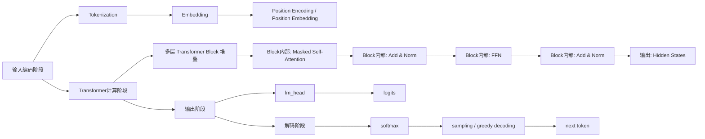

# Transformer原理详解

## 1. 先说结论

Transformer 以 `Decoder-only LLM` 为例，可以先粗略理解成 4 个大阶段：

1. 输入编码阶段
2. Transformer 计算阶段
3. 输出阶段
4. 解码阶段

如果只记一句话，可以记成：

$$
\text{输入编码}
\rightarrow
\text{上下文建模}
\rightarrow
\text{输出分数}
\rightarrow
\text{解码结果}
$$

其中最核心的两个计算模块是：

- `Self-Attention`
- `FFN`

而每层里还会配合：

- `Add`（残差连接）
- `Norm`（LayerNorm）

本文主要站在：

- `Decoder-only Transformer`
- 也就是 GPT / Qwen / LLaMA 这一类模型

来解释整体流程。  
如果换成 `Encoder-only` 或 `Encoder-Decoder`，整体骨架相似，但输出阶段会有所不同。

---

## 2. 整体大图

下面这张图**以 Decoder-only LLM 为例**，更适合用来理解 GPT / Qwen / LLaMA 这一类模型的主链路。



这张图可以先只看 4 个大阶段：

- 输入编码阶段
- Transformer 计算阶段
- 输出阶段
- 解码阶段

再往下看每个阶段里面的小步骤。

这里要特别注意两点：

- `Hidden States` 属于 Transformer 计算阶段的输出，不属于最终采样结果
- `多层 Transformer Block 堆叠` 不是某一层里的最后一步，而是表示“同样的 block 会重复很多层”
- `输出阶段` 和 `解码阶段` 不要混在一起
  - 输出阶段负责得到 `logits`
  - 解码阶段负责把 `logits` 变成 `next token`
- 训练主链路到 `logits` 基本结束，推理会继续进入解码阶段

---

## 3. 第一阶段：输入编码阶段

这一阶段的目标是：

- 把文本变成模型能处理的向量

### 3.1 Tokenization

先把原始文本切成 token。

例如：

```text
我喜欢人工智能
```

会先变成一串 token，再变成 token id。

### 3.2 Embedding

然后把每个 token id 映射成向量：

$$
x_i \rightarrow e_i
$$

这里：

- \(x_i\) 是第 \(i\) 个 token
- \(e_i\) 是它对应的 embedding 向量

### 3.3 Position Encoding / Position Embedding

因为 Transformer 本身没有像 RNN 那样天然的顺序感，所以需要额外加入位置信息。

于是每个位置最终输入给模型的表示通常可以写成：

$$
h_i^{(0)} = e_i + p_i
$$

其中：

- \(e_i\) 是 token embedding
- \(p_i\) 是 position embedding

这一阶段结束后，模型拿到的是：

- 带有语义信息和位置信息的输入向量

---

## 4. 第二阶段：Transformer计算阶段

这一阶段的目标是：

- 让每个 token 和上下文交互
- 得到上下文化后的表示

这是 Transformer 的核心部分。

### 4.1 一个标准 Transformer Block 的结构

一个标准 block 一般可以概括成：

```text
Self-Attention
-> Add & Norm
-> FFN
-> Add & Norm
```

对于 `Decoder-only LLM`，这里的 `Self-Attention` 更准确地说是：

- `Masked Self-Attention`

也就是：

- 当前 token 只能看前面的 token
- 不能看后面的 token

然后这样的 block 会重复堆很多层。

---

### 4.2 Self-Attention 是干嘛的

`Self-Attention` 的核心作用是：

- 让当前位置去看其他位置
- 判断哪些 token 更重要
- 把相关信息汇总回来

它的基本形式是：

$$
Q = HW_Q,\quad K = HW_K,\quad V = HW_V
$$

然后计算注意力：

$$
\mathrm{Attention}(Q, K, V)
=
\mathrm{softmax}\left(\frac{QK^T}{\sqrt{d_k}}\right)V
$$

直观上可以理解成：

- `Q`：我想找什么
- `K`：我是什么信息
- `V`：我真正提供什么内容

Self-Attention 的意义是：

- 让 token 之间直接交互
- 能处理长距离依赖
- 能并行计算

---

### 4.3 Multi-Head Attention 是什么

Transformer 不是只做一次 attention，而是做多头注意力。

形式上可以写成：

$$
\mathrm{MultiHead}(Q, K, V)
=
\mathrm{Concat}(head_1, head_2, \dots, head_h)W_O
$$

它的作用是：

- 不同 head 去关注不同类型的信息
- 有的 head 关注语法
- 有的 head 关注实体关系
- 有的 head 关注长距离依赖

这里的 `Concat` 不是把多个 head 直接相加，而是：

- 把这些向量按最后一个维度接起来
- 形成一个更长的向量

也就是说：

- 每个 head 的结果会先完整保留下来
- 然后再交给后面的线性层统一融合

所以：

- 单头 attention 更单一
- 多头 attention 表达能力更强

---

### 4.4 Add 是什么意思

`Add` 指的是残差连接。

它的形式通常是：

$$
y = x + F(x)
$$

其中：

- \(x\) 是原输入
- \(F(x)\) 可以是 attention 输出，也可以是 FFN 输出

例如 attention 后：

$$
H' = H + \mathrm{Attention}(H)
$$

这里的：
$$
y = x + F(x)
$$

更准确的理解不是“把旧结果和新结果随便加一下”，而是：

- \(x\) 提供原始表示
- \(F(x)\) 提供当前层学到的补充信息或修正量
- 最终输出是在原表示基础上的更新结果

之所以这里使用加法，还有一个很重要的原因是：

- 加法对梯度传播更友好

因为当：

$$
y = x + F(x)
$$

对 \(x\) 求导时，会天然带有一个“1”的直通项：

$$
\frac{\partial y}{\partial x} = 1 + \frac{\partial F(x)}{\partial x}
$$

这意味着：

- 即使 \(F(x)\) 这一支路学得不理想
- 梯度也仍然可以通过这条“+1”的路径直接往前传

所以从优化角度看：

- 残差连接不仅是在保留信息
- 也在帮助深层网络更稳定地训练

---

### 4.5 Norm 是什么意思

`Norm` 通常指的是 `LayerNorm`。

它的作用对象是：

- 当前 token 在特征维度上的表示向量

形式上，给定某一位置的隐藏向量 \(x \in \mathbb{R}^d\)，`LayerNorm` 可以写成：

$$
\mathrm{LayerNorm}(x) = \gamma \odot \frac{x - \mu}{\sqrt{\sigma^2 + \epsilon}} + \beta
$$

其中：

- \(\mu\) 是当前向量各维度的均值
- \(\sigma^2\) 是当前向量各维度的方差
- \(\epsilon\) 是防止分母为 0 的极小常数
- \(\gamma\) 和 \(\beta\) 是可学习参数

更专业地说，`LayerNorm` 的核心作用是：

- 对单个位置的隐藏表示在特征维度上做标准化
- 将不同层输出的数值尺度控制在更可管理的范围内
- 减少层间表示分布漂移带来的优化困难

在 Transformer 里，它特别重要的意义有三点：

1. **控制表示尺度**
   - attention 和 FFN 的输出经过残差相加后，数值幅度可能发生变化
   - `LayerNorm` 会把这个向量重新标准化，再交给下一层

2. **改善优化条件**
   - 深层网络中，不同层输出的分布如果持续漂移，会增加训练难度
   - `LayerNorm` 可以减轻这种分布不稳定对优化造成的影响

3. **提高深层堆叠时的训练可行性**
   - Transformer 往往堆很多层
   - 如果每层输出的数值范围不受控制，训练容易变得困难
   - `LayerNorm` 是保证深层结构可训练的重要组件之一

所以 `Add & Norm` 的意思就是：

1. 先做残差相加
2. 再做层归一化

例如：

$$
H' = \mathrm{LayerNorm}(H + \mathrm{Attention}(H))
$$

再细化一点，`Add & Norm` 的具体含义可以理解成：

`Add & Norm` 并不是把当前子层的输出直接拿去替换输入表示，而是先保留输入本身，再把当前子层学到的新信息叠加到输入上，最后对叠加后的结果做一次 `LayerNorm`。因此，这一步的本质可以写成：

$$
\mathrm{Add \& Norm}(x, F(x)) = \mathrm{LayerNorm}(x + F(x))
$$

其中：

- \(x\) 是进入当前子层之前的表示
- \(F(x)\) 是当前子层计算得到的输出，例如 `Attention(x)` 或 `FFN(x)`

从功能上看，`Add & Norm` 同时完成两件事：

1. **残差保留**
   - 输入表示 \(x\) 会被直接保留下来
   - 当前子层只需要学习在原表示基础上的补充项或修正项 \(F(x)\)
   - 因此，网络学习的是“增量更新”，而不是完全重写输入表示

2. **尺度重整**
   - 残差相加之后，向量的均值、方差和整体数值尺度可能发生变化
   - `LayerNorm` 会对该向量重新标准化，并通过可学习参数完成再缩放与再平移
   - 这样可以使传入下一层的表示保持在更可控的数值范围内

所以可以把它概括为：

- `Add` 负责保留原表示，并引入当前层学到的增量信息
- `Norm` 负责对更新后的表示重新做尺度规范化，再传给下一层

如果写成统一形式，就是：

$$
\mathrm{Add \& Norm}(x, F(x)) = \mathrm{LayerNorm}(x + F(x))
$$

其中：

- \(x\) 是这一层的输入
- \(F(x)\) 是这一层子模块算出来的新结果，比如 `Attention(x)` 或 `FFN(x)`

---

### 4.6 FFN 是干嘛的

`FFN` 是 `Feed Forward Network`，前馈神经网络。

它的作用是：

- 在 attention 聚合上下文之后
- 对每个位置的表示再做一次非线性加工

常见形式是：

$$
\mathrm{FFN}(x) = W_2 \sigma(W_1 x + b_1) + b_2
$$

直观理解：

- attention 负责“和别人交流”
- FFN 负责“自己再加工一下”

所以：

- `Self-Attention` 是跨 token 交互
- `FFN` 是逐 token 处理

---

### 4.7 为什么每层都要 Attention + FFN

因为两者分工不同：

- `Attention`
  - 决定看谁
  - 聚合上下文
- `FFN`
  - 对聚合后的表示做非线性变换
  - 提升表达能力

所以一个 block 的直观含义是：

- 先和上下文交流
- 再把交流后的结果加工一下

---

### 4.8 多层堆叠后得到什么

经过多层 Transformer Block 之后，会得到：

$$
H^{(0)} \rightarrow H^{(1)} \rightarrow H^{(2)} \rightarrow \cdots \rightarrow H^{(L)}
$$

最终输出的是：

- 每个位置结合了上下文之后的隐藏表示

也就是：

- `Hidden States`

---

## 5. 第三阶段和第四阶段：输出与解码

这一部分更严谨地可以拆成两层：

1. 输出阶段
2. 解码阶段

这样更容易区分：

- 哪部分是训练和推理都会经过的
- 哪部分更偏推理生成

### 5.1 第三阶段：输出阶段

这一层的目标是：

- 把 `Hidden States` 变成可用于任务计算的输出分数

对于 `Decoder-only LLM`，通常是：

$$
\text{Hidden States}
\rightarrow
\text{lm\_head}
\rightarrow
\text{logits}
$$

这里：

- `lm_head` 是最后的输出层
- 它会把 hidden state 映射到整个词表
- `logits` 是对整个词表的原始分数

这一层很重要，因为：

- 训练时会用它来算 `loss`
- 推理时会用它来决定下一个 token

所以：

- `Hidden States -> lm_head -> logits`
- 这部分**不是只属于推理**
- 训练和推理都会经过

### 5.2 第四阶段：解码阶段

这一层更偏推理阶段。

它的目标是：

- 从 `logits` 变成真正输出的 token

通常会经过：

$$
\text{logits}
\rightarrow
\text{softmax}
\rightarrow
\text{probabilities}
\rightarrow
\text{sampling / greedy decoding}
\rightarrow
\text{next token}
$$

这里：

- `softmax`
  - 把 logits 变成概率分布
- `sampling`
  - 按概率采样
- `greedy decoding`
  - 直接选概率最高的 token

所以更准确地说：

- 第一层“输出阶段”负责产出分数
- 第二层“解码阶段”负责把分数变成真正的文本输出

### 5.3 在分类任务里怎么理解

如果是分类模型，输出阶段也存在，但它后面不一定接“解码”。

例如：

- 分类头
- 回归头

这时一般是：

$$
\text{Hidden States}
\rightarrow
\text{Classification Head}
\rightarrow
\text{Class Logits / Score}
$$

所以：

- Transformer 本体负责生成上下文化表示
- 输出头负责把表示变成具体任务结果
- 只有生成式 LLM 才会继续进入“解码阶段”

---

## 6. 三种常见 Transformer 形态

### 6.1 Encoder-only

代表：

- BERT

特点：

- 更偏理解任务
- 适合分类、匹配、抽取

### 6.2 Decoder-only

代表：

- GPT
- Qwen

特点：

- 按从左到右预测下一个 token
- 适合文本生成

### 6.3 Encoder-Decoder

代表：

- T5

特点：

- encoder 负责编码输入
- decoder 负责生成输出

---

## 7. 一句话总结

Transformer 最核心的理解方式就是：

- 先做输入编码
- 再通过多层 `Self-Attention + FFN + Add & Norm` 做上下文建模
- 然后得到输出分数
- 最后在生成式任务里进入解码阶段

如果压缩成最短一句话：

$$
\text{输入编码}
\rightarrow
\text{Transformer计算}
\rightarrow
\text{输出头}
\rightarrow
\text{解码}
$$

其中：

- `Self-Attention` 负责看上下文
- `FFN` 负责做非线性加工
- `Add & Norm` 负责保信息和稳数值
- `输出头` 负责把 hidden states 变成 logits
- `解码` 负责把 logits 变成真正输出的 token
