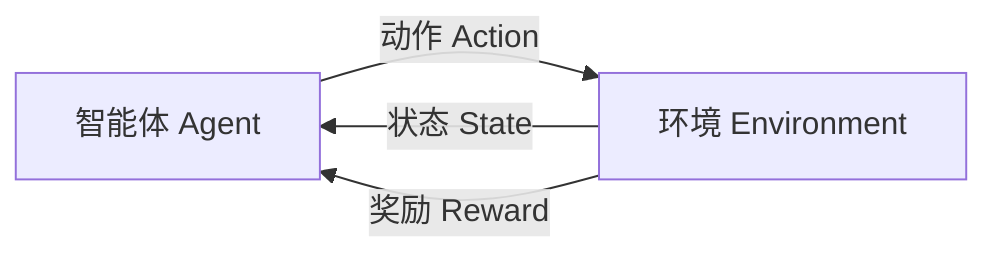

# 强化学习是什么

## 1. 强化学习的直观理解

强化学习（Reinforcement Learning，RL）是一种让智能体在环境中通过不断试错来学习决策的方法。

它和监督学习最大的区别在于：

- 监督学习通常直接告诉模型“标准答案是什么”
- 强化学习通常不会直接告诉模型每一步的正确动作
- 它只会在一段行为之后，给出好或坏的反馈，也就是奖励（Reward）

**智能体（Agent）** 如何在 **环境（Environment）** 中，根据 **状态（State）** 采取 **动作（Action）**，获得 **奖励（Reward）**，并不断调整策略，使长期奖励最大化。

---

## 2. 强化学习的五个核心概念

可以用一个“送外卖机器人”的例子把这几个概念串起来。

- 智能体（Agent）：送外卖机器人，本质上就是做决策的主体
- 环境（Environment）：城市道路、红绿灯、障碍物、用户位置等外部世界
- 状态（State）：机器人当前观察到的信息，比如当前位置、目的地、路况、电量
- 动作（Action）：机器人此刻可以采取的行为，比如前进、左转、右转、加速、绕路
- 奖励（Reward）：环境给机器人的反馈信号，用来告诉它做得好不好

在这个例子里，奖励通常体现为：

- 更快接近目的地，得到正奖励
- 成功送达外卖，得到更大的正奖励
- 撞到障碍物、绕远路、超时，得到负奖励

把它们连起来就是：

机器人先观察状态，再选择动作；动作作用到环境后，环境发生变化，同时返回奖励。机器人不断重复这个过程，最终学会在不同状态下采取更好的动作。

---

## 3. 强化学习中几个重要概念

### 3.1 策略（Policy）

策略表示“在某个状态下如何选择动作”。

更本质一点说，策略可以理解成：

**一个把“状态”映射到“动作选择方式”的函数。**

记作：

- 确定性策略：某个状态下总是选同一个动作
- 随机策略：某个状态下按概率选择动作

在很多强化学习算法里，策略输出的不是一个固定动作，而是：

**动作的概率分布。**

比如在某个状态下：

- 向左走的概率是 `0.3`
- 向右走的概率是 `0.7`

那么智能体就会根据这个概率分布去采样动作。

如果我们进一步用神经网络来表示这个“状态到动作概率分布”的函数，那么就进入了：

**深度强化学习（Deep Reinforcement Learning）。**

从这个角度看，大语言模型和强化学习里的策略网络在形式上其实是相通的：

- 输入：当前上下文状态
- 输出：下一个动作的概率分布

对于大语言模型来说：

- 状态可以理解为当前上下文
- 动作可以理解为“生成下一个 token”
- 模型输出的是下一个 token 的概率分布

所以在形式上，大语言模型预测下一个 token，和强化学习里“根据状态输出动作概率分布”，是非常相似的。

### 3.2 值函数（Value Function）

值函数衡量的是：

**某个状态有多好，或者某个状态下采取某个动作有多好。**

常见有：

- 状态价值函数 `V(s)`
- 动作价值函数 `Q(s, a)`

### 3.3 回报（Return）

回报表示从当前开始，未来一段时间累计获得的奖励。

强化学习优化的通常不是单步奖励，而是长期回报。

### 3.4 折扣因子（Discount Factor）

折扣因子通常记作 `gamma`，用来表示未来奖励的重要程度。

- `gamma` 越大，越重视长期收益
- `gamma` 越小，越重视眼前收益

### 3.5 回报和状态价值函数

在强化学习里，智能体真正关心的往往不是“当前这一步拿了多少奖励”，而是：

**从现在开始，一直到未来结束，一共大概能拿到多少奖励。**

这就是“回报”的意义。

如果不考虑折扣因子，可以把回报简单理解为：

- 现在的奖励
- 加上下一步的奖励
- 再加上下下步的奖励
- 一直加到这条轨迹结束

如果考虑折扣因子，那么越远的奖励权重会越小。

不过这里还有一个关键点：

即使当前状态相同，未来也可能走出很多不同的轨迹，所以未来回报通常不是一个固定值，而是一个随机量。

因此，强化学习里更常关心的不是“某一次具体回报”，而是：

**回报的期望值。**

这就引出了状态价值函数。

状态价值函数 `Vπ(s)` 的意思是：

**当智能体处于状态 `s`，并且后面一直按照策略 `π` 行动时，未来回报的期望值是多少。**

你可以把它理解成：

**当前这个状态，到底值不值钱。**

如果一个状态后面很容易获得高奖励，那么它的价值就高；如果一个状态后面很容易失败或得到惩罚，那么它的价值就低。

一句话总结这两个概念：

- 回报：一条轨迹上未来累计能拿到多少奖励
- 状态价值函数：在某个状态下，未来回报的期望值

---

## 4. 常见强化学习方法

强化学习算法很多，大体可以分成几类。

### 4.1 基于价值的方法

典型代表：

- Q-Learning
- DQN

核心思想是学习动作价值函数 `Q(s, a)`，再根据价值选择动作。

### 4.2 基于策略的方法

典型代表：

- Policy Gradient
- REINFORCE

核心思想是直接学习策略本身，而不是先学价值函数。

### 4.3 Actor-Critic 方法

典型代表：

- A2C
- A3C
- PPO

这类方法结合了两种思路：

- Actor 负责选择动作
- Critic 负责评价动作好坏

目前很多实际应用里，`PPO` 是一个很常见的方法。

---

## 5. 一个简单例子：训练小狗找食物

可以用一个直观例子理解强化学习。

假设有一只小狗在迷宫里找食物：

- 小狗就是 Agent
- 迷宫就是 Environment
- 小狗看到的位置就是 State
- 往左走、往右走就是 Action
- 找到食物得到奖励，撞墙得到惩罚

一开始小狗会乱走，但随着试错次数变多，它会逐渐学会：

- 哪些路更容易拿到奖励
- 哪些动作会带来惩罚

最后形成一套更优的行为策略。

---

## 6. 强化学习和监督学习、无监督学习的区别

### 6.1 和监督学习的区别

监督学习：

- 有明确标注数据
- 模型学习输入到输出的映射

强化学习：

- 没有逐步标注答案
- 只有环境反馈
- 目标是长期奖励最大化

### 6.2 和无监督学习的区别

无监督学习：

- 没有标签
- 主要发现数据结构，比如聚类、降维

强化学习：

- 不是单纯分析数据结构
- 而是在交互中学习决策策略

---

## 7. 强化学习和大模型有什么关系

强化学习这几年在大模型领域也非常重要，最典型的就是：

- RLHF（Reinforcement Learning from Human Feedback）
- RLAIF（Reinforcement Learning from AI Feedback）

例如在对话模型训练中：

1. 先进行预训练
2. 再进行监督微调（SFT）
3. 再通过人类偏好数据训练奖励模型
4. 最后使用强化学习方法优化模型输出

这样做的目标不是让模型只会“拟合文本”，而是让它更符合：

- 人类偏好
- 安全要求
- 有帮助、真实、无害等目标

不过在大模型领域，很多时候“强化学习”并不是传统游戏那种完整环境交互，而是带有偏好优化和对齐训练的特点。

---

## 8. 一句话总结

强化学习的核心就是：

**让智能体在环境中通过试错，根据奖励信号不断调整策略，最终学会让长期收益最大化的行为方式。**

如果再压缩一点：

**监督学习是“告诉模型正确答案”，强化学习是“让模型自己试，靠奖励学会做决定”。**

如果从课程导入的角度去理解，这篇内容其实主要想说明三件事：

- 为什么要学强化学习：因为它和 `RLHF`、大模型后训练直接相关
- 学什么最重要：先把状态、动作、奖励、策略这些基础概念搞清楚
- 怎么学才有效：不能只背定义，要结合例子、公式和代码反复理解

---

## 9. 适合继续深入的方向

如果想继续学强化学习，建议按这个顺序：

1. 先理解马尔可夫决策过程（MDP）
2. 再学习 Q-Learning 和 DQN
3. 再看 Policy Gradient、Actor-Critic、PPO
4. 最后再看 RLHF 与大模型对齐

如果你愿意，我还可以继续帮你写一篇：

- `MDP 是什么`
- `Q-Learning 入门`
- `PPO 是什么`
- `RLHF 和强化学习的关系`
