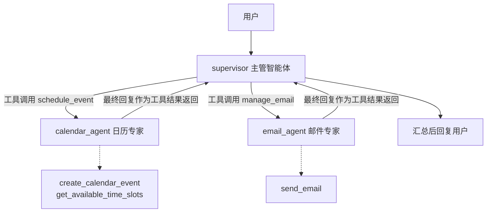

# LangGraph Supervisor（监督者模式）：个人助理多智能体

> 对应官方教程：[Build a personal assistant with subagents](https://docs.langchain.com/oss/python/langchain/multi-agent/subagents-personal-assistant)
> 配套代码：`p14-Langgraph-Supervisor.py`（本目录，可直接运行）
> 概念笔记：`../../notes/Multi-agent多智能体.md` 第 2 章「子智能体详细指南」

## 这篇文档学什么

- Supervisor 模式的三层架构：底层 API 工具 → 子智能体 → 中央 supervisor
- 关键一步：把子智能体**包装成工具**给 supervisor 调用
- 跨领域请求的协调：supervisor 一次委派多个专家（并行工具调用）
- 人工审批（human-in-the-loop）：在委派边界用 `interrupt()` 暂停等待批准
- 与 p13 handoff（对等转接）模式的本质区别

## 场景

构建一个个人助理，协调两位职责完全不同的专家：

| 子智能体 | 职责 | 持有的底层工具 |
|----------|------|----------------|
| **calendar_agent**（日历专家） | 解析自然语言时间、查空闲时段、创建日程 | `create_calendar_event`、`get_available_time_slots` |
| **email_agent**（邮件专家） | 提取收件人、撰写主题正文、发送邮件 | `send_email` |

用户只说一句话，例如"下周二下午2点安排设计评审会，然后发邮件提醒大家提前评审设计稿"，supervisor 负责拆解、委派、汇总。

> 为什么不用一个智能体挂上所有工具？工具一多，模型要在多个相似 API 之间做选择，容易选错、提示词也会膨胀。把工具按领域分组、每组配专属提示词，每个专家只做好一件事——这就是多智能体的核心价值：**上下文隔离**。

## 架构



三层职责：

| 层 | 角色 | 看到什么 |
|----|------|----------|
| 底层 | API 工具（桩实现） | 严格结构化参数（ISO 时间、邮箱列表） |
| 中层 | 子智能体 | 自然语言子请求 → 翻译成 API 调用 → 返回自然语言确认 |
| 顶层 | supervisor | 只有 `schedule_event` / `manage_email` 两个"高层能力"，做领域级路由 |

## 与 p13 handoff 的对照

这是学完 p13 后最容易混淆的地方，先立清楚再写代码：

| 维度 | Supervisor（本篇 p14） | Handoff（p13） |
|------|------------------------|----------------|
| 控制权 | 始终在 supervisor，子智能体干完活**必须返回** | 在代理间**转移**，转出去就不回来 |
| 子智能体角色 | 被包装成工具的"下游执行者"，无状态、每次全新上下文 | 图里的对等节点，通过 `Command.PARENT` 跳转 |
| 谁面对用户 | 只有 supervisor | 当前活跃代理直接回复用户 |
| 并行委派 | ✅ 一轮可同时调多个子智能体（并行工具调用） | ❌ 必须 `parallel_tool_calls=False`（同时只能有一个活跃代理） |
| 模型调用开销 | 多一轮：子智能体结果要回 supervisor 汇总 | 少一轮：代理直接回复用户 |
| 子智能体上下文 | 默认只看到委派的那句请求，上下文隔离干净 | 需要手工挑选传递的消息（handoff 消息对） |
| 适用场景 | 多领域分工、需要集中控制和结果汇总 | 多阶段对话流程、顺序约束、用户直接交互 |

一句话：**handoff 是"转接电话"，supervisor 是"派任务给下属、等汇报、再答复"。**

## 实现五步走

完整代码见 `p14-Langgraph-Supervisor.py`，这里只讲每步的关键点。

### 第 1 步：定义底层 API 工具

三个桩工具：`create_calendar_event`、`send_email`、`get_available_time_slots`。真实项目里它们对接 Google 日历 / SendGrid 等真实 API。要点：**这些工具参数要求严格格式**（ISO 时间、邮箱列表），不适合直接暴露给主管——这正是需要中层专家的原因。

### 第 2 步：创建专业化子智能体

每个子智能体 = 一个模型 + 自己的工具 + 专属提示词：

```python
calendar_agent = create_react_agent(
    model=llm,
    tools=[create_calendar_event, get_available_time_slots],
    prompt=CALENDAR_AGENT_PROMPT,   # 专注日程领域
    name="calendar_agent",
)
```

> ⚠️ 提示词里必须有一句"**在最终回复中完整确认执行结果**"。因为 supervisor 只能看到子智能体的最终消息——如果子智能体调了工具却没把结果写进回复，supervisor 拿到的是空话。这是官方文档强调的头号失败模式。

### 第 3 步：把子智能体包装成工具（关键架构步骤）

```python
@tool
def schedule_event(request: str) -> str:
    """用自然语言安排日程。当用户想要创建、修改或查询日程时使用本工具……"""
    result = calendar_agent.invoke({"messages": [{"role": "user", "content": request}]})
    return message_text(result["messages"][-1])   # 只返回最终回复
```

两个要点：

1. **docstring 就是路由依据**。supervisor 靠"什么时候该用这个工具"来决定委派给谁，描述要写得具体、带使用场景。
2. **只返回子智能体的最终回复**。中间推理和工具调用不传给 supervisor——这既是上下文隔离，也省 token。

### 第 4 步：创建 supervisor

```python
supervisor = create_react_agent(
    model=llm,
    tools=[schedule_event, manage_email],   # 只看到高层能力
    prompt=SUPERVISOR_PROMPT,
    name="personal_assistant_supervisor",
)
```

supervisor 不做具体执行，只做三件事：拆解请求 → 委派专家 → 汇总结果。跨领域请求（日程+邮件）时，它可以在**一轮里同时发起两个工具调用**，langgraph 的 ToolNode 会并行执行——这是 supervisor 相对 handoff 的效率优势（对照官方示例 2 的 trace）。

### 第 5 步：运行

`demo_supervisor_basic` 里演示了两个请求：

- **单领域**："安排明天上午9点的团队站会" → supervisor 只调 `schedule_event`
- **跨领域**："安排评审会 + 发提醒邮件" → supervisor 并行委派两位专家，各自完成后汇总回复

## 人工审批（human-in-the-loop）

敏感操作（发邮件、建日程）执行前应让人工把关。

### 官方教程的做法（LangChain 1.0）

用 `HumanInTheLoopMiddleware` 拦截子智能体内部的底层工具，checkpointer 只加在顶层：

```python
from langchain.agents.middleware import HumanInTheLoopMiddleware

email_agent = create_agent(
    model,
    tools=[send_email],
    system_prompt=EMAIL_AGENT_PROMPT,
    middleware=[HumanInTheLoopMiddleware(
        interrupt_on={"send_email": True},          # 拦截 send_email 调用
        description_prefix="Outbound email pending approval",
    )],
)
supervisor_agent = create_agent(
    model, tools=[schedule_event, manage_email],
    system_prompt=SUPERVISOR_PROMPT,
    checkpointer=InMemorySaver(),                   # 只有顶层需要 checkpointer
)
```

支持三种决策：`approve`（批准）、`edit`（改参数后执行）、`reject`（拒绝），通过 `Command(resume={interrupt_id: {"decisions": [...]}})` 恢复。

### 本仓库 p14 的做法（langgraph 0.6 等价实现）

当前环境没有该中间件，p14 在**委派边界**（supervisor 的工具函数内、子智能体执行前）用 `interrupt()` 实现同样的审批：

```python
@tool
def manage_email(request: str) -> str:
    """用自然语言发送邮件（执行前需要人工审批）。"""
    decision = interrupt({"type": "email_approval", "request": request, ...})
    if decision.get("action") == "reject":
        return "用户拒绝了该邮件请求，未发送任何邮件。"
    final_request = decision.get("edited_request") or request   # edit 时替换请求
    result = email_agent.invoke({"messages": [{"role": "user", "content": final_request}]})
    return message_text(result["messages"][-1])
```

运行流程（`demo_human_in_the_loop`）：

```python
config = {"configurable": {"thread_id": "p14-hitl-demo"}}

# 1. 首次运行：在委派边界触发中断，图暂停
supervisor.invoke({"messages": [{"role": "user", "content": query}]}, config)

# 2. 查看挂起的审批
snapshot = supervisor.get_state(config)
pending = [item for task in snapshot.tasks for item in task.interrupts]

# 3. 人工决策后恢复（这里演示 edit：修改委派请求）
supervisor.invoke(Command(resume={"action": "edit", "edited_request": "..."}), config)
```

两种方式的对照：

| 维度 | 官方中间件方式 | p14 interrupt 方式 |
|------|----------------|--------------------|
| 拦截位置 | 子智能体内部的底层工具（如 `send_email`） | supervisor 委派子智能体的边界 |
| 审批粒度 | 精确到 API 参数级（可编辑工具参数） | 委派请求级（可编辑委派的文字） |
| 代码改动 | 声明式配置，不动工具代码 | 在包装工具里写审批逻辑 |
| 版本要求 | LangChain 1.0 | langgraph 0.6 即可 |

## 运行与排错

### 运行方式

```bash
# 在仓库根目录
.venv/bin/python 02_langgraph_basics/05_multi_agent/tutorials/02_langgraph_supervisor/p14-Langgraph-Supervisor.py
```

### 不依赖真实 API 的机制测试

`tests/` 目录用 FakeChatModel 验证全部机制（委派、审批、拒绝路径），无需真实 key：

```bash
.venv/bin/python -m pytest 02_langgraph_basics/05_multi_agent/tutorials/02_langgraph_supervisor/tests/ -q
```

### API Key 从哪里来

脚本依次查找以下位置的 `DASHSCOPE_API_KEY`（不覆盖已有环境变量）：

1. 本目录 `.env`
2. `01_langchain_basics/.env`
3. 仓库根目录 `.env`

报错 `401 InvalidApiKey` 说明 key 已过期，需到阿里云百炼平台重新申请。

### 版本适配说明

官方教程基于 LangChain 1.0，本仓库 venv 是 langchain 0.3 + langgraph 0.6，p14 做了等价适配：

| 官方教程（LangChain 1.0） | p14（langgraph 0.6） |
|---------------------------|----------------------|
| `langchain.agents.create_agent` | `langgraph.prebuilt.create_react_agent` |
| `system_prompt=` | `prompt=` |
| `stream_events(version="v3")` + `interleave` | `stream(stream_mode="updates")` |
| `HumanInTheLoopMiddleware` | 工具内 `interrupt()` + `Command(resume=...)` |
| `result["messages"][-1].text` | `message_text(...)`（兼容 str / content blocks） |

概念完全一一对应；未来仓库升级到 LangChain 1.0 后，可按上表左列改写。

## 初学者最容易踩的坑

1. **子智能体最终回复不含结果**：调了工具但回复里没说结果，supervisor 拿到空话。→ 提示词里强制"最终回复确认结果"。
2. **工具描述太笼统**：supervisor 靠 docstring 路由，"处理日程"不如"当用户想要创建、修改或查询日程时使用"。
3. **checkpointer 加错位置**：子智能体在工具函数内被调用，加 checkpointer 只需顶层；子智能体默认每次全新状态（继承检查点模式），这本就是设计意图。
4. **interrupt 之后没考虑重放**：`Command(resume=...)` 恢复时节点**从头重跑**，`interrupt()` 这次返回 resume 值而不再中断。所以副作用（发邮件）必须放在 `interrupt()` 之后，审批逻辑要幂等。
5. **混淆 supervisor 和 handoff**：子智能体把结果**返回**给 supervisor 是 supervisor 模式；控制权**转移**给下一个代理是 handoff。前者汇总，后者接力。
6. **给 supervisor 挂底层工具**：supervisor 只看高层能力（`schedule_event`），不看 `create_calendar_event`；挂错了上下文隔离就白做了。

## 小结

- Supervisor 模式 = 中央主管 + 包装成工具的专家子智能体，适合多领域分工和集中控制。
- 三个杠杆决定系统质量：子智能体的提示词（规范）、工具 docstring（路由）、返回内容（信息流）。
- 跨领域请求时 supervisor 可并行委派，比 handoff 的顺序接力更高效；代价是多一轮汇总调用。
- 人工审批用 `interrupt()` 实现，checkpointer 只加顶层，副作用放在审批之后。

## 参考链接

- 官方教程（本文翻译对象）：https://docs.langchain.com/oss/python/langchain/multi-agent/subagents-personal-assistant
- 概念指南（仓库已有翻译）：`../../notes/Multi-agent多智能体.md`
- LangGraph Supervisor 库（旧封装，官方不推荐新用）：https://reference.langchain.com/python/langgraph-supervisor
- 人机协作指南：https://docs.langchain.com/oss/python/langchain/human-in-the-loop
