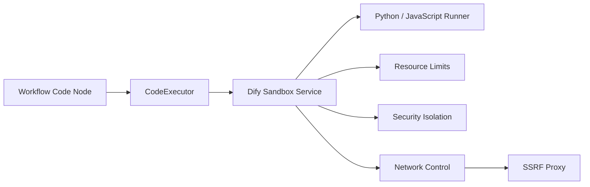
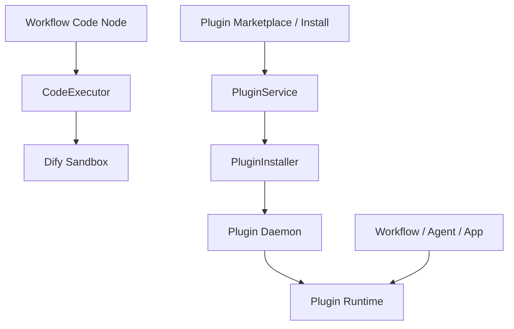

# Dify 的沙箱服务

## 1. Dify 为什么需要沙箱服务

`Dify` 不是只做 LLM 调用和工作流编排，它还支持在 `Workflow` 里执行用户编写的代码，典型就是 `Code` 节点里的 `Python` 和 `JavaScript`。

一旦平台允许用户提交并执行代码，就会立刻出现一个核心问题：

**这些代码不能直接在主应用进程里运行。**

原因很直接。如果没有隔离，用户代码理论上可能：

- 读取宿主机文件
- 执行操作系统命令
- 发起任意网络请求
- 探测内网服务
- 死循环占满 CPU
- 大量消耗内存

对于一个多租户 AI 平台来说，这类风险是不可接受的。

所以，`Dify` 需要一个独立的代码执行沙箱服务，把“用户代码执行”和“主应用服务”分离开。

## 2. 从源码看，Dify 是怎么调用沙箱服务的

在 `Dify 1.9.2` 的代码里，主应用并不是直接运行代码，而是通过 `CodeExecutor` 调用一个独立的代码执行服务。

执行请求会发到：

- `/v1/sandbox/run`

对应源码：

- [code_executor.py](/Users/songxijun/workspace/otherProject/dify-1.9.2/api/core/helper/code_executor/code_executor.py#L83)

也就是说，主应用只负责：

- 组装代码执行请求
- 调用 sandbox 服务
- 获取执行结果

而真正的代码执行是在沙箱服务里完成的。

## 3. 沙箱服务解决的核心问题

### 3.1 安全隔离

这是最直接的目的。

沙箱服务的第一层价值，就是把用户代码从主应用进程里剥离出去，避免：

- 用户代码直接接触主服务运行环境
- 代码执行异常影响主 API 或 worker
- 任意代码直接读写宿主资源

换句话说，沙箱是主应用和不可信代码之间的一道边界。

### 3.2 资源限制

用户代码除了可能“恶意”，也可能只是“失控”。

比如：

- 死循环
- 递归爆栈
- 大数组或大对象占满内存
- 长时间阻塞不返回

所以沙箱不仅是安全组件，也是资源治理组件。它需要限制：

- 执行超时
- 内存占用
- CPU 消耗

从部署配置里也能看到专门的超时配置：

- `SANDBOX_WORKER_TIMEOUT`

参考：

- [docker-compose.dify.yaml](/Users/songxijun/workspace/otherProject/dify-1.9.2/docker/docker-compose.dify.yaml#L186)

### 3.3 网络访问控制

即使允许代码联网，也不能让它直接无约束访问外网和内网。

在 `docker-compose` 配置里，sandbox 默认和 `ssrf_proxy` 一起工作，可以看到这些环境变量：

- `ENABLE_NETWORK`
- `HTTP_PROXY`
- `HTTPS_PROXY`
- `SSRF_SANDBOX_HOST`

参考：

- [docker-compose.dify.yaml](/Users/songxijun/workspace/otherProject/dify-1.9.2/docker/docker-compose.dify.yaml#L186)

这说明 `Dify` 在设计上并不是让代码直接出网，而是尽量通过受控代理路径降低：

- SSRF
- 内网探测
- 非法资源访问

## 4. 官方文档怎么描述沙箱服务

官方文档讲得很明确：

- 本地部署用户如果要用 `Code` 节点，需要启动 sandbox 服务
- 这个服务的目的就是防止执行恶意代码
- Python 和 JavaScript 都是在隔离环境里执行
- 高风险能力，例如直接文件系统访问、任意网络请求、执行操作系统命令等，会受到限制

参考：

- [Code Node 文档](/Users/songxijun/workspace/otherProject/dify-1.9.2/dify_others/dify-docs/versions/3-0-x/en/user-guide/workflow/node/code.mdx)

所以，sandbox 不是一个“可有可无的附加服务”，而是 Dify 代码执行能力的正式安全边界。

## 5. 沙箱服务在 Dify 架构里的位置

可以用下面这张图理解：

这张图里每一层的职责分别是：

- `Workflow Code Node`：用户在流程里写代码
- `CodeExecutor`：主应用的执行调用层
- `Dify Sandbox Service`：独立的代码执行服务
- `Python / JavaScript Runner`：真正运行用户代码
- `Resource Limits`：限制超时、CPU、内存
- `Security Isolation`：隔离文件系统、权限和系统调用
- `Network Control`：受控网络访问
- `SSRF Proxy`：进一步约束网络访问路径

## 6. Dify 的 sandbox 不是简单的“执行器”

从你本地源码目录可以看到，sandbox 有一个完整独立项目：

- [dify-sandbox-main](/Users/songxijun/workspace/otherProject/dify-1.9.2/dify_others/dify-sandbox-main)

而且这个项目里专门有这些文档：

- `Seccomp源码走读`
- `BPF过滤器原理`
- `Chroot隔离`
- `权限降级`
- `资源限制`
- `安全设计`
- `威胁模型`

这说明 Dify 对 sandbox 的定位不是“起个容器跑脚本”，而是一个真正的安全执行子系统。

它要解决的是：

- 如何让代码能执行
- 如何让代码安全执行
- 如何让代码执行失败时不影响主系统
- 如何让执行过程可控而不是无限制

## 7. 什么时候需要部署 sandbox

这一点源码和部署文档也给得很明确：

- 如果你使用 `Workflow Code Node` 或代码执行能力，就需要部署 `dify-sandbox`
- 如果你只是做普通问答、知识库、RAG，而不执行用户代码，则可以不部署

参考：

- [Docker 部署文档](/Users/songxijun/workspace/otherProject/dify-1.9.2/docs_new/03-部署指南/01-Docker部署.md)

所以更准确地说，不是“Dify 任何场景都必须依赖 sandbox”，而是：

**只要涉及用户代码执行，sandbox 就是必需组件。**

## 8. Dify 的沙箱机制和 Plugin 插件体系是什么关系

理解 `Dify` 的时候，一个特别容易混淆的点是：

- `sandbox`
- `plugin`

它们看起来都像“扩展运行能力的机制”，但其实解决的是两类完全不同的问题。

### 8.1 Sandbox 解决的是“用户代码怎么安全执行”

`sandbox` 的核心关注点是：

- 用户在 `Workflow Code Node` 里写的代码怎么执行
- 这些代码如何被隔离
- 如何限制资源和权限
- 如何避免恶意代码影响主系统

也就是说，sandbox 面向的是：

**工作流里的临时代码执行**

它是一个安全执行子系统。

### 8.2 Plugin 解决的是“平台能力怎么标准化扩展”

`plugin` 的核心关注点是：

- 模型、工具、datasource、agent strategy 怎么标准化封装
- 插件怎么打包、安装、升级、卸载
- 插件怎么在 workspace / tenant 维度复用
- marketplace 怎么分发插件

也就是说，plugin 面向的是：

**平台级能力扩展和生命周期管理**

它是一个扩展分发与运行管理子系统。

### 8.3 它们不是替代关系，而是正交关系

更准确地讲，`sandbox` 和 `plugin` 并不互相替代，它们是两套正交机制。

可以这样理解：

- `sandbox`：让用户自定义代码安全地跑
- `plugin`：让平台扩展能力标准化地接入

一个偏执行安全，一个偏平台扩展。

### 8.4 一个很重要的区别：Code Node 和 Plugin 不是一回事

很多人会误以为：

- 写一段代码放进 Code Node，就是在写插件

这其实不对。

两者区别很大：

- `Code Node`：是在具体 workflow 里写一段临时代码，用完就属于这个流程本身
- `Plugin`：是一个可安装、可复用、可治理、可分发的标准能力单元

所以：

- Code Node 更像“流程内脚本”
- Plugin 更像“平台能力模块”

### 8.5 它们在运行时的边界也不同

从架构上看，大致是这样：

这张图表达的是：

- `Code Node` 的代码执行会走 `CodeExecutor -> Sandbox`
- 插件系统会走 `PluginService -> PluginInstaller -> Plugin Daemon`
- 应用、Agent、Workflow 在运行时消费的是已经安装好的插件能力

所以从源码层面看，二者是两条不同链路。

### 8.6 插件会不会也用到 sandbox

一般来说，**插件体系本身并不等于 sandbox**。

插件的运行更多依赖：

- plugin daemon
- 插件包
- manifest
- plugin runtime

而不是依赖 workflow code sandbox。

换句话说：

- `sandbox` 是给用户工作流代码准备的
- `plugin daemon` 是给插件安装和插件运行准备的

这也是为什么 Dify 里会同时存在：

- `dify-sandbox`
- `dify-plugin-daemon`

因为它们承担的职责不同，不能混成一个子系统。

### 8.7 可以把它们的关系总结成一句话

如果要用一句话概括：

**Dify 的 sandbox 负责“安全执行用户临时代码”，Dify 的 plugin 负责“标准化管理和分发平台扩展能力”；两者都是扩展运行能力的基础设施，但一个偏执行安全，一个偏平台扩展。**

## 9. 最后一句话总结

`Dify` 需要沙箱服务，是因为它支持在工作流里执行用户自定义代码，而这类代码不能直接在主应用中运行。Sandbox 的作用就是把代码执行隔离出来，并通过资源限制、系统调用限制、权限降级和网络控制来防止恶意代码、资源滥用和 SSRF 风险。

## 10. 参考资料

- [code_executor.py](/Users/songxijun/workspace/otherProject/dify-1.9.2/api/core/helper/code_executor/code_executor.py#L83)
- [docker-compose.dify.yaml](/Users/songxijun/workspace/otherProject/dify-1.9.2/docker/docker-compose.dify.yaml#L186)
- [Code Node 文档](/Users/songxijun/workspace/otherProject/dify-1.9.2/dify_others/dify-docs/versions/3-0-x/en/user-guide/workflow/node/code.mdx)
- [dify-sandbox-main](/Users/songxijun/workspace/otherProject/dify-1.9.2/dify_others/dify-sandbox-main)
