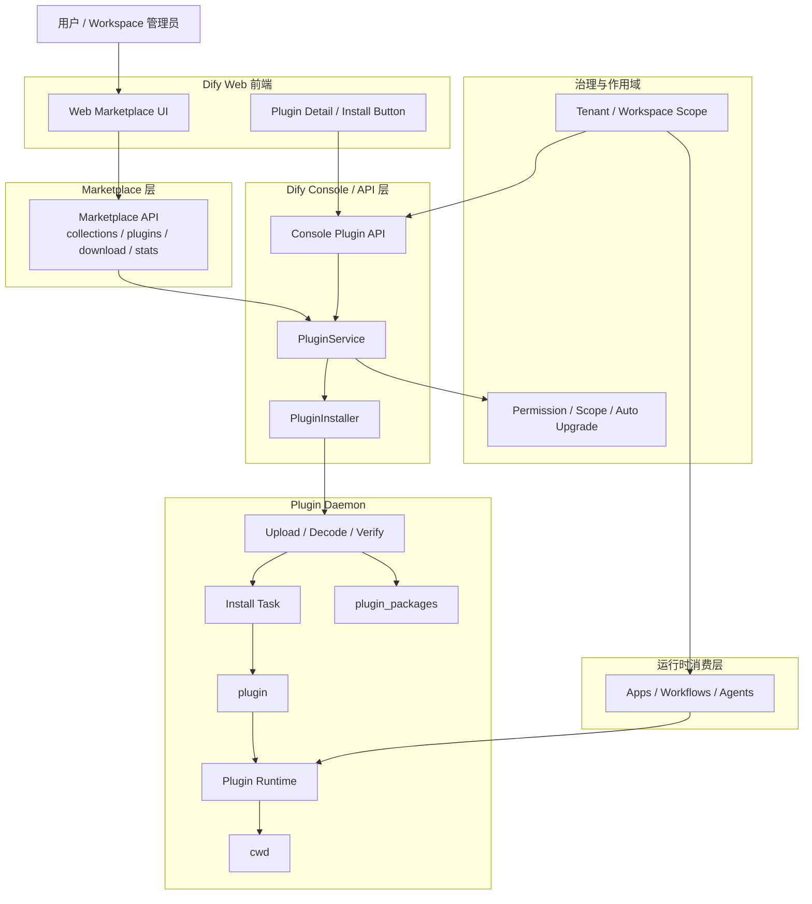
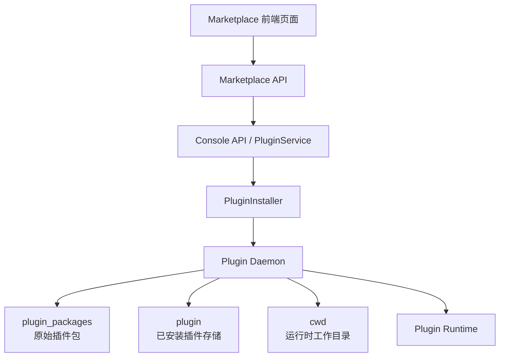
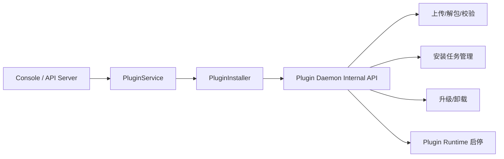
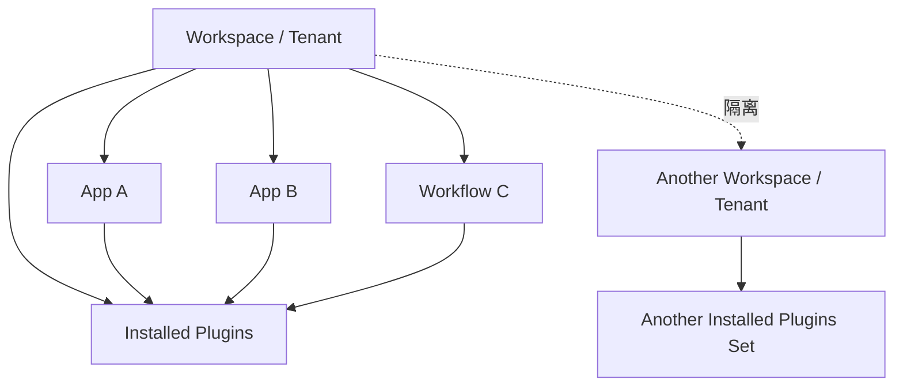
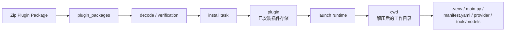
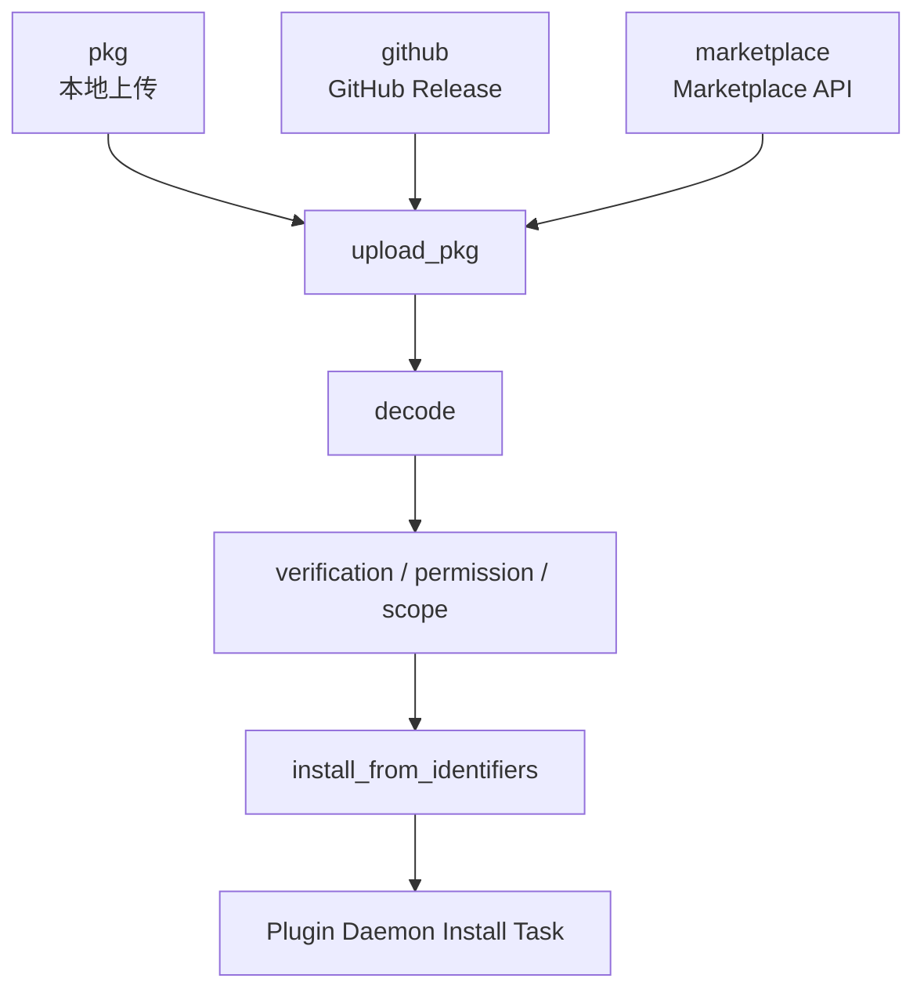
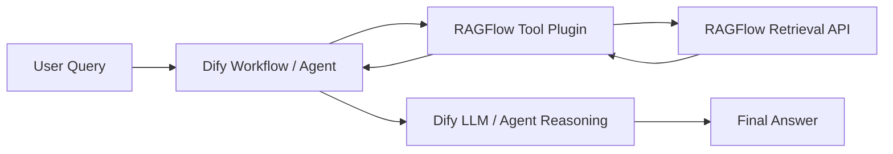
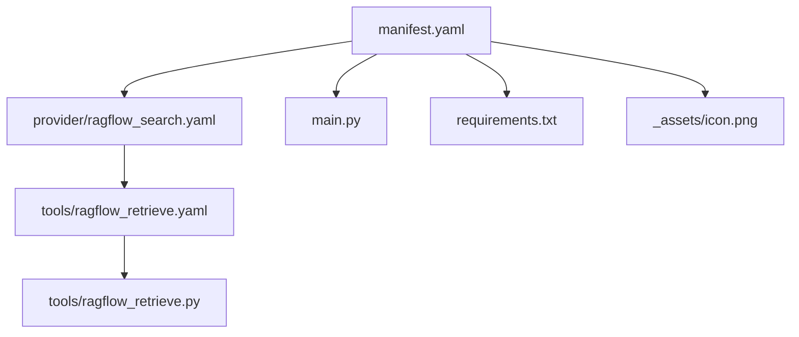
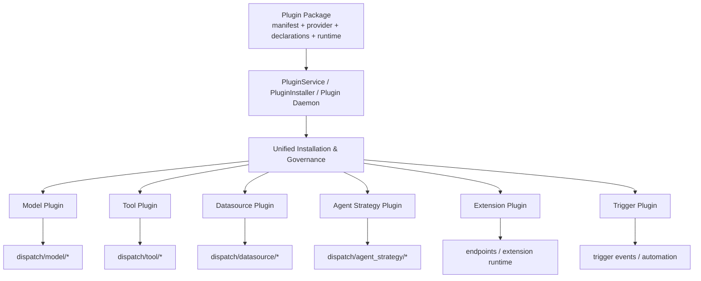

# LangGraph 与 Dify 的架构哲学，以及基于 LangGraph 做智能体中台的设计思路

## 1. 为什么会有人问：LangGraph 为什么没有插件/微内核机制

很多人第一次接触 `LangGraph`，都会有一个很自然的疑问。

现在做 AI 应用平台，大家已经很习惯下面这些概念了：

- 插件市场
- 组件注册
- 可插拔扩展点

而 `LangGraph` 看起来并不是这个路子。它没有把自己包装成一个“安装插件就能扩展能力”的平台，反而把注意力放在 `State`、`Node`、`Edge`、`Checkpoint` 这些更底层的概念上。

所以真正的问题其实不是：

“LangGraph 有没有插件能力？”

而是：

“为什么它没有优先把自己做成一个插件平台？”

要回答这个问题，不能先看插件，而要先看它到底把自己定义成什么。

## 2. 为什么 LangGraph 没有明显的插件/微内核机制

如果先看定位，这个问题就会变得比较清楚。

`LangGraph` 本质上不是一个 AI 应用平台，而是一个 agent 编排运行时。它更关注的是一个复杂 agent 怎么稳定地执行、怎么持久化、怎么中断恢复、怎么让状态可观测，而不是先把自己做成一个插件市场或者微内核平台。

换句话说，它先解决的是：

- agent 怎么跑
- 状态怎么流
- 路由怎么走
- 中断后怎么恢复

而不是先解决：

- 插件怎么注册
- 扩展点怎么暴露
- 平台能力怎么分发

当定位不同，架构就会跟着不同。

接下来再看它的核心抽象，就更容易理解为什么它不走重插件路线。

`LangGraph` 的核心抽象其实很少，主要就是：

- `State`
- `Node`
- `Edge`
- `Conditional Edge`
- `Checkpoint`
- `Interrupt`

也就是说，它想把一个 agent 系统真正重要的东西都显式表达出来：

- 当前状态是什么
- 下一步谁执行
- 在什么条件下路由
- 执行到哪里可以暂停
- 从哪里可以恢复

这套设计天然更偏“状态机”和“工作流运行时”。

如果这时候再往里面塞一个很重的插件体系，会出现一个问题：很多真实执行逻辑会从图上消失，转而跑到插件注册表、hook、生命周期回调或者插件内部状态里。这样一来，图就不再是系统真实行为的完整表达了。

**而 `LangGraph` 最有价值的地方，恰恰就是它希望让真实执行路径是显式的、可跟踪的、可恢复的。**

**所以从这个角度看，它不是“没做插件能力”，而是主动避免把执行语义过度隐藏到插件机制里。**

## 3. 为什么这种取向和 durable execution 有关系

如果只说到“它是运行时，不是平台”，其实还不够。再往下看一层，会发现这件事和 `durable execution` 直接相关。

`LangGraph` 特别强调 `durable execution`。这个能力背后其实有几个要求：

- 状态要能持久化
- 执行边界要清晰
- 中断点要明确
- 恢复时行为最好能保持一致

这时候，插件机制就会带来天然 tension。

因为插件体系通常很容易引入这些问题：

- 插件内部有隐式状态
- 插件副作用不可重放
- 插件升级后恢复行为不一致
- hook 会悄悄改变执行顺序

如果这些问题出现在一个强调恢复和追踪的 agent runtime 里，代价会非常高。你会发现图能画出来，但真正出问题时，逻辑分散在各种扩展点里，很难 debug，也很难保证 checkpoint 恢复的一致性。

所以结论可以说得更明确一点：

**LangGraph 不是不能做微内核，而是如果把运行时本身做成重插件架构，会直接削弱它最核心的价值：显式状态流、可恢复执行和可观测性。**

## 4. 这是不是说明 LangGraph 不能扩展

不是。

这里最容易混淆的点是，把“没有平台式插件机制”和“不能扩展”画了等号。其实这两个不是一回事。

`LangGraph` 的扩展方式更像代码级组合，它允许你在应用层做很多扩展，例如：

- 自定义节点
- 自定义状态结构
- 自定义子图
- 自定义工具
- 自定义持久化器
- 自定义存储层

所以它不是不开放，而是它希望扩展发生在显式编排层，而不是发生在一套会改写运行时语义的插件内核里。

到这里其实可以得出一个更准确的判断：

**LangGraph 倾向于“组合原语”，而不是“注入语义”。**

## 5. LangGraph 和 Dify 的架构哲学到底差在哪

理解了 LangGraph 为什么这样设计之后，再去看 `Dify`，差异就会变得非常清楚。

关键不在于谁强谁弱，而在于两者解决的问题层次不同。

### 5.1 LangGraph 更像运行时内核

`LangGraph` 更像一个 agent runtime 或 workflow engine。

它主要解决的是：

- 多步骤 agent 怎么编排
- 状态怎么流转
- 什么时候路由到不同节点
- 长任务怎么恢复
- 人工介入怎么插入

所以它的关注点更偏工程执行内核。

### 5.2 Dify 更像应用平台

`Dify` 更像一个 AI application platform。

它主要解决的是：

- 应用怎么快速搭起来
- 团队怎么复用能力
- 模型、工具、知识库怎么统一接入
- 工作区怎么隔离
- 插件怎么管理
- 模板和 DSL 怎么复用和分发

所以它天然会长出：

- 插件系统
- 工作区级治理
- 组件市场
- 权限和发布机制

这不是因为它比 `LangGraph` 更“先进”，而是因为它解决的问题本来就更偏平台层。

如果把这个差异压缩成一句话，其实就是：

**LangGraph 更偏运行时内核，Dify 更偏应用平台。**

## 6. 基于 LangGraph 做 Router-Worker 多智能体架构，能不能把能力抽象成可配置组件

这个问题的答案是：**完全可以，而且这是一个很合理的工程方向。**

为什么说它能做？因为 `LangGraph` 本身就支持：

- 路由
- 条件边
- 子图
- 并行 worker
- 中断与恢复
- context 或运行时配置

所以像下面这种结构，本质上就是适合用它来做的：

- 一个 `Router` 负责意图识别和任务分发
- 若干 `Worker` 分别处理 RAG、工具调用、任务执行
- 最后由一个 `Synthesizer` 汇总结果

这和官方的 `orchestrator-worker` 思路是对齐的。

## 7. 但组件化应该做到什么程度

真正关键的不是“能不能组件化”，而是“组件化应该做到什么程度”。

我不建议把整个图做成那种“完全动态拼接、任意插件注入”的系统。因为这样一来，主拓扑、状态结构和恢复语义都会变得不稳定，最后你虽然得到了灵活性，但失去了 `LangGraph` 最重要的优点。

更稳妥的方式是：

**固定图骨架 + 组件接口抽象 + 运行时配置**

这三个部分分别承担不同职责。

### 7.1 固定图骨架

固定图骨架负责表达系统最稳定的主流程，比如：

`Router -> Worker / RAG / Tool Executor -> Synthesizer -> Final Response`

这部分不要频繁变化，因为它定义了系统最核心的东西：

- 主控制流
- 状态边界
- 中断点
- checkpoint 语义

### 7.2 组件接口抽象

组件接口抽象负责承载“能力差异”，例如：

- `IntentRouter`
- `Retriever`
- `Reranker`
- `ToolProvider`
- `WorkerStrategy`
- `ResponseComposer`

这样做的好处是，系统的骨架不变，但每个槽位可以替换不同实现。

比如：

- 路由可以是规则路由、LLM 路由或混合路由
- 检索可以是向量检索、BM25 或 hybrid
- 工具执行可以根据租户、场景、权限使用不同工具集
- worker 可以是单 worker、并行 worker 或分角色 worker

### 7.3 运行时配置

运行时配置解决的是“同一套骨架和组件接口，如何适配不同业务”。

这层通常会放：

- 模型名
- prompt 模板
- 工具白名单
- 知识库 ID
- 检索参数
- 超时、重试、并发参数
- 租户和权限信息

这样一来，你不需要频繁改图结构，也能支持大量业务差异。

## 8. 那是不是就做不了中台

很多人讲到这里会继续追问：如果图骨架不能过度动态化，那是不是就做不了中台？

答案恰恰相反。

不是做不了中台，而是要把“中台能力”和“运行时内核”分开。

我会把中台理解成两层：

### 8.1 底层是 LangGraph 运行时内核

这一层负责：

- agent 编排
- 状态机执行
- checkpoint
- interrupt
- durable execution
- trace 和观测

这层应该稳定，因为它是整个系统的执行基础设施。

### 8.2 上层是中台能力层

这一层完全可以做，而且很适合做：

- 模板中心
- 配置中心
- 知识库中心
- Agent 装配台
- 权限和租户隔离
- 监控与审计

所以问题不是“能不能做中台”，而是：

**中台应该建在 LangGraph 之上，而不是直接把 LangGraph 改造成一个任意扩展、任意注入的微内核。**

## 9. 组件市场到底能不能做

继续往下问，就会落到“组件市场到底能不能做”。

答案也是可以做，但重点在“受控”两个字。

可以放进组件市场的，通常是这类东西：

- 路由组件
- 检索组件
- reranker
- 工具组件
- prompt 模板
- 子图模板
- agent 模板

这些东西本质上都是“受控装配件”，它们可以被注册、选择、配置和发布。

但我不建议把下面这些开放成任意插件注入点：

- 主图核心拓扑
- `State` 核心结构
- checkpoint / resume 语义
- runtime 生命周期 hook

因为这些一旦彻底开放，系统就很难再保证：

- 流程可理解
- 行为可预测
- 故障可排查
- 恢复可一致

所以更准确的说法应该是：

**可以做组件市场，但应该是受约束的组件市场，而不是无限自由的插件内核。**

## 10. 为什么 Dify 可以把“插件市场”真的做出来

如果继续追问，一个很关键的问题是：

既然前面说基于 `LangGraph` 很难天然长出 `Dify` 那种插件市场，那么 `Dify` 自己到底是怎么把这件事做出来的？

结合 `Dify 1.9.2` 的源码来看，它之所以能做“插件市场”，不是因为页面上有一个市场入口，而是因为它背后本来就有一整套插件平台基础设施。

如果想先从全局理解，可以先看这张“插件市场整体架构图”：



可以先用一张总图理解这件事：



### 10.1 第一层：它先在产品定义上把模型、工具、策略统一成插件

`Dify` 官方插件仓库里写得很清楚：从 `v1.0.0` 开始，模型和工具都已经迁移到插件仓库，并上传到 `Dify Marketplace` 统一维护和分发。

这意味着在 Dify 的架构里：

- 模型是插件
- 工具是插件
- Agent Strategy 是插件
- Extension 也是插件

也就是说，“插件市场”不是附加功能，而是它的主干分发机制。

参考：

- [dify-official-plugins/README.md](/Users/songxijun/workspace/otherProject/dify-1.9.2/dify_others/dify-official-plugins/README.md#L40)

### 10.2 第二层：前端不是只展示本地数据，而是直接对接 marketplace 服务

`Dify` 的 marketplace 页面会直接去拉取外部 marketplace API 的 collections、插件列表、分类和图标，而不是简单读取本地固定配置。

从前端代码能看到：

- 拉取 collections
- 根据 collection 拉插件列表
- 按 `tool / model / agent / extension / datasource / bundle` 分类过滤
- 构造 marketplace 详情页和图标地址

这说明它前端背后站着一个真正的 marketplace 服务。

参考：

- [utils.ts](/Users/songxijun/workspace/otherProject/dify-1.9.2/web/app/components/plugins/marketplace/utils.ts#L48)

### 10.3 第三层：后端有独立的安装入口，不同来源走统一安装链路

控制台后端提供了专门的插件安装接口，而且区分了几类来源：

- 本地 `pkg`
- `github`
- `marketplace`

这意味着“市场安装”不是前端点一下按钮直接把配置写进数据库，而是进入了一条专门的安装管线。

参考：

- [plugin.py](/Users/songxijun/workspace/otherProject/dify-1.9.2/api/controllers/console/workspace/plugin.py#L190)

### 10.4 第四层：marketplace 背后有专门的下载与版本服务

`Dify` 后端里有专门的 marketplace helper，用来做几件事：

- 根据 `plugin_unique_identifier` 下载插件包
- 批量拉取插件 manifest
- 记录安装统计

这说明 marketplace 不是“只是一个展示页面”，它本质上是一个插件分发服务。

参考：

- [marketplace.py](/Users/songxijun/workspace/otherProject/dify-1.9.2/api/core/helper/marketplace.py#L13)

### 10.5 第五层：真正执行安装的不是主应用，而是 plugin daemon

这是最关键的一层。

`Dify` 的主应用并不自己完成插件解包、解析、安装、升级和卸载，而是通过 `PluginInstaller` 去调用 `plugin daemon` 的内部 API。

从源码里可以看到：

- 主应用通过 `PLUGIN_DAEMON_URL` 和 `PLUGIN_DAEMON_KEY` 访问 daemon
- daemon 负责 upload package、install identifiers、list plugins、fetch manifest、uninstall、upgrade
- 插件安装还有 task 机制

这意味着 `Dify` 不是“在应用进程里顺手做了个插件功能”，而是有一个专门的插件运行与管理子系统。

这一层如果画成结构图，大概是这样：



参考：

- [base.py](/Users/songxijun/workspace/otherProject/dify-1.9.2/api/core/plugin/impl/base.py#L51)
- [plugin.py](/Users/songxijun/workspace/otherProject/dify-1.9.2/api/core/plugin/impl/plugin.py#L21)

### 10.6 第六层：插件不是随便传一段代码，而是有标准化包和 manifest

从已经安装的 `OpenAI` 插件可以看到，一个插件包里会带标准化 `manifest.yaml`，里面描述：

- 插件版本
- 类型
- 作者
- 名称
- 描述
- 图标
- 资源限制
- 权限声明
- 支持的能力类型
- runner 语言和入口点

有了这层标准化描述，平台才能做安装前识别、安装后治理、权限控制和 UI 展示。

参考：

- [manifest.yaml](/Users/songxijun/workspace/otherProject/dify-1.9.2/docker/volumes/plugin_daemon/cwd/langgenius/openai-0.2.8@aae2be0913b8c6f0b80cff58e08d7a8b4c214569b41778413fcaea204561ff16/manifest.yaml#L1)

### 10.7 第七层：它还有平台治理，而不仅仅是安装能力

从 `PluginService` 可以看到，Dify 还在做下面这些治理动作：

- 校验插件来源
- 控制是否只允许 marketplace 安装
- 控制是否只允许官方插件或合作伙伴插件
- 检查安装范围和权限
- 支持升级与任务追踪

这说明 Dify 的“插件市场”不是简单的目录，而是“分发 + 安装 + 校验 + 权限治理 + 生命周期管理”的组合。

参考：

- [plugin_service.py](/Users/songxijun/workspace/otherProject/dify-1.9.2/api/services/plugin/plugin_service.py#L325)

### 10.8 这件事和 LangGraph 的差别到底在哪

看到这里，其实就很容易理解，为什么前面说 `LangGraph` 不适合天然做出 `Dify` 这样的插件市场。

因为 `Dify` 的插件市场成立，依赖的不是某一个“插件接口”，而是整套平台能力：

- 外部 marketplace 服务
- 插件包格式
- manifest 规范
- plugin daemon
- 安装任务系统
- 权限与来源治理
- 工作区级安装和复用

而 `LangGraph` 默认提供的是：

- graph runtime
- state orchestration
- checkpoint / interrupt
- subgraph / routing

两者根本不是同一层抽象。

所以更准确的比较方式不是：

- `LangGraph` 为什么没有做成 `Dify`

而是：

- `LangGraph` 是运行时内核
- `Dify` 是带插件分发能力的平台系统

这也是为什么前面文档里一直强调：

**基于 LangGraph 可以做工具注册、工具目录、工具治理，但如果要做 Dify 那种完整的“工具市场/插件市场”，必须额外补齐插件分发、安装、执行隔离、治理和生命周期管理这一整套平台基础设施。**

### 10.9 为什么 Dify 还需要一个独立的 plugin daemon

再往下追问一步，会发现还有一个很关键的问题：

既然 Dify 已经有 marketplace、安装接口和插件包规范了，为什么还要单独再搞一个 `plugin daemon`，而不是直接在主应用进程里完成安装和管理？

原因是，一旦系统真的要做成“插件平台”，插件相关动作就不再只是一个普通 API 功能，而是一整类高风险、高复杂度的系统能力。

#### 第一，职责需要隔离

主应用进程主要负责的是：

- 用户请求处理
- 工作流执行
- 页面和 API 服务
- 数据读写

而插件子系统负责的是：

- 下载包
- 解包
- manifest 校验
- 签名校验
- 安装
- 升级
- 卸载
- 安装任务管理

这两类职责放在同一个进程里，会让主应用越来越臃肿，也会让插件逻辑侵入主业务逻辑。拆出 `plugin daemon` 后，主应用只负责发指令，真正的插件管理由单独子系统处理。

#### 第二，故障需要隔离

插件安装和升级天然是慢操作，而且很容易失败，比如：

- 下载失败
- 包损坏
- 解析失败
- manifest 非法
- 版本冲突
- 依赖缺失

如果这些操作直接在主应用进程里做，最坏情况下会拖慢 API 响应，甚至影响正常业务流量。独立 daemon 的意义，就是把这类任务变成“插件管理子系统自己的问题”，避免把主应用拖进来。

#### 第三，安全边界需要更清楚

插件本质上是外部扩展，风险明显高于平台自带代码。哪怕还没有做到完全沙箱化，至少也需要先把它从主应用服务里隔离出来。

独立进程能带来的直接好处包括：

- 插件文件操作和主服务隔离
- 插件安装逻辑和主业务逻辑隔离
- 插件异常不会直接污染主 Web/API 进程
- 后续更容易继续往沙箱、资源限制、执行隔离演进

所以 `plugin daemon` 本质上是在为插件平台建立一个更清晰的安全边界。

#### 第四，生命周期管理需要独立出来

插件平台不仅仅是“能装上去”，还要处理完整生命周期：

- 安装
- 查询任务状态
- 列举已安装插件
- 升级
- 卸载
- 获取 manifest
- 检查依赖

从源码也能看到，`PluginInstaller` 对接的 daemon API 本身就覆盖了这些动作，说明 Dify 已经把这部分当作一个独立能力域来建模，而不是把它当作几个零散函数。

参考：

- [plugin.py](/Users/songxijun/workspace/otherProject/dify-1.9.2/api/core/plugin/impl/plugin.py#L21)

#### 第五，插件运行约束需要一个专门的承接层

插件包里不是只有一段代码，还带有标准化 manifest，里面会声明：

- 类型
- 资源限制
- 权限
- 入口点
- runner 语言和版本

这意味着平台不仅要“知道有这个插件”，还要“知道该如何准备和管理它”。这类工作更适合由一个专门的插件子系统承接，而不是散落在主应用各个模块里。

#### 最后可以把这件事收束成一句话

`Dify` 需要 `plugin daemon`，不是因为它想把架构做复杂，而是因为它真的在做一个完整插件平台。

只要目标是：

- 支持 marketplace 分发
- 支持多来源安装
- 支持升级和卸载
- 支持任务追踪
- 支持插件治理和隔离

那么把插件安装与管理从主应用进程中拆出来，做成独立的 `plugin daemon`，几乎就是一个自然结果。

### 10.10 源码里说的 “workspace 级安装” 到底是什么意思

理解 `Dify` 插件市场时，还有一个经常会被说得比较模糊的词，就是“workspace 级安装”。

如果只从产品角度说，这个词很容易被理解成“一个工作区里装一次，多个应用都能用”。这句话方向是对的，但还不够精确。

从源码看，`Dify` 里的“workspace 级安装”本质上就是：

**插件安装和管理是以 `tenant_id` 为作用域进行建模的。**

也就是说，所谓 workspace，在插件这条链路里，本质上就是 tenant 作用域。

这个作用域关系可以直接画成下面这样：



#### 第一，控制台插件接口全部先拿当前 tenant

在控制台插件接口里，几乎每个入口都会先通过 `current_account_with_tenant()` 取出当前 `tenant_id`，然后再调用 `PluginService`。

这说明插件相关动作不是绑定某个单独 app，而是先绑定“当前工作区/租户”。

参考：

- [plugin.py](/Users/songxijun/workspace/otherProject/dify-1.9.2/api/controllers/console/workspace/plugin.py#L21)

#### 第二，真正请求 plugin daemon 时，路径里直接带 tenant_id

`PluginInstaller` 调用 daemon 的路径不是：

- `plugin/management/...`

而是：

- `plugin/{tenant_id}/management/...`

这意味着插件的列举、上传、安装、任务查询、卸载、升级，全部都是 tenant 维度的数据和操作。

参考：

- [plugin.py](/Users/songxijun/workspace/otherProject/dify-1.9.2/api/core/plugin/impl/plugin.py#L21)

#### 第三，插件权限和升级策略也是按 tenant 存的

插件相关的权限和自动升级策略表，都带有 `tenant_id`，而且是唯一约束。

这说明平台治理层面也把插件当作“租户级资源”管理，而不是“单个应用级资源”管理。

参考：

- [account.py](/Users/songxijun/workspace/otherProject/dify-1.9.2/api/models/account.py#L340)

#### 第四，应用使用插件能力时，也是按自己的 tenant 去查

在应用模型里，检查工具是否存在时，会直接用 `self.tenant_id` 去调用 `PluginService.check_tools_existence(...)`。

这说明应用本身并不拥有一套独立插件安装空间，而是在“自己所在 tenant 已安装的插件集合”里消费能力。

参考：

- [model.py](/Users/songxijun/workspace/otherProject/dify-1.9.2/api/models/model.py#L225)

#### 所以更准确的理解应该是

`Dify` 的插件不是装给某一个 app 的，也不是默认装给全平台所有 workspace 的，而是装给“当前 workspace 对应的 tenant”。

这样带来的结果就是：

- 同一个 workspace 下的多个 app / workflow / agent 可以复用同一批已安装插件
- 不同 workspace 之间默认隔离，各自管理自己的插件安装、权限和升级策略

因此，“workspace 级安装”如果用更源码化、更准确的话来讲，其实就是：

**tenant 级安装，tenant 级复用，tenant 级治理。**

### 10.11 插件包里的 manifest.yaml 到底有什么意义

继续往下问，还会碰到一个很关键的问题：

既然插件本质上是一个 zip 包，为什么里面一定要有一个标准化的 `manifest.yaml`？

从 `Dify` 的实现来看，`manifest.yaml` 不是一个“给人看的说明文件”，而是平台识别、安装、治理和运行插件时依赖的核心契约。

#### 第一，它让平台知道“这到底是什么插件”

以本地 `OpenAI` 插件为例，`manifest.yaml` 里声明了：

- `version`
- `type`
- `author`
- `name`
- `description`
- `label`
- `icon`

这些字段的意义在于，平台拿到一个包之后，能先把它识别成一个结构化对象，而不是一坨未知文件。

参考：

- [manifest.yaml](/Users/songxijun/workspace/otherProject/dify-1.9.2/docker/volumes/plugin_daemon/cwd/langgenius/openai-0.2.8@aae2be0913b8c6f0b80cff58e08d7a8b4c214569b41778413fcaea204561ff16/manifest.yaml#L1)

#### 第二，它让平台知道“这个插件提供了什么能力”

`manifest.yaml` 里还有很重要的一段：

- `plugins.models`

在 `OpenAI` 这个例子里，它指向了 `provider/openai.yaml`，说明这个插件提供的是模型相关能力。

这层信息非常关键，因为平台需要据此决定：

- 这个插件应该挂到模型、工具、Agent Strategy 还是 Extension 分类下
- marketplace 怎么展示它
- workflow / agent 节点该怎么消费它

这也是为什么 Dify 可以把模型、工具、策略统一纳入插件体系，而不是每种能力单独做一套注册机制。

参考：

- [manifest.yaml](/Users/songxijun/workspace/otherProject/dify-1.9.2/docker/volumes/plugin_daemon/cwd/langgenius/openai-0.2.8@aae2be0913b8c6f0b80cff58e08d7a8b4c214569b41778413fcaea204561ff16/manifest.yaml#L20)
- [dify-official-plugins/README.md](/Users/songxijun/workspace/otherProject/dify-1.9.2/dify_others/dify-official-plugins/README.md#L40)

#### 第三，它让平台知道“能不能装，装完怎么跑”

`manifest.yaml` 里还声明了很多运行相关信息：

- `resource.memory`
- `resource.permission`
- `meta.arch`
- `meta.runner.language`
- `meta.runner.version`
- `meta.runner.entrypoint`

这说明平台安装插件时，不只是“把文件放进去”，还要知道：

- 这个插件声明了哪些权限
- 需要什么 runner
- 入口点在哪里
- 是否满足当前平台的运行条件

所以 `manifest.yaml` 同时承担了“安装前校验”和“运行前准备”的作用。

#### 第四，它支撑了 upload -> decode -> install 这条安装链路

从后端看，插件包上传后并不会立刻被当作“已安装”，而是先被解码成结构化声明，再进入后续安装流程。

`PluginInstaller.upload_pkg()` 返回的是 `PluginDecodeResponse`，里面就包含：

- `unique_identifier`
- `manifest`
- `verification`

这说明平台必须先把包解析成 manifest 驱动的结构化数据，才能继续做校验、权限判断、安装范围判断和 UI 展示。

参考：

- [plugin.py](/Users/songxijun/workspace/otherProject/dify-1.9.2/api/core/plugin/impl/plugin.py#L51)

所以如果要把这件事总结成一句话，可以这么说：

**`manifest.yaml` 的意义在于，它把一个插件从“压缩包里的代码”提升成了“平台可识别、可安装、可校验、可展示、可运行、可治理的标准化能力单元”。**

### 10.12 install task 到底安装了什么，什么叫“安装进去了”

当继续问到安装链路时，问题通常会变成：

插件在进入 `install task` 之后，到底安装了什么文件？什么状态才算真的安装成功？

从你本地 `plugin_daemon` 目录结构和 daemon 源码来看，Dify 至少把插件分成了三层存储形态：

- `plugin_packages/`：原始插件包存储
- `plugin/`：已安装插件存储
- `cwd/`：运行时工作目录

这个文件流转如果用一张图来理解，会更直观：



你本地目录里这三层都能看到：

- [plugin_daemon](/Users/songxijun/workspace/otherProject/dify-1.9.2/docker/volumes/plugin_daemon)
- [cwd](/Users/songxijun/workspace/otherProject/dify-1.9.2/docker/volumes/plugin_daemon/cwd)
- [plugin](/Users/songxijun/workspace/otherProject/dify-1.9.2/docker/volumes/plugin_daemon/plugin)
- [plugin_packages](/Users/songxijun/workspace/otherProject/dify-1.9.2/docker/volumes/plugin_daemon/plugin_packages)

而 daemon 自己的说明也写了：

- `cwd/`: Working directory for installed plugins
- `storage/plugin_packages/`: Packaged plugin storage
- `storage/assets/`: Plugin assets

参考：

- [CLAUDE.md](/Users/songxijun/workspace/otherProject/dify-1.9.2/dify_others/dify-plugin-daemon/CLAUDE.md)

#### 第一，install task 不是简单“解压一下”

控制台调用安装时，实际走的是：

- `PluginInstaller.install_from_identifiers()`
- 然后请求 daemon 的 `plugin/{tenant_id}/management/install/identifiers`

这说明 install task 是 daemon 侧的正式安装过程，而不是前端或主应用自己做文件操作。

参考：

- [plugin.py](/Users/songxijun/workspace/otherProject/dify-1.9.2/api/core/plugin/impl/plugin.py#L93)

#### 第二，真正运行时会从已安装存储里取包，再解压到 cwd

在 daemon 的 `launcher.go` 里可以看到，本地插件运行时会：

1. 从 `installedBucket` 取出插件包
2. 用 zip decoder 读取 manifest 和 checksum
3. 计算工作目录路径
4. 如果工作目录不存在，就执行 `ExtractTo(workingPath)`
5. 再初始化本地运行时

这说明安装不是只落一份源码，而是至少包括：

- 一份被 daemon 视为“已安装”的插件包
- 一份运行时工作目录

参考：

- [launcher.go](/Users/songxijun/workspace/otherProject/dify-1.9.2/dify_others/dify-plugin-daemon/internal/core/plugin_manager/launcher.go#L21)

#### 第三，cwd 里能看到真正准备运行的文件

从你本地的 `OpenAI` 插件工作目录可以看到，运行时实际落下来的文件包括：

- `manifest.yaml`
- `main.py`
- `provider/`
- `models/`
- `requirements.txt`
- `_assets/`
- `.verification.dify.json`
- `.venv/`

参考：

- [openai cwd](/Users/songxijun/workspace/otherProject/dify-1.9.2/docker/volumes/plugin_daemon/cwd/langgenius/openai-0.2.8@aae2be0913b8c6f0b80cff58e08d7a8b4c214569b41778413fcaea204561ff16)

也就是说，daemon 不只是把源码解压出来，还会为插件准备实际运行环境。

#### 第四，什么叫“安装进去了”

从平台语义上看，至少有两个层次的判定。

第一层是任务层：

插件安装任务的状态进入 `success`。  
`PluginInstallTaskStatus` 明确区分了：

- `pending`
- `running`
- `success`
- `failed`

参考：

- [plugin_daemon.py](/Users/songxijun/workspace/otherProject/dify-1.9.2/api/core/plugin/entities/plugin_daemon.py#L142)

第二层是管理层：

插件能在该 `tenant_id` 下被列出来、能获取 manifest、能用于后续检查和调用。

换句话说，平台层面的“安装成功”不是只看文件存在，而是看：

- install task 成功
- 插件进入已安装存储
- 插件能在 tenant 维度被管理和使用

#### 第五，卸载逻辑反过来也证明了这一点

daemon 卸载时做的核心动作是：

- 从 `installedBucket` 删除插件
- 如果运行时还在，就停止 runtime

这说明“是否已安装”的关键事实，首先是它是否还存在于 daemon 管理的 installed storage 中。

参考：

- [uninstall.go](/Users/songxijun/workspace/otherProject/dify-1.9.2/dify_others/dify-plugin-daemon/internal/core/plugin_manager/uninstall.go#L1)

所以更准确的说法是：

**install task 的本质，是把插件包纳入 daemon 的已安装存储，并在需要运行时解压到 `cwd` 工作目录；任务状态成功且插件能被 tenant 维度地列举和使用，才算真正“安装进去”。**

### 10.13 插件 zip 包里具体是什么，组织结构长什么样

最后还可以把问题再追到更底层：

既然安装的是一个 zip 包，那这个 zip 包里面到底装了什么？

结合你本地的 `OpenAI` 插件包来看，zip 包里不是单个脚本文件，而是一个完整的标准化插件工程。

这个实际包文件在这里：

- [openai plugin package](/Users/songxijun/workspace/otherProject/dify-1.9.2/docker/volumes/plugin_daemon/plugin_packages/langgenius/openai:0.2.8@aae2be0913b8c6f0b80cff58e08d7a8b4c214569b41778413fcaea204561ff16)

从 zip 包里读出来的顶层结构大致是：

```text
.env.example
README.md
_assets/
main.py
manifest.yaml
models/
provider/
requirements.txt
.verification.dify.json
```

其中各部分分别扮演不同角色：

- `manifest.yaml`：插件总清单，声明元数据、能力、权限、runner 和入口点
- `main.py`：插件启动入口
- `requirements.txt`：插件依赖
- `provider/`：provider 级配置与实现
- `models/` 或 `tools/` 或 `endpoints/`：真正的能力定义
- `_assets/`：图标和静态资源
- `README.md`：说明文档
- `.env.example`：环境变量示例
- `.verification.dify.json`：验证相关元数据

以这个 `OpenAI` 插件为例，zip 包里能直接看到：

- `main.py`
- `manifest.yaml`
- `requirements.txt`
- `provider/openai.yaml`
- `provider/openai.py`
- `models/common_openai.py`
- 大量 `models/llm/*.yaml`
- `models/text_embedding/*.yaml`
- `models/speech2text/*.yaml`
- `models/moderation/*.yaml`
- `models/tts/*.yaml`

这说明 Dify 的插件包本质上不是“一个函数”或者“一个工具配置”，而是：

**一个标准化、可被平台安装和运行的插件工程目录。**

如果抽象成通用结构，可以理解成：

```text
plugin.zip
├── manifest.yaml
├── main.py
├── requirements.txt
├── README.md
├── .env.example
├── .verification.dify.json
├── _assets/
├── provider/
│   ├── xxx.yaml
│   └── xxx.py
├── models/ 或 tools/ 或 endpoints/ 或 strategies/
│   ├── *.yaml
│   └── *.py
```

也正因为 zip 包是这种工程化结构，daemon 才能在安装后把它解压到 `cwd/`，准备依赖环境，并把它当成一个真正可运行的插件单元来管理。

### 10.14 后端为什么会有 pkg / github / marketplace 三类安装入口

继续往安装链路往下追，会看到 `Dify` 后端并不是只有一个“安装插件”接口，而是区分了三类来源：

- `pkg`
- `github`
- `marketplace`

这里最容易误解的地方是，以为这是三套完全不同的安装逻辑。其实从源码看，它们的区别主要不在“怎么装”，而在“插件包从哪里来”。

也就是说，这三类入口本质上是：

**三种不同的插件获取方式，共用一条统一的安装管线。**

#### 第一类：pkg，是本地上传包

这条链路最直接。

控制台接口会：

- 从 `request.files["pkg"]` 读取上传文件
- 检查大小
- 调 `PluginService.upload_pkg(...)`

参考：

- [plugin.py](/Users/songxijun/workspace/otherProject/dify-1.9.2/api/controllers/console/workspace/plugin.py#L117)

接下来服务层会：

- 调 `PluginInstaller.upload_pkg(...)`
- 把二进制包发给 plugin daemon
- 先返回 `PluginDecodeResponse`
- 再通过 `install_from_local_pkg(...)` 把 identifier 送进正式安装流程

参考：

- [plugin_service.py](/Users/songxijun/workspace/otherProject/dify-1.9.2/api/services/plugin/plugin_service.py#L325)
- [plugin.py](/Users/songxijun/workspace/otherProject/dify-1.9.2/api/core/plugin/impl/plugin.py#L51)

所以 `pkg` 路线可以理解成：

`本地上传文件 -> upload_pkg -> decode/verify -> install_from_identifiers`

#### 第二类：github，是先从 GitHub Release 下载包

这条链路和本地包的区别，不在安装，而在获取包的方式。

控制台接口接收：

- `repo`
- `version`
- `package`

然后调 `PluginService.upload_pkg_from_github(...)` 或 `install_from_github(...)`。

参考：

- [plugin.py](/Users/songxijun/workspace/otherProject/dify-1.9.2/api/controllers/console/workspace/plugin.py#L141)

服务层会先：

- 拼出 GitHub Release 的下载地址
- 把包下载下来

然后做的事情就和 `pkg` 基本一致：

- `upload_pkg`
- `decode`
- `verification`
- `install_from_identifiers`

参考：

- [plugin_service.py](/Users/songxijun/workspace/otherProject/dify-1.9.2/api/services/plugin/plugin_service.py#L343)

所以 `github` 路线其实是：

`GitHub Release -> 下载插件包 -> upload_pkg -> decode/verify -> install_from_identifiers`

#### 第三类：marketplace，是先从官方 marketplace 下载包

这条链路和 GitHub 的思路类似，只不过下载源换成了 Dify 官方 marketplace。

控制台接口拿到 `plugin_unique_identifiers` 后，会调：

- `PluginService.install_from_marketplace_pkg(...)`

参考：

- [plugin.py](/Users/songxijun/workspace/otherProject/dify-1.9.2/api/controllers/console/workspace/plugin.py#L256)

服务层会做下面几步：

1. 先检查这个插件在当前 tenant 下是否已经有 manifest
2. 如果没有，就通过 marketplace API 下载插件包
3. 再把包交给 `upload_pkg(...)`
4. 做 verification 和安装范围校验
5. 最后统一调 `install_from_identifiers(...)`

参考：

- [plugin_service.py](/Users/songxijun/workspace/otherProject/dify-1.9.2/api/services/plugin/plugin_service.py#L440)
- [marketplace.py](/Users/songxijun/workspace/otherProject/dify-1.9.2/api/core/helper/marketplace.py#L13)

所以 `marketplace` 路线可以理解成：

`Marketplace API -> 下载插件包 -> upload_pkg -> decode/verify -> install_from_identifiers`

#### 第四，三类入口最后都会汇合到同一个安装核心

无论来源是本地、GitHub，还是 Marketplace，最后真正触发安装的都是：

- `PluginInstaller.install_from_identifiers(...)`
- daemon 内部的 `plugin/{tenant_id}/management/install/identifiers`

参考：

- [plugin.py](/Users/songxijun/workspace/otherProject/dify-1.9.2/api/core/plugin/impl/plugin.py#L93)

这说明 Dify 的安装架构做得很清楚：

- 来源层负责“把包弄到手”
- 解析层负责 `decode`
- 校验层负责 `verification / permission / scope`
- 安装层负责进入 daemon 的统一 install task

这条汇合关系可以直接画成：



所以更准确的表述应该是：

**`pkg/github/marketplace` 三类入口的区别在于插件包来源不同，但它们最终都会被归一化成“先拿到插件包，再 decode/verify，再按 identifier 进入 daemon 的统一安装任务”。**

### 10.15 如果我想自己写一个 RAG 插件，应该怎么做

理解完 Dify 的插件体系之后，一个很自然的问题就是：

如果我自己要写一个插件，尤其是一个和 RAG 相关的插件，到底应该怎么下手？

这里首先要分清楚，所谓 “RAG 插件” 可以有两种完全不同的形态。

#### 第一种，是 datasource 插件

这种插件更偏“把外部内容接入 Dify 的知识库流程”，例如：

- 从网页抓内容
- 从云盘拉文档
- 从第三方知识源拉取文本

这类插件的目标，是把数据导入到 Dify 的知识体系里，属于“数据接入层”。

#### 第二种，是 tool 插件

这种插件更偏“在 workflow / agent 运行时调用外部检索服务”，例如：

- 用户提问时，调用一个外部检索 API
- 返回 chunks / snippets / citations
- 再由 Dify 的 agent 用这些结果生成答案

如果你的目标是把一个外部 RAG 系统接进来，例如 `RAGFlow`，那通常更推荐先做成 **tool 插件**。

原因很简单：

- `Dify` 继续负责 agent / workflow 编排
- `RAGFlow` 继续负责知识检索
- 插件只负责把外部检索能力适配成 Dify 能调用的标准工具

这种分工最清晰，落地也最快。

如果用架构图来表达这个接法，可以先看这一张：



#### 一个最实用的例子：把 RAGFlow 作为外部检索工具接进 Dify

如果要做一个最小可用版本，我会建议先做一个叫做 `ragflow_search` 的 tool plugin。

它的职责非常单一：

- 输入 `query`
- 调用 `RAGFlow` 检索 API
- 返回 `top-k chunks`

### 10.15.1 目录结构应该长什么样

这种插件的目录结构，可以直接参考 Dify 官方的工具插件，例如 `tavily`。

一个典型的 `ragflow_search` 插件可以长这样：

```text
ragflow_search/
├── main.py
├── manifest.yaml
├── provider/
│   ├── ragflow_search.yaml
│   └── ragflow_search.py
├── tools/
│   ├── ragflow_retrieve.yaml
│   └── ragflow_retrieve.py
├── requirements.txt
├── README.md
└── _assets/
    └── icon.png
```

参考结构：

- [tavily](/Users/songxijun/workspace/otherProject/dify-1.9.2/dify_others/dify-official-plugins/tools/tavily)

对应到插件内部结构，也可以这样理解：



### 10.15.2 `main.py` 怎么写

`main.py` 通常非常固定，主要作用就是启动插件 runtime：

```python
from dify_plugin import Plugin, DifyPluginEnv

plugin = Plugin(DifyPluginEnv(MAX_REQUEST_TIMEOUT=120))

if __name__ == "__main__":
    plugin.run()
```

参考：

- [main.py](/Users/songxijun/workspace/otherProject/dify-1.9.2/dify_others/dify-official-plugins/datasources/jina_datasource/main.py)

### 10.15.3 `manifest.yaml` 怎么写

`manifest.yaml` 里要先声明这是一个工具插件，以及它暴露的 provider：

```yaml
version: 0.0.1
type: plugin
author: your_name
name: ragflow_search
label:
  en_US: RAGFlow Search
description:
  en_US: Retrieve knowledge from RAGFlow.
icon: icon.png

resource:
  memory: 268435456
  permission:
    tool:
      enabled: true

plugins:
  tools:
    - provider/ragflow_search.yaml

meta:
  version: 0.0.1
  arch:
    - amd64
    - arm64
  runner:
    language: python
    version: "3.12"
    entrypoint: main
```

这个文件的核心作用，是让 Dify 知道：

- 这是一个什么插件
- 它属于哪类能力
- 入口点是什么
- 应该把哪个 provider 挂进工具体系

### 10.15.4 `provider/*.yaml` 怎么写

这一层主要描述 provider 级元信息和凭证配置。

比如 `RAGFlow` 这种外部检索服务，通常至少要配置：

- `base_url`
- `api_key`

可以写成：

```yaml
credentials_schema:
  - name: base_url
    label:
      en_US: RAGFlow Base URL
    type: text-input
    required: true

  - name: api_key
    label:
      en_US: API Key
    type: secret-input
    required: true

extra:
  python:
    source: provider/ragflow_search.py

identity:
  author: your_name
  label:
    en_US: RAGFlow Search
  name: ragflow_search

tools:
  - tools/ragflow_retrieve.yaml
```

这层的作用是让 Dify 知道：

- 这个 provider 叫什么
- 用户安装后需要填哪些凭证
- 它下面挂了哪些具体工具

### 10.15.5 `tools/*.yaml` 怎么写

这一层定义的是 agent 真正能调用的工具接口。

一个最小版 `ragflow_retrieve` 可以长这样：

```yaml
identity:
  name: ragflow_retrieve
  author: your_name
  label:
    en_US: RAGFlow Retrieve

description:
  en_US: Search knowledge from RAGFlow and return top chunks.

parameters:
  - name: query
    type: string
    required: true
    form: llm
    label:
      en_US: Query

  - name: top_k
    type: number
    required: false
    default: 5
    form: form
    label:
      en_US: Top K

  - name: dataset_id
    type: string
    required: false
    form: form
    label:
      en_US: Dataset ID

output_schema:
  type: object
  properties:
    query:
      type: string
    chunks:
      type: array
      items:
        type: object
    answer:
      type: string

extra:
  python:
    source: tools/ragflow_retrieve.py
```

这个文件的本质，是把一个外部检索 API，声明成 Dify 内部可调用的标准工具。

### 10.15.6 `tools/*.py` 怎么写

真正的业务逻辑就写在这里。

如果以 `RAGFlow` 为例，这个工具通常会做几件事：

1. 从 runtime 里拿凭证
2. 读取用户输入的 `query / top_k / dataset_id`
3. 请求 `RAGFlow` 的检索 API
4. 把返回值转换成 Dify 期望的标准输出

伪代码大致如下：

```python
import requests
from dify_plugin import Tool
from dify_plugin.entities.tool import ToolInvokeMessage

class RagflowRetrieveTool(Tool):
    def _invoke(self, tool_parameters: dict):
        base_url = self.runtime.credentials["base_url"]
        api_key = self.runtime.credentials["api_key"]

        payload = {
            "query": tool_parameters["query"],
            "top_k": tool_parameters.get("top_k", 5),
            "dataset_id": tool_parameters.get("dataset_id"),
        }

        resp = requests.post(
            f"{base_url}/api/your-ragflow-search-endpoint",
            json=payload,
            headers={
                "Authorization": f"Bearer {api_key}",
                "Content-Type": "application/json",
            },
            timeout=30,
        )
        resp.raise_for_status()
        data = resp.json()

        return [
            ToolInvokeMessage.json({
                "query": payload["query"],
                "chunks": data.get("chunks", []),
                "answer": data.get("answer", ""),
            })
        ]
```

这个适配层的作用非常明确：

- 上游对接 Dify 的工具协议
- 下游对接 `RAGFlow` 的 API 协议

插件本身并不承担检索引擎角色，它只是二者之间的协议桥接层。

### 10.15.7 为什么把 RAGFlow 接成 tool plugin 是一个合理方案

从架构上看，这种接法其实很干净。

职责分层是：

- `Dify`：负责 agent / workflow / application orchestration
- `RAGFlow`：负责知识检索
- `Tool Plugin`：负责协议适配

这样做的好处是：

- 不需要把 `RAGFlow` 内嵌到 Dify 里
- 不会破坏 Dify 自己的运行时结构
- 可以快速替换后端检索引擎
- 很容易在后续扩展更多工具，例如：
  - `ragflow_retrieve`
  - `ragflow_list_datasets`
  - `ragflow_upload_document`
  - `ragflow_sync_index`

所以如果目标是“把一个现有 RAG 系统接入 Dify”，最佳实践通常不是重写 Dify 的 RAG 内核，而是：

**把外部 RAG 服务包装成一个标准 Dify tool plugin。**

### 10.16 Dify 为什么能把 Tool / Model / Datasource / Agent Strategy / Extension / Trigger 都做成插件

继续往平台层看，一个很容易让人产生疑问的问题是：

`Tool Plugin`、`Model Plugin`、`Datasource Plugin`、`Agent Strategy Plugin`、`Extension Plugin`、`Trigger Plugin` 这些东西明明语义差别很大，为什么 `Dify` 能把它们全部纳入同一个插件体系？

从源码看，原因并不是这些能力“本来就一样”，而是 `Dify` 先在平台层把它们统一抽象成了同一种插件能力单元，再在运行时按类型分发。

可以先看整体图：



这张图要表达的核心就是：

- 插件的“安装、治理、打包、声明”是统一的
- 插件的“运行语义”是分类型分发的

#### 第一，官方先在产品定义上把这些能力都纳入插件类型

从官方插件仓库可以直接看到，`Dify` 已经把插件按下面这些目录组织起来：

- `models/`
- `tools/`
- `datasources/`
- `agent-strategies/`
- `extensions/`
- `triggers/`

参考：

- [dify-official-plugins 目录结构](/Users/songxijun/workspace/otherProject/dify-1.9.2/dify_others/dify-official-plugins)

官方 README 里也明确列出了 `Plugin Types`，这说明对 Dify 来说，插件不是只覆盖某一种能力，而是它的平台能力封装机制。

参考：

- [dify-official-plugins/README.md](/Users/songxijun/workspace/otherProject/dify-1.9.2/dify_others/dify-official-plugins/README.md#L42)

#### 第二，后端有统一的插件声明模型

在后端的 `PluginDeclaration` 里，可以看到 Dify 统一定义了这些能力入口：

- `plugins.tools`
- `plugins.models`
- `plugins.endpoints`
- `plugins.datasources`

同时它还能挂载解析后的具体声明对象：

- `tool`
- `model`
- `endpoint`
- `agent_strategy`
- `datasource`

并且会自动推断分类：

- `Tool`
- `Model`
- `Datasource`
- `AgentStrategy`
- 否则默认 `Extension`

这说明 Dify 的第一层设计不是“每种能力完全一套单独系统”，而是：

**先有统一插件声明，再在声明中装入不同能力类型。**

参考：

- [plugin.py](/Users/songxijun/workspace/otherProject/dify-1.9.2/api/core/plugin/entities/plugin.py#L54)

#### 第三，它们共享同一种插件工程结构

虽然模型、工具、触发器和数据源的功能完全不同，但它们的插件工程结构非常像，通常都包含：

- `main.py`
- `manifest.yaml`
- `provider/*.yaml`
- 具体能力描述文件
- `requirements.txt`
- `_assets/`

例如：

- datasource: [jina_datasource](/Users/songxijun/workspace/otherProject/dify-1.9.2/dify_others/dify-official-plugins/datasources/jina_datasource)
- tool: [tavily](/Users/songxijun/workspace/otherProject/dify-1.9.2/dify_others/dify-official-plugins/tools/tavily)
- trigger: [github_trigger](/Users/songxijun/workspace/otherProject/dify-1.9.2/dify_others/dify-official-plugins/triggers/github_trigger)

这说明 Dify 在包格式层面已经做了统一：

- 都是插件包
- 都有 manifest
- 都有 provider
- 都有 runtime entrypoint

#### 第四，安装与治理链路完全统一

无论是 model、tool、datasource，还是 agent strategy、extension、trigger，它们的安装方式都不是各自为政，而是共用同一个平台链路：

- marketplace / github / pkg
- `PluginService`
- `PluginInstaller`
- `plugin daemon`
- install task
- tenant 级安装与治理

也就是说，这些能力虽然运行语义不同，但在“平台治理”这个层次上是统一对象。

#### 第五，运行时通过不同 dispatch 接口分流

统一并不意味着它们跑在同一个接口里。

从源码看，Dify 做的是“统一平台，分类型 dispatch”。

例如：

`Model Plugin` 走：

- `management/models`
- `dispatch/llm/invoke`
- `dispatch/model/schema`

参考：

- [model.py](/Users/songxijun/workspace/otherProject/dify-1.9.2/api/core/plugin/impl/model.py#L18)

`Tool Plugin` 走：

- `management/tools`
- `dispatch/tool/invoke`

参考：

- [tool.py](/Users/songxijun/workspace/otherProject/dify-1.9.2/api/core/plugin/impl/tool.py#L15)

`Agent Strategy Plugin` 走：

- `management/agent_strategies`
- `dispatch/agent_strategy/invoke`

参考：

- [agent.py](/Users/songxijun/workspace/otherProject/dify-1.9.2/api/core/plugin/impl/agent.py#L10)

`Extension Plugin` 则更偏 endpoint 暴露：

参考：

- [endpoint.py](/Users/songxijun/workspace/otherProject/dify-1.9.2/api/core/plugin/entities/endpoint.py#L8)

这意味着：

- 安装、治理、打包是统一的
- 调用和运行是按类型分发的

#### 第六，Trigger 也能变成插件，是因为它也满足这套平台约束

从 `github_trigger` 可以看到，它同样有：

- `manifest.yaml`
- `provider/github.yaml`
- `events/`
- `main.py`

而 manifest 里也明确挂了：

- `plugins.triggers`

这说明 `Trigger` 能成为插件，不是因为它和 `Tool` 很像，而是因为它也能被封装成：

- 一个标准化插件包
- 一个标准化 provider
- 一组可被平台识别的声明

参考：

- [github_trigger manifest](/Users/songxijun/workspace/otherProject/dify-1.9.2/dify_others/dify-official-plugins/triggers/github_trigger/manifest.yaml)

#### 所以最本质的原因是什么

如果把这件事压缩成一句最底层的解释，就是：

**Dify 不是把“所有能力硬塞成同一种运行逻辑”，而是先统一了插件包格式、manifest 契约、provider 声明、安装治理链路和 daemon 框架，再通过不同的 management/dispatch 接口把不同能力类型分发出去。**

这也是为什么它能同时拥有：

- `Tool Plugin`
- `Model Plugin`
- `Datasource Plugin`
- `Agent Strategy Plugin`
- `Extension Plugin`
- `Trigger Plugin`

而又不至于让系统失控。

## 11. 如果让我落到一个架构结论

如果把前面的分析真正落到一个工程设计上，最终会得到一个比较清晰的分层方案。

我会把整个系统分成三层。

第一层是稳定的 `LangGraph` 执行骨架，用来定义 Router、Worker、Synthesizer 这些核心节点，以及状态流转、checkpoint 和中断恢复机制。

第二层是组件抽象层，把 RAG、工具调用、路由策略、worker 策略这些能力抽象成统一接口，并通过注册中心管理多个实现。

第三层是平台治理层，负责配置中心、模板中心、工具市场、知识库中心、租户权限、审计和监控。

这样设计的好处是：

- 运行时稳定
- 组件可替换
- 平台可治理
- 业务可配置

把这套设计再压缩一下，可以得到一句很稳的结论：

**用 LangGraph 做稳定内核，用组件抽象做扩展，用中台能力做治理。**

## 12. 最后一句话总结

如果把整篇内容收束成一句话，可以这样理解：

**LangGraph 不走重插件/微内核路线，是因为它本质上是 agent 运行时，不是应用平台；但它非常适合做智能体中台的执行内核，在它之上采用“固定图骨架 + 组件接口抽象 + 运行时配置”的方式，可以同时兼顾稳定性、扩展性和平台治理。**

## 13. 参考资料

- LangGraph Overview: https://docs.langchain.com/oss/python/langgraph/overview
- LangGraph Workflows and Agents: https://docs.langchain.com/oss/python/langgraph/workflows-agents
- LangGraph Graph API Overview: https://docs.langchain.com/oss/python/langgraph/graph-api
- LangGraph Use the Graph API: https://docs.langchain.com/oss/python/langgraph/use-graph-api
- LangGraph Subgraphs: https://docs.langchain.com/oss/python/langgraph/use-subgraphs
- LangGraph Durable Execution: https://docs.langchain.com/oss/python/langgraph/durable-execution
- Rebuild Graph at Runtime: https://docs.langchain.com/langsmith/graph-rebuild
- Dify Plugins: https://docs.dify.ai/en/use-dify/workspace/plugins
- Dify Create Application: https://docs.dify.ai/versions/3-0-x/en/user-guide/application-orchestrate/creating-an-application
