# 面向手机 Agent 的记忆系统工程：OPPO Agentic-RAG 实战与演进

导读 来自 OPPO AI 中心的高级算法工程师余明老师，将分享面向手机 Agent 的记忆系统工程，内容聚焦于手机记忆搜索的实际落地。本次分享题目为《面向手机 Agent 的记忆系统工程》。核心内容包括以下七个方面：1. 应用场景与战略定位2. 记忆搜索的核心挑战与工程瓶颈3. RAG 技术架构设计4. 效果提升的关键：分层提示工程与动态上下文构建5. 隐私安全与评测体系建设6. 未来展望与技术演进方向7. Q&A 环节分享嘉宾｜余明 OPPO 高级算法工程师编辑整理｜Edith内容校对｜郭慧敏出品社区｜DataFun

## 01 应用场景与战略定位

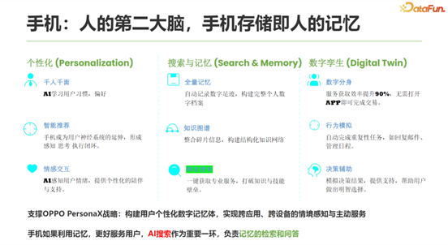

在当前的 AI 时代，手机被视为人类的“第二大脑”，承载着存储个人记忆的重要功能。我们认为，这一定位可以从以下三个层面来深化实现：

首先是个性化。虽然大模型具备通用知识，但它并不了解每一个独特的个体。我们的目标是基于用户与手机的交互历史及设备内存储的个人内容，精准识别用户的个性化信息，从而实现“千人千面”的智能推荐与具备情感共鸣的交互体验。

其次是搜索与记忆的主动服务。在获得用户信息后，当用户产生需求时，系统应能主动提供相关记忆与信息检索。这包括自动记录用户的数字足迹，也支持用户主动标记重要信息。而知识图谱的作用，则在于对这些记忆进行结构化整理——例如将零散的信息自动聚合、分类，形成专题合集或专属记忆库。

最后是精准搜索与即服务。我们致力于让用户能够一键获取高度精准的信息与专业服务，实现需求与资源的无缝对接。

展望未来，我们的演进方向是构建“数字孪生”体系。预计在今年内，技术将向创建个人数字分身的方向发展。该分身能够学习并模拟用户的行为模式，在必要时为用户提供个性化的决策辅助与前瞻性服务。

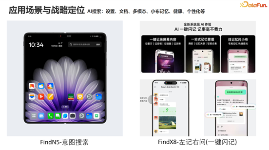

今年，我们的核心工作是支撑 OPPO 的 Personal X 战略，致力于构建个性化的数字记忆体——即研究手机如何利用记忆更好地服务用户。其中，AI 搜索是至关重要的一环，主要负责解决记忆的检索问题。接下来，我将重点介绍检索环节的具体应用场景。

首先，团队在 2025 年 1 月（年初）发布的 Find N5 中推出了“意图搜索”功能。该功能位于手机负一屏的搜索框内，当用户输入诸如日程、文档、图片等关键词时，系统能够智能识别其搜索意图，并精准返回相关结果。

其次，在去年年中发布的 Find X8 上，我们带来了“左记右问”功能。这款最新的 OPPO 手机在左侧专门设计了一枚记忆按键。该按键可以直观地理解为一个“APP 收藏夹”——用户在任何界面浏览信息（包括文档、图片、视频甚至语音内容）时，只需轻按此键，系统便会自动解析当前内容，并将其存储为可追溯、可检索的个人记忆点。

记忆被保存后，系统将自动进行记忆管理、整理与主动服务。例如，若系统识别出记忆内容与旅行相关，便会自动将其归类为“旅行合集”；若内容涉及记账，则可能会主动为用户启动记账流程——值得一提的是，我们最新发布的智能记账功能在体验上已相当成熟和便捷。

最后，用户可通过两大核心入口来灵活检索自己的记忆：一是直接询问语音助手小布，二是使用全局搜索全搜。在这两个场景下，用户都可以方便地查询和调用属于自己的个人化记忆信息。

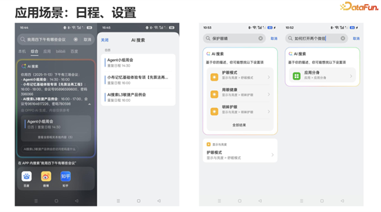

接下来，我将具体介绍两个核心功能场景：

### 1. 搜日程

用户在 AI 搜索框中输入：“我周四下午有哪些会议？”

系统将按时间顺序清晰展示周四下午的所有会议安排，并在最下方附上“查看详情”链接。点击链接后，右侧将呈现相关日程的摘要信息，进一步点击可进入查看完整的日程详情。

### 2. 搜设置

有时用户想使用某项手机功能，却不知如何操作。此时，用户可在搜索框直接输入设置需求（例如：“如何开启深色模式”），系统将直接定位并展示对应的设置选项与操作指引，帮助用户快速完成配置。

我们认为，用户搜索手机设置主要存在两种场景：

第一种是显性关键词搜索。

例如，用户直接提问“保护眼睛”。系统会基于这一明确关键词，直接定位并推荐“护眼模式”等相关设置项。

第二种是模糊意图/功能描述搜索。

例如，当用户不清楚具体设置名称时，也可以直接描述功能需求，比如询问“如何打开两个微信”。系统能够理解此类模糊意图，并精准匹配出对应的设置项名称——在此例中即为“应用分身”功能。

此外，我们的搜索能力也全面覆盖文档搜索与多模态搜索，能够根据文本、图像乃至语音内容进行综合检索与意图理解。

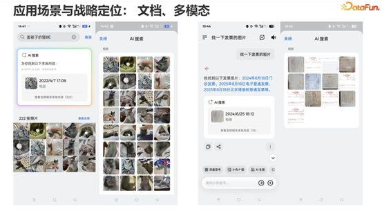

搜索功能支持多种常见且实用的场景，具体如下：

首先是多模态搜索。例如，用户可直接输入“盖被子的猫咪”进行搜索，系统能够理解图像语义并执行检索。这部分属于通用能力，在此不作展开。

其次是图片内容搜索，例如在报销场景中搜索发票图片。当用户需要报销时，可直接搜索“发票”相关图片，系统能够从相册或文件中准确找出各类发票图像，目前识别准确率较高。

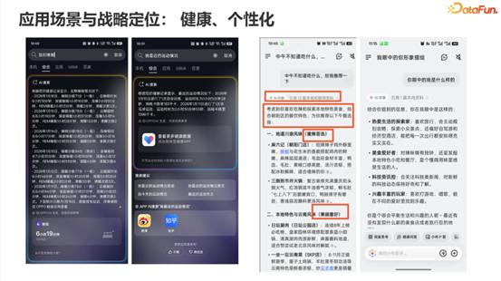

还有一个是跨设备协同搜索。例如，如果用户拥有 OPPO 手表，就可以在手机上直接查询个人健康信息。用户可以询问“我的睡眠情况”“最近的运动数据”或“我的尿酸值”等问题，系统会主动汇总近期相关数据，并提供详情入口，方便用户直接跳转至健康云数据页面查看具体信息。

第四是个性化推荐搜索。例如，当用户询问“中午不知道吃什么，推荐一下”时，系统会综合参考用户以往保存的内容、交互行为，以及通过语音助手小布明确表达的口味偏好，为其个性化推荐合适的餐厅。

此外，我们支持跨设备协同搜索功能。例如，若用户拥有 OPPO 手表，即可在手机上直接查询用户的健康信息、运动情况、身体指标等相关数据。该系统目前已实现落地——例如，当用户搜索“我的睡眠”时，系统可为用户汇总展示近几天的睡眠情况，同时用户也可通过页面底部的链接直接跳转至云端健康数据页面查看详细记录。用户也可以搜索“我的运动”“我最近的运动情况”或“我的尿酸”等内容，相关信息均可通过搜索查询获取。该功能支持在统一搜索入口及小布语音助手两个平台使用。

另一方面，系统也支持基于个性化数据的场景。例如，当用户询问“中午不知道吃什么，给我推荐一下”时，系统会根据用户以往保存的内容、交互记录，或用户曾向小布说明过的口味偏好，为用户推荐适合的餐馆。

用户也可以询问小布“你眼中的我是什么样的”。系统将根据用户的行为与交互数据，分析并总结用户的个人特征画像。

## 02 记忆搜索的核心挑战与工程瓶颈

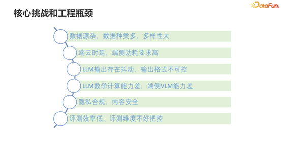

以上介绍了应用场景，接下来将说明实现方式，以及在实现过程中面临的主要挑战与工程瓶颈。

核心挑战主要体现在数据、性能、模型、合规等多个方面。

首先，数据来源繁杂且异构性强，数据来自端侧、云侧以及多个设备，每个来源的数据结构各不相同。

其次，端云协同中的时延与端侧功耗问题，这也是除效果外我们最关注的核心问题。

此外，大模型在实际调用中存在输出抖动与格式不可控的挑战——输出抖动是商用大模型中的常见现象，我们通常需要在提示设计中引入冗余来缓解；

而格式控制则在不同场景中与效果优化同样困难。同时，大模型在数学计算方面能力较弱，端侧向量检索能力也较为有限。最后，隐私合规与系统效果评测也是必须面对的重要课题。基于以上难点，接下来我们将介绍系统的整体架构设计以及相应的解决方案。

## 03 RAG 技术架构设计

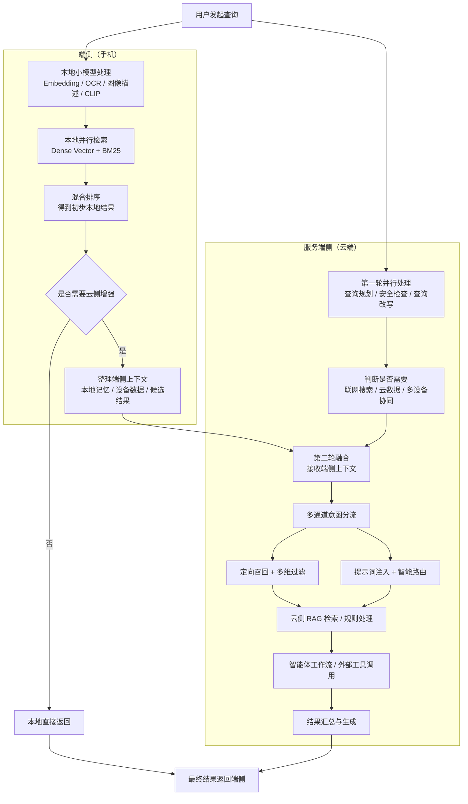

### 1. 端侧技术架构

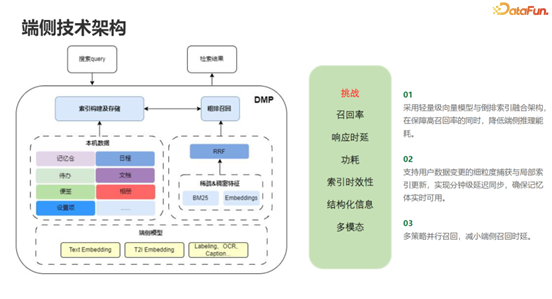

这是我们在端侧的架构设计。在端侧，我们预先部署了多个自研的小模型，包括文本嵌入模型、文本到图像嵌入模型、邻近检索模型、OCR 识别、图像描述生成以及 CLIP 模型等。

在用户进行手机搬家或初始化时，系统会对用户本地的数据进行向量化处理，并将生成的向量存储在手机端侧。

当用户发起查询时，流程大致如下：查询请求从右侧进入，系统同时通过稠密向量检索和基于 BM25 算法的稀疏关键词检索进行并行处理，接着对两者的检索结果进行混合排序，最终在端侧输出检索结果。

在端侧实现中，我们面临的主要技术挑战包括：

首先是召回率。如果端侧无法完成有效召回，整个检索流程就会失败。

其次是响应时延与功耗，这两者相互关联。我们通过模型量化、剪枝等技术，以及在 NPU 上进行算子优化，来降低功耗、提升效率。

索引的时效性也非常关键。例如，用户刚拍摄一张照片或记录一项日程后，立即进行搜索，系统需要在分钟级别内完成响应。

多模态与结构化信息的处理也是一个挑战，尤其是像 PDF 中表格这类内容的解析，这实际上是 RAG 领域的一个行业难题。这一问题主要集中在数据构建阶段需要进一步优化。在多模态处理方面，目前行业内对端侧多模态能力的支持仍不够完善，但我们正在持续推进相关优化。同时，我们也通过采用多策略并行召回机制，有效降低了端侧处理的响应时延。

### 2. 云侧技术架构

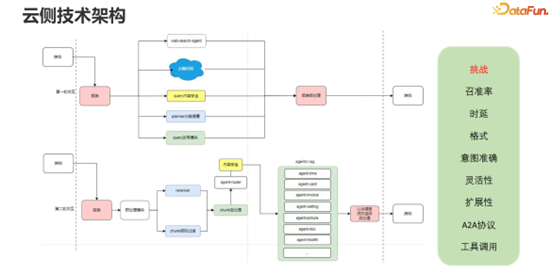

云端与端侧的协同机制设计为两轮交互流程。在第一轮交互中，端侧处理与云端的第一阶段是并行执行的。

在第一轮交互中，云端会对查询进行全面的预处理，包括查询规划、内容安全检查、查询改写等。同时，若查询意图涉及网络搜索、云端数据或多设备协同，系统会触发多路召回机制。

完成第一轮交互后，第二轮交互会携带端侧的手机本地信息上传至云端。云端会进行 RAG 检索与规则处理，并基于查询意图与上传信息，通过智能路由模块将任务分发给相应的智能体。

这些智能体中，部分以工作流形式运行，部分则需调用外部工具。云端处理的主要挑战与端侧有相似之处，但侧重点不同：云端在保证召回率的基础上更注重准确率，同时需优化响应时延、输出格式控制、意图识别准确性、系统灵活性、可扩展性、端到端协议稳定性以及工具调用的可靠性。

关于灵活性，这里稍作说明：我们在系统设计时并未采用固定流水线处理所有查询，而是通过框架的动态适配能力，使不同查询能够按需选择最优执行路径。

### 3. 多通道意图分流

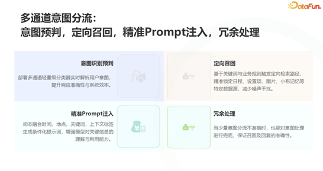

我们的意图分流机制是云端与端侧架构中的核心模块之一。

所谓多通道意图分流，是指我们并非依赖单一的规划模块进行意图判断，而是基于任务类型、所需数据等不同维度，通过多通道联合决策来实现精准的意图识别与分流。

在完成意图分流后，最关键的功能之一是定向数据召回。

例如，如果用户查询的是图片或与小布记忆相关的内容，这类请求与系统设置完全无关，此时我们便会有意排除设置相关的数据召回，从而有效降低噪声干扰，提升检索效果。

另一个重要环节是精准的提示词注入。系统会根据识别出的具体意图，动态匹配并注入与之对应的提示词模板，以引导模型生成更符合场景的响应。

此外，容错处理也是我们在落地实践中积累的关键经验。意图分流无法保证 100% 准确，因此设计了相应的兜底机制，确保在分流出现偏差时系统仍能稳定运行。

整个意图分流过程中，还包含了诸如定向召回、查询过滤等多种细化策略，共同支撑起鲁棒且高效的意图理解与任务执行体系。

### 4. 多维过滤体系

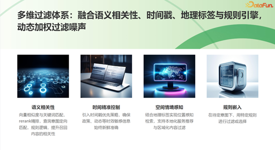

在进行 RAG（检索增强生成）的过程中，实现高质量的搜索与问答，关键之一在于如何筛选出与查询最相关的文本片段提供给大模型。除了定向召回外，还需借助多维度过滤机制来有效降低噪声干扰。

过滤体系主要涵盖以下几个层面：

语义相关性是最直接的过滤维度，通常基于向量检索的相似度得分进行排序。此外，我们在任务规划模块中设计了语义槽位，通过识别查询中的关键信息槽，进一步筛选出更匹配的参考内容。

时间维度控制基于时间戳或时间段进行过滤。例如，当用户查询车位信息时，系统会优先呈现最近拍摄的车位照片，而将去年拍摄的相关内容置于次要位置，以此保证信息的时效性。

空间与情绪标签也被纳入过滤逻辑。比如当用户查询“我在朝阳公园拍的照片”时，系统会结合用户当前所处地理位置（如北京市朝阳区），准确识别出对应的“朝阳公园”，而非其他城市的同名地点。

规则引擎的嵌入则提供了更强的可控性。在实际应用中，部分记忆内容包含可识别的关键来源或标签。例如，若用户在小红书收藏了装修攻略，系统便能通过规则识别该来源，并基于此实施定向的内容过滤与召回。

通过以上多维度的协同过滤，能够有效去除无关信息，将最相关、最准确的上下文提供给大模型，从而提升问答的精确性与可靠性。

### 5. 云侧增强型服务

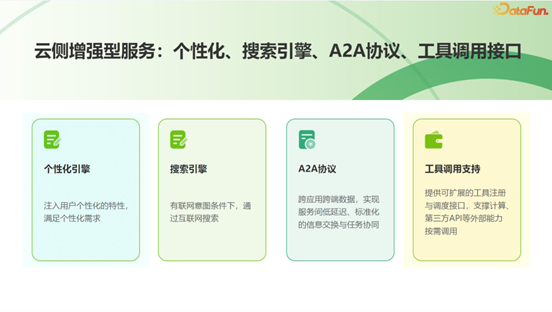

在云端增强服务方面，主要围绕个性化搜索引擎、端到端协议与工具调用等方向展开。

针对个性化搜索，系统首先会判断当前查询是否需要引入用户个人数据。例如，在搜索开始时，会识别该查询是否具有搜索意图，并结合用户画像与历史行为，决定是否调用个性化数据来优化结果。

同时，通过统一的端到端协议，实现云端与端侧之间的稳定、高效通信。在工具调用方面，系统支持根据查询意图，灵活调度如天气查询、日程管理、多模态解析等外部能力，并通过结构化接口与智能体进行协同，最终返回完整、准确的增强结果。

端到端（Agent to Agent）协议主要用于实现跨设备与跨应用间的交互协同。该协议的设计非常关键，需要明确定义智能体之间的交互轮次、触发条件，以及在何种情况下应中止交互流程。

工具调用作为常见能力，在此不再展开。

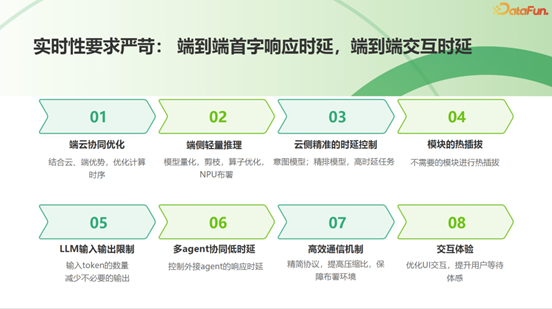

在落地过程中，时延是除效果外最核心的优化指标之一。为此，在降低时延方面积累了多项实践经验，团队主要从以下几个层面推进：

首先是端云协同策略。将能在端侧完成的任务尽量放在端侧处理，能提前在端侧执行的操作也尽可能前置，从而避免不必要的云端依赖。同时，通过优化任务调度，尽可能减少端侧与云端之间的相互等待，实现高效协同。

其次，推动端侧轻量化推理，对文本嵌入模型及多模态模型实施量化与剪枝优化，并针对联发科、高通等主流芯片平台进行算子级优化，实现在 NPU 上的高效部署。

在云端，实施精准的时延控制。例如，在交互流程中，对意图模型、排序模型等高时延模块进行提前规划。模型的参数规模与输入长度决定了其首字生成时间，而每个 Token 的输出耗时也相对固定，这使我们能够对整体时延进行预估和规划。在排序模型等关键环节，通过并发处理来提升效率——因为排序往往是 RAG 流程中最耗时的步骤之一。

同时，采用模块化热插拔设计，使搜索流程能够根据具体场景跳过非必要模块，进一步缩短链路。

针对大模型调用，尽管其首字生成时间难以直接控制，但通过精心设计提示词，限制输入 Token 数量、减少冗余输出，并选用表达更高效的措辞来降低整体耗时。

在多智能体协同方面，严格设定接入智能体的性能标准，如要求其 P99 响应延迟控制在特定毫秒级范围内，并通过优化通信机制——如精简协议、提高数据压缩率，以及确保主服务与模型部署在同一机房以减少网络传输开销——来降低协同时延。

最后，注重交互体验的优化，通过改进 UI 设计来提升用户在等待过程中的感知体验。以上便是我们在全链路时延优化方面采取的系统性策略。

## 04 效果提升的关键：分层提示工程与动态上下文构建

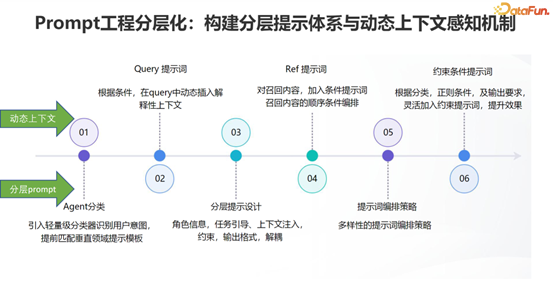

接下来分享一个我们认为在 RAG 实践中对效果提升较为显著的经验：分层提示工程与动态上下文构建。

在 RAG 流程中，需要将最相关的文本片段提供给大模型，并对提示词进行精心编排。不同的组织方式与提示内容会直接影响生成效果。因此，强调提示词必须足够灵活，其中分层设计与动态化是两个关键原则。

动态上下文主要指根据查询、检索结果及约束条件三个方面进行动态适配。针对不同的查询、用户画像以及召回内容，我们会在这三个维度上注入差异化的提示信息，确保上下文与当前场景高度相关。

分层提示则是在确定查询意图后，为其匹配一个垂直领域的提示模板，并将整体提示结构解耦为以下几个层次：角色设定、任务引导、上下文注入、约束条件与输出格式。这种分层设计有利于模块化扩展，因为例如角色信息、任务引导等部分往往具备通用性，仅需针对特定场景进行微调即可复用。

通过这种编排策略，我们能够更灵活地组合与调整提示结构，从而在控制生成效果的同时，也提升了系统的可维护性与扩展性。这也是我们在实际落地中持续优化并验证有效的提示工程实践。

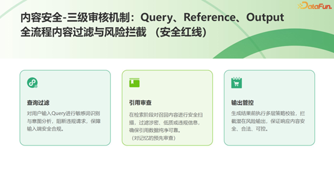

## 05 隐私安全与评测体系建设

接下来讨论在内容安全和隐私安全方面的建设。内容安全与隐私安全始终是 OPPO 不可逾越的红线，在系统落地中尤为重要。

在内容安全方面，实施“三级审查机制”，覆盖查询、召回内容和生成输出的全流程过滤与拦截。当用户查询触发安全规则时，系统会直接拒绝回答。同样，从手机、其他设备或云端召回的信息也须经过安全审核，若未通过则直接屏蔽该召回结果。对于生成输出，由于采用流式返回，我们实现了实时的流式安全审核。

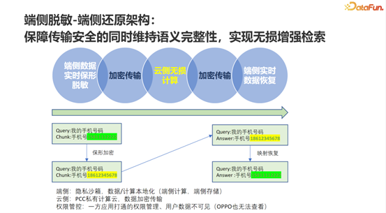

在用户隐私保护方面，我们采用保形脱敏策略，具体流程如下：端侧数据先进行保形脱敏处理，随后加密传输至云端进行无损计算，最终在端侧恢复为原始数据。例如，手机号码“15158111222”在本地脱敏为“186‘’‘’2222”格式后上传，云端基于此脱敏格式进行计算，输出时再在端侧还原为真实号码。这样既能利用大模型对标准号码格式的认知能力，又确保了原始隐私数据不暴露。

此外，端侧计算本地化是隐私安全的天然保障。云端则通过隐私计算协作技术和数据加密传输来确保安全。权限管理方面，执行严格的管控，确保用户数据对包括 OPPO 内部在内的所有方均不可见。

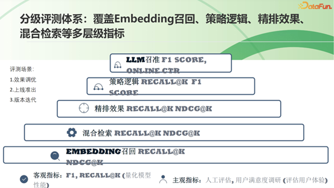

评测是落地过程中至关重要的环节。建立了覆盖三个阶段的评测体系：效果调优、上线准出和版本迭代。

在效果调优阶段，实施分级评测，涵盖向量化、混合检索、重排序效果、逻辑策略和意图识别等环节，采用召回率、NDCG、F1 分数等指标，从而定位效果衰减的关键节点并针对性优化。

在上线准出阶段，结合客观指标（如 top-k 召回率）和主观人工评测，综合评估后准予上线。

在版本迭代阶段，为提升效率，我们主要依赖核心客观指标（如 F1 分数）进行快速评测。

## 06 未来展望与技术演进方向

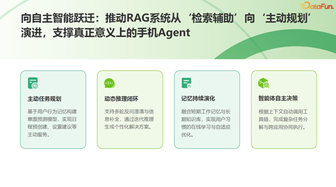

当前的搜索与问答仍以用户主动发起、系统辅助检索为主。未来，我们将向更主动的规划演进，以支撑真正意义上的手机智能体。演进将围绕意图识别与数据处理两个核心，目标是更精准地理解用户意图并更优地处理数据，从而减少中间过滤环节，实现数据与需求的直接匹配。

具体规划包括以下四个方面：主动任务规划、动态推理闭环、记忆持续演化以及智能体自主决策。这也呼应了 OPPO 在 2026 年的重要概念——Personal X，即通过用户画像实现更深层的行为建模与情感理解，构建包括习惯建模、情绪识别与交互动态在内的记忆闭环。我们将持续整合小布记忆等多种记忆类型，并融入搜索，以加速用户获取所需信息。最终目标是实现策略自主优化与服务主动性的全面提升。

## 07 Q&A 环节

**Q1：** 提到记忆的分类与整理。我们业务中也面临类似问题：用户记忆多为文本形式，需要进行分类、整理和挖掘。请问在记忆分类和整理方法上，是否有经验可以分享？

**A1：** 关于记忆的保存与整理，我们目前也在探索中。现阶段我们优先选择几个典型场景落地，例如近期发布的“记账问答”和即将发布的“旅行合集”。我们并非一开始就对所有记忆进行定义和整理，而是根据用户的最强需求，先实现几个典型场景的分类与整理。

**Q2：** 在 RAG 实践中，一个常见问题是检索信息并非越多越好，过多上下文可能引入噪声，反而影响模型判断。请问 OPPO 在召回数量与效果平衡方面有哪些经验？

**A2：** 这个问题我们确实遇到过不少挑战。正如之前提到的，给大模型的信息应追求精准而非数量。理想情况是预先知道模型所需，并直接提供。在数量与效果的平衡上，我们尝试根据意图动态调整召回数量。例如，查询“下个月的待办”可能需要召回较多日程（如 300 个），而“明天下午三点是否有会”则只需精准召回少数相关结果。这需要一定的弹性策略。总体原则是优先保证召回全面性，再优化召回精准度。

**Q3：** 提到的分层提示工程，最近 Cloud Skill 在这方面也有较大改动。请问在 Agent 或 RAG 中，是否有类似 Cloud Skill中Scripts 调用的探索？两者在设计思想上是否有相似之处？

**A3：** 说实话，我还没来得及仔细研究 Cloud Skill 的最新改动。如果用户的意思是工具调用或技能编排方面，我们的分层提示工程确实源于自身实践。初期我们使用一两个通用提示模板，但随着问题多样化，为保持灵活性，我们逐步将提示结构拆分为角色、规则、输出格式、约束条件等可复用模块，再根据具体查询进行组合。这与模块化、可组合的思想是相似的。

**Q4：** 关于评测，有两个具体问题：一是在召回精准度环节，如何构建自动化评测数据集？二是在重排阶段，自动化评测的思路是怎样的？

**A4：** 测试集的构建在冷启动阶段和运行阶段有所不同。冷启动时，我们首先确保营销需求 100% 覆盖，同时团队内部会设计大量用例。系统上线两三个月后，我们会基于实际用户查询（经脱敏和匿名化处理）构造和标注数据。评测集确实需要精心构建，尤其答案标准的确定至关重要。我们结合外部标注团队和内部专家标注来保证质量。对于重排模型，我们在训练阶段就有专属评测集，上线后也会使用线上数据作为评测集的一部分。

**Q5：** 手机长期记忆的数据量大概有多大？这些记忆在技术上存储在什么系统中（如特定数据库）？比如一部手机使用一两年后，个人长期记忆的数据量预计多少？

**A5：** 数据量因人而异。例如，重度用户若在备考驾照，频繁保存题目和笔记，数据量会较大。存储内容主要包括记忆本身（如文本、图片）及其向量化表示。向量维度固定（如 512 维），存储开销相对较小。主要数据量来自图片等原始记忆载体。总体而言，数据量类似于用户拍照习惯，拍得多则存得多，向量存储部分占比很小。以上就是本次分享的内容，谢谢大家。分享嘉宾INTRODUCTION余明OPPO高级算法工程师之前曾参与百度小度音箱项目的开发上线工作，加入 OPPO 后负责过 OPPO 视频字幕业务上线及优化实施，目前负责 OPPO AI 搜索业务落地上线及优化工作。

