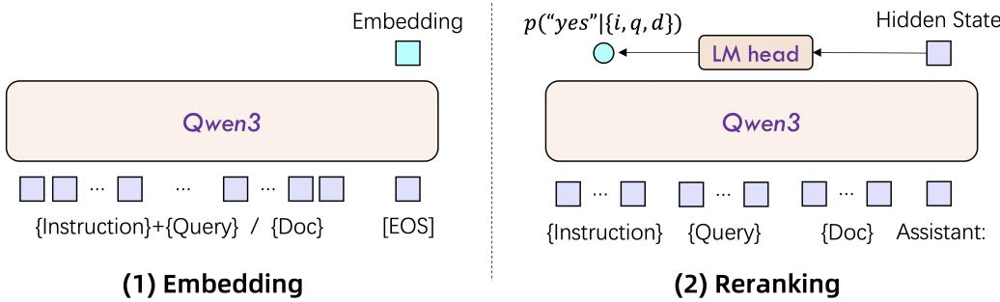
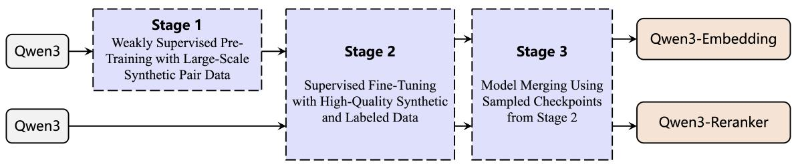

# Qwen3 Embedding: Advancing Text Embedding and Reranking Through Foundation Models

Yanzhao Zhang\* Mingxin $\mathrm { L i ^ { * } }$ Dingkun Long\* Xin Zhang\* Huan Lin Baosong Yang Pengjun Xie An Yang Dayiheng Liu Junyang Lin Fei Huang Jingren Zhou Tongyi Lab Alibaba Group

https://huggingface.co/Qwen https://modelscope.cn/organization/qwen https://github.com/QwenLM/Qwen3-Embedding

# Abstract

In this work, we introduce the Qwen3 Embedding series, a significant advancement over its predecessor, the GTE-Qwen series, in text embedding and reranking capabilities, built upon the Qwen3 foundation models. Leveraging the Qwen3 LLMs’ robust capabilities in multilingual text understanding and generation, our innovative multistage training pipeline combines large-scale unsupervised pre-training with supervised fine-tuning on high-quality datasets. Effective model merging strategies further ensure the robustness and adaptability of the Qwen3 Embedding series. During the training process, the Qwen3 LLMs serve not only as backbone models but also play a crucial role in synthesizing high-quality, rich, and diverse training data across multiple domains and languages, thus enhancing the training pipeline. The Qwen3 Embedding series offers a spectrum of model sizes (0.6B, 4B, 8B) for both embedding and reranking tasks, addressing diverse deployment scenarios where users can optimize for either efficiency or effectiveness. Empirical evaluations demonstrate that the Qwen3 Embedding series achieves state-of-the-art results across diverse benchmarks. Notably, it excels on the multilingual evaluation benchmark MTEB for text embedding, as well as in various retrieval tasks, including code retrieval, cross-lingual retrieval and multilingual retrieval. To facilitate reproducibility and promote community-driven research and development, the Qwen3 Embedding models are publicly available under the Apache 2.0 license.

# 1 Introduction

Text embedding and reranking are fundamental components in numerous natural language processing and information retrieval applications, including web search, question answering, recommendation systems, and beyond (Karpukhin et al., 2020; Huang et al., 2020; Zhao et al., 2023; 2024). High-quality embeddings enable models to capture semantic relationships between texts, while effective reranking mechanisms ensure that the most relevant results are prioritized. Recently, emerging application paradigms such as Retrieval-Augmented Generation (RAG) and agent systems, driven by the advancement of large language models (e.g., Qwen3 (Yang et al., 2025), GPT-4o (Hurst et al., 2024)), have introduced new requirements and challenges for text embedding and reranking, both in terms of model training paradigms and application scenarios. Despite significant advancements, training embedding and reranking models that perform well in scalability, contextual understanding, and alignment with specific downstream tasks remains challenging.

The emergence of large language models (LLMs) has significantly advanced the development of text embedding and reranking models. Prior to the introduction of LLMs, the predominant approach involved using encoder-only pretrained language models like BERT as the foundational model for training (Reimers & Gurevych, 2019). The richer world knowledge, text understanding, and reasoning abilities inherent in LLMs have led to further enhancements in models trained on these architectures. Additionally, there has been considerable research facilitating the integration of LLMs into processes such as training data synthesis and quality data filtering (Wang et al., 2024; Lee et al., 2024; 2025b). The fundamental characteristics of LLMs have also inspired the introduction of new training paradigms. For instance, during the embedding model training process, incorporating differentiated tasks across aspects such as instruction type, domain, and language has yielded improved performance in downstream tasks (Su et al., 2023). Similarly, for reranking model training, advancements have been realized through both zero-shot methods based on user prompts and approaches combining supervised fine-tuning (Ma et al., 2023; Pradeep et al., 2023; Zhang et al., 2024a; Zhuang et al., 2024).

In this work, we introduce the Qwen3 Embedding series models, which are constructed on top of the Qwen3 foundation models. The Qwen3 foundation has simultaneously released base and instruct model versions, and we exploit the robust multilingual text understanding and generation capabilities of these models to fully realize their potential in training embedding and reranking models. To train the embedding models, we implement a multi-stage training pipeline that involves large-scale unsupervised pre-training followed by supervised fine tuning on high-quality datasets. We also employ model merging with various model checkpoints to enhance robustness and generalization. The Qwen3 instruct model allows for efficient synthesis of a vast, high-quality, multilingual, and multi-task text relevance dataset. This synthetic data is utilized in the initial unsupervised training stage, while a subset of high-quality, small-scale data is selected for the second stage of supervised training. For the reranking models, we adopt a two-stage training scheme in a similar manner, consisting of high-quality supervised fine tuning and a model merging stage. Based on different sizes of the Qwen3 backbone models (including 0.6B, 4B, and 8B), we ultimately trained three text embedding models and three text reranking models. To facilitate their application in downstream tasks, the Qwen3 Embedding series supports several practical features, such as flexible dimension representation for embedding models and customizable instructions for both embedding and reranking models.

We evaluate the Qwen3 Embedding series across a comprehensive set of benchmarks spanning multiple tasks and domains. Experimental results demonstrate that our embedding and reranking models achieve state-of-the-art performance, performing competitively against leading proprietary models in several retrieval tasks. For example, the flagship model Qwen3-8B-Embedding attains a score of 70.58 on the MTEB Multilingual benchmark (Enevoldsen et al., 2025) and 80.68 on the MTEB Code benchmark (Enevoldsen et al., 2025), surpassing the previous state-of-the-art proprietary embedding model, Gemini-Embedding (Lee et al., 2025b). Moreover, our reranking model delivers competitive results across a range of retrieval tasks. The Qwen3-Reranker-0.6B model exceeds previously top-performing models in numerous retrieval tasks, while the larger Qwen3-Reranker-8B model demonstrates even superior performance, improving ranking results by 3.0 points over the 0.6B model across multiple tasks. Furthermore, we include a constructive ablation study to elucidate the key factors contributing to the superior performance of the Qwen3 Embedding series, providing insights into its effectiveness.

In the following sections, we describe the design of the model architecture, detail the training procedures, present the experimental results for both the embedding and reranking models of the Qwen3 Embedding Series, and conclude this technical report by summarizing the key findings and outlining potential directions for future research.

# 2 Model Architecture

The core idea behind embedding and reranking models is to evaluate relevance in a task-aware manner. Given a query $q$ and a document $d ,$ embedding and reranking models assess their relevance based on a similarity criterion defined by instruction $I$ . To enable the models for task-aware relevance estimation, training data is often organized as $\{ I _ { i } , q _ { i } , d _ { i } ^ { + } , d _ { i , 1 } ^ { - } , \cdot \cdot \cdot , d _ { i , n } ^ { - } \} ,$ , where $d _ { i } ^ { + }$ represents a positive (relevant) document for query $q _ { i } ,$ and $d _ { i , j } ^ { - }$ are negative (irrelevant) documents. Training the model on diverse text pairs broadens its applicability to a range of downstream tasks, including retrieval, semantic textual similarity, classification, and clustering.

  
Figure 1: Model architecture of Qwen3-Embedding (left) and Qwen3-Reranker (right).

Architecture The Qwen3 embedding and reranking models are built on the dense version of Qwen3 foundation models and are available in three sizes: 0.6B, 4B, and 8B parameters. We initialize these models using the Qwen3 foundation models to leverage their capabilities in text modeling and instruction following. The model layers, hidden size, and context length for each model configuration are detailed in Table 1.

Embedding Models For text embeddings, we utilize LLMs with causal attention, appending an [EOS] token at the end of the input sequence. The final embedding is derived from the hidden state of the last layer corresponding to this [EOS] token.

To ensure embeddings follow instructions during downstream tasks, we concatenate the instruction and the query into a single input context, while leaving the document unchanged before processing with LLMs. The input format for queries is as follows:

{Instruction} {Query}<|endoftext|>

Reranking Models To more accurately evaluate text similarity, we employ LLMs for point-wise reranking within a single context. Similar to the embedding model, to enable instruction-following capability, we include the instruction in the input context. We use the LLM chat template and frame the similarity assessment task as a binary classification problem. The input to LLMs adheres to the template shown below:

<table><tr><td>Model Type</td><td>Models</td><td>Size</td><td>Layers</td><td>Sequence Length</td><td>Embedding Dimension</td><td>MRL Support</td><td>Instruction Aware</td></tr><tr><td>Text Embedding</td><td>Qwen3-Embedding-0.6B Qwen3-Embedding-4B Qwen3-Embedding-8B</td><td>0.6B 4B 8B</td><td>28 36 36</td><td>32K 32K 32K</td><td>1024 2560 4096</td><td>Yes Yes Yes</td><td>Yes Yes Yes</td></tr><tr><td>Text Reranking</td><td>Qwen3-Reranker-0.6B Qwen3-Reranker-4B Qwen3-Reranker-8B</td><td>0.6B 4B 8B</td><td>28 36 36</td><td>32K 32K 32K</td><td>- =</td><td>1</td><td>Yes Yes Yes</td></tr></table>

Table 1: Model architecture of Qwen3 Embedding models. “MRL Support” indicates whether the embedding model supports custom dimensions for the final embedding. “Instruction Aware” notes whether the embedding or reranker model supports customizing the input instruction according to different tasks.

  
Figure 2: Training pipeline of Qwen3 Embedding and Reranking models.

To calculate the relevance score based on the given input, we assess the likelihood of the next token being ”yes” or ${ } ^ { \prime \prime } \mathrm { n o }$ .” This is expressed mathematically as follows:

$$
\mathrm { s c o r e } ( q , d ) = \frac { e ^ { P ( \mathrm { y e s } | I , q , d ) } } { e ^ { P ( \mathrm { y e s } | I , q , d ) } + e ^ { P ( \mathrm { n o } | I , q , d ) } }
$$

# 3 Models Training

In this section, we describe the multi-stage training pipeline adopted and present the key elements of this training recipe, including training objective, training data synthesis, and filtering of high-quality training data.

# 3.1 Training Objective

Before introducing our training pipeline, we first outline the optimized loss functions used for the embedding and reranking models during the training process. For the embedding model, we utilize an improved contrastive loss based on the InfoNCE framework (Oord et al., 2018). Given a batch of $N$ training instances, the loss is defined as:

$$
L _ { \mathrm { e m b e d d i n g } } = - \frac { 1 } { N } \sum _ { i } ^ { N } \log \frac { e ^ { ( s ( q _ { i } , d _ { i } ^ { + } ) / \tau ) } } { Z _ { i } } ,
$$

where $s ( \cdot , \cdot )$ is a similarity function (we use cosine similarity), $\tau$ is a temperature parameter, and $Z _ { i }$ is the normalization factor that aggregates the similarity scores of the positive pair against various negative pairs:

$$
Z _ { i } = e ^ { ( s ( q _ { i } , d _ { i } ^ { + } ) / \tau ) } + \sum _ { k } ^ { K } m _ { i k } e ^ { ( s ( q _ { i } , d _ { i , k } ^ { - } ) / \tau ) } + \sum _ { j \neq i } m _ { i j } e ^ { ( s ( q _ { i } , q _ { j } ) / \tau ) } + \sum _ { j \neq i } m _ { i j } e ^ { ( s ( d _ { i } ^ { + } , d _ { j } ) / \tau ) } + \sum _ { j \neq i } m _ { i j } e ^ { ( s ( q _ { i } , d _ { j } ) / \tau ) }
$$

where these terms represent similarities with: (1) the positive document $d _ { i } ^ { + }$ , (2) $K$ hard negatives $d _ { i , k } ^ { - } ,$ (3) other in-batch queries $q _ { j } ,$ (4) other in-batch documents $d _ { j }$ compared against the positive document $d _ { i } ^ { + }$ . (5) other in-batch documents $d _ { j }$ compared against the query $q _ { i }$ . The mask factor $m _ { i j }$ is designed to mitigate the impact of false negatives and is defined as:

$$
m _ { i j } = \left\{ \begin{array} { l l } { { 0 } } & { { \mathrm { i f } s _ { i j } > s ( q _ { i } , d _ { i } ^ { + } ) + 0 . 1 \mathrm { o r } d _ { j } = = d _ { i } ^ { + } , } } \\ { { 1 } } & { { \mathrm { o t h e r w i s e , } } } \end{array} \right.
$$

among which $s _ { i j }$ is the corresponding score of $q _ { i } , d _ { j }$ or $q _ { i } , q _ { j }$ .

For the reranking model, we optimize the Supervised Fine-Tuning (SFT) loss defined as:

$$
L _ { \mathrm { r e r a n k i n g } } = - \log p ( l | \mathcal { P } ( q , d ) ) ,
$$

where $p ( \cdot | * )$ denotes the probability assigned by LLM. The label $l$ is “yes” for positive documents and $" \mathrm { n o } ^ { \prime \prime }$ for negatives. This loss function encourages the model to assign higher probabilities to correct labels, thereby improving the ranking performance.

# 3.2 Multi-stage Training

The multi-stage training approach is a common practice for training text embedding models (Li et al., 2023; Wang et al., 2022; Chen et al., 2024). This strategy typically begins with initial training on largescale, semi-supervised data that includes noise, followed by fine-tuning using smaller, high-quality supervised datasets. This two-step process enhances the performance and generalization capabilities of embedding models. Large-scale weakly supervised training data contribute significantly to the model’s generalization, while fine-tuning with high-quality data in subsequent stages further improves model performance. Both stages of training for embedding models utilize the optimization objective defined in Equation 1, whereas the reranking model training employs the loss function defined in Equation 2 as the optimization target.

Building upon the existing multi-stage training framework, the Qwen3 Embedding series introduces the following key innovations:

• Large-Scale Synthetic Data-Driven Weak Supervision Training: Unlike previous works (e.g., GTE, E5, BGE models), where weakly supervised training data are primarily collected from open-source communities such as Q&A forums or academic papers, we propose leveraging the text understanding and generation capabilities of foundation models to synthesize pair data directly. This approach allows for arbitrary definition of various dimensions of the desired pair data, such as task, language, length, and difficulty within the synthesis prompts. Compared to data collection from open-domain sources, foundation model-driven data synthesis offers greater controllability, enabling precise management of the quality and diversity of the generated data, particularly in low-resource scenarios and languages.   
• High-Quality Synthetic Data Utilization in Supervised Fine Tuning: Due to the exceptional performance of the Qwen3 Foundation model, the synthesized data is of notably high quality. Therefore, in the second stage of supervised training, selective incorporation of this highquality synthetic data further enhances the overall model performance and generalization capabilities.   
• Model Merging: Inspired by previous work (Li et al., 2024), after completing the supervised fine-tuning, we applied a model merging technique based on spherical linear interpolation (slerp). This technique involves merging multiple model checkpoints saved during the fine-tuning process. This step aims to boost the model’s robustness and generalization performance across various data distributions.

It is important to note that the reranking model’s training process does not include a first-stage weakly supervised training phase.

# 3.3 Synthetic Dataset

To create a robust synthetic dataset for training models on various similarity tasks, we generate diverse text pairs spanning categories such as retrieval, bitext mining, classification, and semantic textual similarity (STS). The quality of these synthetic data pairs is ensured by utilizing the Qwen3- 32B model as the foundational model for data synthesis. We have designed a diverse prompting strategy to improve the variety and authenticity of the generated data. For instance, in the text retrieval task, we synthesize data using the multilingual pre-training corpus from Qwen3. During the data synthesis process, specific roles are assigned to each document to simulate potential users querying that document. This injection of user perspectives enhances the diversity and realism of the synthetic queries. Specifically, we utilize a retrieval model to identify the top five role candidates for each document from a role library and present these documents along with their role candidates to the prompt. This guides the model in outputting the most suitable role configuration for query generation. Moreover, the prompt incorporates various dimensions such as query type (e.g., keyword, factual, summary, judgment), query length, difficulty, and language. This multidimensional approach ensures the quality and diversity of the synthetic data.

Finally, we create a total of approximately 150 million pairs of multi-task weak supervision training data. Our experiments reveal that the embedding model trained with these synthetic data performs exceptionally well in downstream evaluations, particularly surpassing many previously supervised models in the MTEB Multilingual benchmarks. This motivates us to filter the synthetic data to identify high-quality pairs for inclusion in a second stage of supervised training. We employ a simple cosine similarity calculation to select data pairs, retaining those with a cosine similarity greater than 0.7 from randomly sampled data. Ultimately, approximately 12 million high-quality supervised training data pairs are selected for further training.

<table><tr><td>Model</td><td>Size</td><td>Mean (Task)</td><td>Mean (Type)</td><td>Bitext Mining ification tering Retrieval</td><td>Class-</td><td>Clus-</td><td>Inst.</td><td>Multilabel Class.</td><td>Pair Class.</td><td>Rerank Retrieval STS</td><td></td><td></td></tr><tr><td colspan="10">Selected Open-Source Models</td></tr><tr><td>NV-Embed-v2</td><td>7B</td><td>56.29</td><td>49.58</td><td>57.84</td><td>57.29</td><td>40.80</td><td>1.04</td><td>18.63</td><td>78.94</td><td>63.82</td><td>56.72</td><td>71.10</td></tr><tr><td>GritLM-7B</td><td>7B</td><td>60.92</td><td>53.74</td><td>70.53</td><td>61.83</td><td>49.75</td><td>3.45</td><td>22.77</td><td>79.94</td><td>63.78</td><td>58.31</td><td>73.33</td></tr><tr><td>BGE-M3</td><td>0.6B</td><td>59.56</td><td>52.18</td><td>79.11</td><td>60.35</td><td>40.88</td><td>-3.11</td><td>20.1</td><td>80.76</td><td>62.79</td><td>54.60</td><td>74.12</td></tr><tr><td>multilingual-e5-large-instruct</td><td>0.6B</td><td>63.22</td><td>55.08</td><td>80.13</td><td>64.94</td><td>50.75</td><td>-0.40</td><td>22.91</td><td>80.86</td><td>62.61</td><td>57.12</td><td>76.81</td></tr><tr><td>gte-Qwen2-1.5B-instruct</td><td>1.5B</td><td>59.45</td><td>52.69</td><td>62.51</td><td>58.32</td><td>52.05</td><td>0.74</td><td>24.02</td><td>81.58</td><td>62.58</td><td>60.78</td><td>71.61</td></tr><tr><td>gte-Qwen2-7b-Instruct</td><td>7B</td><td>62.51</td><td>55.93</td><td>73.92</td><td>61.55</td><td>52.77</td><td>4.94</td><td>25.48</td><td>85.13</td><td>65.55</td><td>60.08</td><td>73.98</td></tr><tr><td colspan="10">Commercial APIs</td><td></td><td></td><td></td></tr><tr><td>text-embedding-3-large</td><td></td><td>58.93</td><td>51.41</td><td>62.17</td><td>60.27</td><td>46.89</td><td>-2.68</td><td>22.03</td><td>79.17</td><td>63.89</td><td>59.27</td><td>71.68</td></tr><tr><td>Cohere-embed-multilingual-v3.0</td><td></td><td>61.12</td><td>53.23</td><td>70.50</td><td>62.95</td><td>46.89</td><td>-1.89</td><td>22.74</td><td>79.88</td><td>64.07</td><td>59.16</td><td>74.80</td></tr><tr><td>Gemini Embedding</td><td></td><td>68.37</td><td>59.59</td><td>79.28</td><td>71.82</td><td>54.59</td><td>5.18</td><td>29.16</td><td>83.63</td><td>65.58</td><td>67.71</td><td>79.40</td></tr><tr><td colspan="10">Qwen3 Embedding Models</td></tr><tr><td>Qwen3-Embedding-0.6B</td><td>0.6B</td><td>64.33</td><td>56.00</td><td>72.22</td><td>66.83</td><td>52.33</td><td>5.09</td><td>24.59</td><td>80.83</td><td>61.41</td><td>64.64</td><td>76.17</td></tr><tr><td>Qwen3-Embedding-4B</td><td>4B</td><td>69.45</td><td>60.86</td><td>79.36</td><td>72.33</td><td>57.15</td><td>11.56</td><td>26.77</td><td>85.05</td><td>65.08</td><td>69.60</td><td>80.86</td></tr><tr><td>Qwen3-Embedding-8B</td><td>8B</td><td>70.58</td><td>61.69</td><td>80.89</td><td>74.00</td><td>57.65</td><td>10.06</td><td>28.66</td><td>86.40</td><td>65.63</td><td>70.88</td><td>81.08</td></tr></table>

Table 2: Performance on MTEB Multilingual (Enevoldsen et al., 2025). For compared models, the scores are retrieved from MTEB online leaderboard on June 4th, 2025.

# 4 Evaluation

We conduct comprehensive and fair evaluations across multiple benchmarks to assess the capabilities of Qwen3 Embedding models.

# 4.1 Settings

For the text embedding models, we utilize the Massive Multilingual Text Embedding Benchmark (MMTEB) (Enevoldsen et al., 2025) for evaluation. MMTEB is a large-scale, community-driven expansion of MTEB (Muennighoff et al., 2023), covering over 500 quality-controlled evaluation tasks across more than 250 languages. In addition to classic text tasks such as as a variety of retrieval, classification, and semantic textual similarity, MMTEB includes a diverse set of challenging and novel tasks, such as instruction following, long-document retrieval, and code retrieval, representing the largest multilingual collection of evaluation tasks for embedding models to date. Our MMTEB evaluations encompass 216 individual evaluation tasks, consisting of 131 tasks for MTEB (Multilingual) (Enevoldsen et al., 2025), 41 tasks for MTEB (English, v2) (Muennighoff et al., 2023), 32 tasks for CMTEB (Xiao et al., 2024), and 12 code retrieval tasks for MTEB (Code) (Enevoldsen et al., 2025).

Table 3: Performance on MTEB Engilish, MTEB Chinese, MTEB Code. αTaken from (Enevoldsen et al., 2025). γTaken from (Lee et al., 2025b). For other compared models, the scores are retrieved from MTEB online leaderboard on June 4th, 2025.   

<table><tr><td>Model</td><td>Size|Dim</td><td></td><td>MTEB (Eng, v2)</td><td colspan="2">CMTEB</td><td>MTEB (Code)</td></tr><tr><td colspan="7">|Mean (Task) Mean (Type)|Mean (Task) Mean (Type)|</td></tr><tr><td colspan="7">Selected Open-Source Models</td></tr><tr><td>NV-Embed-v2</td><td>7B</td><td>|4096 69.81</td><td>65.00</td><td>63.0</td><td>62.0</td><td></td></tr><tr><td>GritLM-7B</td><td>7B</td><td>4096</td><td>67.07 63.22 61.21</td><td>- -</td><td>1</td><td>73.6a</td></tr><tr><td>multilingual-e5-large-instruct</td><td>0.6B</td><td>1024</td><td>65.53</td><td></td><td>1</td><td>65.0a</td></tr><tr><td>gte-Qwen2-1.5b-instruct gte-Qwen2-7b-instruct</td><td>1.5B</td><td>1536</td><td>67.20 63.26 70.72</td><td>67.12</td><td>67.79</td><td>56.417</td></tr><tr><td></td><td>7B</td><td>3584</td><td>65.77</td><td>71.62</td><td>72.19</td><td></td></tr><tr><td colspan="7">Commercial APIs 66.43</td></tr><tr><td>text-embedding-3-large</td><td></td><td>3072</td><td>62.15</td><td></td><td></td><td>58.957</td></tr><tr><td>cohere-embed-multilingual-v3.0 Gemini Embedding</td><td></td><td>1024</td><td>66.01 61.43</td><td></td><td></td><td>51.94Y</td></tr><tr><td></td><td></td><td>3072</td><td>73.30 67.67</td><td></td><td></td><td>74.66Y</td></tr><tr><td colspan="7">Qwen3 Embedding Models</td></tr><tr><td>Qwen3-Embedding-0.6B</td><td>0.6B</td><td>1024</td><td>70.70 64.88</td><td>66.33 72.26</td><td>67.44</td><td>75.41</td></tr><tr><td>Qwen3-Embedding-4B</td><td>4B</td><td>2560</td><td>74.60</td><td>68.09</td><td>73.50</td><td>80.06</td></tr><tr><td>Qwen3-Embedding-8B</td><td>8B</td><td>4096</td><td>75.22</td><td>68.70 73.83</td><td>75.00</td><td>80.68</td></tr></table>

Moreover, we select a series of text retrieval tasks to assess the text reranking capabilities of our models. We explore three types of retrieval tasks: (1) Basic Relevance Retrieval, categorized into English, Chinese, and Multilingual, evaluated on MTEB (Muennighoff et al., 2023), CMTEB (Xiao et al., 2024), MMTEB (Enevoldsen et al., 2025), and MLDR (Chen et al., 2024), respectively; (2) Code Retrieval, evaluated on MTEB-Code (Enevoldsen et al., 2025), which comprises only code-related retrieval data.; and (3) Complex Instruction Retrieval, evaluated on FollowIR (Weller et al., 2024).

Compared Methods We compare our models with the most prominent open-source text embedding models and commercial API services. The open-source models include the GTE (Li et al., 2023; Zhang et al., 2024b), E5 (Wang et al., 2022), and BGE (Xiao et al., 2024) series, as well as NVEmbed-v2 (Lee et al., 2025a), GritLM-7B Muennighoff et al. (2025). The commercial APIs evaluated are text-embedding-3-large from OpenAI, Gemini-embedding from Google, and Cohere-embedmultilingual- $\cdot \mathrm { v } 3 . 0$ . For reranking, we compare with the rerankers of jina1, mGTE (Zhang et al., 2024b) and BGE- $\mathbf { \cdot m } 3$ (Chen et al., 2024).

# 4.2 Main Results

Embedding In Table 2, we present the evaluation results on MMTEB (Enevoldsen et al., 2025), which comprehensively covers a wide range of embedding tasks across multiple languages. Our Qwen3-Embedding-4B/8B models achieve the best performance, and our smallest model, Qwen3- Embedding-0.6B, only lags behind the best-performing baseline method (Gemini-Embedding), despite having only 0.6B parameters. In Table 3, we present the evaluation results on MTEB (English, v2) (Muennighoff et al., 2023), CMTEB (Xiao et al., 2024), and MTEB (Code) (Enevoldsen et al., 2025). The scores reflect similar trends as MMTEB, with our Qwen3-Embedding-4B/8B models consistently outperforming others. Notably, the Qwen3-Embedding-0.6B model ranks just behind the Gemini-Embedding, while being competitive with the gte-Qwen2-7B-instruct.

Table 4: Evaluation results for reranking models. We use the retrieval subsets of MTEB(eng, v2), MTEB(cmn, v1) and MMTEB, which are MTEB-R, CMTEB-R and MMTEM-R. The rest are all retrieval tasks. All scores are our runs based on the retrieval top-100 results from the first row.   

<table><tr><td></td><td colspan="5">Basic Relevance Retrieval</td><td></td></tr><tr><td>Model</td><td></td><td colspan="5">Param|MTEB-R CMTEB-R MMTEB-R MLDR MTEB-Code FollowIR</td></tr><tr><td>Qwen3-Embedding-0.6B</td><td>0.6B</td><td>61.82</td><td>64.64</td><td>50.26</td><td>75.41</td><td>5.09</td></tr><tr><td>Jina-multilingual-reranker-v2-base</td><td>0.3B</td><td>58.22</td><td>63.73</td><td>39.66</td><td>58.98</td><td>-0.68</td></tr><tr><td>gte-multilingual-reranker-base</td><td>0.3B</td><td>59.51</td><td>59.44</td><td>66.33</td><td>54.18</td><td>-1.64</td></tr><tr><td>BGE-reranker-v2-m3</td><td>0.6B</td><td>57.03</td><td>58.36</td><td>59.51</td><td>41.38</td><td>-0.01</td></tr><tr><td>Qwen3-Reranker-0.6B</td><td>0.6B</td><td>65.80</td><td>66.36</td><td>67.28</td><td>73.42</td><td>5.41</td></tr><tr><td>Qwen3-Reranker-4B</td><td>4B</td><td>69.76</td><td>72.74</td><td>69.97</td><td>81.20</td><td>14.84</td></tr><tr><td>Qwen3-Reranker-8B</td><td>8B</td><td>69.02</td><td>75.94 77.45 72.94</td><td>70.19</td><td>81.22</td><td>8.05</td></tr></table>

<table><tr><td>Model</td><td>MMTEB</td><td>|MTEB (Eng,v2)|</td><td>CMTEB</td><td>|MTEB (Code, v1)</td></tr><tr><td>Qwen3-Embedding-0.6B w/ only synthetic data</td><td>58.49</td><td>60.63</td><td>59.78</td><td>66.79</td></tr><tr><td>Qwen3-Embedding-0.6B w/o synthetic data</td><td>61.21</td><td>65.59</td><td>63.37</td><td>74.58</td></tr><tr><td>Qwen3-Embedding-0.6B w/o model merge</td><td>62.56</td><td>68.18</td><td>64.76</td><td>74.89</td></tr><tr><td>Qwen3-Embedding-0.6B</td><td>64.33</td><td>70.70</td><td>66.33</td><td>75.41</td></tr></table>

Table 5: Performance (mean task) on MMTEB, MTEB(eng, v2), CMTEB and MTEB(code, v1) for Qwen3-Embedding-0.6B model with different training setting.

Reranking In Table 4, we present the evaluation results on various reranking tasks (§4.1). We utilize the Qwen3-Embedding-0.6B model to retrieve the top-100 candidates and then apply different reranking models for further refinement. This approach ensures a fair evaluation of the reranking models. Our results indicate that all three Qwen3-Reranker models enhance performance compared to the embedding model and surpass all baseline reranking methods, with Qwen3-Reranker-8B achieving the highest performance across most tasks.

# 4.3 Analysis

To further analyze and explore the key elements of the Qwen3 Embedding model training framework, we conduct an analysis from the following dimensions:

Effectiveness of Large-Scale Weakly Supervised Pre-Training We first analyze the effectiveness of the large-scale weak supervised training stage for the embedding models. As shown in Table 5, the Qwen3-Embedding- $\cdot 0 . 6 \mathrm { B }$ model trained solely on synthetic data (without subsequent training stages, as indicated in the first row) achieves reasonable and strong performance compared to the final Qwen3-Embedding-0.6B model (as shown in the last row). If we further remove the weak supervised training stage (i.e., without synthetic data training, as seen in the second row), the final performance shows a clear decline. This indicates that the large-scale weak supervised training stage is crucial for achieving superior performance.

Effectiveness of Model Merging Next, we compare the performance differences arising from the model merging stage. As shown in Table 5, the model trained without model merging techniques (the third row, which uses data sampling to balance various tasks) performs considerably worse than the final Qwen3-Embedding-0.6B model (which employs model merging, as shown in the last row). This indicates that the model merging stage is also critical for developing strong models.

# 5 Conclusion

In this technical report, we present the Qwen3-Embedding series, a comprehensive suite of text embedding and reranking models based on the Qwen3 foundation models. These models are designed to excel in a wide range of text embedding and reranking tasks, including multilingual retrieval, code retrieval, and complex instruction following. The Qwen3-Embedding models are built upon a robust multi-stage training pipeline that combines large-scale weakly supervised pre-training on synthetic data with supervised fine-tuning and model merging on high-quality datasets. The Qwen3 LLMs play a crucial role in synthesizing diverse training data across multiple languages and tasks, thereby enhancing the models’ capabilities. Our comprehensive evaluations demonstrate that the Qwen3-Embedding models achieve state-of-the-art performance across various benchmarks, including MTEB, CMTEB, MMTEB, and several retrieval benchmarks. We are pleased to open-source the Qwen3-Embedding and Qwen3-Reranker models (0.6B, 4B, and 8B), making them available for the community to use and build upon.

# References

Jianlyu Chen, Shitao Xiao, Peitian Zhang, Kun Luo, Defu Lian, and Zheng Liu. M3-embedding: Multi-linguality, multi-functionality, multi-granularity text embeddings through self-knowledge distillation. In Findings of the Association for Computational Linguistics: ACL 2024, pp. 2318–2335, Bangkok, Thailand, August 2024. Association for Computational Linguistics. URL https:// aclanthology.org/2024.findings-acl.137/.   
Kenneth Enevoldsen, Isaac Chung, Imene Kerboua, Marton Kardos, Ashwin Mathur, David Stap, ´ Jay Gala, Wissam Siblini, Dominik Krzeminski, Genta Indra Winata, et al. MMTEB: Massive ´ multilingual text embedding benchmark. In The Thirteenth International Conference on Learning Representations, 2025. URL https://openreview.net/forum?id=zl3pfz4VCV.   
Tao Ge, Xin Chan, Xiaoyang Wang, Dian Yu, Haitao Mi, and Dong Yu. Scaling synthetic data creation with 1,000,000,000 personas. arXiv preprint arXiv:2406.20094, 2024.   
Jui-Ting Huang, Ashish Sharma, Shuying Sun, Li Xia, David Zhang, Philip Pronin, Janani Padmanabhan, Giuseppe Ottaviano, and Linjun Yang. Embedding-based retrieval in facebook search. In Proceedings of the 26th ACM SIGKDD International Conference on Knowledge Discovery & Data Mining, pp. 2553–2561, 2020.   
Aaron Hurst, Adam Lerer, Adam P Goucher, Adam Perelman, Aditya Ramesh, Aidan Clark, AJ Ostrow, Akila Welihinda, Alan Hayes, Alec Radford, et al. Gpt-4o system card. arXiv preprint arXiv:2410.21276, 2024.   
Vladimir Karpukhin, Barlas Oguz, Sewon Min, Patrick SH Lewis, Ledell Wu, Sergey Edunov, Danqi Chen, and Wen-tau Yih. Dense passage retrieval for open-domain question answering. In EMNLP (1), pp. 6769–6781, 2020.   
Chankyu Lee, Rajarshi Roy, Mengyao Xu, Jonathan Raiman, Mohammad Shoeybi, Bryan Catanzaro, and Wei Ping. Nv-embed: Improved techniques for training llms as generalist embedding models. arXiv preprint arXiv:2405.17428, 2024.   
Chankyu Lee, Rajarshi Roy, Mengyao Xu, Jonathan Raiman, Mohammad Shoeybi, Bryan Catanzaro, and Wei Ping. NV-embed: Improved techniques for training LLMs as generalist embedding models. In The Thirteenth International Conference on Learning Representations, 2025a. URL https: //openreview.net/forum?id=lgsyLSsDRe.   
Jinhyuk Lee, Feiyang Chen, Sahil Dua, Daniel Cer, Madhuri Shanbhogue, Iftekhar Naim, Gustavo Hernandez ´ Abrego, Zhe Li, Kaifeng Chen, Henrique Schechter Vera, et al. Gemini embedding: ´ Generalizable embeddings from gemini. arXiv preprint arXiv:2503.07891, 2025b.

Mingxin Li, Zhijie Nie, Yanzhao Zhang, Dingkun Long, Richong Zhang, and Pengjun Xie. Improving general text embedding model: Tackling task conflict and data imbalance through model merging. arXiv preprint arXiv:2410.15035, 2024.

Zehan Li, Xin Zhang, Yanzhao Zhang, Dingkun Long, Pengjun Xie, and Meishan Zhang. Towards general text embeddings with multi-stage contrastive learning, 2023. URL https://arxiv.org/ abs/2308.03281.

Xueguang Ma, Xinyu Zhang, Ronak Pradeep, and Jimmy Lin. Zero-shot listwise document reranking with a large language model. arXiv preprint arXiv:2305.02156, 2023.

Niklas Muennighoff, Nouamane Tazi, Loic Magne, and Nils Reimers. MTEB: Massive text embedding benchmark. In Proceedings of the 17th Conference of the European Chapter of the Association for Computational Linguistics, pp. 2014–2037, Dubrovnik, Croatia, May 2023. Association for Computational Linguistics. URL https://aclanthology.org/2023.eacl-main.148/.

Niklas Muennighoff, Hongjin SU, Liang Wang, Nan Yang, Furu Wei, Tao Yu, Amanpreet Singh, and Douwe Kiela. Generative representational instruction tuning. In The Thirteenth International Conference on Learning Representations, 2025. URL https://openreview.net/forum?id $\cdot ^ { = }$ BC4lIvfSzv.

Aaron van den Oord, Yazhe Li, and Oriol Vinyals. Representation learning with contrastive predictive coding. arXiv preprint arXiv:1807.03748, 2018.

Ronak Pradeep, Sahel Sharifymoghaddam, and Jimmy Lin. Rankvicuna: Zero-shot listwise document reranking with open-source large language models. arXiv preprint arXiv:2309.15088, 2023.

Nils Reimers and Iryna Gurevych. Sentence-BERT: Sentence embeddings using Siamese BERTnetworks. In Proceedings of the 2019 Conference on Empirical Methods in Natural Language Processing and the 9th International Joint Conference on Natural Language Processing (EMNLP-IJCNLP), pp. 3982–3992, Hong Kong, China, November 2019. Association for Computational Linguistics. URL https://aclanthology.org/D19-1410/.

Hongjin Su, Weijia Shi, Jungo Kasai, Yizhong Wang, Yushi Hu, Mari Ostendorf, Wen-tau Yih, Noah A Smith, Luke Zettlemoyer, and Tao Yu. One embedder, any task: Instruction-finetuned text embeddings. In Findings of the Association for Computational Linguistics: ACL 2023, pp. 1102–1121, 2023.

Liang Wang, Nan Yang, Xiaolong Huang, Binxing Jiao, Linjun Yang, Daxin Jiang, Rangan Majumder, and Furu Wei. Text embeddings by weakly-supervised contrastive pre-training, 2022. URL https://arxiv.org/abs/2212.03533.

Liang Wang, Nan Yang, Xiaolong Huang, Linjun Yang, Rangan Majumder, and Furu Wei. Improving text embeddings with large language models. In Proceedings of the 62nd Annual Meeting of the Association for Computational Linguistics (Volume 1: Long Papers), pp. 11897–11916, Bangkok, Thailand, August 2024. Association for Computational Linguistics. URL https: //aclanthology.org/2024.acl-long.642/.

Orion Weller, Benjamin Chang, Sean MacAvaney, Kyle Lo, Arman Cohan, Benjamin Van Durme, Dawn Lawrie, and Luca Soldaini. Followir: Evaluating and teaching information retrieval models to follow instructions. arXiv preprint arXiv:2403.15246, 2024.

Shitao Xiao, Zheng Liu, Peitian Zhang, Niklas Muennighoff, Defu Lian, and Jian-Yun Nie. C-pack: Packed resources for general chinese embeddings. In Proceedings of the 47th International ACM SIGIR Conference on Research and Development in Information Retrieval, SIGIR ’24, pp. 641–649, New York, NY, USA, 2024. Association for Computing Machinery. URL https://doi.org/10.1145/ 3626772.3657878.

An Yang, Anfeng Li, Baosong Yang, Beichen Zhang, Binyuan Hui, Bo Zheng, Bowen Yu, Chang Gao, Chengen Huang, Chenxu Lv, et al. Qwen3 technical report. arXiv preprint arXiv:2505.09388, 2025.

Longhui Zhang, Yanzhao Zhang, Dingkun Long, Pengjun Xie, Meishan Zhang, and Min Zhang. A two-stage adaptation of large language models for text ranking. In Findings of the Association for Computational Linguistics ACL 2024, pp. 11880–11891, 2024a.

Xin Zhang, Yanzhao Zhang, Dingkun Long, Wen Xie, Ziqi Dai, Jialong Tang, Huan Lin, Baosong Yang, Pengjun Xie, Fei Huang, Meishan Zhang, Wenjie Li, and Min Zhang. mGTE: Generalized long-context text representation and reranking models for multilingual text retrieval. In Franck Dernoncourt, Daniel Preot¸iuc-Pietro, and Anastasia Shimorina (eds.), Proceedings of the 2024 Conference on Empirical Methods in Natural Language Processing: Industry Track, pp. 1393–1412, Miami, Florida, US, November 2024b. Association for Computational Linguistics. doi: 10.18653/ v1/2024.emnlp-industry.103. URL https://aclanthology.org/2024.emnlp-industry.103/.

Wayne Xin Zhao, Jing Liu, Ruiyang Ren, and Ji-Rong Wen. Dense text retrieval based on pretrained language models: A survey. ACM Transactions on Information Systems, 42(4):1–60, 2024.

Xiangyu Zhao, Maolin Wang, Xinjian Zhao, Jiansheng Li, Shucheng Zhou, Dawei Yin, Qing Li, Jiliang Tang, and Ruocheng Guo. Embedding in recommender systems: A survey. arXiv preprint arXiv:2310.18608, 2023.

Shengyao Zhuang, Honglei Zhuang, Bevan Koopman, and Guido Zuccon. A setwise approach for effective and highly efficient zero-shot ranking with large language models. In Proceedings of the 47th International ACM SIGIR Conference on Research and Development in Information Retrieval, pp. 38–47, 2024.

# A Appendix

# A.1 Synthetic Data

We construct four types of synthetic data—retrieval, bitext mining, semantic textual similarity, and classification to enable the model to adapt to various similarity tasks during pre-training. To ensure both multilingual and cross-lingual diversity, the data is generated using Qwen3 32B. Below is an example of a synthetic retrieval text pair. The retrieval data is synthesized using a document-toquery approach. We collect a multilingual corpus from the pre-training corpus of the Qwen3 base model to serve as the document source. A two-stage generation pipeline is then applied, consisting of: (1) configuration and (2) query generation. In the configuration stage, we use large language models (LLMs) to determine the “Question Type”, “Difficulty”, and “Character” for the synthetic query. The candidate characters are retrieved from Persona Hub (Ge et al., 2024), selecting the top five most relevant to the given document. This step aims to enhance the diversity of the generated queries. The template used is as follows:

Given a \*\*Passage\*\* and $\hookrightarrow$ three fields: Character, Question_Type, Difficulty, and return the output $^ { * * }$ Character\*\*, select the appropriate option from $\hookrightarrow$ in JSON format.

First, select the Character who are likely to be interested in the Passage $\hookrightarrow$ from the candidates. Then select the Question_Type that the Character $\hookrightarrow$ might ask about the Passage; Finally, choose the Difficulty of the $\hookrightarrow$ possible question based on the Passage, the Character, and the $\hookrightarrow$ Question_Type.

Character: Given by input \*\*Character\*\*

Question_Type:

- keywords: ... acquire_knowledge: ... summary: ...   
- yes_or_no: ...   
- background: ...

Difficulty:

- high_school: ... - university: ... - phd:

Here are some examples <Example1> <Example2> <Example3>

Now, generate the \*\*output\*\* based on the \*\*Passage\*\* and $^ { * * }$ Character $^ { * * }$ from $\hookrightarrow$ user, the \*\*Passage\*\* will be in {language} language and the $^ { * * }$ Character\*\* $\hookrightarrow$ will be in English.

Ensure to generate only the JSON output with content in English.

\*\*Passage\*\*: {passage} \*\*Character\*\*: {character}

In the query generation stage, we use the configuration selected in the first stage to guide the generation of queries. Additionally, we explicitly specify the desired length and language of the generated query. The template used is as follows:

Given a $^ { * * }$ Character\*\*, \*\*Passage\*\*, and $^ { * * }$ Requirement\*\*, generate a query from $\hookrightarrow$ the \*\*Character\*\*'s perspective that satisfies the \*\*Requirement\*\* and can $\hookrightarrow$ be used to retrieve the \*\*Passage\*\*. Please return the result in JSON $\hookrightarrow$ format.

Here is an example: <example>

Now, generate the \*\*output\*\* based on the \*\*Character\*\*, \*\*Passage\*\* and $\hookrightarrow$ \*\*Requirement\*\* from user, the \*\*Passage\*\* will be in {corpus_language} $\hookrightarrow$ language, the \*\*Character\*\* and \*\*Requirement\*\* will be in English. Ensure to generate only the JSON output, with the key in English and the value $\hookrightarrow$ in {queries_language} language.

$^ { * * }$ Character\*\* {character} \*\*Passage\*\* {passage} \*\*Requirment\*\*

- Type: {type};   
Difficulty: {difficulty};   
Length: the length of the generated sentences should be {length} words;   
Languange: the language in which the results are generated should be $\hookrightarrow$ {language} language;

Table 6: Statistics of training data utilized at each stage.   

<table><tr><td>Stage</td><td>Dataset</td><td>Size</td></tr><tr><td>Weakly Supervised Pre-Training</td><td>Synthetic Data</td><td>~ 150M</td></tr><tr><td>Supervised Fine Tuning</td><td>MS MARCO, NQ, HotpotQA, NLI, Dureader, T²-Ranking, SimCLUE, MIRACL,MLDR, Mr.TyDi, Multi-CPR, CodeSearchNet .etc + High-quality Synthetic Data</td><td>Labeled Data:~ 7M Synthetic Data: ~ 12M</td></tr></table>

# A.2 Detail Results

<table><tr><td>MTEB(eng, v2)</td><td>Param</td><td>Mean (Task)</td><td>Mean (Type)</td><td>Class- ification</td><td>Clus- tering</td><td>Pair Class.</td><td>Rerank</td><td>Retrieval</td><td>STS</td><td>Summ.</td></tr><tr><td>multilingual-e5-large-instruct</td><td>0.6B</td><td>65.53</td><td>61.21</td><td>75.54</td><td>49.89</td><td>86.24</td><td>48.74</td><td>53.47</td><td>84.72</td><td>29.89</td></tr><tr><td>NV-Embed-v2</td><td>7.8B</td><td>69.81</td><td>65.00</td><td>87.19</td><td>47.66</td><td>88.69</td><td>49.61</td><td>62.84</td><td>83.82</td><td>35.21</td></tr><tr><td>GritLM-7B</td><td>7.2B</td><td>67.07</td><td>63.22</td><td>81.25</td><td>50.82</td><td>87.29</td><td>49.59</td><td>54.95</td><td>83.03</td><td>35.65</td></tr><tr><td>gte-Qwen2-1.5B-instruct</td><td>1.5B</td><td>67.20</td><td>63.26</td><td>85.84</td><td>53.54</td><td>87.52</td><td>49.25</td><td>50.25</td><td>82.51</td><td>33.94</td></tr><tr><td>stella_en_1.5B_v5</td><td>1.5B</td><td>69.43</td><td>65.32</td><td>89.38</td><td>57.06</td><td>88.02</td><td>50.19</td><td>52.42</td><td>83.27</td><td>36.91</td></tr><tr><td>gte-Qwen2-7B-instruct</td><td>7.6B</td><td>70.72</td><td>65.77</td><td>88.52</td><td>58.97</td><td>85.9</td><td>50.47</td><td>58.09</td><td>82.69</td><td>35.74</td></tr><tr><td>gemini-embedding-exp-03-07</td><td>-</td><td>73.3</td><td>67.67</td><td>90.05</td><td>59.39</td><td>87.7</td><td>48.59</td><td>64.35</td><td>85.29</td><td>38.28</td></tr><tr><td>Qwen3-Embedding-0.6B</td><td>0.6B</td><td>70.70</td><td>64.88</td><td>85.76</td><td>54.05</td><td>84.37</td><td>48.18</td><td>61.83</td><td>86.57</td><td>33.43</td></tr><tr><td>Qwen3-Embedding-4B</td><td>4B</td><td>74.60</td><td>68.09</td><td>89.84</td><td>57.51</td><td>87.01</td><td>50.76</td><td>68.46</td><td>88.72</td><td>34.39</td></tr><tr><td>Qwen3-Embedding-8B</td><td>8B</td><td>75.22</td><td>68.70</td><td>90.43</td><td>58.57</td><td>87.52</td><td>51.56</td><td>69.44</td><td>88.58</td><td>34.83</td></tr></table>

Table 7: Results on MTEB(eng, v2) (Muennighoff et al., 2023). We compare models from the online leaderboard.

Table 8: Results on C-MTEB (Xiao et al., 2024) (MTEB(cmn, v1).  

<table><tr><td>MTEB(cmn, v1)</td><td>Param</td><td>Mean (Task)</td><td>Mean (Type)</td><td>Class- ification</td><td>Clus- tering</td><td>Pair Class.</td><td>Rerank</td><td>Retrieval</td><td>STS</td></tr><tr><td>multilingual-e5-large-instruct</td><td>0.6B</td><td>58.08</td><td>58.24</td><td>69.80</td><td>48.23</td><td>64.52</td><td>57.45</td><td>63.65</td><td>45.81</td></tr><tr><td>gte-Qwen2-7B-instruct</td><td>7.6B</td><td>71.62</td><td>72.19</td><td>75.77</td><td>66.06</td><td>81.16</td><td>69.24</td><td>75.70</td><td>65.20</td></tr><tr><td>gte-Qwen2-1.5B-instruct</td><td>1.5B</td><td>67.12</td><td>67.79</td><td>72.53</td><td>54.61</td><td>79.5</td><td>68.21</td><td>71.86</td><td>60.05</td></tr><tr><td>Qwen3-Embedding-0.6B</td><td>0.6B</td><td>66.33</td><td>67.44</td><td>71.40</td><td>68.74</td><td>76.42</td><td>62.58</td><td>71.03</td><td>54.52</td></tr><tr><td>Qwen3-Embedding-4B</td><td>4B</td><td>72.26</td><td>73.50</td><td>75.46</td><td>77.89</td><td>83.34</td><td>66.05</td><td>77.03</td><td>61.26</td></tr><tr><td>Qwen3-Embedding-8B</td><td>8B</td><td>73.84</td><td>75.00</td><td>76.97</td><td>80.08</td><td>84.23</td><td>66.99</td><td>78.21</td><td>63.53</td></tr></table>

<table><tr><td>MTEB(Code,v1)</td><td>Avg.</td><td>Apps</td><td>COIR- CodeSearch- Net</td><td>Code- Edit- Search</td><td>Code- Feedback- MT</td><td>Code- Feedback- ST</td><td>Code- SearchNet- CCR</td><td>Code- SearchNet</td><td>Code- Trans- Ocean- Contest</td><td>Code- Trans- Ocean-DL</td><td></td><td>Stack- CosQA Overflow- QA</td><td>Synthetic- Text2SQL</td></tr><tr><td>BGEmultilingual</td><td>62.04</td><td>22.93</td><td>68.14</td><td>60.48</td><td>60.52</td><td>76.70</td><td>73.23</td><td>83.43</td><td>86.84</td><td>32.64</td><td>27.93</td><td>92.93</td><td>58.67</td></tr><tr><td>NV-Embed-v2</td><td>63.74</td><td>29.72</td><td>61.85</td><td>73.96</td><td>60.27</td><td>81.72</td><td>68.82</td><td>86.61</td><td>89.14</td><td>33.40</td><td>34.82</td><td>92.36</td><td>60.90</td></tr><tr><td>gte-Qwen2-7B-instruct</td><td>62.17</td><td>28.39</td><td>71.79</td><td>67.06</td><td>57.66</td><td>85.15</td><td>66.24</td><td>86.96</td><td>81.83</td><td>32.17</td><td>31.26</td><td>84.34</td><td>53.22</td></tr><tr><td>gteQwestrct68</td><td></td><td>28.91</td><td>71.56</td><td>59.60</td><td>49.92</td><td>81.92</td><td>72.08</td><td>91.08</td><td>79.02</td><td>32.73</td><td>32.23</td><td>90.27</td><td>54.49</td></tr><tr><td>BGE-M3 (Dense)</td><td>58.22</td><td>14.77</td><td>58.07</td><td>59.83</td><td>47.86</td><td>69.27</td><td>53.55</td><td>61.98</td><td>86.22</td><td>29.37</td><td>27.36</td><td>80.71</td><td>49.65</td></tr><tr><td>Jina-v3</td><td>58.85</td><td>28.99</td><td>67.83</td><td>57.24</td><td>59.66</td><td>78.13</td><td>54.17</td><td>85.50</td><td>77.37</td><td>30.91</td><td>35.15</td><td>90.79</td><td>41.49</td></tr><tr><td>Qwen3-Embedding-0.6B 75.41</td><td></td><td>75.34</td><td>84.69</td><td>64.42</td><td>90.82</td><td>86.39</td><td>91.72</td><td>91.01</td><td>86.05</td><td>31.36</td><td>36.48</td><td>89.99</td><td>76.74</td></tr><tr><td>Qwen3-Embedding-4B</td><td>80.06</td><td>89.18</td><td>87.93</td><td>76.49</td><td>93.21</td><td>89.51</td><td>95.59</td><td>92.34</td><td>90.99</td><td>35.04</td><td>37.98</td><td>94.32</td><td>78.21</td></tr><tr><td>Qwen3-Embedding-8B</td><td>80.68</td><td>91.07</td><td>89.51</td><td>76.97</td><td>93.70</td><td>89.93</td><td>96.35</td><td>92.66</td><td>93.73</td><td>32.81</td><td>38.04</td><td>94.75</td><td>78.75</td></tr><tr><td>Qwen3-Reranker-0.6B</td><td>73.42</td><td>69.43</td><td>85.09</td><td>72.37</td><td>83.83</td><td>78.05</td><td>94.76</td><td>88.8</td><td>84.69</td><td>33.94</td><td>36.83</td><td>93.24</td><td>62.48</td></tr><tr><td>Qwen3-Reranker-4B</td><td>81.20</td><td>94.25</td><td>90.91</td><td>82.53</td><td>95.25</td><td>88.54</td><td>97.58</td><td>92.48</td><td>93.66</td><td>36.78</td><td>35.14</td><td>97.11</td><td>75.06</td></tr><tr><td>Qwen3-Reranker-8B</td><td>81.22</td><td>94.55</td><td>91.88</td><td>84.58</td><td>95.64</td><td>88.43</td><td>95.67</td><td>92.78</td><td>90.83</td><td>34.89</td><td>37.43</td><td>97.3</td><td>73.4</td></tr></table>

Table 9: Performance on MTEB(Code, v1) (Enevoldsen et al., 2025). We report nDCG@10 scores.