# 如何让 Agent 真正记得住：基础模型视角下的 Agent 长期记忆工程

导读 亚里士多德曾说过，“记忆是灵魂的住所”。本次分享的题目为“如何让 Agent 真正记得住——基础模型视角下的 Agent 长期记忆工程”，探讨如何通过优化模型基础能力来提升记忆系统的效果。主要分享内容将从以下四个方面展开：1. 记忆工程的理想与现状2. 业界主流解法3. 基模视角的实战突破4. 未来的展望

分享嘉宾｜胡晨 阶跃星辰智能科技有限公司 Agent研发负责人

编辑整理｜黄乐媛内容校对｜郭慧敏出品社区｜DataFun

## 01 记忆工程的理想与现状

### 1. AI 助手的“短板”

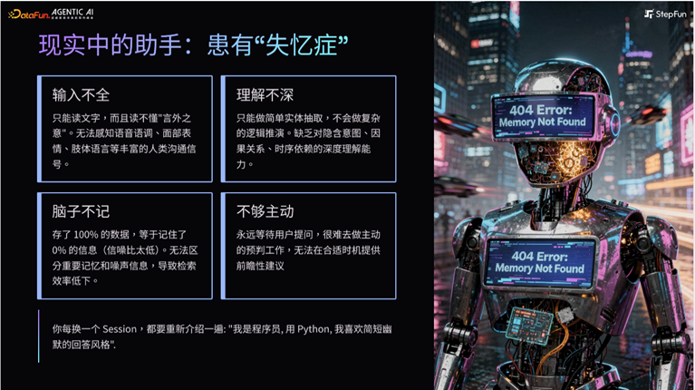

没有记忆工程的时候，AI 助手会时常 “宕机”

- 大部分的时候，输入是文本信号，存在语义之外的信息缺失（语音语调、面部表情等）；
- 不会做复杂的逻辑推理，没法理解用户背后的意图，理解不深刻；
- 输入信息中的噪声较多，模型记不住所有的有用信息
- 被动响应，问一句答一句，做不到主动提供帮助。

### 2. 记忆工程的理想作用

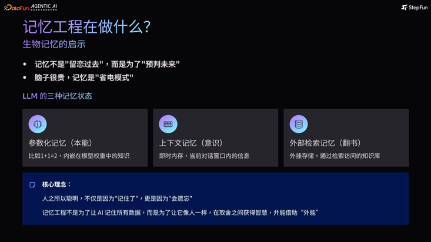

理想状况下，记忆工程应当符合第一性原理，即模拟生物构建记忆系统的过程。

- 一方面，就像人类出生后会在同世界的接触中学会趋利避害一样，模型的记忆并不是为了记住所有的过去，而是为了更好预测未来。
- 另一方面，模型的存储资源像人类的大脑一样宝贵，有效的记忆系统能够帮助 AI 助手进入“省电模式”，快速吸收信息并且拿到信息的反馈。

当前的大语言模型也在模仿人脑进行相应的处理：

- 直觉型的参数记忆。模型经过一段时间的训练后，会将一些问题的答案内嵌在参数里，不再需要进行思考，通过直觉直接给出答案，类似于人的肌肉记忆；
- 上下文场景记忆。指的是在当下场景中的互动行为，一般是发生在当下对话窗口中的信息；
- 外部检索记忆。即可以通过相应工具获取、增强的记忆，类似人翻书或者上网查找答案。

总之，人类之所以聪明，不仅是因为能够记住，更是因为会遗忘。记忆工程就是为了让 AI 像人类那样，学会什么信息是有用的、什么信息是该舍弃掉的，将外部的能力借为己用。

## 02 业界主流解法

对于记忆缺失带来的短板，行业内的解决方法主要从模型本身能力与外部信息增强两个方面入手。

### 1. 模型自身上下文“硬扛”

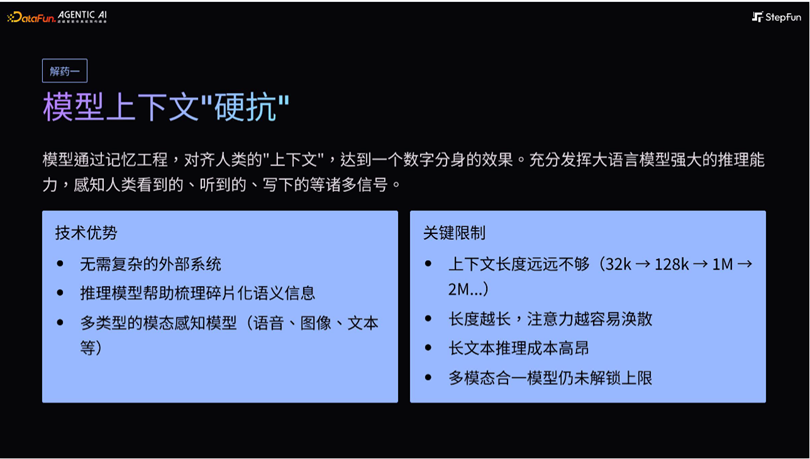

利用记忆工程，将人类的信息尽可能汇总到模型中，形成数字分身。这样做的优势是：

- 让模型架构尽量简单
- 借助推理模型来收集碎片化的信息、推理更深层次的语义；、
- 借助多模态模型获取额外信号

也存在一些关键的限制条件，包括：

- 上下文的长度限制；
- 过长上下文带来的注意力涣散、推理成本过高等。

在此基础上，业界探索出了许多新的结构，比如 HRM、Titans、Engram 等。

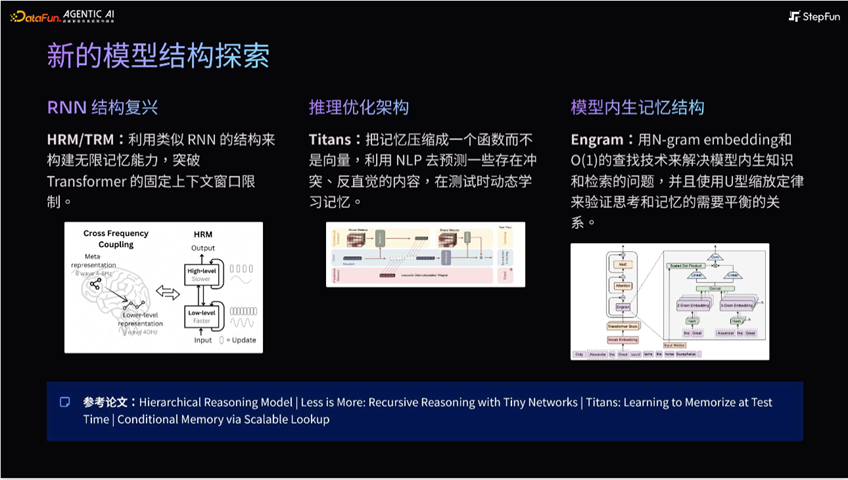

- HRM：将 RNN 结构和 Transformer 做结合，实现接近无限上下文；
- Titan：通过预测 MLP 参数，拟合反直觉的信息，在推理的时候区分这些信息并且重点保存；
- Engram：利用 N-gram 的方式加速检索。用模型内生的知识库来拓展上下文长度。

受限于现实条件，以上方法目前大多还停留在实验阶段，实际中还有许多问题需要解决。

### 2. RAG——外挂式检索增强生成

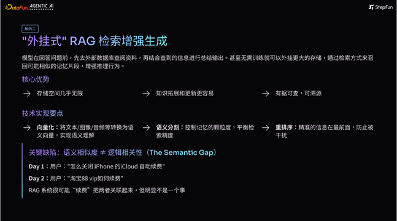

RAG 是目前业界比较成熟的方案。RAG 顾名思义就是在推理的时候，先去外部数据库查询资料、参考查询到的信息总结输出。

- 理论上来讲，RAG 可以拥有无限上下文的长度，并且支持及时更新和修改信息。
- 除此之外，RAG 信息的可溯源性也有利于提高模型输出内容的可信度。

RAG 的技术实现有三个要点：

- 将输入信息转化为语义向量；
- 通过语义分割来平衡检索精度；
- 对信息按照精确度进行重新排序，减少干扰。

由于 RAG 主要利用语义相似度进行匹配，在做一些复杂的逻辑推演任务时很容易存在失误。

比如用户先提到“想退订 iPhone 的 iCloud 自动续费”，又提问“淘宝 88VIP 如何续费”，两条消息里面都提到了“续费”，但是如果一起召回，就可能会导致混淆。

### 3. RAG+模型训练的混合式架构

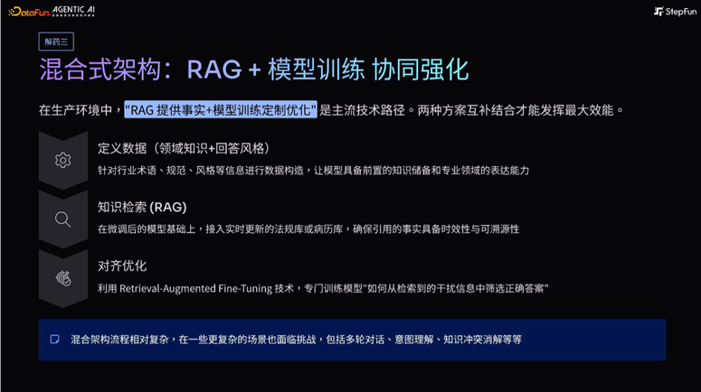

当前的主流技术框架，实际上是将 RAG 与模型训练结合起来的混合式框架，即 RAG 提供事实，通过模型训练来优化信息的使用。

流程为：

- 定义数据的理想态，包括专业知识和回复风格等；
- 将 RAG 中获取的信息灌入模型，观察模型表现；
- 利用 Retrieval-Augmented Fine-Tuning 技术对于模型的输出效果进行优化，提升正确使用信息的能力。

混合架构能够处理的问题更多，不过在一些复杂场景中仍然存在挑战，包括多轮对话、意图理解、知识冲突的消解等等。为此，仍然需要从基础模型角度入手，实现上限的突破。

## 03 基模视角的实战突破

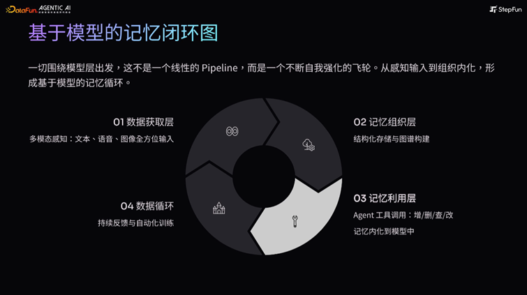

在上述背景下，基于模型的记忆闭环工作是从模型本身出发，飞轮式滚动工作，提升整个系统的效率与每个模型的表现。

这个系统一共有四个核心层次：

- 数据获取层
- 记忆组织层
- 记忆利用层
- 数据循环

### 1. 数据获取层

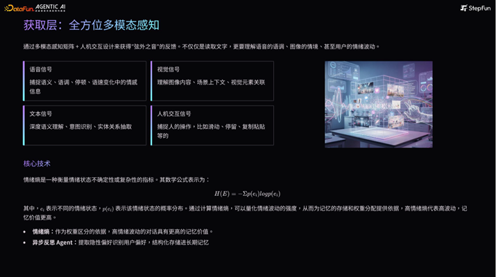

在获取层，模型不仅需要获取显性的文字信息，更需要理解深层次的“弦外之音”。

- 首先，模型在与人类实际交互的过程中，需要获取数量够多、质量够高的输入信息，包括文本、图像、语音等各种形态的。其中语音是最重要的一环。语义、语调、语速、声音大小背后都包含丰富度信息，帮助感知说话者背后的情绪。
- 除了上述基础信号之外，人机交互的信息也非常重要。用户的复制、滑动、打断操作等行为往往也隐藏着一些没有直接表达的信息波动，需要进行捕捉和利用。
- 当处理完所有信息信号之后，通过异步的反思 Agent 获取“情绪熵”（即一个衡量情绪状态不确定性或者复杂程度的指标），作为情绪标签的依据。情绪熵越高，情绪波动越大，记忆价值更高。

### 2. 记忆组织层

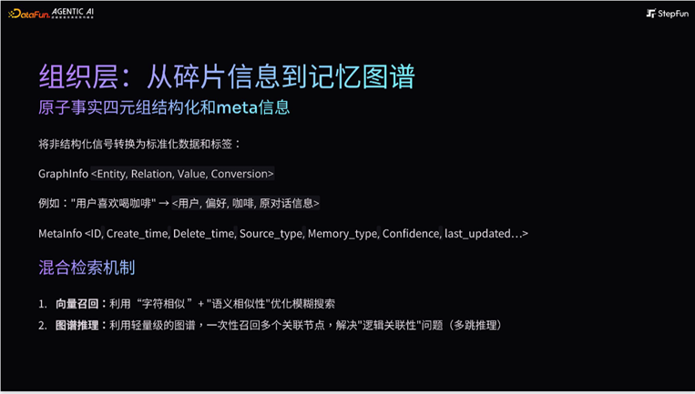

在记忆的组织层，模型将非结构化的信号转化为标准化的信息“四元组”，即主语+谓语+宾语+meta 信息（包括数据存储时间、更新时间、状态等内容，方便后续检索。

并且在传统语义检索的基础上增加了图谱推理的方式，通过多跳推理形成逻辑闭环，例如“虾饺包含虾，虾属于甲壳类食物，用户对甲壳类食品过敏，因此用户对虾饺过敏，所以模型绝对不能给用户点一份虾饺。”

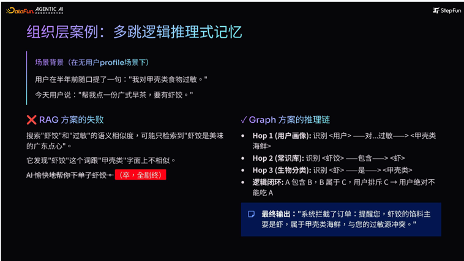

模型存储记忆信息时，可以通过三种策略来消解记忆演化过程中潜在的信息冲突：

- 利用情绪熵分配权重：情绪波动越大，内容优先级越高
- 时间的就近原则：越靠近当前时间，权重越高
- 主动澄清和反问

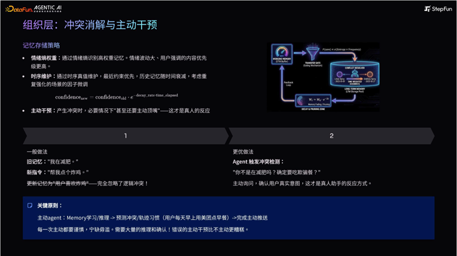

### 3. 记忆利用层

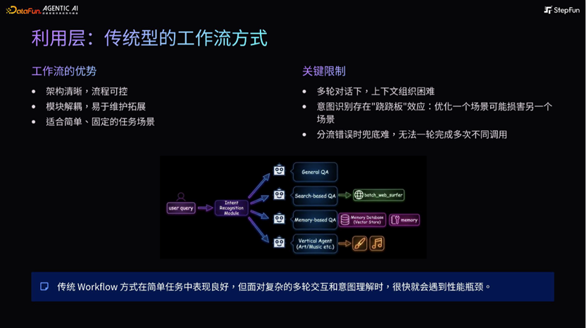

完成信息的输入和组织后，需要对信息加以利用。目前较流行的方式是树状工作流，即获取用户输入后，通过意图识别模块分流进入其他 Agent 进行后续处理。

它的限制在于：

- 多轮对话场景，模块之间上下文难以组织；
- 新增模块可能会造成“跷跷板”效应，即优化一个场景却损害了另一个场景；
- 分流失败时，兜底比较困难。

以上困境，需要探索更原生的方式、从模型自身层面解决，即通过工具调用的方式来提升 Agent 利用 memory 的能力。路径是：

- 将 memory 相关的操作制作为 Agent 的工具；
- 让 Agent 自己执行、自行决策 memory 的动态更新、甚至是演化路径；
- 运用 Rubrics AgentRL，端到端优化整体质量，提升上限。

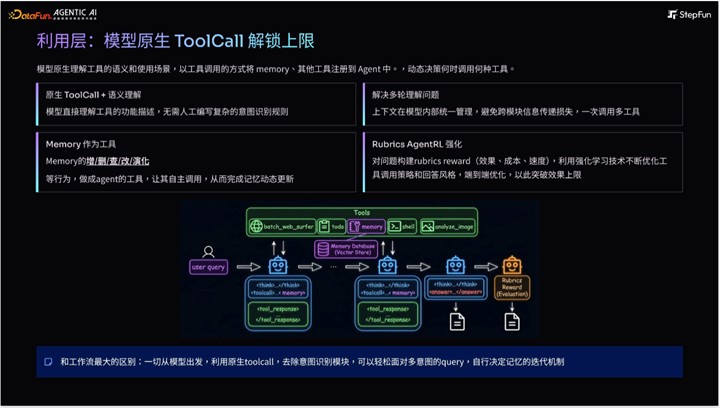

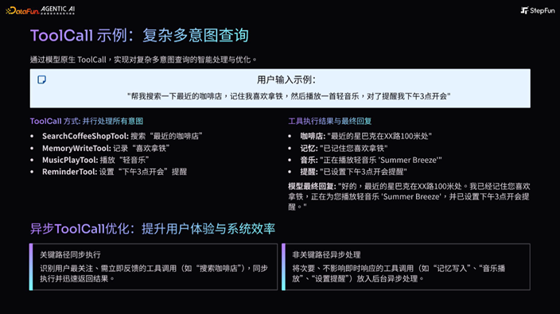

然后，运用以下方式，将记忆内化在模型的参数中，成为模型的“肌肉记忆”：

- 从用户记忆中提取重要信息用于生成合成数据；
- 利用夜间等空闲时间训练，降低对线上的影响；
- 通过 LoRA 或者其他参数高效微调方法进行个性化训练。

这种方法高效提升用户满意度（从 78% 提升到 90% 左右），并且成功的降低了推理的成本。

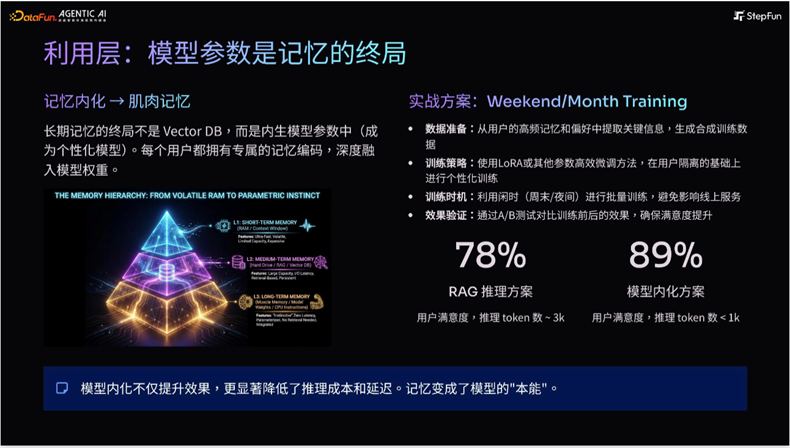

### 4. 记忆循环层

循环层包括评估和数据两个维度。评估影响迭代方向，数据飞轮为记忆的持续进化提供燃料。

在评估方面，一个重要的工作就是指标的制定。如果指标制定的有问题，模型很容易陷入局部过拟合。合理的评估指标应该覆盖三个部分：

- memory 工具评估：包括工具的增、删、查、改，工具本身的召回准确度和 F1 分数，检索结果的多样性、噪声等；
- Agent 评估：包括工具调用的触发率、触发时机等，以及 memory 使用的增益效果；
- 系统评估：推理速度、时序一致性、隐私合规问题等。

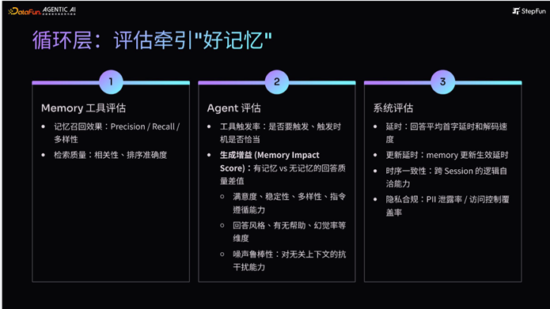

在对整体体系有了判断后，可以进入数据飞轮的构造。

- 首先，建立一个自动化的用户反馈收集机制，包括用户的显性反馈（点赞、点踩等）以及隐形反馈（采用、复制、打断等）
- 联动情绪熵，判断反馈背后的意图
- 构建人机交互的循环，即由模型生成 pair 对，再由人工修正提升质量，以此优化系统。

当这个流程运转起来后，记忆系统将形成持续进化、自适应的完整闭环，能力不断提升。

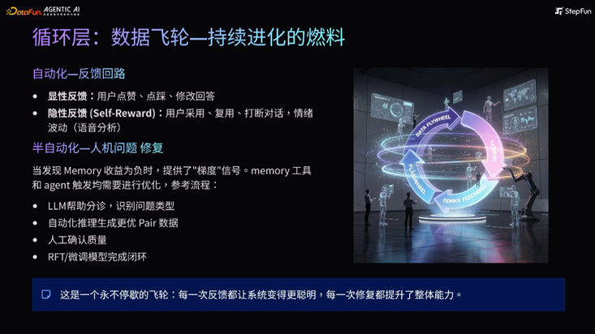

## 04 未来展望

未来的 AI Agent，将由静态离线学习演化到在线学习，并且发展出群体智慧。

- 在线学习：通过 self-improvement 机制（self-improvement 机制 = 模型通过 “自我生成数据 → 自我评判 → 自我迭代” 形成闭环），在每一次与人的对话中获得激励并优化；获取接近无限的上下文，并且自己决策哪些信息是要留下、哪些是可以遗忘的；
- 群体智慧：将不同的 Agent 结合或者建立社区，让 Agent 之间传递知识和信息，实现持续演化。

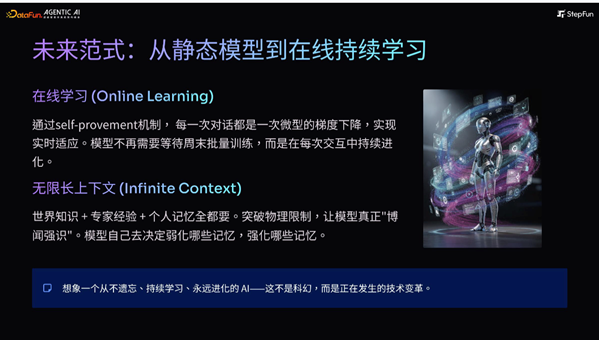

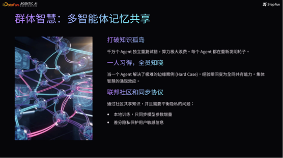

优化记忆系统的目标不仅停留在指标上，而是希望 Agent 能够对人有帮助。

或许有一天，Agent 能够不断成长，与人类进行更深层次的交互，真正成为人类的伙伴。

以上就是本次分享的内容，谢谢大家。

分享嘉宾INTRODUCTION 胡晨阶跃星辰智能科技有限公司Agent研发负责人毕业于清华大学，资深 AI 技术专家。

深耕计算机视觉、AI 芯片及自动驾驶多年，2023 年加入阶跃星程，负责大模型的技术研发工作，主导 Step-Audio 等项目，目前为 Agent 研发负责人，具备从底层硬件优化到上层 Agent 架构的全栈开发经验。累计获得 50+项专利，在国际顶会发表多篇论文，擅长解决前沿领域的复杂算法及工程挑战。

