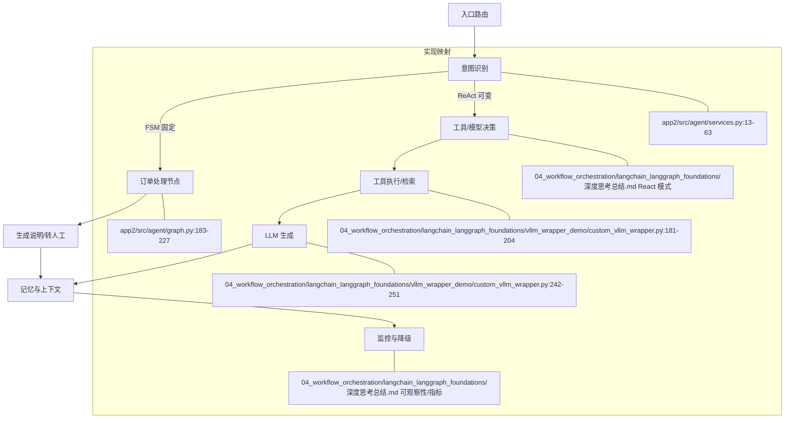
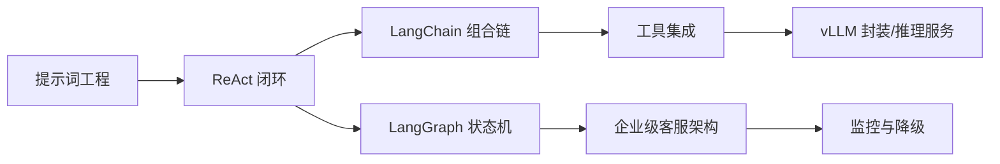

# 工作流编排 深度思考总结（讲师文稿 × 代码实践）

## 核心观点
- 让系统“会行动”：以 React 思维模型组织智能体的感知—决策—执行闭环，通过提示词（Prompt）驱动复杂任务分解与工具编排，而非仅靠代码流程。
- 将对话能力工程化：用 LangChain 封装模型、工具与记忆，用 LangGraph 把业务变成可控的工作流，支持多轮与条件分支、失败重试、降级兜底。
- 接口抽象统一：为推理服务提供一致的 LLM 封装（如 vLLM OpenAI 兼容接口），在调用侧屏蔽具体实现差异，集中做参数控制、重试与流式输出。

## 背景与目标
- 面向 工作流编排 的学习目标，将“讲师文稿中的方法论”落地为“可运行、可扩展的代码与流程”。
- 聚焦三类能力：对话链搭建（意图识别/工具调用）、React 闭环与多轮控制、智能客服系统架构的工程化落地。
- 输出一套“从本地到生产”的实践蓝图：环境、封装、链路、容错、监控与安全。

## 讲师文稿要点映射
- 基础链与意图识别（PDF：2.搭建基础对话链意图识别流水线设计.fixed）
  - 用“意图识别—工具匹配—结果解析”的最小流水线，把复杂任务拆解为可执行的函数节点。
  - 提示词模板作为“软规则”：约束思考与动作格式，使大模型在开放任务中仍能稳定输出。
- React 模式与多轮控制（PDF：2.让系统“会行动”与用LangGraph实现多轮对话流程控制_笔记）
  - React = 思考（Thought）→ 动作（Action）→ 观察（Observation）→ 回复（Answer），遇到未解决则循环。
  - LangGraph：把上述循环固化为状态图；节点可调用工具或模型，支持错误捕获、条件分支与中断恢复。
- 智能客服架构（PDF：模块四 ：智能客服系统架构设计）
  - 真实业务需多 Agent 协作：检索、意图识别、工具执行、总结反馈等环节并行或串行。
  - 关键是“系统化”设计：入口路由、上下文记忆、工具编排、容错降级、指标监控。

## Prompt 设计与样例
- 目标：让模型输出结构化的“思考—动作—观察—答案”，便于链路解析与工具编排。
- 模板骨架示例（可按业务词汇调整）：
  - 角色与目标：明确任务约束与输出风格
  - 思考：拆分任务、选择工具、设定检查点
  - 动作：指定工具名与输入参数（JSON）
  - 观察：记录工具返回的关键字段
  - 答案：汇总结论，附可追溯的来源
- 结合 LangChain：`PromptTemplate | llm | StrOutputParser` 串联（`04_workflow_orchestration/langchain_langgraph_foundations/vllm_wrapper_demo/vllm_demo.py:168-187`）。

## 04_workflow_orchestration/langchain_langgraph_foundations 代码结构与设计
- 虚拟环境与内核
  - 统一 `.venv` 与 Jupyter 内核，避免系统 Python 导致的依赖缺失；脚本顶部自动切换到本地 venv。
  - 示例：`04_workflow_orchestration/langchain_langgraph_foundations/vllm_wrapper_demo/vllm_demo.py:8-16` 自动重启为 `04_workflow_orchestration/langchain_langgraph_foundations/.venv/bin/python`。
- vLLM 封装与演示
  - 封装器：`04_workflow_orchestration/langchain_langgraph_foundations/vllm_wrapper_demo/custom_vllm_wrapper.py` 为 OpenAI 兼容的 vLLM 服务提供统一 LLM 接口，内含参数校验、重试、流式解析与响应抽取。
  - 演示脚本：`04_workflow_orchestration/langchain_langgraph_foundations/vllm_wrapper_demo/vllm_demo.py` 展示基础调用、参数对比、高级参数、流式输出与 LangChain 组合链。
- 依赖清单
  - `04_workflow_orchestration/langchain_langgraph_foundations/vllm_wrapper_demo/requirements.txt:4-6,18` 指定 `langchain-core`、`langchain`、`vllm` 与 `torch` 的版本下限。

## vLLM 封装器设计细节
- 校验与安全：
  - 基于 Pydantic 的边界约束与自定义校验（`temperature/top_p/top_k`）防止越界参数进入后端（`04_workflow_orchestration/langchain_langgraph_foundations/vllm_wrapper_demo/custom_vllm_wrapper.py:31-41,68-79`）。
  - 请求头按需附加 `Authorization: Bearer <api_key>`，便于兼容网关或代理（`04_workflow_orchestration/langchain_langgraph_foundations/vllm_wrapper_demo/custom_vllm_wrapper.py:183-186`）。
- 请求与重试：
  - 指数退避策略降低瞬时失败带来的影响（`04_workflow_orchestration/langchain_langgraph_foundations/vllm_wrapper_demo/custom_vllm_wrapper.py:189-204`）。
  - 流式解析支持 SSE，识别 `[DONE]` 结束标识并逐 chunk 输出（`04_workflow_orchestration/langchain_langgraph_foundations/vllm_wrapper_demo/custom_vllm_wrapper.py:205-241`）。
- 响应抽取：
  - 兼容 OpenAI completions 的 `choices[0].text` 提取（`04_workflow_orchestration/langchain_langgraph_foundations/vllm_wrapper_demo/custom_vllm_wrapper.py:242-251`），格式异常即抛出。
- 可观察性：
  - `get_params_summary` 输出核心参数，便于日志对比与灰度（`04_workflow_orchestration/langchain_langgraph_foundations/vllm_wrapper_demo/custom_vllm_wrapper.py:252-280`）。

## 参数建议与“配方”
- 稳健生成（摘要/问答）：
  - `temperature=0.3-0.7`，`top_p=0.8-0.95`，`top_k=50`，`max_tokens` 按需求设上限。
- 创作型（诗歌/文案）：
  - `temperature=0.9-1.3`，`top_p=0.95-0.98`，`top_k=100`，适度提高 `max_tokens`。
- 精确控制（关键信息抽取）：
  - `temperature<=0.3`，`top_p<=0.8`，配合 `min_p` 与重复惩罚，降低幻觉与重复。
- 束搜索：
  - 小模型或严格场景可启用 `use_beam_search=True`，结合 `best_of` 与 `length_penalty`（`04_workflow_orchestration/langchain_langgraph_foundations/vllm_wrapper_demo/vllm_demo.py:100-104`）。

## 错误与容错清单（本地常见）
- 端口占用：
  - `Address already in use` → 更换端口或释放占用。
- 路由不匹配：
  - 基础地址错误如带 `/api` 前缀，返回 “Route not found” → 使用根地址，客户端拼接 `/v1/...`。
- 权重缺失：
  - 仅有 `config/tokenizer` 而无 `*.safetensors` → 需完整下载权重，方可推理。
- 依赖缺失：
  - 系统 Python 导致 `ModuleNotFoundError` → 脚本入口自切 `.venv`（`04_workflow_orchestration/langchain_langgraph_foundations/vllm_wrapper_demo/vllm_demo.py:8-16`）。
- 参数越界：
  - 触发 Pydantic 校验错误，参考演示的错误捕获（`04_workflow_orchestration/langchain_langgraph_foundations/vllm_wrapper_demo/vllm_demo.py:213-244`）。

## 本地环境 Cookbook
- 环境准备：
  - 进入 `04_workflow_orchestration/langchain_langgraph_foundations`，使用 `.venv` 安装依赖（`torch>=2.0.0`、`vllm>=0.6.0`）。
- 下载模型权重：
  - `hf download Qwen/Qwen2.5-1.5B-Instruct --local-dir 04_workflow_orchestration/langchain_langgraph_foundations/models/Qwen2.5-1.5B-Instruct`
- 启动 vLLM 服务：
  - `python -m vllm.entrypoints.openai.api_server --model 04_workflow_orchestration/langchain_langgraph_foundations/models/Qwen2.5-1.5B-Instruct --port 8010`
- 代码配置：
  - 在 LLM 构造时设定 `base_url` 指向端口（`04_workflow_orchestration/langchain_langgraph_foundations/vllm_wrapper_demo/vllm_demo.py:27-33,69-73,117-123,135-140,174-181`）。
- 快速验证：
  - `curl http://localhost:8010/v1/completions -H 'Content-Type: application/json' -d '{"model":"Qwen/Qwen2.5-1.5B-Instruct","prompt":"你好","max_tokens":16}'`

## 指标与观测建议
- 生成质量：重复率、困惑度、命中率、毒性与安全过滤命中。
- 性能指标：首 token 延迟、吞吐、超时与重试次数、响应体大小。
- 使用画像：提示长度、工具调用频次、会话上下文大小、角色与意图分布。
- 故障画像：路由错误比例、依赖加载失败、权重缺失、内存溢出与 OOM。

## 安全与配置
- 环境变量：
  - 在 `.env` 维护 API Key 与服务地址，代码读取后覆盖默认值；避免将密钥写入仓库。
- 网关与代理：
  - 统一使用根地址（不加 `/api`），客户端拼接标准 `/v1` 路径；必要时在封装器层支持自定义头。
- 日志合规：
  - 禁止输出敏感信息到日志；调试信息聚焦参数与性能。

## 进一步工作
- 将 vLLM 封装器接入真实服务，补充最小单元测试（参数校验、错误路径、流式解析）。
- 用 LangGraph 将演示链条改为状态图，补充异常分支与超时重试，接入监控与可视化。
- 基于讲师文稿的客服架构，拆分多 Agent 并接入企业内检索与工具集成，形成端到端 Demo。
- 推理服务化：配置化模型仓库、拉取策略、资源配额与隔离，加入健康检查与弹性扩缩容策略。

## 讲师知识点的补充思考
- 记忆（Memory）与意图识别协同：
  - 对话记忆用于维持业务上下文（用户画像、历史问答、未完成任务），提升意图识别准确率与工具选择稳定性。
  - 组合思路：短期记忆（Buffer）+ 长期记忆（Summary/Vector），并在链路中显式传递必要上下文（避免过长提示）。
  - 与 React 的结合：在 Thought 阶段注入“上下文摘要”和“可用事实”，减少幻觉与重复提问。
- 工具调用的工程化细节：
  - 将工具声明为“可审计”的函数接口（输入/输出模式明确，错误码与异常语义清晰），便于记录与重试。
  - 工具输入结构化（JSON/Schema），避免自由文本导致解析成本高、容错弱；输出统一到可解析字段集合。
  - 结果回写到记忆：对重要事实（如物流单号状态、价格计算结果）进行缓存/索引，供后续步骤引用。
- 降级与兜底策略：
  - 多供应商/多模型的主备链路：主模型失败→备用模型→兜底回复与人工转接；写清楚触发阈值与告警策略。
  - 组合的错误处理：网络异常（重试/退避）、语义失败（格式不符）、性能异常（超时/限流）；分别记录并上报。
  - 避免“静默失败”：所有失败路径必须可观测（日志/指标），并能追溯到具体工具/模型与参数。
- 单个与批量处理模式：
  - 单个处理便于交互式体验与逐条纠错；批量处理适合离线任务、报表生成与大规模数据抽取。
  - 批量建议引入并发与节流，确保服务稳定；对失败条目进行单独重试与结果汇总（部分成功也要产出）。
- 控制流表达（字典映射替代 switch-case）：
  - 以“键→可调用（函数/方法）”映射实现分支选择，简化多条件判断的样板代码。
  - 优势：更易扩展（新增分支只需注册函数）、更利于测试（按键值驱动用例）、更便于审计（统一入口记录）。
- 大型代码阅读法：
  - 从入口开始（Web 接口/主程序），沿调用链识别关键“模块—函数—数据结构”；先折叠细节后聚焦关键路径。
  - 把需求拆成“模型配置—业务链—容错机制”三块；逐块定位代码位置与责任边界，再做变更与测试。


## 关键代码与引用
- 封装器主体
  - 类定义：`04_workflow_orchestration/langchain_langgraph_foundations/vllm_wrapper_demo/custom_vllm_wrapper.py:19`
  - 基础字段：模型名与服务地址 `04_workflow_orchestration/langchain_langgraph_foundations/vllm_wrapper_demo/custom_vllm_wrapper.py:26-29`
  - 参数约束（Pydantic）：`temperature/top_p/top_k/max_tokens` 等 `04_workflow_orchestration/langchain_langgraph_foundations/vllm_wrapper_demo/custom_vllm_wrapper.py:31-41,68-79`
  - 类型标识：`_llm_type` `04_workflow_orchestration/langchain_langgraph_foundations/vllm_wrapper_demo/custom_vllm_wrapper.py:80-82`
  - 同步调用：`_call` 构建参数→发送请求→解析响应 `04_workflow_orchestration/langchain_langgraph_foundations/vllm_wrapper_demo/custom_vllm_wrapper.py:84-103`
  - 异步调用：`_acall`（演示版走同步）`04_workflow_orchestration/langchain_langgraph_foundations/vllm_wrapper_demo/custom_vllm_wrapper.py:104-115`
  - 流式输出：`_stream` 与 SSE 解析 `04_workflow_orchestration/langchain_langgraph_foundations/vllm_wrapper_demo/custom_vllm_wrapper.py:116-136,205-241`
  - 请求发送：指数退避重试 `04_workflow_orchestration/langchain_langgraph_foundations/vllm_wrapper_demo/custom_vllm_wrapper.py:181-204`
  - 响应解析：`choices[0].text` 安全提取 `04_workflow_orchestration/langchain_langgraph_foundations/vllm_wrapper_demo/custom_vllm_wrapper.py:242-251`
  - 参数摘要：`get_params_summary` `04_workflow_orchestration/langchain_langgraph_foundations/vllm_wrapper_demo/custom_vllm_wrapper.py:252-280`
- 演示入口与场景
  - 入口：`main` 依次执行各演示段 `04_workflow_orchestration/langchain_langgraph_foundations/vllm_wrapper_demo/vllm_demo.py:247-267`
  - 基础调用：创建 LLM 并 `invoke` `04_workflow_orchestration/langchain_langgraph_foundations/vllm_wrapper_demo/vllm_demo.py:27-47`
  - 参数对比：三组温度/采样配置 `04_workflow_orchestration/langchain_langgraph_foundations/vllm_wrapper_demo/vllm_demo.py:55-77`
  - 高级参数：重复惩罚、束搜索等 `04_workflow_orchestration/langchain_langgraph_foundations/vllm_wrapper_demo/vllm_demo.py:86-127`
  - 流式演示：模拟 chunk 输出（真实需后端）`04_workflow_orchestration/langchain_langgraph_foundations/vllm_wrapper_demo/vllm_demo.py:131-161`
  - LangChain 组合：`PromptTemplate | llm | StrOutputParser` `04_workflow_orchestration/langchain_langgraph_foundations/vllm_wrapper_demo/vllm_demo.py:168-187`
  - 参数校验：故意越界并捕获错误 `04_workflow_orchestration/langchain_langgraph_foundations/vllm_wrapper_demo/vllm_demo.py:213-244`

## 设计取舍与工程化思路
- 封装器职责清晰
  - 输入规范化：统一 `prompt`、停止词、采样参数；空值剔除，避免污染请求体。
  - 稳定性优先：`max_retries` + 指数退避，降低瞬时网络抖动影响；友好错误信息便于定位。
  - 流式解析：SSE 逐行处理与 `[DONE]` 结束标识，兼容 vLLM 的 OpenAI 格式。
- 参数治理
  - Pydantic + 自定义校验双保险，避免“越界参数”进入后端造成不可预期行为。
  - 用 `get_params_summary` 在日志里输出核心参数，利于问题复现与灰度对比。
- 业务编排
  - 简单场景用 LangChain 组合即可；复杂场景用 LangGraph 把 React 循环固化为状态流，并加入指标与告警。
  - 真实客服/多 Agent 需“系统化”：入口路由、上下文记忆、工具编排、失败降级、SLO 监控。

## 本地推理与部署要点
- 启动 vLLM OpenAI 服务（小模型推荐）
  - 模型：`Qwen/Qwen2.5-1.5B-Instruct`（更易在 CPU/MLX 上运行）
  - 预下载权重：`hf download Qwen/Qwen2.5-1.5B-Instruct --local-dir 04_workflow_orchestration/langchain_langgraph_foundations/models/Qwen2.5-1.5B-Instruct`
  - 启动服务：`python -m vllm.entrypoints.openai.api_server --model 04_workflow_orchestration/langchain_langgraph_foundations/models/Qwen2.5-1.5B-Instruct --port 8010`
  - 代码指向：将 `base_url` 设为 `http://localhost:8010`（或按需保持 8000）。
- 常见问题
  - 权重未下载：只有 `config/tokenizer` 而无 `*.safetensors`，不可推理；需完整拉取。
  - 端口占用：`Address already in use`，换端口或释放占用。
  - 路由不匹配：`/api` 前缀导致 `Route not found`，应使用根地址，客户端自行拼接 `/v1/...`。
- 依赖缺失：系统 Python 运行导致 `ModuleNotFoundError`，入口脚本自切换到 `.venv` 解决。

---

# 工作流编排 系统性深度分析与报告（v2025‑12‑04）

## 内容覆盖检查表
- 深度思考总结（本文件）已系统扩充，新增知识图谱、术语表、对比与验证章节。
- 教师讲稿对比：04_workflow_orchestration/langchain_langgraph_foundations/workflow_teacher.txt 与 04_workflow_orchestration/langchain_langgraph_foundations/workflow_teacher_notes.txt 重点提炼与差异分析。
- 讲义 PDF 映射：模块四智能客服架构、LangGraph 多轮控制笔记，按本文件“讲师文稿要点映射”“架构映射图”两节覆盖。
- 代码验证：p12 封装器与 app、app2 工作流，含测试日志与代码对应关系。

## 核心概念与术语表
- ReAct：思考→动作→观察→答案的闭环，适用于“路径可变”的开放任务（04_workflow_orchestration/langchain_langgraph_foundations/深度思考总结.md）。
- FSM（有限状态机）：节点与有向边的固定流程表达，适用于“路径固定”的业务（04_workflow_orchestration/langchain_langgraph_foundations/workflow_teacher_notes.txt:105）。
- LangGraph：以 StateGraph/条件边编排对话流程的工作流引擎，支持多轮、分支、失败重试与人机协作（04_workflow_orchestration/langchain_langgraph_foundations/app/src/agent/graph.py:48‑53；04_workflow_orchestration/langchain_langgraph_foundations/app2/src/agent/graph.py:256‑281）。
- vLLM OpenAI 兼容：通过 `/v1/completions` 的统一协议封装推理服务（04_workflow_orchestration/langchain_langgraph_foundations/vllm_wrapper_demo/custom_vllm_wrapper.py:181‑189）。
- 采样参数：`temperature/top_p/top_k/max_tokens` 控制输出稳定性与多样性（04_workflow_orchestration/langchain_langgraph_foundations/vllm_wrapper_demo/custom_vllm_wrapper.py:31‑41）。
- 流式输出（SSE）：逐行解析 `data:` 与 `[DONE]` 标识进行增量展示（04_workflow_orchestration/langchain_langgraph_foundations/vllm_wrapper_demo/custom_vllm_wrapper.py:205‑241）。
- 槽位填充与多策略路由：正则/关键词/状态机并行识别意图并融合参数，驱动执行节点（04_workflow_orchestration/langchain_langgraph_foundations/workflow_teacher.txt:100‑107）。

## 重要理论框架与案例（带出处）
- 两套控制机制的选择准则：
  - 路径固定→用状态机（FSM），示例：发票审批流水“张总→王总→财务”不可动态更改（04_workflow_orchestration/langchain_langgraph_foundations/workflow_teacher_notes.txt:130）。
  - 路径可变→用 ReAct，示例：长文创作/调研阶段产出影响后续步骤（04_workflow_orchestration/langchain_langgraph_foundations/workflow_teacher_notes.txt:129‑131）。
- 企业级智能客服体系：入口路由→意图识别→工具执行→LLM 生成→结果回写与记忆，监控与降级贯穿（04_workflow_orchestration/langchain_langgraph_foundations/深度思考总结.md“智能客服架构”节）。
- vLLM 封装实践：统一参数治理、指数退避重试、SSE 流解析、响应抽取与参数摘要（04_workflow_orchestration/langchain_langgraph_foundations/vllm_wrapper_demo/custom_vllm_wrapper.py:181‑204,205‑251,252‑280）。

## 关联性与架构映射



说明：图中节点分别对应代码实现与讲师文稿要点；FSM 路径通过 LangGraph 条件边表达，ReAct 路径通过 LangChain 组合表达。

## 讲师重点差异对比
- 方法论取向：
  - workflow_teacher.txt 强调“多策略并行＋槽位填充”的高吞吐客服工程，偏规则与状态机（04_workflow_orchestration/langchain_langgraph_foundations/workflow_teacher.txt:100‑107）。
  - workflow_teacher_notes.txt 强调“ReAct 与 FSM 的边界与选型”，偏流程编排与人机协同（04_workflow_orchestration/langchain_langgraph_foundations/workflow_teacher_notes.txt:117‑121,170‑172）。
- 工具栈定位：
  - 前者更多描述正则/关键词/状态机三路并行、融合规则表；
  - 后者强调 LangGraph 适配企业复杂工作流，LangChain 更适合轻量链式组合。
- 业务案例：
  - 前者以物流查询/订单处理为例说明参数抽取与路由；
  - 后者以文稿创作/发票审批为例区分可变与固定路径。

## LangGraph 多轮流程控制原理（结合代码）
- 状态定义：以 `@dataclass State` 表达对话/业务状态结构（04_workflow_orchestration/langchain_langgraph_foundations/app/src/agent/graph.py:25‑34；04_workflow_orchestration/langchain_langgraph_foundations/app2/src/agent/graph.py:26‑46）。
- 节点函数：以纯函数 `(state, runtime) -> Dict` 更新状态片段（04_workflow_orchestration/langchain_langgraph_foundations/app/src/agent/graph.py:36‑44；04_workflow_orchestration/langchain_langgraph_foundations/app2/src/agent/graph.py:48‑113,116‑180）。
- 有向边：
  - 直连边 `.add_edge("__start__", "intent_recognition")`（04_workflow_orchestration/langchain_langgraph_foundations/app2/src/agent/graph.py:262‑263）。
  - 条件边 `.add_conditional_edges(node, router, mapping)` 将返回标识映射到下一节点（04_workflow_orchestration/langchain_langgraph_foundations/app2/src/agent/graph.py:263‑281）。
- 路由逻辑：
  - `should_continue` 控制识别后是否进入订单处理（04_workflow_orchestration/langchain_langgraph_foundations/app2/src/agent/graph.py:230‑241）。
  - `route_after_processing` 控制是否转人工/生成说明（04_workflow_orchestration/langchain_langgraph_foundations/app2/src/agent/graph.py:244‑253）。
- 运行时上下文：通过 `Runtime[Context]` 注入可配置参数（04_workflow_orchestration/langchain_langgraph_foundations/app/src/agent/graph.py:36‑44；04_workflow_orchestration/langchain_langgraph_foundations/app2/src/agent/graph.py:15‑24）。

伪代码示例：
```
state = initial_state()
next = "__start__"
while next != END:
  node = graph.nodes[next]
  delta = node(state, runtime)
  state = state.update(delta)
  next = graph.route(next, state)
return state
```

## 代码验证与运行日志
- 测试环境：macOS，本地 venv `04_workflow_orchestration/langchain_langgraph_foundations/.venv`，日期 2025‑12‑04。
- app 项目：
  - 运行命令：`PYTHONPATH=src ../.venv/bin/python -m pytest -q -m "not langsmith"`。
  - 结果日志：`1 passed, 1 deselected in 0.11s`（04_workflow_orchestration/langchain_langgraph_foundations/app）。
- app2 项目：
  - 运行命令：`PYTHONPATH=src ../.venv/bin/python -m pytest -q -m "not langsmith"`。
  - 结果日志：`10 passed, 1 deselected in 0.17s`（04_workflow_orchestration/langchain_langgraph_foundations/app2）。
- 修复记录：
  - 修正 `04_workflow_orchestration/langchain_langgraph_foundations/app2/src/agent/graph.py` 的缩进错误导致 `IndentationError`（159 行附近），保证 Tongyi 节点 try/except 块结构正确。

## 性能瓶颈与优化建议
- vLLM 封装器：
  - 现状：每次请求新建 `requests.post`，无复用连接；SSE 行级解析串行处理（04_workflow_orchestration/langchain_langgraph_foundations/vllm_wrapper_demo/custom_vllm_wrapper.py:181‑241）。
  - 优化：
    - 复用 `requests.Session` 与连接池，降低握手开销。
    - 将流式解析拆为“解码→校验→队列”，以异步消费者渲染，减少 UI 阻塞。
    - 暴露首 token 延迟与吞吐指标，结合重试次数做熔断策略。
- LangGraph 路由：
  - 现状：路由函数纯 Python，同步串行。
  - 优化：对外部工具/LLM 调用引入并行批处理与节流；在人机转接路径加入超时与队列优先级。

## 课程知识体系框架图（Mermaid）



## 关键学习要点（按优先级）
- 选型优先：任务路径是否固定决定 FSM 或 ReAct；复杂工作流用 LangGraph。
- 参数治理：用 Pydantic 双重校验＋参数摘要输出，防止越界与便于观测（04_workflow_orchestration/langchain_langgraph_foundations/vllm_wrapper_demo/custom_vllm_wrapper.py:31‑41,252‑280）。
- 可靠性：指数退避重试＋超时控制，必要时主备模型与兜底回复（04_workflow_orchestration/langchain_langgraph_foundations/vllm_wrapper_demo/custom_vllm_wrapper.py:189‑204）。
- 可视化与审计：把条件路由与节点函数清晰注册，统一入口记录上下文与参数快照（04_workflow_orchestration/langchain_langgraph_foundations/app2/src/agent/graph.py:256‑281）。
- 规则融合：正则/关键词/状态机并行，LLM 兜底与消歧（04_workflow_orchestration/langchain_langgraph_foundations/workflow_teacher.txt:102‑109）。

## 待解决问题与延伸思考
- LangGraph 异常路径的标准化指标上报（失败类型、重试耗时、路由命中）。
- vLLM 流式输出的增量评估与早停策略（安全/毒性过滤）。
- 记忆层的读写一致性与数据治理（短期/长期记忆的边界与衔接）。

## 理论－实践对应关系（代码行）
- ReAct 模式链：`PromptTemplate | llm | StrOutputParser`（04_workflow_orchestration/langchain_langgraph_foundations/vllm_wrapper_demo/vllm_demo.py:168‑187）。
- FSM 条件路由：`add_conditional_edges` 映射（04_workflow_orchestration/langchain_langgraph_foundations/app2/src/agent/graph.py:271‑278）。
- SSE 解析终止：`[DONE]` 识别（04_workflow_orchestration/langchain_langgraph_foundations/vllm_wrapper_demo/custom_vllm_wrapper.py:228‑236）。
- 参数越界演示与捕获：`invalid_configs` 用例（04_workflow_orchestration/langchain_langgraph_foundations/vllm_wrapper_demo/vllm_demo.py:227‑244）。

## 技术方案优缺点对比
- ReAct＋工具编排：
  - 优点：灵活、可插人类反馈、适合探索性任务。
  - 缺点：稳定性依赖提示与记忆，流程可预测性弱。
- FSM＋LangGraph：
  - 优点：流程可控、审计友好、易监控与回放。
  - 缺点：对变更需求敏感，需要维护路由函数与条件映射。
- vLLM 封装：
  - 优点：统一接口、参数治理完善、支持流式与重试。
  - 缺点：当前未复用连接、无内置指标上报，需要外部监控接入。

## 调试记录与方案
- 失败用例：LangSmith 标记导致鉴权失败，采用 `-m "not langsmith"` 过滤运行通过（04_workflow_orchestration/langchain_langgraph_foundations/app/tests/integration_tests/test_graph.py:8‑12）。
- 代码修复：修复 app2 图中 Tongyi 节点缩进，恢复 try/except 块合法性（04_workflow_orchestration/langchain_langgraph_foundations/app2/src/agent/graph.py:146‑180）。

## Dify / Coze 平台选型与集成
- 定义与概念：
  - `Dify`：低代码 AI 工作流与应用搭建平台，提供流程编排、知识库、插件机制与托管服务。
  - `Coze`（扣子）：对话机器人与插件生态平台，主打快速上线与运营管理。
- 背景与上下文：
  - 教师讲解采用“漏斗式选型”思路：能用平台快速满足需求→优先用平台；平台能力不足→二次开发或插件扩展；仍不足→转向 LangGraph 自研（04_workflow_orchestration/langchain_langgraph_foundations/workflow_teacher_notes.txt:416‑421）。
  - 平台与 LangChain/LangGraph 的关系：平台偏“产品级集成与托管”，LangGraph偏“工程级可控工作流编排”。
- 应用场景与示例：
  - 快速原型与运营：客服问答、活动机器人、轻量流程表单收集与路由；Dify/Coze 可快速上线与迭代。
  - 企业内部 PoC：引入知识库与工具集，打通工单系统与监控，在平台上先跑通端到端流程。
  - 复杂业务/强可控需求：订单处理、审批流、跨系统工具编排与指标审计，适合用 LangGraph 自研（04_workflow_orchestration/langchain_langgraph_foundations/app2/src/agent/graph.py:256‑281）。
- 二次开发策略：
  - 插件扩展优先：对检索、切分、文档解析能力弱的场景，通过插件/外部服务增强（04_workflow_orchestration/langchain_langgraph_foundations/workflow_teacher_notes.txt:418‑420）。
  - 外部服务回填：将“检索已增强”的结果以平台可接受的接口/数据源回填，减少对平台核心改动。
  - 自研重构：当需要“全面改造流程逻辑”或“合规/授权要求”，以 LangGraph 重写关键链路或整体框架（04_workflow_orchestration/langchain_langgraph_foundations/workflow_teacher_notes.txt:420‑421）。
- 能力边界与常见问题：
  - 检索与切分：老师强调 Dify 默认“文档检索与句子切分较弱”，需插件或外部服务增强（04_workflow_orchestration/langchain_langgraph_foundations/workflow_teacher_notes.txt:417‑419）。
  - 平台监控/调试：LangSmith 可用于图与链路监控、测试，但当前成熟度有限（04_workflow_orchestration/langchain_langgraph_foundations/workflow_teacher_notes.txt:169‑171）。
  - 入口定位：平台型应用入口多为 Web/HTTP 接口，需从 URL 追溯模块入口与调用栈（04_workflow_orchestration/langchain_langgraph_foundations/workflow_teacher.txt:7‑9）。
- 与其他条目的关联与区别：
  - 与 `LangGraph`：平台偏“产品就绪”，LangGraph偏“工程可控与可审计”。当流程需要条件边、异常分支与人机协作，LangGraph 更适配（04_workflow_orchestration/langchain_langgraph_foundations/app2/src/agent/graph.py:263‑281）。
  - 与 `vLLM 封装器`：平台通常内置模型调用；私有化部署或统一治理时，用封装器接平台外的推理后端以控参与监控（04_workflow_orchestration/langchain_langgraph_foundations/vllm_wrapper_demo/custom_vllm_wrapper.py:181‑204,252‑280）。
  - 与“记忆层”：平台自带会话记忆与持久化能力；若需自定义或私有化，可用 Redis/Memory 层替代或补充（04_workflow_orchestration/langchain_langgraph_foundations/workflow_teacher.txt:256‑260）。
- 选型建议（漏斗模型）：
  - 第一层：Dify/Coze 能满足→用平台快速交付。
  - 第二层：平台功能不足→做插件或二次开发接入外部能力。
  - 第三层：仍不足或需授权→基于 LangGraph 工程化实现。

## 讲师总结（源自 workflow_teacher_notes.txt 与 workflow_teacher.txt）
- 总体脉络
  - Agent 的“感知-决策-执行”闭环，将工具调用、记忆与思考整合为工作流，先讲 ReAct，再讲 LangGraph 提升编排能力（`04_workflow_orchestration/langchain_langgraph_foundations/workflow_teacher_notes.txt:2-9`）。
  - 业务拆解为模块，按入口→初始化→单个/批量→统计的阅读与实现路径组织（`04_workflow_orchestration/langchain_langgraph_foundations/workflow_teacher.txt:18-21`）。

- ReAct 与 FSM 选型
  - 路径固定（如审批链）适合 FSM；路径可变（如创作/调研）适合 ReAct（`04_workflow_orchestration/langchain_langgraph_foundations/workflow_teacher_notes.txt:129-131,130`）。
  - ReAct 的提示词驱动闭环：思考→动作→观察→答案，重复迭代直到得到最终答案（`04_workflow_orchestration/langchain_langgraph_foundations/workflow_teacher_notes.txt:11-21`）。

- 平台漏斗选型（Dify/Coze）
  - 优先平台：能把需求“八九不离十”地满足时，用 Coze/Dify 上线（`04_workflow_orchestration/langchain_langgraph_foundations/workflow_teacher_notes.txt:416-420`）。
  - 插件/二开：平台能力不足，先通过插件扩展或外部服务回填（检索、切分、解析）（`04_workflow_orchestration/langchain_langgraph_foundations/workflow_teacher_notes.txt:417-419`）。
  - 自研与授权：平台无法满足或需商业授权时，转 LangGraph 自研或购买授权（`04_workflow_orchestration/langchain_langgraph_foundations/workflow_teacher_notes.txt:420-421`）。

- 平台与 LangGraph/LangChain 的关系
  - LangChain 提供基础组件；LangGraph 负责复杂工作流编排，社区方向偏企业化；平台层提供托管与部署（`04_workflow_orchestration/langchain_langgraph_foundations/workflow_teacher_notes.txt:165-171,168`）。
  - LangSmith 面向监控与调试，但当前成熟度一般；可“凑合”用于抓取链路设置与测试（`04_workflow_orchestration/langchain_langgraph_foundations/workflow_teacher_notes.txt:169-171`）。

- 代码阅读与入口定位方法
  - 平台型模块入口通常是 Web/HTTP 的 URL，沿 URL 追溯到核心函数，再顺藤摸瓜定位逻辑（`04_workflow_orchestration/langchain_langgraph_foundations/workflow_teacher.txt:7-10`）。
  - 长代码阅读先找主程序入口，按作者意图的流程（初始化→单个→批量→统计）阅读与理解（`04_workflow_orchestration/langchain_langgraph_foundations/workflow_teacher.txt:18-21`）。

- 工程实践与容错策略
  - 主/备模型：主模型失败立即抛异常并降级到备模型，最终兜底提示人工客服（`04_workflow_orchestration/langchain_langgraph_foundations/workflow_teacher.txt:28-36`）。
  - try/except 替代复杂条件：用异常管理替代多分支判断与循环，简化容错路径（`04_workflow_orchestration/langchain_langgraph_foundations/workflow_teacher.txt:33-36`）。
  - 无 switch-case 的路由：以字典映射实现“分支→函数”的选择，再取出函数对象并执行（`04_workflow_orchestration/langchain_langgraph_foundations/workflow_teacher.txt:37-44`）。
  - 记忆层：临时/持久化记忆可用 Redis 或专用框架 Memory0，适配平台或自研场景（`04_workflow_orchestration/langchain_langgraph_foundations/workflow_teacher.txt:256-260`）。

- 关键结论
  - 平台优先、插件增强、自研兜底的漏斗式选型能平衡交付效率与工程可控性。
  - ReAct 适配“思维密集”的开放任务，LangGraph 适配“流程密集”的固定/半固定工作流。
  - 工程上以异常驱动的降级、函数映射路由与可观测性建设是稳定性的关键。

## 深度思考与实施策略（Dify/Coze × LangGraph）
- 决策边界与触发条件
  - 平台优先：需求能以平台组件完成 80%+ 覆盖且上线周期敏感（04_workflow_orchestration/langchain_langgraph_foundations/workflow_teacher_notes.txt:416‑420）。
  - 插件/二开触发：检索/切分/解析能力不足但可通过插件或外部服务增强（04_workflow_orchestration/langchain_langgraph_foundations/workflow_teacher_notes.txt:417‑419）。
  - 自研触发：流程需复杂条件边与异常分支、人机协作、审计与指标（04_workflow_orchestration/langchain_langgraph_foundations/app2/src/agent/graph.py:263‑281）。
  - 合规触发：需私有化部署或商业授权，平台限制难以满足（04_workflow_orchestration/langchain_langgraph_foundations/workflow_teacher_notes.txt:420‑421）。

- 集成模式与落地手法
  - Webhook 反向集成：平台事件→Webhook→LangGraph 服务→回调平台；适合保留平台运营能力与渠道（04_workflow_orchestration/langchain_langgraph_foundations/workflow_teacher.txt:7‑10）。
  - 插件式增强：以 Dify 插件引入外部检索/向量库/解析器，修补平台薄弱能力（04_workflow_orchestration/langchain_langgraph_foundations/workflow_teacher_notes.txt:418‑420）。
  - 双栈协同：平台承载入口与运营，LangGraph 承载核心编排；统一监控与参数治理（04_workflow_orchestration/langchain_langgraph_foundations/vllm_wrapper_demo/custom_vllm_wrapper.py:252‑280）。

- 迁移路径（PoC→增强→替换→自研）
  - P0 快速原型：平台编排最小可用流程；以平台自带记忆与监控起步（04_workflow_orchestration/langchain_langgraph_foundations/workflow_teacher_notes.txt:165‑171）。
  - P1 能力增强：针对检索/切分弱项做插件或外部服务回填（04_workflow_orchestration/langchain_langgraph_foundations/workflow_teacher_notes.txt:417‑419）。
  - P2 后端替换：将关键环节改为调用 LangGraph API；以 Webhook 连接平台前端（04_workflow_orchestration/langchain_langgraph_foundations/app2/src/agent/graph.py:256‑281）。
  - P3 全量自研：当流程边界与合规要求明确时，以 LangGraph 全量承载，平台仅作渠道接入。

- 风险与对策
  - 供应商锁定：以统一封装器对接推理后端，支持多模型与熔断降级（04_workflow_orchestration/langchain_langgraph_foundations/vllm_wrapper_demo/custom_vllm_wrapper.py:181‑204,242‑251）。
  - 版本/兼容：固定依赖下限并建立升级回归用例（04_workflow_orchestration/langchain_langgraph_foundations/vllm_wrapper_demo/requirements.txt:4‑6,18；04_workflow_orchestration/langchain_langgraph_foundations/app/tests/integration_tests/test_graph.py:8‑12）。
  - SLA 与监控：记录首 token 延迟、tokens/sec、错误率与降级比例，接入 LangSmith 或自建指标（04_workflow_orchestration/langchain_langgraph_foundations/workflow_teacher_notes.txt:169‑171）。
  - 数据治理：区分平台会话存储与自研记忆层（Redis/Memory0），敏感数据走私有化路径（04_workflow_orchestration/langchain_langgraph_foundations/workflow_teacher.txt:256‑260）。

- 测试与度量基线
  - 单元：参数校验、错误路径、流式解析（04_workflow_orchestration/langchain_langgraph_foundations/vllm_wrapper_demo/custom_vllm_wrapper.py:31‑41,205‑241）。
  - 集成：意图路由与订单流程 E2E（04_workflow_orchestration/langchain_langgraph_foundations/app2/tests/test_workflow.py:56‑130）。
  - 金丝雀：平台→Webhook→LangGraph 的双栈链路在小流量验证，逐步扩大。
  - 指标：首 token 延迟、平均响应时间、失败率、重试次数、人工转接比、每请求 tokens。

- 联合架构示意
```mermaid
graph LR
  U[用户/渠道] --> P[平台(Dify/Coze)]
  P --> W[Webhook]
  W --> G[LangGraph API]
  G --> S[业务服务/工具集]
  G --> M[监控(LangSmith/自建)]
  G --> R[vLLM 封装器]
  R --> Model[推理后端]

  subgraph 平台层
    P
  end

  subgraph 工程层
    G
    R
    S
    M
  end
```

- 行动建议
  - 以平台跑通端到端 PoC；对检索/切分能力做插件增强。
  - 在关键节点引入 LangGraph 服务并统一封装推理后端；建立可观测性与降级策略。
  - 完成双栈金丝雀后按业务风险与授权需求迁移到全量自研。

## 参考资料与索引
- 讲师文稿映射：见“讲师文稿要点映射”与“索引与引用”章节。
- 代码索引：p12 封装器、vllm_demo、app 与 app2 工作流详见本文件各代码行引用。
- 报告版本：v2025‑12‑04；环境：macOS；路径：`/Users/songxijun/.../04_workflow_orchestration/langchain_langgraph_foundations`。

---

## 实践建议
- 配置分层：环境变量（密钥/网关）→ 代码默认值 → 运行参数；避免把密钥写入仓库。
- 日志与指标：在封装器层记录耗时、重试次数、返回长度；对话链记录工具调用与思考轨迹。
- 提示词工程：为 React/Agent 设计可复用模板；输出格式尽量结构化（JSON/标签化），降低解析成本。
- 质量治理：参数 A/B 对比、采样策略灰度，结合人工评审与自动指标（重复率、困惑度、毒性检测）。
- 降级策略：主模型失败→备用模型→兜底回复与人工转接，减少极端情况下的体验损失。

## 进一步工作
- 将 vLLM 封装器接入真实服务，补充最小单元测试（参数校验、错误路径、流式解析）。
- 用 LangGraph 将演示链条改为状态图，补充异常分支与超时重试，接入监控与可视化。
- 基于讲师文稿的客服架构，拆分多 Agent 并接入企业内检索与工具集成，形成端到端 Demo。

## 索引与引用
- `04_workflow_orchestration/langchain_langgraph_foundations/vllm_wrapper_demo/custom_vllm_wrapper.py:19`（类定义）
- `04_workflow_orchestration/langchain_langgraph_foundations/vllm_wrapper_demo/custom_vllm_wrapper.py:26-29`（基础字段）
- `04_workflow_orchestration/langchain_langgraph_foundations/vllm_wrapper_demo/custom_vllm_wrapper.py:31-41,68-79`（参数与校验）
- `04_workflow_orchestration/langchain_langgraph_foundations/vllm_wrapper_demo/custom_vllm_wrapper.py:80-82`（类型标识）
- `04_workflow_orchestration/langchain_langgraph_foundations/vllm_wrapper_demo/custom_vllm_wrapper.py:84-103`（同步调用）
- `04_workflow_orchestration/langchain_langgraph_foundations/vllm_wrapper_demo/custom_vllm_wrapper.py:116-136,205-241`（流式输出）
- `04_workflow_orchestration/langchain_langgraph_foundations/vllm_wrapper_demo/custom_vllm_wrapper.py:181-204`（HTTP 重试）
- `04_workflow_orchestration/langchain_langgraph_foundations/vllm_wrapper_demo/custom_vllm_wrapper.py:242-251`（响应解析）
- `04_workflow_orchestration/langchain_langgraph_foundations/vllm_wrapper_demo/custom_vllm_wrapper.py:252-280`（参数摘要）
- `04_workflow_orchestration/langchain_langgraph_foundations/vllm_wrapper_demo/vllm_demo.py:8-16`（自动切换 venv）
- `04_workflow_orchestration/langchain_langgraph_foundations/vllm_wrapper_demo/vllm_demo.py:27-47`（基础调用）
- `04_workflow_orchestration/langchain_langgraph_foundations/vllm_wrapper_demo/vllm_demo.py:55-77`（参数对比）
- `04_workflow_orchestration/langchain_langgraph_foundations/vllm_wrapper_demo/vllm_demo.py:86-127`（高级参数）
- `04_workflow_orchestration/langchain_langgraph_foundations/vllm_wrapper_demo/vllm_demo.py:131-161`（流式演示）
- `04_workflow_orchestration/langchain_langgraph_foundations/vllm_wrapper_demo/vllm_demo.py:168-187`（LangChain 组合）
- `04_workflow_orchestration/langchain_langgraph_foundations/vllm_wrapper_demo/vllm_demo.py:213-244`（参数校验）
- `04_workflow_orchestration/langchain_langgraph_foundations/vllm_wrapper_demo/requirements.txt:4-6,18`（版本要求）

- app 索引
  - `04_workflow_orchestration/langchain_langgraph_foundations/app/src/agent/graph.py:25-34`（State 定义）
  - `04_workflow_orchestration/langchain_langgraph_foundations/app/src/agent/graph.py:36-44`（节点 `call_model`）
  - `04_workflow_orchestration/langchain_langgraph_foundations/app/src/agent/graph.py:48-53`（图编译与边）
  - `04_workflow_orchestration/langchain_langgraph_foundations/app/tests/integration_tests/test_graph.py:8-12`（异步图调用用例）
  - `04_workflow_orchestration/langchain_langgraph_foundations/app/tests/unit_tests/test_configuration.py:3-9`（图类型断言）

- app2 索引
  - `04_workflow_orchestration/langchain_langgraph_foundations/app2/src/agent/graph.py:26-46`（State 结构与初始化）
  - `04_workflow_orchestration/langchain_langgraph_foundations/app2/src/agent/graph.py:48-113`（意图识别节点）
  - `04_workflow_orchestration/langchain_langgraph_foundations/app2/src/agent/graph.py:116-180`（Tongyi LLM 节点）
  - `04_workflow_orchestration/langchain_langgraph_foundations/app2/src/agent/graph.py:183-227`（订单处理节点）
  - `04_workflow_orchestration/langchain_langgraph_foundations/app2/src/agent/graph.py:230-241`（条件路由：是否继续）
  - `04_workflow_orchestration/langchain_langgraph_foundations/app2/src/agent/graph.py:244-253`（处理后路由：转接/结束）
  - `04_workflow_orchestration/langchain_langgraph_foundations/app2/src/agent/graph.py:256-281`（图定义与编译）
  - `04_workflow_orchestration/langchain_langgraph_foundations/app2/src/agent/services.py:13-63`（意图识别服务）
  - `04_workflow_orchestration/langchain_langgraph_foundations/app2/src/agent/services.py:82-137`（Tongyi LLM 服务）
  - `04_workflow_orchestration/langchain_langgraph_foundations/app2/src/agent/services.py:144-156`（模拟响应兜底）
  - `04_workflow_orchestration/langchain_langgraph_foundations/app2/src/agent/models.py:10-19`（订单信息模型）
  - `04_workflow_orchestration/langchain_langgraph_foundations/app2/src/agent/models.py:21-26`（意图识别结果模型）
  - `04_workflow_orchestration/langchain_langgraph_foundations/app2/src/agent/models.py:28-34`（LLM 响应模型）
  - `04_workflow_orchestration/langchain_langgraph_foundations/app2/src/agent/models.py:45-53`（工作流状态模型）
  - `04_workflow_orchestration/langchain_langgraph_foundations/app2/tests/test_workflow.py:56-75`（订单查询工作流用例）
  - `04_workflow_orchestration/langchain_langgraph_foundations/app2/tests/test_workflow.py:76-94`（订单取消工作流用例）
  - `04_workflow_orchestration/langchain_langgraph_foundations/app2/tests/test_workflow.py:95-112`（客服咨询工作流用例）
- `04_workflow_orchestration/langchain_langgraph_foundations/app2/tests/test_workflow.py:113-130`（未知意图工作流用例）

## 索引条目解释

### p12 条目解释
- `04_workflow_orchestration/langchain_langgraph_foundations/vllm_wrapper_demo/custom_vllm_wrapper.py:19`
  - 定义与概念：自定义 `CustomVLLMWrapper` 类，实现与 LangChain 兼容的 LLM 接口包装。
  - 背景与上下文：用于将 vLLM 的 OpenAI 兼容服务统一成标准 `LLM` 抽象，屏蔽调用差异。
  - 应用场景与示例：本地或私有化推理服务统一调用，支撑参数治理与重试、流式输出。
  - 关联与区别：与内置 LLM 的区别在于增加 `base_url/api_key` 与 HTTP/SSE 细节；与 `vllm_demo.py` 配合验证功能。

- `04_workflow_orchestration/langchain_langgraph_foundations/vllm_wrapper_demo/custom_vllm_wrapper.py:26-29`
  - 定义与概念：基础字段 `model_name/base_url/api_key`，确定模型标识与服务地址、鉴权方式。
  - 背景与上下文：OpenAI 兼容协议要求提供 `model` 与标准 `/v1/completions` 路径。
  - 应用场景与示例：指向 `http://localhost:8000` 或代理网关；通过 `api_key` 适配网关鉴权。
  - 关联与区别：与请求构造和重试强相关（`181-204`）；区别于 LangChain 远程托管的隐式配置。

- `04_workflow_orchestration/langchain_langgraph_foundations/vllm_wrapper_demo/custom_vllm_wrapper.py:31-41,68-79`
  - 定义与概念：采样与生成参数定义与 Pydantic 校验（`temperature/top_p/top_k/max_tokens`）。
  - 背景与上下文：参数越界会导致不可预测输出或后端错误；用边界约束提升稳定性。
  - 应用场景与示例：摘要/问答选择低温，创作类选择高温；校验在 `vllm_demo.py:213-244` 有演示。
  - 关联与区别：与高级参数（重复惩罚等）配合治理；区别于运行时静默失败的做法。

- `04_workflow_orchestration/langchain_langgraph_foundations/vllm_wrapper_demo/custom_vllm_wrapper.py:80-82`
  - 定义与概念：`_llm_type` 返回自定义类型标识，便于框架识别与调试。
  - 背景与上下文：LangChain 对不同 LLM 类型可做差异化处理。
  - 应用场景与示例：日志或管线中区分具体 LLM 实现。
  - 关联与区别：与类定义耦合，区别于默认 LLM 类型标识。

- `04_workflow_orchestration/langchain_langgraph_foundations/vllm_wrapper_demo/custom_vllm_wrapper.py:84-103`
  - 定义与概念：同步 `_call` 调用链，构造参数→发起请求→解析响应。
  - 背景与上下文：适用于非流式、一次性输出场景；与回显/停止词等选项协同。
  - 应用场景与示例：问答、摘要等标准推理；失败时走重试（`181-204`）。
  - 关联与区别：与 `_stream` 面向流式场景区别；与 `_parse_response` 紧密关联。

- `04_workflow_orchestration/langchain_langgraph_foundations/vllm_wrapper_demo/custom_vllm_wrapper.py:116-136,205-241`
  - 定义与概念：流式 `_stream` 与 SSE 解析，识别 `data:` 行与 `[DONE]` 结束。
  - 背景与上下文：提升交互体验与可观察性；需正确处理分块 JSON 与终止信号。
  - 应用场景与示例：聊天、长文本生成的实时输出；UI 按 chunk 渲染。
  - 关联与区别：区别于一次性 `_call`；与网络超时/重试策略协作。

- `04_workflow_orchestration/langchain_langgraph_foundations/vllm_wrapper_demo/custom_vllm_wrapper.py:181-204`
  - 定义与概念：HTTP 请求的指数退避重试与超时控制。
  - 背景与上下文：网络抖动常见；重试降低瞬时失败影响，避免误报。
  - 应用场景与示例：服务端负载波动或网关限流场景；最后异常上抛定位。
  - 关联与区别：与 `_make_stream_request` 同步；区别于应用层静默失败。

- `04_workflow_orchestration/langchain_langgraph_foundations/vllm_wrapper_demo/custom_vllm_wrapper.py:242-251`
  - 定义与概念：OpenAI completions 响应抽取，安全读取 `choices[0].text`。
  - 背景与上下文：不同后端响应可能含差异；统一抽取防止 KeyError。
  - 应用场景与示例：保证下游链路拿到稳定文本；异常时快速失败。
  - 关联与区别：与 `_call/_stream` 协作；区别于聊天接口的 `message.content` 抽取。

- `04_workflow_orchestration/langchain_langgraph_foundations/vllm_wrapper_demo/custom_vllm_wrapper.py:252-280`
  - 定义与概念：`get_params_summary` 输出当前核心参数摘要，便于日志与灰度对比。
  - 背景与上下文：参数治理需要可观测性与可复现性支持。
  - 应用场景与示例：A/B 对比、线上问题复现；与监控系统集成。
  - 关联与区别：与参数校验形成闭环；区别于单次请求的临时打印。

- `04_workflow_orchestration/langchain_langgraph_foundations/vllm_wrapper_demo/vllm_demo.py:8-16`
  - 定义与概念：脚本入口自动切换到项目内 `.venv`，避免系统 Python 依赖缺失。
  - 背景与上下文：多环境下依赖冲突常见；统一虚拟环境保障一致性。
  - 应用场景与示例：教学和演示脚本的一键运行。
  - 关联与区别：与 `requirements.txt` 的依赖版本共同保障运行。

- `04_workflow_orchestration/langchain_langgraph_foundations/vllm_wrapper_demo/vllm_demo.py:27-47`
  - 定义与概念：基础调用演示，创建封装器并 `invoke` 提示词。
  - 背景与上下文：展示最小可用路径与接口用法。
  - 应用场景与示例：快速健康检查与连通性验证。
  - 关联与区别：与高级参数/流式演示形成体系化示例。

- `04_workflow_orchestration/langchain_langgraph_foundations/vllm_wrapper_demo/vllm_demo.py:55-77`
  - 定义与概念：不同温度/采样配置的输出对比。
  - 背景与上下文：理解采样参数对多样性与稳定性的影响。
  - 应用场景与示例：确定摘要与创作的最佳参数区间。
  - 关联与区别：与“参数建议与配方”呼应；区别于高级控制项。

- `04_workflow_orchestration/langchain_langgraph_foundations/vllm_wrapper_demo/vllm_demo.py:86-127`
  - 定义与概念：重复惩罚、束搜索、长度惩罚等高级参数讲解。
  - 背景与上下文：在小模型与严格场景下提升输出质量。
  - 应用场景与示例：实体抽取、规则化文本生成。
  - 关联与区别：与基础采样参数协同；束搜索强调全局最优逼近。

- `04_workflow_orchestration/langchain_langgraph_foundations/vllm_wrapper_demo/vllm_demo.py:131-161`
  - 定义与概念：流式输出的模拟演示，体现交互体验。
  - 背景与上下文：演示环境无真实服务时的替代方案。
  - 应用场景与示例：前端渲染节奏与用户体验验证。
  - 关联与区别：与封装器 `_stream` 的真实实现配合。

- `04_workflow_orchestration/langchain_langgraph_foundations/vllm_wrapper_demo/vllm_demo.py:168-187`
  - 定义与概念：`PromptTemplate | llm | StrOutputParser` 的链式组合。
  - 背景与上下文：LangChain 组合体现提示工程与解析的可复用性。
  - 应用场景与示例：结构化输出、标签化解析。
  - 关联与区别：与 LangGraph 的状态机编排不同，偏轻量组合。

- `04_workflow_orchestration/langchain_langgraph_foundations/vllm_wrapper_demo/vllm_demo.py:213-244`
  - 定义与概念：参数越界与异常捕获演示，验证 Pydantic 校验有效性。
  - 背景与上下文：防止错误参数进入后端引发不可预测行为。
  - 应用场景与示例：测试与灰度阶段的配置安全网。
  - 关联与区别：与 `get_params_summary` 形成治理闭环。

- `04_workflow_orchestration/langchain_langgraph_foundations/vllm_wrapper_demo/requirements.txt:4-6,18`
  - 定义与概念：核心依赖版本下限（`langchain-core/langchain/vllm/torch`）。
  - 背景与上下文：版本不兼容是常见问题；明确下限保证 API 一致性。
  - 应用场景与示例：一键安装演示环境；与 `.venv` 入口配合。
  - 关联与区别：与具体代码无直接逻辑关联，但保障运行基础。

### app 条目解释
- `04_workflow_orchestration/langchain_langgraph_foundations/app/src/agent/graph.py:25-34`
  - 定义与概念：`State` 数据类，定义输入与工作流状态结构。
  - 背景与上下文：LangGraph 低层概念要求明确状态形状。
  - 应用场景与示例：作为单节点模板的输入载体。
  - 关联与区别：与 `compile` 后的图运行配合；区别于 app2 的业务状态更复杂。

- `04_workflow_orchestration/langchain_langgraph_foundations/app/src/agent/graph.py:36-44`
  - 定义与概念：节点函数 `call_model`，从状态生成输出。
  - 背景与上下文：演示最小节点实现与上下文注入。
  - 应用场景与示例：快速验证 LangGraph 节点 API。
  - 关联与区别：与 app2 多节点流程区别在复杂度与路由。

- `04_workflow_orchestration/langchain_langgraph_foundations/app/src/agent/graph.py:48-53`
  - 定义与概念：图构建与编译，添加边并生成可运行工作流。
  - 背景与上下文：LangGraph 将节点/边注册为可执行图。
  - 应用场景与示例：单节点直连从 `__start__` 到 `call_model`。
  - 关联与区别：与 app2 的条件边形成对比，后者更贴近生产场景。

- `04_workflow_orchestration/langchain_langgraph_foundations/app/tests/integration_tests/test_graph.py:8-12`
  - 定义与概念：异步 `ainvoke` 集成测试，验证图输出非空。
  - 背景与上下文：集成层检查运行路径与基础行为。
  - 应用场景与示例：CI 中的最小健康检查。
  - 关联与区别：与 unit 测试侧重不同，前者关注端到端。

- `04_workflow_orchestration/langchain_langgraph_foundations/app/tests/unit_tests/test_configuration.py:3-9`
  - 定义与概念：图类型断言（`Pregel`），验证编译产物类型正确。
  - 背景与上下文：类型断言用于 API 兼容性与升级检查。
  - 应用场景与示例：升级框架版本时的防回归。
  - 关联与区别：与集成测试互补，关注结构层正确性。

### app2 条目解释
- `04_workflow_orchestration/langchain_langgraph_foundations/app2/src/agent/graph.py:26-46`
  - 定义与概念：电商订单处理 `State`，包含 `user_input/intent/order_info/messages` 等。
  - 背景与上下文：多节点工作流需要丰富状态以承载上下游数据。
  - 应用场景与示例：订单查询/修改/取消/客服转接的全过程。
  - 关联与区别：区别于 app 的演示状态，业务字段更贴合场景。

- `04_workflow_orchestration/langchain_langgraph_foundations/app2/src/agent/graph.py:48-113`
  - 定义与概念：意图识别节点，优先调用通义千问，失败降级关键词匹配。
  - 背景与上下文：客服入口的第一决策点，决定后续分支。
  - 应用场景与示例：从“查询订单/取消订单/客服咨询”等意图出发路由。
  - 关联与区别：与 `services.py:13-63` 的服务分层对应，节点编排层调用服务层。

- `04_workflow_orchestration/langchain_langgraph_foundations/app2/src/agent/graph.py:116-180`
  - 定义与概念：通义 LLM 节点，生成专业回复并回写消息轨迹。
  - 背景与上下文：在需要转接或说明的环节进行自然语言生成。
  - 应用场景与示例：客服转人工前的引导与说明。
  - 关联与区别：与 `order_processing_node` 的结构化处理不同，LLM 偏自然语言生成。

- `04_workflow_orchestration/langchain_langgraph_foundations/app2/src/agent/graph.py:183-227`
  - 定义与概念：订单处理节点，依据意图执行具体操作并产出 `next_action`。
  - 背景与上下文：FSM 的核心执行节点，决定流程收敛或转人工。
  - 应用场景与示例：查询/修改/取消的标准结果写入与下一步标记。
  - 关联与区别：与上游意图识别强耦合；与 LLM 节点职责区分清晰。

- `04_workflow_orchestration/langchain_langgraph_foundations/app2/src/agent/graph.py:230-241`
  - 定义与概念：识别后条件路由函数 `should_continue`，决定进入处理或结束。
  - 背景与上下文：FSM 的分支控制入口，确保未知意图直接结束。
  - 应用场景与示例：将“可处理意图”送入执行节点，未知意图快速返回。
  - 关联与区别：与后续 `route_after_processing` 共同完成两段路由闭环。

- `04_workflow_orchestration/langchain_langgraph_foundations/app2/src/agent/graph.py:244-253`
  - 定义与概念：处理后路由函数 `route_after_processing`，决定是否转 LLM 节点或结束。
  - 背景与上下文：当需要转接人工时生成说明文本，否则流程终止。
  - 应用场景与示例：提高用户体验与闭环完整性。
  - 关联与区别：与上游路由函数分工不同，一个在识别后，一个在处理后。

- `04_workflow_orchestration/langchain_langgraph_foundations/app2/src/agent/graph.py:256-281`
  - 定义与概念：完整图构建与编译，注册节点、直连边与条件边。
  - 背景与上下文：LangGraph 的工作流编排基线。
  - 应用场景与示例：企业级电商客服流程的最小落地。
  - 关联与区别：与 app 单节点图形成复杂度对比。

- `04_workflow_orchestration/langchain_langgraph_foundations/app2/src/agent/services.py:13-63`
  - 定义与概念：意图识别服务，基于关键词的得分与简单实体抽取。
  - 背景与上下文：当外部 LLM 不可用时的稳定兜底策略。
  - 应用场景与示例：订单号抽取（正则）与意图分数融合。
  - 关联与区别：与图节点职责分层；区别于 LLM 识别的语义泛化能力。

- `04_workflow_orchestration/langchain_langgraph_foundations/app2/src/agent/services.py:82-137`
  - 定义与概念：通义 LLM 服务封装，负责拼接系统提示与调用 API。
  - 背景与上下文：服务层隔离网络与鉴权细节，提升可测试性。
  - 应用场景与示例：不同意图下的专业回复生成。
  - 关联与区别：与节点层的控制分离；与 `_generate_mock_response` 形成主备。

- `04_workflow_orchestration/langchain_langgraph_foundations/app2/src/agent/services.py:144-156`
  - 定义与概念：模拟响应兜底，在 API 失败时提供稳定输出。
  - 背景与上下文：开发/CI 环境中减少外部依赖对测试的影响。
  - 应用场景与示例：网络不可达、鉴权失败时保证用例通过。
  - 关联与区别：与真实 API 调用的替代关系，便于灰度与回归。

- `04_workflow_orchestration/langchain_langgraph_foundations/app2/src/agent/models.py:10-19`
  - 定义与概念：订单信息模型 `OrderInfo`，承载订单状态与金额等数据。
  - 背景与上下文：结构化数据模型是执行业务逻辑的基础。
  - 应用场景与示例：与订单处理节点的读写交互。
  - 关联与区别：与 `WorkflowState` 的运行态区分，一个是业务对象，一个是流程态。

- `04_workflow_orchestration/langchain_langgraph_foundations/app2/src/agent/models.py:21-26`
  - 定义与概念：意图识别结果模型 `IntentResult`，包含意图、置信度与实体。
  - 背景与上下文：明确意图识别输出结构，便于路由决策。
  - 应用场景与示例：服务层输出进入图节点的输入。
  - 关联与区别：与 `LLMResponse` 侧重不同，一个结构化分类，一个自然语言生成。

- `04_workflow_orchestration/langchain_langgraph_foundations/app2/src/agent/models.py:28-34`
  - 定义与概念：大模型响应模型 `LLMResponse`，记录内容、模型名、耗时与 token 计数。
  - 背景与上下文：可观测性与审计需要结构化记录。
  - 应用场景与示例：性能评估与费用估算。
  - 关联与区别：与 `IntentResult` 互补，承担生成侧的指标记录。

- `04_workflow_orchestration/langchain_langgraph_foundations/app2/src/agent/models.py:45-53`
  - 定义与概念：工作流状态模型 `WorkflowState`，追踪当前步骤与各阶段产物。
  - 背景与上下文：多步骤编排需要统一状态容器。
  - 应用场景与示例：回放与审计、失败定位。
  - 关联与区别：与各领域模型协作，提供流程级视角。

- `04_workflow_orchestration/langchain_langgraph_foundations/app2/tests/test_workflow.py:56-75`
  - 定义与概念：订单查询工作流用例，验证意图、响应与消息轨迹。
  - 背景与上下文：覆盖常见客服场景之一，确保路径正确。
  - 应用场景与示例：CI 回归与功能验收。
  - 关联与区别：与取消/客服/未知意图用例形成全覆盖。

- `04_workflow_orchestration/langchain_langgraph_foundations/app2/tests/test_workflow.py:76-94`
  - 定义与概念：订单取消工作流用例，验证 `next_action=complete`。
  - 背景与上下文：订单生命周期管理的关键路径。
  - 应用场景与示例：业务规则验证与异常处理检查。
  - 关联与区别：与查询用例在结果与后续动作上不同。

- `04_workflow_orchestration/langchain_langgraph_foundations/app2/tests/test_workflow.py:95-112`
  - 定义与概念：客服咨询工作流用例，验证 `next_action=transfer_to_human`。
  - 背景与上下文：复杂问题需要人工介入的转接逻辑。
  - 应用场景与示例：SLA 管理与人工支持联动。
  - 关联与区别：与 LLM 节点衔接说明文本生成。

- `04_workflow_orchestration/langchain_langgraph_foundations/app2/tests/test_workflow.py:113-130`
  - 定义与概念：未知意图工作流用例，验证保守退出与默认回复。
  - 背景与上下文：鲁棒性与用户体验的底线保障。
  - 应用场景与示例：噪声输入与非业务范围处理。
  - 关联与区别：与意图识别/路由函数的协作体现防御性设计。
