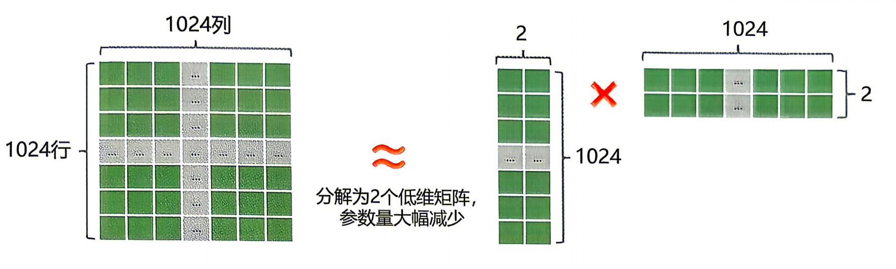
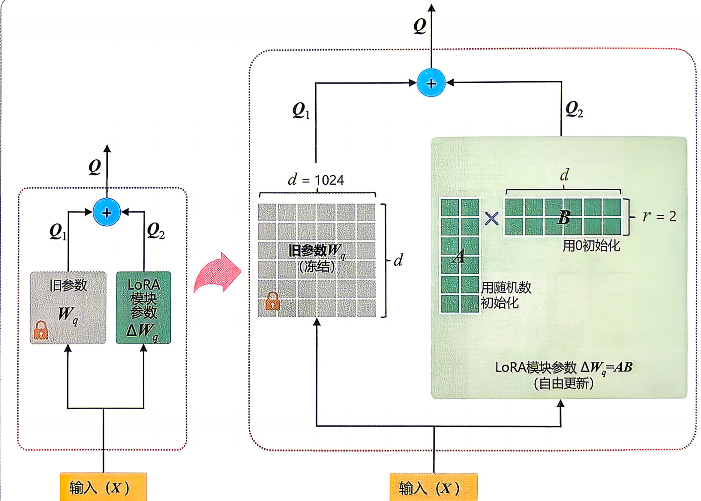
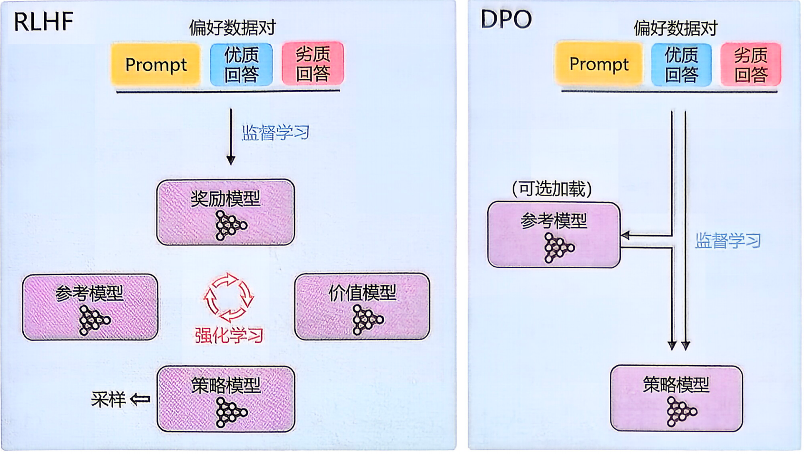
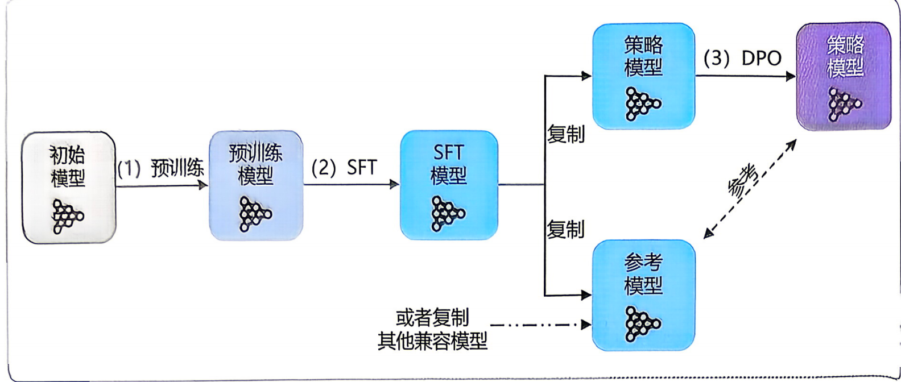
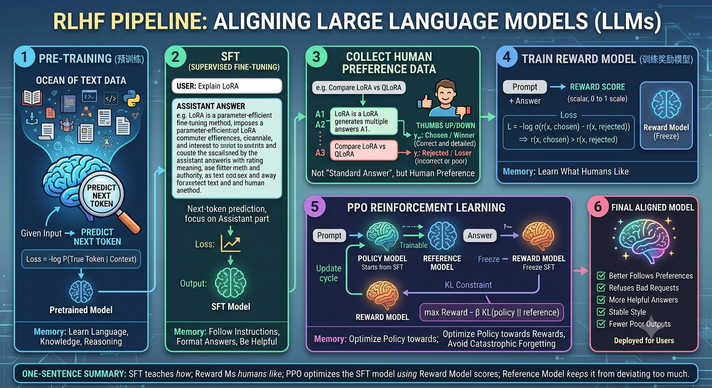
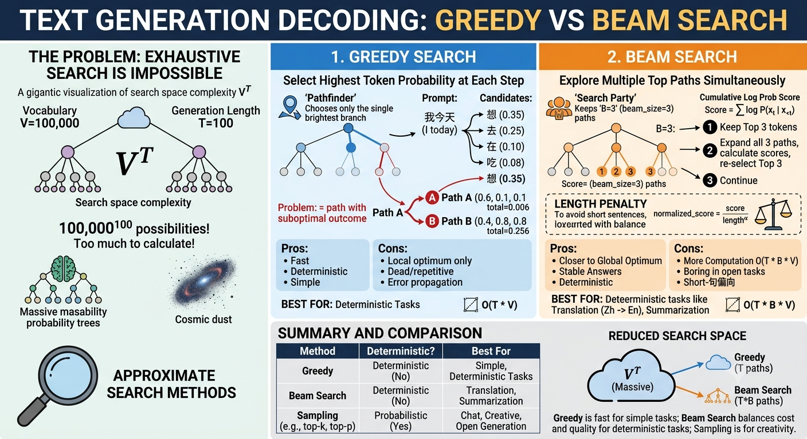
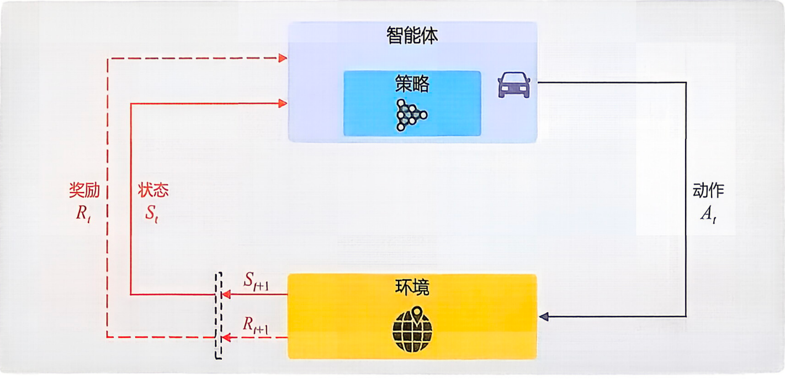

### lora属于 Adapter tuning 吗

**结论：** LoRA 通常不属于狭义的 Adapter tuning。它和 Adapter tuning 都属于 PEFT 参数高效微调方法，但实现方式不同。

**狭义 Adapter tuning：** 在模型层中插入额外的 bottleneck adapter 模块，只训练这些新增模块。

**LoRA：** 不插入完整 adapter 模块，而是在原有线性层旁边加入低秩增量 $\Delta W = BA$，只训练低秩矩阵。

所以更准确的说法是：**LoRA 属于 PEFT，但不是传统 bottleneck adapter tuning。**

### PEFT 参数高效微调

- Adapter tuning
  - 插入 bottleneck adapter 模块，冻结原模型参数，只在每层插入一个很小的可训练模块
- LoRA
  - 给线性层加低秩增量 $\Delta W = BA$
- Prefix tuning（备选方案）：给每层 attention 加一段可训练的虚拟前缀 key/value 
- Prompt tuning：只在输入 embedding 前加一小段可训练软提示 token
- IA3 （Infused Adapter by Inhibiting and Amplifying Inner Activations）：冻结大模型 + 训练少量缩放向量 + 调节内部激活通道，控制 attention/FFN 中通道的重要性
- BitFit ：只训练 bias 参数，其余权重全部冻结

**Bottleneck adapter 模块：**

```text
原始 hidden state: 4096 维
↓ 降维 Down Projection
中间瓶颈表示: 64 维
↓ 激活函数，例如 ReLU/GELU
中间瓶颈表示: 64 维
↓ 升维 Up Projection
输出 hidden state: 4096 维
```

公式大概是：

$$
\operatorname{Adapter}(x) = W_{\text{up}} \left( \operatorname{activation}(W_{\text{down}}x) \right)
$$

这个公式描述的是 Bottleneck adapter 怎么处理输入向量 $x$：

- **$x$：** 原始 hidden state，比如维度是 4096。
- **$W_{\text{down}}x$：** 先把 $x$ 从高维降到低维瓶颈空间，比如 $4096 \rightarrow 64$。
- **$\operatorname{activation}(W_{\text{down}}x)$：** 经过 ReLU/GELU 等非线性激活函数，让 adapter 有非线性表达能力。
- **$W_{\text{up}}(\cdot)$：** 再把低维瓶颈表示升回原始 hidden size，比如 $64 \rightarrow 4096$。

所以整个 adapter 做的是：

```text
原始 hidden state x
-> 降维到小向量
-> 过激活函数
-> 升维回原始维度
```

通常还会加残差连接：

$$
\operatorname{output} = x + \operatorname{Adapter}(x)
$$

意思是：原始信息 x 直接保留，同时 adapter 只学习一个小的修正量。


LoRA 微调前后模型的参数差异 $\Delta W$ 具有低秩性。因此，能够用低秩矩阵表征预训练模型与目标模型之间的差异 $\Delta W$。



**LoRA 和 QLoRA 的核心区别：** QLoRA = 量化后的大模型 + LoRA 微调



**LoRA：** 训练低秩适配矩阵；

**QLoRA：** 也是训练 LoRA，但把底座模型用低比特量化加载，通常是 4-bit，从而大幅降低显存。

**QLoRA 的量化：** 把冻结的大模型权重从 FP16/BF16 压成 4-bit 编号保存，计算时临时近似还原，只训练旁边的 LoRA 参数。

## SFT

**SFT 数据集：** 用来做 Supervised Fine-Tuning，有监督微调 的数据集

常见格式

```json
{
  "instruction": "解释什么是 LoRA",
  "input": "",
  "output": "LoRA 是一种参数高效微调方法，通过低秩矩阵近似权重更新..."
}
```

**LoRA、QLoRA：** 训练方法；**SFT 数据集：** 训练内容

**ChatML 对话模板里的特殊标记：**

基本结构

```text
<|im_start|>role message content<|im_end|>
```

例子：

```text
<|im_start|>system
你是一个严谨的机器学习助手。<|im_end|>
<|im_start|>user
什么是 LoRA？<|im_end|>
<|im_start|>assistant
LoRA 是一种参数高效微调方法。<|im_end|>
```

## logits

**logits：** 模型经过最后的词表投影层后，会对每个候选 token 给出未归一化分数 原始分数；

softmax 之后才是 token 概率。

```text
输入 tokens
-> Transformer 多层计算
-> 得到最后一层 hidden states
-> 经过 lm_head / output projection
-> 得到 logits
-> softmax 把 logits 转成概率
-> token 概率
```

**LM Head / 词表投影层 / vocab projection**

流程是：

```text
hidden state
↓
词表投影层
↓
每个 token 的 logit 分数
```

假设模型 hidden state 维度是 4096，词表大小是 50000。

最后一个位置的 hidden state 是：

$$
h \in \mathbb{R}^{4096}
$$

词表投影层是一个矩阵：

$$
W_{\text{vocab}} \in \mathbb{R}^{4096 \times 50000}
$$

计算：

$$
\operatorname{logits} = h W_{\text{vocab}}
$$

结果就是：

$$
\operatorname{logits} \in \mathbb{R}^{50000}
$$

这 50000 个数，每个数对应词表里的一个 token。

**Gather 在这里的意思就是：**

> 按照 label 指定的 token id，从一大堆概率里“取出正确答案那个 token 的概率”。

在 SFT 里，一条样本会先被 tokenizer 变成 input_ids

LLM 的 teacher forcing 就是训练时用真实 token 作为前文，让模型学习在正确上下文下预测下一个 token。

训练时：

```text
真实前文 -> 预测下一个 token
```

推理时：

```text
模型生成的前文 -> 预测下一个 token
```

```text
input_ids = [一整段对话的 token id]
labels = [每个位置对应的训练目标]
```

**input_ids：** 模型看到的完整上下文

**labels：** 需要模型学习预测的 token；不学的位置设为 -100

input_ids:

```text
[system/user tokens..., assistant answer tokens...]
```

labels:

```text
[-100, -100, -100, ..., assistant answer token ids...]
```

**-100 的意思是：** 这个位置不计算 loss。

**SFT 的 label：**

就是 assistant 答案部分的 token 目标，prompt 部分一般用 -100 屏蔽，不参与 loss。

**交叉熵损失函数：** 衡量的是模型预测概率分布和真实概率分布之间的差异。差异越大，loss 越大；差异越小，loss 越小。

**交叉熵：** 交叉熵衡量：如果真实数据来自分布 P，但我们用模型预测分布 Q 去编码/解释这些数据，平均需要多少信息量。

**香农熵 Shannon Entropy：** 衡量的是：

> 一个概率分布本身有多“不确定”。

公式是：

$$
H(p) = -\sum_i p_i \log p_i
$$

其中：

$p_i$ = 第 $i$ 个事件发生的概率

直观理解：

越确定，熵越低。

**SFT loss：** 只在 assistant 回答部分计算的 next-token cross entropy loss。

**softmax 的作用：** 把模型输出的原始打分 logits 转换成合法的 token 概率分布，可用于采样生成，也可用于计算训练损失。

**交叉熵损失：** 取真实 token 对应的预测概率 P，并计算 -log P，用来惩罚模型没有给真实 token 足够高的概率。

$$
\operatorname{logits} = [2.0, 1.0, -1.0]
$$

这些值有几个问题：

- 可以是负数
- 总和不等于 1
- 不能直接表示概率

**softmax 的作用：**

把一组任意分数 logits，转换成一组概率，并且所有概率加起来等于 1。

公式是：

$$
\operatorname{softmax}(x_i) = \frac{\exp(x_i)}{\sum_j \exp(x_j)}
$$

其中：

$x_i$ = 第 $i$ 个 token 的 logit

$\exp(x_i)$ = $e$ 的 $x_i$ 次方

$\sum_j \exp(x_j)$ = 所有 token 的 exp 分数之和

softmax 转换后满足：

- 每个 $p_i \ge 0$
- 所有 $p_i$ 加起来 = 1
- logit 越大，对应概率越大

举个例子：

$$
\operatorname{logits} = [2.0, 1.0, -1.0]
$$

第一步：对每个 logit 做指数运算：

$$
\exp(2.0) = 7.389
$$

$$
\exp(1.0) = 2.718
$$

$$
\exp(-1.0) = 0.368
$$

第二步：求和：

$$
7.389 + 2.718 + 0.368 = 10.475
$$

第三步：每个值除以总和：

$$
\frac{7.389}{10.475} = 0.705
$$

$$
\frac{2.718}{10.475} = 0.259
$$

$$
\frac{0.368}{10.475} = 0.035
$$

所以：

$$
\operatorname{softmax}([2.0, 1.0, -1.0]) \approx [0.705, 0.259, 0.035]
$$

也就是：

- token A 概率 70.5%
- token B 概率 25.9%
- token C 概率 3.5%

一句话总结：

> softmax 会把 logits 变成概率分布，分数越大的 token 概率越高，但所有 token 的概率总和必须等于 1。

**交叉熵损失函数：**

$$
\operatorname{CE} = -\log P(y)
$$

其中，$y$ 表示真实类别或真实 token。

## rlhf vs dpo

DPO 不再需要进行两阶段训练，在多个方面展现出独特优势，主要有以下三点。

- 一免：免去 Reward 模型 & 中途采样
- 二稳：监督学习，告别 RL 的不稳定
- 三省钱：只训一个模型，算力开销低



**RLHF 里 Reward Model 的偏好建模方式：** 

先把“人类更喜欢 y_w 而不是 y_l”建模成二分类问题，用 sigmoid 奖励差值表示偏好概率，再用负对数似然（-log P(真实结果)）训练奖励模型。

简单理解：Reward Model 学的不是“标准答案”，而是“同一个 prompt 下，哪个回答更符合人类偏好”。

如果 $y_w$ 是人类更喜欢的回答，$y_l$ 是人类不喜欢的回答，那么希望奖励模型满足：

$$
r(x, y_w) > r(x, y_l)
$$

模型训练时不能只写“大于”，再用 sigmoid 把两个奖励分数的差值变成“$y_w$ 胜过 $y_l$”的概率：

$$
P(y_w \succ y_l \mid x) = \sigma(r(x, y_w) - r(x, y_l))
$$

训练时最小化：

$$
\mathcal{L}_{RM} = -\log \sigma(r(x, y_w) - r(x, y_l))
$$

也就是：如果模型越相信人类喜欢的回答会胜出，loss 越小；如果判断反了，loss 越大。

**DPO 为什么不需要显式训练 Reward Model？**

DPO 则进一步把这个奖励模型替换成 policy/reference 的 log 概率比，因此叫隐式奖励建模。

**用 policy/reference 的 log 概率比差值替代显式奖励差值：**

$$
r_\theta(x, y) \approx \beta \log \frac{\pi_\theta(y \mid x)}{\pi_{\text{ref}}(y \mid x)}
$$

也就是：

$$
r_\theta(x, y) \approx \beta \left(\log \pi_\theta(y \mid x) - \log \pi_{\text{ref}}(y \mid x)\right)
$$

这里省略了只依赖 $x$ 的归一化常数；在比较 chosen 和 rejected 时，这个常数会抵消。

这里：

**$\pi_\theta$：** 当前正在训练的 policy model

**$\pi_{\text{ref}}$：** 冻结的 reference model，通常是 SFT 模型

**$\beta$：** 控制偏离 reference 的强度

**$\log \pi_\theta(y \mid x)$：** 当前 policy 生成回答 $y$ 的 log 概率。

**$\log \pi_{\text{ref}}(y \mid x)$：** 参考模型生成回答 $y$ 的 log 概率。

两者相减：

$$
\log \pi_\theta(y \mid x) - \log \pi_{\text{ref}}(y \mid x)
$$

表示当前模型相对参考模型，把这个回答的概率提高了多少。

**为什么可以替换？**

DPO 用了一个关键理论关系：

在带 KL 约束的 RLHF 目标下，

奖励函数 $r(x, y)$ 和最优策略 $\pi(y \mid x)$ 之间可以互相转换。

大模型常见训练链路：



```text
初始模型
-> 预训练
-> SFT
-> DPO
-> 最终策略模型
```

1. **策略模型：** 直接复制 SFT模型进行初始化。

2. **参考模型：** 通常也复制 SFT 模型。 但在某些情况下，可能会选择一个比 SFT 模型更强的复制。 此时，需特别关注参考模型与策略模型的匹配性，主要涉及两者的KL散度及训练数据分布等方面。

在 DPO 训练开始时，把同一个 SFT checkpoint 加载成两个模型对象

```text
SFT checkpoint
├── 加载一份 -> policy model，参与训练，参数会更新
└── 再加载一份 -> reference model，冻结，不参与训练
```

**DPO loss：** 在 DPO loss 里作为“原 SFT 概率基准”

policy 必须相对这个基准提高 chosen、压低rejected；

**RLHF：** 全称是 Reinforcement Learning from Human Feedback，中文常叫：

基于人类反馈的强化学习

```text
预训练模型
-> SFT
-> 训练奖励模型 Reward Model
-> 用 PPO/RL 优化策略模型
-> 对齐后的最终模型
```



### 1. 预训练

先用海量文本训练基础模型：

```text
给定前文 -> 预测下一个 token
```

**loss：** 普通语言模型 loss：

$$
\mathcal{L}_{\text{LM}} = -\log P(x_t \mid x_{<t})
$$

这个阶段让模型学到语言、知识、推理模式。

结果是：

```text
pretrained model
```

### 2. SFT 监督微调

然后用人工构造的指令数据做监督微调：

```text
prompt -> assistant answer
```

比如：

```text
用户：解释 LoRA
助手：LoRA 是一种参数高效微调方法...
```

**SFT：** 仍然是 next-token prediction，只是通常只对 assistant 回答部分算 loss。

结果是：

```text
SFT model
```

这一步让模型学会：

- 听指令
- 按对话格式回答
- 输出更像助手

### 3. 收集人类偏好数据

接着让 SFT 模型针对同一个 prompt 生成多个回答，然后人工标注哪个更好。

数据通常长这样：

```text
x: prompt
y_w: chosen / winner / 更好的回答
y_l: rejected / loser / 更差的回答
```

例如：

```text
x: 解释 LoRA 和 QLoRA 的区别
chosen: LoRA 是低秩适配微调；QLoRA 是量化底座模型上的 LoRA...
rejected: LoRA 和 QLoRA 完全一样。
```

**偏好数据：** 不是“标准答案”，而是： 人类更喜欢 chosen，而不是 rejected

### 4. 训练奖励模型 Reward Model

**奖励模型：** 记作：

$$
r_\phi(x, y)
$$

它输入：

```text
prompt + answer
```

输出一个标量分数：

```text
reward score
```

**训练目标：**

$$
r_\phi(x, y_w) > r_\phi(x, y_l)
$$

**常见 loss：**

$$
\mathcal{L} = -\log \sigma\left(r_\phi(x, y_w) - r_\phi(x, y_l)\right)
$$

意思是：让奖励模型认为 chosen 胜过 rejected 的概率更高。

训练完之后，奖励模型就可以给任意回答打分：

```text
回答越符合人类偏好 -> reward 越高
```

### 5. 用 PPO 优化策略模型

这一步才是真正的 RLHF 强化学习阶段。

会有几个模型：

- **policy model：** 要训练的模型，通常从 SFT 初始化
- **reference model：** 冻结的 SFT 模型，用来限制 policy 不要跑太远
- **reward model：** 冻结，用来给回答打分

流程是：

```text
prompt 输入 policy model
policy model 生成回答
reward model 给回答打分
PPO 根据 reward 更新 policy model
reference model 提供 KL 约束
```

优化目标大概是：

```text
提高 reward
同时不要让 policy 偏离 reference 太远
```

可以理解成：

```text
让模型更符合人类偏好
但不要把原来的语言能力和指令能力训坏
```

**PPO/RLHF 的目标：** 近似是：

$$
\max_\theta \; \mathbb{E}[r] - \beta D_{\mathrm{KL}}\left(\pi_\theta \,\|\, \pi_{\text{ref}}\right)
$$

其中：

- **$\mathbb{E}[r]$：** 奖励模型给的期望分数
- **$D_{\mathrm{KL}}(\pi_\theta \,\|\, \pi_{\text{ref}})$：** policy 和原 SFT 模型的分布差异
- **$\beta$：** 控制约束强度

### 6. 最终得到对齐模型

训练结束后，部署的是：

```text
优化后的 policy model
```

它相比 SFT 模型通常更擅长：

- 遵循人类偏好
- 拒绝不合适请求
- 回答更有帮助
- 风格更稳定
- 减少明显糟糕输出

一句话总结

SFT 教模型“怎么回答”；

奖励模型学习“人类喜欢什么回答”；

PPO 用奖励模型继续优化 SFT 模型；

reference model 负责约束 policy 不要偏离原来的 SFT 太远。

所以 RLHF 的核心链路是：

```text
预训练 -> SFT -> 偏好数据 -> 奖励模型 -> PPO 强化学习 -> 对齐后的模型
```

## 自回归解码的概率原理

**自回归解码的概率原理：** 核心是：

大模型不是一次性生成完整文本，

而是每次预测下一个 Token，

再把这个 Token 加入上下文，

继续预测下一个 Token。

在自回归语言模型中，生成序列 x_1, ..., x_T 的概率可以分解为每一步条件概率的乘积：

$$
P(x_{1:T} \mid \text{prompt}) = \prod_{t=1}^{T} P(x_t \mid \text{prompt}, x_{<t})
$$

其中，$x_{<t}$ 表示当前位置之前的所有 token。模型在每一步根据当前上下文输出一个维度为 vocab_size 的 logits 向量，经 softmax 后得到下一个 token 的概率分布。

为了避免多个小概率相乘带来的数值下溢，实际计算中通常使用对数概率：

$$
\log P(x_{1:T} \mid \text{prompt}) = \sum_{t=1}^{T} \log P(x_t \mid \text{prompt}, x_{<t})
$$

这样可以将乘法转换为加法，同时保持序列概率排序不变。

## greedy vs beam search

**Greedy search 和 beam search：** 都是生成文本时的解码策略，用来决定模型下一步输出哪个 token

理想上，生成时希望找到：

```text
概率最高的完整序列
```

也就是：

$$
\arg\max_{x_{1:T}} P(x_{1:T} \mid \text{prompt})
$$

但真实情况里，完整搜索空间太大，不可能枚举所有序列。

所以实际解码方法都是近似：

- greedy search：每一步选当前概率最高的 token
- beam search：保留多个候选路径，近似找整体高概率序列
- 翻译 / 摘要 / 结构化生成：Beam Search 仍然有用




## Sampling 系列

开放式对话 / 创作：更常用 sampling + temperature/top-p/top-k

**multinomial sampling 的核心：**

```text
把每个 Token 的概率当成抽奖权重。
概率越大，中奖区间越大；
概率越小，中奖区间越小；
但只要概率不是 0，就仍然有可能被抽中。
```

**temperature：** 不删除 Token，而是调整概率分布的尖锐程度

公式：

$$
\operatorname{probs} = \operatorname{softmax}\left(\frac{\operatorname{logits}}{\operatorname{temperature}}\right)
$$

如果 temperature < 1，比如：

$$
\operatorname{temperature} = 0.7
$$

高概率 Token 会更高，低概率 Token 会更低。

效果：

- 更容易抽到高概率 Token
- 更不容易抽到低概率 Token
- 生成更稳

**top-k：** 只保留概率最高的 k 个 Token，其他全部设为 0。然后重新归一化。

比如：

$$
\text{top-k} = 3
$$

原始概率：

```text
A: 0.40
B: 0.25
C: 0.15
D: 0.08
E: 0.04
F: 0.02
...
```

只保留：

```text
A
B
C
```

其他 Token：

```text
D/E/F/... 概率变成 0
```

然后重新归一化：

$$
A: \frac{0.40}{0.80} = 0.50
$$

$$
B: \frac{0.25}{0.80} = 0.3125
$$

$$
C: \frac{0.15}{0.80} = 0.1875
$$

```text
模型输出 logits
→ temperature 调整 logits
→ top-k 保留前 k 个 Token
→ softmax 重新得到概率
→ multinomial sampling 抽样
```

伪代码

```python
# 输入：
# prompt_tokens: 当前上下文 token ids
# model: 训练好的语言模型
# temperature: 温度参数，例如 0.7
# top_k: 只保留概率最高的 k 个 token，例如 50
# max_new_tokens: 最多生成多少个 token

tokens = prompt_tokens

for step in range(max_new_tokens):
    # 1. 模型前向计算
    # logits shape: [seq_len, vocab_size]
    logits = model(tokens)

    # 2. 只取最后一个位置的 logits
    # next_token_logits shape: [vocab_size]
    next_token_logits = logits[-1]

    # 3. temperature 调整 logits
    # temperature 越小，分布越尖锐；越大，分布越平
    if temperature > 0:
        next_token_logits = next_token_logits / temperature
    else:
        # temperature = 0 时通常直接 greedy
        next_token_id = argmax(next_token_logits)
        tokens.append(next_token_id)
        continue

    # 4. top-k 过滤
    # 找出 logits 最大的 k 个 token
    topk_values, topk_indices = top_k(next_token_logits, k=top_k)

    # 创建一个全是 -inf 的 logits
    filtered_logits = full_like(next_token_logits, -inf)

    # 只保留 top-k token 的 logits
    filtered_logits[topk_indices] = next_token_logits[topk_indices]

    # 5. softmax 转成概率
    # 被设为 -inf 的 token，softmax 后概率会变成 0
    probs = softmax(filtered_logits)

    # 6. multinomial sampling
    # 按概率随机抽一个 token
    next_token_id = multinomial_sample(probs, num_samples=1)

    # 7. 拼回上下文
    tokens.append(next_token_id)

    # 8. 检查是否结束
    if next_token_id == eos_token_id:
        break

    # 9. 解码成文本
    text = tokenizer.decode(tokens)
```

## 强化学习基础概念

强化学习基础概念



智能体（Agent）在环境（Environment）里，看状态（State），按策略（Policy），

做动作（Action），拿奖励（Reward）。

**马尔可夫链：**

$$
P(S_{t+1}=s_{t+1} \mid S_t=s_t)
=
P(S_{t+1}=s_{t+1} \mid S_t=s_t, S_{t-1}=s_{t-1}, \ldots, S_0=s_0)
$$

**马尔可夫性质：**

下一状态的概率只依赖当前状态，而与更早的历史状态无关
