目录

## 1. 机器学习模型 「第4 页」
[1.1  有监督学习模型 4 ](#_Toc1660 )
[1.2  无监督学习模型 5 ](#_Toc10970 )
[1.3  概率模型 5 ](#_Toc18059 )
[1.4 什么是监督学习？什么是非监督学习？ 6 ](#_Toc1915 )
[回归，分类，聚类方法的区别和联系并举例，简要介绍算法思路。6 ](#_Toc17609 )
[生成模式 vs 判别模式 6 ](#_Toc21738 )

## 2. 线性模型 「第7 页」
[2.1 线性回归 7 ](#_Toc5469 )
[2.2  LR 11 ](#_Toc5372 )
[2.3  Lasso 14 ](#_Toc9181 )
[2.4  Ridge 14 ](#_Toc28468 )
[2.5  Lasso vs Ridge 15 ](#_Toc14184 )
[2.6  线性回归 vs LR 15 ](#_Toc10939 )

## 3. 验证方式 「第15 页」
[3.1 什么是过拟合？产生过拟合原因? 15 ](#_Toc30930 )
[3.2  如何避免过拟合问题？ 15 ](#_Toc2284 )
[3.3  什么是机器学习的欠拟合？ 16 ](#_Toc9929 )
[3.4  如何避免欠拟合问题？ 16 ](#_Toc22255 )
[3.5  什么是交叉验证？交叉验证的作用是什么？ 16 ](#_Toc7224 )
[3.6  交叉验证主要有哪几种方法？ 16 ](#_Toc2888 )
[3.7 什么是K折交叉验证？ 16 ](#_Toc2724 )
[3.8  如何在K折交叉验证中选择K？ 17 ](#_Toc23580 )
[3.9  网格搜索（GridSearchCV） 17 ](#_Toc6524 )
[3.10 随机搜素（RandomizedSearchCV） 17 ](#_Toc10933 )

## 4. 分类 「第19 页」
[4.1 什么是准确率,精准率,召回率和F1 分数？混淆矩阵 19 ](#_Toc22386 )
[4.2 模型常用的评估指标有哪些？ 19 ](#_Toc3425 )
[4.3  多标签分类怎么解决？ 20 ](#_Toc27922 )

## 5. 正则化 「第20 页」
[手推L1 ,L2  20 ](#_Toc8895 )
[5.1  什么是正则化？如何理解正则化？ 21 ](#_Toc24724 )
[5.2  L0 、L1 、L2 正则化？ 21 ](#_Toc25321 )
[5.3  L1 和L2 正则化有什么区别？‍ 21 ](#_Toc28908 )
[5.4  L1 在0 处不可导是怎么处理的？ 21 ](#_Toc21322 )
[5.5  L1 正则化产生稀疏性的原因?对稀疏矩阵的理解？ 22 ](#_Toc30826 )
[5.6 为何要常对数据做归一化？ 22 ](#_Toc26471 )
[5.7 归一化的种类 22 ](#_Toc30688 )
[5.8 归一化和标准化的区别 22 ](#_Toc1180 )
[5.9  需要归一化的算法有哪些？这些模型需要归一化的主要原因？22 ](#_Toc28766 )
[5.10  树形结构的不需要归一化的原因？ 23 ](#_Toc20964 )

## 6. 特征工程 「第23 页」
[6.1 特征选择 23 ](#_Toc878 )
[6.2  特征提取 24 ](#_Toc12969 )
[6.3  特征选择 vs 特征提取 24 ](#_Toc4102 )
[6.4 为什么要处理类别特征？怎么处理？ 24 ](#_Toc25013 )
[6.5 什么是组合特征？ 24 ](#_Toc28292 )
[6.6 怎么有效地找到组合特征？ 24 ](#_Toc17647 )
[6.7 如何处理高维组合特征？ 24 ](#_Toc987 )
[6.8 如何解决数据不平衡问题？ 25 ](#_Toc5760 )
[6.9  数据中有噪声如何处理？ 25 ](#_Toc31759 )
[6.10  FM 25 ](#_Toc597 )
[6.11  FFM 26 ](#_Toc21437 )

## 7. 决策树 「第26 页」
[7.1  ID3 算法 26 ](#_Toc5427 )
[7.2  C4.5 算法 26 ](#_Toc7176 )
[7.3  CART算法 27 ](#_Toc8232 )
[7.4  ID3  vs C4.5  vs CART 27 ](#_Toc25586 )
[7.5  决策树 28 ](#_Toc25876 )
[熵(entropy) 30 ](#_Toc27103 )
[7.6  信息增益 31 ](#_Toc31415 )
[7.7 信息增益率 32 ](#_Toc30411 )
[7.8  Hard Voting vs Soft Voting 32 ](#_Toc1975 )

## 8. KNN 「第33 页」
[8.1  简述一下KNN算法的原理? 33 ](#_Toc10941 )
[8.2  如何理解kNN中的k的取值？ 33 ](#_Toc18129 )
[8.3  在kNN的样本搜索中，如何进行高效的匹配查找？ 33 ](#_Toc8482 )
[8.4  KNN算法有哪些优点和缺点？ 33 ](#_Toc25791 )
[8.5  不平衡的样本可以给KNN的预测结果造成哪些问题，有没有什么好的解决方式？34 ](#_Toc3291 )
[8.6  为了解决KNN算法计算量过大的问题，可以使用分组的方式进行计算，简述一下该方式的原理。34 ](#_Toc15068 )
[8.7 如何优化Kmeans? 34 ](#_Toc18075 )
[8.8  在k-means或kNN，我们是用欧氏距离来计算最近的邻居之间的距离。为什么不用曼哈顿距离？34 ](#_Toc19145 )
[8.9  参数说明以及调参 34 ](#_Toc9053 )

## 9. SVM 「第35 页」
[SVM的推导 35 ](#_Toc26552 )
[9.1  SVM的原理是什么？ 37 ](#_Toc18043 )
[9.2  SVM 为什么采用间隔最大化？ 37 ](#_Toc3165 )
[9.3  为什么 SVM 要引入核函数？ 37 ](#_Toc4512 )
[9.4  为什么SVM对缺失数据敏感？ 37 ](#_Toc32715 )
[9.5  SVM 核函数之间的区别 37 ](#_Toc20650 )
[9.6  SVM如何处理多分类问题？ 38 ](#_Toc12443 )
[9.7 带核的SVM为什么能分类非线性问题？ 38 ](#_Toc9408 )
[9.8  RBF核一定是线性可分的吗？ 38 ](#_Toc2538 )
[9.9 常用核函数及核函数的条件？ 38 ](#_Toc14612 )
[9.10 为什么要将求解 SVM 的原始问题转换为对偶问题？ 38 ](#_Toc29788 )
[9.11  SVM怎么输出预测概率？ 39 ](#_Toc24810 )
[9.12 如何处理数据偏斜？ 39 ](#_Toc4909 )
[9.13  LR vs SVM 39 ](#_Toc589 )
[9.14  参数说明 39 ](#_Toc11867 )
[9.15  LinearSVC vs SVC 40 ](#_Toc20859 )

## 10. 集成学习 「第40 页」
[10.1  Boosting(提升法) 41 ](#_Toc13860 )
[10.2  Bagging(套袋法) 49 ](#_Toc25294 )
[10.3  Bagging vs Boosting 51 ](#_Toc27285 )
[10.4  随机森林 vs GBDT 52 ](#_Toc32046 )
[10.5  AdaBoost vs GBDT 52 ](#_Toc28983 )
[10.6  XGBoost vs GBDT 52 ](#_Toc30991 )
[10.7  XGBoost vs LightGBM 53 ](#_Toc16222 )

## 11. 无监督学习 「第53 页」
[11.1 聚类 53 ](#_Toc3531 )
[11.2 降维 55 ](#_Toc29572 )

## 12. 概率模型 「第58 页」
[12.1  朴素贝叶斯 58 ](#_Toc7416 )
[12.2  朴素贝叶斯 vs LR 59 ](#_Toc30074 )

## 13. 机器学习常见问题/面试题 「第60 页」
[13.1 你是怎么理解偏差和方差的平衡的？ 60 ](#_Toc3379 )
[13.2  给你一个有1000 列和1 百万行的训练数据集，这个数据集是基于分类问题的。经理要求你来降低该数据集的维度以减少模型计算时间，但你的机器内存有限。你会怎么做？60 ](#_Toc30001 )
[13.3  给你一个数据集，这个数据集有缺失值，且这些缺失值分布在离中值有1 个标准偏差的范围内。百分之多少的数据不会受到影响？为什么？60 ](#_Toc24267 )
[13.4  模型受到低偏差和高方差问题时，应该使用哪种算法来解决问题呢？61 ](#_Toc27562 )
[13.5 怎么理解偏差方差的平衡的？ 61 ](#_Toc16829 )
[13.6 协方差和相关性有什么区别？ 61 ](#_Toc31844 )
[13.7  把分类变量当成连续型变量会更得到一个更好的预测模型吗？61 ](#_Toc15613 )
[13.8  机器学习中分类器指的是什么？ 61 ](#_Toc10645 )
[13.10 请简要说说一个完整机器学习项目的流程？ 61 ](#_Toc19119 )

**一、机器学习**

## 1.机器学习模型 {#_Toc4139  .anchor}

### 1.1  有监督学习模型 {#_Toc1660  .anchor}

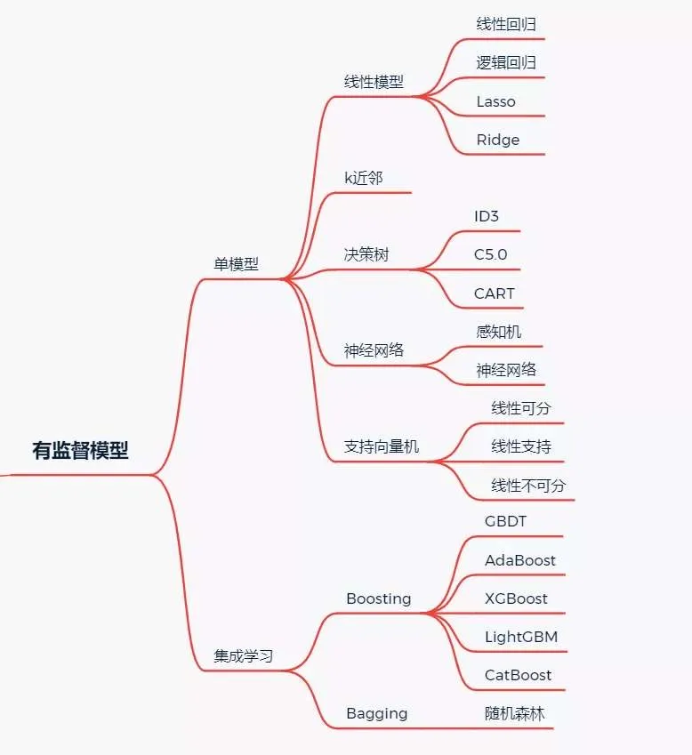

### 1.2  无监督学习模型 {#_Toc10970  .anchor}

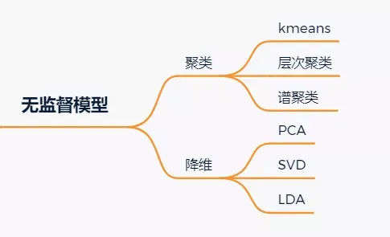

### 1.3  概率模型 {#_Toc18059  .anchor}

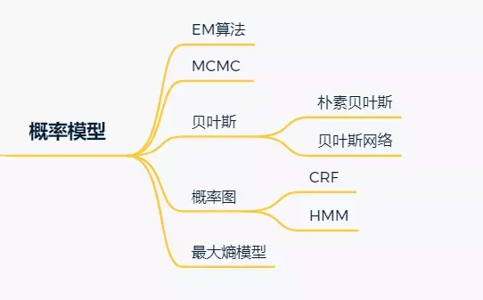

### 1.4 什么是监督学习？什么是非监督学习？ {#_Toc1915  .anchor}

#### 【监督学习核心】
#### 【监督学习完整工作流程】
1. **模型定义**：本质是拟合映射函数 \( y = f(x, \phi) \)，其中 \( x \) 是输入特征，\( y \) 是输出预测结果，\( \phi \) 是模型可学习参数；同一输入在不同参数下会得到不同预测结果。
2. **数据前提**：训练数据为标注样本对集合 \( \{x_i, y_i\} \)，\( x_i \) 是输入特征，\( y_i \) 是对应真实标签。
3. **训练过程**：通过损失函数衡量预测值与真实标签的误差，训练目标是找到最优参数 \( \hat{\phi} = \underset{\phi}{\arg\min} L(\phi) \)，使得整体损失最小。
4. **推理预测**：训练得到可泛化模型后，对仅含特征的未知新输入，直接代入函数即可输出预测结果。
5. **效果验证**：用训练时未见过的测试集评估模型泛化能力，检测过拟合/欠拟合问题，确保模型在新数据上的可用性。

**监督学习：利用带标签的输入‑输出配对数据，学习一个从输入到输出的映射模型**。

**非监督学习**：只有输入数据，没有对应的输出标签，不存在 “标准答案” 做监督。目标是挖掘、描述数据本身内在的结构、模式与分布。例如**强化学习、K-means聚类、自编码、受限波尔兹曼机**。

**半监督学习**：一小部分数据有标签，海量数据没有标签。

目前最广泛被使用的分类器有人工神经网络、支持向量机、最近邻居法、高斯混合模型、朴素贝叶斯方法、决策树和径向基函数分类。

无监督学习里典型的例子就是聚类了。聚类的目的在于把相似的东西聚在一起，一个聚类算法通常只需要知道如何计算相似度就可以开始工作了。

### 回归、分类、聚类对比 {#_Toc17609  .anchor}
| 类型 | 学习方式 | 输出类型 | 举例 |
|------|----------|----------|------|
| 回归 | 监督学习 | 连续数值 | 房价预测、销售额预估 |
| 分类 | 监督学习 | 离散类别 | 垃圾邮件判断、手写数字识别 |
| 聚类 | 无监督学习 | 自动分组 | 用户分群、异常点识别 |

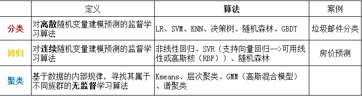

### 生成模式 vs 判别模式{#_Toc21738  .anchor}
| 类型 | 核心逻辑 | 典型算法 |
|------|----------|----------|
| ✅ 生成模型 | 先学**联合分布P(X,Y)**，再推导P(Y|X)做预测 | 朴素贝叶斯、HMM、GMM、LDA、GAN、LLM |
| ✅ 判别模型 | 直接学**决策边界/条件分布P(Y|X)**，直接做预测 | LR、SVM、决策树、KNN、XGBoost、神经网络 |

> 📝 速记口诀：**生成学分布，判别学分界**

## 2.线性模型 {#_Toc7185  .anchor}

### 2.1 线性回归 {#_Toc5469  .anchor}

**原理**: 用**线性函数**拟合数据，用 **MSE** 计算损失，然后用梯度下降法(GD)找到一组使 MSE **最小**的权重。

**线性回归的推导**

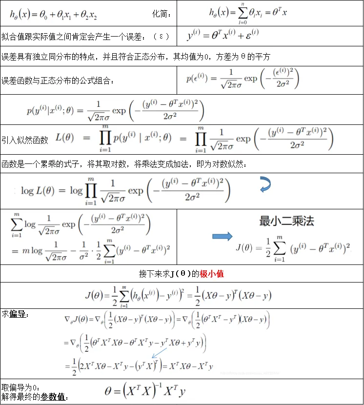

#### 2.1.1  什么是回归？哪些模型可用于解决回归问题？
回归的核心：分析**因变量y（输出结果）**与**自变量\(\boldsymbol x\)（输入特征）**之间**定量映射关系**。

| 回归算法类型 | 核心特点 | 注意事项 |
|--------------|----------|----------|
| 线性回归 | 拟合特征与因变量的线性关系 | 对异常值非常敏感，训练前需提前做异常值处理 |
| 多项式回归 | 引入特征的高次项，可拟合非线性关系 | 指数（阶数）选择不当容易过拟合，需配合正则化约束 |
| 岭回归 | 加入L2正则项（参数平方和惩罚），缓解过拟合 | 会保留所有特征，适合特征维度不太高的场景 |
| Lasso回归 | 加入L1正则项（参数绝对值和惩罚），可自动做特征选择 | 会将不重要特征的参数压缩为0，自动筛选有效特征 |
| 弹性网络回归 | 同时加入L1+L2正则，结合岭回归和Lasso的优点 | 适合特征维度高、特征间存在多重共线性的场景 |

#### 2.1.2  线性回归的损失函数为什么是均方差?

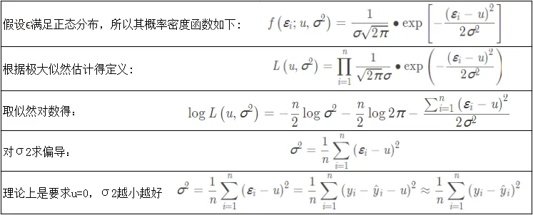

#### 2.1.3  什么是线性回归？什么时候使用它？

利用最小二乘函数对一个或多个自变量和因变量之间关系进行建模的一种回归分析.

（1 ）自变量与因变量呈直线关系;
（2 ）因变量符合正态分布;
（3 ）因变量数值之间独立;
（4 ）方差是否齐性。

#### 2.1.4  什么是梯度下降？SGD的推导？
**梯度下降核心概念**：梯度是函数在某点处上升最快的方向，梯度下降则是沿着梯度的反方向不断迭代更新参数，使损失函数逐步降低到最小值的优化算法。核心三要素：**学习率**（步长，控制每次更新的幅度）、**梯度计算**（损失函数对参数的导数）、**停止条件**（损失收敛或达到最大迭代次数）。

常见梯度下降变种：
- **BGD（批量梯度下降）**：
  遍历全部数据集计算一次loss函数，然后算函数对各个参数的梯度，更新梯度。优点是全局最优，收敛稳定；缺点是大数据集下训练速度极慢。
- **SGD（随机梯度下降）**：
  每次随机选取**单个样本**计算梯度并更新参数。优点是训练速度快，支持在线学习；缺点是更新方向波动大，容易陷入局部最优，收敛不稳定。
- **MBGD（小批量梯度下降，工程真正在用）**：
  每次选取**一小批样本**（通常为2 的幂次，如32 、64 、128 ）计算梯度并更新参数。结合了BGD和SGD的优点，是目前工业界最常用的梯度下降实现方式。

##### 梯度下降/SGD核心推导（对应图片文字版）
1. **梯度下降通用迭代公式**：
   目标是最小化损失函数 \( L(\phi) \)（\( \phi \) 为模型参数），梯度 \( \nabla L(\phi) = \frac{\partial L}{\partial \phi} \) 是损失在该点上升最快的方向，因此沿梯度反方向更新参数：
   $$ \phi_{t+1} = \phi_t - \eta \cdot \nabla L(\phi_t) $$
   其中 \( \eta \) 为学习率（步长），控制每次更新的幅度。
2. **SGD和BGD的核心差异**：
   - BGD：用全量n个样本计算平均梯度 \( \nabla L(\phi) = \frac{1}{n}\sum_{i=1}^n \nabla L_i(\phi) \)，计算量大但梯度准确
   - SGD：每次仅随机选取1个样本计算梯度 \( \nabla L(\phi) \approx \nabla L_i(\phi) \)，用单样本梯度近似全量梯度，大幅降低计算量
3. **三类变种对比**：
   | 变种 | 单轮迭代用样本数 | 速度 | 收敛稳定性 | 适用场景 |
   |------|------------------|------|------------|----------|
   | BGD | 全量n个 | 慢 | 稳定，易全局最优 | 小数据集 |
   | SGD | 1个 | 极快 | 波动大，易陷入局部最优 | 在线学习、超大数据集 |
   | MBGD | 小批量32/64/128个 | 快 | 较稳定，兼顾效率精度 | 工业界通用 |

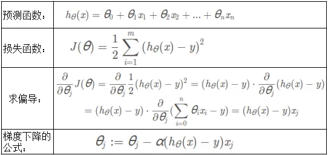
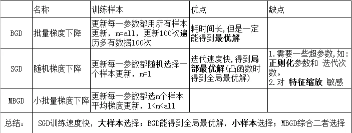
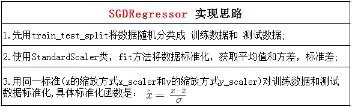

#### 2.1.5  什么是最小二乘法（最小平方法）？
它通过最小化误差的平方和寻找数据的最佳函数匹配。
##### 极简推导（以一元线性回归为例）：
1. **模型定义**：假设拟合直线为 \( y = wx + b \)，\( w \) 为斜率，\( b \) 为截距
2. **损失函数**：最小化残差平方和：
   $$ L = \sum_{i=1}^{n} (y_i - (wx_i + b))^2 $$
   其中 \( (x_i, y_i) \) 为第 \( i \) 个样本，\( n \) 为总样本数
3. **最优解**：对 \( w \)、\( b \) 分别求偏导并令导数为0，解得闭式解：
   $$
   w = \frac{n\sum x_i y_i - \sum x_i \sum y_i}{n\sum x_i^2 - (\sum x_i)^2}, \quad
   b = \bar{y} - w\bar{x}
   $$
   其中 \( \bar{x}、\bar{y} \) 分别为x、y的样本均值

#### 2.1.6  常见的损失函数有哪些？
| 损失函数类型 | 核心定义 & 适用场景 |
|--------------|---------------------|
| **0-1损失** | 直接统计预测错误的样本数，最朴素的分类损失；不可导，一般不直接用于优化 |
| **均方差损失(MSE)** | 计算预测值与真实值差的平方的均值，回归任务最常用损失；对异常值比较敏感 |
| **平均绝对误差(MAE)** | 计算预测值与真实值差的绝对值的均值，用于回归任务；对异常点更鲁棒 |
| **分位数损失(Quantile Loss)** | 拟合目标值的指定分位数，可自定义高估/低估的惩罚权重，用于分位数回归场景 |
| **交叉熵损失** | 衡量两个概率分布的差异，分类任务最常用损失，适用于二分类、多分类、多标签分类 |
| **合页损失(Hinge Loss)** | SVM的核心二分类损失，目标是最大化分类间隔，仅惩罚预测错误、置信度不足的样本；标准SVM损失为「Hinge Loss + L2正则化」 |

合页损失标准公式（二分类场景，标签取值 \( y \in \{-1, 1\} \)，\( f(x) \) 为模型输出）：
$$ L(y, f(x)) = \max(0, 1 - y \cdot f(x)) $$
> 说明：样本分类正确且置信度足够（\( y \cdot f(x) \geq 1 \)）时损失为0，否则损失随置信度不足程度线性上升。

#### 2.1.7  有哪些评估回归模型的指标？

衡量线性回归法最好的指标： **R Squared**
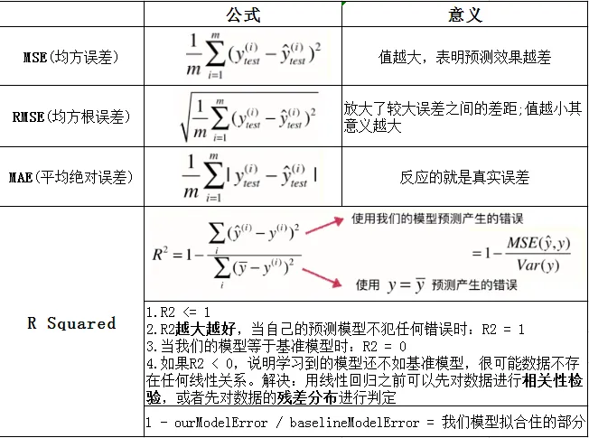

#### 2.1.8  什么是正规方程？‍

正规方程组是根据**最小二乘法**原理得到的关于参数估计值的线性方程组。
正规方程通过最小化**均方误差代价函数**寻找最优参数：
$$ J(w) = \frac{1}{2} \| Xw - y \|_2^2 $$
令代价函数对参数w的梯度为0，解得闭式解：
$$ w = (X^T X)^{-1} X^T y $$
> 符号说明：X为设计矩阵（每行对应1个样本，首列通常补全1表示截距项），y为真实标签向量，\((X^T X)^{-1}\)为矩阵X转置乘X的逆矩阵。

#### 2.1.9  梯度下降法找到的一定是下降最快的方向吗？

不一定，它只是目标函数在当前的点的切平面上下降最快的方向。
在实际执行期中，**牛顿方向**（考虑海森矩阵）才一般被认为是下降最快的方向，可以达到**超线性**的收敛速度。梯度下降类的算法的收敛速度一般是**线性**甚至**次线性**的（在某些带复杂约束的问题）。

#### 2.1.10  MBGD需要注意什么?

如何选择m？一般m取2 的幂次方能充分利用矩阵运算操作。

一般会在每次遍历训练数据之前，先对所有的数据进行随机排序，然后在每次迭代时按照顺序挑选m个训练集数据直至遍历完所有的数据。

什么是正态分布？为什么要重视它？

如何检查变量是否遵循正态分布？‍

如何建立价格预测模型？价格是否正态分布？需要对价格进行预处理吗？‍

### 2.2  LR {#_Toc5372  .anchor}

也称为\"**对数几率回归**\"。

**知识点提炼**

1. 分类，经典的**二分类**算法！

2. LR的过程：面对一个回归或者分类问题，建立**代价函数**，然后通过优化方法迭代求解出最优的模型参数，然后测试验证这个求解的模型的好坏。

3. Logistic
回归虽然名字里带"回归"，但是它实际上是一种分类方法，主要用于**两分类**问题（即输出只有两种，分别代表两个类别）

4. 回归模型中，y 是一个定性变量，比如 y = 0  或 1 ，logistic
方法主要应用于研究某些事件发生的概率。

5. LR的本质：**极大似然估计**

6. LR的激活函数：**Sigmoid**

7. LR的代价函数：**交叉熵**

**优点**：

1. 速度快，适合二分类问题

2. 简单易于理解，直接看到各个特征的权重

3. 能容易地更新模型吸收新的数据

**缺点**：

对数据和场景的适应能力有局限性，不如决策树算法适应性那么强。

LR中最核心的概念是 Sigmoid 函数，Sigmoid函数可以看成LR的激活函数。

Regression 常规步骤：

寻找h函数（即预测函数）

构造J函数（损失函数）

想办法（迭代）使得J函数最小并求得回归参数（θ）

LR**伪代码**：

初始化线性函数参数为1

构造sigmoid函数

重复循环I次

计算数据集梯度

更新线性函数参数

确定最终的sigmoid函数

输入训练（测试）数据集

运用最终sigmoid函数求解分类

**LR的推导**

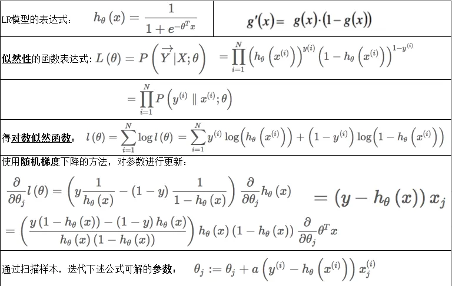

**2.2.1 为什么 LR 要使用 sigmoid 函数？**

1. 广义模型推导所得 2.满足统计的最大熵模型 3.性质优秀，方便使用

（Sigmoid函数是平滑的，而且任意阶可导，一阶二阶导数可以直接由函数值得到不用进行求导，这在实现中很实用）

**2.2.2 为什么常常要做特征组合（特征交叉）？**

LR模型属于线性模型，线性模型不能很好处理非线性特征，特征组合可以引入非线性特征，提升模型的表达能力。

另外，基本特征可以认为是全局建模，组合特征更加精细，是个性化建模，但对全局建模会对部分样本有偏，

对每一个样本建模又会导致数据爆炸，过拟合，所以基本特征+特征组合兼顾了全局和个性化。

**2.2.3 为什么LR比线性回归要好？**

LR和线性回归首先都是广义的线性回归，

其次经典线性模型的优化目标函数是最小二乘，而LR则是似然函数，

另外线性回归在整个实数域范围内进行预测，敏感度一致，而分类范围，需要在\[0 ,1\]。LR就是一种减小预测范围，将预测值限定为\[0 ,1\]间的一种回归模型，因而对于这类问题来说，LR的**鲁棒性**比线性回归的要好

**2.2.4  LR参数求解的优化方法？(机器学习中常用的最优化方法)**

梯度下降法，随机梯度下降法，牛顿法，拟牛顿法（LBFGS，BFGS,OWLQN）

目的都是求解某个函数的极小值。

**2.2.5 工程上，怎么实现LR的并行化？有哪些并行化的工具？**

LR的并行化最主要的就是对目标函数梯度计算的并行化。

**无损的并行化**：算法天然可以并行，并行只是提高了计算的速度和解决问题的规模，但和正常执行的结果是一样的。

**有损的并行化**：算法本身不是天然并行的，需要对算法做一些近似来实现并行化，这样并行化之后的双方和正常执行的结果并不一致，但是相似的。

基于Batch的算法都是可以进行无损的并行化的。而基于SGD的算法都只能进行有损的并行化。

**2.2.6  LR如何解决低维不可分问题？**

通过特征变换的方式把低维空间转换到高维空间，而在低维空间不可分的数据，到高维空间中线性可分的几率会高一些。

具体方法：**核函数**，如：高斯核，多项式核等等

**2.2.7  LR与最大熵模型MaxEnt的关系?**

没有本质区别。LR是最大熵对应类别为二类时的特殊情况，也就是当LR类别扩展到多类别时，就是最大熵模型。

**2.2.8  为什么 LR 用交叉熵损失而不是平方损失（MSE）？**

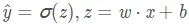

如果使用**均方差**作为损失函数，求得的梯度受到sigmoid函数导数的影响；

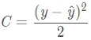求导：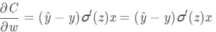

如果使用**交叉熵**作为损失函数，没有受到sigmoid函数导数的影响，且真实值与预测值差别越大，梯度越大，更新的速度也就越快。

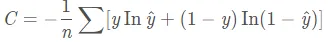求导：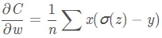

记忆：mse的导数里面有sigmoid函数的导数，而交叉熵导数里面没有sigmoid函数的导数]{.underline}，sigmoid的导数的[最大值为0.25 ，更新数据时太慢了。

**2.2.9  LR能否解决非线性分类问题？**

可以，只要使用**kernel trick**（核技巧）。

不过，通常使用的kernel都是隐式的，也就是找不到显式地把数据从低维映射到高维的函数，而只能计算高维空间中数据点的内积。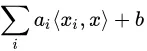

**2.2.10  用什么来评估LR模型？**

1. 由于LR是用来预测概率的，可以用**AUC-ROC**曲线以及混淆矩阵来确定其性能。

2. LR中类似于校正R2
的指标是**AIC]{.underline}**。AIC是对模型系数数量[惩罚模型]{.underline}的[拟合度量。因此，更偏爱有最小的AIC的模型。

**2.2.11  LR如何解决多分类问题？（OvR vs OvO）**

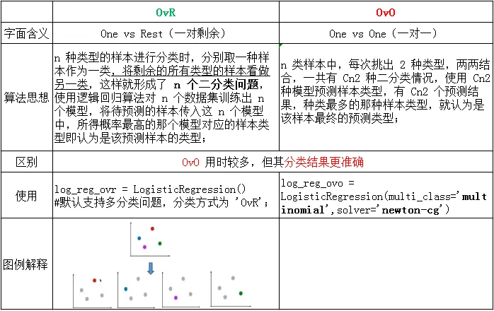

**2.2.12 在训练的过程当中，如果有很多的特征高度相关]{.underline}或者说有[一个特征重复了100 遍，会造成怎样的影响？**

如果在损失函数最终收敛]{.underline}的情况下，其实就算有很多特征高度相关也不会影响分类器的效果。但是对特征本身来说的话，假设只有一个特征，在不考虑采样的情况下，你现在将它重复100 遍。训练以后完以后，数据还是这么多，但是这个特征本身重复了100 遍，实质上[将原来的特征分成了100 份]{.underline}，每一个特征都是原来特征权重值的**百分之一**。如果在随机采样的情况下，其实训练收敛完以后，还是可以认为这100 个特征和原来那一个特征扮演的效果一样，只是可能[中间很多特征的值正负相消了。

**2.2.13 为什么在训练的过程当中将高度相关的特征去掉？**

去掉高度相关的特征会让模型的**可解释性更好**。

可以大大**提高训练的速**度。如果模型当中有很多特征高度相关的话，就算损失函数本身收敛了，但实际上参数是没有收敛的，这样会拉低训练的速度。

其次是特征多了，本身就会增大训练的时间。

### 2.3  Lasso {#_Toc9181  .anchor}

定义：所有参数绝对值之和，即**L1 **范数，对应的回归方法。

**Lasso(alpha=0.1 )** \# 设置学习率

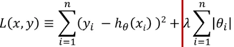[]{#_Toc28468
.anchor}

**2.4  Ridge**

定义：所有参数平方和，即**L2 **范数，对应的回归方法。

通过对系数的大小施加**惩罚**来解决 普通最小二乘法 的一些问题。

**Ridge**(alpha=0.1 ) \# 设置惩罚项系数

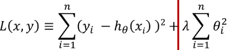

### 2.5  Lasso vs Ridge {#_Toc14184  .anchor}

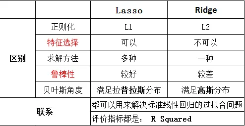

### 2.6  线性回归 vs LR {#_Toc10939  .anchor}

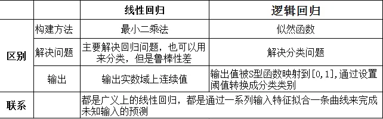

## 3.验证方式 {#_Toc18474  .anchor}

### 3.1 什么是过拟合？产生过拟合原因? {#_Toc30930  .anchor}

指模型在训练集上的效果很好,在测试集上的预测效果很差.

1. 数据有噪声

2. 训练数据不足，有限的训练数据

3. 训练模型过度导致模型非常复杂

### 3.2  如何避免过拟合问题？ {#_Toc2284  .anchor}

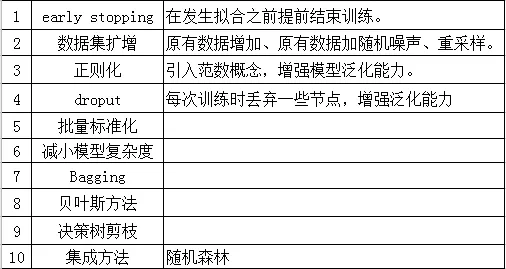

### 3.3  什么是机器学习的欠拟合？ {#_Toc9929  .anchor}

模型复杂度低]{.underline}或者[数据集太小,对模型数据的拟合程度不高,因此模型在训练集上的效果就不好.

### 3.4  如何避免欠拟合问题？ {#_Toc22255  .anchor}

1. 增加样本的数量

2. 增加样本特征的个数

3. 可以进行特征维度扩展

4. 减少正则化参数

5. 使用集成学习方法，如Bagging

### 3.5  什么是交叉验证？交叉验证的作用是什么？ {#_Toc7224  .anchor}

将原始dataset划分为两个部分.一部分为训练集用来训练模型,另外一部分作为测试集测试模型效果.

作用:
1  ）交叉验证是用来评估模型在新的数据集上的预测效果,也可以一定程度上减小模型的过拟合

2  ）还可以从有限的数据中获取尽能多的有效信息。

### 3.6  交叉验证主要有哪几种方法？ {#_Toc2888  .anchor}

①留出法:简单地将原始数据集划分为训练集,验证集,测试集三个部分.

②**k折交叉验证**:(一般取5 折交叉验证或者10 折交叉验证)

③**LOO留一法**:
(只留一个样本作为数据的测试集,其余作为训练集)\-\--只适用于较少的数据集

④ Bootstrap方法:(会引入样本偏差)

### 3.7 什么是K折交叉验证？ {#_Toc2724  .anchor}

将原始数据集划分为k个子集，将其中一个子集作为验证集]{.underline}，[其余k-1 个子集作为训练集，如此训练和验证一轮称为一次交叉验证。

交叉验证重复k次，每个子集都做一次验证集，得到k个模型，**加权平均k个模型的结果**作为评估整体模型的依据。

### 3.8  如何在K折交叉验证中选择K？ {#_Toc23580  .anchor}

k越大，不一定效果越好，而且越大的k会加大训练时间；

在选择k时，需要考虑最小化数据集之间的**方差**，比如对于2 分类任务，采用2 折交叉验证，即将原始数据集对半分，若此时训练集中都是A类别，验证集中都是B类别，则交叉验证效果会非常差。

### 3.9  网格搜索（GridSearchCV） {#_Toc6524  .anchor}

一种调优方法，在参数列表中进行穷举搜索，对每种情况进行训练，找到最优的参数。已svm调参为例：

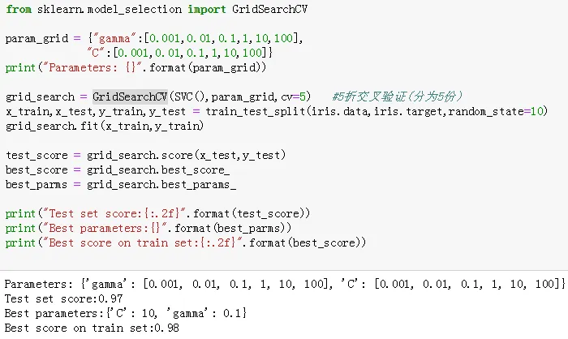

### 3.10 随机搜素（RandomizedSearchCV） {#_Toc10933  .anchor}

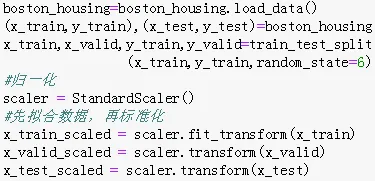

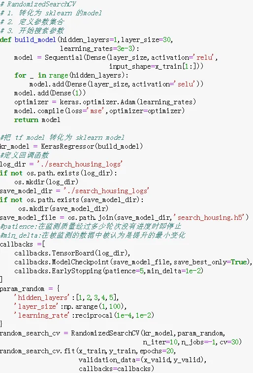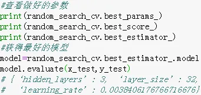

## 4.分类 {#_Toc16112  .anchor}

[]{#_Toc22386
.anchor}**4.1 什么是准确率,精准率,召回率和F1 分数？混淆矩阵**

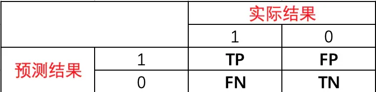

准确率 = (TP+TN)/总样本数 = 预测正确的结果占总样本的百分比

### 4.2 模型常用的评估指标有哪些？ {#_Toc3425  .anchor}

**4.2.1  Precision（查准率）**

精准率(Precision) = **TP/(TP+FP)**
=所有被**预测为正**的样本中实际为正的样本的概率

**4.2.1  Recall（查全率）**

召回率(**Recall**) = **TP/(TP+FN)** =
在**实际为正**的样本中被预测为正样本的概率

查准率和查全率是一对矛盾的度量，一般而言，查准率高时，查全率往往偏低；而查全率高时，查准率往往偏低。

**4.2.3  P-R曲线**

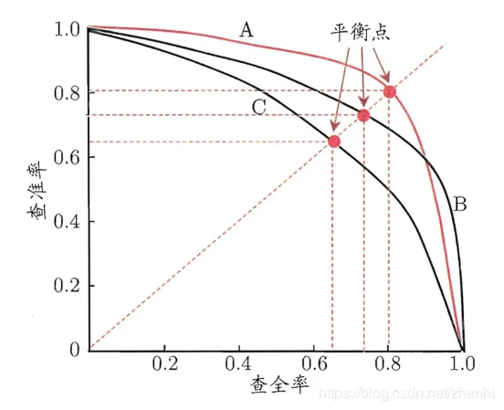

横轴为召回率(查全率)，纵轴为精准率(查准率);

引入"**平衡点**"(BEP)来度量，表示"查准率=查全率"时的取值，值越大表明分类器性能越好。

**4.2.4  F1 -Score**

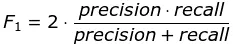 **调和平均**:
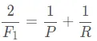

**准确率和召回率的权衡**‍:
只有在召回率Recall和精确率Precision都高的情况下，F1
score才会很高，比BEP更为常用。

**4.2.5  ROC和AUC**

**4.2.5.1 什么是ROC曲线？如何判断 ROC 曲线的好坏？**

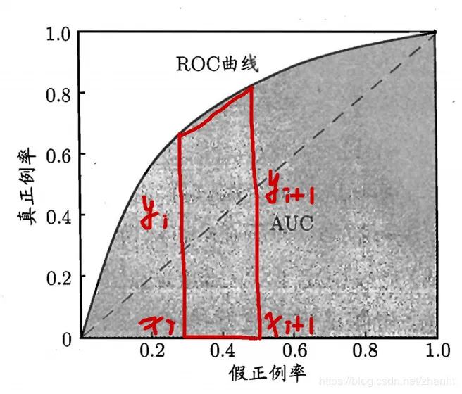

ROC曲线：横轴为FPR]{.underline}，纵轴为[TPR

灵敏度TPR = TP/(TP+FN)  特异度FPR = TN/(FP+TN)

真正率（TPR） = 灵敏度 = TP/(TP+FN) 真阳性率 = 召回 = TPR

假正率（**FPR**） = 1 - 特异度 = FP/(FP+TN)

**FPR**的含义：所有确实为"假"的样本中，被误判真的样本。

TPR 越高，同时 FPR 越低（即 ROC 曲线越陡），那么模型的性能就越好。

**4.2.5.2 什么是AUC？**

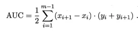

AUC: ROC曲线下的***面积**，*AUC的取值范围在0.5 和1 之间。

衡量二分类模型优劣的一种评价指标，表示正例排在负例前面的概率。

**4.2.5.3 如何解释AU ROC分数？**

表示**预测准确性**，AUC值越高: 预测准确率越高，反之越小
预测准确率越低。

AUC如果小于0.5 ，说明预测诊断比随机性猜测还差，实际情况中不应该出现这种情况，可能是设置的状态变量标准有误，需要查看设置。

### 4.3  多标签分类怎么解决？ {#_Toc27922  .anchor}

问题转换

二元关联（Binary Relevance）

分类器链（Classifier Chains）

标签Powerset（Label Powerset）

改编算法: kNN的多标签版本是由MLkNN表示

集成方法: Scikit-Multilearn库提供不同的组合分类功能

## 5.正则化 {#_Toc2542  .anchor}

### 手推L1 ,L2  {#_Toc8895  .anchor}

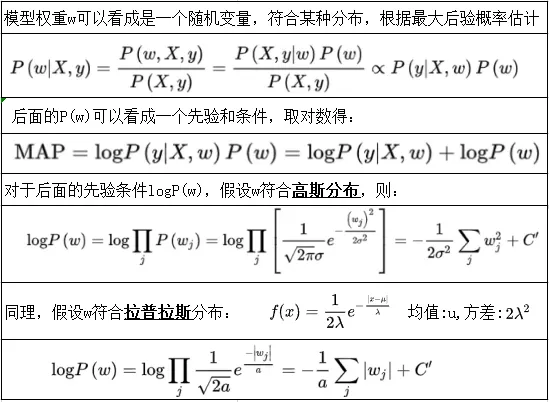

### 5.1  什么是正则化？如何理解正则化？ {#_Toc24724  .anchor}

定义:
在损失函数后加上一个正则化项（**惩罚项]{.underline}**），其实就是常说的结构风险最小化策略，即[损失函数
加上正则化。一般模型越复杂，**正则化值越大**。

正则化项是用来对模型中某些参数进行约束，正则化的一般形式：

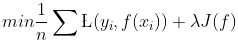

第一项是**损失函数**（经验风险），第二项是**正则化项**

公式可以看出，加上惩罚项后损失函数的值会增大，要想损失函数最小]{.underline}，[惩罚项]{.underline}的值要[尽可能的小，模型参数就要尽可能的小，这样就能减小模型参数，使得模型更加简单。

### 5.2  L0 、L1 、L2 正则化？ {#_Toc25321  .anchor}

L0 范数：计算向量中非0 元素的个数。

L0 范数和L1 范数目的是使参数稀疏化。

L1 范数比L0 范数容易优化求解。

### 5.3  L1 和L2 正则化有什么区别？‍ {#_Toc28908  .anchor}

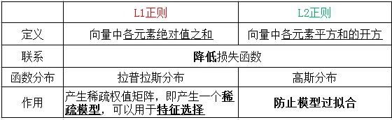

### 5.4  L1 在0 处不可导是怎么处理的？ {#_Toc21322  .anchor}

1. 坐标轴下降法是沿着坐标轴的方向

Eg: **lasso**回归的损失函数是不可导的

2. 近端梯度下降(Proximal Algorithms)

3. 交替方向乘子法(ADMM)

[]{#_Toc30826  .anchor}**5.5
L1 正则化产生稀疏性的原因?对稀疏矩阵的理解？**

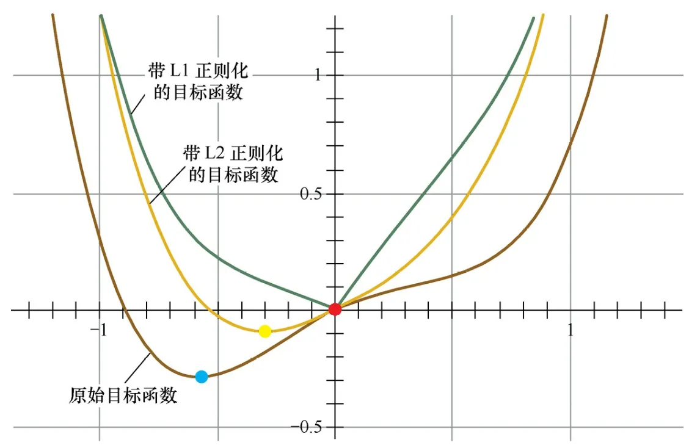

L1  正则化会使得许多参数]{.underline}的**[最优值**变成
0  ，这样模型就稀疏了。

**稀疏矩阵]{.underline}**指有很[多元素为0 ，少数参数为非零值。只有少部分特征对模型有贡献，大部分特征对模型没有贡献或者贡献很小，稀疏参数的引入，使得一些特征对应的参数是0 ，所以就可以剔除可以将那些没有用的特征，从而实现特征选择，提高模型的泛化能力，降低过拟合的可能。

### 5.6 为何要常对数据做归一化？ {#_Toc26471  .anchor}

    1.归一化后加快的梯度下降对最优解的速度。

    2.归一化有可能提高精度。

### 5.7 归一化的种类 {#_Toc30688  .anchor}

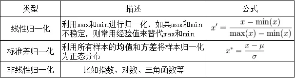

### 5.8 归一化和标准化的区别 {#_Toc1180  .anchor}

**标准化**是依照特征矩阵的列处理数据，其通过求z-score的方法，将样本的特征值转换到同一量纲下。归一化是依照特征矩阵的行处理数据，其目的在于样本向量在点乘运算或其他核函数计算相似性时，拥有统一的标准，也就是说都转化为"单位向量"。

**归一化**的目的是方便比较，可以加快网络的收敛速度；标准化是将数据利用z-score（均值、方差）的方法转化为符合特定分布的数据，方便进行下一步处理，不为比较。

[]{#_Toc28766  .anchor}**5.9
需要归一化的算法有哪些？这些模型需要归一化的主要原因？**

线性回归,逻辑回归，KNN，SVM，神经网络。

主要是因为特征值相差很大时，运用**梯度下降]{.underline}**，损失[等高线]{.underline}是[椭圆形]{.underline}，需要进行多次迭代才能达到最优点，如果进行归一化了，那么等高线就是**[圆形**的，促使SGD往原点迭代，从而导致需要迭代次数较少。

### 5.10  树形结构的不需要归一化的原因？ {#_Toc20964  .anchor}

因为它们不关心变量的值，而是关心变量分布和变量之间的条件概率，如决策树，随机森林；对于树形结构，树模型的构造是通过寻找**最优分裂点**构成的，样本点的数值缩放不影响分裂点的位置，对树模型的结构不造成影响，

而且树模型**不能进行梯度下降**，因为树模型是阶跃的，阶跃是不可导的，并且求导没意义，也不需要归一化。

## 6.特征工程 {#_Toc28385  .anchor}

特征工程分三步： ①**数据预处理**；②**特征选择**；③**特征提取**。

### 6.1 特征选择 {#_Toc878  .anchor}

特征选择在于选取对训练数据具有分类能力的特征，可以提高决策树学习的效率。通常特征选择的准则是**信息增益**或**信息增益率**。

特征选择的划分依据：这一特征将训练数据集分割成子集，使得各个子集在当前条件下有最好的分类，那么就应该选择这个特征。

（将数据集划分为纯度更高，不确定性更小的子集的过程）

**6.1.1  什么是特征选择？为什么需要它？特征选择的目标?**

指从已有的M个特征中选择N个特征使得系统的特定指标最优化，是从原始特征中选择出一些最有效特征以降低数据集维度的过程。

原因:
**①**减少特征数量、降维，使模型泛化能力更强，减少过拟合;

**②**增强对特征和特征值之间的理解。

目标：选择离散程度高且与目标的相关性强的特征。

**6.1.2  有哪些特征选择技术？‍**

①过滤法

按照发散性或者相关性对各个特征进行评分，设定阈值或者待选择阈值的个数，从而选择特征；

②包装法

根据目标函数（通常是预测效果评分），每次选择若干特征或者排除若干特征；常用方法主要是**递归特征消除法**。

③嵌入法

先使用ML的算法和模型进行训练，得到各个特征的权重系数，根据系数从大到小选择特征；常用方法主要
是基于**惩罚项**的特征选择法。

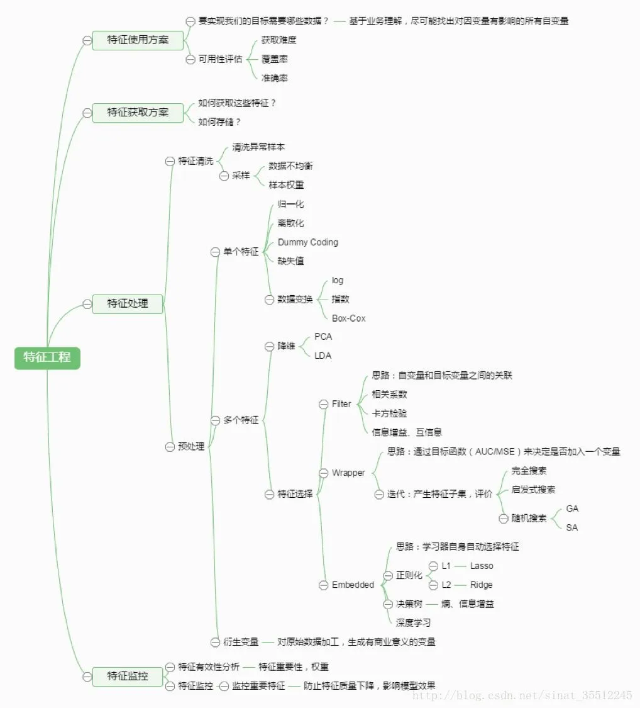

### 6.2  特征提取 {#_Toc12969  .anchor}

常见的降维方法除了基于**L1 惩罚项**的模型以外，另外还有PCA和LDA，

**本质**是要将原始的样本映射到维度更低的样本空间中，

但是它们的映射目标不一样：PCA是为了让映射后的样本具有最大的发散性；

而LDA是为了让映射后的样本有最好的分类性能。

### 6.3  特征选择 vs 特征提取 {#_Toc4102  .anchor}

都是降维的方法。

特征选择：不改变变量的含义，仅仅只是做出筛选，留下对目标影响较大的变量；

特征提取：通过映射（变换）的方法，将高维的特征向量变换为低维特征向量。

### 6.4 为什么要处理类别特征？怎么处理？ {#_Toc25013  .anchor}

除了决策树等少量模型能直接处理字符串形式的输入，对于LR,SVM等模型来说，类别特征必须经过处理转化成数值特征才能正常工作。方法主要有：

序号编码；**独热编码**；二进制编码

### 6.5 什么是组合特征？ {#_Toc28292  .anchor}

为了提高复杂关系的拟合能力，在特征工程中经常会把一阶离散特征两两组合，构成高级特征。例如，特征a有m个取值，特别b
有n个取值，将二者组合就有m\*n个组成情况。这时需要学习的参数个数就是 m×n
个。

### 6.6 怎么有效地找到组合特征？ {#_Toc17647  .anchor}

可以用基于决策树的方法，首先根据样本的数据和特征构造出一颗决策树。然后从根节点都叶节点的每一条路径，都可以当作一种组合方式。

### 6.7 如何处理高维组合特征？ {#_Toc987  .anchor}

当每个特征都有千万级别，就无法学习 m×n 规模的参数了。

解决：可以将每个特征分别用 k 维的低维向量表示，需要学习的参数变为
m×k+n×k 个，等价于矩阵分解

### 6.8 如何解决数据不平衡问题？ {#_Toc5760  .anchor}

主要是由于数据分布不平衡造成的。

解决方法如下：

1. 采样，对小样本加噪声采样，对大样本进行下采样

2. 进行特殊的加权，如在Adaboost中或者SVM中

3. 采用对不平衡数据集不敏感的算法

4. 改变评价标准：用AUC/ROC来进行评价

5. 采用Bagging/Boosting/ensemble等方法

6. 考虑数据的先验分布

### 6.9  数据中有噪声如何处理？ {#_Toc31759  .anchor}

噪声检查中比较常见的方法：

（1 ）通过寻找数据集中与其他观测值及均值差距最大的点作为异常

（2 ）聚类方法检测：将类似的取值组织成"群"或"簇"，落在"簇"集合之外的值被视为离群点。

在进行噪声检查后，通常采用分箱、聚类、回归、计算机检查和人工检查结合等方法"光滑"数据，去掉数据中的噪声。

采用分箱技术时，需要确定的两个主要问题就是：如何分箱以及如何对每个箱子中的数据进行平滑处理。

分箱的方法：有4 种：等深分箱法、等宽分箱法、最小熵法和用户自定义区间法。

数据平滑方法

按平均值平滑
：对同一箱值中的数据求平均值，用平均值替代该箱子中的所有数据。

按边界值平滑：用距离较小的边界值替代箱中每一数据。

按中值平滑：取箱子的中值，用来替代箱子中的所有数据。

### 6.10  FM {#_Toc597  .anchor}

基于**矩阵分解**的机器学习算法,用于解决数据稀疏的业务场景（如推荐业务），特征怎样组合的问题。

如：一个广告分类的问题为例，根据用户与广告位的一些特征，来预测用户是否会点击广告。

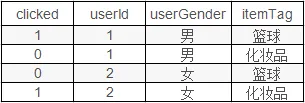

对于CTR点击的分类预测中，有些特征是分类变量，一般进行one-hot编码。

One-hot会带来数据的稀疏性，使得**特征空间变大**。

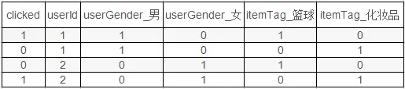

**6.10.1  SVM vs FM**

1. SVM的二元特征交叉参数是独立的，而FM的二元特征交叉参数是两个k维的向量vi、vj，交叉参数就不是独立的，而是**相互影响**的。

2. FM可以在原始形式下进行优化学习，而基于kernel的非线性SVM通常需要在对偶形式下进行。

3. FM的模型预测与训练样本独立，而SVM则与部分训练样本有关，即支持向量。

### 6.11  FFM {#_Toc21437  .anchor}

FM在FM的基础上进一步改进，在模型中引入**类别**(]{.underline}field[)]{.underline}的概念。将同一个field的特征单独进行One-hot，因此在FFM中，每一维特征都会针对其他特征的每个field，分别学习一个隐变量，该隐变量[不仅与特征相关]{.underline}，[也与field相关。

FFM中每一维特征都归属于一个特定和field，field和feature是一对多的关系:

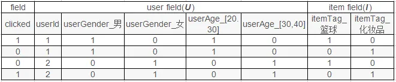

实现FM &
FFM的最流行的python库有：LibFM、LibFFM、**xlearn**和tffm

名词解释： **点击率**CTR]{.underline} **转化率**[CVR

## 7.决策树 {#_Toc8200  .anchor}[]{#_Toc5427  .anchor}

**7.1  ID3 算法**

**核心**是在决策树各个节点上应用 **信息增益**
准则选择特征，递归的构建决策树。

具体方法]{.underline}是：从根结点开始，对结点计算所有可能的特征的信息增益，选择**信息增益最大的特征**作为结点的特征，由该特征的不同取值建立子结点；再对子结点递归的调用以上方法，构建决策树；直到所有特征的[信息增益均很小或没有特征可以选择为止。

**ID3 **相当于用**极大似然法**进行概率模型的选择。

使用 二元切分法 则易于对树构建过程中进行调整以处理连续型特征。

具体的处理方法是:
如果特征值大于给定值就走左子树，否则走右子树。另外二元切分法也节省了树的构建时间。

### 7.2  C4.5 算法 {#_Toc7176  .anchor}

算法用**信息增益率**选择特征，在树的构造过程中会进行剪枝操作优化，能够自动完成对连续属性的离散化处理；在选择分割属性时选择信息增益率最大的属性。

**7.2.1  既然信息增益可以计算，为什么C4.5 还使用信息增益比？**

在使用信息增益的时候，如果某个特征有很多取值，使用这个取值多的特征会的大的信息增益，这个问题是出现很多分支，将数据划分更细，模型复杂度高，出现过拟合的机率更大。使用**信息增益比**就是为了解决偏向于选择取值**较多的特征**的问题.
使用信息增益比对取值多的特征加上的惩罚，对这个问题进行了校正.

### 7.3  CART算法 {#_Toc8232  .anchor}

分类与回归树 ------ 使用**二元切分法**来处理连续型数值。

使用Gini作为分割属性选择的标准，择**Gini最大**的作为当前数据集的分割属性。

**Gini]{.underline}**：表示在样本集合中一个随机[选中的样本被分错的概率。

Gini指数越小表示集合中被选中的样本被分错的概率越小，也就是说集合的纯度越高，反之，集合越不纯。

即 **基尼指数**（基尼不纯度）= **样本被选中的概率 \* 样本被分错的概率**

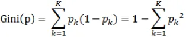

**CART算法**由以下两步组成：

决策树**生成**：基于训练数据集生成决策树，生成的决策树要尽量大；

决策树**剪枝**：用验证数据集对已生成的树进行剪枝并选择最优子树，这时用损失函数最小作为剪枝的标准。

**7.3.1  基尼指数和信息熵都表示数据不确定性，为什么CART使用基尼指数？**

信息熵0 , logK都是值越大，数据的不确定性越大.
信息熵需要计算对数，计算量大；信息熵是可以处理多个类别，基尼指数就是针对两个类计算的，由于CART树是一个二叉树，每次都是选择yes
or no进行划分，从这个角度也是应该选择简单的基尼指数进行计算.

**7.3.2 基尼系数(Gini)存在的问题?**

基尼指数偏向于**多值**属性;当类数较大时，基尼指数求解比较困难;基尼指数倾向于支持在两个分区中生成大小相同的测试。

### 7.4  ID3  vs C4.5  vs CART {#_Toc25586  .anchor}

### 7.5  决策树 {#_Toc25876  .anchor}

定义：
决策树就是一棵树，其中跟节点和内部节点是输入特征的判定条件，叶子结点就是最终结果。

其**损失函数**通常是 正则化的极大似然函数；

目标是 以损失函数为目标函数的最小化。

算法通常是一个
**递归**的选择最优特征，并根据该特征对训练数据进行分割，使得对各个子数据集有一个最好的分类过程。

决策树量化纯度：

判断数据集"纯"的指标有三个：**Gini指数**、**熵**、**错误率**

**7.5.1  决策树的数据split原理或者流程？**

1. 将所有样本看做一个节点

2. 根据纯度量化指标.计算每一个特征的'纯度',根据最不'纯'的特征进行数据划分

3. 重复上述步骤,知道每一个叶子节点都足够的'纯'或者达到停止条件

背诵：按照基尼指数]{.underline}、[信息增益]{.underline}来选择特征，保证划分后[纯度尽可能**高**。

**7.5.2 构造决策树的步骤？**

1. 特征选择

2. 决策树的生成（包含预剪枝） \-\-\-- 只考虑局部最优

3. 决策树的剪枝（后剪枝） \-\-\-- 只考虑**全局最优**

**7.5.3 决策树算法中如何避免过拟合和欠拟合？‍**

**过拟合**:选择能够反映业务逻辑的训练集去产生决策树;

剪枝操作(前置剪枝和后置剪枝); K折交叉验证(K-fold CV)

**欠拟合**:增加树的深度,RF

**7.5.4 决策树怎么剪枝？**

分为预剪枝和后剪枝，**预剪枝**是在决策树的构建过程中加入限制，比如控制叶子节点最少的样本个数，提前停止；

**后剪枝**是在决策树构建完成之后，根据加上正则项的结构风险最小化自下向上进行的剪枝操作.

剪枝的**目的**就是防止过拟合，是模型在测试数据上变现良好，更加鲁棒.

**7.5.5  决策树的优缺点？**

决策树的**优点**：

1.   决策树模型可读性好，具有描述性，有助于人工分析；

2.   效率高，决策树只需要一次性构建，反复使用，每一次预测的最大计算次数不超过决策树的深度。

    决策树的**缺点**：

1. 即使做了预剪枝，它也经常会过拟合，泛化性能很差。

2. 对中间值的缺失敏感；

3. ID3 算法计算信息增益时结果偏向数值比较多的特征。

**7.5.6  决策树和条件概率分布的关系？**

决策树可以表示成给定条件下类的条件概率分布.
决策树中的每一条路径都对应是划分的一个条件概率分布.
每一个叶子节点都是通过多个条件之后的划分空间，在叶子节点中计算每个类的条件概率，必然会倾向于某一个类，即这个类的概率最大.

**7.5.7
为什么使用贪心和其发生搜索建立决策树，为什么不直接使用暴力搜索建立最优的决策树？**

决策树目的是构建一个与训练数据拟合很好，并且复杂度小的决策树.
因为从所有可能的决策树中直接选择最优的决策树是NP完全问题，在使用中一般使用启发式方法学习相对最优的决策树.

**7.5.8  如果特征很多，决策树中最后没有用到的特征一定是无用吗？**

不是无用的，从两个角度考虑，一是特征替代性，如果可以已经使用的特征A和特征B可以提点特征C，特征C可能就没有被使用，但是如果把特征C单独拿出来进行训练，依然有效.
其二，决策树的每一条路径就是计算条件概率的条件，前面的条件如果包含了后面的条件，只是这个条件在这棵树中是无用的，如果把这个条件拿出来也是可以帮助分析数据.

**7.5.9  决策树怎么做回归？**

给回归定义一个损失函数，比如 L2
损失，可以把分叉结果量化；最终的输出值，是分支下的样本均值。
\**切分点选择**：[最小二乘法\];
\**输出值**：[单元内均值\].

**7.5.10  决策树算法的停止条件？**

1. 最小节点数

当节点的数据量小于一个指定的数量时，不继续分裂。两个原因：一是数据量较少时，再做分裂容易强化噪声数据的作用；二是降低树生长的复杂性。提前结束分裂一定程度上有利于降低过拟合的影响。

2. 熵或者基尼值小于阀值。

当熵或者基尼值过小时，表示数据的纯度比较大，如果熵或者基尼值小于一定程度数，节点停止分裂。

3. 决策树的深度达到指定的条件

决策树的深度是所有叶子节点的最大深度，当深度到达指定的上限大小时，停止分裂。

4. 所有特征已经使用完毕，不能继续进行分裂。

**7.5.11  为什么决策树之前用PCA会好一点？**

决策树的本质在于选取特征]{.underline}，然后[分支。
PCA**解除了特征之间的耦合性**，并且按照贡献度给特征排了个序，这样更加方便决策树选取特征。

### 熵(entropy) {#_Toc27103  .anchor}

是表示随机变量不确定性的度量，是用来衡量一个随机变量出现的**期望值**。

如果信息的不确定性越大，熵的值也就越大，出现的各种情况也就越多。

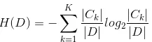

条件熵(H(Y∣X))：表示在已知随机变量X的条件下随机变量Y的不确定性，其定义为X在给定条件下Y的条件概率分布的熵对X的数学期望:

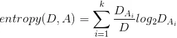

**二次代价函数**

二次代价函数训练NN，看到的实际效果是，如果误差越大，参数调整的幅度可能更小，训练更缓慢。

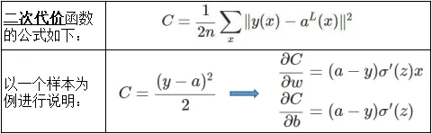

**交叉熵**

用于度量两个概率分布间的差异性信息。语言模型的性能通常用交叉熵和复杂度来衡量。

交叉熵代价函数带来的训练]{.underline}效果往往[比二次代价函数要好。

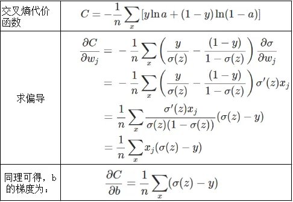

**交叉熵代价函数是如何产生的？**

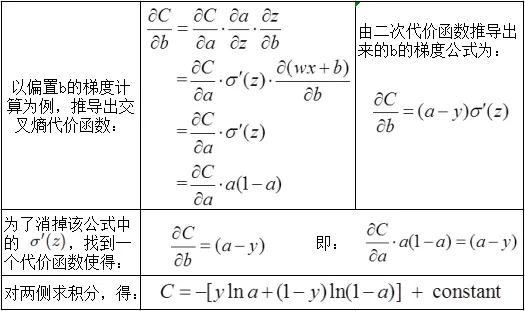

### 7.6  信息增益 {#_Toc31415  .anchor}

定义：
特征A对训练数据集D的信息增益g(D,A)，定义为集合D的经验熵H(D)与特征A给定条件下D的经验条件熵H(D\|A)之差，即:

g(D,A)=H(D)-H(D\|A)

信息增益: 表示由于特征A使得对数据集D的分类的不确定性减少的程度。

信息增益 = entroy(前) - entroy(后)

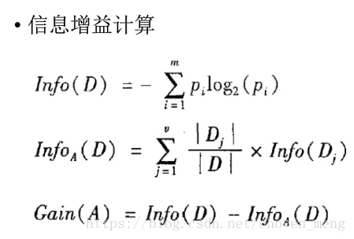

特征选择方法是：对训练数据集D，计算其每个特征的信息增益，并比较它们的大小，选择**信息增益最大**的特征。

**7.6.1 为什么信息增益偏向取值较多的特征(缺点)？**

当特征的取值较多时，根据此特征划分更容易得到纯度更高的子集，因此划分之后的熵更低，由于划分前的熵是一定的，因此信息增益更大，因此信息增益比较
偏向取值较多的特征。

### 7.7 信息增益率 {#_Toc30411  .anchor}

信息增益率 = 惩罚参数 \* **信息增益**
（即**信息增益**和**特征熵**的比值）

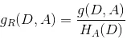 其中：

信息增益比**本质**：
是在信息增益的基础之上乘上一个惩罚参数。特征个数较多时，惩罚参数较小；特征个数较少时，惩罚参数较大。

**惩罚参数**：
数据集D以特征A作为随机变量的熵的倒数，即：将特征A取值相同的样本划分到同一个子集中（数据集的熵是依据类别进行划分的）。

当特征取值较少时HA(D)的值较小，因此其倒数较大，因而信息增益比较大。因而偏向取值较少的特征。

**7.7.1 如何使用信息增益比？**

在候选特征中找出信息增益高于平均水平的特征，然后在这些特征中再选择信息增益率最高的特征。

### 7.8  Hard Voting vs Soft Voting {#_Toc1975  .anchor}

## 8.KNN {#_Toc24095  .anchor}

### 8.1  简述一下KNN算法的原理? {#_Toc10941  .anchor}

利用训练数据集对特征向量空间进行划分。KNN算法的核心思想是在一个含未知样本的空间，可以根据样本最近的k个样本的数据类型来确定未知样本的数据类型。
该算法涉及的3 个主要因素是：k值选择，距离度量，分类决策。

### 8.2  如何理解kNN中的k的取值？ {#_Toc18129  .anchor}

在应用中，k值一般取比**较小**的值，并采用**交叉**验证法进行调优。

### 8.3  在kNN的样本搜索中，如何进行高效的匹配查找？ {#_Toc8482  .anchor}

线性扫描(数据多时，效率低)
构建数据索引------Clipping和Overlapping两种。前者划分的空间没有重叠，如k-d树；后者划分的空间相互交叠，如R树。（对R树了解很少，可以之后再去了解）

### 8.4  KNN算法有哪些优点和缺点？ {#_Toc25791  .anchor}

[]{#_Toc3291  .anchor}**8.5
不平衡的样本可以给KNN的预测结果造成哪些问题，有没有什么好的解决方式？**

输入实例的K邻近点中，大数量类别的点会比较多，但其实可能都离实例较远，这样会影响最后的分类。

可以使用权值来改进，距实例较近的点赋予较高的权值，较远的赋予较低的权值。

[]{#_Toc15068  .anchor}**8.6
为了解决KNN算法计算量过大的问题，可以使用分组的方式进行计算，简述一下该方式的原理。**

先将样本按距离分解成组，获得质心，然后计算未知样本到各质心的距离，选出距离最近的一组或几组，再在这些组内引用KNN。

本质上就是事先对已知样本点进行剪辑，事先去除对分类作用不大的样本，该方法比较适用于样本容量比较大时的情况。

### 8.7 如何优化Kmeans? {#_Toc18075  .anchor}

使用Kd树或者Ball Tree
：将所有的观测实例构建成一颗kd树，之前每个聚类中心都是需要和每个观测点做依次距离计算，现在这些聚类中心根据kd树只需要计算附近的一个局部区域即可。

[]{#_Toc19145  .anchor}**8.8
在k-means或kNN，我们是用欧氏距离来计算最近的邻居之间的距离。为什么不用曼哈顿距离？**

曼哈顿距离只计算水平或垂直距离，有维度的限制。另一方面，欧氏距离可用于任何空间的距离计算问题。

**绿色**的线为**欧式距离**的丈量长度，红色的线即为曼哈顿距离长度，

蓝色和黄色的线是这两点间曼哈顿距离的等价长度。

欧式距离：两点之间的最短距离;

曼哈顿距离：投影到坐标轴的长度之和;又称为**出租车距离.**

切比雪夫距离：各坐标数值差的最大值;

### 8.9  参数说明以及调参 {#_Toc9053  .anchor}

**n_neighbors**：邻居节点数量

**weights**：设为distance（离一个簇中心越近的点，权重越高）；

**p**=1 为曼哈顿距离， p=2 为欧式距离。默认为2

**leaf_size**：传递给BallTree或者KDTree，表示构造树的大小，默认值是30

**n_jobs**：并发执行的job数量，用于查找邻近的数据点。默认值1 ，选取-1 占据CPU比重会减小，但运行速度也会变慢。

9.   ### SVM {#_Toc19037  .anchor}

SVM又叫最大间隔分类器，最早用来解决二分类问题。

SVM有三宝，**间隔，对偶 ，核技巧**

SVM 算法的本质就是求解目标函数的最优化问题；

### SVM的推导 {#_Toc26552  .anchor}

### 9.1  SVM的原理是什么？ {#_Toc18043  .anchor}

SVM是一种二类分类模型。它的基本模型是在特征空间中寻找**间隔最大化**的分离超平面的线性分类器。（间隔最大是它有别于感知机）

（1 ）当训练样本线性可分时，通过硬间隔最大化，学习一个线性分类器，即**线性可分**支持向量机；

（2 ）当训练数据近似线性可分时，引入松弛变量，通过软间隔最大化，学习一个线性分类器，即**线性支持**向量机；

（3 ）当训练数据线性不可分时，通过使用核技巧及软间隔最大化，学习**非线性**支持向量机。

注：以上各SVM的数学推导应该熟悉：硬间隔最大化（几何间隔）\-\--学习的对偶问题\-\--软间隔最大化（引入松弛变量）\-\--
非线性支持向量机（核技巧）

### 9.2  SVM 为什么采用间隔最大化？ {#_Toc3165  .anchor}

当训练数据线性可分时，存在无穷个分离超平面可以将两类数据正确分开。感知机利用误分类最小策略，求得分离超平面，不过此时的解有无穷多个。线性可分支持向量机利用间隔最大化求得最优分离超平面，这时，解是唯一的。另一方面，此时的分隔超平面所产生的分类结果是最鲁棒的，对未知实例的泛化能力最强。可以借此机会阐述一下几何间隔以及函数间隔的关系。

### 9.3  为什么 SVM 要引入核函数？ {#_Toc4512  .anchor}

原始空间线性不可分，可以使用一个非线性映射将原始数据x变换到另一个高维特征空间，在这个空间中，样本变得线性可分。

解决方法：常用的一般是**径向基RBF**函数（线性核，高斯核，拉普拉斯核等）

### 9.4  为什么SVM对缺失数据敏感？ {#_Toc32715  .anchor}

这里说的缺失数据是指缺失某些特征数据，向量数据不完整。SVM
没有处理缺失值的策略。而 SVM
希望样本在特征空间中线性可分，所以特征空间的好坏对SVM的性能很重要。缺失特征数据将影响训练结果的好坏。

### 9.5  SVM 核函数之间的区别 {#_Toc20650  .anchor}

一般选择线性核]{.underline}和[高斯核，也就是线性核与 RBF
核。

高斯核函数（RBF）:

本质：将每一个样本点映射到一个**无穷维**的特征空间。

高斯核**升维**的本质，使得线性不可分的数据**线性可分**。

[]{#_Toc12443  .anchor}**9.6
SVM如何处理多分类问题？**

一般有两种做法：一种是**直接法**，直接在目标函数上修改，将多个分类面的参数求解合并到一个最优化问题里面。看似简单但是计算量却非常的大。
另外一种做法是**间接法**：对训练器进行组合。其中比较典型的有一对一，和一对多。
一对多，就是对每个类都训练出一个分类器，由svm是二分类，所以将此而分类器的两类设定为目标类为一类，其余类为另外一类。这样针对k个类可以训练出k个分类器，当有一个新的样本来的时候，用这k个分类器来测试，那个分类器的概率高，那么这个样本就属于哪一类。这种方法效果不太好，bias比较高。
svm一对一法（one-vs-one），针对任意两个类训练出一个分类器，如果有k类，一共训练出C(2 ,k)
个分类器，这样当有一个新的样本要来的时候，用这C(2 ,k)
个分类器来测试，每当被判定属于某一类的时候，该类就加一，最后票数最多的类别被认定为该样本的类。

### 9.7 带核的SVM为什么能分类非线性问题？ {#_Toc9408  .anchor}

核函数的**本质]{.underline}**是两个函数的内积，而这个函数在SVM中可以表示成对于[输入值的高维映射。注意核并不是直接对应映射，核只不过是一个内积

### 9.8  RBF核一定是线性可分的吗？ {#_Toc2538  .anchor}

**不一定**，RBF核比较难调参而且容易出现维度灾难，要知道无穷维的概念是从泰勒展开得出的。

### 9.9 常用核函数及核函数的条件？ {#_Toc14612  .anchor}

线性核：主要用于线性可分的情况

多项式核

RBF核径向基，这类函数取值依赖于特定点间的距离，所以拉普拉斯核其实也是径向基核。

傅里叶核

样条核

Sigmoid核函数

[]{#_Toc29788  .anchor}**9.10 为什么要将求解 SVM
的原始问题转换为对偶问题？**

1. 对偶问题将原始问题中的约束转为了对偶问题中的等式约束；

2. 方便核函数的引入；

3. 改变了问题的复杂度。由求特征向量w转化为求比例系数a，在原始问题下，求解的复杂度与样本的维度有关，即w的维度。在对偶问题下，只与样本数量有关。**对偶问题**是凸优化问题，可以进行较好的求解，SVM中就是将原问题转换为对偶问题进行求解。

### 9.11  SVM怎么输出预测概率？ {#_Toc24810  .anchor}

把SVM的输出结果当作x经过一层LR模型得到概率，其中lr的W和b参数为使得总体交叉熵最小的值。

### 9.12 如何处理数据偏斜？ {#_Toc4909  .anchor}

可以对数量多的类使得惩罚系数C越小表示越不重视，相反另数量少的类惩罚系数变大。

### 9.13  LR vs SVM {#_Toc589  .anchor}

### 9.14  参数说明 {#_Toc11867  .anchor}

### 9.15  LinearSVC vs SVC {#_Toc20859  .anchor}

**线性回归 vs LR vs SVM：**

线性回归做分类因为考虑了所有样本点到分类决策面的距离，所以在两类数据分布不均匀的时候将导致误差非常大；

LR和SVM克服了这个缺点，其中LR将所有数据采用sigmod函数进行了非线性映射，使得远离分类决策面的数据作用减弱；

SVM直接去掉了远离分类决策面的数据，只考虑支持向量的影响。

10.  ### 集成学习 {#_Toc30232  .anchor}

    定义]{.underline}：通过结合[多个学习器(例如同种算法但是参数不同，或者不同算法)，一般会获得比任意单个学习器都要好的性能，尤其是在这些学习器都是\"弱学习器\"的时候提升效果会很明显。

    [调参学习链接](https://blog.nowcoder.net/n/d22776 a836 ed4646 b0610597 cc2279 b7 )

    1.   ### Boosting(提升法) {#_Toc13860  .anchor}

        可以用于回归]{.underline}和[分类]{.underline}问题，它每一步产生一个弱预测模型（如**[决策树**），并加权累加到总模型中加权累加到总模型中；如果每一步的弱预测模型生成都是依据损失函数的梯度方向，则称之为梯度提升。

        梯度提升算法首先给定一个目标损失函数，它的定义域是所有可行的弱函数集合

        提升算法通过迭代的选择一个负梯度方向]{.underline}上的基函数来逐渐逼近[局部最小值。

        提升的**理论意义**：如果一个问题存在弱分类器，则可以通过提升的办法得到强分类器。

**10.1.1  梯度提升(GBDT)**

**DT**表示使用决策树作为基学习器，使用的**CART**树。

GBDT是迭代，但GBDT每一次的计算是都为了**减少上一次的残差**，进而在残差减少（**负梯度**）的方向上建立一个新的模型，其弱学习器限定了只能使用CART回归树模型。
残差=（实际值-预测值）

**10.1.1.1  GBDT是训练过程如何选择特征？**

GBDT使用基学习器是**CART**树，CART树是二叉树，每次使用yes or
no进行特征选择，数值连续特征使用的最小均方误差，离散值使用的gini指数。在每次划分特征的时候会遍历所有可能的划分点找到最有的特征分裂点，这是用为什么gbdt会比rf慢的主要原因之一。

**10.1.1.2
GBDT如何防止过拟合？由于gbdt是前向加法模型，前面的树往往起到决定性的作用，如何改进这个问题？**

一般使用**缩减因子**对每棵树进行降权，可以使用带有**dropout**的GBDT算法，dart树，随机丢弃生成的决策树，然后再从剩下的决策树集中迭代优化提升树。

GBDT与Boosting区别较大，它的每一次计算都是为了**减少上一次的残差**，而为了消除残差，可以在残差减小的梯度方向上建立模型;

在GradientBoost中，每个新的模型的建立是为了使得之前的模型的残差往梯度下降的方法。

**10.1.1.3 梯度提升的如何调参？‍**

1. 首先我们从步长(learning rate)和迭代次数(n_estimators)入手。

开始选择一个较小的步长来网格搜索最好的迭代次数。将步长初始值设置为0.1 ；

2. 找到了一个合适的迭代次数，对决策树进行调参。首先对决策树最大深度max_depth和内部节点再划分所需最小样本数(min_samples_split)进行网格搜索。

再对min_samples_split和叶子节点最少样本数(min_samples_leaf)一起调参。

得出： {\'min_samples_leaf\': 60 , \'min_samples_split\': 1200 },

3. 对比最开始*完全不调参*的拟合效果，可见精确度稍有下降，主要原理是我们使用了0.8 的子采样，20 %的数据没有参与拟合。

需要再对最大特征数(max_features)进行网格搜索。

**10.1.1.4  GBDT对标量特征要不要one-hot编码？**

从效果的角度来讲，使用category特征和one-hot是等价的，所不同的是category特征的feature空间更小。微软在lightGBM的文档里也说了，category特征可以直接输入，不需要one-hot编码，准确度差不多，速度快8 倍。而sklearn的tree方法在接口上不支持category输入，所以只能用one-hot编码。

**10.1.1.5  为什么GBDT用负梯度当做残差？**

1. 负梯度的方向可证，模型优化下去一定会收敛

2. 对于一些损失函数来说最大的残差方向，并不是梯度下降最好的方向，倒是损失函数最小与残差最小两者目标不统一

**10.1.2 自适应提升(AdaBoost)**

**定义**: 是一种提升方法，将多个**弱分类器**，组合成**强分类器**。

Adaboost既可以用作**分类**，也可以用作**回归**。

算法实现：

1. 提高上一轮被错误分类的样本的权值，降低被正确分类的样本的权值；

2. 线性**加权求和**。误差率小的基学习器拥有较大的权值，误差率大的基学习器拥有较小的权值。

**10.1.2.1  为什么Adaboost方式能够提高整体模型的学习精度？**

根据**前向分布加法**模型，Adaboost算法每一次都会降低整体的误差，虽然单个模型误差会有波动，但是整体的误差却在降低，整体模型复杂度在提高。

**10.1.2.2 使用m个基学习器和加权平均使用m个学习器之间有什么不同？**

Adaboost的m个基学习器是有顺序关系的，第k个基学习器根据前k-1 个学习器得到的误差更新数据分布，再进行学习，每一次的数据分布都不同，是使用同一个学习器在不同的数据分布上进行学习。

加权平均的m个学习器是可以并行处理的，在同一个数据分布上，学习得到m个不同的学习器进行加权。

**10.1.2.3  adaboost的迭代次数(基学习器的个数)如何控制？**

一般使用**earlystopping**进行控制迭代次数。

**10.1.2.4  adaboost算法中基学习器是否很重要，应该怎么选择基学习器？**

sklearn中的adaboost接口给出的是使用决策树作为基分类器，一般认为决策树表现良好，其实可以根据数据的分布选择对应的分类器，比如选择简单的LR，或者对于回归问题选择线性回归。

**10.1.3 极端梯度提升(XGBoost)**

基于boosting**增强]{.underline}**策略的加法模型，训练的时候采用**[前向分布]{.underline}**算法进行贪婪的学习，每次迭代都学习一棵**[CART**树来拟合之前
t-1  棵树的预测结果与训练样本真实值的**残差**。

XGBoost对GBDT进行了一系列优化，比如损失函数进行了**二阶泰勒展开]{.underline}**、目标函数加入**[正则项]{.underline}**、支持**[并行]{.underline}**和默认**[缺失值处理**等，在可扩展性和训练速度上有了巨大的提升，但其核心思想没有大的变化。

XGBoost的学习分为3 步：

① **集成**思想 ② 损失函数分析 ③ 求解

**10.1.3.1  XGBoost使用泰勒二阶展开的原因？**

**精准性**：相对于GBDT的一阶泰勒展开，XGBoost采用二阶泰勒展开，可以更为精准的逼近真实的损失函数

**可扩展性**：损失函数支持**自定义**，只需要新的损失函数二阶可导。

**10.1.3.2  XGBoost可以并行训练的原因？**

XGBoost的并行，并不是说每棵树可以并行训练，XGB本质上仍然采用boosting思想，每棵树训练前需要等前面的树训练完成才能开始训练。

XGBoost的并行，指的是特征维度的并行：在训练之前，每个特征按特征值对样本进行预排序，并存储为Block结构，在后面查找特征分割点时可以重复使用，而且特征已经被存储为一个个block结构，那么在寻找每个特征的最佳分割点时，可以利用多线程对每个block并行计算。

**10.1.3.3  XGBoost为什么快？**

**10.1.3.4  XGBoost防止过拟合的方法？**

**10.1.3.5  XGBoost如何处理缺失值？**

在特征k上寻找最佳 split point 时，不会对该列特征 missing
的样本进行遍历，而只对该列特征值为 non-missing
的样本上对应的特征值进行遍历，通过这个技巧来减少了为稀疏离散特征寻找
split point 的时间开销。

在逻辑实现上，为了保证完备性，会将该特征值missing的样本分别分配到左叶子结点和右叶子结点，两种情形都计算一遍后，选择分裂后增益最大的那个方向（左分支或是右分支），作为预测时特征值缺失样本的默认分支方向。

如果在训练中没有缺失值而在预测中出现缺失，那么会自动将缺失值的划分方向放到右子结点。

**10.1.3.6  为什么XGBoost相比某些模型对缺失值不敏感？**

对存在缺失值的特征，一般的解决方法是：

离散型变量：用出现次数最多的特征值填充；

连续型变量：用中位数或均值填充；

一棵树中每个结点在分裂时，寻找的是某个特征的最佳分裂点（特征值），完全可以不考虑存在特征值缺失的样本，

也就是说，如果某些样本缺失的特征值缺失，对寻找最佳分割点的影响不是很大。

对于有缺失值的数据在经过缺失处理后：

当数据量很小时，优先用**朴素贝叶斯**；

数据量适中]{.underline}或者[较大，用树模型，优先**XGBoost**；

数据量较大，也可以用**神经网络**；

避免使用距离度量相关的模型，如KNN和SVM。

**10.1.3.7  XGBoost如何处理不平衡数据？**

对于不平衡的数据集，例如用户的购买行为，肯定是极其不平衡的，这对XGBoost的训练有很大的影响，XGBoost有两种自带的方法来解决：

第一种，如果你在意**AUC**，采用AUC来评估模型的性能，那你可以通过设置**scale_pos_weight**来平衡正样本和负样本的权重。例如，当正负样本比例为1 :10 时，scale_pos_weight可以取10 ；

第二种，如果你在意**概率**(预测得分的合理性)，你不能重新平衡数据集(会破坏数据的真实分布)，应该设置max_delta_step为一个有限数字来帮助收敛（基模型为LR时有效）。

**10.1.3.8  XGBoost中叶子结点的权重如何计算出来？**

XGBoost目标函数最终推导形式如下：

利用一元二次函数求最值的知识，当目标函数达到最小值Obj\*时，每个叶子结点的权重为wj\*。

具体公式如下：

**10.1.3.9  XGBoost中的一棵树的停止生长条件？**

当新引入的一次分裂所带来的增益Gain\<0 时，放弃当前的分裂。这是训练损失和模型结构复杂度的博弈过程。

当树达到最大深度时，停止建树，因为树的深度太深容易出现过拟合，这里需要设置一个超参数max_depth。

当引入一次分裂后，重新计算新生成的左、右两个叶子结点的样本权重和。如果任一个叶子结点的样本权重低于某一个阈值，也会放弃此次分裂。这涉及到一个超参数:最小样本权重和，是指如果一个叶子节点包含的样本数量太少也会放弃分裂，防止树分的太细。

**10.1.3.10  比较LR和GBDT，说说什么情景下GBDT不如LR？**

LR是**线性]{.underline}**模型，可解释性强，很容易**[并行]{.underline}**化，但学习能力有限，需要大量的[人工特征工程;

GBDT是**非线性]{.underline}**模型，具有天然的特征组合优势，特征表达能力强，但是树与树之间无法并行训练，而且树模型很**[容易过拟合**；

当在**高维稀疏特征**的场景下，LR的效果一般会比GBDT好。原因如下：

先看一个例子：

假设一个二分类问题，label为0 和1 ，特征有100 维，如果有1 w个样本，但其中只要10 个正样本1 ，而这些样本的特征
f1 的值为全为1 ，而其余9990 条样本的f1 特征都为0 (在高维稀疏的情况下这种情况很常见)。

树模型很容易优化出一个使用f1 特征作为重要分裂节点的树，因为这个结点直接能够将训练数据划分的很好，但是当测试的时候，却会发现效果很差，因为这个特征f1 只是刚好偶然间跟y拟合到了这个规律，这也是我们常说的**过拟合**。

那么这种情况下，如果采用LR的话，应该也会出现类似过拟合的情况呀：y =
W1\*f1  + Wi\*fi+....，其中 W1 特别大以拟合这10 个样本。

为什么此时树模型就过拟合的更严重呢？

因为现在的模型普遍都会带着**正则项**，而 LR
等线性模型的正则项是**对权重的惩罚**，也就是
**W1 **一旦过大，惩罚就会很大，进一步压缩
W1 的值，使他不至于过大。但是，树模型则不一样，树模型的惩罚项通常为**叶子节点数]{.underline}**和**[深度**等，而我们都知道，对于上面这种
case，树只需要一个节点就可以完美分割9990 和10 个样本，一个结点，最终产生的惩罚项极其之小。

这也就是为什么在高维稀疏特征的时候，线性模型会比非线性模型好的原因了：带正则化的线性模型比较不容易对稀疏特征过拟合。

**10.1.3.11  XGBoost在什么地方做的剪枝? 如何进行剪枝？**

（1 ）目标函数时，使用叶子的数目和l2 模的平方，控制模型的复杂度

（2 ）在分裂节点的计算增益中，定义了一个阈值，当增益大于阈值才分裂

先从顶到底建立树直到最大深度]{.underline}，[再从底到顶反向检查是否有不满足分裂条件的结点，进行剪枝。

**10.1.3.12  XGBoost如何选择最佳分裂点？**

XGBoost在训练前预先将特征按照特征值进行了排序，并存储为**block**结构，以后在结点分裂时可以重复使用该结构。

因此，可以采用**特征并行]{.underline}**的方法利用多个线程分别计算每个特征的最佳分割点，根据每次分裂后产生的增益，最终选择增益最大的那个特征的特征值作为最佳分裂点。如果在计算每个特征的最佳分割点时，对每个样本都进行遍历，计算复杂度会很大，这种全局扫描的方法并不适用大数据的场景。XGBoost还提供了一种**[直方图近似算法**，对特征排序后仅选择常数个候选分裂位置作为候选分裂点，极大提升了结点分裂时的计算效率。

**10.1.3.13  XGBoost的Scalable性如何体现？**

**基分类器**的scalability：
弱分类器可以支持CART决策树，也可以支持LR和Linear。

**目标函数**的scalability：支持自定义loss
function，只需要其一阶、二阶可导。有这个特性是因为泰勒二阶展开，得到通用的目标函数形式。

**学习方法**的scalability：Block结构支持并行化，支持
Out-of-core计算。

**10.1.3.14  XGBooost参数调优的一般步骤？**

首先需要初始化一些基本变量，例如：

> max_depth = 5
>
> min_child_weight = 1
>
> gamma = 0
>
> subsample, colsample_bytree = 0.8
>
> scale_pos_weight = 1

\(1\) 确定**[learning
rate]{.underline}**和**estimator**的数量learning
rate可以先用0.1 ，用cv来寻找最优的estimators(2 ) max_depth和
min_child_weight

我们调整这两个参数是因为，这两个参数对输出结果的影响很大。我们首先将这两个参数设置为较大的数，然后通过迭代的方式不断修正，缩小范围。

> **max_depth**，每棵子树的最大深度，check from
> range(3 ,10 ,2 )。
>
> **min_child_weight**，子节点的权重阈值，check from
> range(1 ,6 ,2 )。

如果一个结点分裂后，它的所有子节点的权重之和都大于该阈值，该叶子节点才可以划分。

\(3\) **gamma**也称作最小划分损失min_split_loss，check
from 0.1  to
0.5  ，指的是，对于一个叶子节点，当对它采取划分之后，损失函数的降低值的阈值。

> 如果大于该阈值，则该叶子节点值得继续划分；
>
> 如果小于该阈值，则该叶子节点不值得继续划分。

\(4\) **subsample]{.underline}**, **[colsample_bytree**

> subsample是对训练的采样比例
>
> colsample_bytree是对特征的采样比例
>
> both check from 0.6  to 0.9

\(5\) 正则化参数

> **alpha** 是L1 正则化系数，try 1 e-5 , 1 e-2 , 0.1 , 1 , 100
>
> **lambda** 是L2 正则化系数

\(6\)
降低学习率降低学习率的同时增加树的数量，通常最后设置学习率为0.01\~0.1

**10.1.3.15  XGBoost模型如果过拟合了怎么解决？**

当出现过拟合时，有两类参数可以缓解：

**第一类参数**：用于直接控制模型的复杂度。

包括max_depth,min_child_weight,gamma 等参数

**第二类参数**：用于增加随机性，从而使得模型在训练时对于噪音不敏感。

包括subsample,colsample_bytree还有就是直接减小learning rate，

但需要同时增加estimator 参数。

**10.1.3.16  XGBoost如何寻找最优特征？是有放回还是无放回？**

XGBoost利用**梯度**优化模型算法,
样本是**不放回**的。但XGBoost支持子采样,
也就是每轮计算可以不使用全部样本。

**10.1.3.17  XGBoost如何分布式？特征分布式和数据分布式？ 各有什么问题？**

XGBoost在训练之前，预先对**数据按列进行排序**，然后保存block结构。

1.   特征分布式(特征间并行)：由于将数据按列存储，可以同时访问所有列，那么可以对所有属性同时执行切分点寻找算法，从而并行化切分点寻找；

    （2 ）数据分布式(特征内并行)：可以用多个block分别存储不同的样本集，多个block可以并行计算。

问题：（1 ）不能从本质上减少计算量；（2 ）通讯代价高。

**10.1.3.18  为什么XGBoost的近似算法比lightgbm慢很多呢？**

xgboost在每一层都动态构建直方图，
因为xgboost的直方图算法不是针对某个特定的feature，而是所有feature共享一个直方图(每个样本的权重是二阶导),所以每一层都要重新构建直方图，而lightgbm中对每个特征都有一个直方图，所以构建一次直方图就够了。

**10.1.4  LightGBM**

*基本思想*:
先把连续的浮点特征值离散化成**k个整数**，同时构造一个**宽度为k**的直方图]{.underline}。在遍历数据的时候，根据离散化后的值作为索引在直方图中累积统计量，当遍历一次数据后，直方图累积了需要的统计量，然后根据直方图的离散值，遍历寻找[最优的分割点；

基于**决策树**算法的分布式梯度提升]{.underline}框架；是对GBDT的高效实现，原理上它和GBDT及XGBoost类似，都采用损失函数的**[负梯度**作为当前决策树的残差近似值，去拟合新的决策树。

**10.1.5  CatBoost**

原理：**One-hot**编码可以在预处理阶段或在训练期间完成;
处理类别型特征棒。

具体实现方法如下：

1. 将输入样本集**随机排序**，并生成多组随机排列的情况;

2. 将浮点型或属性值标记转化为整数;

3. 将所有的分类特征值结果都根据以下公式，转化为数值结果。

### 10.2  Bagging(套袋法) {#_Toc25294  .anchor}

算法过程如下：

从原始样本集中使**Bootsraping**方法随机抽取n个训练样本,共进行轮抽取,
得到k个训练集。 (k个训练集之间相互独立, 元素可以有重复)

对于k个训练集，
我们训练k个模型(这k个模型可以根据具体问题而定,比如决策树, knn等)

对于分类问题:由**投票**表决产生分类结果;

对于回归问题:
由k个模型预测结果的**均值**作为最后预测结果。

> **Bagging** + 决策树 = **随机森林**
>
> **AdaBoost** + 决策树 = **提升树**
>
> **Gradient Boosting** + 决策树 = **GBDT**

**10.2.1  随机森林**

**定义**:
随机森林就是通过集成学习的思想将多棵树集成的一种算法，它的基本单元是**决策树**，而它的本质属于集成学习方法。它的**工作原理**是生成多个分类器/模型，各自独立地学习和作出预测。这些预测最后结合成单预测，因此优于任何一个单分类的做出预测。

**算法思想:**

1. 随机选择样本（放回抽样）\--\> 2.随机选择特征 \--\> 3.构建决策树 \--\>
4. 随机森林投票（平均）

**10.2.1.1 随机森林的随机性指的是？**

1. 决策树训练样本是有放回随机采样的；

2. 决策树节点分裂特征集是有放回随机采样的；

**10.2.1.2  为什么随机抽样？**

保证基分类器的多样性，若每棵树的样本集都一样，训练的每棵决策树都是一样

**10.2.1.3  为什么要有放回的抽样？**

保证样本集间有重叠，若不放回，每个训练样本集及其分布都不一样，可能导致训练的各决策树差异性很大，最终多数表决无法
"求同"，即最终多数表决相当于"求同"过程。

**10.2.1.4  为什么不用全样本训练？**

全样本忽视了局部样本的规律，不利于模型泛化能力

**10.2.1.5  为什么要随机特征？**

随机特征保证基分类器的多样性（差异性），最终集成的泛化性能可通过个体学习器之间的差异度而进一步提升，从而提高泛化能力和抗噪能力

**10.2.1.6  需要剪枝吗？**

不需要，后剪枝是为了避免过拟合，随机森林随机选择变量与树的数量，已经避免了过拟合，没必要去剪枝了。一般rf要控制的是树的规模，而不是树的置信度，剩下的每棵树需要做的就是尽可能的在自己所对应的数据(特征)集情况下尽可能的做到最好的预测结果。剪枝的作用其实被集成方法消解了，所以用处不大

**10.2.1.7 随机森林如何处理缺失值？**

1. 对于训练集,同一个类下的数据：如果是分类变量缺失]{.underline}，用**众数**补上；如果是连[续型变量缺失，用**中位数**补。

2. 先用方法1 补上缺失值，然后构建森林并计算**相似矩阵]{.underline}**，再回头看缺失值，如果是分类变量，则用没有阵进行**[加权平均**的方法补缺失值。然后迭代4 -6 次。

**10.2.1.8 随机森林如何评估特征重要性？**

1. Decrease
GINI：对于回归问题，直接使用argmax作为评判标准，即当前节点训练集的方差(Var)减去左节点的方差(VarLeft)和右节点的方差(VarRight)。

2. Decrease
Accuracy：对于一棵树，我们用OOB样本可以得到测试误差1 ；然后随机改变OOB样本的第j列：保持其他列不变，对第j列进行随机的上下置换，得到误差2 。可以用(误差1 -误差2 )来刻画变量j的重要性。

基本思想:
如果一个变量j足够重要，那么改变它会极大的增加测试误差；反之，如果改变它测试误差没有增大，则说明该变量不是那么的重要。

**10.2.1.9  RF与决策树的区别？**

（1 ）RF是决策树的集成；

（2 ）RF中是"随机属性型"决策树

**10.2.1.10  RF为什么比bagging效率高？**

因为在个体决策树的构建过程中，Bagging使用的是"确定型"决策树，bagging在选择划分属性时要对每棵树是对所有特征进行考察；

而随机森林仅仅考虑一个特征子集。

**10.2.1.11  RF为什么能够更鲁棒？**

由于RF使用了使用了**行采样**和**列采样**技术，是的每棵树不容易过拟合；并且是基于树的集成算法，由于使用了采用数据是的每棵树的差别较大，在进行embedding的时候可以更好的降低模型的方差，整体而言是的RF是一个鲁棒的模型。

**10.2.1.12  RF分类和回归问题如何预测y值？**

RF是一个**加权平均**的模型，是进行分类问题的时候，使用的个k个树的投票策略，**多数服从少数**。在回归的使用是使用的k个树的平均。可以看出来rf的训练和预测过程都可以进行并行处理。

**10.2.1.13  为什么RF的树比GBDT的要深一点？**

RF是通过投票的方式来降低方差，但是本质上需要每棵树有较强的表达能力，所以单颗树深点没关系，通过投票的方式降低过拟合。而GBDT是通过加强前一棵树的表达能力，所以每颗树不必有太强的表达能力。可以通过boosting的方式来提高，也能提高训练速度（gbdt害怕过拟合，rf不怕，通过投票的方式杜绝）

### 10.3  Bagging vs Boosting {#_Toc27285  .anchor}

bagging (S个数据集，并行训练，投票法)

boosting (一个数据集，串行训练，加权求和) 

### 10.4  随机森林 vs GBDT {#_Toc32046  .anchor}

### 10.5  AdaBoost vs GBDT {#_Toc28983  .anchor}

### 10.6  XGBoost vs GBDT {#_Toc30991  .anchor}

### 10.7  XGBoost vs LightGBM {#_Toc16222  .anchor}

## 11.无监督学习 {#_Toc8363  .anchor}

### 11.1 聚类 {#_Toc3531  .anchor}

**原理**：对大量未知标注的数据集，按数据的内在相似性将数据集划分为多个类别，使类别内的数据相似度较大而类别间的数据相似度较小。

     聚类的**应用场景**:
**求职信息完善**（有大约10 万份优质简历，其中部分简历包含完整的字段，部分简历在学历，公司规模，薪水，等字段有些置空顶。希望对数据进行学习，编码与测试，挖掘出职位路径的走向与规律，形成算法模型，在对数据中置空的信息进行预测。）

**11.1.1  K-means**

**定义**：也叫K均值或K平均。通过**迭代**的方式，每次迭代都将数据集中的各个点划分到距离它最近的簇内，这里的距离即数据点到簇中心的距离。

K-means**步骤**：

1. 随机初始化K个簇中心坐标

2. 计算数据集内所有点到K个簇中心的距离，并将数据点划分近最近的簇

3. 更新簇中心坐标为当前簇内节点的坐标平均值

4. 重复2 、3 步骤直到簇中心坐标不再改变（收敛了）

**11.1.1.1  K值的如何选取？**

K-means算法要求事先知道数据集能分为几群，主要有两种方法定义K。

elbow method通过绘制K和损失函数的关系图，选拐点处的K值。

经验选取人工据经验先定几个K，多次随机初始化中心选经验上最适合的。

通常都是以经验选取，因为实际操作中拐点不明显，且elbow method效率不高。

**11.1.1.2  K-means算法中初始点的选择对最终结果的影响？**

K-means选择的初始点不同获得的最终分类结果也可能不同，随机选择的中心会导致K-means陷入局部最优解。

**11.1.1.3  K-means不适用哪些数据？**

1. 数据特征极强相关的数据集，因为会很难收敛（损失函数是非凸函数），一般要用Kernal
K-means，将数据点映射到更高维度再分群。

2. 数据集可分出来的簇密度不一，或有很多离群值（outliers），这时候考虑使用密度聚类。

**11.1.1.4  K-means 中常用的距离度量？**

K-means中比较常用的距离度量是欧几里得**距离**和余弦相似度。

K-means是否会一直陷入选择质心的循环停不下来（为什么迭代次数后会收敛）？

从K-means的第三步我们可以看出，每回迭代都会用簇内点的平均值去更新簇中心，所以最终簇内的平方误差和（SSE,
sum of squared error）一定最小。 平方误差和的公式如下： \$\$ L(X) =
\\sum\_{i=1 }\^{K}{\\sum\_{j\\in C_i}{(x\_{ij}-\\bar{x_i})\^2 }} \$\$

**11.1.1.5 为什么在计算K-means之前要将数据点在各维度上归一化？**

因为数据点各维度的量级不同，例如：最近正好做完基于RFM模型的会员分群，每个会员分别有R（最近一次购买距今的时长）、

F（来店消费的频率）和M（购买金额）。如果这是一家奢侈品商店，你会发现M的量级（可能几万元）远大于F（可能平均10 次以下），如果不归一化就算K-means，相当于F这个特征完全无效。如果我希望能把常客与其他顾客区别开来，不归一化就做不到。

**11.1.1.6  聚类和分类区别？**

1\. 产生的结果相同（将数据进行分类）

2\. 聚类事先没有给出标签（无监督学习）

最大的不同在于：分类的目标是事先已知的，而聚类则不一样，聚类事先不知道目标变量是什么，类别没有像分类那样被预先定义出来。

**11.1.2  K-means vs KNN**

### 11.2 降维 {#_Toc29572  .anchor}

定义:
把一个多因素问题转化成一个较少因素(降低问题的维数)问题，而且较容易进行合理安排，找到最优点或近似最优点，以期达到满意的试验结果的方法。

**11.2.1  PCA(主成分分析)**

**PCA降维的原理:**

**无监督]{.underline}**的降维(无类别信息)\--\>选择**方差大**的方向投影,[方差越大所含的信息量越大,信息损失越少.可用于特征提取和特征选择。

**PCA的计算过程：** 

1. 去平均值，即每一位特征减去各自的平均值

2. 计算协方差矩阵

3. 计算协方差矩阵的特征值与特征向量用(**SVD**，SVD比直接特征值分解计算量小）

4. 对特征值从大到小排序

5. 保留最大的个特征向量

6. 将数据转换到个特征向量构建的新空间中

**PCA推导**

中心化后的数据在第一主轴u1 ]{.underline}方向上分布散的最开，也就是说在u1 方向上的投影的绝对值之和最大（即**[方差最大]{.underline}**），计算投影的方法就是将x与u1 做[内积，由于只需要求u1 的方向，所以设u1 是单位向量。

**11.2.1.1  PCA其优化目标是什么？**

最大化投影后方差 + 最小化到超平面距离

**11.2.1.2  PCA 白化是什么？**

通过 pca
投影以后（消除了特征之间的相关性），在各个坐标上除以方差（**方差归一化**）。

**11.2.2  SVD(奇异值分解)**

定义：有一个m×n的实数矩阵A，我们想要把它分解成如下的形式

其中U和V均为**单位正交阵**，即有和，U称为**左**奇异矩阵，V称为**右**奇异矩阵，**Σ**仅在**主对角线上有值**，称它为**奇异值**，其它元素均为0 。上面矩阵的维度分别为。

**11.2.2.1  为什么要用SVD进行降维？**

1. **内存少**

奇异值分解矩阵中奇异值从大到小的顺序减小的特别快，前10 %甚至1 %的奇异值的和就占了全部的奇异值之和的99 %以上。

2. SVD可以获取另一个方向上的主成分，而基于特征值分解的只能获得单个方向上的主成分。

3. **数值稳定性**

通过SVD可以得到PCA相同的结果，但是SVD通常比直接使用PCA更稳定。

PCA需要计算XTX的值，对于某些矩阵，求协方差时很可能会丢失一些精度。

**11.2.2  LDA(线性判别式分析)**

**LDA降维的原理:**

LDA一种**有监督**的降维算法,它是将**高维**数据投影到**低维**上,并且要求投影后的数据具有较好的分类.(也就是说同一类的数据要去尽量的投影到同一个簇中去)

投影后的**类别内**的方差小,**类别间**的方差较大.

理解:
数据投影在低维度空间后，投影点尽可能的接近]{.underline}，而[不同类别]{.underline}的投影点群集的中心点彼此之间的离得[尽可能大。

**11.2.3  PCA vs SVD**

**11.2.4  LDA vs PCA**

**11.2.5  降维的作用是什么？**

①降维可以缓解维度灾难问题

②降维可以在压缩数据的同时让信息损失最小化

③理解几百个维度的数据结构很困难，两三个维度的数据通过可视化更容易理解

**11.2.6  矩阵的特征值和特征向量的物理意义是什么？**

对于一个非方阵的矩阵A，它代表一个多维空间里的多个数据。求这个矩阵A的协方差阵]{.underline}Cov(A,A')，得到一个方阵B，求的特征值，就是求[B的特征值]{.underline}，它就是代表矩阵A的那些数据，在那个多维空间中，[各个方向上分散的一个度量]{.underline}（即理解为它们在各个方向上的特征是否明显，[特征值越大，则越分散，也就是特征越明显），而对应的特征向量：是它们对应的**各个方向**。

（**协方差**：用于衡量两个变量的总体误差。而方差是协方差的一种特殊情况，即当两个变量是相同的情况。）

**维度灾难是什么？为什么要关心它？‍**

当特征向量数理很少时，增加特征，可以提高算法的精度，但当特征向量的维数增加到一定数量之后，再增加特征，算法的精度反而会下降。

## 12.概率模型 {#_Toc26449  .anchor}

### 12.1  朴素贝叶斯 {#_Toc7416  .anchor}

是一个生成模型，其次它通过学习已知样本，计算出联合概率]{.underline}，[再求条件概率。

**原理]{.underline}**：基于[贝叶斯定理]{.underline}与[特征条件]{.underline}独立假设的分类方法。对于给定的待分类项X，通过学习到的模型计算**[后验概率**分布，即：在此项出现的条件下各个目标类别出现的概率，将后验概率最大的类作为X所属的类别。

贝叶斯定理的公式表达式：

**12.1.2 为什么朴素贝叶斯如此"朴素"？**

在计算条件概率分布P(X=x∣Y=Ck)时，NB引入了一个很强的条件独立假设，即，当Y确定时，X的各个特征分量取值之间相互独立。

**12.1.3 朴素贝叶斯的优缺点？**

**12.1.4  为什么引入条件独立性假设？**

为了避免贝叶斯定理求解时面临的组合爆炸、样本稀疏问。

**12.1.5 在估计条件概率P(X\|Y)时出现概率为0 的情况怎么办？**

采用**贝叶斯估计**。即引入λ，当**λ=1 **时，就是普通的极大似然估计；λ=1 时称为拉普拉斯平滑。

**12.1.6 为什么属性独立性假设在实际情况中很难成立，但NB仍能取得较好效果?**

使用分类器之前，首先做的第一步往往是**特征选择**，目的就是为了排除特征之间的共线性、选择相对较为独立的特征；对于与分类任务来说，只要各类别的条件概率排序正确，无需精准概率值就可以导致正确分类；

如果属性间依赖对所有类别影响相同，或依赖关系的影响能相互抵消，则属性条件独立性假设在降低计算复杂度的同时不会对性能产生负面影响。

如何对贝叶斯网络进行采样？

没有观测变量：

采用祖先采样，核心思想是根据有向图的顺序，先对祖先节点进行采样，只有当某个节点的父节点都已经完成采样，才对该节点进行采样。

只对非观测变量采样，但是最终得到的样本需要赋一个重要性权值，这种采样方法称作似然加权采样；

还可以用MCMC采样法来进行采样

### 12.2  朴素贝叶斯 vs LR {#_Toc30074  .anchor}

**二、深度学习**

**什么是深度学习？深度学习的训练过程是什么？**

无监督预训练+有监督微调（fine-tune）

过程：（1 ）自下而上非监督学习特征 （2 ）自顶向下有监督微调

**深度学习与机器学习有什么区别？**

机器学习在训练模型之前，需要手动设置特征，即需要做特征工程；

深度学习可自动提取特征；所以深度学习自动提取的特征比机器学习手动设置的特征鲁棒性更好；[]{#_Toc10614
.anchor}

**13.机器学习**

### 13.1 你是怎么理解偏差和方差的平衡的？ {#_Toc3379  .anchor}

偏差是真实值和预测值之间的偏离程度；方差是预测值得分散程度，即越分散，方差越大；

[]{#_Toc30001  .anchor}**13.2
给你一个有1000 列和1 百万行的训练数据集，这个数据集是基于分类问题的。经理要求你来降低该数据集的维度以减少模型计算时间，但你的机器内存有限。你会怎么做？**

处理方法：

　　1.由于我们的RAM很小，首
先要关闭机器上正在运行的其他程序，包括网页浏览器等，以确保大部分内存可以使用。

　　2.**随机采样数据集**:
可以创建一个较小的数据集，比如有1000 个变量和30 万行，然后做计算。

　　3.为了降低维度，可以把数值变量和分类变量分开，同时删掉相关联的变量。对于数值变量，将使用**相关性分析**；对于分类变量，可以用**卡方检验**(统计学)。

　　4.另外，还可以使用**PCA**，并挑选可以解释在数据集中有最大偏差的成分。

　　5.利用**在线学习算法**，如VowpalWabbit。

6. 利用 **SGD** 建立线性模型也很有帮助。

[]{#_Toc24267  .anchor}**13.3
给你一个数据集，这个数据集有缺失值，且这些缺失值分布在离中值有1 个标准偏差的范围内。百分之多少的数据不会受到影响？为什么？**

约有**32 %]{.underline}**的数据将不受缺失值的影响。由于数据分布在**[中位数]{.underline}**附近，先假设这是一个正态分布。在一个**[正态分布]{.underline}**中，约有**[68 %**的数据位于跟平均数（或众数、中位数）1 个标准差范围内，那么剩下的约32 %的数据是不受影响的。

[]{#_Toc27562  .anchor}**13.4
模型受到低偏差和高方差问题时，应该使用哪种算法来解决问题呢？　　**

可以使用bagging算法（随机森林）。低偏差意味着模型的预测值接近实际值，即该模型有足够的灵活性，以模仿训练数据的分布。

bagging算法把数据集分成重复随机取样形成的子集。然后这些样本利用单个学习算法生成一组模型。接着，利用投票（分类）或平均（回归）把模型预测结合在一起。

另外，为了应对大方差，我们可以：

　　1.使用正则化技术，惩罚更高的模型系数，从而降低了模型的复杂性。

　　2.使用可变重要性图表中的前n个特征。可以用于当一个算法在数据集中的

所有变量里很难寻找到有意义信号的时候。

### 13.5 怎么理解偏差方差的平衡的？ {#_Toc16829  .anchor}

偏差误差在量化平均水平之上，预测值]{.underline}跟[实际值相差多远时有用。

**高偏差**误差意味着我们的模型表现不太好，因为没有抓到重要的趋势。

而另一方面，方差量化了在同一个观察上进行的预测是如何彼此不同的。

**高方差**模型会过度拟合你的训练集，而在训练集以外的数据上表现很差。

### 13.6 协方差和相关性有什么区别？ {#_Toc31844  .anchor}

相关性是协方差的标准化格式。协方差本身很难做比较。如：计算工资（\$）和年龄（岁）的协方差，因为这两个变量有不同的度量，所以会得到不能做比较的不同的协方差。

为了解决这个问题，通过计算相关性来得到一个介于-1 和1 之间的值，就可以忽略它们各自不同的度量。

[]{#_Toc15613  .anchor}**13.7
把分类变量当成连续型变量会更得到一个更好的预测模型吗？**

只有在分类变量在本质上是**有序**的情况下才可以被当做连续型变量来处理。

"买了这个的客户，也买了\...\..."亚马逊的建议是哪种算法的结果？

### 13.8  机器学习中分类器指的是什么？ {#_Toc10645  .anchor}

指输入**离散**或**连续特征值**的向量，并输出单个离散值或者类型的系统。

对统计这一块了解吗？p值是什么？

当原假设为真时所得到的样本观察结果或更极端结果出现的概率;

如果P值很小，说明bai原假设情况的发生的概率很小;

> 如果出现了，根据小概率原理，我们就有理由拒绝原假设，P值越小，我们拒绝原假设的理由越充分。

### 13.10 请简要说说一个完整机器学习项目的流程？ {#_Toc19119  .anchor}

