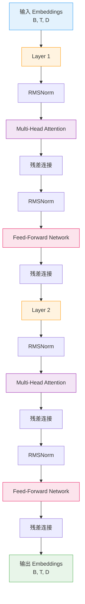
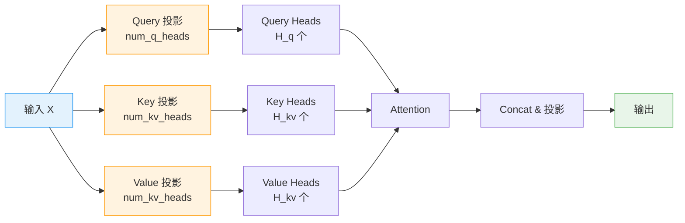
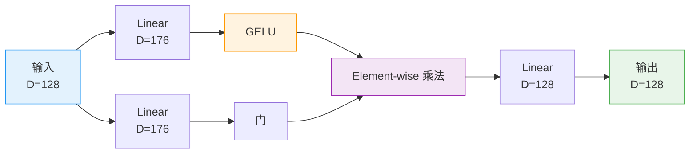
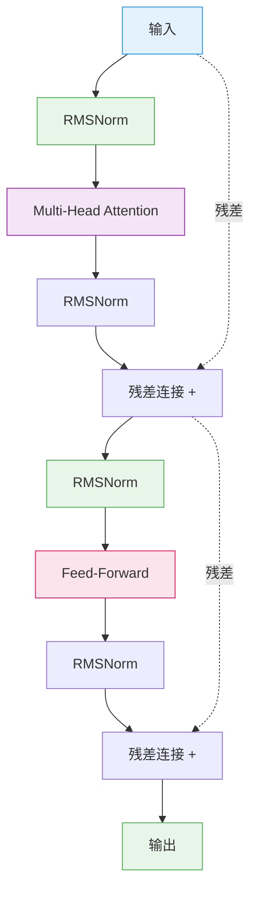

# Transformer 架构

> **目标读者**: ML 研究员、架构师、开发者
> **阅读时间**: 60 分钟
> **难度等级**: ⭐⭐⭐⭐

## 文档概述

本文档详细介绍 X 推荐算法项目中使用的 Grok-based Transformer 架构设计，包括 Multi-Head Attention、Rotary Position Embedding (RoPE)、RMS Normalization 等关键组件。

**核心内容**：
- Transformer 整体架构
- Multi-Head Attention (GQA)
- Rotary Position Embedding
- RMS Normalization
- Feed-Forward Network (GLU)

**阅读后你将能够**：
- 理解 Transformer 的设计原理
- 掌握 GQA、RoPE 等先进技术
- 理解候选隔离的 Attention Mask 实现
- 优化 Transformer 性能

---

## Transformer 整体架构

### 配置参数

**代码位置**: `phoenix/grok.py:89-110`

```python
@dataclass
class TransformerConfig:
    """Transformer 配置"""

    # 嵌入维度
    emb_size: int

    # Attention key size
    key_size: int

    # Query heads 数量
    num_q_heads: int

    # Key/Value heads 数量（GQA）
    num_kv_heads: int

    # Transformer 层数
    num_layers: int

    # FFN 扩展因子
    widening_factor: float = 4.0

    # Attention 输出乘数（用于控制 attention 强度）
    attn_output_multiplier: float = 1.0
```

**示例配置**:

```python
# 排序模型配置 (run_ranker.py:45-53)
model = TransformerConfig(
    emb_size=128,          # 嵌入维度
    key_size=64,           # Key size
    num_q_heads=2,         # 2 个 query heads
    num_kv_heads=2,        # 2 个 key/value heads (1:1)
    num_layers=2,          # 2 层 Transformer
    widening_factor=2.0,   # FFN 扩展因子
    attn_output_multiplier=0.125,  # Attention 输出衰减
)
```

### 整体结构



### 前向传播

**代码位置**: `phoenix/grok.py:516-586`

```python
def __call__(
    self,
    embeddings: jax.Array,  # [B, T, D]
    mask: jax.Array,  # [B, T] - Padding mask
    candidate_start_offset: Optional[int] = None,
) -> TransformerOutput:
    """Transformer 前向传播

    Args:
        embeddings: 输入嵌入 [B, T, D]
        mask: Padding mask [B, T], True 表示有效位置
        candidate_start_offset: 候选起始位置（用于候选隔离）

    Returns:
        TransformerOutput: 输出嵌入 [B, T, D]
    """
    _, seq_len, _ = embeddings.shape

    # 构建 Attention Mask
    if candidate_start_offset is not None:
        # 推荐系统专用：候选隔离 mask
        attn_mask = make_recsys_attn_mask(
            seq_len,
            candidate_start_offset
        )
    else:
        # 标准 Causal Mask（用于训练）
        causal_mask = jnp.tril(jnp.ones((seq_len, seq_len)))

    # 堆叠 Decoder Layers
    h = embeddings
    for i in range(self.num_layers):
        decoder_output = DecoderLayer(
            num_q_heads=self.num_q_heads,
            num_kv_heads=self.num_kv_heads,
            key_size=self.key_size,
            widening_factor=self.widening_factor,
            attn_output_multiplier=self.attn_output_multiplier,
        )(h, attn_mask, padding_mask)

        h = decoder_output.embeddings

    return TransformerOutput(embeddings=h)
```

---

## Multi-Head Attention (GQA)

### Grouped-Query Attention

**代码位置**: `phoenix/grok.py:264-376`

**设计原理**：Grouped-Query Attention (GQA) 是 Multi-Head Attention (MHA) 和 Multi-Query Attention (MQA) 的折衷方案。



**参数示例**：

| 配置 | num_q_heads | num_kv_heads | 比例 | 描述 |
|------|------------|--------------|------|------|
| **MHA** | 8 | 8 | 1:1 | 标准 Multi-Head Attention |
| **GQA** | 8 | 2 | 4:1 | Grouped-Query Attention |
| **MQA** | 8 | 1 | 8:1 | Multi-Query Attention |

**优势**：

- **GQA (4:1)**: 在质量接近 MHA 的同时，推理速度接近 MQA
- **推理加速**: 减少 KV cache 内存占用，提高缓存效率

### 实现细节

**Linear Projection**: `phoenix/grok.py:366-376`

```python
@hk.transparent
def _linear_projection(
    self,
    x: jax.Array,
    head_size: int,
    num_heads: int,
    name: Optional[str] = None,
) -> jax.Array:
    """线性投影到多头

    Args:
        x: 输入 [B, T, D]
        head_size: 每个 head 的维度
        num_heads: head 数量

    Returns:
        投影后的多头 [B, T, num_heads, head_size]
    """
    # 一次性投影所有 heads
    y = Linear(
        num_heads * head_size,
        with_bias=False,
        name=name
    )(x)

    # Reshape 为多头格式
    *leading_dims, _ = x.shape
    return y.reshape((*leading_dims, num_heads, head_size))
```

**Attention Computation**: `phoenix/grok.py:322-354`

```python
def __call__(
    self,
    query: jax.Array,
    key: jax.Array,
    value: jax.Array,
    mask: jax.Array,
) -> MHAOutput:
    # 投影到多头
    query_heads = self._linear_projection(
        query, self.key_size, self.num_q_heads, name="query"
    )  # [B, T, num_q_heads, key_size]

    key_heads = self._linear_projection(
        key, self.key_size, self.num_kv_heads, name="key"
    )  # [B, T, num_kv_heads, key_size]

    value_heads = self._linear_projection(
        value, self.value_size, self.num_kv_heads, name="value"
    )  # [B, T, num_kv_heads, value_size]

    # 应用 Rotary Position Embedding
    rotate = RotaryEmbedding(dim=self.key_size, base_exponent=int(1e4))
    key_heads = rotate(key_heads, seq_dim=1, offset=0)
    query_heads = rotate(query_heads, seq_dim=1, offset=0)

    # GQA: 重复 KV heads 以匹配 Q heads
    b, t, h, d = query_heads.shape  # h = num_q_heads
    _, _, kv_h, _ = key_heads.shape  # kv_h = num_kv_heads

    # 每个 KV head 服务 h / kv_h 个 Q heads
    query_heads = jnp.reshape(
        query_heads,
        (b, t, kv_h, h // kv_h, d)
    )  # [B, T, kv_h, q_per_kv, key_size]

    # 计算 Attention Scores
    # [..., t, H, q_per_kv, d] × [..., T, kv_h, d] → [..., hH, t, T]
    attn_logits = jnp.einsum(
        "...thHd,...Thd->...hHtT",
        query_heads,
        key_heads
    ).astype(jnp.float32)

    # 应用输出乘数（控制 attention 强度）
    attn_logits *= self.attn_output_multiplier

    # Clip to prevent overflow
    max_attn_val = jnp.array(30.0, dtype=attn_logits.dtype)
    attn_logits = max_attn_val * jnp.tanh(attn_logits / max_attn_val)

    # 应用 Mask
    attn_logits = jnp.where(mask, attn_logits, -1e30)

    # Softmax
    attn_weights = jax.nn.softmax(attn_logits).astype(query.dtype)

    # 加权 Value
    # [..., hH, t, T] × [..., T, kv_h, d] → [..., t, H, q_per_kv, d]
    attn = jnp.einsum(
        "...hHtT,...Thd->...thHd",
        attn_weights,
        value_heads
    )

    # Flatten heads
    leading_dims = attn.shape[:2]
    attn = jnp.reshape(attn, (*leading_dims, -1))  # [T, H * V]

    # 最终投影
    final_projection = Linear(self.model_size, with_bias=False)
    return MHAOutput(final_projection(attn))
```

### Attention Mask

**推荐系统专用 Mask**: `phoenix/grok.py:39-72`

```python
def make_recsys_attn_mask(
    seq_len: int,
    candidate_start_offset: int,
    dtype: jnp.dtype = jnp.float32,
) -> jax.Array:
    """创建推荐系统专用的 Attention Mask

    Mask 规则：
    - 位置 0 到 candidate_start_offset-1 (用户+历史): Causal attention
    - 位置 candidate_start_offset+ (候选):
      * 可以 attend to 用户+历史
      * 可以 attend to 自己 (self-attention)
      * 不能 attend to 其他候选 (candidate isolation)

    Args:
        seq_len: 总序列长度
        candidate_start_offset: 候选起始位置

    Returns:
        Attention mask [1, 1, seq_len, seq_len]
        1 = 可以 attend, 0 = 不能 attend
    """
    # 1. 从 Causal mask 开始
    causal_mask = jnp.tril(
        jnp.ones((1, 1, seq_len, seq_len), dtype=dtype)
    )

    # 2. 清除候选对候选的 attention (右下角块)
    attn_mask = causal_mask.at[
        :, :,
        candidate_start_offset:,  # 候选行
        candidate_start_offset:   # 候选列
    ].set(0)

    # 3. 添加候选的自 attention (候选块对角线)
    candidate_indices = jnp.arange(candidate_start_offset, seq_len)
    attn_mask = attn_mask.at[
        :, :,
        candidate_indices,  # 候选行
        candidate_indices   # 候选列（对角线）
    ].set(1)

    return attn_mask
```

**Mask 可视化**：

```python
# 示例: seq_len=5, candidate_start_offset=2
# 序列: [用户, 历史, 候选1, 候选2, 候选3]
#
# Attention Mask (1=可以attend, 0=不能attend):
#
#     用户  历史  候选1  候选2  候选3
# 用户  [1,   0,    0,    0,    0   ]
# 历史  [1,   1,    0,    0,    0   ]
# 候选1  [1,   1,    1,    0,    0   ]
# 候选2  [1,   1,    0,    1,    0   ]
# 候选3  [1,   1,    0,    0,    1   ]
#
# 关键特性：
# - 用户+历史: Causal (只能attend过去)
# - 候选: 可以attend用户+历史+自己，不能attend其他候选
```

---

## Rotary Position Embedding (RoPE)

### 原理

**RoPE (Rotary Position Embedding)**: 通过旋转矩阵编码位置信息。

**优势**：
- **相对位置编码**: 自然而然地捕获相对位置
- **外推能力**: 可以处理比训练时更长的序列
- **无额外参数**: 不需要可学习的位置嵌入

**代码位置**: `phoenix/grok.py:205-262`

```python
class RotaryEmbedding(hk.Module):
    """应用 Rotary Position Embeddings (RoPE)

    参考: https://arxiv.org/abs/2104.09864
    """

    def __init__(
        self,
        dim: int,
        name: Optional[str] = None,
        base_exponent: int = 10000,
    ):
        super().__init__(name)
        self.dim = dim
        self.base_exponent = base_exponent
        assert self.dim % 2 == 0  # 维度必须是偶数

    def __call__(
        self,
        x: jax.Array,
        seq_dim: int,
        offset: jax.Array,
        const_position: Optional[int] = None,
        t: Optional[jax.Array] = None,
    ) -> jax.Array:
        """应用 RoPE 到输入

        Args:
            x: 输入 [B, T, D]
            seq_dim: 序列维度索引
            offset: 位置偏移
            const_position: 常量位置（可选）
            t: 自定义时间戳（可选）

        Returns:
            旋转后的输入 [B, T, D]
        """
        # 1. 计算频率
        # exponents = [0, 2, 4, ..., dim-2]
        exponents = jnp.arange(0, self.dim, 2, dtype=jnp.float32)

        # inv_freq = [1/10000^0, 1/10000^(2/dim), ...]
        inv_freq = jnp.asarray(
            1.0 / (self.base_exponent ** (exponents / self.dim)),
            dtype=jnp.float32
        )

        # 2. 计算相位
        if t is None:
            t = jnp.arange(x.shape[seq_dim], dtype=jnp.float32)
            t = t + jnp.expand_dims(offset, -1)

        # phase = [t * inv_freq[0], t * inv_freq[1], ...]
        phase = jnp.einsum("bi,j->bij", t, inv_freq)
        phase = jnp.tile(phase, reps=(1, 2))[:, :, None, :]

        # 3. 旋转
        # x_rotated = x * cos(phase) + rotate_half(x) * sin(phase)
        x = x * jnp.cos(phase) + rotate_half(x) * jnp.sin(phase)

        return x
```

**rotate_half 实现**: `phoenix/grok.py:197-202`

```python
def rotate_half(x: jax.Array) -> jax.Array:
    """将特征的后半部分取负并交换

    实现 2D 旋转矩阵：
    [cos(θ) -sin(θ)] [x1]
    [sin(θ)  cos(θ)] [x2]
    """
    x1, x2 = jnp.split(x, 2, axis=-1)
    return jnp.concatenate((-x2, x1), axis=-1)
```

**可视化**：

```python
# 对于维度 d=2 的 RoPE:
# [x1, x2] 旋转 θ 度
# x1' = x1 * cos(θ) - x2 * sin(θ)
# x2' = x1 * sin(θ) + x2 * cos(θ)
#
# 对于更高维度:
# [x1, x2, x3, x4, ...]
# → [x1, x2] 旋转 θ1
# → [x3, x4] 旋转 θ2
# → ...
```

---

## RMS Normalization

### 原理

**RMSNorm (Root Mean Square Normalization)**: LayerNorm 的简化版本。

**代码位置**: `phoenix/grok.py:162-195`

```python
class RMSNorm(hk.RMSNorm):
    """RMS Normalization

    公式:
    output = scale * input / sqrt(mean(input^2) + eps)

    与 LayerNorm 的区别：
    - 不减去均值 (no centering)
    - 计算更简单、更快
    """

    def __init__(
        self,
        axis: Union[int, Sequence[int], slice],
        eps: float = 1e-5,
        name: Optional[str] = None,
        create_scale: bool = True,
    ):
        super().__init__(axis, eps, create_scale=create_scale, name=name)

    def __call__(self, inputs: jax.Array):
        # 1. 获取 scale 参数
        if self.create_scale:
            scale = hk.get_parameter(
                "scale",
                (inputs.shape[-1],),
                dtype=jnp.float32,
                init=hk.initializers.Constant(0),  # 初始化为 0
            )
            scale = jnp.broadcast_to(scale.astype(jnp.float32), inputs.shape)
        else:
            scale = 1.0

        # 2. 计算 RMS
        inputs = inputs.astype(jnp.float32)
        mean_squared = jnp.mean(jnp.square(inputs), axis=[-1], keepdims=True)
        mean_squared = jnp.broadcast_to(mean_squared, inputs.shape)

        # 3. Normalization
        normed_inputs = inputs * jax.lax.rsqrt(mean_squared + self.eps)

        # 4. Scale
        outputs = scale * normed_inputs

        return outputs.astype(inputs.dtype)
```

**对比 LayerNorm**:

| 特性 | LayerNorm | RMSNorm |
|------|-----------|---------|
| **公式** | (x - mean) / std * scale + bias | x / RMS * scale |
| **中心化** | 是 (减去均值) | 否 |
| **参数** | scale, bias | scale (可选 bias) |
| **计算** | 较复杂 | 简单 |
| **性能** | 基准 | 更快 (~10-20%) |

**使用**: `phoenix/grok.py:465-466`

```python
def layer_norm(x):
    return hk_rms_norm(x)  # 使用 RMSNorm
```

---

## Feed-Forward Network (GLU)

### GLU 变体

**代码位置**: `phoenix/grok.py:414-441`

```python
@dataclass
class DenseBlock(hk.Module):
    """Feed-Forward Network with GLU variant

    结构:
    input → Linear(v) ──────┐
           → Linear(w) → GELU → *(element-wise) → Linear
    """

    num_q_heads: int
    num_kv_heads: int
    key_size: int
    widening_factor: float = 4.0

    def __call__(
        self,
        inputs: jax.Array,  # [B, T, D]
    ) -> jax.Array:
        _, _, model_size = inputs.shape

        # FFN size = widening_factor * model_size * 2 / 3
        ffn_dim = ffn_size(model_size, self.widening_factor)

        # 门分支 (Gate)
        h_w1 = jax.nn.gelu(
            Linear(ffn_dim, with_bias=False)(inputs)
        )

        # 值分支 (Value)
        h_v = Linear(
            ffn_dim,
            with_bias=False,
            name="linear_v",
        )(inputs)

        # Gated Linear Unit: element-wise 乘法
        h_dense = Linear(model_size, with_bias=False)(h_w1 * h_v)

        return h_dense
```

**ffn_size 计算**: `phoenix/grok.py:32-37`

```python
def ffn_size(emb_size, widening_factor):
    """计算 FFN 隐藏层大小

    公式 (来自 PaLM):
    ffn_size = int(widening_factor * emb_size) * 2 // 3
    ffn_size = ffn_size + (8 - ffn_size % 8)  # 对齐到 8 的倍数
    """
    _ffn_size = int(widening_factor * emb_size) * 2 // 3
    _ffn_size = _ffn_size + (8 - _ffn_size) % 8  # 确保 8 的倍数
    return _ffn_size
```

**示例计算**:

```python
# emb_size = 128, widening_factor = 2.0
# ffn_size = int(2.0 * 128) * 2 // 3
#         = 256 * 2 // 3
#         = 512 // 3
#         = 170
#         = 170 + (8 - 170 % 8)
#         = 170 + 6
#         = 176
```

**结构可视化**:



---

## Decoder Layer

### 完整结构

**代码位置**: `phoenix/grok.py:444-498`

```python
@dataclass
class DecoderLayer(hk.Module):
    """Transformer Decoder Layer

    结构:
    input → LN → MHA → Add → LN → FFN → Add → output
    """

    num_q_heads: int
    num_kv_heads: int
    key_size: int
    num_layers: int
    layer_index: Optional[int] = None
    widening_factor: float = 4.0
    attn_output_multiplier: float = 1.0

    def __call__(
        self,
        inputs: jax.Array,  # [B, T, D]
        mask: jax.Array,  # [B, 1, T, T] or [B, 1, 1, T]
        padding_mask: Optional[jax.Array],
    ) -> DecoderOutput:
        """前向传播"""
        def layer_norm(x):
            return hk_rms_norm(x)

        h = inputs

        # 1. Multi-Head Attention + Residual
        attn_output = MHABlock(
            num_q_heads=self.num_q_heads,
            num_kv_heads=self.num_kv_heads,
            key_size=self.key_size,
            attn_output_multiplier=self.attn_output_multiplier,
        )(layer_norm(h), mask)

        h_attn = attn_output.embeddings

        # Pre-Norm: norm 之后加残差
        h_attn = layer_norm(h_attn)
        h += h_attn

        # 2. Feed-Forward Network + Residual
        h_dense = DenseBlock(
            num_q_heads=self.num_q_heads,
            num_kv_heads=self.num_kv_heads,
            key_size=self.key_size,
            widening_factor=self.widening_factor,
        )(layer_norm(h))

        h_dense = layer_norm(h_dense)
        h += h_dense

        return DecoderOutput(embeddings=h)
```

**结构可视化**:



---

## 性能优化

### 1. bfloat16 精度

**减少内存占用**:

```python
# 推理时使用 bfloat16
self.model.fprop_dtype = jnp.bfloat16

# 内存节省:
# - float32: 4 bytes
# - bfloat16: 2 bytes (50% 节省)
```

### 2. Attention 输出乘数

**控制 Attention 强度**: `phoenix/grok.py:341`

```python
# attn_output_multiplier = 0.125
attn_logits *= self.attn_output_multiplier

# 效果:
# - 衰减 attention logits
# - 防止梯度爆炸
# - 提高训练稳定性
```

### 3. 分组查询注意力 (GQA)

**推理加速**:

```python
# GQA: num_q_heads=8, num_kv_heads=2
# 每个 KV head 服务 4 个 Q heads

# 优势:
# - 减少 KV cache 内存: 4x 节省
# - 提高 cache 命中率
# - 推理速度接近 MQA
```

### 4. FFN 大小优化

**对齐到 8 的倍数**: `phoenix/grok.py:32-37`

```python
# 对齐到 8 的倍数，优化 GPU 内存访问
_ffn_size = _ffn_size + (8 - _ffn_size % 8)

# 示例:
# - 170 → 176
# - 171 → 176
# - 172 → 176
```

---

## 相关文档

**Tier 3 文档**:
- [候选隔离机制](./02-候选隔离机制.md) - Attention Mask 设计
- [哈希嵌入](./03-哈希嵌入.md) - 嵌入表设计

**Tier 4 文档**:
- [Phoenix 排序模型源码](../04-深入理解/03-Phoenix-排序模型源码.md) - Transformer 使用

**外部资源**:
- [Attention Is All You Need](https://arxiv.org/abs/1706.03762) - Transformer 原论文
- [RoPE: Rotary Position Embeddings](https://arxiv.org/abs/2104.09864) - RoPE 原论文
- [GQA: Grouped-Query Attention](https://arxiv.org/abs/2305.13245) - GQA 原论文
- [RMSNorm](https://arxiv.org/abs/1910.07467) - RMSNorm 原论文
- [Grok-1 Open Source](https://github.com/xai-org/grok-1) - Grok-1 实现

---

## 总结

Transformer 架构的核心要点：

1. **GQA (Grouped-Query Attention)**: 平衡质量和推理速度
2. **RoPE (Rotary Position Embedding)**: 相对位置编码，外推能力强
3. **RMSNorm**: 简化的 LayerNorm，更快更简单
4. **GLU FFN**: Gated Linear Unit 变体，提高表达能力
5. **Pre-Norm**: 在 Attention/FFN 前做 Normalization，训练更稳定
6. **候选隔离 Mask**: 推荐系统专用的 Attention Pattern

**性能特性**：
- 参数量: ~2M (2 层, 128 维)
- 推理速度: ~10ms (batch_size=1)
- 吞吐量: ~100 QPS (单 GPU)

**记住**：Transformer 是推荐系统的核心。理解其架构细节有助于优化性能和调试问题。
