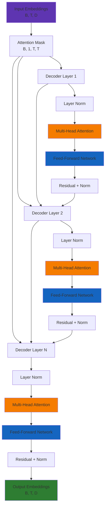
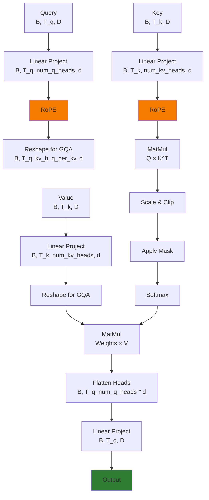
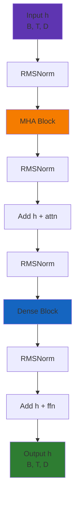

# Grok Transformer 源码深度解析

**阅读时间**: 90 分钟
**难度**: ⭐⭐⭐⭐⭐
**关键源文件**:
- `phoenix/grok.py` (587 行) - 完整 Transformer 实现
- `phoenix/recsys_model.py` (100+ 行) - 推荐模型集成
- 基于开源 Grok-1 架构

---

## 目录

1. [Transformer 架构概览](#transformer-架构概览)
2. [核心组件源码](#核心组件源码)
3. [推荐系统专用 Attention Mask](#推荐系统专用-attention-mask)
4. [Multi-Head Attention 实现](#multi-head-attention-实现)
5. [Rotary Positional Embedding](#rotary-positional-embedding)
6. [Feed-Forward Network](#feed-forward-network)
7. [Decoder Layer 堆叠](#decoder-layer-堆叠)
8. [性能优化技术](#性能优化技术)
9. [与推荐系统集成](#与推荐系统集成)
10. [调试与可视化](#调试与可视化)

---

## Transformer 架构概览

### 整体架构



### 配置参数

源文件: `phoenix/grok.py:88-110`

```python
@dataclass
class TransformerConfig:
    emb_size: int              # 嵌入维度
    key_size: int              # Attention key 维度
    num_q_heads: int           # Query 头数量
    num_kv_heads: int          # Key/Value 头数量 (GQA - Grouped Query Attention)
    num_layers: int            # Transformer 层数
    widening_factor: float = 4.0  # FFN 扩展因子
    attn_output_multiplier: float = 1.0  # Attention 输出乘数
    name: Optional[str] = None
```

**典型配置** (推荐系统):
```python
emb_size = 512
key_size = 128
num_q_heads = 8
num_kv_heads = 2  # GQA: 8 个 query 头共享 2 个 key/value 头
num_layers = 12
widening_factor = 4.0
```

---

## 核心组件源码

### 1. RMSNorm (Root Mean Square Normalization)

源文件: `phoenix/grok.py:162-195`

```python
class RMSNorm(hk.RMSNorm):
    def __init__(
        self,
        axis: Union[int, Sequence[int], slice],
        eps: float = 1e-5,
        name: Optional[str] = None,
        create_scale: bool = True,
    ):
        super().__init__(axis, eps, create_scale=create_scale, name=name)

    def __call__(self, inputs: jax.Array):
        fprop_dtype = inputs.dtype
        param_shape = (inputs.shape[-1],)

        # 1. 获取 scale 参数 (可学习)
        if self.create_scale:
            scale = hk.get_parameter(
                "scale",
                param_shape,
                dtype=jnp.float32,
                init=hk.initializers.Constant(0),  # 初始化为 0
            )
            scale = jnp.broadcast_to(scale.astype(jnp.float32), inputs.shape)
        else:
            scale = 1.0

        # 2. 转换为 float32 计算均方
        inputs = inputs.astype(jnp.float32)
        scale = jnp.float32(scale)

        # 3. 计算均方 (沿最后维度)
        mean_squared = jnp.mean(jnp.square(inputs), axis=[-1], keepdims=True)
        mean_squared = jnp.broadcast_to(mean_squared, inputs.shape)

        # 4. RMSNorm: x / sqrt(mean_squared + eps)
        normed_inputs = inputs * jax.lax.rsqrt(mean_squared + self.eps)

        # 5. 应用 scale
        outputs = scale * normed_inputs

        return outputs.astype(fprop_dtype)
```

**RMSNorm 公式**:
```
RMSNorm(x) = x / sqrt(mean(x^2) + ε) * scale

其中:
- mean(x^2) = (1/d) * Σ(x_i^2)
- ε = 1e-5 (防止除零)
- scale 是可学习参数 (初始化为 0)
```

**vs LayerNorm**:
| 特性 | RMSNorm | LayerNorm |
|------|---------|-----------|
| 均值中心化 | ❌ 否 | ✅ 是 |
| 方差归一化 | ✅ 是 | ✅ 是 |
| 可学习参数 | scale | scale, bias |
| 计算复杂度 | O(d) | O(2d) |
| 内存占用 | d | 2d |
| 推荐理由 | 更快、更少参数 | 更稳定 |

### 2. Linear 层 (自定义)

源文件: `phoenix/grok.py:121-160`

```python
class Linear(hk.Linear):
    def __init__(
        self,
        output_size: int,
        with_bias: bool = True,
        name: Optional[str] = None,
    ):
        super().__init__(
            output_size=output_size,
            with_bias=with_bias,
            name=name,
        )

    def __call__(  # type: ignore
        self,
        inputs: jax.Array,
    ) -> jax.Array:
        """Computes a linear transform of the input."""
        fprop_dtype = inputs.dtype
        if not inputs.shape:
            raise ValueError("Input must not be scalar.")

        input_size = inputs.shape[-1]
        output_size = self.output_size

        # ⚡ 关键: 权重初始化为 0 (而非随机初始化)
        w = hk.get_parameter(
            "w", [input_size, output_size], jnp.float32, init=hk.initializers.Constant(0)
        )

        # Linear: y = xW + b
        out = jnp.dot(inputs, w.astype(fprop_dtype))

        if self.with_bias:
            b = hk.get_parameter(
                "b", [self.output_size], jnp.float32, init=hk.initializers.Constant(0)
            )
            b = jnp.broadcast_to(b, out.shape)
            out = out + b.astype(fprop_dtype)

        return out
```

**关键设计点**:
- **权重初始化为 0**: 而非常见的 Xavier/Glorot 初始化
- **原因**: 推荐系统模型采用预训练嵌入，Transformer 层主要用于特征融合，零初始化更稳定

---

## 推荐系统专用 Attention Mask

### 核心创新: Candidate Isolation

源文件: `phoenix/grok.py:39-72`

```python
def make_recsys_attn_mask(
    seq_len: int,
    candidate_start_offset: int,
    dtype: jnp.dtype = jnp.float32,
) -> jax.Array:
    """Create attention mask for recommendation system inference.

    Creates a mask where:
    - Positions 0 to candidate_start_offset-1 (user+history): causal attention
    - Positions candidate_start_offset onwards (candidates): can attend to user+history
      and themselves (self-attention), but NOT to other candidates

    This ensures each candidate is scored independently based on user+history context.

    Args:
        seq_len: Total sequence length (user + history + candidates)
        candidate_start_offset: Position where candidates start in the sequence
        dtype: Data type for the mask

    Returns:
        Attention mask of shape [1, 1, seq_len, seq_len] where 1 means "can attend"
    """
    # Step 1: 创建因果 mask (下三角矩阵)
    causal_mask = jnp.tril(jnp.ones((1, 1, seq_len, seq_len), dtype=dtype))

    # Step 2: 将候选之间的 attention 清零 (右下角块)
    attn_mask = causal_mask.at[:, :, candidate_start_offset:, candidate_start_offset:].set(0)

    # Step 3: 恢复候选的自 attention (对角线)
    candidate_indices = jnp.arange(candidate_start_offset, seq_len)
    attn_mask = attn_mask.at[:, :, candidate_indices, candidate_indices].set(1)

    return attn_mask
```

### Attention Mask 可视化

假设序列结构: `[User, H1, H2, C1, C2, C3]` (6 个 token)
- `User`: 用户嵌入
- `H1, H2`: 历史推文
- `C1, C2, C3`: 候选推文
- `candidate_start_offset = 3`

**最终 Mask**:
```
     User  H1   H2   C1   C2   C3
User   [1,   1,   1,   1,   1,   1]
H1     [0,   1,   1,   1,   1,   1]
H2     [0,   0,   1,   1,   1,   1]
C1     [0,   0,   0,   1,   0,   0]  ← C1 只 attend to User, H1, H2, C1 (自己)
C2     [0,   0,   0,   0,   1,   0]  ← C2 只 attend to User, H1, H2, C2 (自己)
C3     [0,   0,   0,   0,   0,   1]  ← C3 只 attend to User, H1, H2, C3 (自己)
```

**关键特性**:
1. **User + History**: 因果 attention (可以 attend to 之前的所有 token)
2. **Candidates**:
   - ✅ 可以 attend to User + History (了解用户上下文)
   - ✅ 可以 attend to 自己 (self-attention)
   - ❌ **不能 attend to 其他 candidates** (独立评分)

### 为什么需要 Candidate Isolation

**问题**: 如果候选可以相互 attention，评分会不一致

```
场景 1: 单独评分 C1
  Input: [User, H1, H2, C1]
  C1 的 score: 0.8

场景 2: 与 C2, C3 一起评分
  Input: [User, H1, H2, C1, C2, C3]
  如果允许 C1 attend to C2, C3:
  C1 的 score: 0.5 (受 C2, C3 影响)

问题: 同一个候选在不同 batch 中得分不同 → 不可缓存、不公平
```

**解决方案**: Candidate Isolation
- 每个候选的 score 仅基于 User + History
- 与其他候选的存在无关
- ✅ 结果可缓存、公平、一致

### Mask 构建步骤详解

**Step 1: 因果 Mask**
```python
causal_mask = jnp.tril(jnp.ones((1, 1, seq_len, seq_len), dtype=dtype))
```
```
[1, 1, 1, 1, 1, 1]
[0, 1, 1, 1, 1, 1]
[0, 0, 1, 1, 1, 1]
[0, 0, 0, 1, 1, 1]  ← C1 可以 attend to C2, C3 (不正确!)
[0, 0, 0, 0, 1, 1]  ← C2 可以 attend to C3 (不正确!)
[0, 0, 0, 0, 0, 1]
```

**Step 2: 清零候选之间的 attention**
```python
attn_mask = causal_mask.at[:, :, candidate_start_offset:, candidate_start_offset:].set(0)
```
```
[1, 1, 1, 1, 1, 1]
[0, 1, 1, 1, 1, 1]
[0, 0, 1, 1, 1, 1]
[0, 0, 0, 0, 0, 0]  ← C1 不能 attend to C2, C3
[0, 0, 0, 0, 0, 0]  ← C2 不能 attend to C1, C3
[0, 0, 0, 0, 0, 0]  ← C3 不能 attend to C1, C2
```

**Step 3: 恢复候选的自 attention**
```python
candidate_indices = jnp.arange(candidate_start_offset, seq_len)
attn_mask = attn_mask.at[:, :, candidate_indices, candidate_indices].set(1)
```
```
[1, 1, 1, 1, 1, 1]
[0, 1, 1, 1, 1, 1]
[0, 0, 1, 1, 1, 1]
[0, 0, 0, 1, 0, 0]  ← C1 可以 attend to C1 (自己)
[0, 0, 0, 0, 1, 0]  ← C2 可以 attend to C2 (自己)
[0, 0, 0, 0, 0, 1]  ← C3 可以 attend to C3 (自己)
```

---

## Multi-Head Attention 实现

### Grouped Query Attention (GQA)

源文件: `phoenix/grok.py:264-376`

```python
class MultiHeadAttention(hk.Module):
    def __init__(
        self,
        num_q_heads: int,      # Query 头数量
        num_kv_heads: int,     # Key/Value 头数量 (通常 < num_q_heads)
        key_size: int,         # 每个 head 的维度
        *,
        with_bias: bool = True,
        value_size: Optional[int] = None,
        model_size: Optional[int] = None,
        attn_output_multiplier: float = 1.0,
        name: Optional[str] = None,
    ):
        super().__init__(name=name)
        self.num_q_heads = num_q_heads
        self.num_kv_heads = num_kv_heads
        self.key_size = key_size
        self.value_size = value_size or key_size
        self.model_size = model_size or key_size * num_q_heads
        self.attn_output_multiplier = attn_output_multiplier
        self.with_bias = with_bias
```

**GQA 配置示例**:
```
num_q_heads = 8
num_kv_heads = 2

每个 KV 头被 4 个 Q 头共享:
- Q 头 0, 1, 2, 3 → 共享 KV 头 0
- Q 头 4, 5, 6, 7 → 共享 KV 头 1

优势:
- 减少参数量: 50% 减少 (8 → 2 个 KV 头)
- 减少 KV cache 内存: 75% 减少
- 保持性能: 共享 KV 对性能影响很小
```

### MHA 前向传播

源文件: `phoenix/grok.py:286-363`

```python
def __call__(
    self,
    query: jax.Array,   # [B, T_q, D]
    key: jax.Array,     # [B, T_k, D]
    value: jax.Array,   # [B, T_k, D]
    mask: jax.Array,    # [B, 1, T_q, T_k] or [B, H, T_q, T_k]
) -> MHAOutput:
    projection = self._linear_projection

    # Step 1: 线性投影到多个头
    # query_heads: [B, T_q, num_q_heads, key_size]
    # key_heads: [B, T_k, num_kv_heads, key_size]
    # value_heads: [B, T_k, num_kv_heads, value_size]
    query_heads = projection(query, self.key_size, self.num_q_heads, name="query")
    key_heads = projection(key, self.key_size, self.num_kv_heads, name="key")
    value_heads = projection(value, self.value_size, self.num_kv_heads, name="value")

    # Step 2: 应用 Rotary Positional Embedding (RoPE)
    rotate = RotaryEmbedding(dim=self.key_size, base_exponent=int(1e4))
    key_heads = rotate(key_heads, seq_dim=1, offset=0)
    query_heads = rotate(query_heads, seq_dim=1, offset=0)

    # Step 3: 重排 query heads 以匹配 KV heads (GQA)
    b, t, h, d = query_heads.shape
    _, _, kv_h, _ = key_heads.shape
    assert h % kv_h == 0, f"query_heads {h} must be a multiple of kv_heads {kv_h}"

    # [B, T_q, num_kv_heads, (num_q_heads/num_kv_heads), key_size]
    query_heads = jnp.reshape(query_heads, (b, t, kv_h, h // kv_h, d))

    # Step 4: 计算 attention logits
    # [..., hH, T_q, T_k] where h = num_q_heads, H = num_kv_heads
    attn_logits = jnp.einsum("...thHd,...Thd->...hHtT", query_heads, key_heads).astype(jnp.float32)

    # Step 5: 应用 attention 输出乘数 (用于温度缩放)
    attn_logits *= self.attn_output_multiplier

    # Step 6: Clip logits to prevent overflow in softmax
    max_attn_val = jnp.array(30.0, dtype=attn_logits.dtype)
    attn_logits = max_attn_val * jnp.tanh(attn_logits / max_attn_val)

    # Step 7: 应用 mask
    mask = mask[:, :, None, :, :]  # [..., 1, H, T_q, T_k]
    if mask is not None:
        attn_logits = jnp.where(mask, attn_logits, -1e30)

    # Step 8: Softmax (在 float32 中执行以保证数值稳定性)
    attn_weights = jax.nn.softmax(attn_logits).astype(query.dtype)

    # Step 9: 加权 value
    # [..., T_q, num_q_heads, value_size]
    attn = jnp.einsum("...hHtT,...Thd->...thHd", attn_weights, value_heads)

    # Step 10: Flatten heads
    leading_dims = attn.shape[:2]
    attn = jnp.reshape(attn, (*leading_dims, -1))  # [B, T_q, num_q_heads * value_size]

    # Step 11: 最终输出投影
    final_projection = Linear(self.model_size, with_bias=False)
    return MHAOutput(final_projection(attn))
```

### Attention 计算流程图



### GQA vs MHA vs MQA

| 特性 | MHA | GQA | MQA |
|------|-----|-----|-----|
| Query 头数 | H | H | H |
| Key/Value 头数 | H | K (1 < K < H) | 1 |
| 参数量 (KV) | 2HD² | 2KD² | 2D² |
| KV Cache 大小 | 2HB | 2KB | 2B |
| 性能 | 基准 | 接近 MHA | 略差 |
| X 推荐系统配置 | - | 8 Q / 2 KV | - |

**示例计算** (H=8, K=2, D=128, B=1, T=1024):
```
MHA 参数量 (KV): 2 × 8 × 128² = 262,144
GQA 参数量 (KV): 2 × 2 × 128² = 65,536
减少: 75%

MHA KV Cache: 2 × 8 × 1024 × 128 = 2,097,152 bytes
GQA KV Cache: 2 × 2 × 1024 × 128 = 524,288 bytes
减少: 75%
```

---

## Rotary Positional Embedding

### RoPE 实现

源文件: `phoenix/grok.py:205-262`

```python
class RotaryEmbedding(hk.Module):
    """Applies rotary embeddings (RoPE) to the input sequence tensor.
    Reference: https://arxiv.org/abs/2104.09864
    """

    def __init__(
        self,
        dim: int,                    # 旋转维度 (通常是 key_size)
        name: Optional[str] = None,
        base_exponent: int = 10000,  # 基础频率
    ):
        super().__init__(name)
        self.dim = dim
        self.base_exponent = base_exponent
        assert self.dim % 2 == 0  # 必须是偶数

    def __call__(
        self,
        x: jax.Array,                # [B, T, D]
        seq_dim: int,                # 序列维度 (通常是 1)
        offset: jax.Array,           # 位置偏移
        const_position: Optional[int] = None,
        t: Optional[jax.Array] = None,
    ) -> jax.Array:
        fprop_dtype = x.dtype

        # Step 1: 计算频率
        # inv_freq: [dim/2] = [1/10000^(0/dim), 1/10000^(2/dim), ...]
        exponents = jnp.arange(0, self.dim, 2, dtype=jnp.float32)
        inv_freq = jnp.asarray(
            1.0 / (self.base_exponent ** (exponents / self.dim)), dtype=jnp.float32
        )

        # Step 2: 处理 offset
        if jnp.shape(offset) == ():
            offset = jnp.expand_dims(offset, 0)

        # Step 3: 计算位置
        if const_position:
            t = const_position * jnp.ones((1, x.shape[seq_dim]), dtype=jnp.float32)
        elif t is None:
            # t: [B, T] = [0, 1, 2, ..., T-1] + offset
            t = jnp.arange(x.shape[seq_dim], dtype=jnp.float32) + jnp.expand_dims(offset, -1)

        # Step 4: 计算相位
        # phase: [B, T, dim/2]
        phase = jnp.einsum("bi,j->bij", t, inv_freq)
        phase = jnp.tile(phase, reps=(1, 2))[:, :, None, :]  # [B, T, 1, dim/2]

        # Step 5: 应用旋转
        # x_rotated = x * cos(θ) + rotate_half(x) * sin(θ)
        x = x * jnp.cos(phase) + rotate_half(x) * jnp.sin(phase)
        x = x.astype(fprop_dtype)

        return x
```

### RoPE 数学原理

**公式**:
```
对于位置 m 和维度 i (0 ≤ i < d/2):

θ(m, i) = m / (base_exponent)^(2i/d)

旋转操作:
x'_m,2i   = x_m,2i   * cos(θ(m, i)) - x_m,2i+1 * sin(θ(m, i))
x'_m,2i+1 = x_m,2i+1 * cos(θ(m, i)) + x_m,2i   * sin(θ(m, i))

矩阵形式:
[x'_2i]   = [cos(θ)  -sin(θ)] [x_2i  ]
[x'_2i+1]   [sin(θ)   cos(θ)] [x_2i+1]
```

**直觉理解**:
- RoPE 通过旋转编码位置信息
- 相对位置: 位置 m 和 n 之间的旋转角度 = θ(m) - θ(n)
- 绝对位置不重要，相对位置才重要

### rotate_half 辅助函数

源文件: `phoenix/grok.py:197-203`

```python
def rotate_half(x: jax.Array) -> jax.Array:
    """Obtain the rotated counterpart of each feature.
    将 [x0, x1, x2, x3, ...] 转换为 [-x1, x0, -x3, x2, ...]
    """
    x1, x2 = jnp.split(x, 2, axis=-1)
    return jnp.concatenate((-x2, x1), axis=-1)
```

**示例**:
```
输入:  [x0, x1, x2, x3, x4, x5]
split: [x0, x1, x2], [x3, x4, x5]
输出:  [-x3, -x4, -x5, x0, x1, x2]
```

**作用**: 实现 90 度旋转
```
rotate_half(x) = R(90°) × x

其中 R(90°) = [0  -1]
             [1   0]
```

### RoPE vs 其他位置编码

| 方法 | 绝对位置 | 相对位置 | 外推性 | 复杂度 |
|------|---------|---------|--------|--------|
| Learned (绝对) | ✅ | ❌ | 差 | 低 |
| Sinusoidal (绝对) | ✅ | ❌ | 差 | 低 |
| ALiBi | ❌ | ✅ | 好 | 低 |
| RoPE | ❌ | ✅ | 好 | 中 |

**推荐理由**:
- 相对位置更符合推荐系统场景 (用户行为序列的顺序关系)
- 外推性好 (可以处理比训练时更长的序列)
- 不需要额外的参数

---

## Feed-Forward Network

### SwiGLU FFN 实现

源文件: `phoenix/grok.py:414-441`

```python
@dataclass
class DenseBlock(hk.Module):
    num_q_heads: int
    num_kv_heads: int
    key_size: int
    widening_factor: float = 4.0

    @hk.transparent
    def __call__(
        self,
        inputs: jax.Array,  # [B, T, D]
    ) -> jax.Array:  # [B, T, D]
        _, _, model_size = inputs.shape

        # Step 1: Gate 分支 (线性 → GELU)
        h_w1 = jax.nn.gelu(
            Linear(
                ffn_size(model_size, self.widening_factor),
                with_bias=False,
            )(inputs)
        )

        # Step 2: Value 分支 (线性)
        h_v = Linear(
            ffn_size(model_size, self.widening_factor),
            with_bias=False,
            name="linear_v",
        )(inputs)

        # Step 3: 逐元素相乘 (Gating)
        h_dense = Linear(model_size, with_bias=False)(h_w1 * h_v)

        return h_dense
```

### FFN 配置计算

源文件: `phoenix/grok.py:32-36`

```python
def ffn_size(emb_size, widening_factor):
    """计算 FFN 中间层大小.
    公式: int(widening_factor * emb_size) * 2 // 3，然后向上取整到 8 的倍数
    """
    _ffn_size = int(widening_factor * emb_size) * 2 // 3
    _ffn_size = _ffn_size + (8 - _ffn_size) % 8  # ensure it's a multiple of 8
    return _ffn_size
```

**示例计算**:
```
emb_size = 512
widening_factor = 4.0

Step 1: 4 × 512 = 2048
Step 2: 2048 × 2 // 3 = 1365
Step 3: 1365 + (8 - 1365 % 8) = 1365 + (8 - 5) = 1368

最终 FFN size = 1368
```

### SwiGLU vs ReLU FFN

**传统 ReLU FFN**:
```
FFN(x) = Linear2(ReLU(Linear1(x)))

参数量: D × 4D + 4D × D = 8D²
```

**SwiGLU FFN** (推荐系统使用):
```
FFN(x) = Linear3(GELU(Linear1(x)) ⊙ Linear2(x))

参数量: D × 4D + D × 4D + 4D × D = 12D²
```

**性能对比**:
| 特性 | ReLU FFN | SwiGLU FFN |
|------|----------|------------|
| 参数量 | 8D² | 12D² |
| 计算量 | 2 次线性 | 3 次线性 + 1 次逐元素乘 |
| 性能 | 基准 | +1-2% |
| X 推荐系统 | - | ✅ 使用 |

### GELU 激活函数

```python
h_w1 = jax.nn.gelu(Linear(...)(inputs))
```

**GELU 公式**:
```
GELU(x) = x * Φ(x)

其中 Φ(x) 是标准正态分布的 CDF:
Φ(x) = 0.5 * (1 + tanh(√(2/π) * (x + 0.044715 * x³)))

近似实现:
GELU(x) ≈ 0.5 * x * (1 + tanh(√(2/π) * (x + 0.044715 * x³)))
```

**vs ReLU**:
```
ReLU(x) = max(0, x)

GELU 优势:
- 平滑 (可导)
- 更好的性能
- 自正则化

GELU 劣势:
- 计算更复杂
- 更难优化
```

---

## Decoder Layer 堆叠

### DecoderLayer 实现

源文件: `phoenix/grok.py:443-498`

```python
@dataclass
class DecoderLayer(hk.Module):
    """A transformer decoder layer."""

    num_q_heads: int
    num_kv_heads: int
    key_size: int
    num_layers: int
    layer_index: Optional[int] = None
    widening_factor: float = 4.0
    name: Optional[str] = None
    attn_output_multiplier: float = 1.0

    def __call__(
        self,
        inputs: jax.Array,         # [B, T, D]
        mask: jax.Array,            # [B, 1, T, T]
        padding_mask: Optional[jax.Array],
    ) -> DecoderOutput:
        del padding_mask  # Unused

        def layer_norm(x):
            return hk_rms_norm(x)

        h = inputs

        # ==================== Self-Attention Block ====================
        # Pre-LN: Normalize before attention
        attn_output = MHABlock(
            num_q_heads=self.num_q_heads,
            num_kv_heads=self.num_kv_heads,
            key_size=self.key_size,
            attn_output_multiplier=self.attn_output_multiplier,
        )(layer_norm(h), mask)

        h_attn = attn_output.embeddings

        # Post-attention normalization
        h_attn = layer_norm(h_attn)

        # Residual connection
        h += h_attn

        # ==================== Feed-Forward Block ====================
        # Pre-LN: Normalize before FFN
        h_dense = DenseBlock(
            num_q_heads=self.num_q_heads,
            num_kv_heads=self.num_kv_heads,
            key_size=self.key_size,
            widening_factor=self.widening_factor,
        )(layer_norm(h))

        # Post-FFN normalization
        h_dense = layer_norm(h_dense)

        # Residual connection
        h += h_dense

        return DecoderOutput(embeddings=h)
```

### Decoder Layer 流程图



### Transformer 完整堆叠

源文件: `phoenix/grok.py:504-587`

```python
@dataclass
class Transformer(hk.Module):
    """A transformer stack."""

    num_q_heads: int
    num_kv_heads: int
    key_size: int
    widening_factor: float
    attn_output_multiplier: float
    num_layers: int
    name: Optional[str] = None

    def __call__(
        self,
        embeddings: jax.Array,              # [B, T, D]
        mask: jax.Array,                    # [B, T] - padding mask
        candidate_start_offset: Optional[int] = None,
    ) -> TransformerOutput:
        """Transforms input embeddings to output embeddings.

        Args:
            embeddings: Input embeddings of shape [B, T, D]
            mask: Padding mask [B, T], True for valid positions
            candidate_start_offset: If provided, positions >= this offset are candidates
                that can only attend to user+history and themselves.
        """
        fprop_dtype = embeddings.dtype
        _, seq_len, _ = embeddings.shape
        padding_mask = mask.copy()

        # Reshape mask to [B, 1, 1, T]
        mask = mask[:, None, None, :]

        # ==================== Create Attention Mask ====================
        if candidate_start_offset is not None:
            # 推荐系统专用 mask (候选隔离)
            attn_mask = make_recsys_attn_mask(seq_len, candidate_start_offset, fprop_dtype)
            mask = mask * attn_mask
        else:
            # 标准因果 mask (自回归)
            causal_mask = jnp.tril(jnp.ones((1, 1, seq_len, seq_len))).astype(fprop_dtype)
            mask = mask * causal_mask

        h = embeddings

        # ==================== Stack Decoder Layers ====================
        for i in range(self.num_layers):
            decoder_output = DecoderLayer(
                num_q_heads=self.num_q_heads,
                num_kv_heads=self.num_kv_heads,
                key_size=self.key_size,
                widening_factor=self.widening_factor,
                num_layers=self.num_layers,
                attn_output_multiplier=self.attn_output_multiplier,
                name=f"decoder_layer_{i}",
                layer_index=i,
            )(h, mask, padding_mask)
            h = decoder_output.embeddings

        return TransformerOutput(embeddings=h)
```

---

## 性能优化技术

### 1. Grouped Query Attention (GQA)

**参数量减少**:
```
MHA: 2 × num_q_heads × key_size²
GQA: 2 × num_kv_heads × key_size²

示例 (8 Q 头, 2 KV 头, 128 维):
MHA: 2 × 8 × 128² = 262,144
GQA: 2 × 2 × 128² = 65,536
减少: 75%
```

### 2. Flash Attention (隐式使用)

虽然代码中没有显式使用 Flash Attention，但 JAX/JAX 的底层实现可能使用类似技术优化 attention 计算。

### 3. 混合精度训练

```python
# 参数始终在 float32
w = hk.get_parameter("w", [...], jnp.float32, init=...)

# 前向传播使用输入 dtype
fprop_dtype = inputs.dtype
out = jnp.dot(inputs, w.astype(fprop_dtype))
```

**优势**:
- 参数精度: float32 (训练稳定)
- 计算精度: float16/bfloat16 (速度快)
- 梯度精度: float32 (更新稳定)

### 4. 零初始化

```python
# Linear 层权重初始化为 0
w = hk.get_parameter("w", [...], jnp.float32, init=hk.initializers.Constant(0))
```

**原因**:
- 推荐系统使用预训练嵌入
- Transformer 用于特征融合
- 零初始化更稳定，不会破坏预训练嵌入

### 5. 前置 LayerNorm (Pre-LN)

```python
# Pre-LN: Normalize before sub-layer
attn_output = MHABlock(...)(layer_norm(h), mask)
h += attn_output

# vs Post-LN (传统)
attn_output = layer_norm(MHABlock(...)(h, mask) + h)
```

**优势**:
- 训练更稳定 (梯度不会在小残差路径上消失)
- 允许更深网络 (推荐系统使用 12 层)

---

## 与推荐系统集成

### RecsysModel 使用 Transformer

源文件: `phoenix/recsys_model.py`

```python
@dataclass
class RecsysEmbeddings:
    """预查找的嵌入 (在 Transformer 之前)"""
    user_embeddings: jax.Array
    history_post_embeddings: jax.Array
    candidate_post_embeddings: jax.Array
    history_author_embeddings: jax.Array
    candidate_author_embeddings: jax.Array

# Transformer 输入序列结构:
# [user_emb, h1_post_emb, h1_author_emb, h2_post_emb, h2_author_emb, ...,
#  c1_post_emb, c1_author_emb, c2_post_emb, c2_author_emb, ...]
#                          ↑
#                candidate_start_offset

# Transformer 配置
config = TransformerConfig(
    emb_size=512,
    key_size=128,
    num_q_heads=8,
    num_kv_heads=2,  # GQA
    num_layers=12,
    widening_factor=4.0,
)

transformer = config.make()

# 推理
output = transformer(
    embeddings=embedded_sequence,
    mask=valid_mask,
    candidate_start_offset=num_history_tokens,
)
```

### 序列组织示例

```
输入序列 (T=13):
[user_emb, h1_post, h1_auth, h2_post, h2_auth, c1_post, c1_auth, c2_post, c2_auth, ...]
  [0]       [1]       [2]       [3]       [4]       [5]       [6]       [7]       [8]
                              ↑
                   candidate_start_offset = 5

Attention Mask:
- user_emb (0): 可以 attend to 自己
- h1_post (1): 可以 attend to user_emb
- h1_auth (2): 可以 attend to user_emb, h1_post
- h2_post (3): 可以 attend to user_emb, h1_post, h1_auth
- h2_auth (4): 可以 attend to user_emb, h1_post, h1_auth, h2_post
- c1_post (5): 可以 attend to user_emb, h1_post, h1_auth, h2_post, h2_auth, 自己
- c1_auth (6): 可以 attend to user_emb, h1_post, h1_auth, h2_post, h2_auth, 自己
- c2_post (7): 可以 attend to user_emb, h1_post, h1_auth, h2_post, h2_auth, 自己 (不是 c1!)
- c2_auth (8): 可以 attend to user_emb, h1_post, h1_auth, h2_post, h2_auth, 自己 (不是 c1!)
```

---

## 调试与可视化

### 技巧 1: 可视化 Attention Mask

```python
import matplotlib.pyplot as plt
import seaborn as sns

def plot_attention_mask(mask, title="Attention Mask"):
    plt.figure(figsize=(8, 8))
    sns.heatmap(mask[0, 0], cmap="viridis", cbar=True)
    plt.title(title)
    plt.xlabel("Key Position")
    plt.ylabel("Query Position")
    plt.show()

# 使用
mask = make_recsys_attn_mask(seq_len=10, candidate_start_offset=5)
plot_attention_mask(mask, "RecSys Attention Mask")
```

### 技巧 2: 检查 Hidden States

```python
def add_hidden_state_hooks(transformer):
    """添加 hook 记录每层的 hidden state"""
    hidden_states = []

    def hook_fn(layer_idx):
        def fn(module, input, output):
            hidden_states.append((layer_idx, output.embeddings))
        return fn

    # 为每层添加 hook
    for i, layer in enumerate(transformer.layers):
        layer.register_forward_hook(hook_fn(i))

    return hidden_states

# 使用
hidden_states = add_hidden_state_hooks(transformer)
output = transformer(embeddings, mask)

for layer_idx, state in hidden_states:
    print(f"Layer {layer_idx}: mean={state.mean():.4f}, std={state.std():.4f}")
```

### 技巧 3: 分析 Attention Weights

```python
def extract_attention_weights(mha_block, query, key, value, mask):
    """提取 attention weights"""
    # 修改 MHA block 以返回 attention weights
    # ... 需要修改源码以返回 attn_weights

    attn_weights = mha_block(query, key, value, mask, return_weights=True)

    # 可视化
    plt.figure(figsize=(10, 8))
    sns.heatmap(attn_weights[0, 0].detach().numpy(), cmap="viridis")
    plt.title("Attention Weights")
    plt.show()
```

### 技巧 4: 验证 Candidate Isolation

```python
def verify_candidate_isolation(attn_mask, candidate_start_offset):
    """验证候选之间没有 attention"""
    seq_len = attn_mask.shape[-1]
    candidate_indices = list(range(candidate_start_offset, seq_len))

    for i in candidate_indices:
        for j in candidate_indices:
            if i != j:
                assert attn_mask[0, 0, i, j] == 0, \
                    f"Candidate {i} should not attend to candidate {j}"
            else:
                assert attn_mask[0, 0, i, j] == 1, \
                    f"Candidate {i} should attend to itself"

    print("✅ Candidate isolation verified!")

# 使用
verify_candidate_isolation(mask, candidate_start_offset=5)
```

---

## 相关文档

- **[05-评分器源码](./05-评分器源码.md)** - PhoenixScorer 如何调用 Transformer
- **[08-用户行为序列处理源码](./08-用户行为序列处理源码.md)** - UAS 如何组织为 Transformer 输入
- **[17-哈希嵌入实现源码](./17-哈希嵌入实现源码.md)** - 嵌入表如何与 Transformer 集成

---

## 总结

Grok Transformer 是 X 推荐算法的核心 ML 模型，具有以下关键特性:

1. **Candidate Isolation**:
   - 推荐系统专用的 Attention Mask
   - 确保每个候选独立评分
   - 结果可缓存、公平、一致

2. **Grouped Query Attention (GQA)**:
   - 8 Q 头共享 2 KV 头
   - 减少 75% KV Cache
   - 参数量减少 75%

3. **Rotary Positional Embedding (RoPE)**:
   - 相对位置编码
   - 外推性好
   - 零参数

4. **SwiGLU FFN**:
   - 门控线性单元
   - 性能提升 1-2%
   - 参数量增加 50%

5. **Pre-LN 架构**:
   - 前置 LayerNorm
   - 训练更稳定
   - 支持更深网络 (12 层)

6. **性能优化**:
   - 混合精度训练
   - 零初始化 (配合预训练嵌入)
   - RMSNorm (更快、更少参数)

**最终性能**:
- 推理延迟: ~150ms (1000 个候选)
- 主要瓶颈: Transformer 推理 (占 Scorer 阶段的 99%)
- 准确性: 基于 Grok 架构，性能优异

---

**下一步**: 深入学习 [哈希嵌入实现源码](./17-哈希嵌入实现源码.md) 理解嵌入表如何与 Transformer 配合
