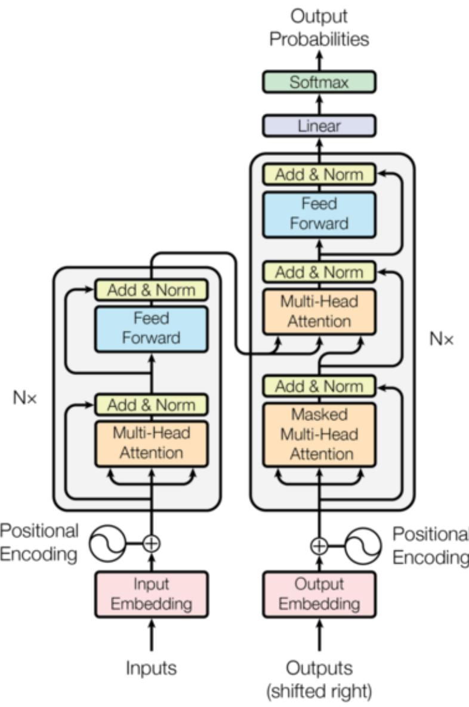
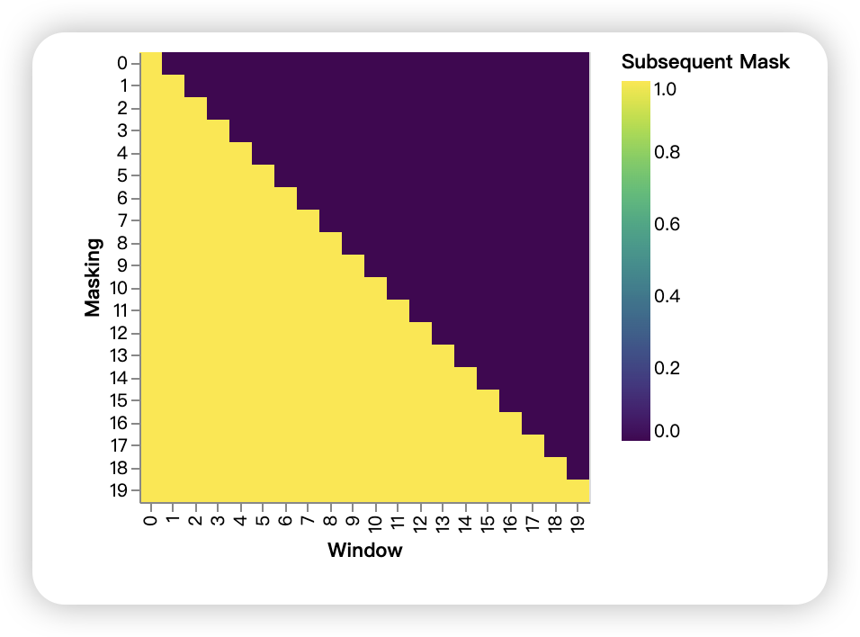
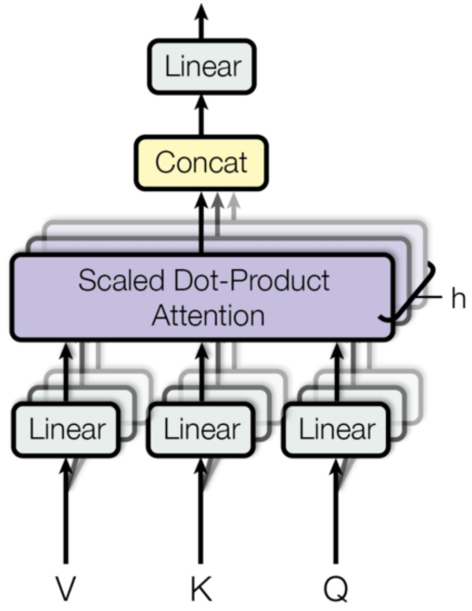

# Transformer

- 2022 版整理：Austin Huang、Suraj Subramanian、Jonathan Sum、Khalid Almubarak 和 Stella Biderman。

- 原始版本：Sasha Rush。

https://nlp.seas.harvard.edu/annotated-transformer/

过去几年里，Transformer 一直是很多人关注的焦点。本文以逐行实现的形式给出这篇论文的注释版。它对原论文的部分内容做了重排和删减，并在全文中加入了说明性注释。本文档本身就是一个可运行的 notebook，也应当是一份完全可用的实现。代码可在此处获取。

## 目录

- 预备知识
- 背景
- 第 1 部分：模型架构
- 模型架构
  - 编码器与解码器堆叠
  - 逐位置前馈网络
  - Embeddings 与 Softmax
  - 位置编码
  - 完整模型
  - 推理：
- 第 2 部分：模型训练
- 训练
  - 批处理与掩码
  - 训练循环
  - 训练数据与批处理
  - 硬件与训练计划
  - 优化器
  - 正则化
- 第一个示例
  - 合成数据
  - 损失计算
  - 贪心解码
- 第 3 部分：真实世界示例
  - 数据加载
  - 迭代器
  - 训练系统
- 附加组件：BPE、搜索、模型平均
- 结果
  - 注意力可视化
  - 编码器自注意力
  - 解码器自注意力
  - 解码器源注意力
- 结论

## 预备知识

```python
# !pip install -r requirements.txt
# # Uncomment for colab
# ## !pip install -q torchdata==0.3.0 torchtext==0.12 spacy==3.2 altair GPUtil
# !python -m spacy download de_core_news_sm
# !python -m spacy download en_core_web_sm

import os
from os.path import exists
import torch
import torch.nn as nn
from torch.nn.functional import log_softmax, pad
import math
import copy
import time
from torch.optim.lr_scheduler import LambdaLR
import pandas as pd
import altair as alt
from torchtext.data.functional import to_map_style_dataset
from torch.utils.data import DataLoader
from torchtext.vocab import build_vocab_from_iterator
import torchtext.datasets as datasets
import spacy
import GPUtil
import warnings
from torch.utils.data.distributed import DistributedSampler
import torch.distributed as dist
import torch.multiprocessing as mp
from torch.nn.parallel import DistributedDataParallel as DDP

# Set to False to skip notebook execution (e.g. for debugging)
warnings.filterwarnings("ignore")
RUN_EXAMPLES = True


# Some convenience helper functions used throughout the notebook
def is_interactive_notebook():
    return __name__ == "__main__"


def show_example(fn, args=[]):
    if __name__ == "__main__" and RUN_EXAMPLES:
        return fn(*args)


def execute_example(fn, args=[]):
    if __name__ == "__main__" and RUN_EXAMPLES:
        fn(*args)


class DummyOptimizer(torch.optim.Optimizer):
    def __init__(self):
        self.param_groups = [{"lr": 0}]
        None

    def step(self):
        None

    def zero_grad(self, set_to_none=False):
        None


class DummyScheduler:
    def step(self):
        None
```

## 背景

减少序列计算的目标同样构成了 Extended Neural GPU、ByteNet 和 ConvS2S 的基础；

这些模型都以卷积神经网络为基本构件，并行计算所有输入和输出位置的隐藏表示。

在这些模型中，将任意两个输入或输出位置的信号联系起来所需的操作数会随着位置距离增长而增加，对 ConvS2S 是线性增长，对 ByteNet 是对数增长。这使得学习远距离依赖更加困难。在 Transformer 中，这一复杂度被降低为常数次操作，尽管代价是由于对注意力加权位置做平均而导致有效分辨率下降；我们通过多头注意力来抵消这种影响。

自注意力（self-attention），有时也称为内部注意力（intra-attention），是一种把同一序列中不同位置关联起来以计算序列表征的注意力机制。

自注意力已经在阅读理解、抽象式摘要、文本蕴含以及学习与任务无关的句子表示等多种任务上取得成功。端到端记忆网络基于循环注意力机制而不是序列对齐的循环结构，并已被证明在简单语言问答和语言建模任务上表现良好。

据我们所知，Transformer 是第一个完全依赖自注意力来计算输入和输出表示、而不使用序列对齐 RNN 或卷积的转导模型。

> 注：这段是在说明 Transformer 提出的动机：用自注意力替代 RNN 和卷积，更高效地建模长距离依赖，并实现更强的并行计算能力。

> 注：像 BERT 这类 `encoder-only` 模型，只需要对输入序列做双向理解，而不需要按顺序逐个生成输出，因此只保留编码器就足够了；相对地，像 GPT 这类生成模型更适合使用 `decoder-only` 结构。

> 注：整体来看，Transformer 的处理链路可以概括为：文本 -> token ids -> token embedding -> 加上位置编码 -> \(H^{(0)}\) -> 第 1 层 attention -> 第 1 层 FFN -> \(H^{(1)}\) -> 第 2 层 attention -> 第 2 层 FFN -> \(H^{(2)}\) -> ... -> 最后一层隐藏状态 -> 线性层 / softmax -> 下一个 token 概率。也就是说，模型先把输入文本变成向量表示，再经过多层注意力和前馈网络逐层提取特征，最后把最终隐藏状态映射成预测分布。

## 第 1 部分：模型架构

### 模型架构 Model Architecture

大多数具有竞争力的神经序列转导模型都采用编码器-解码器（encoder-decoder structure）结构。其中，编码器将输入的符号表示序列 \( (x_1, \ldots, x_n) \) 映射为连续表示序列 \( z = (z_1, \ldots, z_n) \)。在给定 \(z\) 的条件下，解码器随后逐个生成输出符号，形成输出序列 \( (y_1, \ldots, y_m) \)。

在每一个生成步骤中，模型都是自回归（auto-regressive）的：它在生成下一个符号时，会将之前已经生成的符号作为额外输入。

> 注：这里讲的是编码器-解码器结构。编码器先把输入序列 `(x1, ..., xn)` 中的词、字或 token，转换成一组连续的向量表示 `(z1, ..., zn)`；这些向量是模型内部用于表达语义信息的数字表示。然后解码器再根据这组表示，按顺序逐个生成输出序列 `(y1, ..., ym)`。可以简单理解为：输入文本 -> 向量表示 -> 输出文本。
>
> 自回归表示输出是按顺序一个一个生成的；生成当前符号时，模型会依赖前面已经生成的符号。

```python
# 整个 Transformer 的顶层封装：
# 包含编码器、解码器、源端 Embeddings、目标端 Embeddings，以及最终的输出生成器。
class EncoderDecoder(nn.Module):
    """
    A standard Encoder-Decoder architecture. Base for this and many
    other models.
    """

    def __init__(self, encoder, decoder, src_embed, tgt_embed, generator):
        super(EncoderDecoder, self).__init__()
        # 编码器：把输入序列编码成上下文表示
        self.encoder = encoder
        # 解码器：结合编码结果和目标序列，生成输出隐藏状态
        self.decoder = decoder
        # 源语言 Embeddings 层
        self.src_embed = src_embed
        # 目标语言 Embeddings 层
        self.tgt_embed = tgt_embed
        # 输出层：把隐藏状态映射到词表概率
        self.generator = generator

    def forward(self, src, tgt, src_mask, tgt_mask):
        # 前向过程：先编码输入，再解码目标序列
        "Take in and process masked src and target sequences."
        return self.decode(
            self.encode(src, src_mask), src_mask, tgt, tgt_mask
        )

    def encode(self, src, src_mask):
        # 对源序列先做 Embeddings，再送入编码器
        return self.encoder(self.src_embed(src), src_mask)

    def decode(self, memory, src_mask, tgt, tgt_mask):
        # 对目标序列做 Embeddings，并结合编码器输出进行解码
        return self.decoder(self.tgt_embed(tgt), memory, src_mask, tgt_mask)


# 将解码器输出转换成词表上的概率分布。
class Generator(nn.Module):
    "Define standard linear + softmax generation step."

    def __init__(self, d_model, vocab):
        super(Generator, self).__init__()
        # 线性层：把隐藏维度 d_model 投影到词表大小 vocab
        self.proj = nn.Linear(d_model, vocab)

    def forward(self, x):
        # 对投影结果做 log_softmax，得到每个词的对数概率
        return log_softmax(self.proj(x), dim=-1)
```

Transformer 整体遵循这一架构：编码器和解码器都使用堆叠的自注意力层与逐位置的全连接层，

分别如图 1 左半部分和右半部分所示。



### 编码器与解码器堆叠 Encoder and Decoder Stacks

> 注：这一节主要讲了 4 件事。  
> 1. 编码器怎么堆：编码器由 `N=6` 个相同的编码层堆叠而成，每个编码层包含两个子层，分别是多头自注意力 `self-attention` 和逐位置前馈网络 `feed-forward`。  
> 2. 解码器怎么堆：解码器同样由 `N=6` 个相同的解码层堆叠而成，但每层比编码器多一个子层，共包含掩码自注意力、编码器-解码器注意力和逐位置前馈网络。  
> 3. 每个子层外面怎么包：无论是编码器还是解码器，每个子层外部都配有残差连接 `residual connection`、层归一化 `LayerNorm` 和 `dropout`，这些设计用来保证深层堆叠后训练仍然稳定。  
> 4. 解码器为什么不能看未来：解码器的自注意力需要加 `mask`，屏蔽当前位置之后的内容，保证生成第 `i` 个词时只能依赖前面已经生成的词，从而满足自回归生成的要求。

#### 编码器 Encoder

编码器由 $N { = } 6$ 个完全相同的层堆叠而成。

```python
# 总结：这段代码实现了 Transformer 编码器的外层骨架。
# `clones` 用来复制出 N 个相同的编码层，`Encoder` 则按顺序堆叠这些层，
# 最后再做一次层归一化，得到编码器的最终输出。
def clones(module, N):
    # 深拷贝同一个模块 N 次，生成彼此独立的一组层。
    # 这样每一层结构相同，但参数各自学习、互不共享。
    "Produce N identical layers."
    return nn.ModuleList([copy.deepcopy(module) for _ in range(N)])

class Encoder(nn.Module):
    # 编码器主体：由 N 个相同的编码层顺序堆叠而成。
    "Core encoder is a stack of N layers"

    def __init__(self, layer, N):
        super(Encoder, self).__init__()
        # 复制出 N 个编码层，形成编码器的主干。
        self.layers = clones(layer, N)
        # 在所有编码层结束后，再做一次层归一化。
        self.norm = LayerNorm(layer.size)

    def forward(self, x, mask):
        # 输入 x 会依次经过每一个编码层；
        # mask 用来限制注意力可见的位置，比如屏蔽 padding。
        "Pass the input (and mask) through each layer in turn."
        for layer in self.layers:
            x = layer(x, mask)
        # 最后输出经过层归一化的结果，作为编码器最终表示。
        return self.norm(x)
```

#### 残差连接+层归一化

我们在两个子层中的每一个外侧都使用残差连接，随后进行层归一化。

> 注：这一部分主要介绍 Transformer 中“残差连接 + 层归一化”的包装方式。
>
> 1. 之所以使用残差连接，是因为它可以把输入 \(x\) 直接保留下来，再叠加当前子层学到的变化量，即 \(x + \text{Sublayer}(x)\)。这样做有几个好处：第一，信息可以更直接地向后传递，不容易在多层堆叠后被逐步改坏；第二，反向传播时梯度也更容易穿过深层网络，从而缓解训练变深时常见的梯度消失问题；第三，每一层不必从头重新学习完整表示，而只需要在原有表示基础上做“修正”或“补充”，因此优化通常更稳定。
>
> 2. 层归一化 `LayerNorm` 是一种对单个位置的特征向量做标准化的方法。简单说，就是把一个位置上的那一整行 hidden vector 先减去均值、再除以标准差，然后再乘可学习参数、加可学习偏置，所以它做的是让这一层输出的数值分布更稳定。
>
> 3. `LayerNorm` 的主要作用有三个：第一，稳定训练。不同层、不同位置的数值范围可能变化很大，`LayerNorm` 会把它们拉回比较稳定的范围，训练更平稳；第二，改善梯度传播。数值分布稳定后，梯度更不容易爆炸或消失，深层网络更容易训练；第三，加快收敛。因为每层输入输出的尺度更可控，优化器更容易找到合适更新方向。
>
> 4. 在 Transformer 里，你可以把LayerNorm理解成：每经过一个子层，都先或后做一次“数值整理”，避免表示越来越乱。它不是主要负责防过拟合的，那更多是 `dropout` 的作用；`LayerNorm` 更偏向于让网络学得稳。并且它是在每个样本的特征维度上做标准化，而不是依赖 batch 统计量，所以特别适合处理文本这类变长序列任务。

```python
# 总结：这段代码实现了层归一化（Layer Normalization）。
# 它会对每个位置的特征向量单独做标准化，使数值分布更稳定，
# 从而帮助模型训练得更平稳。
class LayerNorm(nn.Module):
    "Construct a layernorm module (See citation for details)."

    def __init__(self, features, eps=1e-6):
        super(LayerNorm, self).__init__()
        # 可学习的缩放参数，初始为 1。
        # 归一化之后，模型可以自己学习每个维度需要放大多少。
        self.a_2 = nn.Parameter(torch.ones(features))
        # 可学习的平移参数，初始为 0。
        # 归一化之后，模型可以自己学习每个维度需要平移多少。
        self.b_2 = nn.Parameter(torch.zeros(features))
        # 为了防止分母为 0 而加入的极小值。
        self.eps = eps

    def forward(self, x):
        # 在最后一个维度上计算均值和标准差。
        # 对 Transformer 来说，最后一个维度通常就是 hidden size。
        mean = x.mean(-1, keepdim=True)
        std = x.std(-1, keepdim=True)
        # 先做标准化，再进行可学习的缩放和平移。
        return self.a_2 * (x - mean) / (std + self.eps) + self.b_2
```

也就是说，每个子层的输出都可以写成 \( \operatorname{LayerNorm}(x + \operatorname{Sublayer}(x)) \)，

其中 \( \operatorname{Sublayer}(x) \) 表示该子层本身实现的函数。

我们会先对每个子层的输出应用 dropout（**一种防止神经网络过拟合的简单方法**），再把它与子层输入相加并做归一化。

为了便于使用这些残差连接，模型中的所有子层以及 Embeddings 层都产生维度为 \( d_{\text{model}} = 512 \) 的输出。

```python
# 总结：这段代码实现了“子层连接”结构。
# 它把层归一化、子层计算、dropout 和残差连接封装在一起，
# 供注意力子层或前馈网络子层重复使用。
class SublayerConnection(nn.Module):
    """
    A residual connection followed by a layer norm.
    Note for code simplicity the norm is first as opposed to last.
    """

    def __init__(self, size, dropout):
        super(SublayerConnection, self).__init__()
        # 层归一化模块：用于稳定特征分布，便于深层网络训练。
        self.norm = LayerNorm(size)
        # dropout：训练时随机丢弃部分特征，降低过拟合风险。
        self.dropout = nn.Dropout(dropout)

    def forward(self, x, sublayer):
        # 这里采用的是“先归一化，再进入子层”的写法。
        # 随后对子层输出做 dropout，并与原输入 x 做残差相加。
        "Apply residual connection to any sublayer with the same size."
        return x + self.dropout(sublayer(self.norm(x)))
```

每一层包含两个子层。第一个是多头自注意力机制，第二个是一个简单的逐位置全连接前馈网络。

```python
# 总结：这段代码实现了单个 Transformer 编码层。
# 一个编码层由两个子层组成：多头自注意力和逐位置前馈网络，
# 每个子层外都通过 SublayerConnection 加上层归一化、dropout 和残差连接。
class EncoderLayer(nn.Module):
    "Encoder is made up of self-attn and feed forward (defined below)"

    def __init__(self, size, self_attn, feed_forward, dropout):
        super(EncoderLayer, self).__init__()
        # 第一个核心子层：多头自注意力机制。
        self.self_attn = self_attn
        # 第二个核心子层：逐位置前馈网络。
        self.feed_forward = feed_forward
        # 为两个子层各自创建一套“归一化 + dropout + 残差连接”封装。
        self.sublayer = clones(SublayerConnection(size, dropout), 2)
        # 保存当前层的特征维度。
        self.size = size

    def forward(self, x, mask):
        # 先经过自注意力子层，再经过前馈网络子层。
        # 注意力层里 Q、K、V 都来自同一个输入 x，所以这是 self-attention。
        # mask 用于限制当前层能看到的位置，例如屏蔽 padding。
        "Follow Figure 1 (left) for connections."
        x = self.sublayer[0](x, lambda x: self.self_attn(x, x, x, mask))
        return self.sublayer[1](x, self.feed_forward)
```

#### 解码器 Decoder

解码器同样由 $N { = } 6$ 个完全相同的层堆叠而成。

```python
# 总结：这段代码实现了解码器的整体骨架。
# 它和编码器一样由 N 层堆叠而成，但每一层会额外接收编码器输出，
# 因此可以一边参考已生成的目标序列，一边参考源序列信息。
class Decoder(nn.Module):
    "Generic N layer decoder with masking."

    def __init__(self, layer, N):
        super(Decoder, self).__init__()
        # 复制出 N 个相同的解码层。
        self.layers = clones(layer, N)
        # 所有解码层结束后，再做一次层归一化。
        self.norm = LayerNorm(layer.size)

    def forward(self, x, memory, src_mask, tgt_mask):
        # x 是目标序列的表示，memory 是编码器输出。
        # src_mask 用于源序列，tgt_mask 用于目标序列的掩码。
        for layer in self.layers:
            x = layer(x, memory, src_mask, tgt_mask)
        # 返回经过层归一化后的最终解码结果。
        return self.norm(x)
```

除了每个编码器层中的两个子层外，解码器还插入了第三个子层，用于对编码器堆栈的输出执行多头注意力。

与编码器类似，我们在每个子层外围使用残差连接，随后进行层归一化。

```python
# 总结：单个解码层由三个子层组成：
# 目标序列自注意力、编码器-解码器注意力、逐位置前馈网络。
# 这样既能看见已经生成的目标信息，也能读取源序列的上下文。
class DecoderLayer(nn.Module):
    "Decoder is made of self-attn, src-attn, and feed forward (defined below)"

    def __init__(self, size, self_attn, src_attn, feed_forward, dropout):
        super(DecoderLayer, self).__init__()
        self.size = size
        # 第一个注意力子层：目标序列内部的自注意力。
        self.self_attn = self_attn
        # 第二个注意力子层：读取编码器输出的源注意力。
        self.src_attn = src_attn
        # 第三个子层：逐位置前馈网络。
        self.feed_forward = feed_forward
        # 三个子层各自配一个残差连接 + 层归一化结构。
        self.sublayer = clones(SublayerConnection(size, dropout), 3)

    def forward(self, x, memory, src_mask, tgt_mask):
        # 按图 1 右半部分依次执行：
        # 1. 目标序列自注意力
        # 2. 对编码器输出做注意力
        # 3. 前馈网络
        "Follow Figure 1 (right) for connections."
        m = memory
        x = self.sublayer[0](x, lambda x: self.self_attn(x, x, x, tgt_mask))
        x = self.sublayer[1](x, lambda x: self.src_attn(x, m, m, src_mask))
        return self.sublayer[2](x, self.feed_forward)
```

我们还会修改解码器堆栈中的自注意力子层，防止当前位置看到后续位置。这个掩码机制再结合“输出 Embeddings 整体右移一位”的做法，可以保证位置 \(i\) 的预测只能依赖于小于 \(i\) 的那些已知输出。

```python
# 总结：这个函数生成“后续位置掩码”。
# 它的作用是屏蔽当前位置之后的 token，避免解码器在训练时偷看未来信息。
def subsequent_mask(size):
    "Mask out subsequent positions."
    attn_shape = (1, size, size)
    subsequent_mask = torch.triu(torch.ones(attn_shape), diagonal=1).type(
        torch.uint8
    )
    return subsequent_mask == 0
```

下面这张注意力掩码图展示了：每个目标词（行）允许看到哪些位置（列）。在训练时，词不能关注未来位置，因此右上角区域会被屏蔽。

```python
# 总结：这个示例把 subsequent mask 可视化出来，
# 便于直观观察解码器在训练时哪些位置可以看见、哪些位置会被屏蔽。
def example_mask():
    # 构造用于绘图的数据表：
    # x 表示当前行，y 表示当前列，对应掩码矩阵中的一个位置。
    LS_data = pd.concat(
        [
            pd.DataFrame(
                {
                    "Subsequent Mask": subsequent_mask(20)[0][x, y].flatten(),
                    "Window": y,
                    "Masking": x,
                }
            )
            for y in range(20)
            for x in range(20)
        ]
    )

    # 用热力图展示掩码矩阵。
    return (
        alt.Chart(LS_data)
        .mark_rect()
        .properties(height=250, width=250)
        .encode(
            alt.X("Window:O"),
            alt.Y("Masking:O"),
            alt.Color("Subsequent Mask:Q", scale=alt.Scale(scheme="viridis")),
        )
        .interactive()
    )
# 显示掩码可视化示例。
show_example(example_mask)
```




### Attention 注意力

注意力函数可以描述为：把一个查询和一组键值对映射为一个输出，其中查询、键、值和输出都是向量。输出由值的加权和计算得到，而每个值的权重则由查询与对应键之间的兼容性函数计算得到。

我们把本文使用的注意力称为“缩放点积注意力”（Scaled Dot-Product Attention）。

输入由维度分别为 \(d_k\) 的查询和键，以及维度为 \(d_v\) 的值组成。我们计算查询与所有键的点积，再除以 \(\sqrt{d_k}\)，并应用 softmax 函数，得到分配给各个值的权重。


在实际实现中，我们会同时对一组查询计算注意力，并将它们打包成矩阵 \(Q\)。键和值也分别打包成矩阵 \(K\) 和 \(V\)。

我们将输出矩阵计算为：
\[
\operatorname{Attention}(Q, K, V)
= \operatorname{softmax}\left(\frac{QK^T}{\sqrt{d_k}}\right)V
\]

> 注：公式中各个符号的含义如下。  
> \(Q\)：查询矩阵（Query），表示“当前要关注什么”。  
> \(K\)：键矩阵（Key），表示“各个位置有什么可匹配的信息”。  
> \(V\)：值矩阵（Value），表示“各个位置真正携带的内容”。  
> \(QK^T\)：用于计算查询与各个键之间的相关性分数。这里的 \(K^T\) 表示对 \(K\) 做转置，也就是把矩阵的行和列交换，以便 \(Q\) 和 \(K\) 进行矩阵乘法；计算结果中的每个元素都表示一个 query 与一个 key 的匹配分数。  
> \(\operatorname{softmax}\)：把相关性分数归一化为注意力权重。  
> \(d_k\)：键向量的维度；除以 \(\sqrt{d_k}\) 是为了防止点积过大，避免 softmax 落入梯度过小的区域。  
> 最后再用这些注意力权重对 \(V\) 做加权求和，得到输出。

输出矩阵的计算方式如下：

```python
# 总结：这段代码实现的是“缩放点积注意力”。
# 它先计算 query 和 key 的相似度分数，再经过掩码、softmax 和 dropout，
# 最后用这些注意力权重对 value 做加权求和，得到注意力输出。
#
# 公式为：
# \[
# \operatorname{Attention}(Q, K, V)
# = \operatorname{softmax}\left(\frac{QK^T}{\sqrt{d_k}}\right)V
# \]
def attention(query, key, value, mask=None, dropout=None):
    "计算缩放点积注意力。"
    # d_k 是键向量的维度，用于做缩放，避免点积过大。
    d_k = query.size(-1)
    # 计算注意力分数：Q 与 K^T 做点积，再除以 sqrt(d_k)。
    scores = torch.matmul(query, key.transpose(-2, -1)) / math.sqrt(d_k)
    if mask is not None:
        # 被 mask 掉的位置会被赋一个极小值，
        # 这样 softmax 后这些位置的权重几乎为 0。
        scores = scores.masked_fill(mask == 0, -1e9)
    # 对最后一个维度做 softmax，得到注意力权重。
    p_attn = scores.softmax(dim=-1)
    if dropout is not None:
        # 对注意力权重应用 dropout，提升训练时的泛化能力。
        p_attn = dropout(p_attn)
    # 用注意力权重对 value 加权求和，同时返回权重本身便于分析或可视化。
    return torch.matmul(p_attn, value), p_attn
```

最常用的两种注意力函数是[加性注意力（additive attention）][bahdanau2014] 和点积 dot-product（乘性）注意力。

点积注意力与我们的算法基本相同，只是少了 \( \frac{1}{\sqrt{d_k}} \) 这个缩放因子。

加性注意力 additive attention 则使用一个带单隐藏层的前馈网络来计算兼容性函数。

虽然两者在理论复杂度上相近，但在实践中点积注意力更快、也更节省空间，因为它可以利用高度优化的矩阵乘法实现。

> 注：加性注意力（Bahdanau et al., 2014）用一个带单隐藏层的前馈网络对 \((q,k)\) 打分，再经 softmax 得到权重；适合低维场景，表达力强于纯点积，但计算比点积注意力略慢。

[bahdanau2014]: https://arxiv.org/abs/1409.0473

当 \(d_k\) 较小时，这两种机制表现相近；

但当 \(d_k\) 较大时，不带缩放的点积注意力表现会变差。

**我们怀疑这是因为当 \(d_k\) 很大时，点积的数值幅度会变大，从而把 softmax 推入梯度极小的区域。**

为说明这一点，可以假设 \(q\) 和 \(k\) 的各分量都是均值为 \(0\)、方差为 \(1\) 的独立随机变量，那么它们的点积 \( q \cdot k = \sum_{i=1}^{d_k} q_i k_i \) 的均值为 \(0\)、方差为 \(d_k\)。

为了抵消这一效应，我们把点积乘上 \( \frac{1}{\sqrt{d_k}} \) 这一缩放因子。



多头注意力使模型能够在不同位置上联合关注来自不同表示子空间的信息。如果只有一个注意力头，平均化操作会抑制这种能力。

多头注意力的定义如下：\( \operatorname{MultiHead}(Q, K, V) = \operatorname{Concat}(\text{head}_1, \ldots, \text{head}_h) W^O \)，

其中 \( \text{head}_i = \operatorname{Attention}(QW_i^Q, KW_i^K, VW_i^V) \)。

其中，这些投影矩阵分别满足 \( W_i^Q \in \mathbb{R}^{d_{\text{model}} \times d_k} \)、\( W_i^K \in \mathbb{R}^{d_{\text{model}} \times d_k} \)、\( W_i^V \in \mathbb{R}^{d_{\text{model}} \times d_v} \)，并且 \( W^O \in \mathbb{R}^{h d_v \times d_{\text{model}}} \)。

在本文中，我们使用 \( h = 8 \) 个并行注意力头。对于每个头，我们取 \( d_k = d_v = \frac{d_{\text{model}}}{h} = 64 \)。
由于每个头的维度降低，总计算成本与使用完整维度的单头注意力大致相同。

> 注：这一段主要说明多头注意力不是只做一次注意力，而是先把同一份输入通过不同的投影矩阵映射到多个低维子空间中，在每个头里独立计算注意力，再把所有头的结果拼接并映射回原始维度。这样模型可以同时从不同角度关注序列中的关系，避免单头注意力把多种关系平均掉；同时由于每个头的维度被降到 \( d_{\text{model}} / h \)，所以头数虽然变多了，整体计算成本仍与单头注意力大致相当。

```python
# 总结：这段代码实现了多头注意力层。
# 它先把输入分别线性投影到多个头上，在每个头中独立计算注意力，
# 再把所有头的结果拼接起来，最后通过一个线性层映射回原始维度。
class MultiHeadedAttention(nn.Module):
    def __init__(self, h, d_model, dropout=0.1):
        "输入模型维度和注意力头数。"
        super(MultiHeadedAttention, self).__init__()
        # d_model 必须能被头数 h 整除，这样每个头才能分到相同维度。
        assert d_model % h == 0
        # 这里默认 d_v 和 d_k 相等。
        self.d_k = d_model // h
        # 注意力头数。
        self.h = h
        # 4 个线性层分别用于：
        # query 投影、key 投影、value 投影，以及最终输出投影。
        self.linears = clones(nn.Linear(d_model, d_model), 4)
        # 保存最近一次前向传播中的注意力权重，便于可视化。
        self.attn = None
        self.dropout = nn.Dropout(p=dropout)

    def forward(self, query, key, value, mask=None):
        "实现论文图 2 中的多头注意力。"
        if mask is not None:
            # 同一个 mask 会应用到所有注意力头上。
            mask = mask.unsqueeze(1)
        nbatches = query.size(0)

        # 1) 先对 query、key、value 做线性投影，
        # 再拆成 h 个头，每个头的维度是 d_k。
        query, key, value = [
            lin(x).view(nbatches, -1, self.h, self.d_k).transpose(1, 2)
            for lin, x in zip(self.linears, (query, key, value))
        ]

        # 2) 在所有头上并行计算缩放点积注意力。
        x, self.attn = attention(
            query, key, value, mask=mask, dropout=self.dropout
        )

        # 3) 把多个头的输出重新拼接起来，再通过最后一个线性层映射回 d_model。
        x = (
            x.transpose(1, 2)
            .contiguous()
            .view(nbatches, -1, self.h * self.d_k)
        )
        del query
        del key
        del value
        return self.linears[-1](x)
```

#### 我们模型中的注意力应用

Transformer 以三种不同方式使用多头注意力：

1. 在“encoder-decoder attention”层中，查询来自前一层解码器，而键和值来自编码器的输出。这使得解码器中的每个位置都可以关注输入序列中的所有位置。这与序列到序列模型中的典型编码器-解码器注意力机制相似。

2. 编码器包含自注意力层。在自注意力层中，键、值和查询都来自同一个地方，也就是编码器前一层的输出。编码器中的每个位置都可以关注编码器前一层中的所有位置。

3. 类似地，解码器中的自注意力层允许解码器里的每个位置关注它之前以及当前位置的所有位置。为了保持自回归属性，我们需要阻止信息向未来位置流动。我们在缩放点积注意力内部通过掩蔽 softmax 输入中对应非法连接的值来实现这一点，也就是把这些位置的分数设为 \(-\infty\)，从而使它们在 softmax 之后的权重趋近于 0。

> 注：这一段主要说明多头注意力在 Transformer 中有三种具体用法。
>
> 1. 编码器-解码器注意力：让解码器在生成输出时能够读取输入序列的信息。
> 2. 编码器自注意力：让输入序列内部各个位置彼此关注，从而建模输入内部的关系。
> 3. 解码器自注意力：让解码器在生成当前词时参考前面已经生成的内容，同时通过掩码机制屏蔽未来位置，保证模型只能按顺序自回归生成。

### 逐位置前馈网络 Position-wise Feed-Forward Networks

除了注意力子层之外，我们的编码器和解码器中的每一层还包含一个全连接前馈网络，它会分别且相同地应用到每个位置上。这个网络由两个线性变换组成，中间夹着一个 ReLU 激活。

前馈网络的形式为 \( \operatorname{FFN}(x) = \max(0, xW_1 + b_1) W_2 + b_2 \)。

虽然这些线性变换在不同位置上是相同的，但不同层之间使用不同的参数。另一种理解方式是把它看作两个核大小为 1 的卷积。输入和输出的维度都是 \( d_{\text{model}} = 512 \)，内部层维度是 \( d_{\text{ff}} = 2048 \)。

> 注：这一段主要介绍 Transformer 中的逐位置前馈网络。
> 1. 它的作用是在注意力机制之后，对序列中每个位置的表示再做一次进一步的非线性变换。
> 2. “分别且相同地应用到每个位置”表示序列中的每个位置都会经过这个网络，但所有位置共享同一套参数。
> 3. 其计算流程可以理解为：第一层线性变换 -> ReLU 激活 -> dropout -> 第二层线性变换，也就是先扩展特征、再经过非线性处理与正则化、最后映射回原维度。其中，加了 ReLU 以后，\( \operatorname{ReLU}(x) = \max(0, x) \) 会把负数截断成 0，正数保留，这样整个网络就不再是简单的线性映射了，模型就能表示更复杂的关系；而 dropout 的作用是在训练时随机屏蔽一部分特征，降低过拟合风险。
> 4. 文中设置输入输出维度为 \( d_{\text{model}} = 512 \)，中间层维度为 \( d_{\text{ff}} = 2048 \)，这样可以增强每个位置表示的表达能力，而不会改变整层输入输出的维度。

```python
# 总结：这段代码实现了逐位置前馈网络。
# 它对序列中每个位置的向量独立地做同一组两层线性变换，
# 中间经过 ReLU 和 dropout，用来进一步变换每个位置的表示。
class PositionwiseFeedForward(nn.Module):
    "Implements FFN equation."

    def __init__(self, d_model, d_ff, dropout=0.1):
        super(PositionwiseFeedForward, self).__init__()
        # 第一层线性变换：把维度从 d_model 扩展到 d_ff。
        self.w_1 = nn.Linear(d_model, d_ff)
        # 第二层线性变换：再把维度从 d_ff 投影回 d_model。
        self.w_2 = nn.Linear(d_ff, d_model)
        # dropout 用于正则化。
        self.dropout = nn.Dropout(dropout)

    def forward(self, x):
        # 计算流程：线性变换 -> ReLU -> dropout -> 线性变换。
        return self.w_2(self.dropout(self.w_1(x).relu()))
```

### Embeddings 与 Softmax

与其他序列转导模型类似，我们使用学习得到的 Embeddings 把输入 token 和输出 token 转换成维度为 \( d_{\text{model}} \) 的向量。我们还使用常规的线性变换和 softmax 函数，把解码器输出转换为对下一个 token 的预测概率。在我们的模型中，两个 Embeddings 层与 softmax 前的线性变换共享同一个权重矩阵，这与（cite）类似。在 Embeddings 层中，我们会把这些权重乘以 \( \sqrt{d_{\text{model}}} \)。

```python
# 总结：这段代码实现了 token 的 Embeddings。
# 它先查表得到离散 token 对应的向量表示，
# 再乘上 sqrt(d_model) 作为缩放。
class Embeddings(nn.Module):
    def __init__(self, d_model, vocab):
        super(Embeddings, self).__init__()
        # 词表查找表：把 token id 映射为 d_model 维向量。
        self.lut = nn.Embedding(vocab, d_model)
        self.d_model = d_model

    def forward(self, x):
        # 返回 Embeddings，并乘以 sqrt(d_model) 做缩放。
        return self.lut(x) * math.sqrt(self.d_model)
```

### 位置编码 Positional Encoding

由于模型中既没有循环结构也没有卷积结构，为了让模型利用序列的顺序信息，我们必须向序列中的 token 注入一些关于相对位置或绝对位置的信息。为此，我们在编码器和解码器堆栈底部的输入 Embeddings 上加上“位置编码”。位置编码与 Embeddings 具有相同的维度 \( d_{\text{model}} \)，因此两者可以直接相加。位置编码有很多选择，既可以是学习得到的，也可以是固定的（cite）。

在这项工作中，我们使用不同频率的正弦和余弦函数：

位置编码的形式为

 \( \operatorname{PE}(pos, 2i) = \sin\left(\frac{pos}{10000^{2i / d_{\text{model}}}}\right) \)，

\( \operatorname{PE}(pos, 2i + 1) = \cos\left(\frac{pos}{10000^{2i / d_{\text{model}}}}\right) \)。

其中，\(pos\) 表示位置，\(i\) 表示维度。也就是说，位置编码的每一维都对应一个正弦波。其波长从 \( 2\pi \) 到 \( 10000 \cdot 2\pi \) 构成几何级数。我们选择这种函数，是因为我们假设它能够让模型更容易学会按相对位置进行注意力分配；

对于任意固定偏移 \(k\)，\(\operatorname{PE}_{pos+k}\) 都可以表示为 \(\operatorname{PE}_{pos}\) 的线性函数。

此外，我们在编码器和解码器堆栈中，对 Embeddings 与位置编码之和都应用了 dropout。对于基础模型，我们使用的比率是 Pdrop=0.1。

```python
# 总结：这段代码实现了固定的正弦位置编码。
# 它预先为每个位置生成一个向量，再在前向传播时加到 Embeddings 上，
# 让模型在没有循环和卷积的情况下也能感知位置信息。
class PositionalEncoding(nn.Module):
    "Implement the PE function."

    def __init__(self, d_model, dropout, max_len=5000):
        super(PositionalEncoding, self).__init__()
        self.dropout = nn.Dropout(p=dropout)

        # 预先计算好所有位置的编码，后续直接取用。
        pe = torch.zeros(max_len, d_model)
        position = torch.arange(0, max_len).unsqueeze(1)
        div_term = torch.exp(
            torch.arange(0, d_model, 2) * -(math.log(10000.0) / d_model)
        )
        pe[:, 0::2] = torch.sin(position * div_term)
        pe[:, 1::2] = torch.cos(position * div_term)
        pe = pe.unsqueeze(0)
        self.register_buffer("pe", pe)

    def forward(self, x):
        # 把对应长度的位置编码加到输入上，再做 dropout。
        x = x + self.pe[:, : x.size(1)].requires_grad_(False)
        return self.dropout(x)
```

下面这个位置编码会根据位置加入一条正弦波。对于每个维度，这条波的频率和偏移量都不同。

```python
# 总结：这个示例把不同维度上的位置编码画出来，
# 便于观察正弦位置编码随位置变化的规律。
def example_positional():
    pe = PositionalEncoding(20, 0)
    y = pe.forward(torch.zeros(1, 100, 20))

    data = pd.concat(
        [
            pd.DataFrame(
                {
                    "embedding": y[0, :, dim],
                    "dimension": dim,
                    "position": list(range(100)),
                }
            )
            for dim in [4, 5, 6, 7]
        ]
    )

    return (
        alt.Chart(data)
        .mark_line()
        .properties(width=800)
        .encode(
            x="position",
            y="embedding",
            color="dimension:N",
        )
        .interactive()
    )


show_example(example_positional)
```

我们也尝试过使用学习得到的位置 Embeddings（cite），结果发现两种版本产生的结果几乎完全一样。我们之所以选择正弦版本，是因为它可能让模型外推到比训练时见过更长的序列长度。

### 完整模型

这里我们定义一个由超参数构造完整模型的函数。

```python
# 总结：这个函数把前面定义过的各个模块组装成完整的 Transformer。
# 它根据给定的超参数创建编码器、解码器、Embeddings、位置编码和输出层，
# 最后再对参数做初始化。
def make_model(
    src_vocab,
    tgt_vocab,
    N=6,
    d_model=512,
    d_ff=2048,
    h=8,
    dropout=0.1,
):
    "Helper: Construct a model from hyperparameters."
    c = copy.deepcopy
    # 构造多头注意力、前馈网络和位置编码模块。
    attn = MultiHeadedAttention(h, d_model)
    ff = PositionwiseFeedForward(d_model, d_ff, dropout)
    position = PositionalEncoding(d_model, dropout)

    # 组装完整的编码器-解码器模型。
    model = EncoderDecoder(
        Encoder(EncoderLayer(d_model, c(attn), c(ff), dropout), N),
        Decoder(DecoderLayer(d_model, c(attn), c(attn), c(ff), dropout), N),
        nn.Sequential(Embeddings(d_model, src_vocab), c(position)),
        nn.Sequential(Embeddings(d_model, tgt_vocab), c(position)),
        Generator(d_model, tgt_vocab),
    )

    # 用 Xavier 均匀分布初始化参数。
    for p in model.parameters():
        if p.dim() > 1:
            nn.init.xavier_uniform_(p)
    return model
```

### 推理：

这里我们做一次前向推理来生成模型预测。我们尝试让 Transformer 记住输入。正如你将看到的，由于模型尚未训练，输出是随机生成的。在下一篇教程中，我们会构建训练函数，并尝试把模型训练到能够记住从 1 到 10 的数字。

```python
# 总结：这段代码演示了模型在“未训练状态”下如何做自回归解码。
# 由于参数还是随机初始化的，输出也会是随机的；
# 它的主要作用是验证前向流程和解码流程是否能顺利跑通。
def inference_test():
    test_model = make_model(11, 11, 2)
    test_model.eval()
    src = torch.LongTensor([[1, 2, 3, 4, 5, 6, 7, 8, 9, 10]])
    src_mask = torch.ones(1, 1, 10)

    # 先对输入序列做编码。
    memory = test_model.encode(src, src_mask)
    # 从长度为 1 的初始输出开始，逐步向后生成。
    ys = torch.zeros(1, 1).type_as(src)

    for i in range(9):
        out = test_model.decode(
            memory,
            src_mask,
            ys,
            subsequent_mask(ys.size(1)).type_as(src.data),
        )
        # 取当前最后一个位置的输出分布。
        prob = test_model.generator(out[:, -1])
        _, next_word = torch.max(prob, dim=1)
        next_word = next_word.data[0]
        # 把预测出的下一个 token 拼到当前序列后面。
        ys = torch.cat(
            [ys, torch.empty(1, 1).type_as(src.data).fill_(next_word)], dim=1
        )

    print("Example Untrained Model Prediction:", ys)


def run_tests():
    for _ in range(10):
        inference_test()


show_example(run_tests)
```

```text
Example Untrained Model Prediction: tensor([[0, 0, 0, 0, 0, 0, 0, 0, 0, 0]])
Example Untrained Model Prediction: tensor([[0, 3, 4, 4, 4, 4, 4, 4, 4, 4]])
Example Untrained Model Prediction: tensor([[ 0, 10, 10, 10, 3, 2, 5, 7, 9, 6]])
Example Untrained Model Prediction: tensor([[ 0, 4, 3, 6, 10, 10, 2, 6, 2, 2]])
Example Untrained Model Prediction: tensor([[ 0, 9, 0, 1, 5, 10, 1, 5, 10, 6]])
Example Untrained Model Prediction: tensor([[ 0, 1, 5, 1, 10, 1, 10, 10, 10, 10]])
Example Untrained Model Prediction: tensor([[ 0, 1, 10, 9, 9, 9, 9, 9, 1, 5]])
Example Untrained Model Prediction: tensor([[ 0, 3, 1, 5, 10, 10, 10, 10, 10, 10]])
Example Untrained Model Prediction: tensor([[ 0, 3, 5, 10, 5, 10, 4, 2, 4, 2]])
Example Untrained Model Prediction: tensor([[0, 5, 6, 2, 5, 6, 2, 6, 2, 2]])
```

## 第 2 部分：模型训练

### 训练

本节介绍我们模型的训练方案。

我们先做一个简短的过渡，介绍训练标准编码器-解码器模型所需的一些工具。首先定义一个 batch 对象，用来保存训练时的源句和目标句，并构造相应的掩码。

#### 批处理与掩码

```python
# 总结：这个类把一个 batch 中训练需要用到的数据都整理好，
# 包括源序列、目标序列、padding mask，以及解码器所需的后续位置 mask。
class Batch:
    """Object for holding a batch of data with mask during training."""

    def __init__(self, src, tgt=None, pad=2):  # 2 = <blank>
        self.src = src
        # 源序列 mask：屏蔽 padding 位置。
        self.src_mask = (src != pad).unsqueeze(-2)
        if tgt is not None:
            # 解码器输入去掉最后一个 token。
            self.tgt = tgt[:, :-1]
            # 监督目标去掉第一个 token。
            self.tgt_y = tgt[:, 1:]
            # 目标序列 mask：同时屏蔽 padding 和未来位置。
            self.tgt_mask = self.make_std_mask(self.tgt, pad)
            # 统计非 padding 的目标 token 数量。
            self.ntokens = (self.tgt_y != pad).data.sum()

    @staticmethod
    def make_std_mask(tgt, pad):
        "Create a mask to hide padding and future words."
        tgt_mask = (tgt != pad).unsqueeze(-2)
        tgt_mask = tgt_mask & subsequent_mask(tgt.size(-1)).type_as(
            tgt_mask.data
        )
        return tgt_mask
```

接下来我们创建一个通用的训练与评估函数来跟踪损失。我们传入一个通用的损失计算函数，它同时负责参数更新。

#### 训练循环

```python
# 总结：`TrainState` 负责记录训练进度，
# `run_epoch` 则负责跑完整个 epoch，并统一处理前向、反向、优化器更新和日志输出。
class TrainState:
    """Track number of steps, examples, and tokens processed"""

    step: int = 0
    accum_step: int = 0
    samples: int = 0
    tokens: int = 0


def run_epoch(
    data_iter,
    model,
    loss_compute,
    optimizer,
    scheduler,
    mode="train",
    accum_iter=1,
    train_state=TrainState(),
):
    """Train a single epoch"""
    start = time.time()
    total_tokens = 0
    total_loss = 0
    tokens = 0
    n_accum = 0

    for i, batch in enumerate(data_iter):
        # 前向计算。
        out = model.forward(
            batch.src, batch.tgt, batch.src_mask, batch.tgt_mask
        )
        loss, loss_node = loss_compute(out, batch.tgt_y, batch.ntokens)

        if mode == "train" or mode == "train+log":
            # 反向传播。
            loss_node.backward()
            train_state.step += 1
            train_state.samples += batch.src.shape[0]
            train_state.tokens += batch.ntokens

            # 梯度累积：每 accum_iter 步再真正更新一次参数。
            if i % accum_iter == 0:
                optimizer.step()
                optimizer.zero_grad(set_to_none=True)
                n_accum += 1
                train_state.accum_step += 1

            scheduler.step()

        total_loss += loss
        total_tokens += batch.ntokens
        tokens += batch.ntokens

        if i % 40 == 1 and (mode == "train" or mode == "train+log"):
            lr = optimizer.param_groups[0]["lr"]
            elapsed = time.time() - start
            print(
                (
                    "Epoch Step: %6d | Accumulation Step: %3d | Loss: %6.2f "
                    + "| Tokens / Sec: %7.1f | Learning Rate: %6.1e"
                )
                % (i, n_accum, loss / batch.ntokens, tokens / elapsed, lr)
            )
            start = time.time()
            tokens = 0

        del loss
        del loss_node

    return total_loss / total_tokens, train_state
```

#### 训练数据与批处理

我们在标准的 WMT 2014 英德数据集上进行训练，该数据集包含约 450 万个句子对。句子使用 byte-pair encoding 进行编码，源语言和目标语言共享一个大约 37000 个 token 的词表。对于英法任务，我们使用规模大得多的 WMT 2014 英法数据集，其中包含 3600 万个句子，并把 token 切分为 32000 个 word-piece 词表。

句子对按照近似序列长度进行分批。每个训练 batch 大约包含 25000 个源 token 和 25000 个目标 token。

#### 硬件与训练计划

我们在一台配有 8 张 NVIDIA P100 GPU 的机器上训练模型。对于论文中描述超参数下的基础模型，每一步训练大约需要 0.4 秒。基础模型总共训练 100000 步，也就是 12 小时。对于大模型，每步耗时约 1.0 秒，总共训练 300000 步（3.5 天）。

#### 优化器

我们使用 Adam 优化器（cite），其中 \( \beta_1 = 0.9, \quad \beta_2 = 0.98, \quad \epsilon = 10^{-9} \)。
训练过程中，我们按照如下公式调整学习率：

学习率公式为 \( \text{lrate} = d_{\text{model}}^{-0.5} \cdot \min\left( \text{step\_num}^{-0.5}, \text{step\_num} \cdot \text{warmup\_steps}^{-1.5} \right) \)。

这意味着在前 \( \text{warmup\_steps} \) 个训练步内，学习率线性增大，此后则按步数平方根的倒数衰减。我们使用 \( \text{warmup\_steps} = 4000 \)。

注意：这一部分非常重要。训练时需要采用这样的模型设置。

下面给出该模型在不同模型规模和优化超参数下的学习率曲线示例。

```python
# 总结：`rate` 实现论文中的学习率调度公式，
# `example_learning_schedule` 则把不同超参数下的学习率变化画出来。
def rate(step, model_size, factor, warmup):
    """
    We have to default the step to 1 for LambdaLR function
    to avoid zero raising to negative power.
    """
    if step == 0:
        step = 1
    return factor * (
        model_size ** (-0.5)
        * min(step ** (-0.5), step * warmup ** (-1.5))
    )


def example_learning_schedule():
    opts = [
        [512, 1, 4000],  # example 1
        [512, 1, 8000],  # example 2
        [256, 1, 4000],  # example 3
    ]

    dummy_model = torch.nn.Linear(1, 1)
    learning_rates = []

    for example in opts:
        optimizer = torch.optim.Adam(
            dummy_model.parameters(),
            lr=1,
            betas=(0.9, 0.98),
            eps=1e-9,
        )
        lr_scheduler = LambdaLR(
            optimizer=optimizer,
            lr_lambda=lambda step: rate(step, *example),
        )
        tmp = []
        for step in range(20000):
            tmp.append(optimizer.param_groups[0]["lr"])
            optimizer.step()
            lr_scheduler.step()
        learning_rates.append(tmp)

    learning_rates = torch.tensor(learning_rates)

    alt.data_transformers.disable_max_rows()

    opts_data = pd.concat(
        [
            pd.DataFrame(
                {
                    "Learning Rate": learning_rates[warmup_idx, :],
                    "model_size:warmup": ["512:4000", "512:8000", "256:4000"][
                        warmup_idx
                    ],
                    "step": range(20000),
                }
            )
            for warmup_idx in [0, 1, 2]
        ]
    )

    return (
        alt.Chart(opts_data)
        .mark_line()
        .properties(width=600)
        .encode(
            x="step",
            y="Learning Rate",
            color="model_size:warmup:N",
        )
        .interactive()
    )


show_example(example_learning_schedule)
```

#### 正则化

训练期间，我们采用数值为
\[
\epsilon_{ls} = 0.1
\]
的标签平滑（cite）。这会损害困惑度，因为模型会学得更加不确定，但它能提升准确率和 BLEU 分数。

我们使用 KL 散度损失来实现标签平滑。不同于 one-hot 目标分布，我们构造了一个分布：正确单词保留主要置信度，其余的平滑质量分散到整个词表上。

```python
# 总结：这段代码实现了标签平滑。
# 它不再把正确答案当成完全确定的 one-hot 分布，
# 而是给其他类别也分配一点概率质量，从而降低模型过度自信的风险。
class LabelSmoothing(nn.Module):
    "Implement label smoothing."

    def __init__(self, size, padding_idx, smoothing=0.0):
        super(LabelSmoothing, self).__init__()
        self.criterion = nn.KLDivLoss(reduction="sum")
        self.padding_idx = padding_idx
        self.confidence = 1.0 - smoothing
        self.smoothing = smoothing
        self.size = size
        self.true_dist = None

    def forward(self, x, target):
        assert x.size(1) == self.size
        true_dist = x.data.clone()
        true_dist.fill_(self.smoothing / (self.size - 2))
        true_dist.scatter_(1, target.data.unsqueeze(1), self.confidence)
        true_dist[:, self.padding_idx] = 0
        mask = torch.nonzero(target.data == self.padding_idx)
        if mask.dim() > 0:
            true_dist.index_fill_(0, mask.squeeze(), 0.0)
        self.true_dist = true_dist
        return self.criterion(x, true_dist.clone().detach())
```

这里可以看到一个示例，展示了概率质量如何根据置信度分配到各个词上。

```python
# 总结：这个示例把标签平滑后的目标分布可视化出来，
# 展示概率质量是如何从 one-hot 分布扩散到其他词上的。
def example_label_smoothing():
    crit = LabelSmoothing(5, 0, 0.4)
    predict = torch.FloatTensor(
        [
            [0, 0.2, 0.7, 0.1, 0],
            [0, 0.2, 0.7, 0.1, 0],
            [0, 0.2, 0.7, 0.1, 0],
            [0, 0.2, 0.7, 0.1, 0],
            [0, 0.2, 0.7, 0.1, 0],
        ]
    )
    crit(x=predict.log(), target=torch.LongTensor([2, 1, 0, 3, 3]))
    LS_data = pd.concat(
        [
            pd.DataFrame(
                {
                    "target distribution": crit.true_dist[x, y].flatten(),
                    "columns": y,
                    "rows": x,
                }
            )
            for y in range(5)
            for x in range(5)
        ]
    )

    return (
        alt.Chart(LS_data)
        .mark_rect(color="Blue", opacity=1)
        .properties(height=200, width=200)
        .encode(
            alt.X("columns:O", title=None),
            alt.Y("rows:O", title=None),
            alt.Color(
                "target distribution:Q",
                scale=alt.Scale(scheme="viridis"),
            ),
        )
        .interactive()
    )


show_example(example_label_smoothing)
```

如果模型对某个选择变得过于自信，标签平滑实际上会开始对它进行惩罚。

```python
# 总结：这段代码展示标签平滑如何惩罚“过度自信”的预测。
# 当某个类别的概率被推得越来越高时，损失不会像普通 one-hot 一样持续鼓励它无限增大。
def loss(x, crit):
    d = x + 3 * 1
    predict = torch.FloatTensor([[0, x / d, 1 / d, 1 / d, 1 / d]])
    return crit(predict.log(), torch.LongTensor([1])).data


def penalization_visualization():
    crit = LabelSmoothing(5, 0, 0.1)
    loss_data = pd.DataFrame(
        {
            "Loss": [loss(x, crit) for x in range(1, 100)],
            "Steps": list(range(99)),
        }
    ).astype("float")

    return (
        alt.Chart(loss_data)
        .mark_line()
        .properties(width=350)
        .encode(
            x="Steps",
            y="Loss",
        )
        .interactive()
    )


show_example(penalization_visualization)
```

### 第一个示例

我们先从一个简单的复制任务开始。给定一组来自小词表的随机输入符号，目标是把这些符号原样生成回来。

#### 合成数据

```python
# 总结：这个函数生成一个简单的复制任务数据集。
# 输入和目标完全相同，用来验证模型是否具备学习基本序列映射的能力。
def data_gen(V, batch_size, nbatches):
    "Generate random data for a src-tgt copy task."
    for i in range(nbatches):
        data = torch.randint(1, V, size=(batch_size, 10))
        data[:, 0] = 1
        src = data.requires_grad_(False).clone().detach()
        tgt = data.requires_grad_(False).clone().detach()
        yield Batch(src, tgt, 0)
```

#### 损失计算

```python
# 总结：这个类把“输出投影 + 损失计算”封装到一起，
# 让训练循环可以统一调用，不必关心具体损失函数细节。
class SimpleLossCompute:
    "A simple loss compute and train function."

    def __init__(self, generator, criterion):
        self.generator = generator
        self.criterion = criterion

    def __call__(self, x, y, norm):
        x = self.generator(x)
        sloss = (
            self.criterion(
                x.contiguous().view(-1, x.size(-1)),
                y.contiguous().view(-1),
            )
            / norm
        )
        return sloss.data * norm, sloss
```

#### 贪心解码

为了简化说明，这段代码使用贪心解码来预测翻译结果。

```python
# 总结：贪心解码每一步都只选当前概率最大的词，
# 是最简单的推理方式，便于演示模型在训练后是否已经学会复制任务。
def greedy_decode(model, src, src_mask, max_len, start_symbol):
    memory = model.encode(src, src_mask)
    ys = torch.zeros(1, 1).fill_(start_symbol).type_as(src.data)
    for i in range(max_len - 1):
        out = model.decode(
            memory,
            src_mask,
            ys,
            subsequent_mask(ys.size(1)).type_as(src.data),
        )
        prob = model.generator(out[:, -1])
        _, next_word = torch.max(prob, dim=1)
        next_word = next_word.data[0]
        ys = torch.cat(
            [ys, torch.zeros(1, 1).type_as(src.data).fill_(next_word)],
            dim=1,
        )
    return ys


V = 11
criterion = LabelSmoothing(size=V, padding_idx=0, smoothing=0.0)
model = make_model(V, V, N=2)

optimizer = torch.optim.Adam(
    model.parameters(),
    lr=0.5,
    betas=(0.9, 0.98),
    eps=1e-9,
)
lr_scheduler = LambdaLR(
    optimizer=optimizer,
    lr_lambda=lambda step: rate(
        step,
        model_size=model.src_embed[0].d_model,
        factor=1.0,
        warmup=400,
    ),
)

batch_size = 80
for epoch in range(20):
    model.train()
    run_epoch(
        data_gen(V, batch_size, 20),
        model,
        SimpleLossCompute(model.generator, criterion),
        optimizer,
        lr_scheduler,
        mode="train",
    )
    model.eval()
    run_epoch(
        data_gen(V, batch_size, 5),
        model,
        SimpleLossCompute(model.generator, criterion),
        DummyOptimizer(),
        DummyScheduler(),
        mode="eval",
    )[0]

model.eval()
src = torch.LongTensor([[0, 1, 2, 3, 4, 5, 6, 7, 8, 9]])
max_len = src.shape[1]
src_mask = torch.ones(1, 1, max_len)
print(greedy_decode(model, src, src_mask, max_len=max_len, start_symbol=0))
```

## 第 3 部分：真实世界示例

现在我们来看一个真实世界示例：使用 Multi30k 德英翻译任务。这个任务比论文中使用的 WMT 任务小得多，但足以展示整套系统。我们也会展示如何使用多 GPU 处理来显著加速。

### 数据加载 Data Loading 

我们将使用 torchtext 加载数据集，并用 spacy 进行分词。

```python
# 总结：这部分代码负责加载分词器、构建词表，并把词表缓存到本地。
# 这样后续训练时就不需要每次都重新扫描整个数据集。
def load_tokenizers():
    try:
        spacy_de = spacy.load("de_core_news_sm")
    except IOError:
        os.system("python -m spacy download de_core_news_sm")
        spacy_de = spacy.load("de_core_news_sm")

    try:
        spacy_en = spacy.load("en_core_web_sm")
    except IOError:
        os.system("python -m spacy download en_core_web_sm")
        spacy_en = spacy.load("en_core_web_sm")

    return spacy_de, spacy_en


def tokenize(text, tokenizer):
    return [tok.text for tok in tokenizer.tokenizer(text)]


def yield_tokens(data_iter, tokenizer, index):
    for from_to_tuple in data_iter:
        yield tokenizer(from_to_tuple[index])


def build_vocabulary(spacy_de, spacy_en):
    def tokenize_de(text):
        return tokenize(text, spacy_de)

    def tokenize_en(text):
        return tokenize(text, spacy_en)

    print("Building German Vocabulary ...")
    train, val, test = datasets.Multi30k(language_pair=("de", "en"))
    vocab_src = build_vocab_from_iterator(
        yield_tokens(train + val + test, tokenize_de, index=0),
        min_freq=2,
        specials=["<s>", "</s>", "<blank>", "<unk>"],
    )

    print("Building English Vocabulary ...")
    train, val, test = datasets.Multi30k(language_pair=("de", "en"))
    vocab_tgt = build_vocab_from_iterator(
        yield_tokens(train + val + test, tokenize_en, index=1),
        min_freq=2,
        specials=["<s>", "</s>", "<blank>", "<unk>"],
    )

    vocab_src.set_default_index(vocab_src["<unk>"])
    vocab_tgt.set_default_index(vocab_tgt["<unk>"])

    return vocab_src, vocab_tgt


def load_vocab(spacy_de, spacy_en):
    if not exists("vocab.pt"):
        vocab_src, vocab_tgt = build_vocabulary(spacy_de, spacy_en)
        torch.save((vocab_src, vocab_tgt), "vocab.pt")
    else:
        vocab_src, vocab_tgt = torch.load("vocab.pt")
    print("Finished.\nVocabulary sizes:")
    print(len(vocab_src))
    print(len(vocab_tgt))
    return vocab_src, vocab_tgt


if is_interactive_notebook():
    spacy_de, spacy_en = show_example(load_tokenizers)
    vocab_src, vocab_tgt = show_example(load_vocab, args=[spacy_de, spacy_en])
```

```text
Finished.
Vocabulary sizes:
59981
36745
```

批处理对速度影响极大。我们希望 batch 划分尽可能均匀，同时把 padding 降到最低。为此，我们需要稍微绕开 torchtext 默认的 batching 行为。下面这段代码会修补其默认批处理逻辑，以确保我们能在足够多的句子中搜索，从而找到更紧凑的 batch。

### 迭代器

```python
# 总结：这一组函数负责把文本样本转成张量，并组装成 DataLoader。
# 它们会补齐句子长度、加入起止符号，并适配单卡或分布式训练。
def collate_batch(
    batch,
    src_pipeline,
    tgt_pipeline,
    src_vocab,
    tgt_vocab,
    device,
    max_padding=128,
    pad_id=2,
):
    bs_id = torch.tensor([0], device=device)  # <s> token id
    eos_id = torch.tensor([1], device=device)  # </s> token id
    src_list, tgt_list = [], []
    for (_src, _tgt) in batch:
        processed_src = torch.cat(
            [
                bs_id,
                torch.tensor(
                    src_vocab(src_pipeline(_src)),
                    dtype=torch.int64,
                    device=device,
                ),
                eos_id,
            ],
            0,
        )
        processed_tgt = torch.cat(
            [
                bs_id,
                torch.tensor(
                    tgt_vocab(tgt_pipeline(_tgt)),
                    dtype=torch.int64,
                    device=device,
                ),
                eos_id,
            ],
            0,
        )
        src_list.append(
            pad(
                processed_src,
                (0, max_padding - len(processed_src)),
                value=pad_id,
            )
        )
        tgt_list.append(
            pad(
                processed_tgt,
                (0, max_padding - len(processed_tgt)),
                value=pad_id,
            )
        )

    src = torch.stack(src_list)
    tgt = torch.stack(tgt_list)
    return (src, tgt)


def create_dataloaders(
    device,
    vocab_src,
    vocab_tgt,
    spacy_de,
    spacy_en,
    batch_size=12000,
    max_padding=128,
    is_distributed=True,
):
    def tokenize_de(text):
        return tokenize(text, spacy_de)

    def tokenize_en(text):
        return tokenize(text, spacy_en)

    def collate_fn(batch):
        return collate_batch(
            batch,
            tokenize_de,
            tokenize_en,
            vocab_src,
            vocab_tgt,
            device,
            max_padding=max_padding,
            pad_id=vocab_src.get_stoi()["<blank>"],
        )

    train_iter, valid_iter, test_iter = datasets.Multi30k(
        language_pair=("de", "en")
    )

    train_iter_map = to_map_style_dataset(train_iter)
    train_sampler = (
        DistributedSampler(train_iter_map) if is_distributed else None
    )
    valid_iter_map = to_map_style_dataset(valid_iter)
    valid_sampler = (
        DistributedSampler(valid_iter_map) if is_distributed else None
    )

    train_dataloader = DataLoader(
        train_iter_map,
        batch_size=batch_size,
        shuffle=(train_sampler is None),
        sampler=train_sampler,
        collate_fn=collate_fn,
    )
    valid_dataloader = DataLoader(
        valid_iter_map,
        batch_size=batch_size,
        shuffle=(valid_sampler is None),
        sampler=valid_sampler,
        collate_fn=collate_fn,
    )
    return train_dataloader, valid_dataloader
```

### 训练系统

```python
# 总结：这一组函数实现了真实数据集上的完整训练流程，
# 包括单卡 / 多卡训练、checkpoint 保存，以及训练后模型加载。
def train_worker(
    gpu,
    ngpus_per_node,
    vocab_src,
    vocab_tgt,
    spacy_de,
    spacy_en,
    config,
    is_distributed=False,
):
    print(f"Train worker process using GPU: {gpu} for training", flush=True)
    torch.cuda.set_device(gpu)

    pad_idx = vocab_tgt["<blank>"]
    d_model = 512
    model = make_model(len(vocab_src), len(vocab_tgt), N=6)
    model.cuda(gpu)
    module = model
    is_main_process = True

    if is_distributed:
        dist.init_process_group(
            "nccl",
            init_method="env://",
            rank=gpu,
            world_size=ngpus_per_node,
        )
        model = DDP(model, device_ids=[gpu])
        module = model.module
        is_main_process = gpu == 0

    criterion = LabelSmoothing(
        size=len(vocab_tgt), padding_idx=pad_idx, smoothing=0.1
    )
    criterion.cuda(gpu)

    train_dataloader, valid_dataloader = create_dataloaders(
        gpu,
        vocab_src,
        vocab_tgt,
        spacy_de,
        spacy_en,
        batch_size=config["batch_size"] // ngpus_per_node,
        max_padding=config["max_padding"],
        is_distributed=is_distributed,
    )

    optimizer = torch.optim.Adam(
        model.parameters(),
        lr=config["base_lr"],
        betas=(0.9, 0.98),
        eps=1e-9,
    )
    lr_scheduler = LambdaLR(
        optimizer=optimizer,
        lr_lambda=lambda step: rate(
            step, d_model, factor=1, warmup=config["warmup"]
        ),
    )
    train_state = TrainState()

    for epoch in range(config["num_epochs"]):
        if is_distributed:
            train_dataloader.sampler.set_epoch(epoch)
            valid_dataloader.sampler.set_epoch(epoch)

        model.train()
        print(f"[GPU{gpu}] Epoch {epoch} Training ====", flush=True)
        _, train_state = run_epoch(
            (Batch(b[0], b[1], pad_idx) for b in train_dataloader),
            model,
            SimpleLossCompute(module.generator, criterion),
            optimizer,
            lr_scheduler,
            mode="train+log",
            accum_iter=config["accum_iter"],
            train_state=train_state,
        )

        GPUtil.showUtilization()
        if is_main_process:
            file_path = "%s%.2d.pt" % (config["file_prefix"], epoch)
            torch.save(module.state_dict(), file_path)
        torch.cuda.empty_cache()

        print(f"[GPU{gpu}] Epoch {epoch} Validation ====", flush=True)
        model.eval()
        sloss = run_epoch(
            (Batch(b[0], b[1], pad_idx) for b in valid_dataloader),
            model,
            SimpleLossCompute(module.generator, criterion),
            DummyOptimizer(),
            DummyScheduler(),
            mode="eval",
        )
        print(sloss)
        torch.cuda.empty_cache()

    if is_main_process:
        file_path = "%sfinal.pt" % config["file_prefix"]
        torch.save(module.state_dict(), file_path)


def train_distributed_model(vocab_src, vocab_tgt, spacy_de, spacy_en, config):
    ngpus = torch.cuda.device_count()
    os.environ["MASTER_ADDR"] = "localhost"
    os.environ["MASTER_PORT"] = "12356"
    print(f"Number of GPUs detected: {ngpus}")
    print("Spawning training processes ...")
    mp.spawn(
        train_worker,
        nprocs=ngpus,
        args=(ngpus, vocab_src, vocab_tgt, spacy_de, spacy_en, config, True),
    )


def train_model(vocab_src, vocab_tgt, spacy_de, spacy_en, config):
    if config["distributed"]:
        train_distributed_model(
            vocab_src, vocab_tgt, spacy_de, spacy_en, config
        )
    else:
        train_worker(
            0, 1, vocab_src, vocab_tgt, spacy_de, spacy_en, config, False
        )


def load_trained_model():
    config = {
        "batch_size": 32,
        "distributed": False,
        "num_epochs": 8,
        "accum_iter": 10,
        "base_lr": 1.0,
        "max_padding": 72,
        "warmup": 3000,
        "file_prefix": "multi30k_model_",
    }
    model_path = "multi30k_model_final.pt"
    if not exists(model_path):
        train_model(vocab_src, vocab_tgt, spacy_de, spacy_en, config)

    model = make_model(len(vocab_src), len(vocab_tgt), N=6)
    model.load_state_dict(torch.load("multi30k_model_final.pt"))
    return model


if is_interactive_notebook():
    model = load_trained_model()
```

训练完成后，我们就可以对模型进行解码，生成一组翻译结果。这里我们只是翻译验证集中的第一句话。这个数据集比较小，因此使用贪心搜索得到的翻译已经相当准确。

## 附加组件：BPE、搜索、模型平均

到这里，Transformer 模型本身的主要内容基本都已经覆盖了。不过还有四个方面我们没有展开介绍，而这些附加特性在 OpenNMT-py 中也都已经实现。

1. BPE / Word-piece：我们可以先使用一个库把数据预处理成子词单元。可参考 Rico Sennrich 的 subword-nmt 实现。经过处理后，训练数据大致会变成下面这样：

▁Die ▁Protokoll datei ▁kann ▁ heimlich ▁per ▁E - Mail ▁oder ▁FTP ▁an ▁einen ▁bestimmte n ▁Empfänger ▁gesendet ▁werden .

2. 共享 Embeddings：当使用共享词表的 BPE 时，我们可以在源端 / 目标端 / 生成器之间共享相同的权重向量。细节可参见（cite）。要把这一点加入模型，只需这样做：

```python
if False:
    model.src_embed[0].lut.weight = model.tgt_embed[0].lut.weight
    model.generator.proj.weight = model.tgt_embed[0].lut.weight
```

3. 束搜索Beam Search：这一部分稍微有些复杂，这里不展开。可以查看 OpenNMT-py 中的 PyTorch 实现。

4. 模型平均：论文会对最后 k 个 checkpoint 做平均，以产生一种集成效果。如果我们手头有一组模型，也可以在训练后这样做：

```python
def average(model, models):
    "Average models into model"
    for ps in zip(*[m.parameters() for m in [model] + models]):
        ps[0].copy_(torch.stack([p for p in ps[1:]], dim=0).mean(dim=0))
```

## 结果

在 WMT 2014 英译德任务上，大型 Transformer 模型（表 2 中的 Transformer (big)）比此前报告的最佳模型（包括集成模型）高出 2.0 以上的 BLEU，建立了新的最优 BLEU 分数 28.4。该模型的配置列在表 3 的最后一行。训练在 8 张 P100 GPU 上进行了 3.5 天。即便是基础模型，也以远低于竞争模型训练成本的代价，超过了此前所有已发表模型及其集成。

在 WMT 2014 英译法任务上，我们的大模型取得了 41.0 的 BLEU 分数，优于此前所有已发表的单模型，同时训练成本不到先前最优模型的 \(1/4\)。用于英译法的大型 Transformer 模型使用的 dropout 比率是
\[
P_{\text{drop}} = 0.1
\]
而不是 0.3。

表 2：Transformer 在英译德和英译法 `newstest2014` 测试集上，以更低的训练成本取得了优于此前最优模型的 BLEU 分数。

| 模型 | EN-DE BLEU | EN-FR BLEU | EN-DE 训练成本（FLOPs） | EN-FR 训练成本（FLOPs） |
| --- | --- | --- | --- | --- |
| ByteNet [18] | 23.75 |  |  |  |
| Deep-Att + PosUnk [39] |  | 39.2 |  | 1.0 × 10^20 |
| GNMT + RL [38] | 24.6 | 39.92 | 2.3 × 10^19 | 1.4 × 10^20 |
| ConvS2S [9] | 25.16 | 40.46 | 9.6 × 10^18 | 1.5 × 10^20 |
| MoE [32] | 26.03 | 40.56 | 2.0 × 10^19 | 1.2 × 10^20 |
| Deep-Att + PosUnk Ensemble [39] |  | 40.4 |  | 8.0 × 10^20 |
| GNMT + RL Ensemble [38] | 26.30 | 41.16 | 1.8 × 10^20 | 1.1 × 10^21 |
| ConvS2S Ensemble [9] | 26.36 | 41.29 | 7.7 × 10^19 | 1.2 × 10^21 |
| Transformer（基础模型） | 27.3 | 38.1 | 3.3 × 10^18 | 3.3 × 10^18 |
| Transformer（大模型） | 28.4 | 41.8 | 2.3 × 10^19 | 2.3 × 10^19 |

结合上一节中的附加扩展后，OpenNMT-py 的复现实现在 EN-DE WMT 上达到了 26.9。这里我已经把这些参数加载到了我们的复现实现中。

```python
# 总结：这段代码会从验证集里取样，打印源句、参考答案和模型输出，
# 便于快速检查训练后的翻译效果。
def check_outputs(
    valid_dataloader,
    model,
    vocab_src,
    vocab_tgt,
    n_examples=5,
    pad_idx=2,
    eos_string="</s>",
):
    results = [()] * n_examples
    for idx in range(n_examples):
        print("\nExample %d ========\n" % idx)
        b = next(iter(valid_dataloader))
        rb = Batch(b[0], b[1], pad_idx)
        greedy_decode(model, rb.src, rb.src_mask, 64, 0)[0]

        src_tokens = [
            vocab_src.get_itos()[x] for x in rb.src[0] if x != pad_idx
        ]
        tgt_tokens = [
            vocab_tgt.get_itos()[x] for x in rb.tgt[0] if x != pad_idx
        ]

        print(
            "Source Text (Input)        : "
            + " ".join(src_tokens).replace("\n", "")
        )
        print(
            "Target Text (Ground Truth) : "
            + " ".join(tgt_tokens).replace("\n", "")
        )
        model_out = greedy_decode(model, rb.src, rb.src_mask, 72, 0)[0]
        model_txt = (
            " ".join(
                [vocab_tgt.get_itos()[x] for x in model_out if x != pad_idx]
            ).split(eos_string, 1)[0]
            + eos_string
        )
        print("Model Output               : " + model_txt.replace("\n", ""))
        results[idx] = (rb, src_tokens, tgt_tokens, model_out, model_txt)
    return results


def run_model_example(n_examples=5):
    global vocab_src, vocab_tgt, spacy_de, spacy_en

    print("Preparing Data ...")
    _, valid_dataloader = create_dataloaders(
        torch.device("cpu"),
        vocab_src,
        vocab_tgt,
        spacy_de,
        spacy_en,
        batch_size=1,
        is_distributed=False,
    )

    print("Loading Trained Model ...")

    model = make_model(len(vocab_src), len(vocab_tgt), N=6)
    model.load_state_dict(
        torch.load(
            "multi30k_model_final.pt",
            map_location=torch.device("cpu"),
        )
    )

    print("Checking Model Outputs:")
    example_data = check_outputs(
        valid_dataloader, model, vocab_src, vocab_tgt, n_examples=n_examples
    )
    return model, example_data
```

### 注意力可视化

即便使用贪心解码，翻译结果看起来也已经相当不错。我们还可以进一步把它可视化，看看每一层注意力里究竟发生了什么。

```python
# 总结：这一组函数负责把注意力矩阵转成可视化图表，
# 方便观察不同层、不同头在翻译时关注了哪些位置。
def mtx2df(m, max_row, max_col, row_tokens, col_tokens):
    "Convert a dense matrix to a data frame with row and column indices."
    return pd.DataFrame(
        [
            (
                r,
                c,
                float(m[r, c]),
                "%.3d %s"
                % (r, row_tokens[r] if len(row_tokens) > r else "<blank>"),
                "%.3d %s"
                % (c, col_tokens[c] if len(col_tokens) > c else "<blank>"),
            )
            for r in range(m.shape[0])
            for c in range(m.shape[1])
            if r < max_row and c < max_col
        ],
        columns=["row", "column", "value", "row_token", "col_token"],
    )


def attn_map(attn, layer, head, row_tokens, col_tokens, max_dim=30):
    df = mtx2df(
        attn[0, head].data,
        max_dim,
        max_dim,
        row_tokens,
        col_tokens,
    )
    return (
        alt.Chart(data=df)
        .mark_rect()
        .encode(
            x=alt.X("col_token", axis=alt.Axis(title="")),
            y=alt.Y("row_token", axis=alt.Axis(title="")),
            color="value",
            tooltip=["row", "column", "value", "row_token", "col_token"],
        )
        .properties(height=400, width=400)
        .interactive()
    )


def get_encoder(model, layer):
    return model.encoder.layers[layer].self_attn.attn


def get_decoder_self(model, layer):
    return model.decoder.layers[layer].self_attn.attn


def get_decoder_src(model, layer):
    return model.decoder.layers[layer].src_attn.attn


def visualize_layer(model, layer, getter_fn, ntokens, row_tokens, col_tokens):
    attn = getter_fn(model, layer)
    n_heads = attn.shape[1]
    charts = [
        attn_map(
            attn,
            0,
            h,
            row_tokens=row_tokens,
            col_tokens=col_tokens,
            max_dim=ntokens,
        )
        for h in range(n_heads)
    ]
    assert n_heads == 8
    return alt.vconcat(
        charts[0] | charts[1],
        charts[2] | charts[3],
        charts[4] | charts[5],
        charts[6] | charts[7],
    ).properties(title="Layer %d" % (layer + 1))
```

### 编码器自注意力

```python
def viz_encoder_self():
    model, example_data = run_model_example(n_examples=1)
    example = example_data[len(example_data) - 1]
    layer_viz = [
        visualize_layer(
            model, layer, get_encoder, len(example[1]), example[1], example[1]
        )
        for layer in range(6)
    ]
    return alt.hconcat(layer_viz[0], layer_viz[2], layer_viz[4])


show_example(viz_encoder_self)
```

```text
Preparing Data ...
Loading Trained Model ...
Checking Model Outputs:

Example 0 ========

Source Text (Input)        : <s> Zwei Frauen in pinkfarbenen T-Shirts und <unk> unterhalten sich vor einem <unk> . </s>
Target Text (Ground Truth) : <s> Two women wearing pink T - shirts and blue jeans converse outside clothing store . </s>
Model Output               : <s> Two women in pink shirts and face are talking in front of a <unk> . </s>
```

### 解码器自注意力

```python
def viz_decoder_self():
    model, example_data = run_model_example(n_examples=1)
    example = example_data[len(example_data) - 1]

    layer_viz = [
        visualize_layer(
            model,
            layer,
            get_decoder_self,
            len(example[1]),
            example[1],
            example[1],
        )
        for layer in range(6)
    ]
    return alt.hconcat(*layer_viz)


show_example(viz_decoder_self)
```

```text
Preparing Data ...
Loading Trained Model ...
Checking Model Outputs:

Example 0 ========
Source Text (Input)        : <s> Eine Gruppe von Männern in Kostümen spielt Musik . </s>
Target Text (Ground Truth) : <s> A group of men in costume play music . </s>
Model Output               : <s> A group of men in costumes playing music . </s>
```

### 解码器源注意力 Decoder Src Attention

```python
def viz_decoder_src():
    model, example_data = run_model_example(n_examples=1)
    example = example_data[len(example_data) - 1]

    layer_viz = [
        visualize_layer(
            model,
            layer,
            get_decoder_src,
            max(len(example[1]), len(example[2])),
            example[1],
            example[2],
        )
        for layer in range(6)
    ]
    return alt.hconcat(*layer_viz)


show_example(viz_decoder_src)
```

```text
Preparing Data ...
Loading Trained Model ...
Checking Model Outputs:

Example 0 ========
Source Text (Input)        : <s> Ein kleiner Junge verwendet einen Bohrer , um ein Loch in ein Holzstück zu machen . </s>
Target Text (Ground Truth) : <s> A little boy using a drill to make a hole in a piece of wood . </s>
Model Output               : <s> A little boy uses a machine to be working in a hole in a log . </s>
```

## 结论

希望这份代码能对未来的研究有所帮助。如果你遇到任何问题，欢迎联系。

此致，Sasha Rush、Austin Huang、Suraj Subramanian、Jonathan Sum、Khalid Almubarak 和 Stella Biderman
