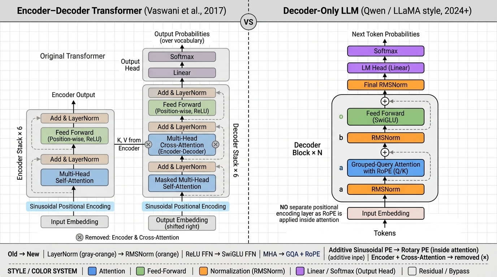

# Transformer 前向流程笔记（以 "it eats apple" 为例）

```text
📖阅读地图：阶段1~5 = 前向传播主干（训练/推理都要走；阶段4起分❄️/🔥两种用法，本质仍是同一次前向）
    🔥训练路线 = 阶段1~5 -> 阶段6（算完Loss拐去反向传播，参数不断更新）
    ❄️推理路线 = 阶段1~5 -> 阶段7（采样出新词拐去自回归循环，参数全程冻结）
    ↓
原始文本："it eats apple"
    ↓
【阶段1】Tokenizer -> Embedding + 位置编码 -> X(D × N)
        💡Tokenizer干了什么："it eats apple" -> 切成token（不同模型可能使用BPE、Unigram等方法）-> 查词表得token id
            （下面的token切分和id仅作示意；实际tokenizer可能把空格并入token，未必正好得到3个token；
            为便于后续矩阵推导，以下假设示例恰好切成3个token）
            -> 每个id去查Embedding表【50000行×128列】取出对应行，拼成矩阵
            （Embedding表本身就是一份可学习参数，训练中和其他权重一起更新）
        输出 X：【128行 × 3列】
        ✔ 3列：it、eats、apple；每一列是128维完整token向量
        💡位置编码公式（正弦版）：X = Embedding(token) + PE
            PE(pos, 2i) = sin( pos / 10000^(2i/D) )；PE(pos, 2i+1) = cos( pos / 10000^(2i/D) )
            用不同频率的sin/cos给每个位置提供可区分的位置特征，帮助注意力分辨词序
            💡为什么是sin/cos：①值域[-1,1]有界，位置再远数值也不膨胀；
            ②平滑连续：相邻位置通常相似；不同频率提供多尺度位置信号，但欧氏距离并不严格代表位置距离；
            ③高频维度像"秒针"、低频像"时针"，多频率组合让不同位置形成可区分的编码图案；
            ④在每个sin/cos二维子空间中，PE(pos+k)=R(k)·PE(pos)，相对位置可线性表示；
            ⑤固定公式不引入位置参数，可以计算更长位置，但不保证超出训练长度后仍能可靠外推
    ↓
【阶段2】循环L层 Transformer Decoder层（拿其中1层举例，经典Transformer Decoder的Post‑Norm版本；
        这里用Decoder-only因果语言模型做简化示意，不代表所有GPT或现代LLM的具体实现；
        原论文Decoder在注意力与MLP间还有读Encoder输出的交叉注意力，语言模型用不到，此处略）
输入进来：X = 【128 × 3】
        ├─①掩码多头自注意力
        │   把128维拆成2个头，每个头维度=64
        │   Head‑1：Q₁,K₁,V₁ = 【64 × 3】
        │   Head‑2：Q₂,K₂,V₂ = 【64 × 3】
        │   每个头内部计算：
        │       Qᵀ·K -> 【3 × 3】 ⬅ N×N注意力分数矩阵（行=query位置，列=key位置）
        │       （本笔记token按列放，故写Qᵀ·K；教材token按行放写作Q·Kᵀ；二者可等价，但Softmax轴和输出乘法要同步转置）
        │       掩码 + 按行Softmax（先掩后归一化：严格上三角填-∞，Softmax后变0）屏蔽未来位置
        │       V·Aᵀ -> 每个头输出【64 × 3】（A是按行Softmax后的注意力权重矩阵）
        │   💡注意力完整公式（列向量版）：A = Softmax_rows( Qᵀ·K/√d_k + 掩码(-∞) )；Attention(Q,K,V) = V · Aᵀ
        │       √d_k（此处=√64=8）：除以头维度开根号以减小分数方差，避免Softmax过早饱和
        │   垂直拼接两个头输出：[Head1;Head2] -> 【128 × 3】，再做融合线性变换W_o
        │   ✅多头注意力输出结果依旧：【128 × 3】行列不变
        │   💡注意力功能：跨token交互，每一列(token)加权聚合自己允许看到的列(token)信息；因果掩码下it只能看自己，
        │       eats能看it和自己，apple能看前面全部token。
        │   💡多头怎么拆：不是把128维切成两半！每个头有自己独立的W_Q/W_K/W_V【128×64】，
        │       各自从完整的128维投影出64维子空间（观察角度不同，一头盯语法、一头盯语义）
        │       -> 各算各的注意力 -> 拼接 -> W_o全维度融合（实现上=一个大矩阵投影后reshape切开）
        │   💡掩码什么时候用&怎么用：卡在Qᵀ·K之后、Softmax之前，把N×N注意力分数矩阵的严格上三角（未来位置）填-∞，
        │       Softmax后exp(-∞)=0，未来token权重精确为0，每个token只能看自己+前面的词
        │          it    eats  apple
        │       掩码后的分数矩阵（还未Softmax）：
        │       it   [ 0.4   -∞    -∞  ]  <- Softmax后权重为[1, 0, 0]
        │       eats [ 0.5   0.4   -∞  ]  <- Softmax后只能给前2个位置分配权重
        │       apple[ 0.4   0.3  0.3 ]  <- Softmax后能给全部3个位置分配权重
        │       为什么要掩：Decoder逐词生成，算it时apple还不存在；训练时整句一次喂入，it旁边真摆着apple，
        │       不挡=作弊学习，推理时没有未来词可看，效果立刻崩。推理也始终遵守因果约束，但不等于每步都要
        │       显式构造三角掩码：prefill或无KV Cache的整段重算需要屏蔽未来位置；用KV Cache单token解码时，
        │       K/V里只有过去和当前位置，没有未来key，因此显式因果掩码通常可以省略（或退化为全有效的1×1掩码）
        │       （Encoder如BERT不使用因果注意力掩码，可以双向看上下文；这不等于没有MLM的输入遮盖或预训练预测头）
        ├─②残差 + LayerNorm
        │   X₁ = LayerNorm( 输入X【128×3】 + 注意力输出【128×3】 )
        │   ✔残差：保留原始输入；残差加法本身包含恒等梯度通路，对优化有帮助，但Post‑Norm子层后面还有LayerNorm，
        │       不能简单理解为梯度始终等于1或必然不消失；模块只学习需要修改的增量。
        │   💡残差公式：通用形式 y = x + F(x)，F是本子层（注意力/MLP），
        │       F学的不是完整输出，而是"要在x上改多少"的增量；
        │       本层具体化：X₁ = LN( X + Attn(X) )，即【128×3】+【128×3】逐元素相加（残差要求形状不变的原因）
        │       对未经过LayerNorm的y，反传可写成∂y/∂x = 1 + ∂F/∂x；本层完整输出是LayerNorm(y)，
        │       因此完整梯度还要乘LayerNorm的导数，残差只能改善优化条件，不能保证梯度不消失
        │   ✔LayerNorm：对相加之后矩阵的每一列(token向量)独立归一化，稳定数值分布，防止数值爆炸/漂移。
        │   💡LayerNorm公式（每列独立算）：μ=该列128维均值；σ²=该列方差；
        │       yᵢ = γᵢ·(xᵢ-μ)/√(σ²+ε) + βᵢ （ε防除零；γ、β是可学习参数，控制"归多少"）
        │       按列算而非按batch算：每个token的特征独立标准化，不依赖batch统计，因此训练和推理的batch大小、序列长度变化不会引入batch统计差异
        │   输出依旧：【128 × 3】
        ├─③MLP前馈（逐token，每一列完全独立运算，列之间没有任何通信）
        │   对每一列（it / eats / apple）单独执行：MLP(x)=W₂·ReLU(W₁x+b₁)+b₂
        │       1. W₁x+b₁：升维，128维 -> 512维(4D)，拓展特征空间
        │       2. ReLU：逐元素非线性激活；如果MLP内部去掉它，W₂(W₁x)可以合并成一次线性变换
        │       3. W₂h+b₂：降维，512维 -> 回到128维
        │       （这里以经典Transformer的ReLU为例；GPT-2常见GELU，现代LLM也常见GELU/SwiGLU等变体）
        │   💡MLP功能：单token内部特征加工。
        │       注意力已经在因果约束内做完列间通信（例如apple的向量可混入it、eats的信息，而it不能读取未来token），
        │       MLP紧随其后：同一套W₁/W₂对每列各算各的，公式里只有本列128个数字，
        │       it/eats/apple各自独立"消化"融合后的语义，互相看不见对方。
        │       分工：注意力=列间"说话"交换信息；MLP=每列回房"消化"加工信息。
        │   MLP不改变列数N=3，只是变换每一列内部数字
        │   输出：【128 × 3】
        └─④残差 + LayerNorm
            X_out = LayerNorm(X₁【128×3】 + MLP输出【128×3】)
            ✔残差：同上，保护梯度，MLP只学增量改动
            ✔LayerNorm：再次归一化，规整本层输出，传给下一层Transformer
            ⭐本层输出：仍然【128 × 3】
    ↓
    ⭐每一层Transformer，输入输出永远保持：【128行 × 3列】
    💡"循环L层"= 把上面这一整块（①②③④）堆叠L份首尾相接：上一层输出原封不动就是下一层输入，
        之所以能直接串，靠的就是这条⭐形状不变规则（中间不需要任何转换）；
        注意：不是同一层算L遍--L层结构相同但权重各自独立；也不是RNN那种循环，是堆叠（stack）；
        每多叠一层=多一轮"列间抄信息+列内消化"，语义融合更深（GPT-2有12层，GPT-3有96层）
    只是矩阵里面的数值不断更新：
    多头注意力负责列与列之间交换信息；MLP负责每一列内部消化加工信息；经过多层堆叠，每一列向量融合越来越丰富的上下文语义。
    ↓
【阶段3】全部L层Transformer层完成，输出上下文矩阵 H(D × N)
        H = 【128行 × 3列】
        列1：it经过全部层后的128维上下文向量 h_it
        列2：eats经过全部层后的128维上下文向量 h_eats
        列3：apple经过全部层后的128维上下文向量 h_apple
    ↓
【阶段4】LM‑Head语言模型头（D->词表V，⭐这里才碰完整词表）
        （V因模型而异：GPT-2约5万、LLaMA-2约3.2万、LLaMA-3/Qwen约12.8万~15万，下文按5万举例）
        💡作用：语义空间->词表空间的翻译官。W_lm每列=一个词的128维"画像"，
            hᵀ·W_lm=和5万个画像逐一打分，分数高=像下一个词；本质=普通线性层，选词判决在阶段5
            （W_lm常与Embedding表共享参数；BERT没有因果LM‑Head，但其预训练包含MLM预测头，下游使用时常直接取编码表示）
        ├─❄️推理分支：只拿序列最后一个token向量预测下一个词
        │   取其中一列，例如最后一列 h_apple：向量【128 × 1】
        │   W_lm 权重矩阵：【128行 × 50000列】
        │   完整公式（行向量输出）：logits = h_appleᵀ · W_lm + b_lmᵀ（b可省略；选词在阶段5 Softmax完成）
        │   形状推演：【1×128】·【128×50000】= 【1 × 50000】
        │   输出logits向量：【1 × 50000】，5万列对应词表里每一个词的分数
        └─🔥训练分支：全部3列 h_it、h_eats、h_apple全部送入LM‑Head，
            形状推演：Hᵀ·W_lm = 【3×128】·【128×50000】->【3 × 50000】，3行=3个位置各自的词表分数
            同时做多位置预测，全部位置一起计算交叉熵总Loss。
            目标需要与输入错位一位：当前3列对应标签是【eats, apple, 下一个token】，最后一个标签来自训练窗口的
            第4个token或EOS；若还要学习预测it，可在输入前加入BOS，此时输入与目标都增加为4个位置。
    ↓
【阶段5】Softmax -> 训练算损失 / 推理采样出新token id
        ❄️推理：Softmax(logits) ->【1 × 50000】概率分布，得到词表上每个词的预测概率
        🔥训练：Softmax(logits) ->【3 × 50000】，3行=3个位置各自一份概率分布
        💡Softmax公式：pᵢ = exp(zᵢ)/Σⱼexp(zⱼ)，把5万个分数变成和为1的概率分布（每行独立算一次）
        💡训练交叉熵Loss：概念上单个位置 L = -log p(该位置的正确词)；实际实现通常直接接收logits，
            用log-softmax和负对数似然合并计算以提高数值稳定性；总Loss = 有效位置的L加总取平均
    ↓ 🔥训练拐向阶段6 ══ ❄️推理拐向阶段7（两条路不会同时走）
【阶段6】🔥训练闭环（Loss之后才刚开始）
        ├─流程：Loss -> 反向传播（梯度沿流程反着传回每个权重，残差加法中的恒等梯度项在这里帮助优化）
        │        -> 优化器（如Adam）按梯度更新全部参数
        │        -> 换下一批语料，重复【阶段1~5】 -> 循环直到收敛
        └─更新范围：Embedding表、L层的W_Q/K/V/W_o/W₁/W₂、W_lm...全部参数
        ✔训练=参数不断更新；推理=参数全部冻结，只前向、不算Loss不反传
══════════ 🔥训练路线到阶段6结束；❄️推理路线进入阶段7 ══════════
【阶段7】❄️推理自回归流程
        采样得到1个新token id（例如"banana"）
        把新token拼接到原序列末尾，现在token数量 N=4
        朴素实现会回到最开头重新跑全部流程，新输入矩阵变成【128 × 4】
        循环，不断自回归生成文本
        ├─💡采样策略：贪心=永远拿概率最高的词（稳定但单调容易复读）；
        │      温度T：logits先除以T再Softmax，T<1更保守、T>1更放飞；
        │      top-k：只在概率前k的词里采，砍掉长尾的胡言乱语
        └─💡KV Cache：真实推理通常先对prompt做一次prefill（整段并行计算，仍需因果掩码）；
               之后旧token在各层的K/V缓存下来直接复用，每步只算新进来那1个token的Q/K/V，
               并让它的Q与缓存中的全部K做注意力；此时没有未来key，显式三角掩码可省略或是无效操作，
               但语义上仍是因果注意力。KV缓存会随上下文长度占用更多显存
```

## 【MiniMind 代码阅读地图】

上面保留经典 Transformer 的阶段1~7主线；下面不改这条主线，只沿着 MiniMind 的实际调用链，说明每个经典环节在现代 decoder-only LLM 中如何落地：

```text
输入文本/对话
  -> tokenizer / chat_template
  -> input_ids [B,T]
  -> MiniMindModel：Embedding -> L 个 Block -> 最后 RMSNorm
  -> MiniMindForCausalLM：lm_head -> logits
  -> 训练：labels / loss / 反向传播
  -> 推理：最后位置 logits / 采样 / KV Cache 自回归
```

阅读时可以把后半部分分成三层：

1. **模型内部**：阶段1~4，说明经典公式如何变成 MiniMind 的张量和模块。
2. **目标与优化**：阶段5、训练数据和阶段6，说明 labels、loss 和参数更新如何决定“模型学什么”。
3. **应用入口**：阶段7，说明聊天 prompt、生成循环、采样和缓存如何组成可运行 Demo。

## 【阶段1】的代码实现流程（对照 MiniMind 源码：minimind-master/model/model_minimind.py）

先统一本阶段的张量写法：经典推导把 token 向量按列写成 `D × N`；PyTorch 代码把 batch 和序列维放在前面，写成 `[B,T,D]`。
`B` 是 batch size，`T` 是 token 数量，`D` 是 hidden size；两种写法表达的是同一组 token 向量，只是维度顺序不同。

以默认参数走一遍：`vocab_size=6400`、`hidden_size=768`、`max_position_embeddings=32768`，输入"猫吃鱼"切成3个 token。
因此 `B=1`、`T=3`、`D=768`：token id 的形状是 `[1,3]`，查 Embedding 后变成 `[1,3,768]`。
（先记住一个总览：经典笔记的阶段1包含“查 Embedding 表 + 加正弦 PE”；MiniMind 先查表并经过 dropout（默认 dropout=0），不把正弦 PE 加到残差流，而是在每层注意力中对 Q/K 施加 RoPE。）

### ① 分词：文本 -> token id（模型外的独立组件）

```python
# tokenizer 文件：model/tokenizer.json（由 trainer/train_tokenizer.py 从语料统计生成）
#   vocab:  6400 个 token 字符串 -> id 的字典（这就是 Embedding 表 6400 行的行号约定）
#   merges: BPE 合并规则；ByteLevel 预分词允许生僻文本回退到字节级表示
#   新增/预留 token 占用 id 0~35，其中包含对话控制符、工具/思考标记和 buffer token
# tokenizer_config.json：附带 chat_template（多轮对话怎么拼成模型输入的 Jinja2 模板）

tokenizer = AutoTokenizer.from_pretrained('model')
input_ids = tokenizer("猫吃鱼", return_tensors="pt", add_special_tokens=False).input_ids
# MiniMind 自带 tokenizer 的一个实际结果：tensor([[3583, 4177, 3505]])，形状 [batch=1, seq_len=3]
```

💡 与笔记的差异：笔记里的"50000 行"是示意；当前自带 tokenizer 的词表大小为 6400，必须与模型的 `vocab_size` 配置严格相等，
  因为 token id 就是 Embedding 表的行号，两边共享同一套编号。
💡 Transformer 架构与具体切词算法解耦，原论文实验也在模型外使用子词方案；分词器是训练前确定的独立组件，
  BPE 合并高频相邻符号，WordPiece 使用类似下面的分数选择合并：

$$
\operatorname{score}(A,B)
= \frac{\operatorname{freq}(AB)}
{\operatorname{freq}(A)\operatorname{freq}(B)}
$$

Unigram 则从较大候选词表出发，按语言模型似然损失逐步裁剪；它们最终都产出同一接口：id 序列。

### ② 查 Embedding 表：id -> 向量（与笔记一致）

```python
# 建表：model_minimind.py:201
self.embed_tokens = nn.Embedding(config.vocab_size, config.hidden_size)   # 6400行 × 768列，可学习参数

# 查表：model_minimind.py:214（MiniMindModel.forward 内）
hidden_states = self.dropout(self.embed_tokens(input_ids))
# input_ids [batch, 3] -> 输出 [batch, 3, 768]，每个 token 一个 768 维向量
```

💡 "查表"的数学本质就是纯索引：`weight[input_ids]` = `weight[3583]` 取对应行，没有任何矩阵乘法；
  PyTorch 底层走 `F.embedding(ids, weight)`。
💡 反向传播时，梯度只写回本批次查过的行；训练久了，各行会形成 token 的初始语义表示。
  Embedding 是模型参数的一部分，但模型的关系知识和上下文能力还分布在后续 Attention、MLP 等权重中。
💡 与笔记的两处小差异：

  (a) 代码 token 按行放（[batch, 3, 768]），笔记按列放（128×3），只是排版约定；
  (b) 查完表还经过 `dropout(:214)`；当前默认 `dropout=0.0`，所以默认配置下这一步实际不丢弃元素。

### ③ 位置编码：笔记的"加 PE"在代码里变成了 RoPE 旋转（最大差异点）

```python
# ③-1 预计算 sin/cos 表：model_minimind.py:62-78（对应笔记 PE 公式的频率部分）
freqs = 1.0 / (rope_base ** (arange(0, dim, 2)/dim))   # 与正弦 PE 结构相似；默认 rope_base=1e6，dim 用 head_dim
t = arange(end)                                          # 位置 0,1,2,...,max_position_embeddings-1
freqs = outer(t, freqs)                                  # 得 pos * freq，作为每个位置的旋转角度
freqs_cos = cat([cos(freqs), cos(freqs)])                # 两张表：【max_seq_len × head_dim】
freqs_sin = cat([sin(freqs), sin(freqs)])

# ③-2 在每层 Attention 内对 Q/K 旋转（model_minimind.py:119）
xq, xk = apply_rotary_pos_emb(xq, xk, cos, sin)   # q*cos + rotate_half(q)*sin，即二维旋转 (x,y)->(x cosθ-y sinθ, x sinθ+y cosθ)
```

💡 为什么表的宽度是 head_dim(96)，而不是 hidden_size(768)：注意力分数是在每个头内部计算的。
  代码先把 Q 从 `[B,T,768]` 拆成 `[B,T,8,96]`，每个位置、每个头实际参与点积的是一个96维的 `q` 和一个96维的 `k`；
  因此 RoPE 也只需要旋转这96维。96维会组成48个二维子空间，每个二维子空间使用一种频率，8个Q头和4个KV头共用同一套位置角度，
  但旋转的是各个头自己的 Q/K 数值。RoPE 表描述的是“每个头内部如何按位置旋转”，不是整条768维残差流的位置向量。

💡 为什么经典位置编码使用“加法”，RoPE却使用“旋转”：这里不是把 $x_m=e_m+\operatorname{PE}(m)$ 做代数变形得到旋转，
  而是换了一种注入位置信息的位置和方式。

**经典正弦位置编码**：先把位置向量 $\operatorname{PE}(m)$ 加到第m个 token 的 Embedding，再计算 Q/K/V；
因此位置信息直接进入残差流。

对位置 $m$ 和第 $i$ 组正弦/余弦维度，位置编码定义为：

$$
\begin{aligned}
\operatorname{PE}(m,2i)
&=\sin\left(\frac{m}{10000^{2i/D}}\right), \\
\operatorname{PE}(m,2i+1)
&=\cos\left(\frac{m}{10000^{2i/D}}\right)
\end{aligned}
$$

第 $m$ 个 token 进入第一层 Transformer 前的表示是：

$$
x_m=e_m+\operatorname{PE}(m)
$$

**RoPE**：先由 token 表示投影出 Q/K，再把位置m对应的旋转施加到每个头的 $q_m$，
把位置n对应的旋转施加到 $k_n$：

$$
q'_m=R_mq_m,\qquad k'_n=R_nk_n
$$

注意力比较位置m和位置n时，真正计算的是旋转后的点积：

$$
\begin{aligned}
(q'_m)^{\mathsf T}k'_n
&=(R_mq_m)^{\mathsf T}(R_nk_n) \\
&=q_m^{\mathsf T}R_m^{\mathsf T}R_nk_n \\
&=q_m^{\mathsf T}R_{n-m}k_n
\end{aligned}
$$

因为旋转矩阵满足 $R_m^{\mathsf T}R_n=R_{n-m}$，最终分数中的位置部分只与相对距离 $n-m$ 有关。
例如 query 在位置5、key在位置2时，相对旋转是 $R_{2-5}=R_{-3}$；如果两者同时右移10格变成位置15和12，
相对旋转仍是 $R_{12-15}=R_{-3}$，所以注意力仍能识别“key在query左边3格”这一关系。

RoPE只旋转Q/K，是因为Q和K负责计算“当前位置应该关注哪个位置”，相对位置信息需要进入的正是这个匹配分数；
V是匹配完成后被加权汇总的内容，不参与 $QK^{\mathsf T}$ 打分。注意力权重已经带有位置信息，因此标准RoPE不需要再旋转V，
也不需要把位置向量加进残差流。
💡 KV Cache 配合：表按位置切片取用（model_minimind.py:219）：
  `freqs_cos[start_pos : start_pos+seq_len]`——位置索引为 100 的 token 取表里第 100 行（位置索引从 0 开始）；
  这个 start_pos 偏移是增量推理成立的前提。
💡 表只预计算到 `max_position_embeddings`；超出模型支持范围的外推不应默认视为可靠（对应笔记第⑤条）。
  代码提供 YaRN 频率缩放分支(:64-73)，但只有 `inference_rope_scaling=True` 时才启用，不能把它当成默认行为。

### ④ 汇总对照表

| 环节 | 笔记（经典） | 代码（MiniMind） | 位置 |
|---|---|---|---|
| 分词 | BPE 等方法，示意 50000 词表 | BBPE，词表 6400 | tokenizer.json / train_tokenizer.py |
| id->向量 | 查 Embedding 表 50000×128 | 同，6400×768，查完过 dropout | model_minimind.py:201,214 |
| 位置信息 | $X=\operatorname{Embedding}+\operatorname{PE}$，宽度为 $D$ | RoPE 旋转 Q/K，宽度为 `head_dim`，每层施加 | :62-84, :119, :219 |
| 位置表 | 公式现算 | 预计算成 buffer + start_pos 切片（服务 KV Cache） | :205-207, :219 |
| 外推 | 不保证（第⑤条） | 可选的 YaRN 频率缩放 | :64-73 |

一句话：阶段1的代码 = "tokenizer.json 切词得 id -> weight[id] 查表得 768 维向量（与笔记一致）
-> 但不做 Embedding+PE，而是把 sin/cos 表当旋转角度，在每层注意力里旋转 Q/K（RoPE 升级版）"。

## 【阶段2】的代码实现流程（对照 MiniMind 源码：minimind-master/model/model_minimind.py）

对应代码就一块积木：`MiniMindBlock`(:178-194) + 它调用的 `Attention`(:91-134) 和 `FeedForward`(:136-146)。
与经典笔记的①②③④骨架同构，但换成了若干现代实现。默认参数：hidden=768、8个Q头/4个KV头、head_dim=96，
`intermediate_size=2432`（由配置公式计算，并不是经典示意中的 4D=3072）。

沿用阶段1的 `[B,T,D]`，进入注意力后的形状变化是：

```text
输入 hidden_states                 [B,T,D]       = [1,3,768]
Q 投影                            [B,T,Hq*d]    = [1,3,768]
K/V 投影                          [B,T,Hkv*d]   = [1,3,384]
拆头                              Q:[B,T,8,96]  K/V:[B,T,4,96]
转置后                            Q:[B,8,T,96]  K/V:[B,4,T,96]
GQA repeat_kv 后                 K/V:[B,8,T,96]
注意力分数 Q·Kᵀ                  [B,8,T,T]
拼接各头并经 o_proj               [B,T,768]
```

`view` 把投影维度拆成“头数 × head_dim”，`transpose(1,2)` 把 head 维提前，`reshape` 再把各头拼回 hidden size；
这些操作不改变 batch 和 token 数量，只改变数据的维度排布。

### ① 掩码多头自注意力 -> Attention(:91-134)，按执行顺序

```python
# :109 这个变量表示“允许走PyTorch SDPA分支”，不代表底层一定选中FlashAttention内核
self.flash = hasattr(F, 'scaled_dot_product_attention') and config.flash_attn

xq, xk, xv = self.q_proj(x), self.k_proj(x), self.v_proj(x)   # :113 Q:768->8*96；K/V:768->4*96
xq = xq.view(bsz, seq_len, 8, 96)                              # :114-116 Q拆成8个头
xk = xk.view(bsz, seq_len, 4, 96)                              # K拆成4个KV头
xv = xv.view(bsz, seq_len, 4, 96)                              # V拆成4个KV头
xq, xk = self.q_norm(xq), self.k_norm(xk)                      # :117 ⭐新增QK-Norm:Q/K各自过RMSNorm,防注意力分数爆炸
xq, xk = apply_rotary_pos_emb(xq, xk, cos, sin)                # :119 RoPE旋转Q/K注入位置(笔记里位置在阶段1就加好了,代码挪到这里,每层都转一遍)
# :120-123 KV Cache分支——常规训练路径不传 past_key_value；增量推理时拼上历史K/V
#   🔥训练时 past=None,use_cache=False -> 整段跳过,整段序列一次并行算完
#   ❄️推理时 generate(use_cache=True) 首轮处理 prompt，后续通常只喂新 token，旧K/V复用缓存
xq, xk, xv = xq.transpose(1,2), repeat_kv(xk,2).transpose(1,2), repeat_kv(xv,2).transpose(1,2)  # :124
if (self.flash and seq_len > 1 and past_key_value is None                 # :125 无历史cache
        and (attention_mask is None or torch.all(attention_mask == 1))): # 无padding：Mask为空或全1
    output = F.scaled_dot_product_attention(                  # :126 交给PyTorch SDPA调度合适内核
        xq, xk, xv,
        dropout_p=self.dropout if self.training else 0.0,
        is_causal=True,
    )
else:                                                         # :127-131 不满足条件时回退到手写路径
    scores = (xq @ xk.transpose(-2,-1)) / math.sqrt(96)        # Q·Kᵀ/√d_k；此处 √96≈9.80
    if self.is_causal:
        scores[:, :, :, -seq_len:] += torch.full(...).triu(1) # 严格上三角填-inf，屏蔽未来位置
    if attention_mask is not None:
        scores += (1.0 - attention_mask...) * -1e9             # 屏蔽 padding key
    output = softmax(scores.float(), dim=-1).type_as(xq) @ xv  # 用float32做Softmax，再转回Q的dtype
output = output.transpose(1,2).reshape(bsz, seq_len, -1)       # :132 8个头拼回768维(笔记:垂直拼接)
output = self.resid_dropout(self.o_proj(output))               # :133 W_o融合投影
```

#### 从 MHA 到 GQA

经典 MHA 的 Q/K/V 头数相同（本笔记示例是2Q/2K/2V）。MiniMind 改用 GQA
（Grouped Query Attention，分组查询注意力）：让一组 Q 头共享同一组 K/V 头，是 MHA 与 MQA 之间的折中。

| 注意力类型 | Q头数示例 | K/V头数示例 | 共享方式 |
|---|---:|---:|---|
| MHA | 8 | 8 | 每个Q头对应一组独立K/V |
| GQA | 8 | 4 | 每2个Q头共享一组K/V |
| MQA | 8 | 1 | 全部Q头共享一组K/V |

MiniMind 中 `Hq=8`、`Hkv=4`，所以每个 K/V 头服务两个 Q 头。K/V 投影后先保持 `[B,T,4,96]`，
计算注意力前再由 `repeat_kv(x,2)` 对齐成 `[B,T,8,96]`；KV Cache 保存的是扩展前的4个头，
因此相比8个K/V头的 MHA，缓存量约减半。

GQA 的主要收益是减少 K/V 投影、KV Cache 和增量生成时的显存带宽，从而支持更长上下文或更大并发；
同时它保留多组 K/V，表达能力通常比所有Q头只共享一组K/V的 MQA 更接近 MHA。
代价是 K/V 的独立表达能力有所减少，并可能带来少量精度损失；而且 $QK^{\mathsf T}$ 仍需按8个Q头计算，不会直接减半。

GQA 只改变 Q 头如何共享 K/V 头，不改变因果规则。同一份 causal mask 会广播到各个 Q 头；
是否需要显式构造该掩码，取决于当前是整段并行计算还是 KV Cache 单 token 解码，与 MHA/GQA/MQA 的选择无关。

#### 普通 Attention -> PyTorch SDPA / FlashAttention 融合计算

##### 普通 Attention 的瓶颈：完整 $T\times T$ 中间矩阵

按经典公式直接实现注意力时，通常会依次生成分数矩阵和概率矩阵：

$$
S=\frac{QK^{\mathsf T}}{\sqrt{d_k}}+M,\qquad
P=\operatorname{Softmax}(S),\qquad
O=PV
$$

```python
# 概念上的普通实现
scores = (q @ k.transpose(-2, -1)) / sqrt(head_dim)  # [B,H,T,T]
scores = scores + mask
probs = softmax(scores, dim=-1)                      # [B,H,T,T]
output = probs @ v                                   # [B,H,T,d]
```

`scores` 和 `probs` 都与序列长度的平方 $T^2$ 成正比；训练反向传播还需要保存或重算相关中间量。
除了矩阵乘法本身，这些大矩阵在 GPU 高带宽显存（HBM）和计算单元之间的反复读写也很昂贵；
序列长度翻倍时，完整注意力矩阵的元素数约变为4倍。

##### FlashAttention：分块 + 在线 Softmax

FlashAttention 不改变上面的注意力数学目标，而是改变计算顺序和数据搬运方式。它把 Q/K/V 切成能放入 GPU
片上高速存储（SRAM/共享内存和寄存器）的小块，在片上融合完成“$QK^{\mathsf T}$ -> Mask -> Softmax -> $PV$”，
不再把完整 $T\times T$ 的 `scores` 和 `probs` 写回 HBM。

```text
普通实现：QKᵀ完整落显存 -> 读回做Mask/Softmax -> 写回概率矩阵 -> 读回乘V
FlashAttention：Q/K/V分块载入片上高速存储 -> 块内计算并立即累加 -> 只写回输出和少量统计量
```

难点是 Softmax 的分母依赖一整行分数，看似必须先拿到完整的 $QK^{\mathsf T}$。FlashAttention 用**在线 Softmax**
解决这个问题：对每个 query 行，处理第 $j$ 个 key/value 块时只维护三个运行量：

- $m_j$：目前看过的分数最大值，用于 Softmax 数值稳定；
- $l_j$：按当前最大值缩放后的指数和，即 Softmax 分母；
- $Z_j$：尚未除以分母的加权 Value 累加值。

若新读入的分块分数为 $s$ 、对应 Value 为 $v$，就按下式合并：

$$
\begin{aligned}
m_{j} &= \max\left(m_{j-1},\max(s)\right),\\
l_{j} &= e^{m_{j-1}-m_j}l_{j-1}+\sum_i e^{s_i-m_j},\\
Z_{j} &= e^{m_{j-1}-m_j}Z_{j-1}+\sum_i e^{s_i-m_j}v_i,\\
O &= Z_{\mathrm{final}}/l_{\mathrm{final}}.
\end{aligned}
$$

当新分块出现更大分数时，$e^{m_{j-1}-m_j}$ 会把旧分母和旧输出累加值缩放到新基准下；
因果 Mask 则在各个分块内把不可见分数视为 $-\infty$。因此不需保存完整注意力矩阵，也能得到与整行 Softmax
相同的数学结果（浮点计算顺序不同可能带来微小数值差异）。

| 对比项 | 普通手写 Attention | FlashAttention |
|---|---|---|
| 数学目标 | 完整 Softmax Attention | 相同，不是稀疏或近似 Attention |
| 算术复杂度 | $O(T^2d)$ | 仍为 $O(T^2d)$，没有把二次计算变成线性 |
| 中间矩阵 | 显式产生 `[B,H,T,T]` | 分块计算，不完整落盘 `T×T` 矩阵 |
| 注意力中间存储 | 注意力矩阵随 $T^2$ 增长 | 不再保存完整矩阵，该部分主要随 token 数线性增长 |
| 加速来源 | 依赖通用矩阵乘法 | 减少 HBM 读写并融合多个算子 |

所以 FlashAttention 中的“Flash”主要来自 **IO-aware** 的数据搬运设计，不是减少了注意力公式中的理论乘加量。
训练反向传播时还可以根据保存的少量统计量重算局部分块，用额外计算换取更少激活显存。

##### MiniMind 中的 `flash_attn` 实际表示什么

MiniMind 默认配置 `flash_attn=True`(:21)，但 `Attention.__init__` 中的判断只是：

```python
# model_minimind.py:109
self.flash = hasattr(torch.nn.functional, 'scaled_dot_product_attention') and config.flash_attn
```

这个变量名容易让人误解。`self.flash=True` 只表示当前 PyTorch 有 SDPA API 且配置允许调用；
`F.scaled_dot_product_attention` 是统一接口，PyTorch 会再根据设备、dtype、形状和 Mask 等运行条件，
选择 FlashAttention、memory-efficient attention 等融合内核或 math 实现。因此“进入 SDPA 分支”不等于“底层必然正在跑 FlashAttention”；
当前项目的 `requirements.txt` 也没有直接依赖第三方 `flash-attn` 包。

MiniMind 自身还在 `:125` 给 SDPA 分支加了前置条件：

| 场景 | MiniMind 路径 | 说明 |
|---|---|---|
| 无 padding 的整段训练 | SDPA | `seq_len>1`、无历史 cache，底层可能选择 FlashAttention |
| 无 padding 的 prompt prefill | SDPA | 首轮无历史 cache，底层可能选择 FlashAttention |
| `attention_mask` 含0（存在 padding） | 手写路径 | MiniMind 会自己把 padding key 加上 `-1e9` |
| 已传入历史 KV Cache | 手写路径 | `past_key_value is not None` 不满足 SDPA 分支条件 |
| KV Cache 单 token 解码 | 手写路径 | `seq_len=1`，不满足 `seq_len>1` |
| `flash_attn=False` 或 PyTorch 无 SDPA | 手写路径 | `self.flash=False` |

这意味着，就当前源码而言，SDPA/FlashAttention 的机会主要出现在整段训练和无 padding 的 prefill；
默认 KV Cache 的后续逐 token 解码会走手写路径。这是 MiniMind 的具体分支选择，不代表 FlashAttention
从原理上不能支持其他 Mask 或解码形状。

##### 与 GQA、KV Cache 和 causal mask 的分工

| 技术 | 主要解决的问题 | 是否改变 Attention 数学目标 |
|---|---|---|
| GQA | 减少 K/V 头数、K/V 投影和 KV Cache 体积 | 改变头的共享方式，不改变因果规则 |
| FlashAttention | 减少一次 Attention 的 HBM 读写和中间激活 | 否，仍是完整 Softmax Attention |
| KV Cache | 避免自回归生成时重算历史 K/V | 否，只复用不会改变的历史结果 |
| causal mask | 防止 query 读取未来 token | 它定义可见性，是正确性约束而不是加速算法 |

四者可以组合使用：GQA 减少 K/V，FlashAttention 优化当前这次注意力计算的数据搬运，KV Cache 减少解码时的重复计算，
causal mask 保证没有信息泄露。它们处在不同层面，不应把“开启 GQA/KV Cache”理解为“自动开启 FlashAttention”。

#### Mask 与注意力计算路径

完成 Q/K/V 投影、RoPE 和 GQA 头数对齐后，接下来就是“加 Mask -> Softmax -> 加权 V”。
这里需要先区分两种作用不同的 Mask：

```text
causal mask    屏蔽未来 token，保证 decoder 只能看当前位置及左侧上下文
attention_mask 屏蔽 padding key，处理 batch 内不同长度的样本
```

`causal mask` 是 decoder 的结构要求，由 `is_causal=True` 控制；`attention_mask` 来自具体输入，只有调用方传入时才用于屏蔽 padding。
“结构上必须保持因果性”不等于“每次都必须生成一张非空三角矩阵”：

| 场景 | 当前 Query / Key | 是否需要屏蔽未来 key |
|---|---|---|
| 训练（整段并行） | `Q:T` / `K:T` | 需要，否则会泄露未来 token |
| 推理 prefill | `Q:T` / `K:T` | 需要，prompt 的多个位置同时计算 |
| 无 KV Cache 的整段重算 | `Q:T` / `K:T` | 需要，与训练的并行形状相同 |
| KV Cache 单 token 解码 | `Q:1` / `K:past+1` | 不需要，K/V 中本来就没有未来 token |

上一小节已经展开 SDPA/FlashAttention 的原理；回到 Mask 视角，代码根据输入状态选择两条数学等价的计算路径：

- **SDPA 路径**(:125-126)：序列长度大于1、没有历史 cache，并且不存在 padding 时，调用
  `F.scaled_dot_product_attention(..., is_causal=True)`；因果 Mask 由 PyTorch 内部处理，底层还可能选择 FlashAttention 等融合内核。
- **手写路径**(:128-131)：带历史 cache、带 padding，或只处理一个增量 token 时，显式计算 $QK^{\mathsf T}$、叠加适用的 Mask、Softmax，再乘 V。
  MiniMind 的代码在 `is_causal=True` 时仍会执行三角掩码加法；但单 token 增量解码的 `seq_len=1`，产生的 $1\times1$
  严格上三角掩码全为0，不会屏蔽任何 key，本质上是无效操作。Softmax 前会把 `scores` 转成 float32，计算后再转回 Q 的 dtype，
  以降低低精度计算的数值风险。

两条路径改变的是实现方式，不是注意力公式；最终都得到每个 query 对允许访问的 key 的权重，再用这些权重汇总 V。

### ②、④ 残差与归一化 -> Post-Norm变Pre-Norm、LN变RMSNorm(:186-193)

这里其实包含两个彼此独立的变化：

1. **Post-Norm -> Pre-Norm**：改变 Norm 相对子层和残差加法的位置。
2. **LayerNorm -> RMSNorm**：改变 Norm 内部的计算公式。

#### Post-Norm 与 Pre-Norm：Norm 放在哪里

```python
# 经典 Post-Norm：先跑子层并做残差加法，再归一化
x = layer_norm(x + attention(x))
x = layer_norm(x + ffn(x))

# MiniMind Pre-Norm：先归一化子层输入，再把子层输出加回残差主干
x = x + attention(rms_norm(x))
x = x + ffn(rms_norm(x))
```

MiniMind 的对应代码（`:186-193`）是：

```python
residual = hidden_states
hidden_states, present = self.self_attn(self.input_layernorm(hidden_states), ...)  # 先RMSNorm，再Attention
hidden_states = hidden_states + residual                                           # Attention残差
hidden_states = hidden_states + self.mlp(self.post_attention_layernorm(hidden_states))  # 再RMSNorm，再MLP和残差
```

Post-Norm 的完整公式是 $y=\operatorname{Norm}(x+F(x))$。残差虽然先提供了 $x+F(x)$，但输出还要经过 Norm；
反向传播到更早层时，梯度需要经过 Norm 的导数。层数很深时，连续叠加这些变换会让优化对初始化、学习率和 warmup 更敏感。

Pre-Norm 的公式是 $y=x+F(\operatorname{Norm}(x))$。Norm 只处理送入 Attention/MLP 的分支输入，残差主干中的 $x$ 直接参与加法；
因此跨层反向传播存在一条不必反复穿过 Norm 和子层的恒等路径，更适合训练很深的网络。
这不表示梯度“绝对无损”或一定不会爆炸/消失，而是梯度传播条件通常比 Post-Norm 更友好。

Pre-Norm 的每个子层输出在加回主干后不会立即归一化，所以完成全部 Block 后，MiniMind 还会执行一次最终 RMSNorm(:230)，
再把隐藏状态交给 lm_head：

```text
Embedding -> [RMSNorm -> Attention -> 残差加法 -> RMSNorm -> MLP -> 残差加法] × L
          -> final RMSNorm -> lm_head
```

#### LayerNorm 与 RMSNorm：Norm 内部算什么

二者都对**每个 token 自己的 hidden 维度**做归一化，不会跨 token，也不会跨 batch 统计：

| 对比项 | LayerNorm | RMSNorm |
|---|---|---|
| 是否减均值 | 是，先计算 $x-\mu$ | 否，保留原始均值 |
| 缩放依据 | 标准差 $\sqrt{\frac{1}{d}\sum_i(x_i-\mu)^2+\varepsilon}$ | 均方根 $\sqrt{\frac{1}{d}\sum_i x_i^2+\varepsilon}$ |
| 可学习参数 | 缩放 $\gamma$ 和偏置 $\beta$ | 只有缩放 $\gamma$ |
| 输出特点 | 重新居中并控制尺度 | 不重新居中，只控制整体幅度 |

$$
\operatorname{LayerNorm}(x)
= \gamma \odot \frac{x-\mu}
{\sqrt{\frac{1}{d}\sum_{i=1}^{d}(x_i-\mu)^2+\varepsilon}}
+ \beta
$$

$$
\operatorname{RMSNorm}(x)
= \gamma \odot \frac{x}
{\sqrt{\frac{1}{d}\sum_{i=1}^{d}x_i^2+\varepsilon}}
$$

其中 $d$ 是 hidden 维度，$\mu$ 是该 token 在 hidden 维度上的均值，$\gamma$、$\beta$ 是可学习向量，
$\odot$ 表示逐元素相乘。

Attention 和 MLP 的数值稳定性很大程度上依赖输入尺度；RMSNorm保留控制向量尺度（模长）这项作用，同时省去求均值、减均值和偏置，
计算与参数都更简洁，因此常见于现代 decoder-only LLM。它不是 LayerNorm 的同义写法，也不能简单理解为任何任务上都必然更好。

MiniMind 的 `RMSNorm(:50-60)` 会先把输入转成 float32 计算 $\operatorname{mean}(x^2)$ 和平方根，再转换回原 dtype；
这是为了避免 fp16/bfloat16 下平方、求均值和开方带来过大的数值误差。代码中的 `input_layernorm` 和
`post_attention_layernorm` 虽然变量名保留了 `layernorm`，实际实例化的都是 `RMSNorm`(:182-183)。

### ③ MLP前馈 -> ReLU两矩阵 变 SwiGLU三矩阵门控(:136-146)

#### 传统 Transformer FFN：单路两矩阵

经典 Transformer、BERT 等模型的前馈网络可以写成：

$$
\operatorname{FFN}(x)=\operatorname{Act}(xW_{\mathrm{up}})W_{\mathrm{down}}
$$

- $W_{\mathrm{up}}$：升维，$D\rightarrow D_{\mathrm{ff}}$，经典示意通常取 $D_{\mathrm{ff}}=4D$；
- $\operatorname{Act}$：对升维后的整条特征流施加 ReLU 或 GELU；
- $W_{\mathrm{down}}$：降维，$D_{\mathrm{ff}}\rightarrow D$。

```python
# 传统两矩阵 MLP
x = linear_up(x)      # 升维
x = gelu(x)           # 整条支路统一激活
x = linear_down(x)    # 降维
```

它是单路数据流：特征变换和非线性发生在同一条支路上，没有独立的“开关”去调节不同特征。

#### MiniMind 的 SwiGLU：双分支三矩阵

MiniMind 的 `FeedForward(:136-146)` 把同一个输入送入两条升维支路：

- `gate_proj`：门控支路，输出后经过 SiLU，产生连续的调制信号；
- `up_proj`：内容支路，只做线性升维，不额外经过激活；
- `down_proj`：把两条支路逐元素相乘后的中间表示降回 hidden size。

对应源码的核心实现只有一行：

```python
# model_minimind.py:146
return self.down_proj(
    self.act_fn(self.gate_proj(x)) * self.up_proj(x)
)
# gate_proj/up_proj: D -> intermediate_size；down_proj: intermediate_size -> D
```

对应的数学形式是：

$$
\operatorname{SwiGLU}(x)
=\left(\operatorname{SiLU}(xW_{\mathrm{gate}})
\odot xW_{\mathrm{up}}\right)W_{\mathrm{down}}
$$

其中 $\odot$ 表示逐元素的 Hadamard 乘法。`gate_proj` 产生的 SiLU 信号不是严格限制在 $[0,1]$ 的概率，它可以对 `up_proj` 的特征进行平滑的增强、抑制，甚至改变符号；这里的“门控”指的是逐维调制，而不是二值开关。

以 MiniMind 默认配置为例，形状变化是：

```text
x                         [B,T,768]
gate_proj(x), up_proj(x)  [B,T,2432]  # 两条升维支路
gate * up                 [B,T,2432]  # 门控后的中间表示
down_proj(...)            [B,T,768]   # 回到 hidden_size
```

这里的 `2432` 是 MiniMind 配置中的 `intermediate_size`，不是经典示意里的 $4D=3072$；三层线性投影都不带 bias。
很多 LLaMA 风格实现会把 SwiGLU 的中间维度设为约 $\frac{8}{3}D$，再按硬件粒度向上对齐，以平衡三矩阵带来的参数增加；MiniMind 使用自己的配置公式，因此阅读源码时应以 `intermediate_size` 的实际值为准。

| 对比项 | 传统 ReLU/GELU-MLP | MiniMind SwiGLU |
|---|---|---|
| 权重矩阵 | `up`、`down` 两个 | `gate`、`up`、`down` 三个 |
| 数据流 | 单路 | 门控支路 × 内容支路 |
| 激活位置 | 整条升维结果 | 只在 `gate` 支路使用 SiLU |
| 中间操作 | 直接降维 | 先逐元素相乘，再降维 |
| 序列通信 | 无 | 无，token 交互仍由 Attention 完成 |

因此，SwiGLU 不是简单地把 GELU 换成 SiLU，而是改变了 MLP 的拓扑：新增一条独立的门控支路，用逐元素乘法把“内容表示”和“调制信号”结合起来。它常见于现代 decoder-only LLM，但不是所有现代模型的唯一选择。

### ③' 可切换件：MoE 混合专家(:148-176)

#### MoE 替换的是 MLP，不是 Attention

MoE（Mixture of Experts，混合专家）是 Decoder Block 里的**可替换前馈模块**：
Dense 配置使用一套 SwiGLU-MLP，开启 MoE 后则把这一个 MLP 换成 MoE 层；Self-Attention、RoPE、GQA 和因果 Mask 都保持不变。
因此 `MiniMindBlock(:178-194)` 的结构可以理解为：

```text
Pre-Norm -> Attention -> 残差
        -> Pre-Norm -> Dense SwiGLU 或 MoE -> 残差
```

`use_moe=False` 时使用普通 `FeedForward`，`use_moe=True` 时切换为 `MOEFeedForward(:148-176)`。
这就是“可切换件”的含义：只替换 MLP 子层，注意力子层不变。

MiniMind 在 `MiniMindBlock.__init__` 中通过这一行完成切换：

```python
# model_minimind.py:184
self.mlp = FeedForward(config) if not config.use_moe else MOEFeedForward(config)
```

#### 核心思想：条件稀疏计算

Dense MLP 中，每个 token 都完整执行同一套 `gate/up/down` 权重；MoE 则把前馈层拆成多个专家，并根据当前 token 的隐藏状态动态选择少数专家：

1. 一层包含 $E$ 个 Expert，每个 Expert 本身都是一套独立的 SwiGLU-MLP；
2. Router 是一个小型线性层，为当前 token 计算 $E$ 个专家分数；
3. 对分数做 Top-$K$ 选择，每个 token 只激活 $K$ 个专家，其余专家本轮不执行；
4. 将被选专家的输出按 Router 权重加权求和，得到这一层的 MoE 输出。

数学形式可以写成：

$$
\operatorname{MoE}(x)
=\sum_{i\in\operatorname{TopK}(x)}
g_i(x)\,\operatorname{Expert}_i(x)
$$

其中 $g_i(x)$ 是 Top-$K$ 专家对应的归一化路由权重，其余专家的权重视为零。

MiniMind 的核心路由代码如下（省略类定义和边缘处理）：

```python
# model_minimind.py:148-176
# __init__：Router + E 个独立 SwiGLU Expert
self.gate = nn.Linear(config.hidden_size, config.num_experts, bias=False)
self.experts = nn.ModuleList([
    FeedForward(config, intermediate_size=config.moe_intermediate_size)
    for _ in range(config.num_experts)
])

# forward
batch_size, seq_len, hidden_dim = x.shape
K = self.config.num_experts_per_tok
x_flat = x.view(-1, hidden_dim)                         # [B*T, D]
scores = F.softmax(self.gate(x_flat), dim=-1)           # [B*T, E]
topk_weight, topk_idx = torch.topk(scores, K, dim=-1)   # 每个 token 选 K 个专家
topk_weight = topk_weight / (topk_weight.sum(-1, keepdim=True) + 1e-20)  # 可选归一化

y = torch.zeros_like(x_flat)
for expert_id, expert in enumerate(self.experts):
    mask = (topk_idx == expert_id)
    if mask.any():
        token_idx = mask.any(dim=-1).nonzero().flatten()
        weight = topk_weight[mask].view(-1, 1)
        y.index_add_(0, token_idx, expert(x_flat[token_idx]) * weight)

y = y.view(batch_size, seq_len, hidden_dim)
# 训练时另外计算 aux_loss，约束各专家的路由负载
```

这里的 Router `self.gate` 与 SwiGLU 里的 `gate_proj` 不是同一个概念：前者决定 token 发往哪些 Expert，后者只在每个 Expert 内调制其中一条特征支路。

默认 MiniMind 配置是 `num_experts=4`、`num_experts_per_tok=1`，即 4 个专家中每个 token 默认只激活 1 个；
如果把 `num_experts_per_tok` 改成 2，则变成每个 token 选择两个专家的 Top-2 路由。专家数量和 Top-$K$ 都由配置决定，不能把 MiniMind 默认值与 Mixtral 的配置混为一谈。

#### 放在 Pre-Norm Decoder Block 的哪个位置

```python
residual = x
x = rms_norm(x)

# 二选一：Attention 保持不变，只替换前馈子层
# x = swiglu_mlp(x)   # Dense 前馈
x = moe_layer(x)      # MoE 稀疏前馈

x = x + residual
```

#### 训练难点：路由负载均衡

Router 如果长期把大量 token 都送给少数专家，就会出现路由坍塌：热门专家得到大部分计算和梯度，冷门专家几乎不更新，MoE 退化成少数几个专家在工作。
MiniMind 在训练时增加 `aux_loss(:171-175)`，根据“实际被路由到各专家的比例”和“Router 平均概率”约束负载不要过度集中：

$$
L_{\mathrm{aux}}
\approx
\lambda E\sum_{i=1}^{E} f_i p_i
$$

$f_i$ 表示专家 $i$ 接收 token 的比例，$p_i$ 表示 Router 对该专家的平均概率，$\lambda$ 是辅助损失系数。
MiniMind 默认的 `router_aux_loss_coef` 为 `5e-4`；总损失中会把语言模型 loss 与该辅助损失相加。

#### 显存与算力的区别

- **节省单 token 的前馈计算量**：每个 token 只执行 $K$ 个专家，而不是全部 $E$ 个；
- **不等于节省模型权重显存**：在当前单设备实现中，$E$ 个专家的参数仍然都驻留在模型中，只是本轮没有被选中的专家不参与计算；
- 因此 MoE 可以让“总参数量”远大于“单 token 激活参数量”，实现参数规模与单 token 计算量的部分解耦。

| 对比项 | Dense SwiGLU-MLP | MoE 前馈层 |
|---|---|---|
| 子层结构 | 1 套 `gate/up/down` | $E$ 套独立 SwiGLU + Router |
| 激活方式 | 每个 token 都执行完整 MLP | 每个 token 只执行 Top-$K$ 专家 |
| 参数量 | 总参数约等于激活参数 | 总参数远大于单 token 激活参数 |
| 计算量 | 较高 | 通常较低，取决于 $K/E$ |
| 显存 | 相对较小 | 当前单设备实现中更大，需保存全部专家 |
| Attention | 正常执行 | 不变，仍是同一套 Attention |

Mixtral-8x7B 等模型常用多专家、Top-2 路由；MiniMind 这里只提供一个可切换的教学实现。
实际专家通常学习的是隐式的模式分工，不应简单理解为“专家1固定负责数学、专家2固定负责代码”。

#### 扩展：DeepSeekMoE 的共享专家与细粒度专家

MiniMind 实现的是基础 MoE：所有专家都由 Router 做 Top-$K$ 选择。DeepSeekMoE 不改变“只替换 MLP、Attention 保持独立”的整体范式，但进一步做了两处改造：

1. **共享专家（Shared Experts）**：少量专家不参与 Router，每个 token 都强制执行，负责通用语言模式；
2. **细粒度路由专家（Routed Experts）**：把路由专家拆得更多、更小，每个 token 只从中选择少数几个。

因此输出可以概括为：

$$
y
=\underbrace{\sum_{i\in\operatorname{TopK}}g_i(x)E_i(x)}_{\text{路由专家}}
+\underbrace{\sum_{s\in\operatorname{Shared}}S_s(x)}_{\text{共享专家，每个 token 都执行}}
$$

共享专家与路由专家内部都可以是 SwiGLU-MLP，区别只在于是否经过 Router 选择。这样做可以把通用能力集中到共享专家，减少每个路由专家重复学习基础模式；更多的小专家则提供更细的组合空间。

| 对比项 | 基础 MoE（如 Mixtral） | DeepSeekMoE |
|---|---|---|
| 专家组成 | 全部是 Routed Experts | Shared Experts + Routed Experts |
| Token 激活 | 只执行 Top-$K$ 路由专家 | 全部共享专家 + Top-$K$ 路由专家 |
| 专家粒度 | 数量较少、单个较大 | 数量更多、单个更小 |
| 负载均衡 | 通常依赖辅助损失 | V2 使用辅助损失，V3 引入无辅助损失的动态均衡方式 |

DeepSeek-V2/V3 的注意力结构（例如 MLA）是另一条独立的架构演进线，并不意味着 Attention 也变成了专家；这里的 DeepSeekMoE 只说明前馈层的改造。当前 MiniMind 没有共享专家、细粒度专家或 Aux-Loss-Free 路由，仍是前面介绍的基础 MoE 教学实现。

### 堆L层 -> MiniMindModel(:221-229)

```python
for layer, past_key_value in zip(self.layers, past_key_values):   # :221 L=8层首尾相串
    hidden_states, present = layer(hidden_states, position_embeddings, ...)
# 形状不变规则与笔记一致:[batch,3,768]进 -> [batch,3,768]出,各层权重独立
# 注意 position_embeddings 只算一份,各层共用同一张按当前位置切片的RoPE角度表
```

### 汇总对照表：笔记(经典) vs 代码(MiniMind)

| 笔记(经典) | 代码(MiniMind) | 改装理由 |
|---|---|---|
| 位置编码在阶段1加到X上 | RoPE在每层Attention里旋转Q/K(:119) | 位置不污染残差流,点积只看相对位置 |
| Q/K/V头数相同（示例2/2/2） | GQA 8Q-4KV头(:94-97) | 减少K/V投影与缓存开销 |
| (无) | QK-Norm(:117) | 防注意力logits爆炸 |
| $QK^{\mathsf T}$ 手写 | 手写版 + PyTorch SDPA分支(:125) | 满足条件时SDPA可能派发到FlashAttention等融合内核 |
| Post-Norm | Pre-Norm(:187-193) | 深层训练稳定 |
| $\operatorname{LayerNorm}(\mu,\sigma,\gamma,\beta)$ | RMSNorm（仅 $\gamma$，:50-60） | 省算力 |
| ReLU两矩阵MLP | SwiGLU三矩阵门控(:146) | 分离内容表示与门控信号 |
| (无) | MoE可切换(:148-176) | 总参数增多、激活专家数可控 |
| (无) | KV Cache分支(:120-123) | ❄️增量推理使用,常规🔥训练跳过 |

一句话：阶段2的代码 = "Pre-Norm残差骨架(归一化提前、LN换RMSNorm) + 注意力(RoPE旋转/QK-Norm/GQA/PyTorch SDPA可能派发FlashAttention或回退手写路径/可选padding掩码,
KV Cache分支只待推理唤醒) + SwiGLU门控MLP(可选MoE)",堆8层,形状从头到尾不变。

## 【阶段3】的代码实现流程（对照 MiniMind 源码：model_minimind.py:230-232）

阶段3在代码里几乎无专属内容--就是阶段2的for循环(:221)结束后、return前的收尾两行。
笔记里阶段3单独成段是因为数学推导要停下来看H；代码里它只是"出门整理"：

```python
hidden_states = self.norm(hidden_states)       # :230 ← 阶段3的全部主体:最后一次RMSNorm
aux_loss = sum([l.mlp.aux_loss for l in self.layers if isinstance(l.mlp, MOEFeedForward)], hidden_states.new_zeros(1).squeeze())  # :231
return hidden_states, presents, aux_loss       # hidden_states 就是笔记里的 H:[batch, 3, 768]
```

💡:230 这次Norm的作用：Pre-Norm架构下,各层的残差主干在子层输入处会归一化，但主干加法本身直到末尾才统一归一化；
  出门前补一次RMSNorm把H整理后再交给 lm_head。它是这份实现的结构选择，不是所有 Pre-Norm 模型的唯一写法。
💡H形状与笔记一致:[batch,3,768],3列=3个token各自的上下文向量(只是行/列表述差异)。
💡return顺路带走presents(各层K/V缓存,❄️增量推理下一步用;常规🔥训练路径中是 None 列表)和aux_loss(没开MoE时恒为0)。

## 【阶段4】的代码实现流程（对照 MiniMind 源码：model_minimind.py:234-253）

对应代码是 `MiniMindForCausalLM`（外层包装类）：一个线性层 + 两个笔记"提了一句"但代码真做了的实现细节：
**权重共享** 和 **可选的最后一列切片优化**。

```python
class MiniMindForCausalLM(PreTrainedModel, GenerationMixin):
    def __init__(...):
        self.model = MiniMindModel(self.config)                    # :240 阶段1~3的主干
        self.lm_head = nn.Linear(hidden_size, vocab_size, bias=False)
                                                                    # :241 W_lm:768->6400,无偏置,笔记的"翻译官"
        if self.config.tie_word_embeddings:                        # :242 ⭐权重共享(默认True,:42)
            self.model.embed_tokens.weight = self.lm_head.weight   #    进门的表=出门的表,同一份内存!

    def forward(self, input_ids, ..., logits_to_keep=0, labels=None, ...):
        hidden_states, past_key_values, aux_loss = self.model(...)  # :246 走完阶段1~3,得H=[batch,3,768]
        slice_indices = slice(-logits_to_keep, None) if isinstance(logits_to_keep, int) else logits_to_keep
        logits = self.lm_head(hidden_states[:, slice_indices, :])   # :248 H·W_lm -> logits
```

💡⭐权重共享：笔记括号里"W_lm常与Embedding表共享参数"，代码默认真开了(tie_word_embeddings=True)。
  同一份6400×768的矩阵：进门当Embedding(id查行)、出门当lm_head(6400个词的画像逐一打分)。
  省约500万参数（MiniMind总共才26M，占约20%）；语义上也自洽--"词的画像"和"词作为输入的向量"本就该同空间。
  反向传播时,两处梯度贡献会累加到同一份矩阵上一起更新。
💡⭐`logits_to_keep` 是笔记❄️分支"只拿最后一列"的工程优化接口：
  推理时只需要最后1个位置的logits；调用方显式传 `logits_to_keep=1` 时，:248 才只把最后一列送进 lm_head。
  当前 `generate()` 的实现没有自动填入这个参数，默认仍会先为输入切片的所有位置计算 logits，再取最后一列；
  🔥训练时 `logits_to_keep=0` 表示全量计算，且需要与 labels 的序列长度匹配。
💡错位一位（笔记🔥分支"输入与目标错一位"）不在阶段4做：:248对3列原样计算，
  错位发生在紧随其后的loss两行(:251-252,见阶段5补充)。
💡形状推演与笔记一致：$[3\times768]\,[768\times6400]\rightarrow[3\times6400]$，
3行代表3个位置各自的词表分数（词表6400 vs 笔记示意5万）。

💡这里的外层包装也是现代大模型代码的一部分：`PreTrainedModel` 提供配置、权重加载和保存约定，
`GenerationMixin` 提供与 Transformers 生成生态衔接的协议，但本类在 :256 又覆写了 `generate()`，实际执行的是 MiniMind 自己的生成循环；
`post_init()` 负责完成模块初始化。
`_tied_weights_keys` 告诉框架 lm_head 和 Embedding 是同一组权重；RoPE 的 sin/cos 表则通过
`register_buffer(..., persistent=False)` 放在设备上使用，但不作为可训练参数写入 checkpoint，加载后可以重新生成。

一句话：阶段4的代码 = "一个无偏置线性层W_lm(768->6400) + 默认与Embedding共享同一份权重(⭐笔记正文没展开的实现细节)
+ 提供可选的 logits_to_keep 切片优化"；其余与笔记的 LM-Head 逻辑对应。

## 【阶段5】的代码实现流程（对照 MiniMind 源码：model_minimind.py:250-252 与 263-278）

阶段5分两头：🔥训练侧 = 错位一位 + 交叉熵Loss（代码只有4行,但藏着两个笔记没有的关键机关）；
❄️推理侧 = generate()里的采样流程（temperature -> 重复惩罚 -> top_k -> top_p）+ 最终采样/贪心选择。

### 🔥 训练分支：4行Loss代码（:249-252）

```python
if labels is not None:
    x, y = logits[..., :-1, :].contiguous(), labels[..., 1:].contiguous()   # :251 ⭐错位一位在这里!
    loss = F.cross_entropy(x.view(-1, x.size(-1)), y.view(-1), ignore_index=-100)  # :252
```

💡⭐错位一位的具体写法（笔记阶段4🔥分支的落地）：
  `x = logits` 去掉最后1个位置，`y = labels` 去掉第1个位置；长度为 T 的输入因此只形成 T-1 个 next-token 监督对。
  例如输入和 labels 都是 `[猫, 吃, 鱼]` 时，代码只计算 `猫→吃`、`吃→鱼`；最后一个位置的 logits 被丢弃。
  如果希望学习 `鱼→<eos>`，就要把 `<eos>` 放进同一个窗口，例如 `[猫, 吃, 鱼, <eos>]`；
  如果还要学习预测第一个词，则在序列开头加入 BOS，例如 `[BOS, 猫, 吃, 鱼, <eos>]`，写法不变。
  这与经典主线中“3个输入位置配3个右移目标”的示意不冲突：经典图默认目标序列可以单独取到窗口外的下一个 token；
  MiniMind 为了让 `labels` 直接复用 `input_ids`，选择在窗口内部切片，因此最末位置没有标签时自然被舍弃。
💡⭐ignore_index=-100（笔记完全没有的机关,SFT的灵魂所在）：
  cross_entropy遇到标签为-100的位置直接跳过、不计入loss。
  预训练/普通LM训练：labels全部是真实token,全算;
  SFT对话微调：数据侧把"用户提问部分"的label全部填成-100（dataset/lm_dataset.py:88），
  模型只对"AI回复部分"算loss-->同一个模型、同一份代码,改的只是标签里-100的位置,就完成了"学说话->学听话"的切换。
  （DPO/PPO/GRPO 等训练脚本通常复用主干，但会按算法改变数据组织和 loss 计算。）
💡数值稳定（笔记阶段5"💡实际实现通常直接接收logits"的印证）：:252直接把logits喂给F.cross_entropy，
  内部用log-softmax+负对数似然合并计算（LogSumExp技巧），不会先显式softmax再取log爆精度。
  笔记公式 $L=-\log p(y)$ 中的 $p(y)$，在代码里从头到尾没有显式出现。

### ❄️ 推理分支：采样流程 + 重复惩罚（generate循环内,:267-278）

```python
logits = outputs.logits[:, -1, :] / temperature     # :267 ①温度:先除T再进softmax(T<1尖峰保守,T>1平坦放飞)
if repetition_penalty != 1.0:                       # :268-270 ②重复惩罚:已出现过的token,正分数除以r、负分数乘r,打压复读机
    logits[i, seen] = where(score>0, score/r, score*r)
if top_k > 0:                                       # :271-272 ③top-k:只保留分数前k名,其余置-inf
    logits[logits < topk(logits, k)[0][..., -1, None]] = -inf
if top_p < 1.0:                                     # :273-277 ④top-p(核采样):按概率降序累加,超过p的尾部置-inf
    sorted_logits, idx = sort(logits, descending=True)
    mask = cumsum(softmax(sorted_logits)) > top_p
    mask[..., 1:], mask[..., 0] = mask[..., :-1].clone(), False  # 保留第一个使累计概率超过p的token
    logits[mask.scatter(1, idx, mask)] = -inf
next_token = multinomial(softmax(logits), 1) if do_sample else argmax(logits)  # :278 ⑤softmax成概率->掷骰子采样(或贪心)
```

💡这些旋钮都发生在最终 Softmax 之前，但机制不同：temperature 缩放全部 logits，重复惩罚重标定已出现 token，
  top-k/top-p 才是把被淘汰的 logits 置为 `-inf`（Softmax 后概率为 0）；最后 multinomial 在剩余分布中抽样。
💡执行顺序有讲究：温度先调形状 -> 惩罚已见词 -> top_k硬砍到k个 -> top_p在幸存者里按累计概率软砍。
  `generate()` 默认 `temperature=0.85`、`top_p=0.85`、`top_k=50`；其他入口（例如评测脚本）可以传入不同的 `top_p`。
💡为什么训练/推理的softmax不同：训练侧softmax藏在cross_entropy内部，对错位后的有效位置计算；推理侧只取最后1个位置(:267)，
  且要"可采样"而非"求交叉熵"-->同一个数学函数,服务两个不同目的。

### 汇总对照表：笔记(经典) vs 代码(MiniMind)

| 笔记 | 代码 | 备注 |
|---|---|---|
| $\operatorname{Softmax}(\mathrm{logits})$ 得概率 | 🔥藏在cross_entropy内部;❄️:275/:278显式算 | 训练侧从不显式softmax |
| 交叉熵 $L=-\log p(y)$ | `F.cross_entropy`(:252) | LogSumExp数值稳定版 |
| 输入与目标错位一位 | :251 的 [:-1] 和 [1:] | 两个切片就是错位的全部 |
| (无) | ignore_index=-100(:252) | ⭐SFT遮罩的实现落点 |
| 温度/top-k采样策略 | :267/:271 | 笔记阶段7的预告,代码在generate里 |
| (无) | top-p核采样(:273) / 重复惩罚(:268) | 代码提供的两个补充采样旋钮 |
| 贪心=argmax | do_sample=False时:278走argmax | 与笔记一致 |

一句话：阶段5的代码 = 🔥侧"[ :-1]对[1:]错位 + cross_entropy(ignore_index=-100)两行算完全部训练目标(⭐-100遮罩=SFT的灵魂)",
❄️侧"temperature调形状->惩罚已见词->top_k硬砍->top_p软砍->multinomial掷骰子"；其中 top-k/top-p 使用与因果掩码相同的 `-inf` 截断手段。

## 【训练数据】从文本/对话到 `input_ids` 和 `labels`

阶段5已经说明 loss 如何读取 labels；现在向上追一层，看这些 labels 从哪里来。模型只接收整数 token id，
而“它究竟在哪些位置学什么”由 Dataset 如何构造 `labels` 决定。

### 预训练：整段文本都学习下一个 token

`PretrainDataset(:37-55)` 的一条样本可以概括为：

```text
原始 text
  -> tokenizer（不自动添加特殊 token）
  -> [BOS] + 内容 token + [EOS]
  -> 截断到 max_length
  -> 末尾补 pad_token
  -> input_ids = 整段序列
  -> labels = input_ids 的副本，但 padding 位置改成 -100
```

随后模型内部再做 `logits[..., :-1]` 与 `labels[..., 1:]` 的错位，形成 next-token 监督。
所以 `-100` 不是一个要预测的 token，而是交叉熵的“忽略标记”。

### SFT：输入也送进模型，但只在 assistant 区间算 loss

`SFTDataset(:58-119)` 先用 tokenizer 的 `chat_template` 把结构化对话展开为带角色和控制符的字符串，
例如 system/user/assistant、`<think>`、工具调用和 EOS 都会进入 token 序列；然后 `generate_labels()` 扫描 assistant 段落，
只把 assistant 内容及其结束标记写入 labels，其余位置保持 `-100`。

```text
messages
  -> apply_chat_template
  -> 带角色控制符的完整序列
  -> input_ids = 全部序列
  -> labels = 仅 assistant 回复区间，其余为 -100
```

这解释了为什么 SFT 不是换了一个 Transformer，而是改变了同一个 next-token loss 的有效位置。

### padding 的一个源码注意点

`Attention` 支持 `attention_mask`，但 `PretrainDataset` 和 `SFTDataset` 返回的主要是 `input_ids/labels`，
训练脚本默认也只把这两者传给模型；因此训练时 padding 主要依靠 `labels=-100` 不计入 loss，
并不是默认总会启用 attention 层的 padding mask。这里采用右侧 padding，在因果注意力下，有效 token 本来就看不到其右侧的 pad；
pad 位置虽然会参与前向，但其 loss 被忽略。推理脚本传入 `attention_mask` 时，padding key 才会被显式屏蔽。

## 【阶段6】的代码实现流程（对照 MiniMind 源码：trainer/train_pretrain.py；笔记阶段6只有3行流程,代码展开了7个工程机关）

笔记阶段6 = "Loss -> 反向传播 -> 优化器更新 -> 换下一批 -> 循环"。代码主体就是这个循环(:31-48),
但每一步都套了工程保险。核心7行：

```python
lr = get_lr(epoch*iters + step, args.epochs*iters, args.learning_rate)   # :30 ①每步动态调学习率
with autocast_ctx:                                                        # :35 ②混合精度下做前向
    res = model(input_ids, labels=labels)                                 # :36 前向(阶段1~5🔥路线,返回loss)
    loss = res.loss + res.aux_loss                                        # :36 语言loss + MoE均衡loss(没开MoE=0)
    loss = loss / args.accumulation_steps                                 # :37 ③梯度累积:loss除以N
scaler.scale(loss).backward()                                             # :39 反向传播(缩放版,见④)
if step % args.accumulation_steps == 0:                                   # :41 每8个batch才真正更新一次
    scaler.unscale_(optimizer)                                            # :42 梯度还原真实值
    torch.nn.utils.clip_grad_norm_(model.parameters(), args.grad_clip)    # :43 ⑤梯度裁剪:总范数超1.0就等比缩回
    scaler.step(optimizer); scaler.update()                               # :44-45 更新参数
    optimizer.zero_grad(set_to_none=True)                                 # :46 清梯度(腾内存版)
```

### 笔记没有的7个工程机关

💡①学习率调度(:30 + trainer_utils.py:41)：

$$
\operatorname{lr}(t)
=\operatorname{lr}_{\mathrm{base}}
\left[0.1+0.45\left(1+\cos\frac{\pi t}{T}\right)\right]
$$

它采用余弦退火，从 $1.0\,\operatorname{lr}_{\mathrm{base}}$ 平滑降到
$0.1\,\operatorname{lr}_{\mathrm{base}}$（保留一成作为下限，而不是降到0）。每个 step 都重算并写回 optimizer，
训练初期使用较大学习率，后期逐步减小。
💡②混合精度(autocast + GradScaler,main第3步设置):autocast让适合的算子使用bfloat16/fp16，另一些算子保留float32，
  主要减少激活显存并利用低精度硬件加速；模型参数仍以float32更新。fp16还需要GradScaler放大loss以防小梯度下溢，
  bfloat16动态范围较大，所以这里的scaler只在float16模式启用。
💡③梯度累积(:37,:41):显存装不下大batch时,连做8个小batch、梯度累加后再更新一次,
  有效 batch size 约为 $32\times8=256$。loss先除以累积步数、梯度再相加，平均意义与大 batch 一致，
  是用小显存模拟大 batch 的常见方法。
💡④scaler.scale/unscale(:39,:42):放大loss反向 -> 梯度也放大(防fp16下溢) -> 更新前unscale还原真实大小再裁剪。
💡⑤梯度裁剪(:43):所有参数梯度拼成一个向量,总长度(L2范数)超过1.0就整体等比缩小。
  防个别batch的异常大梯度把参数一脚踹飞(训练loss突然飙升的常见元凶)。
💡⑥收尾清账(:73-77):epoch结束若最后剩不满8个batch,循环外补一次unscale+裁剪+更新,尾巴梯度不浪费。
💡⑦断点续训(main第6步):checkpoint不只存模型权重,连optimizer、scaler、epoch、step一起存;
  --from_resume 1 恢复后学习率调度和Adam状态可从断点延续，避免只加载权重时丢失动量等优化器状态。

### 其余配套(main部分,一眼带过)

optimizer = AdamW(笔记写"如Adam";AdamW=Adam+解耦权重衰减,现代标配) |
DDP分布式(DistributedSampler切分数据多卡并行) | torch.compile(可选加速) | wandb/swanlab监控 |
保存时权重half().cpu()存盘(:63,推理文件小一半) | model.train()/eval()切换(控制dropout等训练专用行为)

### 对照表：笔记3行流程 vs 代码落点

| 笔记阶段6 | 代码 | 外加保险 |
|---|---|---|
| Loss | :36 res.loss+aux_loss | 混合精度autocast |
| 反向传播 | :39 backward | scaler放大防下溢 |
| (无) | :37/:41 累积8步 | 小显存模拟大batch |
| 优化器更新 | :44 AdamW.step | 梯度裁剪、余弦lr、unscale |
| 换下一批循环 | :31 for循环 | 断点续训、收尾清账 |

一句话：阶段6的代码 = 笔记3行流程套上7层工程保险(余弦lr调度/混合精度/梯度累积/scaler/梯度裁剪/收尾清账/全状态续训),
全部服务于同一目标:让"参数不断更新"这件事又快(精度+累积)、又稳(裁剪+调度)、又可靠(断点可续)。

### 【同一主干，不同训练目标】

MiniMind 的 Transformer 主干可以被不同训练脚本复用，但 loss 的含义会变化：

| 训练方式 | 额外输入/模型 | 优化的对象 |
|---|---|---|
| 预训练 / SFT | `input_ids + labels` | 有效位置上的 next-token 交叉熵 |
| 蒸馏 | 冻结 teacher、student logits | 真实标签 CE 与 teacher 分布的 KL 组合 |
| DPO | reference model、chosen/rejected 回复 | policy 与 reference 的回复 log-prob 差异 |
| PPO | rollout、reward、旧策略、reference 与 critic | 裁剪后的 policy 目标和 value 目标 |
| GRPO | 同一 prompt 的多条回复、组内相对奖励、旧/参考策略 | 无 critic 的组相对 policy 目标与 KL 约束 |

因此“模型前向大体复用”不等于“训练过程完全相同”：后续算法通常会改变数据组织、是否需要冻结参考模型、
如何从 logits 提取 token log-prob，以及如何把 reward 传回参数更新。

## 【阶段7】的代码实现流程（对照 MiniMind 源码：model_minimind.py:256-288 generate()）

笔记阶段7 = "采样出新词 -> 拼回序列末尾 -> 回到最开头重跑 -> 循环"。
代码骨架一致；在默认 `use_cache=True` 时，后续轮次用 KV Cache 只算新 token，另加 eos 批量停止逻辑。
（采样流程已在阶段5补充覆盖，此处只标注引用）

### 真实聊天入口：先构造 prompt，再进入 generate

现代聊天 demo 通常不会把用户的一句裸文本直接送进模型，而是先把结构化 messages 套入 chat template（`scripts/web_demo.py:358-373`）：

```text
messages
  -> apply_chat_template(add_generation_prompt=True)
  -> 拼出 system/user/assistant 控制符
  -> tokenizer 得到 input_ids 和 attention_mask
  -> model.generate(..., streamer=...)
```

`add_generation_prompt=True` 会在末尾补出“轮到 assistant 说话”的起始标记；模型生成的内容再由 tokenizer 解码，
工具调用、思考标签和流式输出则由上层 demo 继续解析。这个 prompt 构造层是聊天模型与普通语言模型之间的重要工程边界。

```python
@torch.inference_mode()                       # :256 推理全程不建计算图(省内存,呼应"参数冻结")
def generate(self, inputs=None, ..., max_new_tokens=8192, temperature=0.85, top_p=0.85, top_k=50,
             eos_token_id=2, streamer=None, use_cache=True, ...):
    input_ids = inputs.repeat(num_return_sequences, 1)
    finished = torch.zeros(batch, dtype=bool)          # :261 每条序列一个"已说完"标记位
    for _ in range(max_new_tokens):                    # :263 外层循环=自回归,每轮产出1个token
        past_len = past_key_values[0][0].shape[1] if past_key_values else 0
        outputs = self.forward(input_ids[:, past_len:], ...)   # :265 首轮喂完整 prompt；有 cache 后的后续轮次才只喂新 token
        attention_mask = cat([attention_mask, ones(1)], -1)    # :266 掩码也跟着长1格
        logits = outputs.logits[:, -1, :]              # :267 取最后1个位置；当前 generate 未自动传 logits_to_keep=1
        # :268-277 采样流程+重复惩罚(细节见阶段5补充)
        next_token = multinomial(softmax(logits), 1)   # :278 掷骰子选出1个token
        next_token = where(finished.unsqueeze(-1), eos, next_token)  # :279 已说完的序列强制吐eos占位
        input_ids = cat([input_ids, next_token], -1)   # :280 新token拼回序列末尾(笔记:回到最开头)
        past_key_values = outputs.past_key_values      # :281 各层K/V缓存滚雪球,越攒越长
        if streamer: streamer.put(next_token.cpu())    # :282 流式:每生成1个立刻推给前端打字机
        finished |= next_token.squeeze(-1).eq(eos_token_id)  # :284 谁吐了eos谁标记为完成
        if finished.all(): break                       # :285 全部说完才提前收工,否则跑满max_new_tokens
    if streamer: streamer.end()
    return input_ids                                   # :288 (或:287带past_kv返回,供外部续写复用)
```

### 笔记"朴素实现会回到最开头" vs 代码的KV Cache运转

💡⭐:265 `input_ids[:, past_len:]` 是整个阶段7的心脏：
  第1轮(prefill):past_len=0,整句prompt一次算完,各层K/V算出来存进cache;
  第2轮起（且 `use_cache=True`）:每轮只喂新来的那1个token--它在前向里只生成自己的Q/K/V,
  K/V追加进cache(:281),Q与cache里全部历史K做注意力(阶段2补充:120-123的分支被唤醒)。
  为什么敢复用:prefill的因果掩码保证旧token的K/V只依赖当时已有的前缀；后来新词不会反向改写旧K/V,算一次永远有效。
  代价:cache随长度线性吃显存(长上下文推理的显存瓶颈就是它)。
💡把 cache 的形状写出来更容易理解 GQA：每层拼接历史后，K/V 先是
  `[B, past_len + seq_len, Hkv, head_dim]`，默认是 `[B, past_len + seq_len, 4, 96]`；
  经过 `repeat_kv` 后才变成注意力计算需要的 `[B, Hq, past_len + seq_len, head_dim]`。
  当前增量步的 Q 是 `[B, Hq, 1, head_dim]`，所以 score 只有 `[B, Hq, 1, past_len + 1]`，
  不需要重新构造旧 token 的 Query 或隐藏状态。这 `past_len + 1` 个 key 全部属于过去或当前位置，
  没有未来 key 需要屏蔽；即使代码构造了 $1\times1$ 因果掩码，它也全为0。
💡粗略估算 KV Cache 显存：

$$
M_{\mathrm{KV}}
\approx 2\,L\,B\,T\,H_{\mathrm{kv}}\,d_{\mathrm{head}}\,s
$$

其中 $2$ 代表 K 和 V，$L$ 是层数，$B$ 是 batch size，$T$ 是缓存的上下文长度，$s$ 是每个元素的字节数。
这也是 GQA 能降低长上下文推理显存的原因之一。
💡RoPE位置怎么不乱:阶段1补充:219的start_pos切片在此生效--新token按past_len取sin/cos表的对应行,第100个token拿到第100行的角度。
💡KV Cache与"回最开头重跑"的省法：对当前长度 $N$，朴素实现每轮都要重新计算整段注意力；
缓存后每轮新 token 主要只与历史 K 做 $O(N)$ 的注意力，
  但缓存本身会随上下文增长，占用线性显存。

### 笔记没有的3个实战细节

💡eos批量停止(:261,:279,:284-285):batch同时生成多条序列时,先说完的不能退出循环(别人还没说完),
  只标记finished并强制吐eos占位(:279),等全部说完(:285)或跑满max_new_tokens才break。
💡streamer流式(:262,:282):每生成1个token立刻put出去,前端打字机效果就是这么来的;不等全文生成完。
💡:256 @torch.inference_mode:推理不建计算图、不算梯度,显存大降--"参数全程冻结"的代码级落点。

### 对照表：笔记阶段7 vs 代码

| 笔记 | 代码 | 备注 |
|---|---|---|
| 采样策略(贪心/温度/top-k) | :267-278 | 细节在阶段5补充 |
| KV Cache(prefill+后续每步1token) | :264-265,:281 | `use_cache=True` 时生效 |
| 朴素回最开头重跑 | `use_cache=False` 时会走此路；默认开启 cache | :265 首轮是 prompt，后续才喂增量 |
| 新token拼回序列末尾 | :280 | cat一行 |
| 循环生成文本 | :263 for max_new_tokens | 外层循环即自回归 |
| (无) | eos批量停止逻辑 | :261,:279,:284 |
| (无) | streamer流式输出 | :262,:282 |

一句话：阶段7的代码 = "for循环首轮处理prompt、后续轮次（默认开启 cache）只喂新token(:265)->取最后位置logits->采样流程(见阶段5)->拼回末尾->缓存滚雪球,
配eos批量停止+流式输出"；笔记里的“朴素实现回到最开头”是便于理解的基线，真实代码靠增量前向和因果注意力的不变性免掉旧token重算。

---

至此阶段1~7代码补充完毕。总脉络:阶段1(查表+RoPE) -> 阶段2(Pre-Norm积木×8与现代注意力/MLP组件) -> 阶段3(最后RMSNorm) ->
阶段4(lm_head+权重共享+切片) -> 阶段5(错位、-100遮罩与采样) -> 训练数据(labels/chat template) -> 阶段6(优化循环与不同训练目标) -> 阶段7(聊天prompt+增量自回归+KV Cache)。

按源码职责看：`model/model_minimind.py` 的287行负责 Embedding/RoPE、Transformer 主干、lm_head、基础 loss 和生成循环；
`model/tokenizer*.json` 与 `dataset/lm_dataset.py` 负责把文本变成 token 和训练标签；`trainer/` 负责优化与不同训练目标；
`scripts/web_demo.py` 负责把聊天历史、模板、流式生成和工具调用组装成最终 Demo。

## 结尾：从经典 Transformer 到现代 LLM



> **图说**：左半灰化的"Encoder–Decoder Transformer (Vaswani et al., 2017)"是原论文结构——Encoder 栈 + Decoder 栈，Decoder 中间的 Cross-Attention 读 Encoder 输出；右半彩色的"Decoder-Only LLM (Qwen / LLaMA style, 2024+)"是现代因果语言模型——砍掉整个 Encoder、砍掉 Cross-Attention，改用 Pre-Norm + RMSNorm、SwiGLU MLP、RoPE 旋转 Q/K、Grouped-Query Attention。同一条 Transformer 主干，组件全部升级。

| 关键环节 | 经典 Transformer | MiniMind / 现代 LLM |
|---|---|---|
| 模型主干 | Embedding -> Attention -> MLP -> LM Head | 主干不变，仍然逐层加工 token 表示 |
| 位置信息 | 正弦位置编码直接加到 Embedding | RoPE 在每层旋转 Q/K |
| 注意力 | Q/K/V 头数相同的 MHA | GQA + QK-Norm + PyTorch SDPA（可能派发FlashAttention），优化K/V缓存与注意力显存IO |
| Block | Post-Norm + LayerNorm + ReLU MLP | Pre-Norm + RMSNorm + SwiGLU，可选 MoE |
| 训练 | next-token 交叉熵 + 反向传播 | chat template、`-100` 遮罩、混合精度及多种训练目标 |
| 推理 | 每次重新计算完整序列 | prefill + KV Cache 增量生成，并配合采样和流式输出 |

一句话：现代大模型不是推翻 Transformer，而是在经典主干上换用更稳定、更高效、更适合训练和增量生成的组件与工程流程。
