# 04 深度学习

# 1. 神经网络

## 1.1 各个激活函数的优缺点？

## 1.2 为什么ReLU常用于神经网络的激活函数？

ReLU
常用于神经网络激活函数，主要因为其形式简单、计算效率高，在深层网络中能够缓解
Sigmoid 等函数容易出现的梯度消失问题；

同时，ReLU 会使部分神经元输出为
0，形成稀疏激活，通常有利于模型训练，并使随机梯度下降更容易收敛。

1. 计算简单，速度快

ReLU 定义为 f(x)=max(0,x)，前向和反向传播都比 Sigmoid、tanh 更省计算。

2. 能缓解梯度消失

Sigmoid 在输入很大或很小时容易进入饱和区，导数接近
0，深层网络训练时梯度容易越来越小。

ReLU 在 x>0 时导数为 1，因此通常比 Sigmoid 更适合深层网络。

3. 有助于稀疏激活

ReLU 会把一部分神经元输出压成
0，使网络激活更稀疏，这有时会提升表示能力和训练效果。

4. 通常收敛更快

在实践中，ReLU 往往比 Sigmoid、tanh
更容易训练，配合随机梯度下降时常能更快收敛。

ReLU 的缺陷：神经元死亡

ReLU 在 x < 0 时输出为 0，导数也为 0。

如果某个神经元在训练过程中由于参数更新不当，导致它对所有输入都落在负半区，那么它的输出将一直为
0，梯度也始终为 0，参数无法继续更新，这种现象称为神经元死亡。

改进方法

- 为解决这一问题，常见做法是在负半区保留一个非零梯度：Leaky ReLU

在负半区设置一个较小的固定斜率，例如 0.01。

- 公式：f(x) = max(ax, x)

- PReLU与 Leaky ReLU 类似，但负半区斜率 a
  不是固定的，而是可学习参数。ELU在负半区采用指数函数进行平滑变换，使输出更平滑，并尽量让激活均值更接近
  0。

一句话总结

ReLU 虽然计算简单且能缓解梯度消失，但可能出现"神经元死亡"问题，因此常用
Leaky ReLU、PReLU、ELU 等变体进行改进。

### 为什么需要激活功能？

激活函数是用来加入**非线性**因素的，因为线性模型的表达能力不够。

## 1.3 梯度消失和梯度爆炸的解决方案？梯度爆炸引发的问题？

梯度消失是指在反向传播过程中，由于链式法则导致多个较小导数连乘，使靠近输入层的梯度越来越小，从而参数难以有效更新。

梯度爆炸则是多个较大梯度连乘后使梯度急剧增大，导致参数更新过大、训练不稳定，严重时会出现数值溢出和
NaN。

常见解决方法包括使用 ReLU 等激活函数、采用 Xavier/He 初始化、使用 Batch
Normalization、梯度裁剪、减小学习率，以及在序列模型中使用 LSTM/GRU
等结构。

### 什么是梯度消失

在反向传播中，梯度要按链式法则从输出层往前传。

如果每层导数都偏小，连续相乘后梯度会越来越小，导致：靠近输入层的参数更新非常慢

前面层几乎学不到东西

深层网络训练困难

### 什么是梯度爆炸

如果反向传播时各层梯度连续相乘后越来越大，就会导致梯度指数级增大，造成：

- 参数更新幅度过大

- 训练过程震荡甚至发散

- 权重变成非常大的值

- 严重时出现 inf 或 NaN

### 解决梯度消失和梯度爆炸的常见方法

1.  使用合适的激活函数

缓解梯度消失：用 ReLU、Leaky ReLU 替代 Sigmoid

因为 Sigmoid、tanh 在饱和区导数很小

2.  合理的参数初始化

如 Xavier 初始化

He 初始化

能让每层的输出和梯度保持相对稳定

3.  梯度裁剪（Gradient Clipping）

这是解决梯度爆炸的经典方法

当梯度过大时，强行限制其范围

4.  归一化方法

如 Batch Normalization

可以缓解训练过程中的梯度问题，加快收敛

5.  使用更合适的网络结构

在 RNN 中使用 LSTM、GRU

因为它们专门设计来缓解长序列中的梯度消失问题

6.  减小学习率

对梯度爆炸有帮助

避免一次更新跨得太大

7.  残差连接

在深层网络中可改善梯度传播

典型如 ResNet

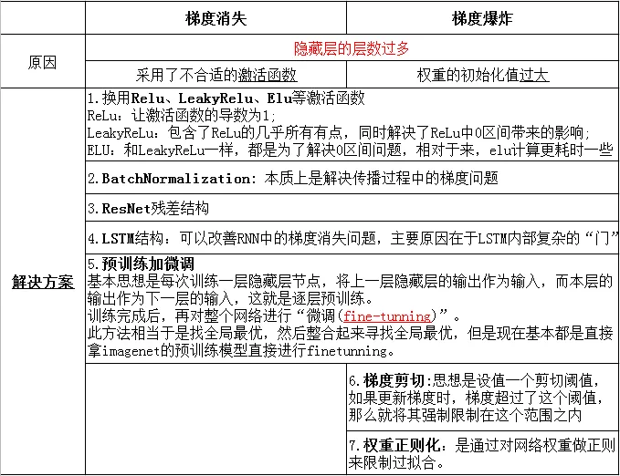

### 1.3.1 Transformer突破RNN梯度消失的束缚

**很大程度上缓解了**传统循环神经网络（RNN）中严重的梯度消失问题，但这并不意味着它对该问题完全免疫。

| 特性 | Transformer | 传统RNN |
|------|-------------|---------|
| **序列处理方式** | **并行处理**：通过自注意力机制一次性看到整个序列，信息路径短。 | **串行处理**：逐步处理序列，信息路径随序列长度增加而变长。 |
| **梯度传播路径** | 主要挑战在于**层数深度**（空间维度），但有多条稳定路径。 | 挑战在于**序列长度**（时间维度），梯度需穿越所有时间步，路径长且脆弱。 |
| **核心稳定机制** | **残差连接**、**层归一化**和 **自注意力机制**协同工作。 | 缺乏有效的全局梯度稳定机制，易受长程依赖问题影响。 |
| **整体稳定性** | **高**，能够训练极深的网络（如上百层）。 | **低**，难以学习长距离依赖关系。 |

### 🧠 三大核心技术解析

Transformer通过以下三种主要技术手段来确保梯度在深层网络中的稳定流动：

1.  **残差连接**

这是对抗梯度消失的"**高速公路**"。在每个子层（自注意力层、前馈网络）周围，都有一个捷径连接，将层的输入
x直接加到层的输出 F(x)上，即 Output=F(x)+x。

a.  **关键作用**：在反向传播时，梯度可以直接通过这条"捷径"回传，其公式中包含一个**恒为1的项**（∂(Output)/∂x=∂F(x)/∂x+1）。这意味着，即使深层变换
    F(x)的梯度
    ∂F(x)/∂x变得非常小，梯度信号也至少能保持一个常数值向后传递，从而有效避免了指数级衰减
    。

2.  **层归一化**

层归一化负责维持训练的"**稳定器**"。它对每个样本的所有特征进行归一化，使其均值为0，方差为1。

a.  **关键作用**：通过稳定每一层输入的分布，层归一化有助于**平滑损失函数的曲面**，防止梯度的剧烈波动。这为反向传播提供了一个更可控的环境，同时缓解了梯度消失和爆炸的可能
    。与批归一化不同，层归一化不依赖于批次大小，特别适合处理序列长度可变的NLP任务
    。

3.  **自注意力机制**

自注意力机制从根本上改变了序列处理范式。它允许序列中任意两个位置直接建立连接，而不必像RNN那样依次传递信息。

a.  **关键作用**：这极大地**缩短了长距离依赖之间的路径长度**。在RNN中，梯度需要穿越所有时间步；而在Transformer中，信息传递的路径复杂度是常数级
    O(1)。这解决了**时间维度上的梯度消失问题**，使模型能够轻松捕捉序列内任意距离的依赖关系
    。

### ⚖️ 架构选择：Pre-Norm 与 Post-Norm

Transformer的归一化层放置位置对训练稳定性有显著影响，主要分为两种架构：

- **Post-Norm**：原始Transformer采用的方案，将层归一化放在残差连接之后（LayerNorm(x +
  F(x))）。这种结构在理论上有更高的性能上限，但在训练极深模型时更不稳定，需要配合学习率预热（Warmup）等技术
  。

- **Pre-Norm**：现代大模型（如LLaMA、GPT系列）的主流选择，将层归一化放在残差连接之前（x +
  F(LayerNorm(x))）。**Pre-Norm能提供更均衡的梯度流，训练稳定性极高**，几乎是千亿参数级别大模型能够成功训练的必要条件
  。

简单来说，如果你更关心**训练的稳定性和效率**，**Pre-Norm是更优的选择**；如果你在相对较浅的模型中追求**极致的理论性能**，并且愿意精细调参，则可以考虑Post-Norm
。

### 💡 其他重要因素与解决方案

除了上述核心机制，还有一些重要的辅助策略：

- **自适应优化器**：如 **Adam**或
  **AdamW**，它们会为每个参数计算自适应的学习率。这能在一定程度上补偿不同参数梯度大小的差异，减轻梯度消失或爆炸的影响
  。

- **梯度裁剪**：这是防止梯度爆炸的"安全阀"。通过设置一个阈值，当梯度的范数超过该值时，会按比例缩小，确保更新步长不会过大导致训练崩溃
  。

- **合理的权重初始化**：使用如Xavier或He初始化方法，为网络权重设置合适的初始范围，为训练提供一个良好的起点，避免从一开始就陷入梯度问题
  。

值得注意的是，有研究指出，对于Transformer的训练不稳定性，**模型输出对参数更新的敏感性（即参数发生微小变化时输出的剧烈波动）**可能是一个比梯度消失更关键的因素。通过改进的初始化方法（如Admin）可以有效控制这种不稳定性
。

### 💎 总结

总而言之，Transformer通过其**残差连接、层归一化和自注意力机制**的巧妙结合，**极为有效地克服了**困扰RNN的梯度消失问题。虽然在某些架构下（如Post-Norm）仍可能面临训练不稳定的挑战，但通过采用Pre-Norm等现代最佳实践，并结合自适应优化器、梯度裁剪等技术，我们已经能够成功训练出参数规模巨大的深度Transformer模型。

残差连接的核心思想是，不要求网络直接学习一个复杂的目标映射
H(x)，而是转而学习一个相对简单的残差映射F(x)=H(x)−x。这样，期望的输出
H(x)就变成了
F(x)+x。这意味着，如果网络中的某些层是冗余的，它们只需要将残差
F(x)学习为0，那么输出就等同于输入，这相当于构建了一个恒等映射。这使得增加更多层数时，网络性能至少不会变差。

残差连接自2015年在ResNet中被提出后，迅速成为构建现代深度模型的标配

### 1.3.2 层归一化（Layer Normalization）

层归一化（Layer
Normalization）**对单个样本的所有特征维度进行归一化，使其保持稳定的分布，从而加速训练并提升模型稳定性**。

### 🧠 核心计算步骤

层归一化的数学过程清晰且标准，通常包含以下三个核心步骤：

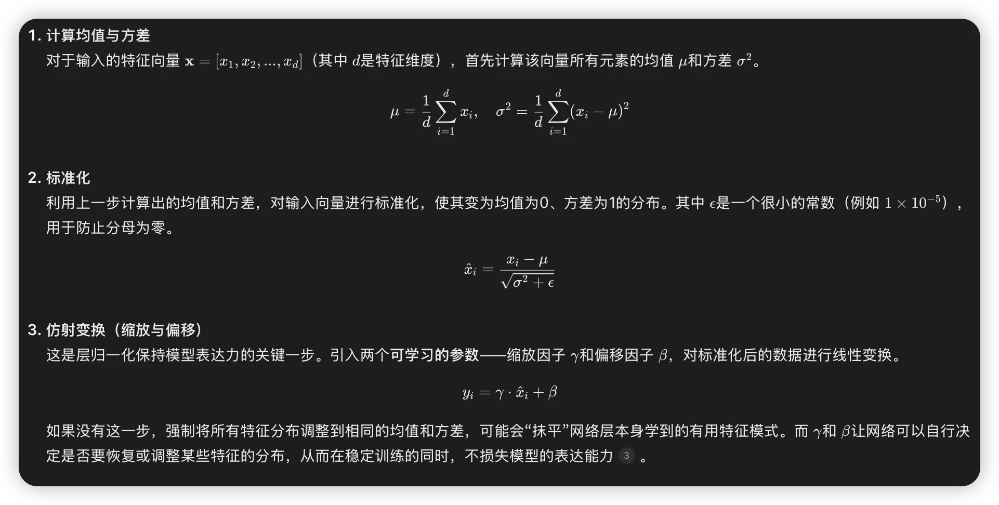

### 💡 一个简单的数值例子

为了让你有更直观的感受，我们用一个具体例子来演示上述过程。

假设某层的输出是一个包含四个特征的向量：x=[2,4,6,8]。

- **步骤1：计算均值和方差**

均值 μ=(2+4+6+8)/4=5

方差 σ2=[(2−5)2+(4−5)2+(6−5)2+(8−5)2]/4=5，标准差 σ=5 。

- **步骤2：标准化**

计算每个特征的标准化值：

x\^1 =(2−5)/5 =−3/5

x\^2 =(4−5)/5 =−1/5

x\^3 =(6−5)/5 =1/5

x\^4 =(8−5)/5 =3/5

此时，新向量 x\^的均值约为0，方差为1。

- **步骤3：仿射变换**

假设当前可学习参数为初始值 γ=1, β=0，则最终输出 y=x\^。

### ⚙️ PyTorch代码示例

在PyTorch中，可以方便地使用
torch.nn.LayerNorm模块。以下是一个简单的代码示例，展示了其输入和输出的形状：

## 1.4 如何确定是否出现梯度爆炸？

可以通过以下现象判断是否出现了梯度爆炸：

1. loss 在训练中剧烈波动、突然升高，甚至直接发散。

2. 梯度值变得异常大，并且持续增长。

3. 参数更新幅度过大，模型训练过程很不稳定。

4. 权重、梯度或损失出现 NaN、inf。

5.  模型迟迟无法收敛，训练效果越来越差。

### 发现梯度爆炸后怎么办？

发现梯度爆炸后，可通过减小学习率、使用梯度裁剪、改进参数初始化、加入归一化层以及优化网络结构等方式来稳定训练。

1. 使用梯度裁剪（最直接）

给梯度设一个上限，超过就截断，这是处理梯度爆炸最常用的方法。

2. 减小学习率

学习率太大时，参数更新容易过猛，降低学习率通常能先稳住训练。

3. 检查参数初始化

如果初始权重过大，容易导致梯度不稳定。可使用 Xavier 或 He 初始化。

4. 更换激活函数

避免使用容易导致梯度问题的激活函数，可优先考虑 ReLU、Leaky ReLU 等。

5. 加入归一化层

如 Batch Normalization、Layer Normalization，有助于稳定训练过程。

6. 改进网络结构

深层网络可用残差连接；序列模型可用 LSTM、GRU 来缓解梯度问题。

7. 检查输入数据

如果输入数据尺度差异太大，训练也会不稳定，先做标准化/归一化。

最实用的处理顺序

先做这三件事：

1. 降低学习率

2. 加梯度裁剪

3. 检查初始化和数据归一化

## 1.5 神经网络中有哪些正则化技术？

正则化: 在训练模型时，通过增加约束来防止模型过拟合，提高泛化能力的方法。

神经网络常用的正则化技术包括 L1/L2
正则化、Dropout、提前停止、数据增强以及 Batch Normalization
等，这些方法都能在不同程度上抑制过拟合、提升模型泛化能力。

1. L1 正则化

在损失函数中加入参数绝对值之和，能够产生稀疏权重。

2. L2 正则化

在损失函数中加入参数平方和，限制权重过大，是最常见的正则化方式之一。

3. Dropout

训练时随机丢弃一部分神经元，减少神经元之间的过度依赖，防止过拟合。

4. Early Stopping（提前停止）

当验证集效果不再提升时提前结束训练，防止模型继续在训练集上过拟合。

5. 数据增强（Data Augmentation）

通过对训练样本做旋转、裁剪、翻转、加噪声等操作，扩充数据集，提高泛化能力。

6. Batch Normalization

虽然主要作用是稳定训练，但也常带来一定正则化效果。

7. 权重共享 / 参数约束

通过限制模型参数自由度，减少过拟合风险。

## 1.6 批量归一化(BN) 如何实现？作用？

对每个 batch
的数据先标准化，再通过可学习参数恢复表达能力；它的主要作用是稳定训练、加快收敛，并在一定程度上缓解梯度问题和过拟合。

BN（Batch Normalization，批量归一化） 是对神经网络某一层的输入按一个
mini-batch 做标准化，再进行可学习的缩放和平移。

如何实现

1.  对一个批次中的某个特征，计算：均值

μ = 1/m * Σ xi

2.  方差

σ² = 1/m * Σ (xi - μ)²

3.  标准化

x̂i = (xi - μ) / sqrt(σ² + ε)

4.  再做线性变换

yi = γx̂i + β

其中：

- ε：防止分母为 0 的小常数

- γ：可学习的缩放参数

- β：可学习的平移参数

也就是说，BN
不是只做标准化，还会让网络自己学习"标准化后应该缩放和平移到什么位置"。

作用

1.  加快训练收敛

2.  输入分布更稳定，优化更容易。缓解梯度消失和梯度爆炸

3.  让各层输入保持在更合理的范围内，训练更稳定。允许使用更大学习率

4.  因为训练过程更稳定，所以通常可以把学习率设得更大一些。对模型有一定正则化效果

由于每个 batch
的统计量不同，会带来轻微扰动，从而在一定程度上减少过拟合。

## 1.7 神经网络中权值共享的理解？

权值共享这个词是由**LeNet5**模型提出来的。以**CNN**为例，在对一张图偏进行卷积的过程中，使用的是同一个卷积核的参数。

比如一个3×3×1的卷积核，这个卷积核内9个的参数被整张图共享，而不会因为图像内位置的不同而改变卷积核内的权系数。

**通俗说**：就是用一个卷积核不改变其内权系数的情况下卷积处理整张图片。

## 1.8 对fine-tuning(微调模型)的理解？为什么要修改最后几层神经网络权值？

使用预训练模型的好处：在于利用训练好的SOTA模型权重去做特征提取，可以节省我们训练模型和调参的时间。

理由：

1. CNN中更靠近底部的层（定义模型时先添加到模型中的层）编码的是更加通用的可复用特征，而更靠近顶部的层（最后添加到模型中的层）编码的是更专业化的特征。微调这些更专业化的特征更加有用，它更代表了新数据集上的有用特征。

2. 训练的参数越多，过拟合的风险越大。很多SOTA模型拥有超过千万的参数，在一个不大的数据集上训练这么多参数是有过拟合风险的，除非你的数据集像Imagenet那样大。

## 1.9 什么是Dropout？为什么有用？它是如何工作的？

**背景**：如果模型的**参数太多**，**数据量**又**太小**，则容易产生过拟合。为了解决过拟合，就同时训练多个网络。然后多个网络取均值。费时！

**介绍**：Dropout可以**防止过拟合**，在前向传播的时候，让某个**神经元的激活值**以一定的概率
P停止工作，这样可以使模型的泛化性更强。

Dropout效果跟**bagging**效果类似（bagging是减少方差variance，而boosting是减少偏差bias）。

加入dropout会使神经网络训练时间长，**模型预测时不需要dropout**，记得关掉。

**具体流程**：

i.随机删除（临时）网络中一定的隐藏神经元，输入输出保持不变，

ii.让输入通过修改后的网络。然后把得到的损失同时修改后的网络进行反向传播。在未删除的神经元上面进行参数更新

iii.重复该过程（恢复之前删除掉的神经元，以一定概率删除其他神经元。前向传播、反向传播更新参数）

## 1.10 如何选择dropout 的概率？

**input** 的 dropout 概率推荐是 **0.8**， **hidden layer**
推荐是**0.5**

为什么dropout可以解决过拟合？

1. 取平均的作用:

Dropout产生了许多子结构之后的操作，父神经网络有N个节点，加入Dropout之后可以看做在权值不变的情况下（参数共享）将模型数量扩增到指数级别

2. 减少神经元之间复杂的共适应关系，迫使网络去学习更加鲁棒；

Dropout 在训练和测试的区别？

训练时随机删除一些神经元，在测试模型时将所有的神经元加入。

## 1.11 什么是Adam？Adam和SGD之间的主要区别是什么？

## 1.12 一阶优化和二阶优化的方法有哪些？为什么不使用二阶优化？

**一阶优化**方法有：

SGD -> SGDM ->NAG -> AdaGrad -> AdaDelta / RMSProp(加速梯度下降) ->
Adam -> Nadam

**二阶优化**

定义：对目标函数进行二阶泰勒展开，也就是二阶梯度优化方法

牛顿法 + BFGS法

利用二阶泰勒展开,即牛顿法需要计算**Hessian**矩阵的逆，计算量大，在深度学习中并不常用。因此一般使用的是一阶梯度优化。

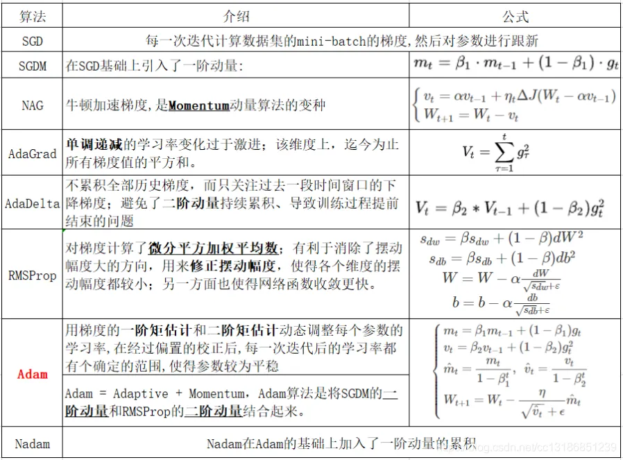

## 1.13 为什么Momentum可以加速训练？

动量其实**累加了历史梯度更新方向**，所以在每次更新时，要是当前时刻的梯度与历史时刻梯度方向相似，这种趋势在当前时刻则会加强；要是不同，则当前时刻的梯度方向减弱。动量方法限制了梯度更新方向的随机性，使其沿正确方向进行。

## 1.14 什么时候使用Adam和SGD？

Adam等自适应学习率算法对于**稀疏数据**具有优势，且收敛速度很快；

但精调参数的SGD（+Momentum）往往能够取得更好的最终结果

Adam+SGD 组合策略：**先用Adam快速下降，再用SGD调优**。

如果模型是非常稀疏的，那么优先考虑自适应学习率的算法；

在**模型设计实验过程**中，要快速验证新模型的效果，用**Adam**进行快速实验优化；

在**模型上线或者结果发布前**，可以用精调的**SGD**进行模型的极致优化。

## 1.15 batch size和epoch的平衡

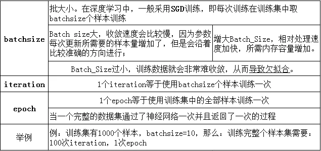

## 1.16 SGD每步做什么，为什么能online learning？

online
learning强调的是学习是实时的，流式的，每次训练不用使用全部样本，而是以之前训练好的模型为基础，每来一个样本就更新一次模型，这种方法叫做OGD（online
gradient
descent）,目的是快速地进行模型的更新，提升模型时效性。而SGD的思想正是在线学习的思想。

## 1.17 学习率太大(太小)时会发生什么？如何设置学习率？

1. **基于经验的手动调整**

通过尝试不同的固定学习率，如3、1、0.5、0.1、0.05、0.01、0.005，0.0001等，观察迭代次数和loss的变化关系，找到loss下降最快关系对应的学习率。

**太小**，收敛过程将变得十分缓慢;

**太大**，梯度可能会在最小值附近来回震荡(loss爆炸)，甚至可能无法收敛。

2. **基于策略的调整**

**①**fixed 、exponential、polynomial

**②**自适应动态调整。adadelta、adagrad、ftrl、momentum、rmsprop、sgd

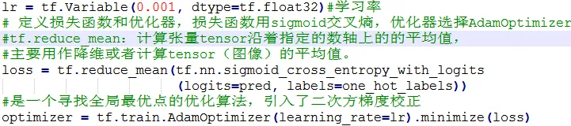**Logit**：对它取对数。
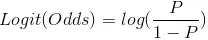

## 1.18 神经网络为什么不用拟牛顿法而是用梯度下降？

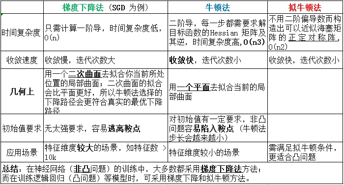

**牛顿法**原理：使用函数f(x)的泰勒级数的前面几项来寻找方程f(x)= 0的根。

## 1.19 BN和Dropout在训练和测试时的差别?

BN:

训练时：是对每一个batch的训练数据进行归一化，也即是用每一批数据的均值和方差。

测试时：都是对单个样本进行测试。这个时候的均值和方差是全部训练数据的均值和方差，这两个数值是通过移动平均法求得。

当一个模型训练完成之后，它的所有参数都确定了，包括均值和方差，gamma和bata。

Dropout:只有在训练的时候才采用，是为了减少神经元对部分上层神经元的依赖，类似将多个不同网络结构的模型集成起来，减少过拟合的风险。

## 1.20 若网络初始化为0的话有什么问题？

w初始化全为0，很可能直接导致**模型失效**，**无法收敛**。

## 1.21 sigmoid和softmax的区别？softmax的公式？

## 1.22 改进的softmax损失函数有哪些？

1. Large Margin Softmax Loss (**L-Softmax**)

加了一个margin，要保证大于某一个阈值。这样可以尽量实现让类间间距更大化，类内距离更小。

2. **Center Loss**

通过将特征和特征中心的距离和softmax
loss一同作为损失函数，使得类内距离更小，有点L1，L2正则化。

## 1.23 深度学习调参有哪些技巧？

1. **准备数据**

1.1 保证有大量、高质量并且带有干净标签的数据;

1.2 样本要随机化，防止大数据淹没小数据;

1.3 样本要做归一化.

2. **预处理**：0均值和1方差化

3. **minibatch**：建议值128，不要用过大的数值，否则很容易过拟合

4. **梯度归一化**：其实就是计算出来梯度之后，要除以minibatch的数量。

5. **学习率**

5.1 用一个一般的**lr**开始，然后逐渐的减小它;

5.2 建议值是**0.01**，适用于很多NN的问题，一般倾向于小一点;

5.3
对于调度学习率的建议：如果在验证集上性能不再增加就让学习率除以2或者5，然后继续，学习率会一直变得很小，到最后就可以停止训练了。

5.4
很多人用的一个设计学习率的原则就是监测一个比率（范数和权值范数之间的比率），如果这个比率在10^-3^附近，如果小于这个值，学习会很慢，如果大于这个值，那么学习很不稳定，由此会带来失败。

6. **使用验证集**，可以知道什么时候开始降低学习率，和什么时候停止训练。

7. **权重初始化**的选择：

7.1 用**高斯分布**乘上一个很小的数

7.2
在深度网络中，随机初始化权重，使用SGD的话一般处理的都不好，这是因为初始化的权重太小了。这种情况下对于浅层网络有效，但是当足够深的时候就不行了，因为weight更新的时候，是靠很多weight相乘的，越乘越小，有点类似梯度消失。

8. 如果训练**RNN**或者**LSTM**，务必保证gradient的norm被约束在15或者5（前提还是要先归一化gradient），这一点在RNN和LSTM中很重要。

9. **Adam**收敛速度的确要快一些，可结果往往没有**sgd** +
**momentum**的解好（如果模型比较复杂的话，sgd是比较难训练的，这时候用adam较好）

10. 如果使用**LSTM**来解决长时依赖的问题，记得初始化**bias**的时候**要大**一点

11. 尽可能想办法多的**扩增训练数据**，如果使用的是图像数据，不妨对图像做一点扭转之类的操作，来扩充数据训练集合。

12. 使用**dropout**。

1. **early stop**，发现val_loss没更新，就尽早停止。

2. 评价最终结果的时候，多做几次，然后**平均**一下他们的**结果**。

## 1.24 神经网络调参，要往哪些方向想？

损失函数的选择是否是合适的

学习率的选取是否合适

batch size选择是否合适

训练样本是否正常，是否需要增强

是否有设置batch normlaztion(数据归一化)

激活函数的类型需要选取恰当

选取合适的优化算法（例如梯度下降，Adam等）

是否存在过拟合

## 1.25 深度学习训练中是否有必要使用L1获得稀疏解?

没必要。对于加了L1正则的神经网络，大部分深度学习框架自带的优化器训练获得不了稀疏解；如果稀疏解的模式是无规律的，这种稀疏意义不大。

## 1.26 神经网络数据预处理方法有哪些？
中心化/零均值，归一化

## 1.27 如何初始化神经网络的权重？神经网络怎样进行参数初始化？

a:将所有的参数初始化为0

b:对w随机初始化

c:
Xavier初始化：尽可能的让输入和输出服从相同的分布，这样就能够避免后面层的激活函数的输出值趋向于0

d: 何氏初试法

如果**权重初始化太小**，会导致神经元的输入过小，随着层数的不断增加，会出现信号消失的问题；也会导致sigmoid激活函数丢失非线性的能力，因为在0附近sigmoid函数近似是线性的。如果**参数初始化太大**，会导致输入状态太大。

对sigmoid激活函数来说，激活函数的值会变得饱和，从而出现梯度消失的问题。

## 1.28 为什么构建深度学习模型需要使用GPU？

VGG16（在DL应用中经常使用16个隐藏层的卷积神经网络）大约具有1.4亿个参数，又称权重和偏见。如果用传统的方法，训练这种系统需要几年的时间。

神经网络的计算密集部分由多个矩阵乘法组成，可以简单地通过同时执行所有操作，而不是一个接一个地执行，要使用GPU（图形处理单元）而不是CPU来训练神经网络。

## 1.29 前馈神经网络(FNN),递归神经网络(RNN)和 CNN 区别?

FNN 是指在一个vector内部的不同维度之间进行一次信息交互。

CNN是以逐次扫描的方式在一个vector的局部进行多次信息交互。

RNN就是在hidden
state上增加了loop，看似复杂，其实就是从时间维度上进行了展开。是在不同时刻的多个vectors之间进行信息交互。

## 1.30 神经网络可以解决哪些问题？

## 1.31 如何提高小型网络的精度？

1. 模型蒸馏技术；

2. 利用AutoML进行网络结构的优化。

## 1.32 列举你所知道的神经网络中使用的损失函数

欧氏距离，交叉熵，对比损失，合页损失

## 1.33 什么是鞍点问题？
梯度为0，海森矩阵不定的点，不是极值点。

## 1.34 网络设计中，为什么卷积核设计尺寸都是奇数？

1.  保证像素点中心位置，避免位置信息偏移

2.  填充边缘时能保证两边都能填充，原矩阵依然对称

# 2. CNN

对图像（不同的数据窗口数据）和滤波矩阵做内积（逐个元素相乘再求和）的操作就是所谓的『卷积』操作。

**卷积神经网络**由**输入层**、**卷积层**、**激励层**、**池化层**、**全连接层**组成。

**①最左边**:

数据输入层，对数据做一些处理：

**去均值**（把输入数据各个维度都中心化为0，避免数据过多偏差，影响训练效果）

**归一化**（把所有的数据都归一到同样的范围）、PCA/白化等。CNN只对训练集做"去均值"这一步。

**②中间**是:

CONV：卷积层，线性乘积 求和。

RELU：激励层，ReLU是激活函数的一种。

POOL：**池化层**，即**取区域平均或最大**。

**③最右边**是:

FC：**全连接层**

## 2.1 卷积神经网络的结构

**池化层**的作用：

减小图像尺寸即数据降维，缓解过拟合，保持一定程度的旋转和平移不变性。

## 2.2 Keras搭建CNN

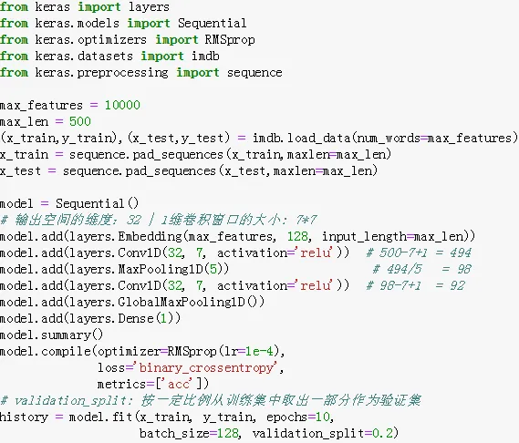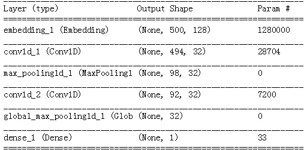

总结： 通常情况下，**一维**CNN的架构与CV的**二维**CNN很相似， 它将
**Conv1D** 层和 **MaxPooling1D**
层堆叠在一起，最后是一个全局池化运算或展平操作。

**RNN在处理非常长的序列时计算代价很大**，但**一维CNN的计算代价很小**，
所以在 RNN
之前使用**一维CNN作为预处理**步骤是一个好主意，这样可以使序列变短，并提取出有用的表示交给
RNN 来处理。

## 2.3 经典网络分类

### 2.3.1 LeNet

最早用于**数字识别**;针对灰度图进行训练的，输入图像大小为**32*32*1**，5*5卷积核，不包含输入层的情况下共有**7层**，每层都包含可训练参数。

输入的二维图像，先经过**两次卷积层**到**池化层**，再经过**全连接层**，最后使用**softmax**分类作为输出层。（conv1->pool->conv2->pool2再接全连接层）

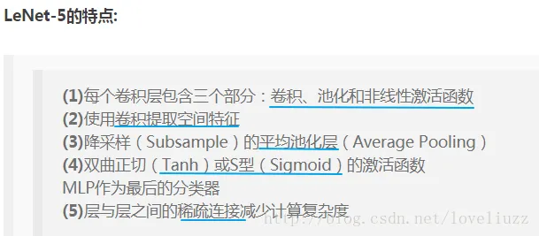

### 2.3.2 AlexNet

用多层小卷积叠加来替换单个的大卷积。

输入尺寸：227*227*3

卷积层：5个

降采样层(池化层)：3个

全连接层：2个（不包含输出层）

输出层：1个。1000个类别

AlexNet比LeNet表现更为出色的另一个原因是它使用了**ReLu**激活函数。

#### 2.3.2.1 AlexNet 对比LeNet 的优势？

1. AlexNet比LeNet更深；

2. 用**多层的小卷积**来替换**单个的大卷积**；

3. 非线性激活函数：ReLU

4. 防止**过拟合**的方法：Dropout，数据增强

5. 大数据训练：百万级ImageNet图像数据

6. 其他：GPU实现，LRN归一化层的使用

### 2.3.3 VGG

构筑了16~19层深的卷积神经网络，**VGG-16**中的16：含有参数的有16个层

VGGNet论文中全部使用了**3*3的小型卷积核**和**2*2的最大池化层**，通过不断加深网络结构来提升性能。

**卷积层**：CONV=3*3 filters, s = 1, padding = same
convolution。

**池化层**：MAX_POOL = 2*2 , s = 2。

优点：简化了卷积神经网络的结构；缺点：**训练的特征数量非常大**。

随着网络加深，图像的宽度和高度都在以一定的规律不断减小，每次池化后刚好缩小一半，信道数目不断增加一倍。

#### 2.3.3.1 VGG使用2个3*3卷积的优势在哪里？

**①减少网络层参数**：

用两个3*3卷积比用1个5*5卷积拥有更少的参数量，只有后者的2*3*3/(5*5)=0.72。但是起到的效果是一样的，两个33的卷积层串联相当于一个55的卷积层，感受野的大小都是5×5，即1个像素会跟周围5*5的像素产生关联.

**②更多的非线性变换**：

2个33卷积层拥有比1个55卷积层更多的非线性变换（前者可以使用**两次ReLU**激活函数，而后者只有一次），使得卷积神经网络对特征的**学习能力更强**。

#### 2.3.3.2 每层卷积是否只能用一种尺寸的卷积核？

可以，经典的神经网络一般都属于**层叠式**网络，每层仅用一个尺寸的卷积核，如**VGG**结构中使用了大量的**3×3**卷积层。

同一层特征图也可以分别使用**多个不同尺寸**的卷积核，以获得不同尺度的特征，再把这些特征结合起来，得到的特征往往比使用单一卷积核的要好。比如**GoogLeNet**、**Inception**系列的网络。

### 2.3.4 Inception(GoogLeNet)

增加了卷积神经网络的宽度，在多个不同尺寸的卷积核上进行卷积后再聚合，并使用**1*1**卷积降维减少参数量。

#### 2.3.4.1 inception结构能不能缓解梯度消失？

可以，因为inception结构额外计算了两个中间loss，防止了较深网络传播过程中的梯度消失问题。

### 2.3.5 ResNet

**残差网络**解决了网络退化的问题（随着网络的深度增加，准确度反而下降了）

#### 2.3.5.1 ResNet为什么不用Dropout?

BN在训练过程对每个单个样本的forward均引入多个样本（Batch个）的统计信息，相当于自带一定噪音，起到正则效果，所以也就基本消除了Dropout的必要。
（ResNet训练**152**层深的神经网络）

#### 2.3.5.2 ResNet网络越来越深，准确率会不会提升？

训练精度和测试精度迅速下降。

神经网络在反向传播过程中要不断地传播梯度，而当网络层数加深时，梯度在传播过程中会逐渐消失，导致无法对前面网络层的权重进行有效的调整。

#### 2.3.5.3 ResNet v1 与 ResNet v2的区别?

通过ResNet 残差学习单元的传播公式，发现前馈和反馈信号可以直接传输，

因此 捷径连接 的非线性激活函数（如ReLU）替换为 Identity Mappings。

同时，ResNet V2 在每一层中都使用了 Batch
Normalization。这样处理之后，新的残差学习单元将比以前更容易训练且泛化性更强。

### 2.3.6 DenseNet

含义：前面所有层与后面层的密集连接,
**每一层的输入**都是前面所有层输出的并集，而该层所学习的特征图也会被直接传给其后面所有层作为输入

**优点**：**缓解梯度消失**问题，特征复用，加强特征传播，减少参数量

缺点：内存占用高

**梯度消失原因**：每一层都直接连接**input**和**loss**。

参数量少原因：每一层已经能够包含前面所有层的输出，只需要很少的特征图就可以了。

#### 2.3.6.1 DenseNet 比 ResNet 好？

1. ResNet连接方式可能会阻碍信息的流动，但是DenseNet每层的输出都和最终的输出直接相连，梯度可以直接从末端流到之前的所有的层。

2. DensetNet连接有**正则化**的作用，可以减少过拟合。

3. DenseNet直接**连接不同层的特征图**，而不是像ResNet一样element-wise
sum。

#### 2.3.6.2 为什么 DenseNet 比 ResNet 更耗显存？

DenseNet的特征图像比ResNet大很多，导致卷积过程的计算量比resnet大很多。

## 2.4 卷积层有哪些基本参数？

①**卷积核大小** (Kernel Size)：

定义了卷积的感受野
在过去常设为5，如LeNet-5；现在多设为3，通过堆叠3×33×3的卷积核来达到更大的感受域。

②**卷积核步长** (Stride)：

常见设置为1，可以覆盖所有相邻位置特征的组合；当设置为更大值时相当于对特征组合降采样。

③**填充方式** (Padding)

④**输入通道数** ：指定卷积操作时卷积核的深度

⑤**输出通道数** ：指定卷积核的个数

**感受野**：CNN每一层输出的特征图上的像素点在原始图像上映射的区域大小。

## 2.5 如何计算卷积层的输出的大小？

K 是过滤器尺寸，P 是填充，S 是步幅

## 2.6 如何计算卷积层参数数量？

卷积层参数量 = (filter size * 前一层特征图的通道数)*
当前层filter数量 + 当前层filter数量。
**（卷积核长度*卷积核宽度*通道数+1）*卷积核个数**

假设输入层矩阵维度是 96×96×3，第一层卷积层使用尺寸为 5×5、深度为 16
的过滤器（卷积核尺寸为 5×5、卷积核数量为
16），那么这层卷积层的参数个数为 5×5×3×16 + 16=1216个。

## 2.7 有哪些池化方法？

池化操作也叫做**子采样**(Subsampling)或**降采样**(Downsampling)，往往会用在卷积层之后，通过池化来降低卷积层输出的特征维度，有效减少网络参数的同时还可以防止过拟合现象。

**①**最大池化 和 **②**平均池化

以最大池化为例，池化范围(2×2)(2×2)和滑窗步长(stride=2)(stride=2)
相同，仅提取一次相同区域的范化特征。

## 2.8 1*1卷积的作用？

**①**加入非线性函数。卷积层之后经过激励层，提升网络的表达能力;

**②**对卷积核通道数进行**降维**和升维，减小参数量。

## 2.9 卷积层和池化层有什么区别？

①卷积层有参数，池化层没有参数；

②经过卷积层节点矩阵深度会改变。池化层不会改变节点矩阵的深度，但是它可以缩小节点矩阵的大小。

## 2.10 卷积核是否一定越大越好？

不一定，**缺点**：会导致计算量大幅增加，不利于训练更深层的模型，相应的计算性能也会降低。

卷积神经网络（**VGG**、**GoogLeNet**等），发现通过堆叠2个3×3卷积核可以获得与5×5卷积核相同的感受视野，同时参数量会更少（3×3×2+1
< \$ 5×5×1+1\$）

**优点**：

文本特征有时需要有较广的感受域让模型能够组合更多的特征（如词组和字符）

卷积核的大小并没有绝对的优劣，需要视具体的应用场景而定，但是极大和极小的卷积核都是不合适的，单独的1×1极小卷积核只能用作分离卷积而不能对输入的原始特征进行有效的组合，极大的卷积核通常会组合过多的无意义特征从而浪费了大量的计算资源。

## 2.11 卷积在图像中有什么直观作用?

用来提取**图像的特征**，但不同层次的卷积操作提取到的特征类型是不相同的：

浅层卷积： 边缘特征

中层卷积： 局部特征

深层卷积： 全局特征

## 2.12 CNN中空洞卷积的作用是什么？

**空洞卷积**也叫扩张卷积，在保持参数个数不变的情况下增大了卷积核的感受野，同时它可以保证输出的特征映射的大小保持不变。一个扩张率为2的3×3卷积核，感受野与5×5的卷积核相同，但参数数量仅为9个。

## 2.13 怎样才能减少卷积层参数量？

**①**使用**堆叠小卷积核**代替大卷积核：

VGG网络中2个3×3的卷积核可以代替1个5×5的卷积核

**②**使用**分离卷积**操作：

将原本K×K×C的卷积操作分离为K×K×1和1×1×C的两部分操作

**③**添加**1×1**的卷积操作：与分离卷积类似，但是通道数可变，在K×K×C1卷积前添加1×1×C2的卷积核（满足C2<C1）

**④**在卷积层前使用**池化**操作：池化可以降低卷积层的输入特征维度

## 2.14 在进行卷积操作时，必须同时考虑通道和区域吗？

**①标准卷积**同时考虑通道和区域

**②**通道分离（深度分离）卷积网络(**Xception**网络):

首先对每一个通道进行各自的卷积操作，有多少个通道就有多少个过滤器。得到新的通道特征矩阵之后，再对这批新通道特征进行标准的1×1跨通道卷积操作。

## 2.15 采用宽卷积,窄卷积的好处有什么？

宽卷积、窄卷积其实是一种**填充方式**。

**①**宽卷积(**\'SAME'**填充)：

对卷积核不满足整除条件的输入特征进行补全，以使卷积层的输出维度保持与输入特征维度一致。

**②**窄卷积(**\'VALID'**填充):

**不进行任何填充**，在输入特征边缘位置若不足以进行卷积操作，则对边缘信息进行舍弃,因此在步长为1的情况下该填充方式的卷积层输出特征维度可能会略小于输入特征的维度。

## 2.16 介绍反卷积(转置卷积)

正向传播时乘以卷积核的转置矩阵，反向传播时乘以卷积核矩阵，由卷积输出结果近似重构输入数据，**上采样**。

输入：2x2， 卷积核：4x4， 滑动步长：3， 输出：7x7

过程如下：

**①**输入图片每个像素进行一次**full卷积**，根据full卷积大小计算可以知道每个像素的卷积后大小为
1+4−1==4， 即4x4大小的特征图，输入有4个像素所以4个4x4的特征图。

**②**将4个特征图进行步长为3的相加；
输出的位置和输入的位置相同。步长为3是指每隔3个像素进行相加，重叠部分进行相加，即输出的第1行第4列是由红色特阵图的第一行第四列与绿色特征图的第一行第一列相加得到，其他类推。

可以看出反卷积的大小是由卷积核大小与滑动步长决定， in是输入大小，
k是卷积核大小， s是滑动步长， out是输出大小 得到 **out=(in−1)*s + k** 上图过程就是 (2 - 1) * 3 + 4 = 7。

## 2.17 如何提高卷积神经网络的泛化能力？

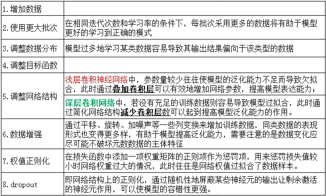

## 2.18 卷积神经网络在NLP与CV领域应用的区别?

**自然语言处理**对**一维信号**（词序列）做操作，输入数据通常是**离散取值**（例如表示一个单词或字母通常表示为词典中的one
hot向量）

**计算机视觉则**是对**二维**（图像）或**三维**（视频流）信号做操作。输入数据是**连续取值**（比如归一化到0，1之间的-
灰度值）。

## 2.19 全连接、局部连接、全卷积与局部卷积的区别？

## 2.20 卷积层和全连接层的区别？

1. 卷积层是局部连接，所以提取的是局部信息；全连接层是全局连接，所以提取的是全局信息；

2. 当卷积层的局部连接是全局连接时，全连接层是卷积层的特例；

## 2.21 Max pooling如何工作？还有其他池化技术吗？

1. Max pooling:选取滑动窗口的最大值

2. Average pooling：平均滑动串口的所有值

3. Global average pooling：平均每页特征图的所有值

## 2.22 卷积神经网络的优点？为什么用小卷积核？

多个小的卷积核叠加使用要远比一个大的卷积核单独使用效果要好的多。

1. 局部连接

这个是最容易想到的，每个神经元不再和上一层的所有神经元相连，而只和一小部分神经元相连。这样就减少了很多参数。

2. 权值共享

一组连接可以共享同一个权重，而不是每个连接有一个不同的权重，这样又减少了很多参数。

3. 下采样

Pooling层利用图像局部相关性的原理，对图像进行子抽样，可以减少数据处理量同时保留有用信息。通过去掉Feature
Map中不重要的样本，进一步减少参数数量。

## 2.23 CNN拆成3x1 1x3的优点？

为了压缩模型参数量（这里参数由3x3=9降低到1x3+3x1=6），但是计算量基本没变（乘数目没变）。

## 2.24 BN、LN、IN、GN和SN的区别？

将输入的 feature map shape 记为[N, C, H, W]，其中N表示batch
size，即N个样本；C表示通道数；H、W分别表示特征图的高度、宽度。

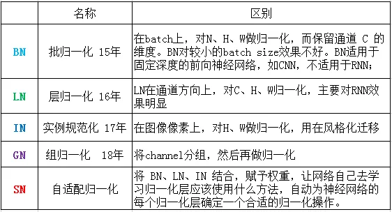

为什么需要卷积？不能使用全连接层吗？

为什么降采用使用max pooling，而分类使用average pooling?

CNN是否抗旋转？如果旋转图像，CNN的预测会怎样？

什么是数据增强？为什么需要它们？你知道哪种增强？

如何选择要使用的增强？

什么是迁移学习？它是如何工作的？

什么是目标检测？你知道有哪些框架吗？

什么是对象分割？你知道有哪些框架吗？

# 3. RNN

RNN 是一种 处理序列数据的神经网络，能够利用序列的 时间依赖信息

网络的输出不仅依赖当前输入，还依赖 **上一时刻的隐藏状态**

RNN应用场景:

1. 文本生成 2.语音识别 3.机器翻译 4.生成图像描述 5.视频标记

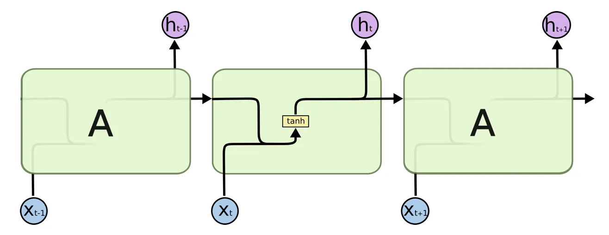

缺点：

RNN有短期记忆问题，无法处理很长的输入序列

训练RNN 需要投入极大的成本

RNN 是一种死板的逻辑，越晚的输入影响越大，越早的输入影
响越小，且无法改变这个逻辑。

## 3.1 RNNs训练和传统ANN训练异同点？

相同点：都使用BP误差反向传播算法。

不同点：

RNNs网络参数W,U,V是共享的，而传统神经网络各层参数间没有直接联系。

对于RNNs，在使用梯度下降算法中，每一步的输出不仅依赖当前步的网络，还依赖于之前若干步的网络状态。

## 3.2 为什么RNN 训练的时候Loss波动很大?

RNN 在训练时 loss
波动较大，主要是因为其在时间维度展开后形成深层网络，反向传播过程中容易出现梯度爆炸和梯度消失，从而导致参数更新不稳定、损失震荡。尤其当学习率较大时，这种现象更加明显。常见解决方法包括梯度裁剪、减小学习率，以及使用
LSTM、GRU 等改进结构来提高训练稳定性。

RNN
在时间维度上展开后，本质上是一个很深的网络。反向传播时，梯度需要沿时间步连续传递，因此容易出现：

1. 梯度爆炸

梯度在时间上传播时可能不断放大，导致参数更新过大，loss 剧烈震荡。

2. 梯度消失

梯度也可能不断变小，使模型难以学习长期依赖，训练不稳定、收敛缓慢。

3. 序列长度带来的训练难度

不同样本序列长度不同、依赖关系复杂，会让每次更新的方向差异较大， 从而使
loss 曲线不够平滑。

4. 学习率设置不合适

如果学习率过大，RNN 更容易在梯度不稳定时发生震荡。

怎么解决

1. 梯度裁剪

这是最经典的方法。

当梯度超过某个阈值时，将其截断到设定范围内，防止梯度爆炸。

2. 减小学习率

降低参数更新幅度，缓解震荡。

3. 使用 LSTM / GRU

它们通过门控机制缓解普通 RNN 的梯度消失问题。

4. 合理初始化参数

避免初始权重过大或过小。

5. 归一化或规范化训练

如适当使用归一化手段，提高训练稳定性。

## 3.3 RNN中为什么会出现梯度消失？

梯度消失现象：累乘会导致激活函数导数的累乘，如果取tanh或sigmoid函数作为激活函数的话，那么必然是一堆小数在做乘法，结果就是越乘越小。随着时间序列的不断深入，小数的累乘就会导致梯度越来越小直到接近于0，这就是"梯度消失"现象。

实际使用中，会优先选择**tanh**函数，原因是tanh函数相对于sigmoid函数来说梯度较大，收敛速度更快且引起梯度消失更慢。

## 3.4 如何解决RNN中的梯度消失问题？

1. 选取更好的激活函数，如**Relu**激活函数。ReLU函数的左侧导数为0，右侧导数恒为1，这就避免了"梯度消失"的发生。但恒为1的导数容易导致"梯度爆炸"，但设定合适的阈值可以解决这个问题。

2. 加入**BN**层，其优点：加速收敛.控制过拟合，可以少用或不用Dropout和正则。降低网络对初始化权重不敏感，且能允许使用较大的学习率等。

3. 改变传播结构，**LSTM**结构可以有效解决这个问题。

## 3.5 CNN VS RNN

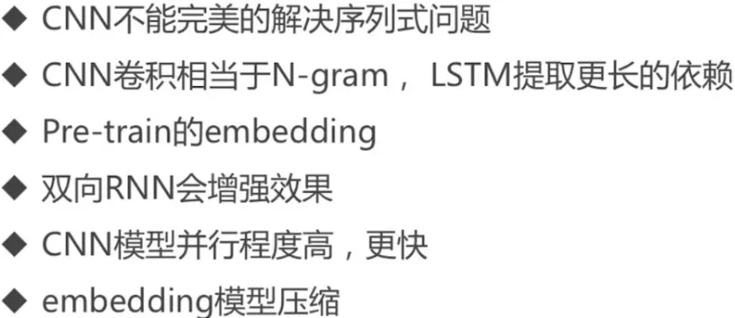

不同点

1. CNN空间扩展，神经元与特征卷积；RNN时间扩展，神经元与多个时间输出计算

2. RNN可以用于描述时间上连续状态的输出，有记忆功能，CNN用于静态输出。

## 3.6 Keras搭建RNN

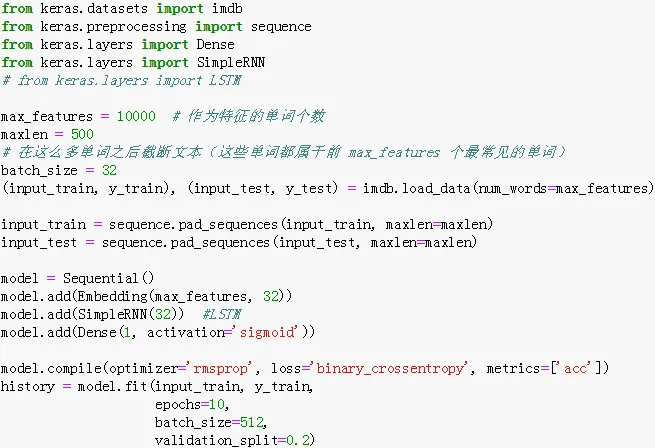

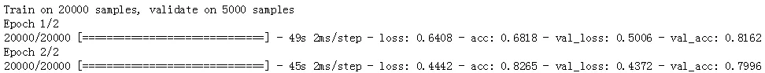

# LSTM

**长短期记忆网络**（Long Short-Term Memory）

普通 RNN（循环神经网络）虽然可以处理序列数据，但存在
**梯度消失和梯度爆炸** 问题，导致它很难学习长期依赖（long-term
dependencies）。

LSTM 通过 **门控机制（Gates）** 控制信息流

信息流核心思想：**输入 → 候选记忆 → 记忆元 →
隐状态输出**，门控控制信息写入/保留/输出。

由三个具有sigmoid激活函数的全连接层处理,以计算输入门、遗忘门和输出门的值。
因此，这三个门的值都在的范围内

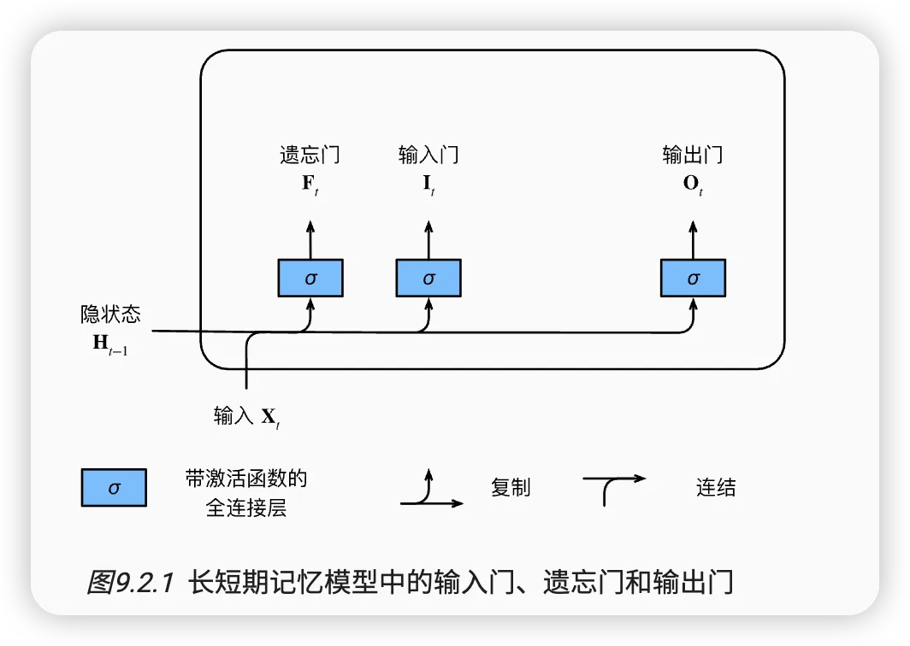

遗忘门就像"笔记本里的橡皮擦"，控制旧记忆的保留。

输入门就像"笔记本的新信息筛选器"，决定哪些草稿可以写入笔记本。

输出门就像"笔记本摘要选择器"，只把重要内容读出来作为当前输出。

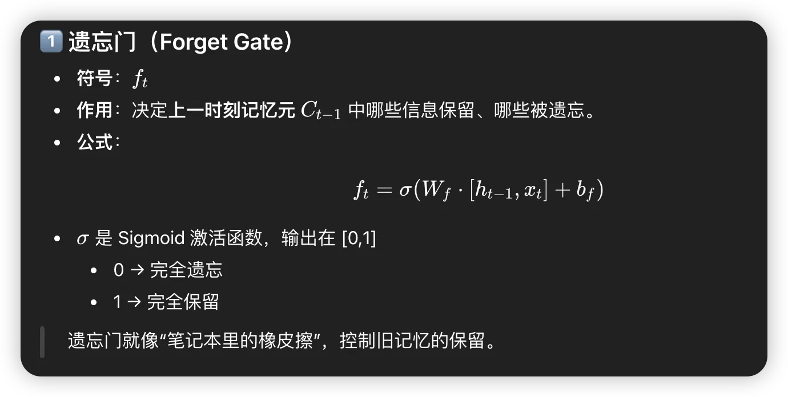

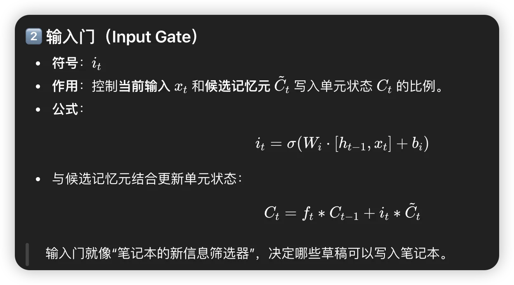

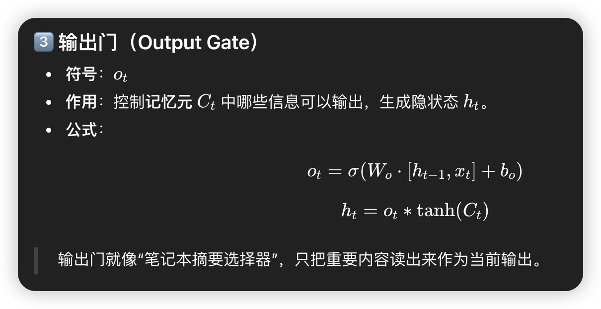

**记忆元 C_t** = "笔记本"，记录长期信息

**候选记忆元 $\tilde{C}_t$** = "草稿"，准备写入笔记本

**隐状态 h_t** = "输出摘要"，告诉外界当前重要信息

## 候选记忆元（candidate memory cell）

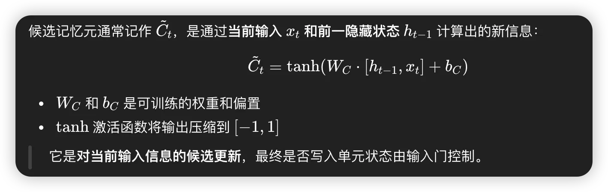

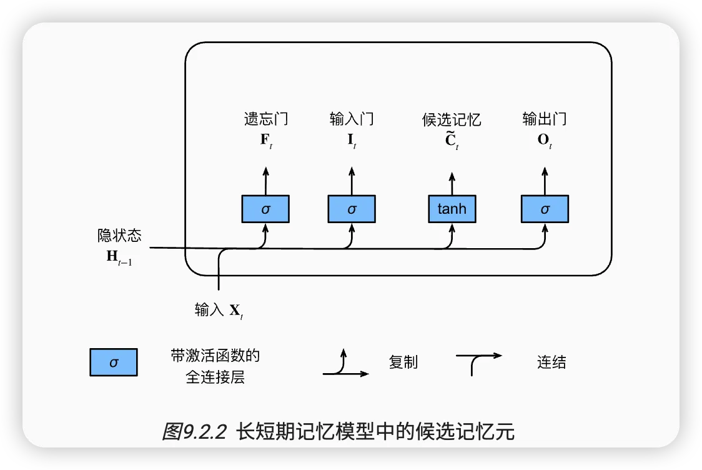

## 记忆元

- 在 LSTM 中，**记忆元 C_t**
  是网络的"长期记忆"，负责存储重要的序列信息，跨多个时间步保留信息。

- 它的作用是：

  - **保存长期信息**（长期依赖）

  - **结合门控机制**，控制哪些信息被保留、更新或丢弃

可以理解为 LSTM 的"笔记本"，门控就是笔记本的"写入、删除、读取"规则。

## 隐状态

**隐状态** 通常记作

它是网络在**时间步 t 的输出**，同时也携带了**前面时间步的信息**

隐状态会被传递到：

1.  下一时间步（作为输入的一部分）

2.  下一层网络（如果是多层 LSTM）

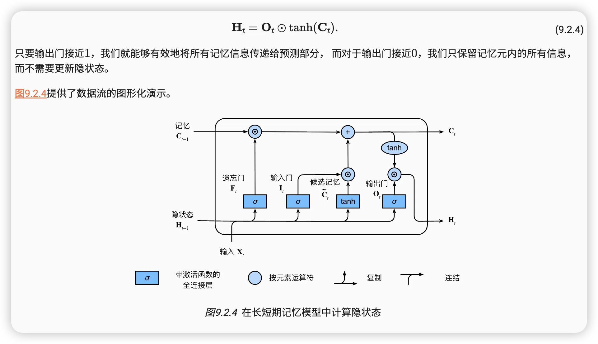

## LSTM结构推导，为什么比RNN好？

LSTM 能解决 普通 RNN 的梯度消失问题

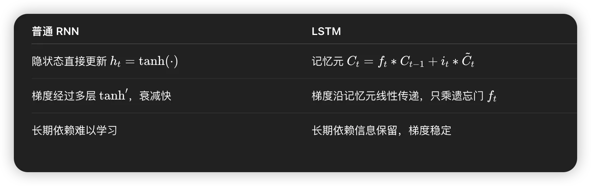

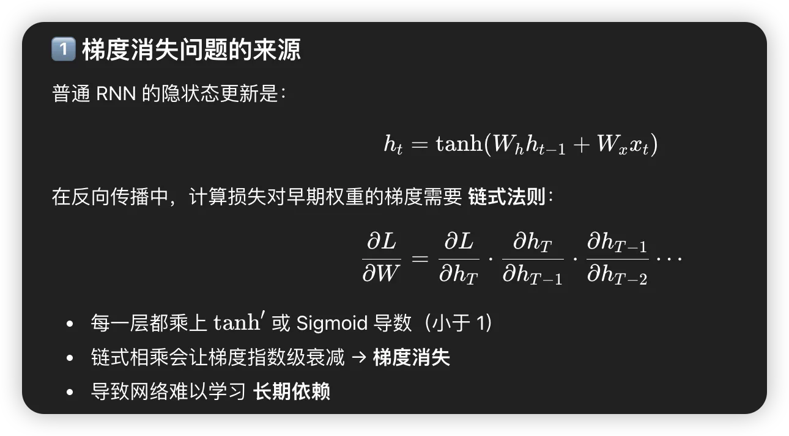

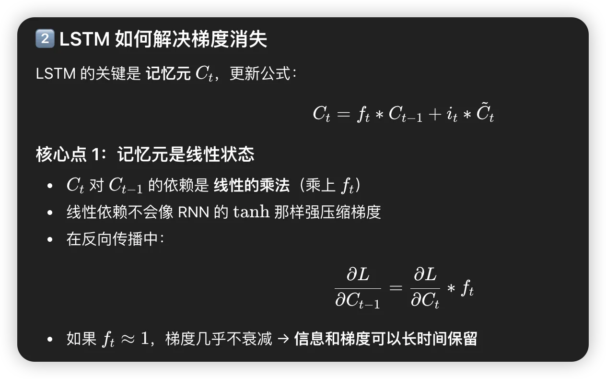

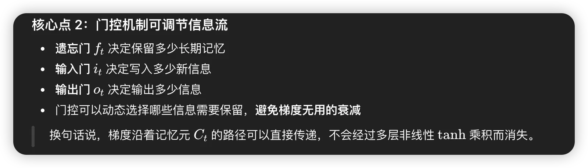

## 为什么LSTM模型中既存在sigmoid又存在tanh两种激活函数，而不是选择统一一种sigmoid或者tanh？

门控（Sigmoid） = 水阀，控制信息流量 0~100%

候选记忆元（Tanh） = 水流本身，可以是正或负，决定写入多少内容

两者结合 → LSTM 可以选择性地写入/遗忘，同时保留信息正负变化

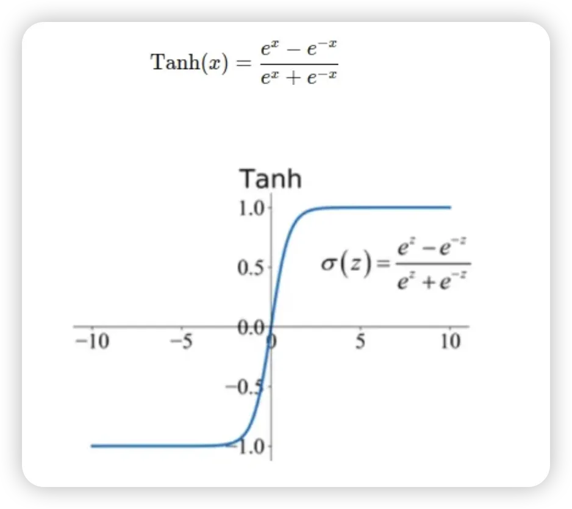

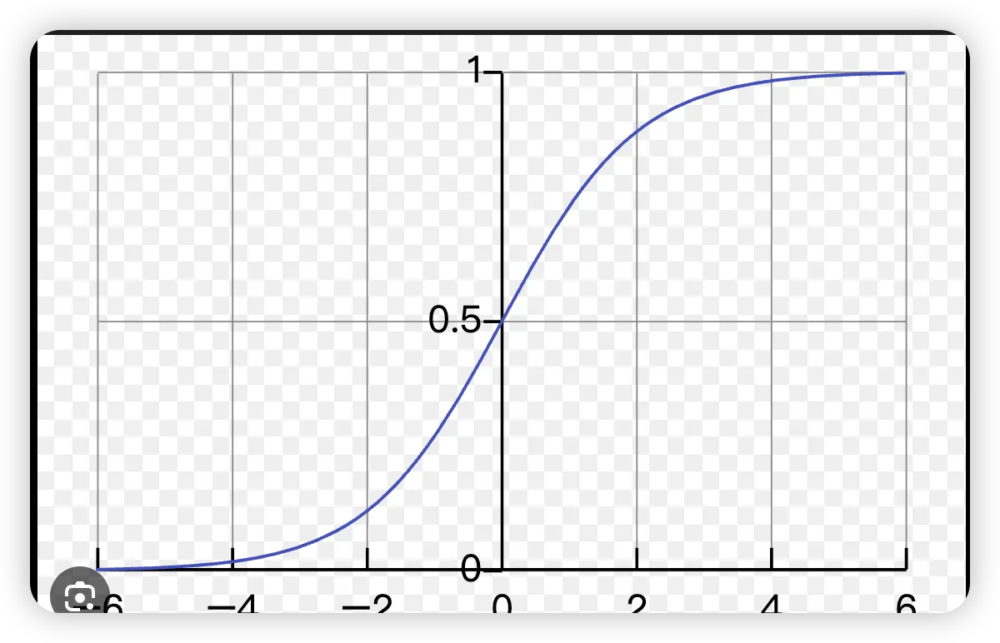

## LSTM中为什么经常是两层双向LSTM？

- **普通单向
  LSTM**：从前向后（t=1→T）读取序列，只能利用**历史信息**（过去）

- **双向 LSTM**：同时有**正向 LSTM**（t=1→T）和**反向 LSTM**（t=T→1）

  - 对每个时间步 t，输出由 **正向隐藏状态 + 反向隐藏状态** 拼接而成

  - 可以利用 **过去和未来信息**

适合 NLP、语音识别等任务，因为上下文信息往往同时重要。

## 4.4 RNN扩展改进

### 4.4.1 Bidirectional RNNs

将两层RNNs叠加在一起，当前时刻输出(第t步的输出)不仅仅与之前序列有关，还与之后序列有关。例如：为了预测一个语句中的缺失词语，就需要该词汇的上下文信息。Bidirectional
RNNs是一个相对较简单的RNNs，是由两个RNNs上下叠加在一起组成的。输出由前向RNNs和后向RNNs共同决定。

### 4.4.2 CNN-LSTMs

该模型中，CNN用于**提取对象特征**，LSTMs用于**预测**。CNN由于卷积特性，其能够快速而且准确地捕捉对象特征。LSTMs的优点：能够捕捉数据间的长时依赖性。

### 4.4.3 Bidirectional LSTMs

有两层LSTMs。 一层处理过去的训练信息，另一层处理将来的训练信息。

通过前向LSTMs获得前向隐藏状态，后向LSTMs获得后向隐藏状态，当前隐藏状态是前向隐藏状态与后向隐藏状态的组合。

### 4.4.4 GRU

（14年提出）是一般的RNNs的变型版本，其主要是从以下两个方面进行改进。

1. 以语句为例，序列中不同单词处的数据对当前隐藏层状态的影响不同，越前面的影响越小，即每个之前状态对当前的影响进行了距离加权，距离越远，权值越小。

2. 在产生误差error时，其可能是由之前某一个或者几个单词共同造成，所以应当对对应的单词weight进行更新。GRUs的结构如下图所示。GRUs首先根据当前输入单词向量word
vector以及前一个隐藏层状态hidden state计算出update gate和reset
gate。再根据reset gate、当前word vector以及前一个hidden
state计算新的记忆单元内容(new memory content)。当reset
gate为1的时候，new memory content忽略之前所有memory
content，最终的memory是由之前的hidden state与new memory
content一起决定。

## 4.5 LSTM、RNN、GRU区别？

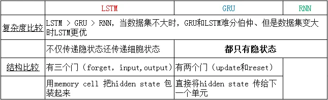

与LSTM相比，GRU内部少了一个"门控"，参数比LSTM少，但是却也能够达到与LSTM相当的功能。考虑到硬件的计算能力和时间成本，因而很多时候我们也就会选择更加实用的GRU。

## 4.6 LSTM的原理、写LSTM的公式、手推LSTM的梯度反向传播

# 5. 反向传播BP算法

## 什么是反向传播？

反向传播（Backward Propagation或Back
Propagation，BP算法）指的是计算神经网络参数梯度的方法。

简言之，该方法根据微积分中的链式法则，按相反的顺序从输出层到输入层遍历网络。

该算法存储了计算某些参数梯度时所需的任何中间变量。

前向传播：计算输出和损失

反向传播： 通过梯度告诉每个权重和偏置该怎么更新

训练循环： 重复 Forward + Backward + 更新参数 → 网络逐渐拟合数据

## 什么是计算图

计算图是一种**用图结构表示计算过程的数据结构**，可以清晰描述神经网络或任意数学函数的计算顺序和依赖关系。

- **节点（Node）**：表示操作或变量

  - 输入节点：输入数据 xxx、权重 WWW、偏置 bbb

  - 运算节点：加法、乘法、激活函数、损失函数

- **边（Edge）**：表示数据流或依赖关系

  - 数据从一个节点流向另一个节点

  - 表示计算顺序或梯度传播路径

可以理解成"数学公式的可视化流程图"，每条边代表数据依赖，每个节点是操作或变量。

## 链式法则

反向传播将局部导数向反方向传递，传递的原理基于链式法则。反向传播时将信号乘以节点的局部导数然后传递给下一个节点。

链式法则用来求**复合函数的导数**。

核心思想：先求外层函数对内层函数的导数，再乘以内层函数对自变量的导数。

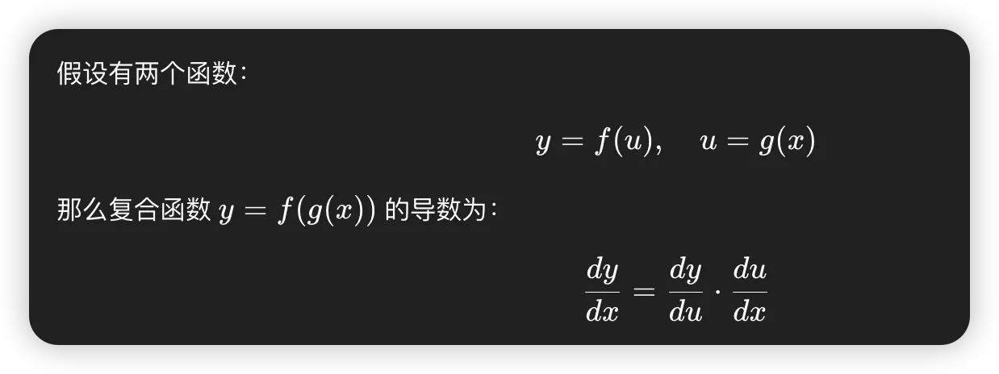

神经网络是多层复合函数

每一层的输出都是下一层的输入

反向传播要计算损失 LLL 对每个权重的导数

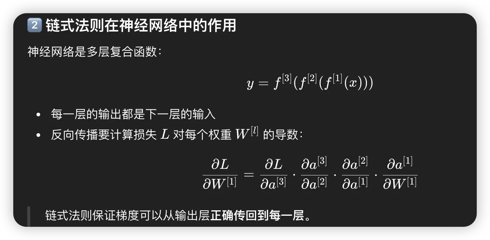

## 反向传播是如何工作的？

1.  **Forward Pass**：计算每层输出 → 得到预测 → 计算损失

2.  **Backward Pass**：沿网络反向计算梯度 → 每层权重和偏置梯度

3.  **Parameter Update**：梯度下降更新网络参数

4.  **迭代训练**：重复 forward + backward + update → 网络收敛

## 为什么需要反向传播？

神经网络是多层复合函数，直接求每个参数对损失的梯度非常复杂

## 手推BP

推导：**链式求导法**则反复用

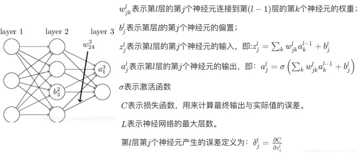

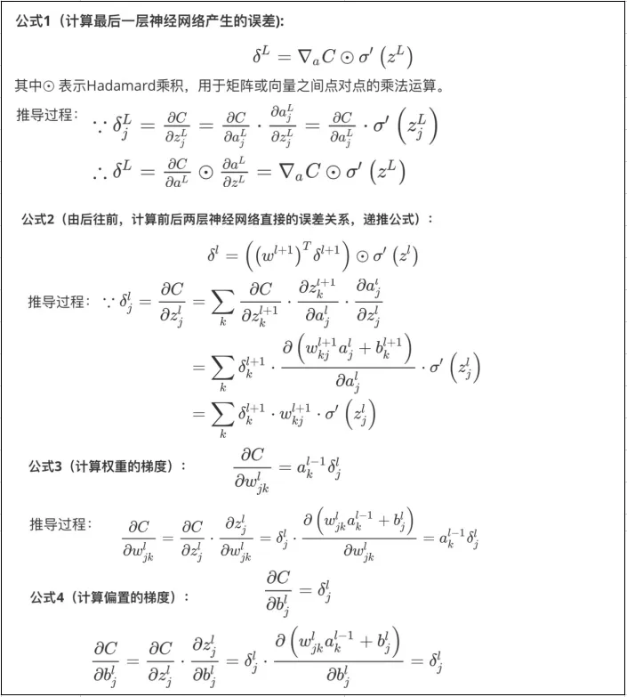

**伪代码**：

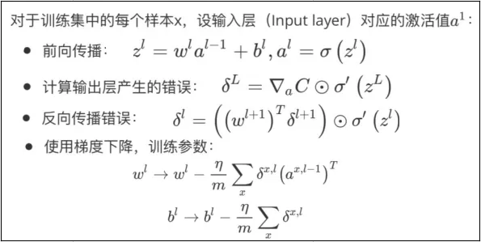

# 6. GAN

**生成式对抗网络**,由一个生成器网络和一个**判别器**网络组成。判别器的训练目的是能够区分生成器的输出与来自训练集的真实图像，生成器的训练目的是欺骗判别器。值得注意的是，生成器从未直接见过训练集中的图像，它所知道的关于数据的信息都来自于判别器。

GAN 相关的技巧:

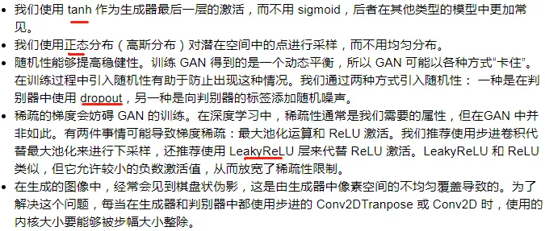

## 6.1 生成器

它将一个向量（来自潜在空间，训练过程中对其随机采样）转换为一张候选图像。GAN
常见的诸多问题之一，就是生成器"卡在"看似噪声的生成图像上。

一种可行的解决方案是在判别器和生成器中都使用 dropout。

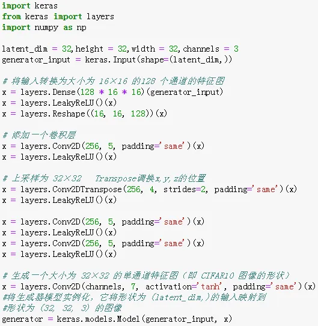

## 6.2 判别器

接下来开发 discriminator
模型，它接收一张候选图像（真实的或合成的）作为输入，并将其划分到这两个类别之一："生成图像"或"来自训练集的真实图像"。

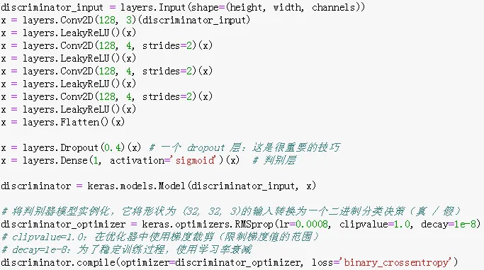

## 6.3 训练技巧

1.  输入规范化到（-1，1）之间，最后一层的激活函数使用tanh（BEGAN除外）

2.  使用wassertein GAN的损失函数

3.  如果有标签数据的话，尽量使用标签，也有人提出使用反转标签效果很好，另外使用标签平滑，单边标签平滑或者双边标签平滑

4.  使用mini-batch norm， 如果不用batch norm 可以使用instance norm
    或者weight norm

5.  避免使用RELU和pooling层，减少稀疏梯度的可能性，可以使用leakrelu激活函数

6.  优化器尽量选择ADAM，学习率不要设置太大，初始1e-4可以参考，另外可以随着训练进行不断缩小学习率

7.  给D的网络层增加高斯噪声，相当于是一种正则

# 7. 超参数调整

## 7.1 神经网络中包含哪些超参数？

通常可以将超参数分为三类：网络参数、优化参数、正则化参数。

网络参数：可指网络层与层之间的交互方式（相加、相乘或者串接等）、卷积核数量和卷积核尺寸、网络层数（也称深度）和激活函数等。

优化参数：一般指学习率、批样本数量（batch
size）、不同优化器的参数以及部分损失函数的可调参数。

正则化：权重衰减系数，丢弃比率（dropout）

## 7.2 为什么要进行超参数调优？

本质上，这是模型优化寻找最优解和正则项之间的关系。网络模型优化调整的目的是为了寻找到全局最优解（或者相比更好的局部最优解），而正则项又希望模型尽量拟合到最优。两者通常情况下，存在一定的对立，但两者的目标是一致的，即最小化期望风险。模型优化希望最小化经验风险，而容易陷入过拟合，正则项用来约束模型复杂度。所以如何平衡两者之间的关系，得到最优或者较优的解就是超参数调整优化的目的。

## 7.3 超参数的重要性顺序

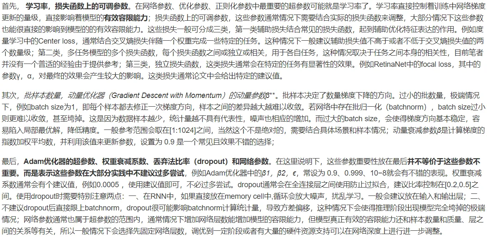

## 7.4 极端批样本数量下，如何训练网络？

极端批样本情况一般是指batch size为1或者batch
size在6000以上的情况。这两种情况，在使用不合理的情况下都会导致模型最终性能无法达到最优甚至是崩溃的情况。

在目标检测、分割或者3D图像等输入图像尺寸较大的场景，通常batch size
会非常小。batch
size过小通常对batchnorm的影响是最大的，若网络模型中存在batchnorm，batch
size若只为1或者2时会对训练结果产生非常大的影响。这时通常有两种策略:

一、若模型使用了预训练网络，可冻结预训练网络中batchnorm的模型参数，有效降低batch
size引起的统计量变化的影响。

二、在网络不是过深或者过于复杂时可直接移除batchnorm或者使用groupnorm代替batchnorm，前者不多阐释，后者是有FAIR提出的一种用于减少batch对batchnorm影响，其主要策略是先将特征在通道上进行分组，然后在组内进行归一化。即归一化操作上完全与batch
size无关。这种groupnorm的策略被证实在极小批量网络训练上能达到较优秀的性能。当然这里也引入里group这个超参数，一般情况下建议不宜取group为1或者各通道单独为组的group数量，可结合实际网络稍加调试。

为了降低训练时间的成本，多机多卡的分布式系统通常会使用超大的batch
size进行网络训练。可采用层自适应速率缩放（LARS）算法。从理论认知上将，batch
size增大会减少反向传播的梯度更新次数，但为了达到相同的模型效果，需要增大学习率。但学习率一旦增大，又会引起模型的不收敛。为了解决这一矛盾，LARS算法就在各层上自适应的计算一个本地学习率用于更新本层的参数，这样能有效的提升训练的稳定性。

## 7.5 合理使用预训练网络

### 7.5.1 什么是微调（fine-tune）

指稍微调整参数即可得到优秀的性能，是迁移学习的一种实现方式。微调和从头训练的本质区别在于模型参数的初始化，train
from
scratch通常指对网络各类参数进行随机初始化（当然随机初始化也存在一定技巧），随机初始化模型通常不具有任何预测能力，通常需要大量的数据或者特定域的数据进行从零开始的训练，这样需要训练到优秀的模型通常是稍困难的。而微调的网络，网络各类参数已经在其他数据集（例如ImageNet数据集）完成较好调整的，具备了较优秀的表达能力。因此，我们只需要以较小的学习速率在自己所需的数据集领域进行学习即可得到较为优秀的模型。微调通常情况下，无须再重新设计网络结构，预训练模型提供了优秀的结构，只需稍微修改部分层即可。在小数据集上，通常微调的效果比从头训练要好很多，原因在于数据量较小的前提下，训练更多参数容易导致过度拟合。

### 7.5.2 微调有哪些不同方法？

以图像分类为例，通常情况下由于不同数据集需要的类别数不同，我们需要修改网络的输出顶层。这种情况下有两种微调方式：

不冻结网络模型的任何层，对最后的改动层使用较大的学习率，对未改动层以较小的学习率进行训练全模型训练，进行多轮训练即可。即一步完成训练。

冻结除了顶部改动层以外的所有层参数，即不对冻结部分的层进行参数训练更新，进行若干轮的微调训练后，放开顶部层以下的若干层或者全部放开所有层的参数，再次进行若干轮训练即可。即分多步训练。

以上两种都属于微调。目前由于存在大量优秀的预训练模型，如何确定哪个模型适合自己的任务并能得到最佳性能需要花大量的时间探索。此时，上述的前者是种不错训练方式，你无须进行过多分步的操作。而当探索到一个比较适合的模型时，你不妨可以再次重新尝试下以第二种方式进行训练，或许能得到相比于前者稍高些的性能，因为小数据集上调整过多的参数过拟合的机率也会增大，当然这并不是绝对的。

### 7.5.3 微调先冻结底层，训练顶层的原因？

首先冻结除了顶部改动层以外的所有层参数，对顶层进行训练，这个过程可以理解为顶层的域适应训练，主要用来训练适应模型的现有特征空间，防止顶层糟糕的初始化，对已经具备一定表达能力的层的干扰和破坏，影响最终的性能。之后，在很多深度学习框架教程中会使用放开顶层往下一半的层数，继续进行微调。这样的好处在于越底层的特征通常是越通用的特征，越往上其整体的高层次语义越完备，这通过感受野很容易理解。所以，若预训练模型的数据和微调训练的数据语义差异越大（例如ImageNet的预模型用于医学图像的训练），那越往顶层的特征语义差异就越大，因此通常也需要进行相应的调整。

### 7.5.4 不同的数据集特性下如何微调？

数据集数据量少，数据和原数据集类似。这是通常做法只需修改最后的输出层，训练即可，训练过多参数容易过拟合。

数据集数据量少，数据和原数据集差异较大。由于数据差异较大，可以在完成输出顶层的微调后，微调顶层往下一半的层数，进行微调。

数据集数据量大，数据与原数据集差异较大。这种情况下，通常已经不需要用预训练模型进行微调，通常直接重新训练即可。

数据集数据量大，数据与原数据类似。这时预训练模型的参数是个很好的初始化，可利用预训练模型放开所有层以较小的学习率微调即可。

### 7.5.5 目标检测中使用预训练模型的优劣？

目标检测中无论是一阶段的YOLO、SSD或者RetinaNet 还是二阶段的Faster
R-CNN、R-FCN 和 FPN都是基于ImageNet上预训练好的分类模型。

优势在于：

1、正如大部分微调的情况一样，使用预训练网络已拥有优秀的语义特征，能有效的加快训练速度；

2、其次，对于大部分二阶段的模型来说，并未实现严格意义上的完全端对端的训练，所以使用预训练模型能直接提取到语义特征，能使两个阶段的网络更容易实现模型的优化。

劣势在于，分类模型和检测模型之间仍然存在一定任务上的差异：

1、分类模型大部分训练于单目标数据，对同时进行多目标的捕捉能力稍弱，且不关注目标的位置，在一定程度上让模型损失部分空间信息，这对检测模型通常是不利的；

2、域适应问题，若预训练模型（ImageNet）和实际检测器的使用场景（医学图像，卫星图像）差异较大时，性能会受到影响；

3、使用预训练模型就意味着难以自由改变网络结构和参数限制了应用场合。

### 7.5.6 目标检测中如何从零开始训练(train from scratch)？

1、数据集不大时，同样需要进行数据集增强。

2、预训练模型拥有更好的初始化，train from
scratch需要更多的迭代次数以及时间训练和优化检测器。而二阶段模型由于并不是严格的端对端训练，此时可能需要更多的迭代次数以及时间，而一阶段检测模型训练会相对更容易些。

3、目标检测中train from scratch最大的问题还是batch
size过小。所以可采取的策略是增加GPU使用异步batchnorm增大batch
size，若条件限制无法使用更多GPU时，可使用groupnorm代替batchnorm

4、由于分类模型存在对多目标的捕捉能力弱以及对物体空间位置信息不敏感等问题，可借鉴DetNet训练一个专属于目标检测的模型网络，增强对多目标、尺度和位置拥有更强的适应性。

## 7.6 自动化超参数搜索方法有哪些？

主要包含**网格搜索**，**随机搜索**，**基于模型的超参优化**

### 7.6.1 网格搜索：

通常当超参数量较少的时候，可以使用网格搜索法。即列出每个超参数的大致候选集合。利用这些集合
进行逐项组合优化。在条件允许的情况下，重复进行网格搜索会当优秀，当然每次重复需要根据上一步得到的最优参数组合，进行进一步的细粒度的调整。网格搜索最大的问题就在于计算时间会随着超参数的数量指数级的增长。

### 7.6.2 随机搜索：

随机搜索，是一种用来替代网格搜索的搜索方式。随机搜索有别于网格搜索的一点在于，不需要设定一个离散的超参数集合，而是对每个超参数定义一个分布函数来生成随机超参数。随机搜索相比于网格搜索在一些不敏感超参上拥有明显优势。例如网格搜索对于批样本数量（batch
size），在[16,32,64]这些范围内进行逐项调试，这样的调试显然收益更低下。当然随机搜索也可以进行细粒度范围内的重复的搜索优化。

### 7.6.3 基于模型的超参优化：

调优问题转化为了优化问题。直觉上会考虑是否进行一个可导建模，然后利用梯度下降进行优化。但不幸的是我们的超参数通常情况下是离散的，而且其计算代价依旧很高。

基于模型的搜索算法，最常见的就是贝叶斯超参优化。有别于的网格搜索和随机搜索独立于前几次搜索结果的搜索，贝叶斯则是利用历史的搜索结果进行优化搜索。其主要有四部分组成，

1.  目标函数，大部分情况下就是模型验证集上的损失。

2.  搜索空间，即各类待搜索的超参数。

3.  优化策略，建立的概率模型和选择超参数的方式。

    4、历史的搜索结果。首先对搜索空间进行一个先验性的假设猜想，即假设一种选择超参的方式，然后不断的优化更新概率模型，最终的目标是找到验证集上误差最小的一组超参数。
