# 04 深度学习

## 目录

1. 神经网络基础与浅层网络
2. 深度神经网络
3. 损失函数
4. 梯度下降与模型拟合
5. 梯度、反向传播与参数初始化
6. 模型性能与超参数调整
7. 正则化
8. 卷积神经网络 CNN
9. 残差网络
10. 循环神经网络 RNN、LSTM 与 GRU
11. 生成对抗网络 GAN
12. 迁移学习与微调

## 1. 神经网络基础与浅层网络

### 1.1 概述

- **线性回归的局限**：线性回归只能表示直线（线性关系），无法拟合曲线、折线等非线性规律。
- **浅层网络定义**：只有 **1 个隐藏层** 的神经网络，这一层里有 **D 个隐藏单元**，即 MLP（多层感知机）的最简形式。每一个隐藏单元都各自独立使用一份激活函数（ReLU），通过引入激活函数打破线性约束，使模型能拟合非线性关系。
- **计算流程**：输入 → 线性变换 → 激活函数 → 输出线性组合。隐藏层做「线性变换 + 非线性激活」，输出层做线性组合。
- **模型视角**：浅层网络可以写成 \(\mathbf{y}=f[\mathbf{x},\phi]\)。网络结构规定了一族从输入到输出的函数，参数 \(\phi\) 决定其中具体是哪一个函数。参数确定后，对新输入计算输出称为**推理**；利用训练数据寻找合适参数称为**训练或模型拟合**。

### 1.2 单输入单输出网络示例

单输入单输出的浅层网络，输出由若干隐藏单元组合而成：

$$ y = \phi_0 + \sum_{d=1}^{D} \phi_d \cdot a[\theta_{d0} + \theta_{d1} x] $$

- **隐藏单元** \( h_d = a[\theta_{d0} + \theta_{d1} x] \)：先对输入做线性变换（斜率 \(\theta_{d1}\)、偏置 \(\theta_{d0}\)），再经过激活函数 \(a[\cdot]\)。
- **ReLU 激活函数**：
  - 公式：\( a[z] = \max(0, z) \)，即 \(z < 0\) 输出 0，\(z \ge 0\) 输出 \(z\)。
  - 状态：输入落在 \(z \ge 0\) 区域时该单元 **active（激活）**，否则 **inactive（非激活，输出恒为 0）**。
- **输出性质**：整网输出是 **连续分段线性函数**。
  - D 个隐藏单元最多产生 **D+1 个线性区域**，每个隐藏单元在输入轴上引入一个拐点 **joint**，相邻区域斜率发生改变。

#### 1.2.1 隐藏单元如何形成分段线性函数

对第 \(d\) 个隐藏单元：

$$
h_d=\operatorname{ReLU}(\theta_{d0}+\theta_{d1}x)
$$

当 \(\theta_{d1}\neq 0\) 时，预激活为零的位置是：

$$
x_d^*=-\frac{\theta_{d0}}{\theta_{d1}}
$$

这个位置是该隐藏单元从激活变为非激活，或从非激活变为激活的边界，因此可能成为最终输出的一个拐点。各参数的作用可以分开理解：

- \(\theta_{d0}\) 和 \(\theta_{d1}\) 共同决定拐点位置，\(\theta_{d1}\) 还决定隐藏单元激活一侧的斜率和方向；
- \(\phi_d\) 缩放该隐藏单元对输出的贡献；
- \(\phi_0\) 控制整个输出函数的垂直偏移。

在任意一个线性区域内，处于激活状态的隐藏单元集合固定。若该集合记为 \(\mathcal{A}(x)\)，则这一段的斜率为：

$$
\frac{dy}{dx}=\sum_{d\in\mathcal{A}(x)}\phi_d\theta_{d1}
$$

因此，每跨过一个有效拐点，激活模式发生变化，输出函数的斜率也随之改变。这里的 \(D+1\) 是**最多**能形成的区域数；如果多个拐点重合、位于关注范围之外，或某个隐藏单元的输出权重为零，实际区域数会更少。

### 1.3 通用近似定理

- **定理**：只要隐藏单元足够多，浅层神经网络可以以 **任意精度** 逼近 **紧致集** 上的 **任意连续函数**。
- **模型容量**：隐藏单元数量代表模型容量——容量越大，能拟合的函数越复杂。
- **注意**：定理只证明「这样的网络存在」，**不代表训练一定学得出来**（优化、数据、泛化是另一回事）。

> 通俗理解：只要小线段（隐藏单元）足够多，就可以用许多短直线逐段逼近连续曲线。通用近似定理说明这样的参数组合存在，但不保证训练过程一定能够找到它。

### 1.4 多元输入、多元输出

现实数据大多是多元：输入是一组特征，输出也可以同时预测多个目标。

- **多元输出**：多个输出共享同一组隐藏单元；拐点位置不变，但各输出的斜率/偏置可独立调整。
- **多元输入**：
  - 每个隐藏单元对 **全部输入特征** 做线性组合：\( h_d = a[\theta_{d0} + \sum_i \theta_{di} x_i] \)。
  - ReLU 在输入空间产生 **分割超平面**，将输入空间切分为若干 **凸多胞体（convex polytope）**，每个多胞体内网络是线性的。
    - 超平面 = 高维空间里的「分界面」，维度比整个输入空间少 1。由于神经网络通常包含偏置项，这里严格来说是仿射超平面，不要求经过原点。
    - 凸多胞体 = 由若干超平面围成的凸区域，是 2D 凸多边形 / 3D 凸多面体的高维推广；「凸」指区域内任意两点连线仍完全落在区域内。
  - 输入维度越高，超平面可能组合出更多线性区域，但区域数还受隐藏单元数量和超平面位置影响。

当输入维度为 \(D_i\)、隐藏单元数为 \(D\) 时，若各超平面处于一般位置，浅层 ReLU 网络最多可把输入空间划分为：

$$
N_{\mathrm{regions}}\leq\sum_{j=0}^{\min(D_i,D)}\binom{D}{j}
$$

一维输入时，上式退化为 \(D+1\)。当 \(D=D_i\) 且超平面分别沿坐标轴划分空间时，可以得到 \(2^{D_i}\) 个区域。这个结论说明多维输入会显著提高浅层网络的分区能力，但“区域很多”只代表潜在表达能力，不保证训练一定能利用所有区域。

### 1.5 浅层网络通用数学公式

设输入维度 \(D_i\)、隐藏单元数 \(D\)、输出维度 \(D_o\)：

- **隐藏层**：\( h_d = a\left[\theta_{d0} + \sum_{i=1}^{D_i} \theta_{di} x_i\right], \quad d=1,\ldots,D \)
- **输出层**：\( y_j = \phi_{j0} + \sum_{d=1}^{D} \phi_{jd} h_d, \quad j=1,\ldots,D_o \)

矩阵形式为：

$$
\mathbf{h}=a(\boldsymbol{\theta}_0+\mathbf{\Theta}\mathbf{x}),
\qquad
\mathbf{y}=\boldsymbol{\phi}_0+\mathbf{\Phi}\mathbf{h}
$$

其中 \(\mathbf{\Theta}\in\mathbb{R}^{D\times D_i}\)、\(\boldsymbol{\theta}_0\in\mathbb{R}^{D}\)、\(\mathbf{\Phi}\in\mathbb{R}^{D_o\times D}\)、\(\boldsymbol{\phi}_0\in\mathbb{R}^{D_o}\)。因此参数总数为：

$$
N_{\mathrm{params}}=D(D_i+1)+D_o(D+1)
$$

例如，\(D_i=3\)、\(D=3\)、\(D_o=2\) 时共有 \(3\times4+2\times4=20\) 个参数。参数量衡量模型规模的一部分，但不等同于实际使用了多少线性区域。

### 1.6 神经网络专业术语

| 术语 | 含义 |
|------|------|
| 输入层 / 隐藏层（仅 1 层）/ 输出层 | 浅层网络的三层结构 |
| 权重 weight / 偏置 bias | 线性变换的系数与截距（θ、ϕ） |
| 预激活 pre-activation | 激活函数之前的线性组合值 \( z = \theta_{d0} + \sum \theta_{di} x_i \) |
| 激活 activation | 预激活经激活函数后的输出 \( h = a[z] \) |
| MLP 多层感知机 | 含 **≥1 个隐藏层** 的神经网络 |
| 前馈网络 feed-forward network | 连接构成无环图，信息从输入向输出传播 |
| 全连接网络 fully connected network | 相邻两层中的每个单元都与下一层的每个单元相连 |

神经网络中的“线性层”通常包含偏置项，严格来说属于**仿射变换**：

- **线性变换**：满足 \( f(a+b)=f(a)+f(b) \) 与 \( f(\lambda a)=\lambda f(a) \)，不包含常数项。
- **仿射变换**：在线性变换后增加偏置，即 \( f(x)=Wx+b \)。

### 1.7 激活函数

#### 1.7.1 为什么需要激活函数

激活函数为神经网络引入**非线性**。如果每一层都只进行线性或仿射变换，那么无论叠加多少层，整个网络仍然等价于一次线性或仿射变换，无法表示复杂的非线性关系。

#### 1.7.2 常见激活函数

| 类别 | 函数 | 特点 |
|------|------|------|
| ReLU | \( \max(0,z) \) | 训练梯度稳定（\(z>0\) 导数恒为 1）；问题：**死亡 ReLU（dying ReLU）**——落入负半区的神经元梯度恒为 0，无法更新 |
| ReLU 变体 | Leaky ReLU、PReLU（Parametric ReLU） | 负半区保留小斜率（固定 / 可学习），缓解死亡 ReLU |
| 经典饱和型 | Sigmoid、Tanh | 旧主流，易进入饱和区致梯度消失 |
| 现代平滑型 | GELU、SiLU、ELU、SELU、Swish、HardSwish | 兼顾平滑性与梯度，常见于 Transformer 等现代架构 |

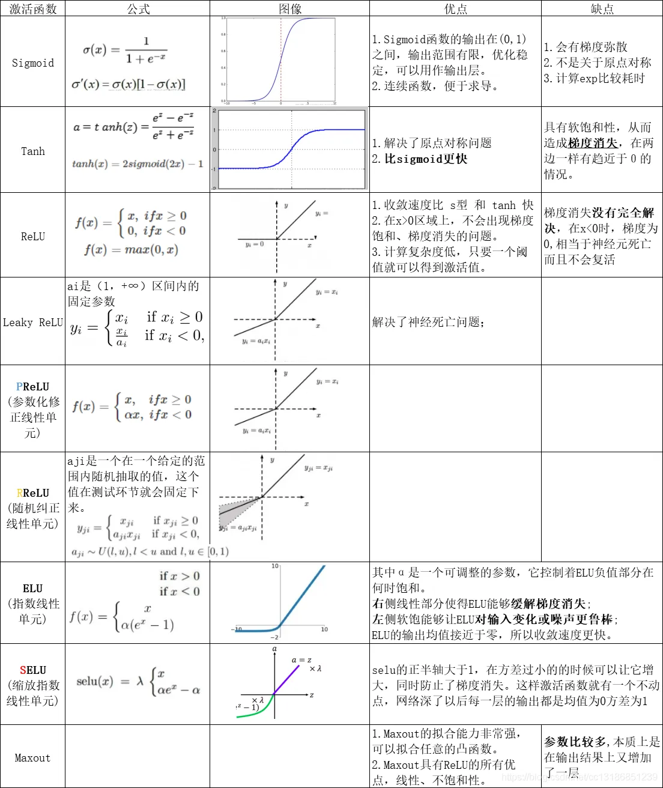

#### 1.7.3 为什么 ReLU 常用作激活函数

ReLU 定义为 \(f(x)=\max(0,x)\)，常用于深层神经网络，主要原因包括：

1. **计算简单**：前向传播和反向传播的计算开销都小于 Sigmoid、Tanh。
2. **缓解梯度消失**：当 \(x>0\) 时导数为 1，不容易像饱和激活函数那样使梯度快速衰减。
3. **产生稀疏激活**：负半区输出为 0，部分神经元会处于非激活状态。
4. **通常更容易优化**：实践中往往比 Sigmoid、Tanh 收敛更快。

ReLU 的主要缺陷是**神经元死亡**：当神经元对所有输入都落在负半区时，输出和梯度会持续为 0，参数无法继续更新。常见改进方法是在负半区保留非零梯度：

- **Leaky ReLU**：负半区使用固定的小斜率，例如 \(f(x)=\max(ax,x)\)，其中 \(a=0.01\)。
- **PReLU**：负半区斜率 \(a\) 是可学习参数。
- **ELU**：负半区使用平滑的指数函数，使输出更加平滑。

### 1.8 常见神经网络结构

#### 1.8.1 全连接、卷积与循环结构

| 网络 | 连接方式 | 适合处理的数据 |
|------|----------|----------------|
| 全连接前馈网络（Dense MLP） | 相邻层完全连接，计算图中不包含循环 | 固定长度的特征向量 |
| CNN（卷积神经网络） | 使用局部连接和权值共享提取空间局部特征，通常也是前馈网络 | 图像、视频等网格数据 |
| RNN（循环神经网络） | 隐状态沿时间步循环传递，在不同时刻之间共享参数 | 文本、语音、时间序列 |

“前馈”描述信息是否沿无环计算图传播，“全连接、卷积、循环”描述层之间采用什么连接方式。因此，前馈不是与 CNN 并列互斥的类别；一个 CNN 通常同时属于前馈网络。

#### 1.8.2 权值共享

权值共享是指同一组参数在不同位置或时间步重复使用：

- **CNN**：同一个卷积核扫描整张图像，不因空间位置变化而改变参数。例如，一个 \(3\times3\times1\) 卷积核的 9 个参数会被图像中的所有局部区域共享。
- **RNN**：同一组状态转移参数在不同时间步重复使用。

权值共享能够减少参数数量，并使网络利用数据中的空间或时间结构。CNN 和 RNN 的具体机制将在后续章节展开。

### 1.9 神经网络的应用范围

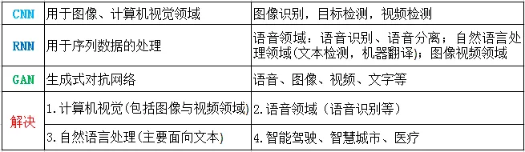

神经网络常用于计算机视觉、自然语言处理、语音处理、时间序列和生成建模等任务。具体采用哪种网络结构，取决于输入数据的结构和任务目标。

### 1.10 本章小结

- 浅层神经网络包含一个隐藏层，通过“仿射变换 + 非线性激活”表示非线性函数。
- 网络结构定义一族函数，参数决定具体函数；训练负责寻找参数，推理负责使用参数计算输出。
- 单输入 ReLU 浅层网络产生连续分段线性函数；隐藏单元决定潜在拐点，激活模式决定各区域的斜率。
- 多维输入中，每个隐藏单元定义一个激活边界超平面，不同激活模式形成凸多胞体线性区域。
- 通用近似定理描述模型的表示能力，但不保证模型一定能够被成功训练或获得良好泛化。
- 前馈描述连接中没有环，全连接描述相邻层的连接密度，两者不是同一个概念。
- 全连接、卷积和循环结构采用不同的参数连接与共享方式，分别适应不同的数据结构。
- “神经元”只是对生物神经元的类比，人工神经网络并不等同于生物神经系统。
- 发展简史：M-P 神经元（1943）→ 感知机 Perceptron（1958）→ 反向传播 Backpropagation（1986）推动 MLP 真正可训练。

## 2. 深度神经网络

### 2.1 概述

- **深度网络定义**：含 **2 个及以上隐藏层** 的神经网络。每一层接收前一层的输出，并继续进行“仿射变换 + 非线性激活”。
- **核心思想**：通过逐层组合简单函数，学习从低级特征到高级特征的分层表示。
- **与浅层网络的关系**：浅层和深层网络都可以通过增加参数提升表达能力；深度网络的优势在于，某些复杂函数可以通过多层组合更高效地表示。

### 2.2 从组合浅层网络到深度网络

#### 2.2.1 组合两个浅层网络

把两个浅层网络串起来：第一个网络的输出 \(y\) 作为第二个网络的输入。

- 第一个网络：\( h_1 = a[\theta_{10} + \theta_{11} x] \)、\( h_2 = a[\theta_{20} + \theta_{21} x] \)、\( h_3 = a[\theta_{30} + \theta_{31} x] \)，输出 \( y = \phi_0 + \phi_1 h_1 + \phi_2 h_2 + \phi_3 h_3 \)。
- 第二个网络对 \(y\) 再做一次「线性变换 + 激活」，得到最终输出。
- **空间变换过程**：第一个网络先“折叠”输入空间，第二个网络再在折叠后的空间上进行变换，从而产生更复杂的函数。

组合两个浅层网络，本质上就是一个包含两个隐藏层的深度网络。继续重复这种组合，就得到具有更多隐藏层的深度网络。

#### 2.2.2 为什么每层都需要非线性激活

如果两层之间没有激活函数，那么连续两次仿射变换仍然可以合并成一次仿射变换：

$$
\mathbf{W}_2(\mathbf{W}_1\mathbf{x}+\mathbf{b}_1)+\mathbf{b}_2
= (\mathbf{W}_2\mathbf{W}_1)\mathbf{x}+(\mathbf{W}_2\mathbf{b}_1+\mathbf{b}_2)
$$

因此，仅增加线性层不会提升网络的非线性表达能力。激活函数使每一层都能对上一层的表示进行非线性变换，这才是网络加深后能够表示复杂函数的关键。

### 2.3 网络结构与超参数

设深度网络包含 \(K\) 个隐藏层，第 \(k\) 层的隐藏单元数为 \(D_k\)：

| 概念 | 含义 |
|------|------|
| 深度 depth | 隐藏层数量 \(K\) |
| 宽度 width | 各隐藏层的单元数 \(D_1,D_2,\ldots,D_K\) |
| 模型参数 parameters | 训练过程中学习得到的权重和偏置 |
| 超参数 hyperparameters | 训练前确定的网络深度、宽度、激活函数等配置 |
| 模型容量 capacity | 网络能够表示的函数范围，与深度、宽度、参数数量和网络结构共同相关 |

深度和宽度决定网络的基本结构，但模型容量不能简单等同于隐藏单元总数。不同连接方式和参数共享策略，即使参数数量相同，也可能具有不同的表达能力。

### 2.4 矩阵表示

#### 2.4.1 单层表示

逐个写隐藏单元公式很繁琐，用矩阵/向量统一表示：

$$ \mathbf{h} = a[\boldsymbol{\beta} + \boldsymbol{\Omega} \mathbf{x}] $$

其中：

- \(\mathbf{x}\in\mathbb{R}^{D_i}\) 是输入向量。
- \(\boldsymbol{\Omega}\in\mathbb{R}^{D\times D_i}\) 是权重矩阵。
- \(\boldsymbol{\beta}\in\mathbb{R}^{D}\) 是偏置向量。
- \(a[\cdot]\) 表示对向量中的每个元素应用激活函数。

#### 2.4.2 多层网络的一般公式

令 \(\mathbf{h}_0=\mathbf{x}\)，含 \(K\) 个隐藏层的深度网络可以写为：

$$
\mathbf{h}_k
=a\!\left[\boldsymbol{\beta}_{k-1}
+\boldsymbol{\Omega}_{k-1}\mathbf{h}_{k-1}\right],
\quad k=1,\ldots,K
$$

$$
\mathbf{y}=\boldsymbol{\beta}_K+\boldsymbol{\Omega}_K\mathbf{h}_K
$$

即网络在隐藏层中交替执行“仿射变换 + 激活函数”，最后由输出层得到预测结果。全部可学习参数记为：

$$
\phi=\{\boldsymbol{\beta}_0,\ldots,\boldsymbol{\beta}_K,
\boldsymbol{\Omega}_0,\ldots,\boldsymbol{\Omega}_K\}
$$

### 2.5 浅层网络与深度网络

#### 2.5.1 函数逼近能力

足够宽的浅层网络可以任意逼近紧致集上的连续函数，深度网络同样具备这种能力。因此，两者的关键区别不是“能否表示”，而是表示某些函数时所需的网络规模和参数效率。

#### 2.5.2 线性区域与参数效率

以单输入、单输出的 ReLU 网络为例：

- **浅层网络**：\(D\) 个隐藏单元最多产生 \(D+1\) 个线性区域，参数数量为 \(3D+1\)。
- **深度网络**：\(K\) 个隐藏层、每层 \(D\) 个单元，在合适的参数构造下，线性区域数量可以随深度呈指数级增长；参数数量为 \(3D+1+(K-1)D(D+1)\)。

这说明增加深度可能以相对较少的参数产生大量线性区域，但这是对表达能力的理论分析，不代表训练过程一定能够找到这样的参数配置。

#### 2.5.3 深度效率

某些函数可以由较小的深度网络表示，但若使用浅层网络逼近，则需要指数级更多的隐藏单元。这种现象称为**深度效率（depth efficiency）**。

深度效率说明了深层组合的潜在优势，但相关结论通常针对特定函数或理论构造，不能直接推出“网络越深越好”。

#### 2.5.4 大型结构化输入

全连接网络处理图像、序列等大型结构化输入时，往往需要大量参数，而且没有显式利用数据的空间或时间结构。因此，实际系统会采用卷积、循环、注意力和参数共享等专用结构。

### 2.6 训练与泛化

- **表达能力不等于可训练性**：网络能够表示某个函数，不代表优化算法一定能够找到对应参数。
- **深度会增加优化难度**：层数增加后，可能出现梯度消失、梯度爆炸和训练不稳定等问题。
- **过参数化可能有助于优化**：较大的网络通常存在更多可行解，但也会增加计算和存储成本。
- **泛化能力并非只由深度决定**：训练数据、网络结构、正则化、优化算法和训练策略都会影响测试性能。

因此，网络深度是一种结构选择，而不是衡量模型优劣的单一标准。后续章节将分别讨论优化、梯度、正则化以及具体网络结构。

### 2.7 本章小结

- 深度网络通过重复组合“仿射变换 + 非线性激活”构造复杂函数。
- 没有非线性激活时，多层仿射变换仍然等价于单层仿射变换。
- 深度、宽度和连接结构共同影响模型容量；权重与偏置是训练得到的模型参数。
- 深度网络可以用较少参数高效表示某些复杂函数，但理论表达能力不等于实际训练效果。
- 网络是否易于训练、能否良好泛化，还取决于数据、初始化、优化和正则化等因素。

## 3. 损失函数

> 本章对应 UDL（Understanding Deep Learning, Simon Prince）第 5 章「Loss functions」。

### 3.1 概述

- **视角转换**：前几章把神经网络看作直接从输入 \( \mathbf{x} \) 预测输出 \( \mathbf{y} \) 的函数；本章改为把网络看作「**计算输出空间上的概率分布参数 \( \boldsymbol{\theta} \)**」的函数，损失函数描述模型预测与真实标签之间的不吻合程度。
- **核心任务**：在给定训练集 \( \{\mathbf{x}_i, \mathbf{y}_i\}_{i=1}^{I} \) 上找参数 \( \hat{\phi} = \arg\min_\phi L[\phi] \)，衡量「模型对训练数据的拟合有多差」。
- **统一套路（3.3 节 recipe）**：① 选定定义在输出域上的概率分布 \( Pr(\mathbf{y} \mid \boldsymbol{\theta}) \)；② 让网络 \( \mathbf{f}[\mathbf{x}, \phi] \) 预测该分布的一个或多个参数 \( \boldsymbol{\theta} \)；③ 用**负对数似然**作为损失函数训练网络；④ 推理时取分布的最大值或返回整个分布。
- **常见损失一览**：回归（均方误差、异方差回归）、二分类（二元交叉熵）、多分类（多元交叉熵）、多输出（独立分布相乘 → 损失求和）、其他分布（泊松、贝塔、von Mises、混合高斯等）。

这里需要区分三个层次：**网络参数** \(\phi\) 是训练时要学习的权重和偏置；**分布参数** \(\boldsymbol{\theta}\) 描述给定输入时的输出分布，例如正态分布的 \(\mu,\sigma^2\)；**预测值** \(\hat{y}\) 则是推理时从该分布中提取的点估计。网络参数 \(\phi\) 对所有样本共享，而分布参数 \(\boldsymbol{\theta}_i=f[\mathbf{x}_i,\phi]\) 可以随输入变化。

> 概率建模思路：把“预测一个值”扩展为“预测一个分布”。网络负责给出分布参数，输出的取值范围和分布形状由所选择的概率分布决定。这样面对不同输出类型时，可以调整概率分布及其参数化方式，而不必改变最大似然训练的整体框架。

#### 3.1.1 Loss、Cost 与 Objective

这些术语在工程中经常混用，但严格区分有助于看清训练目标：

1. **单样本损失（Loss）**衡量一个预测与真实标签之间的不吻合程度：

   $$
   \ell_i(\phi)
   =
   \ell\!\left(
   y_i,
   f(\mathbf{x}_i,\phi)
   \right)
   $$

2. **数据代价（Cost）**汇总一个批次或整个训练集上的单样本损失，例如批量平均：

   $$
   C(\phi)
   =
   \frac{1}{B}
   \sum_{i=1}^{B}
   \ell_i(\phi)
   $$

3. **目标函数（Objective）**是优化器最终处理的函数，除数据代价外还可以包含正则项或其他约束：

   $$
   J(\phi)
   =
   C(\phi)
   +
   \lambda R(\phi)
   $$

其中，\(R(\phi)\) 可以是 L1、L2 等正则项，\(\lambda\) 控制正则强度。没有正则项时，Cost 与 Objective 可以相同；深度学习框架也常把一个批次的汇总结果直接称为 loss，所以阅读公式和代码时应确认它具体指哪一层。

损失函数规定“模型怎样算错”，优化器负责寻找使目标函数下降的参数，评估指标则衡量最终任务表现。例如模型可以用交叉熵训练，却用准确率、F1 或 AUC 评估；评估指标不一定适合直接求梯度。

> 记忆：**Loss 看单个预测，Cost 汇总数据误差，Objective 才是包含正则项在内的最终优化目标。**

### 3.2 最大似然

#### 3.2.1 模型视角：从「预测值」到「预测分布」

- 直接预测：\( \mathbf{y} = \mathbf{f}[\mathbf{x}, \phi] \)（给定 \( \mathbf{x} \) 得到一个确定的 \( \mathbf{y} \)）。
- 概率化预测：网络输出分布参数 \( \boldsymbol{\theta} = \mathbf{f}[\mathbf{x}, \phi] \)，再代入选定的分布形式得到 \( Pr(\mathbf{y} \mid \mathbf{f}[\mathbf{x}, \phi]) \)。离散输出对应概率质量，连续输出严格来说对应概率密度；为保持符号简洁，本章统一使用 \(Pr(\cdot)\) 表示。
- 例：预测域 \( y \in \mathbb{R} \) 时可取**单变量正态分布**，参数 \( \boldsymbol{\theta} = \{\mu, \sigma^2\} \)；网络可只预测均值 \( \mu \)，方差视为常数（也可学习，见 3.4 节）。

#### 3.2.2 最大似然准则

- 假设：① 各数据点使用同一个条件分布族，但分布参数可以随输入变化；② 给定各自输入后，不同样本的输出**条件独立**。于是整集似然分解为：

$$
Pr(\mathbf{y}_1, \ldots, \mathbf{y}_I \mid \mathbf{x}_1, \ldots, \mathbf{x}_I) = \prod_{i=1}^{I} Pr(\mathbf{y}_i \mid \mathbf{x}_i)
$$

- 选参数使训练数据「最像由该模型生成」：

$$
\hat{\phi} = \underset{\phi}{\operatorname{argmax}} \left[ \prod_{i=1}^{I} Pr(\mathbf{y}_i \mid \mathbf{f}[\mathbf{x}_i, \phi]) \right] = \underset{\phi}{\operatorname{argmax}} \left[ \prod_{i=1}^{I} Pr(\mathbf{y}_i \mid \boldsymbol{\theta}_i) \right]
$$

- 这就是**最大似然准则（maximum likelihood criterion）**——整集乘积称为**似然（likelihood）**。同一个表达式作为观测值的函数时是概率质量或概率密度，作为参数 \(\phi\) 的函数时称为似然；似然不是关于参数的概率分布，不要求对参数积分或求和为 1。

#### 3.2.3 取对数：求和代替连乘

- 直接做「连乘」在浮点精度下很快下溢（很多小数相乘 = 0）。
- 利用 \( \log \) 单调递增的性质，最大化似然 ⟺ 最大化**对数似然**：

$$
\hat{\phi} = \underset{\phi}{\operatorname{argmax}} \sum_{i=1}^{I} \log\left[ Pr(\mathbf{y}_i \mid \mathbf{f}[\mathbf{x}_i, \phi]) \right]
$$

- 求和形式在数值计算与梯度下降中都更稳定，且不改变极值点位置。

#### 3.2.4 最小化负对数似然

- 惯例上把「最大化」翻成「最小化」：取负号、变 argmin，得到**负对数似然损失**：

$$
L[\phi] = -\sum_{i=1}^{I} \log\left[ Pr(\mathbf{y}_i \mid \mathbf{f}[\mathbf{x}_i, \phi]) \right]
$$

- 后续所有具体损失（二元/多元交叉熵、最小二乘等）都是该式在不同分布下的特例。

#### 3.2.5 推理：取分布的峰值

- 训练后网络不再直接给一个 \( \mathbf{y} \)，而给一个分布 \( Pr(\mathbf{y} \mid \mathbf{f}[\mathbf{x}, \hat{\phi}]) \)。
- 想要点估计时取**分布最大处**（mode）：

$$
\hat{\mathbf{y}} = \underset{\mathbf{y}}{\operatorname{argmax}}\; Pr(\mathbf{y} \mid \mathbf{f}[\mathbf{x}, \hat{\phi}])
$$

- 例：单变量正态分布的 mode 即均值 \( \mu \)，所以 \( \hat{y} = \mathbf{f}[\mathbf{x}, \hat{\phi}] \)。

取众数是本章采用的点估计规则，但不是唯一选择：平方误差下常用条件均值，绝对误差下常用条件中位数，分类任务常取最大后验类别。分布不对称或具有多个峰值时，均值、中位数和众数可能不同；若任务关心风险或不确定性，应返回分位数、预测区间或完整分布，而不是只返回一个值。

### 3.3 构建损失函数的通用步骤（recipe）

构建损失函数的核心不是先从 MSE、交叉熵等名称中挑一个，而是从预测目标的取值范围出发，建立一个完整的概率模型：

$$
\mathbf{x}
\xrightarrow{f[\cdot,\phi]}
\mathbf{z}
\xrightarrow{g(\cdot)}
\boldsymbol{\theta}
\longrightarrow
Pr(y\mid\boldsymbol{\theta})
\longrightarrow
-\log Pr(y\mid\boldsymbol{\theta})
$$

这条链路中包含三类不同的量：

- \(\phi\)：网络内部共享的权重和偏置，是训练要学习的**模型参数**；
- \(\mathbf{z}=f[\mathbf{x},\phi]\)：网络针对当前输入产生的**原始输出**；
- \(\boldsymbol{\theta}=g(\mathbf{z})\)：经过约束变换后得到的**分布参数**。

训练过程调整的是 \(\phi\)，但损失函数直接评价的是：由 \(\phi\) 计算出的分布参数 \(\boldsymbol{\theta}\)，是否给真实标签 \(y\) 分配了足够高的概率或概率密度。

#### 3.3.1 明确预测目标的取值范围

首先确定目标 \(y\) 的取值范围，也就是输出域。例如，它可能是任意实数、二元标签、多个互斥类别、非负数或整数计数。损失函数必须与输出域匹配，不能用定义在实数域上的普通正态分布直接描述类别标签。

这里关注的是**要预测的目标值是什么**，而不是输入 \(\mathbf{x}\) 是图像、文本还是表格。同一种输入数据，在不同任务中可能对应完全不同的输出域和损失函数。

#### 3.3.2 选择定义在输出域上的分布

接着选择条件分布：

$$
Pr(y\mid\boldsymbol{\theta})
$$

该分布必须定义在目标的取值范围上。分布参数 \(\boldsymbol{\theta}\) 决定分布的位置、尺度或各类别的概率。选择分布也等于写下关于数据的假设，例如误差是否对称、方差是否固定、输出是否互斥以及输出之间是否独立。

#### 3.3.3 确定网络要预测的分布参数

网络不一定直接输出最终预测值，而是输出计算分布参数所需的原始数值：

$$
\mathbf{z}=f[\mathbf{x},\phi]
$$

然后通过参数变换 \(g(\cdot)\) 得到合法的分布参数：

$$
\boldsymbol{\theta}=g(\mathbf{z})=g(f[\mathbf{x},\phi])
$$

因为网络原始输出通常是无约束实数，而分布参数可能存在约束，所以 \(g(\cdot)\) 要根据参数含义选择：

- 无约束的位置参数可以使用恒等变换；
- 位于 \((0,1)\) 的概率可以使用 Sigmoid；
- 总和为 1 的概率向量可以使用 Softmax；
- 必须为正的尺度、方差或事件率可以使用指数函数或 Softplus。

因此，“网络输出概率”是简略说法。更准确地说，是网络先输出无约束数值，再把它转换成合法的分布参数。

#### 3.3.4 用真实标签计算单样本损失

对一条训练样本 \((\mathbf{x}_i,y_i)\)，网络先得到分布参数：

$$
\boldsymbol{\theta}_i=g(f[\mathbf{x}_i,\phi])
$$

其中 \(g(\cdot)\) 表示 Sigmoid、Softmax、Softplus 或恒等变换。然后计算真实标签在该分布下的概率质量或概率密度：

$$
Pr(y_i\mid\boldsymbol{\theta}_i)
$$

这个值越大，表示当前模型给真实标签分配的概率或概率密度越高。取负对数后得到单样本损失：

$$
\ell_i(\phi)=-\log Pr(y_i\mid\boldsymbol{\theta}_i)
$$

如果模型给真实标签较高的可能性，损失较小；如果模型给真实标签很低的可能性，损失较大。

#### 3.3.5 汇总样本损失并训练模型

整个批次或训练集的损失通常取平均：

$$
L(\phi)=\frac{1}{I}\sum_{i=1}^{I}\ell_i(\phi)
=-\frac{1}{I}\sum_{i=1}^{I}\log Pr(y_i\mid\boldsymbol{\theta}_i)
$$

负对数似然具有三个作用：

1. 负号把“最大化似然”变成优化器熟悉的“最小化损失”；
2. 对数把所有样本的概率连乘变成损失相加；
3. 模型给真实标签的可能性越低，受到的惩罚越大。

优化器通过最小化 \(L(\phi)\) 更新网络参数，训练结束后得到 \(\hat{\phi}\)。损失函数负责规定“什么样的预测更好”，优化算法负责寻找能使损失降低的参数，两者职责不同。

#### 3.3.6 Reduction、样本权重与 Mask

框架通常提供三种损失汇总方式（Reduction）：

| 方式 | 返回结果 | 主要用途 |
| --- | --- | --- |
| **none** | 保留每个样本或位置的损失 | 自定义权重、Mask 或难例分析 |
| **sum** | 对有效损失求和 | 需要累积总负对数似然，或自行控制归一化 |
| **mean** | 对有效损失取平均 | 让梯度尺度较少受批量大小影响，是常见默认值 |

对于样本权重 \(a_i\geq0\) 和有效位置掩码 \(m_i\in\{0,1\}\)，一个统一的加权平均写法是：

$$
L(\phi)
=
\frac{
\sum_i m_i a_i\ell_i(\phi)
}{
\sum_i m_i a_i
}
$$

其中：

- **样本权重**可表达样本重要性、类别代价或采样概率修正；
- **Mask**用于排除 Padding、缺失标签和不参与训练的位置；
- 分母应与分子使用相同的有效权重，不能先把无效位置的损失置 0，再除以包含 Padding 的固定长度；
- 若一个样本内部包含多个 Token、像素或目标，还要明确是“每个位置等权”还是“每个样本等权”，两者会产生不同训练目标。

使用 sum 时，批量越大，梯度通常也越大；使用 mean 时，梯度尺度相对稳定。在梯度累积、分布式训练或动态批量中，需要确认框架在本地批次和全局批次上怎样归一化，否则改变设备数或序列长度可能等价于改变学习率。

类别加权不是单纯的数值技巧，它会改变模型重点优化的数据分布和错误代价。因此加权后的输出不一定仍代表原始数据分布下的后验概率，必要时应在未加权的验证分布上重新校准。

#### 3.3.7 根据分布完成推理

训练完成后得到的是共享的网络参数 \(\hat{\phi}\)。对一个新输入 \(\mathbf{x}\)，推理过程是：

$$
\mathbf{x}
\xrightarrow{f[\cdot,\hat{\phi}]}
\mathbf{z}
\xrightarrow{g(\cdot)}
\boldsymbol{\theta}
\longrightarrow
Pr(y\mid\boldsymbol{\theta})
\longrightarrow
\text{最终预测}
$$

最终返回什么由任务决定：回归可以返回均值和预测区间，二分类可以返回正类概率或阈值化标签，多分类可以返回完整概率向量或概率最大的类别。

到这里，3.3 节只建立了通用方法，还没有指定具体分布。接下来的 3.4 至 3.6 节依次代入正态分布、伯努利分布和类别分布，从同一套步骤分别推导出回归、二分类和多分类损失。

### 3.4 示例 1：单变量回归（univariate regression）

#### 3.4.1 正态分布 → 最小二乘

- 任务：预测实值 \( y \in \mathbb{R} \)；选**单变量正态分布**：

$$
Pr(y \mid \mu, \sigma^2) = \frac{1}{\sqrt{2\pi\sigma^2}} \exp\left[ -\frac{(y-\mu)^2}{2\sigma^2} \right]
$$

- 网络只预测均值 \( \mu = \mathrm{f}[\mathbf{x}, \phi] \)，把负对数似然展开：

$$
L[\phi] = -\sum_{i=1}^{I} \log\left[ \frac{1}{\sqrt{2\pi\sigma^2}} \exp\left[ -\frac{(y_i - \mathrm{f}[\mathbf{x}_i, \phi])^2}{2\sigma^2} \right] \right]
$$

- 当 \(\sigma^2\) 是固定常数时，去掉与 \( \phi \) 无关的常数项和正常数因子，得到**平方误差和**（sum of squared errors，SSE）：

$$
L[\phi] = \sum_{i=1}^{I} \big(y_i - \mathrm{f}[\mathbf{x}_i, \phi]\big)^2
$$

- 若再除以样本数 \(I\)，就是均方误差（MSE）。SSE 与 MSE 只相差正常数因子，因此具有相同的最优参数，但损失值和梯度尺度不同。在“预测正态分布均值，且观测在给定输入后独立、方差固定”的假设下，最小化 SSE 或 MSE 与最大化似然得到相同的最优解。

#### 3.4.2 推理

- 训练好的网络对输入 \( \mathbf{x} \) 给出均值 \( \mu = \mathrm{f}[\mathbf{x}, \hat{\phi}] \)；如果方差也参与学习，还会得到 \(\hat{\sigma}^2\)。
- 点估计取正态分布的众数，即均值 \( \hat{y} = \mathrm{f}[\mathbf{x}, \hat{\phi}] \)。

#### 3.4.3 同时估计方差

- 上式最小化时 \( \sigma^2 \) 已被吸收为常数（不影响最优 \( \phi \)），但我们可以**把 \( \sigma^2 \) 也作为可学参数**：

$$
\hat{\phi}, \hat{\sigma}^2 = \underset{\phi, \sigma^2}{\operatorname{argmin}}\; L[\phi, \sigma^2]
$$

- 推理时除点预测外还得到一个共享的噪声尺度 \(\hat{\sigma}^2\)。它描述当前概率模型中的**条件输出方差**，主要对应数据噪声或不可约不确定性（aleatoric uncertainty），不应直接称为模型置信度，也不包含由参数、数据覆盖不足等导致的认知不确定性（epistemic uncertainty）。

#### 3.4.4 异方差回归（heteroscedastic regression）

- 现实中噪声往往**随输入变化**（例：低 \( x \) 时数据紧凑，高 \( x \) 时数据发散）。
- 解决方案：让网络**同时输出均值和方差**：

$$
\mu_i = \mathrm{f}_\mu[\mathbf{x}_i, \phi],
\qquad
s_i = \mathrm{f}_s[\mathbf{x}_i, \phi],
\qquad
\sigma_i^2=\operatorname{softplus}(s_i)+\epsilon
$$

- PDF 使用 \(\sigma_i^2=\mathrm{f}_2[\mathbf{x}_i,\phi]^2\) 保证方差非负。实际实现更常预测对数方差，或用 Softplus 加上很小的 \(\epsilon>0\)，以保证方差严格为正并改善数值稳定性。
- 用均值和方差表示时，忽略常数项后的损失为：

$$
L[\phi] = \frac{1}{2}\sum_{i=1}^{I}\left[\log\sigma_i^2+\frac{(y_i-\mu_i)^2}{\sigma_i^2}\right]
$$

- 第一项防止模型通过无限增大方差逃避误差，第二项按预测方差缩放残差。对比同方差模型，异方差模型能随输入给出不同的条件输出方差，但它仍主要描述 aleatoric uncertainty。

#### 3.4.5 MSE、MAE、Huber 与 Pinball Loss

令回归残差为：

$$
r=y-\hat y
$$

常见回归损失可以从“怎样惩罚不同大小和方向的误差”来比较：

| 损失 | 单样本形式 | 主要特点 |
| --- | --- | --- |
| **MSE** | \(r^2\) | 大误差受到平方级惩罚；梯度平滑，但对异常值敏感 |
| **MAE** | \(\lvert r\rvert\) | 对异常值更稳健；在 \(r=0\) 处不可导，但可使用次梯度优化 |
| **Huber Loss** | 小误差用平方，大误差用绝对值 | 兼顾 MSE 的平滑性和 MAE 的稳健性 |
| **Pinball Loss** | 对高估和低估施加不对称惩罚 | 用于估计指定条件分位数 |

Huber Loss 的阈值为 \(\delta>0\)：

$$
\ell_\delta(r)
=
\begin{cases}
\dfrac{1}{2}r^2,
&\lvert r\rvert\leq\delta \\
\delta\left(\lvert r\rvert-\dfrac{1}{2}\delta\right),
&\lvert r\rvert>\delta
\end{cases}
$$

小残差区域保留平方损失的平滑梯度，大残差区域只线性增长，从而降低异常值的影响。Smooth L1 与 Huber Loss 形式接近，但不同框架对缩放因子和阈值参数的定义可能不同，不能只根据名称假设数值完全一致。

预测 \(\tau\in(0,1)\) 条件分位数时，Pinball Loss 为：

$$
\ell_\tau(y,\hat y)
=
\begin{cases}
\tau(y-\hat y),
&y\geq\hat y \\
(1-\tau)(\hat y-y),
&y<\hat y
\end{cases}
$$

当 \(\tau=0.5\) 时，它与 MAE 只相差固定比例，最优解是条件中位数；当 \(\tau=0.9\) 时，低估真实值受到更重惩罚，模型学习条件 90% 分位数。分别预测多个分位数可以构造预测区间，但需要检查低分位数是否超过高分位数的分位数交叉问题。

从概率角度看：

- 固定方差正态噪声的负对数似然对应 MSE；
- Laplace 噪声的负对数似然对应 MAE；
- 非对称 Laplace 分布可以联系到 Pinball Loss；
- Huber Loss 可以理解为人为组合小误差和大误差区域的稳健目标，不必强行要求每个实用损失都来自简单似然。

损失的阈值和误差大小依赖目标尺度。若对目标做标准化或对数变换，Huber 的 \(\delta\) 和业务可接受误差也要在相应尺度上重新解释。

### 3.5 示例 2：二分类（binary classification）

- 任务：\( y \in \{0, 1\} \)；选**伯努利分布**：

$$
Pr(y \mid \lambda) = \begin{cases} 1 - \lambda & y = 0 \\ \lambda & y = 1 \end{cases}
$$

- 网络先输出一个无约束实数 \(z=\mathrm{f}[\mathbf{x},\phi]\)，称为 **Logit**；再通过 Logistic Sigmoid 得到伯努利参数 \(\lambda=Pr(y=1\mid\mathbf{x})\)：

$$
\mathrm{sig}[z] = \frac{1}{1 + \exp[-z]}, \quad \lambda = \mathrm{sig}\!\left[\mathrm{f}[\mathbf{x}, \phi]\right]
$$

- 负对数似然化简为**二元交叉熵（binary cross-entropy）**：

$$
L[\phi] = \sum_{i=1}^{I} \Big\{ -(1 - y_i) \log\!\left[1 - \mathrm{sig}[\mathrm{f}[\mathbf{x}_i, \phi]]\right] - y_i \log\!\left[\mathrm{sig}[\mathrm{f}[\mathbf{x}_i, \phi]]\right] \Big\}
$$

- 推理：若两类误判代价相同，且 \(\lambda\) 是校准后的后验概率，则以 \(0.5\) 为阈值可最小化分类错误率。类别不平衡本身不会改变这个结论，因为类别先验已经包含在后验概率中；但若采用重采样或类别加权使输出不再代表原始后验概率，误判代价不同，或者业务目标强调精确率、召回率等其他指标，就应在验证集上选择阈值。

实际代码应优先使用直接接收 Logit 的数值稳定实现，例如 PyTorch 的 `BCEWithLogitsLoss`，而不是先计算 Sigmoid 再手动取对数。

#### 3.5.1 类别不平衡与加权交叉熵

设正类概率为 \(p\)，正负类别权重分别为 \(w_+\) 和 \(w_-\)，加权二元交叉熵为：

$$
\ell(y,p)
=
-w_+y\log p
-w_-(1-y)\log(1-p)
$$

提高 \(w_+\) 会让正类被错分时产生更大的梯度，通常有助于提高正类 Recall，但也可能增加误报。权重可以来自业务误判成本、采样概率修正或训练集类别频率，三者含义不同：

- **业务代价权重**：表达漏报和误报的真实成本；
- **类别平衡权重**：降低多数类在总损失中的支配作用；
- **逆采样概率权重**：在下采样后估计原始数据分布下的风险。

不能仅因正类比例为 1% 就机械设置 \(w_+=100\)。类别权重、决策阈值和评估指标需要一起根据验证集及业务成本确定。加权或重采样还可能改变输出概率的含义，因此既要评估 PR-AUC、Recall 等分类能力，也要检查 Log Loss、Brier Score 和校准曲线。

多分类任务可以给每个真实类别 \(k\) 设置权重 \(w_k\)：

$$
\ell_i
=
-w_{y_i}\log p_{i,y_i}
$$

这会整体放大该类别样本的梯度，但不能解决标签错误、类别内部覆盖不足或极端少样本本身的信息缺失。

#### 3.5.2 Focal Loss

当大量容易分类的多数类样本占据训练信号时，Focal Loss 会降低易分类样本的权重。定义：

$$
p_t=
\begin{cases}
p,&y=1\\
1-p,&y=0
\end{cases}
$$

二分类 Focal Loss 为：

$$
\operatorname{FL}(p_t)
=
-\alpha_t(1-p_t)^\gamma\log p_t
$$

其中：

- \(\alpha_t\) 调整类别权重；
- \(\gamma\geq0\) 是聚焦参数；
- 当样本已经容易分类、\(p_t\) 接近 1 时，\((1-p_t)^\gamma\) 会显著降低它的贡献；
- 当 \(\gamma=0\) 时，Focal Loss 退化为带 \(\alpha_t\) 权重的交叉熵。

Focal Loss 适合目标检测等“容易负样本非常多”的场景，但它不是所有类别不平衡问题的默认答案。过大的 \(\gamma\) 可能过度削弱容易样本，也可能让模型更关注错误标签和异常难例；其概率通常还需要额外校准。应把普通交叉熵、类别权重、重采样和 Focal Loss 放在相同数据划分下比较。

### 3.6 示例 3：多分类（multiclass classification）

- 任务：\( y \in \{1, 2, \ldots, K\},\; K>2 \)；选**类别分布（categorical）**：

$$
Pr(y = k) = \lambda_k, \quad \sum_{k=1}^{K} \lambda_k = 1,\quad \lambda_k \in [0,1]
$$

- 网络先输出 \(K\) 个无约束实数 \(\mathbf{z}=\mathrm{f}[\mathbf{x},\phi]\)，这些值称为 **Logits**。Softmax 再把它们转换为合法的类别概率分布：

$$
\mathrm{softmax}_k[\mathbf{z}] = \frac{\exp[z_k]}{\sum_{k'=1}^{K} \exp[z_{k'}]}
$$

- 负对数似然化简为**多元交叉熵（multiclass cross-entropy）**：

$$
L[\phi] = -\sum_{i=1}^{I} \left( \mathrm{f}_{y_i}[\mathbf{x}_i, \phi] - \log\left[ \sum_{k'=1}^{K} \exp\!\left[\mathrm{f}_{k'}[\mathbf{x}_i, \phi]\right] \right] \right)
$$

- 推理：\( \hat{y} = \arg\max_k Pr(y=k \mid \mathbf{f}[\mathbf{x}, \hat{\phi}]) \)，等价于取 softmax 输出最大的那一类。

Softmax 对所有 Logit 同时加上任意常数都不变，实际计算通常先减去最大 Logit，再计算指数，以避免数值溢出。训练时应优先使用直接接收 Logits 的交叉熵实现，它会把 Softmax 与对数合并为稳定的 Log-Softmax 计算。

#### 3.6.1 Sigmoid 与 Softmax

- **Sigmoid**：把一个实数压缩到 \([0,1]\)，适合二分类或多个相互独立的二元标签。
- **Softmax**：把 \(K\) 个实数转换为总和为 1 的概率向量，适合 \(K\) 个类别中恰好选择一个的多分类任务。

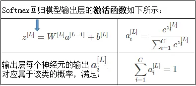

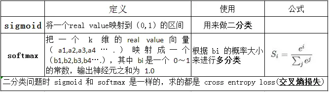

#### 3.6.2 软标签、标签平滑与知识蒸馏

交叉熵不要求目标一定是 One-Hot 标签。设目标分布为 \(q=(q_1,\ldots,q_K)\)，模型概率为 \(p=(p_1,\ldots,p_K)\)，一般形式为：

$$
H(q,p)
=
-\sum_{k=1}^{K}
q_k\log p_k
$$

One-Hot 标签只是 \(q\) 在真实类别位置为 1、其他位置为 0 的特殊情况。Mixup 的混合标签、多个标注者的投票比例和教师模型给出的概率都属于软标签。

**标签平滑（Label Smoothing）**把真实 One-Hot 分布 \(y\) 与均匀分布混合：

$$
q_k
=
(1-\varepsilon)y_k
+
\frac{\varepsilon}{K},
\qquad
0\leq\varepsilon<1
$$

它避免模型被训练成对单个类别无限自信，可以缓解过拟合和错误标注的影响。但标签平滑也会削弱类别间的相似性信息，并不保证概率校准一定改善。不同框架可能把 \(\varepsilon\) 分配给全部 \(K\) 类，或只分配给其余 \(K-1\) 类，使用时要确认具体定义。

**知识蒸馏（Knowledge Distillation）**让学生模型学习教师模型的软类别关系。温度 \(T>0\) 的 Softmax 为：

$$
p_k^{(T)}
=
\frac{\exp(z_k/T)}
{\sum_j\exp(z_j/T)}
$$

\(T>1\) 会让分布更平滑，暴露教师认为“哪些错误类别彼此相似”。常见蒸馏目标为：

$$
L
=
\alpha L_{\mathrm{hard}}
+
(1-\alpha)T^2
H\!\left(
q_{\mathrm{teacher}}^{(T)},
p_{\mathrm{student}}^{(T)}
\right)
$$

其中，\(L_{\mathrm{hard}}\) 使用真实标签，软目标分支使用同一个温度 \(T\)；乘 \(T^2\) 用于补偿温度导致的梯度尺度变化。教师输出在训练学生时应视为固定目标，不对教师反向传播。

> 记忆：**标签平滑注入统一的“不确定”，知识蒸馏传递教师学到的类别相似性。**

#### 3.6.3 预测其他数据类型

- 选什么分布由**预测值的值域**决定。下表给出常用对应关系：

| 数据类型 | 值域 | 常用分布 | 典型用途 |
|---------|------|---------|---------|
| 单变量、连续、无界 | \( y \in \mathbb{R} \) | 正态 | 回归 |
| 单变量、连续、无界（鲁棒） | \( y \in \mathbb{R} \) | Laplace / t 分布 | 鲁棒回归 |
| 单变量、连续、无界（多峰） | \( y \in \mathbb{R} \) | 高斯混合 | 多模态回归 |
| 单变量、连续、下有界 | \( y \in \mathbb{R}^+ \) | 指数 / Gamma | 预测量级 |
| 单变量、连续、有界 | \( y \in (0,1) \) | Beta | 预测比例（边界值需单独处理） |
| 多变量、连续、无界 | \( \mathbf{y} \in \mathbb{R}^K \) | 多元正态 | 多元回归 |
| 单变量、连续、循环 | \( y \in (-\pi, \pi] \) | von Mises | 预测方向 |
| 单变量、离散、二元 | \( y \in \{0,1\} \) | 伯努利 | 二分类 |
| 单变量、离散、多类 | \( y \in \{1,\ldots,K\} \) | 类别 | 多分类 |
| 单变量、离散、下有界 | \( y \in \{0,1,2,\ldots\} \) | 泊松 | 预测事件计数 |
| 多变量、离散、置换 | \( \mathbf{y} \in \mathrm{Perm}[1,\ldots,K] \) | Plackett-Luce | 排序 |

### 3.7 多个输出（multiple outputs）

- 真实任务常常一次要预测多个量：多元回归（同时预测熔点、沸点）、语义分割（每个像素一个类别）等。
- 简化做法：假设各输出**条件独立**，整集似然 = 各维似然之积，损失 = 各维损失之和：

$$
Pr(\mathbf{y} \mid \mathbf{f}[\mathbf{x}, \phi]) = \prod_{d} Pr(y_d \mid \mathbf{f}_d[\mathbf{x}, \phi]), \quad L[\phi] = -\sum_{i=1}^{I} \sum_{d} \log Pr(y_{id} \mid \mathbf{f}_d[\mathbf{x}_i, \phi])
$$

- 例：预测风向 + 风速 → 风向用 von Mises、风速用指数分布，**两个独立分布相乘**，取负对数后变成两项加和。
- 多个输出共享同一个神经网络并不代表它们在概率上独立；上式是在给定输入和共享表示后，额外假设各输出的条件分布可以分解。
- 若各项损失的数值尺度差异较大，直接相加可能使某个任务主导梯度。可以依据观测噪声、任务重要性或验证结果设置权重，但加权后也要明确它对应的概率解释。
- 进阶：可放弃条件独立假设，用带非对角协方差的多元正态、混合密度网络等**显式建模输出之间的相关性**。

### 3.8 交叉熵损失（cross-entropy loss）

- 前面的「负对数似然」从**最大化数据似然**出发；交叉熵则从经验分布与模型分布的差异出发。在使用经验标签分布训练分类模型时，两者对应同一个优化目标。
- 思路：找参数 \( \boldsymbol{\theta} \) 使「经验数据分布 \( q(y) \)」与「模型分布 \( p(y)=Pr(y \mid \boldsymbol{\theta}) \)」尽可能接近。这里用 **KL 散度（Kullback-Leibler divergence）**衡量两个分布之间的差异。

#### 3.8.1 KL 散度是什么

KL 散度衡量的是：**如果数据实际服从分布 \(q\)，却使用分布 \(p\) 来描述或编码数据，会额外损失多少信息。**因此也可以把它理解为“模型分布 \(p\) 相对目标分布 \(q\) 的不匹配程度”。

以三分类任务为例，某个样本的真实类别是第 1 类，则标签对应的目标分布为：

$$
q=[1,0,0]
$$

两个模型分别给出：

$$
p_A=[0.8,0.1,0.1],
\qquad
p_B=[0.2,0.4,0.4]
$$

模型 A 给真实类别分配了 \(0.8\) 的概率，比模型 B 的 \(0.2\) 更接近目标分布，所以 \(D_{KL}(q\|p_A)\) 更小。对于这种 One-hot 标签：

$$
D_{KL}(q\|p_A)=-\log 0.8\approx0.223
$$

$$
D_{KL}(q\|p_B)=-\log 0.2\approx1.609
$$

这也解释了为什么交叉熵会重点惩罚“给真实类别的概率很低”的预测。

对于离散分布，KL 散度定义为：

$$
D_{KL}(q\|p)=\sum_y q(y)\log\frac{q(y)}{p(y)}
$$

其中：

- \(q(y)\) 是目标或经验分布，表示数据实际如何分布；
- \(p(y)\) 是模型分布，表示模型认为数据如何分布；
- 比值 \(q(y)/p(y)\) 表示模型在结果 \(y\) 上低估或高估目标分布的程度；
- 权重 \(q(y)\) 表示只按目标分布真正重视的区域计算差异。

KL 散度具有以下性质：

1. \(D_{KL}(q\|p)\geq0\)；当两个分布几乎处处相同时取 0；
2. 它不对称，通常有 \(D_{KL}(q\|p)\neq D_{KL}(p\|q)\)，所以不是数学意义上的距离；
3. 如果某处 \(q(y)>0\) 而 \(p(y)=0\)，则 \(D_{KL}(q\|p)\) 会发散到无穷大，因为模型把真实可能发生的结果判为绝不可能。

对于连续分布，把求和换成积分：

$$
D_{KL}[q \,\|\, p] = \int_{-\infty}^{\infty} q(z) \log\frac{q(z)}{p(z)}\, dz = \underbrace{\int q(z)\log q(z)\, dz}_{\text{与 } \boldsymbol{\theta} \text{ 无关}} - \int q(z) \log p(z)\, dz
$$

#### 3.8.2 KL 散度为什么会得到交叉熵

KL 散度可以写成：

$$
D_{KL}(q\|p)=H(q,p)-H(q)
$$

其中：

- \(H(q,p)=-\mathbb{E}_{y\sim q}[\log p(y)]\) 是交叉熵，衡量用模型分布 \(p\) 描述来自 \(q\) 的数据所需的信息量；
- \(H(q)=-\mathbb{E}_{y\sim q}[\log q(y)]\) 是数据分布自身的熵。

训练过程中，经验分布 \(q\) 已由数据固定，因此 \(H(q)\) 不随模型参数变化。于是：

$$
\underset{p}{\operatorname{argmin}}\;D_{KL}(q\|p)
=
\underset{p}{\operatorname{argmin}}\;H(q,p)
$$

也就是说，当 \(q\) 和 \(p\) 都是同一输出域上的概率分布，且相关期望存在时，最小化 \(D_{KL}(q\|p)\) 与最小化交叉熵会得到相同的最优模型参数。

在离散分类中，可以用标签的经验频率或单样本 One-Hot 分布表示 \(q\)，经验交叉熵直接化为真实类别负对数概率的平均。对于连续输出，真实数据密度 \(q\) 通常未知，因此用独立样本的 Monte Carlo 平均估计交叉熵：

$$
-\frac{1}{I}
\sum_{i=1}^{I}
\log p_\phi(y_i\mid x_i)
\approx
-\mathbb{E}_{(x,y)\sim q}
\left[
\log p_\phi(y\mid x)
\right]
$$

右侧就是连续交叉熵 \(H(q,p_\phi)\)，左侧则是平均负对数似然。不能把有限连续样本组成的 Dirac 经验测度直接当作普通密度，再照搬微分熵公式；它通常相对于连续模型密度是奇异的，其微分熵和 KL 散度不能按上述普通密度公式直接计算。

- 所以，在数据分布固定、模型使用同一个条件概率分布时：
  - **负对数似然** = 最大化数据在模型下的似然；
  - **交叉熵** = 用模型分布描述真实数据分布的期望负对数概率；
  - **KL 散度** = 交叉熵减去与模型参数无关的数据分布熵。
- 交叉熵本身并不只用于分类；它定义在概率分布之间。工程语境中，“交叉熵损失”通常特指伯努利或类别分布对应的分类损失。
- 实务中，分类任务常说“交叉熵损失”，回归任务常说“平方误差损失”，两者都可以是特定分布假设下的负对数似然，但并非所有人为定义的损失都必须有概率解释。

### 3.9 扩展损失与补充说明

- **「最大似然」的两种说法**：作为 \( \mathbf{z} \) 的函数叫「概率分布」（要求和为 1）；作为参数 \( \boldsymbol{\psi} \) 的函数叫「似然」（一般不要求和为 1）。同一个式子，换个看法就有两套术语。
- **稳健概率模型**：3.4.5 已比较 MSE、MAE、Huber 与 Pinball Loss；若需要可调尾部厚度，还可以用 Student t 分布描述含异常值的连续输出。
- **表示学习损失**：度量学习中会使用对比损失、三元组损失或 Center Loss，分别约束样本对、相对距离或类内紧凑性。这些目标通常与分类损失组合使用。
- **学习排序（learning to rank）**：用 Plackett-Luce 分布建模整个候选列表的置换分布，常见三种视角——listwise（整列表）、pointwise（单个对象）、pairwise（对象对）。
- **其他常见损失**：SVM 使用 Hinge Loss，AdaBoost 使用 Exponential Loss；这些目标不一定具有直接的概率解释。
- **类别分布 vs 多元伯努利**：当 \( y \) 是「多个独立二元标签」时，分布是 \( K \) 个独立伯努利之积（多元伯努利），损失直接求和；当 \( y \) 是「\( K \) 类中恰好一类」时，分布是类别分布，损失用 softmax 后互斥归一化。两者公式长得像但语义不同。

### 3.10 本章小结

- 把网络从「直接预测 \( \mathbf{y} \)」升级为「预测 \( \mathbf{y} \) 上的概率分布参数」，使**损失函数的选择有原则可依**——按预测域选分布，按分布写负对数似然。
- 固定方差正态分布的负对数似然与 SSE/MSE 具有相同最优参数；伯努利和类别分布的负对数似然分别得到二元和多分类交叉熵。
- **异方差回归**让网络同时输出 \( \mu \) 和随输入变化的 \( \sigma^2 \)；多输出只有在条件独立假设下，才能把联合似然写成乘积、把损失写成和。
- 对固定的数据分布和给定的模型族，最小化交叉熵、最小化 \(D_{KL}(q\|p)\) 与最小化负对数似然具有相同的最优参数。
- Reduction、样本权重和 Mask 决定单样本损失怎样汇总；类别加权和 Focal Loss 可以改变训练重点，也可能改变概率含义。
- MSE、MAE、Huber 和 Pinball Loss 对误差大小与方向采用不同惩罚；软标签、标签平滑和蒸馏则改变分类任务的目标分布。
- 可根据输出域选择能够计算似然并满足参数约束的分布，例如泊松（事件计数）、Beta（比例）、von Mises（方向）、Plackett-Luce（排序）和混合分布（多模态）。

## 4. 梯度下降与模型拟合

> 本章对应 UDL 第 6 章「Fitting models」。损失函数回答“什么样的预测更好”，本章继续回答“怎样找到使损失尽可能小的模型参数”。

模型拟合可以看作在参数空间中寻找低损失位置：

$$
\hat\phi
=
\underset{\phi}{\operatorname{argmin}}
\ L(\phi)
$$

深度网络的损失通常没有可直接计算的闭式最优解，因此训练采用迭代方法：从一组初始参数出发，重复计算局部方向并更新参数。

本章主线为：

> **损失函数定义目标 → 梯度给出局部上升方向 → 沿负梯度更新 → 小批量引入随机性 → Momentum 和 Adam 改善更新轨迹。**

### 4.1 梯度下降

#### 4.1.1 梯度告诉我们什么？

设模型有 \(P\) 个参数：

$$
\phi=
\begin{bmatrix}
\phi_1&\phi_2&\cdots&\phi_P
\end{bmatrix}^{T}
$$

损失对全部参数的偏导数组成梯度：

$$
\nabla_\phi L(\phi)
=
\begin{bmatrix}
\dfrac{\partial L}{\partial\phi_1}\\
\dfrac{\partial L}{\partial\phi_2}\\
\vdots\\
\dfrac{\partial L}{\partial\phi_P}
\end{bmatrix}
$$

梯度是当前位置上损失增长最快的局部方向，所以负梯度是当前坐标尺度下下降最快的方向。梯度下降分两步循环：

1. 在当前参数 \(\phi_t\) 处计算梯度；
2. 沿负梯度方向更新参数。

更新公式为：

$$
\phi_{t+1}
=
\phi_t-\eta_t\nabla_\phi L(\phi_t)
$$

其中，\(\eta_t>0\) 是第 \(t\) 步的步长；固定时通常称为学习率。负号不是经验规则，而是因为梯度指向上升方向。

用一阶泰勒展开可以看到更新为什么有效。**一阶泰勒展开**就是在当前位置附近，用函数当前值和梯度构成的切线（多维情况下是切平面）近似函数。令参数发生一个很小的变化 \(\Delta\phi\)：

$$
L(\phi+\Delta\phi)
\approx
L(\phi)
+
\nabla_\phi L(\phi)^T\Delta\phi
$$

其中，\(L(\phi)\) 是当前损失，\(\nabla_\phi L(\phi)^T\Delta\phi\) 是梯度预测的损失变化量。\(\Delta\phi\) 越小，这个局部线性近似通常越准确。

若取 \(\Delta\phi=-\eta\nabla_\phi L(\phi)\)，则：

$$
L(\phi+\Delta\phi)
\approx
L(\phi)
-
\eta
\left\lVert
\nabla_\phi L(\phi)
\right\rVert_2^2
$$

当步长足够小时，右侧通常小于当前损失。这个推导只保证局部近似方向正确，不保证任意大的学习率都能使真实损失下降。

#### 4.1.2 学习率与线搜索

更新方向由梯度决定，移动距离由学习率决定：

- **学习率过小**：每步进展有限，训练很慢，还可能在平坦区域近似停滞；
- **学习率过大**：局部线性近似失效，参数可能越过低谷、反复震荡或直接发散；
- **学习率合适**：既能明显降低损失，又不会频繁破坏已有进展。

全批量梯度下降可以沿当前方向尝试多个步长，选择使损失下降较多的值，这称为**线搜索（Line Search）**。深度学习中的小批量损失不断变化，每次线搜索又需要额外前向计算，因此通常改用预设学习率和调度策略。

**简单例子**：设损失函数为

$$
L(\phi)=(\phi-3)^2
$$

当前参数为 \(\phi=0\)，损失为 \(L(0)=9\)，梯度为：

$$
\frac{\mathrm{d}L}{\mathrm{d}\phi}=2(\phi-3)=-6
$$

固定沿负梯度方向更新：

$$
\phi_{\text{new}}=0-\eta(-6)=6\eta
$$

线搜索可以尝试几个候选学习率：

| 学习率 \(\eta\) | 新参数 \(\phi_{\text{new}}\) | 新损失 \(L(\phi_{\text{new}})\) |
| --- | --- | --- |
| 0.05 | 0.3 | 7.29 |
| 0.1 | 0.6 | 5.76 |
| 0.5 | 3.0 | 0 |
| 1.0 | 6.0 | 9 |

在这些候选值中，\(\eta=0.5\) 得到的损失最低，因此本次选择 \(0.5\)。这个例子说明：**线搜索不是改变梯度方向，而是在已经确定的下降方向上寻找合适的移动距离**；步长太小下降有限，步长太大则可能越过最低点。

梯度大小还受参数化和坐标尺度影响。即使不同参数方向距离最优点相近，其梯度也可能相差很大；这会使固定学习率在陡峭方向震荡、在平缓方向前进缓慢，形成狭长谷底中的锯齿轨迹。

#### 4.1.3 线性回归示例

考虑一元线性模型：

$$
\hat y_i=\phi_0+\phi_1x_i
$$

使用平均平方误差：

$$
L(\phi_0,\phi_1)
=
\frac{1}{I}
\sum_{i=1}^{I}
\left(
\phi_0+\phi_1x_i-y_i
\right)^2
$$

两个参数的偏导数分别为：

$$
\frac{\partial L}{\partial\phi_0}
=
\frac{2}{I}
\sum_{i=1}^{I}
\left(
\phi_0+\phi_1x_i-y_i
\right)
$$

$$
\frac{\partial L}{\partial\phi_1}
=
\frac{2}{I}
\sum_{i=1}^{I}
x_i
\left(
\phi_0+\phi_1x_i-y_i
\right)
$$

每轮将这两个偏导数组成梯度，再同步更新 \(\phi_0\) 和 \(\phi_1\)。这里的平方损失关于参数是凸函数，因此在学习率合适时，梯度下降可以到达全局最优解。该例说明的是优化过程；神经网络的梯度怎样高效计算，将在第 5 章用反向传播解释。

#### 4.1.4 什么时候停止训练？

理论上的可微局部极小值满足梯度为 0，但实际训练不能只检查这一项。常见停止信号包括：

- 梯度范数低于阈值；
- 连续若干步训练损失下降很小；
- 验证指标长期没有改善，触发 Early Stopping；
- 达到最大 Step、Epoch、时间或计算预算；
- 出现非有限损失、梯度爆炸等异常并中止。

梯度很小也可能是进入平台区、饱和区或鞍点附近，不一定意味着已经找到理想解。小批量梯度本身还有噪声，因此通常监控一段时间内的移动平均，而不是要求某一步梯度精确等于 0。

#### 4.1.5 Gabor 非线性模型示例

线性回归的平方损失关于参数是凸函数，无法展示非线性模型中的多个低谷。原书因此使用一个只有两个参数的 Gabor 模型观察非凸损失：

$$
f(x,\phi)
=
\sin\!\left(
\phi_0+0.06\phi_1x
\right)
\exp\!\left[
-
\frac{
\left(
\phi_0+0.06\phi_1x
\right)^2
}{32}
\right]
$$

其中，\(\phi_0\in\mathbb R\) 控制函数中心位置，\(\phi_1\in\mathbb R^+\) 控制横轴方向的伸缩。对数据集 \(\{(x_i,y_i)\}_{i=1}^{I}\)，仍然使用平方损失：

$$
L(\phi)
=
\sum_{i=1}^{I}
\left[
f(x_i,\phi)-y_i
\right]^2
$$

虽然模型只有两个参数，但正弦项会使不同参数产生多个相似波峰，损失曲面因此出现多个低谷。这个例子的作用不是让我们记住 Gabor 公式，而是说明：**损失函数是否容易优化，不只取决于使用 MSE 还是交叉熵，还取决于模型输出怎样依赖参数。**

#### 4.1.6 凸损失与非凸损失

**凸函数（convex function）**可以先直观理解为一个开口向上的碗：从任意位置走向更低的位置时，中间不会突然出现一座更高的山，也不会存在彼此分隔的多个低谷。它不一定光滑，也不一定只有一个最低点，但整体不能向下凹出隐藏的低谷。

判断凸性时，可以在函数图像上任取两点，再用直线连接它们。如果两点之间的函数曲线始终位于这条线段的下方或与它重合，那么函数就是凸函数。

若对定义域内任意两点 \(\phi_a,\phi_b\) 和 \(\lambda\in[0,1]\)，都有：

$$
L\!\left(
\lambda\phi_a+(1-\lambda)\phi_b
\right)
\leq
\lambda L(\phi_a)
+
(1-\lambda)L(\phi_b)
$$

则称 \(L\) 为凸函数。这个公式可以拆开理解：

- \(\lambda\phi_a+(1-\lambda)\phi_b\)：参数空间中两点之间的某个位置；
- 左侧：先取中间参数，再计算它的真实损失；
- 右侧：两端损失的加权平均，也就是连接两点的线段高度；
- 左侧不大于右侧：函数曲线没有越过这条线段向上鼓起。

例如：

$$
L(\phi)=(\phi-3)^2
$$

它是一个最低点位于 \(\phi=3\) 的碗形函数。其二阶导数为：

$$
\frac{\mathrm{d}^2L}{\mathrm{d}\phi^2}=2>0
$$

对一元二阶可导函数，如果整个区间内都有 \(L''(\phi)\geq0\)，就可以判断它是凸函数。多元函数对应检查 Hessian 矩阵是否半正定，但学习梯度下降时先掌握“曲线不高于两点连线”的定义即可。

**为什么凸函数的局部极小值也是全局极小值？** 假设某个局部最低点之外还存在一个更低的位置，那么从局部最低点朝那个位置连接一条线。根据凸性，沿这条线刚走一小步，损失就应该继续下降，这与“它在附近已经最低”矛盾。因此，凸函数不会把优化器困在错误的局部低谷。

需要区分：

- **凸函数**：局部极小值都是全局极小值，但全局最优解可能有多个，例如碗底是一段平面。
- **严格凸函数**：任意两点之间严格低于连线，因而全局最优解至多一个。
- **非凸函数**：可能存在多个高低不同的低谷、鞍点和平台区，初始化会影响最终到达的位置。

线性回归的平方损失和无隐藏层逻辑回归的交叉熵属于凸目标，但若设计矩阵秩不足，最优参数仍可能不唯一。

这里讨论的是损失函数**关于模型参数是否凸**，不是模型关于输入是否为线性函数。神经网络由多层非线性函数复合而成，参数之间可以交换、缩放并以复杂方式共同影响输出，所以损失关于参数通常是非凸的。不同初始化可能到达不同位置，梯度下降不保证找到全局最小值。

#### 4.1.7 局部极小值与鞍点

常见位置包括：

| 位置 | 梯度 | 局部形态 |
| --- | --- | --- |
| **全局极小值** | 通常为 0 | 损失低于或等于所有其他位置 |
| **局部极小值** | 通常为 0 | 小范围内无法继续下降，但别处可能更低 |
| **鞍点** | 为 0 | 某些方向上升，另一些方向下降 |
| **平台区** | 很小 | 大片区域变化缓慢，训练进展有限 |

若初始化位于不同低谷，普通梯度下降可能到达不同局部极小值，而且只根据当前位置无法判断其他地方是否有更低的解。鞍点附近则可能很平坦，使梯度范数很小，看起来像已经收敛；只要没有精确停在鞍点上，仍可能存在下降方向。

在高维空间中，严格局部极小值并不是唯一障碍；鞍点、平坦区域、病态曲率和参数尺度差异都可能让训练变慢。SGD 的随机性有机会离开某些狭窄区域，但不能保证逃离所有局部极小值，更不能保证找到全局最优解。

#### 4.1.8 损失最低不等于泛化最好

优化算法直接降低的是训练目标。两个参数点即使训练损失相近，在未见数据上的表现也可能不同。模型结构、数据增强、正则化、批量噪声和停止时机都会影响最终解。

因此需要区分：

- **优化问题**：训练损失是否稳定下降，是否找到较低的训练目标；
- **泛化问题**：验证集和测试集是否表现良好；
- **业务问题**：训练损失和离线指标是否真正对应部署目标。

### 4.2 随机梯度下降

#### 4.2.1 为什么不总用全部数据计算梯度？

若训练集包含 \(I\) 个样本，完整目标为：

$$
L(\phi)
=
\frac{1}{I}
\sum_{i=1}^{I}
\ell_i(\phi)
$$

其中：

- \(I\) 是训练集样本总数；
- \(\phi\) 表示模型的全部可学习参数；
- \(\ell_i(\phi)\) 是模型在第 \(i\) 个样本上的损失；
- \(L(\phi)\) 是所有样本损失的平均值，也就是希望通过训练降低的完整目标。

这个公式的意思是：先分别计算模型在每条训练样本上的错误程度，再把这些错误相加并除以样本数。使用平均值而不是总和，能让损失的尺度不随训练集大小直接增长。

全批量梯度需要在每一步遍历全部数据：

$$
\nabla_\phi L(\phi)
=
\frac{1}{I}
\sum_{i=1}^{I}
\nabla_\phi\ell_i(\phi)
$$

\(\nabla_\phi\ell_i(\phi)\) 表示第 \(i\) 个样本的损失对全部模型参数的梯度。梯度中的每个分量都回答同一个问题：对应参数稍微增大时，损失会上升还是下降，以及变化有多快。

由于求导和求和可以交换，完整损失的梯度等于所有样本梯度的平均值。这个平均梯度综合了整个训练集的意见，是当前位置最准确的整体上升方向，因此它的相反方向 \(-\nabla_\phi L(\phi)\) 是局部下降方向。

数据量很大时，单次更新成本过高。小批量随机梯度下降从训练集中选择索引集合 \(\mathcal B_t\)，用批量平均梯度近似完整梯度：

$$
g_t
=
\frac{1}{B}
\sum_{i\in\mathcal B_t}
\nabla_\phi\ell_i(\phi_t)
$$

其中：

- \(t\) 表示当前参数更新步数；
- \(\phi_t\) 是第 \(t\) 步更新前的参数；
- \(\mathcal B_t\) 是第 \(t\) 步抽取的小批量样本索引集合；
- \(B=|\mathcal B_t|\) 是小批量中的样本数，即 Batch Size；
- \(g_t\) 是当前小批量内各样本梯度的平均值。

这个公式没有计算全部 \(I\) 个样本，只计算 \(B\) 个样本。当 \(B\ll I\) 时，一次梯度计算会便宜很多。代价是 \(g_t\) 只代表当前小批量的意见，会随抽到的样本变化，因此带有随机噪声。

$$
\phi_{t+1}
=
\phi_t-\eta_tg_t
$$

最后用小批量梯度更新参数：

- \(\eta_t>0\) 是第 \(t\) 步的学习率，控制更新步长；
- \(-g_t\) 是当前估计的下降方向；
- \(\phi_{t+1}\) 是完成本次更新后的新参数。

若某个参数对应的梯度分量为正，减去它会使该参数减小；若梯度分量为负，减去它反而会使该参数增大。两种情况都是沿着当前小批量损失降低的方向移动。

当小批量按合适方式随机抽取时，\(g_t\) 是完整梯度的无偏或近似无偏估计。它平均指向下降方向，但某一步可能增加完整训练集损失。

例如，训练集有 \(I=1000\) 个样本，Batch Size 为 \(B=32\)：全批量方法每次更新要计算 1000 个样本的梯度；Mini-batch SGD 每次只计算 32 个样本的平均梯度并更新一次参数。完成一个 Epoch 大约需要 \(\lceil1000/32\rceil=32\) 个 Step，每个 Step 使用的 \(\mathcal B_t\) 不同，因此得到的 \(g_t\) 也会略有不同。

#### 4.2.2 Batch 与 Epoch

| 方法 | 每次更新使用的数据 | 梯度特点 | 主要取舍 |
| --- | --- | --- | --- |
| **Full-batch GD** | 全部样本 | 精确、稳定 | 单步昂贵，更新次数少 |
| **严格 SGD** | 1 个样本 | 噪声最大 | 更新频繁，但硬件利用率通常较低 |
| **Mini-batch SGD** | \(B\) 个样本 | 在效率与噪声间折中 | 深度学习的默认方式 |

Mini-batch 既减少单次更新成本，又能把矩阵乘法、卷积等规则张量运算并行执行。GPU 提升的是这些运算的吞吐量，并不改变梯度下降的数学目标；批量过小可能无法充分利用硬件，批量过大则占用更多显存并减少每个 Epoch 的参数更新次数。

还需要区分：

- **Batch Size**：一次更新使用的样本数；
- **Step 或 Iteration**：完成一次小批量前向传播、反向传播和参数更新；
- **Epoch**：训练数据被完整使用一遍。

若样本数为 \(I\)、批量大小为 \(B\)，每个 Epoch 约有：

$$
\left\lceil
\frac{I}{B}
\right\rceil
$$

个 Step。

常规监督学习中，每个 Epoch 的小批量训练流程通常是：

1. **生成样本顺序**：在 Epoch 开始时随机打乱训练集索引；
2. **构造小批量**：按照索引顺序依次取出 \(B\) 个样本，一般不重复抽取；
3. **更新参数**：对当前小批量执行前向传播、计算损失、反向传播和一次参数更新；
4. **完成一个 Epoch**：重复构造小批量和更新参数，直到训练集中的样本都被使用一遍；
5. **开始下一轮**：重新打乱训练集索引，再重复上述过程。

所以，随机打乱和构造小批量属于**数据采样与批次构造步骤**，发生在每次参数更新之前，不是梯度下降公式本身的一部分。时间序列通常需要保持时间顺序；对比学习、类别均衡训练等任务可能需要成对采样或分层采样，因此不能机械地随机打乱所有样本。

梯度累积把多个小批量的梯度累积后再更新，可以模拟更大的有效批量，但必须正确处理损失缩放。它减少参数更新频率，并不减少完成相同样本数前向和反向传播的总计算。

#### 4.2.3 随机梯度下降的主要特性

严格意义上的 SGD 每次只使用一个随机样本计算梯度；深度学习中通常也把 Mini-batch SGD 简称为 SGD。两者的共同点是：**使用部分样本的梯度近似完整训练集梯度。**

##### 4.2.3.1 梯度是随机估计值

不同小批量包含的样本不同，因此每一步得到的 \(g_t\) 也不同。若样本按合适方式随机抽取，则在给定当前参数 \(\phi_t\) 时：

$$
\mathbb{E}[g_t\mid\phi_t]
\approx
\nabla_\phi L(\phi_t)
$$

这表示单次小批量梯度可能偏离完整梯度，但重复采样后的平均方向接近完整梯度方向。它不是说每一步都一定让完整训练损失下降。

##### 4.2.3.2 单次更新成本较低

全批量梯度下降每更新一次都要处理整个训练集，SGD 只处理一个样本或一个小批量。因此 SGD 可以更早开始更新参数，并在相同时间内执行更多次更新。这使它能够扩展到无法一次装入内存的大型数据集。

单步更便宜不等于完成训练所需的总计算一定更少。SGD 可能需要更多更新步数，而且批量过小还会降低 GPU 的并行利用率。

##### 4.2.3.3 参数轨迹带有噪声

由于 \(g_t\) 随小批量变化，参数不会沿一条平滑路径下降，训练损失也可能上下波动：

$$
\phi_{t+1}=\phi_t-\eta_tg_t
$$

某一步可能降低当前小批量损失，却提高完整训练集损失。因此，不能根据单个 Step 的损失判断整体训练趋势，通常要观察移动平均、Epoch 平均损失或验证集指标。

##### 4.2.3.4 Batch Size 控制噪声与计算效率

- Batch Size 较小：梯度方差较大、更新次数较多、显存占用较少，但硬件利用率可能较低；
- Batch Size 较大：梯度更稳定、并行效率通常更高，但显存占用增加，每个 Epoch 的更新次数减少；
- Batch Size 等于训练集大小：退化为确定性的全批量梯度下降。

所以 Batch Size 不是越大越好或越小越好，而是在梯度噪声、更新频率、显存和吞吐量之间取舍。改变 Batch Size 后通常还要重新调整学习率和训练步数。

##### 4.2.3.5 收敛依赖学习率变化

使用固定学习率时，随机梯度带来的噪声会使参数在较优区域附近持续波动，不一定精确停在某一点。训练后期通常逐渐降低学习率：

- 前期较大学习率用于快速移动和探索参数空间；
- 后期较小学习率减小震荡，使参数进行更细致的调整。

在满足适当的光滑性、采样和学习率条件时，SGD 才能得到相应的收敛保证；对一般非凸深度网络，不能保证找到全局最优解。

##### 4.2.3.6 噪声可能影响优化和泛化

随机噪声可能使参数离开鞍点附近或非常狭窄的低损失区域，也可能形成一定的隐式正则化，使模型偏向某些泛化较好的解。但这是可能产生的效果，不是 SGD 的必然保证。噪声过大同样会导致训练不稳定或无法收敛。

还需要注意，“每个 Epoch 中每条样本恰好使用一次”来自**打乱后不放回抽样**这一数据采样策略，并不是 SGD 定义本身要求的性质；采用有放回采样或特殊采样器时，同一轮中样本的使用次数可能不同。

#### 4.2.4 随机性、批量大小与在线学习

SGD 的噪声可能带来探索能力，也可能使训练损失剧烈波动。批量增大通常降低梯度方差并提高并行吞吐量，但常需要重新调整学习率、预热和训练步数。学习率与 Batch Size 相互作用，不能只改变其中一个后直接比较模型。

**在线学习（online learning）**是指数据按时间持续到达，模型在运行过程中不断利用新数据更新参数，而不是收集完一份固定训练集后再集中训练。它强调的是**数据到达和模型更新的方式**。

在线学习的一次典型流程是：

1. 新输入 \(\mathbf{x}_t\) 到达；
2. 当前模型 \(f[\mathbf{x}_t,\phi_t]\) 先给出预测；
3. 真实标签 \(y_t\) 随即或延迟到达；
4. 计算当前样本或当前小批量的损失；
5. 使用该损失更新参数，得到 \(\phi_{t+1}\)；
6. 更新后的模型继续处理后续数据。

若每次只用一个新样本，更新形式可以写为：

$$
\phi_{t+1}
=
\phi_t-\eta_t\nabla_\phi\ell(y_t,f[\mathbf{x}_t,\phi_t])
$$

在线学习也可以先累积最近到达的一小批数据再更新，因此它的 Batch Size 不一定为 1。

| 对比维度 | 离线学习 | 在线学习 |
| --- | --- | --- |
| 数据来源 | 预先收集好的固定数据集 | 持续到达的数据流 |
| 训练方式 | 通常对固定数据训练多个 Epoch | 新数据到达后持续或定期增量更新 |
| 数据分布 | 通常假设训练期内相对稳定 | 需要考虑分布随时间变化 |
| 模型上线 | 训练完成后统一部署 | 运行中的模型可能不断变化 |
| 典型场景 | 固定图像数据集训练、周期性离线训练 | 推荐系统、欺诈检测、传感器监控、实时广告 |

在线学习与严格 SGD 容易混淆，但两者描述的不是同一件事：

- **严格 SGD** 是优化方法：每次用一个样本估计梯度。即使数据集固定、反复训练多个 Epoch，也仍然只是离线训练中的 SGD。
- **在线学习** 是学习场景：新数据持续到达，模型持续适应。它既可以逐样本更新，也可以采用 Mini-batch、Momentum 或 Adam。

在线学习适合数据规模过大、无法反复保存训练，或者数据规律会随时间变化的场景。不过它也会带来新的风险：新数据中的噪声可能快速破坏模型，近期样本可能使模型遗忘旧知识，延迟标签会阻碍及时更新，数据分布漂移和模型预测造成的反馈循环也可能积累偏差。因此，实际系统通常还需要限制单次更新幅度、保留历史样本回放、监控数据漂移和线上指标，并保存可回滚的模型版本。

### 4.3 Momentum

#### 4.3.1 动量公式拆解（Polyak 标准动量）

狭长谷底中，普通 SGD 容易在陡峭方向来回摆动，却在平缓方向前进缓慢。Polyak 标准动量为参数更新增加一个“速度”状态 \(v_t\)，使当前更新同时受到历史移动方向和当前梯度影响。

先计算当前位置的小批量梯度：

$$
g_t=\nabla_\phi L_{\mathcal B_t}(\phi_t)
$$

再更新速度：

$$
v_{t+1}=\beta v_t-\eta_tg_t
$$

最后用新速度更新参数：

$$
\phi_{t+1}=\phi_t+v_{t+1}
$$

通常初始化为 \(v_0=0\)。公式中的每一项分别表示：

- \(\phi_t\)：第 \(t\) 步更新前的模型参数；
- \(g_t\)：当前小批量损失在 \(\phi_t\) 处的梯度；
- \(-\eta_tg_t\)：当前梯度产生的新下降速度；
- \(v_t\)：上一步保留下来的移动速度；
- \(\beta v_t\)：保留的历史速度，\(\beta\in[0,1)\) 称为动量系数；
- \(v_{t+1}\)：历史速度与当前下降方向合成后的新速度。

这里参数公式使用加号，是因为负梯度已经包含在速度更新的 \(-\eta_tg_t\) 中。把两式合并可得：

$$
\phi_{t+1}
=
\phi_t+\beta v_t-\eta_tg_t
$$

它表示参数先延续一部分历史运动，再根据当前梯度修正方向。

##### 4.3.1.1 前几步怎样计算

假设学习率固定为 \(\eta\)，且 \(v_0=0\)：

$$
v_1=-\eta g_0,
\qquad
\phi_1=\phi_0+v_1
$$

$$
v_2=\beta v_1-\eta g_1
=-\eta(\beta g_0+g_1)
$$

$$
v_3=\beta v_2-\eta g_2
=-\eta(\beta^2g_0+\beta g_1+g_2)
$$

递归展开后：

$$
v_{t+1}
=
-\eta\sum_{k=0}^{t}\beta^{t-k}g_k
$$

因此，当前梯度权重为 1，前一步梯度权重为 \(\beta\)，再前一步为 \(\beta^2\)。越久远的梯度影响越小，Momentum 本质上是在累积历史梯度的指数加权和。

##### 4.3.1.2 为什么能够加速并减小震荡

- **梯度方向持续一致**：历史速度和当前负梯度方向相同，速度不断累积，参数沿稳定方向更快前进；
- **梯度方向来回改变**：不同时间步的速度分量相互抵消，从而减弱在陡峭方向的左右震荡；
- **方向发生真正变化**：当前梯度会逐步修正历史速度，但 \(\beta\) 过大时可能因惯性过强而发生过冲。

若某一方向上的梯度长期近似为常量 \(g\)，且学习率固定，则速度最终趋近于：

$$
v_\infty\approx-\frac{\eta}{1-\beta}g
$$

所以在 Polyak 公式中，\(\beta\) 不只影响平滑程度，也会改变稳定状态下的有效步长。例如 \(\beta=0.9\) 时，持续同向梯度对应的速度尺度可能接近普通 SGD 的 10 倍，因此学习率和动量系数必须联合选择。

##### 4.3.1.3 与梯度移动平均写法的区别

有些资料和优化器使用归一化的指数移动平均：

$$
m_{t+1}=\beta m_t+(1-\beta)g_t,
\qquad
\phi_{t+1}=\phi_t-\alpha_t m_{t+1}
$$

它与 Polyak 速度写法表达相似的历史平滑思想，但状态变量的尺度不同。在学习率固定且忽略初始化影响时，两者可通过 \(\alpha_t\approx\eta_t/(1-\beta)\) 对齐更新尺度。不能直接使用相同学习率比较这两套公式。

#### 4.3.2 Nesterov 加速动量

沿用上面的速度定义，Nesterov Momentum 先沿历史速度到达预测位置：

$$
\tilde\phi_t
=
\phi_t+\beta v_t
$$

其中：

- \(\phi_t\) 是当前参数位置；
- \(v_t\) 是上一步保留下来的速度；
- \(\beta v_t\) 是本次准备延续的惯性位移；
- \(\tilde\phi_t\) 是假设参数只按历史惯性移动时预计到达的位置。

这里的“向前看”不表示模型真的先更新到 \(\tilde\phi_t\)，而是暂时在这个预测位置检查损失曲面的坡度。

再在预测位置计算梯度并更新动量：

$$
g_t^{\mathrm{NAG}}
=
\nabla_\phi
L_{\mathcal B_t}
\left(
\tilde\phi_t
\right)
$$

\(g_t^{\mathrm{NAG}}\) 是小批量损失在预测位置 \(\tilde\phi_t\) 处的梯度。它回答的是：**如果继续沿当前惯性走到预测位置，接下来应该往哪个方向修正？**

$$
v_{t+1}
=
\beta v_t
-\eta_tg_t^{\mathrm{NAG}},
\qquad
\phi_{t+1}
=
\phi_t+v_{t+1}
$$

新速度 \(v_{t+1}\) 由两部分组成：\(\beta v_t\) 延续历史惯性，\(-\eta_tg_t^{\mathrm{NAG}}\) 根据预测位置的坡度纠正这股惯性。最后再从当前参数 \(\phi_t\) 出发，一次性应用修正后的速度。

与 Polyak 标准动量的区别只在**计算梯度的位置**：

| 方法 | 梯度计算位置 | 更新思路 |
| --- | --- | --- |
| Polyak Momentum | 当前参数 \(\phi_t\) | 先看当前位置的坡度，再与历史速度合成 |
| Nesterov Momentum | 预测位置 \(\tilde\phi_t=\phi_t+\beta v_t\) | 先预计惯性会把参数带到哪里，再用那里的坡度修正速度 |

“更早发现可能的过冲”可以这样理解：假设参数正在沿历史速度接近谷底，\(\phi_t\) 仍在谷底一侧，当前位置梯度可能还在鼓励它继续前进；但预测位置 \(\tilde\phi_t\) 可能已经越过谷底，到达另一侧。此时预测位置的梯度会改变方向，Nesterov 在真正更新参数之前就获得这个反向信号，从而减小速度或把速度拉回，降低越过最优区域后继续冲远的可能性。

因此，Nesterov 不是增加一股额外动量，而是把梯度评估点从当前位置移到惯性预测位置。它通常能更及时地纠正方向，但不保证每个任务都比 Polyak Momentum 更快或更稳定。不同框架可能使用等价变形或不同状态变量，应以实现文档为准。

##### 4.3.2.1 重要易错点

1. **预测位置不是一次真实更新**：\(\tilde\phi_t\) 只用于计算梯度，真正写回模型参数的仍然只有 \(\phi_{t+1}=\phi_t+v_{t+1}\) 这一次。
2. **梯度计算位置不同**：Polyak Momentum 在 \(\phi_t\) 计算梯度，Nesterov 在 \(\phi_t+\beta v_t\) 计算梯度。这是两者最核心的区别。
3. **“向前看”不是预测未来梯度**：它只是先按当前惯性计算一个预测位置，再在该位置正常求梯度。
4. **符号取决于速度定义**：本文把负梯度写入 \(v_{t+1}=\beta v_t-\eta_tg_t\)，所以参数更新使用加号。若资料把状态定义为正的梯度移动平均，参数更新会写成减号，两者不要混用。
5. **\(\beta=0\) 时退化为 SGD**：此时预测位置就是 \(\phi_t\)，没有历史惯性，更新为 \(\phi_{t+1}=\phi_t-\eta_tg_t\)。
6. **Nesterov 仍是一阶优化方法**：它只使用梯度，没有计算 Hessian 或二阶导数。“加速”不等于使用二阶信息，也不保证所有非凸任务都更快。

### 4.4 Adam

#### 4.4.1 从逐坐标归一化到 Adam

不同参数的典型梯度尺度可能相差很大。使用同一个全局学习率时，一些方向更新过猛，另一些方向几乎不动。

一个直接想法是用当前平方梯度逐坐标归一化：

$$
s_t=g_t\odot g_t
$$

$$
\phi_{t+1}
=
\phi_t
-
\eta_t
\frac{g_t}
{\sqrt{s_t}+\epsilon}
$$

忽略 \(\epsilon\) 时，\(g_t/\sqrt{s_t}\) 只剩每个坐标的符号，因此每个坐标都移动近似相同距离。这可以避免不同方向的梯度尺度差异，却容易在最小值两侧来回跳动，无法平滑收敛。

Adam 的关键改进是：不只看当前梯度和平方梯度，而是分别对两者做指数移动平均。

- **AdaGrad**累积每个参数的历史平方梯度，自动减小频繁出现大梯度的参数步长，但有效学习率可能持续衰减直至几乎停止；
- **RMSProp**改用平方梯度的指数移动平均，避免把全部历史永久累积；
- **Adam**同时维护梯度的一阶矩和平方梯度的二阶矩。

##### 4.4.1.1 一阶矩与二阶矩

有些资料口语化地称为“一阶动量”和“二阶动量”，更准确的名称是**一阶矩估计**和**二阶原点矩估计**：

- **一阶矩 \(m_t\)**：梯度 \(g_t\) 的指数移动平均，近似描述 \(\mathbb{E}[g]\)。它保留梯度的正负方向，用于平滑更新方向。
- **二阶原点矩 \(v_t\)**：平方梯度 \(g_t\odot g_t\) 的指数移动平均，近似描述 \(\mathbb{E}[g^2]\)。它不保留正负号，用于估计各参数坐标上的梯度尺度。

二阶原点矩不是梯度方差。方差满足：

$$
\operatorname{Var}(g)
=
\mathbb{E}[g^2]-\mathbb{E}[g]^2
$$

它也不是损失函数的二阶导数或 Hessian。因此，Adam 虽然维护“二阶矩”，仍然属于**一阶优化方法**。

#### 4.4.2 Adam 的完整更新

给定小批量梯度 \(g_t\)，Adam 计算：

> 注意：本节的 \(v_t\) 表示平方梯度的二阶矩估计，不是 4.3 节 Polyak/Nesterov 公式中的参数移动速度；两者只是碰巧使用了同一个常见符号。

$$
m_t
=
\beta_1m_{t-1}
+
(1-\beta_1)g_t
$$

$$
v_t
=
\beta_2v_{t-1}
+
(1-\beta_2)g_t\odot g_t
$$

初始时 \(m_0=v_0=0\)，移动平均会偏向 0，因此进行偏差修正：

$$
\hat m_t
=
\frac{m_t}{1-\beta_1^t},
\qquad
\hat v_t
=
\frac{v_t}{1-\beta_2^t}
$$

最后逐元素更新：

$$
\phi_{t+1}
=
\phi_t
-
\eta_t
\frac{\hat m_t}
{\sqrt{\hat v_t}+\epsilon}
$$

其中，\(\epsilon\) 防止除以 0，\(\odot\) 表示逐元素乘法。分母会缩小历史平方梯度较大的坐标更新，放大相对较小的坐标更新；分子则保留 Momentum 的平滑方向。

Adam 仍然需要设置学习率，并不意味着训练会自动稳定。损失突然发散时仍应检查学习率、输入尺度、混合精度溢出和梯度异常。

#### 4.4.3 AdamW、SGD 与 Adam 怎样选？

| 优化器 | 常见特点 | 使用时关注 |
| --- | --- | --- |
| **SGD + Momentum** | 更新规则简单，部分视觉任务中最终泛化较好 | 对学习率和调度较敏感 |
| **Adam** | 初期下降快，对不同梯度尺度适应较好 | 正则化实现、稳定性和最终泛化 |
| **AdamW** | 将权重衰减与自适应梯度更新解耦 | 现代深度网络中常比 Adam 加普通 L2 更清晰 |

不能把“SGD 泛化一定更好”或“Adam 一定收敛更快”当作普遍规律。优化器、学习率、调度、权重衰减和训练预算必须作为组合公平比较。先用 Adam、再切换 SGD 是一种可验证的策略，不是固定流程。

### 4.5 训练算法超参数

原书把**优化算法、Batch Size、学习率及其调度、Momentum 系数**都归为训练算法超参数。它们会影响最终参数和模型性能，但不是网络通过反向传播直接学习的模型参数。

#### 4.5.1 学习率与调度策略

学习率往往是影响训练成败最直接的超参数。常见策略包括：

| 策略 | 核心变化 | 常见作用 |
| --- | --- | --- |
| **固定学习率** | 全程不变 | 简单基线 |
| **阶梯或指数衰减** | 按 Epoch 或 Step 逐渐降低 | 后期减小震荡 |
| **余弦退火** | 按余弦曲线平滑降低 | 在固定训练预算下常用 |
| **验证集触发衰减** | 指标停滞后降低 | 适合训练轮数不确定的场景 |
| **Warmup** | 前若干步从较小值升高 | 缓解训练初期统计量和梯度不稳定 |

典型过程是前期用较大学习率快速移动，后期降低学习率以减小最优区域附近的震荡。Warmup 不是所有任务都必须使用；它常见于大批量训练、Transformer 或训练初期容易不稳定的模型。

选择学习率时可按对数尺度尝试，例如相邻候选相差 3 至 10 倍，并观察：

- 训练损失是否持续下降；
- 是否出现突然发散或非有限数值；
- 梯度范数和参数更新量是否异常；
- 验证指标何时开始停滞或恶化。

#### 4.5.2 怎样选择训练超参数？

需要通过验证集选择的训练超参数包括：

- 优化器类型；
- 基础学习率及调度策略；
- Batch Size、梯度累积步数；
- Momentum 系数或 Adam 的 \(\beta_1,\beta_2,\epsilon\)；
- 权重衰减、梯度裁剪；
- 最大 Epoch、Early Stopping 耐心值。

这些量决定模型如何被训练，但不是网络通过反向传播学到的参数。调参时应先确保数据、损失和评估链路正确，再优先搜索学习率，其次处理优化器、批量大小和正则化的组合。

为了公平比较，应尽量固定：

- 相同训练集、验证集和随机种子集合；
- 相近的训练 Step、样本数或计算预算；
- 相同的数据增强与评估流程；
- 保存并比较各自最佳验证检查点。

只比较第一个 Epoch 的下降速度，不能判断最终优化质量或泛化能力。

#### 4.5.3 扩展：一阶方法、曲率与二阶方法

梯度只描述当前位置的一阶变化。Hessian 矩阵：

$$
H(\phi)
=
\nabla_\phi^2L(\phi)
$$

描述各参数方向的局部曲率。狭长谷底意味着不同方向的曲率差异很大，梯度下降只能选一个全局步长，因此容易产生震荡和慢速方向。

牛顿法利用 Hessian 修正方向和尺度：

$$
\phi_{t+1}
=
\phi_t
-
H(\phi_t)^{-1}
\nabla_\phi L(\phi_t)
$$

它在局部二次近似良好时可能快速收敛，但深度网络参数量巨大，显式构造、存储和求逆 Hessian 通常不可行；非凸区域中的 Hessian 还可能不是正定矩阵，使更新朝向最大值或鞍点。

| 方法 | 使用的信息 | 主要特点 |
| --- | --- | --- |
| **一阶方法** | 梯度 | 每步成本较低，适合大规模网络 |
| **二阶方法** | 梯度和 Hessian | 利用曲率，但计算与存储昂贵 |
| **拟牛顿法** | 用历史梯度近似曲率 | 小中型问题常用，大规模随机训练中受限 |
| **自适应一阶方法** | 梯度及其平方统计 | 逐坐标调整尺度，但不等同于完整二阶方法 |

L-BFGS 等拟牛顿法在小型、全批量、目标较平滑的问题中可能有效；大型神经网络通常优先使用 Mini-batch SGD、Momentum、Adam 或 AdamW。

#### 4.5.4 一次完整的训练循环

训练过程可以按下面的顺序理解：

1. **初始化参数和优化器状态**：设置 \(\phi_0\)、Momentum 或 Adam 的移动平均；
2. **构造小批量**：打乱训练数据并读取 \((x,y)\)；
3. **前向传播**：由模型得到 Logit、预测值或分布参数；
4. **计算目标函数**：汇总数据损失、Mask、权重和正则项；
5. **反向传播**：计算目标对各参数的梯度；
6. **必要时处理梯度**：检查非有限值，按需裁剪或完成梯度累积；
7. **优化器更新**：使用 SGD、Momentum、Adam 等更新参数；
8. **更新学习率**：按调度器规定调整下一步学习率；
9. **记录训练状态**：保存损失、梯度范数、学习率和吞吐量；
10. **周期性验证**：切换到推理状态评估验证集并保存最佳检查点；
11. **满足停止条件后结束**：恢复最佳检查点，最后只在测试集验收一次。

需要注意：**反向传播负责计算梯度，优化器负责使用梯度更新参数**。这两个过程常连续调用，但概念和职责不同。

#### 4.5.5 常见训练异常怎样判断？

| 现象 | 可能原因 | 优先检查 |
| --- | --- | --- |
| 损失从一开始就不下降 | 学习率过小、梯度断开、标签或损失不匹配 | 梯度是否存在，用极小数据尝试过拟合 |
| 损失剧烈震荡或发散 | 学习率过大、输入尺度异常、梯度爆炸 | 降低学习率，检查梯度范数和非有限值 |
| 训练早期正常，随后出现 NaN | 数值溢出、混合精度缩放异常、非法对数或除法 | 定位第一个非有限张量 |
| 训练损失下降，验证损失上升 | 过拟合或训练、验证分布不一致 | 数据划分、正则化、Early Stopping |
| 损失几乎不变且梯度很小 | 激活饱和、平台区、初始化或归一化不当 | 激活分布、初始化和逐层梯度 |
| 更换 Batch Size 后效果突变 | 学习率、更新次数或归一化规则未同步 | 有效批量、每 Epoch Step 和调度单位 |

诊断时一次只改变少量因素，并记录随机种子、配置和曲线；否则很难确认改进来自哪项调整。

### 4.6 本章小结

- 模型拟合是在参数空间中寻找较低损失位置；梯度给出局部上升方向，负梯度用于下降。
- 线性凸问题具有清晰的全局最优性质，神经网络的非凸损失还包含鞍点、平台区和病态曲率。
- Mini-batch SGD 用部分样本近似完整梯度，降低单步成本并引入随机性，但不保证找到全局最优解。
- Momentum 汇总历史梯度以稳定方向；Adam 进一步用平方梯度统计逐坐标调整更新尺度。
- 学习率、Batch Size、优化器和调度策略彼此关联，应在相同训练预算下比较。
- 反向传播计算梯度，优化器更新参数；下一章将解释神经网络怎样高效计算这些梯度，以及初始化为什么影响梯度传播。

## 5. 梯度、反向传播与参数初始化

### 5.1 概述

反向传播（backpropagation）是利用链式法则，高效计算损失函数对网络中每个参数梯度的方法。它本身负责“计算梯度”，参数如何更新则由 SGD、Adam 等优化算法决定。

一次训练迭代通常包含三个步骤：

1. **前向传播**：从输入开始逐层计算预测结果和损失。
2. **反向传播**：从损失开始，按计算依赖的反方向计算各参数梯度。
3. **参数更新**：优化器根据梯度更新权重和偏置。

### 5.2 计算图与链式法则

#### 5.2.1 计算图

计算图用有向图表示一个数学表达式的计算过程：

- **节点**表示输入、参数、中间变量或运算。
- **边**表示数据依赖关系和计算顺序。
- **前向计算**沿依赖方向得到函数值。
- **反向计算**沿相反方向传播梯度。

计算图把复杂函数拆成一系列简单运算，使每个节点只需要处理自己的局部导数。

#### 5.2.2 链式法则

对于复合函数 \(y=f(u)\)、\(u=g(x)\)，有：

$$
\frac{\mathrm{d}y}{\mathrm{d}x}
=\frac{\mathrm{d}y}{\mathrm{d}u}
\frac{\mathrm{d}u}{\mathrm{d}x}
$$

求导时可以沿计算路径 \(x\rightarrow u\rightarrow y\) 反向追溯：先计算输出 \(y\) 对中间变量 \(u\) 的局部导数，再乘以 \(u\) 对输入 \(x\) 的局部导数。

神经网络是多层复合函数。例如，三层网络可以写成：

$$
\mathbf{a}^{(1)}=f^{(1)}(\mathbf{x}),
\qquad
\mathbf{a}^{(2)}=f^{(2)}(\mathbf{a}^{(1)}),
\qquad
\mathbf{a}^{(3)}=f^{(3)}(\mathbf{a}^{(2)})
$$

每一层的输出都是下一层的输入。若损失为 \(L\)，则它对第 1 层权重的梯度需要沿路径反向连乘：

$$
\frac{\partial L}{\partial\mathbf{W}^{(1)}}
=
\frac{\partial L}{\partial\mathbf{a}^{(3)}}
\frac{\partial\mathbf{a}^{(3)}}{\partial\mathbf{a}^{(2)}}
\frac{\partial\mathbf{a}^{(2)}}{\partial\mathbf{a}^{(1)}}
\frac{\partial\mathbf{a}^{(1)}}{\partial\mathbf{W}^{(1)}}
$$

因此，反向传播会把下游传来的梯度与当前节点的局部导数相乘，从输出层逐层传回每一层。

### 5.3 反向传播算法

#### 5.3.1 工作过程

1. 前向传播并保存反向计算需要的中间结果，例如预激活值和激活值。
2. 从损失函数开始计算输出层梯度。
3. 按计算图的逆序，将梯度传播到前一层。
4. 计算每层权重和偏置的梯度。
5. 将梯度交给优化器更新参数。

反向传播会复用已经计算过的中间梯度，避免对每个参数分别重复求导。现代深度学习框架中的自动微分，通常就是对计算图执行反向模式自动微分。

#### 5.3.2 从标量示例理解全连接层梯度

> 本节依据 Simon J. D. Prince 的 *Understanding Deep Learning* 第 7.3 节「Toy example」整理。三幅计算图取自原书图 7.3～7.5（CC BY-NC-ND）。

通用的矩阵公式容易掩盖反向传播的实际计算过程。下面先用一个**所有变量都是标量**的模型，把前向传播、中间变量的梯度和参数梯度完整计算一遍。理解这个例子后，再把标量替换为向量、把标量乘法替换为矩阵乘法，就能得到全连接网络的反向传播。

##### 1. 模型与目标

考虑一个包含 8 个参数的模型：

$$
\phi=\{\beta_0,\omega_0,\beta_1,\omega_1,\beta_2,\omega_2,\beta_3,\omega_3\}
$$

其中，\(\beta_k\) 是偏置，\(\omega_k\) 是权重。

模型由仿射变换与 \(\sin\)、\(\exp\)、\(\cos\) 依次复合而成：

$$
f[x_i,\phi]
=
\beta_3+\omega_3\cos\!\left(
\beta_2+\omega_2\exp\!\left[
\beta_1+\omega_1\sin(\beta_0+\omega_0x_i)
\right]\right)
$$

对单个训练样本 \((x_i,y_i)\)，使用平方损失：

$$
\ell_i=\left(f[x_i,\phi]-y_i\right)^2
$$

目标是一次性求出 \(\ell_i\) 对 8 个参数的梯度。直接对上面的嵌套表达式逐个求导，不仅公式很长，而且会反复计算相同的中间结果。反向传播解决这个问题的方法是：**先拆开计算并保存中间量，再按相反顺序复用它们计算梯度**。

##### 2. 前向传播：拆开并保存中间量

把嵌套表达式拆成以下顺序计算：

$$
\begin{aligned}
f_0 &= \beta_0+\omega_0x_i,          & h_1 &= \sin(f_0),\\
f_1 &= \beta_1+\omega_1h_1,          & h_2 &= \exp(f_1),\\
f_2 &= \beta_2+\omega_2h_2,          & h_3 &= \cos(f_2),\\
f_3 &= \beta_3+\omega_3h_3,          & \ell_i &= (f_3-y_i)^2.
\end{aligned}
$$

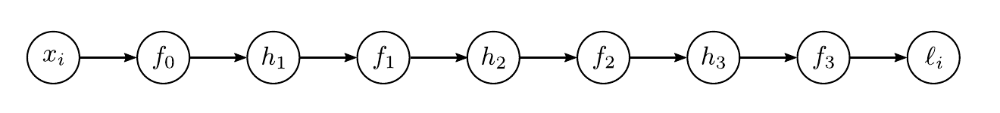

这里的 \(f_k\) 表示第 \(k\) 次仿射变换的输出，\(h_k\) 表示非线性函数的输出。前向传播不仅要得到预测 \(f_3\) 和损失 \(\ell_i\)，还要保存 \(f_0,f_1,f_2\) 与 \(h_1,h_2,h_3\)，因为反向传播会再次用到它们。

##### 3. 反向传播第一步：计算中间变量的梯度

为了让公式更容易阅读，记：

$$
g_{f_k}=\frac{\partial\ell_i}{\partial f_k},
\qquad
g_{h_k}=\frac{\partial\ell_i}{\partial h_k}
$$

从损失开始，按照计算图的反方向逐步计算：

$$
\begin{aligned}
g_{f_3} &= 2(f_3-y_i),\\
g_{h_3} &= \omega_3g_{f_3},\\
g_{f_2} &= -\sin(f_2)g_{h_3},\\
g_{h_2} &= \omega_2g_{f_2},\\
g_{f_1} &= \exp(f_1)g_{h_2}=h_2g_{h_2},\\
g_{h_1} &= \omega_1g_{f_1},\\
g_{f_0} &= \cos(f_0)g_{h_1}.
\end{aligned}
$$

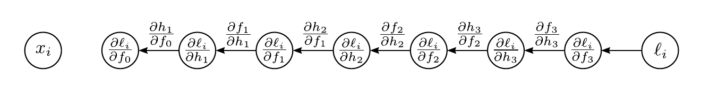

每一行都遵循同一个规则：

$$
\text{当前梯度}
=
\text{下游传回的梯度}
\times
\text{当前运算的局部导数}
$$

例如，\(h_3=\cos(f_2)\)，因此：

$$
\frac{\partial\ell_i}{\partial f_2}
=
\frac{\partial h_3}{\partial f_2}
\frac{\partial\ell_i}{\partial h_3}
=
-\sin(f_2)\frac{\partial\ell_i}{\partial h_3}
$$

括号中的 \(f_2\) 已在前向传播中保存，无须重新计算从 \(x_i\) 到 \(f_2\) 的整条路径。这种对下游梯度的复用，是反向传播高效的关键。

##### 4. 反向传播第二步：得到参数梯度

每个仿射变换都具有相同形式。对于 \(k>0\)：

$$
f_k=\beta_k+\omega_kh_k
$$

所以：

$$
\frac{\partial f_k}{\partial\beta_k}=1,
\qquad
\frac{\partial f_k}{\partial\omega_k}=h_k
$$

结合已经算出的 \(g_{f_k}\)，可立即得到：

$$
\frac{\partial\ell_i}{\partial\beta_k}=g_{f_k},
\qquad
\frac{\partial\ell_i}{\partial\omega_k}=h_kg_{f_k},
\qquad k=1,2,3
$$

第一层的输入不是 \(h_0\)，而是样本 \(x_i\)，因此：

$$
\frac{\partial\ell_i}{\partial\beta_0}=g_{f_0},
\qquad
\frac{\partial\ell_i}{\partial\omega_0}=x_ig_{f_0}
$$

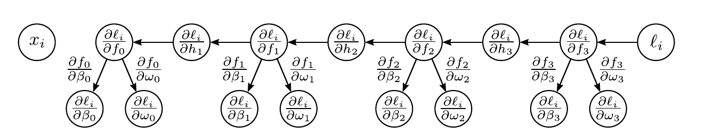

图中的横向路径负责把梯度传向更早的运算，向下的分支负责生成当前层的参数梯度。实际实现通常在反向经过每一层时同时完成这两件事，而不是先算完所有中间梯度，再单独遍历一次参数。

以 \(\omega_1\) 为例，展开它到损失之间的完整路径：

$$
\begin{aligned}
\frac{\partial\ell_i}{\partial\omega_1}
&=
\frac{\partial f_1}{\partial\omega_1}
\frac{\partial h_2}{\partial f_1}
\frac{\partial f_2}{\partial h_2}
\frac{\partial h_3}{\partial f_2}
\frac{\partial f_3}{\partial h_3}
\frac{\partial\ell_i}{\partial f_3}\\
&=
h_1\cdot\exp(f_1)\cdot\omega_2
\cdot[-\sin(f_2)]\cdot\omega_3
\cdot2(f_3-y_i).
\end{aligned}
$$

反向传播不会每次都重新计算这条长公式，而是复用前面递推得到的 \(g_{f_1}\)，直接计算：

$$
\frac{\partial\ell_i}{\partial\omega_1}=h_1g_{f_1}
$$

##### 5. 与全连接层公式的对应关系

回到常见的全连接层记号：

$$
\mathbf{z}^{(l)}
=
\mathbf{W}^{(l)}\mathbf{a}^{(l-1)}+\mathbf{b}^{(l)},
\qquad
\mathbf{a}^{(l)}=\sigma(\mathbf{z}^{(l)})
$$

其中，\(\mathbf{a}^{(l-1)}\) 是本层输入，\(\mathbf{z}^{(l)}\) 是激活前的值。若记本层误差信号为：

$$
\boldsymbol{\delta}^{(l)}
=
\frac{\partial L}{\partial\mathbf{z}^{(l)}}
$$

那么标量例子中的结论会推广为：

$$
\frac{\partial L}{\partial\mathbf{b}^{(l)}}
=
\boldsymbol{\delta}^{(l)},
\qquad
\frac{\partial L}{\partial\mathbf{W}^{(l)}}
=
\boldsymbol{\delta}^{(l)}
\left(\mathbf{a}^{(l-1)}\right)^T
$$

也就是说，**偏置梯度就是当前层的误差信号，权重梯度就是“误差信号 × 本层输入”**。若本层有 \(n_l\) 个神经元、上一层有 \(n_{l-1}\) 个神经元，则：

$$
\boldsymbol{\delta}^{(l)}\in\mathbb{R}^{n_l},
\qquad
\mathbf{a}^{(l-1)}\in\mathbb{R}^{n_{l-1}},
\qquad
\frac{\partial L}{\partial\mathbf{W}^{(l)}}
\in\mathbb{R}^{n_l\times n_{l-1}}
$$

这里的乘法是两个向量的外积，结果与权重矩阵形状相同。继续向前一层传播时：

$$
\frac{\partial L}{\partial\mathbf{a}^{(l-1)}}
=
\left(\mathbf{W}^{(l)}\right)^T
\boldsymbol{\delta}^{(l)}
$$

若上一层也包含激活函数，则还要乘以它的局部导数：

$$
\boldsymbol{\delta}^{(l-1)}
=
\left[
\left(\mathbf{W}^{(l)}\right)^T
\boldsymbol{\delta}^{(l)}
\right]
\odot
\sigma'(\mathbf{z}^{(l-1)})
$$

这正是标量例子中“乘以权重，再乘以激活函数导数”的矩阵版本。

### 5.4 梯度消失与梯度爆炸

#### 5.4.1 产生原因与影响

深层网络的梯度包含多个权重矩阵和激活函数导数的连乘：

$$
\frac{\partial L}{\partial\mathbf{h}_k}
=\frac{\partial L}{\partial\mathbf{h}_K}
\prod_{j=k+1}^{K}
\frac{\partial\mathbf{h}_j}{\partial\mathbf{h}_{j-1}}
$$

- 连乘项的尺度长期小于 1 时，梯度会逐层衰减，形成**梯度消失**，靠近输入端的层几乎无法学习。
- 连乘项的尺度长期大于 1 时，梯度会快速增大，形成**梯度爆炸**，导致更新震荡、数值溢出或出现 `NaN`、`Inf`。

Sigmoid、Tanh 的饱和区、不合适的权重尺度、过深的网络以及很长的循环路径都会加剧这些问题。

#### 5.4.2 如何诊断

- 记录全局梯度范数以及各层梯度范数。
- 观察损失是否突然上升、剧烈震荡或变为 `NaN`、`Inf`。
- 检查权重和激活值是否持续增大，或部分浅层梯度是否长期接近 0。
- 比较不同层的更新量与参数量级，判断是否只有少数层无法有效更新。

#### 5.4.3 常见解决方法

1. 使用 ReLU、Leaky ReLU 等非饱和激活函数。
2. 根据激活函数选择 Xavier 或 He 初始化。
3. 使用残差连接缩短梯度传播路径。
4. 使用 BatchNorm、LayerNorm 等归一化方法稳定中间表示。
5. 对过大的梯度进行裁剪，例如按全局范数缩放：

$$
\mathbf{g}\leftarrow
\mathbf{g}\cdot\min\left(1,\frac{\tau}{\lVert\mathbf{g}\rVert_2}\right)
$$

6. 调低学习率，并检查输入数据的尺度。
7. 在序列模型中使用 LSTM、GRU 或注意力机制缩短有效依赖路径。

处理梯度爆炸时，通常优先检查学习率、梯度范数、初始化和输入尺度，再决定是否加入梯度裁剪或调整网络结构。

### 5.5 从梯度问题到结构设计

初始化、激活函数、归一化和网络连接方式都会改变梯度在深层网络中的传播。这里先记住两条主线：

- **残差连接**加入恒等路径，让信息和梯度可以绕过复杂的非线性变换，详见第 9 章“残差网络”。
- **Transformer**结合残差连接、LayerNorm 和自注意力缩短信息路径，完整结构见 [Transformer 架构](07-Transformer架构.md)。

这些结构能够缓解梯度消失和优化困难，但不能替代合理的初始化、学习率和训练诊断。

### 5.6 参数初始化

#### 5.6.1 为什么权重不能全部初始化为零

如果同一层的权重全部初始化为 0，各神经元在前向传播中得到相同输出，在反向传播中也得到相同梯度，之后会一直保持相同。这称为**对称性问题**，会使一层中的多个神经元退化为同一个神经元。

权重需要随机初始化以打破对称性；偏置通常可以初始化为 0，因为随机权重已经打破了神经元之间的对称性。

#### 5.6.2 Xavier 与 He 初始化

**核心目的**是让信号和梯度经过多层网络时保持相对稳定的尺度，避免随着层数增加而逐层趋近于 0 或不断放大。对于线性组合
\(z=\sum_{i=1}^{n}w_ix_i\)，在输入与权重近似独立、零均值时，有：

$$
\mathrm{Var}(z)
\approx
n\,\mathrm{Var}(w)\,\mathrm{Var}(x)
$$

因此，权重方差应随输入连接数 \(n\) 增加而减小。Xavier 初始化在前向激活与反向梯度的稳定性之间取折中；He 初始化则进一步考虑 ReLU 会截断负半区，增大初始方差以补偿由此造成的信号损失。

初始化时需要先确定两个量：

- \(\mathrm{fan\_in}\)：一个神经元接收的输入数量；
- \(\mathrm{fan\_out}\)：一个神经元连接到的输出数量。

对于形状为 \([\mathrm{fan\_out},\mathrm{fan\_in}]\) 的全连接层权重矩阵，这两个量就是矩阵的输入、输出维度。对于卷积层，还需要把卷积核的空间大小计算在内，例如二维卷积的
\(\mathrm{fan\_in}=C_{\mathrm{in}}K_hK_w\)。

**Xavier 初始化**（也称 Glorot 初始化）主要用于线性层、Tanh，以及需要谨慎使用的 Sigmoid 网络。它在前向信号和反向梯度的方差之间取折中，使各层数值尺度尽量接近。常见形式为：

$$
W_{ij}\sim
\mathcal{N}\!\left(
0,\frac{2}{\mathrm{fan\_in}+\mathrm{fan\_out}}
\right)
$$

也可以从均匀分布采样：

$$
W_{ij}\sim
\mathcal{U}\!\left(
-\sqrt{\frac{6}{\mathrm{fan\_in}+\mathrm{fan\_out}}},
\sqrt{\frac{6}{\mathrm{fan\_in}+\mathrm{fan\_out}}}
\right)
$$

**He 初始化**（也称 Kaiming 初始化）主要用于 ReLU 及其变体。ReLU 会把负半区的输出置为 0；在输入近似对称时，大约一半激活被截断，因此需要比 Xavier 更大的初始方差来补偿信号衰减。常见正态分布形式为：

$$
W_{ij}\sim
\mathcal{N}\!\left(0,\frac{2}{\mathrm{fan\_in}}\right)
$$

对应的均匀分布形式为：

$$
W_{ij}\sim
\mathcal{U}\!\left(
-\sqrt{\frac{6}{\mathrm{fan\_in}}},
\sqrt{\frac{6}{\mathrm{fan\_in}}}
\right)
$$

| 激活函数 | 常用选择 | 说明 |
| --- | --- | --- |
| Linear、Tanh | Xavier | 尽量兼顾前向激活和反向梯度的尺度 |
| Sigmoid | Xavier | 比随意初始化稳定，但仍要避免激活落入饱和区 |
| ReLU | He | 补偿负半区被置零造成的方差损失 |
| Leaky ReLU | He，并传入负半区斜率 | 框架可根据斜率调整增益 |

以 Leaky ReLU 的负半区斜率 \(a\) 为例，常用增益为
\(\sqrt{2/(1+a^2)}\)。因此使用框架初始化函数时，激活函数名称和斜率参数应与网络中的实际设置一致。

权重过小会使信号和梯度逐层衰减；权重过大则可能使激活进入饱和区或导致梯度爆炸。初始化的目标不是直接找到最优参数，而是让训练从数值稳定、能够传播信号的位置开始。

这些公式建立在输入近似独立、零均值等理想假设上，并不能保证所有深层网络都严格保持方差。残差连接、归一化层、注意力结构和网络深度还会改变实际传播尺度，因此应把 Xavier 或 He 视为可靠的起点，并结合激活值分布和逐层梯度进行检查。偏置通常仍初始化为 0。

### 5.7 本章小结

- 反向传播利用计算图和链式法则，高效计算损失对全部参数的梯度。
- 梯度消失和梯度爆炸源于多层 Jacobian 的连续相乘，需要结合初始化、激活函数、归一化、残差连接和梯度裁剪处理。
- 初始化和连接结构共同影响梯度传播；残差网络将在第 9 章单独讨论。
- 权重随机初始化用于打破对称性；Xavier 和 He 初始化分别适配不同类型的激活函数。

## 6. 模型性能与超参数调整

> 本章的理论主线依据 Simon J. D. Prince 的 *Understanding Deep Learning* 第 8 章「Measuring performance」整理。三幅配图取自原书图 8.5、8.7 和 8.10（CC BY-NC-ND）。

### 6.1 性能评估与泛化

模型性能不能只看训练损失，需要将数据划分为不同用途：

| 数据集 | 用途 |
|--------|------|
| 训练集 | 计算梯度并更新模型参数 |
| 验证集 | 选择超参数、比较方案、决定何时停止训练 |
| 测试集 | 在方案确定后进行最终评估，不参与调参 |

损失函数用于训练，评估指标用于衡量任务目标，两者可以不同。例如，分类模型可以用交叉熵训练，用准确率、F1 或 AUC 评估；回归模型可以用 MSE 训练，用 MAE 或业务指标评估。

模型在未参与训练的新样本上仍能保持性能的能力称为**泛化（generalization）**。容量足够大的网络往往可以把训练误差降到 0，但这只说明它能够拟合或记忆训练集，并不能证明它学到了可推广的数据规律。

训练损失、测试损失和任务错误率还可能呈现不同趋势。例如，模型训练后期可能仍在犯相同的分类错误，因此测试错误率基本不变；但它对这些错误预测越来越自信，使真实类别的预测概率继续减小，于是测试交叉熵反而上升。因此，评估时应同时观察损失、任务指标和预测置信度。

常见问题可以从训练集和验证集的表现判断：

- **训练集与验证集都差**：可能欠拟合、优化不足、特征或标签存在问题。
- **训练集好、验证集明显较差**：通常是过拟合或训练、验证数据分布不一致。
- **训练过程不稳定**：优先检查学习率、输入尺度、初始化、梯度和数值精度。

### 6.2 测试误差的来源

为了区分模型为什么不能泛化，可以把测试误差理解为三种来源：**噪声（noise）**、**偏差（bias）**和**方差（variance）**。

最简单地理解：

| 误差来源 | 直观定义 |
| --- | --- |
| **噪声** | 在输入相同的情况下，真实输出本身仍可能发生变化的程度 |
| **偏差** | 模型的平均预测值偏离真实规律的程度 |
| **方差** | 模型预测值对训练集变化的敏感程度 |

换句话说，噪声来自数据生成过程本身，偏差反映模型是否总是“偏向错误方向”，方差反映换一批训练数据后模型是否会发生很大变化。

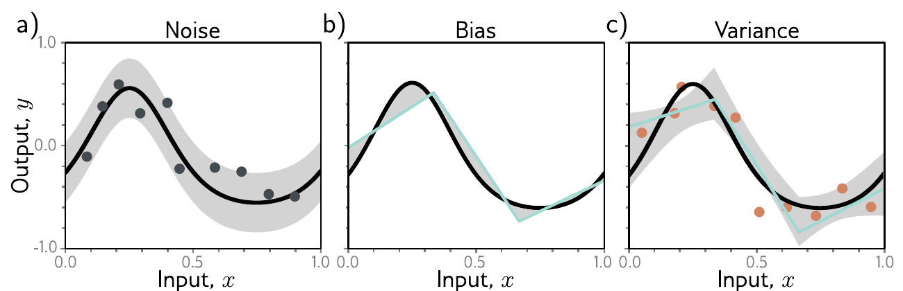

#### 6.2.1 噪声

对同一个输入 \(x\)，数据生成过程可能产生多个合理输出 \(y\)。原因可能是真实过程本身具有随机性、标签存在错误，或者影响输出的某些变量没有被观测到。

在给定输入特征和标签定义不变的前提下，这部分不确定性无法由模型消除，因此称为**不可约误差（irreducible error）**。它不妨碍高容量模型记住训练样本，因为训练中通常不会反复看到完全相同的输入，但它会限制测试性能的理论上限。

#### 6.2.2 偏差

偏差描述模型的平均预测与真实规律之间的系统性差异。如果模型类别不够灵活，即使获得无限数据并找到该模型内的最优参数，也无法表示真实函数，就会产生较大偏差。

典型表现是训练集和验证集都较差，即欠拟合。增加模型容量、改进输入特征或选择更合适的模型结构通常可以降低偏差，但优化没有充分收敛也可能表现为类似的训练误差。

#### 6.2.3 方差

训练集是从总体中随机抽取的有限样本。更换一批训练数据后，学到的参数和预测函数也会变化；模型对训练数据中偶然细节的这种敏感程度称为方差。

高方差模型可能在训练集上表现很好，却在验证集上明显变差，即过拟合。方差不仅来自有限、带噪的数据，也可能来自随机初始化、Mini-batch 顺序和随机优化过程。

这里的“偏差”不同于神经网络层中的偏置参数 \(\mathbf{b}\)；前者描述预测的系统性误差，后者是模型中的可学习参数。

### 6.3 平方损失下的偏差–方差分解

下面完整推导回归问题中最常见的误差分解。固定输入位置 \(x\)，假设输出 \(y\) 来自条件分布 \(p(y\mid x)\)。定义真实输出的条件均值：

$$
\mu(x)
=
\mathbb{E}_{y\mid x}[y]
$$

并假设条件噪声方差为：

$$
\sigma^2
=
\mathbb{E}_{y\mid x}
\left[
\left(y-\mu(x)\right)^2
\right]
$$

为突出训练集的随机性，用 \(\mathcal{D}\) 表示一次随机采样得到的训练集，用
\(f_{\mathcal{D}}(x)\) 表示在该训练集上拟合出的模型。对一个测试输出 \(y\)，平方损失为：

$$
\mathcal{L}(x)
=
\left(f_{\mathcal{D}}(x)-y\right)^2
$$

#### 6.3.1 第一步：分离不可约噪声

在括号中加上再减去真实均值 \(\mu(x)\)：

$$
\begin{aligned}
\mathcal{L}(x)
&=
\left[
f_{\mathcal{D}}(x)-\mu(x)+\mu(x)-y
\right]^2\\
&=
\left[f_{\mathcal{D}}(x)-\mu(x)\right]^2\\
&\quad+
2\left[f_{\mathcal{D}}(x)-\mu(x)\right]
\left[\mu(x)-y\right]\\
&\quad+
\left[\mu(x)-y\right]^2.
\end{aligned}
$$

现在只对测试输出 \(y\) 取条件期望。给定训练集后，\(f_{\mathcal{D}}(x)\) 与 \(y\) 无关，并且：

$$
\mathbb{E}_{y\mid x}\left[\mu(x)-y\right]=0
$$

因此交叉项消失：

$$
\begin{aligned}
\mathbb{E}_{y\mid x}[\mathcal{L}(x)]
&=
\left[f_{\mathcal{D}}(x)-\mu(x)\right]^2\\
&\quad+
2\left[f_{\mathcal{D}}(x)-\mu(x)\right]
\mathbb{E}_{y\mid x}[\mu(x)-y]\\
&\quad+
\mathbb{E}_{y\mid x}
\left[\left(\mu(x)-y\right)^2\right]\\
&=
\left[f_{\mathcal{D}}(x)-\mu(x)\right]^2+\sigma^2.
\end{aligned}
$$

这一步把期望测试误差分成“模型预测偏离真实均值的误差”和“数据本身的噪声”。

#### 6.3.2 第二步：分离偏差与方差

模型依赖随机抽取的训练集 \(\mathcal{D}\)。定义所有可能训练集上模型预测的平均值：

$$
\overline{f}(x)
=
\mathbb{E}_{\mathcal{D}}
\left[f_{\mathcal{D}}(x)\right]
$$

在模型误差项中加上再减去 \(\overline{f}(x)\)：

$$
\begin{aligned}
&\left[f_{\mathcal{D}}(x)-\mu(x)\right]^2\\
&=
\left[
f_{\mathcal{D}}(x)-\overline{f}(x)
+\overline{f}(x)-\mu(x)
\right]^2\\
&=
\left[f_{\mathcal{D}}(x)-\overline{f}(x)\right]^2\\
&\quad+
2\left[f_{\mathcal{D}}(x)-\overline{f}(x)\right]
\left[\overline{f}(x)-\mu(x)\right]\\
&\quad+
\left[\overline{f}(x)-\mu(x)\right]^2.
\end{aligned}
$$

再对训练集 \(\mathcal{D}\) 取期望。根据 \(\overline{f}(x)\) 的定义：

$$
\mathbb{E}_{\mathcal{D}}
\left[
f_{\mathcal{D}}(x)-\overline{f}(x)
\right]
=0
$$

所以交叉项再次消失：

$$
\begin{aligned}
&\mathbb{E}_{\mathcal{D}}
\left[
\left(f_{\mathcal{D}}(x)-\mu(x)\right)^2
\right]\\
&=
\underbrace{
\mathbb{E}_{\mathcal{D}}
\left[
\left(f_{\mathcal{D}}(x)-\overline{f}(x)\right)^2
\right]
}_{\text{方差}}\\
&\quad+
\underbrace{
\left[\overline{f}(x)-\mu(x)\right]^2
}_{\text{偏差平方}}.
\end{aligned}
$$

把两步合并，得到固定输入 \(x\) 处的偏差–方差分解：

$$
\boxed{
\mathbb{E}_{\mathcal{D}}
\mathbb{E}_{y\mid x}
\left[
\left(f_{\mathcal{D}}(x)-y\right)^2
\right]
=
\underbrace{
\mathbb{E}_{\mathcal{D}}
\left[
\left(f_{\mathcal{D}}(x)-\overline{f}(x)\right)^2
\right]
}_{\text{方差}}
+
\underbrace{
\left[\overline{f}(x)-\mu(x)\right]^2
}_{\text{偏差平方}}
+
\underbrace{\sigma^2}_{\text{噪声}}
}
$$

如果还对输入分布 \(p(x)\) 取期望，就得到整体期望测试误差。这个严格的加法分解依赖平方损失；分类和其他损失中仍然存在噪声、偏差与方差，但三者通常不能如此简单地相加。

### 6.4 怎样降低误差

在平方损失和固定输入信息的前提下，期望测试误差满足：

$$
\text{期望测试误差}
=
\text{噪声}
+
\text{偏差平方}
+
\text{方差}
$$

因此，若任务定义、输入特征和数据生成分布不变，噪声构成无法通过模型训练突破的下限；模型选择和训练策略主要是在降低偏差平方与方差之和。如果改进标签、测量过程或输入信息，则问题本身发生了变化，原来的噪声下限也可能降低。

降低误差的第一步不是立即增加模型或加强正则化，而是先判断主要误差来自哪里。诊断阶段应比较**训练集和验证集**；测试集要留到模型与超参数确定后再使用。

| 训练与验证现象 | 偏差判断 | 方差判断 | 典型状态 | 优先行动 |
| --- | --- | --- | --- | --- |
| 训练误差高，验证误差也高且接近 | 可能较高 | 通常不是首要问题 | 欠拟合、优化不足或数据定义有误 | 先确认模型能否拟合训练集，再检查容量和输入信息 |
| 训练误差很低，验证误差明显较高 | 通常较低 | 可能较高 | 过拟合或训练、验证分布不一致 | 先检查数据划分和分布，再增加数据或正则化 |
| 训练误差和验证误差都较低且接近 | 较低 | 较低 | 当前评估下较理想 | 检查指标是否满足业务目标，并在独立测试集验收 |
| 不同随机种子或数据子集的结果波动很大 | 无法单独判断 | 可能较高 | 数据有限或训练不稳定 | 重复实验，增加数据并稳定训练过程 |
| 同类样本的标签互相矛盾，人工也难以判断 | 无法单独判断 | 可能被放大 | 标签错误、缺失变量或任务固有噪声 | 清洗标注、补充特征，估计可达到的性能上限 |

这些判断只是线索，不是严格证明。“误差高或低”也必须相对于合理基线和任务噪声判断。例如，训练误差高既可能是模型表达能力不足，也可能是学习率错误导致根本没有优化好；训练、验证差距大也可能来自分布不一致，而不只是过拟合。

#### 6.4.1 降低噪声带来的误差

需要先区分两类情况：

- **可修复的数据问题**：错标、重复冲突样本、传感器故障、数据处理错误等。这些不是真正不可避免的噪声，应通过抽样审查、重复标注、标注一致性检查和数据清洗解决。
- **任务的固有不确定性**：即使给定当前全部输入，同一个 \(x\) 仍可能对应多个合理的 \(y\)。这部分就是偏差–方差分解中的 \(\sigma^2\)，在现有信息条件下无法由模型消除。

可采用以下方法减少噪声或降低它对训练的影响：

1. **提高标签质量**：明确标注规范，对困难样本进行多人复核或专家仲裁，修复系统性错标。
2. **增加有效输入信息**：补充能够解释输出变化的特征，把原先的“随机性”转化为模型可学习的规律。例如，仅凭静态图像难以判断运动方向时，可以加入连续帧。
3. **改进测量与采样**：校准传感器、重复测量后取平均，并保证训练数据覆盖真实输入范围。
4. **选择与噪声匹配的概率模型**：异方差回归可以让模型学习不同输入处的噪声尺度；类别边界本身含糊时，可以使用软标签表达标注不确定性。
5. **降低异常标签的影响**：使用 Huber 等稳健损失、样本权重或可靠的异常样本处理流程。使用这些方法前应确认异常确实来自数据问题，避免删除少数但有效的困难样本。

增加同分布样本可以让总体规律估计得更稳定，但不会消除单个新样本中的固有随机性。因此，“更多数据降低方差”和“不可约噪声无法消除”并不矛盾。

#### 6.4.2 降低偏差

高偏差表示模型学到的平均函数仍然系统性偏离真实规律。常见改进顺序是：

1. **先排除优化失败**：尝试在一个很小的数据子集上过拟合到接近零训练误差。如果做不到，应先检查损失函数、梯度、学习率、初始化、训练时长和实现错误。
2. **增加有效容量或更换模型族**：线性模型可加入有依据的非线性项或改用核方法；树模型可适当增加深度、叶子数，或使用 GBDT；神经网络可增加宽度或深度，并使用更适合数据结构的卷积、注意力等模块。
3. **改善输入表示**：补充有效特征和交互项，正确编码类别变量，使用 Embedding 或预训练表示，提高必要的输入分辨率，并修正会丢失关键信息的预处理。标准化主要改善数值条件和优化过程，本身不会凭空增加信息。
4. **减弱过强约束**：降低权重衰减、Dropout、数据增强强度，或延后 Early Stopping。正则化过强会同时抬高训练误差和验证误差。
5. **调整任务与目标**：确认输出头、损失函数和评估指标匹配任务。例如，多标签任务误用 Softmax 会人为限制模型表达能力。

更多训练数据通常不是解决高偏差的首要手段，因为容量不足的模型即使看到更多同类数据，也仍无法表示目标函数。不过，更多且覆盖更广的数据可能暴露此前遗漏的规律，并使更高容量模型能够稳定训练。

#### 6.4.3 降低方差

高方差表示模型对训练集中的偶然细节或训练随机性过于敏感。常见方法包括：

1. **增加高质量训练数据**：更多样本可以平均掉局部噪声，使输入空间覆盖更充分，通常是降低数据采样方差最直接的方法。
2. **使用符合任务规律的数据增强**：通过合理的旋转、裁剪、颜色扰动或文本变换增加有效样本，但增强必须保持标签语义。
3. **加入正则化**：使用权重衰减、Dropout、Early Stopping、标签平滑等方法，限制模型对训练样本细节的依赖。
4. **降低有效容量**：在经典过拟合场景中，可以缩小网络、做特征选择，或限制决策树深度、叶子数和叶节点最小样本数。但现代过参数化网络并不总是遵循简单的“模型越小，泛化越好”，仍应根据验证集判断。
5. **使用模型集成**：Bagging 和随机森林通过重采样及特征随机化降低树模型方差；神经网络可以平均不同初始化或不同数据子集训练出的模型预测。模型误差越相关，集成收益越小。XGBoost 属于 Boosting，而不是 Bagging；它的行、列子采样可以发挥正则化作用，但机制不同。
6. **稳定训练过程**：采用合适的初始化、学习率和归一化，降低不同随机种子之间由优化过程引入的额外波动。

BatchNorm 的批次统计噪声在某些设置下可能带来附带的正则化效果，但它的首要作用是归一化和改善优化，而且效果依赖批量大小。因此，不应把 BatchNorm 当作通用的降方差方法。

交叉验证主要用于在有限数据下获得更稳定的性能估计和超参数选择，**不会自动降低最终单个模型的预测方差**。只有把各折训练出的模型用于预测集成，或者选定超参数后用更多数据重新训练，才可能进一步改善最终预测。

#### 6.4.4 处理误差之间的权衡

同一种操作可能同时影响多类误差：

- 增加容量通常降低偏差，但可能增大方差；
- 加强正则化通常降低方差，但过强时会增大偏差；
- 增加数据通常降低方差，并允许安全地训练更高容量的模型；
- 清洗错误标签既可降低有效噪声，也可减少模型拟合错误标签造成的方差；
- 模型集成通常降低方差，但会增加训练、存储和推理成本。

因此，应在固定的数据划分和实验预算下逐步调整，并同时观察训练误差、验证误差、两者差距和多次运行的波动。目标不是单独把某一项降到最低，而是降低最终的验证或测试误差。

#### 6.4.5 工程优化闭环

一个更稳妥的工程流程是：

1. **固定评估协议**：划分训练集、验证集和测试集；数据有限时，在训练集与验证集范围内做交叉验证。
2. **建立可复现基线**：固定数据版本、代码版本、随机种子、训练预算和指标定义。
3. **检查训练集拟合能力**：若连小规模训练子集都无法拟合，先修复实现或优化问题；若完整训练误差仍高，再降低偏差。
4. **检查泛化差距**：若训练误差低而验证误差高，先排查数据泄漏和分布差异，再采用增加数据、正则化、集成等降方差手段。
5. **沿容量和正则化强度搜索**：通过验证集寻找合适区域，不能使用测试集反复选择拐点。
6. **使用最佳验证检查点**：Early Stopping 应保存验证指标最佳的检查点，并设置耐心值容忍短期波动，而不是看到单次拐点就立即停止。
7. **最终独立验收**：方案完全确定后，在测试集上评估并报告多次运行的均值与波动；不要根据测试结果继续调参。
8. **上线持续监控**：监控输入、标签和预测分布漂移，必要时重新收集数据、评估和训练。

#### 6.4.6 模型容量与偏差–方差权衡

**模型容量（capacity）**表示模型能够描述多复杂的函数。参数量、网络宽度和深度是常见的近似指标，但实际可达到的有效容量还受优化算法、训练时长、正则化和数据影响。

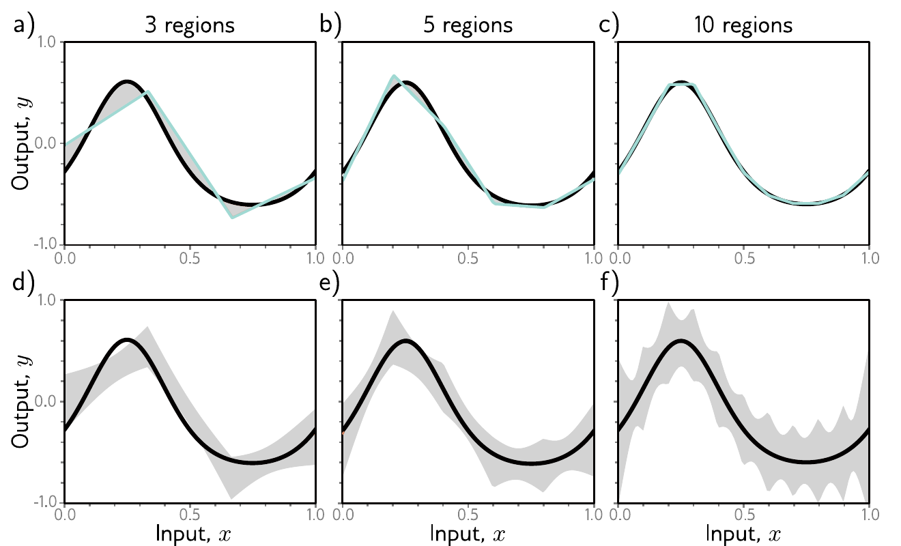

图中上排表示随着分段数量增加，模型越来越接近真实函数，偏差逐渐减小；下排表示同样的容量增长会使不同训练集得到的模型差异变大，即方差增加。在经典的欠参数化区域中：

- 容量过小：偏差较大，训练误差和测试误差都高；
- 容量适中：偏差已经降低，方差仍可控制，测试误差较低；
- 容量继续增大：训练误差继续降低，但方差可能上升，测试误差反而变差。

这称为**偏差–方差权衡**。它说明最低训练误差对应的模型不一定具有最低测试误差，也说明不能只根据训练集选择模型容量。

### 6.5 双下降

经典理论常把测试误差描绘成随容量先下降后上升的 U 形曲线。但现代神经网络经常具有足以拟合训练集的有效容量，并进入存在大量近似最优解的过参数化区域。此时测试误差可能在第一次上升后再次下降，形成**双下降（double descent）**。在普通监督学习中，“参数数量超过训练样本数量”常被用作直观标志，但它不是适用于所有模型的严格判据。

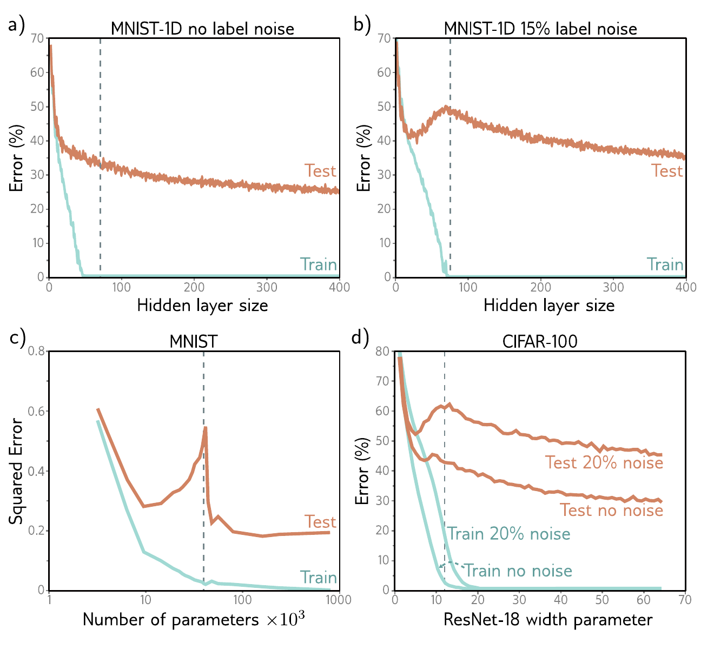

双下降曲线可分为三个区域：

1. **经典区域（欠参数化）**：增加容量会降低偏差，但临近完全拟合训练数据时，模型越来越容易追随噪声。
2. **临界区域或插值阈值**：模型刚好有能力把训练误差降到接近 0。为了穿过所有训练点，学到的函数可能非常不稳定，测试误差达到峰值。
3. **现代区域（过参数化）**：继续增加容量后，满足零训练误差的解变得很多；在初始化、网络结构和优化算法的隐式偏好下，训练过程可能找到更平滑、泛化更好的插值解，测试误差再次下降。

原书图 8.10 展示了不同数据集上的实验：标签噪声会让插值阈值附近的峰值更明显，但双下降的形状和强度依赖数据、模型、损失、优化器、正则化和训练时长，并非每个实验都一定出现。

过参数化并不意味着模型会自动泛化。训练数据在高维空间中非常稀疏，即使模型完全拟合训练点，训练点之间的行为仍未被数据唯一确定。最终选择哪一个零损失解，取决于模型的**归纳偏置（inductive bias）**以及初始化和优化带来的**隐式正则化**。因此，模型容量仍应依据验证集和实际计算约束选择，不能因为存在双下降就盲目扩大模型。

#### 6.5.1 Epoch-wise 双下降与数据量效应

前面的曲线通过改变模型宽度或参数量来改变容量，通常称为**模型规模双下降（model-wise double descent）**。有效容量还会随训练过程变化：同一个模型训练得越久，能够拟合的数据细节通常越多。如果固定模型和数据，只增加训练轮数，测试误差也可能先下降、再上升、最后再次下降，这称为 **Epoch-wise 双下降**。

这说明 Early Stopping 附近的一次验证误差上升不一定代表之后绝不会改善。不过，不能据此忽略验证集持续恶化；是否继续训练仍要结合预先设定的预算、多次实验和验证曲线判断，不能事后无限延长训练来寻找第二次下降。

双下降还带来一个反直觉的可能性：**增加训练数据有时会暂时增大测试误差**。假设固定模型原本位于过参数化区域的第二个下降段；增加数据后，模型相对于新数据集的有效容量变小，可能重新靠近插值阈值，使测试误差暂时升高。继续增加数据，使系统越过该临界区域后，性能通常又会改善。

这不是“更多数据通常有益”这一经验的否定，而是提醒我们：模型容量、训练时长和数据量共同决定系统位于双下降曲线的哪个区域。比较数据量实验时，应保持数据分布、训练预算和超参数选择流程一致，并用验证集实际测量。

#### 6.5.2 大模型中的过参数化

大模型通常具有极高的表达能力和大量冗余参数，可能存在许多训练损失相近的参数解，因此经常被称为过参数化模型。不过，“参数数量远超训练样本数”并不能不加区分地用于大语言模型，因为**样本数取决于采用什么统计单位**。

自回归语言模型用一个 Token 之前的上下文预测下一个 Token。一段包含 \(T\) 个 Token 的文本会产生约 \(T-1\) 个条件预测目标：

$$
L(\phi)
=
-\sum_{t=1}^{T-1}
\log p_{\phi}(x_{t+1}\mid x_{\leq t})
$$

因此，同一份语料可以按文档数、序列数或 Token 级预测目标数统计。大型预训练语料可能包含数十亿乃至更多 Token，Token 数未必少于参数数；而且这些目标并非相互独立，相邻上下文高度相关。仅比较“参数量”和“文档条数”或“Token 数”，都无法完整衡量模型容量与数据约束之间的关系。

还要注意，Transformer 的同一组参数会在所有序列位置和训练样本之间共享。参数共享使每个权重受到大量上下文共同约束，因此一个参数并不是只对应一个训练样本。大模型是否处于过参数化状态，更适合从以下角度判断：

- 模型是否有能力把训练目标拟合到很低的损失；
- 是否存在大量功能相近、训练损失接近的参数解；
- 参数变化中是否存在对训练输出影响很小的冗余方向；
- 模型、优化算法和训练预算共同形成的**有效容量**有多大。

预训练和下游微调还需要分别讨论：

| 场景 | 数据与参数关系 | 主要特点 |
| --- | --- | --- |
| 大规模预训练 | Token 级目标可能多于参数，且数据中存在语言本身的不确定性 | 通常不会达到严格的零交叉熵；“插值阈值”比有噪声标签的有限监督任务更难界定 |
| 全参数微调 | 下游标注样本通常远少于模型参数 | 明显具有高容量，容易记忆小数据集，但预训练知识和小学习率提供了强归纳偏置 |
| 参数高效微调 | 冻结主模型，只训练 Adapter、LoRA 等少量参数 | 应比较可训练参数、预训练表示和下游数据，而不能只看冻结主模型的总参数量 |

大模型可以同时具有**记忆能力**和**泛化能力**。参数冗余使它能够记住部分训练内容，但预训练数据的广泛覆盖、权重共享、架构归纳偏置、优化路径和显式或隐式正则化，也会促使模型学习可复用的统计规律。模型规模增大后测试性能改善，并不等价于“参数越多就一定越好”；数据质量、数据规模、训练计算量、目标函数和评估分布必须共同匹配。

### 6.6 模型参数与超参数

| 类型 | 含义 | 获得方式 | 示例 |
|------|------|----------|------|
| 模型参数 | 模型内部可学习的数值 | 由优化算法根据训练数据更新 | 权重、偏置 |
| 超参数 | 控制模型结构和训练过程的配置 | 由人工、搜索算法或调度策略确定 | 学习率、批量大小、网络深度、Dropout 比率 |

超参数通常可以分为：

- **结构超参数**：层数、隐藏维度、卷积核数量、激活函数和连接方式。
- **优化超参数**：学习率、批量大小、优化器及其参数、训练轮数。
- **正则化超参数**：权重衰减、Dropout 比率、数据增强强度。
- **任务超参数**：损失项权重、分类阈值、采样比例等。

#### 6.6.1 表示容量与有效容量

模型容量不能简单等同于参数数量，需要区分两个层次：

- **表示容量（representational capacity）**：当参数可以任意取值时，某种模型结构理论上能够表示的全部函数集合。增加网络宽度、深度或更灵活的算子通常会扩大这个集合。
- **有效容量（effective capacity）**：在给定数据、初始化、优化器、正则化、数值精度和训练预算后，训练过程实际能够到达的函数集合。

二者的关系可以直观地写成：

$$
\text{有效容量}
\subseteq
\text{表示容量}
$$

例如，一个很深的网络理论上具有很大的表示容量，但如果梯度无法有效传播、训练时间不足或正则化过强，实际只能学到其中很小一部分函数。反过来，延长训练、改进优化器或减弱正则化并没有改变网络结构，却可能增大有效容量。

| 改变因素 | 表示容量 | 有效容量 |
| --- | --- | --- |
| 增加层数或宽度 | 通常增大 | 可能增大，但取决于能否优化 |
| 延长训练时间 | 不变 | 通常增大，可能引出 Epoch-wise 双下降 |
| 更换优化器或初始化 | 不变 | 可能改变可到达的解 |
| 加强正则化或 Early Stopping | 理论函数集合通常不变 | 通常减小或限制实际到达的解 |
| 增加训练数据 | 模型本身不变 | 不直接扩大模型容量，但对模型施加更多约束 |

因此，判断欠拟合、过拟合或插值阈值时，应关注模型与训练算法共同形成的有效容量，而不是只比较参数量与样本数。

### 6.7 调参前的数据检查

调参无法弥补错误的数据和评估流程。开始搜索前应确认：

1. 标签定义、数据清洗和数据划分正确，没有训练集与验证集泄漏。
2. 样本顺序已经随机化或采用适合时间序列、分组数据的划分方法。
3. 数值特征根据训练集统计量进行中心化、标准化或归一化，并将同一变换应用于验证集和测试集。
4. 类别不平衡、异常值、缺失值和重复样本已经得到适当处理。
5. 训练损失、验证指标和线上目标之间没有明显错位。

常见数值预处理包括：

- **中心化**：\(x'=x-\mu\)。
- **标准化**：\(x'=(x-\mu)/\sigma\)。
- **区间归一化**：把数值缩放到指定范围。

#### 6.7.1 测试集污染与分布漂移

验证集用于反复比较方案，测试集只用于方案确定后的最终评估。如果根据测试结果不断修改模型、特征或超参数，测试集就会间接参与训练；最终结果可能只是碰巧适合这个测试集，无法代表对未来数据的泛化能力。这称为**测试集污染**。

即使离线评估流程正确，测试集也只有在与真实使用环境同分布时才能代表线上性能。部署后常见的分布变化包括：

- **协变量漂移（covariate shift）**：输入分布 \(p(x)\) 改变；
- **先验漂移（prior shift）**：标签比例 \(p(y)\) 改变；
- **概念漂移（concept shift）**：输入与输出的关系 \(p(y\mid x)\) 改变。

因此，最终测试并不是评估工作的终点。上线后还要持续监控输入分布、预测分布、任务指标和数据质量，并在业务分布发生变化时重新验证或训练模型。

### 6.8 调参顺序与诊断思路

没有适用于所有任务的固定超参数重要性排名，可以按照以下顺序减少无效搜索：

1. **先验证任务与数据**：确认标签、损失函数、指标和数据划分合理。
2. **建立可复现基线**：固定随机种子、训练预算和评估流程。
3. **先解决优化问题**：重点检查学习率、优化器、批量大小和初始化。
4. **再调整模型容量**：根据欠拟合或过拟合情况调整深度、宽度和特征表达能力。
5. **最后调整正则化**：搜索权重衰减、Dropout、数据增强和早停策略。

调试时应同时记录训练损失、验证损失、任务指标、学习率、梯度范数和资源使用情况。只看最终指标，很难区分数据、优化和泛化问题。

### 6.9 常用调参策略

- 对学习率、权重衰减等跨越多个数量级的参数，优先在**对数尺度**上搜索。
- 先使用较短训练预算进行粗搜索，再对少量候选方案完整训练。
- 一次实验只改变有限数量的关键变量，并保存配置、代码版本和随机种子。
- 验证指标长期不再改善时，可以降低学习率或使用早停，但应设置合理的耐心轮数，避免因短期波动过早停止。
- 对结果方差较大的任务，使用多个随机种子重复实验，并报告均值和波动范围。
- 数据量有限时，可使用交叉验证获得更稳定的方案比较，但计算成本更高。

#### 6.9.1 K 折交叉验证

当单独划出验证集会明显减少训练数据时，可以在**训练集与验证集的候选数据**上使用 K 折交叉验证（K-fold cross-validation）。基本过程如下：

1. 将候选数据划分为 \(K\) 个互不重叠、大小近似相同的子集
   \(\mathcal{D}_1,\ldots,\mathcal{D}_K\)。
2. 第 \(k\) 轮把 \(\mathcal{D}_k\) 作为验证折，其余 \(K-1\) 折作为训练数据，从头训练并评估模型。
3. 对每组超参数重复 \(K\) 轮，得到验证指标 \(m_1,\ldots,m_K\)，用平均值比较方案：

$$
\overline{m}
=
\frac{1}{K}\sum_{k=1}^{K}m_k
$$

4. 同时报告各折指标的标准差，观察方案是否稳定：

$$
s
=
\sqrt{
\frac{1}{K-1}
\sum_{k=1}^{K}
\left(m_k-\overline{m}\right)^2
}
$$

5. 根据平均验证性能确定模型和超参数后，通常使用全部候选数据重新训练最终模型，再在从未参与选择的独立测试集上评估一次。若推理成本允许，也可以保留 \(K\) 个折模型并集成预测。

例如，\(K=5\) 时，每轮约使用 80% 的候选数据训练、20% 验证，共训练 5 次。常用 \(K=5\) 或 \(10\)；\(K\) 越大，每轮训练数据越多，但训练总成本也越高。

使用时需要注意：

- **测试集始终独立**：不能把测试集放入 K 折，也不能根据测试结果选择 \(K\)、模型或超参数。
- **预处理必须在折内拟合**：标准化、缺失值填充、特征选择和重采样等操作，只能使用该轮训练折估计，再应用于验证折，否则会发生数据泄漏。
- **按任务选择划分方式**：分类任务常用分层 K 折保持类别比例；同一用户、患者或设备的样本应使用分组 K 折；时间序列应使用按时间向前验证，不能随机打乱后做普通 K 折。
- **计算成本约增大 \(K\) 倍**：大模型训练通常难以承受完整 K 折，可改用固定验证集、多随机种子、较小代理任务或参数高效微调。

K 折交叉验证主要减少一次偶然划分对评估和选型的影响。它不会改变数据生成过程中的不可约噪声，也不会自动降低某一个最终模型的方差。

### 6.10 极小批量与超大批量训练

#### 6.10.1 极小批量

批量很小时，梯度噪声较大，而且 BatchNorm 的均值和方差估计可能不稳定。常见处理方式包括：

- 使用梯度累积，在不增加单步显存的情况下模拟较大的有效批量。
- 使用 LayerNorm 或 GroupNorm 等不依赖批量统计量的方法。
- 微调预训练模型时冻结 BatchNorm 的运行统计量。
- 适当降低学习率，并监控梯度波动。

#### 6.10.2 超大批量

大批量可以提高硬件吞吐量，但减少了每个 epoch 的更新次数，也可能改变泛化表现。常见处理方式包括：

- 随批量增大调整学习率，并配合 warmup，避免训练初期不稳定。
- 在分布式大批量场景中使用 LARS、LAMB 等按层或按参数尺度调整更新的方法。
- 比较相同训练样本量或计算预算，而不是只比较 epoch 数。

批量大小应由显存、吞吐量、归一化方式和验证集表现共同决定，不存在统一的最佳值。

### 6.11 自动化超参数搜索

#### 6.11.1 网格搜索

为每个超参数指定有限候选值，并穷举所有组合。它容易实现，适合超参数较少、搜索空间较小的情况；参数数量增加后，组合数会快速增长。

#### 6.11.2 随机搜索

为每个超参数指定采样分布，再随机生成组合。在相同实验预算下，随机搜索通常比规则网格更容易覆盖重要参数的不同取值，尤其适合只有少数参数真正敏感的情况。

#### 6.11.3 基于模型的搜索

基于模型的搜索根据历史实验结果建立超参数与验证性能之间的代理模型，再平衡两种选择：探索不确定但尚未充分尝试的区域，以及利用当前看来最有希望的区域。

一个完整的搜索过程包括：

1. 目标指标和评估协议。
2. 超参数搜索空间。
3. 候选方案选择策略。
4. 已完成实验及其结果。

常见方法的差别主要在于怎样表示代理模型：

- **贝叶斯优化**：广义框架，用概率代理模型描述性能预测及其不确定性，再通过采集函数选择下一组配置。高斯过程是常见代理模型，但不是唯一选择。
- **SMAC**（Sequential Model-based Algorithm Configuration）：通常用随机森林作为代理模型，能够处理连续、离散和条件超参数，适合结构不规则的配置空间。
- **TPE**（Tree-structured Parzen Estimator）：不直接建模“给定超参数时的性能”，而是按表现好坏分别建模超参数分布，再优先采样更可能产生好结果的区域；也适合树状和条件搜索空间。

#### 6.11.4 多保真与预算分配

多保真方法假设可以用较低成本获得不完整但有参考价值的评估，例如只训练少量 Epoch、使用部分数据或较低输入分辨率。它们重点解决“给每组配置分配多少资源”，而不只是“下一组配置选什么”。

- **Hyperband**：先随机采样多组配置并分配小预算，然后采用逐次减半策略淘汰表现较差的配置，把更大预算留给少数候选。优点是能快速停止明显较差的实验，但配置本身主要由随机采样产生。
- **BOHB**：把 Hyperband 的预算分配机制与 TPE 类似的模型化采样结合起来，既提前淘汰差配置，又利用历史结果选择更有希望的新配置。

| 方法 | 主要解决的问题 | 适合场景 | 主要限制 |
| --- | --- | --- | --- |
| 随机搜索 | 广泛覆盖搜索空间 | 简单基线、并行资源充足 | 不利用历史实验 |
| SMAC | 建模混合及条件搜索空间 | 架构、算法配置等不规则空间 | 代理模型质量依赖已有实验 |
| TPE | 从历史结果中选择更优采样区域 | 连续、离散、条件参数混合 | 早期样本少时优势有限 |
| Hyperband | 把预算集中到较好配置 | 早期性能能预测最终表现 | 可能过早淘汰慢热配置 |
| BOHB | 同时改进采样与预算分配 | 单次训练昂贵的大搜索 | 系统实现和调度更复杂 |

这些方法都无法消除超参数搜索的根本困难：一次评估成本高、训练结果有随机噪声、搜索空间可能离散且带条件依赖，而且低预算排名未必与完整训练排名一致。实际使用时应记录每次实验的配置与预算，并对最终候选进行完整训练和多随机种子复核。

### 6.12 提升小型网络的效果

当部署环境限制模型大小或延迟时，可以从以下方向提升小型网络效果：

- 使用更高质量的数据、数据增强和更适合任务的输入表示。
- 采用知识蒸馏，让小模型学习教师模型的软目标或中间表示。
- 搜索更合适的网络宽度、深度、算子和连接方式。
- 使用预训练模型或先在更大数据集上训练，再进行任务微调。
- 在准确率允许的范围内配合剪枝和量化；这两种方法主要优化部署成本，需要重新验证精度。

### 6.13 本章小结

可以把本章内容落实为以下项目检查清单：

1. **先固定评估规则**：明确训练指标和业务指标，按时间、用户或实体边界划分训练集、验证集和测试集，排除重复样本与数据泄漏。数据有限时只在训练与验证候选数据内做 K 折交叉验证；所有预处理都必须在每轮训练数据内拟合。
2. **建立可复现基线**：保存数据版本、代码版本、完整配置、随机种子和训练预算；同时记录训练/验证损失、任务指标、学习率、梯度范数、吞吐量和资源消耗。
3. **先确认训练流程正确**：尝试让模型过拟合一个很小的数据子集。若做不到，优先检查标签、输出头、损失函数、梯度、学习率、初始化和实现，不要立即增加数据或正则化。
4. **根据训练–验证差距采取行动**：
   - 两者都差：先解决优化问题，再增加有效特征或模型容量、减弱过强正则化；
   - 训练好而验证差：先检查分布差异，再增加高质量数据、数据增强、正则化或模型集成；
   - 两者都好且接近：保留为候选方案，但仍需独立测试集验收。
5. **单独处理数据噪声**：抽样检查错误标签和冲突样本，改进标注、测量与输入特征；对固有不确定性使用合适的概率模型或稳健损失，并接受现有信息条件下不可突破的误差下限。
6. **有预算地搜索超参数**：学习率、权重衰减等按对数尺度搜索；可用 SMAC 或 TPE 建模已有实验并选择配置，用 Hyperband 分配预算，或用 BOHB 组合两种思路。最终候选仍要完整训练并用多个随机种子复核。
7. **根据硬件选择批量大小**：小批量关注梯度波动和 BatchNorm 统计稳定性，大批量同步调整学习率、Warmup 和训练步数；比较方案时保持训练样本量或计算预算一致。
8. **不要用容量理论代替验证**：增加容量可能降低偏差，也可能增大方差；现代过参数化模型还可能出现双下降。模型大小应根据验证性能、训练成本、推理延迟和部署资源共同选择。
9. **用验证集完成所有选择**：模型结构、超参数、阈值和 Early Stopping 检查点都由验证集确定。测试集只在方案冻结后使用，不能根据测试结果继续调参。
10. **最终验收并持续监控**：使用多个随机种子报告均值和波动，保存最终模型、配置与评估结果；上线后监控输入分布、标签比例、输入–输出关系和业务指标，发现漂移后重新评估或训练。

## 7. 正则化

> 本章对应 Simon J. D. Prince 的 *Understanding Deep Learning* 第 9 章「Regularization」。四幅配图取自原书图 9.2、9.3、9.4 和 9.14（CC BY-NC-ND）。

### 7.1 为什么需要正则化

训练误差低只说明模型拟合了训练数据，不代表它能在未见数据上表现良好。**正则化（regularization）**通过约束可选解、在训练中引入随机性或提供更多有效数据，减少模型对训练集偶然细节的依赖。

严格来说，正则化是指在损失函数中加入一个显式项，使训练过程偏向某些参数；在机器学习实践中，这个词通常采用更宽泛的含义，也包括任何能够缩小训练性能与测试性能差距、改善泛化的方法。本章同时采用这两层含义：先讨论显式和隐式正则化，再讨论一组常用的泛化方法。

正则化要解决的是**方差过高和过拟合**，不是所有训练问题的通用答案：

- 训练误差和验证误差都高，通常先解决欠拟合、优化失败或数据质量问题。
- 训练误差低、验证误差明显更高，才是加强正则化的典型信号。
- 正则化过强会限制模型学习有效规律，导致训练误差和验证误差一起升高。

### 7.2 显式正则化

设训练集为 \(\mathcal D=\{(x_i,y_i)\}_{i=1}^{I}\)，单个样本的损失为 \(\ell_i(x_i,y_i;\phi)\)。没有正则化时，经验风险最小化为：

$$
\hat\phi
=\underset{\phi}{\arg\min}
\sum_{i=1}^{I}\ell_i(x_i,y_i;\phi)
$$

显式正则化直接在数据损失上加入参数惩罚：

$$
\hat\phi
=\underset{\phi}{\arg\min}
\left[
\sum_{i=1}^{I}\ell_i(x_i,y_i;\phi)
+\lambda R(\phi)
\right]
$$

若把数据损失写成样本平均，则同一个正则化强度需要相应缩放。因此比较不同实现中的 \(\lambda\) 时，必须先确认损失采用求和还是求均值。为便于后文讨论，也可简写为：

$$
L_{\text{total}}(\phi)
=L_{\text{data}}(\phi)+\lambda R(\phi)
$$

其中，\(R(\phi)\) 在“不希望得到”的参数处取较大值，\(\lambda>0\) 控制数据拟合与参数偏好之间的相对强度。正则项一般会改变损失曲面的形状和最小值的位置，因此模型最终收敛到的参数也会改变。

从概率角度看，最大似然估计为：

$$
\hat\phi_{\text{ML}}
=\underset{\phi}{\arg\max}
\prod_{i=1}^{I}p(y_i\mid x_i,\phi)
$$

若在观察数据前为参数指定先验 \(p(\phi)\)，则最大后验估计（MAP）为：

$$
\hat\phi_{\text{MAP}}
=\underset{\phi}{\arg\max}
\left[
p(\phi)\prod_{i=1}^{I}p(y_i\mid x_i,\phi)
\right]
$$

取负对数后得到：

$$
\hat\phi_{\text{MAP}}
=\underset{\phi}{\arg\min}
\left[
-\sum_{i=1}^{I}\log p(y_i\mid x_i,\phi)
-\log p(\phi)
\right]
$$

因此，显式正则项可以解释为负对数先验：

$$
\lambda R(\phi)=-\log p(\phi)+C
$$

这里的常数 \(C\) 与参数无关，不影响最优解。

#### 7.2.1 L2 正则化与权重衰减

L2 正则化使用平方惩罚：

$$
L_{L2}=L_{\text{data}}+\frac{\lambda}{2}\sum_j w_j^2
$$

它会持续把大权重拉向 0，使模型更偏好较平滑、对输入扰动不那么敏感的函数。其梯度为：

$$
\frac{\partial L_{L2}}{\partial w_j}
=\frac{\partial L_{\text{data}}}{\partial w_j}+\lambda w_j
$$

从概率角度看，若各参数独立服从零均值高斯先验：

$$
p(\phi)
\propto
\exp\left(-\frac{1}{2\sigma_\phi^2}\lVert\phi\rVert_2^2\right)
$$

则负对数先验正比于 \(\lVert\phi\rVert_2^2\)，MAP 就等价于在负对数似然上加入 L2 惩罚。\(\sigma_\phi^2\) 越小，先验越集中在 0 附近，对应越强的正则化。这说明正则化也可以理解为：在多个能拟合数据的参数中，优先选择符合先验偏好的参数。

神经网络通常只对权重矩阵做 L2 正则化，不对偏置做正则化。偏置控制神经元的基线或激活阈值，而权重直接决定各层响应对输入变化的敏感程度；限制权重通常更能促进平滑，也避免不必要地压制输出基线。

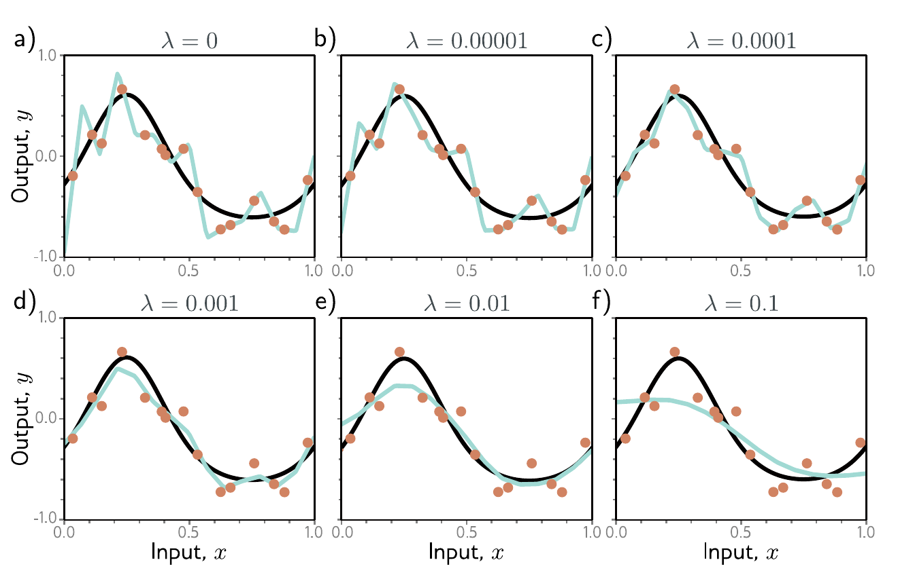

**图 7-1　L2 正则化强度的影响。** 黑线是真实函数，橙点是带噪训练样本，青线是拟合函数。\(\lambda\) 太小时模型穿过几乎所有带噪样本，方差较高；适中的 \(\lambda\) 使函数更平滑；\(\lambda\) 过大时正则项压过数据损失，偏差上升并出现欠拟合。

对当前定义 \(L_{L2}=L_{\text{data}}+\lambda\lVert w\rVert_2^2/2\)，普通梯度下降的更新为：

$$
w_{t+1}
=w_t-\alpha\left(\nabla_wL_{\text{data}}+\lambda w_t\right)
=(1-\alpha\lambda)w_t-\alpha\nabla_wL_{\text{data}}
$$

它与每步先把权重乘以 \(1-\alpha\lambda\) 的**权重衰减（weight decay）**等价。若正则项没有 \(1/2\)，系数会相差 2。对 Adam 等自适应优化器，L2 梯度也会被逐参数缩放，因而不再等价于直接衰减参数；AdamW 将权重衰减与损失梯度解耦。

#### 7.2.2 L1 正则化

L1 正则化使用绝对值惩罚：

$$
L_{L1}=L_{\text{data}}+\lambda\sum_j|w_j|
$$

L1 倾向产生稀疏权重，可用于特征选择或稀疏建模。但普通梯度优化不保证得到大量严格为 0 的参数；若目标是真正压缩和加速，还要结合近端优化、结构化剪枝或稀疏算子。

L1 和 L2 还可以组合为 **Elastic Net**：

$$
L_{\text{EN}}
=L_{\text{data}}
+\lambda_1\lVert w\rVert_1
+\frac{\lambda_2}{2}\lVert w\rVert_2^2
$$

它同时利用 L1 的稀疏倾向和 L2 的平滑收缩，但两个系数都必须通过验证集选择。

### 7.3 隐式正则化

有些训练过程即使没有显式惩罚项，也不会中立地走向任意一个最小值，而会偏向某类解，这称为**隐式正则化（implicit regularization）**。在过参数化模型存在大量零训练损失解时，“优化器偏向哪一个解”尤其重要。

#### 7.3.1 梯度下降的隐式正则化

令 \(L(\phi)\) 为全批量损失。步长无穷小时，梯度下降可写为连续的梯度流：

$$
\frac{\mathrm d\phi}{\mathrm dt}
=-\nabla_\phi L(\phi)
$$

实际训练采用有限学习率 \(\alpha\) 的离散更新：

$$
\phi_{t+1}
=\phi_t-\alpha\nabla_\phi L(\phi_t)
$$

有限步长会使离散轨迹偏离连续梯度流。下面用**后向误差分析（backward error analysis）**寻找一个修正后的连续系统，使它在一个步长后与离散更新一致。记负梯度为：

$$
g(\phi)=-\nabla_\phi L(\phi)
$$

设修正后的连续动力学为：

$$
\frac{\mathrm d\phi}{\mathrm dt}
=g(\phi)+\alpha g_1(\phi)+O(\alpha^2)
$$

从 \(\phi_0\) 出发，对时间 \(t=\alpha\) 做二阶泰勒展开：

$$
\begin{aligned}
\phi(\alpha)
&=\phi_0
+\alpha\frac{\mathrm d\phi}{\mathrm dt}
+\frac{\alpha^2}{2}\frac{\mathrm d^2\phi}{\mathrm dt^2}
+O(\alpha^3)\\
&=\phi_0+\alpha g(\phi_0)
+\alpha^2\left[
g_1(\phi_0)
+\frac{1}{2}J_g(\phi_0)g(\phi_0)
\right]
+O(\alpha^3),
\end{aligned}
$$

其中 \(J_g\) 是 \(g\) 对参数的雅可比矩阵。要与离散更新 \(\phi_1=\phi_0+\alpha g(\phi_0)\) 匹配到二阶，需要：

$$
g_1(\phi)=-\frac{1}{2}J_g(\phi)g(\phi)
$$

由于 \(g=-\nabla L\)、\(J_g=-\nabla^2L\)，修正后的梯度流为：

$$
\frac{\mathrm d\phi}{\mathrm dt}
\approx
-\nabla L(\phi)
-\frac{\alpha}{2}\nabla^2L(\phi)\nabla L(\phi)
$$

又因为：

$$
\nabla_\phi\left(\frac{1}{2}\lVert\nabla_\phi L\rVert_2^2\right)
=\nabla_\phi^2L\,\nabla_\phi L,
$$

所以它等价于在如下**修正损失**上做连续梯度下降：

$$
\boxed{
\widetilde L_{\text{GD}}(\phi)
=L(\phi)
+\frac{\alpha}{4}
\left\lVert\nabla_\phi L(\phi)\right\rVert_2^2
}
$$

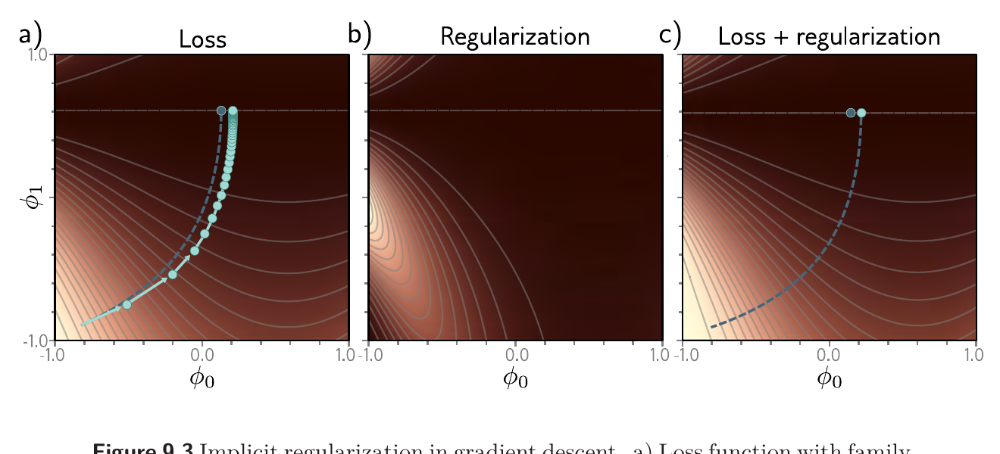

**图 7-2　梯度下降的隐式正则化。** 有限步长对应的修正项惩罚梯度范数较大的陡峭区域。它在梯度为 0 的极小值处也为 0，所以不一定改变原损失极小值本身，却会改变到达这些极小值的路径，从而可能选择不同的最终解。

上述结论是基于小步长展开得到的低阶近似，用于解释有限学习率造成的优化偏好；不能把它理解为任意学习率、动量或自适应优化器都在精确优化这个修正损失。

#### 7.3.2 随机梯度下降的隐式正则化

将一个 epoch 划分为 \(B\) 个等大小 mini-batch，记第 \(b\) 个批次的样本集合为 \(\mathcal B_b\)。全数据平均损失与批次平均损失分别为：

$$
L(\phi)=\frac{1}{I}\sum_{i=1}^{I}\ell_i(\phi),
\qquad
L_b(\phi)=\frac{1}{|\mathcal B_b|}
\sum_{i\in\mathcal B_b}\ell_i(\phi)
$$

在学习率较小、批次等大小，并对一个 epoch 内可能的批次顺序取平均的近似下，对每个批次的离散更新做与上一节相同的分析，可得：

$$
\widetilde L_{\text{SGD}}(\phi)
\approx
L(\phi)
+\frac{\alpha}{4B}
\sum_{b=1}^{B}
\left\lVert\nabla_\phi L_b(\phi)\right\rVert_2^2
$$

因为 \(\nabla L=(1/B)\sum_b\nabla L_b\)，利用方差分解：

$$
\frac{1}{B}\sum_{b=1}^{B}\lVert\nabla L_b\rVert_2^2
=\lVert\nabla L\rVert_2^2
+\frac{1}{B}\sum_{b=1}^{B}
\lVert\nabla L_b-\nabla L\rVert_2^2,
$$

可把修正损失写成：

$$
\boxed{
\widetilde L_{\text{SGD}}(\phi)
=L(\phi)
+\frac{\alpha}{4}\lVert\nabla L(\phi)\rVert_2^2
+\frac{\alpha}{4B}\sum_{b=1}^{B}
\left\lVert\nabla L_b(\phi)-\nabla L(\phi)\right\rVert_2^2
}
$$

第一项修正与全批量梯度下降相同；第二项是**批次梯度的方差**，惩罚不同批次对下降方向意见不一致的位置。因此，SGD 会偏向各批次都拟合得较好、批次梯度较稳定的区域，而不只是平均损失相同但部分批次特别差的区域。

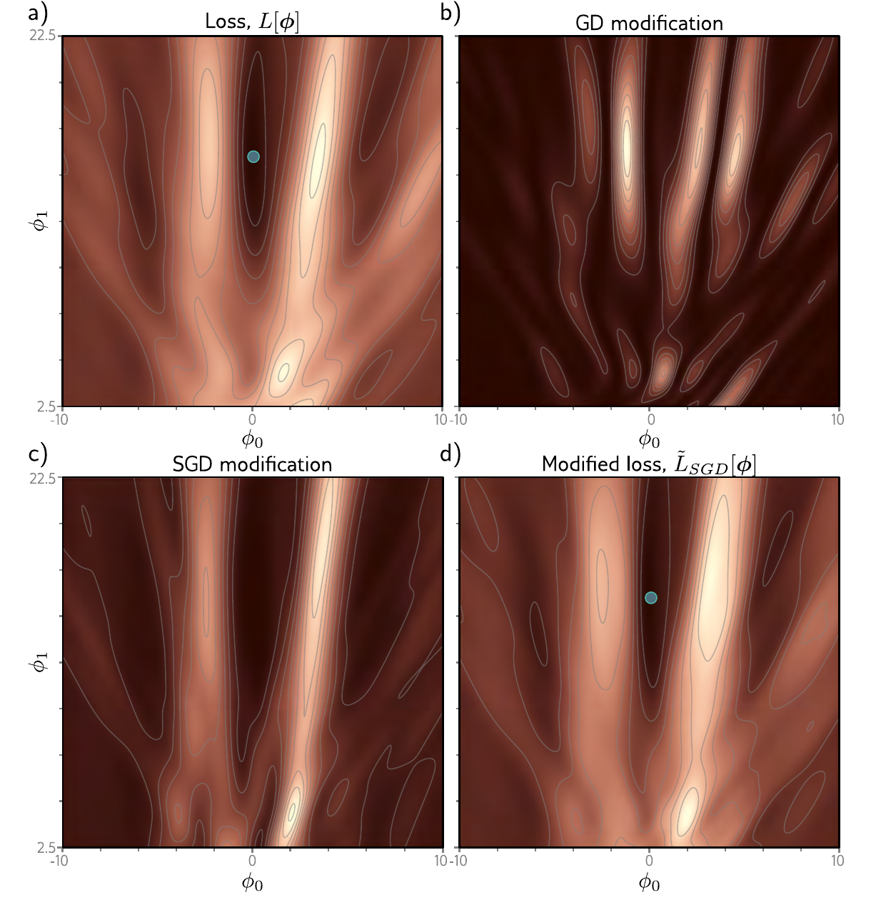

**图 7-3　SGD 的隐式正则化。** 原始损失、GD 的梯度范数修正、SGD 额外的批次梯度方差修正共同形成有效的修正损失。

学习率和批量大小会同时改变优化噪声、训练步数和上述隐式偏好。较小批量在不少任务上泛化更好，但这不是无条件规律；比较时必须控制训练样本量或计算预算，并重新匹配学习率与训练时长。

#### 7.3.3 结构和训练过程的其他隐式偏好

- **初始化**会限定优化轨迹的起点；例如在线性欠定问题中，从零附近出发的梯度下降往往偏向较小范数的解。
- **网络结构**本身带有归纳偏置；例如卷积的局部连接与权值共享，限制了模型表示函数的方式，使其更适合网格数据。
- **训练时长、学习率、批量大小和优化器**会共同决定有效可达的解，而不只是决定“多久收敛”。

隐式正则化依赖数据与完整训练过程，难以像显式正则化系数 \(\lambda\) 那样单独控制，也不能替代验证集评估。

### 7.4 提升泛化的常用方法

#### 7.4.1 Early Stopping

训练过程中同时监控验证集指标。当训练损失继续下降，而验证损失在一段时间内不再改善时停止训练，并恢复验证集最佳检查点。

Early Stopping 同时限制了训练时间和参数偏离小值初始化的程度，因此与限制权重大小、降低有效模型容量有相似作用。在二次损失且从零初始化等特定条件下，它甚至可以近似对应 L2 正则化，其有效强度与学习率和停止时间的乘积成反比。

工程上应每隔固定步数评估验证指标并保存检查点，最后恢复验证指标最好的参数，而不是简单保留训练停止时的参数。停止时机必须依据验证集，不能反复查看测试集决定。

#### 7.4.2 模型集成

分别训练多个具有不同初始化、数据顺序或结构的模型，再平均其预测：

$$
p(y\mid x)=\frac{1}{M}\sum_{m=1}^{M}p_m(y\mid x)
$$

若各模型的错误不完全相关，集成可以降低预测方差。代价是训练、存储和推理成本大致随模型数量增加。

分类任务可以平均概率或 softmax 前的 logits，也可以采用多数投票；回归任务还可用中位数增强对异常预测的稳健性。无论使用哪种聚合方式，都应在验证集上固定规则。

**Bagging（bootstrap aggregating）**是经典的集成构造方式：从原训练集有放回地重复采样出多个同等大小的数据集，每个重采样数据集独立训练一个模型，再平均预测。同一样本可能在某个数据集中出现多次，也可能完全不出现；这会降低单个异常样本对所有模型的共同影响。Bagging 对训练数据变化敏感的高方差模型尤其有效。

#### 7.4.3 Dropout

训练时，Dropout 为激活采样二元掩码。设丢弃概率为 \(p\)：

$$
m_i\sim\operatorname{Bernoulli}(1-p),
\qquad
\widetilde{h}_i=\frac{m_i h_i}{1-p}
$$

这种反向 Dropout 在训练时除以保留概率 \(1-p\)，使激活的期望尺度保持不变；推理时关闭随机丢弃，直接使用完整网络。它减少特征之间的共适应，也可近似理解为大量共享参数的子网络集成。另一种做法是推理时仍保留 Dropout，多次前向传播后平均结果，即 **Monte Carlo Dropout**，它还可用于近似评估预测不确定性。

框架参数通常表示**丢弃概率**而不是保留概率。\(p\) 越大，正则化越强，也越容易欠拟合，必须根据网络位置和验证集表现选择。

#### 7.4.4 注入噪声

可向输入、隐藏表示、权重或梯度加入适度噪声，使模型对小扰动保持稳定。Dropout 本身就是施加在隐藏激活上的乘性伯努利噪声。

- **输入噪声**迫使邻近输入得到相近预测，使函数更平滑；在回归等特定条件下，可解释为惩罚输出对输入的导数。
- **权重噪声**要求小幅改变参数后预测仍然合理，因此倾向把模型推向较宽、较平坦的极小值区域。
- **对抗训练**主动寻找能最大程度改变输出的小输入扰动，相当于训练模型抵抗局部最坏情况，而不是随机情况。

噪声过强会破坏真实信号，因此噪声类型、强度和注入位置都要根据验证集选择。

#### 7.4.5 标签平滑

普通多分类交叉熵使用 one-hot 目标，会持续推动正确类别概率接近 1。标签平滑假设一小部分标签可能有误，把正确类别上的部分概率质量平均分配给其他类别。若类别数为 \(K\)，平滑比例为 \(\rho\)，可定义：

$$
q_k=
\begin{cases}
1-\rho, & k=y,\\
\dfrac{\rho}{K-1}, & k\ne y,
\end{cases}
\qquad
L_{\text{LS}}=-\sum_{k=1}^{K}q_k\log p_k
$$

这会抑制极端 logit 和过度自信的输出，通常有助于泛化，也可能改善概率校准，但不构成保证。部分框架采用 \(q=(1-\epsilon)\,\text{one-hot}+\epsilon/K\) 的约定，此时正确类别概率为 \(1-\epsilon+\epsilon/K\)；使用时要确认参数定义。

#### 7.4.6 贝叶斯方法

贝叶斯推断不只寻找单个最优参数，而是计算参数后验：

$$
p(\phi\mid D)
=\frac{p(D\mid\phi)p(\phi)}{p(D)}
\propto p(D\mid\phi)p(\phi)
$$

预测时对参数不确定性进行平均：

$$
p(y\mid x,D)
=\int p(y\mid x,\phi)p(\phi\mid D)\,\mathrm d\phi
$$

这相当于一个由后验概率加权的无限模型集成，可同时给出预测和不确定性。神经网络的完整后验通常难以精确表示和积分，只能采用变分推断、MCMC 或其他近似方法，因此训练与推理成本通常高于普通点估计。

#### 7.4.7 迁移学习、多任务学习与自监督学习

- **迁移学习**先在数据更充足的相关任务上预训练，再替换输出层并只训练新层，或对整个网络进行微调；它相当于从一个更合理的参数区域开始目标任务训练，详见第 12 章。
- **多任务学习**共享部分模型，同时学习多个相关任务；辅助任务会提供额外约束，减少表示只记忆单一训练集偶然规律的可能。
- **生成式自监督学习**遮盖输入的一部分并训练模型恢复它，例如预测被遮盖的图像块或词元。
- **对比式自监督学习**拉近相关样本或同一样本不同视图的表示，同时区分无关样本。

这些方法本质上都在利用目标任务以外的信息。只有源数据、辅助任务或自监督目标与目标任务具有可迁移结构时才有效，否则可能出现负迁移。

#### 7.4.8 数据增强

数据增强通过保持标签语义的变换构造新样本，例如图像裁剪与翻转、音频时移、文本遮盖，以及 Mixup、CutMix 等样本组合方法。它不只是“增加数据量”，更是在告诉模型哪些变化不应改变预测。

增强必须符合任务语义。例如数字识别中的任意旋转可能改变类别，医学图像中的翻转也未必合理。

### 7.5 四种改善泛化的机制

UDL 将上述方法归纳为四种主要机制。它们不是互斥分类：同一种方法可能同时通过多种机制起作用。

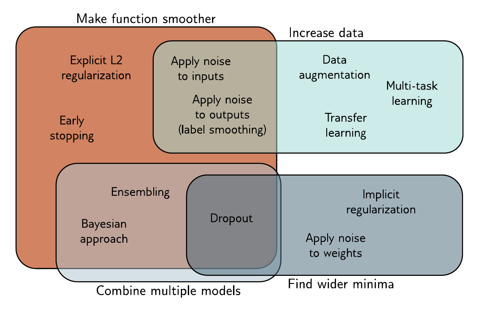

**图 7-4　改善泛化的四种机制。** 不同方法分别通过促进函数平滑、增加有效数据、组合多个模型或寻找更宽的极小值起作用，部分方法位于多个机制的交集。

| 机制 | 直观目的 | 代表方法 |
| --- | --- | --- |
| 使函数更平滑 | 避免预测在相邻输入间剧烈变化 | L2、Early Stopping、输入噪声、标签平滑 |
| 增加有效数据 | 用更多样本或监督信号约束函数 | 数据增强、迁移学习、多任务学习、自监督学习 |
| 组合多个模型 | 平均不同拟合结果，降低估计不确定性和方差 | 模型集成、Bagging、贝叶斯模型平均、Dropout |
| 寻找更宽的极小值 | 让参数有小误差时性能仍稳定 | GD/SGD 隐式正则化、权重噪声、Dropout |

此外，选择符合任务结构的模型架构也是重要的泛化手段。例如卷积通过局部连接和权值共享编码空间先验，减少必须从数据中独立学习的自由度。

### 7.6 怎样选择正则化方法

| 现象或约束 | 优先尝试 |
| --- | --- |
| 训练集很好、验证集明显较差 | 数据增强、权重衰减、Early Stopping |
| 标注数据少，但有相关预训练模型 | 迁移学习或自监督预训练 |
| 全连接层过拟合明显 | Dropout、权重衰减 |
| 希望降低预测方差且推理预算充足 | 模型集成 |
| 分类输出过度自信、概率校准较差 | 标签平滑，并检查校准指标 |
| 希望得到稀疏参数或选择特征 | L1 或结构化稀疏方法 |
| 需要表达预测不确定性 | 贝叶斯方法或深度集成 |

实际调整时一次只改变少数因素，并保持数据划分、训练预算和评估指标一致。BatchNorm 的首要作用是稳定优化，而不是通用正则化方法；它将在第 9 章结合残差网络说明。

### 7.7 本章小结

- 严格意义的正则化在数据损失上加入显式惩罚；广义上也包括所有改善泛化的方法。
- 显式正则项等价于 MAP 中的负对数参数先验；零均值高斯先验导出 L2 正则化。
- 有限步长 GD 可近似为额外惩罚梯度范数；SGD 还会惩罚不同批次梯度之间的方差。这些近似解释了优化过程对最终解的隐式偏好。
- Early Stopping、集成与 Bagging、Dropout、噪声、标签平滑、贝叶斯方法、迁移与自监督学习、数据增强都能从不同角度改善泛化。
- 这些方法主要通过四类机制起作用：使函数更平滑、增加有效数据、组合多个模型、寻找更宽的极小值。
- 正则化主要处理高方差和过拟合；若训练误差本身很高，应先检查优化、数据和模型容量。所有强度与方法选择都应由验证集完成，正则化过强同样会造成欠拟合。

## 8. 卷积神经网络 CNN

> 本章对应 Simon J. D. Prince 的 *Understanding Deep Learning* 第 10 章「Convolutional networks」。本次补充的四幅配图取自原书图 10.4、10.8、10.18 和 10.19（CC BY-NC-ND）。

卷积网络不是把全连接网络简单换成“小窗口计算”，而是针对图像等网格数据的三个性质设计的：

1. **输入维度很高**：一张 \(224\times224\) 的 RGB 图像包含 \(224\times224\times3=150{,}528\) 个输入。若第一隐藏层也有同等数量的单元，单个全连接层就需要约 \(150{,}528^2\approx226.6\) 亿个权重。
2. **邻近位置具有更强的统计关联**：边缘、纹理等局部模式由附近像素共同形成；全连接层却把任意两个位置一视同仁，没有“附近”的概念。
3. **语义通常对位置变化具有稳定性**：物体平移少量像素后仍是同一物体。若每个位置使用独立参数，模型就要在每个位置重复学习相同模式。

卷积用**局部连接**利用邻近关系，用**权值共享**在所有位置复用模式，因此显著减少参数，并把“同一模式可能出现在不同位置”这一先验直接编码进模型。

### 8.1 不变性与等变性

卷积神经网络（Convolutional Neural Network，CNN）利用网格数据中的局部规律和位置共享规律：

- **局部连接**：每个输出位置只读取输入的局部区域。
- **权值共享**：同一个卷积核在不同位置重复使用。
- **层次化特征**：浅层识别局部模式，深层逐步组合为更大范围的结构。

若变换输入后，输出以相同方式变换，则称模型对该变换**等变（equivariant）**。以平移算子 \(T\) 为例：

$$
f(Tx)=T f(x)
$$

卷积对平移近似等变：输入中的目标移动，特征图中的响应也随之移动。若变换输入后最终输出不变，则称为**不变（invariant）**：

$$
f(Tx)=f(x)
$$

图像分类常希望最终类别对小幅平移不敏感；目标检测和分割则需要输出位置随输入一起移动。池化、全局平均池化和数据增强能增加一定的平移鲁棒性，但普通 CNN 并不天然具有旋转、缩放不变性。

### 8.2 一维卷积

#### 8.2.1 卷积运算

对单通道一维输入 \(x\) 和长度为 \(K\) 的卷积核 \(w\)，输出位置 \(i\) 可写为：

$$
z_i=b+\sum_{k=0}^{K-1}w_kx_{i+k}
$$

深度学习框架通常直接将局部窗口与卷积核逐元素相乘，并不翻转卷积核；严格说这是**互相关（cross-correlation）**，但工程上仍称为卷积。

卷积层还要加入偏置并通过激活函数。以核大小为 3、步长和扩张率均为 1 的单通道卷积为例：

$$
h_i
=a\!\left(
b+w_1x_{i-1}+w_2x_i+w_3x_{i+1}
\right)
$$

同样有 \(D\) 个输入和输出时，全连接层需要 \(D^2\) 个权重与 \(D\) 个偏置，而上面的卷积层只需要 3 个共享权重和 1 个共享偏置。

#### 8.2.2 卷积是稀疏且参数共享的全连接层

先忽略激活函数，把一维卷积写成矩阵乘法：

$$
\mathbf z=\mathbf W_{\text{conv}}\mathbf x+b\mathbf 1
$$

以核 \([w_1,w_2,w_3]\)、步长为 1、VALID 填充为例，卷积矩阵具有如下结构：

$$
\mathbf W_{\text{conv}}
=
\begin{bmatrix}
w_1&w_2&w_3&0&0&\cdots\\
0&w_1&w_2&w_3&0&\cdots\\
0&0&w_1&w_2&w_3&\cdots\\
\vdots&&\ddots&\ddots&\ddots&\ddots
\end{bmatrix}
$$

它是全连接权重矩阵的一个受约束特例：

- **局部连接对应稀疏性**：窗口以外的矩阵元素固定为 0；
- **权值共享对应重复参数**：每一行平移后仍使用同一组 \(w_1,w_2,w_3\)；
- **步长大于 1 对应间隔保留矩阵行**：只在部分位置生成输出。

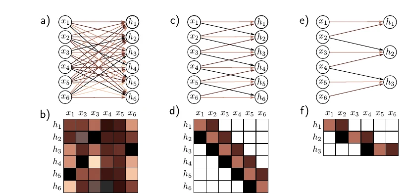

**图 8-1　全连接与卷积的矩阵结构。** 左侧全连接层的每个输入连接所有输出；中间卷积层只保留局部连接，相同颜色表示共享参数；右侧步长为 2 时只计算间隔位置。卷积并不比全连接层拥有更大的函数集合，而是把搜索限制在更符合网格数据结构的函数中。

这个限制就是卷积的**归纳偏置（inductive bias）**：若任务确实具有局部性和平移规律，它能减少模型必须从有限训练数据中自行发现的关系；若任务不具备这些规律，这种限制也可能不合适。

#### 8.2.3 多通道卷积

若输入有 \(C_{\text{in}}\) 个通道、输出有 \(C_{\text{out}}\) 个通道，则每个输出通道都有一组跨越全部输入通道的卷积核：

$$
z_{i,c_{out}}=b_{c_{out}}+
\sum_{c=1}^{C_{\text{in}}}\sum_{k=0}^{K-1}
w_{k,c,c_{out}}x_{i+k,c}
$$

一维 CNN 常用于音频波形、时间序列和 token embedding 序列。它可以并行计算全部位置，但只能通过感受野内的输入建立依赖。

该层共有 \(K C_{\text{in}}C_{\text{out}}\) 个卷积权重和 \(C_{\text{out}}\) 个偏置。多个输出通道不是对同一结果的复制，而是使用不同卷积核学习不同局部特征。

#### 8.2.4 Kernel、Stride、Padding 与 Dilation

- **Kernel Size \(K\)**：每次读取的局部窗口大小。
- **Stride \(S\)**：卷积核每次移动的步长。
- **Padding \(P\)**：在边缘补充的元素数。
- **Dilation \(D\)**：卷积核相邻元素在输入上的间隔。

输入长度为 \(H\) 时，输出长度为：

$$
H_{\text{out}}=
\left\lfloor
\frac{H+2P-D(K-1)-1}{S}
\right\rfloor+1
$$


- **VALID** 不填充，输出通常变短。
- **SAME** 选择适当填充，使步长为 1 时输出长度保持不变。
- 除补零外，还可采用反射填充或循环填充；不同边界假设会影响靠近边缘的输出。
- 扩张卷积的有效核大小为 \(K_{\text{eff}}=D(K-1)+1\)，可以不增加参数就扩大感受野。

#### 8.2.5 卷积层与感受野

卷积层通常由“卷积 + 激活函数”组成，多层卷积逐步把局部模式组合成更大尺度的模式。**感受野**是某层一个位置在原始输入上能够利用的范围。

若连续堆叠 \(L\) 层步长为 1、核大小为 \(K\) 的卷积，则理论感受野为：

$$
R_L=1+L(K-1)
$$

两个 \(3\) 元素卷积的感受野等于一个 \(5\) 元素卷积，但参数较少，并多加入一次非线性变换。增大步长、池化和扩张卷积也会更快扩大感受野。

上式只适用于所有层步长为 1、扩张率为 1 且核大小相同的情况。对不同配置，定义：

- \(R_l\)：第 \(l\) 层一个位置在原输入上的理论感受野大小；
- \(j_l\)：第 \(l\) 层相邻两个位置在原输入上的间隔，也称 jump；
- \(K_l,S_l,D_l\)：第 \(l\) 层的核大小、步长和扩张率。

从输入层 \(R_0=1,j_0=1\) 开始，有通用递推：

$$
\boxed{
\begin{aligned}
j_l&=j_{l-1}S_l,\\
R_l&=R_{l-1}+(K_l-1)D_lj_{l-1}.
\end{aligned}
}
$$

原因是第 \(l\) 层卷积核的首尾相隔 \((K_l-1)D_l\) 个上一层位置，而上一层每移动一个位置，相当于在原输入移动 \(j_{l-1}\) 个位置。Padding 主要改变边界和感受野中心的位置，不改变这条理论尺寸递推。

例如依次使用：

1. \(K_1=5,S_1=2,D_1=1\)；
2. \(K_2=3,S_2=1,D_2=1\)；
3. \(K_3=5,S_3=1,D_3=2\)；

则：

$$
\begin{array}{c|c|c}
\text{层} & j_l & R_l\\
\hline
0&1&1\\
1&2&5\\
2&2&9\\
3&2&25
\end{array}
$$

第三层只使用 5 个卷积核参数位置，但扩张率为 2，最终一个位置已经能利用原输入上长度为 25 的区域。理论感受野表示“可能影响该位置”的最大范围；实际训练中，远处输入的影响通常更弱，因此有效感受野往往小于理论值。

#### 8.2.6 MNIST-1D：卷积归纳偏置的作用

UDL 使用 MNIST-1D 对比卷积网络和全连接网络。输入是 40 维的一维数字模板，经过随机平移、缩放和噪声等变换生成；任务是预测 10 个类别。

卷积模型包含三个隐藏层，每层 15 个通道，均使用核大小 3、步长 2 和 VALID 填充，空间长度依次为：

$$
40\longrightarrow19\longrightarrow9\longrightarrow4
$$

最后把 \(4\times15=60\) 个隐藏单元展开，经全连接层输出 10 个类别。卷积模型参数量为：

$$
\begin{aligned}
N_{\text{CNN}}
&=(3\times1\times15+15)\\
&\quad+2(3\times15\times15+15)\\
&\quad+(60\times10+10)\\
&=2{,}050.
\end{aligned}
$$

对照的全连接模型使用相同隐藏层数以及相同隐藏单元数量 \(285,135,60\)，参数量为：

$$
\begin{aligned}
N_{\text{FC}}
&=(40\times285+285)\\
&\quad+(285\times135+135)\\
&\quad+(135\times60+60)\\
&\quad+(60\times10+10)\\
&=59{,}065.
\end{aligned}
$$

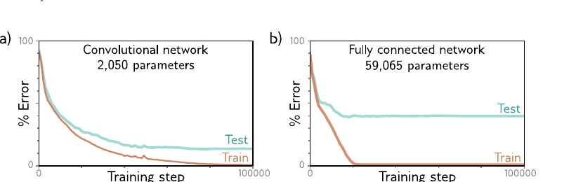

**图 8-2　MNIST-1D 对照实验。** 两个模型最终都把训练错误降到接近 0；卷积网络测试错误约为 17%，全连接网络约为 40%。全连接网络的函数集合包含能够复现卷积模型的解，但训练并没有自动找到这种具有平移规律的解。

这个结果不能简单解释为“参数越少，泛化越好”，因为现代过参数化模型并不遵循这一单调规律。更关键的原因是卷积对所有位置采用相同处理方式，与数据由平移模板生成的机制相符：

- 全连接网络必须分别学习数字模板出现在每个位置时的模式；
- 卷积网络在一个位置学到的模式会自动复用于其他位置；
- 卷积把候选函数限制为具有局部性和参数共享的函数，相当于对不符合该先验的映射施加极强约束。

因此，架构本身也是模型选择和正则化的一部分。只有当局部性和平移共享符合任务结构时，这种归纳偏置才会带来优势。

### 8.3 二维卷积

二维卷积把一维局部窗口扩展为图像上的二维窗口。设输入空间大小为 \(H\times W\)，输入、输出通道数分别为 \(C_{\text{in}}\) 和 \(C_{\text{out}}\)，卷积核为 \(K_h\times K_w\)。

设输入为 \(X\)，卷积权重为 \(W\)，输出通道 \(c_o\) 在空间位置 \((i,j)\) 的预激活为：

$$
Z_{i,j,c_o}
=b_{c_o}
+\sum_{c_i=1}^{C_{\text{in}}}
\sum_{u=0}^{K_h-1}
\sum_{v=0}^{K_w-1}
W_{u,v,c_i,c_o}\,
X_{iS_h+uD_h-P_h,\;jS_w+vD_w-P_w,\;c_i}
$$

再通过激活函数得到：

$$
H_{i,j,c_o}=a(Z_{i,j,c_o})
$$

每个输出通道都拥有一组覆盖所有输入通道的 \(K_h\times K_w\) 核，并在所有空间位置共享。超出有效输入范围的位置由 Padding 规则决定；深度学习框架通常实现的是不翻转卷积核的互相关。

若高度和宽度使用各自的步长、填充和扩张率，则：

$$
H_{\text{out}}
=\left\lfloor
\frac{H+2P_h-D_h(K_h-1)-1}{S_h}
\right\rfloor+1
$$

$$
W_{\text{out}}
=\left\lfloor
\frac{W+2P_w-D_w(K_w-1)-1}{S_w}
\right\rfloor+1
$$

权重张量形状可记为 \(K_h\times K_w\times C_{\text{in}}\times C_{\text{out}}\)，加上每个输出通道一个偏置，因此参数量为：

$$
(K_hK_wC_{\text{in}}+1)C_{\text{out}}
$$

例如输入通道数为 3，使用 16 个 \(5\times5\) 卷积核，参数量为：

$$
(5\times5\times3+1)\times16=1216
$$

参数量与输入图像的高度和宽度无关，这是权值共享相对全连接层的核心优势。奇数卷积核具有明确的中心位置，也容易通过对称填充保持空间尺寸。

典型 CNN 由卷积、激活、下采样和任务输出层组成：

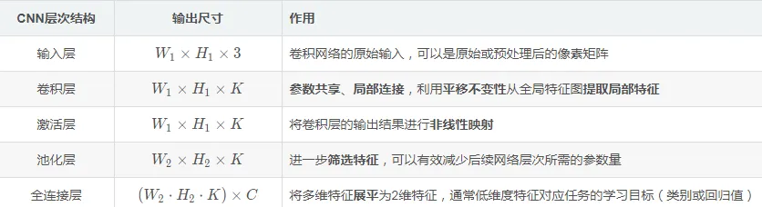

浅层卷积通常响应边缘和纹理，深层逐步组合出部件和语义特征。具体学到什么由数据、任务和训练过程共同决定。

### 8.4 下采样、上采样与通道变换

#### 8.4.1 下采样

- **Max Pooling**：取窗口内最大值，保留最强响应。
- **Average Pooling**：取窗口内平均值。
- **步长卷积**：用可学习的卷积完成下采样。
- **Global Average Pooling**：将每个通道的全部空间位置平均为一个值，常用于分类头。

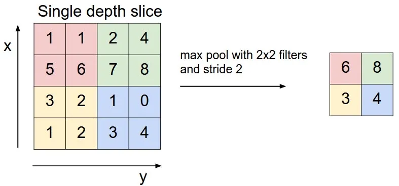

池化通常没有可学习参数并保持通道数；卷积有可学习参数并可改变通道数。下采样降低计算量并扩大后续层的有效感受野，但也会丢失空间细节。

步长为 2 的抽样相当于每隔一个位置保留结果；Max Pooling 和 Average Pooling 则分别汇总每个局部窗口的最大值和均值。它们通常对每个通道独立执行，因此空间高度和宽度降低而通道数不变。Max Pooling 对很小的局部平移可能保持相同最大值，从而引入部分平移不变性，但跨越池化窗口边界的移动仍可能改变输出。

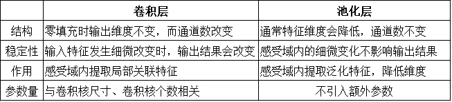

#### 8.4.2 上采样

常见上采样方式包括：

- **最近邻复制**：将每个位置复制到更高分辨率网格，速度快，但输出可能呈块状；
- **双线性插值**：根据相邻位置线性插值，输出更平滑，但本身没有可学习参数；
- **Max Unpooling**：下采样时保存每个池化窗口中最大值的位置，上采样时把值放回原最大值位置，其余位置填 0；
- **转置卷积**：学习如何把每个输入位置分配到多个输出位置。

转置卷积使用与普通卷积线性算子转置对应的运算扩大空间尺寸。它不是普通卷积的数学逆运算，也不能保证恢复原始输入。单个维度的输出大小为：

$$
H_{\text{out}}=(H_{\text{in}}-1)S-2P+D(K-1)+P_{\text{out}}+1
$$

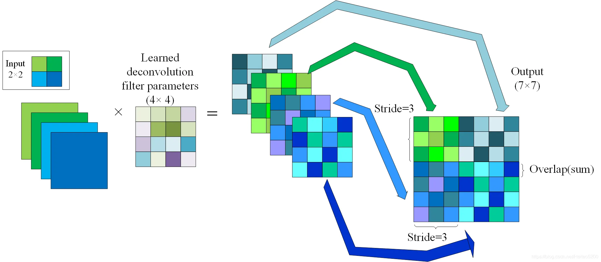

转置卷积中多个输入可能向同一输出位置贡献数值，因此要重叠相加；核大小与步长搭配不当时可能产生棋盘格伪影。工程上常采用“最近邻或双线性插值 + 普通卷积”，把尺寸变换与特征学习分开。

Max Unpooling 也不是 Max Pooling 的逆运算：池化窗口内除最大值以外的信息已经丢失，它只能利用保存的位置把最大值放回稀疏网格，后续仍需卷积填补信息。

#### 8.4.3 改变通道数

\(1\times1\) 卷积不聚合相邻空间位置，只在每个位置混合通道，可用于升维、降维和构造瓶颈层。它常放在昂贵的空间卷积前后，以控制计算量。

其计算为：

$$
Z_{i,j,c_o}
=b_{c_o}
+\sum_{c_i=1}^{C_{\text{in}}}
W_{c_i,c_o}X_{i,j,c_i}
$$

因此，\(1\times1\) 卷积等价于在每个空间位置运行同一个全连接层：它不改变感受野，却能学习通道之间的组合，并把通道数从 \(C_{\text{in}}\) 变为 \(C_{\text{out}}\)。

### 8.5 高效与特殊卷积

- **扩张卷积**：在卷积核元素之间插入间隔，不增加参数量即可扩大感受野。
- **深度可分离卷积**：先逐通道做空间卷积，再用 \(1\times1\) 卷积混合通道，参数量约为
  \(K^2C_{\text{in}}+C_{\text{in}}C_{\text{out}}\)，通常远小于标准卷积的 \(K^2C_{\text{in}}C_{\text{out}}\)。
- **非对称卷积**：把 \(3\times3\) 分解为 \(3\times1\) 和 \(1\times3\)，在保持有效感受野的同时减少空间核计算。实际收益还取决于通道数和硬件实现。
- **三维卷积**：沿三个空间或时空维度移动，常用于视频和医学体数据，但计算与显存成本更高。

### 8.6 CNN 的典型任务

#### 8.6.1 图像分类

分类模型逐步下采样并扩大通道数，最后通过全局平均池化或全连接层输出每个类别的分数。一张图像对应一个类别向量，重点是“图中是什么”。

UDL 以 ImageNet 为例说明典型分类流程：输入通常整理成 \(224\times224\) RGB 图像，输出经过 Softmax 得到 1000 个类别的概率。AlexNet 依次使用大步长卷积、池化和多个空间卷积，把空间分辨率逐步降低、通道数逐步提高，最后展开为向量并通过全连接层分类。其约 6000 万个参数中，大部分位于全连接层。VGG 延续相同主线，但更多使用规则的 \(3\times3\) 卷积并加深网络，说明增加深度一度持续改善图像分类性能，也为下一章“继续加深为什么会退化”提供背景。

#### 8.6.2 目标检测

检测需要同时输出每个目标的类别、位置和置信度，重点是“是什么、在哪里”。模型通常使用卷积主干提取多尺度特征，再由检测头预测边界框和类别。

UDL 使用早期 YOLO 说明单阶段检测器的输出组织方式。输入图像被划分为 \(7\times7\) 网格，每个网格位置预测：

- 该位置对应的类别；
- 固定数量的边界框；
- 每个边界框的中心 \((x,y)\)、宽高 \((w,h)\) 和置信度。

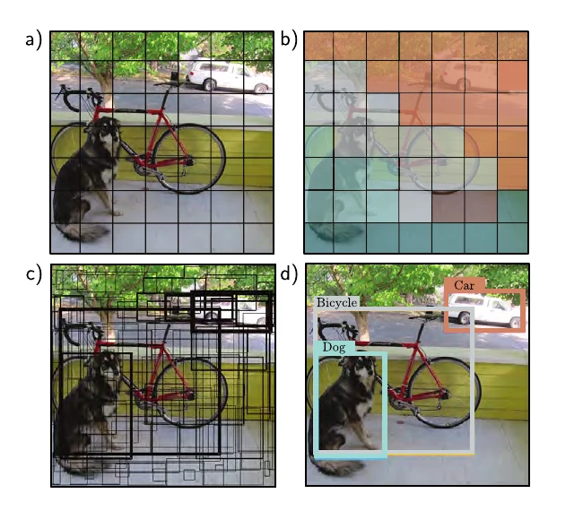

**图 8-3　早期 YOLO 检测流程。** 模型先在规则网格上预测类别和多个候选框，再过滤低置信度框，并抑制属于同一目标的重复框，只保留更可信的结果。

重复框通常根据交并比（Intersection over Union，IoU）衡量重叠：

$$
\operatorname{IoU}(A,B)
=\frac{|A\cap B|}{|A\cup B|}
$$

经典非极大值抑制（NMS）按置信度从高到低选择框，并删除与已选框 IoU 超过阈值的同类候选框。现代 YOLO 的输出和训练方式已经演进，但“密集预测类别、位置、置信度，再消除重复预测”这一核心流程仍然成立。

#### 8.6.3 语义分割

语义分割为每个像素预测类别，因此输出必须保持或恢复空间分辨率。全卷积网络使用卷积、下采样和上采样产生密集预测；编码器提取语义，解码器恢复空间细节。

UDL 中的早期分割网络把 \(224\times224\) RGB 图像编码为低分辨率的全局表示，再用 Max Unpooling 和卷积/转置卷积逐步恢复空间分辨率，最后通过 \(1\times1\) 卷积产生 21 个通道，并在每个像素位置独立执行 Softmax：

$$
p(y_{i,j}=c\mid X)
=\frac{\exp Z_{i,j,c}}
{\sum_{c'=1}^{C}\exp Z_{i,j,c'}}
$$

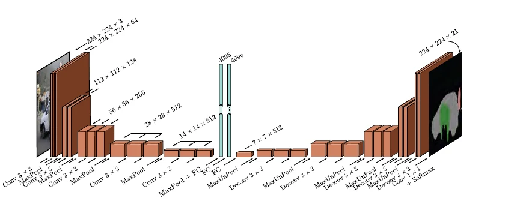

**图 8-4　早期语义分割编码器—解码器。** 编码器降低空间分辨率、聚合整图语义；解码器利用上采样和卷积恢复分辨率，最终输出与输入同尺度的逐像素类别概率。

这种先压缩再恢复的结构称为**编码器—解码器（encoder-decoder）**或 Hourglass。它能恢复输出尺寸，但编码过程中仍可能丢失精确边界；下一章的 U-Net 会通过跨尺度捷径直接传递高分辨率特征。

UDL 展示的这个早期模型中间含有全连接层，因此训练和推理需要固定输入尺寸。若整个网络只包含卷积、池化、上采样等不依赖固定空间长度的操作，就构成**全卷积网络**，可以接受不同空间尺寸的输入并保留位置关系。

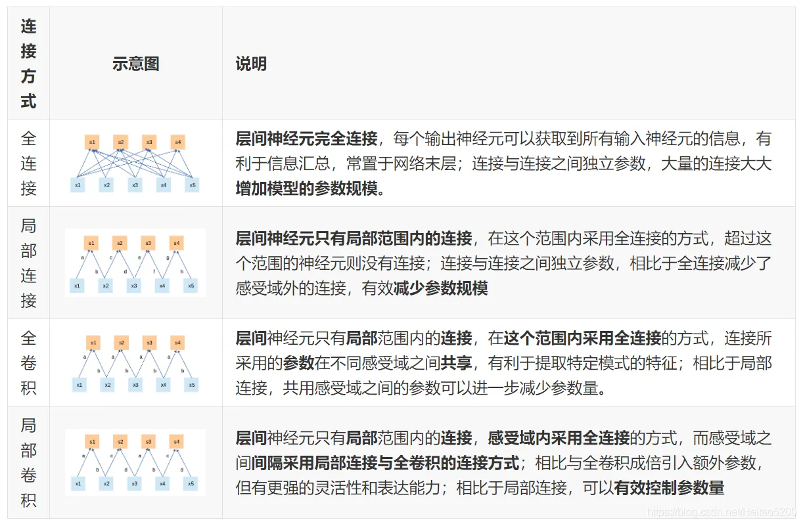

### 8.7 经典顺序式 CNN

- **LeNet-5**：使用卷积、平均池化和全连接层完成手写数字识别，奠定了早期 CNN 的基本结构。

  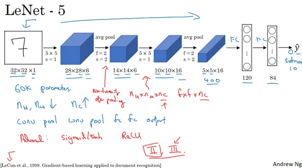

- **AlexNet**：使用 ReLU、Dropout、数据增强和 GPU 训练，在 ImageNet 上展示深层 CNN 的能力。

  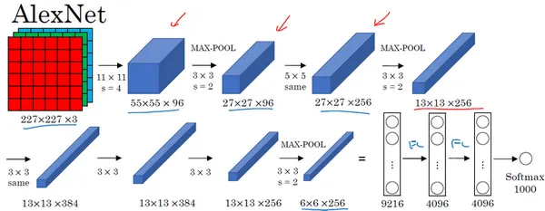

- **VGG**：反复堆叠 \(3\times3\) 卷积和 \(2\times2\) 最大池化，结构规则，但参数量和计算量较大。
- **Inception**：并行使用不同尺度的卷积和池化，再拼接输出；通过 \(1\times1\) 卷积控制通道数和计算量。

这些模型主要沿顺序路径逐层处理特征。网络继续加深后会遇到优化和性能退化问题，下一章将引入残差连接。

### 8.8 本章小结

- 卷积针对高维网格数据、局部统计关系和位置共享规律设计，通过局部连接和权值共享减少参数并编码归纳偏置。
- 卷积是稀疏且重复使用参数的特殊全连接层；它通常对平移等变，池化等操作只能引入有限的平移不变性。
- 一维和二维卷积遵循相同原理，Kernel、Stride、Padding、Dilation 和通道数共同决定输出尺寸、参数量与计算量。
- 通用感受野递推为 \(j_l=j_{l-1}S_l\)、\(R_l=R_{l-1}+(K_l-1)D_lj_{l-1}\)；下采样和扩张卷积能更快整合远距离信息。
- MNIST-1D 实验说明卷积的优势不只是参数更少，更来自与数据平移规律相匹配的归纳偏置。
- 下采样压缩空间表示；最近邻、双线性插值、Max Unpooling 和转置卷积采用不同机制恢复分辨率，且都不能凭空恢复已丢失的信息。
- 分类输出整图类别，检测输出类别、边界框和置信度，分割在每个像素位置输出类别分布。
- AlexNet、VGG 和 Inception 展示了顺序式 CNN 的发展；网络继续加深后会出现优化与性能退化问题，下一章使用残差连接处理这一问题。

## 9. 残差网络

> 本章对应 Simon J. D. Prince 的 *Understanding Deep Learning* 第 11 章「Residual networks」。本次补充的三幅配图取自原书图 11.3、11.4 和 11.6（CC BY-NC-ND）。

### 9.1 顺序式网络为什么难以继续加深

顺序式网络把每一层的输出作为下一层唯一输入：

$$
\mathbf{h}_{l+1}=f_l(\mathbf{h}_l)
$$

这条公式表示：第 \(l\) 层接收上一层的特征 \(\mathbf{h}_l\)，经过本层变换 \(f_l\) 后，得到下一层的特征 \(\mathbf{h}_{l+1}\)。由于没有跨层连接，下一层只能使用紧邻上一层的输出。

从表示能力（模型容量）上讲，把网络加深几层，理论上至少不应该比原来的浅层网络差。假设原来的浅层网络已经学得很好，新增的层只要学成恒等映射：

$$
f_l(\mathbf{h})=\mathbf{h}
$$

也就是让输入原样通过，那么加深后的网络就可以得到与原浅层网络完全相同的结果。因此，深层网络的可选解中理论上包含原浅层网络的解。

但现实中，**存在这个解，不代表训练算法容易找到这个解**。新增层通常包含线性或卷积变换、激活函数等操作，要靠参数配合才能让输入原样通过。顺序式网络越深，需要连续协调的层就越多，前向信号和反向梯度也必须依次经过每一层，训练会越来越困难。结果可能是：网络层数增加后，不仅测试误差没有下降，连训练误差也反而上升。这个现象称为**退化问题（degradation problem）**。因为模型连训练集都拟合得更差，所以它不是普通的过拟合问题，而是优化问题。

#### 9.1.1 碎裂梯度

普通深层顺序网络的困难不只有梯度消失或爆炸。即使使用合理初始化，把梯度的平均尺度维持在可计算范围内，梯度仍可能随输入或参数的微小变化而快速、无规律地改变，这称为**碎裂梯度（shattered gradients）**。

对一个由 \(K\) 层组成的顺序网络，输入到输出的 Jacobian 是各层 Jacobian 的连乘：

$$
\frac{\partial \mathbf h_K}{\partial \mathbf h_0}
=\frac{\partial \mathbf h_K}{\partial \mathbf h_{K-1}}
\frac{\partial \mathbf h_{K-1}}{\partial \mathbf h_{K-2}}
\cdots
\frac{\partial \mathbf h_1}{\partial \mathbf h_0}
$$

优化器依据当前位置的梯度决定更新方向，但实际更新使用有限步长。若前层参数稍有改变，后面各层的输入位置也随之改变，上式中的多个 Jacobian 都要在新位置重新计算。在很深的非线性网络中，更新前后的梯度可能几乎不相关，使损失曲面在优化器看来像密集而不规则的小山峰，当前梯度很难可靠预测有限更新后的下降方向。

对标量输入输出模型，可令 \(g(x)=\partial y/\partial x\)，用归一化自相关衡量相距 \(\Delta x\) 的两个梯度是否相似：

$$
\rho(\Delta x)
=\frac{\operatorname{Cov}\left[g(x),g(x+\Delta x)\right]}
{\sqrt{\operatorname{Var}[g(x)]\operatorname{Var}[g(x+\Delta x)]}}
$$

浅层网络中，较小 \(\Delta x\) 对应的 \(\rho(\Delta x)\) 通常仍接近 1；深层网络中，它可能迅速降到接近 0。这表示相邻位置的梯度已经失去相关性，而不是梯度数值单纯变小。

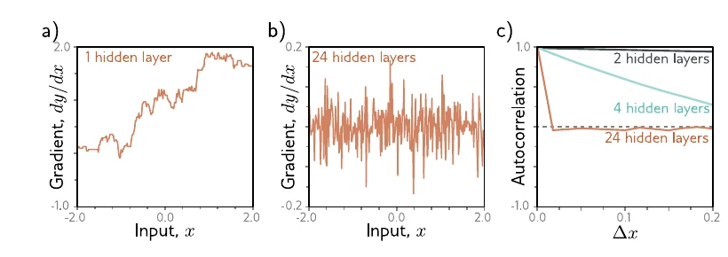

**图 9-1　碎裂梯度。** 浅层网络的输出梯度随输入平缓变化；24 层网络的梯度快速振荡。右图的梯度自相关表明，网络越深，相邻输入处的梯度越快变得不相关。残差连接提供较短路径，有助于缓解这种现象。

### 9.2 残差连接与残差块

#### 9.2.1 从学习完整映射到学习残差

先用一个数字理解。假设某个网络块接收到的输入是 10，我们希望它最后输出 12。

- **普通网络块**：内部的几层网络直接学习怎样把 10 变成 12。
- **残差块**：先通过捷径把 10 原样送到输出端，残差分支只需要学习还差多少，也就是 \(+2\)。最后计算 \(10+2=12\)。

```text
输入 10 ────────捷径：原样传递────────┐
   └────────残差分支：学习 +2─────────┤
                                      ▼
                                  相加得到 12
```

神经网络中传递的不是一个数字，而是一组特征 \(\mathbf{x}\)，但做法完全相同。残差块也分成两条路径：

1. **捷径分支**不做复杂变换，直接传递输入 \(\mathbf{x}\)；
2. **残差分支**通过卷积、归一化和激活等操作，计算需要增加的修改量 \(F(\mathbf{x})\)；
3. 两条分支逐元素相加，得到输出：

$$
\boxed{\mathbf{y}=\mathbf{x}+F(\mathbf{x})}
$$

假设这个网络块理想情况下应该完成的完整变换记为 \(H(\mathbf{x})\)，也就是最终希望得到 \(H(\mathbf{x})\)。因为捷径已经提供了 \(\mathbf{x}\)，所以残差分支只需补上两者之间的差：

$$
F(\mathbf{x})=H(\mathbf{x})-\mathbf{x}
$$

这里的**残差**是期望输出与输入之间的差值，不是损失函数中的预测误差。

当期望变换是恒等映射，或接近恒等映射时：

- 如果期望输出就是输入，即 \(H(\mathbf{x})=\mathbf{x}\)，残差分支只需学习 \(F(\mathbf{x})=0\)；
- 如果期望输出只是在输入上做少量修改，即 \(H(\mathbf{x})=\mathbf{x}+\Delta\mathbf{x}\)，残差分支只需学习 \(F(\mathbf{x})=\Delta\mathbf{x}\)。

普通顺序网络的多层变换需要直接拟合完整映射 \(H(\mathbf{x})\)。残差块通过捷径直接传递输入 \(\mathbf{x}\)，残差分支只需拟合增量 \(F(\mathbf{x})=H(\mathbf{x})-\mathbf{x}\)。因此，当目标映射接近恒等映射时，残差形式通常更容易优化。

需要注意，训练时不会给每个残差块单独提供一个 \(H(\mathbf{x})\) 作为标签。\(H(\mathbf{x})\) 只是为了解释原理而使用的理想结果；实际训练仍然根据整个网络最终的损失，通过反向传播让各个残差分支逐渐学会合适的修改量。

#### 9.2.2 多路径展开

考虑 \(K\) 个形状相同的残差块：

$$
\mathbf h_k
=\mathbf h_{k-1}+F_k(\mathbf h_{k-1}),
\qquad
k=1,2,\ldots,K,
\qquad
\mathbf h_0=\mathbf x
$$

以两个块为例，逐层代入可得：

$$
\begin{aligned}
\mathbf h_1
&=\mathbf x+F_1(\mathbf x),\\
\mathbf h_2
&=\mathbf x+F_1(\mathbf x)
+F_2\!\left(\mathbf x+F_1(\mathbf x)\right).
\end{aligned}
$$

继续展开时，后续残差函数会作用在前面“恒等分支与残差分支之和”上。从计算图看，每经过一个块都有两种选择：沿恒等捷径通过，或经过残差分支。因此，\(K\) 个残差块共有：

$$
\boxed{2^K\text{ 条计算路径}}
$$

其中恰好经过 \(r\) 个残差分支的路径有 \(\binom{K}{r}\) 条，因为要从 \(K\) 个块中选择 \(r\) 个。所有路径数量满足：

$$
\sum_{r=0}^{K}\binom{K}{r}=2^K
$$

这个路径解释在反向传播中更直观。记：

$$
J_k
=\frac{\partial F_k(\mathbf h_{k-1})}
{\partial \mathbf h_{k-1}}
$$

则整个残差网络的 Jacobian 为：

$$
\frac{\partial \mathbf h_K}{\partial \mathbf x}
=(\mathbf I+J_K)(\mathbf I+J_{K-1})\cdots(\mathbf I+J_1)
$$

将这个乘积按分配律展开，会得到 \(2^K\) 个有序 Jacobian 乘积。以 \(K=2\) 为例：

$$
(\mathbf I+J_2)(\mathbf I+J_1)
=\mathbf I+J_1+J_2+J_2J_1
$$

四项分别对应长度为 0、1、1、2 的四条梯度路径。一般情况下，除最长的深层路径外，还存在恒等项和大量较短路径；即使长路径上的 Jacobian 连乘变得不稳定，梯度仍可通过短路径传回前层。

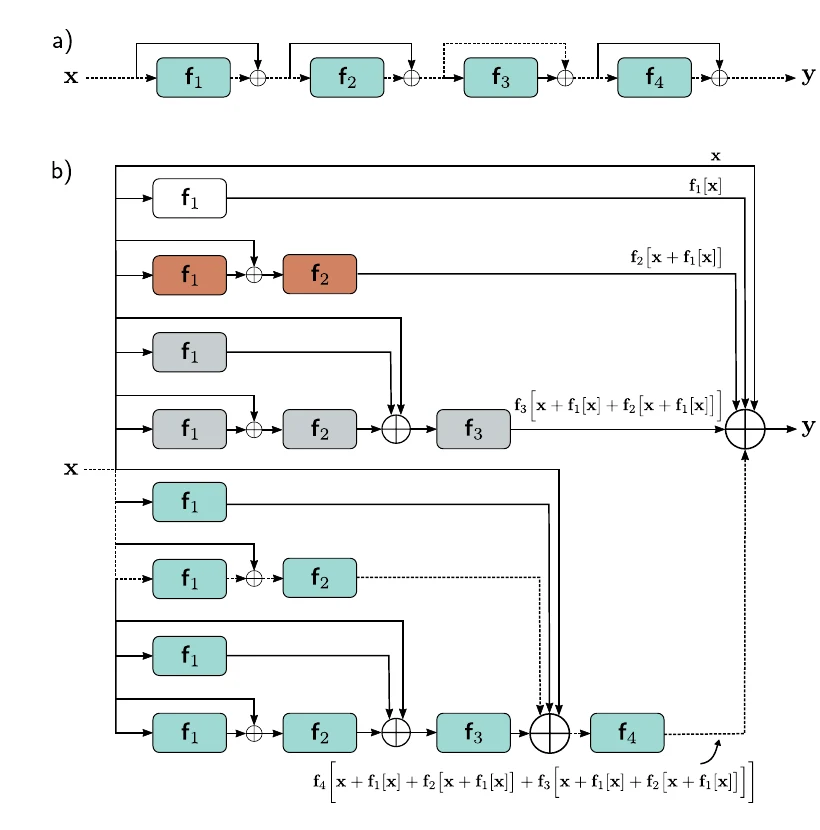

**图 9-2　残差网络的多路径展开。** 四个残差块对应 \(2^4=16\) 条计算路径。图中按函数展开显示了不同长度的子网络，以及其中一条穿过四个残差分支的路径。

图中的 16 条路径并不是实际创建出来的 16 个子网络，也不会分别执行 16 次前向传播。它们是把同一个残差网络按代数形式展开后得到的 16 项。各条路径复用同一组残差块参数，而且非线性函数之间存在耦合，因此不能把它们看成 16 个独立训练模型组成的普通集成。

#### 9.2.3 维度不一致时怎样相加

逐元素相加要求两条分支形状一致。如果空间尺寸或通道数改变，可在捷径分支使用步长卷积和 \(1\times1\) 投影：

$$
\mathbf{y}=P(\mathbf{x})+F(\mathbf{x})
$$

- 形状相同时优先使用无参数的恒等捷径 \(P(\mathbf{x})=\mathbf{x}\)。
- 通道数改变时，用 \(1\times1\) 卷积投影通道。
- 空间尺寸减半时，投影卷积和残差分支通常使用相同的步长。

投影捷径可以匹配形状，但不再是严格的恒等路径，因此没有必要在每个块都使用。

#### 9.2.4 基本块、瓶颈块与运算顺序

- **Basic Block**：通常使用两个 \(3\times3\) 卷积，适合较浅的 ResNet-18、ResNet-34。
- **Bottleneck Block**：通常采用 \(1\times1\) 降维、\(3\times3\) 空间卷积、\(1\times1\) 升维，适合更深的 ResNet-50、101、152。

经典 ResNet v1 常使用后激活结构：

```text
卷积 → BN → ReLU → 卷积 → BN → 加法 → ReLU
```

ResNet v2 使用预激活结构：

```text
BN → ReLU → 卷积 → BN → ReLU → 卷积 → 加法
```

预激活让捷径分支更接近纯恒等映射，使信息和梯度传播路径更直接。

### 9.3 残差网络中的梯度与方差传播

#### 9.3.1 恒等路径与梯度传播

对单个残差块：

$$
\mathbf{y}=\mathbf{x}+F(\mathbf{x})
$$

其 Jacobian 为：

$$
\frac{\partial\mathbf{y}}{\partial\mathbf{x}}
=\mathbf{I}+\frac{\partial F}{\partial\mathbf{x}}
$$

反向传播时，梯度中包含一条系数为 1 的恒等路径：

$$
\frac{\partial L}{\partial\mathbf{x}}
=\frac{\partial L}{\partial\mathbf{y}}
\left(\mathbf{I}+\frac{\partial F}{\partial\mathbf{x}}\right)
$$

把多个网络块连接起来后，可以更清楚地看出残差连接为什么能缓解碎裂梯度。

**普通顺序网络只有一条长路径。** 若每个网络块的 Jacobian 记为 \(J_k\)，则输入到输出的梯度包含唯一的长连乘：

$$
\frac{\partial \mathbf h_K}{\partial \mathbf h_0}
=J_KJ_{K-1}\cdots J_1
$$

靠近输入端的参数或特征发生微小变化后，后续各层的输入都会改变，多个 \(J_k\) 需要在新的位置重新计算。整条连乘的结果可能随之剧烈变化，使相邻位置的梯度迅速失去相关性，形成碎裂梯度。

**残差网络包含长短不同的多条路径。** 每个残差块的 Jacobian 是 \(\mathbf I+J_k\)，因此整个网络的 Jacobian 为：

$$
\frac{\partial \mathbf h_K}{\partial \mathbf h_0}
=(\mathbf I+J_K)(\mathbf I+J_{K-1})\cdots(\mathbf I+J_1)
$$

按分配律展开后，反向传播梯度等于 \(2^K\) 条路径对应的 Jacobian 乘积之和。以 4 个残差块为例，共有 \(2^4=16\) 项，其中既有穿过全部 4 个残差分支的长项，也有只经过一两个残差分支的短项，还包含不经过残差分支的恒等项 \(\mathbf I\)。

当长路径中的 Jacobian 连乘因参数或输入变化而剧烈波动时，恒等项和较短的乘积项不需要经过整条深层链路，仍能提供更直接、相关性更强的梯度信号。最终梯度是这些长短路径贡献的总和，因此不会完全依赖唯一的长连乘，碎裂梯度得到缓解。

这里的 16 项仍然只是同一网络反向传播公式的展开，不代表训练时单独计算 16 个模型。残差连接只能缓解问题，并不保证梯度一定稳定；不同路径可能相互抵消，连续的放大效应也仍可能导致激活或梯度爆炸。

#### 9.3.2 为什么方差会按 \(2^K\) 增长

He 初始化的目标是让 ReLU 顺序层的输出方差在初始化时与输入方差大致相同。记第 \(k\) 个残差块的输入方差为：

$$
v_k=\operatorname{Var}[\mathbf h_k]
$$

在初始化阶段作三个理想化假设：

1. 方差和协方差是对随机初始化及有代表性的输入样本统计得到的；
2. 主分支与残差分支近似不相关，即协方差接近 0；
3. He 初始化使残差分支保持方差，即 \(\operatorname{Var}[F_k(\mathbf h_k)]\approx v_k\)。

由于：

$$
\mathbf h_{k+1}=\mathbf h_k+F_k(\mathbf h_k),
$$

所以：

$$
\begin{aligned}
v_{k+1}
&=\operatorname{Var}[\mathbf h_k]
+\operatorname{Var}[F_k(\mathbf h_k)]
+2\operatorname{Cov}[\mathbf h_k,F_k(\mathbf h_k)]\\
&\approx v_k+v_k\\
&=2v_k.
\end{aligned}
$$

递推 \(K\) 次后得到：

$$
\boxed{v_K\approx 2^K v_0}
$$

因此，He 初始化虽然稳定了**单条残差分支内部**的方差，却没有抵消主分支和残差分支相加带来的额外方差。这里的 \(2^K\) 是在上述初始化和不相关假设下对**方差**的近似结果，不表示每个激活值都会精确翻倍，也不要与 9.2.2 中 \(2^K\) 条计算路径混为一谈。反向传播也有类似结构：梯度经过恒等项和残差 Jacobian 后相加，其二阶矩可能随深度快速增大。

一种直接处理方式是令：

$$
\mathbf h_{k+1}
=\frac{\mathbf h_k+F_k(\mathbf h_k)}{\sqrt 2},
$$

这样在相同假设下有 \(v_{k+1}\approx v_k\)。不过，这只控制了尺度，并没有直接解决碎裂梯度。实际残差网络更常使用 BatchNorm 或对残差分支进行缩放、零初始化。

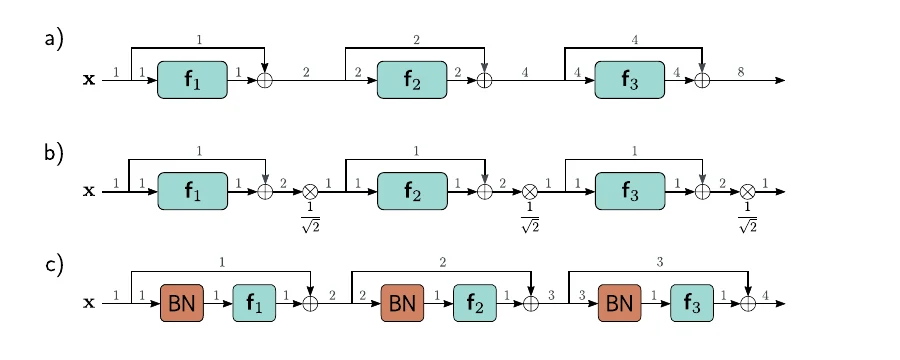

**图 9-3　残差网络中的方差变化。** 无归一化时，各块方差约按 \(1,2,4,8\) 增长；每次相加后乘 \(1/\sqrt2\) 可保持方差；在残差分支前使用 BatchNorm 时，残差分支每次约增加单位方差，总方差近似按 \(1,2,3,4\) 线性增长。

常见控制方法包括：

- 合理初始化，使残差分支在训练初期接近小扰动。
- 使用 BatchNorm 或其他归一化方法稳定激活尺度。
- 调整学习率并监控逐层激活、梯度范数。
- 必要时缩放残差分支、使用零初始化最后一个归一化缩放参数，或进行梯度裁剪。

### 9.4 批归一化

对于一个 mini-batch 中同一特征或通道的 \(m\) 个值，BatchNorm 计算：

$$
\mu_B=\frac{1}{m}\sum_{i=1}^{m}x_i,
\qquad
\sigma_B^2=\frac{1}{m}\sum_{i=1}^{m}(x_i-\mu_B)^2
$$

$$
\widehat{x}_i=\frac{x_i-\mu_B}{\sqrt{\sigma_B^2+\epsilon}},
\qquad
y_i=\gamma\widehat{x}_i+\beta
$$

其中，\(\gamma\) 和 \(\beta\) 是可学习的缩放和平移参数。BatchNorm 能改善数值尺度和优化条件，使深层残差网络通常可以使用更积极的学习率。它有时带来附带的正则化效果，但首要作用是稳定训练。

#### 9.4.1 BatchNorm 为什么把指数增长变成线性增长

考虑把 BatchNorm 放在残差分支开头，并将其初始化为 \(\gamma=1,\beta=0\)。它先把送入残差函数的表示标准化为近似零均值、单位方差：

$$
\operatorname{Var}[\operatorname{BN}(\mathbf h_k)]\approx1
$$

若后续线性层或卷积层采用 He 初始化，则残差分支输出方差也近似为 1：

$$
\operatorname{Var}
\left[F_k\!\left(\operatorname{BN}(\mathbf h_k)\right)\right]
\approx1
$$

此时残差块为：

$$
\mathbf h_{k+1}
=\mathbf h_k
+F_k\!\left(\operatorname{BN}(\mathbf h_k)\right)
$$

若主分支与残差分支仍近似不相关，则：

$$
\begin{aligned}
v_{k+1}
&\approx v_k+1,\\
\therefore\qquad
v_K
&\approx v_0+K.
\end{aligned}
$$

于是，无 BatchNorm 时的指数增长 \(2^K v_0\)，在这一初始化分析下变成近似线性增长 \(v_0+K\)。随着 \(k\) 增大，新残差分支约为单位方差，而主表示已经累积了约 \(k\) 的方差，所以后层残差在总表示中的相对影响越来越小，网络初始化时更接近一系列恒等映射。训练过程中，模型仍可通过学习 \(\gamma\) 调整各层残差的尺度和有效深度。

这个推导描述的是初始化附近的近似行为，而不是训练全程的严格等式；训练后分支会产生相关性，\(\gamma\)、权重和激活分布也都会改变。

#### 9.4.2 残差连接与 BatchNorm 为什么需要配合

残差连接与 BatchNorm 处理的是深层网络中的两类不同问题：

| 机制 | 主要作用 | 单独使用时仍存在的问题 |
| --- | --- | --- |
| 残差连接 | 通过恒等捷径和大量短路径改善信息与梯度传播，缓解退化和碎裂梯度 | 不能主动限制每个残差分支的输出尺度，连续相加可能使激活方差快速累积 |
| BatchNorm | 规范残差分支的激活尺度，改善数值条件并降低训练对参数尺度的敏感性 | 不会产生恒等捷径；普通顺序网络即使使用 BN，梯度仍主要依赖唯一的深层链式路径 |

因此，只使用残差连接时，梯度有了更直接的传播路径，但残差分支的数值尺度仍可能随着深度失控；只使用 BatchNorm 时，各层的数值尺度更稳定，但它不能消除普通顺序网络必须逐层传播的结构性困难。

经典 ResNet 同时使用两者：捷径分支直接传递已有表示和梯度，残差分支在 BatchNorm 的帮助下学习尺度受控的增量。前者改善传播路径，后者稳定每次残差更新的数值尺度，使大量残差块能够连续堆叠并保持可训练性。

这里的配合不是说所有残差网络都必须使用 BatchNorm。残差缩放、零初始化残差分支、Fixup、ReZero、LayerNorm 等方法也可以承担尺度控制作用。更准确地说，极深网络既需要合理的传播路径，也需要合适的尺度控制；经典 ResNet 分别用残差连接和 BatchNorm 完成这两项工作。

#### 9.4.3 训练与推理不同

- **训练阶段**：使用当前 mini-batch 的均值和方差，并更新运行均值和运行方差。
- **推理阶段**：使用训练期间累计的运行统计量，避免输出依赖当前批次中的其他样本。

小批量时统计量可能不稳定；微调时只冻结梯度也不会自动冻结运行统计量。需要分别控制参数是否更新和模块处于训练还是推理模式。

#### 9.4.4 BatchNorm 的收益与代价

| 收益 | 代价或限制 |
| --- | --- |
| 稳定中间特征尺度和梯度传播 | 训练行为依赖批量统计量 |
| 通常允许更大学习率并加快优化 | 小批量或非独立样本批次中统计不稳定 |
| 对参数尺度具有一定重参数化效果 | 训练和推理路径不同，部署需保存运行统计量 |
| 批次噪声可能带来轻微正则化 | 分布变化时运行统计量可能失配 |

### 9.5 其他归一化方法

LayerNorm 对单个样本的指定特征维度计算统计量，不依赖批量中的其他样本：

$$
\mu=\frac{1}{d}\sum_{i=1}^{d}x_i,
\qquad
\sigma^2=\frac{1}{d}\sum_{i=1}^{d}(x_i-\mu)^2
$$

$$
\widehat{x}_i=\frac{x_i-\mu}{\sqrt{\sigma^2+\epsilon}},
\qquad
y_i=\gamma_i\widehat{x}_i+\beta_i
$$

LayerNorm 的计算可以按四步理解：先从一个样本中取出需要归一化的 \(d\) 个特征；再计算这些特征的均值 μ 和方差 σ²；随后将每个特征变换为均值接近 0、方差接近 1 的 \(\widehat{x}_i\)；最后通过可学习参数 \(\gamma_i\) 和 \(\beta_i\) 恢复模型所需的缩放与平移能力。因而，归一化并不会强迫后续网络只能使用固定的标准正态分布。

例如，Transformer 中的激活常写成 \([N,L,D]\)，其中 \(N\) 是批量大小、\(L\) 是序列长度、\(D\) 是特征维度。常见的 LayerNorm 会对每个样本的每个 token 单独沿 \(D\) 维计算统计量：一个 token 的归一化结果不依赖同一批次中的其他样本，也不依赖其他 token。因此，它在小批量、变长序列和推理阶段的计算方式保持一致。

以卷积特征 \([N,C,H,W]\) 为例：

| 方法 | 主要统计范围 | 是否依赖 batch | 常见用途 |
| --- | --- | --- | --- |
| BatchNorm（BN） | 同一通道上的 \(N,H,W\) | 是 | 常规 CNN、大批量训练 |
| LayerNorm（LN） | 单个样本的指定特征维度 | 否 | Transformer、序列模型 |
| InstanceNorm（IN） | 单个样本、单个通道的 \(H,W\) | 否 | 风格迁移、图像生成 |
| GroupNorm（GN） | 单个样本内的分组通道 | 否 | 小批量 CNN |
| Switchable Normalization | 学习组合多种统计量 | 取决于组合 | 自适应选择统计范围 |

这些方法使用相同的“减均值、除标准差、再做仿射变换”框架，主要区别是**哪些元素被放在一起计算均值和方差**。设 \(X\) 是一个 \([N,C,H,W]\) 的卷积特征张量，则可以用下面的统计集合来理解：

- **BN**：固定通道 \(c\)，汇总所有 \(n,h,w\)，即每个通道得到一组批量统计量。批量太小时，这组统计量可能不稳定。
- **LN**：固定样本 \(n\)，通常汇总该样本的 \(c,h,w\)；实际归一化范围由指定的特征维度决定，不读取其他样本。
- **IN**：固定样本 \(n\) 和通道 \(c\)，只汇总该特征图的 \(h,w\)。它会弱化单张图像中每个通道的整体对比度和风格信息。
- **GN**：固定样本 \(n\) 和通道组 \(g\)，汇总组内通道及其 \(h,w\)。它在不依赖 batch 的同时，保留了组内通道之间的联合统计。
- **Switchable Normalization**：同时计算多种候选统计量，再学习它们的组合权重，让网络自行选择更合适的归一化方式。

因此，选择归一化方法时可以先看两个条件：统计量能否可靠地跨样本估计，以及任务是否需要保留单个样本或单个通道的整体尺度。大批量 CNN 常用 BN；小批量 CNN 更适合 GN；序列模型通常使用 LN；风格迁移和部分生成任务常使用 IN。

需要注意，**Spectral Normalization** 也缩写为 SN，但它约束的是权重矩阵谱范数，常用于稳定 GAN，并不是对激活做均值和方差归一化。

| 方法 | 训练阶段 | 推理阶段 |
| --- | --- | --- |
| Dropout | 随机丢弃并缩放激活 | 关闭随机丢弃 |
| BatchNorm | 使用批次统计量并更新运行统计量 | 使用保存的运行统计量 |
| LayerNorm / GroupNorm | 使用当前样本的特征统计量 | 计算方式不变 |

### 9.6 常见残差架构

#### 9.6.1 ResNet

前面介绍的是单个残差块，完整的 ResNet 则把多个残差块组织成若干 **stage（阶段）**。同一 stage 内的特征图尺寸和输出通道数保持不变，可以连续使用恒等捷径；进入下一个 stage 时，通常由第一个残差块完成下采样和通道扩展，并用 \(1\times1\) 投影捷径匹配两条分支的形状。

以用于 ImageNet 分类的经典结构为例，整体数据流可以写成：

```text
输入图像
  -> stem（7x7、步长 2 的卷积 + 最大池化）
  -> conv2_x -> conv3_x -> conv4_x -> conv5_x
  -> 全局平均池化 -> 全连接分类层
```

- **stem** 先提取低层特征并降低空间分辨率。对于 CIFAR 等小尺寸图像，通常改用 \(3\times3\)、步长 1 的卷积，并去掉最大池化，以免过早丢失空间信息。
- **conv2_x 到 conv5_x** 是四个残差 stage。除 conv2_x 外，每进入一个新 stage，特征图的高和宽通常减半，通道数增加，从而逐步扩大感受野并提取更抽象的特征。
- **全局平均池化** 将每个通道的空间特征压缩为一个数，再交给全连接层分类。它避免了大规模展平，显著减少分类头参数量。

常见 ResNet 的主要区别不是宏观流程，而是每个 stage 使用哪种残差块以及重复多少次：

| 网络 | 残差块 | 四个 stage 的块数 | stage 输出通道数 |
| --- | --- | --- | --- |
| ResNet-18 | Basic Block | \([2,2,2,2]\) | \([64,128,256,512]\) |
| ResNet-34 | Basic Block | \([3,4,6,3]\) | \([64,128,256,512]\) |
| ResNet-50 | Bottleneck Block | \([3,4,6,3]\) | \([256,512,1024,2048]\) |
| ResNet-101 | Bottleneck Block | \([3,4,23,3]\) | \([256,512,1024,2048]\) |
| ResNet-152 | Bottleneck Block | \([3,8,36,3]\) | \([256,512,1024,2048]\) |

Basic Block 直接用两个 \(3\times3\) 卷积变换特征，结构简单，适合 ResNet-18/34。Bottleneck Block 先用 \(1\times1\) 卷积压缩通道，再用 \(3\times3\) 卷积处理空间信息，最后用 \(1\times1\) 卷积恢复通道；这样可以控制深层网络中昂贵的 \(3\times3\) 卷积计算量，因此用于 ResNet-50/101/152。

ResNet 的四个 stage 也常被当作通用视觉骨干网络，分别输出不同分辨率的特征，供目标检测、语义分割等任务继续使用。选择模型时，应综合数据规模、输入分辨率、计算预算和任务需求：更深的 ResNet 通常具有更强的表示能力，但也需要更多计算和更合适的训练配置，并不保证模型越深性能就一定越好。

#### 9.6.2 DenseNet

DenseNet 将每层输出与后续层的输入按通道拼接：

$$
\mathbf{h}_l=F_l([\mathbf{h}_0,\mathbf{h}_1,\ldots,\mathbf{h}_{l-1}])
$$

它通过密集捷径复用特征并改善梯度传播。与 ResNet 的逐元素相加不同，拼接会让通道数持续增长，因此需要 growth rate 和 transition layer 控制规模，也会增加中间特征的显存访问成本。

#### 9.6.3 U-Net 与 Hourglass

U-Net 和 Hourglass 都包含下采样编码器与上采样解码器，并用跨尺度捷径恢复空间信息：

- **U-Net**通常将编码器特征与同分辨率解码器特征按通道拼接，常用于语义分割和医学图像。
- **Hourglass**先逐步压缩到低分辨率，再对称恢复分辨率，并在各尺度融合特征，常用于姿态估计等密集预测任务。

这些长距离捷径与 ResNet 块内的短捷径目标相关但不完全相同：前者重点保留高分辨率细节，后者重点让深层变换更容易优化。

### 9.7 残差连接为什么有效

残差网络表现好并不只有一个原因，可以从四个角度理解：

1. **易于表示恒等映射**：无用的新层只需学习接近 0 的残差。
2. **缩短信息和梯度路径**：网络中存在许多跨层捷径，梯度不必只沿最长顺序路径传播。
3. **逐步修正表示**：每个残差块在已有表示上增加修正量，更像迭代地完善特征。
4. **形成多路径组合**：从不同捷径看，残差网络可被理解为许多不同有效深度路径的组合。

这些解释说明了它为何更容易训练，但残差连接不是无限加深网络的保证。模型仍受数据量、优化器、归一化、宽度、计算预算和过拟合影响。

### 9.8 本章小结

- 顺序网络加深后可能出现训练误差上升的退化问题；即使梯度尺度合理，深层网络仍可能出现相邻位置梯度迅速失去相关性的碎裂梯度。
- 残差块把完整映射改写为 \(\mathbf{x}+F(\mathbf{x})\)。\(K\) 个残差块产生 \(2^K\) 条不同长度的计算路径，大量短路径为信息和梯度提供更直接的通道。
- 在 He 初始化、两分支近似不相关且残差分支保持输入方差的假设下，每个块使方差近似翻倍，经过 \(K\) 个块后达到 \(2^K v_0\)。
- 在残差分支开头使用初始化为 \(\gamma=1,\beta=0\) 的 BatchNorm，可使每个分支约增加单位方差，从而把初始化阶段的方差增长变为近似 \(v_0+K\)。
- 残差连接主要改善信息与梯度的传播路径，BatchNorm 主要控制残差分支的数值尺度；经典 ResNet 结合两者，使大量残差块能够稳定堆叠。
- 上述方差结论是初始化附近的理想化分析；残差网络仍需合理初始化、归一化、残差缩放和学习率控制。
- BatchNorm 训练时使用批次统计，推理时使用运行统计；小批量训练可考虑 GroupNorm 等方法。
- ResNet、DenseNet、U-Net 和 Hourglass 以不同方式利用捷径连接，分别服务于深层优化、特征复用和多尺度信息恢复。

## 10. 循环神经网络 RNN、LSTM 与 GRU

循环神经网络（Recurrent Neural Network，RNN）用于处理文本、语音、时间序列等具有先后顺序的数据。与只接收当前输入的前馈神经网络不同，RNN 会把上一时刻的隐藏状态传递到当前时刻，从而在序列中保留上下文信息。

### 10.1 RNN 的基本结构

对输入序列 $x_1,x_2,\ldots,x_T$，基础 RNN 在第 $t$ 个时间步的计算为：

$$
h_t=\tanh(W_{xh}x_t+W_{hh}h_{t-1}+b_h)
$$

$$
y_t=W_{hy}h_t+b_y
$$

其中：

- $x_t$：当前时刻的输入；
- $h_{t-1}$：上一时刻的隐藏状态；
- $h_t$：融合当前输入和历史信息后的隐藏状态；
- $y_t$：当前时刻的输出；
- $W_{xh}$、$W_{hh}$、$W_{hy}$：可学习参数。

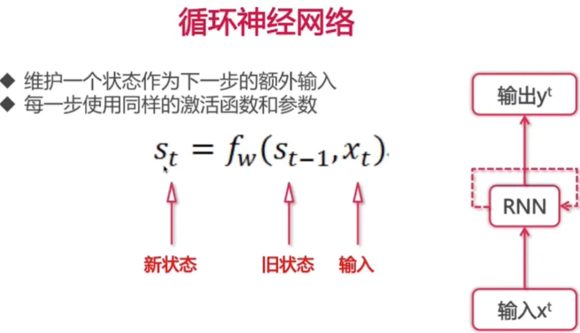

RNN 在所有时间步共享同一组参数。参数共享使模型能够处理不同长度的序列，也避免参数量随序列长度增长。根据任务需要，RNN 可以实现一对一、一对多、多对一和多对多等输入输出形式，常用于文本分类、序列标注、语音识别、机器翻译和时间序列预测。

普通 RNN 并不是按固定规则让早期输入必然失效。早期信息能保留多久由参数和输入共同决定，但在长序列上，梯度传播困难会使模型通常更难学习长期依赖。

### 10.2 时间反向传播与梯度问题

训练时，需要先把 RNN 沿时间轴展开，再使用时间反向传播（Backpropagation Through Time，BPTT）计算梯度。它和普通反向传播都使用链式法则，但同一组 RNN 参数会在多个时间步反复参与计算，所以总梯度是各时间步贡献的累加。

沿时间传播的梯度包含多个雅可比矩阵的连乘：

$$
\frac{\partial h_t}{\partial h_k}
=\prod_{i=k+1}^{t}\frac{\partial h_i}{\partial h_{i-1}}
$$

当连乘结果持续缩小时，会出现梯度消失，早期状态难以得到有效更新；当结果持续放大时，会出现梯度爆炸，引起损失剧烈波动甚至数值溢出。序列越长，这两个问题通常越明显。

常见的稳定训练方法包括：

1. 使用梯度裁剪抑制梯度爆炸；
2. 调低学习率，或使用合适的学习率调度；
3. 对循环权重采用正交初始化，对其他权重采用 Xavier 等合理初始化；
4. 使用截断时间反向传播（Truncated BPTT）限制单次反向传播的时间跨度；
5. 使用 LSTM、GRU 等门控结构改善长期信息与梯度的传递；
6. 在合适的位置使用 LayerNorm 等归一化方法。

仅把循环激活函数换成 ReLU，不能从根本上解决长序列中的梯度问题，还可能带来梯度爆炸。BatchNorm 也不适合直接作为所有 RNN 梯度问题的通用解法。

### 10.3 LSTM 的门控结构

长短期记忆网络（Long Short-Term Memory，LSTM）在隐藏状态 $h_t$ 之外增加记忆元 $c_t$，并用遗忘门、输入门和输出门控制信息流。令 $u_t=[h_{t-1};x_t]$ 表示上一隐藏状态和当前输入的拼接，则：

$$
f_t=\sigma(W_fu_t+b_f)
$$

$$
i_t=\sigma(W_iu_t+b_i)
$$

$$
\tilde{c}_t=\tanh(W_cu_t+b_c)
$$

$$
o_t=\sigma(W_ou_t+b_o)
$$

$$
c_t=f_t\odot c_{t-1}+i_t\odot\tilde{c}_t
$$

$$
h_t=o_t\odot\tanh(c_t)
$$

其中 $\odot$ 表示逐元素乘法：

- 遗忘门 $f_t$ 决定保留多少旧记忆；
- 输入门 $i_t$ 决定写入多少候选记忆；
- 候选记忆 $\tilde{c}_t$ 表示当前可写入的新内容；
- 输出门 $o_t$ 决定从记忆元中输出多少信息；
- 记忆元 $c_t$ 保存跨时间步传递的信息，隐藏状态 $h_t$ 同时传给下一时间步和上层网络。

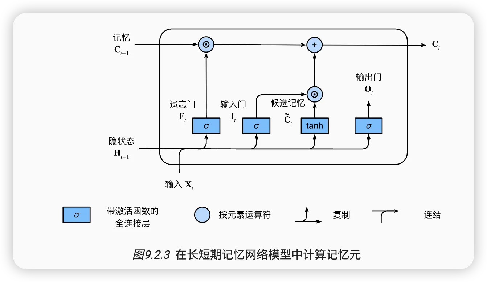

### 10.4 LSTM 为什么有助于长期依赖

基础 RNN 每个时间步都要对隐藏状态进行一次非线性变换。LSTM 的记忆元则包含一条加法更新路径：

$$
c_t=f_t\odot c_{t-1}+i_t\odot\tilde{c}_t
$$

沿这条直接路径有：

$$
\frac{\partial c_t}{\partial c_{t-1}}=f_t
$$

遗忘门接近 1 时，信息和梯度可以在多个时间步间较完整地传递。因此，LSTM 通常比基础 RNN 更容易学习长期依赖，但并不意味着它在任意长序列上都不会出现梯度消失或梯度爆炸。

LSTM 同时使用 Sigmoid 和 Tanh，是因为两者职责不同：

- Sigmoid 输出位于 $(0,1)$，适合作为控制信息通过比例的门；
- Tanh 输出位于 $(-1,1)$，适合表示带正负方向的候选内容和状态输出。

### 10.5 GRU

门控循环单元（Gated Recurrent Unit，GRU）把 LSTM 的记忆元和隐藏状态合并为一个状态，并使用更新门和重置门简化结构：

$$
z_t=\sigma(W_z[x_t;h_{t-1}]+b_z)
$$

$$
r_t=\sigma(W_r[x_t;h_{t-1}]+b_r)
$$

$$
\tilde{h}_t=\tanh(W_h[x_t;r_t\odot h_{t-1}]+b_h)
$$

$$
h_t=(1-z_t)\odot h_{t-1}+z_t\odot\tilde{h}_t
$$

其中，重置门 $r_t$ 控制计算候选状态时使用多少历史信息，更新门 $z_t$ 控制旧状态与候选状态的融合比例。部分资料对更新门采用相反的记号约定，但表达的机制等价。

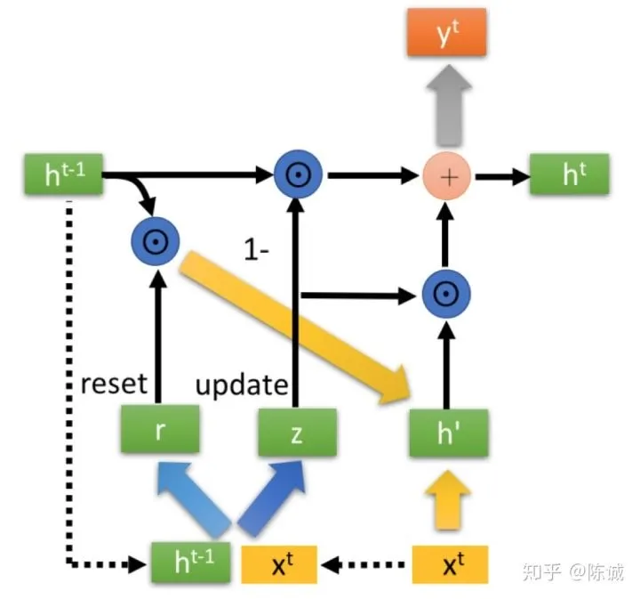

GRU 的门更少、参数量通常小于同等隐藏维度的 LSTM，因而训练和推理可能更快。不过，GRU 和 LSTM 没有对所有任务都成立的优劣顺序，应通过验证集表现、计算成本和部署约束选择。

### 10.6 双向、堆叠与混合结构

#### 10.6.1 双向 RNN

双向 RNN 使用两个相互独立的循环网络：一个从前向后读取序列，另一个从后向前读取序列，并在每个时间步组合两个方向的隐藏状态：

$$
h_t=[\overrightarrow{h_t};\overleftarrow{h_t}]
$$

它能同时利用过去和未来的上下文，适合序列标注、离线语音识别等完整序列已知的任务。实时生成或流式预测无法访问未来输入，通常不能直接使用双向结构。

#### 10.6.2 堆叠 RNN

堆叠 RNN 是把下层在每个时间步的输出作为上层输入，以增加表示能力。双向描述的是时间方向，堆叠描述的是网络深度，两者是不同维度，也可以组合使用。“两层 LSTM”不等同于“双向 LSTM”。

#### 10.6.3 CNN-RNN 混合结构

CNN 可以先提取局部模式或压缩序列长度，RNN、LSTM 或 GRU 再建模时间依赖。这类组合常见于语音、视频、手写文本和传感器序列任务。

### 10.7 RNN、LSTM 与 GRU 对比

| 模型 | 状态与门控 | 主要特点 | 常见局限 |
| --- | --- | --- | --- |
| RNN | 一个隐藏状态，无门控 | 结构简单、参数较少 | 长期依赖难训练 |
| LSTM | 记忆元和隐藏状态，三个门 | 长期信息控制更细致 | 参数量和计算量较大 |
| GRU | 一个隐藏状态，两个门 | 结构较简洁、训练通常较快 | 控制粒度少于 LSTM |

实际选型时，短序列或简单任务可先尝试基础 RNN；存在长期依赖时优先比较 LSTM 与 GRU。对于超长序列和需要大规模并行训练的任务，还应考虑卷积序列模型或 Transformer。

### 10.8 本章小结

- RNN 通过共享参数和隐藏状态建模序列信息；
- BPTT 中的矩阵连乘会造成梯度消失或梯度爆炸；
- LSTM 用记忆元和三个门控制信息的保留、写入与输出；
- GRU 用两个门和单一状态简化 LSTM；
- 双向与堆叠分别描述时间方向和网络深度，不能混为一谈。

## 11. 生成对抗网络 GAN

生成对抗网络（Generative Adversarial Network，GAN）由生成器和判别器组成。生成器学习生成接近真实数据分布的样本，判别器学习区分真实样本与生成样本。两者通过对抗训练共同改进。

### 11.1 生成器与判别器

生成器 $G$ 接收从潜在分布 $p_z$ 中采样的随机向量 $z$，输出生成样本：

$$
\hat{x}=G(z)
$$

随机向量为生成过程提供变化来源。对图像任务，生成器通常逐步把低维表示映射为空间特征图，再通过上采样和卷积生成图像。

判别器 $D$ 接收真实样本 $x$ 或生成样本 $G(z)$，输出样本来自真实数据的概率或评分。训练目标是给真实样本更高评分、给生成样本更低评分。

生成器通常不直接比较生成图像和某一张真实图像，而是通过判别器提供的梯度学习真实数据的整体分布。因此，GAN 可以生成训练集中没有出现过的新样本，但训练结果也高度依赖判别器提供的学习信号。

### 11.2 GAN 的目标函数

原始 GAN 的极小极大目标为：

$$
\min_G\max_D V(D,G)
=\mathbb{E}_{x\sim p_{data}}[\log D(x)]
+\mathbb{E}_{z\sim p_z}[\log(1-D(G(z)))]
$$

判别器希望增大该目标，生成器希望减小该目标。实际训练中，生成器常使用非饱和损失：

$$
L_G=-\mathbb{E}_{z\sim p_z}[\log D(G(z))]
$$

与直接最小化 $\log(1-D(G(z)))$ 相比，非饱和损失在训练早期通常能为生成器提供更强的梯度。

### 11.3 交替训练过程

GAN 不是同时完成一次普通的分类训练，而是在两个优化问题之间交替：

1. 从真实数据分布采样一批 $x$，从潜在分布采样一批 $z$；
2. 固定生成器，用真实样本 $x$ 和生成样本 $G(z)$ 更新判别器；
3. 再次采样 $z$，固定判别器，通过判别器的梯度更新生成器；
4. 重复以上步骤，并持续观察生成质量、样本多样性和训练平衡。

这里的“固定”是指在当前更新步骤中不修改另一网络的参数，梯度仍需经过判别器传回生成器。判别器过弱时不能提供有效监督，判别器过强时也可能使生成器得到的梯度过小。

### 11.4 常见训练问题

#### 11.4.1 模式崩溃

生成器可能只产生少数几类相似样本，虽然能欺骗判别器，但没有覆盖真实数据的多种模式。这种现象称为模式崩溃（Mode Collapse）。判断生成模型不能只看单张样本质量，还要检查样本之间的多样性。

#### 11.4.2 梯度饱和与训练失衡

如果判别器很快就能完全区分真样本和假样本，原始极小极大生成器损失可能进入饱和区，使生成器梯度很弱。另一方面，两个网络不断改变各自的目标，损失可能振荡，并不一定像普通监督学习那样稳定下降。

#### 11.4.3 数值不稳定与生成伪影

不合适的学习率、归一化、卷积上采样方式和损失函数都可能使训练发散。转置卷积的步幅与卷积核配置不合理时，还可能产生棋盘状伪影；可以改用“插值上采样 + 普通卷积”等方式缓解。

### 11.5 稳定训练的常用方法

以下方法需要结合具体架构和损失选择，并不是每个 GAN 都应同时使用：

1. **匹配数据范围与输出激活**：生成器末层使用 Tanh 时，通常把真实图像缩放到 $[-1,1]$；使用其他输出分布时应采用相应预处理。
2. **选择合适的生成器损失**：原始 GAN 常使用非饱和损失；WGAN、WGAN-GP 或 Hinge Loss 可在不同条件下提供更稳定的学习信号。
3. **约束判别器**：谱归一化可控制判别器权重的谱范数；WGAN-GP 使用梯度惩罚近似满足 Lipschitz 约束。两者的使用取决于具体方法。
4. **平衡两个网络的更新**：分别设置生成器与判别器的学习率、更新次数和容量，避免一方长期压制另一方。
5. **合理选择网络结构**：图像 GAN 常在中间层使用 Leaky ReLU、卷积上采样和适合生成器或判别器的归一化方法，但不存在“必须避免 ReLU 或池化”的统一规则。
6. **谨慎使用正则化技巧**：单边标签平滑、输入扰动、数据增强或 Dropout 有时能抑制判别器过拟合，但不能作为解决模式崩溃或噪声输出的通用方法。
7. **保存生成器的滑动平均权重**：参数指数滑动平均常能改善推理时的生成稳定性。

优化器和学习率应作为超参数验证。Adam 是常见选择，但 $10^{-4}$ 不是对所有 GAN 都适用的固定初始学习率，其 $\beta_1$、$\beta_2$ 也常随架构和损失函数调整。

### 11.6 条件 GAN

条件 GAN（Conditional GAN，cGAN）在生成器和判别器中都加入类别、文本或其他条件 $c$：

$$
\hat{x}=G(z,c),\qquad D(x,c)
$$

这样可以控制生成内容，而不只是从整体数据分布中随机采样。图像到图像转换、文本引导生成和类别可控生成都可以使用条件对抗学习思想。

### 11.7 评估与应用

GAN 常用于图像生成、图像修复、超分辨率、风格迁移和数据增强。评估时应结合以下信息：

- 观察固定潜在向量在训练过程中的生成结果；
- 检查样本质量与多样性，避免只挑选少量最佳样本；
- 使用 FID、KID 等分布指标，并结合人工检查；
- 在数据增强场景中，最终以目标任务性能验证生成数据是否有效。

判别器损失和生成器损失的绝对值通常不能单独代表生成质量，两个损失达到某个固定数值也不等于训练成功。

### 11.8 本章小结

- GAN 通过生成器与判别器的对抗过程学习数据分布；
- 非饱和生成器损失可缓解原始目标在训练早期的梯度饱和；
- 模式崩溃、训练失衡和生成伪影是常见问题；
- 稳定训练依赖损失函数、约束方式、网络容量和更新节奏的共同设计；
- 生成模型需要同时评估样本质量、多样性及下游用途。

## 12. 迁移学习与微调

迁移学习（Transfer Learning）是把一个任务或数据域中学到的表示迁移到目标任务。微调（Fine-tuning）是迁移学习的一种常见实现：以预训练参数为起点，再使用目标数据更新部分或全部参数。

### 12.1 基本概念

迁移学习中常见的几种训练方式如下：

| 方式 | 参数初始化 | 训练范围 | 适用目的 |
| --- | --- | --- | --- |
| 特征提取 | 使用预训练权重 | 冻结主干，只训练新任务头 | 快速建立基线，降低小数据集过拟合风险 |
| 部分微调 | 使用预训练权重 | 训练任务头和主干的部分高层 | 适应目标任务的高层语义 |
| 全量微调 | 使用预训练权重 | 训练全部参数 | 数据较充分或源域与目标域存在明显差异 |
| 从零训练 | 随机或专门设计的初始化 | 训练全部参数 | 无合适预训练模型，或数据和算力足够 |

“冻结”表示参数不参与梯度更新；“解冻”表示允许这些参数继续学习。只训练新任务头属于迁移学习，但严格来说通常称为特征提取；开始更新预训练主干参数后，才是常说的微调。

### 12.2 预训练为什么有效

以 CNN 为例，靠近输入的层通常学习边缘、纹理等较通用的局部特征，靠近输出的层通常包含与源任务类别相关的高层语义。使用预训练权重可以提供较好的参数起点，减少从随机状态学习基础表示所需的数据和训练时间。

不过，“底层通用、顶层专用”只是一种常见规律，不是所有架构和任务上的固定边界。源域与目标域差异越大，越需要通过验证实验判断应解冻哪些层。

预训练模型的主要价值包括：

- 加快收敛，降低优化难度；
- 在标注数据较少时改善泛化；
- 复用大规模数据上学到的表示；
- 减少建立有效基线所需的训练成本。

### 12.3 标准微调流程

#### 12.3.1 选择预训练模型

优先选择输入形式、数据域和任务类型与目标任务接近的模型，同时确认模型的输入尺寸、归一化方式、分词器或特征处理流程，以及权重许可证和部署成本。模型越大不一定越适合目标任务。

#### 12.3.2 替换任务头

根据目标任务替换原输出层，例如把 ImageNet 分类头换成目标类别数对应的线性层。新任务头通常随机初始化，初始输出可能很不稳定。

#### 12.3.3 冻结主干并训练任务头

先冻结预训练主干，只训练新任务头，使任务头适应现有特征空间。这个阶段可以防止随机初始化的任务头通过较大梯度立即破坏已有表示，也是检验预训练特征是否适用的快速基线。

#### 12.3.4 逐步解冻并微调

任务头稳定后，可从主干高层开始逐步解冻，或直接解冻全部层。预训练层通常使用比新任务头更小的学习率：

$$
\eta_{backbone}<\eta_{head}
$$

不同深度使用不同学习率称为分层学习率或判别式学习率。靠近输入的层可以使用更小的学习率，靠近输出的层使用稍大的学习率。

#### 12.3.5 验证与停止

持续比较“只训练任务头”“部分微调”“全量微调”的验证集指标，同时监控训练集和验证集差距。使用早停、学习率调度、权重衰减和数据增强控制过拟合，并保存验证集表现最好的检查点。

### 12.4 根据数据选择训练方式

数据量和源域相似度会共同影响策略，但它们不能给出绝对答案：

| 目标数据 | 与预训练数据的相似度 | 建议起点 |
| --- | --- | --- |
| 较少 | 较高 | 先冻结主干训练任务头，再尝试少量高层微调 |
| 较少 | 较低 | 优先寻找更接近目标域的预训练权重，并谨慎逐层解冻 |
| 较多 | 较高 | 以预训练权重初始化，尝试全量微调 |
| 较多 | 较低 | 同时比较全量微调与从零训练，依据验证结果选择 |

即使目标数据很多且域差异较大，预训练权重仍可能提供有价值的初始化；反过来，源域相似也不保证迁移一定有效。模型容量、标签质量、数据多样性和训练预算同样重要。

### 12.5 学习率与灾难性遗忘

微调时学习率过大，可能快速覆盖预训练参数中已有的有效表示，这种现象通常称为灾难性遗忘。常见控制方法包括：

1. 对预训练主干使用较小学习率；
2. 先训练任务头，再逐步解冻；
3. 使用学习率预热和衰减；
4. 在小数据集上加强正则化和数据增强；
5. 缩短训练周期，并根据验证集及时停止。

学习率大小和解冻范围需要联合调整。解冻层数增加时，通常要重新检查学习率是否过大。

### 12.6 归一化层的处理

冻结参数不一定等同于冻结归一化层的运行统计。以 BatchNorm 为例，它既有可学习的缩放与偏移参数，也有训练阶段更新的运行均值和方差。

- 目标数据较少或批量很小时，通常让冻结主干中的 BatchNorm 保持推理模式，避免运行统计被少量数据破坏；
- 目标数据充足且分布差异明显时，可以尝试更新 BatchNorm 统计或重新训练其参数；
- 批量过小时，可考虑冻结 BatchNorm，或在允许改动结构时使用 GroupNorm 等不依赖批量统计的方法；
- LayerNorm 的行为不依赖批量统计，处理方式与 BatchNorm 不同。

具体实现要区分“是否计算梯度”和“模块处于训练还是推理模式”这两个状态。

### 12.7 目标检测中的迁移学习

目标检测模型常使用分类、自监督学习或检测任务本身的预训练权重初始化主干网络。预训练表示通常能加快收敛，并在检测标注较少时提升性能，但也存在任务差异：

- 分类预训练更关注类别语义，检测还需要位置、尺度和多目标信息；
- 医学影像、遥感图像等目标域与自然图像差异较大，可能出现域偏移；
- 预训练模型的输入、主干结构和参数规模可能限制部署方案。

因此，不能笼统地认为所有一阶段或二阶段检测器都必须依赖 ImageNet 分类预训练。现代检测系统也会使用自监督预训练、领域内预训练，或在足够数据与训练策略支持下从零开始训练。

### 12.8 从零训练的条件

当没有合适的预训练权重，模型结构与现有权重不兼容，或目标数据足够大且覆盖充分时，可以考虑从零训练。它通常需要：

- 更多数据、训练轮次和计算资源；
- 合理的参数初始化和学习率预热；
- 更充分的数据增强与正则化；
- 稳定的归一化策略；
- 与微调基线进行公平比较。

目标检测中批量较小时，BatchNorm 统计可能不稳定，可以使用冻结 BatchNorm、同步 BatchNorm 或 GroupNorm。选择一阶段还是二阶段检测器，并不能单独决定从零训练的难易程度，实际结果更依赖模型、数据和训练配置。

### 12.9 本章小结

- 迁移学习复用已有表示，微调则更新部分或全部预训练参数；
- 常用流程是替换任务头、冻结主干、训练任务头，再逐步解冻；
- 解冻范围、学习率、数据量和领域相似度需要联合考虑；
- BatchNorm 的参数冻结与运行统计更新要分别处理；
- 是否从零训练应由预训练可用性、数据规模、训练预算和验证结果共同决定。
