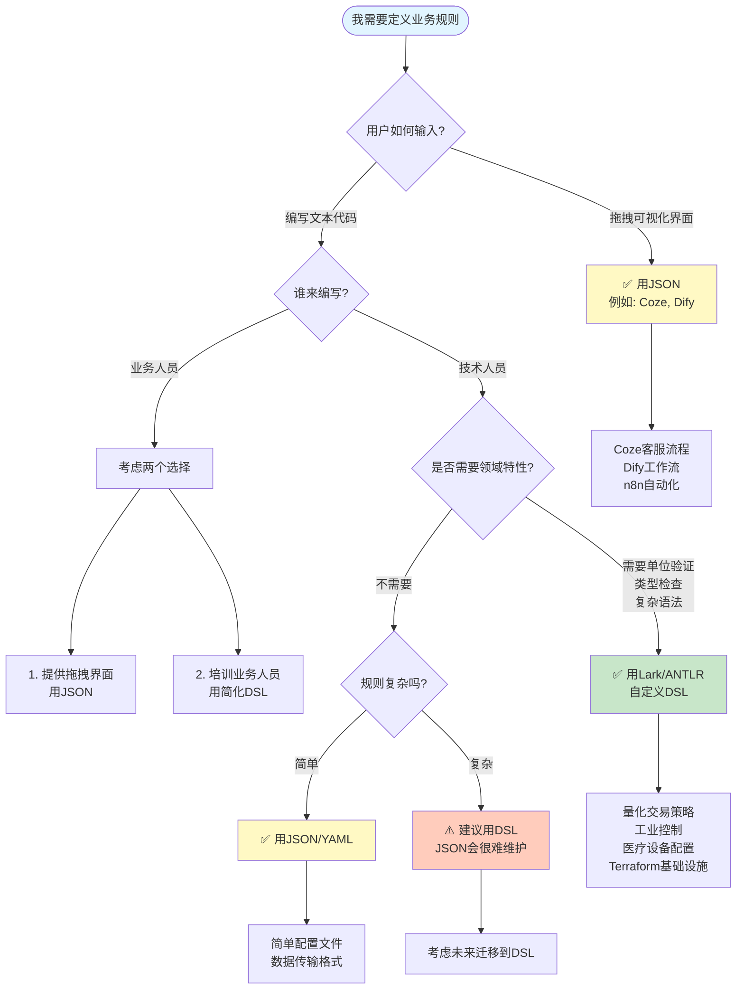

# 快速决策指南：我应该用JSON还是Lark？

## 30秒快速决策流程图



---

## 详细判断问题清单

### 问题1：用户如何输入规则？

```
A. 通过拖拽可视化界面（如Coze、Dify）
   → 选择JSON
   → 理由：前端自动生成，不需要解析器

B. 编写文本文件（如.dsl, .tf, .conf）
   → 继续判断
```

### 问题2：谁来编写这些文本？

```
A. 业务人员（客服主管、运营经理）
   → 提供拖拽界面 or 培训简化DSL

B. 技术人员（开发工程师、运维工程师）
   → 继续判断
```

### 问题3：是否需要领域特定特性？

勾选以下任意一项，就需要Lark：

```
□ 需要强制单位验证（如 $100000, 2%, 93°C）
□ 需要复杂的类型检查（如函数参数验证）
□ 需要精确的语法错误提示
□ 涉及资金或安全（错误后果严重）
□ 需要表达复杂的嵌套逻辑
□ 需要自定义函数和变量
□ 需要代码复用和模块化
□ 需要版本控制和代码审查

如果勾选 ≥ 2项 → 使用Lark/ANTLR
如果勾选 = 0项 → 可以用JSON/YAML
```

---

## 典型场景速查表

| 场景 | 输入方式 | 用户类型 | 领域特性 | 推荐方案 |
|------|---------|---------|---------|---------|
| **Coze客服流程** | 拖拽界面 | 业务人员 | 不需要 | ✅ JSON |
| **Dify工作流** | 拖拽界面 | 业务人员 | 不需要 | ✅ JSON |
| **量化交易策略** | 写代码 | 技术人员 | 需要（单位、类型） | ✅ Lark DSL |
| **Terraform基础设施** | 写代码 | 技术人员 | 需要（变量、模块） | ✅ HCL (类Lark) |
| **Nginx配置** | 写代码 | 技术人员 | 需要（指令验证） | ✅ 自定义DSL |
| **Kubernetes配置** | 写代码 | 技术人员 | 不太需要 | ✅ YAML |
| **简单配置文件** | 写代码 | 技术人员 | 不需要 | ✅ JSON/YAML |
| **API数据传输** | 自动生成 | 程序 | 不需要 | ✅ JSON |

---

## 实战案例分析

### 案例1：创业公司的客服系统

**背景**：
- 团队10人，只有2个开发
- 客服主管想自己配置退款流程
- 每周要调整2-3次规则

**决策过程**：
```
1. 用户如何输入？→ 客服主管不会写代码，需要界面
2. 推荐方案 → Coze/Dify（拖拽界面 + JSON）
3. 实施方案 → 用Coze快速搭建，客服主管自己维护
```

**结果**：✅ 2天上线，每周迭代，节省开发成本

---

### 案例2：量化交易公司的策略系统

**背景**：
- 交易员需要编写复杂策略
- 涉及资金安全，不能出错
- 需要版本控制和审查

**决策过程**：
```
1. 用户如何输入？→ 交易员直接写策略代码
2. 谁来编写？→ 技术背景的量化交易员
3. 是否需要领域特性？
   ✓ 需要单位验证（$100000, 2%）
   ✓ 需要复杂语法（技术指标组合）
   ✓ 涉及资金安全
   → 选择Lark自定义DSL
```

**结果**：✅ 语法错误在上线前拦截，避免资金损失

---

### 案例3：企业内部的审批流程系统

**背景**：
- 简单的if-else审批逻辑
- 技术人员配置，业务人员审核
- 不涉及复杂计算

**决策过程**：
```
1. 用户如何输入？→ 技术人员写配置文件
2. 是否需要领域特性？
   ✗ 不需要单位验证
   ✗ 不需要复杂语法
   ✗ 不涉及资金安全
   → 可以用JSON/YAML
```

**实施方案**：
```yaml
# approval_flow.yaml
rules:
  - name: "高额报销"
    condition: "amount > 10000"
    approver: "CFO"
  - name: "普通报销"
    condition: "amount <= 10000"
    approver: "Manager"
```

**结果**：✅ YAML简单够用，不需要开发自定义DSL

---

## 常见错误决策

### ❌ 错误1：简单场景过度设计

```
场景：配置数据库连接信息

错误做法：
DATASOURCE "main_db"
  HOST = "localhost"
  PORT = 5432
  DATABASE = "myapp"

正确做法（用JSON就够了）：
{
  "host": "localhost",
  "port": 5432,
  "database": "myapp"
}

原因：简单的键值对配置，不需要自定义DSL
```

### ❌ 错误2：复杂场景用JSON硬撑

```
场景：交易策略配置

错误做法（用JSON）：
{
  "conditions": {
    "operator": "AND",
    "left": {
      "field": "price",
      "operator": ">",
      "value": {
        "function": "SMA",
        "params": [20]
      }
    },
    "right": {...深层嵌套...}
  }
}

正确做法（用DSL）：
WHEN price > SMA(20) AND volume > AVG_VOLUME * 1.5

原因：JSON表达复杂逻辑时可读性差，容易出错
```

---

## 迁移路径建议

### 从Coze迁移到自定义DSL

**时机**：
- 用户量从100增长到10000+
- 需要复杂的业务逻辑（Coze界面无法表达）
- 需要版本控制和团队协作

**迁移步骤**：
```
阶段1（MVP）: 用Coze快速验证
  ↓
阶段2（100-1000用户）: 继续用Coze，但记录复杂需求
  ↓
阶段3（1000-10000用户）: 评估是否需要迁移
  ↓
阶段4（10000+用户）: 设计自定义DSL，逐步迁移
```

---

## 最终建议

### 优先级1：快速验证 → Coze/Dify

适合：
- 创业公司MVP
- 不确定需求
- 团队技术能力有限

### 优先级2：企业级应用 → 自定义DSL

适合：
- 明确的长期需求
- 涉及资金或安全
- 技术团队成熟

### 优先级3：混合方案

```
简单流程 → Coze拖拽
  +
核心逻辑 → Lark DSL
```

例如：
- 客服对话流程用Coze
- 退款风控规则用DSL
