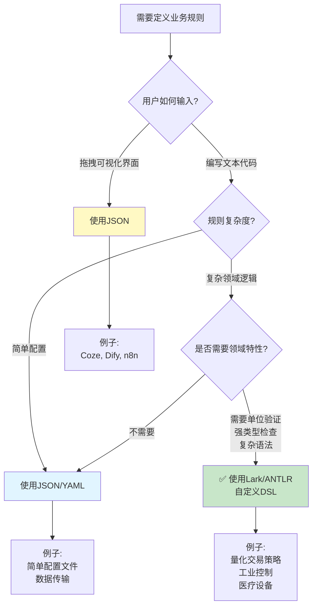

# 场景2：什么时候必须用Lark？

## 关键判断：人类要直接编写文本代码

---

## 典型场景1：量化交易策略（我们演示的例子）

### 用户操作流程

**步骤1：交易员在代码编辑器中编写策略**

```dsl
STRATEGY "趋势突破策略" VERSION 2.1
AUTHOR "张交易员"
CAPITAL $100000
RISK_PER_TRADE 2%

ENTRY_RULE "突破买入"
  WHEN price > SMA(20) AND volume > AVG_VOLUME * 1.5
  THEN BUY AT market_price
       SIZE = CAPITAL * 2%
```

**注意**：
- ✅ 交易员**直接编写这段文本**
- ✅ 需要语法高亮、自动补全
- ✅ 需要即时错误提示
- ❌ **没有可视化拖拽界面**（因为策略逻辑太复杂）

### 为什么不能用Coze的拖拽方式？

**问题1：条件表达式太复杂，无法用表单表示**

```
错误尝试：用Coze式表单来配置交易条件

┌─────────────────────────────────┐
│ 条件配置                        │
├─────────────────────────────────┤
│ 字段1: [price        ▼]         │
│ 运算符: [>          ▼]          │
│ 值: [SMA(            ]           │  ← 这里怎么填？SMA还需要参数！
│                                 │
│ 逻辑: [AND          ▼]          │
│                                 │
│ 字段2: [volume      ▼]          │
│ 运算符: [>          ▼]          │
│ 值: [AVG_VOLUME * 1.5]           │  ← 这个表达式怎么用表单配置？
└─────────────────────────────────┘
```

❌ 无法用简单的表单来表达复杂的数学表达式
❌ 嵌套的函数调用（SMA(20)）无法用下拉菜单配置

**问题2：策略组合有成千上万种，无法预设所有选项**

交易策略可能的组合：
- 技术指标: SMA, EMA, RSI, MACD, ATR, Bollinger Bands...（50+种）
- 条件组合: AND, OR, NOT, 嵌套括号...
- 数学运算: +, -, *, /, 百分比计算...
- 时间条件: 开盘前5分钟、收盘后10分钟...

✅ **DSL文本可以自由组合**
❌ **拖拽界面无法穷举所有可能性**

### 为什么必须用Lark而不是JSON？

**如果用JSON，交易员要手写这样的代码**：

```json
{
  "strategy": {
    "entry_rules": [{
      "conditions": {
        "operator": "AND",
        "left": {
          "field": "price",
          "operator": ">",
          "value": {
            "function": "SMA",
            "params": [20]
          }
        },
        "right": {
          "field": "volume",
          "operator": ">",
          "value": {
            "operator": "*",
            "left": {
              "function": "AVG_VOLUME"
            },
            "right": 1.5
          }
        }
      }
    }]
  }
}
```

**问题**：
❌ 交易员会写错逗号、括号
❌ 嵌套层级太深，容易出错
❌ 单位验证需要手动加字段：`{"amount": 100000, "currency": "USD"}`
❌ 一旦写错，生产环境才发现 = 资金损失

**用Lark DSL**：

```dsl
WHEN price > SMA(20) AND volume > AVG_VOLUME * 1.5
```

✅ 类似自然语言，交易员能看懂
✅ Lark解析器自动验证语法
✅ 强制单位符号：`$100000`，`2%`
✅ 解析时就发现错误，不会上线

---

## 典型场景2：配置文件（Terraform HCL）

### HashiCorp为什么发明HCL而不用JSON？

**用HCL（类似Lark的DSL）**：

```hcl
resource "aws_instance" "web_server" {
  ami           = "ami-0c55b159cbfafe1f0"
  instance_type = "t2.micro"

  tags = {
    Name = "WebServer"
    Env  = "Production"
  }
}
```

✅ 运维工程师直接编写
✅ 语法简洁、可读性强
✅ 支持变量、函数、条件判断

**如果用JSON**：

```json
{
  "resource": {
    "aws_instance": {
      "web_server": {
        "ami": "ami-0c55b159cbfafe1f0",
        "instance_type": "t2.micro",
        "tags": {
          "Name": "WebServer",
          "Env": "Production"
        }
      }
    }
  }
}
```

❌ 不支持注释（运维工程师需要写注释）
❌ 不支持变量复用
❌ 手写容易出错（逗号、引号）

**Terraform为什么不用可视化界面？**
- 运维工程师管理几百台服务器，不可能一个个拖拽
- 需要版本控制（Git）
- 需要代码复用（模块化）

---

## 典型场景3：Nginx配置文件

### Nginx为什么发明自己的DSL而不用JSON？

**Nginx DSL**：

```nginx
server {
    listen 80;
    server_name example.com;

    location / {
        proxy_pass http://localhost:3000;
        proxy_set_header Host $host;
    }

    location /api/ {
        proxy_pass http://localhost:8080;
    }
}
```

✅ 运维工程师直接编写
✅ 层级结构用缩进表示，清晰易读
✅ 支持变量：`$host`

**如果Nginx用JSON**：

```json
{
  "server": {
    "listen": 80,
    "server_name": "example.com",
    "location": {
      "/": {
        "proxy_pass": "http://localhost:3000",
        "proxy_set_header": {
          "Host": "$host"
        }
      },
      "/api/": {
        "proxy_pass": "http://localhost:8080"
      }
    }
  }
}
```

❌ 无法写注释
❌ 变量支持弱
❌ 可读性差

**Nginx为什么不用可视化界面？**
- 配置项太多（几百个指令）
- 需要精确控制每个参数
- 需要复制粘贴、批量修改

---

## 典型场景4：Kubernetes配置（YAML）

虽然不是Lark，但原理类似：**人类直接编写文本**

```yaml
apiVersion: apps/v1
kind: Deployment
metadata:
  name: nginx-deployment
spec:
  replicas: 3
  selector:
    matchLabels:
      app: nginx
  template:
    metadata:
      labels:
        app: nginx
    spec:
      containers:
      - name: nginx
        image: nginx:1.14.2
        ports:
        - containerPort: 80
```

✅ 开发者直接编写
✅ Git版本控制
✅ 可以写注释、使用变量

**为什么不用可视化界面？**
- 需要管理成千上万个容器
- 需要脚本批量操作
- 需要CI/CD自动化

---

## 决策树：选择JSON还是Lark？



---

## 总结：核心判断标准

| 判断维度 | 用JSON | 用Lark自定义DSL |
|---------|--------|----------------|
| **输入方式** | 拖拽界面生成 | 人类编写文本 |
| **用户类型** | 业务人员（非程序员） | 技术人员、领域专家 |
| **规则复杂度** | 简单流程 | 复杂领域逻辑 |
| **领域特性** | 不需要 | 需要（单位、类型检查） |
| **错误后果** | 容错率高 | 涉及资金/安全 |
| **示例** | Coze, Dify, n8n | 交易策略, Terraform, Nginx |

---

## 一句话总结

**Coze用JSON**：因为用户用鼠标拖拽，JSON是前端自动生成的，用户看不到

**量化交易用Lark**：因为交易员要直接写代码，需要语法验证和领域特性（单位、类型）
