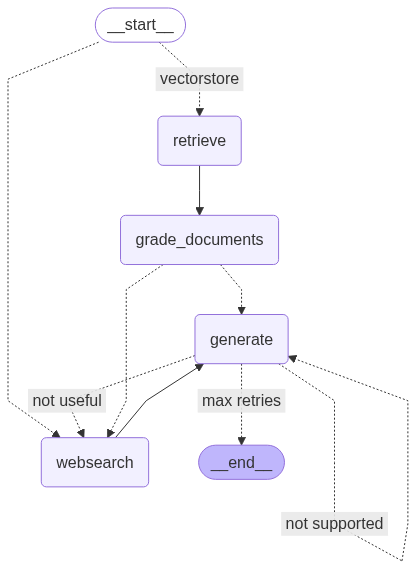

```python

# 依赖安装说明：
# - 在本仓库里建议跳过本 cell，直接用 `cd 02_workflows && uv sync --locked` 安装（稳定可复现）。
# - 如果你在临时环境（如 Colab）运行，再用 `%pip install` 安装依赖。
# 1. LangChain 核心框架：提供 Prompt 管理、Chain、Agent 等基础组件
# %pip install --quiet langchain

# 2. LangChain 社区版：集成第三方开源模型、数据库、工具 API（扩展核心库兼容性）
# %pip install --quiet langchain_community

# 3. Token 计数库（OpenAI 开源）：计算文本 Token 数，避免超出模型上下文窗口
# %pip install --quiet tiktoken

# 4. LangChain + Nomic AI 集成：对接 Nomic 的 Embedding 模型和向量数据库
# %pip install --quiet langchain-nomic

# 5. Nomic 本地运行依赖：安装本地 Embedding/向量存储所需的额外依赖（无需云端服务）
# %pip install --quiet "nomic[local]"

# 6. LangChain + Ollama 集成：调用本地 Ollama 部署的大模型（如 Llama 3、Qwen）
# %pip install --quiet langchain-ollama

# 7. 机器学习库：提供数据预处理、检索结果重排序、文本分类等算法支持
# %pip install --quiet scikit-learn

# 8. LangChain 工作流库：用图结构实现复杂多轮逻辑（如 Agent 状态流转、分支循环）
# %pip install --quiet langgraph

# 9. Tavily 搜索引擎 SDK：AI 专用实时检索工具，供 Agent 获取最新信息
# %pip install --quiet tavily-python

# 10. HTML 解析库（BeautifulSoup4）：爬取网页后提取结构化文本/表格
# %pip install --quiet bs4

# 11. LangChain 观测分析工具：跟踪链执行、调试 Prompt、监控 Token 消耗和性能
# %pip install --quiet langfuse

pass
```
**Output:**

```text
  Cell In[1], line 3
    pip install --quiet -U langchain
        ^
SyntaxError: invalid syntax
```
```python
# （可选）在临时环境安装：%pip install langchain-nomic
```
```python
### LLM配置 - 使用通义千问模型
import os
from pathlib import Path

from dotenv import load_dotenv
from langchain_community.chat_models import ChatTongyi

# 读取环境变量：优先当前目录的 .env；如果你从仓库根目录运行，再尝试 02_workflows/.env
if not load_dotenv():
    load_dotenv(Path("02_workflows/.env"))

if not os.getenv("DASHSCOPE_API_KEY"):
    raise RuntimeError("Missing DASHSCOPE_API_KEY. Set env var or fill 02_workflows/.env")

llm = ChatTongyi(
    model_name="qwen-turbo",
    temperature=0.7,
    streaming=True
)
llm_json_mode = ChatTongyi(
    model_name="qwen-turbo",
    temperature=0.7,
    streaming=True,
    format="json"
)

# Langfuse（可选）：开源可自建的 tracing/观测平台。
# 1) 先自建/使用 Langfuse，然后配置环境变量：
#    LANGFUSE_PUBLIC_KEY=...
#    LANGFUSE_SECRET_KEY=...
#    LANGFUSE_HOST=http://localhost:3000   # 自建时常见；云端可不配
# 2) 未配置则自动禁用，不影响 notebook 正常运行。
langfuse_handler = None
try:
    from langfuse.callback import CallbackHandler

    if os.getenv("LANGFUSE_PUBLIC_KEY") and os.getenv("LANGFUSE_SECRET_KEY"):
        langfuse_handler = CallbackHandler()
        print("Langfuse enabled")
    else:
        print("Langfuse disabled: set LANGFUSE_PUBLIC_KEY/LANGFUSE_SECRET_KEY to enable")
except Exception as e:
    print(f"Langfuse disabled: {e}")

callbacks = [langfuse_handler] if langfuse_handler else []
run_config = {"callbacks": callbacks} if callbacks else {}


def invoke_llm(messages):
    if callbacks:
        return llm.invoke(messages, config=run_config)
    return llm.invoke(messages)


def invoke_llm_json(messages):
    if callbacks:
        return llm_json_mode.invoke(messages, config=run_config)
    return llm_json_mode.invoke(messages)
```
**Output:**

```text
/Users/songxijun/workspace/otherProject/ai-training/.venv/lib/python3.12/site-packages/tqdm/auto.py:21: TqdmWarning: IProgress not found. Please update jupyter and ipywidgets. See https://ipywidgets.readthedocs.io/en/stable/user_install.html
  from .autonotebook import tqdm as notebook_tqdm
None of PyTorch, TensorFlow >= 2.0, or Flax have been found. Models won't be available and only tokenizers, configuration and file/data utilities can be used.
```

```text
Langfuse disabled: No module named 'langfuse.callback'
```
```python
# 使用 LangSmith 追踪
import os

# 没有 LANGSMITH_API_KEY 时开启 tracing 会导致 401（不影响核心流程，但会污染输出）。
if os.getenv("LANGSMITH_API_KEY") or os.getenv("LANGCHAIN_API_KEY"):
    os.environ["LANGCHAIN_TRACING_V2"] = "true"
    os.environ["LANGCHAIN_PROJECT"] = "langgraph-rag-demo"
else:
    os.environ["LANGCHAIN_TRACING_V2"] = "false"
```
```python
# 向量存储 - 文档加载、分割和向量化
# 导入必要的库用于文档处理和向量存储
from langchain_text_splitters import RecursiveCharacterTextSplitter  # 递归字符文本分割器
from langchain_community.document_loaders import WebBaseLoader  # 网页文档加载器
from langchain_community.vectorstores import SKLearnVectorStore  # 基于SKLearn的向量存储
from langchain_nomic.embeddings import NomicEmbeddings  # Nomic嵌入模型

# 定义要加载的网页URL列表，包含关于AI代理、提示工程和对抗攻击的文章
urls = [
    "https://lilianweng.github.io/posts/2023-06-23-agent/",  # AI代理相关文章
    "https://lilianweng.github.io/posts/2023-03-15-prompt-engineering/",  # 提示工程文章
    "https://lilianweng.github.io/posts/2023-10-25-adv-attack-llm/",  # LLM对抗攻击文章
]

# 加载文档
# 使用WebBaseLoader为每个URL加载网页内容，返回文档列表的列表
docs = [WebBaseLoader(url).load() for url in urls]
# 将嵌套的文档列表展平为单一的文档列表
docs_list = [item for sublist in docs for item in sublist]

# 分割文档
# 创建递归字符文本分割器，使用tiktoken编码器来准确计算token数量
text_splitter = RecursiveCharacterTextSplitter.from_tiktoken_encoder(
    chunk_size=1000,  # 每个文档块的最大大小为1000个token
    chunk_overlap=200  # 相邻文档块之间重叠200个token，确保上下文连续性
)
# 将所有文档分割成较小的文档块，便于检索和处理
doc_splits = text_splitter.split_documents(docs_list)

# 添加到向量数据库
# 使用分割后的文档创建向量存储，将文档转换为向量表示
vectorstore = SKLearnVectorStore.from_documents(
    documents=doc_splits,  # 输入分割后的文档
    embedding=NomicEmbeddings(model="nomic-embed-text-v1.5", inference_mode="local"),  # 使用Nomic嵌入模型，本地推理模式
)

# 创建检索器
# 将向量存储转换为检索器，设置返回最相关的3个文档
retriever = vectorstore.as_retriever(k=3)
```
**Output:**

```text
USER_AGENT environment variable not set, consider setting it to identify your requests.
Embedding texts: 100%|██████████| 47/47 [01:53<00:00,  2.42s/inputs]
```
```python
### Router - 路由模块
import json  # 用于JSON数据处理
import re
from langchain_core.messages import HumanMessage, SystemMessage  # 导入消息类型

def parse_json(content: str):
    """Best-effort JSON parser for LLM outputs.

    Tongyi / other chat models may prepend explanations or whitespace.
    This helper tries strict json.loads first, then extracts the first {...} block.
    """
    content = (content or "").strip()
    try:
        return json.loads(content)
    except Exception:
        match = re.search(r"\{.*\}", content, flags=re.S)
        if not match:
            raise
        return json.loads(match.group(0))

# 提示词定义
# 定义路由的系统指令，用于决定问题应该路由到向量存储还是网络搜索
router_instructions = """You are an expert at routing a user question to a vectorstore or web search.

The vectorstore contains documents related to agents, prompt engineering, and adversarial attacks.

Use the vectorstore for questions on these topics. For all else, and especially for current events, use web-search.

Return ONLY valid JSON with a single key, datasource, that is 'websearch' or 'vectorstore'. Do not output any other text."""

# 测试路由功能
# 测试1：体育赛事问题 - 应该路由到网络搜索（时事相关）
test_web_search = invoke_llm_json(
    [SystemMessage(content=router_instructions)]  # 系统消息包含路由指令
    + [
        HumanMessage(
            content="Who is favored to win the NFC Championship game in the 2024 season?"  # 询问2024赛季NFC冠军赛的热门球队
        )
    ]
)

# 测试2：最新模型发布问题 - 应该路由到网络搜索（时事相关）
test_web_search_2 = invoke_llm_json(
    [SystemMessage(content=router_instructions)]  # 系统消息包含路由指令
    + [HumanMessage(content="What are the models released today for llama3.2?")]  # 询问今天发布的llama3.2模型
)

# 测试3：代理记忆类型问题 - 应该路由到向量存储（与已有文档相关）
test_vector_store = invoke_llm_json(
    [SystemMessage(content=router_instructions)]  # 系统消息包含路由指令
    + [HumanMessage(content="What are the types of agent memory?")]  # 询问代理记忆的类型
)

# 打印所有测试结果，展示路由器的决策
print(
    parse_json(test_web_search.content),      # 解析第一个测试的JSON响应
    parse_json(test_web_search_2.content),   # 解析第二个测试的JSON响应
    parse_json(test_vector_store.content),   # 解析第三个测试的JSON响应
)
```
**Output:**

```text
{'datasource': 'websearch'} {'datasource': 'websearch'} {'datasource': 'vectorstore'}
```
```python
### Retrieval Grader - 检索评分器模块

# 文档评分器指令
# 定义文档评分器的系统指令，用于评估检索到的文档与用户问题的相关性
doc_grader_instructions = """You are a grader assessing relevance of a retrieved document to a user question.

If the document contains keyword(s) or semantic meaning related to the question, grade it as relevant."""

# 评分器提示词模板
# 定义具体的评分提示词，包含文档内容和用户问题
doc_grader_prompt = """Here is the retrieved document: \n\n {document} \n\n Here is the user question: \n\n {question}. 

This carefully and objectively assess whether the document contains at least some information that is relevant to the question.

Return ONLY valid JSON with single key, binary_score, that is 'yes' or 'no'. Do not output any other text."""

# 测试检索评分器功能
question = "What is Chain of thought prompting?"  # 测试问题：什么是思维链提示
docs = retriever.invoke(question)  # 使用检索器根据问题检索相关文档
doc_txt = docs[1].page_content  # 获取第二个文档的页面内容用于测试
# 格式化评分提示词，将实际的文档内容和问题填入模板
doc_grader_prompt_formatted = doc_grader_prompt.format(
    document=doc_txt, question=question
)
# 调用LLM进行文档相关性评分
result = invoke_llm_json(
    [SystemMessage(content=doc_grader_instructions)]  # 系统消息包含评分指令
    + [HumanMessage(content=doc_grader_prompt_formatted)]  # 用户消息包含格式化的评分提示
)
# 解析并返回JSON格式的评分结果
parse_json(result.content)
```
**Output:**

```text
Embedding texts: 100%|██████████| 1/1 [00:00<00:00, 21.43inputs/s]
```

```text
{'binary_score': 'yes'}
```
```python
### Generate - 生成器模块

# 提示词模板
# 定义RAG（检索增强生成）的提示词模板，用于基于检索到的上下文回答问题
rag_prompt = """You are an assistant for question-answering tasks. 

Here is the context to use to answer the question:

{context} 

Think carefully about the above context. 

Now, review the user question:

{question}

Provide an answer to this questions using only the above context. 

Use three sentences maximum and keep the answer concise.

Answer:"""


# 后处理函数
# 定义文档格式化函数，将多个文档合并为单一的上下文字符串
def format_docs(docs):
    return "\n\n".join(doc.page_content for doc in docs)  # 用双换行符连接所有文档的页面内容


# 测试生成功能
docs = retriever.invoke(question)  # 使用检索器根据问题检索相关文档
docs_txt = format_docs(docs)  # 将检索到的文档格式化为文本字符串
# 格式化RAG提示词，将上下文和问题填入模板
rag_prompt_formatted = rag_prompt.format(context=docs_txt, question=question)
# 调用LLM生成基于上下文的答案
generation = invoke_llm([HumanMessage(content=rag_prompt_formatted)])
# 打印生成的答案内容
print(generation.content)
```
**Output:**

```text
Embedding texts: 100%|██████████| 1/1 [00:00<00:00, 24.79inputs/s]
```

```text
Chain of Thought (CoT) prompting generates a sequence of short sentences to describe reasoning steps, leading to a final answer. It is particularly effective for complex reasoning tasks and can be implemented through few-shot examples or zero-shot instructions like "Let's think step by step." CoT helps improve accuracy by breaking down problems into logical steps.
```
```python
### Hallucination Grader - 幻觉评分器模块

# 幻觉评分器指令
# 定义幻觉评分器的系统指令，用于检查生成的答案是否基于提供的事实，避免产生虚假信息
hallucination_grader_instructions = """

You are a teacher grading a quiz. 

You will be given FACTS and a STUDENT ANSWER. 

Here is the grade criteria to follow:

(1) Ensure the STUDENT ANSWER is grounded in the FACTS. 

(2) Ensure the STUDENT ANSWER does not contain "hallucinated" information outside the scope of the FACTS.

Score:

A score of yes means that the student's answer meets all of the criteria. This is the highest (best) score. 

A score of no means that the student's answer does not meet all of the criteria. This is the lowest possible score you can give.

Explain your reasoning in a step-by-step manner to ensure your reasoning and conclusion are correct. 

Avoid simply stating the correct answer at the outset."""

# 评分器提示词模板
# 定义具体的幻觉检测提示词，包含事实文档和学生答案的占位符
hallucination_grader_prompt = """FACTS: \n\n {documents} \n\n STUDENT ANSWER: {generation}. 

Return ONLY valid JSON with two keys: binary_score ('yes' or 'no') and explanation (string). Do not output any other text."""

# 使用上面的文档和生成内容进行测试
# 格式化幻觉检测提示词，将实际的文档内容和生成的答案填入模板
hallucination_grader_prompt_formatted = hallucination_grader_prompt.format(
    documents=docs_txt, generation=generation.content  # docs_txt是格式化的文档，generation.content是LLM生成的答案
)
# 调用LLM进行幻觉检测评分
result = invoke_llm_json(
    [SystemMessage(content=hallucination_grader_instructions)]  # 系统消息包含幻觉检测指令
    + [HumanMessage(content=hallucination_grader_prompt_formatted)]  # 用户消息包含格式化的检测提示
)
# 解析并返回JSON格式的评分结果，包含二元评分和解释
parse_json(result.content)
```
**Output:**

```text
{'binary_score': 'yes',
 'explanation': "The student's answer is grounded in the facts provided. The description of Chain-of-Thought (CoT) prompting as generating a sequence of short sentences to describe reasoning steps, leading to a final answer, matches the definition given in the facts. The statement that it is particularly effective for complex reasoning tasks aligns with the fact that 'the benefit of CoT is more pronounced for complicated reasoning tasks.' The mention of few-shot examples and zero-shot instructions like 'Let's think step by step' corresponds to the facts describing two main types of CoT prompting: Few-shot CoT and Zero-shot CoT. Finally, the claim that CoT helps improve accuracy by breaking down problems into logical steps is consistent with the overall purpose of CoT as described in the facts."}
```
```python
### Answer Grader - 答案评分器模块

# 答案评分器指令
# 定义答案评分器的系统指令，用于评估学生答案是否有效回答了给定问题
answer_grader_instructions = """You are a teacher grading a quiz. 

You will be given a QUESTION and a STUDENT ANSWER. 

Here is the grade criteria to follow:

(1) The STUDENT ANSWER helps to answer the QUESTION

Score:

A score of yes means that the student's answer meets all of the criteria. This is the highest (best) score. 

The student can receive a score of yes if the answer contains extra information that is not explicitly asked for in the question.

A score of no means that the student's answer does not meet all of the criteria. This is the lowest possible score you can give.

Explain your reasoning in a step-by-step manner to ensure your reasoning and conclusion are correct. 

Avoid simply stating the correct answer at the outset."""

# 评分器提示词模板
# 定义具体的答案评分提示词，包含问题和学生答案的占位符
answer_grader_prompt = """QUESTION: \n\n {question} \n\n STUDENT ANSWER: {generation}. 

Return ONLY valid JSON with two keys: binary_score ('yes' or 'no') and explanation (string). Do not output any other text."""

# 测试数据
question = "What are the vision models released today as part of Llama 3.2?"  # 测试问题：今天发布的Llama 3.2视觉模型有哪些？
# 测试答案：包含Llama 3.2视觉模型的详细信息
answer = "The Llama 3.2 models released today include two vision models: Llama 3.2 11B Vision Instruct and Llama 3.2 90B Vision Instruct, which are available on Azure AI Model Catalog via managed compute. These models are part of Meta's first foray into multimodal AI and rival closed models like Anthropic's Claude 3 Haiku and OpenAI's GPT-4o mini in visual reasoning. They replace the older text-only Llama 3.1 models."

# 使用上面的问题和答案进行测试
# 格式化答案评分提示词，将实际的问题和答案填入模板
answer_grader_prompt_formatted = answer_grader_prompt.format(
    question=question, generation=answer  # question是测试问题，answer是要评分的答案
)
# 调用LLM进行答案质量评分
result = invoke_llm_json(
    [SystemMessage(content=answer_grader_instructions)]  # 系统消息包含答案评分指令
    + [HumanMessage(content=answer_grader_prompt_formatted)]  # 用户消息包含格式化的评分提示
)
# 解析并返回JSON格式的评分结果，包含二元评分和解释
parse_json(result.content)
```
**Output:**

```text
{'binary_score': 'yes',
 'explanation': "The student's answer directly addresses the question by listing the vision models released as part of Llama 3.2, specifically naming 'Llama 3.2 11B Vision Instruct' and 'Llama 3.2 90B Vision Instruct.' This information is exactly what the question asks for. While the answer includes additional context about the models being part of Meta's first foray into multimodal AI and their competition with other models, this extra information does not detract from the accuracy or relevance of the answer. Therefore, the student's response meets all the criteria for a 'yes' score."}
```
```python
# 搜索

from langchain_community.tools.tavily_search import TavilySearchResults

import os

# Tavily 需要设置环境变量 TAVILY_API_KEY，否则在调用 web search 时会报错。
if not os.getenv("TAVILY_API_KEY"):
    web_search_tool = None
    print("TAVILY_API_KEY not set: web search disabled (skip current-events test or set the key).")
else:
    web_search_tool = TavilySearchResults(k=3)
```
**Output:**

```text
C:\Users\Administrator\AppData\Local\Temp\ipykernel_804\2725807216.py:5: LangChainDeprecationWarning: The class `TavilySearchResults` was deprecated in LangChain 0.3.25 and will be removed in 1.0. An updated version of the class exists in the :class:`~langchain-tavily package and should be used instead. To use it run `pip install -U :class:`~langchain-tavily` and import as `from :class:`~langchain_tavily import TavilySearch``.
  web_search_tool = TavilySearchResults(k=3)
```
```python
# 状态定义
# 图的 `state` (状态) 模式包含我们想要
# 传递给我们图中每个节点的键
# （可选）在我们图的每个节点中修改

# 导入必要的类型定义库
import operator  # 操作符模块，用于定义累加操作
from typing_extensions import TypedDict  # 类型化字典，提供类型提示
from typing import List, Annotated  # 列表类型和注解类型


class GraphState(TypedDict):
    """
    Graph state is a dictionary that contains information we want to propagate to, and modify in, each graph node.
    图状态是一个字典，包含我们想要传播到图中每个节点并在其中修改的信息。
    """

    question: str  # 用户问题 - 存储用户输入的查询问题
    generation: str  # LLM生成内容 - 存储大语言模型生成的回答
    web_search: str  # 网络搜索决策 - 二元决策，决定是否运行网络搜索
    max_retries: int  # 最大重试次数 - 答案生成的最大重试次数限制
    answers: int  # 答案数量 - 已生成的答案数量计数
    loop_step: Annotated[int, operator.add]  # 循环步骤 - 使用累加操作符跟踪循环迭代次数
    documents: List[str]  # 文档列表 - 存储检索到的相关文档列表
```
```python
# 节点定义
# 我们图中的每个节点都只是一个函数，它会
# (1) 将 `state` (状态) 作为输入
# (2) 修改 `state` (状态)
# (3) 将修改后的 `state` (状态) 写入状态模式 (字典) 中

# 导入必要的模块
from langchain_core.documents import Document  # 文档类，用于创建文档对象
from langgraph.graph import END  # 图的结束节点


### Nodes - 节点函数定义
def retrieve(state):
    """
    从向量存储中检索文档
    Retrieve documents from vectorstore

    Args:
        state (dict): 当前图状态 The current graph state

    Returns:
        state (dict): 添加了新键documents的状态，包含检索到的文档 New key added to state, documents, that contains retrieved documents
    """
    print("---RETRIEVE---")  # 打印当前执行的步骤
    question = state["question"]  # 从状态中获取用户问题

    # 将检索到的文档写入状态的documents键中
    documents = retriever.invoke(question)  # 使用检索器根据问题检索相关文档
    return {"documents": documents}  # 返回包含文档的状态更新


def generate(state):
    """
    使用RAG在检索到的文档上生成答案
    Generate answer using RAG on retrieved documents

    Args:
        state (dict): 当前图状态 The current graph state

    Returns:
        state (dict): 添加了新键generation的状态，包含LLM生成内容 New key added to state, generation, that contains LLM generation
    """
    print("---GENERATE---")  # 打印当前执行的步骤
    question = state["question"]  # 从状态中获取用户问题
    documents = state["documents"]  # 从状态中获取检索到的文档
    loop_step = state.get("loop_step", 0)  # 获取当前循环步骤，默认为0

    # RAG生成过程
    docs_txt = format_docs(documents)  # 格式化文档为文本字符串
    rag_prompt_formatted = rag_prompt.format(context=docs_txt, question=question)  # 格式化RAG提示词
    generation = invoke_llm([HumanMessage(content=rag_prompt_formatted)])  # 调用LLM生成答案
    return {"generation": generation, "loop_step": loop_step + 1}  # 返回生成内容和更新的循环步骤


def grade_documents(state):
    """
    判断检索到的文档是否与问题相关
    如果任何文档不相关，我们将设置标志来运行网络搜索
    Determines whether the retrieved documents are relevant to the question
    If any document is not relevant, we will set a flag to run web search

    Args:
        state (dict): 当前图状态 The current graph state

    Returns:
        state (dict): 过滤掉不相关文档并更新web_search状态 Filtered out irrelevant documents and updated web_search state
    """

    print("---CHECK DOCUMENT RELEVANCE TO QUESTION---")  # 打印当前执行的步骤
    question = state["question"]  # 从状态中获取用户问题
    documents = state["documents"]  # 从状态中获取检索到的文档

    # 对每个文档进行评分
    filtered_docs = []  # 初始化过滤后的文档列表
    web_search = "No"  # 初始化网络搜索标志为"No"
    for d in documents:  # 遍历每个文档
        # 格式化文档评分提示词
        doc_grader_prompt_formatted = doc_grader_prompt.format(
            document=d.page_content, question=question
        )
        # 调用LLM对文档相关性进行评分
        result = invoke_llm_json(
            [SystemMessage(content=doc_grader_instructions)]
            + [HumanMessage(content=doc_grader_prompt_formatted)]
        )
        grade = parse_json(result.content)["binary_score"]  # 解析评分结果
        # 文档相关
        if grade.lower() == "yes":
            print("---GRADE: DOCUMENT RELEVANT---")  # 打印文档相关信息
            filtered_docs.append(d)  # 将相关文档添加到过滤列表
        # 文档不相关
        else:
            print("---GRADE: DOCUMENT NOT RELEVANT---")  # 打印文档不相关信息
            # 我们不将该文档包含在filtered_docs中
            # 我们设置标志表示要运行网络搜索
            web_search = "Yes"  # 设置网络搜索标志为"Yes"
            continue  # 继续处理下一个文档

    # 如果没有配置 Tavily（TAVILY_API_KEY），则禁用 web_search 分支，避免运行时报错
    if web_search == "Yes" and web_search_tool is None:
        print("---WEB SEARCH DISABLED (missing TAVILY_API_KEY); continue without web search---")
        web_search = "No"

    return {"documents": filtered_docs, "web_search": web_search}  # 返回过滤后的文档和搜索标志


def web_search(state):
    """
    基于问题进行网络搜索
    Web search based based on the question

    Args:
        state (dict): 当前图状态 The current graph state

    Returns:
        state (dict): 将网络搜索结果附加到文档中 Appended web results to documents
    """

    print("---WEB SEARCH---")  # 打印当前执行的步骤
    question = state["question"]  # 从状态中获取用户问题
    documents = state.get("documents", [])  # 从状态中获取现有文档，默认为空列表

    # 网络搜索
    docs = web_search_tool.invoke({"query": question})  # 使用网络搜索工具搜索问题
    web_results = "\n".join([d["content"] for d in docs])  # 将搜索结果合并为文本
    web_results = Document(page_content=web_results)  # 创建文档对象
    documents.append(web_results)  # 将网络搜索结果添加到文档列表
    return {"documents": documents}  # 返回更新后的文档列表


### Edges - 边函数定义（用于节点间路由）


def route_question(state):
    """
    将问题路由到网络搜索或RAG
    Route question to web search or RAG

    Args:
        state (dict): 当前图状态 The current graph state

    Returns:
        str: 要调用的下一个节点 Next node to call
    """

    print("---ROUTE QUESTION---")  # 打印当前执行的步骤
    # 调用路由器LLM决定使用哪种数据源
    route_question = invoke_llm_json(
        [SystemMessage(content=router_instructions)]
        + [HumanMessage(content=state["question"])]
    )
    source = parse_json(route_question.content)["datasource"]  # 解析数据源决策
    if source == "websearch" and web_search_tool is None:
        print("---WEB SEARCH DISABLED (missing TAVILY_API_KEY); fallback to vectorstore---")
        source = "vectorstore"

    if source == "websearch":
        print("---ROUTE QUESTION TO WEB SEARCH---")  # 路由到网络搜索
        return "websearch"
    elif source == "vectorstore":
        print("---ROUTE QUESTION TO RAG---")  # 路由到RAG（向量存储）
        return "vectorstore"


def decide_to_generate(state):
    """
    决定是生成答案还是添加网络搜索
    Determines whether to generate an answer, or add web search

    Args:
        state (dict): 当前图状态 The current graph state

    Returns:
        str: 要调用的下一个节点的二元决策 Binary decision for next node to call
    """

    print("---ASSESS GRADED DOCUMENTS---")  # 打印当前执行的步骤
    question = state["question"]  # 从状态中获取用户问题
    web_search = state["web_search"]  # 从状态中获取网络搜索标志
    filtered_documents = state["documents"]  # 从状态中获取过滤后的文档

    if web_search == "Yes":
        # 所有文档都已被过滤检查相关性
        # 我们将重新生成一个新查询
        print(
            "---DECISION: NOT ALL DOCUMENTS ARE RELEVANT TO QUESTION, INCLUDE WEB SEARCH---"
        )
        return "websearch"  # 返回网络搜索节点
    else:
        # 我们有相关文档，所以生成答案
        print("---DECISION: GENERATE---")
        return "generate"  # 返回生成节点


def grade_generation_v_documents_and_question(state):
    """
    判断生成内容是否基于文档并回答了问题
    Determines whether the generation is grounded in the document and answers question

    Args:
        state (dict): 当前图状态 The current graph state

    Returns:
        str: 要调用的下一个节点的决策 Decision for next node to call
    """

    print("---CHECK HALLUCINATIONS---")  # 打印当前执行的步骤
    question = state["question"]  # 从状态中获取用户问题
    documents = state["documents"]  # 从状态中获取文档
    generation = state["generation"]  # 从状态中获取生成内容
    max_retries = state.get("max_retries", 3)  # 获取最大重试次数，默认为3

    # 格式化幻觉检测提示词
    hallucination_grader_prompt_formatted = hallucination_grader_prompt.format(
        documents=format_docs(documents), generation=generation.content
    )
    # 调用LLM进行幻觉检测
    result = invoke_llm_json(
        [SystemMessage(content=hallucination_grader_instructions)]
        + [HumanMessage(content=hallucination_grader_prompt_formatted)]
    )
    grade = parse_json(result.content)["binary_score"]  # 解析幻觉检测结果

    # 检查幻觉
    if grade == "yes":
        print("---DECISION: GENERATION IS GROUNDED IN DOCUMENTS---")  # 生成内容基于文档
        # 检查问题回答质量
        print("---GRADE GENERATION vs QUESTION---")
        # 使用上面的问题和生成内容进行测试
        answer_grader_prompt_formatted = answer_grader_prompt.format(
            question=question, generation=generation.content
        )
        # 调用LLM进行答案质量评分
        result = invoke_llm_json(
            [SystemMessage(content=answer_grader_instructions)]
            + [HumanMessage(content=answer_grader_prompt_formatted)]
        )
        grade = parse_json(result.content)["binary_score"]  # 解析答案质量评分
        if grade == "yes":
            print("---DECISION: GENERATION ADDRESSES QUESTION---")  # 生成内容回答了问题
            return "useful"  # 返回有用标志
        elif state["loop_step"] <= max_retries:
            print("---DECISION: GENERATION DOES NOT ADDRESS QUESTION---")  # 生成内容未回答问题
            return "not useful"  # 返回无用标志
        else:
            print("---DECISION: MAX RETRIES REACHED---")  # 达到最大重试次数
            return "max retries"  # 返回最大重试标志
    elif state["loop_step"] <= max_retries:
        print("---DECISION: GENERATION IS NOT GROUNDED IN DOCUMENTS, RE-TRY---")  # 生成内容未基于文档，重试
        return "not supported"  # 返回不支持标志
    else:
        print("---DECISION: MAX RETRIES REACHED---")  # 达到最大重试次数
        return "max retries"  # 返回最大重试标志
```
```python
# 每个边在图中的节点之间进行路由。
# 边函数负责决定工作流的下一步执行哪个节点

# 导入必要的模块
from langchain_core.documents import Document  # 文档类，用于创建文档对象
from langgraph.graph import END  # 图的结束节点


### Nodes - 节点函数定义
def retrieve(state):
    """
    从向量存储中检索文档
    Retrieve documents from vectorstore

    Args:
        state (dict): 当前图状态 The current graph state

    Returns:
        state (dict): 添加了新键documents的状态，包含检索到的文档 New key added to state, documents, that contains retrieved documents
    """
    print("---RETRIEVE---")  # 打印检索步骤标识
    question = state["question"]  # 从状态中提取用户问题

    # 将检索到的文档写入状态的documents键中
    documents = retriever.invoke(question)  # 调用检索器获取相关文档
    return {"documents": documents}  # 返回包含检索文档的状态更新


def generate(state):
    """
    使用RAG在检索到的文档上生成答案
    Generate answer using RAG on retrieved documents

    Args:
        state (dict): 当前图状态 The current graph state

    Returns:
        state (dict): 添加了新键generation的状态，包含LLM生成内容 New key added to state, generation, that contains LLM generation
    """
    print("---GENERATE---")  # 打印生成步骤标识
    question = state["question"]  # 从状态中获取用户问题
    documents = state["documents"]  # 从状态中获取检索到的文档
    loop_step = state.get("loop_step", 0)  # 获取当前循环步数，默认为0

    # RAG生成过程
    docs_txt = format_docs(documents)  # 将文档列表格式化为文本字符串
    rag_prompt_formatted = rag_prompt.format(context=docs_txt, question=question)  # 使用上下文和问题格式化提示词
    generation = invoke_llm([HumanMessage(content=rag_prompt_formatted)])  # 调用LLM生成回答
    return {"generation": generation, "loop_step": loop_step + 1}  # 返回生成结果和递增的循环步数


def grade_documents(state):
    """
    判断检索到的文档是否与问题相关
    如果任何文档不相关，我们将设置标志来运行网络搜索
    Determines whether the retrieved documents are relevant to the question
    If any document is not relevant, we will set a flag to run web search

    Args:
        state (dict): 当前图状态 The current graph state

    Returns:
        state (dict): 过滤掉不相关文档并更新web_search状态 Filtered out irrelevant documents and updated web_search state
    """

    print("---CHECK DOCUMENT RELEVANCE TO QUESTION---")  # 打印文档相关性检查标识
    question = state["question"]  # 从状态中获取用户问题
    documents = state["documents"]  # 从状态中获取检索到的文档

    # 对每个文档进行评分
    filtered_docs = []  # 初始化过滤后的文档列表
    web_search = "No"  # 初始化网络搜索标志为否
    for d in documents:  # 遍历每个检索到的文档
        # 格式化文档评分提示词
        doc_grader_prompt_formatted = doc_grader_prompt.format(
            document=d.page_content, question=question
        )
        # 调用LLM对文档相关性进行评分
        result = invoke_llm_json(
            [SystemMessage(content=doc_grader_instructions)]
            + [HumanMessage(content=doc_grader_prompt_formatted)]
        )
        grade = parse_json(result.content)["binary_score"]  # 解析评分结果
        # 文档相关
        if grade.lower() == "yes":
            print("---GRADE: DOCUMENT RELEVANT---")  # 打印文档相关信息
            filtered_docs.append(d)  # 将相关文档添加到过滤列表
        # 文档不相关
        else:
            print("---GRADE: DOCUMENT NOT RELEVANT---")  # 打印文档不相关信息
            # 我们不将该文档包含在filtered_docs中
            # 我们设置标志表示要运行网络搜索
            web_search = "Yes"  # 设置网络搜索标志为是
            continue  # 继续处理下一个文档

    # 如果没有配置 Tavily（TAVILY_API_KEY），则禁用 web_search 分支，避免运行时报错
    if web_search == "Yes" and web_search_tool is None:
        print("---WEB SEARCH DISABLED (missing TAVILY_API_KEY); continue without web search---")
        web_search = "No"

    return {"documents": filtered_docs, "web_search": web_search}  # 返回过滤后的文档和搜索标志


def web_search(state):
    """
    基于问题进行网络搜索
    Web search based based on the question

    Args:
        state (dict): 当前图状态 The current graph state

    Returns:
        state (dict): 将网络搜索结果附加到文档中 Appended web results to documents
    """

    print("---WEB SEARCH---")  # 打印网络搜索步骤标识
    question = state["question"]  # 从状态中获取用户问题
    documents = state.get("documents", [])  # 从状态中获取现有文档，默认为空列表

    # 网络搜索
    docs = web_search_tool.invoke({"query": question})  # 使用网络搜索工具执行搜索
    web_results = "\n".join([d["content"] for d in docs])  # 将搜索结果内容合并为字符串
    web_results = Document(page_content=web_results)  # 创建包含搜索结果的文档对象
    documents.append(web_results)  # 将网络搜索结果添加到现有文档列表
    return {"documents": documents}  # 返回更新后的文档列表


### Edges - 边函数定义（控制节点间的路由逻辑）


def route_question(state):
    """
    将问题路由到网络搜索或RAG
    Route question to web search or RAG

    Args:
        state (dict): 当前图状态 The current graph state

    Returns:
        str: 要调用的下一个节点名称 Next node to call
    """

    print("---ROUTE QUESTION---")  # 打印问题路由步骤标识
    # 使用路由器LLM决定数据源
    route_question = invoke_llm_json(
        [SystemMessage(content=router_instructions)]
        + [HumanMessage(content=state["question"])]
    )
    source = parse_json(route_question.content)["datasource"]  # 解析路由决策结果
    if source == "websearch" and web_search_tool is None:
        print("---WEB SEARCH DISABLED (missing TAVILY_API_KEY); fallback to vectorstore---")
        source = "vectorstore"

    if source == "websearch":
        print("---ROUTE QUESTION TO WEB SEARCH---")  # 路由到网络搜索
        return "websearch"  # 返回网络搜索节点名
    elif source == "vectorstore":
        print("---ROUTE QUESTION TO RAG---")  # 路由到RAG检索
        return "vectorstore"  # 返回向量存储节点名


def decide_to_generate(state):
    """
    决定是生成答案还是添加网络搜索
    Determines whether to generate an answer, or add web search

    Args:
        state (dict): 当前图状态 The current graph state

    Returns:
        str: 要调用的下一个节点的二元决策 Binary decision for next node to call
    """

    print("---ASSESS GRADED DOCUMENTS---")  # 打印文档评估步骤标识
    question = state["question"]  # 从状态中获取用户问题
    web_search = state["web_search"]  # 从状态中获取网络搜索标志
    filtered_documents = state["documents"]  # 从状态中获取过滤后的文档

    if web_search == "Yes":
        # 所有文档都已被过滤检查相关性
        # 我们将重新生成一个新查询
        print(
            "---DECISION: NOT ALL DOCUMENTS ARE RELEVANT TO QUESTION, INCLUDE WEB SEARCH---"
        )
        return "websearch"  # 返回网络搜索节点
    else:
        # 我们有相关文档，所以生成答案
        print("---DECISION: GENERATE---")  # 决定生成答案
        return "generate"  # 返回生成节点


def grade_generation_v_documents_and_question(state):
    """
    判断生成内容是否基于文档并回答了问题
    Determines whether the generation is grounded in the document and answers question

    Args:
        state (dict): 当前图状态 The current graph state

    Returns:
        str: 要调用的下一个节点的决策 Decision for next node to call
    """

    print("---CHECK HALLUCINATIONS---")  # 打印幻觉检查步骤标识
    question = state["question"]  # 从状态中获取用户问题
    documents = state["documents"]  # 从状态中获取文档
    generation = state["generation"]  # 从状态中获取生成内容
    max_retries = state.get("max_retries", 3)  # 获取最大重试次数，默认为3

    # 格式化幻觉检测提示词
    hallucination_grader_prompt_formatted = hallucination_grader_prompt.format(
        documents=format_docs(documents), generation=generation.content
    )
    # 调用LLM进行幻觉检测
    result = invoke_llm_json(
        [SystemMessage(content=hallucination_grader_instructions)]
        + [HumanMessage(content=hallucination_grader_prompt_formatted)]
    )
    grade = parse_json(result.content)["binary_score"]  # 解析幻觉检测结果

    # 检查幻觉
    if grade == "yes":
        print("---DECISION: GENERATION IS GROUNDED IN DOCUMENTS---")  # 生成内容基于文档
        # 检查问题回答质量
        print("---GRADE GENERATION vs QUESTION---")  # 评估生成内容与问题的匹配度
        # 使用上面的问题和生成内容进行测试
        answer_grader_prompt_formatted = answer_grader_prompt.format(
            question=question, generation=generation.content
        )
        # 调用LLM进行答案质量评分
        result = invoke_llm_json(
            [SystemMessage(content=answer_grader_instructions)]
            + [HumanMessage(content=answer_grader_prompt_formatted)]
        )
        grade = parse_json(result.content)["binary_score"]  # 解析答案质量评分
        if grade == "yes":
            print("---DECISION: GENERATION ADDRESSES QUESTION---")  # 生成内容回答了问题
            return "useful"  # 返回有用标志，结束流程
        elif state["loop_step"] <= max_retries:
            print("---DECISION: GENERATION DOES NOT ADDRESS QUESTION---")  # 生成内容未回答问题
            return "not useful"  # 返回无用标志，需要网络搜索
        else:
            print("---DECISION: MAX RETRIES REACHED---")  # 达到最大重试次数
            return "max retries"  # 返回最大重试标志，结束流程
    elif state["loop_step"] <= max_retries:
        print("---DECISION: GENERATION IS NOT GROUNDED IN DOCUMENTS, RE-TRY---")  # 生成内容未基于文档，重试
        return "not supported"  # 返回不支持标志，重新生成
    else:
        print("---DECISION: MAX RETRIES REACHED---")  # 达到最大重试次数
        return "max retries"  # 返回最大重试标志，结束流程
```
```python
# 控制流 - 构建和配置LangGraph工作流

# 导入必要的模块
from langgraph.graph import StateGraph  # 状态图类，用于构建工作流图
from IPython.display import Image, display  # 用于显示图像的模块

# 创建状态图工作流，使用之前定义的GraphState作为状态模式
workflow = StateGraph(GraphState)

# 定义节点 - 将函数添加为图中的节点
workflow.add_node("websearch", web_search)  # 添加网络搜索节点
workflow.add_node("retrieve", retrieve)  # 添加文档检索节点
workflow.add_node("grade_documents", grade_documents)  # 添加文档评分节点
workflow.add_node("generate", generate)  # 添加答案生成节点

# 构建图结构
# 设置条件入口点 - 根据问题类型决定起始节点
workflow.set_conditional_entry_point(
    route_question,  # 路由函数，决定使用哪个数据源
    {
        "websearch": "websearch",    # 如果路由结果是"websearch"，跳转到网络搜索节点
        "vectorstore": "retrieve",   # 如果路由结果是"vectorstore"，跳转到检索节点
    },
)

# 添加固定边 - 定义节点间的直接连接
workflow.add_edge("websearch", "generate")  # 网络搜索后直接跳转到生成节点
workflow.add_edge("retrieve", "grade_documents")  # 检索后跳转到文档评分节点

# 添加条件边 - 根据函数返回值决定下一个节点
workflow.add_conditional_edges(
    "grade_documents",  # 从文档评分节点出发
    decide_to_generate,  # 决策函数，判断是否可以生成答案
    {
        "websearch": "websearch",  # 如果需要网络搜索，跳转到网络搜索节点
        "generate": "generate",    # 如果可以生成答案，跳转到生成节点
    },
)

# 添加生成节点的条件边 - 评估生成质量并决定下一步
workflow.add_conditional_edges(
    "generate",  # 从生成节点出发
    grade_generation_v_documents_and_question,  # 评估函数，检查生成质量
    {
        "not supported": "generate",    # 如果生成内容不基于文档，重新生成
        "useful": END,                  # 如果生成内容有用，结束流程
        "not useful": "websearch",      # 如果生成内容无用，进行网络搜索
        "max retries": END,             # 如果达到最大重试次数，结束流程
    },
)

# 编译工作流图
graph = workflow.compile()  # 将工作流编译为可执行的图

# 显示工作流图的可视化表示
# Mermaid PNG 渲染默认会请求 https://mermaid.ink（有时会失败）。失败时退化为输出 Mermaid 文本。
try:
    display(Image(graph.get_graph().draw_mermaid_png()))  # 生成并显示Mermaid格式的流程图
except Exception as e:
    print(f"Skip mermaid PNG render: {e}")
    print(graph.get_graph().draw_mermaid())
```
**Output:**


```python
inputs = {"question": "What are the types of agent memory?", "max_retries": 3}
for event in graph.stream(inputs, config=run_config, stream_mode="values"):
    print(event)
```
**Output:**

```text
---ROUTE QUESTION---
---ROUTE QUESTION TO RAG---
{'question': 'What are the types of agent memory?', 'max_retries': 3, 'loop_step': 0}
---RETRIEVE---
```

```text
Embedding texts: 100%|██████████| 1/1 [00:00<00:00, 22.62inputs/s]
```

```text
{'question': 'What are the types of agent memory?', 'max_retries': 3, 'loop_step': 0, 'documents': [Document(metadata={'id': '6263b6ea-5182-4860-9cee-b31e5e5a1e61', 'source': 'https://lilianweng.github.io/posts/2023-06-23-agent/', 'title': "LLM Powered Autonomous Agents | Lil'Log", 'description': 'Building agents with LLM (large language model) as its core controller is a cool concept. Several proof-of-concepts demos, such as AutoGPT, GPT-Engineer and BabyAGI, serve as inspiring examples. The potentiality of LLM extends beyond generating well-written copies, stories, essays and programs; it can be framed as a powerful general problem solver.\nAgent System Overview\nIn a LLM-powered autonomous agent system, LLM functions as the agent’s brain, complemented by several key components:\n\nPlanning\n\nSubgoal and decomposition: The agent breaks down large tasks into smaller, manageable subgoals, enabling efficient handling of complex tasks.\nReflection and refinement: The agent can do self-criticism and self-reflection over past actions, learn from mistakes and refine them for future steps, thereby improving the quality of final results.\n\n\nMemory\n\nShort-term memory: I would consider all the in-context learning (See Prompt Engineering) as utilizing short-term memory of the model to learn.\nLong-term memory: This provides the agent with the capability to retain and recall (infinite) information over extended periods, often by leveraging an external vector store and fast retrieval.\n\n\nTool use\n\nThe agent learns to call external APIs for extra information that is missing from the model weights (often hard to change after pre-training), including current information, code execution capability, access to proprietary information sources and more.\n\n\n\n\n\t\n\tOverview of a LLM-powered autonomous agent system.\n\nComponent One: Planning\nA complicated task usually involves many steps. An agent needs to know what they are and plan ahead.', 'language': 'en'}, page_content="LLM Powered Autonomous Agents | Lil'Log\n\n\n\n\n\n\n\n\n\n\n\n\n\n\n\n\n\n\n\n\n\n\n\n\n\n\n\n\n\n\n\n\n\n\n\n\n\n\n\nLil'Log\n\n\n\n\n\n\n\n\n\n\n\n\n\n\n\n\n\n|\n\n\n\n\n\n\nPosts\n\n\n\n\nArchive\n\n\n\n\nSearch\n\n\n\n\nTags\n\n\n\n\nFAQ\n\n\n\n\n\n\n\n\n\n      LLM Powered Autonomous Agents\n    \nDate: June 23, 2023  |  Estimated Reading Time: 31 min  |  Author: Lilian Weng\n\n\n \n\n\nTable of Contents\n\n\n\nAgent System Overview\n\nComponent One: Planning\n\nTask Decomposition\n\nSelf-Reflection\n\n\nComponent Two: Memory\n\nTypes of Memory\n\nMaximum Inner Product Search (MIPS)\n\n\nComponent Three: Tool Use\n\nCase Studies\n\nScientific Discovery Agent\n\nGenerative Agents Simulation\n\nProof-of-Concept Examples\n\n\nChallenges\n\nCitation\n\nReferences\n\n\n\n\n\nBuilding agents with LLM (large language model) as its core controller is a cool concept. Several proof-of-concepts demos, such as AutoGPT, GPT-Engineer and BabyAGI, serve as inspiring examples. The potentiality of LLM extends beyond generating well-written copies, stories, essays and programs; it can be framed as a powerful general problem solver.\nAgent System Overview#\nIn a LLM-powered autonomous agent system, LLM functions as the agent’s brain, complemented by several key components:\n\nPlanning\n\nSubgoal and decomposition: The agent breaks down large tasks into smaller, manageable subgoals, enabling efficient handling of complex tasks.\nReflection and refinement: The agent can do self-criticism and self-reflection over past actions, learn from mistakes and refine them for future steps, thereby improving the quality of final results.\n\n\nMemory\n\nShort-term memory: I would consider all the in-context learning (See Prompt Engineering) as utilizing short-term memory of the model to learn.\nLong-term memory: This provides the agent with the capability to retain and recall (infinite) information over extended periods, often by leveraging an external vector store and fast retrieval.\n\n\nTool use\n\nThe agent learns to call external APIs for extra information that is missing from the model weights (often hard to change after pre-training), including current information, code execution capability, access to proprietary information sources and more.\n\n\n\n\n\nOverview of a LLM-powered autonomous agent system."), Document(metadata={'id': '54b675c2-fc68-468b-8408-f9c36ef0006b', 'source': 'https://lilianweng.github.io/posts/2023-06-23-agent/', 'title': "LLM Powered Autonomous Agents | Lil'Log", 'description': 'Building agents with LLM (large language model) as its core controller is a cool concept. Several proof-of-concepts demos, such as AutoGPT, GPT-Engineer and BabyAGI, serve as inspiring examples. The potentiality of LLM extends beyond generating well-written copies, stories, essays and programs; it can be framed as a powerful general problem solver.\nAgent System Overview\nIn a LLM-powered autonomous agent system, LLM functions as the agent’s brain, complemented by several key components:\n\nPlanning\n\nSubgoal and decomposition: The agent breaks down large tasks into smaller, manageable subgoals, enabling efficient handling of complex tasks.\nReflection and refinement: The agent can do self-criticism and self-reflection over past actions, learn from mistakes and refine them for future steps, thereby improving the quality of final results.\n\n\nMemory\n\nShort-term memory: I would consider all the in-context learning (See Prompt Engineering) as utilizing short-term memory of the model to learn.\nLong-term memory: This provides the agent with the capability to retain and recall (infinite) information over extended periods, often by leveraging an external vector store and fast retrieval.\n\n\nTool use\n\nThe agent learns to call external APIs for extra information that is missing from the model weights (often hard to change after pre-training), including current information, code execution capability, access to proprietary information sources and more.\n\n\n\n\n\t\n\tOverview of a LLM-powered autonomous agent system.\n\nComponent One: Planning\nA complicated task usually involves many steps. An agent needs to know what they are and plan ahead.', 'language': 'en'}, page_content='Memory\n\nShort-term memory: I would consider all the in-context learning (See Prompt Engineering) as utilizing short-term memory of the model to learn.\nLong-term memory: This provides the agent with the capability to retain and recall (infinite) information over extended periods, often by leveraging an external vector store and fast retrieval.\n\n\nTool use\n\nThe agent learns to call external APIs for extra information that is missing from the model weights (often hard to change after pre-training), including current information, code execution capability, access to proprietary information sources and more.\n\n\n\n\n\nOverview of a LLM-powered autonomous agent system.\n\nComponent One: Planning#\nA complicated task usually involves many steps. An agent needs to know what they are and plan ahead.\nTask Decomposition#\nChain of thought (CoT; Wei et al. 2022) has become a standard prompting technique for enhancing model performance on complex tasks. The model is instructed to “think step by step” to utilize more test-time computation to decompose hard tasks into smaller and simpler steps. CoT transforms big tasks into multiple manageable tasks and shed lights into an interpretation of the model’s thinking process.\nTree of Thoughts (Yao et al. 2023) extends CoT by exploring multiple reasoning possibilities at each step. It first decomposes the problem into multiple thought steps and generates multiple thoughts per step, creating a tree structure. The search process can be BFS (breadth-first search) or DFS (depth-first search) with each state evaluated by a classifier (via a prompt) or majority vote.\nTask decomposition can be done (1) by LLM with simple prompting like "Steps for XYZ.\\n1.", "What are the subgoals for achieving XYZ?", (2) by using task-specific instructions; e.g. "Write a story outline." for writing a novel, or (3) with human inputs.\nAnother quite distinct approach, LLM+P (Liu et al. 2023), involves relying on an external classical planner to do long-horizon planning. This approach utilizes the Planning Domain Definition Language (PDDL) as an intermediate interface to describe the planning problem. In this process, LLM (1) translates the problem into “Problem PDDL”, then (2) requests a classical planner to generate a PDDL plan based on an existing “Domain PDDL”, and finally (3) translates the PDDL plan back into natural language. Essentially, the planning step is outsourced to an external tool, assuming the availability of domain-specific PDDL and a suitable planner which is common in certain robotic setups but not in many other domains.\nSelf-Reflection#\nSelf-reflection is a vital aspect that allows autonomous agents to improve iteratively by refining past action decisions and correcting previous mistakes. It plays a crucial role in real-world tasks where trial and error are inevitable.\nReAct (Yao et al. 2023) integrates reasoning and acting within LLM by extending the action space to be a combination of task-specific discrete actions and the language space. The former enables LLM to interact with the environment (e.g. use Wikipedia search API), while the latter prompting LLM to generate reasoning traces in natural language.\nThe ReAct prompt template incorporates explicit steps for LLM to think, roughly formatted as:\nThought: ...\nAction: ...\nObservation: ...\n... (Repeated many times)\n\n\nExamples of reasoning trajectories for knowledge-intensive tasks (e.g. HotpotQA, FEVER) and decision-making tasks (e.g. AlfWorld Env, WebShop). (Image source: Yao et al. 2023).\n\nIn both experiments on knowledge-intensive tasks and decision-making tasks, ReAct works better than the Act-only baseline where Thought: … step is removed.\nReflexion (Shinn & Labash 2023) is a framework to equip agents with dynamic memory and self-reflection capabilities to improve reasoning skills. Reflexion has a standard RL setup, in which the reward model provides a simple binary reward and the action space follows the setup in ReAct where the task-specific action space is augmented with language to enable complex reasoning steps. After each action $a_t$, the agent computes a heuristic $h_t$ and optionally may decide to reset the environment to start a new trial depending on the self-reflection results.\n\n\nIllustration of the Reflexion framework. (Image source: Shinn & Labash, 2023)'), Document(metadata={'id': '5d351e9a-f8de-4970-a0ab-aa9dd3cad97a', 'source': 'https://lilianweng.github.io/posts/2023-06-23-agent/', 'title': "LLM Powered Autonomous Agents | Lil'Log", 'description': 'Building agents with LLM (large language model) as its core controller is a cool concept. Several proof-of-concepts demos, such as AutoGPT, GPT-Engineer and BabyAGI, serve as inspiring examples. The potentiality of LLM extends beyond generating well-written copies, stories, essays and programs; it can be framed as a powerful general problem solver.\nAgent System Overview\nIn a LLM-powered autonomous agent system, LLM functions as the agent’s brain, complemented by several key components:\n\nPlanning\n\nSubgoal and decomposition: The agent breaks down large tasks into smaller, manageable subgoals, enabling efficient handling of complex tasks.\nReflection and refinement: The agent can do self-criticism and self-reflection over past actions, learn from mistakes and refine them for future steps, thereby improving the quality of final results.\n\n\nMemory\n\nShort-term memory: I would consider all the in-context learning (See Prompt Engineering) as utilizing short-term memory of the model to learn.\nLong-term memory: This provides the agent with the capability to retain and recall (infinite) information over extended periods, often by leveraging an external vector store and fast retrieval.\n\n\nTool use\n\nThe agent learns to call external APIs for extra information that is missing from the model weights (often hard to change after pre-training), including current information, code execution capability, access to proprietary information sources and more.\n\n\n\n\n\t\n\tOverview of a LLM-powered autonomous agent system.\n\nComponent One: Planning\nA complicated task usually involves many steps. An agent needs to know what they are and plan ahead.', 'language': 'en'}, page_content='Explicit / declarative memory: This is memory of facts and events, and refers to those memories that can be consciously recalled, including episodic memory (events and experiences) and semantic memory (facts and concepts).\nImplicit / procedural memory: This type of memory is unconscious and involves skills and routines that are performed automatically, like riding a bike or typing on a keyboard.\n\n\n\n\n\nCategorization of human memory.\n\nWe can roughly consider the following mappings:\n\nSensory memory as learning embedding representations for raw inputs, including text, image or other modalities;\nShort-term memory as in-context learning. It is short and finite, as it is restricted by the finite context window length of Transformer.\nLong-term memory as the external vector store that the agent can attend to at query time, accessible via fast retrieval.\n\nMaximum Inner Product Search (MIPS)#\nThe external memory can alleviate the restriction of finite attention span.  A standard practice is to save the embedding representation of information into a vector store database that can support fast maximum inner-product search (MIPS). To optimize the retrieval speed, the common choice is the approximate nearest neighbors (ANN)\u200b algorithm to return approximately top k nearest neighbors to trade off a little accuracy lost for a huge speedup.\nA couple common choices of ANN algorithms for fast MIPS:\n\nLSH (Locality-Sensitive Hashing): It introduces a hashing function such that similar input items are mapped to the same buckets with high probability, where the number of buckets is much smaller than the number of inputs.\nANNOY (Approximate Nearest Neighbors Oh Yeah): The core data structure are random projection trees, a set of binary trees where each non-leaf node represents a hyperplane splitting the input space into half and each leaf stores one data point. Trees are built independently and at random, so to some extent, it mimics a hashing function. ANNOY search happens in all the trees to iteratively search through the half that is closest to the query and then aggregates the results. The idea is quite related to KD tree but a lot more scalable.\nHNSW (Hierarchical Navigable Small World): It is inspired by the idea of small world networks where most nodes can be reached by any other nodes within a small number of steps; e.g. “six degrees of separation” feature of social networks. HNSW builds hierarchical layers of these small-world graphs, where the bottom layers contain the actual data points. The layers in the middle create shortcuts to speed up search. When performing a search, HNSW starts from a random node in the top layer and navigates towards the target. When it can’t get any closer, it moves down to the next layer, until it reaches the bottom layer. Each move in the upper layers can potentially cover a large distance in the data space, and each move in the lower layers refines the search quality.\nFAISS (Facebook AI Similarity Search): It operates on the assumption that in high dimensional space, distances between nodes follow a Gaussian distribution and thus there should exist clustering of data points. FAISS applies vector quantization by partitioning the vector space into clusters and then refining the quantization within clusters. Search first looks for cluster candidates with coarse quantization and then further looks into each cluster with finer quantization.\nScaNN (Scalable Nearest Neighbors): The main innovation in ScaNN is anisotropic vector quantization. It quantizes a data point $x_i$ to $\\tilde{x}_i$ such that the inner product $\\langle q, x_i \\rangle$ is as similar to the original distance of $\\angle q, \\tilde{x}_i$ as possible, instead of picking the closet quantization centroid points.\n\n\n\nComparison of MIPS algorithms, measured in recall@10. (Image source: Google Blog, 2020)\n\nCheck more MIPS algorithms and performance comparison in ann-benchmarks.com.\nComponent Three: Tool Use#\nTool use is a remarkable and distinguishing characteristic of human beings. We create, modify and utilize external objects to do things that go beyond our physical and cognitive limits. Equipping LLMs with external tools can significantly extend the model capabilities.\n\n\nA picture of a sea otter using rock to crack open a seashell, while floating in the water. While some other animals can use tools, the complexity is not comparable with humans. (Image source: Animals using tools)'), Document(metadata={'id': '47ba1e93-5768-41f2-ac4c-80694a1bd8c9', 'source': 'https://lilianweng.github.io/posts/2023-06-23-agent/', 'title': "LLM Powered Autonomous Agents | Lil'Log", 'description': 'Building agents with LLM (large language model) as its core controller is a cool concept. Several proof-of-concepts demos, such as AutoGPT, GPT-Engineer and BabyAGI, serve as inspiring examples. The potentiality of LLM extends beyond generating well-written copies, stories, essays and programs; it can be framed as a powerful general problem solver.\nAgent System Overview\nIn a LLM-powered autonomous agent system, LLM functions as the agent’s brain, complemented by several key components:\n\nPlanning\n\nSubgoal and decomposition: The agent breaks down large tasks into smaller, manageable subgoals, enabling efficient handling of complex tasks.\nReflection and refinement: The agent can do self-criticism and self-reflection over past actions, learn from mistakes and refine them for future steps, thereby improving the quality of final results.\n\n\nMemory\n\nShort-term memory: I would consider all the in-context learning (See Prompt Engineering) as utilizing short-term memory of the model to learn.\nLong-term memory: This provides the agent with the capability to retain and recall (infinite) information over extended periods, often by leveraging an external vector store and fast retrieval.\n\n\nTool use\n\nThe agent learns to call external APIs for extra information that is missing from the model weights (often hard to change after pre-training), including current information, code execution capability, access to proprietary information sources and more.\n\n\n\n\n\t\n\tOverview of a LLM-powered autonomous agent system.\n\nComponent One: Planning\nA complicated task usually involves many steps. An agent needs to know what they are and plan ahead.', 'language': 'en'}, page_content='Finite context length: The restricted context capacity limits the inclusion of historical information, detailed instructions, API call context, and responses. The design of the system has to work with this limited communication bandwidth, while mechanisms like self-reflection to learn from past mistakes would benefit a lot from long or infinite context windows. Although vector stores and retrieval can provide access to a larger knowledge pool, their representation power is not as powerful as full attention.\n\n\nChallenges in long-term planning and task decomposition: Planning over a lengthy history and effectively exploring the solution space remain challenging. LLMs struggle to adjust plans when faced with unexpected errors, making them less robust compared to humans who learn from trial and error.\n\n\nReliability of natural language interface: Current agent system relies on natural language as an interface between LLMs and external components such as memory and tools. However, the reliability of model outputs is questionable, as LLMs may make formatting errors and occasionally exhibit rebellious behavior (e.g. refuse to follow an instruction). Consequently, much of the agent demo code focuses on parsing model output.\n\n\nCitation#\nCited as:\n\nWeng, Lilian. (Jun 2023). “LLM-powered Autonomous Agents”. Lil’Log. https://lilianweng.github.io/posts/2023-06-23-agent/.')]}
---CHECK DOCUMENT RELEVANCE TO QUESTION---
```

```text

```

```text
---GRADE: DOCUMENT RELEVANT---
---GRADE: DOCUMENT RELEVANT---
---GRADE: DOCUMENT RELEVANT---
---GRADE: DOCUMENT NOT RELEVANT---
---ASSESS GRADED DOCUMENTS---
---DECISION: NOT ALL DOCUMENTS ARE RELEVANT TO QUESTION, INCLUDE WEB SEARCH---
{'question': 'What are the types of agent memory?', 'web_search': 'Yes', 'max_retries': 3, 'loop_step': 0, 'documents': [Document(metadata={'id': '6263b6ea-5182-4860-9cee-b31e5e5a1e61', 'source': 'https://lilianweng.github.io/posts/2023-06-23-agent/', 'title': "LLM Powered Autonomous Agents | Lil'Log", 'description': 'Building agents with LLM (large language model) as its core controller is a cool concept. Several proof-of-concepts demos, such as AutoGPT, GPT-Engineer and BabyAGI, serve as inspiring examples. The potentiality of LLM extends beyond generating well-written copies, stories, essays and programs; it can be framed as a powerful general problem solver.\nAgent System Overview\nIn a LLM-powered autonomous agent system, LLM functions as the agent’s brain, complemented by several key components:\n\nPlanning\n\nSubgoal and decomposition: The agent breaks down large tasks into smaller, manageable subgoals, enabling efficient handling of complex tasks.\nReflection and refinement: The agent can do self-criticism and self-reflection over past actions, learn from mistakes and refine them for future steps, thereby improving the quality of final results.\n\n\nMemory\n\nShort-term memory: I would consider all the in-context learning (See Prompt Engineering) as utilizing short-term memory of the model to learn.\nLong-term memory: This provides the agent with the capability to retain and recall (infinite) information over extended periods, often by leveraging an external vector store and fast retrieval.\n\n\nTool use\n\nThe agent learns to call external APIs for extra information that is missing from the model weights (often hard to change after pre-training), including current information, code execution capability, access to proprietary information sources and more.\n\n\n\n\n\t\n\tOverview of a LLM-powered autonomous agent system.\n\nComponent One: Planning\nA complicated task usually involves many steps. An agent needs to know what they are and plan ahead.', 'language': 'en'}, page_content="LLM Powered Autonomous Agents | Lil'Log\n\n\n\n\n\n\n\n\n\n\n\n\n\n\n\n\n\n\n\n\n\n\n\n\n\n\n\n\n\n\n\n\n\n\n\n\n\n\n\nLil'Log\n\n\n\n\n\n\n\n\n\n\n\n\n\n\n\n\n\n|\n\n\n\n\n\n\nPosts\n\n\n\n\nArchive\n\n\n\n\nSearch\n\n\n\n\nTags\n\n\n\n\nFAQ\n\n\n\n\n\n\n\n\n\n      LLM Powered Autonomous Agents\n    \nDate: June 23, 2023  |  Estimated Reading Time: 31 min  |  Author: Lilian Weng\n\n\n \n\n\nTable of Contents\n\n\n\nAgent System Overview\n\nComponent One: Planning\n\nTask Decomposition\n\nSelf-Reflection\n\n\nComponent Two: Memory\n\nTypes of Memory\n\nMaximum Inner Product Search (MIPS)\n\n\nComponent Three: Tool Use\n\nCase Studies\n\nScientific Discovery Agent\n\nGenerative Agents Simulation\n\nProof-of-Concept Examples\n\n\nChallenges\n\nCitation\n\nReferences\n\n\n\n\n\nBuilding agents with LLM (large language model) as its core controller is a cool concept. Several proof-of-concepts demos, such as AutoGPT, GPT-Engineer and BabyAGI, serve as inspiring examples. The potentiality of LLM extends beyond generating well-written copies, stories, essays and programs; it can be framed as a powerful general problem solver.\nAgent System Overview#\nIn a LLM-powered autonomous agent system, LLM functions as the agent’s brain, complemented by several key components:\n\nPlanning\n\nSubgoal and decomposition: The agent breaks down large tasks into smaller, manageable subgoals, enabling efficient handling of complex tasks.\nReflection and refinement: The agent can do self-criticism and self-reflection over past actions, learn from mistakes and refine them for future steps, thereby improving the quality of final results.\n\n\nMemory\n\nShort-term memory: I would consider all the in-context learning (See Prompt Engineering) as utilizing short-term memory of the model to learn.\nLong-term memory: This provides the agent with the capability to retain and recall (infinite) information over extended periods, often by leveraging an external vector store and fast retrieval.\n\n\nTool use\n\nThe agent learns to call external APIs for extra information that is missing from the model weights (often hard to change after pre-training), including current information, code execution capability, access to proprietary information sources and more.\n\n\n\n\n\nOverview of a LLM-powered autonomous agent system."), Document(metadata={'id': '54b675c2-fc68-468b-8408-f9c36ef0006b', 'source': 'https://lilianweng.github.io/posts/2023-06-23-agent/', 'title': "LLM Powered Autonomous Agents | Lil'Log", 'description': 'Building agents with LLM (large language model) as its core controller is a cool concept. Several proof-of-concepts demos, such as AutoGPT, GPT-Engineer and BabyAGI, serve as inspiring examples. The potentiality of LLM extends beyond generating well-written copies, stories, essays and programs; it can be framed as a powerful general problem solver.\nAgent System Overview\nIn a LLM-powered autonomous agent system, LLM functions as the agent’s brain, complemented by several key components:\n\nPlanning\n\nSubgoal and decomposition: The agent breaks down large tasks into smaller, manageable subgoals, enabling efficient handling of complex tasks.\nReflection and refinement: The agent can do self-criticism and self-reflection over past actions, learn from mistakes and refine them for future steps, thereby improving the quality of final results.\n\n\nMemory\n\nShort-term memory: I would consider all the in-context learning (See Prompt Engineering) as utilizing short-term memory of the model to learn.\nLong-term memory: This provides the agent with the capability to retain and recall (infinite) information over extended periods, often by leveraging an external vector store and fast retrieval.\n\n\nTool use\n\nThe agent learns to call external APIs for extra information that is missing from the model weights (often hard to change after pre-training), including current information, code execution capability, access to proprietary information sources and more.\n\n\n\n\n\t\n\tOverview of a LLM-powered autonomous agent system.\n\nComponent One: Planning\nA complicated task usually involves many steps. An agent needs to know what they are and plan ahead.', 'language': 'en'}, page_content='Memory\n\nShort-term memory: I would consider all the in-context learning (See Prompt Engineering) as utilizing short-term memory of the model to learn.\nLong-term memory: This provides the agent with the capability to retain and recall (infinite) information over extended periods, often by leveraging an external vector store and fast retrieval.\n\n\nTool use\n\nThe agent learns to call external APIs for extra information that is missing from the model weights (often hard to change after pre-training), including current information, code execution capability, access to proprietary information sources and more.\n\n\n\n\n\nOverview of a LLM-powered autonomous agent system.\n\nComponent One: Planning#\nA complicated task usually involves many steps. An agent needs to know what they are and plan ahead.\nTask Decomposition#\nChain of thought (CoT; Wei et al. 2022) has become a standard prompting technique for enhancing model performance on complex tasks. The model is instructed to “think step by step” to utilize more test-time computation to decompose hard tasks into smaller and simpler steps. CoT transforms big tasks into multiple manageable tasks and shed lights into an interpretation of the model’s thinking process.\nTree of Thoughts (Yao et al. 2023) extends CoT by exploring multiple reasoning possibilities at each step. It first decomposes the problem into multiple thought steps and generates multiple thoughts per step, creating a tree structure. The search process can be BFS (breadth-first search) or DFS (depth-first search) with each state evaluated by a classifier (via a prompt) or majority vote.\nTask decomposition can be done (1) by LLM with simple prompting like "Steps for XYZ.\\n1.", "What are the subgoals for achieving XYZ?", (2) by using task-specific instructions; e.g. "Write a story outline." for writing a novel, or (3) with human inputs.\nAnother quite distinct approach, LLM+P (Liu et al. 2023), involves relying on an external classical planner to do long-horizon planning. This approach utilizes the Planning Domain Definition Language (PDDL) as an intermediate interface to describe the planning problem. In this process, LLM (1) translates the problem into “Problem PDDL”, then (2) requests a classical planner to generate a PDDL plan based on an existing “Domain PDDL”, and finally (3) translates the PDDL plan back into natural language. Essentially, the planning step is outsourced to an external tool, assuming the availability of domain-specific PDDL and a suitable planner which is common in certain robotic setups but not in many other domains.\nSelf-Reflection#\nSelf-reflection is a vital aspect that allows autonomous agents to improve iteratively by refining past action decisions and correcting previous mistakes. It plays a crucial role in real-world tasks where trial and error are inevitable.\nReAct (Yao et al. 2023) integrates reasoning and acting within LLM by extending the action space to be a combination of task-specific discrete actions and the language space. The former enables LLM to interact with the environment (e.g. use Wikipedia search API), while the latter prompting LLM to generate reasoning traces in natural language.\nThe ReAct prompt template incorporates explicit steps for LLM to think, roughly formatted as:\nThought: ...\nAction: ...\nObservation: ...\n... (Repeated many times)\n\n\nExamples of reasoning trajectories for knowledge-intensive tasks (e.g. HotpotQA, FEVER) and decision-making tasks (e.g. AlfWorld Env, WebShop). (Image source: Yao et al. 2023).\n\nIn both experiments on knowledge-intensive tasks and decision-making tasks, ReAct works better than the Act-only baseline where Thought: … step is removed.\nReflexion (Shinn & Labash 2023) is a framework to equip agents with dynamic memory and self-reflection capabilities to improve reasoning skills. Reflexion has a standard RL setup, in which the reward model provides a simple binary reward and the action space follows the setup in ReAct where the task-specific action space is augmented with language to enable complex reasoning steps. After each action $a_t$, the agent computes a heuristic $h_t$ and optionally may decide to reset the environment to start a new trial depending on the self-reflection results.\n\n\nIllustration of the Reflexion framework. (Image source: Shinn & Labash, 2023)'), Document(metadata={'id': '5d351e9a-f8de-4970-a0ab-aa9dd3cad97a', 'source': 'https://lilianweng.github.io/posts/2023-06-23-agent/', 'title': "LLM Powered Autonomous Agents | Lil'Log", 'description': 'Building agents with LLM (large language model) as its core controller is a cool concept. Several proof-of-concepts demos, such as AutoGPT, GPT-Engineer and BabyAGI, serve as inspiring examples. The potentiality of LLM extends beyond generating well-written copies, stories, essays and programs; it can be framed as a powerful general problem solver.\nAgent System Overview\nIn a LLM-powered autonomous agent system, LLM functions as the agent’s brain, complemented by several key components:\n\nPlanning\n\nSubgoal and decomposition: The agent breaks down large tasks into smaller, manageable subgoals, enabling efficient handling of complex tasks.\nReflection and refinement: The agent can do self-criticism and self-reflection over past actions, learn from mistakes and refine them for future steps, thereby improving the quality of final results.\n\n\nMemory\n\nShort-term memory: I would consider all the in-context learning (See Prompt Engineering) as utilizing short-term memory of the model to learn.\nLong-term memory: This provides the agent with the capability to retain and recall (infinite) information over extended periods, often by leveraging an external vector store and fast retrieval.\n\n\nTool use\n\nThe agent learns to call external APIs for extra information that is missing from the model weights (often hard to change after pre-training), including current information, code execution capability, access to proprietary information sources and more.\n\n\n\n\n\t\n\tOverview of a LLM-powered autonomous agent system.\n\nComponent One: Planning\nA complicated task usually involves many steps. An agent needs to know what they are and plan ahead.', 'language': 'en'}, page_content='Explicit / declarative memory: This is memory of facts and events, and refers to those memories that can be consciously recalled, including episodic memory (events and experiences) and semantic memory (facts and concepts).\nImplicit / procedural memory: This type of memory is unconscious and involves skills and routines that are performed automatically, like riding a bike or typing on a keyboard.\n\n\n\n\n\nCategorization of human memory.\n\nWe can roughly consider the following mappings:\n\nSensory memory as learning embedding representations for raw inputs, including text, image or other modalities;\nShort-term memory as in-context learning. It is short and finite, as it is restricted by the finite context window length of Transformer.\nLong-term memory as the external vector store that the agent can attend to at query time, accessible via fast retrieval.\n\nMaximum Inner Product Search (MIPS)#\nThe external memory can alleviate the restriction of finite attention span.  A standard practice is to save the embedding representation of information into a vector store database that can support fast maximum inner-product search (MIPS). To optimize the retrieval speed, the common choice is the approximate nearest neighbors (ANN)\u200b algorithm to return approximately top k nearest neighbors to trade off a little accuracy lost for a huge speedup.\nA couple common choices of ANN algorithms for fast MIPS:\n\nLSH (Locality-Sensitive Hashing): It introduces a hashing function such that similar input items are mapped to the same buckets with high probability, where the number of buckets is much smaller than the number of inputs.\nANNOY (Approximate Nearest Neighbors Oh Yeah): The core data structure are random projection trees, a set of binary trees where each non-leaf node represents a hyperplane splitting the input space into half and each leaf stores one data point. Trees are built independently and at random, so to some extent, it mimics a hashing function. ANNOY search happens in all the trees to iteratively search through the half that is closest to the query and then aggregates the results. The idea is quite related to KD tree but a lot more scalable.\nHNSW (Hierarchical Navigable Small World): It is inspired by the idea of small world networks where most nodes can be reached by any other nodes within a small number of steps; e.g. “six degrees of separation” feature of social networks. HNSW builds hierarchical layers of these small-world graphs, where the bottom layers contain the actual data points. The layers in the middle create shortcuts to speed up search. When performing a search, HNSW starts from a random node in the top layer and navigates towards the target. When it can’t get any closer, it moves down to the next layer, until it reaches the bottom layer. Each move in the upper layers can potentially cover a large distance in the data space, and each move in the lower layers refines the search quality.\nFAISS (Facebook AI Similarity Search): It operates on the assumption that in high dimensional space, distances between nodes follow a Gaussian distribution and thus there should exist clustering of data points. FAISS applies vector quantization by partitioning the vector space into clusters and then refining the quantization within clusters. Search first looks for cluster candidates with coarse quantization and then further looks into each cluster with finer quantization.\nScaNN (Scalable Nearest Neighbors): The main innovation in ScaNN is anisotropic vector quantization. It quantizes a data point $x_i$ to $\\tilde{x}_i$ such that the inner product $\\langle q, x_i \\rangle$ is as similar to the original distance of $\\angle q, \\tilde{x}_i$ as possible, instead of picking the closet quantization centroid points.\n\n\n\nComparison of MIPS algorithms, measured in recall@10. (Image source: Google Blog, 2020)\n\nCheck more MIPS algorithms and performance comparison in ann-benchmarks.com.\nComponent Three: Tool Use#\nTool use is a remarkable and distinguishing characteristic of human beings. We create, modify and utilize external objects to do things that go beyond our physical and cognitive limits. Equipping LLMs with external tools can significantly extend the model capabilities.\n\n\nA picture of a sea otter using rock to crack open a seashell, while floating in the water. While some other animals can use tools, the complexity is not comparable with humans. (Image source: Animals using tools)')]}
---WEB SEARCH---
{'question': 'What are the types of agent memory?', 'web_search': 'Yes', 'max_retries': 3, 'loop_step': 0, 'documents': [Document(metadata={'id': '6263b6ea-5182-4860-9cee-b31e5e5a1e61', 'source': 'https://lilianweng.github.io/posts/2023-06-23-agent/', 'title': "LLM Powered Autonomous Agents | Lil'Log", 'description': 'Building agents with LLM (large language model) as its core controller is a cool concept. Several proof-of-concepts demos, such as AutoGPT, GPT-Engineer and BabyAGI, serve as inspiring examples. The potentiality of LLM extends beyond generating well-written copies, stories, essays and programs; it can be framed as a powerful general problem solver.\nAgent System Overview\nIn a LLM-powered autonomous agent system, LLM functions as the agent’s brain, complemented by several key components:\n\nPlanning\n\nSubgoal and decomposition: The agent breaks down large tasks into smaller, manageable subgoals, enabling efficient handling of complex tasks.\nReflection and refinement: The agent can do self-criticism and self-reflection over past actions, learn from mistakes and refine them for future steps, thereby improving the quality of final results.\n\n\nMemory\n\nShort-term memory: I would consider all the in-context learning (See Prompt Engineering) as utilizing short-term memory of the model to learn.\nLong-term memory: This provides the agent with the capability to retain and recall (infinite) information over extended periods, often by leveraging an external vector store and fast retrieval.\n\n\nTool use\n\nThe agent learns to call external APIs for extra information that is missing from the model weights (often hard to change after pre-training), including current information, code execution capability, access to proprietary information sources and more.\n\n\n\n\n\t\n\tOverview of a LLM-powered autonomous agent system.\n\nComponent One: Planning\nA complicated task usually involves many steps. An agent needs to know what they are and plan ahead.', 'language': 'en'}, page_content="LLM Powered Autonomous Agents | Lil'Log\n\n\n\n\n\n\n\n\n\n\n\n\n\n\n\n\n\n\n\n\n\n\n\n\n\n\n\n\n\n\n\n\n\n\n\n\n\n\n\nLil'Log\n\n\n\n\n\n\n\n\n\n\n\n\n\n\n\n\n\n|\n\n\n\n\n\n\nPosts\n\n\n\n\nArchive\n\n\n\n\nSearch\n\n\n\n\nTags\n\n\n\n\nFAQ\n\n\n\n\n\n\n\n\n\n      LLM Powered Autonomous Agents\n    \nDate: June 23, 2023  |  Estimated Reading Time: 31 min  |  Author: Lilian Weng\n\n\n \n\n\nTable of Contents\n\n\n\nAgent System Overview\n\nComponent One: Planning\n\nTask Decomposition\n\nSelf-Reflection\n\n\nComponent Two: Memory\n\nTypes of Memory\n\nMaximum Inner Product Search (MIPS)\n\n\nComponent Three: Tool Use\n\nCase Studies\n\nScientific Discovery Agent\n\nGenerative Agents Simulation\n\nProof-of-Concept Examples\n\n\nChallenges\n\nCitation\n\nReferences\n\n\n\n\n\nBuilding agents with LLM (large language model) as its core controller is a cool concept. Several proof-of-concepts demos, such as AutoGPT, GPT-Engineer and BabyAGI, serve as inspiring examples. The potentiality of LLM extends beyond generating well-written copies, stories, essays and programs; it can be framed as a powerful general problem solver.\nAgent System Overview#\nIn a LLM-powered autonomous agent system, LLM functions as the agent’s brain, complemented by several key components:\n\nPlanning\n\nSubgoal and decomposition: The agent breaks down large tasks into smaller, manageable subgoals, enabling efficient handling of complex tasks.\nReflection and refinement: The agent can do self-criticism and self-reflection over past actions, learn from mistakes and refine them for future steps, thereby improving the quality of final results.\n\n\nMemory\n\nShort-term memory: I would consider all the in-context learning (See Prompt Engineering) as utilizing short-term memory of the model to learn.\nLong-term memory: This provides the agent with the capability to retain and recall (infinite) information over extended periods, often by leveraging an external vector store and fast retrieval.\n\n\nTool use\n\nThe agent learns to call external APIs for extra information that is missing from the model weights (often hard to change after pre-training), including current information, code execution capability, access to proprietary information sources and more.\n\n\n\n\n\nOverview of a LLM-powered autonomous agent system."), Document(metadata={'id': '54b675c2-fc68-468b-8408-f9c36ef0006b', 'source': 'https://lilianweng.github.io/posts/2023-06-23-agent/', 'title': "LLM Powered Autonomous Agents | Lil'Log", 'description': 'Building agents with LLM (large language model) as its core controller is a cool concept. Several proof-of-concepts demos, such as AutoGPT, GPT-Engineer and BabyAGI, serve as inspiring examples. The potentiality of LLM extends beyond generating well-written copies, stories, essays and programs; it can be framed as a powerful general problem solver.\nAgent System Overview\nIn a LLM-powered autonomous agent system, LLM functions as the agent’s brain, complemented by several key components:\n\nPlanning\n\nSubgoal and decomposition: The agent breaks down large tasks into smaller, manageable subgoals, enabling efficient handling of complex tasks.\nReflection and refinement: The agent can do self-criticism and self-reflection over past actions, learn from mistakes and refine them for future steps, thereby improving the quality of final results.\n\n\nMemory\n\nShort-term memory: I would consider all the in-context learning (See Prompt Engineering) as utilizing short-term memory of the model to learn.\nLong-term memory: This provides the agent with the capability to retain and recall (infinite) information over extended periods, often by leveraging an external vector store and fast retrieval.\n\n\nTool use\n\nThe agent learns to call external APIs for extra information that is missing from the model weights (often hard to change after pre-training), including current information, code execution capability, access to proprietary information sources and more.\n\n\n\n\n\t\n\tOverview of a LLM-powered autonomous agent system.\n\nComponent One: Planning\nA complicated task usually involves many steps. An agent needs to know what they are and plan ahead.', 'language': 'en'}, page_content='Memory\n\nShort-term memory: I would consider all the in-context learning (See Prompt Engineering) as utilizing short-term memory of the model to learn.\nLong-term memory: This provides the agent with the capability to retain and recall (infinite) information over extended periods, often by leveraging an external vector store and fast retrieval.\n\n\nTool use\n\nThe agent learns to call external APIs for extra information that is missing from the model weights (often hard to change after pre-training), including current information, code execution capability, access to proprietary information sources and more.\n\n\n\n\n\nOverview of a LLM-powered autonomous agent system.\n\nComponent One: Planning#\nA complicated task usually involves many steps. An agent needs to know what they are and plan ahead.\nTask Decomposition#\nChain of thought (CoT; Wei et al. 2022) has become a standard prompting technique for enhancing model performance on complex tasks. The model is instructed to “think step by step” to utilize more test-time computation to decompose hard tasks into smaller and simpler steps. CoT transforms big tasks into multiple manageable tasks and shed lights into an interpretation of the model’s thinking process.\nTree of Thoughts (Yao et al. 2023) extends CoT by exploring multiple reasoning possibilities at each step. It first decomposes the problem into multiple thought steps and generates multiple thoughts per step, creating a tree structure. The search process can be BFS (breadth-first search) or DFS (depth-first search) with each state evaluated by a classifier (via a prompt) or majority vote.\nTask decomposition can be done (1) by LLM with simple prompting like "Steps for XYZ.\\n1.", "What are the subgoals for achieving XYZ?", (2) by using task-specific instructions; e.g. "Write a story outline." for writing a novel, or (3) with human inputs.\nAnother quite distinct approach, LLM+P (Liu et al. 2023), involves relying on an external classical planner to do long-horizon planning. This approach utilizes the Planning Domain Definition Language (PDDL) as an intermediate interface to describe the planning problem. In this process, LLM (1) translates the problem into “Problem PDDL”, then (2) requests a classical planner to generate a PDDL plan based on an existing “Domain PDDL”, and finally (3) translates the PDDL plan back into natural language. Essentially, the planning step is outsourced to an external tool, assuming the availability of domain-specific PDDL and a suitable planner which is common in certain robotic setups but not in many other domains.\nSelf-Reflection#\nSelf-reflection is a vital aspect that allows autonomous agents to improve iteratively by refining past action decisions and correcting previous mistakes. It plays a crucial role in real-world tasks where trial and error are inevitable.\nReAct (Yao et al. 2023) integrates reasoning and acting within LLM by extending the action space to be a combination of task-specific discrete actions and the language space. The former enables LLM to interact with the environment (e.g. use Wikipedia search API), while the latter prompting LLM to generate reasoning traces in natural language.\nThe ReAct prompt template incorporates explicit steps for LLM to think, roughly formatted as:\nThought: ...\nAction: ...\nObservation: ...\n... (Repeated many times)\n\n\nExamples of reasoning trajectories for knowledge-intensive tasks (e.g. HotpotQA, FEVER) and decision-making tasks (e.g. AlfWorld Env, WebShop). (Image source: Yao et al. 2023).\n\nIn both experiments on knowledge-intensive tasks and decision-making tasks, ReAct works better than the Act-only baseline where Thought: … step is removed.\nReflexion (Shinn & Labash 2023) is a framework to equip agents with dynamic memory and self-reflection capabilities to improve reasoning skills. Reflexion has a standard RL setup, in which the reward model provides a simple binary reward and the action space follows the setup in ReAct where the task-specific action space is augmented with language to enable complex reasoning steps. After each action $a_t$, the agent computes a heuristic $h_t$ and optionally may decide to reset the environment to start a new trial depending on the self-reflection results.\n\n\nIllustration of the Reflexion framework. (Image source: Shinn & Labash, 2023)'), Document(metadata={'id': '5d351e9a-f8de-4970-a0ab-aa9dd3cad97a', 'source': 'https://lilianweng.github.io/posts/2023-06-23-agent/', 'title': "LLM Powered Autonomous Agents | Lil'Log", 'description': 'Building agents with LLM (large language model) as its core controller is a cool concept. Several proof-of-concepts demos, such as AutoGPT, GPT-Engineer and BabyAGI, serve as inspiring examples. The potentiality of LLM extends beyond generating well-written copies, stories, essays and programs; it can be framed as a powerful general problem solver.\nAgent System Overview\nIn a LLM-powered autonomous agent system, LLM functions as the agent’s brain, complemented by several key components:\n\nPlanning\n\nSubgoal and decomposition: The agent breaks down large tasks into smaller, manageable subgoals, enabling efficient handling of complex tasks.\nReflection and refinement: The agent can do self-criticism and self-reflection over past actions, learn from mistakes and refine them for future steps, thereby improving the quality of final results.\n\n\nMemory\n\nShort-term memory: I would consider all the in-context learning (See Prompt Engineering) as utilizing short-term memory of the model to learn.\nLong-term memory: This provides the agent with the capability to retain and recall (infinite) information over extended periods, often by leveraging an external vector store and fast retrieval.\n\n\nTool use\n\nThe agent learns to call external APIs for extra information that is missing from the model weights (often hard to change after pre-training), including current information, code execution capability, access to proprietary information sources and more.\n\n\n\n\n\t\n\tOverview of a LLM-powered autonomous agent system.\n\nComponent One: Planning\nA complicated task usually involves many steps. An agent needs to know what they are and plan ahead.', 'language': 'en'}, page_content='Explicit / declarative memory: This is memory of facts and events, and refers to those memories that can be consciously recalled, including episodic memory (events and experiences) and semantic memory (facts and concepts).\nImplicit / procedural memory: This type of memory is unconscious and involves skills and routines that are performed automatically, like riding a bike or typing on a keyboard.\n\n\n\n\n\nCategorization of human memory.\n\nWe can roughly consider the following mappings:\n\nSensory memory as learning embedding representations for raw inputs, including text, image or other modalities;\nShort-term memory as in-context learning. It is short and finite, as it is restricted by the finite context window length of Transformer.\nLong-term memory as the external vector store that the agent can attend to at query time, accessible via fast retrieval.\n\nMaximum Inner Product Search (MIPS)#\nThe external memory can alleviate the restriction of finite attention span.  A standard practice is to save the embedding representation of information into a vector store database that can support fast maximum inner-product search (MIPS). To optimize the retrieval speed, the common choice is the approximate nearest neighbors (ANN)\u200b algorithm to return approximately top k nearest neighbors to trade off a little accuracy lost for a huge speedup.\nA couple common choices of ANN algorithms for fast MIPS:\n\nLSH (Locality-Sensitive Hashing): It introduces a hashing function such that similar input items are mapped to the same buckets with high probability, where the number of buckets is much smaller than the number of inputs.\nANNOY (Approximate Nearest Neighbors Oh Yeah): The core data structure are random projection trees, a set of binary trees where each non-leaf node represents a hyperplane splitting the input space into half and each leaf stores one data point. Trees are built independently and at random, so to some extent, it mimics a hashing function. ANNOY search happens in all the trees to iteratively search through the half that is closest to the query and then aggregates the results. The idea is quite related to KD tree but a lot more scalable.\nHNSW (Hierarchical Navigable Small World): It is inspired by the idea of small world networks where most nodes can be reached by any other nodes within a small number of steps; e.g. “six degrees of separation” feature of social networks. HNSW builds hierarchical layers of these small-world graphs, where the bottom layers contain the actual data points. The layers in the middle create shortcuts to speed up search. When performing a search, HNSW starts from a random node in the top layer and navigates towards the target. When it can’t get any closer, it moves down to the next layer, until it reaches the bottom layer. Each move in the upper layers can potentially cover a large distance in the data space, and each move in the lower layers refines the search quality.\nFAISS (Facebook AI Similarity Search): It operates on the assumption that in high dimensional space, distances between nodes follow a Gaussian distribution and thus there should exist clustering of data points. FAISS applies vector quantization by partitioning the vector space into clusters and then refining the quantization within clusters. Search first looks for cluster candidates with coarse quantization and then further looks into each cluster with finer quantization.\nScaNN (Scalable Nearest Neighbors): The main innovation in ScaNN is anisotropic vector quantization. It quantizes a data point $x_i$ to $\\tilde{x}_i$ such that the inner product $\\langle q, x_i \\rangle$ is as similar to the original distance of $\\angle q, \\tilde{x}_i$ as possible, instead of picking the closet quantization centroid points.\n\n\n\nComparison of MIPS algorithms, measured in recall@10. (Image source: Google Blog, 2020)\n\nCheck more MIPS algorithms and performance comparison in ann-benchmarks.com.\nComponent Three: Tool Use#\nTool use is a remarkable and distinguishing characteristic of human beings. We create, modify and utilize external objects to do things that go beyond our physical and cognitive limits. Equipping LLMs with external tools can significantly extend the model capabilities.\n\n\nA picture of a sea otter using rock to crack open a seashell, while floating in the water. While some other animals can use tools, the complexity is not comparable with humans. (Image source: Animals using tools)'), Document(metadata={}, page_content='### Memory component of an Agent.\n\nIn this article I will focus on the memory component of the Agent. Generally, we tend to use memory patterns present in humans to both model and describe agentic memory. Keeping that in mind, there are two types of agentic memory:\n\n Short-term memory, or sometimes called working memory.\n Long-term memory, that is further split into multiple types. [...] Episodic.\n Semantic.\n Procedural.\n\n#### Episodic memory.\n\nThis type of memory contains past interactions and actions performed by the agent. While we already talked about this in short term memory segment, not all information might be kept in working memory as the context continues to expand. Few reasons: [...] An interesting note, identity of the agent provided in the system prompt is also considered semantic memory. This kind of information is usually retrieved at the beginning of Agent initialisation and used for alignment.\n\n#### Procedural memory.\n\nProcedural memory is defined as anything that has been codified into the agent by us. It includes:\n> You want both - RAG to inform the LLM, memory to shape its behavior.\n\n## Types of Memory in Agents: A High-Level Taxonomy\n\nAt a foundational level, memory in AI agents comes in two forms:\n\n Short-term memory: Holds immediate context within a single interaction.\n Long-term memory: Persists knowledge across sessions, tasks, and time. [...] Just like in humans, these memory types serve different cognitive functions. Short-term memory helps the agent stay coherent in the moment. Long-term memory helps it learn, personalize, and adapt.\n\nLet’s break this down further: [...] | Type | Role | Example |\n --- \n| Working Memory (short-term) | Maintains short-term conversational coherence | “What was the last question again?” |\n| Factual Memory (long-term) | Retains user preferences, communication style, domain context | “You prefer markdown output and short-form answers.” |\n| Episodic Memory (long-term) | Remembers specific past interactions or outcomes | “Last time we deployed this model, the latency increased.” |\n# How These Work Together in Agentic AI\n\nIn an agentic AI system, these memory types collaborate to create a capable, goal-driven agent. Short-term memory handles immediate demands, while long-term memory — encompassing semantic, episodic, and procedural elements — builds a deeper foundation.\n\nSemantic memory provides the facts, episodic memory offers lessons from experience, and procedural memory ensures smooth execution. [...] Sitemap\n\nOpen in app\n\nSign in\n\nSign in\n\n# Memory Types in Agentic AI: A Breakdown\n\nGokcer Belgusen\n\n4 min readApr 6, 2025\n\nAgentic AI — systems designed to act autonomously, make decisions, and pursue goals — relies on various types of memory to function effectively. Drawing from cognitive science concepts, these memory types include\n\n semantic\n episodic\n short-term\n procedural and\n long-term memory. [...] Episodic memory is the AI’s record of specific experiences or events, tied to a time and context. Think of it as the agent’s personal history — like recalling, “Last Tuesday, I helped a user debug code and got stuck on a syntax error.” In agentic AI, episodic memory allows the system to reflect on past interactions or actions, learning from successes or mistakes. This type of memory adds a narrative layer, helping the AI adjust its behavior based on what it has directly encountered.\nMemory: The agent is equipped in general with short term, long term, consensus, and episodic memory. Short term memory for immediate interactions, long-term memory for historical data and conversations, episodic memory for past interactions, and consensus memory for shared information among agents. The agent can maintain context, learn from experiences, and improve performance by recalling past interactions and adapting to new situations.\n1. Immediate Working Memory — Information that must remain constantly accessible, similar to how you don’t need to recall how to speak or walk consciously\n2. Searchable Episodic Memory — Information the agent must actively retrieve, comparable to how you search your mind for a specific conversation or event\n3. Procedural Memory — Skills and learned behaviours that become automatic, like your ability to type without thinking about individual keys')]}
---GENERATE---
---CHECK HALLUCINATIONS---
---DECISION: GENERATION IS GROUNDED IN DOCUMENTS---
---GRADE GENERATION vs QUESTION---
---DECISION: GENERATION ADDRESSES QUESTION---
{'question': 'What are the types of agent memory?', 'generation': AIMessage(content='The types of agent memory include short-term (working) memory, long-term memory, episodic memory, semantic memory, and procedural memory. Short-term memory handles immediate context, while long-term memory retains knowledge across sessions. Episodic memory records specific past interactions, and procedural memory involves learned skills and routines.', additional_kwargs={}, response_metadata={'model_name': 'qwen-turbo', 'finish_reason': 'stop', 'request_id': '648727c1-51fb-4f24-bae9-9ebf9f5295c8', 'token_usage': {'input_tokens': 3171, 'output_tokens': 62, 'total_tokens': 3233, 'prompt_tokens_details': {'cached_tokens': 0}}}, id='run--4fa587ee-7454-49e4-9399-b00f61a3aa94-0'), 'web_search': 'Yes', 'max_retries': 3, 'loop_step': 1, 'documents': [Document(metadata={'id': '6263b6ea-5182-4860-9cee-b31e5e5a1e61', 'source': 'https://lilianweng.github.io/posts/2023-06-23-agent/', 'title': "LLM Powered Autonomous Agents | Lil'Log", 'description': 'Building agents with LLM (large language model) as its core controller is a cool concept. Several proof-of-concepts demos, such as AutoGPT, GPT-Engineer and BabyAGI, serve as inspiring examples. The potentiality of LLM extends beyond generating well-written copies, stories, essays and programs; it can be framed as a powerful general problem solver.\nAgent System Overview\nIn a LLM-powered autonomous agent system, LLM functions as the agent’s brain, complemented by several key components:\n\nPlanning\n\nSubgoal and decomposition: The agent breaks down large tasks into smaller, manageable subgoals, enabling efficient handling of complex tasks.\nReflection and refinement: The agent can do self-criticism and self-reflection over past actions, learn from mistakes and refine them for future steps, thereby improving the quality of final results.\n\n\nMemory\n\nShort-term memory: I would consider all the in-context learning (See Prompt Engineering) as utilizing short-term memory of the model to learn.\nLong-term memory: This provides the agent with the capability to retain and recall (infinite) information over extended periods, often by leveraging an external vector store and fast retrieval.\n\n\nTool use\n\nThe agent learns to call external APIs for extra information that is missing from the model weights (often hard to change after pre-training), including current information, code execution capability, access to proprietary information sources and more.\n\n\n\n\n\t\n\tOverview of a LLM-powered autonomous agent system.\n\nComponent One: Planning\nA complicated task usually involves many steps. An agent needs to know what they are and plan ahead.', 'language': 'en'}, page_content="LLM Powered Autonomous Agents | Lil'Log\n\n\n\n\n\n\n\n\n\n\n\n\n\n\n\n\n\n\n\n\n\n\n\n\n\n\n\n\n\n\n\n\n\n\n\n\n\n\n\nLil'Log\n\n\n\n\n\n\n\n\n\n\n\n\n\n\n\n\n\n|\n\n\n\n\n\n\nPosts\n\n\n\n\nArchive\n\n\n\n\nSearch\n\n\n\n\nTags\n\n\n\n\nFAQ\n\n\n\n\n\n\n\n\n\n      LLM Powered Autonomous Agents\n    \nDate: June 23, 2023  |  Estimated Reading Time: 31 min  |  Author: Lilian Weng\n\n\n \n\n\nTable of Contents\n\n\n\nAgent System Overview\n\nComponent One: Planning\n\nTask Decomposition\n\nSelf-Reflection\n\n\nComponent Two: Memory\n\nTypes of Memory\n\nMaximum Inner Product Search (MIPS)\n\n\nComponent Three: Tool Use\n\nCase Studies\n\nScientific Discovery Agent\n\nGenerative Agents Simulation\n\nProof-of-Concept Examples\n\n\nChallenges\n\nCitation\n\nReferences\n\n\n\n\n\nBuilding agents with LLM (large language model) as its core controller is a cool concept. Several proof-of-concepts demos, such as AutoGPT, GPT-Engineer and BabyAGI, serve as inspiring examples. The potentiality of LLM extends beyond generating well-written copies, stories, essays and programs; it can be framed as a powerful general problem solver.\nAgent System Overview#\nIn a LLM-powered autonomous agent system, LLM functions as the agent’s brain, complemented by several key components:\n\nPlanning\n\nSubgoal and decomposition: The agent breaks down large tasks into smaller, manageable subgoals, enabling efficient handling of complex tasks.\nReflection and refinement: The agent can do self-criticism and self-reflection over past actions, learn from mistakes and refine them for future steps, thereby improving the quality of final results.\n\n\nMemory\n\nShort-term memory: I would consider all the in-context learning (See Prompt Engineering) as utilizing short-term memory of the model to learn.\nLong-term memory: This provides the agent with the capability to retain and recall (infinite) information over extended periods, often by leveraging an external vector store and fast retrieval.\n\n\nTool use\n\nThe agent learns to call external APIs for extra information that is missing from the model weights (often hard to change after pre-training), including current information, code execution capability, access to proprietary information sources and more.\n\n\n\n\n\nOverview of a LLM-powered autonomous agent system."), Document(metadata={'id': '54b675c2-fc68-468b-8408-f9c36ef0006b', 'source': 'https://lilianweng.github.io/posts/2023-06-23-agent/', 'title': "LLM Powered Autonomous Agents | Lil'Log", 'description': 'Building agents with LLM (large language model) as its core controller is a cool concept. Several proof-of-concepts demos, such as AutoGPT, GPT-Engineer and BabyAGI, serve as inspiring examples. The potentiality of LLM extends beyond generating well-written copies, stories, essays and programs; it can be framed as a powerful general problem solver.\nAgent System Overview\nIn a LLM-powered autonomous agent system, LLM functions as the agent’s brain, complemented by several key components:\n\nPlanning\n\nSubgoal and decomposition: The agent breaks down large tasks into smaller, manageable subgoals, enabling efficient handling of complex tasks.\nReflection and refinement: The agent can do self-criticism and self-reflection over past actions, learn from mistakes and refine them for future steps, thereby improving the quality of final results.\n\n\nMemory\n\nShort-term memory: I would consider all the in-context learning (See Prompt Engineering) as utilizing short-term memory of the model to learn.\nLong-term memory: This provides the agent with the capability to retain and recall (infinite) information over extended periods, often by leveraging an external vector store and fast retrieval.\n\n\nTool use\n\nThe agent learns to call external APIs for extra information that is missing from the model weights (often hard to change after pre-training), including current information, code execution capability, access to proprietary information sources and more.\n\n\n\n\n\t\n\tOverview of a LLM-powered autonomous agent system.\n\nComponent One: Planning\nA complicated task usually involves many steps. An agent needs to know what they are and plan ahead.', 'language': 'en'}, page_content='Memory\n\nShort-term memory: I would consider all the in-context learning (See Prompt Engineering) as utilizing short-term memory of the model to learn.\nLong-term memory: This provides the agent with the capability to retain and recall (infinite) information over extended periods, often by leveraging an external vector store and fast retrieval.\n\n\nTool use\n\nThe agent learns to call external APIs for extra information that is missing from the model weights (often hard to change after pre-training), including current information, code execution capability, access to proprietary information sources and more.\n\n\n\n\n\nOverview of a LLM-powered autonomous agent system.\n\nComponent One: Planning#\nA complicated task usually involves many steps. An agent needs to know what they are and plan ahead.\nTask Decomposition#\nChain of thought (CoT; Wei et al. 2022) has become a standard prompting technique for enhancing model performance on complex tasks. The model is instructed to “think step by step” to utilize more test-time computation to decompose hard tasks into smaller and simpler steps. CoT transforms big tasks into multiple manageable tasks and shed lights into an interpretation of the model’s thinking process.\nTree of Thoughts (Yao et al. 2023) extends CoT by exploring multiple reasoning possibilities at each step. It first decomposes the problem into multiple thought steps and generates multiple thoughts per step, creating a tree structure. The search process can be BFS (breadth-first search) or DFS (depth-first search) with each state evaluated by a classifier (via a prompt) or majority vote.\nTask decomposition can be done (1) by LLM with simple prompting like "Steps for XYZ.\\n1.", "What are the subgoals for achieving XYZ?", (2) by using task-specific instructions; e.g. "Write a story outline." for writing a novel, or (3) with human inputs.\nAnother quite distinct approach, LLM+P (Liu et al. 2023), involves relying on an external classical planner to do long-horizon planning. This approach utilizes the Planning Domain Definition Language (PDDL) as an intermediate interface to describe the planning problem. In this process, LLM (1) translates the problem into “Problem PDDL”, then (2) requests a classical planner to generate a PDDL plan based on an existing “Domain PDDL”, and finally (3) translates the PDDL plan back into natural language. Essentially, the planning step is outsourced to an external tool, assuming the availability of domain-specific PDDL and a suitable planner which is common in certain robotic setups but not in many other domains.\nSelf-Reflection#\nSelf-reflection is a vital aspect that allows autonomous agents to improve iteratively by refining past action decisions and correcting previous mistakes. It plays a crucial role in real-world tasks where trial and error are inevitable.\nReAct (Yao et al. 2023) integrates reasoning and acting within LLM by extending the action space to be a combination of task-specific discrete actions and the language space. The former enables LLM to interact with the environment (e.g. use Wikipedia search API), while the latter prompting LLM to generate reasoning traces in natural language.\nThe ReAct prompt template incorporates explicit steps for LLM to think, roughly formatted as:\nThought: ...\nAction: ...\nObservation: ...\n... (Repeated many times)\n\n\nExamples of reasoning trajectories for knowledge-intensive tasks (e.g. HotpotQA, FEVER) and decision-making tasks (e.g. AlfWorld Env, WebShop). (Image source: Yao et al. 2023).\n\nIn both experiments on knowledge-intensive tasks and decision-making tasks, ReAct works better than the Act-only baseline where Thought: … step is removed.\nReflexion (Shinn & Labash 2023) is a framework to equip agents with dynamic memory and self-reflection capabilities to improve reasoning skills. Reflexion has a standard RL setup, in which the reward model provides a simple binary reward and the action space follows the setup in ReAct where the task-specific action space is augmented with language to enable complex reasoning steps. After each action $a_t$, the agent computes a heuristic $h_t$ and optionally may decide to reset the environment to start a new trial depending on the self-reflection results.\n\n\nIllustration of the Reflexion framework. (Image source: Shinn & Labash, 2023)'), Document(metadata={'id': '5d351e9a-f8de-4970-a0ab-aa9dd3cad97a', 'source': 'https://lilianweng.github.io/posts/2023-06-23-agent/', 'title': "LLM Powered Autonomous Agents | Lil'Log", 'description': 'Building agents with LLM (large language model) as its core controller is a cool concept. Several proof-of-concepts demos, such as AutoGPT, GPT-Engineer and BabyAGI, serve as inspiring examples. The potentiality of LLM extends beyond generating well-written copies, stories, essays and programs; it can be framed as a powerful general problem solver.\nAgent System Overview\nIn a LLM-powered autonomous agent system, LLM functions as the agent’s brain, complemented by several key components:\n\nPlanning\n\nSubgoal and decomposition: The agent breaks down large tasks into smaller, manageable subgoals, enabling efficient handling of complex tasks.\nReflection and refinement: The agent can do self-criticism and self-reflection over past actions, learn from mistakes and refine them for future steps, thereby improving the quality of final results.\n\n\nMemory\n\nShort-term memory: I would consider all the in-context learning (See Prompt Engineering) as utilizing short-term memory of the model to learn.\nLong-term memory: This provides the agent with the capability to retain and recall (infinite) information over extended periods, often by leveraging an external vector store and fast retrieval.\n\n\nTool use\n\nThe agent learns to call external APIs for extra information that is missing from the model weights (often hard to change after pre-training), including current information, code execution capability, access to proprietary information sources and more.\n\n\n\n\n\t\n\tOverview of a LLM-powered autonomous agent system.\n\nComponent One: Planning\nA complicated task usually involves many steps. An agent needs to know what they are and plan ahead.', 'language': 'en'}, page_content='Explicit / declarative memory: This is memory of facts and events, and refers to those memories that can be consciously recalled, including episodic memory (events and experiences) and semantic memory (facts and concepts).\nImplicit / procedural memory: This type of memory is unconscious and involves skills and routines that are performed automatically, like riding a bike or typing on a keyboard.\n\n\n\n\n\nCategorization of human memory.\n\nWe can roughly consider the following mappings:\n\nSensory memory as learning embedding representations for raw inputs, including text, image or other modalities;\nShort-term memory as in-context learning. It is short and finite, as it is restricted by the finite context window length of Transformer.\nLong-term memory as the external vector store that the agent can attend to at query time, accessible via fast retrieval.\n\nMaximum Inner Product Search (MIPS)#\nThe external memory can alleviate the restriction of finite attention span.  A standard practice is to save the embedding representation of information into a vector store database that can support fast maximum inner-product search (MIPS). To optimize the retrieval speed, the common choice is the approximate nearest neighbors (ANN)\u200b algorithm to return approximately top k nearest neighbors to trade off a little accuracy lost for a huge speedup.\nA couple common choices of ANN algorithms for fast MIPS:\n\nLSH (Locality-Sensitive Hashing): It introduces a hashing function such that similar input items are mapped to the same buckets with high probability, where the number of buckets is much smaller than the number of inputs.\nANNOY (Approximate Nearest Neighbors Oh Yeah): The core data structure are random projection trees, a set of binary trees where each non-leaf node represents a hyperplane splitting the input space into half and each leaf stores one data point. Trees are built independently and at random, so to some extent, it mimics a hashing function. ANNOY search happens in all the trees to iteratively search through the half that is closest to the query and then aggregates the results. The idea is quite related to KD tree but a lot more scalable.\nHNSW (Hierarchical Navigable Small World): It is inspired by the idea of small world networks where most nodes can be reached by any other nodes within a small number of steps; e.g. “six degrees of separation” feature of social networks. HNSW builds hierarchical layers of these small-world graphs, where the bottom layers contain the actual data points. The layers in the middle create shortcuts to speed up search. When performing a search, HNSW starts from a random node in the top layer and navigates towards the target. When it can’t get any closer, it moves down to the next layer, until it reaches the bottom layer. Each move in the upper layers can potentially cover a large distance in the data space, and each move in the lower layers refines the search quality.\nFAISS (Facebook AI Similarity Search): It operates on the assumption that in high dimensional space, distances between nodes follow a Gaussian distribution and thus there should exist clustering of data points. FAISS applies vector quantization by partitioning the vector space into clusters and then refining the quantization within clusters. Search first looks for cluster candidates with coarse quantization and then further looks into each cluster with finer quantization.\nScaNN (Scalable Nearest Neighbors): The main innovation in ScaNN is anisotropic vector quantization. It quantizes a data point $x_i$ to $\\tilde{x}_i$ such that the inner product $\\langle q, x_i \\rangle$ is as similar to the original distance of $\\angle q, \\tilde{x}_i$ as possible, instead of picking the closet quantization centroid points.\n\n\n\nComparison of MIPS algorithms, measured in recall@10. (Image source: Google Blog, 2020)\n\nCheck more MIPS algorithms and performance comparison in ann-benchmarks.com.\nComponent Three: Tool Use#\nTool use is a remarkable and distinguishing characteristic of human beings. We create, modify and utilize external objects to do things that go beyond our physical and cognitive limits. Equipping LLMs with external tools can significantly extend the model capabilities.\n\n\nA picture of a sea otter using rock to crack open a seashell, while floating in the water. While some other animals can use tools, the complexity is not comparable with humans. (Image source: Animals using tools)'), Document(metadata={}, page_content='### Memory component of an Agent.\n\nIn this article I will focus on the memory component of the Agent. Generally, we tend to use memory patterns present in humans to both model and describe agentic memory. Keeping that in mind, there are two types of agentic memory:\n\n Short-term memory, or sometimes called working memory.\n Long-term memory, that is further split into multiple types. [...] Episodic.\n Semantic.\n Procedural.\n\n#### Episodic memory.\n\nThis type of memory contains past interactions and actions performed by the agent. While we already talked about this in short term memory segment, not all information might be kept in working memory as the context continues to expand. Few reasons: [...] An interesting note, identity of the agent provided in the system prompt is also considered semantic memory. This kind of information is usually retrieved at the beginning of Agent initialisation and used for alignment.\n\n#### Procedural memory.\n\nProcedural memory is defined as anything that has been codified into the agent by us. It includes:\n> You want both - RAG to inform the LLM, memory to shape its behavior.\n\n## Types of Memory in Agents: A High-Level Taxonomy\n\nAt a foundational level, memory in AI agents comes in two forms:\n\n Short-term memory: Holds immediate context within a single interaction.\n Long-term memory: Persists knowledge across sessions, tasks, and time. [...] Just like in humans, these memory types serve different cognitive functions. Short-term memory helps the agent stay coherent in the moment. Long-term memory helps it learn, personalize, and adapt.\n\nLet’s break this down further: [...] | Type | Role | Example |\n --- \n| Working Memory (short-term) | Maintains short-term conversational coherence | “What was the last question again?” |\n| Factual Memory (long-term) | Retains user preferences, communication style, domain context | “You prefer markdown output and short-form answers.” |\n| Episodic Memory (long-term) | Remembers specific past interactions or outcomes | “Last time we deployed this model, the latency increased.” |\n# How These Work Together in Agentic AI\n\nIn an agentic AI system, these memory types collaborate to create a capable, goal-driven agent. Short-term memory handles immediate demands, while long-term memory — encompassing semantic, episodic, and procedural elements — builds a deeper foundation.\n\nSemantic memory provides the facts, episodic memory offers lessons from experience, and procedural memory ensures smooth execution. [...] Sitemap\n\nOpen in app\n\nSign in\n\nSign in\n\n# Memory Types in Agentic AI: A Breakdown\n\nGokcer Belgusen\n\n4 min readApr 6, 2025\n\nAgentic AI — systems designed to act autonomously, make decisions, and pursue goals — relies on various types of memory to function effectively. Drawing from cognitive science concepts, these memory types include\n\n semantic\n episodic\n short-term\n procedural and\n long-term memory. [...] Episodic memory is the AI’s record of specific experiences or events, tied to a time and context. Think of it as the agent’s personal history — like recalling, “Last Tuesday, I helped a user debug code and got stuck on a syntax error.” In agentic AI, episodic memory allows the system to reflect on past interactions or actions, learning from successes or mistakes. This type of memory adds a narrative layer, helping the AI adjust its behavior based on what it has directly encountered.\nMemory: The agent is equipped in general with short term, long term, consensus, and episodic memory. Short term memory for immediate interactions, long-term memory for historical data and conversations, episodic memory for past interactions, and consensus memory for shared information among agents. The agent can maintain context, learn from experiences, and improve performance by recalling past interactions and adapting to new situations.\n1. Immediate Working Memory — Information that must remain constantly accessible, similar to how you don’t need to recall how to speak or walk consciously\n2. Searchable Episodic Memory — Information the agent must actively retrieve, comparable to how you search your mind for a specific conversation or event\n3. Procedural Memory — Skills and learned behaviours that become automatic, like your ability to type without thinking about individual keys')]}
```
```python
# Test on current events
# 需要 Tavily 才能跑通（否则会在 web_search 节点调用时报错）
import os

if not os.getenv("TAVILY_API_KEY"):
    print("Skip: missing TAVILY_API_KEY")
else:
    inputs = {
        "question": "What are the models released today for llama3.2?",
        "max_retries": 3,
    }
    for event in graph.stream(inputs, config=run_config, stream_mode="values"):
        print(event)
```
**Output:**

```text
---ROUTE QUESTION---
---ROUTE QUESTION TO WEB SEARCH---
{'question': 'What are the models released today for llama3.2?', 'max_retries': 3, 'loop_step': 0}
---WEB SEARCH---
{'question': 'What are the models released today for llama3.2?', 'max_retries': 3, 'loop_step': 0, 'documents': [Document(metadata={}, page_content='Meta has released compact versions of its lightweight Llama 3.2 1B and 3B models that are small enough to run effectively on mobile devices.\n\nThe Facebook owner, in an announcement yesterday (24 October), said that these new “quantised” models are 56pc smaller and use 41pc less memory when compared to the original 3.2 models released last month. [...] Silicon Republic\n\n# Meta releases compact versions of Llama 3.2 AI models\n\nby Suhasini Srinivasaragavan\n\n25 Oct 2024\n\nA colourful illustration of a mobile phone with a big AIG symbol and speech bubbles to symbolise using AI models on your phone.\n\nImage: © ImageFlow/Stock.adobe.com\n\nThe new quantised models are 56pc smaller and use 41pc less memory when compared to the full-size models released last month. [...] Meta says you can use the 1B or 3B models for on-device applications such as summarising a discussion from your phone or calling on-device tools such as calendar.\n\nThe new models “apply the same quality and safety requirements” as the original Llama 3.2 1B and 3B, while processing information two to three times faster, the company claimed.\n## Meta has unveiled new versions of its popular open source AI model Llama, with small and medium-sized models capable of powering workloads on edge and mobile devices.\n\nLlama 3.2 models were shown at the company’s annual Meta Connect event. They\'re capable of supporting multilingual text generation and vision applications like image recognition.\n\nSubscribe today for free\n\nThe connectivity news and insights that matter - straight to your inbox [...] “This is our first open source, multimodal model, and it’s going to enable a lot of interesting applications that require visual understanding,” said Mark Zuckerberg, CEO of Meta.\n\n## New Llamas join the flock\n\nLlama 3.2 follows Llama 3.1 model, the massive open source model released in late July. [...] They’re split into two segments - the small size (1B and 3B) which are designed to be lightweight and can handle only text inputs. These can fit onto edge and mobile devices, enabling them to process inputs on-device.\n\nThe 1B and 3B Llama 3.2 models can support up to 128K tokens (~ 96,240 words) and achieve state-of-the-art performance for use cases like summarisation, instruction following, and rewriting tasks run at the edge.\nOllama\n\n34M\n Downloads\n\nUpdated \n11 months ago\n\n## Meta\'s Llama 3.2 goes small with 1B and 3B models.\n\n## Models\n\nName\n\n63 models\n\nSize\n\nContext\n\nInput\n\nllama3.2:latest\n\n2.0GB · 128K context window · Text · 11 months ago\n\n2.0GB\n\n128K\n\nText\n\nllama3.2:1b\n\n1.3GB · 128K context window · Text · 11 months ago\n\n1.3GB\n\n128K\n\nText\n\nllama3.2:3b\n\n2.0GB · 128K context window · Text · 11 months ago\n\n2.0GB\n\n128K\n\nText\n\n## Readme [...] The Meta Llama 3.2 collection of multilingual large language models (LLMs) is a collection of pretrained and instruction-tuned generative models in 1B and 3B sizes (text in/text out). The Llama 3.2 instruction-tuned text only models are optimized for multilingual dialogue use cases, including agentic retrieval and summarization tasks. They outperform many of the available open source and closed chat models on common industry benchmarks.\n\n## Sizes\n\n### 3B parameters (default) [...] The 3B model outperforms the Gemma 2 2.6B and Phi 3.5-mini models on tasks such as:\n\n`ollama run llama3.2`\n\n### 1B parameters\n\nThe 1B model is competitive with other 1-3B parameter models. It’s use cases include:\n\n`ollama run llama3.2:1b`\n\n### Benchmarks\n\nLlama 3.2 instruction-tuned benchmarks\n\nLlama 3.2 instruction-tuned benchmarks\nOn April 18, 2024, Meta released Llama 3 with two sizes: 8B and 70B parameters. The models have been pre-trained on approximately 15 trillion tokens of text gathered from “publicly available sources” with the instruct models fine-tuned on “publicly available instruction datasets, as well as over 10M human-annotated examples". Meta AI\'s testing showed in April 2024 that Llama 3 70B was beating Gemini "Gemini (chatbot)") Pro 1.5 and Claude "Claude (language model)") 3 Sonnet on most benchmarks. [...] | Llama 3 | April 18, 2024 | Active |  8B  70.6B | 100,000 | 8192 | 15T |\n| Llama 3.1 | July 23, 2024 | Active |  8B  70.6B  405B | 440,000 | 128,000 |\n| Llama 3.2 | September 25, 2024 | Active |  1B  3B  11B  90B | ? | 128,000 | 9T |\n| Llama 3.3 | December 7, 2024 | Active |  70B | ? | 128,000 | 15T+ |\n| Llama 4 | April 5, 2025 | Active |  109B  400B  2T |  71,000  34,000  ? |  10M  1M  ? |  40T  22T  ? | [...] Booz Allen Hamilton deployed Meta’s Llama 3.2 model aboard the International Space Station (ISS) National Labs as part of a project called Space Llama. The system runs on Hewlett Packard Enterprise’s Spaceborne Computer‑2 and leverages Booz Allen’s A2E2 (AI for Edge Environments) platform, using NVIDIA CUDA‑accelerated computing. Space Llama demonstrates how large language models can operate in disconnected, constrained environments such as space, enabling astronauts to retrieve and summarize\n## Latest commit\n\n## History\n\n## Repository files navigation\n\n Meta Llama 3\n\nWe are unlocking the power of large language models. Our latest version of Llama is now accessible to individuals, creators, researchers, and businesses of all sizes so that they can experiment, innovate, and scale their ideas responsibly.\n\nThis release includes model weights and starting code for pre-trained and instruction-tuned Llama 3 language models — including sizes of 8B to 70B parameters. [...] The fine-tuned models were trained for dialogue applications. To get the expected features and performance for them, specific formatting defined in `ChatFormat` [...] All models support sequence length up to 8192 tokens, but we pre-allocate the cache according to `max_seq_len` and `max_batch_size` values. So set those according to your hardware.\n\n`max_seq_len`\n`max_batch_size`\n\n### Pretrained Models\n\nThese models are not finetuned for chat or Q&A. They should be prompted so that the expected answer is the natural continuation of the prompt.')]}
---GENERATE---
---CHECK HALLUCINATIONS---
---DECISION: GENERATION IS GROUNDED IN DOCUMENTS---
---GRADE GENERATION vs QUESTION---
---DECISION: GENERATION ADDRESSES QUESTION---
{'question': 'What are the models released today for llama3.2?', 'generation': AIMessage(content='Meta has released compact versions of its Llama 3.2 1B and 3B models for mobile and edge devices. These models are 56% smaller and use 41% less memory than the original versions. They support tasks like summarization and are optimized for on-device applications.', additional_kwargs={}, response_metadata={'model_name': 'qwen-turbo', 'finish_reason': 'stop', 'request_id': '434d4902-86e3-4d02-83dc-5b2ab4501296', 'token_usage': {'input_tokens': 1763, 'output_tokens': 62, 'total_tokens': 1825, 'prompt_tokens_details': {'cached_tokens': 0}}}, id='run--52b27abb-ff3e-4815-9c0e-4a5b1f45a048-0'), 'max_retries': 3, 'loop_step': 1, 'documents': [Document(metadata={}, page_content='Meta has released compact versions of its lightweight Llama 3.2 1B and 3B models that are small enough to run effectively on mobile devices.\n\nThe Facebook owner, in an announcement yesterday (24 October), said that these new “quantised” models are 56pc smaller and use 41pc less memory when compared to the original 3.2 models released last month. [...] Silicon Republic\n\n# Meta releases compact versions of Llama 3.2 AI models\n\nby Suhasini Srinivasaragavan\n\n25 Oct 2024\n\nA colourful illustration of a mobile phone with a big AIG symbol and speech bubbles to symbolise using AI models on your phone.\n\nImage: © ImageFlow/Stock.adobe.com\n\nThe new quantised models are 56pc smaller and use 41pc less memory when compared to the full-size models released last month. [...] Meta says you can use the 1B or 3B models for on-device applications such as summarising a discussion from your phone or calling on-device tools such as calendar.\n\nThe new models “apply the same quality and safety requirements” as the original Llama 3.2 1B and 3B, while processing information two to three times faster, the company claimed.\n## Meta has unveiled new versions of its popular open source AI model Llama, with small and medium-sized models capable of powering workloads on edge and mobile devices.\n\nLlama 3.2 models were shown at the company’s annual Meta Connect event. They\'re capable of supporting multilingual text generation and vision applications like image recognition.\n\nSubscribe today for free\n\nThe connectivity news and insights that matter - straight to your inbox [...] “This is our first open source, multimodal model, and it’s going to enable a lot of interesting applications that require visual understanding,” said Mark Zuckerberg, CEO of Meta.\n\n## New Llamas join the flock\n\nLlama 3.2 follows Llama 3.1 model, the massive open source model released in late July. [...] They’re split into two segments - the small size (1B and 3B) which are designed to be lightweight and can handle only text inputs. These can fit onto edge and mobile devices, enabling them to process inputs on-device.\n\nThe 1B and 3B Llama 3.2 models can support up to 128K tokens (~ 96,240 words) and achieve state-of-the-art performance for use cases like summarisation, instruction following, and rewriting tasks run at the edge.\nOllama\n\n34M\n Downloads\n\nUpdated \n11 months ago\n\n## Meta\'s Llama 3.2 goes small with 1B and 3B models.\n\n## Models\n\nName\n\n63 models\n\nSize\n\nContext\n\nInput\n\nllama3.2:latest\n\n2.0GB · 128K context window · Text · 11 months ago\n\n2.0GB\n\n128K\n\nText\n\nllama3.2:1b\n\n1.3GB · 128K context window · Text · 11 months ago\n\n1.3GB\n\n128K\n\nText\n\nllama3.2:3b\n\n2.0GB · 128K context window · Text · 11 months ago\n\n2.0GB\n\n128K\n\nText\n\n## Readme [...] The Meta Llama 3.2 collection of multilingual large language models (LLMs) is a collection of pretrained and instruction-tuned generative models in 1B and 3B sizes (text in/text out). The Llama 3.2 instruction-tuned text only models are optimized for multilingual dialogue use cases, including agentic retrieval and summarization tasks. They outperform many of the available open source and closed chat models on common industry benchmarks.\n\n## Sizes\n\n### 3B parameters (default) [...] The 3B model outperforms the Gemma 2 2.6B and Phi 3.5-mini models on tasks such as:\n\n`ollama run llama3.2`\n\n### 1B parameters\n\nThe 1B model is competitive with other 1-3B parameter models. It’s use cases include:\n\n`ollama run llama3.2:1b`\n\n### Benchmarks\n\nLlama 3.2 instruction-tuned benchmarks\n\nLlama 3.2 instruction-tuned benchmarks\nOn April 18, 2024, Meta released Llama 3 with two sizes: 8B and 70B parameters. The models have been pre-trained on approximately 15 trillion tokens of text gathered from “publicly available sources” with the instruct models fine-tuned on “publicly available instruction datasets, as well as over 10M human-annotated examples". Meta AI\'s testing showed in April 2024 that Llama 3 70B was beating Gemini "Gemini (chatbot)") Pro 1.5 and Claude "Claude (language model)") 3 Sonnet on most benchmarks. [...] | Llama 3 | April 18, 2024 | Active |  8B  70.6B | 100,000 | 8192 | 15T |\n| Llama 3.1 | July 23, 2024 | Active |  8B  70.6B  405B | 440,000 | 128,000 |\n| Llama 3.2 | September 25, 2024 | Active |  1B  3B  11B  90B | ? | 128,000 | 9T |\n| Llama 3.3 | December 7, 2024 | Active |  70B | ? | 128,000 | 15T+ |\n| Llama 4 | April 5, 2025 | Active |  109B  400B  2T |  71,000  34,000  ? |  10M  1M  ? |  40T  22T  ? | [...] Booz Allen Hamilton deployed Meta’s Llama 3.2 model aboard the International Space Station (ISS) National Labs as part of a project called Space Llama. The system runs on Hewlett Packard Enterprise’s Spaceborne Computer‑2 and leverages Booz Allen’s A2E2 (AI for Edge Environments) platform, using NVIDIA CUDA‑accelerated computing. Space Llama demonstrates how large language models can operate in disconnected, constrained environments such as space, enabling astronauts to retrieve and summarize\n## Latest commit\n\n## History\n\n## Repository files navigation\n\n Meta Llama 3\n\nWe are unlocking the power of large language models. Our latest version of Llama is now accessible to individuals, creators, researchers, and businesses of all sizes so that they can experiment, innovate, and scale their ideas responsibly.\n\nThis release includes model weights and starting code for pre-trained and instruction-tuned Llama 3 language models — including sizes of 8B to 70B parameters. [...] The fine-tuned models were trained for dialogue applications. To get the expected features and performance for them, specific formatting defined in `ChatFormat` [...] All models support sequence length up to 8192 tokens, but we pre-allocate the cache according to `max_seq_len` and `max_batch_size` values. So set those according to your hardware.\n\n`max_seq_len`\n`max_batch_size`\n\n### Pretrained Models\n\nThese models are not finetuned for chat or Q&A. They should be prompted so that the expected answer is the natural continuation of the prompt.')]}
```
