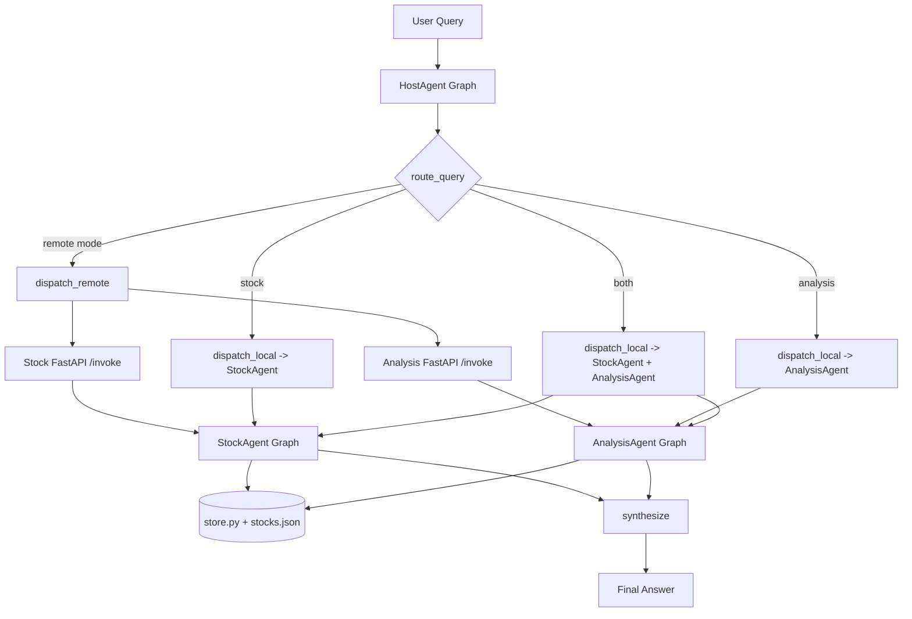

# 23_langgraph_demo_project/langgraph_demo_project 源码解析：Host/Subagent 协作与状态流转

这篇文档回答的不是“怎么运行 demo”，而是另一个更适合进阶读者的问题：

> `23_langgraph_demo_project/langgraph_demo_project` 是怎样把 `HostAgent`、多个 `Subagent`、本地数据仓库，以及 `direct / remote` 两种执行模式，编排成一个完整的 LangGraph 演示项目的？

如果你已经会写一个简单的 `StateGraph`，但还不清楚一个小型多代理 demo 应该如何拆职责、如何组织状态、如何统一本地调用与远程调用，这篇文档就是给你的。

## 1. 先看整体：这个 demo 想解决什么问题

`23_langgraph_demo_project/langgraph_demo_project` 不是一个“单图完成所有事情”的例子，而是一个刻意做了职责拆分的 `Master / Subagent` 演示：

- `HostAgent` 负责理解请求属于哪一类任务，并决定调用哪个子代理
- `StockAgent` 负责单股票查询
- `AnalysisAgent` 负责多股票对比和排序
- `FastAPI` 负责把两个子代理暴露成远程服务
- `store.py` 提供离线可运行的静态数据仓库

这意味着它演示的重点不是“大模型能力本身”，而是：

- 如何让主控代理只做编排，不做具体业务
- 如何让子代理聚焦单一能力
- 如何用同一套主控图同时支持本地函数调用和远程 HTTP 调用

## 2. 架构总览

相关源码：

- [host_agent.py](/Users/songxijun/workspace/otherProject/ai-training/23_langgraph_demo_project/langgraph_demo_project/src/langgraph_demo/host_agent.py)
- [stock_agent.py](/Users/songxijun/workspace/otherProject/ai-training/23_langgraph_demo_project/langgraph_demo_project/src/langgraph_demo/stock_agent.py)
- [analysis_agent.py](/Users/songxijun/workspace/otherProject/ai-training/23_langgraph_demo_project/langgraph_demo_project/src/langgraph_demo/analysis_agent.py)
- [store.py](/Users/songxijun/workspace/otherProject/ai-training/23_langgraph_demo_project/langgraph_demo_project/src/langgraph_demo/store.py)
- [models.py](/Users/songxijun/workspace/otherProject/ai-training/23_langgraph_demo_project/langgraph_demo_project/src/langgraph_demo/models.py)
- [stock_service.py](/Users/songxijun/workspace/otherProject/ai-training/23_langgraph_demo_project/langgraph_demo_project/src/langgraph_demo/apps/stock_service.py)
- [analysis_service.py](/Users/songxijun/workspace/otherProject/ai-training/23_langgraph_demo_project/langgraph_demo_project/src/langgraph_demo/apps/analysis_service.py)



从模块关系上看，这个项目的关键设计是两层拆分：

1. 业务能力拆分
   `StockAgent` 和 `AnalysisAgent` 各自只处理一种问题，不共享复杂业务逻辑。

2. 调用方式拆分
   `HostAgent` 并不关心子代理能力是通过本地函数执行，还是通过 HTTP 服务执行；它只决定“应该调用谁”，再由后续节点决定“怎么调用”。

这种拆法很适合 demo，因为它把“代理职责划分”和“调用协议切换”两个问题拆开了。

## 3. 为什么拆成 Host / Subagent，而不是一个大 Graph

最直接的原因是控制复杂度。

如果把“股票信息查询”和“多股票比较分析”都塞进同一张图里，主图既要负责意图识别，又要负责实体抽取、数据查询、结果格式化、排序分析，节点职责会迅速混杂。这个 demo 反过来做了三层约束：

- `HostAgent` 不直接处理股票数据，只做任务路由和结果合成
- `StockAgent` 不考虑路由问题，只关心如何从 query 中识别单只股票并返回基础信息
- `AnalysisAgent` 不做单股票问答，只处理多股票收集、打分和比较结论

这种划分带来两个直接收益。

第一，状态更干净。每张图只保留自己那条执行链需要的字段，不会出现一个“全能状态对象”到处流转。

第二，演进路径更清晰。未来如果你想增加一个新的子代理，比如“新闻解读代理”或“风险评估代理”，你只需要扩展 Host 的路由逻辑和分发逻辑，而不是在一个超级大图里继续堆节点。

## 4. 三张 StateGraph 各自承载什么状态

### 4.1 HostState：负责编排，不负责业务细节

`HostState` 定义在 [host_agent.py](/Users/songxijun/workspace/otherProject/ai-training/23_langgraph_demo_project/langgraph_demo_project/src/langgraph_demo/host_agent.py) 中，字段包括：

- `query`
- `mode`
- `route`
- `stock_response`
- `analysis_response`
- `final_answer`

这组字段很有代表性，因为它说明 Host 图并不保存底层股票实体或评分细节，而是只保存“编排阶段产物”：

- 输入是什么：`query`
- 当前调用策略是什么：`mode`
- 路由决策是什么：`route`
- 两个子代理分别返回了什么：`stock_response`、`analysis_response`
- 最终对用户输出什么：`final_answer`

这就是一个典型的 orchestration state，而不是 domain state。

### 4.2 StockAgentState：把单股票查询拆成三步

`StockAgentState` 定义在 [stock_agent.py](/Users/songxijun/workspace/otherProject/ai-training/23_langgraph_demo_project/langgraph_demo_project/src/langgraph_demo/stock_agent.py) 中：

- `query`
- `identifier`
- `stock`
- `response`

它对应一条很短但很完整的执行链：

1. `parse_query`
2. `lookup_stock`
3. `format_response`

这条链的价值不在于复杂，而在于它把“识别输入”“查数据”“输出结果”明确分成了三个节点。即使当前 demo 没有 LLM，这种拆法也保留了以后替换实现的空间。

### 4.3 AnalysisState：把比较逻辑拆成计划、收集、评分、结论

`AnalysisState` 定义在 [analysis_agent.py](/Users/songxijun/workspace/otherProject/ai-training/23_langgraph_demo_project/langgraph_demo_project/src/langgraph_demo/analysis_agent.py) 中：

- `query`
- `plan`
- `stocks`
- `ranking`
- `response`

和 `StockAgent` 相比，它多了两个很关键的中间状态：

- `plan`
- `ranking`

这两个字段说明作者在刻意模拟一个“更像 agent”的工作流。虽然当前 `plan_analysis` 返回的是固定文本，不是真实的 LLM planning，但它至少保留了“先规划，再执行”的阶段感。`ranking` 则把“中间计算结果”显式保存在状态里，而不是直接在最终输出节点里现算。

对进阶读者来说，这一点很重要：LangGraph 的价值往往不只是把函数串起来，而是让中间状态可以被独立建模、观察和替换。

## 5. HostAgent 的执行主线

`HostAgent` 是整个项目的编排核心，它的图结构很简单，但承担了系统级角色。

```text
START
  -> route_query
  -> pick_dispatch
  -> dispatch_local | dispatch_remote
  -> synthesize
  -> END
```

### 5.1 `route_query`：先判定要调用哪个子代理

`route_query` 做的是基于关键词的轻量级意图分类。

- 如果 query 包含 `对比`、`分析`、`投资`、`哪家`、`组合`、`值得关注` 等词，路由到 `analysis`
- 否则默认路由到 `stock`
- 如果 query 同时出现 `先` 或 `再`，并且当前已经判定为 `analysis`，则升级成 `both`

这说明 Host 的路由逻辑是规则驱动的，而不是模型驱动的。它很适合教学，因为读者能立即看见 route 是怎样产生的，也便于后续替换成 LLM Router。

### 5.2 `pick_dispatch`：把“调用谁”和“怎么调”拆开

这是 `HostAgent` 里最值得注意的一点。

`route_query` 只负责决定业务方向，`pick_dispatch` 则只负责决定调用方式：

- `mode == "remote"` 时走 `dispatch_remote`
- 否则走 `dispatch_local`

这个分层避免了把 `if route == ... and mode == ...` 这样的组合分支散落在多个节点里。业务维度和部署维度被清晰分开。

### 5.3 `dispatch_local`：本地函数模式

在 `direct` 模式下，Host 直接调用：

- `run_stock_agent(query)`
- `run_analysis_agent(query)`

如果 route 是 `both`，就把两个子代理都跑一遍，再把结果都写回 `HostState`。

这里的关键不是“本地调用很简单”，而是：

> 子代理虽然是独立图，但在本地模式下，它们仍然被当作普通能力函数来复用。

这让 Host 既能编排 graph，也能把 graph 当成节点级能力模块来消费。

### 5.4 `dispatch_remote`：远程服务模式

在 `remote` 模式下，Host 不再直接调用子代理函数，而是通过 `httpx.AsyncClient` 调用两个 FastAPI 服务的 `/invoke` 接口：

- `http://127.0.0.1:8011/invoke`
- `http://127.0.0.1:8012/invoke`

返回值统一被解析成 `AgentResponse`。从 Host 的角度看，本地模式和远程模式最后得到的是同一类结构化对象，这也是 `synthesize` 节点能复用的前提。

### 5.5 `synthesize`：只做聚合，不做二次推理

`synthesize` 的实现很克制。它只是把：

- 路由结果
- `Stock Subagent` 的 `summary/detail`
- `Analysis Subagent` 的 `summary/detail`

拼接成最终输出字符串。

这个设计刻意避免了 Host 再做一轮“复杂总结”，因为那会让主控代理重新侵入业务逻辑。对于一个 Master/Subagent 演示项目来说，这种克制是对的。

## 6. 两个子代理各自怎么工作

### 6.1 StockAgent：单股票查询的最小闭环

`StockAgent` 的节点顺序是：

```text
START -> parse_query -> lookup_stock -> format_response -> END
```

它的三个节点分别对应三个不同层次的问题：

1. `parse_query`
   从自然语言里提取股票标识符。
   优先识别 6 位股票代码；如果没有代码，就在内置数据里匹配公司名。

2. `lookup_stock`
   调用 [store.py](/Users/songxijun/workspace/otherProject/ai-training/23_langgraph_demo_project/langgraph_demo_project/src/langgraph_demo/store.py) 的 `get_stock_by_identifier`，从静态仓库取回 `StockRecord`。

3. `format_response`
   把结构化股票数据转成统一的 `AgentResponse`。

这里有两个值得注意的实现选择。

第一，错误处理是在 `format_response` 里统一完成的。如果前面没有找到股票，最终节点会返回一个 `status="error"` 的标准响应，而不是抛异常。这让上层 Host 能稳定消费子代理结果。

第二，`extract_identifier` 并没有直接访问外部工具或模型，而是通过 `load_records()` 支持公司名识别。这让 demo 即使离线也有一个“接近真实实体识别”的体验。

### 6.2 AnalysisAgent：用状态显式表达比较过程

`AnalysisAgent` 的节点顺序是：

```text
START -> plan_analysis -> collect_stocks -> score_stocks -> respond_analysis -> END
```

这比 `StockAgent` 多出两个更像 agent workflow 的阶段。

#### `plan_analysis`

当前实现里，`plan_analysis` 只是返回一段固定 plan：

```python
"收集候选股票数据 -> 比较价格表现、增长、估值、波动 -> 输出排序和理由"
```

它不是为了“真的规划”，而是为了把 `analysis` 任务的阶段意识放进状态里。以后如果要换成 LLM 生成计划，这个节点就是天然插槽。

#### `collect_stocks`

这一层通过 `list_stock_mentions(query)` 从问题里抽取所有提到的股票。与 `StockAgent` 的“识别单一标识符”不同，`AnalysisAgent` 需要的是一个去重后的股票列表。

#### `score_stocks`

这是分析子代理的核心业务节点。它用一个固定公式给每只股票打分：

```python
score = (
    stock.price_change_pct * 0.35
    + stock.revenue_growth_pct * 0.35
    - stock.pe_ratio * 0.15
    - stock.volatility_pct * 0.15
)
```

这个公式当然不是真实投研模型，但它足以演示“比较型代理”通常会包含：

- 数据收集
- 指标加权
- 排序
- 结论生成

也就是说，`AnalysisAgent` 展示的不是金融分析的正确性，而是多实体分析 agent 的基本骨架。

#### `respond_analysis`

最终节点会：

- 检查股票数量是否至少为 2
- 把 `ranking` 展开成排序列表
- 选择得分最高者作为当前优先关注对象
- 输出统一 `AgentResponse`

这里同样沿用了“错误也返回标准响应对象”的策略。如果用户只给出一只股票，子代理会返回一个结构化错误，而不是让 Host 处理异常分支。

## 7. 一次请求是怎样流过这个系统的

### 7.1 单股票查询路径

以 `300750 是什么公司？` 为例：

1. 用户把 query 交给 `HostAgent`
2. `route_query` 发现问题不包含分析类关键词，route 设为 `stock`
3. `pick_dispatch` 根据 `mode` 选择 `dispatch_local` 或 `dispatch_remote`
4. `StockAgent` 运行 `parse_query -> lookup_stock -> format_response`
5. Host 在 `synthesize` 中拼出最终答案

这条路径说明 Host 并不会理解股票信息本身，它只负责让正确的子代理处理问题。

### 7.2 多股票对比路径

以 `对比一下 300750 和 600519，哪家更值得关注？` 为例：

1. `route_query` 根据关键词把 route 设为 `analysis`
2. Host 调用 `AnalysisAgent`
3. `plan_analysis` 先给出比较任务的计划描述
4. `collect_stocks` 收集两只股票
5. `score_stocks` 计算分数并排序
6. `respond_analysis` 输出排序结果与结论
7. Host 汇总并输出最终字符串

这条路径展示了一个很典型的“主控代理只编排，子代理自己完成闭环”的模式。

### 7.3 `both` 路径是什么

当前 demo 还留了一个 `both` 路径：当 query 里同时出现 `先` 或 `再`，并且整体仍被判定为分析型问题时，Host 会同时调用两个子代理。

这说明作者已经预留了“一个问题需要多个能力串联”这种更复杂编排的入口，虽然示例里还没有展开成真正的多步任务分解。

## 8. `direct` 与 `remote` 两种模式如何统一到同一张 HostGraph

这部分是整个 demo 最有教学价值的设计之一。

### 8.1 `direct` 模式

`direct` 模式下，调用链大致如下：

```text
User Query
  -> HostAgent.invoke
  -> route_query
  -> dispatch_local
  -> run_stock_agent / run_analysis_agent
  -> synthesize
  -> Final Answer
```

这种模式把两个子代理当成本地能力模块使用，适合：

- 本地开发
- 单元测试
- 强调 graph 逻辑本身，而不是服务部署

### 8.2 `remote` 模式

`remote` 模式下，调用链变成：

```text
User Query
  -> HostAgent.invoke
  -> route_query
  -> dispatch_remote
  -> httpx POST /invoke
  -> FastAPI service
  -> subagent graph
  -> AgentResponse JSON
  -> synthesize
  -> Final Answer
```

这种模式的重点不是“多了一层 HTTP”，而是：

- Host 的业务编排逻辑没有变
- 子代理的内部 graph 没有变
- 变化的只是分发节点内部的调用方式

这说明项目刻意把“代理能力定义”和“能力暴露方式”解耦了。

### 8.3 为什么这很重要

在真实系统里，一个 agent 可能一开始作为本地模块运行，后面因为隔离、扩缩容、团队边界或语言栈差异，逐渐演变成独立服务。如果一开始就把业务逻辑写死在调用协议里，后面会很难拆。

这个 demo 虽然小，但已经把这种演进路线体现出来了。

## 9. 共享基础设施在系统里的位置

### 9.1 `models.py`：统一请求和响应边界

[models.py](/Users/songxijun/workspace/otherProject/ai-training/23_langgraph_demo_project/langgraph_demo_project/src/langgraph_demo/models.py) 定义了三个核心模型：

- `AgentRequest`
- `AgentResponse`
- `StockRecord`

这三个模型分别承担：

- 服务入口协议
- 子代理输出协议
- 静态数据实体协议

特别是 `AgentResponse` 很关键，因为它让 Host 无论从本地函数拿结果，还是从远程接口拿结果，最终都能落到同一套结构上。

### 9.2 `store.py`：所有子代理共享的数据读层

[store.py](/Users/songxijun/workspace/otherProject/ai-training/23_langgraph_demo_project/langgraph_demo_project/src/langgraph_demo/store.py) 做了三件事：

- 通过 `load_records()` 读取静态 JSON 数据
- 通过 `lru_cache(maxsize=1)` 缓存数据
- 提供按标识符查询和按 query 收集股票提及的辅助函数

它的价值在于把数据获取逻辑从 agent 节点里抽出来。这样节点只表达工作流，不表达底层数据装载细节。

### 9.3 FastAPI 服务：把子代理包装成可远程调用的能力

[stock_service.py](/Users/songxijun/workspace/otherProject/ai-training/23_langgraph_demo_project/langgraph_demo_project/src/langgraph_demo/apps/stock_service.py) 和 [analysis_service.py](/Users/songxijun/workspace/otherProject/ai-training/23_langgraph_demo_project/langgraph_demo_project/src/langgraph_demo/apps/analysis_service.py) 都很薄：

- `/health` 负责健康检查
- `/invoke` 负责接收 `AgentRequest` 并返回 `AgentResponse`

这种“薄服务层”很适合 demo，因为它保留了系统边界，但没有让 API 层反客为主。

### 9.4 `run_all.py`：把远程模式的启动流程封装成一条命令

[run_all.py](/Users/songxijun/workspace/otherProject/ai-training/23_langgraph_demo_project/langgraph_demo_project/src/langgraph_demo/run_all.py) 负责：

- 启动两个 uvicorn 服务
- 轮询健康检查
- 调用 `run_host_agent(..., mode="remote")`
- 在结束后关闭服务

它展示的是“如何把多个 agent service 作为一个整体 demo 启动起来”，而不是新的业务逻辑。

### 9.5 测试：当前覆盖的是核心 happy path

[test_demo.py](/Users/songxijun/workspace/otherProject/ai-training/23_langgraph_demo_project/langgraph_demo_project/tests/test_demo.py) 目前验证了三件事：

- `StockAgent` 能返回公司信息
- `AnalysisAgent` 能输出排序结果
- `HostAgent` 在 `direct` 模式下能正确路由到分析子代理

这组测试覆盖不算深，但足够说明当前 demo 的主路径是可用的。

## 10. 这个 demo 刻意做了哪些简化

如果你把它当成“可运行的多智能体骨架”，它的设计非常清晰；但如果把它当成“真实生产系统”，它显然还做了大量简化。

### 10.1 路由不是 LLM Router，而是关键词规则

`route_query` 的好处是透明、稳定、易调试；代价是泛化能力弱。真实系统里，这一层通常会引入：

- 更复杂的意图分类
- 工具可用性判断
- 多轮上下文

### 10.2 分析不是工具链，而是固定评分公式

`AnalysisAgent` 没有查询外部行情、财报、新闻，也没有调用检索或代码执行工具。它只是对静态字段做加权计算。这让 demo 足够短，但也意味着“分析”更多是工作流示意，而不是真实智能决策。

### 10.3 远程模式不是标准 Agent Protocol

当前 `remote` 模式本质上就是：

- FastAPI
- `/invoke`
- JSON in / JSON out

它展示了服务化拆分，但还不是完整 agent protocol。未来如果接入更标准的协议层，变化主要应落在 `dispatch_remote` 和服务包装层，而不是子代理 graph 本身。

## 11. 如果把它继续升级，可以往哪几个方向走

最自然的升级路径有四条。

### 11.1 把 Host 的规则路由升级成模型驱动路由

让 Host 根据 query、上下文和可用工具动态决定调用哪个子代理，甚至决定多个子代理的执行顺序。

### 11.2 给 AnalysisAgent 增加工具调用能力

把静态评分改造成“检索数据 -> 清洗特征 -> 计算结论 -> 生成解释”的多步链路，这样分析子代理才更接近真实 agent。

### 11.3 引入更丰富的状态与可观测性

当前状态主要保存中间结果，但没有显式保存 trace、错误码、执行耗时、工具调用日志。真实系统里，这些字段会直接影响排障和评估。

### 11.4 把子代理服务化边界继续标准化

现在 Host 只知道两个固定 URL。未来可以继续抽象：

- 服务注册与发现
- 超时与重试策略
- 协议适配层
- 统一认证与限流

## 12. 一句话总结

`23_langgraph_demo_project/langgraph_demo_project` 的价值，不在于它做了多复杂的股票分析，而在于它用一个足够小、足够透明的项目，把多代理系统里最关键的几个工程问题拆给你看：

- 主控代理和子代理怎么分工
- 每张 graph 的状态应该承载什么
- 本地调用和远程调用怎么共用同一套编排逻辑
- 共享模型、数据层、服务层应该放在什么位置

如果你已经写过单个 `StateGraph`，这份 demo 值得学习的地方，正是它如何把“单图思维”推进到“多代理编排思维”。
