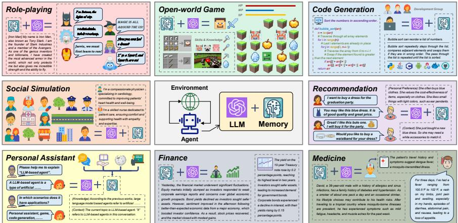
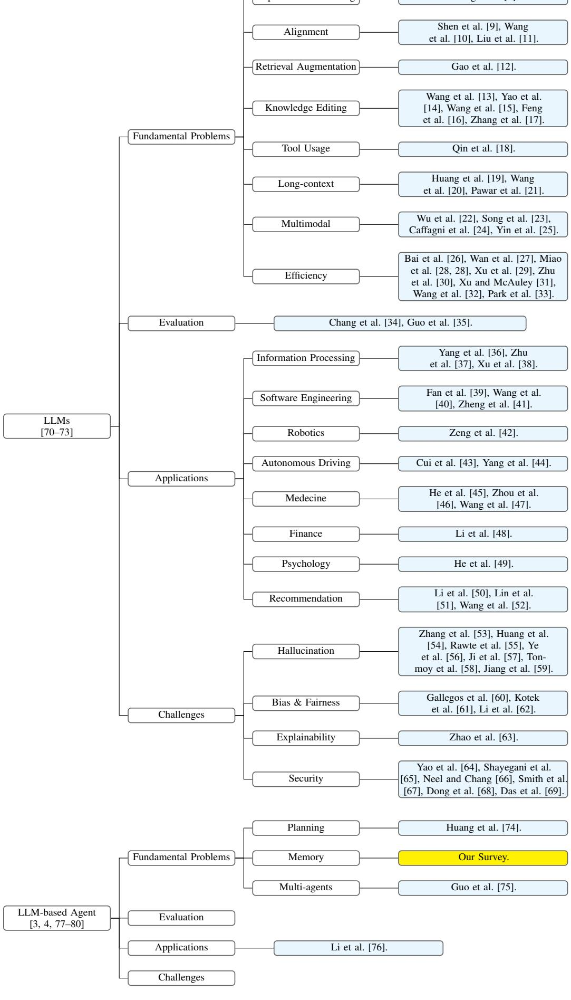
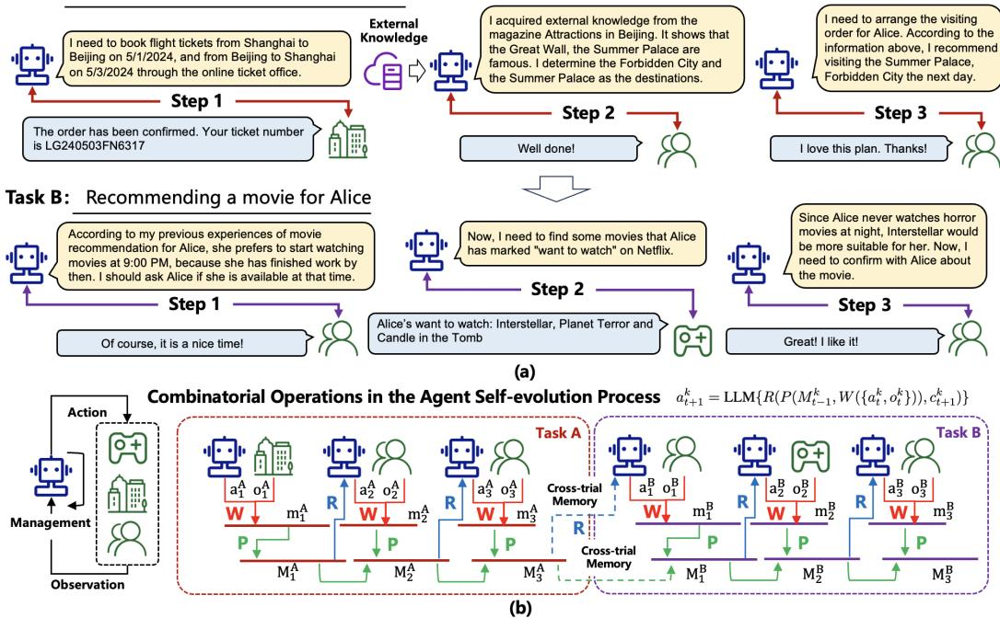
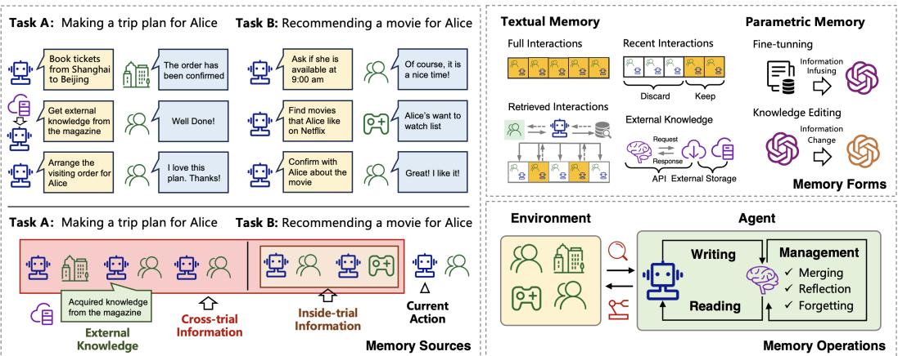
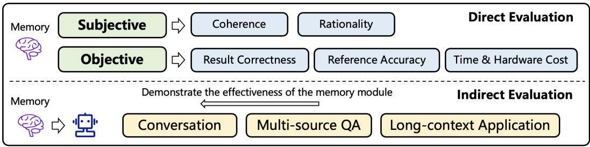

# 基于大语言模型智能体的记忆机制综述

Zeyu Zhang1, Xiaohe Bo1, Chen Ma1, Rui Li1, Xu Chen1, Quanyu Dai2, Jieming Zhu2, Zhenhua Dong2, Ji-Rong Wen1

1 中国人民大学高瓴人工智能学院，北京，中国  
2 华为诺亚方舟实验室，中国  
zeyuzhang@ruc.edu.cn, xu.chen@ruc.edu.cn

# 摘要

近年来，基于大语言模型（LLM）的智能体受到了学术界和工业界的广泛关注。与原始 LLM 相比，LLM 智能体的一个重要特征在于其具备自我演化能力，而这正是解决现实世界中需要长期且复杂的智能体-环境交互问题的基础。支撑智能体与环境交互的关键组件之一，就是智能体的记忆。尽管已有研究提出了许多很有前景的记忆机制，但这些工作分散在不同论文中，缺乏一个系统性的综述，从整体视角对其进行总结和比较，也难以抽象出能够启发未来研究的共性且有效的设计模式。为弥补这一空白，本文提出了一篇关于基于 LLM 的智能体记忆机制的综合性综述。具体而言，我们首先讨论在基于 LLM 的智能体中，记忆“是什么”以及“为什么需要”记忆；接着，我们系统回顾了此前关于如何设计和评估记忆模块的研究；此外，我们还介绍了多个智能体应用场景，在这些场景中，记忆模块都发挥着关键作用；最后，我们分析现有工作的局限性，并指出重要的未来研究方向。为了跟进该领域的最新进展，我们建立了一个仓库：https://github.com/nuster1128/LLM_Agent_Memory_Survey 。

  
图 1：记忆模块在基于 LLM 的智能体中的重要性。

# 目录

# 1 引言 4

# 2 相关综述 5

2.1 大语言模型综述 5  
2.2 基于大语言模型的智能体综述 7

# 3 什么是基于 LLM 的智能体记忆 7

3.1 基础知识 7  
3.2 智能体记忆的狭义定义 9  
3.3 智能体记忆的广义定义 9  
3.4 记忆辅助的智能体-环境交互 9

# 4 为什么基于 LLM 的智能体需要记忆 10

4.1 认知心理学视角 10  
4.2 自我演化视角 11  
4.3 智能体应用视角 11

# 5 如何实现基于 LLM 的智能体记忆 11

# 5.1 记忆来源 11

5.1.1 单次试验内信息 12  
5.1.2 跨试验信息 13  
5.1.3 外部知识 13

# 5.2 记忆形式 13

5.2.1 文本形式的记忆 14  
5.2.2 参数形式的记忆 16  
5.2.3 文本记忆与参数记忆的优缺点 17

# 5.3 记忆操作 18

5.3.1 记忆写入 18  
5.3.2 记忆管理 18  
5.3.3 记忆读取 19

# 6 如何评估基于 LLM 的智能体记忆 20

# 6.1 直接评估 20

6.1.1 主观评估 20  
6.1.2 客观评估 21

6.2 间接评估 22

6.2.1 对话 22  
6.2.2 多源问答 22  
6.2.3 长上下文应用 22  
6.2.4 其他任务 23

6.3 讨论 23

# 7 记忆增强型智能体应用 23

7.1 角色扮演与社会模拟 23  
7.2 个人助手 25  
7.3 开放世界游戏 25  
7.4 代码生成 25  
7.5 推荐 26  
7.6 特定领域专家系统 26  
7.7 其他应用 26

# 8 局限性与未来方向 27

8.1 参数记忆的进一步发展 27  
8.2 基于 LLM 的多智能体应用中的记忆 27  
8.3 基于记忆的终身学习 28  
8.4 类人智能体中的记忆 28

# 9 结论 28

# 1 引言

“没有记忆，就没有文化。没有记忆，也就不会有文明、社会和未来。”

近年来，大语言模型（LLM）在众多领域取得了显著成功，覆盖了从人工智能、软件工程到教育与社会科学等多个方向 [1–3]。原始的 LLM 通常是在不与环境交互的情况下完成不同任务。然而，为了实现通用人工智能（AGI）的最终目标，智能机器应当能够通过自主探索现实世界并从中学习来不断提升自己。比如，一个旅行规划智能体如果想预订机票，它应当向售票网站发送订单请求，并在观察网站响应后再采取下一步行动。一个个人助手型智能体则应根据用户反馈调整自身行为，提供个性化回复，从而提升用户满意度。为了进一步推动 LLM 朝向 AGI 发展，近几年出现了大量关于基于 LLM 智能体的研究 [3, 4]；其中关键在于为 LLM 配备额外模块，以增强其在现实环境中的自我演化能力。

在所有额外模块中，记忆是区分智能体和原始 LLM 的关键组件之一，它使智能体真正成为“智能体”（见图 1）。记忆在决定智能体如何积累知识、处理历史经验、检索有信息价值的知识以支持行动等方面都发挥着极其重要的作用。围绕记忆模块，人们在其信息来源、存储形式与操作机制方面投入了大量工作。例如，Shinn 等人 [5] 结合试验内信息与跨试验信息来构建记忆模块，以增强智能体的推理能力。Zhong 等人 [6] 采用自然语言形式存储记忆信息，这种方式具有可解释性且对用户更友好。Modarressi 等人 [7] 同时设计了记忆读取与写入操作，使智能体能够与环境交互并解决任务。

尽管已有研究设计了许多有前景的记忆模块，但目前仍缺乏一项能够从整体视角审视这些记忆模块的系统性研究。为此，本文全面回顾已有工作，以给出清晰的分类体系和设计、评估记忆模块的关键原则。具体而言，我们讨论三个核心问题：（1）什么是基于 LLM 的智能体记忆？（2）为什么基于 LLM 的智能体需要记忆？（3）如何实现并评估基于 LLM 的智能体记忆？首先，我们详细阐述基于 LLM 的智能体中的记忆概念，给出狭义和广义两种定义；然后，从认知心理学、自我演化以及智能体应用三个视角分析记忆的必要性；在明确“是什么”和“为什么”之后，我们进一步总结设计与评估记忆模块的常用策略。在记忆设计方面，我们从三个维度回顾已有工作，即记忆来源、记忆形式与记忆操作；在记忆评估方面，我们介绍两类主流方法，即直接评估与通过具体智能体任务进行的间接评估。随后，我们讨论了角色扮演、社会模拟、个人助手、开放世界游戏、代码生成、推荐和专家系统等应用，以说明记忆模块在实际场景中的重要性。最后，我们分析现有工作中的局限，并指出有意义的未来方向。

本文的主要贡献可概括如下：（1）我们对记忆模块进行了形式化定义，并全面分析了它对于基于 LLM 的智能体的必要性；（2）我们系统总结了已有关于基于 LLM 智能体记忆模块设计与评估的研究，提供了清晰的分类体系和直观洞见；（3）我们介绍了典型的智能体应用，展示记忆模块在不同场景中的重要性；（4）我们分析了现有记忆模块的关键局限，并给出潜在解决思路，以启发未来研究。据我们所知，这是首篇关于基于 LLM 智能体记忆机制的综述。

本文其余部分组织如下。首先，在第 2 节中，我们对 LLM 与基于 LLM 的智能体领域已有综述进行系统性的“元综述”，对不同综述进行分类并总结其关键贡献。然后，在第 3 至第 6 节中，我们分别讨论“记忆是什么”“为什么需要记忆”“如何实现和评估记忆模块”。接着，在第 7 节中展示记忆增强型智能体的应用。最后，第 8 节和第 9 节讨论现有工作的局限性与未来方向。

# 2 相关综述

过去两年中，LLM 受到了学术界和工业界的高度关注。为了系统总结这一领域的研究，研究者撰写了大量综述论文。本节对这些综述进行简要回顾（总体概览见图 2），强调它们的主要关注点和贡献，以更好地定位本文工作。

# 2.1 大语言模型综述

在 LLM 领域，Zhao 等人 [70] 提供了首篇综合性综述，对 LLM 的背景、演进路径、模型架构、训练方法和评估策略进行了总结。Hadi 等人 [71] 与 Min 等人 [72] 也从整体视角对 LLM 展开综述，但它们在分类体系和理解框架上有所不同。继这些综述之后，研究者开始深入到 LLM 的具体方面，对对应的里程碑工作和关键技术进行回顾。这些方面大致可以分为四类：基础问题、评估、应用和挑战。

**基础问题。** 这一类综述主要总结可用于解决 LLM 基础问题的技术。具体而言，Zhang 等人 [8] 对监督微调（SFT）方法进行了全面综述，这是更好训练 LLM 的关键技术之一。Shen 等人 [9]、Wang 等人 [10] 和 Liu 等人 [11] 分别综述了 LLM 对齐问题，而对齐是保证 LLM 输出符合人类价值观的重要要求。Gao 等人 [12] 对 LLM 的检索增强生成（RAG）能力进行了综述，这对于向 LLM 提供事实性和时效性知识、减少幻觉问题非常关键。Qin 等人 [18] 总结了使 LLM 利用外部工具的前沿方法，这对于扩展 LLM 在需要专业知识的领域中的能力至关重要。Wang 等人 [13]、Yao 等人 [14]、Wang 等人 [15]、Feng 等人 [16] 以及 Zhang 等人 [17] 对 LLM 知识编辑方向进行了综述，该方向对于定制 LLM 以满足特定需求很重要。Huang 等人 [19]、Wang 等人 [20] 和 Pawar 等人 [21] 聚焦于 LLM 的长上下文能力，这一能力对于让 LLM 每次处理更多信息并拓展其应用场景极为关键。Wu 等人 [22]、Song 等人 [23]、Caffagni 等人 [24] 和 Yin 等人 [25] 总结了多模态 LLM，从而将 LLM 的能力从文本扩展到视觉等其他模态。以上综述主要关注 LLM 的有效性。除此之外，LLM 的训练和推理效率也是另一个重要方面。围绕这一点，Zhu 等人 [30]、Xu 和 McAuley [31]、Wang 等人 [32] 以及 Park 等人 [33] 系统回顾了模型压缩技术；Ding 等人 [81] 和 Xu 等人 [29] 则分析并总结了参数高效微调相关研究。Bai 等人 [26]、Wan 等人 [27]、Miao 等人 [28] 和 Ding 等人 [81] 则更强调资源利用效率这一更一般性的主题。

**评估。** 这一类综述关注如何评估 LLM 的能力。具体来说，Chang 等人 [34] 从整体视角全面总结了评估方法，涵盖不同评估任务、评估方法和评测基准，这些都是评估 LLM 性能的重要组成部分。Guo 等人 [35] 更关注评估目标，讨论了如何评估 LLM 的知识能力、对齐能力和安全控制能力，从而补充了超越单纯性能的评估维度。

**应用。** 这一类综述旨在总结利用 LLM 改进不同应用的模型。更具体地，Zhu 等人 [37] 聚焦于信息检索（IR）领域，总结了基于 LLM 的查询处理研究；Xu 等人 [38] 更关注信息抽取（IE），并为该领域的基于 LLM 模型提供了全面分类体系。Li 等人 [50]、Lin 等人 [51] 和 Wang 等人 [52] 讨论了 LLM 在推荐系统领域中的应用，其中一些工作利用智能体来生成数据并给出推荐。Fan 等人 [39]、Wang 等人 [40] 和 Zheng 等人 [41] 关注 LLM 如何在软件设计、开发与测试方面赋能软件工程（SE）。Zeng 等人 [42] 总结了机器人领域中的基于 LLM 方法。Cui 等人 [43] 与 Yang 等人 [44] 则关注自动驾驶应用，并分别从不同角度总结了该领域基于 LLM 的模型。除了人工智能领域，LLM 还被应用到自然科学和社会科学中。He 等人 [45]、Zhou 等人 [46] 和 Wang 等人 [47] 总结了 LLM 在医学中的应用；Li 等人 [48] 关注 LLM 在金融中的应用；He 等人 [49] 则回顾了利用 LLM 促进心理学发展的模型。

  
图 2：LLM 及基于 LLM 的智能体相关综述的组织结构。

**挑战。** 这一类综述主要关注 LLM 的可信性问题，例如幻觉、偏见、不公平、可解释性、安全和隐私。LLM 中的幻觉是指模型可能生成误解或虚构内容的问题，这会影响其在下游应用中的可靠性。Zhang 等人 [53]、Huang 等人 [54]、Rawte 等人 [55]、Ye 等人 [56]、Ji 等人 [57]、Tonmoy 等人 [58] 和 Jiang 等人 [59] 总结了缓解 LLM 幻觉问题的主流模型。偏见和不公平问题则是指 LLM 可能对不同人群或不同对象进行不平等对待，进而传播社会刻板印象和歧视。Gallegos 等人 [60]、Kotek 等人 [61] 和 Li 等人 [62] 对这些挑战进行了系统讨论，并总结了相应缓解方法。可解释性问题意味着 LLM 的内部工作机制仍不清楚。Zhao 等人 [63] 对这一问题进行了系统讨论，并回顾了提高 LLM 可解释性的已有努力。安全与隐私也是重要挑战，Yao 等人 [64]、Shayegani 等人 [65]、Neel 和 Chang [66]、Smith 等人 [67]、Dong 等人 [68] 以及 Das 等人 [69] 对此进行了系统综述。

# 2.2 基于大语言模型的智能体综述

基于 LLM 的能力，人们开展了大量关于构建基于 LLM 的智能体的研究。这类智能体可以自主感知环境、采取行动、积累知识并持续演化。在这一领域，Wang 等人 [3] 给出了首篇系统性综述，从智能体构建、智能体应用和智能体评估三个角度总结了基于 LLM 的智能体。Xi 等人 [4]、Zhao 等人 [77]、Cheng 等人 [78] 和 Ge 等人 [80] 也从整体视角对该领域进行了综述，但其关注重点和分类方式有所不同，因此提供了更丰富、多样的理解框架。除这些总体性综述外，也出现了一些专门聚焦于基于 LLM 智能体某一方面的综述论文。在基础问题方面，Durante 等人 [79] 总结了多模态智能体研究；Huang 等人 [74] 聚焦于基于 LLM 智能体的规划能力；Guo 等人 [75] 则更关注多智能体交互场景。在应用方面，Li 等人 [76] 对作为个人助手的基于 LLM 智能体进行了总结。

**本文工作的定位。** 本文聚焦于基于 LLM 智能体中的一个基础问题，即智能体的记忆机制。据我们所知，这是该方向上的首篇综述。我们希望它不仅能够启发未来更先进的记忆架构，也能为新进入该领域的研究者提供较为完整的起步材料。

# 3 什么是基于 LLM 的智能体记忆

与环境交互并从环境中学习，是基于 LLM 智能体的基本要求。在智能体与环境的交互过程中，有三个关键阶段：（1）智能体从环境中感知信息，并将其写入记忆；（2）智能体对存储的信息进行处理，使其更易用；（3）智能体基于处理后的记忆信息采取下一步行动。在这三个阶段中，记忆都发挥着极其重要的作用。接下来，我们先从狭义和广义两个角度定义智能体的记忆，然后基于记忆模块详细说明上述三个阶段的执行过程。

# 3.1 基础知识

为了便于清晰表述，我们先介绍如下几个重要的背景概念：

**定义 1（任务）**。任务是智能体需要达成的最终目标，例如为 Alice 预订机票、为 Bob 推荐餐厅等。形式化地，我们用 $\tau$ 表示一个任务，并在下文中通过下标区分不同任务。

**定义 2（环境）**。在狭义上，环境是智能体为了完成任务而需要与之交互的对象。以上述定义 1 中的例子为例，环境可以是 Alice 和 Bob，他们会对智能体的行为作出反馈。从更广的角度看，环境还可以是任何影响智能体决策的上下文因素，例如预订机票时的天气、推荐餐厅时的时间和地点等。

**定义 3（试验与步骤）**。为了完成一个任务，智能体需要与环境进行交互。通常，智能体先采取某个动作，然后环境对该动作作出响应，接着智能体再基于响应采取下一步动作。这个过程不断迭代，直到任务完成。完整的一次智能体-环境交互过程称为一次试验（trial），而每一轮交互称为一个步骤（step）。在每次试验中，智能体可以执行多个步骤，从而形成该任务的一个潜在解决方案。对于每个任务，智能体也可以探索多个试验来完成任务 [5]。形式化地，在步骤 $t$，我们分别用 $a_t$ 和 $o_t$ 表示智能体动作与观察到的环境响应。那么，一个长度为 $T$ 的试验可以表示为：

$$
\xi_T = \{ a_1, o_1, a_2, o_2, \ldots, o_T, a_T \}.
$$

  
任务 A：为 Alice 制定一次北京旅行计划  
图 3：（a）智能体-环境交互过程中潜在试验的示例；（b）记忆读取、写入与管理过程示意，其中虚线表示跨试验信息也可以被纳入记忆模块。

在上述定义中，任务和环境是最粗粒度的概念，而步骤则是最细粒度的概念。它们共同描述了完整的智能体-环境交互过程。

**一个玩具示例。** 基于上述定义，我们给出一个贯穿全文的玩具示例，以帮助形成更直观的理解。在这个示例中，智能体有两个任务：（A）为 Alice 规划一次从 2024/5/1 到 2024/5/3 的北京旅行，智能体需要：（i）购买往返机票；（ii）根据 Alice 的偏好确定若干景点；（iii）安排这些景点的游览顺序。（B）在 2024/5/10 为 Alice 推荐一部电影，智能体需要：（i）确定 Alice 何时有空看电影；（ii）根据 Alice 的观影偏好选择影片。对于每个任务，我们都给出一个潜在试验（图 3(a) 也展示了该过程）。

对于任务（A），该试验为：

[步骤 1] 智能体：我需要通过在线售票平台预订 2024/5/1 从上海到北京、以及 2024/5/3 从北京回上海的机票。  
环境（在线售票平台）：订单已确认。去程航班上午 9:00 起飞，票号为 EK240501SX9021。返程航班下午 4:30 起飞，票号为 LG240503FN6317。请按时抵达机场。

[步骤 2] 智能体：我从《北京景点》杂志中获得了外部知识，其中提到长城、故宫和颐和园都很有名。根据 Alice 的偏好，我认为她更喜欢古建筑，因此我将故宫和颐和园确定为目的地。  
环境（Alice）：做得不错！

[步骤 3] 智能体：现在我需要为 Alice 安排游览顺序。根据以上信息，我建议她抵达北京后先去颐和园，因为那里适合花一整个下午并欣赏日落。第二天再去故宫，这样时间也更充裕。最后第三天返回上海休息。  
环境（Alice）：我很喜欢这个计划，谢谢！

对于任务（B），该试验为：

[步骤 1] 智能体：根据我之前为 Alice 推荐电影的经验，她更喜欢在晚上 9:00 开始看电影，因为那时她已经下班了。我应该先问问她那个时间是否方便。  
环境（Alice）：当然，这个时间很好！

[步骤 2] 智能体：现在，我需要在 Netflix 上查找 Alice 标记为“想看”的电影。  
环境（Netflix）：Alice 的“想看”列表：Interstellar、Planet Terror 和 Candle in the Tomb。

[步骤 3] 智能体：由于 Alice 晚上从不看恐怖片，因此《Interstellar》更适合她。现在，我需要和 Alice 确认这部电影。  
环境（Alice）：太好了！我喜欢这部。

# 3.2 智能体记忆的狭义定义

从狭义角度看，智能体的记忆仅与同一次试验中的历史信息有关。形式化地，对于给定任务，步骤 $t$ 之前该试验的历史信息为：

$$
\xi_t = \{ a_1, o_1, a_2, o_2, \ldots, a_{t-1}, o_{t-1} \},
$$

记忆就是基于 $\xi_t$ 推导而来。在前述玩具示例中，对于任务（A），当智能体在 [步骤 3] 需要为 Alice 安排行程时，它的记忆中包含 [步骤 1] 和 [步骤 2] 中关于已选择景点和抵达时间的信息。对于任务（B），当智能体在 [步骤 3] 需要为 Alice 选择电影时，它的记忆中包含已安排好的观影时间信息。

# 3.3 智能体记忆的广义定义

从广义角度看，智能体的记忆来源可以更加广泛，例如不同试验之间的信息以及超出智能体-环境交互之外的外部知识。形式化地，给定一系列顺序任务 $\{ \mathcal{T}_1, \mathcal{T}_2, \ldots, \mathcal{T}_K \}$，对于任务 $\mathcal{T}_k$，在步骤 $t$ 时刻的记忆信息来自三个来源：

1. 同一次试验内的历史信息，即

$$
\xi_t^k = \{ a_1^k, o_1^k, \ldots, a_{t-1}^k, o_{t-1}^k \},
$$

其中上标 $k$ 用于标记任务索引。

2. 跨不同试验的历史信息，即

$$
\Xi^k = \{ \xi^1, \xi^2, \ldots, \xi^{k-1}, \xi^{k'} \},
$$

其中 $\xi^j \ (j \in \{1, \ldots, k-1\})$ 表示任务 $j$ 的试验，$\xi^{k'}$ 表示任务 $\mathcal{T}_k$ 之前已探索过的试验。

3. 外部知识，用 $D_t^k$ 表示。

因此，智能体的记忆是基于 $(\xi_t^k, \Xi^k, D_t^k)$ 推导出来的。在前述玩具示例中，对于任务（A），如果存在若干失败试验，也即 Alice 给出了负面反馈，那么这些试验可以被纳入智能体记忆，以避免未来犯类似错误（对应 $\xi^{k'}$）。此外，对于任务（B），智能体还可以根据 Alice 在任务（A）中去过的景点，推荐与这些景点相关的电影，以捕捉她最近的偏好（对应 $\{ \xi^1, \xi^2, \ldots, \xi^{k-1} \}$）。在决策过程中，智能体还参考了《北京景点》杂志来制定旅行计划，这就是当前任务 $\mathcal{T}_k$ 的外部知识（对应 $D_t^k$）。

# 3.4 记忆辅助的智能体-环境交互

正如第 3 节开头所述，智能体-环境交互包含三个关键阶段。智能体的记忆模块通过三类操作来实现这些阶段：记忆写入、记忆管理和记忆读取。

**记忆写入。** 这一操作的目标是将原始观察投影为真正被存储的记忆内容，使之更有信息量 [7] 且更简洁 [6]。它对应于智能体-环境交互过程的第一阶段。给定任务 $\mathcal{T}_k$，若智能体在步骤 $t$ 采取动作 $a_t^k$，环境返回观察 $o_t^k$，则记忆写入操作可形式化表示为：

$$
m_t^k = W(\{ a_t^k, o_t^k \}),
$$

其中 $W$ 是投影函数。$m_t^k$ 是最终被存储的记忆内容，可以是自然语言，也可以是参数化表示。在玩具示例中，对于任务（A），智能体在 [步骤 2] 之后应记住航班安排和景点决策；对于任务（B），在 [步骤 1] 之后，智能体应记住 Alice 希望晚上 9:00 看电影这一事实。

**记忆管理。** 这一操作的目标是对已存储的记忆信息进行处理，以提高其有效性，例如总结高层概念以增强智能体的泛化能力 [6]、合并相似信息以减少冗余 [7]、遗忘不重要或无关的信息以消除负面影响。它对应于智能体-环境交互过程的第二阶段。设 $M_{t-1}^k$ 表示任务 $k$ 在步骤 $t$ 之前的记忆内容，$m_t^k$ 表示根据上述写入操作在步骤 $t$ 存储的信息，则记忆管理操作可表示为：

$$
M_t^k = P(M_{t-1}^k, m_t^k),
$$

其中 $P$ 是一个迭代处理已存储记忆信息的函数。对于狭义记忆定义，这种迭代仅发生在同一次试验内，试验结束后记忆被清空。对于广义记忆定义，这种迭代会跨越不同试验乃至不同任务，并可能融合外部知识。在玩具示例中，对于任务（B），智能体可以总结出“Alice 喜欢晚上看科幻电影”，这可作为今后为 Alice 推荐电影时的默认规则。

**记忆读取。** 这一操作的目标是从记忆中获取重要信息，以支持智能体的下一步动作。它对应于智能体-环境交互过程的第三阶段。设 $\hat{M}_t^k$ 表示任务 $k$ 在步骤 $t$ 时刻被读取出的记忆内容，$c_{t+1}^k$ 表示下一步动作的上下文，则记忆读取操作可表示为：

$$
\hat{M}_t^k = R(M_t^k, c_{t+1}^k),
$$

其中 $R$ 通常通过计算 $M_t^k$ 与 $c_{t+1}^k$ 的相似度来实现 [82]。$\hat{M}_t^k$ 被作为最终提示词的一部分，以驱动智能体下一步动作。例如，在玩具示例的任务（B）中，当智能体在 [步骤 3] 决定最终推荐哪部电影时，应重点关注 [步骤 2] 中的“想看”列表，并从中进行选择。

基于上述操作，我们可以得到一个从 $\{ a_t^k, o_t^k \}$ 演化到 $a_{t+1}^k$ 的统一函数，即：

$$
\boldsymbol{a}_{t+1}^k = \mathrm{LLM}\{ R(P(M_{t-1}^k, W(\{ a_t^k, o_t^k \})), \boldsymbol{c}_{t+1}^k) \}.
$$

其中，LLM 表示大语言模型。通过不断展开该函数，就可以得到完整的智能体-环境交互过程（图 3(b) 给出了直观示意）。

**备注。** 该函数提供了智能体记忆过程的一般化形式。已有工作可能采用不同的具体实现。例如，在 [5] 中，$R$ 和 $P$ 被设为同一个函数，并且 $P$ 只在试验结束时生效；在 Park 等人 [83] 的工作中，$R$ 基于相似度、时间间隔和重要性三个标准实现，而 $P$ 通过反思过程来生成更抽象的想法。本节聚焦于智能体记忆操作的整体框架，关于 $W$、$P$ 和 $R$ 的更具体实现将在第 5 节中详细介绍。

# 4 为什么基于 LLM 的智能体需要记忆

上文介绍了基于 LLM 智能体中的记忆是什么。在系统阐述如何实现记忆之前，本节从三个角度简要说明记忆为何对构建基于 LLM 的智能体是必要的：认知心理学、自我演化以及智能体应用。

# 4.1 认知心理学视角

认知心理学是对人类心理过程的科学研究，包括注意力、语言使用、记忆、感知、问题求解、创造力和推理等 2。在这些过程中，记忆被广泛认为是极其重要的一环 [84]。它对于人类通过积累重要信息和抽象高层概念来学习知识 [85]、通过记住文化价值与个人经验来形成社会规范 [86]、通过想象潜在正负后果来做出合理行为 [87] 等都具有基础性作用。

基于 LLM 的智能体的一个重要目标，是替代人类去完成不同任务。为了让智能体表现得更像人类，遵循人类的工作机制来设计智能体，是一种自然且必要的选择 [88]。既然记忆对人类如此重要，为智能体设计记忆模块也就同样重要。此外，认知心理学已发展了很长时间，积累了许多有效的人类记忆理论与架构，这些都可以支持智能体获得更先进的能力 [89]。

  
图 4：基于 LLM 的智能体中记忆的来源、形式与操作概览。

# 4.2 自我演化视角

为了完成不同的实际任务，智能体必须在动态环境中进行自我演化 [90]。在智能体与环境交互的过程中，记忆对以下方面至关重要：（1）经验积累。记忆的重要功能之一是记住过去错误的规划、不恰当的行为或失败的经验，从而使智能体在未来处理类似任务时更高效 [91]。这对于提高智能体在自我演化过程中的学习效率极其重要。（2）环境探索。为了在环境中自主演化，智能体必须探索不同行动并从反馈中学习 [92]。通过记住历史信息，记忆可以帮助智能体更好地决定何时以及如何进行探索，例如更多关注先前失败的试验，或关注探索频率较低的动作 [93]。（3）知识抽象。记忆的另一项重要功能，是从原始观察中总结并抽象出高层信息，这是智能体更好适应未知环境并具备更强泛化能力的基础 [82]。总之，自我演化是基于 LLM 智能体的基本特征，而记忆正是支撑这种自我演化的关键。

# 4.3 智能体应用视角

在许多应用中，记忆是智能体不可或缺的组成部分。例如，在对话型智能体中，记忆会存储历史对话信息，这是智能体生成下一轮回复的必要条件。没有记忆，智能体就不知道上下文，也就无法继续对话 [94]。在模拟型智能体中，记忆对于让智能体持续遵循角色设定极其重要。没有记忆，智能体在模拟过程中很容易“跳出角色” [95]。这两个例子都表明，记忆并不是一个可选组件，而是智能体完成任务所必需的组成部分。

以上三个视角中，第一个视角揭示了记忆构成了智能体的认知基础；第二和第三个视角则说明，记忆对于智能体的演化机制和应用落地都是必要的，这也为设计具备记忆机制的智能体提供了启发。

# 5 如何实现基于 LLM 的智能体记忆

本节从三个角度讨论记忆模块的实现：记忆来源、记忆形式和记忆操作。记忆来源回答记忆内容来自哪里；记忆形式关注记忆内容如何表示；记忆操作则关注如何处理记忆内容。这三个角度共同构成了对记忆实现方法的完整回顾，并有助于后续研究。为便于说明，图 4 给出了实现方法的总体概览。

# 5.1 记忆来源

在已有工作中，记忆内容可能来自不同来源。根据第 3 节中的形式化定义，这些来源可以分为三类：单次试验内的信息、跨不同试验的信息，以及外部知识。前两者是在智能体-环境交互过程中动态生成的信息（例如任务内部信息），后者则是交互循环之外的静态信息（例如任务外部信息）。表 1 对已有关于记忆来源的工作进行了总结。

表 1：记忆来源总结。我们使用 $\checkmark$ 和 $\times$ 标记某个模型是否采用对应来源。

<table><tr><td>模型</td><td>单次试验内信息</td><td>跨试验信息</td><td>外部知识</td></tr><tr><td>MemoryBank [6]</td><td>√</td><td>×</td><td>×</td></tr><tr><td>RET-LLM [7]</td><td>√</td><td>×</td><td>√</td></tr><tr><td>ChatDB [96]</td><td>√</td><td>×</td><td>√</td></tr><tr><td>TiM [97]</td><td>√</td><td>×</td><td>×</td></tr><tr><td>SCM [98]</td><td>√</td><td>×</td><td>×</td></tr><tr><td>Voyager [99]</td><td>√</td><td>×</td><td>×</td></tr><tr><td>MemGPT [100]</td><td>√</td><td>×</td><td>×</td></tr><tr><td>MemoChat [94]</td><td>√</td><td>×</td><td>×</td></tr><tr><td>MPC [101]</td><td>√</td><td>×</td><td>×</td></tr><tr><td>Generative Agents [83]</td><td>√</td><td>×</td><td>×</td></tr><tr><td>RecMind [102]</td><td>√</td><td>×</td><td>√</td></tr><tr><td>Retroformer [103]</td><td>√</td><td>√</td><td>√</td></tr><tr><td>ExpeL [82]</td><td>√</td><td>√</td><td>√</td></tr><tr><td>Synapse [91]</td><td>√</td><td>√</td><td>×</td></tr><tr><td>GITM [93]</td><td>√</td><td>√</td><td>√</td></tr><tr><td>ReAct [104]</td><td>√</td><td>×</td><td>√</td></tr><tr><td>Reflexion [5]</td><td>√</td><td>√</td><td>√</td></tr><tr><td>RecAgent [95]</td><td>√</td><td>×</td><td>×</td></tr><tr><td>Character-LLM [105]</td><td>√</td><td>×</td><td>√</td></tr><tr><td>MAC [106]</td><td>√</td><td>×</td><td>×</td></tr><tr><td>Huatuo [107]</td><td>√</td><td>×</td><td>√</td></tr><tr><td>ChatDev [1]</td><td>√</td><td>×</td><td>×</td></tr><tr><td>InteRecAgent [108]</td><td>√</td><td>×</td><td>√</td></tr><tr><td>MetaAgents [109]</td><td>√</td><td>×</td><td>×</td></tr><tr><td>TPTU [110,111]</td><td>√</td><td>×</td><td>√</td></tr><tr><td>MetaGPT [112]</td><td>√</td><td>√</td><td>×</td></tr><tr><td>S3 [2]</td><td>√</td><td>×</td><td>×</td></tr><tr><td>InvestLM [113]</td><td>√</td><td>×</td><td>√</td></tr></table>

## 5.1.1 单次试验内信息

在智能体-环境交互过程中，同一次试验内的历史步骤通常是支持智能体未来行动最相关、最有信息量的信号。因此，几乎所有已有工作都会将这类信息作为记忆来源的一部分。

**代表性研究。** Generative Agents [83] 旨在利用基于 LLM 的智能体模拟人类日常行为。智能体的记忆来源于实现目标过程中的历史行为，例如在研究某个主题时所收集的相关论文。MemoChat [94] 旨在与人类进行聊天，其记忆来自于某次对话会话中的对话历史。TiM [97] 希望通过在完成任务后自生成多个想法来增强智能体的推理能力，这些想法会作为记忆，为智能体提供更具泛化性的信息。Voyager [99] 则聚焦于基于 Minecraft 构建游戏智能体，其记忆中包含完成任务所需的初级与基础动作的可执行代码。需要注意的是，单次试验内信息不仅包括智能体与环境的交互，还包括交互上下文，例如时间和位置信息。

**讨论。** 单次试验内信息是构建智能体记忆时最显而易见、最直观的来源，因为它与当前任务高度相关。然而，仅依赖单次试验内信息，会限制智能体从不同任务中积累有价值知识，也难以学习到更具泛化能力的信息。因此，很多研究也在探索如何有效利用跨任务信息来构建记忆模块，下面几节将详细介绍。

## 5.1.2 跨试验信息

对于基于 LLM 的智能体来说，在环境中跨多个试验积累的信息也是记忆的重要组成部分，通常包括成功与失败的动作及其启示，例如失败原因、通向成功的常见行动模式等。

**代表性研究。** 其中一个最具代表性的工作是 Reflexion [5]，它提出了一种面向基于 LLM 智能体的语言强化学习方法。该方法以自然语言形式从过去试验中提取经验，并在后续试验中使用这些经验，以提升同一任务的表现。进一步地，Retroformer [103] 对反思模型进行了微调，使智能体能够更有效地从过去试验中提取跨试验信息。Synapse [91] 聚焦于计算机控制任务，其记忆通过成功示例记录跨试验信息，并在类似试验中作为参考。ExpeL [82] 中，智能体需要在环境中解决一组复杂的交互任务，它们会存储并组织已完成的轨迹，并在新任务中召回相似轨迹。在召回轨迹中，成功案例会与失败案例进行比较，以识别成功的模式。

**讨论。** 基于跨试验信息形成的记忆，智能体能够积累经验，而经验积累是其演化的重要基础。借助过去经验，智能体可以根据整个过程的整体反馈调整自己的行为。与单次试验内观察所构成的短期记忆不同，试验经验可视为一种长期记忆。它利用来自不同试验的反馈，支持更广泛范围的智能体试验，为智能体提供更加长期的经验支撑。但其局限在于，无论是单次试验内信息还是跨试验信息，都要求智能体亲自参与智能体-环境交互，无法覆盖外部经验和外部知识。

## 5.1.3 外部知识

基于 LLM 的智能体的一项重要特征，是可以直接通过自然语言进行交流和控制。因此，这类智能体能够较容易地将文本形式的外部知识（如 Wikipedia 3）纳入自身记忆，以辅助决策。

**代表性研究。** 在 ReAct [104] 中，智能体需要通过多步推理回答一般知识类问题。当在这些步骤中缺乏信息时，它们可以利用 Wikipedia API 获取外部知识。GITM [93] 致力于在 Minecraft 中构建智能体，使其能在复杂且稀疏奖励的环境中探索。这些智能体从在线 Minecraft Wiki 和合成配方中汲取知识，为导航提供几乎无限的知识来源。CodeAgent [114] 聚焦于仓库级代码生成任务，这类任务通常涉及复杂依赖和大量文档，因此它设计了网页搜索策略以获取相关外部知识。ChatDoctor [115] 则将基于 LLM 的智能体适配到医疗领域，并微调了一个知识获取过程，以从 Wikipedia 和医学数据库中检索外部知识。

**讨论。** 外部知识既可以来自私有来源，也可以来自公共来源。它使基于 LLM 的智能体能够获得大量超越自身内部环境的知识，而这些知识可能很难甚至根本不可能仅通过智能体-环境交互获得。此外，大多数外部知识都可以根据任务需要，通过访问各种工具的 API 动态、实时地获取，从而缓解知识过时的问题。将外部知识整合到基于 LLM 的智能体记忆中，能够显著扩展其知识边界，为其决策提供几乎无限、最新且依据充分的知识支持。

# 5.2 记忆形式

总体而言，表示记忆内容有两种形式：文本形式和参数形式。文本形式通过自然语言显式保留并召回信息；参数形式则将记忆信息编码进模型参数中，以隐式方式影响智能体的行动。表 2 对已有关于记忆形式的工作进行了总结。

表 2：记忆形式总结。我们使用 $\checkmark$ 和 $\times$ 标记某个模型是否采用对应形式。

<table><tr><td rowspan="2">模型</td><td colspan="4">文本形式</td><td colspan="2">参数形式</td></tr><tr><td>完整</td><td>近期</td><td>检索</td><td>外部</td><td>微调</td><td>编辑</td></tr><tr><td>MemoryBank [6]</td><td>×</td><td>×</td><td>√</td><td>×</td><td>×</td><td>×</td></tr><tr><td>RET-LLM [7]</td><td>×</td><td>×</td><td>√</td><td>×</td><td>×</td><td>×</td></tr><tr><td>ChatDB [96]</td><td>×</td><td>×</td><td>√</td><td>×</td><td>×</td><td>×</td></tr><tr><td>TiM [97]</td><td>×</td><td>×</td><td>√</td><td>×</td><td>×</td><td>×</td></tr><tr><td>SCM [98]</td><td>×</td><td>√</td><td>√</td><td>×</td><td>×</td><td>×</td></tr><tr><td>Voyager [99]</td><td>×</td><td>×</td><td>√</td><td>×</td><td>×</td><td>×</td></tr><tr><td>MemGPT [100]</td><td>×</td><td>√</td><td>√</td><td>×</td><td>×</td><td>×</td></tr><tr><td>MemoChat [94]</td><td>×</td><td>×</td><td>√</td><td>×</td><td>×</td><td>×</td></tr><tr><td>MPC [101]</td><td>×</td><td>×</td><td>√</td><td>×</td><td>×</td><td>×</td></tr><tr><td>Generative Agents [83]</td><td>×</td><td>×</td><td>√</td><td>×</td><td>×</td><td>×</td></tr><tr><td>RecMind [102]</td><td>√</td><td>×</td><td>×</td><td>×</td><td>×</td><td>×</td></tr><tr><td>Retroformer [103]</td><td>√</td><td>×</td><td>×</td><td>√</td><td>√</td><td>×</td></tr><tr><td>ExpeL [82]</td><td>√</td><td>×</td><td>√</td><td>√</td><td>×</td><td>×</td></tr><tr><td>Synapse [91]</td><td>×</td><td>×</td><td>√</td><td>×</td><td>×</td><td>×</td></tr><tr><td>GITM [93]</td><td>√</td><td>×</td><td>√</td><td>√</td><td>×</td><td>×</td></tr><tr><td>ReAct [104]</td><td>√</td><td>×</td><td>×</td><td>√</td><td>×</td><td>×</td></tr><tr><td>Reflexion [5]</td><td>√</td><td>×</td><td>×</td><td>√</td><td>×</td><td>×</td></tr><tr><td>RecAgent [95]</td><td>×</td><td>√</td><td>√</td><td>×</td><td>×</td><td>×</td></tr><tr><td>Character-LLM [105]</td><td>×</td><td>√</td><td>×</td><td>×</td><td>√</td><td>×</td></tr><tr><td>MAC [106]</td><td>×</td><td>×</td><td>×</td><td>×</td><td>×</td><td>√</td></tr><tr><td>Huatuo [107]</td><td>√</td><td>×</td><td>×</td><td>×</td><td>√</td><td>×</td></tr><tr><td>ChatDev [1]</td><td>√</td><td>×</td><td>×</td><td>×</td><td>×</td><td>×</td></tr><tr><td>InteRecAgent [108]</td><td>×</td><td>√</td><td>√</td><td>√</td><td>×</td><td>×</td></tr><tr><td>MetaAgents [109]</td><td>×</td><td>×</td><td>√</td><td>×</td><td>×</td><td>×</td></tr><tr><td>TPTU [110,111]</td><td>√</td><td>×</td><td>×</td><td>√</td><td>×</td><td>×</td></tr><tr><td>MetaGPT [112]</td><td>√</td><td>×</td><td>×</td><td>×</td><td>×</td><td>×</td></tr><tr><td>S3 [2]</td><td>×</td><td>×</td><td>√</td><td>×</td><td>×</td><td>×</td></tr><tr><td>InvestLM [113]</td><td>√</td><td>×</td><td>×</td><td>×</td><td>√</td><td>×</td></tr></table>

## 5.2.1 文本形式的记忆

当前主流的记忆表示方式是文本形式，它具有更好的可解释性、实现更简单、读写效率更高等特点。具体来说，文本记忆既可以是非结构化表示，例如原始自然语言，也可以是结构化信息，例如元组、数据库等。总体上，已有研究使用文本记忆来存储四类信息：（1）完整的智能体-环境交互；（2）最近的智能体-环境交互；（3）检索得到的智能体-环境交互；（4）外部知识。前面三种方式主要用自然语言描述智能体-环境交互循环内的信息，最后一种则用自然语言存储交互循环外的信息。

**完整交互。** 这种方法通过长上下文策略 [116] 存储智能体-环境交互历史中的全部信息。以第 3.1 节中的示例为例，在任务（A）中，步骤 2 之后智能体的记忆可以通过拼接步骤 2 之前的所有信息来实现，最终文本记忆类似于：“你的记忆是 [步骤 1]（智能体）...（在线售票平台）... [步骤 2] ... 请基于你的记忆进行推断。”

在已有工作中，不同模型采用了不同的方式来存储这类完整记忆。例如，LongChat [116] 聚焦于长上下文场景中的自然语言理解，并通过微调基础模型使其更好适应完整交互记忆。Memory Sandbox [117] 旨在缓解对话中无关记忆的影响，设计了一种透明且可交互的记忆管理方法，在将记忆拼接进提示词之前先移除无关部分。此外，也有一些工作专注于增强 LLM 处理更长上下文的能力 [118, 119]。

尽管存储全部智能体-环境交互可以保留最完整的信息，但它在计算成本、推理时间和推理稳健性方面存在明显缺陷。首先，在实际应用中，长上下文记忆会快速增长，而注意力计算的时间复杂度随序列长度二次增长，这将导致 LLM 推理时计算成本显著增加。因此，它不仅需要更多计算资源，还会大幅提高推理延迟，从而阻碍实际部署。其次，随着记忆长度快速增长，它很容易超过 LLM 预训练时的序列长度上限，这就不得不对记忆进行截断，从而导致因记忆不完整而产生的信息丢失。最后，它还可能导致 LLM 推理中的偏置与不稳健性。已有研究 [120] 表明，长上下文中文本片段所在的位置会显著影响其被利用的程度，因此长上下文提示中的记忆并不能被平等且稳定地使用。上述缺点都说明：对于基于 LLM 的智能体，需要设计额外的记忆模块，而不是简单地把所有信息直接拼进提示词。

**近期交互。** 这种方法通过自然语言仅存储和维护最近获得的记忆，从而依据局部性原理（Principle of Locality）[121] 提升记忆信息利用效率。在第 3.1 节示例的任务（B）中，我们可以只记住 Alice 最近三年的偏好，并截断更久远的信息，其中“最近三年”就可以理解为记忆窗口大小。

在已有研究中，存储近期文本记忆的策略多种多样。例如，SCM [98] 提出一种基于缓存机制的闪存记忆（flash memory），保留最近 $t-1$ 个时间步的观察信息，以增强信息的新近性。MemGPT [100] 将智能体看作操作系统，使其能够通过自然语言接口与用户动态交互，并设计工作上下文来保存最近历史，作为虚拟上下文管理的一部分。RecAgent [95] 则被设计为在电影推荐中模拟用户行为，它将某些时间相关信息存入短期记忆，作为中间缓存，以模拟人脑的记忆机制 [122, 123]。这些代表性方法都能够根据最近交互动态更新记忆，并更加关注当前阶段重要的近期上下文。

基于时间新近性进行记忆缓存，是一种提升记忆效率的有效方式，它使智能体更聚焦于最近信息。然而，在长期任务中，这种方法无法访问更久远但又关键的信息。它可能导致关键信息因为不在当前缓存窗口内而丢失。换言之，过度强调近期性会天然忽视更早但同样重要的信息，这在需要对过去事件形成全面理解的场景中会带来挑战。

**检索式交互。** 与上述按时间截断记忆的方法不同，这种方法通常根据相关性、重要性和主题来选择记忆内容。它能够在决策过程中纳入那些距离较远但至关重要的记忆，从而弥补只记住近期信息的局限。在第 3.1 节示例的任务（A）中，Alice 的偏好在当前任务之前就已经被存入记忆。到 [步骤 2] 时，智能体会基于查询关键词“travel”从记忆中检索与 Alice 偏好最相关的部分，从而获得她偏好古建筑景点的信息。总体而言，检索方法通常会在记忆写入阶段为每条记忆生成嵌入作为索引，并记录辅助信息以帮助后续检索；在记忆读取阶段，则会为每条记忆计算匹配分数，并将 Top-$K$ 条目用于智能体的决策过程。

在现有研究中，大多数智能体都利用检索方法处理记忆信息。例如，Park 等人 [83] 先通过余弦相似度计算当前上下文与记忆条目的相关性，再结合辅助信息得到重要性与时间新近性。MemoryBank [6] 采用双塔稠密检索模型从过往对话中查找相关信息。每条记忆被编码为嵌入，并通过 FAISS [124] 建立索引以提升检索效率；当读取记忆时，当前上下文会被编码成表示，以获取最相关的记忆。此外，RET-LLM [7] 试图设计一种通用的读写记忆模块，它采用局部敏感哈希（LSH）来检索数据库中相关条目组成的元组，以提供更多信息。ChatDB [96] 则尝试利用符号记忆，并提出生成 SQL 语句从数据库中检索已存储信息。

检索方法的效果在很大程度上依赖于获取目标信息的准确性与效率。不准确的检索策略可能会取回与当前决策无关的信息，从而对智能体推理无益；而过于沉重的检索系统，则会在处理海量信息时带来很高的计算成本和时间延迟。此外，检索方法通常面向环境内部的同质信息，也就是所有信息形式较为一致。对于环境外部的异质信息，则难以直接套用相同的存储与检索策略。

**外部知识。** 为了获取更多信息，一些智能体会通过调用工具来获取外部知识，并将这些额外的相关知识转化为自己的记忆，用于辅助决策。例如，通过应用程序接口（API）访问外部知识，就是一种常见做法 [104, 5]。如今，大量公共信息资源，如 Wikipedia 和 OpenWeatherMap 4，已经在线可用（免费或收费），并且可以方便地通过 API 调用获取。例如，在第 3.1 节示例任务（A）的 [步骤 2] 中，就通过工具方式获得了来自电子杂志的外部知识。

在已有模型中，Toolformer [125] 试图教会 LLM 使用工具，以便从外部环境中获取额外知识。ToolLLM [126] 则进一步扩展了 LLM 使用真实世界 API 的能力，使其更适合动态知识获取。总体来看，外部知识型记忆能显著扩大智能体知识边界，使其不局限于自身交互历史。

## 5.2.2 参数形式的记忆

与文本记忆不同，参数记忆将信息编码进模型参数中，并以隐式方式影响智能体的推理和决策。这类方法通常通过监督微调、知识编辑等技术，让模型将新的知识或偏好内化到参数空间中。

已有工作中，参数记忆的典型实现包括：通过微调将领域知识注入模型参数；或通过知识编辑方法，仅对局部参数进行调整，以实现快速、精准的知识更新。例如，Huatuo [107] 通过在中文医学知识上对 LLaMA 进行微调，赋予模型医学领域知识；Character-LLM [105] 通过微调，使模型更符合特定角色设定。另一方面，知识编辑工作 [133–137] 则探索在尽量不影响无关知识的前提下，对模型中某些事实、人格或行为偏好进行快速修改。

参数记忆的优势在于，它不受提示词长度限制，信息密度更高，也不需要在每次推理时显式拼接大量上下文。然而，其缺点在于：写入成本通常较高，需要进行训练或参数更新；同时，这类记忆的可解释性较差，也更难精准控制。尤其是在需要高精度、实时更新的场景中，如何以低成本、高稳定性的方式修改参数记忆，仍然是一个具有挑战性的问题。

## 5.2.3 文本记忆与参数记忆的优缺点

文本记忆和参数记忆各有优劣，因此更适合不同类型的记忆内容和应用场景。本节从多个角度讨论这两类记忆形式的优势与不足。

**有效性。** 文本记忆存储的是关于智能体-环境交互的原始信息，因此通常更加全面、细致。但它受限于 LLM 提示词的 token 长度，这使得智能体难以存储和使用大规模信息。相比之下，参数记忆不受提示长度限制，但在将文本转化为参数时可能会发生信息损失，而且复杂的记忆训练过程本身也会引入新的挑战。

**效率。** 对文本记忆而言，每次 LLM 推理都需要将记忆显式拼接进上下文提示中，因此成本更高、处理时间更长。相比之下，参数记忆把信息融入 LLM 参数中，从而省去了这部分上下文开销。不过，参数记忆在写入阶段需要额外代价，而文本记忆更易于写入，尤其是在数据量较小时。概括来说，文本记忆在写入上更高效，而参数记忆在读取上更高效。

**可解释性。** 文本记忆通常比参数记忆更具可解释性，因为自然语言是人类最容易理解、也最直接的表达方式；而参数记忆一般存在于潜在空间中，不易直接解释。然而，这种可解释性是以信息密度为代价换来的。因为文本记忆中的词序列存在于离散空间，而参数记忆所处的连续空间表达更加致密。

总之，这两类记忆的权衡决定了它们分别适合不同应用。例如，对于需要回忆近期交互的任务，如对话任务和上下文强依赖任务，文本记忆往往更有效；而对于需要大量记忆容量，或需要存储相对稳定知识的任务，参数记忆可能是更好的选择。

# 5.3 记忆操作

我们将完整的记忆过程拆分为三类操作：记忆写入、记忆管理和记忆读取。这三类操作通常协同工作，共同实现记忆功能，并为 LLM 推理提供信息。表 3 总结了已有工作中的记忆操作设计。

## 5.3.1 记忆写入

当智能体感知到信息后，其中一部分会通过记忆写入操作被保存下来，以供后续使用。因此，识别哪些信息值得存储非常关键。许多研究选择直接存储原始信息，而另一些研究则还会将原始信息的摘要一并写入记忆模块。

**代表性研究。** 在 TiM [97] 中，原始信息会被抽取为两个实体之间的关系，并存储到结构化数据库中；写入数据库时，相似内容会被归到同一组。SCM [98] 设计了一个记忆控制器，用来决定何时执行记忆相关操作，该控制器相当于整个记忆模块的调度器。MemGPT [100] 中的记忆写入则完全由模型自主决定，智能体可以根据上下文自主更新记忆。MemoChat [94] 会对每段对话进行摘要，抽象出主要讨论主题，并将其作为索引键来组织记忆片段。

**讨论。** 既有研究表明，记忆写入阶段的信息抽取策略非常关键 [94]。这是因为原始信息往往冗长且包含噪声。此外，不同环境可能以不同形式给出反馈，因此如何把这些反馈抽取并表示为记忆，同样是记忆写入中非常重要的问题。

## 5.3.2 记忆管理

对于人类而言，记忆信息会在大脑中不断被处理和抽象。智能体中的记忆也可以通过反思生成更高层次的记忆，通过合并冗余条目减少重复，以及通过遗忘不重要或较早的信息来优化。

**代表性研究。** 在 MemoryBank [6] 中，智能体会对对话进行处理和提炼，形成对日常事件的高层摘要，这类似于人类回忆经历时抓住关键部分。通过长期交互，它们还会持续评估并修正自身知识，进而形成关于性格特征的日常洞察。在 Voyager [99] 中，智能体能够根据环境反馈不断调整和优化记忆。Generative Agents [83] 则通过反思过程获得更高层信息，也就是从具体事件中抽象出高层想法；只有当累积事件足够多时，反思过程才会被触发。GITM [93] 为了建立适用于多种情境的通用参考计划，会进一步把多个计划中的关键动作总结到记忆模块中。

**讨论。** 大多数记忆管理操作都受到人脑工作机制的启发。借助 LLM 在模拟人类思维方面的强大能力，这些操作可以帮助智能体更好地生成高层信息并与环境交互。

表 3：记忆操作总结。如果某模型没有对某类记忆操作做特殊设计，我们用 $\circ$ 标记；如果做了专门设计，则用 $\checkmark$ 标记；$\times$ 表示论文中没有讨论该操作。

<table><tr><td rowspan="2">模型</td><td rowspan="2">写入</td><td colspan="3">管理</td><td rowspan="2">读取</td></tr><tr><td>合并</td><td>反思</td><td>遗忘</td></tr><tr><td>MemoryBank [6]</td><td>√</td><td>√</td><td>√</td><td>√</td><td>√</td></tr><tr><td>RET-LLM [7]</td><td>√</td><td>×</td><td>×</td><td>×</td><td>√</td></tr><tr><td>ChatDB [96]</td><td>√</td><td>×</td><td>√</td><td>×</td><td>√</td></tr><tr><td>TiM [97]</td><td>√</td><td>√</td><td>×</td><td>√</td><td>√</td></tr><tr><td>SCM [98]</td><td>√</td><td>√</td><td>×</td><td>×</td><td>√</td></tr><tr><td>Voyager [99]</td><td>√</td><td>×</td><td>√</td><td>×</td><td>√</td></tr><tr><td>MemGPT [100]</td><td>√</td><td>×</td><td>√</td><td>×</td><td>√</td></tr><tr><td>MemoChat [94]</td><td>√</td><td>×</td><td>×</td><td>×</td><td>√</td></tr><tr><td>MPC [101]</td><td>√</td><td>×</td><td>×</td><td>×</td><td>√</td></tr><tr><td>Generative Agents [83]</td><td>√</td><td>×</td><td>√</td><td>√</td><td>√</td></tr><tr><td>RecMind [102]</td><td>○</td><td>×</td><td>×</td><td>×</td><td>√</td></tr><tr><td>Retroformer [103]</td><td>√</td><td>√</td><td>√</td><td>×</td><td>○</td></tr><tr><td>ExpeL [82]</td><td>√</td><td>√</td><td>√</td><td>×</td><td>○</td></tr><tr><td>Synapse [91]</td><td>√</td><td>×</td><td>×</td><td>×</td><td>√</td></tr><tr><td>GITM [93]</td><td>○</td><td>√</td><td>√</td><td>×</td><td>√</td></tr><tr><td>ReAct [104]</td><td>○</td><td>×</td><td>×</td><td>×</td><td>○</td></tr><tr><td>Reflexion [5]</td><td>√</td><td>√</td><td>√</td><td>×</td><td>○</td></tr><tr><td>RecAgent [95]</td><td>√</td><td>√</td><td>√</td><td>√</td><td>√</td></tr><tr><td>Character-LLM [105]</td><td>√</td><td>×</td><td>×</td><td>×</td><td>○</td></tr><tr><td>MAC [106]</td><td>√</td><td>√</td><td>√</td><td>×</td><td>√</td></tr><tr><td>Huatuo [107]</td><td>√</td><td>×</td><td>×</td><td>×</td><td>○</td></tr><tr><td>ChatDev [1]</td><td>√</td><td>×</td><td>√</td><td>×</td><td>√</td></tr><tr><td>InteRecAgent [108]</td><td>√</td><td>√</td><td>√</td><td>×</td><td>√</td></tr><tr><td>MetaAgents [109]</td><td>√</td><td>×</td><td>√</td><td>×</td><td>√</td></tr><tr><td>TPTU [110,111]</td><td>○</td><td>×</td><td>√</td><td>×</td><td>√</td></tr><tr><td>MetaGPT [112]</td><td>√</td><td>×</td><td>√</td><td>×</td><td>√</td></tr><tr><td>S3 [2]</td><td>√</td><td>×</td><td>√</td><td>√</td><td>√</td></tr><tr><td>InvestLM [113]</td><td>√</td><td>×</td><td>×</td><td>×</td><td>○</td></tr></table>

## 5.3.3 记忆读取

当智能体在推理和决策中需要信息时，就会通过记忆读取操作从记忆中提取相关信息。因此，如何为当前状态访问到真正相关的信息非常重要。由于记忆实体数量通常很大，而且并非所有内容都与当前状态相关，因此需要精心设计读取策略，基于相关性以及其他面向任务的因素来抽取有用信息。

**代表性研究。** 在 ChatDB [96] 中，记忆读取通过 SQL 语句执行。这些 SQL 语句会由智能体提前以一系列 Chain-of-Memory 的形式生成。在 MPC [101] 中，智能体可以从记忆池中检索相关记忆；该方法还提出通过提供 Chain-of-Thought 示例，让模型学会忽略某些无关记忆。ExpeL [82] 使用 Faiss [124] 向量存储作为记忆池，并获得与当前任务相似度最高的 Top-$K$ 成功轨迹。

**讨论。** 在一定程度上，记忆读取与记忆写入是协同设计的，而记忆写入的形式会显著影响记忆读取的方法。对于文本记忆，已有工作大多通过文本相似度和其他辅助信息进行读取；对于参数记忆，现有模型通常直接使用更新后的参数进行推理，这可以看作一种隐式的记忆读取过程。

  
图 5：记忆模块评估方法概览。

# 6 如何评估基于 LLM 的智能体记忆

如何有效评估记忆模块，仍然是一个开放问题。根据不同应用场景，已有工作提出了多种评估策略。为了清晰展示不同评估方法背后的共性思路，本节总结一个通用框架，它包括两大类评估策略（图 5 给出了概览）：（1）直接评估，即独立衡量记忆模块本身的能力；（2）间接评估，即通过端到端智能体任务来评估记忆模块。如果智能体能够有效完成任务，就说明记忆模块是有用的。

# 6.1 直接评估

这类方法将智能体记忆视为一个独立组件，并单独评估其有效性。已有工作大致可分为两类：主观评估与客观评估。主观评估依赖人工判断来衡量记忆效果，适用于缺乏客观真值的场景；客观评估则通过数值指标来衡量记忆效果，从而便于不同记忆模块之间的比较。

## 6.1.1 主观评估

在主观评估中，有两个关键问题：（1）评估哪些方面；（2）如何开展评估过程。首先，以下两个方面是最常被用来评估记忆模块的视角。

**连贯性（Coherence）。** 这一指标指被召回的记忆是否自然、是否适合当前上下文。例如，如果智能体正在为 Alice 制定旅行计划，那么被召回的记忆应当与她的旅行偏好有关，而不是与工作偏好有关。已有研究中，Modarressi 等人 [7] 研究了记忆模块能否在不断变化的知识中提供恰当参考；Liang 等人 [98] 给出了一些示例，以展示当前查询与历史记忆之间的关系；Zhong 等人 [6] 和 Liu 等人 [97] 则通过打分标签的方式，评估融合上下文与检索记忆后的回复是否连贯；Lee 等人 [101] 关注的是召回记忆与上下文之间是否存在矛盾。

**合理性（Rationality）。** 这一指标用于评估被召回的记忆是否合理。例如，当智能体被问到“颐和园在哪里”时，被召回的记忆应该是“颐和园在北京”，而不是“颐和园在月球上”。已有工作中，Lee 等人 [101] 让众包标注者直接对检索到的记忆合理性打分；Zhong 等人 [6] 和 Liu 等人 [97] 则招募人工评估者检查记忆中是否包含当前问题的合理答案。

至于如何开展评估过程，主要涉及两个问题。第一是如何选择人工评估者。通常，评估者应熟悉评估任务，这样才能保证标注结果具有说服力和可靠性；此外，评估者的背景应尽量多样，以减少特定人群带来的主观偏见。第二是如何对记忆模块输出进行标注。通常可以直接打分 [6]，也可以在两个候选结果之间进行比较 [95]。前者能够得到绝对、量化的结果，后者则有助于减少对每个候选独立评分时产生的噪声。此外，评分粒度也需要谨慎设计。过粗的评分尺度可能无法有效区分不同记忆模块的能力，而过细的评分尺度则会增加人工判断成本。

总体而言，主观评估适用范围很广，只需定义评估维度并让招募的评估者作出判断即可。这类方法通常也更具可解释性，因为评估者可以给出判断理由。但其缺点在于成本高，需要聘请人工评估者；同时，不同评估者群体可能存在不同偏差，导致结果不易复现和横向比较。

## 6.1.2 客观评估

在客观评估中，已有工作通常定义数值化指标来评估记忆模块的有效性与效率。

**结果正确性（Result Correctness）。** 这一指标衡量智能体能否仅基于记忆模块，正确回答预设问题。例如，问题可以是“今天 Alice 去了哪里？”，选项为“A：颐和园”和“B：长城”。智能体应依据问题和自身记忆选择正确答案。然后将智能体生成的答案与真值进行比较。形式化地，准确率可表示为：

$$
\mathrm{Correctness} = \frac{1}{N}\sum_{i=1}^{N}\mathbb{I}[a_i = \hat{a}_i],
$$

其中，$N$ 表示问题数量，$a_i$ 表示第 $i$ 个问题的真值，$\hat{a}_i$ 表示智能体给出的答案，而匹配函数 $\mathbb{I}[a_i = \hat{a}_i]$ 通常定义为：

$$
\mathbb{I}[a_i = \hat{a}_i] =
\left\{
\begin{array}{ll}
1 & \text{if } a_i = \hat{a}_i, \\
0 & \text{if } a_i \neq \hat{a}_i.
\end{array}
\right.
$$

在已有工作中，Hu 等人 [96] 会基于过去历史构造带有标注真值的问题，并计算召回记忆是否能支持正确答案的准确率。类似地，Packer 等人 [100] 构造只能从过往会话中推导出的问题与答案，并将智能体回答与真值进行比较，计算准确率。

**参考准确性（Reference Accuracy）。** 这一指标评估智能体是否能够发现与回答问题相关的记忆内容。与只关注最终结果的结果正确性不同，参考准确性更关注支撑最终决策的中间信息。具体来说，它会将检索到的记忆与预先准备好的真值进行比较。以上面的“今天 Alice 去了哪里？”为例，如果记忆内容包括（A）“Alice 今天在王府井和朋友一起吃了午饭。”以及（B）“Alice 午饭吃了烤鸭。”，那么一个更好的记忆模块应当选择（A）作为回答该问题的参考。通常，研究者使用 F1-score 来评估参考准确性，计算方式为：

$$
\mathrm{F1} = 2 \cdot \frac{\mathrm{Precision}\cdot \mathrm{Recall}}{\mathrm{Precision} + \mathrm{Recall}},
$$

其中，

$$
\mathrm{Precision} = \frac{\mathrm{TP}}{\mathrm{TP} + \mathrm{FP}}, \qquad
\mathrm{Recall} = \frac{\mathrm{TP}}{\mathrm{TP} + \mathrm{FN}}.
$$

这里，TP 表示真正例记忆内容的数量，FP 表示假正例记忆内容的数量，FN 表示假负例记忆内容的数量。已有工作中，Lu 等人 [94] 使用 F1-score 评估记忆检索过程；Zhong 等人 [6] 也关注相关记忆是否能够被成功检索出来。

结果正确性与参考准确性都用于评估记忆模块的有效性。除了有效性，效率也是一个重要维度，尤其在现实应用中更是如此。因此，我们继续介绍效率评估。

**时间与硬件成本（Time & Hardware Cost）。** 总时间成本包括记忆适配时间和推理时间。适配时间指记忆写入与记忆管理所消耗的时间，而推理时间指记忆读取带来的时延。具体而言，可以将某类记忆操作的结束时间与开始时间之差视为其时间消耗。形式化地，每类操作的平均时间消耗可表示为：

$$
\Delta \mathrm{time} = \frac{1}{M}\sum_{i=1}^{M}\left(t_i^{\mathrm{end}} - t_i^{\mathrm{start}}\right),
$$

其中，$M$ 表示该类操作的次数，$t_i^{\mathrm{end}}$ 表示第 $i$ 次操作的结束时间，$t_i^{\mathrm{start}}$ 表示其开始时间。至于计算开销，可以通过 GPU 峰值显存占用来评估。已有工作中，Tack 等人 [106] 使用峰值显存分配和适配时间来评估记忆操作的效率。

客观评估为不同记忆方法之间的比较提供了数值化手段，这对于建立该领域的 benchmark 并推动未来发展非常重要。

# 6.2 间接评估

除了上述直接评估记忆模块的方法之外，通过任务完成效果来评估也是一种常见策略。这类方法的直觉是：如果智能体能够成功完成一个高度依赖记忆的任务，就说明所设计的记忆模块是有效的。下面我们介绍几类常被用来间接评估记忆模块的代表性任务。

## 6.2.1 对话

与人类进行对话是智能体最重要的应用之一，而记忆在这一过程中发挥着关键作用。通过把上下文信息存入记忆，智能体能够让用户体验到更个性化的对话，从而提升用户满意度。因此，在智能体其他部分固定的情况下，对话任务表现可以反映不同记忆模块的有效性。

在对话场景中，一致性（consistency）和参与度（engagement）是两种常用的评估方式。一致性指智能体回复与上下文保持一致的程度，因为在对话中应避免出现剧烈变化。例如，Lu 等人 [94] 在交互式对话上评估智能体的一致性，并使用 GPT-4 对回复打分。参与度则指用户愿意继续对话的程度，它反映了智能体回复的质量和吸引力，以及智能体构造当前对话人设的能力。例如，Lee 等人 [101] 使用 SCE-p 分数评估回复的吸引力，而 Packer 等人 [100] 使用 CSIM 分数来评估记忆在提升用户参与度方面的效果。

## 6.2.2 多源问答

多源问答能够较全面地评估来自多个来源的记忆信息，包括单次试验内信息、跨试验信息以及外部知识。它重点考察智能体对不同内容、不同来源记忆的综合利用能力。

在已有工作中，Yao 等人 [104] 评估了融合任务试验信息与 Wikipedia 外部知识的记忆；随后，Shinn 等人 [5] 和 Yao 等人 [103] 进一步引入了同一任务中的跨试验信息，使得记忆能够利用先前失败试验中的经验。此外，Packer 等人 [100] 允许智能体在问答任务中利用来自多文档信息的记忆。

通过评估多源问答任务，可以检验智能体记忆在整合多种来源内容时的能力。同时，这类任务也暴露出多个信息源之间可能产生的记忆冲突，以及知识更新问题，这些都可能影响记忆模块的表现。

## 6.2.3 长上下文应用

除了上述较通用的应用场景外，在很多场景中，基于 LLM 的智能体需要基于极长的提示词做出决策。在这类场景下，长提示通常就可被视为记忆内容，它在驱动智能体行为方面发挥着重要作用。

已有工作中，Huang 等人 [19] 对长上下文 LLM 进行了较为全面的综述，总结了长上下文场景下的评估指标。此外，Shaham 等人 [138] 提出了一个零样本基准，用于评估智能体对长上下文自然语言的理解能力。在具体任务方面，长上下文段落检索是评估长上下文能力的重要任务之一，它要求智能体在长上下文中找到与给定问题或描述对应的正确段落 [139]。长上下文摘要也是另一类代表任务，它要求智能体对整体上下文形成全局理解，并根据要求生成摘要，其中像 ROUGE 这样的匹配类指标可用于将结果与真值进行比较。

对长上下文应用的评估，为考察智能体中记忆作用提供了更广泛的方法，重点关注下游实际场景。综合性 benchmark [138, 140] 也为长上下文理解能力提供了客观评估。

## 6.2.4 其他任务

除上述三类主要的间接评估任务外，还有一些通用任务中的指标也能够反映记忆模块的有效性。

成功率（success rate）指智能体成功完成任务的比例。例如，在 Yao 等人 [104]、Shinn 等人 [5] 和 Zhao 等人 [82] 的工作中，他们评估智能体在 AlfWorld [141] 中通过推理与记忆正确完成多少任务。Zhu 等人 [93] 通过评估在 Minecraft 中产出不同物品的成功率来展示记忆的作用。此外，Shinn 等人 [5] 还通过生成代码通过问题的成功率来衡量性能，而 Zheng 等人 [91] 则通过计算计算机控制任务的成功率以及元素选择准确率，来展示“轨迹作为示例记忆”的功能。

探索程度（exploration degree）通常出现在探索型游戏中，用于反映智能体探索环境的广度。例如，Wang 等人 [99] 比较了在 Minecraft 中探索到的不同物品数量，以反映记忆中技能学习的效果。

实际上，几乎所有带有记忆模块的智能体都可以通过消融实验来评估记忆效果，即比较“有记忆模块”和“无记忆模块”之间的性能差异。针对具体场景的评估，也更能反映记忆对于下游应用的重要性。

# 6.3 讨论

与直接评估相比，通过具体任务进行的间接评估通常更容易开展，因为已有很多公开 benchmark 可用。然而，任务表现往往受到多种因素的共同影响，而记忆只是其中之一，因此这类评估结果可能存在偏差。相比之下，直接评估能够独立地衡量记忆模块本身的有效性，从而提高评估结果的可靠性。但据我们所知，目前还没有专门面向基于 LLM 智能体记忆模块的开源 benchmark。

# 7 记忆增强型智能体应用

近年来，基于 LLM 的智能体已经被研究并应用于多种场景，对社会发展起到了推动作用。总体而言，大多数基于 LLM 的智能体都配备了记忆模块。然而，在不同应用中，这些记忆组件的具体作用、所存储的信息类型，以及采用的实现方式都有所不同。为了为基于 LLM 智能体中的记忆功能设计提供启发，本节回顾并总结了记忆机制在不同应用场景中的体现方式。具体来说，我们将其分为几类：角色扮演与社会模拟、个人助手、开放世界游戏、代码生成、推荐、特定领域专家系统以及其他应用。总体总结见表 4。

# 7.1 角色扮演与社会模拟

角色扮演是基于 LLM 的智能体的一个经典应用场景，记忆在其中扮演着关键角色。记忆赋予不同角色以不同特征，使它们彼此区分开来。许多工作已经探索了如何构建角色记忆 [105, 143, 145–147]。Shao 等人 [105] 通过经验上传的方式构建角色记忆，利用 SFT 将记忆注入模型参数。Li 等人 [143] 通过改进提示词和从剧本中提取的角色记忆来增强 LLM 的角色扮演能力，其中用户提问与聊天机器人的回复被拼接成序列作为记忆。Wang 等人 [145] 将角色特定知识和情节记忆注入基于 LLM 的智能体，其中上下文 QA 对被拼接形成情节记忆。Zhao 等人 [146] 试图生成更像人的回复，并利用从叙事中提取的人格特征作为指导，这些特征可以按相关性和重要性进行存储与检索。Zhou 等人 [147] 为不同角色生成基于人物设定的对话，并通过 SFT 赋予对应风格。

表 4：记忆增强型智能体应用总结。

<table><tr><td>应用</td><td>模型</td><td>应用</td><td>模型</td></tr><tr><td>角色扮演</td><td>Character-LLM [105], ChatHaruhi [143], RoleLLM [145], NarrativePlay [146], CharacterGLM [147]</td><td>代码生成</td><td>RTLFixer [142], GameGPT [144], ChatDev [1], MetaGPT [109], CodeAgent [114]</td></tr><tr><td>社会模拟</td><td>Generative Agents [83], Lyfe Agents [148], S3 [2], MetaAgents [109], WarAgent [150]</td><td>推荐</td><td>RecAgent [95], InteRecAgent [108], RecMind [102], AgentCF [149]</td></tr><tr><td>个人助手</td><td>MemoryBank [6], RET-LLM [7], MemoChat [94], MemGPT [100], MPC [101], AutoGen [153], ChatDB [96], TiM [97], SCM [98]</td><td>医疗</td><td>Huatuo [107], DoctorGLM [129], Radiology-GPT [132], Wang et al. [151], EHRAgent [152], ChatDoctor [115]</td></tr><tr><td>游戏</td><td>Voyager [99], GITM [93], JARVIS [159], LARP [161]</td><td>金融</td><td>InvestLM [113], TradingGPT [154], QuantAgent [155], FinMem [156], Koa et al. [157]</td></tr><tr><td></td><td></td><td>科学</td><td>Chemist-X [158], ChemDFM [160], MatChat [162]</td></tr></table>

社会模拟本质上是角色扮演的延伸，更强调多智能体建模。在这类应用中，记忆模块对于准确模拟人类动态行为非常重要。已有研究中，Kaiya 等人 [148] 提出了 Summarize-and-Forget 记忆机制，以提升社会场景中的自我监控能力。Gao 等人 [2] 聚焦于社交网络模拟系统，系统中的每个智能体都拥有一个记忆池，包含来自在线平台的多样用户消息，以识别用户。Li 等人 [163] 维护了会话上下文，包括经济环境以及前几个月的智能体决策，以便模拟宏观经济变化对智能体决策的影响，并帮助智能体把握市场动态。Li 等人 [109] 模拟的是人类社会中的求职场景，智能体的记忆起初包含个人档案与目标，之后又不断加入对话、个人反思等信息。Hua 等人 [150] 则模拟战争中国家的决策与后果，智能体之间的对话会被持续维护到记忆中。

在为角色扮演与社会模拟设计记忆时，有几点启发值得注意。首先，记忆应与角色特征保持一致，这样才能识别每个角色，并将其与其他角色区分开来。这对于提升角色扮演的真实性和社会模拟的多样性非常重要。其次，记忆应当合理地影响智能体后续行动，以保证其行为的一致性与合理性。此外，对于类人智能体，其记忆机制应符合人类记忆的特征，例如遗忘、长短期记忆等，并应参考认知心理学相关理论。

# 7.2 个人助手

基于 LLM 的智能体非常适合构建个人助手，例如能够与用户进行长期对话的智能体 [94, 101, 153]，以及能够自动搜寻信息的智能体 [164]。这类智能体通常需要记住之前的对话内容，以维持一致性，并记住关键风格和事件，以生成更加个性化、更加相关的回复。Lu 等人 [94] 通过保存对话内容和相关信息来维持对话上下文一致性，这有助于通过检索找到恰当的相关信息。Lee 等人 [101] 对对话进行摘要，提取重要信息并存储起来，以便未来推理时检索使用。Pan 等人 [164] 聚焦信息搜索任务，为此设计了记忆模块来存储用户上下文信息，并通过工具使用引入外部知识。Wu 等人 [153] 则保留重要上下文作为记忆，以维持对话一致性。

总体来看，个人助手中的记忆实现大多采用文本形式的检索方法，因为它们更擅长在多轮对话片段中找到相关信息。在记忆存储上，智能体既要记住用户与智能体交互中的事实性信息，也要记住用户的个人风格，以便生成贴合用户情境的回复。此外，在召回记忆时，智能体还应识别并检索与当前查询和上下文相关的记忆。只有遵循这一原则，智能体才能正确理解用户需求，并在对话中保持一致性。

# 7.3 开放世界游戏

在游戏与开放世界探索场景中，基于 LLM 的智能体通常会维护后续观察结果作为任务上下文，并保存之前成功试验中的经验。借助过去经验，智能体可以避免重复犯相同错误，并形成对环境的高层理解，从而实现更高效的探索。其中一些工作还会结合外部数据库或 API，以获取一般性知识 [99, 93, 159, 161]。Wang 等人 [99] 在 Minecraft 中把获得的技能保存到记忆里供后续使用。Zhu 等人 [93] 则把成功轨迹存储并检索出来，作为类似任务的示例，同时通过 API 调用获取外部 Minecraft Wiki 知识。Wang 等人 [159] 构建了多模态记忆作为知识库，并通过检索交互经验为提示词提供示例。Yan 等人 [161] 维护工作记忆用于决策，保存并检索相关的过去经验，同时引入外部数据集作为常识性知识。

总体而言，无论是单次试验内信息还是跨试验信息，记忆的关键都在于反思过去交互并提取可用于后续探索的经验。除了通过自身参与试验来积累经验外，将外部知识吸收为智能体记忆的一部分，也是提升智能体探索能力的重要途径。

# 7.4 代码生成

在代码生成场景中，基于 LLM 的智能体可以从记忆中搜索相关信息，从而获取更多开发知识。它们既可以保存以往经验，为后续问题提供参考，也可以在对话式开发界面中维持上下文连续性 [142, 144, 1, 109]。Tsai 等人 [142] 构建了一个外部非参数记忆数据库，用于存储编译器错误和人类专家指令，以自动修复语法错误。[144] 中则会把个人信息存入记忆，从而帮助保留上下文和知识以支持决策。Qian 等人 [1] 使用多智能体进行软件开发，每个角色维护自己的记忆，用于存储与其他角色的历史对话。Li 等人 [109] 同样聚焦软件开发，当出现错误时，智能体可以从记忆中检索自己保留的历史记录。Zhang 等人 [114] 在代码生成遇到问题时，则能够搜索相关外部信息。

通过利用外部资源，智能体可以学习代码相关知识并将其存入记忆，从而增强代码生成能力。此外，记忆还能提升代码生成过程中的连续性与一致性。通过整合上下文记忆，智能体能够更好理解软件开发需求，从而提升生成代码的连贯性。进一步地，记忆对于代码的迭代优化也至关重要，因为它能够依据历史记录识别开发者的目标。

# 7.5 推荐

在推荐领域，一些工作聚焦于在推荐系统中模拟用户 [95, 108]，此时记忆可以表示现实世界中的用户画像与历史行为；另一些工作则试图提升推荐性能，或提供其他形式的推荐接口 [149, 102]。Wang 等人 [95] 在推荐场景中模拟用户行为以为推荐系统生成数据，智能体会把过去观察和洞见存入分层记忆中。Huang 等人 [108] 的工作中，基于 LLM 的智能体记忆能够长期归档用户会话历史，也能捕捉与当前提示最相关的最近对话，以模拟交互式推荐系统；同时，该工作还使用 actor-critic 式反思来提升智能体稳健性。在 [149] 中，物品智能体与用户智能体配备了不同记忆：物品智能体拥有动态记忆模块，用于捕捉并保留与自身属性和采纳者偏好有关的信息；用户智能体则依赖自适应记忆更新机制，使其运行与用户行为和偏好对齐。Wang 等人 [102] 会记住用户对物品的评论或评分等个性化信息，并通过网页搜索工具获取领域知识和实时信息。

无论是模拟推荐系统中的用户，还是捕捉用户偏好，借助记忆保存个性化信息都至关重要。一个关键挑战在于，如何让这些个性化信息和反馈与 LLM 对齐，并存入智能体的记忆。这同样是连接传统推荐模型与 LLM 之间鸿沟的重要任务。

# 7.6 特定领域专家系统

**医疗领域。** 在医学领域，大多数已有工作都会用外部知识增强基于 LLM 的智能体记忆 [107, 129, 132, 151, 115]。Wang 等人 [107] 以问答形式使用医学知识图谱 CMeKG [165] 对 LLaMA [127] 进行微调，以增强其医学领域知识。Xiong 等人 [129] 使用 LoRA [131] 在医疗数据上高效微调基础模型。Wang 等人 [151] 则让基于 LLM 的智能体能够获取文本形式的外部知识，作为推理参考。此外，Shi 等人 [152] 会基于过去经验中最相关的成功案例构建记忆，并在医疗场景中利用相似度度量检索相关问题。

**金融领域。** 一些工作将基于 LLM 的智能体应用到金融领域，其记忆可以存储金融知识 [113]、市场信息 [154, 156] 和成功经验 [157, 155]。Yang 等人 [113] 构建了金融投资数据集，对 LLaMA [127] 进行微调以注入投资知识。Li 等人 [154] 设计了分层记忆结构来存储不同类型的市场信息。Wang 等人 [155] 记录进行中的交互，例如交流内容和相关信息，以确保回复一致性，同时也记录以往输出作为经验，用于检索相关示例，为智能体提供多样化学习上下文。Koa 等人 [157] 则存储过去价格变动及其解释，并基于前几次试验生成反思。Yu 等人 [156] 同样采用分层记忆机制，为推理提供丰富信息。

**科学领域。** 在科学领域，一些已有工作通过在记忆中存储大量知识来帮助基于 LLM 的智能体解决问题 [158, 160, 162]。Chen 等人 [158] 将分子数据库和在线文献作为外部知识纳入记忆，并在需要时进行检索。Zhao 等人 [160] 和 Chen 等人 [162] 则分别通过微调在化学和材料领域注入专业知识。

要在某一垂直领域构建基于智能体的专家系统，就必须让其记忆保留领域知识。然而，这里存在若干挑战。首先，领域知识高度专业化，对准确性要求更高，因此记忆存储构建更困难。其次，领域知识通常具有时效性，未来可能过时，因此当部分知识失效后，记忆需要进行局部更新。此外，领域知识体量庞大，也使得基于当前查询从记忆中准确召回相关信息变得困难。

# 7.7 其他应用

在基于 LLM 的智能体中，记忆还有一些其他应用。Wang 等人 [166] 聚焦云端根因分析任务，利用记忆存储框架规则、任务需求、工具文档、few-shot 示例以及智能体观察结果。Qiang 等人 [167] 解决本体匹配问题，智能体会保存对话并构建一个合理数据库，用于检索外部知识。Wen 等人 [168] 研究自动驾驶，其记忆模块由向量数据库构成，包含来自过往驾驶场景的经验。Wang 等人 [169] 提出改进用户验收测试的方法，其中使用了自反思机制；每次试验后，操作智能体会总结对话并更新记忆池，直到当前步骤目标完成。

不同应用对记忆的关注重点不同，因为记忆本质上是服务于下游任务的。因此，在设计记忆时，也应充分考虑具体任务需求。

# 8 局限性与未来方向

# 8.1 参数记忆的进一步发展

目前，基于 LLM 的智能体中的记忆大多还是文本形式，尤其是对于观察记录、试验经验和文本知识库等上下文型知识。尽管文本记忆具备可解释、易于扩展和编辑等优点，但与参数记忆相比，它在效率方面仍然存在明显牺牲。从本质上说，参数记忆具有更高的信息密度，它通过潜在空间中的连续实值向量表达语义，而文本记忆则依赖离散空间中的 token 组合来表达语义。因此，参数记忆拥有更丰富的表达空间，并且这种软编码方式相较于 token 序列的硬编码形式更具鲁棒性。此外，参数记忆在存储方面也更高效，因为它不需要显式保存大量文本，有点类似于对知识的压缩。对于记忆管理，例如合并与反思，参数记忆也不一定需要像文本记忆那样设计手工规则，而是可以采用优化方法隐式学习这些过程。再进一步，可插拔的参数记忆就像数字生命卡（digital life card），能够为智能体赋予所需特征。例如，Huatuo [107] 希望通过在中文医学知识库上微调 Llama [127] 模型，使智能体具备生物医学领域的专业能力。MAC [106] 则旨在构建一个适用于在线场景的参数记忆适配框架，并采用元学习技术替代传统优化阶段。

尽管参数记忆前景广阔，但目前仍面临诸多挑战。首要问题是效率：如何高效地将文本信息转化为参数或参数修改，是一个关键问题。目前，研究者可以通过 SFT 将大量领域知识迁移进 LLM 参数，但这非常耗时，而且需要大量文本语料，因此不适合情境性知识。一种可行思路是利用元学习，让模型学会如何“记住”。例如，MEND [134] 利用元学习训练一个紧凑模型，使其具备为预训练语言模型生成参数调整量的能力。此外，参数记忆缺乏可解释性的问题，也会在像医学这类需要高度信任的场景中成为障碍。因此，提高参数记忆的可信度和可解释性，是亟待解决的重要问题。

# 8.2 基于 LLM 的多智能体应用中的记忆

围绕 LLM 记忆机制的探索，已经扩展到多智能体系统（MAS）这一动态领域，并在同步、通信和信息不对称管理方面取得了显著进展。在协作场景中，一个关键问题是智能体之间的记忆同步。这个过程对于建立统一知识基础、保证不同智能体之间决策一致性非常关键。例如，Chen 等人 [170] 强调了在多机器人协作中整合同步记忆模块的重要性。另一个重要方面是智能体之间的通信，而通信又高度依赖记忆来维持上下文并解释消息。例如，Mandi 等人 [171] 展示了由记忆驱动的通信框架，有助于在智能体之间形成共同理解。除了协作场景外，也有一些研究关注竞争场景，此时信息不对称就成为关键问题 [172]。

展望未来，基于 LLM 的多智能体系统中的记忆发展，将站在技术创新与战略应用的交汇点上。未来需要探索新的记忆模块，以进一步增强智能体同步、实现更高效通信，并在信息丰富环境中提供战略优势。这类记忆模型的发展不仅需要解决当前在记忆集成和管理方面的挑战，还需要挖掘记忆在促进更健壮、更智能、更具适应性的多智能体系统中的潜力。正如已有研究所展示的那样，基于 LLM 的多智能体系统正在为未来的记忆利用与管理创新搭建广阔舞台，这一探索有望揭示记忆集成的新维度，推动该领域突破当前边界，并树立新的基准。

# 8.3 基于记忆的终身学习

终身学习是人工智能中的一个高级主题，它将智能体的学习能力扩展到其整个生命周期 [173]。智能体可以持续与环境交互、不断观察环境并获取外部知识，从而像人类一样不断增强自身。智能体的记忆是实现终身学习的关键，因为它需要学会存储并利用过去的观察。基于 LLM 的智能体中的终身学习具有很高的实践价值，例如长期社会模拟和个人助手等场景都十分需要这一能力。但它也面临若干挑战。首先，终身学习具有时间性，因此智能体记忆必须能够体现时间维度。时间性会导致不同记忆之间发生交互，例如记忆重叠。其次，由于终身学习持续时间很长，它需要存储大量记忆，并在需要时进行检索，同时可能还需要某种遗忘机制。

# 8.4 类人智能体中的记忆

类人智能体指的是一种被设计为表现出与人类一致行为模式的智能体，因此它适用于社会模拟、人类行为研究以及角色扮演等应用。与以任务为导向、通常追求能力越强越好的智能体不同，类人智能体的能力水平应尽可能接近人类。因此，类人智能体的记忆应与人类认知过程保持一致，遵循诸如记忆失真和遗忘等心理学原则。此外，类人智能体还应具备知识边界，也就是说，它拥有的知识应与其所模拟的对象相匹配。例如，在角色扮演场景中，一个扮演儿童的智能体，不应具备超出该年龄通常认知水平的高级数学概念或其他复杂知识 [174]。

# 9 结论

本文系统综述了基于 LLM 的智能体记忆机制，重点围绕“记忆是什么”“为什么需要记忆”“如何设计与评估记忆模块”三个关键问题展开。为了展示智能体记忆的重要性，我们还介绍了许多典型应用场景，在这些场景中，记忆模块都扮演着重要角色。我们相信，这篇综述既能为刚进入该领域的研究者提供有价值的参考，也希望它能够启发更多先进的记忆机制，以进一步增强基于 LLM 的智能体。

# 致谢

感谢 Lei Wang 对本文的校对以及提出的宝贵建议。

# 参考文献

以下参考文献条目保留原始英文表述：

[1] Chen Qian, Xin Cong, Cheng Yang, Weize Chen, Yusheng Su, Juyuan Xu, Zhiyuan Liu, and Maosong Sun. Communicative agents for software development. arXiv preprint arXiv:2307.07924, 2023.  
[2] Chen Gao, Xiaochong Lan, Zhihong Lu, Jinzhu Mao, Jinghua Piao, Huandong Wang, Depeng Jin, and Yong Li. $S ^ { 3 }$ : Social-network simulation system with large language model-empowered agents. arXiv preprint arXiv:2307.14984, 2023.  
[3] Lei Wang, Chen Ma, Xueyang Feng, Zeyu Zhang, Hao Yang, Jingsen Zhang, Zhiyuan Chen, Jiakai Tang, Xu Chen, Yankai Lin, et al. A survey on large language model based autonomous agents. arXiv preprint arXiv:2308.11432, 2023.  
[4] Zhiheng Xi, Wenxiang Chen, Xin Guo, Wei He, Yiwen Ding, Boyang Hong, Ming Zhang, Junzhe Wang, Senjie Jin, Enyu Zhou, et al. The rise and potential of large language model based agents: A survey. arXiv preprint arXiv:2309.07864, 2023.  
[5] Noah Shinn, Federico Cassano, Ashwin Gopinath, Karthik R Narasimhan, and Shunyu Yao. Reflexion: Language agents with verbal reinforcement learning. In Thirty-seventh Conference on Neural Information Processing Systems, 2023.  
[6] Wanjun Zhong, Lianghong Guo, Qiqi Gao, and Yanlin Wang. Memorybank: Enhancing large language models with long-term memory. arXiv preprint arXiv:2305.10250, 2023.  
[7] Ali Modarressi, Ayyoob Imani, Mohsen Fayyaz, and Hinrich Schütze. Ret-llm: Towards a general read-write memory for large language models. arXiv preprint arXiv:2305.14322, 2023.  
[8] Shengyu Zhang, Linfeng Dong, Xiaoya Li, Sen Zhang, Xiaofei Sun, Shuhe Wang, Jiwei Li, Runyi Hu, Tianwei Zhang, Fei Wu, et al. Instruction tuning for large language models: A survey. arXiv preprint arXiv:2308.10792, 2023.  
[9] Tianhao Shen, Renren Jin, Yufei Huang, Chuang Liu, Weilong Dong, Zishan Guo, Xinwei Wu, Yan Liu, and Deyi Xiong. Large language model alignment: A survey. arXiv preprint arXiv:2309.15025, 2023.  
[10] Yufei Wang, Wanjun Zhong, Liangyou Li, Fei Mi, Xingshan Zeng, Wenyong Huang, Lifeng Shang, Xin Jiang, and Qun Liu. Aligning large language models with human: A survey. arXiv preprint arXiv:2307.12966, 2023.  
[11] Yang Liu, Yuanshun Yao, Jean-Francois Ton, Xiaoying Zhang, Ruocheng Guo Hao Cheng, Yegor Klochkov, Muhammad Faaiz Taufiq, and Hang Li. Trustworthy llms: a survey and guideline for evaluating large language models’ alignment. arXiv preprint arXiv:2308.05374, 2023.  
[12] Yunfan Gao, Yun Xiong, Xinyu Gao, Kangxiang Jia, Jinliu Pan, Yuxi Bi, Yi Dai, Jiawei Sun, and Haofen Wang. Retrieval-augmented generation for large language models: A survey. arXiv preprint arXiv:2312.10997, 2023.  
[13] Song Wang, Yaochen Zhu, Haochen Liu, Zaiyi Zheng, Chen Chen, et al. Knowledge editing for large language models: A survey. arXiv preprint arXiv:2310.16218, 2023.  
[14] Yunzhi Yao, Peng Wang, Bozhong Tian, Siyuan Cheng, Zhoubo Li, Shumin Deng, Huajun Chen, and Ningyu Zhang. Editing large language models: Problems, methods, and opportunities. arXiv preprint arXiv:2305.13172, 2023.  
[15] Peng Wang, Ningyu Zhang, Xin Xie, Yunzhi Yao, Bozhong Tian, Mengru Wang, Zekun Xi, Siyuan Cheng, Kangwei Liu, Guozhou Zheng, et al. Easyedit: An easy-to-use knowledge editing framework for large language models. arXiv preprint arXiv:2308.07269, 2023.  
[16] Zhangyin Feng, Weitao Ma, Weijiang Yu, Lei Huang, Haotian Wang, Qianglong Chen, Weihua Peng, Xiaocheng Feng, Bing Qin, et al. Trends in integration of knowledge and large language models: A survey and taxonomy of methods, benchmarks, and applications. arXiv preprint arXiv:2311.05876, 2023.  
[17] Ningyu Zhang, Yunzhi Yao, Bozhong Tian, Peng Wang, Shumin Deng, Mengru Wang, Zekun Xi, Shengyu Mao, Jintian Zhang, Yuansheng Ni, et al. A comprehensive study of knowledge editing for large language models. arXiv preprint arXiv:2401.01286, 2024.  
[18] Yujia Qin, Shengding Hu, Yankai Lin, Weize Chen, Ning Ding, Ganqu Cui, Zheni Zeng, Yufei Huang, Chaojun Xiao, Chi Han, et al. Tool learning with foundation models. arXiv preprint arXiv:2304.08354, 2023.  
[19] Yunpeng Huang, Jingwei Xu, Zixu Jiang, Junyu Lai, Zenan Li, Yuan Yao, Taolue Chen, Lijuan Yang, Zhou Xin, and Xiaoxing Ma. Advancing transformer architecture in long-context large language models: A comprehensive survey. arXiv preprint arXiv:2311.12351, 2023.  
[20] Xindi Wang, Mahsa Salmani, Parsa Omidi, Xiangyu Ren, Mehdi Rezagholizadeh, and Armaghan Eshaghi. Beyond the limits: A survey of techniques to extend the context length in large language models. arXiv preprint arXiv:2402.02244, 2024.  
[21] Saurav Pawar, SM Tonmoy, SM Zaman, Vinija Jain, Aman Chadha, and Amitava Das. The what, why, and how of context length extension techniques in large language models–a detailed survey. arXiv preprint arXiv:2401.07872, 2024.  
[22] Jiayang Wu, Wensheng Gan, Zefeng Chen, Shicheng Wan, and S Yu Philip. Multimodal large language models: A survey. In 2023 IEEE International Conference on Big Data (BigData), pages 2247–2256. IEEE, 2023.  
[23] Shezheng Song, Xiaopeng Li, and Shasha Li. How to bridge the gap between modalities: A comprehensive survey on multimodal large language model. arXiv preprint arXiv:2311.07594, 2023.  
[24] Davide Caffagni, Federico Cocchi, Luca Barsellotti, Nicholas Moratelli, Sara Sarto, Lorenzo Baraldi, Marcella Cornia, and Rita Cucchiara. The (r) evolution of multimodal large language models: A survey. arXiv preprint arXiv:2402.12451, 2024.  
[25] Shukang Yin, Chaoyou Fu, Sirui Zhao, Ke Li, Xing Sun, Tong Xu, and Enhong Chen. A survey on multimodal large language models. arXiv preprint arXiv:2306.13549, 2023.  

其余参考文献与原文 [full.md](/Users/songxijun/workspace/otherProject/ai-training/07_agent_memory_and_advanced_capabilities/foundations/docs/2404.13501v1.pdf-ebff3b55-58ae-4ee1-8d8c-f99b306e5af7/full.md) 保持一致，此处不再重复逐条翻译，以避免对论文题名和作者信息产生误译。
