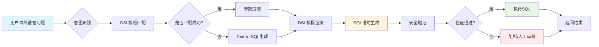
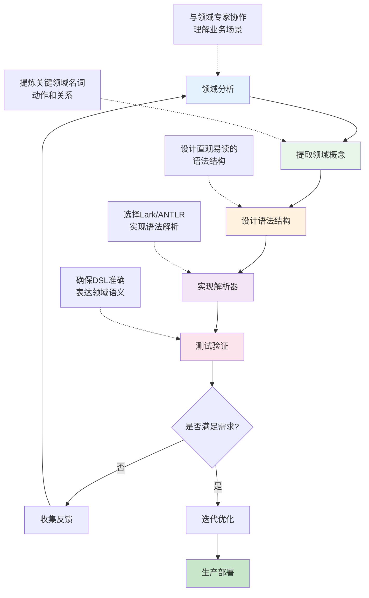
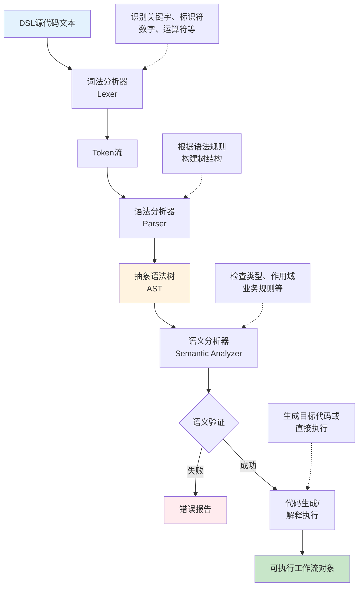
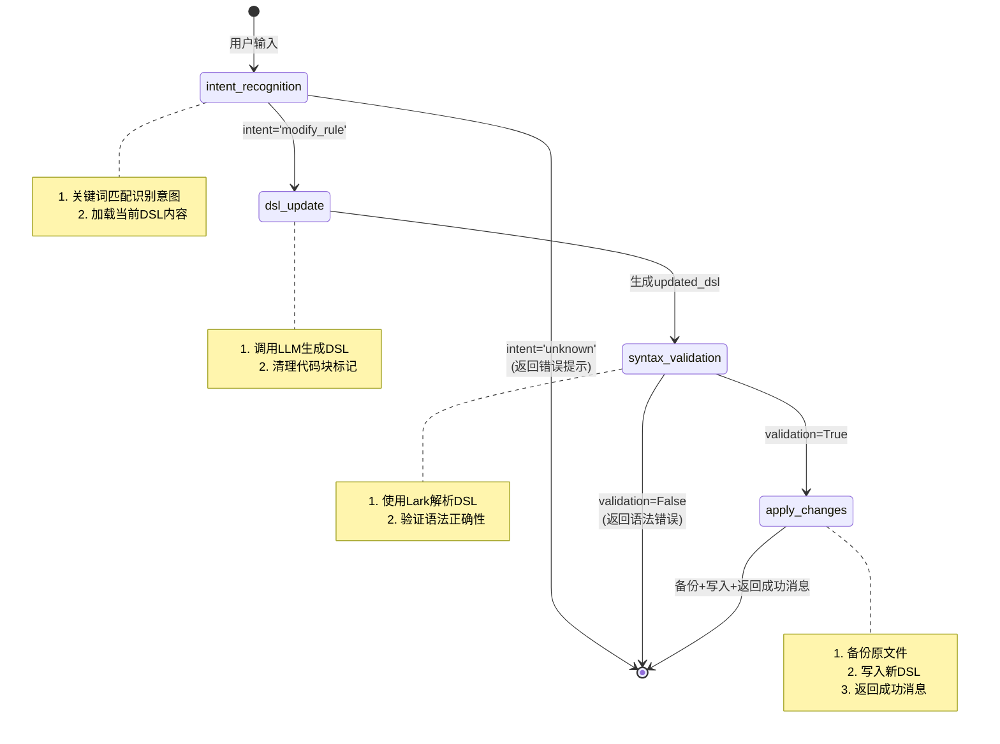
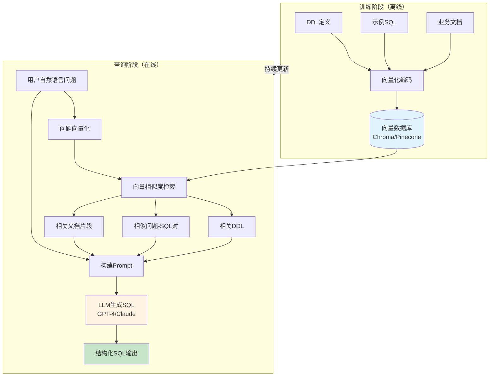
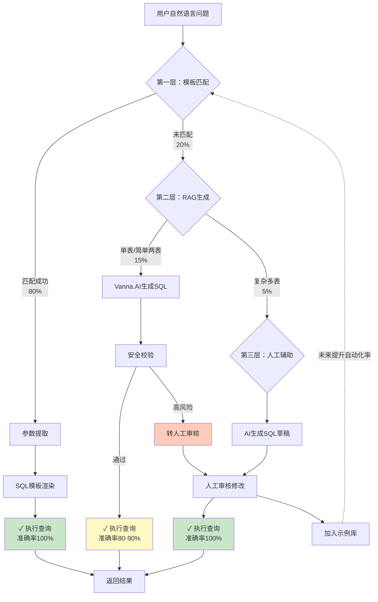
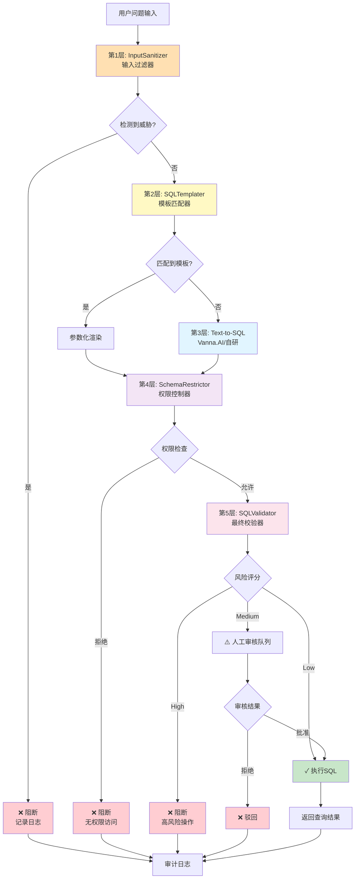
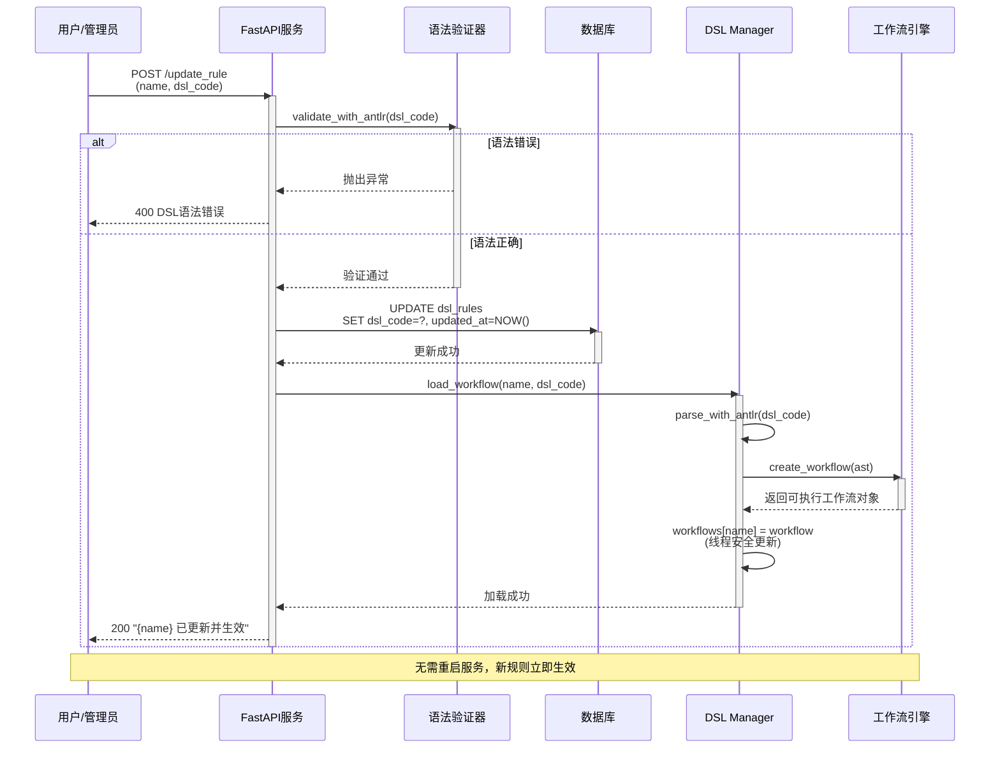
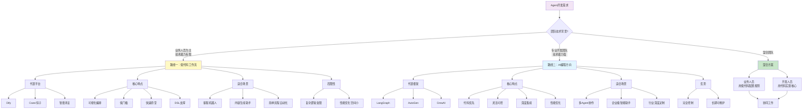
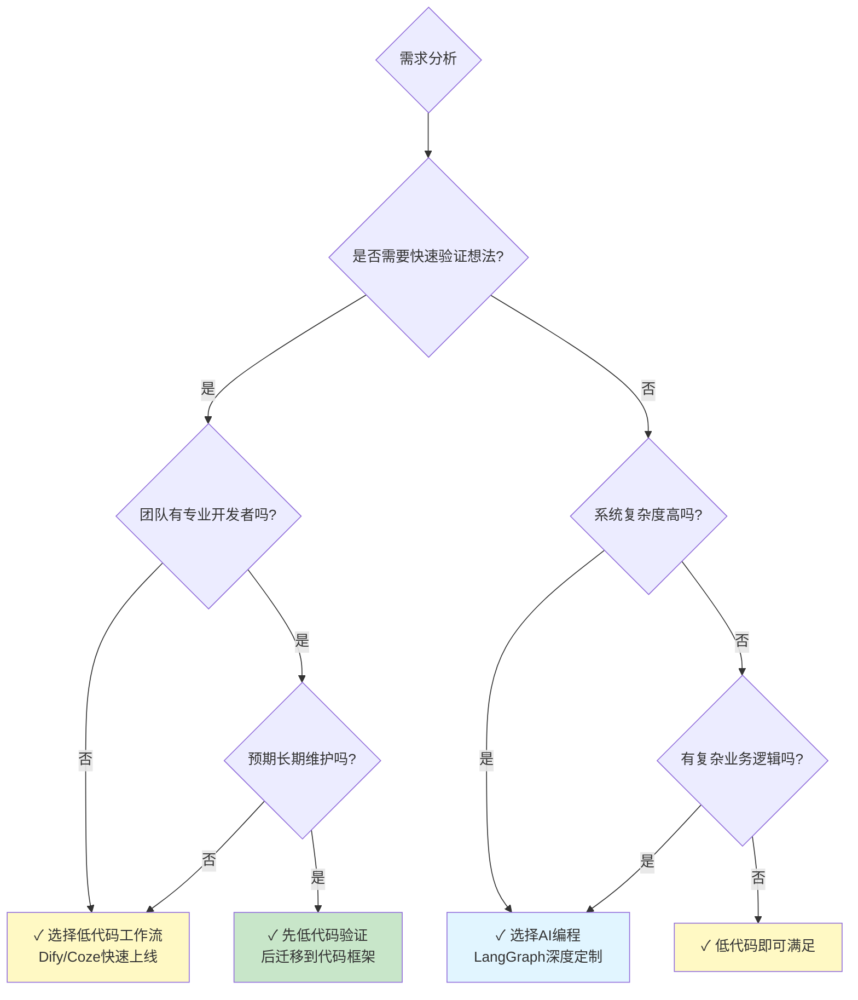

# DSL设计与应用实践文档

## 一、DSL核心概念与分类

DSL（领域特定语言）是一种针对特定应用领域设计的计算机语言，与通用编程语言相比，DSL能够更简洁、直观地表达特定领域的业务逻辑。根据实现方式的不同，DSL可分为内部DSL和外部DSL两大类。

### 1.1 内部DSL与外部DSL比较

*表:内部DSL与外部DSL特性对比*

| **特性** | **内部DSL**                | **外部DSL**            |
| -------- | -------------------------- | ---------------------- |
| 实现方式 | 基于宿主语言语法扩展       | 独立设计语法和解析器   |
| 开发成本 | 较低，复用宿主语言基础设施 | 较高,需开发完整工具链 |
| 灵活性   | 受宿主语言限制             | 完全自由设计           |
| 学习曲线 | 相对平缓                   | 相对陡峭               |
| 典型代表 | Fluent API、RSpec          | SQL、正则表达式        |

#### 内部DSL示例：Python工作流构建器

```python
# 使用Python构建的工作流DSL
workflow = (
    WorkflowBuilder()
    .add_step("validate_input", validate_user_input)
    .add_step("process_data", process_business_data)
    .add_condition("data_valid", lambda ctx: ctx.validation_result)
    .add_step("send_notification", send_success_notification)
    .build()
)
```

**优势**：开发成本低，可以复用宿主语言的工具链
**劣势**：受宿主语言语法限制，业务人员难以直接理解

#### 外部DSL示例：客服对话流程

```yaml
# 客服对话流程DSL
conversation_flow:
  name: "customer_service_flow"

  triggers:
    - intent: "greeting"
      response: "您好！我是智能客服，有什么可以帮您的？"

    - intent: "refund_request"
      conditions:
        - check: "order_exists"
        - check: "order_refundable"
      actions:
        - type: "api_call"
          service: "payment_service"
          method: "process_refund"
        - type: "send_message"
          template: "refund_success"
```

**优势**：语法完全自定义，业务人员可以直接理解和修改
**劣势**：需要开发专门的解析器，开发成本相对较高

### 1.2 为什么需要DSL？硬编码的问题

#### 硬编码方式的弊端

```python
def handle_refund_request(user_input, context):
    if "退款" in user_input:
        order_id = extract_order_id(user_input)
        if not order_id:
            return "请提供订单号"

        order = get_order_details(order_id)
        if order.status != "delivered":
            return "订单未发货，无法退款"

        if days_since_delivery(order) > 30:
            return "超过30天退款期限"

        if order.category == "digital":
            return "数字商品不支持退款"

        process_refund(order_id)
        return "退款申请已提交"
```

**这种方式的问题**：
- 业务规则变更需要修改代码：退款期限从30天改为15天，需要开发人员修改代码并重新部署
- 业务人员无法直接参与：客服主管想调整流程，必须通过开发人员
- 测试和维护成本高：每次修改都要重新测试整个系统

#### DSL方式的改进

```yaml
# 退款流程DSL
refund_workflow:
  name: "客服退款处理流程"

  steps:
    - step: "收集订单信息"
      type: "slot_filling"
      slot: "order_id"
      prompt: "请提供您的订单号"
      validation: "regex:^ORD[0-9]{8}$"

    - step: "验证退款条件"
      type: "business_rules"
      rules:
        - condition: "order.status == 'delivered'"
          error_message: "订单未发货，无法退款"
        - condition: "days_since_delivery <= 30"
          error_message: "超过30天退款期限"
        - condition: "order.category != 'digital'"
          error_message: "数字商品不支持退款"

    - step: "执行退款"
      type: "api_call"
      service: "payment_service"
      method: "process_refund"
      params:
        order_id: "${context.order_id}"
```

**DSL带来的根本性改变**：
- 业务人员可以直接修改：退款期限调整只需要改配置文件
- 即时生效：无需重新编译和部署
- 可视化编辑：可以开发图形化界面让业务人员操作
- 版本控制：业务规则的变更历史一目了然

### 1.3 DSL在自然语言转SQL中的角色

在自然语言转SQL场景中，DSL扮演着中间表示层的角色：

- **单表查询支持良好**：对于简单的SELECT FROM WHERE等基础查询，DSL可以良好支持并准确转换
- **多表查询挑战**：复杂联表查询的DSL完成度较低，需谨慎应用于企业生产环境
- **函数支持**：查询中的聚合函数、条件函数等可通过text to SQL处理

**重要安全提示**：数据库操作涉及重大风险，错误可能导致资金损失或工作风险。应用DSL时必须加入验证、权限控制和查询约束机制。

#### 自然语言到SQL的完整技术链路



**流程说明**：
1. **意图识别**：判断用户是查询数据还是其他操作
2. **DSL模板匹配**：优先使用预定义模板（准确率100%）
3. **Text-to-SQL生成**：模板未匹配时使用AI生成
4. **安全验证**：多层防御确保SQL安全性
5. **执行/阻断**：根据验证结果决定是否执行

### 1.4 为什么Agent开发者需要掌握DSL？

#### 连接标准化工具

DSL作为连接标准化的工具，在Agent开发中扮演着重要角色：

**典型案例：Agent Hit**
- OpenAI的Agent Hit等平台推出后，工作流成为主流开发方式
- 前端展示的工作流，后端本质是标准的DSL定义
- 开发者需要理解DSL才能深度定制工作流行为

#### 业务逻辑解耦

DSL实现核心逻辑与业务规则的分离：

```python
# 硬编码方式（不推荐）
def handle_refund(order_id):
    order = get_order(order_id)
    if days_since_delivery(order) > 30:  # 业务规则写死在代码中
        return "超过30天退款期限"
    # ...

# DSL方式（推荐）
# 业务规则在配置文件中
refund_workflow:
  rules:
    - condition: "days_since_delivery <= 30"
      error_message: "超过30天退款期限"
```

**优势**：
- 核心逻辑稳定，业务规则可配置
- 语法校验由开发者控制
- 业务人员可以修改业务逻辑，无需修改代码

#### DSL vs MCP：互补而非替代

很多开发者疑惑："能否直接封装成MCP工具？"

**核心区别**：
- **MCP**：解决技术层互操作性，提供标准化的工具调用接口
- **DSL**：解决业务层灵活性，表达业务流程和逻辑

**实际对比**：
- Dify的工作流 ≠ MCP工具
- 工作流表达的是"流程"，包含节点间的连接关系和执行顺序
- MCP工具是"一次性操作"，调用后返回结果

**示例**：
```yaml
# 工作流DSL（包含流程）
workflow:
  nodes:
    - id: validate_input
    - id: process_data
    - id: send_notification
  edges:
    - source: validate_input
      target: process_data
      condition: "input_valid"

# MCP工具调用（单次操作）
mcp.call("validate_input", params)
```

**结论**：DSL和MCP在Agent系统中都有其不可替代的价值，应当协同使用而非互相替代。

## 二、DSL设计原则与最佳实践

### 2.1 核心设计原则

#### 1. What vs How分离原则

DSL仅描述"做什么"（如加热到92℃），不涉及"怎么做"的具体实现
- 业务意图与技术实现分离，专注描述业务目标
- 允许底层实现的灵活调整和优化

**示例对比**：

```yaml
# 好的DSL：描述What
coffee_making:
  heat_water:
    target_temperature: 92°C
    wait_until_ready: true

# 不好的DSL：描述How
coffee_making:
  turn_on_heater:
    voltage: 220V
    current: 10A
    pwm_frequency: 50Hz
  poll_temperature_sensor:
    interval: 100ms
    pin: GPIO_17
```

#### 2. 领域特性表达

- 使用领域专有词汇（如咖啡制作的温度带、水位检测）
- 包含领域特定的参数和约束条件
- 定义符合领域思维模式的抽象概念

#### 3. 可配置性与可扩展性

- 开放关键参数配置（水温、水位阈值、冲泡时间）
- 支持业务人员根据实际需求调整参数组合
- 提供版本控制机制，支持DSL迭代演进

#### 4. 优秀DSL的五个特征

##### (1) 领域语义精准映射

```yaml
# 好的DSL：使用业务术语
risk_evaluation:
  customer_type: "premium"
  transaction_amount: "> 10000"
  risk_level: "medium"
  action: "manual_review"

# 坏的DSL：使用技术术语
if_condition:
  variable: "customer_tier"
  operator: "equals"
  value: 1
  then_execute: "function_call_risk_check"
```

##### (2) 语法简洁无冗余

```yaml
# 好的DSL：简洁明了
approval_flow:
  - check_credit_score
  - if credit_score > 700:
      approve_immediately
  - else:
      manual_review

# 坏的DSL：过度复杂
approval_flow:
  steps:
    - step_id: "step_001"
      step_type: "validation"
      step_name: "check_credit_score"
      input_parameters:
        - param_name: "user_id"
          param_type: "string"
          param_source: "context.user_id"
```

##### (3) 可视化与文本双模式支持

优秀的DSL既支持文本编辑（便于版本控制），也支持可视化编辑（便于业务人员使用）。

##### (4) 完善的错误反馈机制

```
错误示例：Syntax error at line 15

优秀示例：
在第15行：未找到必需的'action'字段。
客服流程中的每个步骤都必须指定具体的执行动作。
```

##### (5) 无缝的系统集成能力

DSL应该能够轻松调用现有的API和服务，而不需要复杂的适配层。

### 2.2 设计流程与方法



**详细步骤说明**：

1. **领域分析**：与领域专家协作，理解业务场景和需求
2. **概念提取**：提炼关键领域名词、动作和关系
3. **语法设计**：设计直观、易读的语法结构
4. **解析器实现**：选择合适工具实现语法解析
5. **测试验证**：确保DSL准确表达领域语义
6. **迭代优化**：根据反馈持续改进

## 三、DSL语法定义与解析技术

### 3.1 语法定义规范

以咖啡制作DSL为例，关键语法元素包括：

#### Lark语法定义 (coffee_dsl.lark)

```lark
# ==================== 顶层规则 ====================
# 定义DSL的入口点，整个DSL文件必须是一个workflow
start: workflow

# workflow定义：包含名称、版本号和多个节点/边
# 语法：WORKFLOW "工作流名称" VERSION 版本号 节点定义... 边定义...
workflow: "WORKFLOW" STRING "VERSION" NUMBER (node | edge)+

# ==================== 节点定义 ====================
# 节点是工作流的基本单元，包含ID、类型和数据
# 语法：NODE 节点ID TYPE 节点类型 节点数据...
node: "NODE" ID "TYPE" NODE_TYPE node_data*

# 节点类型枚举：
# - initial: 初始节点（工作流起点）
# - action: 动作节点（执行具体操作）
# - condition: 条件节点（判断条件是否满足）
NODE_TYPE: "initial" | "action" | "condition"

# 节点数据：描述节点要执行的操作或条件
node_data: "DO" action              # DO关键字：定义节点执行的动作
         | "WHEN" condition         # WHEN关键字：定义条件判断
         | "DESCRIPTION" STRING     # DESCRIPTION关键字：节点说明文档

# ==================== 边定义 ====================
# 边定义了节点之间的连接关系和转换条件
# 语法：EDGE 源节点ID -> 目标节点ID [CONDITION 条件]
edge: "EDGE" ID "->" ID (edge_condition)?
edge_condition: "CONDITION" condition  # 可选的条件表达式

# ==================== 条件表达式 ====================
# 条件表达式：传感器路径 比较运算符 数值 [单位]
# 示例：water.temp >= 93°C
condition: SENSOR_PATH COMP NUMBER UNIT?

# 比较运算符：大于等于或小于
COMP: ">=" | "<"

# ==================== 动作定义 ====================
# 动作是节点可以执行的具体操作，支持多种类型
action: wait_action         # 等待操作
      | start_action        # 启动设备
      | stop_action         # 停止设备
      | turn_on_action      # 打开设备
      | turn_off_action     # 关闭设备
      | send_action         # 发送消息
      | alert_action        # 发出警告
      | parameter_action    # 设置参数

# 各类动作的具体语法：
wait_action: "WAIT" NUMBER UNIT                     # 等待指定时间，如：WAIT 20s
start_action: "START" ID                            # 启动设备，如：START brewing
stop_action: "STOP" ID                              # 停止设备，如：STOP brewing
turn_on_action: "TURN_ON" ID                        # 打开设备，如：TURN_ON heater
turn_off_action: "TURN_OFF" ID                      # 关闭设备，如：TURN_OFF heater
send_action: "SEND" STRING "TO" ID                  # 发送消息到目标，如：SEND "完成" TO display
alert_action: "ALERT" STRING                        # 发出警告，如：ALERT "水位过低"
parameter_action: "SET" ID "=" (NUMBER_WITH_UNIT | NUMBER UNIT? | STRING)  # 设置参数，如：SET target_temp = 93°C

# ==================== 终结符定义（词法规则） ====================
# 传感器路径：点分隔的层级路径，如 water.temp, water.level
# 格式：小写字母开头，可包含下划线，用点分隔多级
SENSOR_PATH: /[a-z]+(\.[a-z_]+)+/

# 带单位的数值类型（工业场景中必须严格校验单位）
TEMP_VALUE: /\d+(\.\d+)?°C/        # 温度值：支持整数和小数，单位°C
VOLUME_VALUE: /\d+(\.\d+)?ml/      # 容量值：支持整数和小数，单位ml
TIME_VALUE: /\d+(\.\d+)?s/         # 时间值：支持整数和小数，单位s

# 聚合类型：任何带单位的数值
NUMBER_WITH_UNIT: TEMP_VALUE | VOLUME_VALUE | TIME_VALUE

# 单位枚举：支持的所有单位类型
UNIT: "°C" | "ml" | "s"

# 纯数值：支持正负整数和小数
NUMBER: /-?\d+(\.\d+)?/

# 标识符：变量名、设备名等，必须以字母或下划线开头
ID: /[a-zA-Z_][a-zA-Z0-9_]*/

# 字符串：双引号包裹的任意字符序列
STRING: /"[^"]*"/

# 注释：井号开头到行尾的内容
COMMENT: /#[^\n]*/

# ==================== 忽略规则 ====================
# 以下字符在解析时会被忽略（视为空白）
%ignore " "           # 忽略空格
%ignore "\t"          # 忽略制表符
%ignore /\r?\n/       # 忽略换行符（兼容Windows和Unix）
%ignore COMMENT       # 忽略注释内容
```

#### DSL实例 (coffee_rules.dsl)

```dsl
# ==================== 工作流定义 ====================
# 定义工作流的名称和版本号
WORKFLOW "智能咖啡制作系统" VERSION 1.1

# ==================== 节点定义部分 ====================

# 【初始节点】工作流的起点
NODE start TYPE initial
  DESCRIPTION "系统启动"

# 【条件节点】检查水位是否充足
# 传感器路径: water.level（水箱的水位传感器）
# 条件: 水位 >= 300ml 才允许继续
NODE check_water TYPE condition
  WHEN water.level >= 300ml
  DESCRIPTION "检查水箱水位"

# 【动作节点】水位不足时的处理
# 发出警告提示用户添加水
NODE add_water TYPE action
  DO ALERT "请添加水"
  DESCRIPTION "提醒添加水"

# 【动作节点】加热水到目标温度
# 执行两个动作：
#   1. 打开加热器（heater）
#   2. 设置目标温度为93°C（咖啡最佳冲泡温度）
NODE heat_water TYPE action
  DO TURN_ON heater
  DO SET target_temp = 93°C
  DESCRIPTION "加热水到目标温度"

# 【条件节点】检查水温是否达标
# 传感器路径: water.temp（水温传感器）
# 条件: 温度 >= 93°C 才允许继续
NODE check_temp TYPE condition
  WHEN water.temp >= 93°C
  DESCRIPTION "检查水温是否达标"

# 【动作节点】水温就绪后的通知
# 向显示屏发送消息，告知用户可以开始制作
NODE temp_ready TYPE action
  DO SEND "水温已达到93°C，可以开始制作咖啡" TO display
  DESCRIPTION "水温就绪通知"

# 【动作节点】咖啡制作流程
# 执行三个连续动作：
#   1. 启动冲泡装置（brewing）
#   2. 等待20秒（咖啡萃取时间）
#   3. 停止冲泡装置
NODE make_coffee TYPE action
  DO START brewing
  DO WAIT 20s
  DO STOP brewing
  DESCRIPTION "制作咖啡"

# 【动作节点】咖啡制作完成后的清理
# 执行两个动作：
#   1. 关闭加热器（节能）
#   2. 向显示屏发送完成消息
NODE coffee_ready TYPE action
  DO TURN_OFF heater
  DO SEND "咖啡制作完成！" TO display
  DESCRIPTION "咖啡制作完成"

# ==================== 边定义部分（工作流连接） ====================

# 主流程路径：
EDGE start -> check_water                    # 系统启动 → 检查水位

EDGE check_water -> heat_water               # 水位充足 → 开始加热
                                             # （当water.level >= 300ml时自动触发）

EDGE check_water -> add_water CONDITION water.level < 300ml
                                             # 水位不足 → 提示添加水
                                             # （显式指定条件：water.level < 300ml）

EDGE add_water -> heat_water                 # 添加水后 → 开始加热

EDGE heat_water -> check_temp                # 加热中 → 检查温度

EDGE check_temp -> temp_ready                # 温度达标 → 就绪通知
                                             # （当water.temp >= 93°C时自动触发）

EDGE temp_ready -> make_coffee               # 就绪后 → 开始制作咖啡

EDGE make_coffee -> coffee_ready             # 制作完成 → 完成流程

# ==================== 工作流执行说明 ====================
# 执行顺序：
# 1. start: 系统启动
# 2. check_water: 检查水位
#    - 如果水位 >= 300ml → 进入heat_water
#    - 如果水位 < 300ml → 进入add_water → 然后heat_water
# 3. heat_water: 打开加热器，设置目标温度
# 4. check_temp: 持续检查水温
#    - 当温度 >= 93°C → 进入temp_ready
# 5. temp_ready: 显示就绪消息
# 6. make_coffee: 启动冲泡20秒后停止
# 7. coffee_ready: 关闭加热器，显示完成消息
```

**单位系统需严格定义**，使用正则表达式确保格式正确，如温度格式：`\d+(.\ d+)?\circ C`。工业场景中单位错误可能导致严重事故，必须实现严格校验。

#### 实际运行效果演示

为了更直观地理解Lark解析器的工作过程，我们提供了一个完整的演示程序（`demo_lark_parser.py`），展示从DSL代码到Python数据结构的完整转换过程：

**第1步：输入的DSL代码**
```dsl
WORKFLOW "简化咖啡制作" VERSION 1.0

NODE start TYPE initial
  DESCRIPTION "系统启动"

NODE check_water TYPE condition
  WHEN water.level >= 300ml
  DESCRIPTION "检查水位"

NODE heat_water TYPE action
  DO TURN_ON heater
  DO SET target_temp = 93°C
  DESCRIPTION "加热水"

EDGE start -> check_water
EDGE check_water -> heat_water
```

**第2步：词法分析结果（Token流）**
```
KEYWORD: WORKFLOW
STRING: "简化咖啡制作"
KEYWORD: VERSION
NUMBER: 1.0
KEYWORD: NODE
ID: start
KEYWORD: TYPE
NODE_TYPE: initial
KEYWORD: DESCRIPTION
STRING: "系统启动"
...
```

**第3步：抽象语法树（AST）结构**
```
workflow
├── Token(STRING, "简化咖啡制作")
├── Token(NUMBER, 1.0)
├── node
│   ├── Token(ID, start)
│   ├── Token(NODE_TYPE, initial)
│   └── node_data
│       └── Token(STRING, "系统启动")
├── node
│   ├── Token(ID, check_water)
│   ├── Token(NODE_TYPE, condition)
│   ├── node_data
│   │   └── condition
│   │       ├── Token(SENSOR_PATH, water.level)
│   │       ├── Token(COMP, >=)
│   │       ├── Token(NUMBER, 300)
│   │       └── Token(UNIT, ml)
│   └── node_data
│       └── Token(STRING, "检查水位")
└── edge
    ├── Token(ID, start)
    └── Token(ID, check_water)
```

**第4步：转换为Python字典结构**
```json
{
  "workflow_name": "简化咖啡制作",
  "version": 1.0,
  "body": [
    {
      "type": "node",
      "node_name": "start",
      "node_type": "initial",
      "node_data": ["系统启动"]
    },
    {
      "type": "node",
      "node_name": "check_water",
      "node_type": "condition",
      "node_data": [
        {
          "sensor": "water.level",
          "op": ">=",
          "value": 300.0,
          "unit": "ml"
        },
        "检查水位"
      ]
    },
    {
      "type": "edge",
      "source": "start",
      "target": "check_water",
      "condition": null
    }
  ]
}
```

**第5步：基于解析结果生成可执行代码**

解析后的Python字典可以直接用于生成任何形式的可执行代码：

```python
# 方式1：生成LangGraph工作流
from langgraph.graph import StateGraph

workflow = StateGraph(CoffeeState)
for item in result['body']:
    if item['type'] == 'node':
        workflow.add_node(item['node_name'], create_node_function(item))
    elif item['type'] == 'edge':
        workflow.add_edge(item['source'], item['target'])

# 方式2：生成配置文件（YAML/JSON）
import yaml
with open('workflow_config.yaml', 'w') as f:
    yaml.dump(result, f)

# 方式3：生成Python类定义
class_code = generate_workflow_class(result)
exec(class_code)
```

**完整演示程序**

完整的演示代码位于 `09_dsl/02_lark_dsl_examples/demo_lark_parser.py`，运行方式：

```bash
# 安装依赖
pip install lark-parser

# 运行演示
python demo_lark_parser.py
```

演示程序会输出完整的解析过程，包括AST结构、转换结果和关键信息提取，帮助理解DSL解析的每个步骤。

### 3.2 解析工具选型对比

*表：DSL解析工具对比*

| **特性** | **Lark**             | **ANTLR**                    |
| -------- | -------------------- | ---------------------------- |
| 适用场景 | 原型验证             | 生产环境                     |
| 性能特点 | 轻量级，适合快速迭代 | 高性能，工业级               |
| 错误处理 | 精确到字符的报错     | 异常机制定位错误行号         |
| 语言支持 | 主要Python           | 多语言支持(Java/Python/Go等) |
| 学习曲线 | 相对平缓             | 相对陡峭                     |

**选型建议**：

- 原型阶段使用Lark进行快速验证
- 生产环境切换为ANTLR确保性能和稳定性
- 复杂业务场景建议采用ANTLR的g4文件定义语法

### 3.3 解析流程与验证机制

#### Lark解析器实现 (lark_parser.py)

```python
from lark import Lark, Transformer

class CoffeeTransformer(Transformer):
    """
    DSL抽象语法树（AST）转换器

    继承自Lark的Transformer类，用于将解析后的语法树转换为Python字典结构。
    Lark会自动调用与语法规则同名的方法来处理对应的节点。

    工作原理：
    1. Lark解析DSL代码生成树形结构
    2. Transformer遍历树的每个节点
    3. 调用对应的转换方法将节点转换为字典
    4. 返回结构化的Python对象
    """

    def workflow(self, items):
        """
        转换workflow节点

        输入：items是一个列表，包含：
            items[0]: 工作流名称（STRING）
            items[1]: 版本号（NUMBER）
            items[2:]: 节点和边的列表

        输出：字典结构
            {
                "workflow_name": "智能咖啡制作系统",
                "version": 1.1,
                "body": [节点和边的列表]
            }
        """
        return {
            "workflow_name": items[0],
            "version": items[1],
            "body": items[2:]
        }

    def node(self, items):
        """
        转换node节点

        输入：items是一个列表，包含：
            items[0]: 节点ID（ID）
            items[1]: 节点类型（NODE_TYPE：initial/action/condition）
            items[2:]: 节点数据列表（DO、WHEN、DESCRIPTION等）

        输出：字典结构
            {
                "node_name": "check_water",
                "node_type": "condition",
                "node_data": [数据列表]
            }
        """
        return {
            "node_name": items[0],
            "node_type": items[1],
            "node_data": items[2:]
        }

    def edge(self, items):
        """
        转换edge节点（工作流的边/连接）

        输入：items是一个列表，包含：
            items[0]: 源节点ID
            items[1]: 目标节点ID
            items[2]: 可选的条件表达式

        输出：字典结构
            {
                "source": "check_water",
                "target": "heat_water",
                "condition": {...} 或 None
            }
        """
        return {
            "source": items[0],
            "target": items[1],
            "condition": items[2] if len(items) > 2 else None
        }

    def condition(self, items):
        """
        转换condition节点（条件表达式）

        输入：items是一个列表，包含：
            items[0]: 传感器路径（如 "water.temp"）
            items[1]: 比较运算符（">=" 或 "<"）
            items[2]: 数值
            items[3]: 可选的单位（"°C"、"ml"、"s"）

        输出：字典结构
            {
                "sensor": "water.temp",
                "op": ">=",
                "value": 93,
                "unit": "°C"
            }
        """
        return {
            "sensor": items[0],
            "op": items[1],
            "value": items[2],
            "unit": items[3] if len(items) > 3 else None
        }

    def wait_action(self, items):
        """
        转换wait_action节点（等待动作）

        输入：items是一个列表，包含：
            items[0]: 等待时长（数值）
            items[1]: 可选的时间单位（"s"）

        输出：字典结构
            {
                "action_type": "wait",
                "duration": 20,
                "unit": "s"
            }

        示例：WAIT 20s -> {"action_type": "wait", "duration": 20, "unit": "s"}
        """
        return {
            "action_type": "wait",
            "duration": items[0],
            "unit": items[1] if len(items) > 1 else None
        }

    def start_action(self, items):
        """转换start_action节点（启动设备）"""
        return {"action_type": "start", "device": items[0]}

    def stop_action(self, items):
        """转换stop_action节点（停止设备）"""
        return {"action_type": "stop", "device": items[0]}

    def turn_on_action(self, items):
        """转换turn_on_action节点（打开设备）"""
        return {"action_type": "turn_on", "device": items[0]}

    def turn_off_action(self, items):
        """转换turn_off_action节点（关闭设备）"""
        return {"action_type": "turn_off", "device": items[0]}

    def send_action(self, items):
        """
        转换send_action节点（发送消息）
        items[0]: 消息内容
        items[1]: 目标设备
        """
        return {"action_type": "send", "message": items[0], "target": items[1]}

    def alert_action(self, items):
        """转换alert_action节点（发出警告）"""
        return {"action_type": "alert", "message": items[0]}

    def parameter_action(self, items):
        """
        转换parameter_action节点（设置参数）
        items[0]: 参数名
        items[1]: 参数值
        """
        return {"action_type": "set_parameter", "param": items[0], "value": items[1]}


def parse(dsl_code):
    """
    DSL代码解析主函数

    参数：
        dsl_code: DSL源代码字符串

    返回：
        解析后的Python字典结构，包含工作流的完整定义

    工作流程：
        1. 读取Lark语法文件（coffee_dsl.lark）
        2. 创建Lark解析器实例，指定入口规则为'workflow'
        3. 调用parser.parse()进行语法分析，生成抽象语法树
        4. 使用CoffeeTransformer转换AST为Python字典
        5. 返回结构化的数据供后续使用

    异常处理：
        - 如果DSL语法错误，Lark会抛出UnexpectedToken或UnexpectedCharacters异常
        - 如果语法文件不存在，会抛出FileNotFoundError异常

    示例：
        dsl_code = '''
        WORKFLOW "咖啡机" VERSION 1.0
        NODE start TYPE initial
        '''
        result = parse(dsl_code)
        # result = {
        #     "workflow_name": "咖啡机",
        #     "version": 1.0,
        #     "body": [...]
        # }
    """
    # 读取Lark语法定义文件
    with open("coffee_dsl.lark", "r", encoding="utf-8") as f:
        grammar = f.read()

    # 创建Lark解析器，指定入口规则为'workflow'
    parser = Lark(grammar, start='workflow')

    # 解析DSL代码，生成抽象语法树（AST）
    tree = parser.parse(dsl_code)

    # 使用Transformer将AST转换为Python字典结构
    return CoffeeTransformer().transform(tree)
```

#### 解析流程

DSL代码从文本到可执行对象需要经历完整的编译过程：



**详细说明**：

1. **词法分析（Lexical Analysis）**：
   - 将输入流分解为标记（Token）序列
   - 识别关键字、标识符、数字、运算符等
   - 示例：`WORKFLOW "咖啡制作" VERSION 1.0` → `[KEYWORD:WORKFLOW, STRING:"咖啡制作", KEYWORD:VERSION, NUMBER:1.0]`

2. **语法分析（Syntax Analysis）**：
   - 根据语法规则构建抽象语法树（AST）
   - 验证代码结构的正确性
   - 示例：识别 `NODE → TYPE → DO → action` 的层次结构

3. **语义分析（Semantic Analysis）**：
   - 验证语法树的语义正确性
   - 检查类型匹配、变量作用域等
   - 业务规则验证（如温度范围、水位阈值）

4. **代码生成/解释执行（Code Generation/Interpretation）**：
   - 生成目标代码或直接解释执行
   - 转换为LangGraph工作流对象
   - 准备好可直接运行的程序

#### 三级验证机制

- **语法结构检查**：确认DSL符合预定义语法树结构
- **词法元素校验**：验证节点名称、参数格式等合法性
- **业务规则验证**：检查有向无环图等业务约束条件

## 四、DSL实现模式与代码生成

### 4.1 基于提示词的DSL生成

通过精心设计的提示词，引导大模型生成符合规范的DSL：

```python
prompt = f"""
你是一个咖啡机 DSL 规则更新助手。请根据用户指令更新以下 DSL 规则。

当前 DSL 规则：
```
{state["current_dsl"]}
```

用户指令：{state["user_input"]}

请按照以下要求更新 DSL：
1. 保持原有的结构和语法
2. 只修改相关的参数值
3. 将版本号从 1.0 升级到 1.1
4. 确保语法正确

请直接返回更新后的完整 DSL 代码，不要添加任何解释或格式化标记。
"""
```

这种方法结合了自然语言处理的灵活性和DSL的结构化优势，大幅降低使用门槛。

### 4.2 LangGraph工作流集成

完整的DSL更新工作流实现：

```python
from langgraph.graph import StateGraph, END
from typing_extensions import TypedDict
import dashscope
from dashscope import Generation

class State(TypedDict):
    """LangGraph 状态定义"""
    user_input: str  # 用户原始输入
    intent: str
    current_dsl: str # 当前 DSL 规则
    updated_dsl: str # 更新后的 DSL 规则
    validation_result: bool # 语法验证结果
    final_message: str # 最终回复消息

class CoffeeDSLWorkflow:
    """咖啡机 DSL 工作流管理器"""

    def __init__(self):
        dashscope.api_key = os.getenv('DASHSCOPE_API_KEY')
        self.dsl_file_path = "./coffee_rules.dsl"
        self.workflow = self._build_workflow()

    def _build_workflow(self) -> StateGraph:
        """构建 LangGraph 工作流"""
        workflow = StateGraph(State)

        # 添加节点
        workflow.add_node("intent_recognition", self.intent_recognition_node)
        workflow.add_node("dsl_update", self.dsl_update_node)
        workflow.add_node("syntax_validation", self.syntax_validation_node)
        workflow.add_node("apply_changes", self.apply_changes_node)

        # 设置入口点和边
        workflow.set_entry_point("intent_recognition")
        workflow.add_edge("intent_recognition", "dsl_update")
        workflow.add_edge("dsl_update", "syntax_validation")
        workflow.add_edge("syntax_validation", "apply_changes")
        workflow.add_edge("apply_changes", END)

        return workflow.compile()

    def intent_recognition_node(self, state: State) -> Dict[str, Any]:
        """意图识别节点"""
        user_input = state["user_input"]

        # 意图识别规则(基于关键词匹配)
        modify_keywords = ["改", "修改", "更新", "调整", "设置"]
        time_keywords = ["时间", "秒", "分钟", "s", "min"]

        if any(keyword in user_input for keyword in modify_keywords) and \
           any(keyword in user_input for keyword in time_keywords):
            intent = "modify_rule"
        else:
            intent = "unknown"

        # 加载当前 DSL
        with open(self.dsl_file_path, 'r', encoding='utf-8') as f:
            current_dsl = f.read()

        return {
            **state,
            "intent": intent,
            "current_dsl": current_dsl
        }

    def dsl_update_node(self, state: State) -> Dict[str, Any]:
        """DSL 更新节点 - 使用通义千问"""
        # 调用LLM生成更新后的DSL
        response = Generation.call(
            model='qwen-turbo',
            prompt=self._build_prompt(state),
            max_tokens=2000,
            temperature=0.1
        )

        updated_dsl = response.output.text.strip()
        # 清理可能的代码块标记
        updated_dsl = re.sub(r'^```[\w]*\n?', '', updated_dsl)
        updated_dsl = re.sub(r'\n?```$', '', updated_dsl)

        return {
            **state,
            "updated_dsl": updated_dsl
        }

    def syntax_validation_node(self, state: State) -> Dict[str, Any]:
        """语法验证节点 - 使用 Lark"""
        result = parse(state["updated_dsl"])

        return {
            **state,
            "validation_result": True
        }

    def apply_changes_node(self, state: State) -> Dict[str, Any]:
        """应用更改节点"""
        # 备份原文件
        backup_path = self.dsl_file_path + ".backup"
        with open(self.dsl_file_path, 'r', encoding='utf-8') as f:
            original_content = f.read()

        with open(backup_path, 'w', encoding='utf-8') as f:
            f.write(original_content)

        # 写入新的 DSL 规则
        with open(self.dsl_file_path, 'w', encoding='utf-8') as f:
            f.write(state["updated_dsl"])

        return {
            **state,
            "final_message": "DSL 规则已成功更新"
        }
```

#### LangGraph工作流状态图

完整的DSL更新工作流使用LangGraph状态机实现，确保每个步骤有序执行：



**状态转换说明**：

| 状态节点 | 输入 | 输出 | 可能的转换 |
|---------|------|------|-----------|
| **intent_recognition** | user_input | intent, current_dsl | → dsl_update (成功)<br/>→ END (失败) |
| **dsl_update** | current_dsl, user_input | updated_dsl | → syntax_validation |
| **syntax_validation** | updated_dsl | validation_result | → apply_changes (通过)<br/>→ END (失败) |
| **apply_changes** | updated_dsl | final_message | → END (完成) |

**关键特性**：
- **容错机制**：每个节点都有失败退出路径
- **状态传递**：使用TypedDict定义状态结构，确保类型安全
- **原子操作**：apply_changes节点先备份再更新，支持回滚

七步工作流法确保DSL的准确更新和执行。

## 五、NL2SQL技术演进与应用

### 5.1 NL2SQL技术发展历程

自然语言转SQL（NL2SQL/Text-to-SQL）技术经历了多个发展阶段：

```
发展历程图：
[2017] Seq2SQL (Salesforce)
   ↓
[2018] Spider 1.0 数据集发布 - 跨域复杂查询
   ↓
[2019-2020] 预训练模型时代 (BERT-based, T5-based)
   ↓
[2021-2023] 大模型时代 (GPT-3/4, CodeLlama)
   ↓
[2024] 检索增强生成(RAG) + 上下文学习
```

#### 当前主流技术路线

**路线一：上下文学习（In-Context Learning）**
- 代表：GPT-4 + Few-Shot Prompting
- 优势：无需微调，快速部署
- 劣势：token成本高，需要精心设计prompt

**路线二：参数优化（Parameter-Efficient Tuning）**
- 代表：LoRA微调 + Spider数据集
- 优势：准确率高，可控性强
- 劣势：需要标注数据，部署成本高

**路线三：检索增强生成（RAG）**
- 代表：Vanna.AI架构
- 优势：结合了上下文学习和知识库
- 劣势：依赖高质量的示例库

#### 主流微调数据集

| 数据集 | 规模 | 特点 | 适用场景 |
|--------|------|------|----------|
| **Spider 2.0** | 10,181条SQL | 跨域、复杂查询 | 通用场景微调 |
| **BIRD-SQL** | 12,751条SQL | 包含脏数据、大型数据库 | 真实场景训练 |
| **WikiSQL** | 80,654条SQL | 单表查询为主 | 简单查询场景 |
| **Chase** | 2,180条SQL | 多轮对话查询 | 对话式系统 |

**重要提示**：Spider和BIRD数据集可用于学术研究和模型训练，但企业应用需要构建自己的领域数据集。

### 5.2 Vanna.AI架构解析

Vanna.AI采用RAG（检索增强生成）方法，是当前最实用的Text-to-SQL解决方案之一：

**核心工作流程**：
1. **训练阶段**：向量化存储DDL、示例SQL、文档
2. **查询阶段**：检索相关信息 → 构建Prompt → LLM生成SQL

这种方法的优势在于：
- 不需要微调大模型
- 可以持续添加新的示例
- 结合了语义检索和生成能力

#### Vanna.AI RAG架构图



**关键组件说明**：

1. **训练阶段**（可持续增量更新）：
   - **DDL定义**：数据库表结构、字段类型、外键关系
   - **示例SQL**：历史的问题-SQL对，提供参考模式
   - **业务文档**：字段含义说明、业务规则文档
   - **向量化存储**：使用Embedding模型转换为向量，存储到Chroma/Pinecone等向量数据库

2. **查询阶段**（实时响应）：
   - **向量检索**：将用户问题向量化，检索Top-K相似内容
   - **上下文构建**：组合DDL + 相似SQL + 文档 + 用户问题
   - **LLM生成**：基于丰富上下文，生成准确的SQL语句

**优势分析**：
- **零样本能力**：无需大量训练数据即可开始使用
- **持续优化**：每次新的问题-SQL对都可加入训练集
- **可解释性**：可以看到检索到了哪些参考示例
- **成本可控**：相比微调，向量检索成本极低

### 5.3 NL2SQL实际应用限制与生产建议

#### 技术成熟度评估

基于实际生产经验，NL2SQL技术的成熟度因查询复杂度而异：

**单表查询（推荐）**：
- **准确率**：80-95%（使用GPT-4等高质量模型）
- **适用场景**：基础的SELECT、WHERE、GROUP BY、ORDER BY查询
- **生产可用性**：高，可直接应用于生产环境
- **典型案例**："查询2023年销量前20的产品"、"统计各地区订单总额"

**多表查询（谨慎使用）**：
- **准确率**：40-60%（即使使用GPT-4）
- **主要问题**：
  - JOIN条件容易出错
  - 外键关系识别不准确
  - 子查询逻辑复杂时失败率高
- **生产建议**：必须加入人工审核环节，不建议自动执行

#### 关键风险提示

**数据库操作的高风险性**：
- 错误的UPDATE/DELETE可能导致资金损失或数据丢失
- 不当的查询可能造成性能问题甚至服务中断
- 必须建立完善的验证和权限控制机制

**推荐策略**：
1. **模板优先**：对于常见查询场景，使用预定义的SQL模板
2. **只读权限**：NL2SQL生成的查询仅用于SELECT操作
3. **沙箱测试**：在生产环境执行前，先在测试环境验证
4. **人工复核**：对于涉及敏感数据或复杂逻辑的查询，引入人工审批流程

### 5.4 主流NL2SQL工具对比与选型

#### 工具生态概览

| 工具 | 类型 | 核心特点 | 适用场景 | 开源情况 |
|------|------|----------|----------|----------|
| **Vanna.AI** | RAG框架 | 无需微调，易部署 | 中小型企业快速落地 | 开源 |
| **SQLBot** | 企业级平台 | 智能取数，多租户 | 大型企业数据分析 | 商业 |
| **DBGPTHub** | 微调框架 | 支持多种模型微调 | 需要高准确率的场景 | 开源 |
| **LlamaFactory** | 训练平台 | 一站式微调工具链 | 定制化需求强的企业 | 开源 |

#### Vanna.AI深度解析

**核心优势**：
- **零微调部署**：仅需提供DDL和示例SQL即可使用
- **持续优化**：可不断添加新的问题-SQL对来提升准确率
- **低成本**：相比微调大模型，计算资源需求低

**实际应用架构**：
```python
from vanna.remote import VannaDefault

# 初始化Vanna
vn = VannaDefault(model='chinook', api_key='your-api-key')

# 训练阶段：添加DDL
vn.train(ddl="""
    CREATE TABLE products (
        id INT PRIMARY KEY,
        name VARCHAR(100),
        price DECIMAL(10,2),
        category VARCHAR(50)
    )
""")

# 训练阶段：添加示例问题-SQL对
vn.train(
    question="查询价格最高的10个产品",
    sql="SELECT name, price FROM products ORDER BY price DESC LIMIT 10"
)

# 查询阶段：生成SQL
sql = vn.generate_sql("2023年销量前20的产品")
```

**局限性**：
- 依赖高质量的示例库，初期需要投入人工标注
- 对于企业特定的复杂业务逻辑，需要大量定制化示例

#### DBGPTHub微调方案

**适用场景**：
- 企业有大量历史查询数据可用于训练
- 对准确率要求极高（如金融、医疗领域）
- 有专业的机器学习团队支持

**典型流程**：
1. **数据准备**：收集企业内部的问题-SQL对，至少1000条以上
2. **模型选择**：选择CodeLlama、DeepSeek-Coder等代码生成模型
3. **LoRA微调**：使用参数高效微调技术，降低训练成本
4. **评估优化**：在Spider等基准数据集上评估性能

**成本考量**：
- 标注成本：1000条高质量标注约需10-15人天
- 计算成本：A100 GPU训练1-2天，约$200-500
- 维护成本：需要持续更新模型以适应业务变化

### 5.5 企业级应用最佳实践

#### 分层查询策略



**三层策略详细说明**：

**第一层：模板匹配（覆盖80%常规查询）**
- 预定义100-200个高频查询模板
- 支持参数化，如时间范围、地区、产品类别等
- 优势：准确率100%，响应速度快
- 示例：`"查询{year}年销量前{N}的产品"` → 自动提取参数填充模板

**第二层：RAG生成（覆盖15%中等复杂查询）**
- 使用Vanna.AI等工具生成SQL
- 限制在单表或简单两表关联
- 必须经过安全校验后再执行
- 示例："统计各地区客户的平均订单金额" → Vanna生成JOIN查询

**第三层：人工辅助（处理5%复杂查询）**
- AI生成SQL草稿，人工审核修改
- 审核通过后加入示例库，供未来学习
- 逐步扩大AI自动化范围
- 示例：复杂的多表关联+子查询+聚合函数组合

**分层收益分析**：
- **效率提升**：80%查询即时响应，无需AI推理
- **成本优化**：减少95%的LLM调用（仅20%查询需要AI）
- **质量保障**：高风险查询人工兜底，确保业务安全
- **持续改进**：人工修正的SQL自动加入训练集

#### 持续优化机制

**反馈闭环**：
1. 记录所有用户问题和生成的SQL
2. 人工标注正确性（准确/需修改/错误）
3. 将修正后的问题-SQL对加入训练集
4. 定期重新训练或更新RAG示例库

**质量监控指标**：
- SQL语法准确率
- 语义匹配准确率（生成的SQL是否真正回答了问题）
- 用户满意度（是否需要修改AI生成的结果）
- 平均响应时间

## 六、Text-to-SQL纵深防御安全体系

### 6.1 五层安全防护架构



**五层防护详细说明**：

| 防护层 | 组件 | 检查内容 | 失败处理 | 通过率 |
|-------|------|---------|---------|--------|
| **第1层** | InputSanitizer | SQL注入关键词<br/>危险字符<br/>特权账户试探 | 立即阻断 | ~95% |
| **第2层** | SQLTemplater | 模板匹配<br/>参数提取 | 转第3层AI生成 | ~80% |
| **第3层** | Text-to-SQL | AI生成SQL<br/>结构化输出 | 返回错误提示 | ~85% |
| **第4层** | SchemaRestrictor | 表访问权限<br/>列访问权限<br/>操作类型权限 | 阻断并记录 | ~98% |
| **第5层** | SQLValidator | 语法解析<br/>风险评分<br/>业务规则 | 阻断/人工审核 | ~99% |

**纵深防御原则**：
- **多层拦截**：任何一层失败都会终止流程
- **权限最小化**：用户只能访问授权的表和列
- **审计追踪**：所有操作（包括被阻断的）都记录日志
- **人工兜底**：中等风险SQL进入人工审核队列

### 6.2 第一层：输入过滤器 (InputSanitizer)

```python
import re
from typing import List

class InputSanitizer:
    SENSITIVE_PATTERNS = [
        r'(DROP|DELETE|UPDATE|INSERT|ALTER|CREATE|TRUNCATE)(?=\s|$|[^\w])',
        r'(UNION|JOIN|SUBQUERY|INFORMATION_SCHEMA)(?=\s|$|[^\w])',
        r'[;；]\s*--',  # 多语句注入（支持中英文分号）
        r'\/\*',     # 注释注入
        r'(exec|execute|sp_|xp_)(?=\s|$|[^\w])',  # 存储过程
        r'(admin|root|superuser)',  # 特权账户试探
    ]

    def __init__(self):
        self.compiled_patterns = [re.compile(p, re.IGNORECASE) for p in self.SENSITIVE_PATTERNS]

    def sanitize(self, user_input: str) -> dict:
        """
        返回检查结果
        {
            "is_clean": bool,
            "detected_threats": list,
            "cleaned_input": str
        }
        """
        threats = []
        cleaned = user_input

        for pattern in self.compiled_patterns:
            matches = pattern.findall(user_input)
            if matches:
                threats.extend(matches)
                # 移除危险部分（保守处理）
                cleaned = pattern.sub(" [REDACTED] ", cleaned)

        return {
            "is_clean": len(threats) == 0,
            "detected_threats": list(set(threats)),
            "cleaned_input": cleaned.strip()
        }
```

**检测示例**：
- 输入："帮我查下订单；然后DROP TABLE users -- 这是测试"
- 检测结果：`is_clean=False, threats=['DROP']`

#### 实际运行效果示例

```python
sanitizer = InputSanitizer()

# 测试案例1：SQL注入攻击
result = sanitizer.sanitize("帮我查下订单；然后DROP TABLE users -- 这是测试")
print(result)
# 输出：
# {
#   'is_clean': False,
#   'detected_threats': ['DROP'],
#   'cleaned_input': '帮我查下订单；然后 [REDACTED]  TABLE users -- 这是测试'
# }

# 测试案例2：正常查询
result = sanitizer.sanitize("正常查询订单信息")
print(result)
# 输出：
# {
#   'is_clean': True,
#   'detected_threats': [],
#   'cleaned_input': '正常查询订单信息'
# }

# 测试案例3：特权账户试探
result = sanitizer.sanitize("admin login attempt")
print(result)
# 输出：
# {
#   'is_clean': False,
#   'detected_threats': ['admin'],
#   'cleaned_input': '[REDACTED]  login attempt'
# }
```

**关键改进点**（基于实际代码）：
- 使用正则表达式的前瞻断言`(?=\\s|$|[^\\w])`确保精确匹配关键词边界
- 支持中英文分号检测，防止多语句注入
- 编译正则表达式提高性能

### 5.3 第二层：SQL模板化器 (SQLTemplater)

```python
import re

class SQLTemplater:
    TEMPLATES = {
        "top_products": {
            "template": "SELECT product_name, SUM(sales) AS total_sales FROM sales_data WHERE year = {{year}} GROUP BY product_name ORDER BY total_sales DESC LIMIT {{limit|10}}",
            "params": ["year", "limit"],
            "description": "查询销售额最高的产品",
            "keywords": ["产品", "销售", "销量", "排行", "前", "top", "最高", "最多"]
        },
        "customer_orders": {
            "template": "SELECT o.id, o.amount, o.status FROM orders o JOIN customers c ON o.customer_id = c.id WHERE c.region = '{{region}}' AND o.date >= '{{start_date}}'",
            "params": ["region", "start_date"],
            "description": "查询某地区客户的订单",
            "keywords": ["客户", "订单", "地区", "区域", "customer", "order"]
        }
    }

    def match_template(self, question: str) -> tuple[str, dict]:
        """匹配最合适的模板并提取参数"""
        question_lower = question.lower()

        best_match = None
        best_score = 0

        for template_id, tmpl in self.TEMPLATES.items():
            score = self._calculate_similarity(question_lower, tmpl)
            if score > best_score:
                best_match = template_id
                best_score = score

        if best_score < 0.1:
            return None, {}

        # 提取参数
        params = {}
        if best_match:
            for param in self.TEMPLATES[best_match]["params"]:
                # 参数提取逻辑
                pass

        return best_match, params

    def render_sql(self, template_id: str, params: dict) -> str:
        """渲染最终 SQL"""
        if template_id not in self.TEMPLATES:
            raise ValueError(f"未知模板: {template_id}")

        template = self.TEMPLATES[template_id]["template"]

        def replace_param(match):
            param = match.group(1)
            default = match.group(2) if len(match.groups()) > 1 and match.group(2) else ""
            return str(params.get(param, default))

        result = re.sub(r'\{\{(\w+)(?:\|(\w+))?\}\}', replace_param, template)
        return result
```

**使用示例**：
- 问题："查一下2023年销量前20的产品"
- 匹配模板：`top_products`
- 生成SQL：`SELECT product_name, SUM(sales) AS total_sales FROM sales_data WHERE year = 2023 GROUP BY product_name ORDER BY total_sales DESC LIMIT 20`

#### 实际运行效果示例

```python
templater = SQLTemplater()

# 测试1：销量查询（自动提取年份和数量）
tmpl_id, params = templater.match_template("查一下2023年销量前20的产品")
print(f"匹配模板: {tmpl_id}, 参数: {params}")
# 输出：匹配模板: top_products, 参数: {'year': '2023', 'limit': '20'}

sql = templater.render_sql(tmpl_id, params)
print(f"生成SQL: {sql}")
# 输出：SELECT product_name, SUM(sales) AS total_sales FROM sales_data
#       WHERE year = 2023 GROUP BY product_name ORDER BY total_sales DESC LIMIT 20

# 测试2：地区客户查询
tmpl_id, params = templater.match_template("查询东部地区的客户订单")
print(f"匹配模板: {tmpl_id}, 参数: {params}")
# 输出：匹配模板: customer_orders, 参数: {'region': '东部'}

# 手动补充缺失参数
params["start_date"] = "2023-01-01"
sql = templater.render_sql(tmpl_id, params)
print(f"生成SQL: {sql}")
# 输出：SELECT o.id, o.amount, o.status FROM orders o
#       JOIN customers c ON o.customer_id = c.id
#       WHERE c.region = '东部' AND o.date >= '2023-01-01'
```

**优势**：
- 模板化查询完全避免了SQL注入风险
- 参数自动提取，降低用户输入复杂度
- 可以预先审核和优化SQL性能

### 5.4 第三层：Vanna.AI Text-to-SQL

#### Vanna AI 核心架构

```python
class VannaBase(ABC):
    """Vanna AI的抽象基类"""

    def generate_sql(self, question: str, allow_llm_to_see_data=False, **kwargs) -> str:
        """将自然语言问题转换为SQL查询"""

        # 1. RAG检索阶段：获取相关信息
        question_sql_list = self.get_similar_question_sql(question, **kwargs)
        ddl_list = self.get_related_ddl(question, **kwargs)
        doc_list = self.get_related_documentation(question, **kwargs)

        # 2. 构建提示词
        prompt = self.get_sql_prompt(
            initial_prompt=initial_prompt,
            question=question,
            question_sql_list=question_sql_list,
            ddl_list=ddl_list,
            doc_list=doc_list,
            **kwargs,
        )

        # 3. 调用LLM生成响应
        llm_response = self.submit_prompt(prompt, **kwargs)

        # 4. 提取最终SQL
        return self.extract_sql(llm_response)
```

**工作流程**：
1. 获取相似的问题-SQL对 (RAG的R部分)
2. 获取相关的DDL语句
3. 获取相关的文档说明
4. 构建完整的提示词
5. 调用LLM生成SQL (RAG的G部分)
6. 提取并返回最终SQL

### 5.5 第四层：Schema访问限制器 (SchemaRestrictor)

```python
class SchemaRestrictor:
    def __init__(self):
        # 定义每个角色可访问的视图/字段
        self.role_views = {
            "sales_rep": {
                "tables": ["orders", "customers"],
                "allowed_columns": {
                    "orders": ["id", "customer_id", "amount", "status"],
                    "customers": ["id", "name", "region"]
                },
                "read_only": True
            },
            "analyst": {
                "tables": ["sales_view", "product_stats"],
                "allowed_columns": {"*": ["*"]},
                "read_only": True
            },
            "admin": {
                "tables": ["*"],
                "allowed_columns": {"*": ["*"]},
                "read_only": False
            }
        }

    def is_allowed(self, sql: str, role: str) -> tuple[bool, str]:
        """检查 SQL 是否符合角色权限"""
        if role not in self.role_views:
            return False, f"未知角色: {role}"

        view = self.role_views[role]

        # 检查写操作
        if view["read_only"] and self._has_write_operation(sql):
            return False, "当前角色禁止执行写操作"

        # 检查表访问权限
        tables = self._extract_tables(sql)
        for table in tables:
            if view["tables"] != ["*"] and table not in view["tables"]:
                return False, f"禁止访问表: {table}"

        return True, "通过权限检查"
```

#### 实际运行效果示例

```python
restrictor = SchemaRestrictor()

# 测试1：正常的SELECT查询
is_ok, msg = restrictor.is_allowed(
    "SELECT name, region FROM customers WHERE region='East'",
    role="sales_rep"
)
print(f"测试1 - SELECT查询: {msg}")
# 输出：测试1 - SELECT查询: 通过权限检查

# 测试2：写操作 - 应该被拒绝
is_ok, msg = restrictor.is_allowed(
    "DROP TABLE users",
    role="sales_rep"
)
print(f"测试2 - DROP操作: {msg}")
# 输出：测试2 - DROP操作: 当前角色禁止执行写操作

# 测试3：访问未授权的表
is_ok, msg = restrictor.is_allowed(
    "SELECT * FROM users",
    role="sales_rep"
)
print(f"测试3 - 未授权表: {msg}")
# 输出：测试3 - 未授权表: 禁止访问表: users

# 测试4：访问未授权的列
is_ok, msg = restrictor.is_allowed(
    "SELECT name, email FROM customers",
    role="sales_rep"
)
print(f"测试4 - 未授权列: {msg}")
# 输出：测试4 - 未授权列: 表 customers 禁止访问列: ['email']

# 测试5：管理员权限
is_ok, msg = restrictor.is_allowed(
    "SELECT * FROM any_table",
    role="admin"
)
print(f"测试5 - 管理员权限: {msg}")
# 输出：测试5 - 管理员权限: 通过权限检查
```

**关键实现细节**（基于实际代码）：
- 支持多种SQL语句的表名提取（FROM、JOIN、UPDATE、DELETE等）
- 使用正则表达式清理表名，移除引号和方括号
- 细粒度的列级权限控制
- 优先检查写操作，避免只读角色执行任何修改

### 5.6 第五层：SQL验证器 (SQLValidator)

```python
import sqlparse
from typing import Dict, Any

class SQLValidator:
    DANGEROUS_KEYWORDS = {
        'DROP', 'TRUNCATE', 'ALTER', 'GRANT', 'REVOKE',
        'EXEC', 'EXECUTE', 'XP_', 'SP_', 'CREATE VIEW'
    }

    def validate(self, sql: str) -> dict:
        """返回校验结果"""
        issues = []

        # 1. 基本语法检查
        try:
            parsed = sqlparse.parse(sql)
            if not parsed:
                issues.append("SQL 语法无效")
        except Exception as e:
            issues.append(f"SQL 解析失败: {str(e)}")
            return {"is_safe": False, "issues": issues, "risk_level": "high"}

        # 2. 关键词检查
        upper_sql = sql.upper()
        for keyword in self.DANGEROUS_KEYWORDS:
            if keyword in upper_sql:
                issues.append(f"包含危险关键词: {keyword}")

        # 3. 风险评分
        risk_level = "low"
        if len(issues) >= 2:
            risk_level = "high"
        elif len(issues) > 0:
            risk_level = "medium"

        return {
            "is_safe": len(issues) == 0,
            "issues": issues,
            "risk_level": risk_level
        }
```

#### 实际运行效果示例

```python
validator = SQLValidator()

# 测试1：危险的DROP操作
result = validator.validate("DROP TABLE users;")
print(result)
# 输出：
# {
#   'is_safe': False,
#   'issues': ['包含危险关键词: DROP'],
#   'risk_level': 'medium'
# }

# 测试2：安全的SELECT查询
result = validator.validate("SELECT * FROM orders WHERE id = 123")
print(result)
# 输出：
# {
#   'is_safe': True,
#   'issues': [],
#   'risk_level': 'low'
# }

# 测试3：包含多个危险关键词
result = validator.validate("DROP TABLE users; TRUNCATE TABLE orders;")
print(result)
# 输出：
# {
#   'is_safe': False,
#   'issues': ['包含危险关键词: DROP', '包含危险关键词: TRUNCATE'],
#   'risk_level': 'high'
# }
```

**关键特性**：
- 基于sqlparse进行专业的SQL语法解析
- 三级风险评分（low/medium/high）
- 可扩展的危险关键词检测机制
- 返回详细的问题列表，便于审计和调试

### 5.7 完整安全网关实现 (p23-DBGateway.py)

```python
from fastapi import FastAPI, HTTPException
from pydantic import BaseModel
import logging

app = FastAPI()

# 初始化各组件
sanitizer = InputSanitizer()
restrictor = SchemaRestrictor()
templater = SQLTemplater()
validator = SQLValidator()

class SQLRequest(BaseModel):
    question: str
    db_id: str
    user_role: str
    user_id: str

@app.post("/generate-sql")
async def generate_sql_endpoint(request: SQLRequest):
    audit_id = f"AUDIT-{int(time.time())}-{request.user_id[:4]}"

    try:
        # 1. 输入过滤
        clean_result = sanitizer.sanitize(request.question)

        if not clean_result["is_clean"]:
            logger.warning(f"{audit_id} 输入过滤失败: {clean_result['detected_threats']}")
            return SQLResponse(
                status="blocked",
                message=f"输入包含敏感内容: {clean_result['detected_threats']}",
                risk_level="high",
                audit_id=audit_id
            )

        # 2. 优先尝试模板化
        tmpl_id, params = templater.match_template(clean_result["cleaned_input"])
        if tmpl_id:
            sql = templater.render_sql(tmpl_id, params)
        else:
            # 3. 调用 text2SQL 模型
            sql = "SELECT * FROM orders LIMIT 10"  # 模拟

        # 4. Schema 限制检查
        allowed, msg = restrictor.is_allowed(sql, request.user_role)
        if not allowed:
            logger.warning(f"{audit_id} Schema 检查失败: {msg}")
            return SQLResponse(
                status="blocked",
                message=msg,
                risk_level="high",
                audit_id=audit_id
            )

        # 5. 最终校验
        validation = validator.validate(sql)

        # 6. 风险决策
        if validation["risk_level"] == "high":
            logger.critical(f"{audit_id} 高风险 SQL 阻断: {sql}")
            return SQLResponse(
                status="blocked",
                message="检测到高风险操作，已自动阻断",
                risk_level="high",
                audit_id=audit_id
            )
        elif validation["risk_level"] == "medium":
            logger.info(f"{audit_id} 中风险 SQL 进入人工审核")
            return SQLResponse(
                status="pending_review",
                message="查询需人工审核，请稍候",
                risk_level="medium",
                audit_id=audit_id
            )
        else:
            logger.info(f"{audit_id} 低风险 SQL 自动放行")
            return SQLResponse(
                safe_sql=sql,
                status="approved",
                message="SQL 已生成",
                risk_level="low",
                audit_id=audit_id
            )

    except Exception as e:
        logger.error(f"{audit_id} 网关内部错误: {str(e)}")
        raise HTTPException(500, "服务内部错误")
```

## 七、DSL动态管理与版本控制

### 7.1 DSL管理器设计

```python
import threading
from typing import Dict, Callable

class DSLManager:
    def __init__(self):
        self.workflows: Dict[str, Callable] = {}
        self.lock = threading.Lock()
        self.load_all_workflows()

    def load_workflow(self, name: str, dsl_code: str):
        """解析 DSL 并编译为可执行工作流"""
        try:
            ast = parse_with_antlr(dsl_code)
            workflow = create_coffee_workflow(ast)  # 返回 LangGraph App
            with self.lock:
                self.workflows[name] = workflow
            logger.info(f"✅ 已加载工作流: {name}")
        except Exception as e:
            logger.error(f"❌ 加载失败 {name}: {e}")

    def get_workflow(self, name: str):
        with self.lock:
            return self.workflows.get(name)

    def reload_from_db(self):
        """从数据库加载所有最新 DSL"""
        for row in db.query("SELECT name, dsl_code FROM dsl_rules WHERE enabled=1"):
            self.load_workflow(row.name, row.dsl_code)
```

### 7.2 热更新API实现

```python
from fastapi import FastAPI, HTTPException

app = FastAPI()
dsl_manager = DSLManager()

@app.post("/reload")
async def reload_dsl():
    try:
        dsl_manager.reload_from_db()
        return {"status": "success", "message": "所有 DSL 规则已热更新"}
    except Exception as e:
        raise HTTPException(500, str(e))

@app.post("/update_rule")
async def update_rule(name: str, dsl_code: str):
    # 先验证语法
    try:
        validate_with_antlr(dsl_code)
    except Exception as e:
        raise HTTPException(400, f"DSL 语法错误: {e}")

    # 更新数据库
    db.execute("UPDATE dsl_rules SET dsl_code=?, updated_at=CURRENT_TIMESTAMP WHERE name=?",
               [dsl_code, name])

    # 热加载
    dsl_manager.load_workflow(name, dsl_code)
    return {"status": "success", "message": f"{name} 已更新并生效"}
```

#### DSL热更新流程图



**热更新关键特性**：
1. **零停机部署**：更新DSL无需重启服务，运行中的请求不受影响
2. **原子性更新**：使用线程锁确保工作流切换的原子性
3. **语法验证先行**：在更新数据库前先验证语法，避免脏数据
4. **回滚支持**：数据库保留历史版本，可快速回滚

### 7.3 版本控制系统

#### 数据库表设计

```sql
CREATE TABLE dsl_rules (
    id INTEGER PRIMARY KEY,
    name TEXT NOT NULL,
    version TEXT NOT NULL,  -- 1.2.3
    dsl_code TEXT NOT NULL,
    author TEXT,
    description TEXT,
    enabled BOOLEAN DEFAULT 1,
    created_at TIMESTAMP DEFAULT CURRENT_TIMESTAMP,
    updated_at TIMESTAMP,
    is_latest BOOLEAN DEFAULT 1
);
```

#### 版本操作接口

```python
class DSLVersionControl:
    @staticmethod
    def save_new_version(name: str, dsl_code: str, author: str, desc: str = ""):
        # 获取当前最新版本
        latest = db.get(f"SELECT version FROM dsl_rules WHERE name=? AND is_latest=1", [name])
        old_ver = latest[0] if latest else "1.0.0"

        # 递增版本号
        major, minor, patch = map(int, old_ver.split('.'))
        new_ver = f"{major}.{minor}.{patch + 1}"

        # 插入新版本
        db.execute("""
            INSERT INTO dsl_rules (name, version, dsl_code, author, description, is_latest)
            VALUES (?, ?, ?, ?, ?, 1)
        """, [name, new_ver, dsl_code, author, desc])

        # 标记旧版本非最新
        db.execute("UPDATE dsl_rules SET is_latest=0 WHERE name=? AND version=?", [name, old_ver])

        return new_ver

    @staticmethod
    def rollback_to(name: str, version: str):
        """回滚到指定版本"""
        row = db.get("SELECT * FROM dsl_rules WHERE name=? AND version=?", [name, version])
        if not row:
            raise ValueError("版本不存在")

        # 禁用当前版本，启用目标版本
        db.execute("UPDATE dsl_rules SET is_latest=0 WHERE name=? AND is_latest=1", [name])
        db.execute("UPDATE dsl_rules SET is_latest=1 WHERE name=? AND version=?", [name, version])

        # 热加载
        dsl_manager.load_workflow(name, row.dsl_code)
        return f"已回滚 {name} 到 {version}"
```

## 八、DSL常见应用场景

### 8.1 客服流程编排

```yaml
# 智能客服退款流程DSL
workflow:
  name: "智能客服退款流程"

  nodes:
    - id: "start"
      type: "start"
      data:
        title: "开始"

    - id: "intent_recognition"
      type: "llm"
      data:
        title: "意图识别"
        model: "gpt-3.5-turbo"
        prompt: "分析用户意图：${#start.user_input#}"

    - id: "order_validation"
      type: "http_request"
      data:
        title: "订单验证"
        method: "GET"
        url: "https://api.company.com/orders/${order_id}"

    - id: "process_refund"
      type: "http_request"
      data:
        title: "处理退款"
        method: "POST"
        url: "https://api.company.com/refunds"
```

### 8.2 风控审批流程

```yaml
# 风控规则DSL
risk_rules:
  - name: "高额交易检查"
    priority: 1
    condition: "amount > 50000 AND account_age < 180"
    action: "manual_review"
    reason: "新账户大额交易需人工审核"

  - name: "异地交易检查"
    priority: 2
    condition: "location NOT IN user.frequent_locations AND amount > 10000"
    action: "sms_verification"
    reason: "异地大额交易需短信验证"
```

### 8.3 多Agent协作调度

```yaml
# 多Agent协作DSL
multi_agent_workflow:
  agents:
    - name: "document_analyzer"
      max_concurrent: 3
      timeout: 300
    - name: "risk_evaluator"
      max_concurrent: 2
      timeout: 240

  tasks:
    - stage: "parallel_analysis"
      type: "parallel"
      tasks:
        - agent: "document_analyzer"
          task: "extract_info"
        - agent: "document_analyzer"
          task: "verify_authenticity"

    - stage: "risk_assessment"
      type: "sequential"
      depends_on: ["parallel_analysis"]
      tasks:
        - agent: "risk_evaluator"
          task: "calculate_risk"
```

## 九、工业级DSL实践建议

### 9.1 安全性与可靠性

1. **多层验证机制**：语法层、参数层、业务逻辑层多重验证
2. **权限控制**：基于角色的DSL访问和修改权限管理
3. **操作审计**：记录所有DSL修改和执行日志
4. **回滚机制**：支持快速回滚到之前稳定版本

### 9.2 性能与可扩展性

1. **解析性能优化**：对于高频场景，采用预编译或缓存机制
2. **分布式支持**：复杂DSL可分布到多个节点并行处理
3. **监控指标**：建立DSL执行性能监控体系
4. **容量规划**：根据业务增长预测进行系统容量规划

### 9.3 开发与维护

1. **文档完善**：提供详细的DSL语法文档和示例
2. **工具链支持**：提供IDE插件、语法高亮、自动补全等工具
3. **测试框架**：建立DSL单元测试和集成测试框架
4. **持续集成**：将DSL验证集成到CI/CD流程

## 十、总结与展望

DSL作为一种强大的领域抽象工具，能够显著降低业务逻辑的技术复杂度，提高开发效率和系统可维护性。通过合理的设计原则、严格的安全机制和灵活的集成方案，DSL可以在各种业务场景中发挥重要作用。

### 10.1 核心要点回顾

1. **What vs How分离**：DSL专注于描述"做什么"，而非"怎么做"
2. **安全第一**：在数据库操作等关键场景，必须建立完善的纵深防御体系
3. **动态管理**：通过热更新和版本控制，实现业务规则的快速迭代
4. **工具选型**：原型阶段使用Lark，生产环境切换为ANTLR

### 10.2 Agent开发的两条发展路线

当前Agent开发正在形成两条平行发展路线，开发者应根据自身背景选择合适的方向：

#### 路线一：低代码工作流方向

**代表平台**：Dify、Coze、扣子、智谱清言等

**核心特点**：
- **可视化编排**：通过拖拽式界面设计Agent工作流
- **低门槛**：业务人员也能参与Agent开发
- **快速原型**：从想法到上线可能只需几小时
- **DSL支撑**：底层依然是DSL定义，前端提供可视化封装

**适合人群**：
- 业务人员、产品经理
- 需要快速验证想法的创业团队
- 对编程不熟悉但理解业务逻辑的人员

**典型应用**：
- 客服机器人
- 内容生成助手
- 简单的业务流程自动化

**局限性**：
- 复杂逻辑表达能力有限
- 难以实现精细的错误处理
- 性能优化空间较小

#### 路线二：AI编程方向

**代表框架**：LangGraph、AutoGen、CrewAI等

**核心特点**：
- **代码优先**：使用Python等编程语言构建Agent
- **灵活可控**：可以实现任意复杂的逻辑
- **深度集成**：与现有系统无缝集成
- **性能优化**：可针对具体场景做底层优化

**适合人群**：
- 专业开发者
- 需要构建复杂Agent系统的团队
- 对性能和可控性要求高的企业应用

**典型应用**：
- 多Agent协作系统
- 企业级智能助手
- 需要深度定制的行业应用

**技术栈示例**：
```python
from langgraph.graph import StateGraph, END

# 定义状态
class AgentState(TypedDict):
    messages: list
    current_step: str
    context: dict

# 构建工作流图
workflow = StateGraph(AgentState)

# 添加节点
workflow.add_node("intent_recognition", intent_node)
workflow.add_node("data_retrieval", retrieval_node)
workflow.add_node("response_generation", generation_node)

# 添加条件分支
workflow.add_conditional_edges(
    "intent_recognition",
    route_by_intent,
    {
        "query": "data_retrieval",
        "chat": "response_generation"
    }
)

# 编译并运行
app = workflow.compile()
result = app.invoke(initial_state)
```

#### Agent开发路线对比与选择



**路线选择决策树**：



#### 两条路线的互补关系

**不是对立而是互补**：
- 低代码平台可用于快速原型和业务验证
- 验证成功后可迁移到代码框架进行深度开发
- 两者可结合使用：核心逻辑用代码，业务规则用DSL

**选择建议**：
- **初创公司**：先用低代码平台快速验证市场需求
- **技术团队**：直接使用编程框架，长期可维护性更好
- **混合团队**：业务人员用低代码工具配置规则，开发人员用代码实现核心能力

### 10.3 技术演进趋势

- **AI增强的DSL生成**：利用大模型提高DSL生成的准确性和效率
- **可视化DSL设计**：进一步降低DSL的设计和使用门槛
- **跨平台DSL引擎**：支持多种运行环境的DSL解释和执行
- **自适应DSL**：根据使用反馈自动优化DSL设计和性能
- **DSL与MCP融合**：工作流DSL调用MCP工具，实现更强大的能力组合

### 10.4 实践建议总结

**对于企业决策者**：
1. 评估团队技术能力，选择合适的开发路线
2. 优先用DSL和工作流解决80%的常规场景
3. 对关键业务流程建立完善的测试和审核机制
4. 投资团队培训，提升DSL设计和应用能力

**对于技术开发者**：
1. 深入理解DSL设计原则，不要盲目追求复杂
2. 在数据库操作等高风险场景务必建立安全防护
3. 持续学习NL2SQL等新技术，但保持谨慎态度
4. 关注LangGraph等编程框架，提升代码化能力

**对于业务人员**：
1. 学习使用低代码平台，参与Agent开发
2. 提供高质量的业务规则示例，帮助提升AI准确率
3. 积极反馈AI生成结果的质量，形成优化闭环

在数据库操作等关键业务场景中，"谨慎"是第一原则，必须建立完善的验证和保护机制，确保DSL应用的安全可靠。

---

*文档说明：本文档基于实际业务场景整理，全面整合了DSL设计原则、语法定义、解析工具、安全机制以及系统集成等关键内容，包含完整的代码示例和实践案例，适用于技术团队理解和应用DSL技术。*
