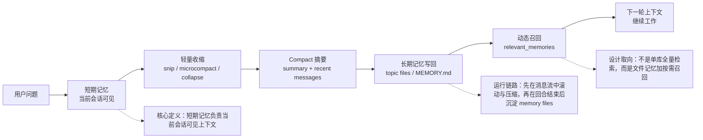
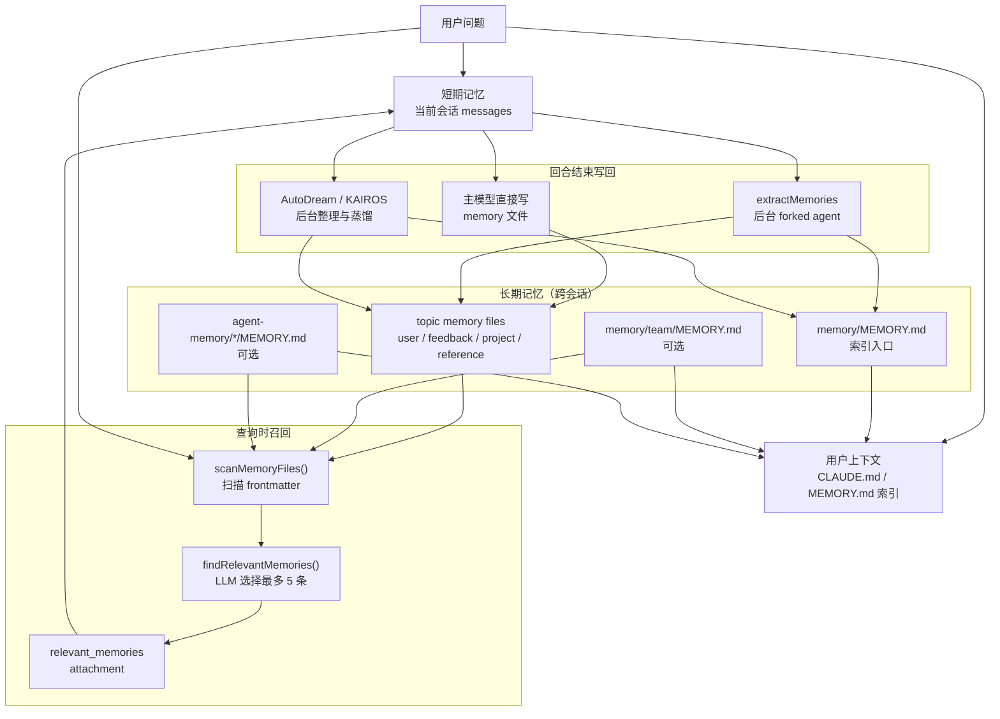
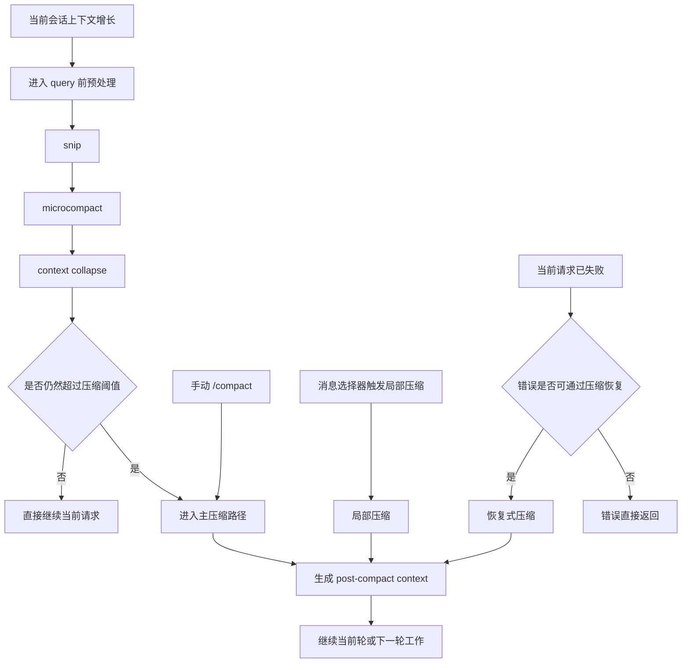
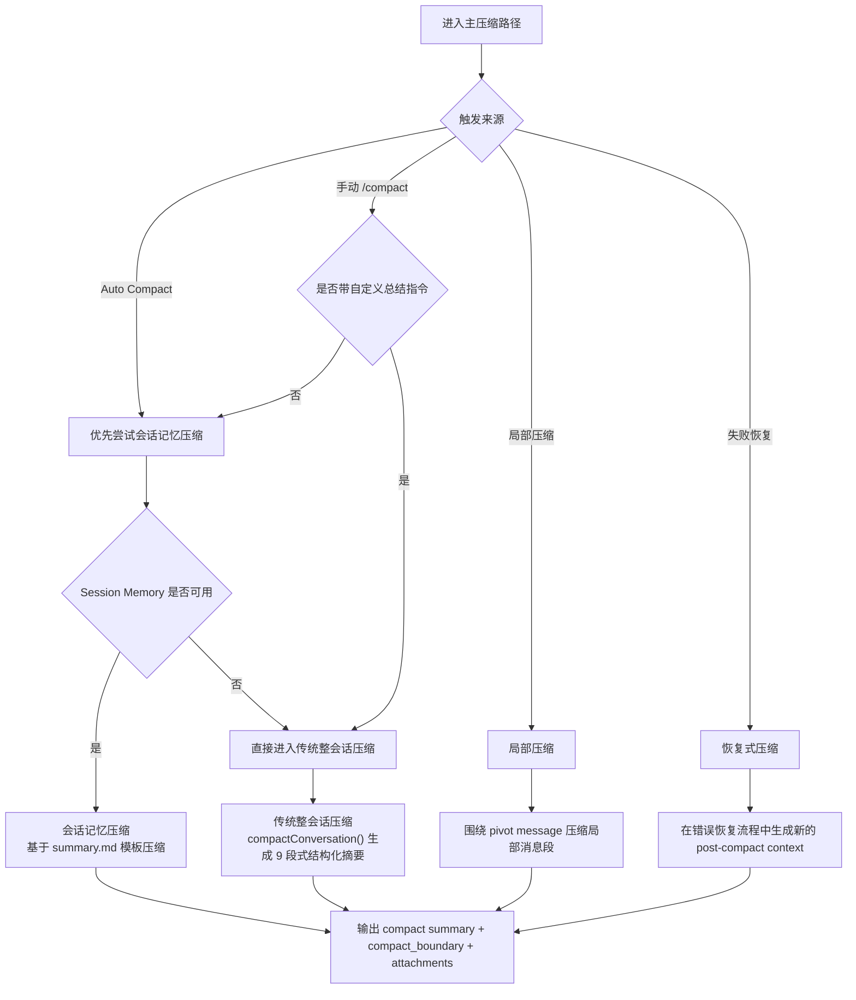
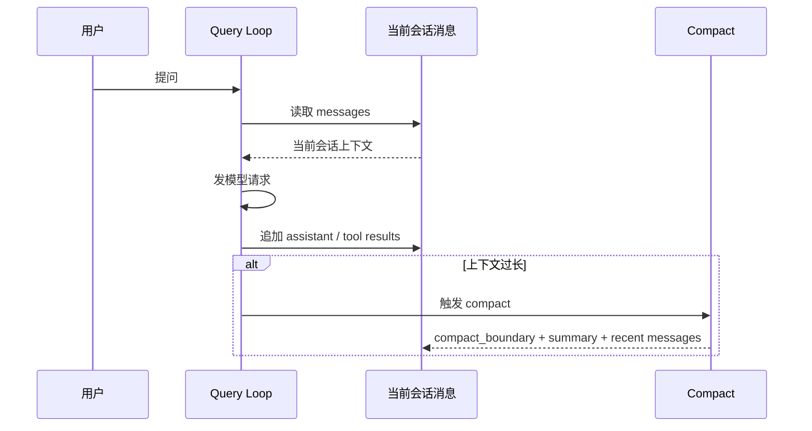
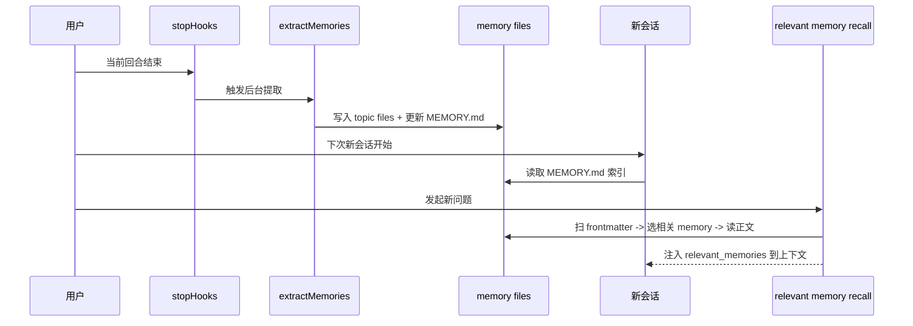

# Claude Code 长短期记忆架构设计文档

## 1. 文档目的

本文档用于说明 Claude Code 的长短期记忆架构，重点覆盖以下问题：

- 短期记忆的定义与作用范围
- 长期记忆的定义与作用范围
- 长短期记忆的触发条件
- 长期记忆的存储、读取、写入与上下文注入方式
- transcript、compact summary、`MEMORY.md`、topic memory file 之间的关系

总体结论如下：

> Claude Code 的记忆系统采用“会话级滚动短期记忆 + 文件型跨会话长期记忆 + 查询时动态召回 + 回合结束后的后台沉淀”的分层结构，不采用“单一数据库 + 一次性全量检索”的统一实现。

---

## 2. 总体设计结论

Claude Code 的记忆相关能力可以划分为三层：

1. **短期记忆**
   当前会话内的滚动上下文，解决“这次会话里模型现在还能看到什么”。该层随多轮对话累积，并受上下文窗口限制。

2. **长期记忆**
   跨会话保留的文件型记忆层，解决“下次新会话还要不要记得这件事”。该层存储在 `memory/` 目录下的 Markdown 文件中。

3. **transcript**
   原始对话流水记录，通常采用 `.jsonl` 格式。该层负责记录事件过程，不承担长期知识沉淀职责。

系统边界如下：

- **短期记忆**负责当前会话的可见上下文
- **长期记忆**负责跨会话的信息复用
- **transcript**负责原始过程留痕

### 2.1 一图读懂整套链路

如果只保留最重要的运行主线，Claude Code 的记忆架构可以概括为：

- 用户问题先进入当前会话的**短期记忆**
- 会话变长时先做 `snip`、`microcompact`、`context collapse` 等**轻量收缩**
- 必要时再通过 `compact` 生成摘要，保留最近消息继续滚动
- 回合结束后，把值得跨会话复用的信息写入 `memory files`
- 下次遇到相关问题时，再把少量长期记忆按相关性召回到当前上下文

下面这张图更适合作为阅读全文前的“总览导航图”：



这也是后文展开“短期记忆、长期记忆、动态召回、回合结束写回”四个子系统时的阅读导航。

---

## 3. 总体架构图



---

## 4. 短期记忆架构

## 4.1 短期记忆是什么

短期记忆定义为：**当前会话内可被模型直接访问的上下文集合**。

短期记忆由以下内容构成：

- 当前会话中已累积的 `messages`
- 系统提示词与上下文注入内容
- 本轮临时召回的相关 memory attachments

短期记忆的作用范围是当前会话，请求级呈现形式是模型本轮可见的上下文视图。

短期记忆解决的问题如下：

> 当前会话里，模型现在还能看到什么

---

## 4.2 同一个会话里如何跨多轮保留

同一会话中的短期记忆采用消息流累积机制。

跨轮保留路径如下：

```text
第 1 轮 messages
-> 第 2 轮 messages
-> 第 3 轮 messages
-> ...
```

每轮结束后，新产生的 assistant 回复、工具结果、attachments 会回写到会话状态，并进入下一轮输入。

在此基础上，系统还会持续对当前会话消息流执行上下文管理：

- 每轮请求前，从最近一次 `compact_boundary` 之后提取当前可用消息视图。
- 当前可用消息视图会继续经过 `tool result budget`、`snip`、`microcompact`、`context collapse` 等处理。
- 当上下文接近窗口上限时，系统触发 `compact`，将早期消息压缩为 summary 后继续滚动。
- `Session Memory` 会在后台将当前会话提炼为结构化 `summary.md`，并在 `compact` 时优先作为压缩输入。

因此，短期记忆的保持粒度是整个当前会话，而不是单次请求。

其工作形态可以总结为：以消息流跨轮累积为主线，以上下文裁剪、压缩和会话级结构化笔记为补充的滚动工作记忆。

### 4.2.1 当前会话中的轻量上下文收缩机制

当前会话中的轻量上下文收缩机制如下：

- `tool result budget`
  - 定义：针对单个请求中工具结果内容的预算控制机制。
  - 具体实现：系统按 API 级 user message 聚合 `tool_result` 内容大小；当同一消息中的工具结果总体积超过预算时，将较大的结果持久化到当前 session 目录下的 `tool-results/` 子目录中，并按 `tool_use_id` 保存为 `.txt` 或 `.json` 文件。写回上下文时，系统不再保留完整结果，而是替换为包含文件路径、原始大小和预览内容的引用文本。替换决策会按 `tool_use_id` 冻结并跨轮复用，以保持 prompt cache 稳定。

- `snip`
  - 定义：针对当前会话活动视图的选择性历史裁剪机制。
  - 具体实现：系统在每轮请求前对当前可用消息视图执行 `snipCompactIfNeeded(...)`。被 snip 的消息会从模型可见视图中过滤，但原始消息仍保留在 transcript 或 UI scrollback 中。resume 时，系统会根据 snip boundary 记录的 `removedUuids` 重放移除结果，避免重新加载完整未裁剪历史。

- `microcompact`
  - 定义：针对历史工具结果的轻量压缩机制。
  - 具体实现：系统在请求前扫描可压缩工具的历史结果，优先处理较旧的 `tool_result`。缓存可用时，系统通过 cache editing 删除旧工具结果而不直接改写本地消息内容；缓存不可用或触发时间阈值时，系统会将较旧工具结果的内容清空，只保留最近若干条结果。

- `context collapse`
  - 定义：针对当前会话上下文视图的折叠重建机制。
  - 具体实现：系统在 `autocompact` 之前对 `messagesForQuery` 调用 `applyCollapsesIfNeeded(...)`，将当前会话中的某一段旧消息 span 折叠为局部摘要占位，而不是直接把整段历史压成单一总摘要。折叠后的摘要内容、起止消息边界和 staged 状态会记录在 collapse store 中，后续每轮通过 `projectView()` 重建“局部摘要占位 + 其余未折叠消息”的可见视图；当请求因上下文过载失败时，系统会先提交 staged collapses，再决定是否进入更重的恢复压缩路径。

  示意如下：

  ```text
  折叠前：
  A -> B -> C -> D -> E -> F

  折叠后模型看到的视图：
  A -> [B~D 的折叠摘要] -> E -> F
  ```

---

### 4.2.2 Session Memory 子系统

除了直接保留在 `messages` 里的滚动上下文，Claude Code 还有一套独立的 session memory 子系统。

session memory 的定义如下：

- 作用范围是单个当前 session
- 存储形态是当前 session 自己的 `summary.md`
- 更新方式是后台按阈值持续提炼当前会话
- 主要用途是为后续 compact 提供更稳定的会话摘要基础

其运行机制如下：

1. `initSessionMemory()` 在启动阶段注册 post-sampling hook
2. 每轮结束后，系统检查是否满足 session memory 更新阈值
3. 达到阈值时，后台 forked agent 更新当前 session 的 `summary.md`
4. 当会话太长触发 compact 时，系统优先尝试复用这份 session memory

因此，session memory 与 compact summary 的关系如下：

- `session memory`
  - 会话进行过程中持续维护的结构化会话笔记
- `compact summary`
  - 发生 compact 时写回消息流的摘要结果

二者不是同一个对象，关系是“前者可被后者优先复用”。

---

## 4.3 会话太长时会发生什么

当当前会话长度接近上下文窗口上限时，系统触发 compact。

compact 的输出结构包括：

- `compact_boundary`
- 一条或多条 `summaryMessages`
- 少量保留消息
- 若干必要的 attachments

compact 触发后的结果如下：

- **模型当前可见内容** 可能不再包含早期原文
- **后续继续滚动的上下文** 变为摘要后的会话视图

短期记忆的压缩路径如下：

**原文消息流 -> compact summary -> 继续滚动**

---

## 4.4 短期摘要是怎么被“查询”的

短期摘要不通过外部检索流程访问，其使用方式是会话内直接回写。

处理流程如下：

1. compact 发生时生成一条 summary user message
2. summary 被直接写回当前会话消息流
3. 下一轮 query 从 compact boundary 之后继续取消息

短期摘要在后续轮次中的呈现方式如下：

**当前会话 messages 的一部分**

示意如下：

```text
压缩前：
很多轮原始消息

压缩后：
compact_boundary + summary + recent messages

下一轮：
模型直接读这条 summary
```

---

## 4.5 短期记忆什么时候触发摘要

短期摘要不在每轮执行。

触发逻辑如下：

1. 每轮真正发模型前执行上下文检查
2. 系统估算当前上下文 token
3. 当 token 数超过 auto-compact 阈值时触发摘要生成

补充触发条件如下：

- 用户手动执行 `/compact`
- 已发生 `prompt too long` 后的 reactive compact

短期摘要的机制定位如下：

**上下文窗口管理机制**

不属于跨会话长期记忆机制。

---

## 4.6 Claude Code 有几种压缩路径

Claude Code 的压缩机制可以分为两层：

1. **真正产出 compact summary 的主压缩路径**
2. **在 compact 之前执行的轻量上下文收缩路径**

本文将 `compactConversation()` 路径所要求的九个固定摘要 section 统一记为**9 段式结构化摘要**。这九个 section 为：

1. `Primary Request and Intent`
2. `Key Technical Concepts`
3. `Files and Code Sections`
4. `Errors and fixes`
5. `Problem Solving`
6. `All user messages`
7. `Pending Tasks`
8. `Current Work`
9. `Optional Next Step`

整体压缩链路如下：



主压缩路径分流如下：



### 4.6.1 会话记忆压缩（Session Memory Compaction）

会话记忆压缩是自动压缩时优先尝试的路径，也是手动 `/compact` 在无自定义 summarization instructions 时优先尝试的路径。

该路径的处理方式如下：

1. 系统先读取当前 session memory 文件
2. 以 `summary.md` 的结构化内容作为压缩基础
3. 对超长 section 执行截断，避免 session memory 占满 post-compact token 预算
4. 将截断后的 session memory 包装为 compact summary message
5. 与 `compact_boundary`、保留消息、attachments 一起构成 post-compact context

这条路径的 summary 结构不是本文所称的 9 段式结构化摘要，而是 session memory 模板。默认模板包含以下 section：

- `Session Title`
- `Current State`
- `Task specification`
- `Files and Functions`
- `Workflow`
- `Errors & Corrections`
- `Codebase and System Documentation`
- `Learnings`
- `Key results`
- `Worklog`

各 section 的主要功能如下：

- `Session Title`：生成高信息密度的会话标题，用于快速识别当前 session 的主题与工作范围。
- `Current State`：记录当前正在处理的事项、未完成任务和紧接着要执行的下一步。更新 prompt 明确要求这一节始终反映最新状态，用于 compact 之后恢复工作连续性。
- `Task specification`：记录用户要求构建什么、关键设计决策是什么、有哪些解释性上下文需要保留。
- `Files and Functions`：记录重要文件、函数和模块，以及它们为什么与当前任务相关。这一节承担会话内代码索引的作用，帮助 compact 后快速恢复代码上下文。
- `Workflow`：记录常用 bash 命令、执行顺序以及输出的解释方式。这一节用于保留实际操作路径，减少恢复会话后重复摸索命令链路。
- `Errors & Corrections`：记录出现过的错误、修复方式、用户纠正过的内容，以及已经验证失败的路径。该 section 在超预算压缩提醒中被列为优先保留项，用于减少重复犯错。
- `Codebase and System Documentation`：记录重要系统组件、代码结构和模块之间的协作关系。这一节承担局部架构说明的作用，帮助后续压缩结果继续保留系统层理解。
- `Learnings`：记录已经证明有效的方法、效果不佳的方法以及需要规避的做法。这一节要求避免与其他 section 重复，专门沉淀经验性结论。
- `Key results`：记录用户明确要求产出的最终结果，例如答案、表格、文档或其他交付物。更新 prompt 要求这一节保留完整、精确的结果内容。
- `Worklog`：以简洁的步骤列表记录本次会话已经做过的操作和推进过程。这一节承担时间线索引作用，方便 compact 后回看已经尝试过哪些步骤。

该路径的特点如下：

- 压缩成本较低
- 可复用会话期间已沉淀的 session memory
- 更偏向“会话工作笔记驱动”的压缩方式

### 4.6.2 传统整会话压缩（`compactConversation()`）

传统整会话压缩是 Claude Code 的整会话压缩路径，对应 `compactConversation()`。

该路径的处理方式如下：

1. 系统构造 compact prompt
2. 模型基于当前会话生成结构化 summary
3. summary 被包装为 compact summary message
4. 系统生成 `compact_boundary`
5. summary、attachments、hook results 被重组为 post-compact context

这条路径使用的是本文前面定义的 9 段式结构化摘要。

该路径的特点如下：

- 结构最完整
- 对延续复杂开发任务最友好
- summary 中要求保留文件名、代码片段、错误修复、用户原话与下一步任务

### 4.6.3 局部压缩（Partial Compact）

局部压缩是局部压缩路径，对应 `partialCompactConversation()`。

该路径不压整个会话，而是围绕某个选定消息位置对会话切片执行压缩。支持两个方向：

- `from`
  - 保留选中位置之前的消息，压缩之后的消息
- `up_to`
  - 压缩选中位置之前的消息，保留之后的消息

该路径的处理方式如下：

1. 用户或界面选择一个 pivot message
2. 系统根据 `from` 或 `up_to` 切分“待压缩消息”和“待保留消息”
3. 模型对待压缩部分生成 partial compact summary
4. summary 与保留消息重新拼接为新的上下文视图

该路径使用的 prompt 结构与传统整会话压缩接近，但摘要范围只覆盖局部消息段。

该路径的特点如下：

- 适合定点压缩
- 适合保留最近工作段落的原文
- 支持围绕某条消息做前缀压缩或后缀压缩

### 4.6.4 恢复式压缩（Reactive Compact）

恢复式压缩是失败恢复路径，不是常规的主动压缩路径。

该路径的触发时机如下：

- 当前请求已发生 `prompt too long`
- 当前请求因图片、PDF 或多媒体尺寸问题导致上下文不可继续发送

该路径的处理方式如下：

1. 当前请求先失败
2. 系统识别出可恢复的上下文过载错误
3. 进入 reactive compact 恢复流程
4. 生成新的 post-compact context
5. 基于压缩后的上下文重试当前工作

该路径的特点如下：

- 作用是恢复已失败请求
- 目标是让当前轮在不丢失主要上下文的情况下继续执行
- 属于错误恢复机制

---

## 5. 长期记忆架构

## 5.1 长期记忆是什么

长期记忆定义为 Claude Code 的**跨会话记忆层**。

长期记忆的存储单元如下：

**按项目落盘在 `memory/` 目录中的 Markdown 文件体系**

其中，长期记忆系统中的 topic memory files 使用四类 taxonomy 进行分类：

- `user`
- `feedback`
- `project`
- `reference`

长期记忆解决的问题如下：

> 下次新会话还要不要记得这件事

读取原则如下：

> 新会话读取的是同一项目下的 memory 文件集合，因此可以复用跨会话信息。

---

## 5.2 长期记忆的存储形态

主 memory 系统的目录结构通常如下：

```text
~/.claude/
└── projects/
    └── <sanitized-project-root>/
        └── memory/
            ├── MEMORY.md
            ├── user_role.md
            ├── feedback_testing.md
            ├── project_release_freeze.md
            ├── reference_dashboards.md
            ├── team/
            │   ├── MEMORY.md
            │   └── ...
            └── logs/
                └── YYYY/
                    └── MM/
                        └── YYYY-MM-DD.md
```

各目录与文件的职责如下：

- `memory/MEMORY.md`
  - 主索引入口
- `memory/*.md`
  - topic memory files，承担长期记忆主体内容
- `memory/team/MEMORY.md`
  - team memory 的索引入口，可选
- `memory/logs/...`
  - KAIROS 模式下的 daily log，可选

agent 还可以拥有独立 memory 空间：

```text
<memoryBase>/agent-memory/<agentType>/MEMORY.md
<cwd>/.claude/agent-memory/<agentType>/MEMORY.md
<cwd>/.claude/agent-memory-local/<agentType>/MEMORY.md
```

---

## 5.3 单个 memory 文件长什么样

单个 memory 文件采用 Markdown 与 frontmatter 组合格式。

典型结构如下：

```md
---
name: feedback_testing
description: integration tests should hit a real database
type: feedback
---

Integration tests must hit a real database, not mocks.

Why: mocked tests once passed while the production migration failed.

How to apply: when adding or revising tests in this project, prefer DB-backed integration coverage.
```

字段定义如下：

- `name`
  - 记忆主题名
- `description`
  - 一行摘要，用于相关性选择
- `type`
  - 记忆类型

支持的主类型如下：

- `user`
- `feedback`
- `project`
- `reference`

---

## 5.4 `MEMORY.md` 是什么

`MEMORY.md` 定义为长期记忆的索引入口文件。

它承担以下角色：

- 目录
- 索引
- 入口文件

其职责通常包括：

- 提供长期记忆概览
- 链接各个 topic memory file

文件分工如下：

- **长期记忆系统**
  - `MEMORY.md + topic memory files`
- **`MEMORY.md`**
  - 索引入口
- **topic memory files**
  - 主体内容

---

## 5.5 长期记忆不是什么

长期记忆的排除项包括：

- 代码结构、架构、文件路径
- git 历史、近期改动
- 当前会话中的临时任务状态
- 已经写进 `CLAUDE.md` 的内容

排除这些信息的原因如下：

- 这类信息通常可从当前 repo 直接推导
- 这类信息写入长期记忆后容易过时
- 过时记忆会影响后续判断

长期记忆更适合保存以下信息：

- 用户角色与偏好
- 用户给出的行为反馈
- 不在代码中的项目上下文
- 外部系统入口与参考信息

---

## 6. 长期记忆什么时候写入

长期记忆的写入不由上下文长度触发。

主要写入路径共有六类。

## 6.1 用户显式要求“记住这个”

当用户明确提出以下指令时，主模型会根据 memory 提示词直接写入或删除相关 memory 文件：

- 记住这个
- 以后别这样做
- 以后一直这样做
- 忘掉某条记忆

该路径是最直接的长期记忆写入触发方式。

---

## 6.2 每个完整回合结束后的自动提取

自动提取定义为长期记忆的主写入路径。

其工作流如下：

1. 当前回合完成
2. `handleStopHooks()` 触发
3. 后台 fire-and-forget 调用 `executeExtractMemories()`
4. 受限 forked agent 分析最近对话
5. 抽取可跨会话保留的信息
6. 写入 topic memory files，并更新 `MEMORY.md`

该机制的运行约束包括：

- 仅在主线程运行
- subagent 不执行该流程
- bare / simple 模式不执行该流程
- 若主模型本轮已直接写过 memory，后台提取将跳过，避免重复写入

该路径对应的系统职责如下：

**回合结束后的语义沉淀**

---

## 6.3 `/memory` 手动编辑

用户执行 `/memory` 时，系统会打开 memory 文件选择器，并通过本地编辑器直接编辑 memory 文件。

该路径属于人工维护长期记忆，不属于自动抽取。

---

## 6.4 `/remember` 触发审查与整理

`/remember` 定义为记忆治理入口。其职责包括：

- 审查 auto-memory
- 提议将内容提升到 `CLAUDE.md`、`CLAUDE.local.md` 或 team memory
- 检查重复、冲突与过时项

该路径不承担默认自动保存职责，承担人工审查职责。

---

## 6.5 KAIROS 模式下写 daily log

在 assistant 长会话模式中，新增记忆优先写入按日期组织的 daily log：

```text
memory/logs/YYYY/MM/YYYY-MM-DD.md
```

后续整理流程再将其蒸馏为 topic files 与 `MEMORY.md`。

该模式采用“先追加记录、后离线整合”的原理。KAIROS 会话是长生命周期会话，因此写入阶段不直接维护 `MEMORY.md` 活索引，而是先把新增信息按天追加到日志，再由独立的 `/dream` 流程做归并、去重和索引更新。

该路径承担会话期增量记录职责。

---

## 6.6 AutoDream 做二阶段整合

AutoDream 定义为长期记忆的二阶段整合机制。

在满足门控条件时，系统会在后台回顾：

- 已有 memory files
- 多个 session
- 会话 transcript

其处理动作包括：

- 合并
- 去重
- 修正
- 精炼

职责分工如下：

- `extractMemories`
  - 回合级增量写入
- `AutoDream`
  - 跨会话整合、去重与精炼

---

## 7. 长期记忆什么时候读取

长期记忆采用分层读取策略，不执行全量全文加载。

## 7.1 会话启动时的静态读取

在会话上下文构建阶段，系统通常会先读取：

- `memory/MEMORY.md`
- 可选的 `memory/team/MEMORY.md`

随后将其作为 `userContext` 的一部分注入请求。

该层的特征如下：

- 索引注入
- 不注入全部 topic memory 文件正文

---

## 7.2 每个用户 turn 的动态相关性召回

动态相关性召回是条件触发机制，不是每个用户 turn 都会执行。

触发条件通常包括：

- auto memory 已启用
- 相关 feature 已开启
- 当前存在真实用户输入
- 输入不是过短的单词级 prompt
- 当前会话中已注入的 memory 总量未超预算

如果这些条件不满足，本轮将直接跳过动态召回。

动态召回流程分为三步。

### 第一步：扫描 memory 文件头

系统会先决定扫描范围：

- 如果用户输入中显式 `@agent`，只扫描对应 agent 的 memory 目录
- 如果没有 `@agent`，扫描默认 auto memory 目录

系统会递归扫描 memory 目录下的 `.md` 文件，但：

- 排除 `MEMORY.md`
- 只读 frontmatter
- 不读取全部正文

该阶段产出的元数据包括：

- filename
- description
- type
- mtime

### 第二步：选择最相关的少数文件

系统会将 memory manifest 交给 sideQuery 进行相关性选择，选择结果满足以下约束：

- 最多选择 5 个
- 若相关性不足，可以不选择任何文件

### 第三步：只读取入选文件的正文

只有入选的少数 topic memory files 才会读取正文，并包装成 `relevant_memories` attachment。

在正文读取和注入前，系统还会执行去重：

- `alreadySurfaced`
  - 过滤本 session 已展示过的 memory 文件
- `readFileState`
  - 过滤模型已经主动读过的 memory 文件

长期记忆的查询模式如下：

**先全局扫描元数据，再局部读取正文**

不采用以下方式：

**将全部长期记忆全文一次性读入上下文**

---

## 7.3 读取阶段的特殊行为分支

除了静态读取和动态召回，memory 读取阶段还包含两条特殊行为分支。

### 7.3.1 忽略 memory

如果用户明确要求“ignore memory”或“do not use memory”，系统会按 `MEMORY.md` 为空来处理。

该分支的行为约束如下：

- 不应用已记住的事实
- 不引用 memory 内容
- 不把当前观察结果与 memory 做比较
- 不在回答中提及 memory 里的内容

该分支用于覆盖正常的 memory 读取行为。

### 7.3.2 搜索过去上下文

在相关 feature gate 开启时，memory prompt 还会注入一节 `Searching past context` 指引。

这条分支的作用如下：

- 当 `MEMORY.md` 和 topic memory files 不能提供足够上下文时
- 系统允许进一步搜索过去上下文

优先级顺序如下：

1. 先搜索 memory 目录中的 topic files
2. 再搜索 session transcript `.jsonl`

其中，session transcript 属于最后手段，原因是：

- 文件体积更大
- 检索更慢
- 适合通过错误信息、文件路径、函数名等窄关键词进行定位

因此，这条分支扩展了 memory 系统的读取范围：读取来源不仅包括 `MEMORY.md` 和 topic memory files，也可以在需要时延伸到 past context logs。

---

## 8. 长期记忆如何插入当前模型上下文

长期记忆进入当前模型上下文的路径有两类。

## 8.1 静态索引注入

静态索引注入适用于 `MEMORY.md`。

流程如下：

1. `getMemoryFiles()` 读取 `AutoMem` / `TeamMem`
2. `getClaudeMds()` 将内容拼接成文本
3. `getUserContext()` 返回 `{ claudeMd, currentDate }`
4. `prependUserContext()` 将其转换为最前面的 meta user message

该路径的上下文角色如下：

**`MEMORY.md` 作为上下文背景材料进入请求**

---

## 8.2 动态 relevant memory attachment 注入

动态 relevant memory attachment 注入适用于 topic memory files。

流程如下：

1. prefetch 找到相关 memories
2. query loop 在 collect 点将其插入为 attachment
3. `normalizeMessagesForAPI()` 将 `relevant_memories` attachment 展开为若干条 meta user messages
4. 模型读取展开后的 memory 正文

该路径的上下文角色如下：

**具体 memory 文件正文作为本轮临时提醒进入请求**

---

## 9. transcript 和记忆是什么关系

三者的职责边界如下：

### 9.1 transcript

transcript 是原始会话流水记录，覆盖以下内容：

- 用户消息
- assistant 回复
- tool use / tool result
- 运行事件
- compact 边界

其定位是日志层。

### 9.2 短期摘要

短期摘要是会话内上下文压缩结果，职责包括：

- 控制 token 消耗
- 保持当前会话连续性

其定位是窗口管理层。

### 9.3 长期记忆

长期记忆是从多轮对话中提炼出的、可跨会话复用的知识。

其定位是沉淀与复用层。

区分方式如下：

- `transcript`
  - 原始流水
- `compact summary`
  - 当前会话摘要
- `memory files`
  - 跨会话知识

---

## 10. 一个完整生命周期示意

### 10.1 同一会话内



### 10.2 跨会话



---

## 11. 设计取向与工程权衡

Claude Code 没有将记忆主系统实现为“统一向量库 + 全量语义检索”，而是采用文件型 memory store。

该设计的优势如下：

- **可审计**
  - 用户可以直接查看已保存的记忆内容
- **可编辑**
  - `/memory` 支持直接修改记忆文件
- **跨会话天然持久化**
  - 新会话复用同一项目的 memory 目录
- **与代码仓库分工清晰**
  - 代码事实从 repo 读取，非代码事实写入 memory
- **非阻塞**
  - recall 与 extraction 尽量不阻塞主交互

对应代价如下：

- 缺少统一数据库式的结构化检索能力
- 需要依赖 frontmatter 与 sideQuery 完成相关性选择
- 需要持续处理记忆过时、重复与冲突问题

---

## 12. 与 Reflexion 风格的区别

Claude Code 的架构与 Reflexion 风格的 `trial -> reflection -> retry` 机制不同。

Claude Code 采用分层记忆架构：

- 会话内
  - 通过 compact / session memory 保持连续性
- 跨会话
  - 通过 typed memory files 保持长期沉淀
- 回合结束
  - 通过 `extractMemories` 执行后台抽取
- 更长周期
  - 通过 AutoDream 执行整理与蒸馏

该设计保留了“从经验中总结并复用”的能力，但未将整个系统实现为单一 verbal reinforcement 回路。

工程化表述如下：

> Claude Code 采用的是可见、可编辑、可治理的文件型记忆体系，而不是自由反思文本驱动的单回路记忆体系。

---

## 13. 关键源码入口

如需继续阅读源码，建议按以下顺序展开：

1. `src/memdir/paths.ts`
   - memory 目录解析、开关与路径规则
2. `src/memdir/memoryTypes.ts`
   - 记忆类型、保存规则、读取规则
3. `src/memdir/memdir.ts`
   - memory prompt、写入约束、KAIROS daily log 逻辑
4. `src/utils/claudemd.ts`
   - `MEMORY.md` 与 `CLAUDE.md` 的读取装配
5. `src/utils/attachments.ts`
   - relevant memory prefetch 与 attachment 注入
6. `src/memdir/memoryScan.ts`
   - frontmatter 扫描
7. `src/memdir/findRelevantMemories.ts`
   - 相关性选择
8. `src/services/extractMemories/extractMemories.ts`
   - 自动提取与后台写回
9. `src/query.ts`
   - query 主流程、prefetch consume、compact 后续滚动
10. `src/query/stopHooks.ts`
    - 回合结束时的 extract / autodream 触发入口

---

## 14. 最终总结

Claude Code 的长短期记忆由一套分层架构组成：

- **短期记忆**
  - 当前会话滚动上下文
  - 解决“这次会话里模型现在还能看到什么”
  - 过长时执行摘要压缩
- **长期记忆**
  - 跨会话文件型 memory store
  - 解决“下次新会话还要不要记得这件事”
  - 使用 `MEMORY.md` 提供索引，使用 topic memory files 承担主体内容
- **读取**
  - 启动阶段静态加载索引
  - 每轮按相关性动态召回正文
- **写入**
  - 显式记忆、自动提取、人工编辑、后台整理并存

总括如下：

> Claude Code 的短期记忆负责当前会话的可见上下文，长期记忆负责跨会话的信息复用；前者依赖会话消息流与上下文压缩，后者依赖可治理的 Markdown 文件体系与按需召回。
