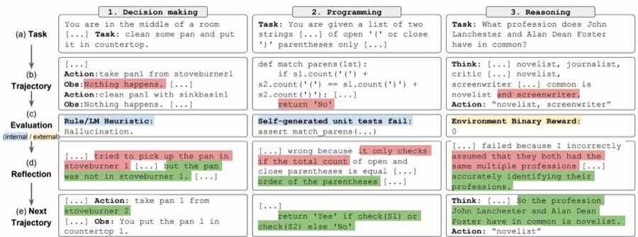
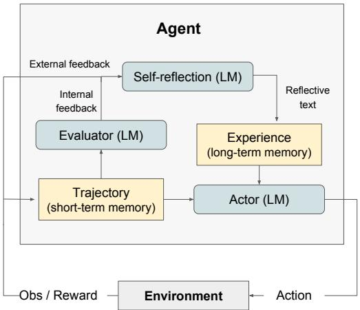
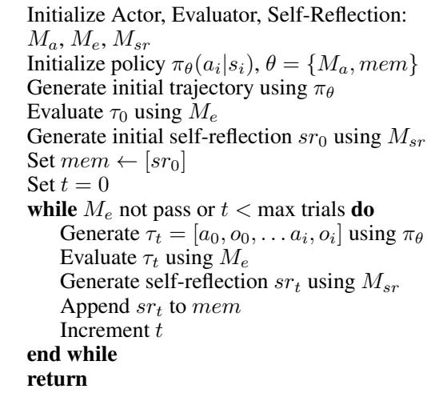
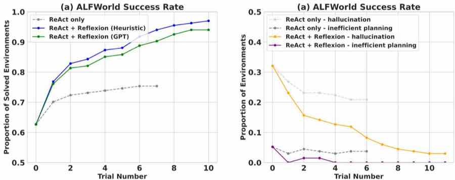
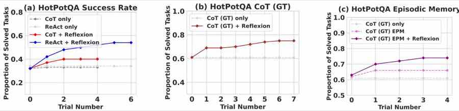
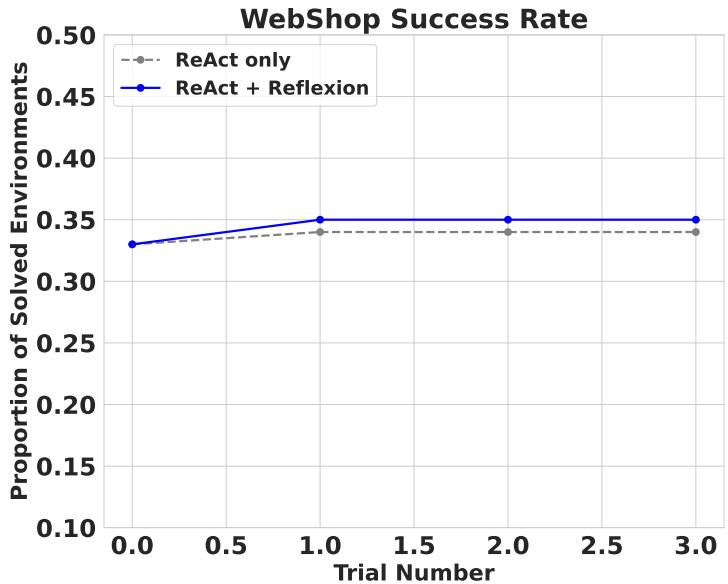

# Reflexion：带有语言式强化学习的语言代理

Noah Shinn Northeastern University noahshinn024@gmail.com

Federico Cassano Northeastern University cassano.f@northeastern.edu

Edward Berman Northeastern University berman.ed@northeastern.edu

Ashwin Gopinath Massachusetts Institute of Technology agopi@mit.edu

Karthik Narasimhan

Princeton University karthikn@princeton.edu

Shunyu Yao Princeton University shunyuy@princeton.edu

# 摘要

大型语言模型（LLM）越来越多地被用作面向目标的智能体，与外部环境（如游戏、编译器、API）进行交互。然而，这类语言代理仍然很难通过试错快速而高效地学习，因为传统强化学习方法往往需要大量训练样本以及昂贵的模型微调。我们提出了 Reflexion，这是一种新的框架，它不通过更新权重来强化语言代理，而是通过语言反馈来实现强化。具体来说，Reflexion 代理会对任务反馈信号进行语言化反思，并将这些反思文本保存在情景记忆缓冲区中，以便在后续试验中做出更好的决策。Reflexion 足够灵活，可以结合多种类型（标量值或自由文本）和多种来源（外部或内部模拟）的反馈信号，并在多类任务上都显著优于基线代理，包括序列决策、代码生成和语言推理。例如，Reflexion 在 HumanEval 编程基准上取得了 $91 \%$ 的 pass $@ 1$ 准确率，超过此前达到 $80 \%$ 的最优模型 GPT-4。我们还进行了关于不同反馈信号、反馈整合方式和代理类型的消融与分析研究，并据此总结了它们对性能的影响。代码、演示和数据集已发布于 https://github.com/noahshinn024/reflexion。

# 1 引言

ReAct [30]、SayCan [1]、Toolformer [22]、HuggingGPT [23]、generative agents [19] 和 WebGPT [17] 等近期工作表明，以大型语言模型（LLM）为核心构建自治决策代理是可行的。这些方法使用 LLM 生成文本和“动作”，并将其转化为 API 调用，在环境中执行。由于它们依赖参数量极其庞大的模型，现阶段通常只能依靠 in-context 示例来“教”代理完成任务；而像基于梯度下降的强化学习这类更传统的优化方案，则需要大量算力和时间。

本文提出一种替代方法 Reflexion，它利用语言式强化来帮助代理从先前失败中学习。Reflexion 将环境给出的二元或标量反馈转化为文本摘要形式的语言反馈，并把它作为下一轮任务中的额外上下文提供给 LLM 代理。这类自我反思反馈相当于一种“语义梯度”信号，为代理指出明确的改进方向，帮助其从过去错误中学习并在后续任务中表现得更好。这类似于人类以少样本方式迭代完成复杂任务的过程：通过回顾过去的失败，为下一次尝试形成更好的行动计划。例如，在图 1 中，Reflexion 代理通过试错与自我反思，逐步优化自身行为，从而解决决策、编程和推理任务。

生成有用的反思反馈并不容易，因为这要求模型既能理解自己错在何处（即 credit assignment problem，归因分配问题 [25]），又能给出包含可执行改进建议的总结。我们探索了三种方式来实现这一点：简单的环境二元反馈、面向常见失败模式的预定义启发式规则，以及自我评估机制，例如用 LLM 做二元分类（决策任务）或让模型自行编写单元测试（编程任务）。在所有实现中，评估信号都会被放大为自然语言经验总结，并可存入长期记忆。

与更传统的策略学习或价值学习等强化学习方法相比，Reflexion 具有几个优势：1）它非常轻量，无需对 LLM 进行微调；2）它可以接纳更细粒度、更具针对性的反馈（例如具体动作应如何修改），而不仅仅是难以精确做 credit assignment 的标量或向量奖励；3）它为过往经验提供了更显式、更可解释的情景记忆形式；4）它能为未来回合的动作选择提供更明确的提示。同时，它也存在局限：它依赖 LLM 的自评估能力（或启发式规则），而且无法提供形式化的成功保证。不过，随着 LLM 能力持续提升，我们预计这种范式会越来越有效。

我们在三类任务上进行了实验：（1）决策任务，用于测试长轨迹上的连续动作选择；（2）推理任务，用于测试知识密集型的单步生成改进；（3）编程任务，用于教代理高效使用编译器和解释器等外部工具。在这三类任务中，我们都观察到 Reflexion 代理是更好的决策者、推理者和程序员。更具体地说，在 12 次迭代学习步骤之后，Reflexion 在 AlfWorld [24] 决策任务上相对强基线提升了绝对值 $22 \%$；在 HotPotQA [28] 推理问题上提升了 $20 \%$；在人类评测编程基准 HumanEval [6] 上最多提升了 $11 \%$。

总结来说，我们的贡献如下：

- 我们提出了 Reflexion，这是一种新的“语言式”强化范式，它将策略参数化为“代理记忆编码 + 一组 LLM 参数”的组合。
- 我们探索了 LLM 自我反思这一涌现能力，并通过实验表明，自我反思对于在少量试验中学习复杂任务极其有效。
- 我们提出了 LeetcodeHardGym，这是一个代码生成 RL gym 环境，包含 19 种编程语言下的 40 道高难度 Leetcode 题目。
- 我们证明 Reflexion 在多个任务上都优于强基线，并在若干代码生成基准上取得了新的最优结果。

# 2 相关工作

**推理与决策。** Self-Refine [15] 提出了一种迭代式自我优化框架，通过自我评估来自主改进生成结果。这种自评估和自改进过程建立在给定任务约束之上，例如“怎样把这个生成结果改得更积极一些”。Self-Refine 很有效，但仅限于单次生成的推理任务。Pryzant 等人 [21] 做了类似的语义提示优化，但同样局限于单次生成任务。Paul 等人 [20] 通过微调 critic 模型，在轨迹中提供中间反馈，以改进推理答案。Xie 等人 [27] 在动作空间上使用随机束搜索，以更高效地执行决策搜索，并借助自我评估带来的前瞻优势。Yoran 等人 [31] 和 Nair 等人 [16] 使用决策模型在多个生成之间进行推理。Kim 等人 [10] 使用固定步数的重试模式，但没有显式评估步骤。Goodman [9] 则加入了一个定性评估步骤，用来提出对上一轮生成的优化建议。本文表明，这些思想都可以通过自我反思进一步增强，从而构建持久化的反思经验记忆，使代理能够识别自身错误，并随着时间推移从错误中总结出可复用的经验教训。

  
图 1：Reflexion 适用于决策任务（4.1）、编程任务（4.3）和推理任务（4.2）。

与推理和决策相关工作的核心对比可以概括为：Self-Refine [15] 擅长自我优化，但并不面向多步决策；Beam Search [27] 更偏向搜索与决策；而 Reflexion 将自我反思、决策、反馈信号以及记忆机制统一在同一个框架之中。

**编程。** 过去和近期不少工作都采用了测试驱动开发或代码调试的变体。AlphaCode [14] 会在隐藏测试集上评估一组候选生成。CodeT [5] 使用模型自生成的单元测试来给函数实现打分。Self-Debugging [7] 引入了调试组件，在执行环境反馈的基础上改进已有实现。CodeRL [12] 将问题置于 actor-critic 的 RL 框架中，根据执行环境的反馈调试程序。AlphaCode、Self-Debugging 和 CodeRL 在修复相对简单的程序错误方面是有效的，但它们依赖真实测试集，因此不满足严格的 pass $@ 1$ 评测条件；同时，它们也没有使用自我反思去弥合“识别错误”和“改进实现”之间的鸿沟。CodeT 虽然不访问隐藏测试集，但没有实现一个能持续改进代码编写能力的自学习步骤。

# 3 Reflexion：通过语言反思进行强化

我们为 Reflexion 设计了一个模块化框架，其中包含三个不同模型：Actor，记为 $M _ { a }$，负责生成文本和动作；Evaluator，记为 $M _ { e }$，负责为 $M _ { a }$ 生成的输出打分；Self-Reflection 模型，记为 $M _ { s r }$，负责生成语言化的强化信号，帮助 Actor 自我改进。下面我们会依次介绍这些模型，并说明它们在 Reflexion 框架中如何协同工作。



  
图 2：（a）Reflexion 示意图。（b）Reflexion 强化算法。

**Actor。** Actor 建立在大型语言模型（LLM）之上，通过专门设计的提示，在状态观测条件下生成所需的文本和动作。类似传统基于策略的强化学习设定，我们在时间步 $t$ 从当前策略 $\pi _ { \theta }$ 中采样动作或生成 $a _ { t }$，并从环境接收观测 $o _ { t }$。我们探索了多种 Actor 形式，包括 Chain-of-Thought [26] 与 ReAct [30]。这些不同的生成模型使我们能够从不同角度分析 Reflexion 中的文本生成与动作生成，并评估其有效性。此外，我们还为 Actor 增加了一个记忆组件 `mem`，为代理提供更多上下文。这一改动受到 Brooks 等人 [3] 的启发，他们提出了基于 in-context learning 的策略迭代方法。关于该记忆如何构建，我们将在下文说明。

**Evaluator。** Evaluator 在 Reflexion 中负责评估 Actor 输出的质量。它接收一条生成轨迹作为输入，并计算一个奖励分数，反映其在当前任务语境下的表现。由于要在语义空间中定义有效的价值函数和奖励函数十分困难，我们尝试了多种 Evaluator 变体。对于推理任务，我们采用 exact match（EM）评分，确保生成结果与期望答案尽量一致；对于决策任务，我们采用面向具体评估标准的预定义启发式函数；此外，我们还实验了把另一个 LLM 实例本身作为 Evaluator，用它给决策和编程任务打分。这样多元化的 Evaluator 设计让我们得以比较不同打分策略在多类任务中的适用性与效果。

**Self-Reflection。** Self-Reflection 模型同样由 LLM 实例化，在 Reflexion 框架中负责生成面向未来试验的语言化自我反思。给定稀疏奖励信号（例如成功/失败的二元状态）、当前轨迹以及持久记忆 `mem`，自我反思模型会生成细致、具体的反馈。这类反馈比单纯的标量奖励包含更多可操作信息，因此会被存入代理的记忆中。例如，在一个多步决策任务里，当代理收到失败信号时，它可以推断某个动作 $a _ { i }$ 导致了后续动作 $a _ { i + 1 }$ 和 $a _ { i + 2 }$ 的连续错误。于是，代理可以用语言明确指出自己原本应采取另一个动作 $a _ { i } ^ { \prime }$，该动作会进一步导向更合理的后续动作 $a _ { i + 1 } ^ { \prime }$ 和 $a _ { i + 2 } ^ { \prime }$，并把这段经验写入记忆。在后续试验中，代理就能在时间步 $t$ 利用这些过去经验，转而选择动作 $a _ { i } ^ { \prime }$。这一“试错 - 自我反思 - 记忆持久化”的迭代过程，使代理能够通过信息量更丰富的反馈信号，在各种环境中快速提升决策能力。

**Memory。** Reflexion 的核心之一是短期记忆与长期记忆。推理时，Actor 会同时依赖短期和长期记忆来做决策，这类似于人类既会记住最近的细节，也会调用长期积累的重要经验。在 RL 设定中，轨迹历史充当短期记忆，而 Self-Reflection 模型的输出则构成长期记忆。这两类记忆共同为代理提供上下文：既包含足够具体的局部信息，又融入跨多次试验形成的经验教训。这也是 Reflexion 相较其他 LLM 动作选择方法的重要优势之一。

**Reflexion 过程。** Reflexion 在算法 1 中被形式化为一个迭代优化过程。第一次试验中，Actor 通过与环境交互产生轨迹 $\tau _ { 0 }$。随后 Evaluator 生成分数 $r _ { 0 }$，即 $r _ { t } = M _ { e } ( \tau _ { 0 } )$。这里的 $r _ { t }$ 是第 $t$ 次试验的标量奖励，并会随着任务表现提升而增大。为了把 $r _ { 0 }$ 放大成 LLM 可用于改进的反馈形式，Self-Reflection 模型会分析 $\{ \tau _ { 0 } , r _ { 0 } \}$，生成总结 $s r _ { 0 }$，并将其写入记忆 `mem`。其中 $s r _ { t }$ 表示第 $t$ 次试验的语言经验反馈。Actor、Evaluator 和 Self-Reflection 在后续试验中持续循环配合，直到 Evaluator 判定 $\tau _ { t }$ 正确。正如第 3 节所说，Reflexion 的记忆组件对其有效性至关重要。每一轮试验后，$s r _ { t }$ 都会追加到 `mem` 中。实际实现里，我们通常将 `mem` 的最大经验条数 $\Omega$ 限制在 1 到 3 之间，以满足 LLM 的上下文长度限制。

# 4 实验

我们在决策、推理和代码生成三类自然语言 RL 设定中评估了多种方法。具体而言，我们让代理在 HotPotQA [28] 中执行基于搜索的问答，在 AlfWorld [24] 中完成家庭环境下的多步任务，并在 HumanEval [6]、MBPP [2] 以及我们提出的新基准 LeetcodeHard 上完成带有解释器和编译器的竞赛式编程任务。最显著的是，Reflexion 相对强基线在 AlfWorld 上提升了 $22 \%$，在 HotPotQA 上提升了 $20 \%$，在 HumanEval 上提升了 $11 \%$。

# 4.1 序列决策：ALFWorld

AlfWorld 是一组基于 TextWorld [8] 的文本环境，用来挑战代理在多种交互式场景中完成多步任务。遵循 Yao 等人 [30] 的设定，我们在 134 个 AlfWorld 环境中测试代理，覆盖 6 类任务，包括寻找隐藏物体（例如在抽屉里找锅铲）、移动物体（例如把刀放到切菜板上），以及使用一个物体去操作另一个物体（例如把番茄放进冰箱冷藏）。我们使用 ReAct [30] 作为动作生成器，因为该工作已经证明，显式中间思考有助于长轨迹决策。AlfWorld 天然需要自评估步骤，因为环境只能告诉代理任务是否完成。为了实现完全自治，我们实现了两种自评估机制：一种是使用 LLM 做自然语言分类，另一种是手写启发式规则。启发式规则很简单：如果代理重复执行同一个动作并收到相同响应超过 3 个循环，或者当前环境中的动作数量超过 30 次（意味着规划低效），就触发自我反思。在基线实验中，如果应该进行自反思，我们会跳过该过程、重置环境并开始新一轮试验；而在 Reflexion 设定中，代理会通过自我反思定位错误、更新记忆、重置环境，然后开始新的试验。为了避免提示窗口过长，我们把代理记忆截断为最近 3 条自反思经验。

为了避免句法错误，我们还给代理提供了两个特定领域的 few-shot 轨迹示例。LLM 使用与 Yao 等人 [30] 相同的 GPT-3 few-shot 轨迹示例。AlfWorld 任务、ReAct few-shot 提示和 Reflexion 示例均收录在附录中。

**结果。** 使用简单启发式规则检测幻觉和低效规划时，ReAct $^ +$ Reflexion 显著优于 ReAct，在 134 个任务中完成了 130 个。此外，ReAct $^ +$ Reflexion 能在连续 12 轮学习中不断学会解决更多任务；相比之下，仅用 ReAct 的方法在第 6 轮到第 7 轮之间性能增长就停止了。

**分析。** 基线方法在 AlfWorld 失败轨迹中的常见错误是：代理误以为自己已经持有某个物品，但实际上并没有，于是继续执行很长一串动作，却无法回溯并定位最初的错误。Reflexion 几乎消除了这类情况，因为它会利用自我反思把冗长而失败的轨迹提炼成可复用的经验，作为未来试验中的“自提示”。长期记忆主要在两种场景中帮助 AlfWorld 代理：1）长轨迹中的早期错误能够被明确定位，代理因而可以建议新的动作选择，甚至重新制定长期计划；2）当环境中可检查的表面或容器过多时，代理可以在多次试验中利用经验记忆更系统地搜索房间。图 3 的学习曲线表明，学习过程确实是跨多条经验逐步发生的：第一次与第二次试验之间性能出现明显跃升，随后 11 次试验继续稳步提升，最终接近满分。而仅使用 ReAct 的代理则停留在约 $22 \%$ 的幻觉失败率附近，没有显示出长期恢复能力。

  
图 3：（a）AlfWorld 134 个任务上的性能曲线，展示了使用两种自评估方法（启发式规则与 GPT 二元分类）时累计解决任务的比例。（b）按失败原因划分的 AlfWorld 轨迹分类。

# 4.2 推理：HotPotQA

HotPotQA [28] 是一个基于 Wikipedia 的数据集，包含 11.3 万组问答，用于考察代理解析内容并跨多个支持文档进行推理的能力。为了测试“纯推理”能力上的提升，我们实现了 Reflexion $^ +$ Chain-of-Thought（CoT）[26]，用于逐步完成 $Q \to A$ 和 $Q , C _ { g t } \to A$ 两种设定，其中 $Q$ 是问题，$C _ { g t }$ 是数据集提供的真实上下文，$A$ 是最终答案。由于 CoT 不是多步决策方法，我们把 $C _ { g t }$ 提供给代理，以便隔离其在长文本上的推理行为。为了测试需要同时具备推理和动作选择的整体问答能力，我们实现了一个 Reflexion $^ +$ ReAct [30] 代理，它能够通过 Wikipedia API 检索相关上下文，并通过逐步显式思考来推断答案。CoT 设定使用 6-shot 提示；ReAct 使用 2-shot 提示；自我反思使用 2-shot 提示。所有示例都在附录中给出。

稳健地评估自然语言答案一直是 NLP 中的经典难题。因此，在各轮试验之间，我们使用环境提供的 exact match 答案评分，向代理返回一个二元成功信号。每次试验之后，都会像 4.1 节的 AlfWorld 一样启用自我反思循环，把这个二元信号放大为更有信息量的语言反馈；记忆容量设置为 3 条经验。

**结果。** Reflexion 在多轮学习后显著优于所有基线方法。更进一步地，纯 ReAct、纯 CoT 和纯 CoT(GT) 都无法在概率意义上随着试验轮数的增加而持续改进：也就是说，在温度为 0.7 的设置下，基线方法第一轮做错的题，在后续重试中几乎都无法被解决。对于 Reflexion，我们允许代理持续积累经验，并在失败任务上重试，直到它在该题上连续 3 次失败为止。自然地，由于 CoT(GT) 可以访问问题的真实上下文，它取得了更高的准确率；但即便如此，CoT(GT) 仍然会在 $39 \%$ 的问题上推错答案，而 Reflexion 即使不知道真实答案，也能通过纠正自身错误将准确率再提升 $14 \%$。

  
图 4：Chain-of-Thought（CoT）与 ReAct。在 100 个 HotPotQA 问题上，Reflexion 提升了搜索、信息检索和推理能力。（a）Reflexion ReAct 与 Reflexion CoT 对比；（b）仅测试推理能力的 Reflexion CoT(GT)；（c）Reflexion 与情景记忆消融对比。

**分析。** 我们做了一个消融实验，以 CoT(GT) 作为基线，单独考察“自我反思”步骤对推理的贡献。回顾一下，CoT(GT) 会在提供真实上下文的条件下进行 Chain-of-Thought 推理，因此它主要考察的是长上下文上的推理能力。接下来，我们加入一个情景记忆（episodic memory，EPM）组件，把最近一次轨迹纳入上下文。最后，对于 Reflexion 代理，我们在此基础上再加入标准的自我反思步骤。直观上，这个实验是在检验：使用第一人称语言写出的 verbal explanation，是否能让代理更有效地迭代学习。图 4 表明，自我反思相比仅使用情景记忆又带来了额外 $8 \%$ 的绝对提升。这一结果支持了一个观点：仅靠 refinement 的方法，不如“由自我反思指导的 refinement”有效。

# 4.3 编程

我们在 Python 和 Rust 代码生成任务上评估了基线方法与 Reflexion，数据集包括 MBPP [2]、HumanEval [6] 以及我们提出的新数据集 LeetcodeHardGym。MBPP 和 HumanEval 衡量的是：给定自然语言描述后，模型生成函数体的准确率。我们使用基准语言编译器集合 MultiPL-E [4]，将 HumanEval 和 MBPP 的部分题目翻译为 Rust。MultiPL-E 是一组小型编译器，可以把 Python 基准题翻译成另外 18 种语言。我们之所以加入 Rust，是为了说明 Reflexion 的代码生成实现不依赖特定语言，既适用于解释型语言，也适用于编译型语言。最后，我们还引入了新的基准 LeetcodeHardGym，它包含 40 道 Leetcode 难题，这些题都发布于 2022 年 10 月 8 日之后，也就是 GPT-4 [18] 的预训练截止日期之后。

编程任务天然适合使用更“扎实”的自评估方式，例如模型自生成单元测试套件。因此，我们的 Reflexion 编程实现可以合法地报告 pass $@ 1$ 准确率。为了生成测试套件，我们使用 Chain-of-Thought 提示 [26]，生成多样且覆盖面广的测试及其自然语言说明。接着，我们尝试为每条候选测试构建合法的抽象语法树（AST），从中筛出语法有效的测试语句。最后，我们从生成的单元测试集合中采样 $n$ 条测试组成测试套件 $T$，记为 $\{ t _ { 0 } , t _ { 1 } , \ldots , t _ { n } \}$。我们将 $n$ 的最大值设为 6。除单元测试套件之外，Reflexion 编程代理的学习循环与推理和决策任务的设定一致，最大记忆容量为 1 条经验。

| 基准 + 语言 | 先前 SOTA Pass@1 | 当前 SOTA Pass@1 | Reflexion Pass@1 |
| --- | --- | --- | --- |
| HumanEval (PY) | 65.8（CodeT [5] + GPT-3.5） | 80.1（GPT-4） | 91.0 |
| HumanEval (RS) |  | 60.0（GPT-4） | 68.0 |
| MBPP (PY) | 67.7（CodeT [5] + Codex [6]） | 80.1（GPT-4） | 77.1 |
| MBPP (RS) |  | 70.9（GPT-4） | 75.4 |
| Leetcode Hard (PY) |  | 7.5（GPT-4） | 15.0 |

表 1：不同模型策略与语言组合上的 pass $@ 1$ 准确率。基线策略为单次代码生成样本，所有 instruction-based 模型都采用 zero-shot 代码生成。

| 基准 + 语言 | Base | Reflexion | TP | FN | FP | TN |
| --- | --- | --- | --- | --- | --- | --- |
| HumanEval (PY) | 0.80 | 0.91 | 0.99 | 0.40 | 0.01 | 0.60 |
| MBPP (PY) | 0.80 | 0.77 | 0.84 | 0.59 | 0.16 | 0.41 |
| HumanEval (RS) | 0.60 | 0.68 | 0.87 | 0.37 | 0.13 | 0.63 |
| MBPP (RS) | 0.71 | 0.75 | 0.84 | 0.51 | 0.16 | 0.49 |

表 2：HumanEval 与 MBPP 的总体准确率和测试生成表现。对于 Rust，HumanEval 使用的是通过 MultiPL-E [4] 从 Python 翻译而来的 50 道最难题目。TP：单元测试通过、最终解答也通过；FN：单元测试失败、最终解答实际通过；FP：单元测试通过、最终解答实际失败；TN：单元测试失败、最终解答也失败。

**结果。** 除 MBPP Python 外，Reflexion 在 Python 和 Rust 的所有基准上都超过了基线准确率，并刷新了 SOTA。我们随后进一步分析了 Reflexion 在 MBPP Python 上表现较弱的原因。

**分析。** 我们承认，带有自我反思的代码生成代理，能力上仍然受限于它能否写出多样且全面的测试。因此，如果模型生成了脆弱（flaky）的测试套件，就可能出现“错误解也通过了所有测试”的情况，从而给某个代码补全打上假阳性标签 [11]。反过来，如果模型生成的测试本身写错了，也可能导致“正确解反而未通过某些测试”，于是自我反思会基于假阴性样本展开。就 Reflexion 的实现来说，假阴性比假阳性更可接受，因为代理仍有机会通过自我反思识别错误测试，并保持原始正确实现不被破坏；但如果错误测试套件给出了假阳性（内部测试全部通过，但实现实际上是错的），代理就会过早地报告一个无效提交。表 2 衡量了多种条件下超越 pass $@ 1$ 的性能特征。此前我们提到 Reflexion 在 MBPP Python 上不如 GPT-4 基线；从表 2 可以看到，一个显著差异在于内部测试执行产生的假阳性率，即 $P(\text{pass@1 生成错误} \mid \text{测试通过})$，也就是“在所有单元测试通过的情况下，提交依然失败”的概率。对于 HumanEval Python 和 MBPP Python，基线 pass $@ 1$ 准确率相近，分别约为 $82 \%$ 和 $80 \%$；但 MBPP Python 的假阳性测试率高达 $16.3 \%$，而 HumanEval Python 只有 $1.4 \%$，这直接影响了整体准确率。

| 方法 | 测试生成 | 自我反思 | Pass@1（准确率） |
| --- | --- | --- | --- |
| 基础模型 | False | False | 0.60 |
| 去掉测试生成 | False | True | 0.52 |
| 去掉自我反思 | True | False | 0.60 |
| Reflexion | True | True | 0.68 |

表 3：在 HumanEval Rust 最难的 50 道题上，以 GPT-4 为基础模型时，对 Reflexion 进行不同削弱后的 pass@1 准确率。

**消融研究。** 我们在 HumanEval Rust 最难的 50 道题的子集上，测试了 Reflexion 中“测试生成 + 自我反思”协同工作的复合方案。Rust 编译环境会提供详细错误日志和有帮助的调试提示，因此是测试“削弱版方法”的理想环境。首先，我们去掉内部测试生成与执行步骤，让代理在没有当前实现反馈的情况下进行自我反思。表 3 显示，这种做法的准确率只有 $52 \%$，低于基线的 $60 \%$，说明没有单元测试时，代理无法判断当前实现是否正确。因此，代理必须被迫参与运行中的每一轮迭代，不能提前停止，从而对实现进行有害修改。

接着，我们测试自我反思本身的贡献：在单元测试套件失败后，去掉自然语言解释步骤。直观上，这要求代理在所有失败的单元测试之上，同时完成“错误识别”和“实现改进”两项任务。有趣的是，这种削弱版代理并没有比基线更好。我们观察到，测试生成与代码编译步骤确实能够捕捉语法和逻辑错误，但最终的实现修复并没有真正利用这些信号。这些实验结果表明，近来一些主张“盲目试错调试”、但不包含自我反思的工作，在像 Rust 复杂程序编写这样的困难任务上是无效的。

# 5 局限性

从本质上说，Reflexion 是一种使用自然语言来做策略优化的技术。策略优化固然是通过经验改进动作选择的强大方法，但它仍可能陷入非最优局部极小值。在本研究中，我们把长期记忆限制为一个有最大容量的滑动窗口；未来工作可以进一步扩展 Reflexion 的记忆组件，例如使用向量嵌入数据库或传统 SQL 数据库等更先进的结构。对于代码生成而言，测试驱动开发在精确描述输入输出映射时也存在许多现实限制，例如：非确定性的生成函数、会与 API 交互的不纯函数、输出依赖硬件规格而变化的函数，以及会触发并行或并发行为、难以预测结果的函数。

# 6 更广泛的影响

大型语言模型正越来越多地被用于与外部环境（如互联网、软件系统、机器人等）以及人类交互。我们的工作有潜力进一步强化这些代理、提升自动化程度与工作效率，但同时也会在它们被滥用时放大相关风险。我们认为，这一研究方向未来需要投入更多关于安全与伦理的工作。

另一方面，强化学习长期以来受制于“黑箱式”的策略与优化设定，其可解释性与对齐问题一直颇具挑战。我们提出的“语言式”强化学习，可能有助于缓解其中一部分问题，让自治代理更易于解释和诊断。比如，当某些工具调用过程对人类而言过于复杂难懂时，我们可以监控代理的自我反思内容，以确认其在调用工具之前是否具有恰当的意图。

# 7 结论

本文提出了 Reflexion，这是一种利用语言强化来教会代理从过去错误中学习的方法。实验表明，通过自我反思，Reflexion 代理显著优于当前广泛使用的决策方法。未来工作中，Reflexion 还可以结合传统强化学习中已有深入研究的更高级技术，例如自然语言形式的价值学习，或者离策略探索等方法。

# 8 可复现性

我们强烈建议，在运行自治代码编写实验时使用隔离的执行环境，因为生成出的代码在执行前并没有经过人工验证。

# 参考文献

[1]_Ahn, M., Brohan,A., Brown,N., Chebotar, Y., Cortes,O.,David,B.,Finn, C., Gopalakrishnan, K., Hausman, K., Herzog, A., et al. (2O22). Do as i can, not as i say: Grounding language in robotic affordances. arXiv preprint arXiv:2204.01691.  
[2]_Austin, J., Odena, A., Nye,M., Bosma, M., Michalewski, H., Dohan, D., Jiang, E., Cai, C., Terry,M.,Le,Q., et al. (2021). Program synthesis with large language models. arXiv preprint arXiv:2108.07732.  
[3] Brooks, E., Walls, L.,Lewis, R.L.,and Singh, S. (2022). In-context policy iteration. arXiv preprint arXiv:2210.03821.  
[4]_ Cassano,F., Gouwar,J.,Nguyen,D.,Nguyen,S.,Phipps-Costin,L.,Pinckney,D., Yee,M.-H,Zi, Y., Anderson, C. J., Feldman, M. Q., Guha, A., Greenberg, M., and Jangda, A. (2022). Multipl-e: A scalable and extensible approach to benchmarking neural code generation.  
[5] Chen,B., Zhang,F., Nguyen, A., Zan,D.,Lin, Z.,Lou,J.-G.,and Chen, W. (2022). Codet: Code generation with generated tests. arXiv preprint arXiv:2207.10397.  
[6]_Chen,M.,Tworek, J., Jun, H., Yuan, Q., Pinto, H. P. d. O., Kaplan, J.,Edwards, H., Burda, Y., Joseph, N., Brockman, G., et al. (2021). Evaluating large language models trained on code.arXiv preprint arXiv:2107.03374.  
[7] Chen, X., Lin, M.， Scharli, N., and Zhou, D. (2023). Teaching large language models to self-debug. arXiv preprint arXiv:2304.05128.  
[8]_Cote,M.-A., Kadar,A., Yuan, X., Kybartas,B.,Barnes,T., Fine,E., Moore,J., Hausknecht, M., El Asri,L., Adada,M., et al. (2019). Textworld: A learning environment for text-based games. In Computer Games: 7th Workshop, CGW 2018, Held in Conjunction with the 27th International Conference on Artificial Intelligence,IJCAI 2018,Stockholm,Sweden,July13,2018,Revised Selected Papers 7, pages 41-75. Springer.  
[9] Goodman, N. (2023). Meta-prompt: A simple self-improving language agent. noahgood-man.substack.com.  
[10] Kim, G., Baldi, P.,and McAleer, S. (2023). Language models can solve computer tasks. arXiv preprint arXiv:2303.17491.  
[11]Lam, W.,Winter,S., Wei, A., Xie,T.,Marinov,D.,and Bel,J.(202O). A large-scale longitudinal study of flaky tests. Proc. ACM Program. Lang., 4(OOPSLA).  
[12] Le,H., Wang, Y., Gotmare, A. D., Savarese, S.,and Hoi, S. C. H. (2022). Coderl: Mastering code generation through pretrained models and deep reinforcement learning. Advances in Neural Information Processing Systems,35:21314-21328.  
[13]Li,R., Allal,L.B.,Zi, Y.,Muennigho,N., Kocetkov,D.,Mou, C.,Marone,M., Akiki,C.,Li,J., Chim, J.,et al. (2023). Starcoder: may the source be with you! arXiv preprint arXiv:2305.06161.  
[14] Li, Y., Choi,D.,Chung,J.,Kushman,N.,Schrittwieser,J.,Leblond,R.,Eccles,T., Keeling, J., Gimeno,F.,Dal Lago,A., et al. (2022). Competition-level code generation with alphacode. Science,378(6624):1092-1097.  
[15] Madaan, A.,Tandon, N., Gupta, P., Hallinan,S., Gao,L., Wiegreffe,S., Alon, U., Dziri, N., Prabhumoye, S., Yang, Y.,et al. (2O23). Self-refine: Iterative refinement with self-feedback. arXiv preprint arXiv:2303.17651.  
[16] Nair, V., Schumacher, E., Tso, G., and Kannan, A. (2023). Dera: Enhancing large language model completions with dialog-enabled resolving agents. arXiv preprint arXiv:2303.17071.  
[17] Nakano,R., Hilton,J.,Balaji,S., Wu,J., Ouyang,L., Kim, C.,Hesse,C., Jain,S., Kosaraju, V., Saunders, W., et al. (2021). Webgpt: Browser-assisted question-answering with human feedback. arXiv preprint arXiv:2112.09332.

[18] OpenAI (2023). Gpt-4 technical report. ArXiv.

[19] Park,J. S., O'Brien, J. C., Cai, C.J., Morris,M. R.,Liang,P.,and Bernstein, M. S. (2023). Generative agents: Interactive simulacra of human behavior. arXiv preprint arXiv:2304.03442.  
[20] Paul, D., Ismayilzada, M., Peyrard, M., Borges, B., Bosselut, A.， West, R.， and Faltings, B.(2023). Refiner: Reasoning feedback on intermediate representations. arXiv preprint arXiv:2304.01904.  
[21] Pryzant, R., Iter, D., Li, J., Lee, Y. T., Zhu, C., and Zeng, M. (2023). Automatic_ prompt optimization with" gradient descent" and beam search. arXiv preprint arXiv:23o5.03495.  
[22] Schick,T.,Dwivedi-Yu,J.,Dessi,R., Raileanu,R.,Lomeli,M.,Zetlemoyer,L., Cancedda, N., and Scialom, T. (2023). Toolformer: Language models can teach themselves to use tools. arXiv preprint arXiv:2302.04761.  
[23] Shen, Y., Song, K., Tan, X.,Li, D., Lu, W.,and Zhuang, Y. (2023). Hugginggpt: Solving ai tasks with chatgpt and its friends in huggingface. arXiv preprint arXiv:2303.17580.  
[24]_Shridhar, M.,Yuan, X., Cote,M.-A.,Bisk, Y.,Trischler, A.,and Hausknecht, M. (2021). ALFWorld: Aligning Text and Embodied Environments for Interactive Learning. In Proceedings of the International Conference on Learning Representations (ICLR).  
[25] Sutton, R. S. and Barto, A. G. (2O18). Reinforcement Learning: An Introduction. The MIT Press, second edition.  
[26] Wei, J., Wang, X., Schuurmans, D., Bosma,M., Chi,E.,Le,Q.,and Zhou,D. (2022). Chain of thought prompting elicits reasoning in large language models. arXiv preprint arXiv:2201.11903.  
[27] Xie, Y., Kawaguchi, K.,Zhao, Y.,Zhao, X., Kan,M.-Y.,He,J.,and Xie,Q. (2023). Decomposition enhances reasoning via self-evaluation guided decoding. arXiv preprint arXiv:23o5.00633.  
[28] Yang, Z., Qi,P., Zhang,S., Bengio, Y., Cohen, W. W., Salakhutdinov,R.,and Manning, C. D. (2018). HotpotQA: A dataset for diverse, explainable multi-hop question answering. In Conference on Empirical Methods in Natural Language Processing (EMNLP).  
[29] Yao, S., Chen, H., Yang, J.，and Narasimhan, K. (preprint). Webshop: Towards scalable real-world web interaction with grounded language agents. In ArXiv.  
[30] Yao,S., Zhao,J., Yu, D.,Du, N., Shafran, I., Narasimhan, K.,and Cao, Y. (2023).ReAct: Synergizing reasoning and acting in language models. In International Conference on Learning Representations (ICLR).  
[31] Yoran, O., Wolfson,T., Bogin, B., Katz, U., Deutch, D.,and Berant, J. (2023).Answering questions by meta-reasoning over multiple chains of thought. arXiv preprint arXiv:2304.13007.

# A 使用额外模型的评估

我们进一步研究了不同强度模型在试错式问题求解中的适用性。我们发现，“能够明确给出自我纠正”的能力，是更强、更大模型的一种涌现性质。

| 方法 | Pass@1 准确率（8 次试验平均） | Pass@1 准确率（标准差） |
| --- | --- | --- |
| Baseline | 0.26 | 0.00481 |
| Reflexion | 0.26 | 0.00305 |

表 4：在 HumanEval Python 上使用 starchat-beta [13] 的 pass@1 准确率。

| 模型 | Baseline 准确率 | Reflexion 准确率 |
| --- | --- | --- |
| CoT(GT) + text-davinci-003 | 0.60 | 0.77 |
| CoT(GT) + gpt-3.5-turbo | 0.57 | 0.71 |
| CoT(GT) + gpt-4 | 0.68 | 0.80 |
| ReAct + text-davinci-003 | 0.30 | 0.55 |
| ReAct + gpt-3.5-turbo | 0.26 | 0.38 |
| ReAct + gpt-4 | 0.39 | 0.51 |

表 5：在 100 个 HotPotQA 题目上，不同模型的 pass@1 准确率。

# B 决策示例

下面给出一个完整的 ALFWorld 试验示例：

> Environment：你位于房间中央。快速环顾四周，你看到一张床（bed 1）、两张桌子（desk 1, desk 2）、六个抽屉（drawer 1-6）、一个垃圾桶（garbagecan 1）、一个洗衣篮（laundryhamper 1）、一个保险箱（safe 1）以及六个架子（shelf 1-6）。
>
> Task：用台灯检查杯子。
>
> Trial #1  
> think：为了解决这个任务，我需要先找到并拿起一个杯子，然后找到并使用一个台灯。  
> think：首先我要找一个杯子。杯子更可能出现在抽屉（1-6）、桌子（1-2）、架子（1-6）、垃圾桶（1）或洗衣篮（1）里。我可以从 drawer 1 开始逐个检查。  
> go to drawer 1  
> The drawer 1 is closed.  
> open drawer 6  
> 你打开了 drawer 6。drawer 6 现在处于打开状态，里面有一个 keychain 2。  
> go to desk 1  
> 在 desk 1 上，你看到 creditcard 3、desklamp 1、laptop 2、mug 1、pen 1 和 pencil 1。  
> think：现在我找到一个杯子了。下一步需要把它拿起来。  
> take mug 1 from desk 1  
> 你从 desk 1 上拿起了 mug 1。  
> think：现在我已经拿到了杯子。下一步需要找到台灯。台灯更可能出现在 desk（1-2）、sidetable（1-2）、shelf（1-6）、bed（1）或 drawer（1-6）上。我可以从 desk 1 开始逐个检查。  
> go to desk 1  
> Nothing happens.  
> go to desk 2  
> 在 desk 2 上，你看到 alarmclock 1、bowl 1、mug 3、pencil 3 和 pencil 2。  
> think：现在我找到台灯了。下一步需要使用它。  
> use desklamp 1  
> Nothing happens.  
> use desklamp 1  
> Nothing happens.  
> Status: Fail
>
> Reflection：在这个环境中，我的计划是先找杯子，再找并使用台灯。但任务实际要求是“用台灯检查杯子”。我应该先关注台灯，再去处理杯子。我注意到台灯在 desk 1 上。下一次尝试时，我会先去 desk 1 找到台灯，再找到杯子，并用台灯检查它。
>
> Trial #2  
> go to desk 1  
> 在 desk 1 上，你看到 creditcard 3、desklamp 1、laptop 2、mug 1、pen 1 和 pencil 1。  
> think：为了解决这个任务，我需要先找到并拿起杯子，再找到并使用台灯。  
> take mug 1 from desk 1  
> 你从 desk 1 上拿起了 mug 1。  
> think：为了解决这个任务，我需要先找到并拿起杯子，再找到并使用台灯。  
> use desklamp 1  
> 你打开了 desklamp 1。

# B.1 WebShop 的局限

我们在第 5 节中简要提到，Reflexion 很难跳出某些需要极高创造性行为才能逃离的局部最优。我们在 WebShop [29] 上的实验清楚地看到了这一短板。WebShop 是一个基于网页的问题求解基准，要求代理根据客户需求在电商网站中导航、查找并购买商品。我们在 100 个环境中测试了 two-shot ReAct $^ +$ Reflexion 代理。然而，只运行 4 轮之后，我们就终止了实验，因为代理并没有显示出改进迹象；此外，它在失败后也没能生成真正有帮助、符合直觉的自我反思。我们的结论是：Reflexion 不适合解决那些需要大量多样性和探索行为的任务。在 AlfWorld 中，代理之所以能探索新环境，是因为可执行动作可以直接从观察中看到；在 HotPotQA 中，代理也面对类似的搜索问题，但因为 Wikipedia 的检索空间更多样、所需搜索词更不必那么精确，所以表现更好。电商搜索引擎的一个常见难题，就是如何妥善处理自然语言查询中的歧义。因此，WebShop 对 Reflexion 代理而言，是一类要求高度多样、独特行为的困难任务。

  
图 6：在 100 个客户购物请求上的 WebShop 表现对比。ReAct $^ +$ Reflexion 并未显著优于 ReAct。

# C 编程

由于 LLM 往往经过大量对话式训练，在编程任务中调用 LLM 时，需要非常严格地约束它“只输出函数体”。下面给出一些编程示例，原论文中对应的指令部分会以蓝色高亮显示，并配有模板。完整实现见 https://github.com/noahshinn024/reflexion。

# C.1 编程函数实现示例（HumanEval Python）

示例函数签名：

```python
def minSubArraySum(nums):
    """
    给定一个整数数组 nums，找出任意非空子数组中的最小和。
    示例：
    minSubArraySum([2, 3, 4, 1, 2, 4]) == 1
    """
```

示例函数体实现：

```python
min_sum = float('inf')
for i in range(len(nums)):
    current_sum = 0
```

# C.2 Reflexion Actor 指令

你是一名 Python 代码编写助手。你将收到自己上一次对某个函数的实现、一组单元测试结果，以及你对上一版实现的自我反思。请根据这些信息，对函数进行必要修改，并且只返回改进后的函数体。不要在响应中包含函数签名。你的响应第一行必须带有 4 个空格缩进，以便它能与用户给出的函数签名在语法上正确拼接。用户还会给你一些示例。

Reflexion Actor 的生成格式如下：  
（指令）  
（函数实现）  
（单元测试反馈）  
（自我反思）  
（下一轮函数实现指令）

完整示例见 https://github.com/noahshinn024/reflexion

# C.3 Reflexion Self-Reflection 指令与示例

你是一名 Python 代码编写助手。你将收到自己上一次对某个函数的实现、一组单元测试结果，以及你对上一版实现的自我反思。请根据这些信息，对函数进行必要修改，并且只返回改进后的函数体。不要在响应中包含函数签名。你的响应第一行必须带有 4 个空格缩进，以便它能与用户给出的函数签名在语法上正确拼接。用户还会给你一些示例。Reflexion Self-Reflection 的生成格式如下：  
（指令）  
（函数实现）  
（单元测试反馈）

# C.4 Reflexion 编程无 Self-Reflection 的消融示例

不带 Self-Reflection 的 Reflexion Actor 生成格式如下：  
（指令）  
（函数实现）  
（单元测试反馈）  
（自我反思）  
（下一轮函数实现指令）

# C.5 Reflexion 编程无测试生成的消融示例

不带测试生成的 Reflexion Actor 生成格式如下：  
（指令）  
（函数实现）  
（单元测试反馈）  
（自我反思）  
（下一轮函数实现指令）

# D 推理

# D.1 完整示例

Trial #1：问题：在电影 *Grown-Ups* 中出演的那位演员，因在《'Allo 'Allo!》中饰演哪个角色而最为人所知？  
Thought 1：我需要先搜索 Grown-Ups 和 “'Allo 'Allo!” ，找出出演 Grown-Ups 的演员，再找到他在《'Allo 'Allo!》中最知名的角色。  
Action 1：Search[Grown-Ups]  
Observation 1：*Grown-Ups* 是 1980 年的一部英国 BBC 电视电影，由 Mike Leigh 构思并执导。主演包括 Lesley Manville、Philip Davis、Brenda Blethyn、Janine Duvitski、Lindsay Duncan 和 Sam Kelly。影片由 Robin Sales 剪辑、Louis Marks 为 BBC 制作，并于 1980 年 11 月 28 日在 BBC 2 首播。  
Thought 2：*Grown-Ups* 的主演包括 Lesley Manville、Philip Davis、Brenda Blethyn、Janine Duvitski、Lindsay Duncan 和 Sam Kelly。我需要搜索《'Allo 'Allo!》，看看这些演员里谁因哪个角色而知名。  
Action 2：Search["'Allo 'Allo!"]  
Observation 2：未找到 ["'Allo 'Allo!"]。相近结果包括 ["'Allo 'Allo!", "List of 'Allo 'Allo! characters", "Gorden Kaye", "'Allo 'Allo! (series 2)", "Allo, allo", "Francesca Gonshaw", "'Allo 'Allo! (series 4)", "Kim Hartman", "'Allo 'Allo! (series 6)", "Jeremy Lloyd"]  
Thought 3：为了找到那位演员在《'Allo 'Allo!》中最知名的角色，我可以搜索 Gorden Kaye。  
Action 3：Search[Gorden Kaye]  
Observation 3：Gordon Irving Kaye（1941 年 4 月 7 日 - 2017 年 1 月 23 日），艺名 Gorden Kaye，是英国演员，最知名的角色是在情景喜剧《'Allo 'Allo!》中饰演风流的咖啡馆老板 René Artois。  
Thought 4：Gorden Kaye 最知名的角色是 René Artois，所以答案是 René Artois。  
Action 4：Finish[Rene Artois]  
Observation 4：答案错误。

Trial #2：问题：在电影 *Grown-Ups* 中出演的那位演员，因在《'Allo 'Allo!》中饰演哪个角色而最为人所知？  
Thought 1：我需要找出 *Grown-Ups* 中哪位演员曾因在《'Allo 'Allo!》中的角色而出名，并确定那个角色名。  
Action 1：Search[Grown-Ups]  
Observation 1：*Grown-Ups* 是 1980 年的一部英国 BBC 电视电影，由 Mike Leigh 构思并执导。主演包括 Lesley Manville、Philip Davis、Brenda Blethyn、Janine Duvitski、Lindsay Duncan 和 Sam Kelly。影片由 Robin Sales 剪辑、Louis Marks 为 BBC 制作，并于 1980 年 11 月 28 日在 BBC 2 首播。  
Thought 2：这段描述没有直接指出是哪位演员因《'Allo 'Allo!》而知名，所以我需要直接搜索演员名字。  
Action 2：Search[Sam Kelly]  
Observation 2：Roger Michael Kelly（1943 年 12 月 19 日 - 2014 年 6 月 14 日），艺名 Sam Kelly，是英国演员，活跃于电影、电视、广播和戏剧领域。他最知名的角色包括《'Allo 'Allo!》中的 Captain Hans Geering、*Porridge* 中的 Warren、*On the Up* 中的 Sam，以及 *Barbara* 中的 Ted Liversidge。  
Thought 3：Sam Kelly 在《'Allo 'Allo!》中最知名的角色是 Captain Hans Geering，因此答案是 Captain Hans Geering。  
Action 3：Finish[Captain Hans Geering]  
Observation 3：答案正确。

Reflection：我一开始搜索节目标题的方式不对，导致没有找到结果。下次遇到类似问题时，我应该直接搜索具体演员，并确认他在该剧中最知名的角色。

图 7：同一环境和任务下的两个 HotPotQA 试验。Reflexion $^ +$ ReAct 代理通过自我反思，为下一次试验选择了更好的搜索策略。

# D.2 Chain-of-Thought $^ +$ Reflexion

Trial #1：问题：John Lanchester 和 Alan Dean Foster 的共同职业是什么？

Thought 1：让我们一步一步来想。John Lanchester 是小说家、记者和评论家。Alan Dean Foster 是小说家和编剧。所以他们共同的职业是小说家和编剧。

Action 1：Finish[novelist and screenwriter]  
Observation 1：答案错误。

Trial #2：问题：John Lanchester 和 Alan Dean Foster 的共同职业是什么？

Thought 1：让我们一步一步来想。John Lanchester 是小说家、记者和财经记者。Alan Dean Foster 是小说家和编剧。所以他们共同的职业是小说家。

Action 1：Finish[novelist]  
Observation 1：答案正确。

<table><tr><td>Reflection：我在判断 John Lanchester 和 Alan Dean Foster 的共同职业时推理失败了，因为我错误地假设他们拥有完全相同的一组职业。以后遇到这类问题时，我应该更仔细地分别核实两位作者的背景，以准确识别他们真正共有的职业。此外，我还应考虑他们可能同时共享多个职业的可能性。</td></tr></table>

# D.3 HotPotQA Chain-of-Thought (GT) $^ +$ Reflexion

Context：The Battle of White Plains was a battle in the New York and New Jersey campaign of the American Revolutionary War fought on October 28, 1776, near White Plains, New York. Following the retreat ...

Trial #1：问题：美国独立战争期间，为争夺纽约市和新泽西州控制权而进行的一系列战役中，哪一场于 1776 年 10 月 28 日在纽约州白原附近爆发？

Thought 1：这个问题问的是美国独立战争期间、围绕纽约市和新泽西州控制权展开的一系列战役中的一场，发生时间是 1776 年 10 月 28 日，地点在纽约州白原附近。根据上下文，这应该是 Battle of White Plains。

Trial #2：问题：美国独立战争期间，为争夺纽约市和新泽西州控制权而进行的一系列战役，被称为什么？其中一场于 1776 年 10 月 28 日在纽约州白原附近爆发。

Thought 1：这个问题要求回答的是“一系列战役”的名称，而不是其中一场战役。根据上下文，这一系列战役叫做 New York and New Jersey campaign。

<table><tr><td>Reflection：回顾我第一次给出的错误答案，我意识到自己没有提供足够上下文来准确回答问题。题目问的是“一系列战役”，但我只给出了一场战役的名称。今后回答这类问题时，我会确保提供更完整的背景，例如战役系列所属的 campaign 名称，即 New York and New Jersey campaign，并明确指出它是一系列战役。同时，我也会尽量包含时间和地点，以保证答案完整且准确。</td></tr></table>

Action 1：Finish[Battle of White Plains]  
Observation 1：答案错误。

Action 1：Finish[The New York and New Jersey campaign]  
Observation 1：答案正确。

# D.4 HotPotQA 情景记忆（EPM）消融提示

## D.4.1（EPM）Chain-of-Thought $^ +$ Reflexion

Trial #1：问题：Jonny Craig 和 Pete Doherty 之中，谁曾加入过更多乐队？

Thought 1：让我们一步一步来想。Jonny Craig 曾是六支乐队的成员，包括 Emarosa、Dance Gavin Dance 和 Slaves。Pete Doherty 曾是七支乐队的成员，包括 The Libertines、Babyshambles 和 The Puta Madres。所以 Pete Doherty 加入过更多乐队。

Trial #2：问题：Jonny Craig 和 Pete Doherty 之中，谁曾加入过更多乐队？

Thought 1：让我们一步一步来想。我需要研究两位音乐人过去和现在加入过的乐队，以确保比较准确。调查后我发现，Jonny Craig 曾加入七支乐队，包括 Emarosa、Dance Gavin Dance 和 Slaves；Pete Doherty 也曾加入七支乐队，包括 The Libertines、Babyshambles 和 The Puta Madres。所以 Jonny Craig 加入过更多乐队。  
Action 2：Finish[Jonny Craig]

Observation 1：答案错误。

Reflection：我在判断哪位音乐人加入过更多乐队时推理失败，是因为我没有充分考虑 Jonny Craig 过去加入过更多乐队这一点，而是被 Pete Doherty 当前参与的乐队数量误导了。以后遇到这类问题时，我应该同时核实两位音乐人过去和现在参与过的所有乐队，再进行比较。

## D.4.2（EPM）Chain-of-Thought（GT）$^ +$ Reflexion

<table><tr><td rowspan=1 colspan=4>Context：Hari Bahadur Basnet 是一位尼泊尔政治人物，担任 Rastriya Janashakti Party 外事关系部负责人。Basnet 拥有工程学硕士（M.Sc. in Engineering）学位。</td></tr><tr><td rowspan=1 colspan=4>Master of Science（拉丁文：Magister Scientiae；缩写形式包括 MS、M.S.、MSc、M.Sc.、MSci、M.Sci.、ScM、Sc.M.、SciM 或 Sci.M.）是科学领域的硕士学位……</td></tr><tr><td rowspan=1 colspan=2>Trial #1：问题：Rastriya Janashakti Party 外事关系部负责人所持有的、可缩写为 MS、M.S. 或 ScM 的学位，属于哪个领域？</td><td rowspan=1 colspan=2>Trial #2：问题：Rastriya Janashakti Party 外事关系部负责人所持有的、可缩写为 MS、M.S. 或 ScM 的学位，属于哪个领域？</td></tr><tr><td rowspan=1 colspan=2>（上一轮轨迹）Thought 1：这个问题在问该负责人学位对应的研究领域。从上下文看，这是一个 Master of Science 学位，而这类学位通常授予科学、工程或医学相关方向。因此我回答：Sciences, Engineering, and Medicine。</td><td rowspan=1 colspan=2>（上一轮轨迹）Thought 1：这个问题问的是具体研究领域，而不是学位类别。根据上下文，Hari Bahadur Basnet 拥有的是工程学硕士学位，因此答案应为 Engineering。</td></tr><tr><td rowspan=1 colspan=2>Action 1：Finish[Sciences, Engineering, and Medicine]</td><td rowspan=1 colspan=2>Action 1：Finish[Engineering]</td></tr><tr><td rowspan=1 colspan=2>Observation 1：答案错误。</td><td rowspan=1 colspan=2>Observation 1：答案正确。</td></tr></table>

Reflection：在第一次试验中，我误解了题意。我以为题目问的是某种学位类别，而不是一个具体学科方向。第二次尝试时，我更加仔细地理解了问题，意识到题目真正问的是具体研究领域，因此给出了正确答案。
