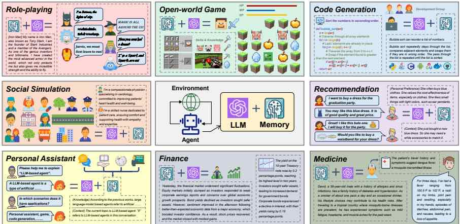
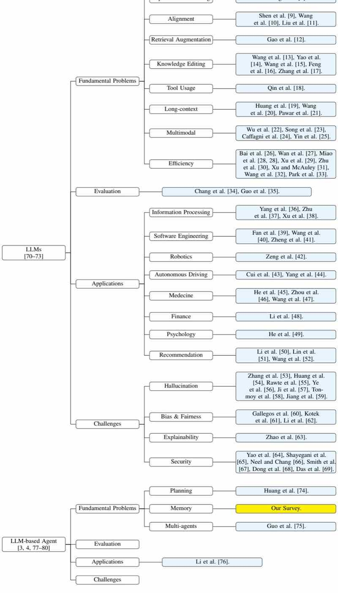
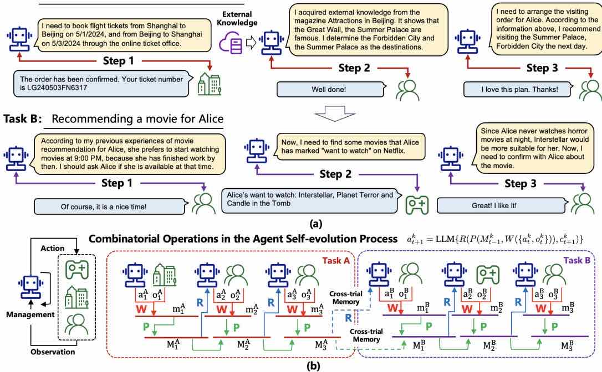
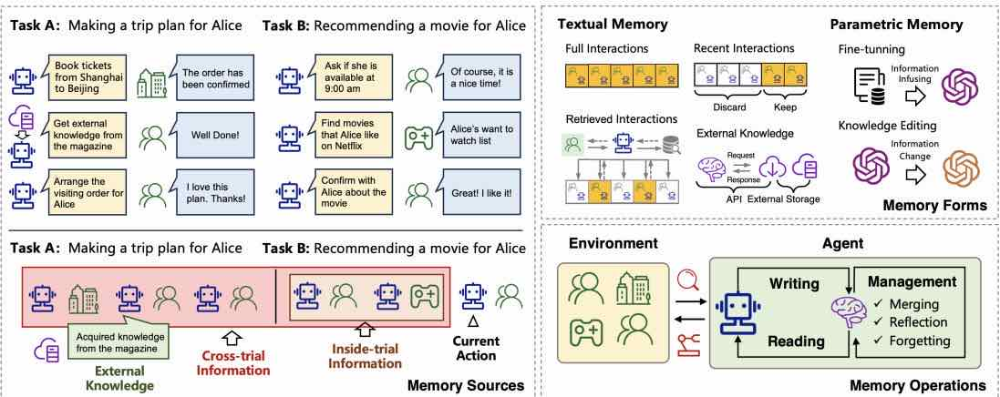
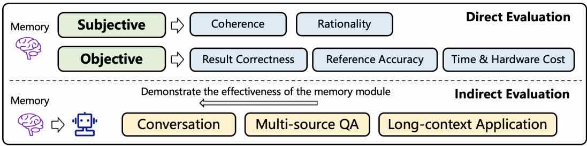

# 基于大语言模型智能体的记忆机制综述

张泽宇、Xiaohe Bo、Chen Ma、Rui Li、陈旭、戴全宇、Jieming Zhu、Zhenhua Dong、温继荣

中国人民大学高瓴人工智能学院，北京，中国
华为诺亚方舟实验室，中国
联系邮箱：zeyuzhang@ruc.edu.cn, xu.chen@ruc.edu.cn

## 摘要

基于大语言模型（LLM）的代理最近引起了研究界和工业界的广泛关注。与原始LLM相比，基于 LLM 的智能体具有自我进化能力，这是解决需要长期、复杂的智能体与环境交互的现实问题的基础。支持智能体与环境交互的关键组件是智能体的记忆。虽然之前的研究提出了许多有前途的记忆机制，但它们分散在不同的论文中，并且缺乏系统的综述来从整体角度总结和比较这些工作，未能抽象出共同有效的设计模式来启发未来的研究。为了弥补这一差距，在本文中，我们提出了对基于 LLM 的智能体的记忆机制的全面调查。具体来说，我们首先讨论基于 LLM 的代理中的“是什么”和“为什么我们需要”内存。然后，我们系统地回顾了先前关于如何设计和评估内存模块的研究。此外，我们还展示了许多代理应用程序，其中内存模块发挥着重要作用。最后，我们分析了现有工作的局限性并指出了未来的重要方向。为了跟上该领域的最新进展，我们在 https://github.com/nuster1128/LLM_Agent_Memory_Survey 创建了一个存储库。

图 1：内存模块在基于 LLM 的代理中的重要性。

## 目录

- 1 引言
- 2 相关综述
- 2.1 大语言模型相关综述
- 2.2 基于大语言模型的智能体相关综述
- 3 什么是基于 LLM 的智能体记忆
- 3.1 基础概念
- 3.2 智能体记忆的狭义定义
- 3.3 智能体记忆的广义定义
- 3.4 记忆辅助的智能体-环境交互
- 4 为什么基于 LLM 的智能体需要记忆
- 4.1 认知心理学视角
- 4.2 自我进化视角
- 4.3 智能体应用视角
- 5 如何实现基于 LLM 的智能体记忆
- 5.1 记忆来源
- 5.1.1 试验内信息
- 5.1.2 跨试验信息
- 5.1.3 外部知识
- 5.2 记忆形式
- 5.2.1 文本形式的记忆
- 5.2.2 参数形式的记忆
- 5.2.3 文本记忆与参数记忆的优缺点
- 5.3 记忆操作
- 5.3.1 记忆写入
- 5.3.2 记忆管理
- 5.3.3 记忆读取
- 6 如何评估基于 LLM 的智能体记忆
- 6.1 直接评估
- 6.1.1 主观评估
- 6.1.2 客观评估
- 6.2 间接评估
- 6.2.1 对话
- 6.2.2 多源问答
- 6.2.3 长上下文应用
- 6.2.4 其他任务
- 6.3 讨论
- 7 记忆增强型智能体应用
- 7.1 角色扮演与社会模拟
- 7.2 个人助理
- 7.3 开放世界游戏
- 7.4 代码生成
- 7.5 推荐
- 7.6 特定领域专家系统
- 7.7 其他应用
- 8 局限与未来方向
- 8.1 参数化记忆的进一步发展
- 8.2 多智能体应用中的记忆
- 8.3 基于记忆的终身学习
- 8.4 类人智能体中的记忆
- 9 结论

# 1 引言

“没有记忆，就没有文化。没有记忆，就没有文明，就没有社会，就没有未来。”

最近，大语言模型（LLM）在人工智能和软件工程到教育和社会科学等众多领域取得了显着的成功[1-3]。最初的法学硕士通常在不与环境交互的情况下完成不同的任务。然而，为了实现通用人工智能（AGI）的最终目标，智能机器应该能够通过自主探索和学习现实世界来提高自身。例如，如果旅行计划代理打算预订机票，则应向机票网站发送订单请求，并在采取下一步操作之前观察响应。个人助理应该根据用户的反馈调整其行为，提供个性化的响应以提高用户的满意度。为了进一步推动LLM向AGI迈进，近年来出现了大量基于 LLM 的代理的研究[3, 4]，其中关键是为LLM配备额外的模块，以增强其在现实环境中的自我进化能力。

在所有添加的模块中，内存是区分代理与原始LLM 的关键组件，使代理真正成为代理（见图1）。它在决定智能体如何积累知识、处理历史经验、检索信息知识以支持其行动等方面发挥着极其重要的作用。围绕存储模块，人们对其信息来源、存储形式、运行机制等方面进行了很多的设计。例如，辛恩等人。 [5]结合试验中和交叉试验信息来构建记忆模块，以增强智能体的推理能力。钟等人。 [6]以自然语言的形式存储记忆信息，对用户来说是可解释且友好的。莫达雷西等人。 [7]设计内存读取和写入操作以与环境交互以解决任务。

虽然之前的研究已经设计了许多有前途的内存模块，但仍然缺乏从整体角度看待内存模块的系统研究。为了弥补这一差距，在本文中，我们全面回顾了以前的研究，为设计和评估内存模块提供了清晰的分类法和关键原则。具体来说，我们讨论三个关键问题，包括：（1）基于 LLM 的代理的记忆是什么？ (2) 为什么基于 LLM 的代理需要内存？ (3)如何在基于 LLM 的代理中实现和评估记忆？首先，我们详细介绍了基于 LLM 的代理中的记忆概念，提供了狭义和广义的定义。然后，我们分析了记忆在基于 LLM 的智能体中的必要性，从认知心理学、自我进化和智能体应用三个角度展示了其重要性。基于“什么”和“为什么”的问题，我们提出了设计和评估内存模块的常用策略。对于内存设计，我们从内存来源、内存形式和内存操作三个维度讨论了前人的工作。对于记忆评估，我们引入了两种广泛使用的方法，包括直接评估和通过特定代理任务的间接评估。接下来，我们讨论角色扮演、社交模拟、个人助理、开放世界游戏、代码生成、推荐和专家系统等代理应用，以展示记忆模块在实际场景中的重要性。最后，我们分析了现有工作的局限性并强调了未来的重要方向。

本文的主要贡献可以概括如下：（1）我们正式定义了记忆模块并全面分析了其对于基于 LLM 的代理的必要性。 （2）我们系统地总结了关于设计和评估基于 LLM 的代理中的记忆模块的现有研究，提供了清晰的分类法和直观的见解。 (3)我们提出了典型的代理应用程序来展示内存模块在不同场景中的重要性。 (4) 我们分析了现有内存模块的主要局限性，并展示了启发未来研究的潜在解决方案。据我们所知，这是第一个关于基于 LLM 的代理的记忆机制的调查。

本次调查的其余部分组织如下。首先，我们在第 2 节中对法学硕士和基于法学硕士的代理人领域进行了系统的元调查，对不同的调查进行了分类并总结了它们的主要贡献。然后，我们在第3节至第6节中讨论“什么是”、“为什么我们需要”以及“如何实现和评估”基于 LLM 的代理中的记忆模块。接下来，我们在第7节中展示记忆增强代理的应用。最后在第8节和第9节中讨论现有工作的局限性和未来方向。

# 2 相关综述

近两年来，LLM受到学术界和工业界的广泛关注。为了系统地总结该领域的研究，研究人员撰写了大量的调查论文。在本节中，我们将简要回顾这些调查（概览见图 2），强调它们的主要焦点和对更好地定位我们的研究的贡献。

## 2.1 大语言模型相关综述

在法学硕士领域，赵等人。 [70]提出了第一个全面的调查，总结了法学硕士的背景、演变路径、模型架构、培训方法和评估策略。哈迪等人。 [71]和Min等人。 [72]也从整体角度进行法学硕士调查，然而，这对法学硕士提供了不同的分类和理解。在这些调查之后，人们深入研究法学硕士的具体方面，并回顾相应的里程碑研究和关键技术。这些方面可以分为四类，包括法学硕士的基本问题、评估、应用和挑战。

根本问题。该类别的调查旨在总结可用于解决法学硕士基本问题的技术。具体来说，张等人。 [8]对监督微调方法进行了全面的调查，这是更好地训练法学硕士的关键技术。沉等人。 [9]，王等人。 [10] 和刘等人。 [11]提出了关于法学硕士一致性的调查，这是法学硕士产生符合人类价值观的产出的关键要求。高等人。 [12]提出了一项关于法学硕士检索增强生成（RAG）能力的调查，这是为法学硕士提供事实和最新知识并消除幻觉的关键。秦等人。 [18]总结了使法学硕士能够利用外部工具的最先进方法，这是法学硕士在需要专业知识的领域扩展其能力的基础。王等人。 [13]，姚等人。 [14]，王等人。 [15]，冯等。 [16] 和张等人。 [17]提出了关于法学硕士知识编辑方向的调查，这对于定制法学硕士以满足特定要求非常重要。黄等人。 [19]，王等人。 [20] 和帕瓦尔等人。 [21]关注LLM 的长上下文能力，这对于LLM每次处理更多信息并增强其应用场景至关重要。吴等人。 [22]，宋等人。 [23]，卡法尼等人。 [24] 和尹等人。 [25]总结了多模式法学硕士，它将法学硕士的能力从文本扩展到视觉和其他模式。上述调查主要关注LLM 的有效性。法学硕士的另一个重要方面是其训练和推理效率。 Zhu等人总结了这方面的研究。 [30]，Xu 和 McAuley [31]，Wang 等人。 [32] 和 Park 等人。 [33]系统地回顾了模型压缩技术。丁等人。 [81] 和徐等人。 [29]对参数高效微调的研究进行了分析和总结。白等人。 [26]，万等人。 [27]，苗等。 [28] 和丁等人。 [81]更加关注一般意义上的资源利用效率。

评估。该类别的调查重点关注如何评估法学硕士的能力。具体来说，Chang 等人。 [34]从整体的角度全面总结了评价方法。它包含不同的评估任务、方法和基准，它们是评估法学硕士表现的关键部分。郭等人。 [35]更关心评估目标，描述如何评估法学硕士的知识、一致性和安全控制能力，这补充了绩效之外的评估指标。

应用。此类别的调查旨在总结利用法学硕士来改进不同应用程序的模型。更具体地说，朱等人。 [37]关注信息检索（IR）领域并总结基于 LLM 的查询过程的研究。徐等人。 [38]更加关注信息提取（IE），并为该领域基于 LLM 的模型提供全面的分类法。李等人。 [50]，林等人。 [51]和王等人。 [52]讨论了法学硕士在推荐系统领域的应用，他们利用代理来生成数据并提供推荐。范等人。 [39]，王等人。 [40]和郑等人。 [41] 专注于法学硕士如何在软件设计、开发和测试方面使软件工程 (SE) 受益。曾等人。 [42]总结了机器人领域基于 LLM 的方法。崔等人。 [43] 和杨等人。 [44]重点关注自动驾驶的应用，并基于法学硕士从不同角度总结了该领域的模型。除了上述人工智能领域之外，法学硕士还被用于自然科学和社会科学。他等人。 [45]，周等。 [46]和王等人。 [47]总结了法学硕士在医学中的应用。李等人。 [48]重点关注法学硕士在金融领域的应用。他等人。 [49]回顾利用法学硕士促进心理学发展的模型。

图 2：对法学硕士和法学硕士代理的相关调查的组织。

挑战。该类别的调查重点关注法学硕士的可信度，例如幻觉、偏见、不公平、可解释性、安全性和隐私。法学硕士的幻觉是指法学硕士可能产生误解或捏造的问题，影响其下游应用的可靠性。张等人。 [53]，黄等人。 [54]，拉特等人。 [55]，叶等人。 [56]，吉等人。 [57]，汤莫伊等人。 [58]和Jiang等人。 [59]总结了缓解法学硕士幻觉问题的主流模型。偏见和不公平问题是指法学硕士可能不平等地对待不同的人或目标，从而导致社会刻板印象和歧视的传播。加列戈斯等人。 [60]，科泰克等人。 [61] 和李等人。 [62]全面讨论这些挑战并总结现有的缓解方法。可解释性问题意味着LLM 的内部工作机制仍不清楚。赵等人。 [63]系统地讨论了这个问题，并总结了以前在提高法学硕士可解释性方面所做的努力。安全和隐私也是具有挑战性的问题，姚等人对此进行了全面的调查。 [64]，Shayegani 等人。 [65]，尼尔和张[66]，史密斯等人。 [67]，董等人。 [68]和达斯等人。 [69]。

## 2.2 基于大语言模型的智能体相关综述

基于 LLM 的能力，人们对构建基于 LLM 的智能体进行了大量的研究，这些智能体可以自主感知环境、采取行动、积累知识并自我进化。在这个领域，王等人。 [3]提出了第一篇调查论文，从智能体构建、智能体应用和智能体评估的角度系统地总结了基于 LLM 的智能体。习等人。 [4]，赵等。 [77]，程等人。 [78] 和葛等人。 [80]也从整体角度总结了基于 LLM 的代理研究，但它们有不同的侧重点和分类法，从而对该领域提供了更加多样化的理解。除了这些总体调查之外，还出现了几篇论文，回顾了法学硕士代理人的具体方面。对于根本问题，杜兰特等人。 [79]总结了多模式药物的研究。黄等人。 [74]重点关注基于法学硕士的代理人的规划能力。郭等人。 [75]更加关注多智能体交互的场景。对于应用程序，Li 等人。 [76] 总结了作为个人助理的基于法学硕士的代理人。

这部作品的定位。我们的调查总结了基于 LLM 的智能体的一个基本问题的研究，即智能体的记忆机制。据我们所知，这是该方向的首次调查。我们希望它不仅能够激发未来更先进的内存架构，而且能够为新人提供全面的入门材料。

# 3 什么是基于 LLM 的智能体记忆

与环境进行交互和学习是基于 LLM 的代理的基本要求。在智能体与环境的交互过程中，存在三个关键阶段，即（1）智能体从环境中感知信息，并将其存储到内存中； (2) 代理对存储的信息进行处理，使其更可用； (3)智能体根据处理后的记忆信息采取下一步行动。在所有这些阶段中，记忆都起着极其重要的作用。下面我们首先从狭义和广义两个角度来定义智能体的内存，然后基于内存模块详细介绍上述三个阶段的执行过程。

## 3.1 基础概念

为了清晰的演示，我们首先介绍几个重要的背景知识如下：

定义 1（任务）。任务是智能体需要实现的最终目标，例如为Alice预订机票，为Bob推荐餐厅等。形式上，我们使用 $\tau$ 来表示一个任务，并在后面的内容中通过下标来标记不同的任务。

定义 2（环境）。从狭义上讲，环境是智能体完成任务所需交互的对象。对于定义 1 中的示例，环境是 Alice 和 Bob，他们提供有关代理操作的反馈。更广泛地说，环境可以是影响代理决策的任何上下文因素，例如预订机票时的天气、推荐餐厅时的时间和地点等。

定义 3（尝试和步骤）。为了完成任务，代理需要与环境交互。通常，智能体首先采取行动，然后环境响应该行动。最后，代理根据响应采取下一步行动。这个过程不断重复，直到任务完成。完整的主体-环境交互过程称为试验，每个交互回合称为步骤。对于每次试验，代理可以采取多个步骤来形成任务的潜在解决方案。对于每项任务，智能体可以探索多个试验来完成任务 [5]。形式上，在步骤 $t$ 中，我们使用 $a _ { t }$ 和 $o _ { t }$ 分别表示代理动作和观察到的环境响应。然后，$T$ 长度的试验可以表示为 $\xi _ { T } = \{ a _ { 1 } , o _ { 1 } , a _ { 2 } , o _ { 2 } , 。 。 。 , o _ { T } , a _ { T } \} $ 。

任务A：为爱丽丝北京制定旅行计划
图 3：(a) 主体与环境交互过程中的潜在试验示例。 (b)存储器读取、写入和管理过程的图示，其中虚线表示可以将交叉试验信息合并到存储器模块中。

在上述定义中，任务和环境是最粗粒度的概念，而步骤是最细粒度的概念。它们共同描述了完整的主体-环境交互过程。

一个玩具示例。基于上述定义，我们展示了一个玩具示例，并在整篇论文中使用它来提供更多的直觉。在这个例子中，智能体有两个任务：（A）为爱丽丝制定从2024年5月1日到2024年5月3日在北京的旅行计划，其中智能体必须（i）购买往返机票，（ii）根据爱丽丝的喜好确定几个景点，以及（iii）安排这些景点的参观顺序。 (B) 在 2024 年 5 月 10 日为 Alice 推荐一部电影，其中代理必须 (i) 确定 Alice 可以自由观看电影的时间，以及 (ii) 根据 Alice 的观看偏好选择一部电影。对于每项任务，我们在下面提出了一个潜在的试验（也在图 3(a) 中说明）。对于任务（A），试验是：

[第一步]代理：我需要通过网上售票处预订2024年5月1日从上海飞往北京的机票，以及2024年5月3日从北京飞往上海的机票。环境（网上售票处）：订单已确认。出发航班于上午 9:00 起飞，您的机票号码为 EK240501SX9021。回程航班起飞时间为 $4 { : } 3 0 \mathrm { P M }$ ，您的机票号码为 LG240503FN6317。请准时抵达机场搭乘您的航班。

[步骤2]代理：我从《北京景点》杂志上获得了外部知识。说明长城、故宫、颐和园是有名的。根据Alice的喜好，我认为她更喜欢古建筑，所以我确定故宫和颐和园作为目的地。环境（爱丽丝）：干得好！

[第3步] 代理：现在，我需要安排Alice的探访顺序。根据上面的信息，我建议她到北京后去颐和园参观，因为那里适合花一下午的时间看日落。那么第二天她就可以去故宫，这样她的时间就很充裕了。终于，她可以在第三天返回上海休息了。环境（爱丽丝）：我喜欢这个计划。谢谢！

对于任务（B），试验是：

[步骤1]代理：根据我之前为Alice推荐电影的经验，她更喜欢晚上9:00开始看电影，因为那时她已经完成工作了。我应该问爱丽丝她当时是否有空。环境（爱丽丝）：当然，这是一个美好的时光！

[第 2 步] 代理：现在，我需要在 Netflix 上查找 Alice 标记为“想观看”的一些电影。
环境 (Netflix)：爱丽丝想看的电影：《星际穿越》、《恐怖星球》和《坟墓里的蜡烛》。

【第三步】经纪人：因为爱丽丝晚上从不看恐怖片，所以《星际穿越》更适合她。现在，我需要和爱丽丝确认一下这部电影的事。环境（爱丽丝）：太棒了！我喜欢它！

## 3.2 智能体记忆的狭义定义

从狭义上讲，智能体的记忆仅与同一试验内的历史信息相关。形式上，对于给定的任务，步骤 $t$ 之前的试验的历史信息为 $\xi _ { t } = \left\{ a _ { 1 } , o _ { 1 } , a _ { 2 } , o _ { 2 } , 。 。 。 , a _ { t - 1 } , o _ { t - 1 } \right\}$ ，然后根据 $\xi _ { t }$ 导出内存。在上面的玩具示例中，对于任务（A），智能体在[步骤3]需要安排Alice的访问顺序；此时，其内存中包含了[步骤1]和[步骤2]中选择的景点和到达时间的信息。对于任务（B），智能体必须在[步骤3]为爱丽丝选择一部电影；这时，它的记忆里就包含了安排好的看电影时间。

## 3.3 智能体记忆的广义定义

从广义上讲，智能体的记忆可以来自更广泛的来源，例如，不同试验的信息以及智能体与环境交互之外的外部知识。形式上，给定一系列顺序任务 $\{ \mathcal { T } _ { 1 } , \mathcal { T } _ { 2 } , 。 。 。 , \dot { \mathcal { T } } _ { K } \}$ ，对于任务 $\mathcal { T } _ { k }$ ，步骤 $t$ 的记忆信息来自三个来源： (1) 同一试验中的历史信息，即 $\xi _ { t } ^ { k } \overset { \cdot } { = } \{ a _ { 1 } ^ { k } , o _ { 1 } ^ { k } , . 。 。 , a _ { t - 1 } ^ { k } , o _ { t - 1 } ^ { k } \}$ ，其中我们添加上标 $k$ 来标记任务索引。 (2) 不同试验的历史信息，即 $\Xi ^ { k } = \{ \xi ^ { 1 } , \xi ^ { 2 } , 。 。 。 , \xi ^ { k - 1 } , \xi ^ { k ^ { \prime } } \}$ ，其中 $\xi ^ { j }$ $^ j \ ( j \in \{ 1 , . . . , k - 1 \} )$ 表示任务 $j ^ { 1 }$ 的试验，$\xi ^ { k ^ { \prime } }$ 表示任务 $j ^ { 1 }$ 的试验之前探索的任务 $\mathcal { T } _ { k }$ 的试验。 (3)外部知识，用$D_{t}^{k}$表示。代理的记忆是基于 $( \xi _ { t } ^ { k } , \Xi ^ { k } , D _ { t } ^ { k } )$ 得出的。在上面的玩具示例中，对于任务（A），如果有几次失败的试验，即来自 Alice 的反馈是否定的，那么可以将这些试验合并到代理的记忆中，以避免将来出现类似的错误（对应于 $\xi ^ { k ^ { \prime } }$ ）。此外，对于任务（B），智能体可以推荐与爱丽丝在任务（A）中访问过的景点相关的电影，以捕获她最近的偏好（对应于 $\{ \xi ^ { 1 } , \xi ^ { 2 } , ..., \xi ^ { k - 1 } \} ）$ 。在智能体决策过程中，还参考了《北京景点》杂志制定出行计划，这是当前任务$\mathcal { T } _ { k }$的外部知识（对应$\mathrm { \dot { ~ } D } _ { t } ^ { k }$ ）。

## 3.4 记忆辅助的智能体-环境交互

正如第 3 节开头提到的，主体与环境交互过程分为三个关键阶段。代理内存模块通过内存写入、内存管理和内存读取三个操作来实现这些阶段。

记忆写作。此操作的目的是将原始观察结果投影到实际存储的内存内容中，这些内容信息更丰富[7]并且更简洁[6]。它对应于主体-环境交互过程的第一阶段。给定一个任务 $\mathcal { T } _ { k }$ ，如果智能体在步骤 $t$ 采取动作 $a _ { t } ^ { k }$ ，并且环境提供观察 $o _ { t } ^ { k }$ ，那么内存写入操作可以正式表示为：

$$
m _ { t } ^ { k } = W ( \{ a _ { t } ^ { k } , o _ { t } ^ { k } \} ) ,
$$

其中 $W$ 是投影函数。 $m _ { t } ^ { k }$ 是最终存储的内存内容，可以是自然语言，也可以是参数表示。在上面的玩具示例中，对于任务（A），智能体应该记住[步骤2]之后的航班安排和景点决定。对于任务 (B)，智能体应该记住 Alice 希望在 [步骤 1] 之后的晚上 9:00 看电影这一事实。

内存管理。该操作的目的是处理存储的记忆信息以使其更加有效，例如，总结高级概念以使代理更具概括性[6]，合并相似信息以减少冗余[7]，以及忘记不重要或不相关的信息以消除其负面影响。该操作对应于主体-环境交互过程的第二阶段。令$M _ { t - 1 } ^ { k }$为步骤$t$之前任务$k$的内存内容，并假设$m _ { t } ^ { k }$为基于上述内存写入操作的步骤$t$存储的信息，则内存管理操作可以表示为：

$$
M _ { t } ^ { k } = P ( M _ { t - 1 } ^ { k } , m _ { t } ^ { k } ) ,
$$

其中$P$是迭代处理存储的内存信息的函数。对于狭义的内存定义，迭代仅发生在同一次试验中，并且当试验结束时内存被清空。对于广义的记忆定义，迭代发生在不同的试验甚至任务中，以及外部知识的整合中。对于上述玩具示例中的任务（B），智能体可以得出结论：Alice 喜欢在晚上看科幻电影，这可以作为默认规则，为将来的 Alice 做出推荐。

记忆阅读。该操作的目的是从内存中获取重要信息，以支持下一步的智能体动作。它对应于主体-环境交互过程的第三阶段。假设 $\hat { M } _ { t } ^ { k }$ 是任务 $k$ 在步骤 $t$ 的内存内容，$c _ { t } ^ { k }$ 是下一个动作的上下文，那么内存读取操作可以表示为：

$$
\hat { M } _ { t } ^ { k } = R ( M _ { t } ^ { k } , c _ { t + 1 } ^ { k } ) ,
$$

其中$R$通常通过计算$M _ { t } ^ { k } $和$ c _ { t + 1 } ^ { k } $之间的相似度来实现[82]。 $\hat { M } _ { t } ^ { k }$ 用作最终提示的一部分来驱动代理的下一步操作。对于上述玩具示例中的任务（B），当智能体在[步骤3]中决定最终推荐的电影时，它应该关注[步骤2]中的“想看”列表并从中选择一部。

基于以上操作，我们可以推导出从 $\{ a _ { t } ^ { k } , o _ { t } ^ { k } \}$ 到 $a _ { t + 1 } ^ { k }$ 的演化过程的统一函数，即：

$$
\boldsymbol{a}_{t+1}^{k} = \mathrm{LLM}\left\{ R\left( P\left( M_{t-1}^{k}, W(\{ a_t^k, o_t^k \}) \right), \boldsymbol{c}_{t+1}^{k} \right) \right\},
$$

其中 LLM 是大语言模型。通过迭代扩展该函数，可以轻松获得完整的主体-环境交互过程（直观说明见图 3(b)）。评论。该函数提供了代理记忆过程的一般公式。以前的作品可能会使用不同的规格。例如，在[5]中，$R$和$P$被设置为相同的功能，并且$P$仅在试验结束时生效。在帕克等人。 [83]，$R$是基于相似性、时间间隔和重要性三个标准来实现的，$P$是通过反射过程来实现以获得更抽象的想法。在本节中，我们重点关注代理内存操作的整体框架。 $W$ 、 $P$ 和 $R$ 的更详细实现将在第 5 节中进行。

# 4 为什么基于 LLM 的智能体需要记忆

上面我们介绍了什么是基于 LLM 的代理的内存。在全面介绍如何实现之前，在本节中，我们将简要介绍为什么记忆对于构建基于 LLM 的智能体是必要的，并从认知心理学、自我进化和智能体应用三个角度展开讨论。

## 4.1 认知心理学视角

认知心理学是对人类心理过程（如注意力、语言使用、记忆、感知、解决问题、创造力和推理）的科学研究。在这些过程中，记忆被广泛认为是极其重要的一个过程[84]。人类通过积累重要信息和抽象高级概念来学习知识[85]，通过记住文化价值观和个人经历来形成社会规范[86]，通过想象潜在的积极和消极后果来采取合理的行为[87]等等，这是人类的基础。

基于 LLM 的代理的一个主要目标是取代人类来完成不同的任务。为了让智能体像人类一样工作，遵循人类的工作机制来设计智能体是一个自然而必要的选择[88]。由于记忆对人类很重要，因此设计记忆模块对智能体也很重要。此外，认知心理学已经研究了很长时间，积累了许多有效的人类记忆理论和架构，可以支持智能体更高级的能力[89]。

图 4：基于 LLM 的代理中内存的来源、形式和操作的概述。

## 4.2 自我进化视角

为了完成不同的实际任务，智能体必须在动态环境中自我进化[90]。在智能体与环境的交互过程中，记忆对于以下几个方面至关重要：（1）经验积累。记忆的一个重要功能是记住过去的错误计划、不适当的行为或失败的经历，从而使智能体在未来处理类似的任务时更加有效[91]。这对于提升智能体在自我进化过程中的学习效率极其重要。 (2)环境探索。为了在环境中自主进化，智能体必须探索不同的行为并从反馈中学习[92]。通过记住历史信息，记忆可以帮助更好地决定何时以及如何进行探索，例如，更多地关注以前失败的试验或探索频率较低的行动[93]。 (3)知识抽象。记忆的另一个重要功能是从原始观察中总结和抽象高级信息，这是智能体对未见过的环境更具适应性和可推广性的基础[82]。综上所述，自进化是基于 LLM 的智能体的基本特征，而记忆对于自进化至关重要。

## 4.3 智能体应用视角

在许多应用中，内存是代理不可缺少的组件。例如，在会话代理中，存储器存储有关历史会话的信息，这是代理生成下一个响应所必需的。没有记忆，智能体不知道上下文，无法继续对话[94]。在模拟代理中，记忆对于使代理始终遵循角色配置文件非常重要。如果没有记忆，智能体在模拟过程中可能很容易脱离角色[95]。上述两个例子都表明，记忆不是一个可选组件，而是智能体完成给定任务所必需的。

在上述三个视角中，第一个视角揭示了记忆构建了智能体的认知基础。第二个和第三个表明记忆对于智能体不断发展的原理和应用是必要的，这为设计具有记忆机制的智能体提供了见解。

# 5 如何实现基于 LLM 的智能体记忆

本节我们从内存来源、内存形式、内存操作三个角度来讨论内存模块的实现。内存来源是指内存内容的来源。记忆形式重点关注如何表示记忆内容。内存操作的目的是处理内存内容。这三个视角提供了对内存实现方法的全面回顾，这对未来的研究很有帮助。为了更好地演示，我们在图 4 中概述了实现方法。

## 5.1 记忆来源

在以往工作中，记忆内容可能来自不同的来源。根据第 3 节的表述，这些来源可分为三类：试验内信息、跨试验信息以及外部知识。前两者是在智能体与环境交互过程中生成的动态信息，而后者是交互循环之外的静态信息。

表 1：记忆来源汇总。我们使用 $\checkmark$ 和 $\times$ 标记模型是否采用相应来源。

| 模型 | 试验内信息 | 跨试验信息 | 外部知识 |
| --- | --- | --- | --- |
| MemoryBank [6] | √ | × | × |
| RET-LLM [7] | √ | × | √ |
| ChatDB [96] | √ | × | √ |
| TiM [97] | √ | × | × |
| SCM [98] | √ | × | × |
| Voyager [99] | √ | × | × |
| MemGPT [100] | √ | × | × |
| MemoChat [94] | √ | × | × |
| MPC [101] | √ | × | × |
| Generative Agents [83] | √ | × | × |
| RecMind [102] | √ | × | √ |
| Retroformer [103] | √ | √ | √ |
| ExpeL [82] | √ | √ | √ |
| Synapse [91] | √ | √ | × |
| GITM [93] | √ | √ | √ |
| ReAct [104] | √ | × | √ |
| Reflexion [5] | √ | √ | √ |
| RecAgent [95] | √ | × | × |
| Character-LLM [105] | √ | × | √ |
| MAC [106] | √ | × | × |
| Huatuo [107] | √ | × | √ |
| ChatDev [1] | √ | × | × |
| InteRecAgent [108] | √ | × | √ |
| MetaAgents [109] | √ | × | × |
| TPTU [110, 111] | √ | × | √ |
| MetaGPT [112] | √ | √ | × |
| S^3 [2] | √ | × | × |
| InvestLM [113] | √ | × | √ |

### 5.1.1 试验内信息

在智能体与环境的交互过程中，试验中的历史步骤通常是支持智能体未来行动的最相关和信息量最大的信号。之前的作品几乎都使用这些信息作为记忆源的一部分。

代表性研究。 Generative Agents [83] 旨在通过使用基于 LLM 的代理来模拟人类的日常行为。 Agent的记忆来源于实现目标的历史行为，例如在研究特定主题时收集相关论文。 MemoChat [94] 旨在与人类聊天，其中代理的记忆是基于对话会话的对话历史记录而得出的。 TiM[97]旨在通过完成任务后自我生成多个想法来增强智能体的推理能力，并将其用作记忆以提供更通用的信息。 Voyager [99] 专注于构建基于 Minecraft 的游戏代理，其中内存包含完成任务的初步和基本动作的可执行代码。需要注意的是，内部试验信息不仅包括主体环境交互，还包含交互上下文，例如时间和位置信息。

讨论。内部试验信息是最明显和直观的来源，应该用来构建代理的记忆，因为它与代理必须完成的当前任务高度相关。然而，仅仅依赖内部试验信息可能会妨碍智能体从各种任务中积累有价值的知识并学习更通用的信息。因此，许多研究还探索如何有效地利用不同任务之间的信息来构建记忆模块，这将在以下各节中详细介绍。

### 5.1.2 跨试验信息

对于基于 LLM 的智能体来说，在环境中多次试验中积累的信息也是记忆的重要组成部分，通常包括成功和失败的行动及其见解，例如失败原因、成功的常见行动模式等。

代表性研究。最著名的研究之一是 Reflexion [5]，它提出了针对 LLM 代理的言语强化学习。它以口头形式从过去的试验中获得经验，并将其应用到后续的试验中，以提高同一任务的表现。此外，Retroformer [103] 微调反射模型，使代理能够更有效地从过去的试验中提取交叉试验信息。在 Synapse [91] 中，代理专注于解决计算机控制任务。他们的记忆可以通过成功的范例记录交叉试验信息，为类似试验提供参考。在 ExpeL [82] 中，代理需要解决环境中一系列复杂的交互任务。他们存储和组织已完成的轨迹，并为新任务回忆类似的轨迹。在回忆的轨迹中，成功的案例将与失败的案例进行比较，以确定成功的模式。

讨论。根据交叉试验信息的累积记忆，智能体能够积累经验，这对于其进化非常重要。根据过去的经验，智能体可以根据整个过程的整体反馈来调整自己的行动。与充当短期记忆的内部试验观察相反，试验经历可以被视为长期记忆。它利用不同试验的反馈来支持更广泛的药剂试验，为药剂提供更长时间的体验支持。然而，其局限性在于，内部试验和跨试验信息都需要代理人亲自参与代理人与环境的交互，而外部经验和知识不包括在内。

### 5.1.3 外部知识

基于 LLM 的代理的一个重要特征是它们可以用自然语言直接沟通和控制。因此，基于 LLM 的代理可以轻松地将外部知识以文本形式（例如维基百科 3）纳入其中，以促进他们的决策。

代表性研究。在ReAct [104]中，智能体需要通过多个推理步骤回答有关常识的问题。如果他们在这些步骤中缺乏信息，他们可以利用维基百科 API 来获取外部知识。 GITM [93] 打算在 Minecraft 中设计代理，它可以在复杂且奖励稀疏的环境中进行探索。特工们从在线 Minecraft Wiki 和工艺配方中获取知识，为他们的导航提供无限的知识来源。 CodeAgent [114] 专注于存储库级别的代码生成任务，这通常需要复杂的依赖关系和大量的文档。它设计了一种获取相关外部知识的网络搜索策略。 ChatDoctor [115] 将基于 LLM 的代理应用于医学领域。它微调获取过程以从维基百科和医学数据库检索外部知识。

讨论。外部知识可以从私人和公共来源获得。它为基于 LLM 的代理提供了超出其内部环境的许多知识，这些知识对于代理来说可能很难甚至不可能通过代理与环境的交互来获取。而且，大部分外部知识都可以根据任务需要，通过实时动态访问各种工具的API来获取，从而缓解了知识过时的问题。将外部知识整合到基于法学硕士的代理的记忆中，显着扩展了他们的知识边界，为他们的决策提供了无限的、最新的、有根据的知识。

## 5.2 记忆形式

一般来说，记忆内容有两种表示形式：文本形式和参数形式。文本形式通过自然语言显式保留和回忆信息；参数形式则把记忆编码为模型参数，并以隐式方式影响智能体行为。

表 2：记忆形式汇总。我们使用 $\checkmark$ 和 $\times$ 标记模型是否采用相应的记忆形式。

| 模型 | 完整文本 | 最近文本 | 检索文本 | 外部知识 | 参数微调 | 参数编辑 |
| --- | --- | --- | --- | --- | --- | --- |
| MemoryBank [6] | × | × | √ | × | × | × |
| RET-LLM [7] | × | × | √ | × | × | × |
| ChatDB [96] | × | × | √ | × | × | × |
| TiM [97] | × | × | √ | × | × | × |
| SCM [98] | × | √ | √ | × | × | × |
| Voyager [99] | × | × | √ | × | × | × |
| MemGPT [100] | × | √ | √ | × | × | × |
| MemoChat [94] | × | × | √ | × | × | × |
| MPC [101] | × | × | √ | × | × | × |
| Generative Agents [83] | × | × | √ | × | × | × |
| RecMind [102] | √ | × | × | × | × | × |
| 逆转器[103] | √ | × | × | √ | √ | × |
| ExpeL [82] | √ | × | √ | √ | × | × |
| Synapse [91] | × | × | √ | × | × | × |
| GITM [93] | √ | × | √ | √ | × | × |
| ReAct [104] | √ | × | × | × | √ | × |
| Reflexion [5] | √ | × | × | × | √ | × |
| RecAgent [95] | × | √ | √ | × | × | × |
| Character-LLM [105] | × | √ | × | × | √ | × |
| MAC [106] | × | × | × | × | × | √ |
| Huatuo [107] | √ | × | × | × | √ | × |
| ChatDev [1] | √ | × | × | × | × | × |
| InteRecAgent [108] | × | √ | √ | √ | × | × |
| MetaAgents [109] | × | × | √ | × | × | × |
| TPTU [110, 111] | √ | × | × | √ | × | × |
| MetaGPT [112] | √ | × | × | × | × | × |
| S^3 [2] | × | × | √ | × | × | × |
| InvestLM [113] | √ | × | × | × | √ | × |

### 5.2.1 文本形式的记忆

文本形式是目前记忆内容表示的主流方式，具有更好的可解释性、更容易的实现、更快的读写效率。具体来说，文本形式既可以是非结构化表示（如原始自然语言），也可以是结构化信息（如元组、数据库等）。一般来说，以前的研究使用文本形式记忆来存储四种类型的信息，包括（1）完整的主体-环境交互，（2）最近的主体-环境交互，（3）检索的主体-环境交互，以及（4）外部知识。在前三种方法中，内存利用自然语言来描述代理与环境交互循环中的信息。在前三种类型中，它们记录代理与环境交互循环内的信息，而最后一种类型利用自然语言在该循环外存储信息。

完整的互动。该方法基于长上下文策略存储智能体与环境交互历史的所有信息[116]。以3.1节为例，任务(A)中代理人在步骤2之后的记忆可以通过连接步骤2之前的所有信息来实现，最终的文本形式记忆为：“您的记忆是[步骤1]（代理人）...（网上售票处）...[步骤2]...请根据您的记忆推断”。

在之前的工作中，不同的模型使用不同的策略来存储记忆信息。例如，在 LongChat [116] 中，代理专注于理解长上下文场景中的自然语言。它对基础模型进行微调，以更好地适应记忆完整的交互。记忆沙盒[117]旨在减轻对话中不相关记忆的影响。它设计了一种透明且交互式的方法来管理代理的内存，在将它们连接为提示之前删除不相关的内存。此外，一些努力致力于增强法学硕士处理较长背景的能力[118, 119]。

虽然存储所有智能体与环境的交互可以保持全面的信息，但在计算成本、推理时间和推理鲁棒性方面存在明显的局限性。首先，由于注意力计算的时间复杂度随序列长度呈二次方增长，实践中快速增长的长上下文记忆导致LLM推理过程中计算成本较高。因此，它需要更多的计算资源并显着增加推理延迟，这阻碍了其实际部署。更重要的是，随着LLM 的快速增长，在LLM预训练过程中，记忆长度很容易超过序列长度的上限，这就需要对记忆进行截断。因此，由于代理记忆的不完整，可能会导致信息丢失。最后但并非最不重要的一点是，它可能会导致法学硕士的推论出现偏差和不稳健。具体而言，先前的研究[120]表明，文本片段在长上下文中的位置会极大地影响其利用率，因此不能平等且稳定地对待长上下文提示中的记忆。所有这些缺点都表明需要为基于 LLM 的代理设计额外的内存模块，而不是直接将所有信息连接到提示中。

最近的互动。该方法使用自然语言存储和维护最近获取的记忆，从而根据局部性原理提高记忆信息利用的效率[121]。在3.1节例子的任务(B)中，我们可以只记住Alice最近三年的偏好，并截断远处的部分，其中最近三年可以被认为是记忆窗口大小。

在之前的研究中，有多种策略来存储最近的文本记忆。例如，SCM[98]提出了一种基于缓存机制的闪存，它保留了最近$t - 1$时间步的观察结果，旨在增强信息的新近度。 MemGPT [100]将代理视为一个操作系统，它可以通过自然界面与用户动态交互。它设计工作环境来保存最近的历史记录，作为虚拟环境管理的一部分。在 RecAgent [95] 中，代理被设计为模拟电影推荐中的用户行为。它将一些时间信息存储在短期记忆中作为中间缓存，可以模拟人脑的记忆机制[122, 123]。这些代表性方法可以根据最近的交互动态更新记忆，并且更加关注对当前阶段重要的最近上下文。

根据新近度缓存内存是提高记忆效率的有效方法，它使智能体能够更加关注最近的信息。然而，在长期任务中，这种方法无法从遥远的记忆中获取关键信息。它可能会导致不在直接缓存窗口内的潜在关键信息丢失。换句话说，强调新近度本质上会忽略较早但关键的信息，从而在需要全面了解过去事件的场景中提出挑战。

检索到的交互。与上述根据时间截断记忆的方法不同，该方法通常根据记忆内容的相关性、重要性和主题来选择记忆内容。它确保在决策过程中包含遥远但重要的记忆，从而解决仅记住最近信息的限制。在 3.1 节示例的任务（A）中，Alice 的偏好在执行此任务之前已存储在内存中。在[步骤2]中，智能体将根据查询关键字“旅行”从记忆中检索与Alice偏好最相关的方面，获得Alice对古建筑的景点偏好。一般来说，检索方法会在内存写入期间生成嵌入作为内存条目的索引，并记录辅助信息以协助检索。在内存读取过程中，会计算每个内存条目的匹配分数，并且前$K$条目将用于智能体的决策过程。

在现有的研究中，大多数智能体利用检索方法来处理记忆信息。例如，帕克等人。 [83]首先通过余弦相似度计算当前上下文与记忆条目之间的相关性，并根据辅助信息获得重要性和新近度。 MemoryBank [6] 采用双塔密集检索模型从过去的对话中查找相关信息。每个内存条目都被编码为嵌入，随后由 FAISS [124] 进行索引，以提高检索效率。当读取记忆时，当前上下文将被编码为表示以获得最相关的记忆。此外，RET-LLM[7]打算设计一种通用的读写存储器模块。它利用局部敏感哈希 (LSH) 来检索数据库中具有相关条目的元组，以提供更多信息。此外，ChatDB[96]设计利用符号存储器，并提出生成SQL语句从数据库检索以获得存储的信息。

检索方法在很大程度上取决于获取预期信息的准确性和效率。不准确的检索策略可能会获取对代理推理无益的不相关信息。繁重的检索系统可能会导致巨大的计算成本和较长的时间延迟，尤其是在处理海量信息时。此外，检索方法通常将同质信息存储在环境内，其中所有信息都采用一致的形式。对于环境之外的异构信息，很难直接应用相同的方法进行内存存储。

外部知识。为了获取更多信息，一些智能体通过调用工具来获取外部知识，目的是将额外的相关知识转化为自己的记忆以进行决策。例如，通过应用程序编程接口（API）访问外部知识是一种常见的做法 [104, 5]。如今，维基百科、OpenWeatherMap4等丰富的公共信息都可以在线获取（免费或付费），并且可以通过API调用方便地访问。例如，在3.1节示例的任务(A)的[步骤2]中，通过工具方法从数字杂志中获取外部知识。

在现有模型中，Toolformer[125]提出教LLM使用工具，这些工具可以获取外部知识以更好地解决任务。此外，ToolLLM [126] 使 Llama [127] 能够利用 RapidAPI5 中的更多 API 并支持多工具使用，这提供了一个通用接口来扩展代理的能力。在 TPTU [110] 中，智能体被纳入任务规划和工具使用中，以解决复杂的问题。后续工作[111]进一步提高了其像检索一样的能力。在 ToRA [128] 中，智能体需要解决数学问题。他们利用模仿学习来提高使用基于程序的工具的能力。

上述方法允许代理从不同来源访问外部最新的真实信息，从而显着提高代理的能力。然而，由于潜在的不准确和偏见，这些信息的可靠性可能值得怀疑[18]。此外，将工具集成到代理中需要全面的理解，以解释跨不同上下文检索的信息，这可能会导致更高的计算成本，并且在将外部数据与内部决策过程保持一致时变得更加复杂。此外，使用外部 API 会带来隐私、数据安全和使用策略合规性方面的担忧，需要严格的管理和监督 [18]。

### 5.2.2 参数形式的记忆

另一种方法是以参数形式表示内存。它们不会占用提示中上下文的额外长度，因此不受LLM上下文长度限制的约束。然而，参数化记忆形式的研究仍然不足，我们将之前的工作分为两类：微调方法和记忆编辑方法。

微调方法。将外部知识整合到智能体的记忆中，有利于在一般知识的基础上丰富特定领域的知识。为了将领域知识注入法学硕士，有监督的微调是一种常见的方法，它使代理具有领域专家的记忆。它显着提高了代理完成特定领域任务的能力。在第 3.1 节示例的任务 (A) 中，可以在执行此任务之前将来自杂志的景点的外部知识微调为 LLM 的参数。

在之前的作品中，Character-LLM[105]侧重于角色扮演环境。它利用与角色相关的数据（例如经验）的监督微调策略，赋予代理角色的特定特征和特征。Huatuo [107]旨在赋予代理人在生物医学领域的专业能力。它试图在中医知识库上对 Llama [127] 进行微调。此外，为了创建人工医生，DoctorGLM [129] 使用 LoRA [131] 微调 ChatGLM [130]，而 Radiology-GPT [132] 通过对带注释的放射学数据集进行监督微调来提高放射学分析的领域知识。此外，InvestLM [113]收集投资数据并对其进行微调，以提高特定领域的金融投资能力。

微调方法可以有效缩小一般代理和专业代理之间的差距。它提高了代理执行需要高精度和可靠的特定领域信息的任务的能力。然而，针对特定领域进行微调 LLM 可能会导致过度拟合，并且还会引发对灾难性遗忘的担忧，即 LLM 可能会因为更新参数而忘记原始知识。微调的另一个限制在于计算成本和时间消耗，以及大量数据的要求。因此，大多数微调方法都适用于离线场景，很少能够处理在线场景，例如利用代理观察和试验经验进行微调。由于代理与环境的交互频繁，反向传播的成本无法承受来微调在线和动态交互的每一步。

内存编辑方法。除了微调方法之外，将记忆注入模型参数的另一种方法是知识编辑[133, 134]。与从某些数据集中提取模式的微调方法不同，知识编辑方法专门针对和调整需要更改的事实。它确保不相关的知识不受影响。知识编辑方法更适合小规模的记忆调整。一般来说，它们的计算成本较低，更适合在线场景。在我们的任务 (B) 示例中，Alice 总是在智能体的记忆中在晚上 9:00 看电影，但她最近可能改变工作，晚上 9:00 不会是空的。如果是这样，就应该编辑相关的记忆（例如晚上9:00的例程），这可以通过知识编辑的方法来实现。

在之前的研究中，MAC[106]打算为在线场景设计一种有效且高效的内存适应框架。它利用元学习来替代优化步骤。 PersonalityEdit [135] 专注于编辑法学硕士和代理人的个性，它根据大五因素等理论改变他们的特征。 MEND [134]利用元学习的思想来训练轻量级模型，该模型能够对预训练语言模型的模型参数进行修改。 APP [136] 研究添加新事实是否会导致现有事实的灾难性遗忘。它重点关注邻居扰动对内存添加的影响。此外，KnowledgeEditor [133] 训练超网络来预测基于学习更新问题公式注入内存时模型参数的修改。王等人。 [137]提出了一个新的优化目标来改变LLM 的中毒知识，同时保持一般性能。对于基于 LLM 的智能体，智能体可以通过知识编辑来改变不良记忆，这可以被认为是一种遗忘机制。

知识编辑方法提供了一种创新的方法来更新法学硕士参数中存储的信息。这些方法通过有针对性地针对事实进行调整，可以确保非针对性的知识在更新过程中不受影响，从而减轻灾难性遗忘的问题。此外，有针对性的调整机制可以实现更高效、更少资源占用的更新，使知识编辑成为高精度和实时修改的有吸引力的选择。然而，尽管取得了这些有希望的进展，元训练的计算成本和不相关记忆的保存仍然是重大挑战。

### 5.2.3 文本记忆与参数记忆的优缺点

文本记忆和参数记忆各有优缺点，适合不同的记忆内容和应用场景。本节我们从各个方面讨论这两种内存形式的优缺点。

效力。文本记忆存储有关主体与环境交互的原始信息，更加全面和详细。然而，它受到LLM提示的令牌限制的限制，这使得代理很难存储大量信息。相比之下，参数记忆不受提示长度的限制，但在将文本转换为参数时可能会遭受信息丢失，并且复杂的记忆训练会带来额外的挑战。

效率。对于文本记忆，每次LLM推理都需要将记忆集成到上下文提示中，这会导致更高的成本和更长的处理时间。相比之下，对于参数记忆，信息可以集成到LLM 的参数中，从而消除这些上下文的额外成本。然而，参数存储器在写入过程中需要额外的成本，但文本存储器更容易写入，尤其是对于少量数据。简而言之，文本记忆在写入时更有效，而参数记忆在读取时更有效。

可解释性。文本记忆通常比参数记忆更容易解释，因为自然语言是人类理解的最自然、最直接的策略，而参数记忆通常在潜在空间中表示。然而，这种可解释性是以信息密度为代价获得的。这是因为文本记忆中的单词序列是在离散空间中表示的，该空间不像参数记忆中的连续空间那么密集。

总之，这两种类型的存储器之间的权衡使它们适合不同的应用。例如，对于需要回忆最近交互的任务，例如会话任务和特定于上下文的任务，文本记忆似乎更有效。对于需要大量内存或完善知识的任务，参数内存可能是更好的选择。

## 5.3 记忆操作

我们把内存的整个过程分为三个操作：内存写入、内存管理、内存读取。这三者通常协作实现记忆功能，为LLM推理提供信息。我们在表 3 中总结了之前有关内存操作的工作。

### 5.3.1 记忆写入

信息被智能体感知后，其中一部分将被智能体通过内存写入操作存储起来以供进一步使用，识别哪些信息是必须存储的至关重要。许多研究选择存储原始信息，而另一些研究也将原始信息的摘要放入记忆模块中。

代表性研究。在TiM[97]中，原始信息将被提取为两个实体之间的关系，并存储在结构化数据库中。写入数据库时​​，相似的内容会存储在同一组中。在SCM[98]中，它设计了一个内存控制器来决定何时执行操作。控制器充当整个内存模块的指南。在MemGPT [100]中，内存写入完全是自主的。代理可以根据上下文自主更新内存。在 MemoChat [94] 中，代理通过抽象主要讨论的主题并将其存储为索引内存片段的键来总结每个对话片段。

讨论。先前的研究表明，设计内存写入操作期间的信息提取策略至关重要[94]。这是因为原始信息通常冗长且嘈杂。此外，不同的环境可能会提供不同形式的反馈，如何将信息提取并表示为记忆对于记忆写入也很重要。

### 5.3.2 记忆管理

对于人类来说，记忆信息在大脑中不断地被处理和抽象。代理中的记忆还可以通过反射来管理，以生成更高级别的记忆，合并冗余的记忆条目，以及忘记不重要的早期记忆。

代表性研究。在 MemoryBank [6] 中，智能体将对话处理并提炼为日常事件的高级摘要，类似于人类回忆其经历的关键方面的方式。通过长期的互动，他们不断评估和完善自己的知识，每天对人格特质产生洞察。在 Voyager [99] 中，智能体能够根据环境的反馈来完善自​​己的记忆。在生成代理[83]中，代理可以反思以获得更高层次的信息，其中抽象思想是由代理生成的。当累积的事件足以解决时，反思过程就会被激活。对于GITM[93]，为了建立针对各种情况的通用参考计划，多个计划中的关键动作在内存模块中被进一步总结。

讨论。大多数内存管理操作都是受到人脑工作机制的启发。凭借LLM模拟人类思维的强大能力，这些操作可以帮助智能体更好地生成高级信息并与环境交互。

表 3：记忆操作汇总。如果模型对记忆操作没有特殊设计，我们用 $\circ$ 标记；否则用 $\checkmark$ 表示。$\times$ 表示论文中未讨论该记忆操作。

| 模型 | 写入 | 合并 | 反思 | 遗忘 | 读取 |
| --- | --- | --- | --- | --- | --- |
| MemoryBank [6] | √ | √ | √ | √ | √ |
| RET-LLM [7] | √ | × | × | × | √ |
| ChatDB [96] | √ | × | √ | × | √ |
| TiM [97] | √ | √ | × | √ | √ |
| SCM [98] | √ | √ | × | × | √ |
| Voyager [99] | √ | × | √ | × | √ |
| MemGPT [100] | √ | × | √ | × | √ |
| MemoChat [94] | √ | × | × | × | √ |
| MPC [101] | √ | × | × | × | √ |
| Generative Agents [83] | √ | × | √ | √ | √ |
| RecMind [102] | ○ | × | × | × | √ |
| 逆转器[103] | √ | √ | √ | × | ○ |
| ExpeL [82] | √ | √ | √ | × | ○ |
| Synapse [91] | √ | × | × | × | √ |
| GITM [93] | ○ | √ | √ | × | √ |
| ReAct [104] | ○ | × | × | × | ○ |
| Reflexion [5] | √ | √ | √ | × | ○ |
| RecAgent [95] | √ | √ | √ | √ | √ |
| Character-LLM [105] | √ | × | × | × | ○ |
| MAC [106] | √ | √ | √ | × | √ |
| Huatuo [107] | √ | × | × | × | ○ |
| ChatDev [1] | √ | × | √ | × | √ |
| InteRecAgent [108] | √ | √ | √ | × | √ |
| MetaAgents [109] | √ | × | √ | × | √ |
| TPTU [110, 111] | ○ | × | √ | × | √ |
| MetaGPT [112] | √ | × | √ | × | √ |
| S^3 [2] | √ | × | √ | √ | √ |
| InvestLM [113] | √ | × | × | × | ○ |

### 5.3.3 记忆读取

当智能体需要信息进行推理和决策时，内存读取操作将从内存中提取相关信息以供使用。因此，如何获取当前状态的相关信息很重要。由于记忆实体数量庞大，并且并非所有实体都与当前状态相关，因此需要仔细设计，以根据相关性和其他面向任务的因素提取有用信息。

代表性研究。在ChatDB[96]中，内存读取操作是由SQL语句执行的。这些语句将由代理预先生成为一系列的内存链。在MPC[101]中，代理可以从内存池中检索相关内存。该方法还建议提供忽略某些记忆的思维链示例。 ExpeL [82] 利用 Faiss [124] 向量存储作为内存池，并获得与当前任务共享最高相似度分数的前 $K$ 成功轨迹。

讨论。从某种程度上来说，内存的读写操作是协同的，内存写入的形式很大程度上影响着内存读取的方式。对于文本记忆的形式，以往的作品大多利用文本相似度等辅助信息进行阅读。对于参数记忆的形式，现有模型可能只是利用更新后的参数进行推理，这可以看作是一个隐式的读取过程。

图 5：内存模块评估方法概述。

# 6 如何评估基于 LLM 的智能体记忆

如何有效地评估内存模块仍然是一个悬而未决的问题，之前的工作中已经根据不同的应用提出了多种评估策略。为了清楚地展示不同评估方法的共同思想，在本节中，我们总结了一个总体框架，其中包括两种广泛的评估策略（概述见图 5），即（1）直接评估，独立测量内存模块的能力。 （2）间接评估，通过端到端代理任务评估内存模块。如果可以有效地完成任务，则证明内存模块是有用的。

## 6.1 直接评估

此类方法将智能体的记忆视为独立的组成部分，并独立评估其有效性。以往的研究可分为两类：主观评价和客观评价。主观评估旨在基于人类判断来衡量记忆有效性，可广泛应用于缺乏客观事实的场景。客观评估根据数值指标评估内存有效性，这使得比较不同的内存模块变得容易。

### 6.1.1 主观评估

在主观评价中，有两个关键问题，即（1）应该评价哪些方面以及（2）如何进行评价过程。首先，以下两个方面是评估内存模块最常用的角度。

连贯性。这个方面是指回忆出来的记忆是否自然、是否适合当前的情境。例如，如果代理正在为爱丽丝制定旅行计划，那么记忆应该与她对旅行而不是工作的偏好相关。在之前的作品中，Modarressi 等人。 [7]研究记忆模块能否在不断变化的知识中提供适当的参考。梁等人。 [98]提供了一些例子来演示当前查询和历史记忆之间的关系。钟等人。 [6] 和刘等人。 [97]通过对标签进行评分来评估整合上下文和检索记忆的响应的一致性。李等人。 [101]关注回忆记忆与情境之间的矛盾。

理性。这方面旨在评估回忆的记忆是否合理。例如，如果让智能体回答“颐和园在哪里”，则回忆的记忆应该是“颐和园在北京”而不是“颐和园在月球上”。在之前的作品中，Lee 等人。 [101]要求众包工作者直接对检索到的记忆的合理性进行评分。钟等人。 [6] 和刘等人。 [97]招募人类评估者来检查记忆是否包含当前问题的合理答案。

至于如何进行评估过程，有两个重要问题。第一个是如何选择人类评估者。一般来说，评估人员应该熟悉评估任务，这可以确保标注结果令人信服、可靠。此外，评估者的背景应该多样化，以消除特定人群的主观偏见。第二个问题是如何标记内存模块的输出。通常，可以直接对结果进行评分 [6] 或在两个候选者之间进行比较 [95]。前者可以获得绝对且定量的评价结果​​，而后者可以在对每个候选者进行独立评分时去除标签噪声。此外，评级的粒度也应精心设计。太粗的评级可能无法有效区分不同内存模块的能力，而太细的评级可能会给工作人员带来更多的判断力。

一般来说，主观评价的适用场景比较广泛，只需明确评价的方面，让招聘人员做出判断即可。这种方法通常更容易解释，因为工人可以提供他们判断的理由。然而，由于需要雇用人类评估员，主观评估成本高昂。此外，不同群体的评估者可能有不同的偏见，使得结果难以重现和比较。

### 6.1.2 客观评估

在客观评估中，以前的工作通常定义数字指标来评估内存模块的有效性和效率。

结果正确性。该指标衡量代理是否可以直接根据内存模块成功回答预定义的问题。例如，问题可能是“爱丽丝今天去哪儿了？”有两个选择“A：颐和园”和“B：长城”。然后，智能体应该根据问题及其记忆选择正确的答案。代理生成的答案将与真实情况进行比较。形式上，准确率可以计算为

$$
\mathrm{Correctness} = \frac{1}{N} \sum_{i=1}^{N} \mathbb{I}[a_i = \hat{a}_i],
$$

其中$N$是问题的数量，$a _ { i }$表示第$i$问题的基本事实，$\hat { a } _ { i }$表示代理给出的答案，$\mathbb { I } \left[ a _ { i } = \hat { a } _ { i } \right]$是匹配函数，通常表示为

$$
\mathbb{I}[a_i = \hat{a}_i] =
\begin{cases}
1, & \text{if } a_i = \hat{a}_i, \\
0, & \text{if } a_i \neq \hat{a}_i.
\end{cases}
$$

在之前的作品中，胡等人。 [96]从过去的历史中构造带有注释的基本事实的问题，并计算回忆的记忆是否与正确答案相匹配的准确性。同样，Packer 等人。 [100]生成只能从过去的会话中得出的问题和答案，并将代理的响应与基本事实进行比较以计算准确性。

参考精度。该指标评估智能体是否可以发现相关的记忆内容来回答问题。与上述注重最终结果的指标不同，参考精度更关心支持智能体最终决策的中间信息。具体来说，它将检索到的记忆与预先准备的基本事实进行比较。对于上述“爱丽丝今天去哪儿了？”的问题，如果记忆内容包括（A）“爱丽丝今天在王府井和朋友一起吃午饭”。 (B)“爱丽丝午餐吃了烤鸭”，那么更好的内存模块应该选择(A)作为参考来回答这个问题。通常，研究人员利用 F1-score 来评估参考精度，计算公式为

$$
\mathrm{F1} = 2 \cdot \frac{\mathrm{Precision} \cdot \mathrm{Recall}}{\mathrm{Precision} + \mathrm{Recall}},
$$

其中，$\mathrm{Precision} = \frac{\mathrm{TP}}{\mathrm{TP} + \mathrm{FP}}$，$\mathrm{Recall} = \frac{\mathrm{TP}}{\mathrm{TP} + \mathrm{FN}}$。TP 表示真阳性记忆内容的数量，FP 表示假阳性记忆内容的数量，FN 表示假阴性记忆内容的数量。在之前的作品中，Lu 等人。 [94]利用F1-score来评估记忆的检索过程，Zhong等人。 [6]重点评估相关记忆是否能够成功检索。

结果正确性和参考精度均用于评估内存模块的有效性。除了有效性之外，效率也是一个重要方面，特别是对于现实世界的应用程序。因此，我们将效率评估描述如下。

时间和硬件成本。总时间成本包括用于内存适应和推理的时间。适应时间是指内存写入和内存管理的时间，而推理时间则表示内存读取的时间延迟。具体来说，内存操作的结束时间与开始时间的差值可以视为时间消耗。形式上，每种操作的平均耗时可以表示为

$$
\Delta \mathrm{time} = \frac{1}{M} \sum_{i=1}^{M} \left( t_i^{\mathrm{end}} - t_i^{\mathrm{start}} \right),
$$

其中$M$表示这些操作的数量，$t _ { i } ^ { \mathrm { e n d } }$表示第$i$操作的结束时间，而$t _ { i } ^ { \mathrm { s t a r t } }$表示该操作的开始时间。至于计算开销，可以通过峰值GPU内存分配来评估。在之前的作品中，Tack 等人。 [106]利用峰值内存分配和适应时间来评估内存操作的效率。

客观评估提供了比较不同记忆方法的数值策略，这对于该领域的基准测试和促进未来发展具有重要意义。

## 6.2 间接评估

除了上述直接评估记忆模块的方法外，通过任务完成进行评估也是一种流行的评估策略。此类方法背后的直觉是，如果代理能够成功完成高度依赖于内存的任务，则表明设计的内存模块是有效的。在以下部分中，我们提出了几个用于以间接方式评估内存模块的代表性任务。

### 6.2.1 对话

与人类进行对话是智能体最重要的应用之一，其中记忆在这个过程中发挥着至关重要的作用。通过将上下文信息存储在内存中，代理可以让用户体验个性化的对话，从而提高用户的满意度。因此，当代理的其他部分确定时，会话任务的性能可以反映不同记忆模块的有效性。

在对话环境中，一致性和参与度是评估智能体记忆有效性的两种常用方法。一致性是指代理的响应如何与上下文保持一致，因为在对话过程中应避免出现剧烈变化。例如，卢等人。 [94]使用 GPT-4 对代理的响应进行评分，评估代理在交互式对话上的一致性。参与度是指用户如何参与继续对话。它反映了座席响应的质量和吸引力，以及座席为当前对话打造角色的能力。例如，李等人。 [101] 通过 SCE-p 评分评估响应的参与度，Packer 等人。 [100]利用CSIM分数来评估记忆对提高用户参与度的影响。

### 6.2.2 多源问答

多源问答可以综合评估多个来源的记忆信息，包括审判内信息、交叉审判信息和外部知识。它侧重于各种内容和来源的内存利用的整合。

在之前的作品中，姚等人。 [104]评估整合来自任务试验的信息和来自维基百科的外部知识的记忆。然后，辛恩等人。 [5] 和姚等人。 [103]进一步包括同一任务的交叉试验信息，其中允许记忆从先前失败的试验中获得更多经验。此外，帕克等人。 [100]允许代理利用多文档信息的记忆来回答问题。

通过评估多源问答任务，可以检查智能体的记忆对各种来源内容集成的能力。它还揭示了由于多个信息源导致的内存矛盾问题，以及更新知识的问题，这可能会影响内存模块的性能。

### 6.2.3 长上下文应用

除了上述一般应用之外，在许多场景中，基于 LLM 的代理必须根据极长的提示做出决策。在这些场景中，长提示通常被视为记忆内容，对驱动代理行为起着重要作用。

在之前的作品中，黄等人。 [19]组织了一项针对长背景法学硕士的全面调查，提供了长背景场景评估指标的摘要。此外，沙汉姆等人。 [138]提出了一个零样本基准来评估智能体对长上下文自然语言的理解。对于特定的长上下文任务，长上下文段落检索是评估智能体长上下文能力的重要任务之一。它要求智能体在长上下文中找到与给定问题或描述相对应的正确段落[139]。长上下文摘要是另一个代表性任务。它要求智能体对整个上下文形成一个全局的理解，并根据描述进行总结，其中一些匹配分数的指标（如 ROUGE）可用于将结果与基本事实进行比较。

长上下文应用程序的评估提供了更广泛的方法来评估智能体中的记忆功能，重点关注实际的下游场景。综合基准​​[138, 140]也为长上下文理解能力提供了客观的评估。

### 6.2.4 其他任务

除了上述三类主要任务进行间接评估外，一般任务中还有一些其他指标可以揭示内存模块的有效性。

成功率是指智能体能够成功解决任务的比例。对于姚等人来说。 [104]，辛恩等人。 [5] 和赵等人。 [82]，他们评估了在 AlfWorld [141] 中通过推理和记忆可以正确完成多少空间任务。在朱等人。 [93]，他们评估了 Minecraft 中生产不同物品的成功率，以显示记忆的效果。此外，Shinn 等人。 [5]通过生成代码衡量通过问题的成功率，Zheng等人。 [91]计算计算机控制的成功率和单元选择的准确性，以显示轨迹样例记忆的功能。探索度通常出现在探索性游戏中，它反映了智能体探索环境的程度。例如，王等人。 [99]比较了 Minecraft 中探索的不同项目的数量，以反映记忆中的技能学习。

事实上，几乎所有配备记忆的智能体都可以通过消融研究来评估记忆的效果，比较有/没有记忆模块的性能。针对具体场景的评估更能真实体现内存对于下游应用的意义。

## 6.3 讨论

与直接评估相比，通过特定任务进行间接评估更容易进行，因为已经有很多公共基准。然而，任务的表现可以归因于多种因素，而记忆只是其中之一，这可能会使评估结果产生偏差。通过直接评估，可以独立评估内存模块的有效性，提高了评估结果的可靠性。然而，据我们所知，目前还没有针对基于 LLM 的代理中的内存模块量身定制的开源基准测试。

# 7 记忆增强型智能体应用

最近，基于法学硕士的代理人已在各种场景中进行了研究，促进了社会进步。一般来说，大多数基于 LLM 的代理都配备了内存模块。然而，这些存储器组件所起的具体作用、它们存储的特定信息以及它们使用的实现方法在不同的应用中是不同的。为了为基于 LLM 的代理中的内存功能设计提供见解，在本节中，我们回顾并总结了内存机制如何在各种应用场景中在基于 LLM 的代理中体现。具体来说，我们将它们分为几类：角色扮演和社交模拟、个人助理、开放世界游戏、代码生成、推荐、特定领域的专家系统以及其他应用程序。总结如表 4 所示。

## 7.1 角色扮演与社会模拟

角色扮演代表了基于 LLM 的代理的经典应用，其中记忆在代理内部起着至关重要的作用。它赋予角色不同的特征，使它们彼此区分开来。先前的许多研究已经探索了构建角色记忆的方法[105,143,145–147]。邵等人。 [105]通过经验上传构建角色记忆，利用SFT将记忆注入模型参数。李等人。 [143]通过改进的提示和从脚本中提取的字符记忆来增强角色扮演的大型语言模型，其中用户查询和聊天机器人的响应被连接起来形成一个序列作为记忆。王等人。 [145]将特定于角色的知识和情节记忆注入基于 LLM 的代理中，其中上下文QA对被串联起来形成情节记忆。赵等人。 [146]的目标是在从叙述中提取的个性特征的指导下产生类似人类的反应，这些特征可以根据相关性和重要性进行存储和检索。周等人。 [147]为不同角色生成基于角色的对话，并通过 SFT 为基于 LLM 的代理赋予相应的风格。

表 4：记忆增强型智能体应用汇总。

| 应用 | 代表模型 |
| --- | --- |
| 角色扮演 | Character-LLM [105], ChatHaruhi [143], RoleLLM [145], NarrativePlay [146], CharacterGLM [147] |
| 社交模拟 | Generative Agents [83], Lyfe Agents [148], S^3 [2], MetaAgents [109], WarAgent [150] |
| 个人助理 | MemoryBank [6], RET-LLM [7], MemoChat [94], MemGPT [100], MPC [101], AutoGen [153], ChatDB [96], TiM [97], SCM [98] |
| 开放世界游戏 | Voyager [99], GITM [93], JARVIS [159], LARP [161] |
| 代码生成 | RTLFixer [142], GameGPT [144], ChatDev [1], MetaGPT [109], CodeAgent [114] |
| 推荐 | RecAgent [95], InteRecAgent [108], RecMind [102], AgentCF [149] |
| 医学 | Huatuo [107], DoctorGLM [129], Radiology-GPT [132], Wang 等 [151], EHRAgent [152], ChatDoctor [115] |
| 金融 | InvestLM [113], TradingGPT [154], QuantAgent [155], FinMem [156], Koa 等 [157] |
| 科学 | Chemist-X [158], ChemDFM [160], MatChat [162] |

社交模拟基本上是角色扮演的延伸，它更侧重于多主体建模。内存模块是此类应用的重要组件，有助于准确模拟人类动态行为。在之前的研究中，Kaiya 等人。 [148]提出了一种总结并忘记的记忆机制，以便在社交场景中更好地进行自我监控。高等人。 [2]专注于社交网络模拟系统。系统中的每个代理都有一个内存池，其中包含来自在线平台的各种用户消息，用于识别用户。李等人。 [163]维护对话上下文，包括经济环境和前几个月的代理决策，以模拟宏观经济趋势对代理决策的影响，使代理掌握市场动态。李等人。 [109]模拟人类社会中的求职场景，智能体的记忆最初包括个人资料和目标，并通过其他信息（如对话和个人反思）进一步丰富。华等人。 [150]模拟战争参与国的决策和后果，特工的对话被持续保存在记忆中。

在设计角色扮演和社交模拟的代理记忆方面有一些见解。首先，记忆应该与角色的特征相一致，可以用来识别每个角色并将其与其他角色区分开来。这对于提高角色扮演的真实性和社会模拟的多样性至关重要。其次，记忆应该适当地影响智能体的后续行动，以确保其行为的一致性和合理性。此外，对于类人智能体来说，其记忆机制应该符合人类记忆的特征，例如遗忘和长/短期记忆，这应该参考认知心理学的理论。

## 7.2 个人助理

基于 LLM 的代理非常适合创建个人助理，例如能够与用户进行长期对话的代理[94,101,153]，以及负责自动搜索信息的代理[164]。这些代理通常需要记住以前的对话以保持一致性，并记住关键的风格和事件以生成更加个性化和相关的响应。卢等人。 [94]通过保存对话的内容和信息来保持对话的上下文一致性，这有助于通过检索找到适当的相关信息。李等人。 [101]总结对话以提取重要信息，存储它并检索它以供将来推理。潘等人。 [164]专注于信息查找任务，设计内存模块来存储用户的上下文信息，并通过工具使用来增强外部知识。吴等人。 [153]保留重要的上下文作为记忆，以保持对话的一致性。

总之，大多数个人助理的记忆实现都采用文本形式的检索方法，因为它们更擅长从对话片段中查找相关信息。对于记忆存储，代理应该记住用户与代理交互期间的事实信息以及用户的个人风格，以便生成适合用户情况的响应。此外，在回忆记忆时，智能体应该识别并检索与当前查询和上下文相关的记忆。这一原则可以使座席正确理解用户的需求，并保持对话的一致性。

## 7.3 开放世界游戏

对于游戏和开放世界探索，基于 LLM 的代理始终将后期观察结果作为任务上下文，并存储以前成功试验中的经验。通过利用过去的经验，智能体可以避免重复犯同样的错误，并实现对环境的高层次理解，从而更有效地进行探索。其中一些可以获取外部数据库或API来获取常识[99,93,159,161]。王等人。 [99] 将获得的技能保存到内存中，以便在 Minecraft 中进一步使用。朱等人。 [93] 存储和检索成功的轨迹作为类似任务的示例，并通过 API 调用利用外部 Minecraft Wiki。王等人。 [159]将多模态记忆构建为知识库，并通过检索交互体验提供提示示例。严等人。 [161]维护决策的工作记忆，保存和检索相关的过去经验，并实现一般知识的外部数据集。

综上所述，无论是内审还是跨审信息，记忆的关键在于反思过去的互动并得出可用于后续探索的经验。除了通过自我参与尝试积累经验之外，吸收外部知识作为智能体记忆的一部分也是增强智能体探索能力的重要途径。

## 7.4 代码生成

在代码生成场景中，基于 LLM 的代理可以从内存中搜索相关信息，从而获得更多的开发知识。他们可以保存以前的经验以应对未来的问题，并且还可以在对话式开发界面中维护上下文[142,144,1,109]。蔡等人。 [142]构建一个外部非参数内存数据库，该数据库存储编译器错误和用于自动语法错误修复的人类专家指令。在[144]中，个人信息将存储在内存中，有助于保留决策的背景和知识。钱等人。 [1]采用多代理来开发软件，其中每个角色都维护一个内存来存储过去与其他角色的对话。李等人。 [109]还关注软件开发，当发生错误时，代理可以检索其保存在内存中的历史记录。张等人。 [114]在遇到代码生成问题时可以搜索相关信息。

通过利用外部资源，智能体可以学习代码相关知识并将其存储到内存中，从而增强代码生成的能力。此外，内存还可以提高代码生成的连续性和一致性。通过集成上下文记忆，代理可以更好地理解软件开发的需求，从而增强生成代码的连贯性。此外，内存对于代码的迭代优化也至关重要，因为它可以根据历史记录来识别开发人员的目标。

## 7.5 推荐

在推荐领域，之前的一些工作侧重于在推荐系统中模拟用户[95, 108]，其中内存可以代表现实世界中的用户档案和历史。其他人尝试提高推荐的性能，或提供其他格式的推荐接口[149, 102]。王等人。 [95]模拟推荐场景中的用户行为，为推荐系统生成数据，代理将过去的观察和见解存储到分层内存中。在黄等人。 [108]，基于 LLM 的代理中的内存可以存档用户在较长时间内的对话历史记录，并捕获与当前提示相关的最新对话，以模拟交互式推荐系统。它还使用 actor-critic 反射来提高代理的稳健性。在[149]中，项目代理和用户代理配备了不同的存储器，其中项目代理被赋予动态存储器模块，旨在捕获和保存与其内在属性和采用者倾向相关的信息。对于用户代理来说，自适应内存更新机制在使代理的操作与用户行为和偏好保持一致方面发挥着关键作用。王等人。 [102]记住个性化的用户信息，例如对项目的评论或评级，并通过网络搜索工具获取特定领域的知识和实时信息。

对于在推荐系统中模拟用户并捕获他们的偏好来说，通过记忆保留个性化信息至关重要。一个关键的挑战在于如何将个性化信息和反馈与法学硕士结合起来，并将其存储到代理的记忆中。这也是弥合传统推荐模型和法学硕士之间差距的一项重要任务。

## 7.6 特定领域专家系统

医学领域。在医学领域，之前的大多数工作都为基于 LLM 的代理提供了记忆中的外部知识 [107, 129, 132, 151, 115]。王等人。 [107]以QA形式用医学知识图CMeKG [165]微调LLaMA [127]，以增强他们的医学领域知识。熊等人。 [129] 采用 LoRA [131] 有效地微调医疗保健基础模型。王等人。 [151]使基于 LLM 的代理能够获取基于文本的外部知识作为推理参考。此外，石等人。 [152]根据过去经验中最相关的成功案例建立记忆，并使用相似性度量来检索医学领域的相关问题。

金融领域。之前的一些作品也在金融领域应用了基于 LLM 的代理，其记忆可以存储金融知识[113]、市场信息[154, 156]和成功经验[157, 155]。杨等人。 [113]构建金融投资数据集来微调LLaMA [127]以增强投资知识。李等人。 [154]设计了分层内存结构来存储不同类型的营销信息。王等人。 [155]记录正在进行的交互，如交换和信息，以确保一致的响应，并将先前的输出记录为检索相关示例的经验，为代理提供多样化的学习环境。科阿等人。 [157]存储过去的价格变动和解释，并对之前的试验进行反思。于等人。 [156]采用分层记忆机制为推理提供丰富的信息。

科学。在科学领域，一些现有的作品设计了基于 LLM 的代理，具有大量内存知识来解决问题[158,160,162]。陈等人。 [158]包括分子数据库和在线文献作为基于 LLM 的代理中记忆的外部知识，并在需要相关信息时检索它们。赵等人。 [160]和陈等人。 [162]通过分别对化学和结构化材料进行微调来增强领域知识。

要构建基于特定垂直领域的智能体的专家系统，需要在智能体的记忆中保留特定领域的知识。然而，也存在一些挑战。首先，领域知识专业化、准确度要求较高，导致记忆存储构建困难。其次，领域知识通常具有时间敏感性，将来可能会过时。因此，当某些知识已经过时时，需要对记忆进行部分更新。此外，大量的领域知识使得基于当前查询从记忆中回忆起来变得困难。

## 7.7 其他应用

基于 LLM 的代理中还有一些其他的内存应用。王等人。 [166]专注于云根本原因分析的任务，使用内存来存储框架规则、任务要求、工具文档、小样本示例和代理观察。强等人。 [167]解决本体匹配问题。代理保存对话并构建一个合理的数据库来检索外部知识。文等人。 [168]研究自动驾驶，其内存模块由向量数据库构建，包含过去驾驶场景的经验。王等人。 [169]建议改进用户验收测试，采用自我反思机制。每次尝试后，操作代理都会总结对话并更新内存池，直到完成当前步骤的目标。

对于不同的应用程序，内存的重点有所不同，因为它本质上服务于下游任务。
因此，设计时还应考虑任务的要求。

# 8 局限与未来方向

## 8.1 参数化记忆的进一步发展

目前，基于 LLM 的智能体的记忆主要是文本形式，特别是对于观察记录、试验经验和文本知识数据库等上下文知识。虽然文本记忆具有可解释、易于扩展和编辑的优点，但与参数记忆相比，它也意味着效率的牺牲。从本质上讲，参数记忆拥有更高的信息密度，通过潜在空间中的连续实数向量来表达语义，而文本记忆则采用离散空间中的标记组合来表达语义。因此，参数存储器提供了更丰富的表达空间，并且与令牌序列的硬编码形式相比，其软编码更加鲁棒。此外，参数化内存的存储效率更高，它不需要像知识压缩过程那样显式存储大量文本。至于记忆管理，例如合并和反射，参数记忆不一定像文本记忆那样设计手动规则，而是可以采用优化方法来隐式学习这些过程。此外，可插拔参数存储器类似于数字生命卡，能够赋予代理所需的特性。例如，Huatuo [107]旨在通过在中医知识库上完善Llama[127]模型来增强具有生物医学领域专业知识的代理人。 MAC[106]旨在创建适合在线设置的参数化记忆适应框架，采用元学习技术来取代传统的优化阶段。

尽管参数存储有着广阔的前景，但目前它也面临着诸多挑战。其中最重要的是效率问题：如何有效地将文本信息转换为参数或参数的修改是一个关键问题。目前，研究人员可以通过 SFT 将大量领域知识转移到法学硕士的参数中。然而，它非常耗时并且需要大量的文本语料库，因此不适合情景知识。一种可行的方法是采用元学习让模型学会记忆。例如，MEND[134]利用元学习的方法来训练一个紧凑的模型，该模型能够对预训练语言模型的参数进行调整。此外，参数记忆缺乏可解释性可能会成为一个障碍，特别是在需要高度信任的领域，例如医学。因此，增强参数记忆的可信度和可解释性是一个迫切需要解决的问题。

## 8.2 多智能体应用中的记忆

法学硕士内对记忆机制的探索已迅速发展到多智能体系统（MAS）的动态领域，标志着同步、通信和信息不对称管理领域的重大进步。协作场景中出现的一个关键方面是代理之间的内存同步。这个过程对于建立统一的知识库、确保不同代理决策的一致性至关重要。例如，陈等人。 [170]强调了集成同步存储模块对于多机器人协作的重要性。另一个重要方面是代理之间的通信，这在很大程度上依赖于记忆来维护上下文和解释消息。例如，曼迪等人。 [171]说明了记忆驱动的通信框架，它促进了代理之间的共同理解。除了合作场景外，一些研究还关注竞争场景，信息不对称成为一个关键问题[172]。

展望未来，基于法学硕士的 MAS 存储器的进步将取决于技术创新和战略应用的融合。它召唤着对新型内存模块的探索，这些模块可以进一步增强代理同步，实现更有效的通信，并在信息丰富的环境中提供战略优势。此类内存模型的开发不仅需要解决当前内存集成和管理的挑战，而且还需要探索内存在促进更强大、更智能和适应性更强的 MAS 方面尚未开发的潜力。正如开创性研究所证明的那样，基于 LLM 的 MAS 的不断发展的前景为内存利用和管理的未来创新奠定了一个充满希望的舞台。这一探索预计将揭示内存集成的新维度，突破当前可实现的界限，并在 MAS 领域树立新的基准。

## 8.3 基于记忆的终身学习

终身学习是人工智能的一个高级主题，将智能体的学习能力扩展到整个生命周期[173]。智能体可以持续与环境交互，持续观察环境并获取外部知识，从而实现像人类一样的增强模式。智能体的记忆是实现终身学习的关键，因为它需要学会存储和应用过去的观察结果。基于法学硕士的代理人的终身学习具有重要的实用价值，例如在长期社会模拟和个人援助方面。然而，它也面临着一些挑战。首先，终身学习是暂时的，因此智能体的记忆必须具有暂时性。这种暂时性可能会导致记忆之间的相互作用，例如记忆重叠。此外，由于终身学习的时间较长，需要存储大量记忆并在需要时检索它们，可能包含某种遗忘机制。

## 8.4 类人智能体中的记忆

类人智能体是指被设计为表现出与人类一致的行为的智能体，从而促进在社会模拟、人类行为研究和角色扮演中的应用。与通常首选更高能力的任务导向代理不同，人形代理的熟练程度应该密切模仿人类。因此，人形智能体的记忆应该与人类的认知过程保持一致，遵循记忆扭曲和健忘等心理学原理。此外，人形代理应该拥有知识边界，这意味着他们的知识应该与他们复制的实体的知识相对应。例如，在角色扮演场景中，代表儿童的智能体不应该拥有超出该年龄段典型知识的高级数学概念或其他复杂知识的理解[174]。

# 9 结论

在本次调查中，我们对基于 LLM 的智能体的记忆机制进行了系统的回顾，重点关注“什么是”、“为什么我们需要”和“如何设计和评估”基于 LLM 的智能体中的记忆模块三个关键问题。为了展示智能体内存的重要性，我们还展示了许多典型应用，其中内存模块发挥着重要作用。我们相信这项调查可以为该领域的新手提供有价值的参考，也希望它能够激发更先进的记忆机制来增强基于 LLM 的代理。

# 致谢

感谢王雷对本次调查的校对和宝贵建议。

# 参考文献

[1] Chen Qian, Xin Cong, Cheng Yang, Weize Chen, Yusheng Su, Juyuan Xu, Zhiyuan Liu, and Maosong Sun. Communicative agents for software development. arXiv preprint arXiv:2307.07924, 2023.
[2] Chen Gao, Xiaochong Lan, Zhihong Lu, Jinzhu Mao, Jinghua Piao, Huandong Wang, Depeng Jin, and Yong Li. $S ^ { 3 }$ : Social-network simulation system with large language model-empowered agents. arXiv preprint arXiv:2307.14984, 2023.
[3] Lei Wang, Chen Ma, Xueyang Feng, Zeyu Zhang, Hao Yang, Jingsen Zhang, Zhiyuan Chen, Jiakai Tang, Xu Chen, Yankai Lin, et al. A survey on large language model based autonomous agents. arXiv preprint arXiv:2308.11432, 2023.

[4] Zhiheng Xi, Wenxiang Chen, Xin Guo, Wei He, Yiwen Ding, Boyang Hong, Ming Zhang, Junzhe Wang, Senjie Jin, Enyu Zhou, et al. The rise and potential of large language model based agents: A survey. arXiv preprint arXiv:2309.07864, 2023.

[5] Noah Shinn、Federico Cassano、Ashwin Gopinath、Karthik R Narasimhan 和 Shunyu Yao。反射：具有言语强化学习的语言代理。第三十七届神经信息处理系统会议，2023 年。

[6] Wanjun Zhong, Lianghong Guo, Qiqi Gao, and Yanlin Wang. Memorybank: Enhancing large language models with long-term memory. arXiv preprint arXiv:2305.10250, 2023.

[7] Ali Modarressi、Job Imani、Mohsen Fayyaz 和 Hinrich Schütze。 Ret-llm：面向大型语言模型的通用读写存储器。 arXiv 预印本 arXiv:2305.14322,

[8] Shengyu Zhang, Linfeng Dong, Xiaoya Li, Sen Zhang, Xiaofei Sun, Shuhe Wang, Jiwei Li, Runyi Hu, Tianwei Zhang, Fei Wu, et al. Instruction tuning for large language models: A survey. arXiv preprint arXiv:2308.10792, 2023.

[9] Tianhao Shen, Renren Jin, Yufei Huang, Chuang Liu, Weilong Dong, Zishan Guo, Xinwei Wu, Yan Liu, and Deyi Xiong. Large language model alignment: A survey. arXiv preprint arXiv:2309.15025, 2023.

[10] Yufei Wang, Wanjun Zhong, Liangyou Li, Fei Mi, Xingshan Zeng, Wenyong Huang, Lifeng Shang, Xin Jiang, and Qun Liu. Aligning large language models with human: A survey. arXiv preprint arXiv:2307.12966, 2023.

[11] 刘阳，姚元顺，Jean-Francois Ton，张晓英，郭浩成，Yegor Klochkov，Muhammad Faaiz Taufiq，李航。值得信赖的 llms：评估大型语言模型一致性的调查和指南。 arXiv 预印本 arXiv:2308.05374,

[12] Yunfan Gao, Yun Xiong, Xinyu Gao, Kangxiang Jia, Jinliu Pan, Yuxi Bi, Yi Dai, Jiawei Sun, and Haofen Wang. Retrieval-augmented generation for large language models: A survey. arXiv preprint arXiv:2312.10997, 2023.

[13] Song Wang, Yaochen Zhu, Haochen Liu, Zaiyi Zheng, Chen Chen, et al. Knowledge editing for large language models: A survey. arXiv preprint arXiv:2310.16218, 2023.

[14] Yunzhi Yao, Peng Wang, Bozhong Tian, Siyuan Cheng, Zhoubo Li, Shumin Deng, Huajun Chen, and Ningyu Zhang. Editing large language models: Problems, methods, and opportunities. arXiv preprint arXiv:2305.13172, 2023.

[15] Peng Wang, Ningyu Zhang, Xin Xie, Yunzhi Yao, Bozhong Tian, Mengru Wang, Zekun Xi, Siyuan Cheng, Kangwei Liu, Guozhou Zheng, et al. Easyedit: An easy-to-use knowledge editing framework for large language models. arXiv preprint arXiv:2308.07269, 2023.

[16] 冯章银，马伟涛，余伟江，黄磊，王浩天，陈强龙，彭卫华，冯晓成，秦兵，等。知识和大型语言模型集成的趋势：方法、基准和应用程序的调查和分类。 arXiv 预印本 arXiv:2311.05876, 2023。

[17] Ningyu Zhang, Yunzhi Yao, Bozhong Tian, Peng Wang, Shumin Deng, Mengru Wang, Zekun Xi, Shengyu Mao, Jintian Zhang, Yuansheng Ni, et al. A comprehensive study of knowledge editing for large language models. arXiv preprint arXiv:2401.01286, 2024.

[18] Yujia Qin, Shengding Hu, Yankai Lin, Weize Chen, Ning Ding, Ganqu Cui, Zheni Zeng, Yufei Huang, Chaojun Xiao, Chi Han, et al. Tool learning with foundation models. arXiv preprint arXiv:2304.08354, 2023.

[19] Yunpeng Huang, Jingwei Xu, Zixu Jiang, Junyu Lai, Zenan Li, Yuan Yao, Taolue Chen, Lijuan Yang, Zhou Xin, and Xiaoxing Ma. Advancing transformer architecture in long-context large language models: A comprehensive survey. arXiv preprint arXiv:2311.12351, 2023.

[20] Xindi Wang，Mahsa Salmani，Parsa Omidi，Xiangyu Ren，Mehdi Rezagholizadeh，Armaghan Eshaghi。超越限制：在大型语言模型中扩展上下文长度的技术调查。 arXiv 预印本 arXiv:2402.02244, 2024。
[21] Saurav Pawar、SM Tonmoy、SM Zaman、Vinija Jain、Aman Chadha 和 Amitava Das。大型语言模型中上下文长度扩展技术的内容、原因和方式——详细调查。 arXiv 预印本 arXiv:2401.07872, 2024。
[22]吴嘉阳，甘文胜，陈泽峰，万世成，余S宇。多模态大语言模型：一项调查。 2023 年 IEEE 国际大数据会议 (BigData)，第 2247-2256 页。 IEEE，2023。
[23]宋社政，李晓鹏，李莎莎。如何弥合模态之间的差距：多模态大语言模型的综合调查。 arXiv 预印本 arXiv:2311.07594, 2023。
[24] 大卫·卡法尼、费德里科·科基、卢卡·巴塞洛蒂、尼古拉斯·莫拉泰利、萨拉·萨尔托、洛伦佐·巴拉尔迪、马塞拉·科尼亚和丽塔·库奇亚拉。多模态大语言模型的 (r) 演变：一项调查。 arXiv 预印本 arXiv:2402.12451, 2024。
[25] Shukang Yin, Chaoyou Fu, Sirui Zhao, Ke Li, Xing Sun, Tong Xu, and Enhong Chen. A survey on multimodal large language models. arXiv preprint arXiv:2306.13549, 2023.
[26] Guangji Bai, Zheng Chai, Chen Ling, Shiyu Wang, Jiaying Lu, Nan Zhang, Tingwei Shi, Ziyang Yu, Mengdan Zhu, Yifei Zhang, et al. Beyond efficiency: A systematic survey of resource-efficient large language models. arXiv preprint arXiv:2401.00625, 2024.
[27] Zhongwei Wan, Xin Wang, Che Liu, Samiul Alam, Yu Zheng, Zhongnan Qu, Shen Yan, Yi Zhu, Quanlu Zhang, Mosharaf Chowdhury, et al. Efficient large language models: A survey. arXiv preprint arXiv:2312.03863, 1, 2023.
[28] Xupeng Miao, Gabriele Oliaro, Zhihao Zhang, Xinhao Cheng, Hongyi Jin, Tianqi Chen, and Zhihao Jia. Towards efficient generative large language model serving: A survey from algorithms to systems. arXiv preprint arXiv:2312.15234, 2023.
[29] Lingling Xu, Haoran Xie, Si-Zhao Joe Qin, Xiaohui Tao, and Fu Lee Wang. Parameter-efficient fine-tuning methods for pretrained language models: A critical review and assessment. arXiv preprint arXiv:2312.12148, 2023.
[30]朱训宇，李健，刘勇，马灿，王卫平。大型语言模型的模型压缩调查。 arXiv 预印本 arXiv:2308.07633, 2023。
[31] 徐灿文，朱利安·麦考利。关于预训练语言模型的模型压缩和加速的调查。 AAAI 人工智能会议记录，第 37 卷，第 10566-10575 页，2023 年。
[32] 王文晓，陈伟，罗一聪，龙永柳，林正凯，张立业，林彬彬，蔡邓，何晓飞。大型语言模型的模型压缩和高效推理：一项调查。 arXiv 预印本 arXiv:2402.09748, 2024。
[33] Seungcheol Park、Jaehyeon Choi、Sojin Lee 和 U Kang。语言模型压缩算法的全面调查。 arXiv 预印本 arXiv:2401.15347, 2024。
[34] 常玉鹏，王旭，王金东，吴元，杨林一，朱凯杰，陈浩，易晓元，王存祥，王一东，等。大语言模型评估调查。 ACM 智能系统和技术交易，2023 年。
[35] Zishan Guo, Renren Jin, Chuang Liu, Yufei Huang, Dan Shi, Linhao Yu, Yan Liu, Jiaxuan Li, Bojian Xiong, Deyi Xiong, et al. Evaluating large language models: A comprehensive survey. arXiv preprint arXiv:2310.19736, 2023.
[36] Jingfeng Yang, Hongye Jin, Ruixiang Tang, Xiaotian Han, Qizhang Feng, Haoming Jiang, Bing Yin, and Xia Hu. Harnessing the power of llms in practice: A survey on chatgpt and beyond. arXiv preprint arXiv:2304.13712, 2023.

[37] Yutao Zhu, Huaying Yuan, Shuting Wang, Jiongnan Liu, Wenhan Liu, Chenlong Deng, Zhicheng Dou, and Ji-Rong Wen. Large language models for information retrieval: A survey. arXiv preprint arXiv:2308.07107, 2023.

[38] Derong Xu, Wei Chen, Wenjun Peng, Chao Zhang, Tong Xu, Xiangyu Zhao, Xian Wu, Yefeng Zheng, and Enhong Chen. Large language models for generative information extraction: A survey. arXiv preprint arXiv:2312.17617, 2023.

[39] Angela Fan、Beliz Gokkaya、Mark Harman、Mitya Lyubarskiy、Shubho Sengupta、Shin Yoo 和 Jie M Zhang。软件工程的大型语言模型：调查和开放问题。 arXiv 预印本 arXiv:2310.03533, 2023。

[40] 王俊杰，黄玉超，陈春阳，刘哲，王松，王庆。使用大型语言模型进行软件测试：调查、景观和愿景。 IEEE 软件工程汇刊，2024 年。

[41] Zibin Zheng, Kaiwen Ning, Yanlin Wang, Jingwen Zhang, Dewu Zheng, Mingxi Ye, and Jiachi Chen. A survey of large language models for code: Evolution, benchmarking, and future trends. arXiv preprint arXiv:2311.10372, 2023.

[42] 曾凡龙，甘文胜，王永恒，刘宁，于飞利浦。机器人技术的大型语言模型：一项调查。 arXiv 预印本 arXiv:2311.07226, 2023。

[43] Can Cui, Yunsheng Ma, Xu Cao, Wenqian Ye, Yang Zhou, Kaizhao Liang, Jintai Chen, Juanwu Lu, Zichong Yang, Kuei-Da Liao, et al. A survey on multimodal large language models for autonomous driving. In Proceedings of the IEEE/CVF Winter Conference on Applications of Computer Vision, pages 958–979, 2024.

[44] Zhenjie Yang, Xiaosong Jia, Hongyang Li, and Junchi Yan. A survey of large language models for autonomous driving. arXiv preprint arXiv:2311.01043, 2023.

[45] 何凯，毛瑞，林奇卡，阮玉成，兰翔，冯梦灵，Erik Cambria。对医疗保健大型语言模型的调查：从数据、技术和应用程序到责任和道德。 arXiv 预印本 arXiv:2310.05694, 2023。

[46] Hongjian Zhou, Boyang Gu, Xinyu Zou, Yiru Li, Sam S Chen, Peilin Zhou, Junling Liu, Yining Hua, Chengfeng Mao, Xian Wu, et al. A survey of large language models in medicine: Progress, application, and challenge. arXiv preprint arXiv:2311.05112, 2023.

[47] Benyou Wang, Qianqian Xie, Jiahuan Pei, Zhihong Chen, Prayag Tiwari, Zhao Li, and Jie Fu. Pre-trained language models in biomedical domain: A systematic survey. ACM Computing Surveys, 56(3):1–52, 2023.

[48] 李银恒，王少飞，丁瀚，陈航。金融中的大型语言模型：一项调查。第四届 ACM 国际金融人工智能会议论文集，第 374-382 页，2023 年。

[49] Tianyu He, Guanghui Fu, Yijing Yu, Fan Wang, Jianqiang Li, Qing Zhao, Changwei Song, Hongzhi Qi, Dan Luo, Huijing Zou, et al. Towards a psychological generalist ai: A survey of current applications of large language models and future prospects. arXiv preprint arXiv:2312.04578, 2023.

[50] 李雷，张永峰，刘笃刚，陈力。用于生成推荐的大型语言模型：调查和有远见的讨论。 arXiv 预印本 arXiv:2309.01157, 2023。

[51] Jianghao Lin, Xinyi Dai, Yunjia Xi, Weiwen Liu, Bo Chen, Xiangyang Li, Chenxu Zhu, Huifeng Guo, Yong Yu, Ruiming Tang, et al. How can recommender systems benefit from large language models: A survey. arXiv preprint arXiv:2306.05817, 2023.

[52] 王文杰，林新宇，冯福利，何向南，蔡达成。生成推荐：迈向下一代推荐范式。 arXiv 预印本 arXiv:2304.03516, 2023。

[53] Yue Zhang, Yafu Li, Leyang Cui, Deng Cai, Lemao Liu, Tingchen Fu, Xinting Huang, Enbo Zhao, Yu Zhang, Yulong Chen, et al. Siren’s song in the ai ocean: a survey on hallucination in large language models. arXiv preprint arXiv:2309.01219, 2023.
[54] Lei Huang, Weijiang Yu, Weitao Ma, Weihong Zhong, Zhangyin Feng, Haotian Wang, Qianglong Chen, Weihua Peng, Xiaocheng Feng, Bing Qin, et al. A survey on hallucination in large language models: Principles, taxonomy, challenges, and open questions. arXiv preprint arXiv:2311.05232, 2023.
[55] Vipula Rawte, Amit Sheth, and Amitava Das. A survey of hallucination in large foundation models. arXiv preprint arXiv:2309.05922, 2023.
[56] Hongbin Ye, Tong Liu, Aijia Zhang, Wei Hua, and Weiqiang Jia. Cognitive mirage: A review of hallucinations in large language models. arXiv preprint arXiv:2309.06794, 2023.
[57] Ziwei Ji, Nayeon Lee, Rita Frieske, Tiezheng Yu, Dan Su, Yan Xu, Etsuko Ishii, Ye Jin Bang, Andrea Madotto, and Pascale Fung. Survey of hallucination in natural language generation. ACM Computing Surveys, 55(12):1–38, 2023.
[58] SM Tonmoy、SM Zaman、Vinija Jain、Anku Rani、Vipula Rawte、Aman Chadha 和 Amitava Das。对大型语言模型中幻觉缓解技术的全面调查。 arXiv 预印本 arXiv:2401.01313, 2024。
[59]蒋旭辉，田宇兴，华峰瑞，徐成进，王元卓，郭建。从创造力角度对大语言模型幻觉的调查。 arXiv 预印本 arXiv:2402.06647, 2024。
[60] Isabel O Gallegos、Ryan A Rossi、Joe Barrow、Md Mehrab Tanjim、Sungchul Kim、Franck Dernoncourt、Tong Yu、Ruiyi Zhang 和 Nesreen K Ahmed。大型语言模型中的偏见和公平性：一项调查。 arXiv 预印本 arXiv:2309.00770, 2023。
[61] Hadas Kotek、Rikker Dockum 和 David Sun。大型语言模型中的性别偏见和刻板印象。载于 ACM 集体情报会议记录，第 12-24 页，2023 年。
[62] 李英吉，杜蒙南，宋锐，王欣，王英。关于大型语言模型公平性的调查。 arXiv 预印本 arXiv:2308.10149, 2023。
[63] 赵海燕，陈汉杰，杨范，刘宁浩，邓慧琪，蔡恒逸，王帅强，尹大伟，杜蒙南。大型语言模型的可解释性：一项调查。 ACM 智能系统和技术交易，2023 年。
[64] 姚一帆，段锦浩，徐凯迪，蔡元芳，孙宇晨，张悦。关于大语言模型 (llm) 安全和隐私的调查：好的、坏的和丑陋的。 arXiv 预印本 arXiv:2312.02003, 1, 2023。
[65] Erfan Shayegani、Md Abdullah Al Mamun、Yu Fu、Pedram Zaree、Yue Dong 和 Nael Abu-Ghazaleh。对抗性攻击揭示的大型语言模型中的漏洞调查。 arXiv 预印本 arXiv:2310.10844, 2023。
[66] 赛斯·尼尔和彼得·张。大型语言模型中的隐私问题：一项调查。 arXiv 预印本 arXiv:2312.06717, 2023。
[67] 维多利亚·史密斯、阿里·沙欣·沙姆巴迪、卡罗琳·阿什赫斯特和阿德里安·韦勒。识别和减轻来自语言模型的隐私风险：一项调查。 arXiv 预印本 arXiv:2310.01424, 2023。
[68] 董志晨，周占辉，杨朝，邵静，乔宇。 LLM 对话安全的攻击、防御和评估：一项调查。 arXiv 预印本 arXiv:2402.09283, 2024。
[69] Badhan Chandra Das、M Hadi Amini 和 Yanzhao Wu。大型语言模型的安全和隐私挑战：一项调查。 arXiv 预印本 arXiv:2402.00888,
[70] 赵鑫，周昆，李俊毅，唐天一，王晓雷，侯宇鹏，敏前，张北辰，张俊杰，董子灿，等。大型语言模型的调查。 arXiv 预印本 arXiv:2303.18223,
[71] Muhammad Usman Hadi、Rizwan Qureshi、Abbas Shah、Muhammad Irfan、Anas Zafar、Muhammad Bilal Shaikh、Naveed Akhtar、Jia Wu、Seydali Mirjalili 等。大型语言模型调查：应用、挑战、限制和实际使用。 Authorea 预印本，2023 年。
[72] Bonan Min、Hayley Ross、Elior Sulem、Amir Pouran Ben Veyseh、Thien Huu Nguyen、Oscar Sainz、Eneko Agirre、Ilana Heintz 和 Dan Roth。通过大型预训练语言模型进行自然语言处理的最新进展：一项调查。 ACM 计算调查，56(2):1–40,2023。
[73] Grégoire Mialon, Roberto Dessì, Maria Lomeli, Christoforos Nalmpantis, Ram Pasunuru, Roberta Raileanu, Baptiste Rozière, Timo Schick, Jane Dwivedi-Yu, Asli Celikyilmaz, et al. Augmented language models: a survey. arXiv preprint arXiv:2302.07842, 2023.
[74] Xu Huang, Weiwen Liu, Xiaolong Chen, Xingmei Wang, Hao Wang, Defu Lian, Yasheng Wang, Ruiming Tang, and Enhong Chen. Understanding the planning of llm agents: A survey. arXiv preprint arXiv:2402.02716, 2024.
[75] Taicheng Guo, Xiuying Chen, Yaqi Wang, Ruidi Chang, Shichao Pei, Nitesh V Chawla, Olaf Wiest, and Xiangliang Zhang. Large language model based multi-agents: A survey of progress and challenges. arXiv preprint arXiv:2402.01680, 2024.
[76] Yuanchun Li, Hao Wen, Weijun Wang, Xiangyu Li, Yizhen Yuan, Guohong Liu, Jiacheng Liu, Wenxing Xu, Xiang Wang, Yi Sun, et al. Personal llm agents: Insights and survey about the capability, efficiency and security. arXiv preprint arXiv:2401.05459, 2024.
[77] Pengyu Zhao, Zijian Jin, and Ning Cheng. An in-depth survey of large language model-based artificial intelligence agents. arXiv preprint arXiv:2309.14365, 2023.
[78] Yuheng Cheng, Ceyao Zhang, Zhengwen Zhang, Xiangrui Meng, Sirui Hong, Wenhao Li, Zihao Wang, Zekai Wang, Feng Yin, Junhua Zhao, et al. Exploring large language model based intelligent agents: Definitions, methods, and prospects. arXiv preprint arXiv:2401.03428, 2024.
[79] Zane Durante, Qiuyuan Huang, Naoki Wake, Ran Gong, Jae Sung Park, Bidipta Sarkar, Rohan Taori, Yusuke Noda, Demetri Terzopoulos, Yejin Choi, et al. Agent ai: Surveying the horizo​​ns of multimodal interaction. arXiv preprint arXiv:2401.03568, 2024.
[80] Yingqiang Ge, Yujie Ren, Wenyue Hua, Shuyuan Xu, Juntao Tan, and Yongfeng Zhang. Llm as os (llmao), agents as apps: Envisioning aios, agents and the aios-agent ecosystem. arXiv preprint arXiv:2312.03815, 2023.
[81] Ning Ding, Yujia Qin, Guang Yang, Fuchao Wei, Zonghan Yang, Yusheng Su, Shengding Hu, Yulin Chen, Chi-Min Chan, Weize Chen, et al. Delta tuning: A comprehensive study of parameter efficient methods for pre-trained language models. arXiv preprint arXiv:2203.06904, 2022.
[82] 赵安德鲁、黄丹尼尔、徐昆汀、林马修、刘永进和黄高。驱逐：法学硕士代理人是体验式学习者。 arXiv 预印本 arXiv:2308.10144, 2023。
[83] Joon Sung Park、Joseph O’Brien、Carrie Jun Cai、Meredith Ringel Morris、Percy Liang 和 Michael S Bernstein。生成代理：人类行为的交互式拟像。第 36 届 ACM 用户界面软件和技术年度研讨会论文集，第 1-22 页，2023 年。
[84] 罗伯特·L·索尔索和杰罗姆·卡根。认知心理学。霍顿·米夫林·哈考特 P，1979。
[85] 弗格斯·IM·克雷克和罗伯特·S·洛克哈特。处理级别：记忆研究框架。言语学习和言语行为杂志，11(6):671–684, 1972。
[86] 塞尔玛·莱德斯多夫。记忆文化：记忆、主观性和识别。劳特利奇，2017。
[87] 菲利普·尼古拉斯·约翰逊·莱尔德。心智模型：迈向语言、推理和意识的认知科学。第 6 号。哈佛大学出版社，1983 年。

[88] 约翰·E·莱尔德。 Soar 认知架构。麻省理工学院出版社，2019。

[89] 孙罗恩.心灵的二元性：自下而上的认知方法。心理学出版社，2001。

[90] 理查德·S·萨顿和安德鲁·G·巴托。强化学习：简介。麻省理工学院出版社，2018。

[91] 郑龙涛，王润东，王新润，安波．突触：轨迹作为范例提示，并带有用于计算机控制的内存。在 NeurIPS 2023 决策基础模型研讨会上，2023 年。

[92] 阿里·蒙塔泽拉尔加姆、哈米德·扎马尼和詹姆斯·艾伦。用于相关性反馈的强化学习框架。第 43 届国际 acm sigir 信息检索研究与开发会议论文集，第 59-68 页，2020 年。

[93] Xizhou Zhu, Yuntao Chen, Hao Tian, Chenxin Tao, Weijie Su, Chenyu Yang, Gao Huang, Bin Li, Lewei Lu, Xiaogang Wang, et al. Ghost in the minecraft: Generally capable agents for open-world enviroments via large language models with text-based knowledge and memory. arXiv preprint arXiv:2305.17144, 2023.

[94] Junru Lu, Siyu An, Mingbao Lin, Gabriele Pergola, Yulan He, Di Yin, Xing Sun, and Yunsheng Wu. Memochat: Tuning llms to use memos for consistent long-range open-domain conversation. arXiv preprint arXiv:2308.08239, 2023.

[95] Lei Wang, Jingsen Zhang, Hao Yang, Zhiyuan Chen, Jiakai Tang, Zeyu Zhang, Xu Chen, Yankai Lin, Ruihua Song, Wayne Xin Zhao, Jun Xu, Zhicheng Dou, Jun Wang, and Ji-Rong Wen. When large language model based agent meets user behavior analysis: A novel user simulation paradigm, 2023.

[96] Chenxu Hu, Jie Fu, Chenzhuang Du, Simian Luo, Junbo Zhao, and Hang Zhao. Chatdb: Augmenting llms with databases as their symbolic memory. arXiv preprint arXiv:2306.03901, 2023.

[97] 刘雷，杨晓燕，沉悦，胡彬彬，张志强，顾金杰，张冠南。记忆中思考：回忆和事后思考使LLMS能够具有长期记忆。 arXiv 预印本 arXiv:2311.08719, 2023。

[98] 梁新年，王兵，黄辉，吴双智，吴培豪，陆璐，马泽君，李周君。通过自控记忆系统，释放大规模语言模型的无限长度输入能力。 arXiv 预印本 arXiv:2304.13343, 2023。

[99] Guanzhi Wang, Yuqi Xie, Yunfan Jiang, Ajay Mandlekar, Chaowei Xiao, Yuke Zhu, Linxi Fan, and Anima Anandkumar. Voyager: An open-ended embodied agent with large language models. arXiv preprint arXiv:2305.16291, 2023.

[100] Charles Packer、Vivian Fang、Shishir G Patil、Kevin Lin、Sarah Wooders 和 Joseph E Gonzalez。 Memgpt：将 llms 作为操作系统。 arXiv 预印本 arXiv:2310.08560, 2023。

[101] Gibbeum Lee、Volker Hartmann、Jongho Park、Dimitris Papailiopoulos 和 Kangwook Lee。提示 llms 作为长时间开放域对话的聊天机器人模块。 arXiv 预印本 arXiv:2305.04533, 2023。

[102] Yancheng Wang, Ziyan Jiang, Zheng Chen, Fan Yang, Yingxue Zhou, Eunah Cho, Xing Fan, Xiaojiang Huang, Yanbin Lu, and Yingzhen Yang. Recmind: Large language model powered agent for recommendation. arXiv preprint arXiv:2308.14296, 2023.

[103] 姚蔚然，Shelby Heinecke，Juan Carlos Niebles，刘志伟，冯一浩，薛乐，Rithesh Murthy，陈泽元，张建国，Devansh Arpit，等。 Retroformer：具有策略梯度优化的回顾性大型语言代理。 arXiv 预印本 arXiv:2308.02151, 2023。

[104] 姚舜宇、赵杰弗里、于殿、杜南、Izhak Shafran、Karthik Narasimhan、曹元。 React：在语言模型中协同推理和行动。 arXiv 预印本 arXiv:2210.03629, 2022。

[105] Yunfan Shao, Linyang Li, Junqi Dai, and Xipeng Qiu. Character-llm: A trainable agent for role-playing. arXiv preprint arXiv:2310.10158, 2023.

[106] Jihoon Tack、Jaehyung Kim、Eric Mitchell、Jinwoo Shin、Yee Whye Teh 和 Jonathan Richard Schwarz。具有摊销上下文记忆的语言模型的在线适应。 arXiv 预印本 arXiv:2403.04317, 2024。

[107] Haochun Wang, Chi Liu, Nuwa Xi, Zewen Qiang, Sendong Zhao, Bing Qin, and Ting Liu. Huatuo: Tuning llama model with chinese medical knowledge. arXiv preprint arXiv:2304.06975, 2023.

[108] Xu Huang, Jianxun Lian, Yuxuan Lei, Jing Yao, Defu Lian, and Xing Xie. Recommender ai agent: Integrating large language models for interactive recommendations. arXiv preprint arXiv:2308.16505, 2023.

[109] 李媛，张逸轩，孙立超。元代理：通过协作生成代理模拟人类行为的交互，以实现基于 llm 的面向任务的协调。 arXiv 预印本 arXiv:2310.06500, 2023。

[110] Jingqing Ruan, Yihong Chen, Bin Zhang, Zhiwei Xu, Tianpeng Bao, Guoqing Du, Shiwei Shi, Hangyu Mao, Xingyu Zeng, and Rui Zhao. Tptu: Task planning and tool usage of large language model-based ai agents. arXiv preprint arXiv:2308.03427, 2023.

[111] Yilun Kong, Jingqing Ruan, Yihong Chen, Bin Zhang, Tianpeng Bao, Shiwei Shi, Guoqing Du, Xiaoru Hu, Hangyu Mao, Ziyue Li, et al. Tptu-v2: Boosting task planning and tool usage of large language model-based agents in real-world systems. arXiv preprint arXiv:2311.11315, 2023.

[112] Sirui Hong, Xiawu Zheng, Jonathan Chen, Yuheng Cheng, Jinlin Wang, Ceyao Zhang, Zili Wang, Steven Ka Shing Yau, Zijuan Lin, Liyang Zhou, et al. Metagpt: Meta programming for multi-agent collaborative framework. arXiv preprint arXiv:2308.00352, 2023.

[113] 杨毅，唐毅轩，谭家彦。 Investlm：使用金融领域指令调整的大型投资语言模型。 arXiv 预印本 arXiv:2309.13064, 2023。

[114] 张克池，李佳，李革，史贤杰，金志。 Codeagent：通过工具集成的代理系统增强代码生成，应对现实世界的存储库级编码挑战。 arXiv 预印本 arXiv:2401.07339, 2024。

[115] 李云祥，李子涵，张凯，但瑞龙，张友。 Chatdoctor：使用医学领域知识在 llama 模型上进行微调的医疗聊天模型。 arXiv 预印本 arXiv:2303.14070, 2023。

[116] 李大成，邵儒林，谢安泽，盛英，郑连民，Joseph Gonzalez，Ion Stoica，马学哲，张浩。开源 llms 的上下文长度真正能承诺多长时间？在 NeurIPS 2023 指令调优和指令跟踪研讨会中，2023 年。

[117] 黄子恒、塞巴斯蒂安·古铁雷斯、赫曼斯·卡马纳和斯蒂芬·麦克尼尔。内存沙箱：对话代理的透明和交互式内存管理。第 36 届 ACM 用户界面软件和技术年度研讨会附属论文集，第 1-3 页，2023 年。

[118] Arka Pal、Deep Karkhanis、Manley Roberts、Samuel Dooley、Arvind Sundararajan 和 Siddartha Naidu。 Giraffe：在 lms 中扩展上下文长度的冒险。 arXiv 预印本 arXiv:2308.10882, 2023。

[119] Szymon Tworkowski、Konrad Staniszewski、Mikołaj Pacek、Yuhuai Wu、Henryk Michalewski 和 Piotr Miłos。聚焦变压器：上下文缩放的对比训练，2023 年。´

[120] Nelson F Liu、Kevin Lin、John Hewitt、Ashwin Paranjape、Michele Bevilacqua、Fabio Petroni 和 Percy Liang。迷失在中间：语言模型如何使用长上下文。 arXiv 预印本 arXiv:2307.03172, 2023。

[121] 彼得·J·丹宁。就地原则。 ACM 通讯，48(7):19–24, 2005。

[122] 赫尔曼·艾宾浩斯。记忆：对实验心理学的贡献，跨。还有 Ruger 和 CE Bussenius。师范学院。[rWvH]，1885 年。
[123] 雅普·M·J·默里和乔里·德罗斯。艾宾浩斯遗忘曲线的复制分析。科学公共图书馆一号，10(7)：e0120644，
[124] 杰夫·约翰逊、马修·十二和埃尔韦·杰古。使用 GPU 进行十亿级相似性搜索。 IEEE 大数据汇刊，7(3)：535–547，
[125] Timo Schick、Jane Dwivedi-Yu、Robert Dessì、Roberta Raileanu、Maria Lomeli、Luke Zettlemoyer、Nicola Cancedda 和 Thomas Scialom。 Toolformer：语言模型可以自学使用工具。 arXiv 预印本 arXiv:2302.04761,
[126] 秦雨佳，梁世浩，叶一宁，朱昆仑，严兰，路雅熙，林彦凯，丛欣，唐相如，钱比尔，等。 Toolllm：促进大型语言模型掌握 $1 6 0 0 0 +$ 真实世界的 api。 arXiv 预印本 arXiv:2307.16789,
[127] Hugo Touvron、Thibaut Lavril、Gautier Izacard、Xavier Martinet、Marie-Anne Lachaux、Timothy Lacroix、Baptiste Rozier、Naman Goyal、Eric Hambro、Faisal Azhar 等。呼吁：开放高效的基础语言模型。 arXiv 预印本 arXiv:2302.13971,
[128] Zhibin Gou, Zhihong Shao, Yeyun Gong, Yujiu Yang, Minlie Huang, Nan Duan, Weizhu Chen, et al. Tora: A tool-integrated reasoning agent for mathematical problem solving. arXiv preprint arXiv:2309.17452, 2023.
[129] Honglin Xiong, Sheng Wang, Yitao Zhu, Zihao Zhao, Yuxiao Liu, Qian Wang, and Dinggang Shen. Doctorglm: Fine-tuning your chinese doctor is not a herculean task. arXiv preprint arXiv:2304.01097, 2023.
[130] Aohan Zeng, Xiao Liu, Zhengxiao Du, Zihan Wang, Hanyu Lai, Ming Ding, Zhuoyi Yang, Yifan Xu, Wendi Zheng, Xiao Xia, et al. Glm-130b: An open bilingual pre-trained model. arXiv preprint arXiv:2210.02414, 2022.
[131] Edward J Hu, Yelong Shen, Phillip Wallis, Zeyuan Allen-Zhu, Yuanzhi Li, Shean Wang, Lu Wang, and Weizhu Chen. Lora: Low-rank adaptation of large language models. arXiv preprint arXiv:2106.09685, 2021.
[132] Zhengliang Liu, Aoxiao Zhong, Yiwei Li, Longtao Yang, Chao Ju, Zihao Wu, Chong Ma, Peng Shu, Cheng Chen, Sekeun Kim, et al. Radiology-gpt: A large language model for radiology. arXiv preprint arXiv:2306.08666, 2023.
[133] Nicola De Cao, Wilker Aziz, and Ivan Titov. Editing factual knowledge in language models. arXiv preprint arXiv:2104.08164, 2021.
[134] Eric Mitchell, Charles Lin, Antoine Bosselut, Chelsea Finn, and Christopher D Manning. Fast model editing at scale. arXiv preprint arXiv:2110.11309, 2021.
[135] Shengyu Mao, Ningyu Zhang, Xiaohan Wang, Mengru Wang, Yunzhi Yao, Yong Jiang, Pengjun Xie, Fei Huang, and Huajun Chen. Editing personality for large language models. 2023.
[136] Jun-Yu Ma, Jia-Chen Gu, Ningyu Zhang, and Zhen-Hua Ling. Neighboring perturbations of knowledge editing on large language models. arXiv preprint arXiv:2401.17623, 2024.
[137] Mengru Wang, Ningyu Zhang, Ziwen Xu, Zekun Xi, Shumin Deng, Yunzhi Yao, Qishen Zhang, Linyi Yang, Jindong Wang, and Huajun Chen. Detoxifying large language models via knowledge editing. arXiv preprint arXiv:2403.14472, 2024.
[138] Uri Shaham, Maor Ivgi, Avia Efrat, Jonathan Berant, and Omer Levy. Zeroscrolls: A zero-shot benchmark for long text understanding. arXiv preprint arXiv:2305.14196, 2023.
[139] Yushi Bai, Xin Lv, Jiajie Zhang, Hongchang Lyu, Jiankai Tang, Zhidian Huang, Zhengxiao Du, Xiao Liu, Aohan Zeng, Lei Hou, et al. Longbench: A bilingual, multitask benchmark for long context understanding. arXiv preprint arXiv:2308.14508, 2023.

[140] 李大成，邵儒林，谢安泽，盛英，郑连民，Joseph Gonzalez，Ion Stoica，马学哲，张浩。开源 llms 的上下文长度真正能承诺多长时间？在 NeurIPS 2023 指令调优和指令跟踪研讨会中，2023 年。

[141] Mohit Shridhar、Xingdi Yuan、Marc-Alexandre Côté、Yonatan Bisk、Adam Trischler 和 Matthew Hausknecht。 Alfworld：调整文本和具体环境以实现交互式学习。 arXiv 预印本 arXiv:2010.03768, 2020。

[142] 蔡运达，刘明杰，任浩兴。 Rtlfixer：自动修复大型语言模型的 RTL 语法错误。 arXiv 预印本 arXiv:2311.16543, 2023。

[143] Cheng Li, Ziang Leng, Chenxi Yan, Junyi Shen, Hao Wang, Weishi Mi, Yaying Fei, Xiaoyang Feng, Song Yan, HaoSheng Wang, et al. Chatharuhi: Reviving anime character in reality via large language model. arXiv preprint arXiv:2308.09597, 2023.

[144] Dake Chen, Hanbin Wang, Yunhao Huo, Yuzhao Li, and Haoyang Zhang. Gamegpt: Multiagent collaborative framework for game development. arXiv preprint arXiv:2310.08067, 2023.

[145] Zekun Moore Wang, Zhongyuan Peng, Haoran Que, Jiaheng Liu, Wangchunshu Zhou, Yuhan Wu, Hongcheng Guo, Ruitong Gan, Zehao Ni, Man Zhang, et al. Rolellm: Benchmarking, eliciting, and enhancing role-playing abilities of large language models. arXiv preprint arXiv:2310.00746, 2023.

[146] Runcong Zhao, Wenjia Zhang, Jiazheng Li, Lixing Zhu, Yanran Li, Yulan He, and Lin Gui. Narrativeplay: Interactive narrative understanding. arXiv preprint arXiv:2310.01459, 2023.

[147] Jinfeng Zhou, Zhuang Chen, Dazhen Wan, Bosi Wen, Yi Song, Jifan Yu, Yongkang Huang, Libiao Peng, Jiaming Yang, Xiyao Xiao, et al. Characterglm: Customizing chinese conversational ai characters with large language models. arXiv preprint arXiv:2311.16832, 2023.

[148] 赵凯亚，米开朗基罗·奈姆，乔瓦娜·孔迪克，曼努埃尔·科尔特斯，葛嘉欣，罗淑英，杨光宇，安德鲁·安。 Lyfe 代理：用于低成本实时社交互动的生成代理。 arXiv 预印本 arXiv:2310.02172, 2023。

[149] Junjie Zhang, Yupeng Hou, Ruobing Xie, Wenqi Sun, Julian McAuley, Wayne Xin Zhao, Leyu Lin, and Ji-Rong Wen. Agentcf: Collaborative learning with autonomous language agents for recommender systems. arXiv preprint arXiv:2310.09233, 2023.

[150] Wenyue Hua, Lizhou Fan, Lingyao Li, Kai Mei, Jianchao Ji, Yingqiang Ge, Libby Hemphill, and Yongfeng Zhang. War and peace (waragent): Large language model-based multi-agent simulation of world wars. arXiv preprint arXiv:2311.17227, 2023.

[151] Haochun Wang, Sendong Zhao, Zewen Qiang, Zijian Li, Nuwa Xi, Yanrui Du, MuZhen Cai, Haoqiang Guo, Yuhan Chen, Haoming Xu, et al. Knowledge-tuning large language models with structured medical knowledge bases for reliable response generation in chinese. arXiv preprint arXiv:2309.04175, 2023.

[152] Wenqi Shi, Ran Xu, Yuchen Zhuang, Yue Yu, Jieyu Zhang, Hang Wu, Yuanda Zhu, Joyce Ho, Carl Yang, and May D Wang. Ehragent: Code empowers large language models for complex tabular reasoning on electronic health records. arXiv preprint arXiv:2401.07128, 2024.

[153] Qingyun Wu, Gagan Bansal, Jieyu Zhang, Yiran Wu, Shaokun Zhang, Erkang Zhu, Beibin Li, Li Jiang, Xiaoyun Zhang, and Chi Wang. Autogen: Enabling next-gen llm applications via multi-agent conversation framework. arXiv preprint arXiv:2308.08155, 2023.

[154]李阳，余阳阳，李浩航，陈志，Khaldoun Khashanah。 Tradinggpt：具有分层内存和独特特征的多代理系统，可增强金融交易性能。 arXiv 预印本 arXiv:2309.03736, 2023。

[155] 王赛卓，袁航，倪明，郭建。 Quantagent：通过自我改进的大语言模型寻求交易圣杯。 arXiv 预印本 arXiv:2402.03755, 2024。

[156] 余阳阳、李浩航、陈志、蒋月辰、李阳、张登辉、刘蓉、Jordan W Suchow、Khaldoun Khashanah。 Finmem：具有分层内存和角色设计的性能增强型 llm 交易代理。 arXiv 电子印刷品，第 arXiv–2311 页，2023 年。

[157] Kelvin JL Koa、马云山、Ritchie $\mathrm { N g }$ 和 Tat-Seng Chua。学习使用自我反思的大型语言模型生成可解释的股票预测。 arXiv 预印本 arXiv:2402.03659, 2024。

[158] Kexin Chen, Junyou Li, Kunyi Wang, Yuyang Du, Jiahui Yu, Jiamin Lu, Lanqing Li, Jiezhong Qiu, Jianzhang Pan, Yi Huang, Qun Fang, Pheng Ann Heng, and Guangyong Chen. Chemist-x: Large language model-empowered agent for reaction condition recommendation in chemical synthesis, 2024.

[159] Zihao Wang, Shaofei Cai, Anji Liu, Yonggang Jin, Jinbing Hou, Bowei Zhang, Haowei Lin, Zhaofeng He, Zilong Zheng, Yaodong Yang, et al. Jarvis-1: Open-world multi-task agents with memory-augmented multimodal language models. arXiv preprint arXiv:2311.05997, 2023.

[160] Zihan Zhao, Da Ma, Lu Chen, Liangtai Sun, Zihao Li, Hongshen Xu, Zichen Zhu, Su Zhu, Shuai Fan, Guodong Shen, et al. Chemdfm: Dialogue foundation model for chemistry. arXiv preprint arXiv:2401.14818, 2024.

[161] Ming Yan, Ruihao Li, Hao Zhang, Hao Wang, Zhilan Yang, and Ji Yan. Larp: Language-agent role play for open-world games. arXiv preprint arXiv:2312.17653, 2023.

[162] 陈子仪、谢凡凯、万孟、袁阳、刘淼、王宗国、孟胜、王延刚。 Matchat：材料科学大型语言模型及应用服务平台。中国物理学B, 32(11):118104, 2023.

[163]李念，高陈，李勇，廖清民。用于模拟宏观经济活动的大型语言模型授权代理。 arXiv 预印本 arXiv:2310.10436, 2023。

[164] Haojie Pan, Zepeng Zhai, Hao Yuan, Yaojia Lv, Ruiji Fu, Ming Liu, Zhongyuan Wang, and Bing Qin. Kwaiagents: Generalized information-seeking agent system with large language models. arXiv preprint arXiv:2312.04889, 2023.

[165] Odma Byambasuren，杨云飞，隋志方，戴大麦，常保保，李素健，昝红英。中医知识图谱构建初步研究中文信息学报, 33(10):1–9, 2019。

[166] 王泽凡，刘紫川，张莹莹，钟敖晓，范伦廷，吴令飞，温青松。 Rcagent：通过具有工具增强大型语言模型的自治代理进行云根本原因分析。 arXiv 预印本 arXiv:2310.16340, 2023。

[167] 张成强，王伟清，Kerry Taylor。 Agent-om：利用大型语言模型进行本体匹配。 arXiv 预印本 arXiv:2312.00326, 2023。

[168] Licheng Wen, Daocheng Fu, Xin Li, Xinyu Cai, Tao Ma, Pinlong Cai, Min Dou, Botian Shi, Liang He, and Yu Qiao. Dilu: A knowledge-driven approach to autonomous driving with large language models. arXiv preprint arXiv:2309.16292, 2023.

[169] Zhitao Wang, Wei Wang, Zirao Li, Long Wang, Can Yi, Xinjie Xu, Luyang Cao, Hanjing Su, Shouzhi Chen, and Jun Zhou. Xuat-copilot: Multi-agent collaborative system for automated user acceptance testing with large language model. arXiv preprint arXiv:2401.02705, 2024.

[170]陈永超，雅各布·阿金，张阳，尼古拉斯·罗伊，范楚楚。具有大型语言模型的可扩展多机器人协作：集中式系统还是分散式系统？ arXiv 预印本 arXiv:2309.15943, 2023。

[171]赵曼迪，Shreeya Jain，宋舒然。 Roco：具有大型语言模型的辩证多机器人协作。 arXiv 预印本 arXiv:2307.04738, 2023。

[172]乔纳森·莱特，蔡敏，申胜，胡紫牛。从文本到策略：评估玩阿瓦隆游戏的 llms。 arXiv 预印本 arXiv:2310.05036, 2023。

[173]刘兵。终身机器学习：持续学习的范例。计算机科学前沿，11：359–361，2017。
[174] Gati V Aher、Rosa I Arriaga 和 Adam Tauman Kalai。使用大型语言模型来模拟多个人类并复制人类主题研究。国际机器学习会议，第 337-371 页。 PMLR，2023。