# 从第一性原理理解分页注意力：深入 vLLM 内部视角

*2025 年 9 月 11 日*

大型语言模型（LLM）的**训练**发生在高度并行、**计算受限**的工作负载中，但为它们提供服务则非常不同：**推理**是**内存受限**且顺序执行的。优化推理至关重要，因为没有人会使用一个响应速度落后于打字速度的聊天机器人，也不会使用一个需要几分钟才能回复的工具。从商业角度看，从每块 GPU 中榨取更多性能能够直接降低成本并最大化投资回报率（ROI）。

一个关键瓶颈是 **key-value（KV）缓存**，它在解码期间存储上下文信息。早期系统由于碎片化浪费了 **60-80%** 的这部分内存，从而限制了吞吐量。Kwon 等人在 [Efficient Memory Management for Large Language Model Serving with PagedAttention](https://arxiv.org/pdf/2309.06180) 中提出的 **PagedAttention**，通过借鉴操作系统中的虚拟内存思想解决了这个问题。结果是，内存利用率接近最优，浪费低于 **4%**，且**吞吐量提高了 2-3 倍**。

在这篇文章中，我将从第一性原理出发进行构建：先讨论训练与推理工作负载的区别，再讲朴素的 KV 缓存、操作系统类比，最后说明分页式 KV 缓存和 PagedAttention 如何让 LLM 服务更快、更高效。这些技术已经被主流推理系统支持，例如 [vLLM](https://github.com/vllm-project/vllm)、[TensorRT LLM](https://github.com/NVIDIA/TensorRT-LLM) 和 [Hugging Face TGI](https://github.com/huggingface/text-generation-inference/tree/main)。在附录中，我还会介绍其他推理优化技术，例如连续批处理（continuous batching）、推测解码（speculative decoding），并简要提及量化（quantisation）。

## LLM 训练 vs 推理

为了理解推理面临的挑战，将 LLM 在训练中如何使用与在部署中如何使用进行对比会很有帮助。高层次来看，训练是模型从数据中学习的过程：它通过网络各层向前传播进行预测（**forward pass**，前向传播），将这些预测与已知目标进行比较，通过**损失函数**计算**损失**（即我们距离正确预测有多远），然后通过**反向传播**以及某种形式的梯度下降来调整权重。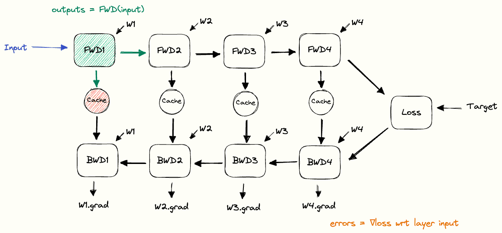 这一流程构成了任何神经网络架构的核心：输入从左到右穿过各层，直到输出与目标进行比较并计算损失。随后网络沿相反方向传播，每一层为自己的权重计算梯度，并将误差向后传递，直到第一层，此时我们就得到了所有参数的梯度。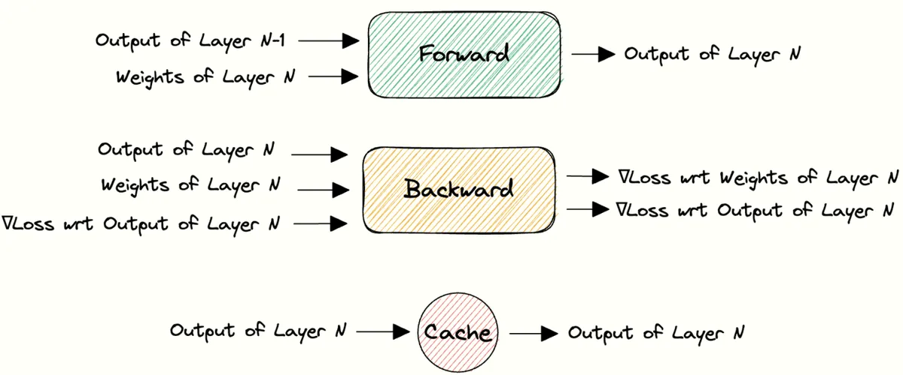 对每一层来说，这意味着前向步骤产生继续向后流动的输出，而反向步骤则为权重计算梯度，并把误差向后传递。
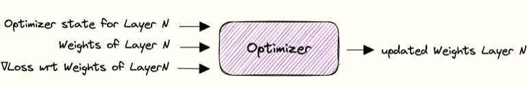 一旦有了梯度，优化器就会结合这些梯度及其内部状态来更新权重，使网络从错误中学习。一次前向传播、损失计算、反向传播和参数更新构成一个训练步骤，并在多个 **epoch** 中重复许多次，以逐步提升预测质量。图示来源：[Data-Parallel Distributed Training of Deep Learning Models](https://siboehm.com/articles/22/data-parallel-training) 

训练，尤其是大型语言模型的训练，在计算成本上极其昂贵。这种规模的模型会在由 GPU、TPU 或其他专用加速器（例如 Cerebras Wafer Scale）组成的大规模集群上进行训练。 左图是一家名为 Cerebras 的初创公司推出的新型 AI 芯片，它是目前已投产中最大的芯片，拥有 4 万亿个晶体管和大约 90 万个计算核心。顺带一提，Cerebras 推出了一种非常激进的 AI 芯片设计：其量产芯片拥有约 4 万亿个晶体管和约 90 万个计算核心。在推理场景下，它运行 OpenAI 的 GPT-OSS 120B 时，无论是单用户还是多用户设置，速度都约为 **2,700 tokens/sec**。相比之下，NVIDIA Blackwell DGX B200 对单用户大约可达到 **900 tokens/sec**，而在 10 个用户同时使用时会下降到 **580 tokens/sec**。关于硬件差异的拆解，可参见联合创始人兼首席系统架构师 Jean-Philippe Fricker 的[这场演讲](https://youtu.be/7GV_OdqzmIU?si=HW99JXE1MrLbMlTg)。你也可以试试他们的[聊天服务](https://chat.cerebras.ai/)，亲身感受高吞吐推理在实际中的表现。我认为，在我们深入这篇博客之前，这是理解“快速推理”究竟是什么样子的一个很好的入门材料。顺便说明一下，我与他们没有任何关联。我在这里写的一切都纯粹出于兴趣。  、Graphcore IPU 或 Tenstorrent 硬件。尽管 NVIDIA GPU 仍然是目前最常见的选择，但训练运行大体上属于一次性开销，通常耗资数千万美元。相比之下，推理则是在固定这些已学到的权重后，使用模型为新的输入生成预测或回复。这个区别听起来很直接，但在实践中，两者的工作流差异非常大，因此也需要不同的优化策略。

所有 LLM 的核心都是 **Transformer** 架构，它由论文 [“Attention Is All You Need”](https://arxiv.org/pdf/1706.03762) 首次提出。尽管此后出现了许多变体和改进，它依然是当前最先进模型的基础。下图左侧是原始的**仅解码器（decoder-only）Transformer**，右侧则是 Llama-2 70B 架构，展示了其中一些后续的改进：

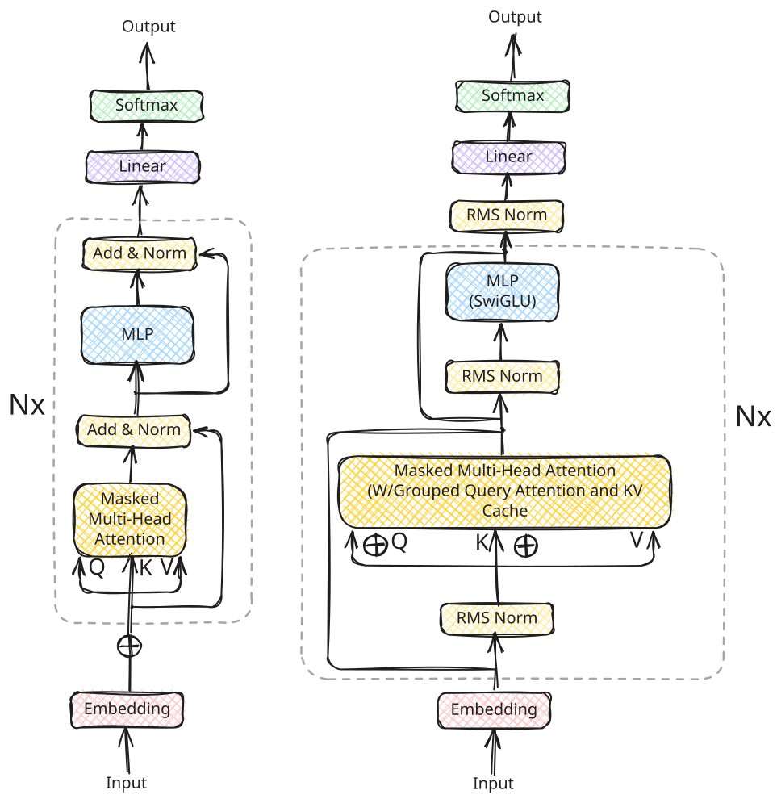

网络的流程始于原始文本——无论是训练数据还是推理时的真实提示词。模型并不能直接理解人类字符，因此第一步是**分词（tokenization）**。这会将文本拆分为模型可以处理的一串 token id。然后，每个 id 会通过**嵌入（embeddings）**映射到一个稠密向量空间中，从而为模型提供输入的数值表示。同时，还会给这些向量加入**位置编码（positional encodings）**，以便模型知道每个 token 在序列中的位置。

接下来，这个序列会穿过一叠 Transformer 解码器块。每一层都让 token 通过带有**因果掩码（causal mask）**的**多头注意力（multihead-attention）**彼此交互，从而保持语言的*自回归（autoregressive）*特性。在此基础上，序列再经过前馈变换，对特征进行扩展和筛选。网络还具有**残差连接（residual connections）**，即把某一层的输入加回到它的输出中，以防信号衰减，同时还有**归一化（normalisation）**来稳定权重。

这里有一些值得注意的架构差异。例如，LLaMA-2 70B 使用了 Grouped Query Attention（GQA），这是一种能够降低内存需求的注意力变体。大多数现代 LLM 还会将归一化层放在每个块之前，而不是像原始 Transformer 那样放在之后。尽管如此，其高层流程仍然相同：分词后的输入进入模型，带有上下文信息的嵌入输出出来。

在堆叠的末端，模型会把所有内容重新投影回词表空间，从而生成下一个可能 token 的概率分布。在训练期间，这个分布会与序列中每个位置的真实下一个 token 进行比较。这就是为什么人们常说 LLM 是在**下一个 token 预测任务**上训练出来的。训练还包括进一步的阶段，例如基于人类反馈的强化学习（RLHF），它会将模型调教得更像现代聊天系统中那样以更符合人类习惯的方式进行回答。

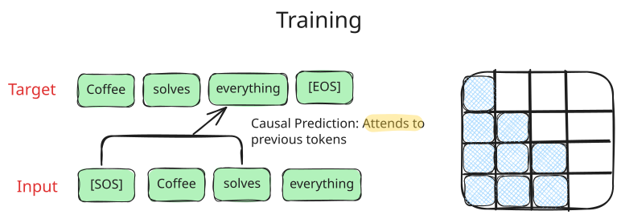

为了在转向推理前把这件事讲具体一点，考虑这个示例序列 Coffee solves everything，并在开头加上一个序列起始 token \[SOS\]。我们将该序列按适当方式进行分词。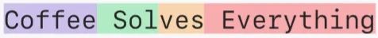 例如，这个序列在 GPT-4o 分词器中会被拆成 4 个 token，其 id 分别是 \[90651, 6615, 3350, 28997\]。
 然后，在每个位置上，模型都要预测下一个词。\[SOS\] 预测 Coffee，\[SOS Coffee\] 预测 solves，\[SOS Coffee solves\] 预测 everything，以此类推，直到模型预测出一个序列结束 token \[EOS\]。

现在关键点来了。在训练期间，我们已经知道完整序列。这使我们能够在一次前向传播中将整个序列送入 transformer。因果掩码保证 token $`t`$ 不会关注 token $`t + 1`$，因此自回归属性得到了保留，但所有位置的预测都可以并行计算。GPU 非常擅长这种并行处理，因此其计算核心会被工作充分填满。换句话说，训练是计算受限的。所谓**计算受限（compute-bound）**，是指提高硬件的原始计算能力会直接加快训练速度，而内存带宽并不是限制因素。

推理的本质则不同。模型看不到未来的 token，因此在提示词之后，它无法并行处理整个序列。它必须一次只前进一步、生成一个 token，并将每个新 token 追加到上下文中。这意味着 GPU 不再是在许多 token 上同时执行针对 AI 工作负载高度优化的大型稠密矩阵乘法，而是在处理由内存访问主导的小规模重复步骤——一遍又一遍地加载模型权重和缓存的激活值。

这种工作负载的转变非常重要。当瓶颈从重计算转移到频繁的数据搬运时，性能就会下降。搬运数据总是比对它做数学计算更昂贵。这就是为什么推理往往是**内存受限**的，而训练仍然是计算受限的。

## 推理的两个阶段

当用户发送一个提示词时，整个推理过程会分为两个阶段：

- **Prefill（预填充阶段）**：模型读取整个输入提示词，并为生成第一个 token 做准备。
- **解码（Decoding）**：逐个、按顺序产生 token 的迭代循环。

这两个阶段的特征和瓶颈都非常不同。

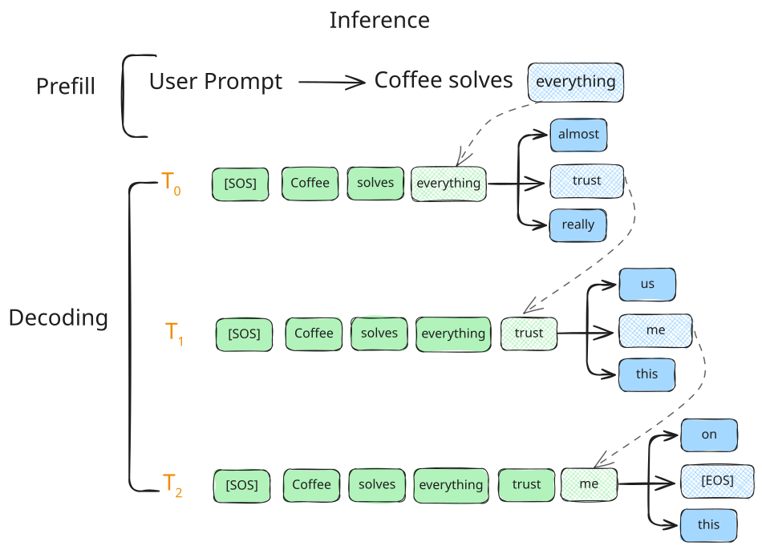

**预填充（Prefill）**

在预填充阶段，模型仍然可以利用并行性来处理提示词 token。所有输入 token（假设提示词长度为 N 个 token）会在一次前向传播中一起送入 Transformer 网络。这通常是一个大型矩阵乘法工作负载，会让 GPU 的计算单元保持繁忙。因此，预填充阶段通常是计算受限的。事实上，除了没有反向传播之外，这个过程与训练有更多相似之处。

这一阶段的输出是模型预测出的第一个 token，以及为每个注意力层中每个提示词 token 存储的一组 key/value 向量，通常称为 **KV 缓存**。我们暂时先忽略这一点，稍后再回到它。现在只需先认为这个过程的结果是一个新的预测 token。

从请求发出到第一个 token 被预测出来所经历的时间，是一个重要的推理指标，称为 **time to first token（TTFT）**。TTFT 会随着提示词长度的增加而增长，因为更长的提示意味着需要处理更多的 token，并且在到达第一次预测之前，需要计算更多的注意力键和值。尽管这会随着输入大小扩展，但在服务过程中，这通常不是主要问题。

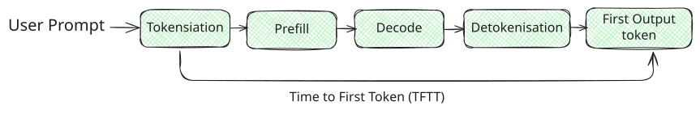

**解码（Decoding）**

在预填充之后，LLM 进入解码阶段，在这个阶段它会按顺序逐个生成新 token。解码的每一次迭代都会取当前序列（随着新 token 被追加而不断增长），并执行一次前向传播来预测下一个 token。与完整可用的提示不同，新 token 严格地一个接一个到达。每一步解码本质上都是串行的，因此在生成 token *t* 之前，我们无法计算 token *t+1*。

这使得解码与预填充在本质上不同。在实践中，它通常不是计算受限，而是受内存带宽限制，因为每个新 token 都需要从内存中取回模型权重，并读取已存储的 KV 缓存。GPU 最终花在搬运数据上的时间，往往比真正执行计算的时间还多。

正如 TTFT 衡量预填充一样，**Inter-token Latency (ITL)** 衡量的是在解码期间生成每个后续 token 所需的平均时间。

在聊天机器人这类交互式应用中，**TTFT** 和 **ITL** 都至关重要。用户不希望在看到第一个响应之前等待太久，同时他们也期望之后的 token 流能够平滑且速度合理。其他重要的推理指标还包括 **Total Latency (E2EL)** 和 **Token Generation Time**。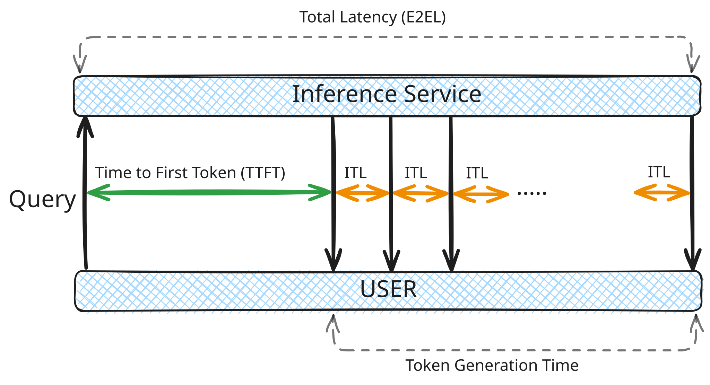  
从用户与推理服务之间的 token 生成过程来看推理指标。  

这种两阶段拆分也解释了为什么并行服务多个请求具有挑战性：预填充阶段可能开销较重，但每个请求只运行一次；而解码阶段可能持续很久（每个请求可能顺序生成数百个 token），并长期占用资源。许多 LLM 服务优化手段，例如 **连续批处理**、**推测解码** 和 **预填充/解码调度**，其目标都是在这些阶段中持续让 GPU 保持忙碌，同时避免某个慢请求成为其他请求的瓶颈。（我会在附录中介绍批处理和推测解码。与我们接下来会看到的分页式 KV 缓存类似，这些技术已经在现代推理系统中实现，例如 vLLM 和 TensorRT-LLM。）

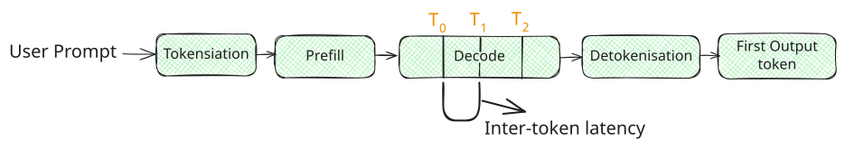

## 为什么解码需要 KV 缓存

鉴于解码具有**顺序性**，如果采用朴素方法来生成输出 token，速度将慢得难以接受。如果我们在每一步都必须为整个不断增长的序列从头重新计算每一层的激活值，工作量将会爆炸式增长。在实践中，这只是在重复计算之前已经算过的结果。我们本来就已经是**内存受限**，因此绝不能让情况变得更糟。

为了看清朴素解码有多浪费，考虑这样一组数字。假设提示有 1000 个 token，而我们想生成 100 个输出 token。如果没有缓存，模型在生成第一个输出时需要处理完整的 1000 个 token，生成下一个时需要处理 1001 个，再下一个则是 1002 个，如此继续，总计会远远超过 100,000 次 token 计算。

有了缓存，模型只需要处理一次这 1000 个提示 token，然后在此基础上计算 100 个新 token，总计只需 1,100 次计算，工作量几乎减少了两个数量级。诀窍在于避免重新处理序列中更早的 token：一旦提示被处理完，其中间结果就可以在未来所有解码步骤中复用。在实践中，这只需通过向 K 和 V 张量追加内容来实现。

### 键值（KV）缓存

解码阶段的一个核心优化是 **KV 缓存**。每个新 token 都依赖于所有先前 token 的 key 和 value 张量。这些既包括预填充阶段输入 token 的 K 和 V，也包括解码过程中生成的任何新 K 和 V。为了避免在每一步都重新计算这些张量，它们会被**缓存**在 GPU 内存中。随着每个新 token 到来，模型只需将它新产生的 K 和 V 追加到这个持续增长的缓存中，而后续步骤再从中读取。推理过程看起来就是这样：

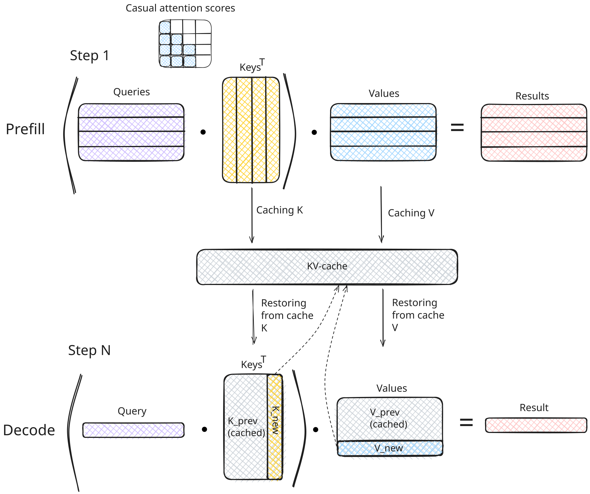

代价的来源不仅在于缓存本身的大小，还在于反复加载和更新大型 K 与 V 张量所带来的内存带宽成本。在标准多头注意力中，每个头都维护自己的 K 和 V，因此存储开销和带宽开销都会随着头数直接扩展。对于大模型来说，这使得缓存成为推理中的主要瓶颈之一。

为了降低这些成本，人们提出了多种注意力机制。它们的目标都是在尽可能保持模型质量的同时，缩小 KV 占用或减少内存传输。我不会深入介绍每种机制的细节，但这里简要概述其中最知名的几种：

- [**Multi-Query Attention (MQA)**](https://arxiv.org/pdf/1911.02150)：  
  一层中的所有头共享同一组 K 和 V，而不是各自维护自己的 K 和 V。这显著降低了解码期间的缓存大小和内存读取量，不过通常会以一定的模型质量损失为代价。

- [**Grouped Query Attention (GQA)**](https://arxiv.org/pdf/2305.13245)：  
  这是 MQA 和完整多头注意力之间的折中方案。Query 头会被划分为多个组，每组共享一个 K 和 V。这样既保留了 MQA 的大部分效率优势，又保留了更多多头注意力的精度。LLaMA 2 就是使用 GQA 的著名例子。

更新的方法则更进一步，将 K 和 V 压缩到潜在空间中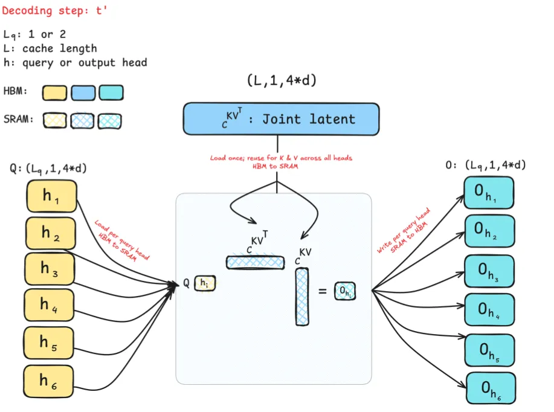 在 **MLA** 中，K 和 V 被压缩到一个由所有头复用的共享潜在空间中。这减小了 KV 缓存大小，但也带来了扩展问题：这个潜在表示必须在每个 GPU 上完整保留，因此无法在分布式推理中高效切分。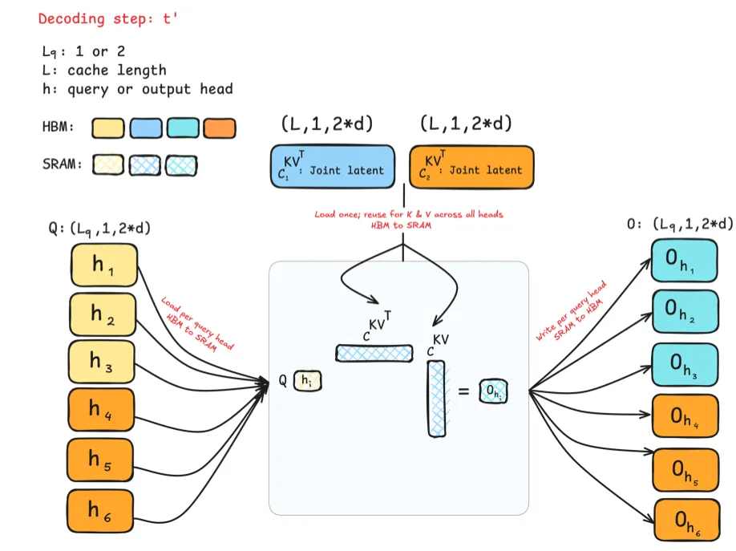 **GLA** 通过将头拆分成多个组来解决这个问题，每组拥有自己的潜在表示。这样缓存就能自然地分布到多个 GPU 上，每个设备只持有自己那一部分。这使得并行成为可能，同时不会增加单设备内存。通过将 K 和 V 折叠为低秩投影，GLA 还释放了参数预算，可用于更宽的投影或更多的 query 头。结果是更好的扩展性、跨批次更平滑的延迟，以及更适合硬件的效率，尤其是在长上下文或大负载下。

- [**Multi head Latent Attention (MLA)**](https://arxiv.org/pdf/2405.04434)：将 K 和 V 存储在一个学习得到的低维潜在空间中，并在需要时进行投影进出。这样可以减少 KV 缓存大小和带宽占用，同时用少量额外的投影计算作为交换。这一机制因在 DeepSeek V2 及其后续模型中的使用而广为人知。

- [**Grouped Tied Attention (GTA)**](https://arxiv.org/pdf/2505.21487)：  
  在每个组内绑定 keys 和 values，从而减少缓存大小和解码时的内存流量，同时保持与 GQA 相当的质量。绑定的 KV 向量通过一次单独投影创建。完整向量会被缓存，并直接作为 value 使用（不进行旋转）。对于 key，只取前一半且不旋转，而后一半则来自一个带有 RoPE 的单头独立投影，并广播到所有组。这样可以将 KV 缓存减半、减少内存流量，并且相较于 GQA 将算术强度翻倍。

- [**Grouped Latent Attention (GLA)**](https://arxiv.org/pdf/2505.21487)：  
  将 K 和 V 存储在一种为高效并行切分而优化的潜在表示中。这样既实现了类似 MLA 的压缩效果，又更加适合硬件，也更适用于分布式推理。

## 朴素 KV 缓存的问题

虽然 KV 缓存解决了重复计算的问题，但它也将瓶颈大幅转移到了内存上，并且随着上下文长度增长，引入了严重的内存管理问题。每个活跃请求都会随着 token 一个接一个地产生一串 key 和 value，而这串数据必须驻留在 GPU 上，以便在解码期间快速读取。一旦我们尝试同时服务多个请求，比如使用 连续批处理，吞吐量就不再受计算限制，而变成受内存限制。这主要是由两点导致的：第一，随着 KV 缓存大小增长，我们能够在一个批次 中同时处理的请求数会受到限制，从而降低吞吐量；第二，当内存分配不高效时，朴素的 KV 缓存会导致严重的碎片化，包括内部碎片和外部碎片。

### 内存扩展

KV 缓存的内存使用量会随着序列长度线性增长，并消耗大量 GPU 内存。对于每个生成的 token，缓存都必须为每个 Transformer 层和每个头存储一个 key 向量和一个 value 向量。我们以 LLaMA-2–13B 为例来看具体数字。缓存大小可以估算为：

``` math
KV_{cache\_ size} = 2\times bytes\times n_{layers}\times B\times n_{heads}\times d_{head}\times n_{seq}
```

其中  
$`n_{layers}`$ = Transformer 层（block）的数量  
$`B`$ = 批大小  
$`n_{heads}`$ = 注意力头数（对于 MQA，这会降为 1；对于 GQA，则取决于组数）  
$`d_{head}`$ = 每个头的维度  
$`n_{seq}`$ = 序列长度或上下文长度  
2 = 每层分别用于 Key 和 Value 的两个缓存（这正是 MLA 和 GLA 主要减少的部分，会从 2 变成 1）

根据我们刚刚给出的公式来计算，对于采用 FP16（每个元素 2 字节）的 LLaMA-2-13B，在标准多头注意力配置下（40 层、40 个头、$`d_{head}`$ = 5120/40 = 128，默认上下文长度为 4096 token），每个 token 的 KV 缓存大约为 0.78125 MiB。对于完整的 4096 token 窗口，KV 缓存大小约为 3.125 GiB。当我们增大批大小时，总内存占用会线性增长，因为每增加一个序列，每个 token 还会额外增加约 0.78125 MiB。

现在我们已经理解，KV 缓存会阻止我们处理或生成非常长的序列（即成为长上下文窗口的障碍），也会阻止我们处理大批量，因此也就阻止了我们最大化硬件效率。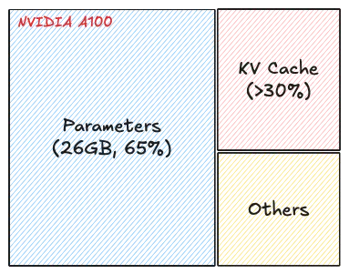 在 NVIDIA A100 40 GB 上，一个 13B FP16 模型大约使用 ≈26 GB 来存放权重，只剩下 ≈12 GB 可用于 KV 缓存。在完整多头注意力下，每个 token 的 KV 大约是 ≈0.8 MB，因此这张卡总共大约只能容纳 ≈15k 个 token 的 KV。若上下文窗口为 2048 token，这大约意味着一次可驻留 ≈7 个序列。提示 token 只是占用了 2048 配额中的一部分，因此并发度大致不变，但每个序列可生成的新 token 会更少。实际上的启示是，解码吞吐量受 KV 容量上限所限制。分页式 KV 缓存是我们这里关注的重点，但 KV 量化（我会在附录中讨论）以及能够缩小 KV 占用的替代注意力机制同样有帮助。

这是其中一个问题，接下来我们将看到内存碎片问题。

| Model       | n_layers | n_heads | d_head | d_model |
|-------------|----------|---------|--------|---------|
| Llama-2-7B  | 32       | 32      | 128    | 4096    |
| Llama-2-13B | 40       | 40      | 128    | 5120    |
| OPT-7B      | 32       | 32      | 128    | 4096    |
| OPT-13B     | 40       | 40      | 128    | 5120    |
| OPT-30B     | 48       | 56      | 128    | 7168    |
| OPT-66B     | 64       | 72      | 128    | 9216    |
| OPT-175B    | 96       | 96      | 128    | 12288   |

### 连续批处理中的碎片化

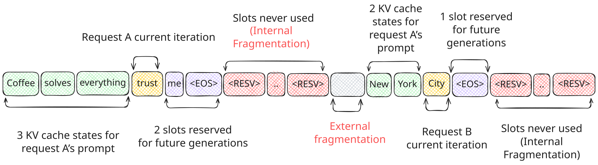

除了缓存体积极其庞大之外，早期的 LLM 服务系统在处理内存分配时也效率低下。这是因为在推理过程中，输出序列的长度事先是未知的。你在自己写提示词时就能想象到这一点：有些提示很短，有些很长，而每个提示既可能生成一段很长且详细的输出，也可能只生成很短的结果。现在把这种情况扩展到成千上万的用户。为了应对这种不确定性，服务平台过去通常会根据每个请求可能达到的最大序列长度，静态地为其分配一块内存，而不管实际输入或最终输出长度是多少。它们通过预分配方案来实现这一点，以确保有足够的内存容纳某个请求*潜在的*最大 KV 缓存大小，即使这部分空间最终根本不会被完全使用。

上图说明了两种碎片化是如何出现的。我改编了论文中的图，但使用了我们在这篇博客中一直沿用的相同示例提示，以保持一致性。这里我把它称为请求 A，旁边还有一个非常简单的请求 B。当然，在实践中你可以想象会有更多请求被一起批处理。正如你所看到的，内存浪费主要有两个来源：

1.  为未来 token 预留的槽位：如果生成提前结束，使用的 token 少于最大值，那么剩余已分配的内存就会一直空着，无法供其他请求使用。这就是**内部碎片**。
2.  来自内存分配器的**外部碎片**，例如伙伴分配器（buddy allocator）。这一点稍微更隐蔽一些，所以我们通过一个例子来说明。

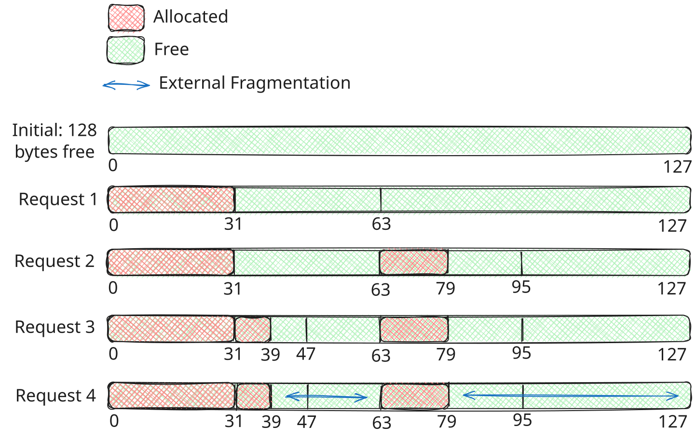

我们从 128 个空闲字节开始。请求 A 到来，需要 32 个字节。分配器不断将这条内存条对半分，直到可以分配出 0 到 31，把 32 到 63 和 64 到 127 留为空闲。请求 B 需要 16 个字节。我们从右侧切出它，把 64 到 127 拆分，再把 64 到 95 拆分，并分配 64 到 79。现在 80 到 95 和 96 到 127 是空闲的，而已分配的块夹在中间。请求 C 很小，只需要 7 个字节。分配器把 32 到 63 一路拆成一个 8 字节的小块，并分配 32 到 39，留下该块内 1 个字节未使用（**内部碎片**）。此时 GPU 仍然总共有相当多的空闲内存：40 到 47、48 到 63、80 到 95 和 96 到 127，加起来共有 72 个字节。但这时又来了一个新的长请求，需要一整块连续的 64 字节。尽管总体空闲内存是足够的，但却没有任何单个连续块有这么大，因为 64 到 79 已经被占用了，而左侧也已经被切分成更小的碎片。于是分配失败。这就是**外部碎片**，而这正是朴素的按请求分配 KV slab 所造成的浪费，因为早期的 LLM 服务系统会把每个请求的 KV 缓存存放在预先分配好的连续内存 slab 中。

这两种碎片化形式本质上都是纯浪费。即使预留内存最终会被消耗掉，在请求的整个生命周期内将其一直保留出来——尤其是当预留空间很大时——也会阻止其他请求在这段时间内使用它。

## 分页作为类比

**PagedAttention** 直接借鉴了类 Unix 和 Windows 等操作系统中的**虚拟内存**与**分页**机制。操作系统不会把内存当作一个巨大的整体块，而是将其划分为页框，并只把活跃的部分保留在高速内存中。

LLM 服务在 KV 缓存上也面临同样的问题。通过对其进行分页，我们可以更高效地分配内存、避免浪费，并支持更长的上下文。在深入讲解分页式 KV 缓存和 PagedAttention 之前，我认为先快速回顾一下这个操作系统类比会有帮助，这样后面就能更容易建立两者之间的映射关系。

### 操作系统类比

内存压力一直是计算领域中的核心问题。软件的增长速度通常快于内存容量，因此系统需要一种方法来运行那些大于可用内存的程序，同时也要能在多个程序总大小超出可容纳范围时并发运行它们。因此，提出的解决方案就是*虚拟内存*。

这个思路是：每个程序都拥有自己的**虚拟地址空间**，它被划分为固定大小的**页**；而物理内存则被划分为同样大小的**页框**。一个小型映射结构记录着哪个虚拟页当前位于哪个物理页框中。正是由于这种间接映射，程序可以表现得仿佛它的全部内存都存在，尽管实际上系统只会把工作集保留在高速内存中。

例如，设想有一条指令 MOV REG,1000，其中 1000 是某个计算得到的虚拟地址。在没有虚拟内存的系统中，这个地址会被直接送到内存总线，并访问该位置上的字。在有虚拟内存的情况下，一切都要先经过**内存管理单元（MMU）**，它会查阅页表从数学上讲，页表是一个函数，以虚拟页号为自变量，以物理页框号为输出。 。如果该页存在，访问会立即成功并发送到总线。如果该页不存在（这一点通过硬件中的存在/不存在位表示），MMU 就会触发一次**缺页异常（page fault）**，操作系统随后从较慢的存储中取回缺失的页，将其放入一个空闲页框，更新映射，然后重试该指令。

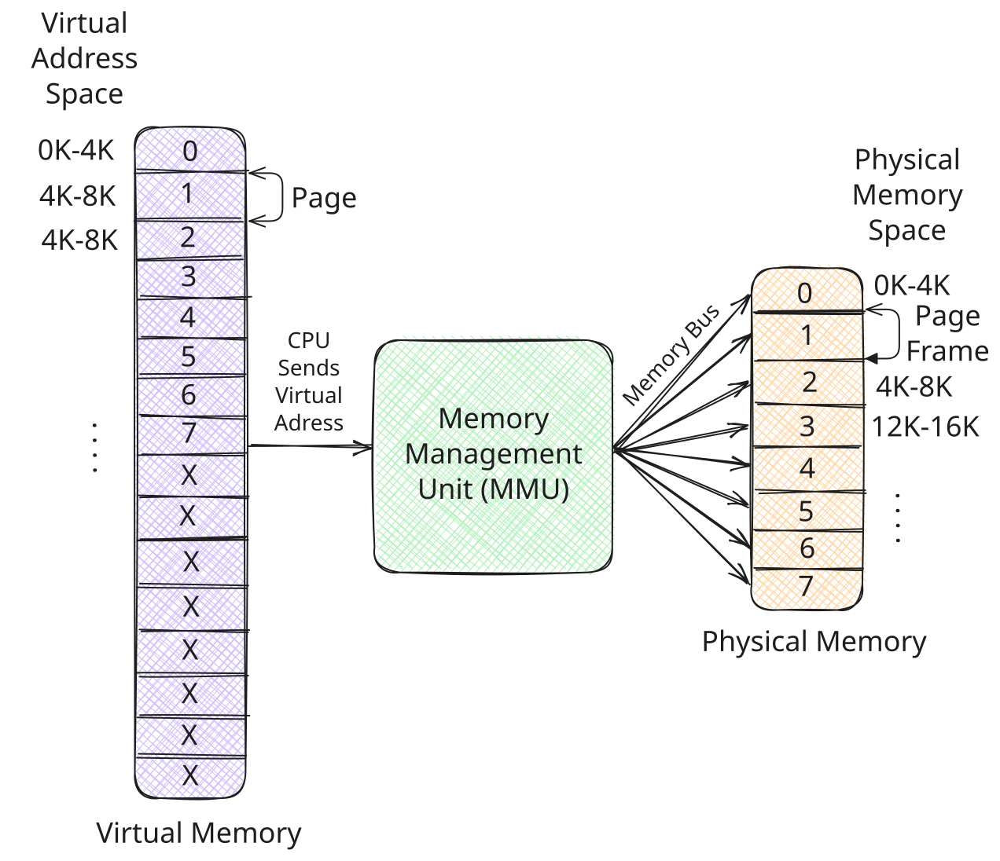

我尝试通过这张图把这个结构说明清楚，不过也许再举个简单例子会更清晰。假设我们有一个 64 KB 的虚拟地址空间，但物理内存只有 32 KB。虚拟空间被划分为 16 个页，每页 4 KB；物理内存被划分为 8 个页框，每个也是 4 KB。如果页表说明虚拟页 0 当前位于页框 2，那么对该页中任意地址的访问都会被重定向到那里。如果虚拟页 2 被映射到页框 6，它就会被送到页框 6。但如果虚拟页 8 被标记为不存在，MMU 就会触发异常，操作系统会从磁盘中取回该页放入某个页框，更新映射，然后程序继续执行。由于地址转换会不断发生，系统需要一些方法来让它足够快。这就是像快表（TLB）和多级页表这类技术发挥作用的地方。这里我们不会深入讲它们，但知道它们的存在是有帮助的。

关于操作系统这一侧，我们只需要了解这些就够了。虚拟内存通过把一个更大的连续地址空间映射到一个较小的高速内存池上，并根据需要将页换入换出，从而提供了一种大而连续地址空间的*假象*。现在让我们把这些概念带到分页式 KV 缓存，以及后面的 PagedAttention 中。

### 分页式 KV 缓存

分页式 KV 缓存把同样的分页思想应用到了 KV 缓存上。在 vLLM 内部，**KV 缓存管理器** 是分页式 KV 缓存的核心。它本质上负责管理 keys 和 values 的内存，而**调度器** 决定每一步哪些请求会继续推进。关键区别在于，缓存管理器不会给每个请求分配一个巨大的连续缓冲区来存储它所有的 keys 和 values。相反，它把缓存拆分成固定大小的**KV blocks**，以每块包含的 token 数来衡量——类似于我们之前看到的页——并维护一个**全局空闲块池**，你可以把它看作一个双向链表。同时，它为每个请求分配一个小型的**block table**，用于将其逻辑块映射到 GPU 内存中的物理块（也就是页框）。当请求增长时，就从池中取出新的块并追加到它的表中。当请求结束时，它的块会回收到池里，可立即被其他请求复用。

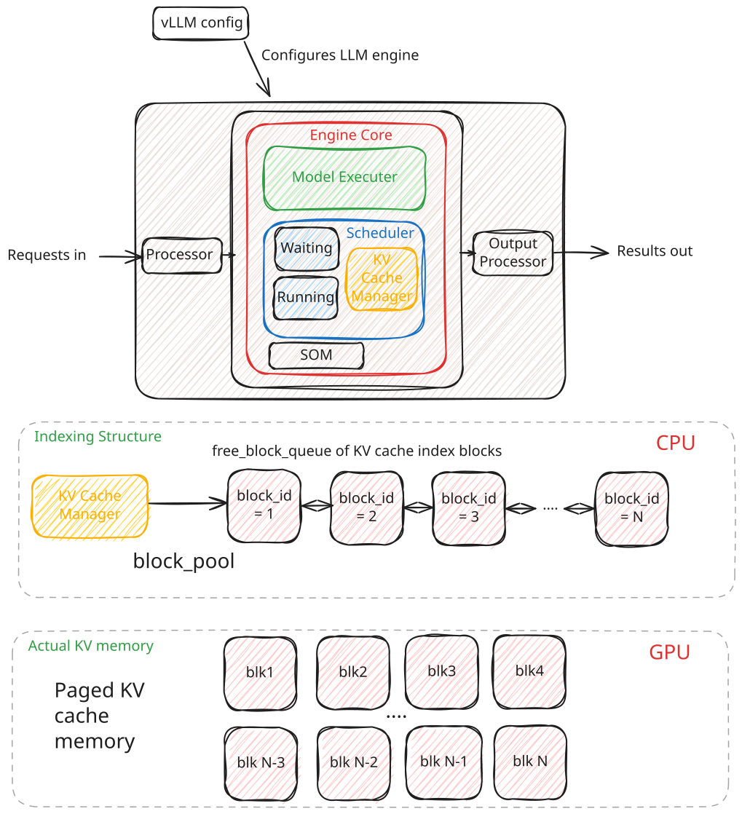

上半部分是 **engine** 视图，我根据 [Aleksa 的文章](https://www.aleksagordic.com/blog/vllm) 做了改编。请求进入后，处理器会对其进行准备，把原始输入转换成合适的请求格式，也就是分词（tokenization）；调度器决定运行哪些请求；而 KV 缓存管理器位于中间协调内存。中间部分是我们前面提到的 CPU 侧索引结构，可以把它理解为由缓存管理器管理的、保存可用块标识符的双向链表；底部视图则是真正位于 GPU 上的 KV 数据，以许多大小相同的块形式存储。block table 是两者之间的桥梁，它们同样由 KV 缓存管理器 维护。Block table 是用于将逻辑 KV 块映射到实际计算得到的 KV cache 块的主要表结构，即使这些物理块实际上是分散存放的也没关系。

在初始化时，engine 会测量可用于缓存的 VRAM 数量，选择一个 token 块大小 $`B`$，并计算总共能容纳多少块。对于标准的 Transformer 层，每个块的字节数为：

``` math
bytes = 2\times B\times num\_ kv\_ heads\times head\_ size\times bytes
```

其中系数 2 表示同时包含 keys 和 values。在 GQA 或 MQA 中，num_kv_heads 会变得更小，因此每个块更轻，占用更少内存，于是相同内存中可以容纳更多块。

在执行过程中，vLLM 采用的是即时分配，而不是预测完整的未来长度。在每个 engine step 中，调度器决定哪些请求要推进，然后要求 KV 缓存管理器 仅为本步处理的 token 预留块。对于预填充阶段，新 token 的数量是事先已知的，因此缓存管理器会为一个包含 $`N`$ 个 token 的提示分配 $`\lceil N\div B\rceil`$ 个块。对于解码阶段，这一步通常只会新增一个 token。值得一提的是，在 V1 中，engine 调度器可以在同一步中混合预填充与解码；而在 V0 中——为了简化并与 Aleksa 的文章保持一致，这里采用的是这种描述——任意时刻只能发生其中之一。缓存管理器会检查最后一个逻辑块中剩余的空槽，并且只有当该块会在本步溢出时才分配一个新块。类似地，当一个请求完成后，它的块会被归还到池中。由于每个块的大小都相同，任何一个归还的块都可以满足未来任意块请求。

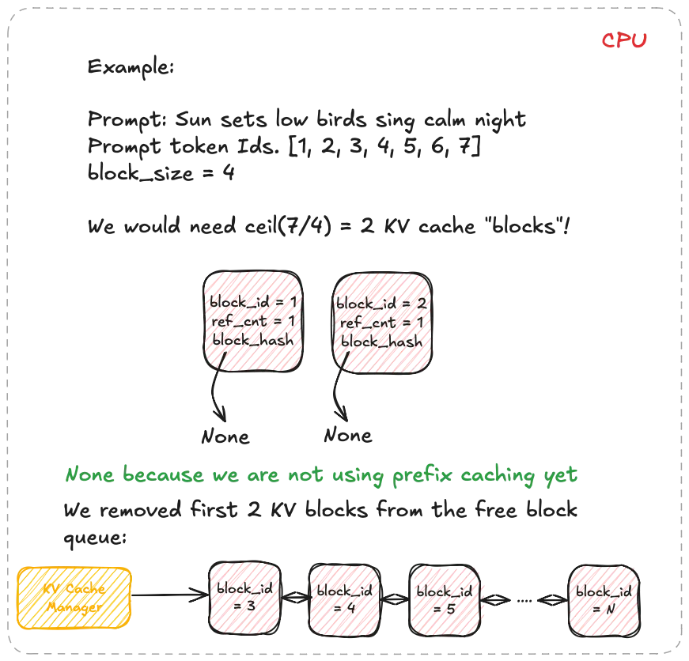

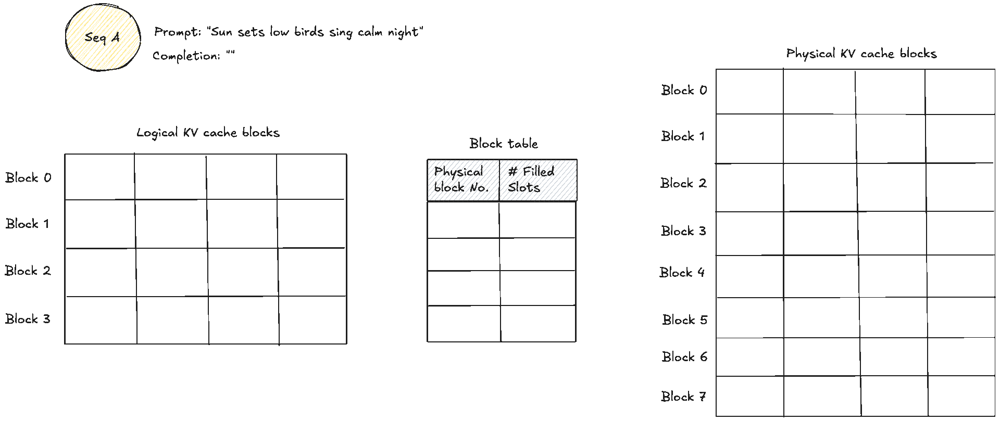

这两张图展示了一个简单提示在逻辑视图和物理内存视图中的样子，以及它们如何映射到 block table 中。假设该提示有 7 个 token，且 $`B = 4`$。我们需要 $`\lceil 7\div 4\rceil = 2`$ 个 KV 块。缓存管理器会从空闲池中弹出两个标识符，并把它们写入该请求的块表（block table）。每个条目会跟踪物理块 id、一个小型引用计数，以及通常还有一个块哈希值。引用计数支持内存共享。当两个请求共享相同的前缀时，它们都会指向相同的物理块，而计数会增加。无需进行任何拷贝，我们下一节会看到这一点。在解码期间，新 token 会被写入下一个空闲槽位。当最后一个块被填满时，就会再追加一个块，而表也会增长一个条目。

这里有一个至关重要的说明需要明确：块是共享读取、独占写入的。一个物理 KV 块的写权限只属于单个请求。你绝不会允许一个无关请求把 token 写进别人块中的剩余空槽里。如果两个请求共享相同的前缀，它们可以共同读取这些块，而引用计数会增加。一旦其中某个请求需要追加内容，缓存管理器就会为该请求分配一个新的块，这实际上就是以块粒度进行的写时复制（copy on write）。这也意味着，一个请求最后一个块里可能会留下一些未使用的尾部槽位，而这正是**内部碎片**。不过它的上界最多只是每个请求 $`B - 1`$ 个 token 槽位，而不是像你可能直觉上认为的那样与整个上下文长度相关。块大小 **$`B - 1`$** 本质上是在指针追踪开销与装箱效率之间做权衡：块越大，查找次数越少，但复用粒度越粗；块越小，灵活性越高，最后一个块中的浪费也更少，但需要更多次查找。

这是一个示例，展示了当初始有两个共享相同前缀的提示词 时，内存共享会是什么样子。之后当它们想要生成新的 token 时，缓存管理器会为该请求分配一个新的块，并执行写时复制，把相同的 KV 缓存复制到另一块区域中，从而让每个请求都拥有自己的“副本”和块，用来放置它的新 token。

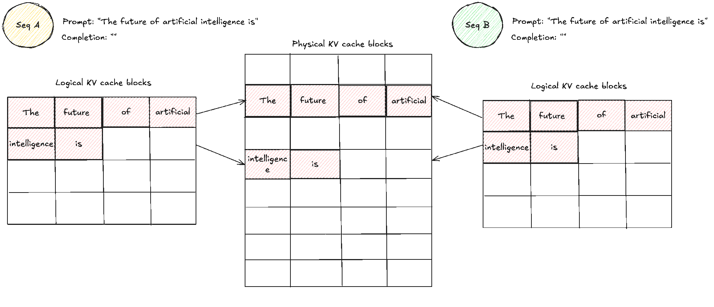

这种布局直接修复了我们之前看到的问题。**内部碎片**会缩小，因为系统不再预留最坏情况大小的整块区域。它只分配实际使用到的块，并且随着解码推进一次只分配一个块。**外部碎片**也基本消失了，因为分配总是以相同大小的块进行，所以空闲空间不会变成不可用的空洞。任何空闲块都可以分配给任何请求，而块表会隐藏这些块在物理上是分散的这一事实。

对于批处理和解码，这种方式也带来了一些实际收益。连续批处理会更加顺滑，因为可以混合长度差异很大的请求而不浪费内存。内存共享避免了重复，并且表示成本很低。如果你从同一个 提示词 中采样多个补全结果，或者运行共享早期前缀的 beam search，那么所有这些路径都可以共享相同的物理前缀块，只在生成新 token 时才发生分叉。块表只需将多个请求同时指向同一组只读块，这样就能在不复制的情况下节省内存。最后，分页在高压场景下提供了清晰的行为。如果当调度器想推进一个批次 时，池中已经没有空闲块，系统可以暂停新的预填充工作，通过将低优先级请求的块归还到池中来驱逐它们，或者在可接受时退回到重计算策略。所有这些选择都发生在 KV 块这一层级，因此策略保持简单且可预测。

## Paged Attention 机制

**PagedAttention** 是让分页式 KV 缓存真正运作起来的计算侧机制。经典 attention 假设一个序列的 key 和 value 位于一个连续缓冲区中。PagedAttention 去掉了这个假设。它像我们之前看到的那样，将每个请求的缓存切分成大小相等的 KV 块，然后通过跟随该请求的块表来驱动 attention，这样块就可以存在于 GPU 内存中的任意位置，同时数学结果仍与标准 attention 完全一致。

下面是一个使用查询 token *soon* 的简单示例。这个序列的历史 token 分布在三个不同的 KV 块中：

- 块 1 存储 sing、calm、night、bring
- 块 3 存储 peace、soon
- 块 7 存储 Sun、sets、low、bid

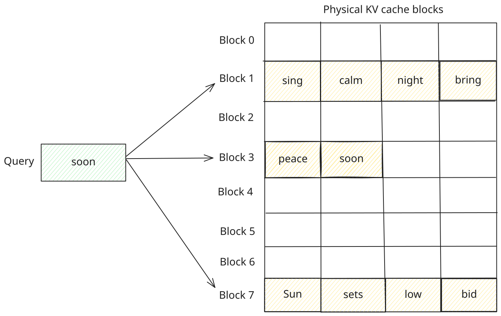

即使这些 token 存在于非连续内存中，块表仍能确保内核按照正确的逻辑顺序遍历它们，并计算 attention，就好像它们都紧挨着位于同一个缓冲区中一样。

这些块编号为 $`j = 1,2,3,\ldots`$。块 $`j`$ 只是包含位置落在该范围内的那 $`B`$ 个 token 的 key 和 value：

``` math
K_{j} = \left\lbrack k_{(j - 1)B + 1},\ldots,k_{jB} \right\rbrack,\qquad V_{j} = \left\lbrack v_{(j - 1)B + 1},\ldots,v_{jB} \right\rbrack.
```

因此，$`K_{1}`$ 保存序列中前 $`B`$ 个 key，$`K_{2}`$ 保存接下来的 $`B`$ 个，依此类推。$`V_{j}`$ 对 value 也是同样的道理。

对于当前查询 token $`i`$，其查询向量为 $`q_{i}`$，头维度为 $`d`$，我们可以通过逐块访问这些块来计算 attention。用块的形式写出来就是：

``` math
A_{ij}\; = \;\frac{\exp\!\left( q_{i}^{\top}K_{j}\,/\,\sqrt{d} \right)}{\sum_{t = 1}^{\lceil i/B\rceil}\exp\!\left( q_{i}^{\top}K_{t}\,/\,\sqrt{d} \right)},
```

 

``` math
o_{i}\; = \;\sum_{j = 1}^{\lceil i/B\rceil}V_{j}\, A_{ij}^{\top}.
```

这里，$`A_{ij} = \left( a_{i,(j - 1)B + 1},\ldots,a_{i,jB} \right)`$ 是块 $`j`$ 内各个 token 的 attention 权重向量。向量 $`o_{i}`$ 则是 token $`i`$ 的标准 attention 输出。

内核所做的事情其实很直接。它按逻辑顺序遍历请求的块表。对于每个块 $`j`$，它会查找该块在 GPU 内存中的位置，加载 key $`K_{j}`$，形成局部分数

``` math
q_{i}^{\top}K_{j}/\sqrt{d},
```

更新一个**运行中的 softmax 归一化器**我没找到更多信息来确认它是否与 [Flash Attention](https://arxiv.org/pdf/2307.08691) 中使用的 online softmax 完全相同，但它们很可能非常相似。，该归一化器跨越所有已经看到的块，然后将归一化后的权重与 value $`V_{j}`$ 相乘，并把结果累加到 $`o_{i}`$ 中。由于 softmax 是跨多个块运行的，内核会在流式处理中维护一个运行最大值和一个运行求和。这样得到的数值与所有 key 和 value 都放在一个连续数组中时完全相同。

现在让我们看一些数字，以理解这种方法优化的目标：

之前的系统会浪费 **60%–80%** 的 KV 缓存内存，而 vLLM 能够以不到 **4%** 的浪费实现接近最优的内存使用。由于这种内存效率的提升，我们可以用更少的 GPU 达到相同的输出，因此吞吐量显著高于其他推理引擎。这种受虚拟内存启发的 attention 设计，因此将**内部碎片**限制在块大小范围内，并消除了**外部碎片**。下面这张来自论文的图展示了：在相同模型下，与 vLLM 的 PagedAttention 相比，三种不同 服务系统中的不同类型的内存浪费情况：

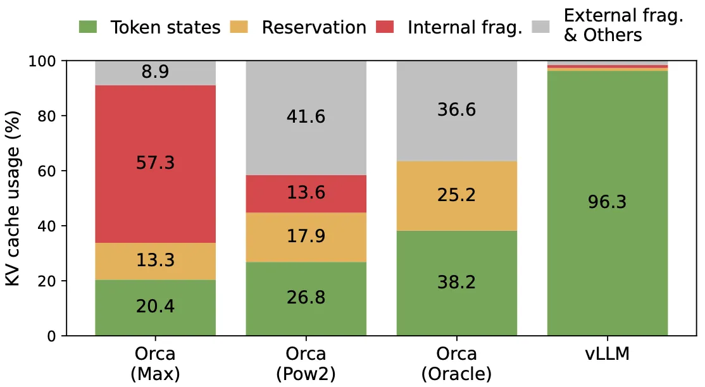

在结束之前，必须指出一个将虚拟内存和分页技术应用到其他 GPU 工作负载时的注意事项。虚拟内存和分页的思路之所以对 LLM 服务 中的 KV 缓存管理有效，是因为这种工作负载需要动态内存分配，而且性能受限于 GPU 内存容量。然而，这一点并不普遍适用于所有其他 AI 工作负载。在 DNN 训练中，张量形状通常是静态的，因此内存分配可以提前优化。而在服务那些非 LLM 的 DNN 时，即便提升了内存效率，也未必会带来性能收益，因为这类工作负载主要受计算能力限制。在这种场景下，引入 vLLM 的技术甚至可能因为额外的内存间接访问开销和非连续块访问而降低性能。话虽如此，如果能看到这些技术被应用到其他具有与 LLM 服务 相似特性的工作负载上，仍然会是一件很令人兴奋的事。

------------------------------------------------------------------------

## 附录：其他推理优化技术

### 静态批处理 vs 连续批处理

批处理有助于缓解 LLM 面临的内存带宽限制，因为它们往往会在搬运数据和加载参数时浪费大量 GPU 计算资源。你不必为每个请求都加载一次模型参数，而是只加载一次，然后用它来处理许多输入序列或请求。这样可以更高效地利用芯片的内存带宽，从而带来更高的计算利用率、更高的吞吐量以及更低成本的 LLM 推理。

**静态批处理**是传统风格，即服务器会等待直到有固定数量的请求到达，然后将它们作为一个批次 一起处理。之所以称为静态，是因为 批大小在推理完成之前保持不变。

- 一个批次 中最先到达的请求必须等待最后一个请求，造成不必要的延迟。可以把它想象成一台打印机：在排队的文档数量达到固定值之前，它不会开始打印，而不管最后一份文档要多久才会到。

- 同一个批次 中的请求并不都是一样的。在 LLM 推理中，一些请求可能只会生成很短的回复，而另一些则可能涉及冗长的、逐步展开的推理。由于 批次中所有请求都必须等到最慢的那个完成，这会导致计算资源浪费并增加延迟。

如果不对用户输入和模型输出长度作出严格假设，未经优化的生产级 LLM 系统就无法在不让 GPU 利用不足并产生不必要成本的情况下服务流量。我们必须优化 LLM 的服务方式，才能让它们的能力被广泛使用。

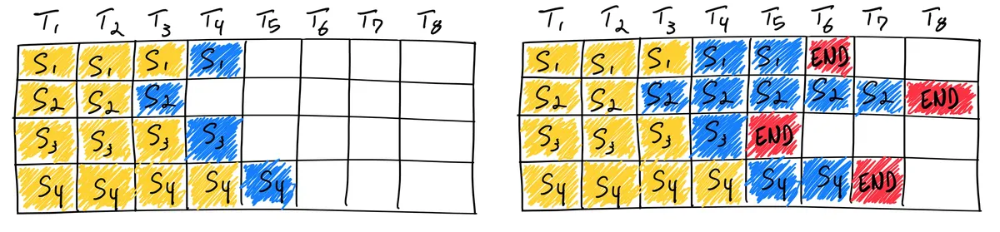

与其等待一个批次 中的每个序列都完成生成，在论文 [Orca: A Distributed Serving System for
Transformer Based Generative
Models](https://www.usenix.org/conference/osdi22/presentation/yu) 中，他们实现了**迭代级调度**，其中 批大小是按每次迭代来选择的。结果是，一旦 批次中某个序列完成生成，就可以立即插入一个新序列来替代它，从而比静态批处理获得更高的 GPU 利用率。文献中有时会把这称为 dynamic，但 **continuous** 更贴切，而 **dynamic** 更适合保留给另一种策略。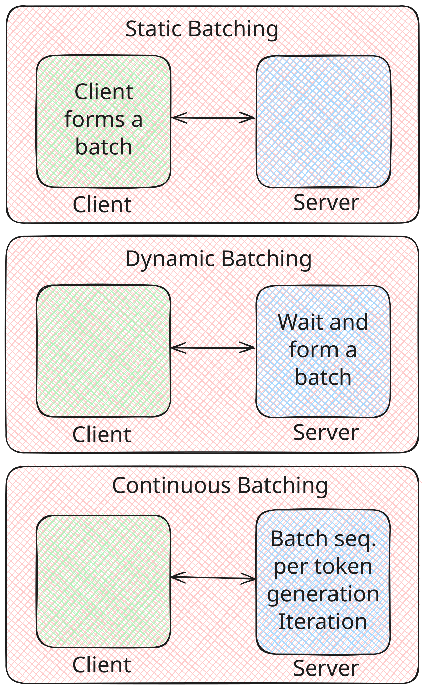 在
**静态批处理**中，服务器会等待直到有固定数量的请求到达，然后把它们作为单个 batch 一起处理。**动态批处理**仍然会把传入请求收集成 batch，但它不坚持固定的 批大小。相反，它使用一个时间窗口，并处理该窗口内到达的所有请求。如果 批次更早达到大小上限，就会立即启动。这就像一辆公交车：要么按固定时刻发车，要么坐满就走，哪个先发生就按哪个来。**连续批处理**不会等待一个批次 中所有序列都完成，而是在迭代层面上对序列进行分组。。如果你感兴趣，这篇博客：[How continuous batching enables 23x
throughput in LLM inference while reducing p50
latency](https://www.anyscale.com/blog/continuous-batching-llm-inference)，对这一点有更详细的解释。也感谢作者们提供了上面的图，帮助可视化这些策略。

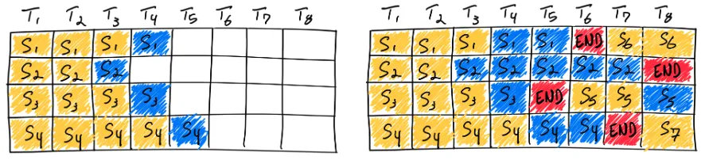

### 推测解码

最基础的生成过程在每一步解码时一次只输出一个 token。不过关键在于，要生成 K 个 token，你就需要做 K 次模型前向传播；正如文中解释的那样，这在本质上是顺序执行的，因为第 t+1 步依赖于直到第 t 步为止的生成结果，因此同样无法很好地利用计算资源。

因此，token 生成时间会线性增长。这实际上也与上面解释的不同批处理策略有关，因为在静态批处理场景中，吞吐量正是被这种线性增长所限制。所以，这也进一步说明了为什么连续批处理可以缓解这一瓶颈。

LLM 越大，能力通常越强。然而，这些更大的模型也更慢，因为每一步解码都需要读取整个模型的权重。

因此，Google Research 团队在 [Fast Inference from Transformers via Speculative Decoding](https://arxiv.org/pdf/2211.17192) 中提出了**推测解码**。该算法通过一个更小的草稿模型并行提出多个 token 草案，再由更大的目标模型并行验证这些候选 token，并接受那些与自身预测一致的结果。

这种方法受到两个关键观察的启发：

1.  有些 token 比其他 token 更容易生成：许多下一个 token 从上下文中就很明显，可以由更小的模型提出。
2.  推理的瓶颈通常是内存而不是计算。

推测解码的灵感来自一种称为 **推测执行** 的优化技术，后来这一技术被进一步以概率方式泛化，并应用到自回归模型上。简而言之：

- **推测执行**：假设我们有两个缓慢的步骤：先计算 $`Y = f(X)`$，再计算 $`Z = g(Y)`$。通常，在知道 $`Y`$ 之前，我们无法开始计算 $`g(Y)`$，这就强制形成了严格的串行依赖。推测执行则说：“如果我可以用一个 **廉价近似** $`f^{}(X)`$ 来*猜测* $`Y`$，然后并行启动 $`g(f^{}(X))`$ 会怎样？” 一旦原始的 $`f(X)`$ 完成，我就检查这个猜测。如果匹配，那么我通过将原本串行的部分并行化节省了时间；如果不匹配，我就丢弃推测性的工作并回退到原始流程。无论哪种情况，正确性都能得到保证；而当猜测器足够好时，我们就能获得显著的加速。

- **推测采样**：LLM 不会只产生一个确定的下一个 token，而是产生一个概率分布，我们再从中采样出下一个 token（顺便一提：可以理解为对词表做 softmax）。这使得输出是随机的，而不是确定性的。因此，这种新方法通过引入概率接受规则扩展了上述思路。在每一步中，我们有 $`f(X)`$，即大模型给出的真实分布；以及 $`f^{*}(X)`$，即小模型给出的近似分布。我们让草稿模型采样一个 token，并立即用它启动后续计算。不过这里有一个注意点：因为输出是随机的，我们不能仅仅在草稿模型和目标模型恰好选中同一个 token 时才接受。面对数以万计的词表，这几乎总会失败，从而浪费工作。

- **推测解码**：推测采样通过引入一个 **概率过滤器** 修复了这个问题。当草稿模型采样出一个 token 时，我们检查大模型给这个 token 分配了多大的概率。如果大模型也认为它很可能出现，我们就以较高概率接受草稿模型的选择。如果大模型认为它不太可能，我们就会更频繁地拒绝，并回退为直接从大模型重新采样。

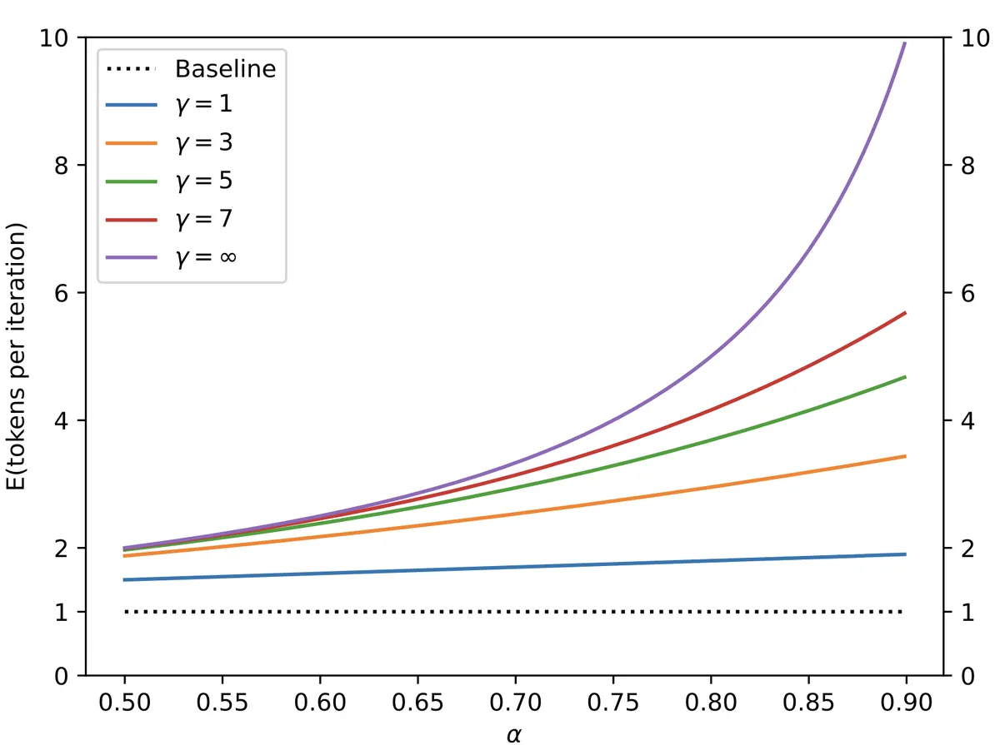

基线（虚线）对应朴素解码：每一步始终只生成一个 token。采用推测解码后，随着 α 增大（草稿猜测更频繁地正确）以及 γ 增长，每次迭代的有效 token 数会显著上升。例如，当 γ = ∞ 且 α 接近 0.9 时，系统每次迭代几乎可以生成 10 个 token，而基线中只有 1 个。更好的草稿模型和更大的前瞻长度会直接转化为更高的加速比。
采用这种方法，我们可以保证：尽管计算成本更低，生成出的样本仍然来自与朴素解码完全相同的概率分布。

如需更多细节和示例，Google Research 也发布了这篇[博客文章](https://research.google/blog/looking-back-at-speculative-decoding/)，更详细地解释了这个概念。

在原始论文中，**推测解码** 在 T5-XXL 等模型上展示了 **2×–3×** 的墙钟时间加速，同时保持输出分布完全一致。

[推测解码示意视频](https://storage.googleapis.com/gweb-research2023-media/media/SpeculativeDecoding-1-Illustration.mp4)

### 量化

另一个非常重要且被大量研究的优化方向是 **量化**。如今最先进的模型动辄就是数十亿参数。为了帮助理解，[Hunyuan-Large](https://arxiv.org/abs/2411.02265) 这个开源的 Mixture-of-Experts 模型，总参数量达到 **3890 亿**，而每一步推理中只有 **520 亿参数处于激活状态**——“只有”，我这是带着讽刺地说——这依然极其庞大。DeepSeek-V3 的**总参数量为 6710 亿**，其中在 token 生成期间约有 **370 亿参数处于激活状态**。你懂我的意思了。

尽管激活参数远小于总权重，但推理仍然需要 **将所有参数都载入内存**（例如 GPU 显存），因为每一层、每一个 token 所选择的 expert 都可能不同。这意味着，总模型大小决定了最低内存需求。因此，一个很自然的方向就是让模型变小，从而降低其内存需求。但“变小”究竟是什么意思呢？

参数通常以 **浮点数** 形式存储，而推理涉及海量的浮点运算（FLOPs）。浮点数有不同的精度。直观地说，降低精度可以极大减少内存占用，但代价可能是准确性下降。如何找到这个平衡点，是当前研究的重点之一。在继续之前，先看几种主要的浮点精度：

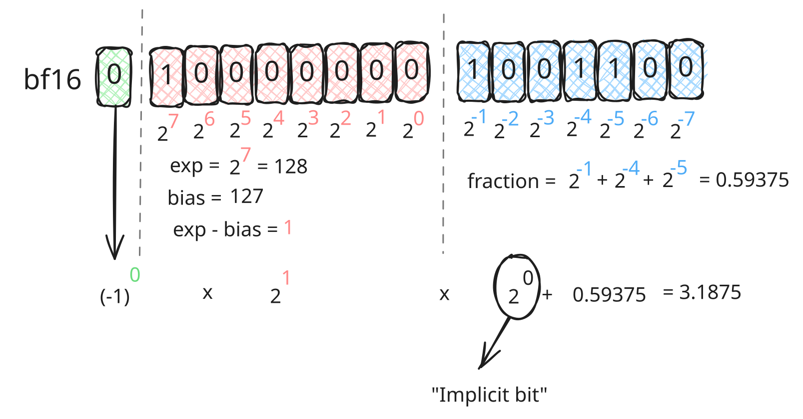

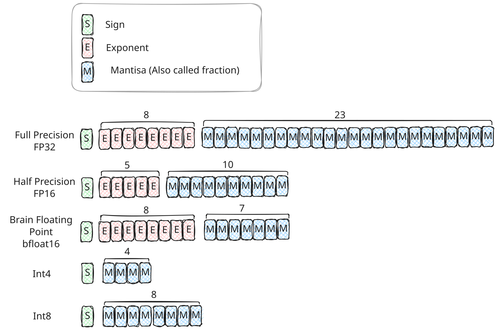

还有其他格式，但这些是最主要的几种。在实践中，如今的量化通常也会使用**基于整数的格式**。

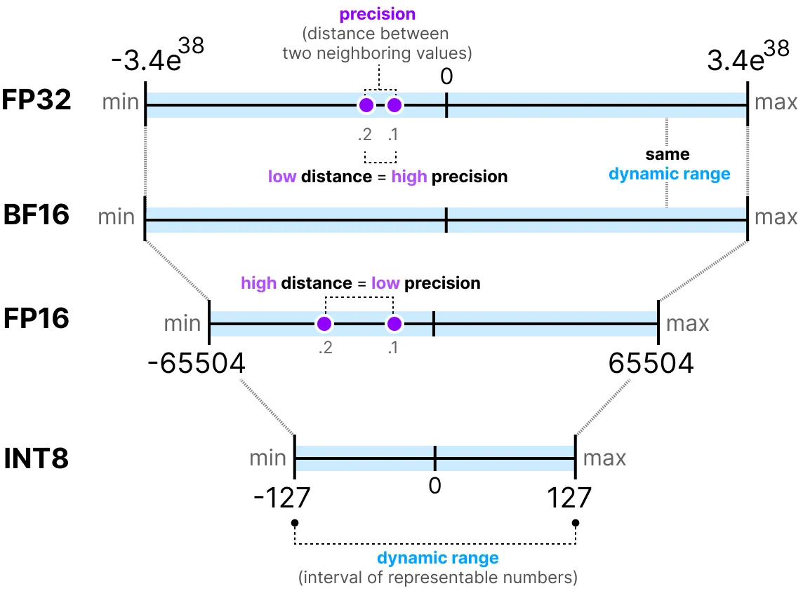

用于表示一个值的比特数越多，它就越精确。可覆盖的范围更大，相邻值之间的间距也更小——因此精度更高。 。

推理所需的内存也不仅仅是权重（例如我们前面一直在讨论的 KV），但我们先看看如果仅仅为了加载完整权重、暂时忽略缓存，DeepSeek-V3 需要多少内存：

``` math
\text{Memory} = \frac{\text{No.~of~Bits}}{8}\times\text{No.~of~Parameters}
```
  
``` math
64\ \text{bits} = \frac{64}{8}\times 671\ \text{B} \approx 5,368\ \text{GB}
```
  
``` math
32\ \text{bits} = \frac{32}{8}\times 671\ \text{B} \approx 2,684\ \text{GB}
```
  
``` math
16\ \text{bits} = \frac{16}{8}\times 671\ \text{B} \approx 1,342\ \text{GB}
```
  
``` math
8\ \text{bits} = \frac{8}{8}\times 671\ \text{B} \approx 671\ \text{GB}
```
  
``` math
4\ \text{bits} = \frac{4}{8}\times 671\ \text{B} \approx 335.5\ \text{GB}
```

显然，没有任何 GPU 能容纳 1,342 GB。在实践中，推理会通过 **张量并行（tensor parallelism）** 和 **流水线并行（pipeline parallelism）** 等方法分布到成千上万张 GPU 上。我这里不展开讲这些，但它们都很值得深入了解。不过从这里你可以非常清楚地看到，仅仅通过降低精度，内存需求就会大幅下降。除了节省内存之外，像 int8 或 int4 这样的整数格式在某些硬件上甚至可能比浮点格式更快。以 NVIDIA H100 Tensor Cores 为例，INT8 的峰值吞吐量约为 2000 TOPS，而 FP16/BF16 约为 1000 TFLOPS。

#### 量化映射

核心思想是，我们希望把位于某个较大范围 $`\lbrack\alpha,\beta\rbrack`$ 内的浮点数，压缩到一个更小范围 $`\lbrack\alpha_{q},\beta_{q}\rbrack`$ 内的整数。以有符号 INT8 为例，这个范围就是 $`\lbrack - 128,127\rbrack`$。为了实现这一点，我们假设浮点值 $`x`$ 与其量化后的整数值 $`x_{q}`$ 之间存在一条直线关系。想看更详细的推导，可以参考 [Lei Mao 的](https://leimao.github.io/article/Neural-Networks-Quantization/)博客文章，他在这方面讲得很深入。这篇文章帮助我更清楚地理解了这个过程：

``` math
x = c(x_{q} + d)
```

这里，$`c`$ 是缩放因子，也就是每一个整数步长对应多少浮点单位；而 $`d`$ 只是一个偏移量。如果我们想反过来（从浮点到整数），就把这条直线翻转过来并进行四舍五入：

``` math
x_{q} = {round}\!\left( \frac{x}{c} - d \right)
```

这条直线必须同时命中两个范围的端点，因此我们要求：

``` math
\beta = c(\beta_{q} + d),\qquad\alpha = c(\alpha_{q} + d)
```

将这两个方程相减可得：

``` math
\beta - \alpha = c(\beta_{q} + d) - c(\alpha_{q} + d)
```

使用分配律：

``` math
\beta - \alpha = c(\beta_{q} - \alpha_{q})
```

这意味着：

``` math
c = \frac{\beta - \alpha}{\beta_{q} - \alpha_{q}}
```

一旦知道了 $`c`$，我们就可以把它代回
$`\alpha = c(\alpha_{q} + d)`$ 中，从而求出 $`d`$：

``` math
\alpha = c\alpha_{q} + cd
```
``` math
d = \frac{\alpha}{c} - \alpha_{q}
```

把 $`c`$ 替换进去可得：

``` math
d = \alpha\frac{\beta_{q} - \alpha_{q}}{\beta - \alpha} - \alpha_{q} = \frac{\alpha\beta_{q} - \beta\alpha_{q}}{\beta - \alpha}
```

这就是一般形式。不过在实践中，库通常把
$`s = c`$ 称为 **scale（缩放因子）**，把 $`z = - d`$ 称为 **zero point（零点）**，而你实际会用到的最终公式是这样的：

``` math
x = s(x_{q} - z)
```
``` math
x_{q} = {round}\!\left( \frac{x}{s} + z \right)
```

其中

``` math
s = \frac{\beta - \alpha}{\beta_{q} - \alpha_{q}},\qquad z = {round}\!\left( \alpha_{q} - \frac{\alpha}{s} \right)
```

让我们通过一个可视化示例来更好地理解这些概念。假设我们有一个由 5 个权重组成的向量，它们用 FP32 表示，而我们想把它量化为 int8。在实践中，我们不会把 FP32 的整个精度范围 \[-3.4e38, 3.4e38\] 映射到 INT8。
相反，我们会取需要存储的实际数据，找出其最小值和最大值，再把这个区间拟合到 INT8 的编码范围中。 

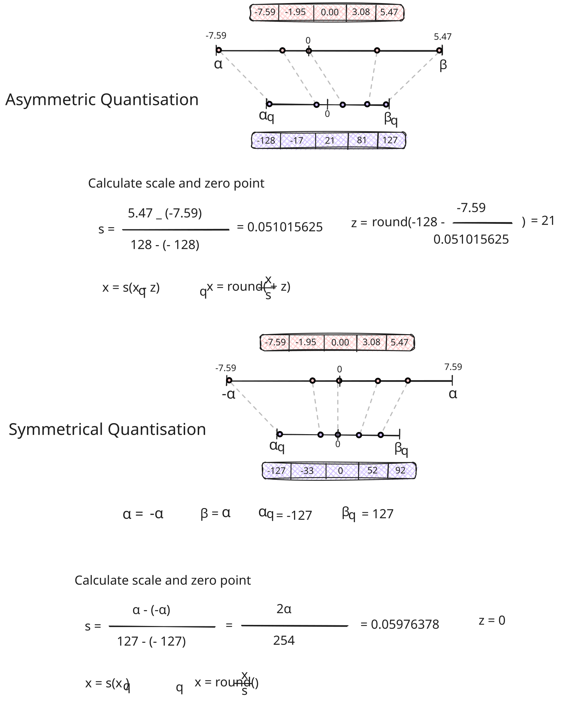

#### 对称量化与非对称量化

注意其中的差异。在 **非对称量化** 中，我们使用真实的数据范围，因此 $`\alpha`$ 是张量的最小值，$`\beta`$ 是最大值。这样的选择会在编码空间中得到一个非零的 0 点，这也是为什么在第一个例子中，浮点中的 0 被存储为编码 $`21`$。同时，我们也会从头到尾用满所有 INT8 编码。在 **对称量化** 中，我们通过取绝对值更大的那个边界作为 $`a`$，将浮点范围围绕 0 居中，然后把从 $`- a`$ 到 $`+ a`$ 的区间映射到一个完全居中的编码范围，此时零点为 $`z = 0`$。

比较这两种模式：

在非对称量化中，我们把真实的最小值固定映射到最小编码，把真实的最大值固定映射到最大编码，因此数据会分布到所有桶中，没有浪费。在对称量化中，我们强制让浮点区间围绕零点分布。如果张量的大多数值都位于零的一侧，那么很多桶会表示你根本不会见到的值。一个极端例子是在 ReLU 之后，所有值都非负。非对称量化会将全部 256 个编码都用于有意义的区域；而对称量化会保留 128 个编码给根本不会出现的负值。

不过在非对称模式下，零点会给硬件带来额外的处理逻辑。根据具体实现，这种额外处理可能会增加少量延迟和复杂度。
