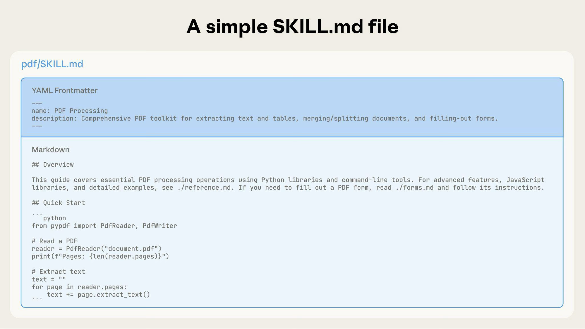
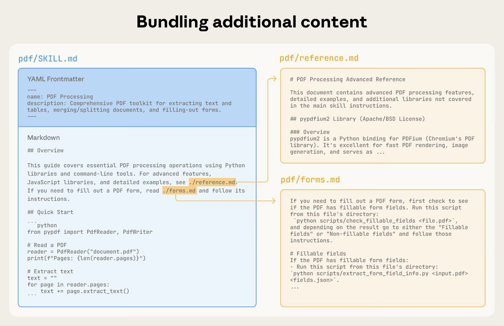
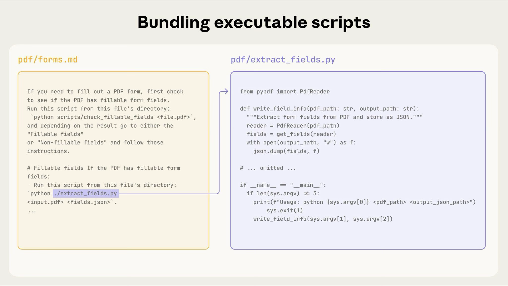

# 技能创作最佳实践

官方中文标题：技能创作最佳实践  
官方中文来源：https://platform.claude.com/docs/zh-CN/agents-and-tools/agent-skills/best-practices  
原始保存时间：2026-03-31 12:53:33（中国标准时间）

说明：这份 Markdown 以官方中文页当前内容为准，保留正文主内容、示意图和关键示例，去掉网页导航、按钮、复制控件等无关内容。

学习如何编写有效的技能，使 Claude 能够发现和成功使用。

好的技能应该简洁、结构良好且经过真实使用测试。本指南提供实用的创作决策，帮助您编写 Claude 能够有效发现和使用的技能。

有关技能工作原理的概念背景，请参阅 Skills overview。

## 核心原则

### 简洁是关键

上下文窗口是一种公共资源。你的 Skill 需要和下面这些内容一起共享上下文：

- 系统提示词
- 对话历史
- 其他 Skills 的元数据
- 用户当前的真实请求

并不是 Skill 里的每一个 token 都会立刻产生成本。启动时，系统只会预加载所有 Skills 的元数据，也就是 `name` 和 `description`。只有当某个 Skill 被判定为相关时，Claude 才会去读 `SKILL.md`；额外的参考文件也只有在需要时才会读取。

即便如此，`SKILL.md` 依然应该尽量简洁。因为一旦它被加载，里面的每个 token 都要和对话历史及其他上下文争夺注意力。

默认前提是：Claude 已经很聪明。

因此，你只需要补充 Claude 原本不知道、但完成任务又确实需要的信息。写每一段内容时，都可以先问自己：

- Claude 真的需要这段解释吗？
- 这部分知识能不能直接假设 Claude 已经知道？
- 这一段内容是否值得它消耗掉的 token？

好例子：简洁版本，大约 50 tokens。

~~~markdown
## 提取 PDF 文本

使用 pdfplumber 提取文本：

```python
import pdfplumber

with pdfplumber.open("file.pdf") as pdf:
    text = pdf.pages[0].extract_text()
```
~~~

坏例子：过于冗长，大约 150 tokens。

```markdown
## 提取 PDF 文本

PDF（Portable Document Format）是一种常见文件格式，里面可能包含文本、图片以及其他内容。
如果你想从 PDF 中提取文本，需要使用某个库。可用于 PDF 处理的库有很多，
这里推荐 pdfplumber，因为它易于使用，而且在大多数场景下都能正常工作。
首先你需要用 pip 安装它，然后再使用下面这段代码……
```

简洁版的前提是：Claude 本来就知道什么是 PDF，也知道如何使用常见库。

### 设置适当的自由度

说明的具体程度，应该和任务本身的脆弱性、风险以及可变性相匹配。

高自由度，适合纯文本指导：

- 当多种做法都有效时使用
- 当决策依赖具体上下文时使用
- 当任务更像“启发式处理”而不是“固定流程”时使用

示例：

```markdown
## 代码审查流程

1. 分析代码结构与组织方式
2. 检查潜在缺陷和边界情况
3. 提出可读性与可维护性改进建议
4. 核对是否符合项目约定
```

中等自由度，适合伪代码或带参数的脚本模板：

- 当已经有推荐模式时使用
- 当允许一定变化时使用
- 当具体行为受配置影响时使用

示例：

```python
## 生成报告

按下面这个模板开始，并根据场景调整：

def generate_report(data, format="markdown", include_charts=True):
    # 处理数据
    # 按指定格式生成输出
    # 如有需要，附带图表
```

低自由度，适合固定脚本或几乎没有参数的命令：

- 当操作脆弱且容易出错时使用
- 当一致性非常关键时使用
- 当必须按固定顺序执行时使用

示例：

```bash
## 数据库迁移

严格执行下面这条命令：

python scripts/migrate.py --verify --backup
```

不要擅自修改命令，也不要添加额外参数。

可以把 Claude 想象成沿路前进的机器人：

- 如果前方是一座两边都是悬崖的窄桥，就只有一条安全路径。这时要给出非常明确的护栏和精确步骤，属于低自由度场景。比如数据库迁移，必须严格按顺序执行。
- 如果前方是一片没有障碍的开阔地，那么到达目标的路径很多。这时给出总体方向即可，相信 Claude 会自己找到合适方案，属于高自由度场景。比如代码审查，具体关注点会受上下文影响。

### 使用所有计划使用的模型进行测试

Skill 是模型能力上的“增量层”，因此效果会受到底层模型的影响。你准备在哪些模型上使用这个 Skill，就应该在哪些模型上测试它。

不同模型的测试关注点可以不同：

- Claude Haiku：速度快、成本低。要看 Skill 是否给了足够指导。
- Claude Sonnet：比较均衡。要看 Skill 是否足够清晰且高效。
- Claude Opus：推理能力强。要看 Skill 是否讲得过多、压缩了模型原本可发挥的空间。

对 Opus 来说刚刚好的说明，可能对 Haiku 又不够。若你计划跨多个模型使用同一个 Skill，应该追求一套对所有目标模型都适用的说明。

## 技能结构

### YAML 前置事项

`SKILL.md` 的 frontmatter 需要至少两个字段：

`name`

- 最长 64 个字符
- 只能包含小写字母、数字和连字符
- 不能包含 XML 标签
- 不能包含保留词：`anthropic`、`claude`

`description`

- 不能为空
- 最长 1024 个字符
- 不能包含 XML 标签
- 应说明 Skill 做什么，以及什么时候该使用它

更完整的 Skill 结构细节，可以参考 Skills overview。

### 命名规范

统一命名模式可以让 Skill 更容易被引用、讨论和维护。文档建议优先使用动名词形式（动词 + `-ing`），因为这类名字更能直观表达 Skill 提供的是哪种能力或活动。

需要注意，`name` 字段本身仍然只能使用小写字母、数字和连字符。

推荐命名示例：

- `processing-pdfs`
- `analyzing-spreadsheets`
- `managing-databases`
- `testing-code`
- `writing-documentation`

可接受的替代方式：

- 名词短语：`pdf-processing`、`spreadsheet-analysis`
- 动作导向：`process-pdfs`、`analyze-spreadsheets`

应避免：

- 含义模糊：`helper`、`utils`、`tools`
- 过于泛化：`documents`、`data`、`files`
- 使用保留词：`anthropic-helper`、`claude-tools`
- 在同一套 Skills 中混用完全不同的命名风格

一致命名的好处包括：

- 在文档和对话里更容易引用
- 一眼就能明白 Skill 的用途
- 更容易组织和搜索多组 Skill
- 整个 Skill 库会显得更专业、更统一

### 编写有效的描述

`description` 字段决定了 Skill 能否被正确发现。它应该同时包含两类信息：

- 这个 Skill 做什么
- 什么时候应该调用它

始终使用第三人称来写。因为这个字段会被注入系统提示词，如果人称视角混乱，可能影响发现效果。

推荐写法：

- “处理 Excel 文件并生成报告”

不推荐：

- “我可以帮你处理 Excel 文件”
- “你可以用这个来处理 Excel 文件”

除此之外，还要尽量具体，带上关键术语。不要只说“它能处理文档”，而要说清楚它处理哪类文档、做什么处理、什么情况下触发。

每个 Skill 只有一个 `description` 字段，但这个字段对选择阶段极其关键。Claude 可能要在上百个 Skills 中做选择，因此 `description` 必须足够具体，让它知道何时该选这个 Skill。剩下的实现细节，再交给 `SKILL.md` 正文去展开。

有效示例：

```yaml
description: 从 PDF 文件中提取文本和表格，填写表单，并合并文档。当处理 PDF、表单或文档抽取相关任务时使用。
```

```yaml
description: 分析 Excel 电子表格，创建数据透视表，并生成图表。当任务涉及 Excel 文件、表格数据、spreadsheets 或 .xlsx 文件时使用。
```

```yaml
description: 通过分析 git diff 生成描述性提交信息。当用户需要编写 commit message 或审查 staged changes 时使用。
```

模糊描述应避免：

```yaml
description: 帮助处理文档
```

```yaml
description: 处理数据
```

```yaml
description: 处理文件相关事情
```

### 渐进式披露模式

`SKILL.md` 应该像一本上手指南的目录页：先给总览，再在需要时把 Claude 引向更详细的资料。

实用建议：

- 为了获得更好的性能，`SKILL.md` 正文尽量控制在 500 行以内
- 接近这个规模时，就把内容拆到单独文件
- 用清晰的文件组织方式来放置说明、代码和资源

#### 视觉概览：从简单到复杂

一个最基础的 Skill，通常只有一个包含元数据和说明的 `SKILL.md`：



随着 Skill 变复杂，可以把附加内容单独打包，只在需要时才加载：



完整目录结构可能像这样：

```text
pdf/
├── SKILL.md              # 主说明（触发后加载）
├── FORMS.md              # 表单填写指南（按需加载）
├── reference.md          # API 参考（按需加载）
├── examples.md           # 用法示例（按需加载）
└── scripts/
    ├── analyze_form.py   # 工具脚本（执行，不直接加载正文）
    ├── fill_form.py      # 填表脚本
    └── validate.py       # 校验脚本
```

#### 模式 1：总览 + 参考文件

这个模式适合把 `SKILL.md` 作为入口页，只保留高层说明和导航。

~~~markdown
---
name: pdf-processing
description: 从 PDF 文件中提取文本和表格、填写表单并合并文档。当任务涉及 PDF、表单或文档抽取时使用。
---

# PDF Processing

## Quick start

使用 pdfplumber 提取文本：

```python
import pdfplumber

with pdfplumber.open("file.pdf") as pdf:
    text = pdf.pages[0].extract_text()
```

## Advanced features

**Form filling**: 详见 [FORMS.md](FORMS.md)  
**API reference**: 详见 [REFERENCE.md](REFERENCE.md)  
**Examples**: 详见 [EXAMPLES.md](EXAMPLES.md)
~~~

在这种结构下，Claude 只会在确有需要时才去读取 `FORMS.md`、`REFERENCE.md` 或 `EXAMPLES.md`。

#### 模式 2：领域特定组织

如果一个 Skill 同时覆盖多个业务域，就按领域拆文件，避免把不相关内容都读进来。

例如，用户问销售指标时，Claude 只需要读销售相关 schema，不需要顺便把财务或营销数据也一起加载。这样既节省 token，也更聚焦。

```text
bigquery-skill/
├── SKILL.md
└── reference/
    ├── finance.md
    ├── sales.md
    ├── product.md
    └── marketing.md
```

~~~markdown
# BigQuery Data Analysis

## Available datasets

**Finance**: Revenue, ARR, billing → See [reference/finance.md](reference/finance.md)
**Sales**: Opportunities, pipeline, accounts → See [reference/sales.md](reference/sales.md)
**Product**: API usage, features, adoption → See [reference/product.md](reference/product.md)
**Marketing**: Campaigns, attribution, email → See [reference/marketing.md](reference/marketing.md)

## Quick search

Find specific metrics using grep:

```bash
grep -r "monthly_recurring_revenue" reference/
grep -r "pipeline_value" reference/
```
~~~

#### 模式 3：条件详情

基础内容先放在主文件里，复杂内容按需再读。

```markdown
# DOCX Processing

## Creating documents

Use docx-js for new documents. See [DOCX-JS.md](DOCX-JS.md).

## Editing documents

For simple edits, modify the XML directly.

**For tracked changes**: See [REDLINING.md](REDLINING.md)  
**For OOXML details**: See [OOXML.md](OOXML.md)
```

只有当用户真的需要修订痕迹或更底层的 OOXML 细节时，Claude 才去读取 `REDLINING.md` 或 `OOXML.md`。

### 避免深层嵌套引用

当某个参考文件里又引用了其他参考文件时，Claude 有可能只做局部预览，比如用 `head -100` 去先看一眼，而不是完整读取。这样就容易拿到不完整信息。

因此，参考文件最好只和 `SKILL.md` 相隔一层。所有需要的重要参考文件，都应直接从 `SKILL.md` 链接出去。

不推荐：

```markdown
# SKILL.md

See [advanced.md](advanced.md)...

# advanced.md

See [details.md](details.md)...

# details.md

Here’s the actual information...
```

推荐：

```markdown
# SKILL.md

**Basic usage**: [instructions in SKILL.md]
**Advanced features**: See [advanced.md](advanced.md)
**API reference**: See [reference.md](reference.md)
**Examples**: See [examples.md](examples.md)
```

### 使用目录构建较长的参考文件

如果某个参考文件超过 100 行，建议在顶部放一个目录。这样即便 Claude 只是部分预览，也能快速知道整份文件的完整范围。

示例：

```markdown
# API Reference

## Contents

- Authentication and setup
- Core methods (create, read, update, delete)
- Advanced features (batch operations, webhooks)
- Error handling patterns
- Code examples

## Authentication and setup
...
```

这样 Claude 要么读取整份文件，要么直接跳到相关章节。

## 工作流和反馈循环

### 对复杂任务使用工作流

复杂操作应该拆成清晰的、顺序明确的步骤。对于特别复杂的流程，可以直接给 Claude 一个清单，让它复制到回复里并边做边勾选。

示例 1：研究综合工作流（不需要代码的 Skill）

```text
Research Progress:

- [ ] Step 1: Read all source documents
- [ ] Step 2: Identify key themes
- [ ] Step 3: Cross-reference claims
- [ ] Step 4: Create structured summary
- [ ] Step 5: Verify citations
```

这个模式说明：即便不是代码任务，只要流程复杂，也一样适合用 checklist。

示例 2：PDF 表单填写工作流（带代码的 Skill）

```text
Task Progress:

- [ ] Step 1: Analyze the form (run analyze_form.py)
- [ ] Step 2: Create field mapping (edit fields.json)
- [ ] Step 3: Validate mapping (run validate_fields.py)
- [ ] Step 4: Fill the form (run fill_form.py)
- [ ] Step 5: Verify output (run verify_output.py)
```

明确的步骤可以防止 Claude 跳过关键校验，清单也便于你和 Claude 一起跟踪流程进度。

### 实现反馈循环

非常常见也非常有效的一种模式是：

运行校验器 → 修复错误 → 再次校验

这个循环能显著提高输出质量。

示例 1：风格指南校验（不依赖脚本）

```markdown
## Content review process

1. Draft your content following the guidelines in STYLE_GUIDE.md
2. Review against the checklist:
   - Check terminology consistency
   - Verify examples follow the standard format
   - Confirm all required sections are present
3. If issues found:
   - Note each issue with specific section reference
   - Revise the content
   - Review the checklist again
4. Only proceed when all requirements are met
5. Complete and save the document
```

这说明了如何使用参考文档而非脚本来实现验证循环模式。这里的“验证器”是 `STYLE_GUIDE.md`，而 Claude 通过阅读并对比来执行检查。

示例 2：文档编辑流程（依赖脚本）

```markdown
## Document editing process

1. Make your edits to `word/document.xml`
2. **Validate immediately**: `python ooxml/scripts/validate.py unpacked_dir/`
3. If validation fails:
   - Review the error message carefully
   - Fix the issues in the XML
   - Run validation again
4. **Only proceed when validation passes**
5. Rebuild: `python ooxml/scripts/pack.py unpacked_dir/ output.docx`
6. Test the output document
```

这种回路的价值是：尽早发现错误，避免问题一路积累到最后。

## 内容指南

### 避免时间敏感信息

不要把很快会过期的信息直接写死在 Skill 正文里。

不推荐：

```text
If you're doing this before August 2025, use the old API.
After August 2025, use the new API.
```

推荐做法是保留“当前方法”，再单独列出“旧模式”：

```markdown
## Current method

Use the v2 API endpoint: `api.example.com/v2/messages`

## Old patterns

<details>
<summary>Legacy v1 API (deprecated 2025-08)</summary>

The v1 API used: `api.example.com/v1/messages`

This endpoint is no longer supported.
</details>
```

这样既保留历史背景，又不会把主内容搞得混乱。

### 使用一致的术语

在整个 Skill 中，同一类概念尽量只用一个词。

推荐：

- 一直用 `API endpoint`
- 一直用 `field`
- 一直用 `extract`

不推荐：

- 混用 `API endpoint`、`URL`、`API route`、`path`
- 混用 `field`、`box`、`element`、`control`
- 混用 `extract`、`pull`、`get`、`retrieve`

术语一致，Claude 才更容易正确理解并执行说明。

## 常见模式

### 模板模式

如果你希望输出格式稳定，就直接提供模板。模板应该有多严格，取决于你的需求。

对强约束场景，比如 API 响应或固定数据格式，可以这样写：

```markdown
## Report structure

ALWAYS use this exact template structure:

# [Analysis Title]

## Executive summary
[One-paragraph overview of key findings]

## Key findings
- Finding 1 with supporting data

## Recommendations
- Recommended action 1
```

对允许灵活调整的场景，可以这样写：

```markdown
## Report structure

Here is a sensible default format, but use your best judgment based on the analysis:

# [Analysis Title]

## Executive summary
[Overview]

## Key findings
[Adapt sections based on what you discover]

## Recommendations
[Include if you find concrete next steps]
```

### 示例模式

如果输出质量高度依赖“看过像样的例子”，那就像普通 prompt 设计一样，直接给输入/输出对。

```markdown
## Commit message format

Generate commit messages following these examples:

**Example 1**

Input: Added user authentication with JWT tokens

Output:

feat(auth): implement JWT-based authentication

Add login endpoint and token validation middleware

**Example 2**

Input: Fixed memory leak in image processing pipeline

Output:

fix(images): resolve memory leak in processing pipeline

Free buffers after transformation and add regression test

**Example 3**

Input: Updated README with deployment instructions

Output:

docs(readme): add deployment instructions
```

相较于抽象说明，示例往往更能准确传达你想要的风格和细节层级。

### 条件分支工作流模式

当任务需要先判断分支，再走不同流程时，可以把决策点写清楚。

```markdown
## Document modification workflow

1. Determine the modification type:
   **Creating new content?** → Follow "Creation workflow"
   **Editing existing content?** → Follow "Editing workflow"

2. Creation workflow:
   - Use docx-js library
   - Build document from scratch
   - Export to .docx format

3. Editing workflow:
   - Unzip the `.docx` file
   - Modify the relevant XML
   - Validate the structure
   - Repackage the document
```

如果一个工作流变得特别庞大、分支特别多，就应该把它拆到独立文件里，再告诉 Claude 按任务类型去读取对应文件。

## 评估和迭代

### 首先构建评估

在写大量说明之前，先把评估建起来。这样你才能确认这个 Skill 真能解决真实问题，而不是只是在为假想问题写文档。

一种推荐的评估驱动流程是：

- 先识别缺口：让 Claude 在没有 Skill 的情况下做代表性任务，记录具体失败点或缺失信息
- 建立评估：设计三个能覆盖这些缺口的场景
- 建立基线：测量不使用 Skill 时的表现
- 只写最少的必要说明：刚好能补齐缺口、通过评估即可
- 持续迭代：反复跑评估，对比基线，不断修正

这样做能保证你是在解决“真实暴露的问题”，而不是预判一些永远不会出现的需求。

一个评估结构示例：

```json
{
  "skills": ["pdf-processing"],
  "query": "Extract all text from this PDF file and save it to output.txt",
  "files": ["test-files/document.pdf"],
  "expected_behavior": [
    "Successfully reads the PDF file using an appropriate PDF processing library or command-line tool",
    "Extracts text content from all pages in the document without missing any pages",
    "Saves the extracted text to a file named output.txt in a clear, readable format"
  ]
}
```

这个例子展示的是一种数据驱动的评估方式，外加一组简单的判断标准。当前并没有内置机制可以直接运行这些评估，因此你可以自己建立一套评估系统。评估本身，就是衡量 Skill 是否有效的事实依据。

### 与 Claude 一起迭代开发技能

最有效的 Skill 开发流程之一，就是直接让 Claude 参与 Skill 的设计和改进。

你可以把它想成两类 Claude：

- Claude A：帮助你编写和调整 Skill 的“设计者”
- Claude B：真正加载并使用这个 Skill 去做任务的“执行者”

这样做的原因是：Claude 本身既知道怎么写 agent 指令，也知道 agent 真正需要什么信息。

创建新 Skill 时，可以按下面流程来：

1. 先不用 Skill 完成一次真实任务  
   先和 Claude A 正常合作做一遍事情。在这个过程中，你会自然提供上下文、偏好、流程知识。注意观察：哪些信息你反复在说？

2. 识别可复用模式  
   任务完成后，回头看一眼：刚才你补充的哪些上下文，未来同类任务还会继续用到？

3. 让 Claude A 生成 Skill  
   例如你可以说：  
   “把我们刚才用到的 BigQuery 分析模式整理成一个 Skill，包含表结构、命名规范，以及‘始终过滤测试账号’这条规则。”

4. 检查是否足够简洁  
   Claude A 有时会加太多解释。你可以继续要求：  
   “去掉关于 win rate 含义的解释，Claude 本来就知道。”

5. 优化信息架构  
   比如继续要求：  
   “把表结构拆到单独参考文件里，以后我们可能还会继续加表。”

6. 用 Claude B 做相似任务测试  
   让一个“全新实例”的 Claude B 在真实场景里使用这个 Skill，看它能否顺利找到信息、正确执行规则、稳定完成任务。

7. 根据观察继续迭代  
   如果 Claude B 漏掉了什么，就带着具体现象回到 Claude A 那里继续修正。  
   例如：  
   “Claude 用这个 Skill 做 Q4 分析时忘了加日期过滤，我们是不是该补一节日期过滤模式？”

改进已有 Skill 时，也是同样的循环：

- 和 Claude A 一起调整 Skill
- 用 Claude B 跑真实任务
- 观察 Claude B 的行为
- 把观察结果再反馈给 Claude A

更具体地说：

- 用这个 Skill 跑真实工作，而不只是跑测试用例
- 记录 Claude B 哪里会卡住、哪里表现好、哪里做出出乎意料的选择
- 把当前 `SKILL.md` 连同观察结果交给 Claude A，让它提出改进建议
- 评估这些建议，比如是否应该把规则写得更显眼，是否应该把“always filter”改成“MUST filter”
- 改完以后，再让 Claude B 重跑类似请求
- 随着更多真实使用场景出现，继续这个观察—修正—复测循环

团队反馈同样很有价值：

- 把 Skill 交给同事使用，观察他们的用法
- 询问：Skill 是否在该触发时触发了？说明是否清楚？还缺什么？
- 把这些反馈纳入后续迭代，修补你自己看不到的盲点

这种方法有效，是因为：

- Claude A 了解 agent 需要什么信息
- 你提供业务领域知识
- Claude B 会在真实任务中暴露缺口
- 迭代是基于观察，而不是基于猜测

### 观察 Claude 如何导航技能

在迭代过程中，不要只看结果，也要看 Claude 实际是怎么导航 Skill 的。尤其要注意：

- 是否出现你没预料到的探索路径：如果 Claude 总以奇怪顺序读文件，说明结构可能没有你想象得直观
- 是否错过关键连接：如果它没跟着引用去读重要文件，说明链接可能不够显眼或不够明确
- 是否过度依赖某个部分：如果它每次都反复读取同一个文件，也许那部分内容应该直接放回 `SKILL.md`
- 是否有内容始终被忽略：如果某个打包文件从来不被访问，说明它可能没有必要，或者主文件没有把它提示清楚

应根据这些观察来改 Skill，而不是只凭主观猜测。尤其是元数据里的 `name` 和 `description`，它们直接影响 Claude 是否会在当前任务中触发这个 Skill，一定要写得明确。

## 要避免的反模式

### 避免 Windows 风格路径

路径里始终使用正斜杠 `/`，即使在 Windows 上也是如此。

- 推荐：`scripts/helper.py`、`reference/guide.md`
- 不推荐：`scripts\\helper.py`、`reference\\guide.md`

Unix 风格路径可以跨平台工作，而 Windows 风格路径在 Unix 系统上经常会报错。

### 避免提供过多选项

除非确有必要，否则不要把一长串可选方案全摆给 Claude。

不推荐：

```text
You can use pypdf, or pdfplumber, or PyMuPDF, or pdf2image, or...
```

推荐做法是给一个默认方案，并保留必要的逃生口：

~~~markdown
Use pdfplumber for text extraction:

```python
import pdfplumber
```

For scanned PDFs requiring OCR, use pdf2image with pytesseract instead.
~~~

## 高级：带有可执行代码的技能

下面各节主要关注包含可执行脚本的技能。如果你的技能只包含 Markdown 说明，请直接跳到文末的有效技能清单。

### 解决，不要推卸

编写技能脚本时，应处理错误情况，而不是把问题丢给 Claude。

推荐：

```python
def process_file(path):
    """Process a file, creating it if it doesn't exist."""
    try:
        with open(path) as f:
            return f.read()
    except FileNotFoundError:
        # Create file with default content instead of failing
        print(f"File {path} not found, creating default")
        with open(path, "w") as f:
            f.write("")
        return ""
    except PermissionError:
        # Provide alternative instead of failing
        print(f"Cannot access {path}, using default")
        return ""
```

不推荐：

```python
def process_file(path):
    # Just fail and let Claude figure it out
    return open(path).read()
```

配置参数也应该能自圆其说，避免出现“巫术常量”（voodoo constants）。如果连你自己都不知道为什么是这个数，Claude 更不可能知道。

推荐：

```python
# HTTP requests typically complete within 30 seconds
# Longer timeout accounts for slow connections
REQUEST_TIMEOUT = 30

# Three retries balances reliability vs speed
# Most intermittent failures resolve by the second retry
MAX_RETRIES = 3
```

不推荐：

```python
TIMEOUT = 47   # Why 47?
RETRIES = 5    # Why 5?
```

### 提供实用脚本

即使 Claude 理论上可以临时写脚本，预先提供好的脚本通常仍然更有价值：

- 比临时生成代码更可靠
- 更省 token，不必把代码全文塞进上下文
- 更省时间，不必每次都现写
- 更容易在多次使用中保持一致



上图展示的是：说明文件可以引用脚本，而 Claude 可以直接执行脚本，不需要把脚本全文都加载进上下文。

这一点要在说明中写清楚：Claude 究竟应该“执行”脚本，还是“把它当参考来读”。

- 最常见：执行脚本  
  例如：`Run analyze_form.py to extract fields`
- 只有在逻辑特别复杂时，才让 Claude 把脚本当参考阅读  
  例如：`See analyze_form.py for the field extraction algorithm`

多数工具脚本都更适合直接执行，因为这样更稳定、更高效。

示例：

~~~markdown
## Utility scripts

**analyze_form.py**: Extract all form fields from PDF

```bash
python scripts/analyze_form.py input.pdf > fields.json
```

Output format:

```json
{
  "field_name": {
    "type": "text",
    "x": 100,
    "y": 200
  }
}
```

**validate_boxes.py**: Validate that detected boxes match expected layout

```bash
python scripts/validate_boxes.py fields.json template.json
```

**fill_form.py**: Fill the form using validated mappings

```bash
python scripts/fill_form.py input.pdf fields.json output.pdf
```
~~~

### 使用视觉分析

如果输入可以渲染成图片，就尽量让 Claude 直接看图分析。

~~~markdown
## Form layout analysis

1. Convert PDF to images:

   ```bash
   python scripts/pdf_to_images.py form.pdf
   ```

2. Analyze each page image to identify form fields
3. Claude can see field locations and types visually
~~~

在这个例子中，你需要自己提供 `pdf_to_images.py` 这样的脚本。Claude 的视觉能力往往很适合理解布局和结构。

### 创建可验证的中间输出

Claude 在执行复杂、开放式任务时，难免出错。一个非常有效的模式是：

计划 → 校验 → 执行

也就是先让 Claude 生成结构化计划，再用脚本校验这个计划，最后再执行。

例如，如果你要让 Claude 按电子表格去更新一个 PDF 里的 50 个字段，如果没有中间校验，它可能会：

- 引用不存在的字段
- 生成相互冲突的值
- 漏掉必填字段
- 用错误方式应用更新

更稳妥的做法是，在“分析 → 执行”之间增加一个 `changes.json` 中间文件：

- 先分析
- 再写计划文件
- 再校验计划
- 最后执行
- 执行后再验证结果

这种模式的优点：

- 能尽早发现错误，避免坏修改落到真实对象上
- 机器可验证，判断标准更客观
- 计划阶段可反复修改，不会先碰原文件
- 报错更容易定位，调试路径更清楚

适用场景：

- 批量操作
- 破坏性修改
- 校验规则复杂的任务
- 高风险任务

校验脚本最好给出非常具体的错误信息，例如：

```text
Field 'signature_date' not found. Available fields: customer_name, order_total, signature_date_signed
```

这样 Claude 才更容易据此修正计划。

### 打包依赖项

Skill 运行在代码执行环境中，而这个环境会受平台限制：

- `claude.ai`：可以从 npm、PyPI 安装包，也可以拉 GitHub 仓库
- Claude API：没有网络访问，也不能在运行时安装依赖

因此，你应该在 `SKILL.md` 中明确列出所需依赖，并确认这些依赖在目标环境中可用。

### 运行时环境

Skill 运行在一个具备文件系统访问、bash 命令和代码执行能力的环境里。

这会直接影响你的 Skill 应该怎么写：

- 元数据会预加载：启动时只加载所有 Skill 的 `name` 和 `description`
- 文件按需读取：Claude 会在需要时通过工具读取 `SKILL.md` 和其他文件
- 脚本执行更高效：工具脚本可以直接跑，只把输出带入上下文，不必把脚本全文灌进上下文
- 大文件没有先天惩罚：大型参考资料、数据集或文档，只要没读，就不会消耗上下文 token

因此在组织 Skill 时应注意：

- 文件路径很重要。始终使用正斜杠，例如 `reference/guide.md`
- 文件名要有语义。比如 `form_validation_rules.md` 比 `doc2.md` 更好
- 目录结构要便于发现。按领域或功能组织最清楚  
  好：`reference/finance.md`、`reference/sales.md`  
  差：`docs/file1.md`、`docs/file2.md`
- 可以放心打包完整资源。只要没读取，就没有上下文成本
- 对确定性操作，优先写脚本，而不是让 Claude 每次临时生成
- 明确执行意图  
  `Run analyze_form.py to extract fields` 表示执行  
  `See analyze_form.py for the extraction algorithm` 表示阅读参考
- 用真实请求测试一下 Claude 是否能顺利在你的目录结构中导航

一个简单结构示例：

```text
bigquery-skill/
├── SKILL.md
└── reference/
    ├── finance.md
    ├── sales.md
    └── product.md
```

如果用户问收入相关问题，Claude 会先读 `SKILL.md`，看到里面指向 `reference/finance.md` 的说明，再只读取这一份文件。`sales.md` 和 `product.md` 会继续留在文件系统里，在真正需要之前不消耗任何上下文 token。这正是渐进式披露能够成立的基础。

### MCP 工具引用

如果你的 Skill 要用到 MCP（Model Context Protocol）工具，工具名必须写成完整限定名，否则很容易遇到 “tool not found”。

格式是：

```text
ServerName:tool_name
```

示例：

```text
Use the BigQuery:bigquery_schema tool to retrieve table schemas.
Use the GitHub:create_issue tool to create issues.
```

这里：

- `BigQuery`、`GitHub` 是 MCP server 名称
- `bigquery_schema`、`create_issue` 是各自 server 内部的工具名

如果不写 server 前缀，Claude 在多 MCP server 场景下很可能找不到正确工具。

### 避免假设工具已安装

不要默认某个包或工具环境里一定有。

不推荐：

```text
Use the pdf library to process the file.
```

推荐：

~~~markdown
Install required package: `pip install pypdf`

Then use it:

```python
from pypdf import PdfReader

reader = PdfReader("file.pdf")
```
~~~

## 技术说明

### YAML 前置事项要求

`SKILL.md` 的 frontmatter 中，`name` 和 `description` 有固定校验规则：

- `name`：最长 64 字符，只能有小写字母、数字、连字符，不能有 XML 标签，不能用保留词
- `description`：最长 1024 字符，不能为空，不能有 XML 标签

更完整的结构规则，请以 Skills overview 为准。

### Token 预算

为了获得更稳定的表现，`SKILL.md` 正文最好控制在 500 行以内。超过后，应按照前文提到的渐进式披露模式拆到独立文件中。

## 有效技能清单

在把一个 Skill 分享出去之前，至少确认下面这些点。

### 核心质量

- `description` 具体且包含关键术语
- `description` 同时说明了“做什么”和“什么时候使用”
- `SKILL.md` 正文少于 500 行
- 额外细节在需要时拆到了单独文件
- 没有容易过期的时间敏感信息，或者这类信息被放进 “old patterns” 一类的区域
- 术语在全篇中保持一致
- 示例是具体的，不是抽象空话
- 文件引用只保持一层深度
- 正确使用了渐进式披露
- 工作流步骤清晰

### 代码与脚本

- 脚本自己解决问题，而不是把问题甩给 Claude
- 错误处理明确且对修复有帮助
- 没有来历不明的常量值
- 所需依赖已列出，并确认在目标环境可用
- 脚本有清晰文档说明
- 没有使用 Windows 风格路径
- 关键操作带有验证/校验步骤
- 质量敏感的流程都设计了反馈回路

### 测试

- 至少建立了 3 个评估场景
- 用 Haiku、Sonnet、Opus 都测试过
- 用真实使用场景测试过，而不只是纸面测试
- 如果适用，已经纳入团队反馈

## 后续步骤

如果你准备继续往下做，可以接着看这些方向：

- 创建你的第一个 Skill
- 在 Claude Code 中创建和管理 Skills
- 在 TypeScript 和 Python 中以编程方式使用 Skills
- 通过上传方式以编程形式使用 Skills
