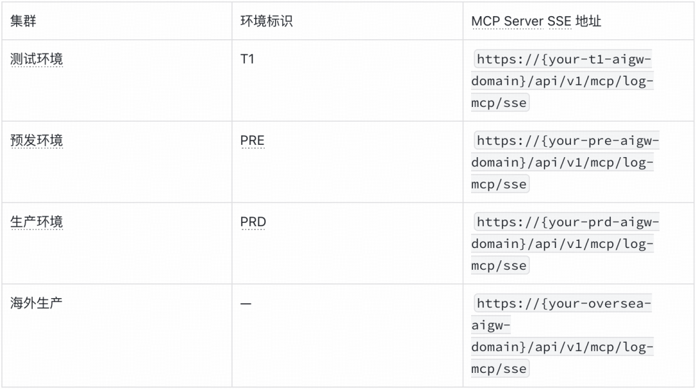
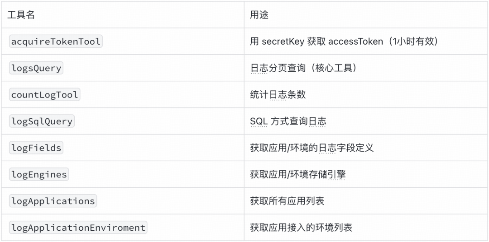
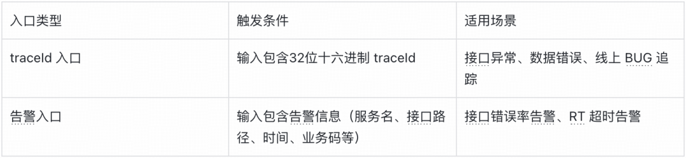
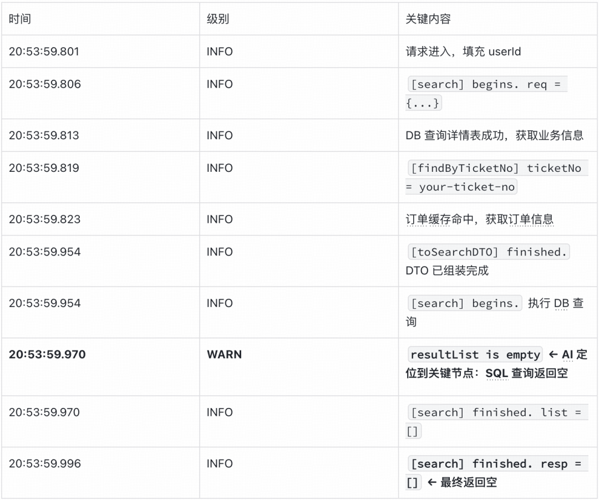
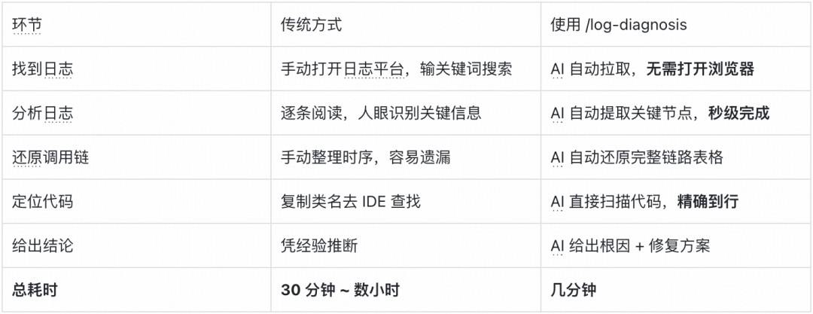

# 日志诊断 Skill：用 AI + MCP 一键解决BUG｜得物技术

- 作者：阿程
- 公众号：得物技术
- 发布时间：2026年4月1日 18:31
- 来源文件：`/Users/songxijun/Downloads/日志诊断 Skill：用 AI ＋ MCP 一键解决BUG｜得物技术 (2026_4_2 17：03：53).html`


## 目录

- 一、概述
- 二、日志平台 MCP 是什么
- 三、/log-diagnosis Skill 是什么
- 四、安装与配置
- 五、使用方式
- 六、实战案例：一个隐蔽的 SQL BUG
- 七、诊断效率关键点
- 八、总结

## 一、概述

做后端开发，调 BUG 有一个让人头疼的固定流程：打开日志平台，输入 `traceId` 或关键词，搜日志；从几十上百条日志里，找到关键的那几条；把日志里的类名、方法名复制出来，去 IDE 里找对应代码；结合代码逻辑，判断哪里出了问题；如果一次找不准，回去再搜日志，再翻代码……

这个过程相对固定，但非常耗时间。每次 BUG 定位，光在日志平台和 IDE 之间来回切换，就能消耗掉大半的时间。

最开始在去年 Q3 想到这个问题的时候，脑子里浮现的第一个方案是：用 Cursor + MCP，把日志平台接进来，再挂一个代码知识库，让 AI 帮我查日志。但这个方案有缺陷，日志查询是动态的，它依赖环境、应用、时间范围，没办法静态预置。此外，这样处理也没有办法做到比较丝滑地读代码、改代码。

后来开始用 Claude Code，接触到了 Skill 的概念：可以在项目里定义一套自定义命令，描述 AI 应该怎么执行这个命令的每个步骤，于是整个思路变得清晰了。日志平台有 MCP，Claude Code 有 Skill，两者结合，就能让 AI 自动完成“查日志 -> 找关键信息 -> 扫描代码 -> 定位问题”这整个闭环。然后在 PM 的帮助下，才有了 `/log-diagnosis` 这个 Skill。

## 二、日志平台 MCP 是什么

### 1. MCP 原理

日志平台推出了基于 MCP（Model Context Protocol）协议的日志查询服务，让 Claude 可以直接调用日志平台的能力，无需人工在日志平台上手动查询。

MCP 本质上是一种标准化的工具调用协议，Claude Code 通过 SSE（Server-Sent Events）长连接与 MCP Server 通信，实时获取日志数据。

### 2. MCP 环境对照



### 3. 核心 MCP 工具



### 4. 鉴权流程

```text
secretKey（日志平台后管申请）
    ↓ acquireTokenTool
accessToken（1小时有效，最多同时存在5个）
    ↓ 携带 accessToken
logsQuery / logSqlQuery / countLogTool ...
```

`secretKey` 申请地址：进入日志管理后台 -> 日志权限 -> 我的应用 -> 生成密钥。

## 三、/log-diagnosis Skill 是什么

### 1. Skill 工作原理

`log-diagnosis` 是一个运行在 Claude Code 里的自定义诊断命令。Claude Code 支持通过 `.claude/skills/` 目录定义自定义技能（Skill），以 Markdown 文件描述行为规范，Claude 在收到对应命令时会自动加载并执行。你只需要把 `traceId` 或告警信息告诉它，剩下的全部交给 AI。完整执行链路如下：

```bash
用户输入 /log-diagnosis {环境} {代码分支} {诉求}
    ↓
Claude 加载 .claude/skills/log-diagnosis/SKILL.md
    ↓
读取 .diagnosis/config.json 获取当前环境配置
    ↓
检查 accessToken 是否过期，过期则自动刷新
    ↓
从 traceId 计算日志时间范围（取第9-16位16进制时间戳）
    ↓
调用日志平台 MCP 分页拉取全量日志（最多20页，不遗漏）
    ↓
切换到指定代码分支，结合日志关键词检索代码
    ↓
综合分析：上游日志 + 当前服务日志 + 代码逻辑 → 根因
    ↓
生成诊断报告（飞书文档 or 本地 Markdown）
    ↓
恢复原始代码分支
```

### 2. 两种诊断入口



### 3. 核心能力

- Token 自动管理：`accessToken` 过期自动刷新，无需手动维护。
- 分页全量拉取：自动分页拉完所有日志，禁止只查第一页就下结论，最多 20 页。
- 跨服务分析：自动识别上下游服务，拉取关联服务日志交叉验证。
- 代码联动：日志里出现的类名、方法名，可以直接在代码里精确定位。

### 4. queryString 语法规则

```makefile
# 格式
{field} {操作符} "{值}" {连接符} {field} {操作符} "{值}"
# 操作符
=  : 精确匹配
≈  : 模糊匹配（like）
# 连接符
AND / OR / NOT
# 示例
trace_id = "a1b2c3d4e5f6789012345678abcdef01"
trace_id = "xxx" AND log_level = "ERROR"
endpoint ≈ "/api/your-endpoint" AND log_level = "ERROR"
message ≈ "timeout"
```

注意：时间范围只通过 `start` / `end` 参数控制，不要写在 `queryString` 中。

## 四、安装与配置

### 1. 安装日志平台 MCP

#### Claude Code

在 Claude Code 命令行中执行，按需安装对应环境：

```bash
# 测试环境
claude mcp add --transport sse dw-log-mcp-t1 https://{your-t1-aigw-domain}/api/v1/mcp/log-mcp/sse
# 预发环境
claude mcp add --transport sse dw-log-mcp-pre https://{your-pre-aigw-domain}/api/v1/mcp/log-mcp/sse
# 生产环境
claude mcp add --transport sse dw-log-mcp-prd https://{your-prd-aigw-domain}/api/v1/mcp/log-mcp/sse
```

安装后重启 Claude Code，执行 `/mcp` 确认连接状态正常。

#### Cursor

1. 打开 Cursor Setting。
2. 点击 `Tools & MCP`，添加 MCP Server。
3. 添加 URL，MCP Server 名称任意。

建议按需安装 MCP Server，避免额外消耗 token，示例配置：

```json
{
  "mcpServers": {
    "dw-log-mcp-t1": {
      "url": "https://{your-t1-aigw-domain}/api/v1/mcp/log-mcp/sse"
    },
    "dw-log-mcp-pre": {
      "url": "https://{your-pre-aigw-domain}/api/v1/mcp/log-mcp/sse"
    },
    "dw-log-mcp-prd": {
      "url": "https://{your-prd-aigw-domain}/api/v1/mcp/log-mcp/sse"
    },
    "dw-log-mcp-oversea-prd": {
      "url": "https://{your-oversea-aigw-domain}/api/v1/mcp/log-mcp/sse"
    }
  }
}
```

4. 返回设置，就可以看到已经连接上。

### 2. 安装 /log-diagnosis Skill

将 `log-diagnosis` 目录放到项目的对应目录下：

#### Claude Code

```text
your-project/
└── .claude/
    └── skills/
        └── log-diagnosis/
            ├── SKILL.md        # 技能行为规范（核心）
            ├── README.md       # 使用说明
            └── reference.md   # 附录：时间脚本、queryString 示例等
```

#### Cursor

```text
your-project/
└── .cursor/
    └── skills/
        └── log-diagnosis/
            ├── SKILL.md        # 技能行为规范（核心）
            ├── README.md       # 使用说明
            └── reference.md   # 附录：时间脚本、queryString 示例等
```

### 3. 配置 `.diagnosis/config.json`

首次运行会自动引导创建，直接调用 `/log-diagnosis`，Skill 会一步步指示你给出 `secretKey`。也可手动在项目根目录创建 `.diagnosis/config.json`。

字段说明：

- `secretKey`：唯一需要人工填写的字段，在日志平台后管申请。
- `accessToken`：首次使用时由 AI 自动调用 `acquireTokenTool` 获取，过期自动刷新。
- `accessTokenExpireAt`：从 `acquireTokenTool` 返回值自动填充。
- `fields`：调用 `logFields` 工具自动获取。

## 五、使用方式

命令格式：

```bash
/log-diagnosis {环境} {代码分支（可选）} {诉求描述}
```

参数说明：

- `{环境}`：`T1 / PRE / PRD`，按实际环境标识填写。
- `{代码分支}`：可选，留空则使用当前分支。
- `{诉求描述}`：包含 `traceId` 或告警信息的问题描述，用自然语言书写即可。

示例：

```bash
# 用 traceId 定位接口异常
/log-diagnosis T1 feature/your-branch trace_id: "your-trace" 为什么最终没有返回数据
# 用告警信息分析错误原因
/log-diagnosis PRD master 告警详情：【接口：YourService/yourMethod】【业务码：10002000】【业务码消息：系统异常，请稍后重试】帮我分析问题可能性
```

一行命令，AI 全程接管，几分钟内给出根因分析。

## 六、实战案例：一个隐蔽的 SQL BUG

### 1. 背景

某搜索接口在测试环境反馈没有返回数据。拿到 `traceId`，直接执行：

```bash
/log-diagnosis T1 feature/your-branch trace_id: "your-trace" 为什么最终没有返回数据
```

就这一句话，接下来全部交给 AI。

### 2. AI 自动拉取日志

Skill 触发后，AI 自动完成：

- 从 `traceId` 推算出日志时间范围（2026-02-27 全天）。
- 检查 `accessToken` 已过期，自动刷新。
- 调用日志平台 MCP，分 2 页拉取完整日志，共 73 条。

请求入参（从日志自动提取）：

```json
{
  "assembleByOrg": true,
  "channelType": "MANUAL",
  "orderNo": "your-order-no",
  "status": 1,
  "ticketNo": "your-ticket-no"
}
```

### 3. AI 还原完整调用链路



AI 自动识别出关键节点：`resultList is empty`，SQL 查询返回了空结果。问题在 DB 层，而不在业务逻辑层。

### 4. AI 提取组装后的查询 DTO

从日志中提取到 `toSearchDTO` 组装结果：

```json
{
  "channelType": "MANUAL",
  "customerTag": 1,
  "deliveryMode": "某配送方式",
  "orderStatus": "8010",
  "orderType": "0",
  "productCategoryIds": [29],
  "status": 1,
  "ticketSource": 67,
  "ticketTypeId": 5802
}
```

### 5. AI 从日志中提取实际执行的 SQL 发现根因

ORM 框架在日志中打印了实际执行的 SQL，AI 直接读取并分析：

```sql
SELECT a.id, a.pid, a.name, a.mode, a.status, a.org_id, a.org_ids,
       a.ticket_group_id, a.tenant_id, a.is_del, a.channel_types
FROM your_type_table a
LEFT JOIN your_relation_table b
    ON b.tenant_id = 1 AND a.id = b.type_id AND b.type = 3 AND b.is_del = 0
WHERE a.tenant_id = 1 AND a.mode = 2 AND a.is_del = 0
  AND a.status = 1
  AND (a.channel_types IS NULL OR a.channel_types = '' OR FIND_IN_SET('MANUAL', a.channel_types) > 0)
  AND (b.root_id is null or b.root_id in (29))
  AND (a.order_types IS NULL OR a.order_types = '' OR FIND_IN_SET('0', a.order_types) > 0)
  AND (a.order_statuses IS NULL OR a.order_statuses = '' OR FIND_IN_SET('8010', a.order_statuses) > 0)
  AND (a.delivery_modes IS NULL OR a.delivery_modes = '' OR FIND_IN_SET('某配送方式', a.delivery_modes) > 0)
  AND (a.ticket_sources IS NULL OR a.ticket_sources = '' OR FIND_IN_SET(67, a.ticket_sources) > 0)
  AND (a.customer_tag IS NULL OR a.customer_tag = 1)   ← BUG 在此
```

AI 发现：其他字段都处理了 `IS NULL` 和 `= ''` 两种情况，空字符串代表“不限制”；唯独 `customer_tag` 只判断了 `IS NULL`，遗漏了空字符串 `''` 的情况。

SQL 语义对比：

```sql
-- 其他字段（正确）：IS NULL 和 '' 都处理了
AND (a.order_types IS NULL OR a.order_types = '' OR FIND_IN_SET('0', a.order_types) > 0)
AND (a.delivery_modes IS NULL OR a.delivery_modes = '' OR FIND_IN_SET('某配送方式', a.delivery_modes) > 0)
AND (a.ticket_sources IS NULL OR a.ticket_sources = '' OR FIND_IN_SET(67, a.ticket_sources) > 0)
-- customer_tag（遗漏了 = '' 的判断）← BUG
AND (a.customer_tag IS NULL OR a.customer_tag = 1)
```

DB 中现有的数据，`customer_tag` 字段都存的是空字符串（未配置），按业务语义本应匹配所有请求，却因为这个遗漏被全部过滤掉了。

### 6. AI 定位代码，给出修复方案

AI 在代码中直接找到对应的 MyBatis Mapper XML：

```xml
<!-- 问题代码 -->
<if test="customerTag != null">
    and (a.customer_tag IS NULL OR a.customer_tag = #{customerTag})
</if>
<!-- 修复后 -->
<if test="customerTag != null">
    and (a.customer_tag IS NULL OR a.customer_tag = '' OR a.customer_tag = #{customerTag})
</if>
```

### 7. 效率对比



这个 BUG 的隐蔽性在于：SQL 语法正确，逻辑上也“看起来”没问题，只有对比了其他字段的写法，才能发现 `customer_tag` 独自遗漏了空字符串的处理。这类细节差异，人工排查很容易忽略，AI 反而很擅长。

## 七、诊断效率关键点

- 有 `traceId` 时优先用 `traceId` 拉日志，可精准获取单次请求的完整链路，比关键词搜索精确得多。
- 关注关键日志节点：`toSearchDTO finished / search begins / resultList is empty / search finished` 等，快速判断数据在哪一层丢失。
- SQL 打印日志（ORM 框架输出）是黄金线索，直接反映最终执行的查询条件，AI 能从中发现肉眼难以察觉的差异。
- 分页必须拉完：日志平台一次只返回部分数据，AI 会严格执行分页直到取完，确保不遗漏关键日志。

## 八、总结

核心思路：用“协议 + 规范”让 AI 接管固定流程。

这篇文章的本质，是一次对重复性工程劳动的自动化尝试。调 BUG 的过程，查日志、提取关键信息、找代码、分析原因，逻辑固定，步骤繁琐，但并不需要太多创造性思维。这类工作恰好是 AI 最擅长接管的。

实现这个闭环，靠的是两个关键组合：

- MCP：让 AI 能够调用外部系统（日志平台），突破了“AI 只能处理静态上下文”的限制，实现了对动态数据的实时获取。
- Skill：给 AI 一份行为规范，告诉它每一步该怎么做、先做什么后做什么、遇到什么情况怎么处理，把“一次性对话”变成“可复用的工程化能力”。

两者缺一不可。只有 MCP，AI 能查日志但不知道怎么系统地分析；只有 Skill，AI 有流程但没有数据来源。组合起来，才形成了真正可落地的闭环。

值得借鉴的地方：

- 识别“固定流程”是自动化的起点：不是所有工作都适合 AI 接管，但凡是“步骤固定、信息来源明确、输出格式可预期”的工作，都值得尝试用 Skill + MCP 的方式来自动化。排查 BUG 是一个典型，类似的还有代码审查、性能分析报告生成、告警巡检等。
- Skill 的本质是“给 AI 写操作手册”：Skill 文件不是在“训练模型”，而是在给 AI 一份清晰的 SOP。写得越细、约束越明确，比如“禁止只查第一页就下结论”“必须分页拉完所有数据”，AI 的执行质量越稳定。这和写给人看的文档本质上是一回事。
- AI 擅长发现“横向对比”类的 BUG：本文案例揭示了一个规律，AI 在处理“同类字段逻辑不一致”这类问题时，表现往往比人工更好。原因在于 AI 没有“先入为主”的经验偏见，不会因为“这段代码看起来没问题”就跳过，它会对所有字段做同等审查。

最后说一句：AI 时代，工程师的核心竞争力不只是“能写代码”，更是“能把自己的经验和流程转化成可复用的 AI 能力”。`/log-diagnosis` 是一次小小的尝试，但背后的思路，值得在更多场景里延伸。

## 往期回顾

1. Redis 自动化运维最佳实践｜得物技术
2. Claude在得物App数仓的深度集成与效能演进
3. Claude Code + OpenSpec 正在加速 AICoding 落地：从模型博弈到工程化的范式转移｜得物技术
4. 大禹平台：流批一体离线Dump平台的设计与应用｜得物技术
5. 基于 Cursor Agent 的流水线 AI CR 实践｜得物技术

## 文末信息

文 / 阿程

关注得物技术，每周一、三更新技术干货。

要是觉得文章对你有帮助的话，欢迎评论转发点赞。

未经得物技术许可严禁转载，否则依法追究法律责任。

扫码添加小助手微信，如有任何疑问，或想要了解更多技术资讯，请添加小助手微信：


