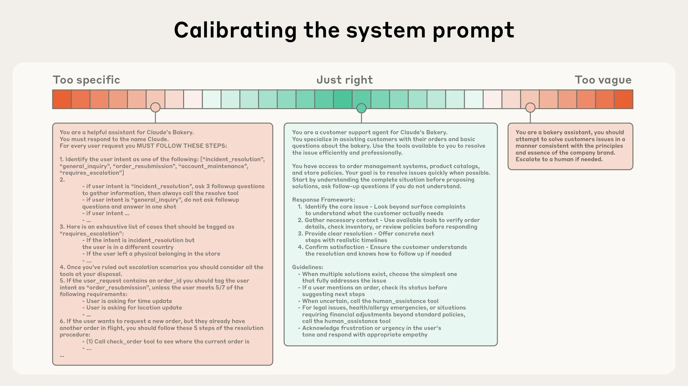

# AI agents 的有效上下文工程

- 原文标题: [Effective context engineering for AI agents](https://www.anthropic.com/engineering/effective-context-engineering-for-ai-agents)
- 来源: Anthropic Engineering
- 发布时间: 2025-09-29
- 整理说明: 基于本地保存的 HTML 页面整理为 Markdown，并翻译为中文；保留原文主结构、关键链接与配图。

> 上下文对于 AI agent 来说既关键又有限。本文讨论的核心问题，不再只是“怎么写一句更好的 prompt”，而是“在每一次推理前，应该把什么信息放进上下文，才最可能得到我们想要的行为”。

## 引言

过去几年，应用层 AI 里最受关注的词一直是“提示工程”。但现在，一个更重要的概念正在浮到台前：`上下文工程（context engineering）`。

如果说提示工程关注的是如何写好提示词，那么上下文工程关注的是更大的问题：面对模型有限的上下文窗口，如何持续挑选、组织、压缩和维护最有价值的信息，让模型在每一步都更可能产生期望的行为。

这里的 `context`，指的是一次大语言模型采样时被送进模型的那一组 tokens。工程上的挑战，在于如何在模型先天限制之下，让这些 tokens 的效用最大化，并稳定地导向目标结果。换句话说，真正有效地驾驭 LLM，往往不是只盯着某一句 prompt，而是要始终从“当前模型眼里到底看到了什么”这个视角来思考。

本文围绕这一点，提出一套更适合构建可控、有效 agent 的心智模型。

## 上下文工程 vs 提示工程

Anthropic 认为，上下文工程是提示工程的自然演进。

提示工程，主要指的是如何编写和组织 LLM 指令，以获得更好的输出结果。Anthropic 在其 [prompt engineering 文档](https://docs.anthropic.com/en/docs/build-with-claude/prompt-engineering/overview) 中已经系统介绍了很多相关方法。

而上下文工程，指的是在 LLM 推理过程中，围绕“哪些信息会进入上下文窗口”所采取的一整套策略。它不只包含 prompt 本身，也包含工具、消息历史、外部数据、[Model Context Protocol](https://modelcontextprotocol.io/docs/getting-started/intro)（MCP）带来的信息，以及其他一切会落入上下文的内容。

在早期的 LLM 工程实践中，大多数任务还是偏单轮推理，比如一次分类、一次生成，因此最重要的工作就是把 prompt 写对，尤其是 system prompt 写对。但随着 agent 变得更强，它们不再只是一次性回答问题，而是在多轮推理、长时间任务中循环工作。这时，真正困难的地方就不再只是“怎么写提示词”，而是“怎么管理整个上下文状态”。

一个在循环中运行的 agent，会不断产生新的、潜在相关的数据。哪些该保留、哪些该丢弃、哪些要被重新压缩、哪些该在后续步骤再按需取回，这些都不再是附属问题，而是 agent 是否可靠的核心问题。上下文工程，就是在这个持续变化的信息宇宙里，筛选出应该进入有限上下文窗口的那部分信息的“艺术与科学”。

与写 prompt 这种相对离散的动作不同，上下文工程是持续迭代的。每一次决定把什么送进模型，其实都在做一次上下文编排。

_图注：与“写 prompt”这个相对离散的动作不同，上下文工程是一个持续迭代的过程。每一次决定把什么信息传给模型，都会发生一次新的上下文筛选。_

## 为什么上下文工程对构建强 agent 很重要

Anthropic 观察到，尽管 LLM 越来越快、能处理的数据也越来越多，但它们和人一样，在信息量大到一定程度后会失焦、混乱，或者开始“看不见真正重要的东西”。

这正是一些 “needle-in-a-haystack” 类基准测试揭示出的现象，也就是所谓的 [context rot](https://research.trychroma.com/context-rot)：随着上下文中的 token 数不断增加，模型准确回忆其中信息的能力会下降。

不同模型退化得快慢不一样，但这个现象本身几乎是普遍存在的。因此，上下文不能被当成“越多越好”的无限资源，而应该被视为一种边际收益递减的有限资源。就像人类工作记忆容量有限一样，LLM 也有自己的“注意力预算”。每加入一个新 token，都会消耗这份预算的一部分，因此必须谨慎决定哪些信息值得进入模型的视野。

这背后既有经验层面的原因，也有架构层面的原因。LLM 基于 [Transformer](https://arxiv.org/abs/1706.03762) 架构，而 Transformer 的核心机制是每个 token 都有机会关注上下文中的其他 token。对于 `n` 个 token，会形成 `n²` 级别的成对关系。上下文越长，这些关系就越稀薄，模型就越难同时兼顾范围和精度。

此外，模型在训练中通常看到的短序列远多于超长序列，因此对长距离依赖的处理天然更弱。像 [position encoding interpolation](https://arxiv.org/pdf/2306.15595) 这样的技术虽然能帮助模型适配更长上下文，但往往也会带来一定的位置理解退化。最终结果不是“过了某个长度突然完全失效”，而是一个逐步变差的性能梯度。

这就是为什么：如果你要构建真正有能力的 agent，就不能只盯着模型能力本身，更要认真设计它每一步真正看到的上下文。

## 有效上下文的构成

既然 LLM 的注意力预算是有限的，那么好的上下文工程，本质上就是：找到那组最小但高信号的 tokens，使模型最有可能得到你想要的结果。

说起来简单，做起来不容易。Anthropic 将这件事拆成几个关键组成部分来看。

### 1. System prompt

`System prompt` 应该非常清晰，语言直接，表达高度恰当。这里的“高度恰当”很关键，它意味着你既不能把 prompt 写成脆弱的 `if-else` 行为脚本，也不能写得过于空泛、抽象，以至于模型根本拿不到足够具体的行为信号。

一个极端，是工程师把非常复杂、非常细碎的逻辑硬编码到 prompt 中。这种做法短期看上去“可控”，长期却很脆弱，也很难维护。另一个极端，是只给一些模糊的高层描述，默认模型和你有共享上下文，或者默认模型会自己补全所有细节。这样同样容易失效。

理想状态是处在两者之间：既足够具体，能给模型明确的行为启发；又不过度僵化，保留模型作为智能体自主发挥的空间。

Anthropic 建议把 prompt 组织成清晰的分区，例如：

- `<background_information>`
- `<instructions>`
- `## Tool guidance`
- `## Output description`

这些分区可以通过 XML 标签或 Markdown 标题来标识。虽然随着模型越来越强，具体格式的重要性可能会降低，但“结构清晰”这一点依然成立。

无论具体怎么组织 system prompt，原则都一样：只放足够描述预期行为的最小信息集。这里的“最小”不等于“越短越好”，而是“不要有冗余，但必须足够”。实践上，最好先用当前最强模型和最小版本 prompt 去跑任务，观察失败模式，再基于失败点增加清晰指令和少量示例。

_图注：system prompt 的校准需要避免两个极端：一端是脆弱的、硬编码的 `if-else` 式提示；另一端是过于泛化、错误假设共享上下文的提示。_

### 2. Tools

工具让 agent 可以与环境交互，并在运行过程中拉取新的上下文。因此，工具本身就是 agent 与信息空间、行动空间之间的契约。

这意味着，工具不仅要“能用”，还要“高效”。它们返回的信息应尽量节省 token，同时也要鼓励 agent 形成高效行为。

Anthropic 在 [Writing tools for AI agents – with AI agents](https://www.anthropic.com/engineering/writing-tools-for-agents) 一文里提到，好的工具应该像好的代码模块一样：边界清晰、职责单一、错误处理健壮、意图明确。输入参数也应当描述性强、没有歧义，并且顺应模型擅长理解的方式。

一个很常见的失败模式，是工具集合过于臃肿、功能重叠严重，导致 agent 不知道该选哪个工具。如果一个人类工程师在某种场景下都说不清该调用哪个工具，那就不能指望 agent 做得更好。

从长期运行角度看，精简的工具集还有另一个好处：更容易维护，也更容易在长交互中做上下文裁剪和清理。

### 3. Examples

示例，也就是 few-shot prompting，依然是 Anthropic 非常认可的最佳实践。

但一个常见误区是，团队试图把所有边界情况、所有规则都塞成一大串示例，想一次性讲全。这种做法通常并不好。更好的方式，是精心挑选一组多样但典型的、具有代表性的示例，用它们来传达你希望 agent 呈现的行为模式。

对 LLM 来说，示例常常就是“胜过千言万语的图像”。

### 4. 总体原则

不管是 system prompts、tools、examples 还是 message history，整体指导原则都是一致的：让上下文尽量高信息密度，同时保持紧凑。

接下来，文章把重点转向另一个更动态的问题：如何在运行时按需获取上下文。

## 上下文检索与 agentic search

在 [Building effective AI agents](https://www.anthropic.com/research/building-effective-agents) 中，Anthropic 曾区分过基于 LLM 的 workflow 和真正的 agent。后来，他们越来越倾向于一个更简单的定义：agent 就是会在循环中自主使用工具的 LLM。

在这个范式下，构建 agent 的方式也发生了变化。过去，很多 AI-native 应用会在推理前先用 embedding 检索一批相关资料，再统一喂给模型。现在，越来越多团队开始把这种方式和“just in time”的上下文策略结合起来。

所谓 “just in time”，就是不预先把所有可能相关的数据都塞进上下文，而是只保留轻量级的引用信息，例如文件路径、已存查询、网页链接等。然后在真正需要时，再通过工具动态把对应内容加载进上下文。

[Claude Code](https://www.anthropic.com/claude-code) 就大量使用了这种方式。例如，模型可以自己写查询语句、保存结果、用 Bash 的 `head` 和 `tail` 分析大体量数据，而不需要把完整数据对象全部塞进上下文。它更像人类的工作方式：人不会把整个知识库都背下来，而是依赖文件系统、书签、收件箱和索引系统，在需要时再取回相关信息。

更重要的是，引用本身的元数据就带有大量可利用信号。一个放在 `tests/` 下的 `test_utils.py`，和一个放在 `src/core_logic/` 下的同名文件，对 agent 来说意义并不一样。文件层级、命名方式、时间戳等，都能帮助 agent 推断一份信息的用途、重要性以及何时应该被读取。

让 agent 自主探索和检索数据，还带来了另一个关键能力：`progressive disclosure`。也就是 agent 可以在探索过程中逐层发现上下文，而不是一开始就被塞入一大堆可能相关、也可能无关的信息。文件大小暗示复杂度，命名暗示用途，时间暗示新旧与相关性。agent 可以像搭积木一样逐步形成理解，只把当前必要的信息保留在工作记忆里，把额外信息交给外部笔记或索引系统。

当然，这样做也有代价。运行时探索一定比直接读取预计算结果更慢，而且如果没有设计好工具和导航启发式，agent 也可能误用工具、走进死胡同、浪费上下文。

因此，在有些场景里，最佳实践可能不是纯粹的“先检索”或纯粹的“全程探索”，而是混合策略：先放入一部分高价值内容保证效率，再让 agent 自主决定是否继续深入探索。

Anthropic 提到，Claude Code 采用的就是这种混合模式：像 `CLAUDE.md` 这样的文件会被直接注入到上下文中，而 `glob`、`grep` 等原语则用于让 agent 在运行时按需定位和读取信息，从而绕开过时索引和复杂语法树的问题。

在法律、金融这类相对更稳定的场景下，混合策略尤其合适。随着模型变强，agentic design 的趋势会越来越偏向“让聪明模型用聪明方式行动”，而不是靠大量人工预整理。对于正在基于 Claude 构建 agent 的团队，Anthropic 给出的建议仍然很朴素：先做当前最简单但有效的方案。

## 面向长时任务的上下文工程

长时任务要求 agent 在几十分钟到数小时的连续行动中，保持目标一致性、上下文连贯性和行为稳定性。但一旦任务跨度足够长，token 总量就会超过上下文窗口本身的容量。

很多人第一反应是：那就等更长的上下文窗口出现。Anthropic 的判断是，即便上下文窗口继续扩大，“上下文污染”和“信息相关性”问题仍会长期存在。对追求最强 agent 表现的系统来说，这不会因为窗口变大而自动消失。

因此，他们总结出三种更直接应对这类问题的方式：`compaction`、`structured note-taking` 和 `sub-agent architectures`。

### 压缩（Compaction）

压缩，是指当一段对话接近上下文窗口上限时，把现有内容高保真地总结成摘要，再基于这个摘要重新开始一个新的上下文窗口。

在很多系统里，压缩是维持长程一致性的第一根杠杆。核心目标是尽量保留重要信息，同时丢掉冗余部分，让 agent 在换上下文后还能继续工作，而性能下降尽可能小。

Anthropic 提到，在 Claude Code 里，他们会把消息历史交给模型来总结和压缩，让模型保留架构决策、未解决 bug、实现细节等关键信息，同时丢弃重复的工具输出和无意义的消息。之后，agent 会带着这份压缩后的上下文，以及最近访问过的少量关键文件继续工作。对用户而言，体验上会感觉是连贯的，而不需要自己关心上下文窗口极限。

压缩的难点，不在于“能不能总结”，而在于“留下什么、丢掉什么”。如果压缩过猛，某些当下看似不重要、但稍后会突然变得关键的细节就会消失。因此，实现压缩系统时，应该先优先保证召回率，确保重要信息不丢，再逐步提高精度，把真正多余的内容清理掉。

一个最容易先做的轻量压缩手段，就是清理历史里的工具调用结果。对于那些早已完成的调用，agent 往往没必要反复看到原始输出。Anthropic 也提到，工具结果清理已经作为 [Claude Developer Platform 的能力](https://www.anthropic.com/news/context-management) 公开推出。

### 结构化记笔记（Structured note-taking）

结构化记笔记，也可以理解为一种 agent memory：agent 会周期性地把关键信息写入上下文窗口之外的持久化存储，后续需要时再取回。

这种方式用很低的代价，为 agent 提供了相对稳定的长期记忆。就像 Claude Code 会维护待办列表，或者一个自定义 agent 会维护自己的 `NOTES.md`，这种模式可以让 agent 在复杂任务里持续记录进展、依赖关系和未完成事项，而不必把一切都硬塞进当前上下文。

Anthropic 用 [Claude playing Pokémon](https://www.twitch.tv/claudeplayspokemon) 举了一个很典型的例子。这个 agent 在成千上万步游戏动作中，能够持续记录目标、路线、训练进度、关键成就和战斗策略。即使上下文多次重置，它也能在重新读回笔记后继续进行长时间训练和探索。这种跨摘要阶段的一致性，是仅靠当前上下文窗口很难实现的。

作为 Sonnet 4.5 发布的一部分，Anthropic 还在 Claude Developer Platform 中推出了处于公开 beta 的 [memory tool](https://www.anthropic.com/news/context-management)。它通过一种文件式系统，让 agent 更容易在上下文窗口之外存储和读取信息，从而跨 session 维护项目状态、积累知识库、引用既有工作成果。

### 子代理架构（Sub-agent architectures）

第三种方式，是把任务拆给多个子代理，而不是让一个 agent 试图记住整个项目的所有状态。

在这种模式下，主代理负责高层计划和结果整合，子代理各自拿着干净、聚焦的上下文窗口去处理局部任务，例如做深度技术探索、调用工具搜集资料、分析局部代码或并行调查多个方向。每个子代理可以消耗成千上万甚至更多 tokens，但最终只返回一份精炼摘要，通常是一两千 token 的量级。

这样做的好处，是把“详细搜索上下文”和“高层综合判断”明确分离开。主代理不需要背着所有细节往前走，只需要整合经过提炼的结果即可。Anthropic 在 [How we built our multi-agent research system](https://www.anthropic.com/engineering/multi-agent-research-system) 一文中提到，这种模式在复杂研究任务上，相比单代理有明显提升。

三种方法各有适用场景：

- `Compaction` 适合需要大量来回交互、希望保持对话连续感的任务。
- `Structured note-taking` 适合有明确阶段和里程碑的迭代式开发任务。
- `Sub-agent architectures` 适合复杂研究、分析和并行探索收益明显的任务。

即便模型继续进步，如何在长时间交互中维持一致性，仍然会是更强 agent 系统的核心难题。

## 结论

Anthropic 想表达的核心观点很明确：`上下文工程` 正在成为构建 LLM 应用和 agent 的核心能力。

随着模型能力提升，真正的挑战不再只是“写出完美 prompt”，而是“在每一步推理时，谨慎决定什么信息值得占用模型有限的注意力预算”。不管你是在为长时任务做压缩、在设计节省 token 的工具，还是在让 agent 按需探索环境，背后的总原则都是同一个：

> 找到那组最小但高信号的 tokens，让模型最有可能产生你想要的结果。

这些技术会随着模型进化而继续变化。Anthropic 也已经观察到，模型越聪明，往往越不需要过度规定式的工程控制，agent 能以更高自主性行动。但即使如此，把上下文当作一种稀缺而珍贵的资源来管理，仍然会长期是构建可靠 agent 的基础能力。

如果要继续深入，Anthropic 还建议参考其 [memory and context management cookbook](https://platform.claude.com/cookbook/tool-use-memory-cookbook)。

## 致谢

本文由 Anthropic Applied AI 团队撰写：Prithvi Rajasekaran、Ethan Dixon、Carly Ryan、Jeremy Hadfield；同时感谢 Rafi Ayub、Hannah Moran、Cal Rueb、Connor Jennings 的贡献，以及 Molly Vorwerck、Stuart Ritchie、Maggie Vo 的支持。
