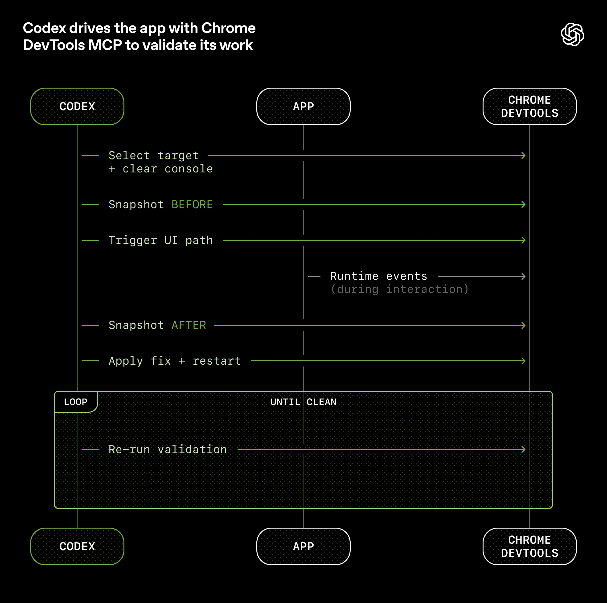
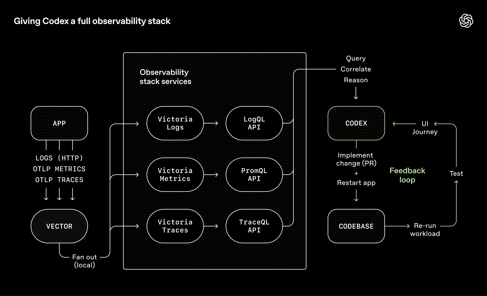
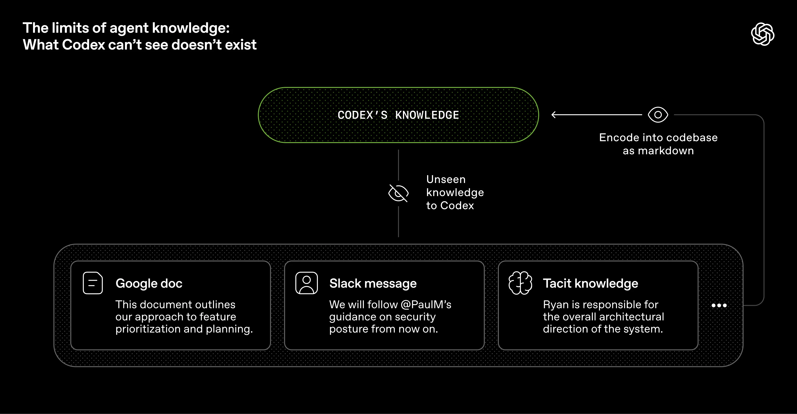
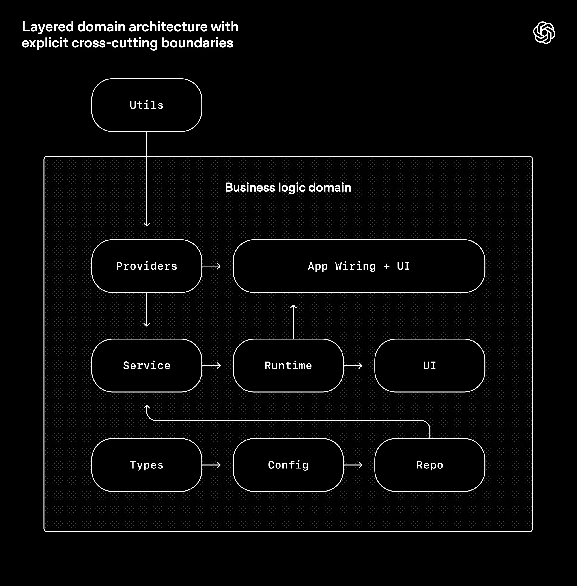

2026 年 2 月 11 日

<a href="https://openai.com/news/engineering/" class="transition ease-curve-a duration-250 text-meta text-primary-60 hover:text-primary-100">Engineering</a>

# Harness Engineering：在 agent-first 世界中借助 Codex

作者：Ryan Lopopolo，技术团队成员

在过去五个月里，我们团队一直在做一项实验：在**人工手写代码为 0 行**的前提下，构建并交付一款软件产品的内部 Beta 版本。

这个产品有日常内部用户，也有外部 Alpha 测试用户。它会发布、部署、出故障，也会被修好。不同之处在于，代码库中的每一行代码，包括应用逻辑、测试、CI 配置、文档、可观测性以及内部工具，全部都由 Codex 编写。我们估计，这项工作所花的时间大约只有人工手写方式的十分之一。

**人来掌舵，Agent 来执行。**

我们之所以刻意设置这个约束，是因为我们想逼自己构建出那些真正能让工程效率提升一个数量级所必需的东西。我们只有几周时间，却最终交付出了接近百万行代码。为了做到这一点，我们必须弄明白：当一个软件工程团队的主要工作不再是写代码，而是设计环境、表达意图、搭建反馈回路，以便让 Codex agents 能够稳定可靠地完成工作时，到底有哪些事情会发生变化。

这篇文章讲的是：我们用一支 agent 团队从零做出一个全新产品时学到了什么，哪里出了问题，哪些东西会产生复利，以及如何最大化我们那项真正稀缺的资源：人的时间与注意力。

## 我们从一个空的 Git 仓库开始

这个空仓库的第一条提交落在 2025 年 8 月下旬。

最初的脚手架，包括仓库结构、CI 配置、格式化规则、包管理器设置和应用框架，都是由 Codex CLI 在 GPT‑5 的支持下生成的，所参考的只有少量现有模板。甚至最开始那个用于告诉 agent 如何在仓库中工作的 `AGENTS.md` 文件，本身也是 Codex 写出来的。

当时并不存在任何预先写好的人工代码来为这个系统提供锚点。从一开始，这个仓库就是被 agent 塑造出来的。

五个月后，这个仓库已经累积了大约百万行代码，涵盖应用逻辑、基础设施、工具、文档以及内部开发者工具。在这段时间里，仅靠三名工程师驱动 Codex，就大约开出了并合并了 1500 个 pull request。换算下来，平均每名工程师每天能产出 3.5 个 PR。更令人意外的是，随着团队扩张到现在的七名工程师，这个吞吐量反而还在上升。更重要的是，这并不是为了产出而产出：这个产品已经被数百名内部用户实际使用，其中包括每天都在深度使用的内部重度用户。

在整个开发过程中，人类从未直接手写任何代码。这后来成了团队的一条核心哲学：**不手写代码**。

## 重新定义工程师的角色

当人类不再亲手写代码时，**工程工作并没有消失，而是变成了另一种形式，更聚焦于系统、脚手架和杠杆效应。**

早期的推进速度比我们预期中慢，不是因为 Codex 做不到，而是因为环境定义得还不够充分。这个 agent 缺少朝高层目标持续推进所需要的工具、抽象和内部结构。于是，我们工程团队的主要工作就变成了：让 agents 具备做有用工作的能力。

落到实践上，这意味着我们采用纵深式推进：

把更大的目标拆成更小的构件，比如设计、编码、评审、测试等等；提示 agent 去构建这些构件；

再用这些构件去解锁更复杂的任务。当某件事失败时，解决办法几乎从来都不是“再努力一点”。由于唯一能让系统持续前进的方法就是让 Codex 自己去完成工作，人类工程师每次都会切回这个任务本身，然后问一句：“到底缺了什么能力？我们怎样才能把它变得既对 agent 可读，又能被强制执行？”

人类与整个系统的交互，几乎完全通过 prompt 来完成：工程师描述一个任务，运行 agent，然后让它去开一个 pull request。为了把一个 PR 推到真正完成，我们会指示 Codex 在本地先评审自己的改动，再在本地和云端分别请求额外的、具备针对性的 agent review，响应所有来自人类或 agent 的反馈，然后持续循环迭代，直到所有 agent reviewers 都满意为止（本质上这就是一个 <a href="https://ghuntley.com/loop/" class="transition ease-curve-a duration-250 text-primary-100 hover:text-primary-60 relative underline-offset-[0.25rem] decoration-1 underline" target="_blank" rel="noreferrer"><u><span>Ralph Wiggum Loop</span></u>⁠<span class="sr-only">(opens in a new window)</span></a>）。Codex 会直接使用我们的标准开发工具，比如 `gh`、本地脚本以及仓库内嵌的 skills，来收集上下文，而不需要人类把上下文复制粘贴到 CLI 里。

人类可以评审 pull request，但这不是必须的。随着时间推移，我们已经把几乎所有评审工作都推向了 agent-to-agent 的方式来完成。

## 提高应用对 agent 的可读性

随着代码吞吐量上升，我们的瓶颈变成了人类 QA 的产能。因为真正固定稀缺的约束是人的时间和注意力，所以我们开始努力让更多能力直接对 agent 可用，比如让应用 UI、日志和应用指标本身都能被 Codex 直接读取和理解。

比如，我们让应用能够按 git worktree 启动，这样 Codex 就可以为每一个变更启动并驱动一个独立实例。我们还把 Chrome DevTools Protocol 接到了 agent 运行时里，并为 DOM 快照、截图和页面导航编写了专门的 skills。这让 Codex 能够直接复现 bug、验证修复结果，并对 UI 行为进行推理。



我们也以同样的方式处理了可观测性工具。日志、指标和 traces 会通过一套本地的可观测性栈暴露给 Codex，而这套栈对于每个 worktree 都是临时的。Codex 面对的是应用的一个完全隔离版本，包括它自己的日志和指标，而这些内容会在该任务结束后被整体销毁。Agents 可以使用 LogQL 查询日志，也可以使用 PromQL 查询指标。有了这些上下文之后，像“确保服务启动时间不超过 800ms”或者“这四条关键用户路径中的任何 span 都不能超过两秒”这样的 prompt，才真正变得可执行。



现在我们经常能看到一次单独的 Codex 运行，在一个任务上连续工作六个小时以上，而且很多时候发生在人类睡觉的时候。

## 我们让仓库知识成为系统的唯一记录来源

上下文管理，是让 agents 在大型复杂任务上有效工作的最大挑战之一。我们最早学到的一条经验其实很简单：**给 Codex 一张地图，而不是一本 1000 页的说明书。**

我们尝试过“把所有东西都塞进一个巨大的 <a href="https://agents.md/" class="transition ease-curve-a duration-250 text-primary-100 hover:text-primary-60 relative underline-offset-[0.25rem] decoration-1 underline" target="_blank" rel="noreferrer"><span class="prose"><span><code class="wrap-anywhere">AGENTS.md</code></span></span>⁠<span class="sr-only">(opens in a new window)</span></a> 文件里”的方法。结果它以一种完全可以预见的方式失败了：

- **Context 是稀缺资源。** 一个巨大的说明文件会挤占任务本身、代码本身以及相关文档的上下文空间，导致 agent 要么错过关键约束，要么开始朝错误的方向优化。
- **过多指导会变成“没有指导”。** 当所有东西都被标记为“重要”时，就没有任何东西真的重要。Agents 会退化成局部模式匹配，而不是有意识地导航。
- **它会立刻腐烂。** 一个庞大的单体手册很快就会变成陈旧规则的坟场。Agents 无法判断哪些内容仍然有效，人类也不再愿意维护，最终这个文件会悄悄变成一个看似有用、实际上有害的干扰源。
- **它难以验证。** 一个单一大文件不利于做机械化检查，比如覆盖率、时效性、所有权、交叉引用等，因此漂移几乎不可避免。

所以，我们不再把 <span class="prose">`AGENTS.md`</span> 当作百科全书，而是把它当作**目录**。

仓库里的知识库存在于一个结构化的 <span class="prose">`docs/`</span> 目录中，并被视为系统的正式记录来源。一个短小的 <span class="prose">`AGENTS.md`</span>（大约 100 行）会被注入上下文，它主要承担地图的作用，把 agent 指向更深层、更权威的事实来源。

#### 纯文本

``` flex
AGENTS.md
ARCHITECTURE.md
docs/
├── design-docs/
│   ├── index.md
│   ├── core-beliefs.md
│   └── ...
├── exec-plans/
│   ├── active/
│   ├── completed/
│   └── tech-debt-tracker.md
├── generated/
│   └── db-schema.md
├── product-specs/
│   ├── index.md
│   ├── new-user-onboarding.md
│   └── ...
├── references/
│   ├── design-system-reference-llms.txt
│   ├── nixpacks-llms.txt
│   ├── uv-llms.txt
│   └── ...
├── DESIGN.md
├── FRONTEND.md
├── PLANS.md
├── PRODUCT_SENSE.md
├── QUALITY_SCORE.md
├── RELIABILITY.md
└── SECURITY.md
```

仓库内知识库布局。

设计文档会被编目并建立索引，其中包含验证状态，以及一套定义 agent-first 运行原则的核心信念。<a href="https://matklad.github.io/2021/02/06/ARCHITECTURE.md.html" class="transition ease-curve-a duration-250 text-primary-100 hover:text-primary-60 relative underline-offset-[0.25rem] decoration-1 underline" target="_blank" rel="noreferrer"><u><span>架构文档</span></u>⁠<span class="sr-only">(opens in a new window)</span></a> 提供了顶层的领域地图和包分层结构。还有一份质量文档，用来给每个产品领域和每个架构层打分，并随着时间推移跟踪其中的缺口。

计划也被视为一等产物。小变更会使用轻量的临时计划；复杂工作则会沉淀为 <a href="https://cookbook.openai.com/articles/codex_exec_plans" class="transition ease-curve-a duration-250 text-primary-100 hover:text-primary-60 relative underline-offset-[0.25rem] decoration-1 underline" target="_blank" referrerpolicy="no-referrer-when-downgrade"><u><span>execution plans</span></u>⁠<span class="sr-only">(opens in a new window)</span></a>，并配套进度日志和决策日志，一起纳入版本控制。正在进行的计划、已完成的计划，以及已知技术债，都会被版本化并放在一起，从而让 agents 在不依赖外部上下文的前提下也能工作。

这带来了**渐进式披露**：agent 从一个小而稳定的入口开始，然后被逐步教会下一步该去哪里找信息，而不是一开始就被海量信息淹没。

我们通过机械化手段来强制执行这一点。专门的 linter 和 CI 作业会验证知识库是否是最新的、是否建立了交叉链接、结构是否正确。还有一个周期性运行的“doc-gardening” agent，会扫描那些已经过时、或者不能反映真实代码行为的文档，然后自动发起修正文档的 pull request。

## 对 agent 可读，才是目标

随着代码库不断演化，Codex 做设计决策的框架也必须随之演化。

由于整个仓库都是由 agent 生成的，它首先是为**Codex 的可读性**而优化的。就像团队会努力提升代码对新工程师的可导航性一样，我们人类工程师的目标则是：让 agent 能够**直接通过仓库本身**推理整个业务领域。

从 agent 的视角来看，任何它在运行时无法在上下文中访问到的信息，本质上就等于不存在。存放在 Google Docs、聊天线程或者人脑里的知识，对它来说都是不可见的。它真正看得见的，只有仓库本地、可版本化的那些产物，例如代码、markdown、schema 和可执行计划。



我们逐渐意识到，必须把越来越多的上下文推回仓库里。比如某次 Slack 讨论，团队借此对某个架构模式达成一致；如果 agent 无法发现这段讨论，那它对 agent 来说就是不可读的，就像三个月后新加入的一位工程师也不会天然知道这件事一样。

给 Codex 更多上下文，并不意味着胡乱堆砌更多说明，而是要把正确的信息以适合推理的方式组织并暴露出来。就像你会给一位新同事讲清产品原则、工程规范和团队文化（甚至包括大家偏好的 emoji 风格），把这些信息交给 agent，同样会让它产出的结果更一致、更符合预期。

这种视角也帮助我们看清了许多权衡。我们更偏向选择那些能在仓库内被完全吸收、完全推理的依赖和抽象。

那些通常被称为“boring”的技术，对 agents 往往更友好，因为它们更可组合、API 更稳定、在训练数据中的表示也更充分。

在某些情况下，让 agent 直接重写一小部分功能，反而比绕开上游公共库中的黑盒行为更划算。比如我们没有引入通用的 `p-limit` 风格包，而是实现了自己的 map-with-concurrency helper：它和我们的 OpenTelemetry 埋点深度集成，测试覆盖率 100%，而且行为完全符合运行时的预期。

把更多系统内容变成 agent 能够直接检查、验证和修改的形式，会持续放大杠杆效应。这不仅对 Codex 有利，对其他同样在这个代码库中工作的 agents（比如 <a href="https://openai.com/index/introducing-aardvark/" class="transition ease-curve-a duration-250 text-primary-100 hover:text-primary-60 relative underline-offset-[0.25rem] decoration-1 underline"><u><span>Aardvark</span></u></a>）也一样有利。

## 强制执行架构与品味

仅靠文档，并不足以让一个完全由 agent 生成的代码库保持一致性。**通过强制执行不变式，而不是事无巨细地微观管理实现细节，我们才能让 agents 高速交付，同时不破坏底层基础。** 例如，我们要求 Codex 在边界处 <a href="https://lexi-lambda.github.io/blog/2019/11/05/parse-don-t-validate/" class="transition ease-curve-a duration-250 text-primary-100 hover:text-primary-60 relative underline-offset-[0.25rem] decoration-1 underline" target="_blank" rel="noreferrer"><u><span>解析数据形状，而不是事后验证</span></u>⁠<span class="sr-only">(opens in a new window)</span></a>，但我们不会规定它必须用哪种具体方式完成（模型看起来很喜欢 Zod，但这并不是我们指定的）。

Agents 在**边界严格、结构可预测**的环境中最有效，因此我们围绕一个刚性的架构模型来构建应用。每个业务领域都被拆成一组固定层次，层与层之间的依赖方向必须被严格验证，而且只允许有限的依赖边。所有这些约束都通过自定义 linter（当然，也是 Codex 生成的）和结构测试来机械执行。

下图描述的是这套规则：在每一个业务领域内部（例如 App Settings），代码只能沿着固定层次“向前”依赖：Types → Config → Repo → Service → Runtime → UI。跨领域的横切关注点，比如鉴权、连接器、遥测、feature flags，只能通过一个明确的接口进入：Providers。除此之外的依赖都是不被允许的，并且会被机械地强制拦截。



这种架构通常是你在拥有数百名工程师之后才会认真推进的事情。但在 coding agents 的世界里，它是早期前置条件：正是这些约束，才能让速度提升而不伴随腐化和架构漂移。

在实践中，我们通过自定义 linter 和结构测试来执行这些规则，同时也补上一小组“品味不变式”。例如，我们会静态强制执行结构化日志、schemas 和 types 的命名约定、文件大小上限，以及特定平台的可靠性要求。由于这些 lints 是自定义的，我们甚至会把修复建议直接写进报错信息里，从而把 remediation instructions 一并注入到 agent 的上下文中。

在以人为中心的工作流里，这类规则也许会显得吹毛求疵，甚至有点束手束脚。但在 agent 场景下，它们会变成放大器：一旦编码完成，它们就会同时作用于所有地方。

与此同时，我们也会明确区分：哪些约束是关键的，哪些地方不需要过度控制。这有点像运营一个大型工程平台组织：边界集中治理，边界内部允许局部自治。你会非常在意边界、正确性和可复现性；但只要这些边界被守住，你就会允许团队，或者 agents，在解法表达上拥有相当大的自由。

最终产出的代码，未必总是符合人类在风格上的偏好，但这没关系。只要结果是正确的、可维护的，并且对后续的 agent 运行仍然足够可读，它就达标了。

人类的品味会被持续反馈回系统里。评审意见、重构 pull request，以及面向用户的 bug，都会沉淀成文档更新，或者直接编码进工具链中。当文档的约束力度不够时，我们就把这条规则升级成代码。

## 吞吐量会改变合并哲学

随着 Codex 的吞吐量越来越高，许多传统工程规范反而开始变得适得其反。

这个仓库几乎不设置阻塞式 merge gates。Pull request 的生命周期很短。测试偶发失败通常会通过后续重新运行来解决，而不是让整个进度无限期阻塞。在一个 agent 吞吐量远远超过人类注意力的系统里，纠错成本很低，等待成本却很高。

如果放在一个低吞吐环境里，这种做法会很不负责任。但在这里，它往往是正确的权衡。

## “agent 生成”到底意味着什么

当我们说这个代码库是由 Codex agents 生成的，我们的意思是：代码库中的一切，真的是一切。

Agents 负责生成：

- 产品代码和测试
- CI 配置和发布工具
- 内部开发者工具
- 文档和设计历史
- 评估 harnesses
- 评审意见和回复
- 管理仓库本身的脚本
- 生产仪表盘定义文件

人类始终仍然在回路里，只不过工作所处的抽象层已经和过去不同。我们负责确定优先级，把用户反馈翻译成验收标准，并验证最终结果。当 agent 遇到困难时，我们会把它视为一个信号：识别到底缺了什么，比如工具、guardrails、文档，然后把这些东西反馈回仓库里，而且总是通过让 Codex 自己去写出这个修复。

Agents 会直接使用我们的标准开发工具。它们会拉取 review 反馈、逐条回应、推送更新，很多时候甚至会自己 squash 并合并自己的 pull request。

## 自主性不断提高

随着更多开发闭环被直接编码进系统中，例如测试、验证、评审、处理反馈和失败恢复，这个仓库最近跨过了一个重要门槛：Codex 已经可以端到端地驱动一个新功能。

给定一条 prompt，agent 现在可以：

- 验证当前代码库状态
- 复现被报告的 bug
- 录制一段展示故障的视频
- 实现修复
- 通过驱动应用来验证修复结果
- 再录制一段展示问题已解决的视频
- 发起 pull request
- 响应 agent 和人类给出的反馈
- 检测并修复构建失败
- 只有在确实需要判断时才升级给人类
- 最终合并改动

这种行为高度依赖于这个仓库特定的结构和工具链。如果没有类似程度的投入，不应假设它能够自然泛化，至少现在还不能。

## 熵与垃圾回收

**完全的 agent 自主性也会引入新的问题。** Codex 会复制仓库里已经存在的模式，哪怕这些模式本身并不均匀，甚至并不理想。随着时间推移，这几乎必然会导致漂移。

一开始，人类是手工解决这个问题的。我们团队过去每周五都要花上一整天（也就是一周 20% 的时间）去清理所谓的 “AI slop”。毫不意外，这种方式并不能扩展。

于是，我们开始把所谓的“golden principles”直接编码进仓库里，并建立了一套周期性的清理流程。这些原则是带有明确立场的、机械化的规则，它们帮助代码库在未来的 agent 运行中始终保持可读和一致。比如：（1）我们更偏好共享 utility packages，而不是到处手搓 helper，以便让不变式集中维护；（2）我们不做 “YOLO-style” 的数据探测，而是会在边界做验证，或者依赖类型化 SDK，这样 agent 就不会在猜测的数据形状之上继续构建。按照固定节奏，我们会运行一组后台 Codex 任务，用来扫描偏差、更新质量评分，并发起有针对性的重构 pull request。其中大部分 PR 的评审时间都不到一分钟，而且可以自动合并。

这就像垃圾回收。技术债很像一笔高利贷：几乎总是更适合用小步、持续的方式慢慢偿还，而不是任由它滚大，最后再用一次痛苦的集中治理去解决。人的品味只需要被表达一次，然后就能被持续地施加到每一行代码上。这也意味着我们可以每天捕捉并修复坏模式，而不是让它们在代码库里蔓延数天甚至数周。

## 我们仍在学习的东西

到目前为止，这套策略在 OpenAI 内部上线并被采用的过程中表现良好。为真实用户构建真实产品，帮助我们把投入锚定在现实问题上，并引导我们更关注长期可维护性。

我们尚未知道的是：在一个完全由 agent 生成的系统里，架构一致性在数年尺度上会如何演化。我们仍在摸索，究竟哪些地方最值得投入人类判断，以及该如何把这些判断编码进去，让它们持续产生复利。我们同样也不知道，随着模型能力不断提升，这套系统会如何继续演化。

但有一点已经变得很清楚：构建软件依旧需要纪律，只不过这种纪律越来越多地体现在脚手架层，而不是代码层。那些维持代码库一致性的工具、抽象和反馈回路，正在变得越来越重要。

**我们现在最困难的挑战，集中在如何设计环境、反馈回路和控制系统**，从而帮助 agents 完成我们的目标：以规模化方式构建并维护复杂、可靠的软件。

随着 Codex 这样的 agents 接管软件生命周期中越来越大的部分，这些问题只会变得更加重要。我们希望把这些早期经验分享出来，能够帮助你更好地判断应该把精力投入到哪里，这样 <a href="https://openai.com/codex/" class="transition ease-curve-a duration-250 text-primary-100 hover:text-primary-60 relative underline-offset-[0.25rem] decoration-1 underline"><u><span>你就可以专注于把东西真正做出来</span></u></a>。

- <a href="https://openai.com/news/?tags=codex" class="transition ease-curve-a duration-250 text-nav px-3xs py-4xs! bg-primary-4 hover:bg-primary-12 block rounded-xl">Codex</a>
- <a href="https://openai.com/news/?tags=2026" class="transition ease-curve-a duration-250 text-nav px-3xs py-4xs! bg-primary-4 hover:bg-primary-12 block rounded-xl">2026</a>

## 作者

Ryan Lopopolo

## 致谢

特别感谢 Victor Zhu 和 Zach Brock 对本文的贡献，也感谢整个参与构建这款新产品的团队。
