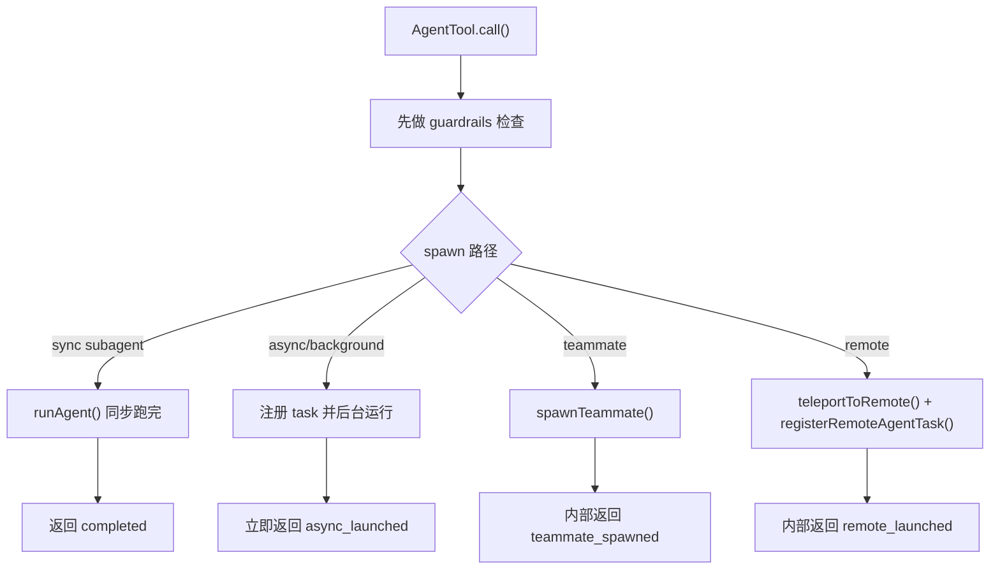

# Claude Code Source Analysis: Agent Output Modes And Guardrails

## Overview

AgentTool 不只是“生成一个子 agent 然后跑起来”。

它还有两层很关键的边界设计：

1. **输出模式**
   也就是 spawn 之后到底返回哪种结果形态
2. **guardrails**
   也就是哪些调用在真正 spawn 之前就会被挡住

一句话总结：

**输出模式决定父级怎么看待一个子 agent，guardrails 决定哪些子 agent 根本不允许被创建。**

## Core Idea

如果没有这两层约束，系统很快会变乱：

- 父 agent 不知道一个子 agent 是已经完成了，还是只是后台启动了
- team / fork / remote 这些特殊路径会和普通 subagent 混在一起
- 子 agent 可能递归生成错误类型的 agent
- 某些生命周期不兼容的组合会导致任务系统失控

所以 AgentTool 的设计不是“只有一个统一返回值”，而是：

- 按执行形态返回不同 status
- 按架构边界在 spawn 前做硬拦截

## Flow Diagram



## Part 1: Output Modes

### Public Output Schema

`AgentTool.tsx` 里导出的 `outputSchema` 只有两个公共结果：

1. `completed`
2. `async_launched`

也就是说，从公开 schema 看，AgentTool 对外主要有两种承诺：

- 要么这个 subagent 已经同步完成
- 要么它已经在后台启动

### Internal Output Types

但在内部实现里，其实还有两种额外的输出状态：

1. `teammate_spawned`
2. `remote_launched`

它们没有放进公开 `outputSchema`，而是作为内部类型单独存在。

代码注释里已经把设计意图写得比较清楚：

- 这些类型被排除在 exported schema 外
- 这样可以配合 dead code elimination

所以这里是一个很典型的“公开接口收敛，内部实现扩展”的设计。

## Mode 1: `completed`

### 什么时候出现

`completed` 对应同步子 agent 路径：

- 父级当场等待
- 子 agent 跑完
- 直接把完整结果回给父级

### 它带哪些字段

这类返回以 `agentToolResultSchema()` 为基础，再加一个：

- `status: 'completed'`
- `prompt`

同时实际结果里还会带：

- `agentId`
- `content`
- `totalToolUseCount`
- `totalDurationMs`
- `totalTokens`
- `usage`

在某些情况下还会额外带：

- `worktreePath`
- `worktreeBranch`

所以 `completed` 不是一个简单字符串，而是一份比较完整的执行结果包。

### 它怎么映射成模型能消费的 `tool_result`

在 `mapToolResultToToolResultBlockParam(...)` 里，`completed` 会被转成：

- 子 agent 的文本内容
- 加上一段 trailer

大致会包含：

- `agentId`
- `usage`
- 可选 `worktreePath`

这里还有个小优化：

对于某些 one-shot built-in agents，比如 `Explore`、`Plan`，如果没有 worktree 信息，系统会省掉 `agentId` 和 usage trailer，避免无意义 token 开销。

所以 `completed` 不只是“返回数据”，它还会被二次整理成更适合父模型消费的结果块。

## Mode 2: `async_launched`

### 什么时候出现

`async_launched` 出现在两类情况：

1. 一开始就按后台 agent 启动
2. 原本是前台同步 agent，但中途被提升到后台

所以这个 status 真正表示的不是“spawn 方法”，而是：

**现在这个 agent 已经在后台继续运行，父级不要再等它。**

### 它带哪些字段

`async_launched` 里最关键的字段有：

- `agentId`
- `description`
- `prompt`
- `outputFile`
- `canReadOutputFile`

其中最值得单独说的是 `canReadOutputFile`。

### `canReadOutputFile` 是干嘛的

它不是给 UI 用的装饰字段，而是在控制父 agent 后续行为。

如果调用方本身有：

- `Read`
- 或 `Bash`

那么它就可以在需要时查看 `outputFile` 里的进度。

否则，tool result 会明确告诉父 agent：

- 只需要简单告诉用户启动了什么
- 不要继续自己编造成果
- 等后续通知就行

所以 `canReadOutputFile` 其实是在给父 agent 一个能力边界提示。

### 它怎么映射成 `tool_result`

在 `mapToolResultToToolResultBlockParam(...)` 里，`async_launched` 会被转成一段非常“指导型”的文本：

- 告诉父 agent 这是后台任务
- 给出 `agentId`
- 给出 `output_file`
- 明确说“不要重复这个 agent 的工作”
- 如果允许，还提示可以用 `Read` 或 `Bash tail` 检查进度

这说明 AgentTool 的 tool result 不只是传数据，也在显式约束父模型的后续行为。

## Mode 3: `teammate_spawned`

### 什么时候出现

当 `team_name + name` 同时存在时，会走 teammate 分支，并由 `spawnTeammate()` 返回结果。

内部状态是：

```ts
status: 'teammate_spawned'
```

### 为什么它不放进公开 schema

因为 teammate 是 feature-gated、内部扩展性更强的一条路径。

它的返回里包含很多普通 subagent 不需要关心的信息，比如：

- `teammate_id`
- `tmux_session_name`
- `tmux_window_name`
- `tmux_pane_id`
- `team_name`

所以它更像“多 agent UI / orchestration 内部协议”，而不是通用 AgentTool 公共返回。

### 它怎么映射成 `tool_result`

虽然它不是公开 schema 的一部分，但最终还是会被转换成模型可读的 `tool_result` 文本，大意是：

- 队友已经生成成功
- agent / teammate id 是什么
- 它会通过 mailbox 收消息

所以父模型依然可以基于这个结果继续工作，只是外部 schema 不暴露这类实现细节。

## Mode 4: `remote_launched`

### 什么时候出现

当 `effectiveIsolation === 'remote'` 时，AgentTool 不走本地 `runAgent()`，而是：

- 检查远端资格
- `teleportToRemote()`
- `registerRemoteAgentTask()`
- 直接返回 `remote_launched`

### 它带哪些字段

这类返回里最关键的是：

- `taskId`
- `sessionUrl`
- `description`
- `prompt`
- `outputFile`

所以 remote agent 返回的不是“本地 agent 已经启动”，而是“远端任务已经被本地 task system 接管”。

### 为什么它也不放进公开 schema

和 teammate 类似，`remote_launched` 更像一个内部扩展输出：

- 只在特定构建和能力下存在
- 字段结构和普通本地 subagent 差异较大

所以它也被留在内部类型里，通过内部分支去处理。

### 它怎么映射成 `tool_result`

`mapToolResultToToolResultBlockParam(...)` 会把它转成：

- 远端 agent 已启动
- 给出 `taskId`
- 给出 `session_url`
- 给出 `output_file`
- 明确说会自动通知完成

也就是说，哪怕内部返回类型不同，最终父模型仍然拿到的是统一格式的 `tool_result` 文本块。

## Part 2: Guardrails

AgentTool 的 guardrails 很重要，因为很多错误不是“运行后再处理”，而是根本不应该允许 spawn。

### Guard 1: 没开 team 能力，不能用 team 参数

如果传了 `team_name`，但当前账户或环境不支持 Agent Teams，直接报错：

- `Agent Teams is not yet available on your plan.`

这是一个典型的 capability gate。

### Guard 2: teammate 不能再生 teammate

如果当前调用方自己已经是 teammate，又试图传：

- `team_name`
- `name`

去继续生成 teammate，会直接报错。

原因也很明确：

- 团队名册设计是扁平的
- 嵌套 teammate 会让 roster 和 lead-agent 关系混乱

所以系统强制要求：

- teammate 如果要继续委派
- 应该生成普通 subagent，而不是新的 teammate

### Guard 3: in-process teammate 不能生后台 agent

如果当前是 in-process teammate，还想：

- `run_in_background=true`

或选择了一个 `background: true` 的 agent definition，系统也会直接拒绝。

原因是：

- in-process teammate 的生命周期挂在 leader 进程上
- 它不适合再挂出独立后台 agent

所以这里限制的不是“teammate 全都不能后台”，而是 **in-process teammate** 这类特定后端不允许。

### Guard 4: fork child 不能递归 fork

fork 路径里最重要的 guardrail 之一就是防递归 fork。

系统会用两种信号检查：

1. `querySource === agent:builtin:fork`
2. 扫描历史消息里有没有 fork boilerplate tag

只要命中，就直接拒绝：

- `Fork is not available inside a forked worker.`

这条 guard 很关键，因为 fork child 为了 cache-identical tool defs 还保留了 Agent tool，如果不挡住，很容易无限分叉。

### Guard 5: agent type 权限规则和存在性检查

如果传了某个 `subagent_type`，系统还会检查：

- 这个类型是不是存在
- 它是不是被 `Agent(xxx)` deny rule 拦掉了

所以 agent type 不只是字符串匹配，还要过权限规则。

### Guard 6: `requiredMcpServers` 会阻止不满足依赖的 agent 启动

如果 agent definition 声明了 `requiredMcpServers`，spawn 前会做一轮检查：

- 有没有 pending 的 required server
- 最多等待 30 秒
- 是否真的已经连上并暴露工具

只要缺失，就直接拒绝启动。

所以这是一条很重要的“依赖完整性” guard，而不是等 agent 进来后再自己报错。

### Guard 7: remote isolation 的资格检查

`remote` 路径还有自己的启动前 guard：

- 没登录
- 没远端环境
- 不在 git repo
- 没 git remote
- GitHub app 没装
- 组织策略不允许

这些都在真正创建 remote session 前就会被拦住。

### Guard 8: 后台 agent 不跟父级 abort 绑定

这条不是 `throw` 型 guard，但它是很重要的生命周期保护：

后台 agent 启动时，代码明确写了：

- 不要把它绑到父级 abort controller 上
- 用户在主线程按 ESC 取消时，不应该误杀后台 agent

所以后台 agent 必须显式 kill，而不是随着父级 turn 中断一起死掉。

这条设计本质上是在保护“长任务真的能在后台活下来”。

## Output Modes And Guardrails Together

把这两部分放在一起看，AgentTool 的设计会更清楚：

- **guardrails** 先决定“什么可以被生成”
- **output modes** 再决定“生成之后父级会拿到什么语义结果”

所以这不是两套无关机制，而是同一个边界系统的前后两半。

## Simplified Pseudocode

下面这段伪代码可以抓住主线：

```ts
function agentToolCall(input) {
  runSpawnGuards(input)

  if (isTeammateSpawn(input)) {
    return { status: 'teammate_spawned', ...spawnTeammate(input) }
  }

  if (isRemoteIsolation(input)) {
    checkRemoteAgentEligibility()
    return { status: 'remote_launched', ...launchRemote(input) }
  }

  if (shouldRunAsync(input)) {
    startBackgroundAgent(input)
    return {
      status: 'async_launched',
      outputFile,
      canReadOutputFile,
    }
  }

  const result = runSyncAgent(input)
  return {
    status: 'completed',
    ...result,
  }
}
```

## Why This Design Matters

这套设计最重要的价值有 4 个：

1. 父 agent 可以明确区分“已完成”和“只是已启动”。
2. feature-gated 或内部专用路径不会污染公开接口。
3. 错误的 agent 组合会在 spawn 前就被拦住，而不是运行到一半才炸。
4. 后台、队友、fork、remote 这些特殊路径都能有各自清晰的生命周期语义。

所以 AgentTool 的复杂度并不只是来自“能 spawn 多种 agent”，更来自：

**它必须把不同 spawn 形态压成清晰可控的输出语义，并同时守住多 agent 系统的结构边界。**

## Key Source Files

如果你要顺着源码读，建议按这个顺序：

1. `src/tools/AgentTool/AgentTool.tsx`
   看 `outputSchema`、内部输出类型、spawn guards 和各分支返回值。
2. `src/tools/AgentTool/agentToolUtils.ts`
   看 async 生命周期结束后如何生成 `completed / failed / killed` 通知。
3. `src/tasks/RemoteAgentTask/RemoteAgentTask.tsx`
   看 remote eligibility 和远端任务注册。
4. `src/tools/AgentTool/forkSubagent.ts`
   看 fork 路径为什么需要额外 guard。

## One-Sentence Summary

AgentTool 的输出模式和 guardrails 本质上是在回答两个问题：

**“这个 spawn 结果现在算什么状态”以及“这次 spawn 根本该不该被允许”，而 Claude Code 用多种 status 加一组前置约束，把这两个问题同时做了严格建模。**
