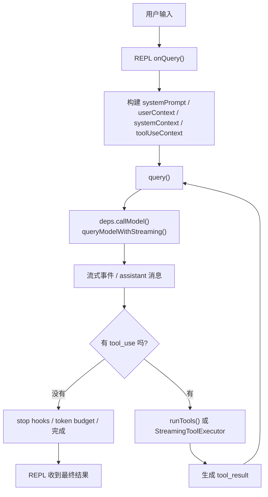

# Claude Code Source Analysis: Agent Runtime And `query()` Loop

## Overview

如果把 Claude Code 看成一个 agent 系统，那么真正的发动机不是某个 prompt，而是：

- `runAgent()`：负责组装一个 agent 的运行环境
- `query()`：负责驱动一整轮 agentic turn
- `queryModelWithStreaming()`：负责和底层模型流式 API 对接

一句话总结：

`AgentDefinition` 决定“这个 agent 是谁”，而 `runAgent() -> query()` 决定“这个 agent 怎么跑起来”。

## Core Idea

这套 runtime 不是简单的“发一次模型请求然后结束”，而是一个可循环的状态机：

1. 组装上下文
2. 请求模型
3. 流式接收模型响应
4. 如果出现 `tool_use`，执行工具
5. 把 `tool_result` 追加回消息历史
6. 再次请求模型
7. 直到这一回合真正结束

所以一次用户输入，对应的通常不是一次 API 调用，而是一个：

```text
模型响应 -> 工具执行 -> 再请求模型 -> 工具执行 -> ... -> 完成
```

的循环。

## Runtime Layers

从代码层看，这套 runtime 可以分成 3 层：

### 1. `runAgent()`

这层负责把一个 agent 真正“装配起来”：

- 组装初始消息
- 构建 agent 专属 `ToolUseContext`
- 决定工具池、permission mode、model、memory、MCP
- 最后调用 `query()`

也就是说，`runAgent()` 更像启动器。

### 2. `query()`

这层是核心主循环：

- 持有可变状态 `State`
- 在 `while (true)` 中推进一轮又一轮 agentic turn
- 决定什么时候继续、什么时候恢复、什么时候结束

这层是 Claude Code 最核心的 agent runtime。

### 3. `queryModelWithStreaming()`

这层是模型通信层：

- 调用底层流式 API
- 解析 `message_start`
- 解析 `content_block_delta`
- 组装 `assistant` 消息
- 识别 `tool_use`

所以：

- `runAgent()` 是 agent 启动器
- `query()` 是 turn 级状态机
- `queryModelWithStreaming()` 是模型 I/O 层

## Main Call Chain

最常见的主线程调用链大致是：

```text
REPL
  -> onQuery()
  -> buildEffectiveSystemPrompt()
  -> query(...)
  -> deps.callModel(...)
  -> queryModelWithStreaming(...)
  -> tool_use / tool_result loop
  -> REPL 消费流式事件
```

关键文件：

- `src/screens/REPL.tsx`
- `src/query.ts`
- `src/query/deps.ts`
- `src/services/api/claude.ts`

## Flow Diagram



## Why `query()` Is An Async Generator

`query()` 不是普通 async function，而是 async generator。

这是一个非常关键的设计，因为它不只是“最后返回答案”，而是会在执行过程中不断向外 `yield`：

- `stream_request_start`
- `stream_event`
- 完整 `assistant` 消息
- `attachment` / `progress`
- `tool_result`
- `tombstone`
- `tool_use_summary`

这样 REPL 才能一边消费事件，一边实时更新 UI，而不用等整个回合结束。

所以它非常适合 Claude Code 这种：

- 要展示流式文本
- 要展示 thinking
- 要展示工具执行进度
- 要处理中途回收或 fallback

的交互形态。

## State Design

`query()` 内部有一个 `State` 结构，负责保存跨迭代状态。

主要字段有：

- `messages`
  当前有效消息历史
- `toolUseContext`
  当前工具执行上下文
- `autoCompactTracking`
  自动 compact 的追踪状态
- `maxOutputTokensRecoveryCount`
  输出 token 超限后的恢复次数
- `hasAttemptedReactiveCompact`
  是否已经尝试过 reactive compact
- `maxOutputTokensOverride`
  当前轮是否临时提升过输出 token 上限
- `pendingToolUseSummary`
  上一轮工具摘要任务
- `stopHookActive`
  stop hooks 是否在阻塞后续继续
- `turnCount`
  当前这是这次 query 的第几轮
- `transition`
  上一次是因为什么继续下一轮

这个设计很重要，因为它不是通过递归来继续，而是通过：

```ts
state = next
continue
```

来推进状态机。

优点很明显：

- 状态更清晰
- 恢复路径更可控
- 不容易陷进递归堆栈

## Streaming Model Layer

`deps.callModel` 在生产环境下其实就是 `queryModelWithStreaming()`。

它会解析 Anthropic 风格的流式事件：

- `message_start`
- `content_block_start`
- `content_block_delta`
- `content_block_stop`

并在内部逐步累积：

- 文本 block
- thinking block
- `tool_use` block 的输入 JSON

最后生成完整 `assistant` 消息。

这一层和 `query()` 的边界很清楚：

- `queryModelWithStreaming()` 负责“把流还原成消息”
- `query()` 负责“收到消息后下一步怎么做”

## Tool Loop Design

`query()` 的核心分叉点是：

```text
这一轮 assistant 响应里有没有 tool_use
```

如果没有：

- 进入 stop hooks
- 检查 token budget
- 正常结束

如果有：

- 收集 `toolUseBlocks`
- 置 `needsFollowUp = true`
- 执行工具
- 把工具结果转成 `tool_result`
- 拼回消息历史
- 再次进入下一轮 `query`

这就是 Claude Code 的 agentic loop。

## Streaming Tool Execution

工具执行并不总是“等模型整条回复结束后再一起跑”。

这里还有一层 `StreamingToolExecutor`：

- 当流式响应中已经出现 `tool_use`
- 且条件允许
- 工具可以边接收边开始执行

这样可以降低等待时间，让工具和模型输出重叠。

如果没走 streaming 工具执行，就会在流结束后统一 `runTools(...)`。

所以运行时实际上有两种工具执行路径：

- `StreamingToolExecutor`
- `runTools`

## Recovery And Reliability Design

`query()` 很强的一点是：它不是“出错就报错结束”，而是有多条恢复路径。

### 1. Prompt Too Long Recovery

当响应被判定为 `prompt too long` 时，系统会先尝试：

- context collapse drain
- reactive compact

如果恢复成功，就重建 `state` 并继续下一轮。

### 2. Max Output Tokens Recovery

如果输出 token 打满：

- 先尝试放宽一次上限
- 再不行就自动插入一条 meta message，让模型“从中断处继续”

### 3. Abort Handling

如果用户中断：

- streaming tool executor 会补齐缺失的 `tool_result`
- 或者系统生成缺失 tool_result block
- 然后干净地结束这一轮

### 4. Streaming Fallback

如果流式请求中途 fallback：

- 旧的部分 assistant 消息会发 tombstone
- 旧的工具执行器结果会被丢弃
- 然后重新接上 fallback 响应

这就是为什么这套 runtime 比“简单 while 循环 + 工具调用”复杂得多。

## REPL Integration

REPL 和 `query()` 的边界也很清楚。

REPL 负责：

- 组装 `systemPrompt`
- 组装 `userContext`
- 创建 `toolUseContext`
- 调用 `query(...)`
- 消费 `query()` 产出的流式事件

`handleMessageFromStream()` 负责把这些事件翻译成 UI 状态更新：

- 流式文本增长
- thinking 展示
- tool use 可视化
- 完整消息落盘
- compact boundary 处理

所以从架构上看：

- `query()` 是 runtime
- `REPL` 是 runtime 的 UI 容器

## Relationship To Multi-Agent

多 agent 设计其实是建立在这套 runtime 之上的。

也就是说：

- 主代理跑 `runAgent() -> query()`
- 同步子代理跑 `runAgent() -> query()`
- 后台子代理跑 `runAgent() -> query()`
- fork 子代理跑 `runAgent() -> query()`

差异主要在：

- 上下文
- 生命周期
- 工具池
- 通信方式

而不是执行引擎不同。

这也是为什么说：如果不理解 `query()` 主循环，多 agent 和 plan/execute 都会显得悬空。

## Simplified Pseudocode

```ts
async function* query(params) {
  let state = initState(params)

  while (true) {
    const prepared = prepareMessagesAndContext(state)

    const assistantMessages = []
    const toolUseBlocks = []
    const toolResults = []

    for await (const msg of callModel(prepared)) {
      yield msg
      assistantMessages.pushIfAssistant(msg)
      toolUseBlocks.pushIfToolUse(msg)
    }

    if (aborted()) {
      yield interruptedResult()
      return
    }

    if (toolUseBlocks.length === 0) {
      if (needsRecovery()) {
        state = buildRecoveredState(...)
        continue
      }
      return
    }

    for await (const toolResult of runTools(toolUseBlocks)) {
      yield toolResult
      toolResults.push(toolResult)
    }

    state = {
      ...state,
      messages: [...prepared.messages, ...assistantMessages, ...toolResults],
    }
  }
}
```

这段伪代码虽然压缩了很多细节，但主线是准确的：

- 请求模型
- 收流
- 找工具
- 执行工具
- 拼回消息
- 下一轮继续

## Key Source Files

- `src/query.ts`
- `src/query/deps.ts`
- `src/query/config.ts`
- `src/services/api/claude.ts`
- `src/services/tools/StreamingToolExecutor.ts`
- `src/services/tools/toolOrchestration.ts`
- `src/tools/AgentTool/runAgent.ts`
- `src/screens/REPL.tsx`
- `src/utils/messages.ts`

## Conclusion

Claude Code 的 agent runtime 核心，不是“一个会调用工具的 prompt”，而是：

- `runAgent()` 负责装配 agent
- `query()` 负责驱动整轮 agentic turn
- `queryModelWithStreaming()` 负责处理底层流
- 工具执行、恢复逻辑、compact、hooks 都被嵌进同一个状态机里

从代码设计上看，`query()` 就是 Claude Code 的真正心脏。
