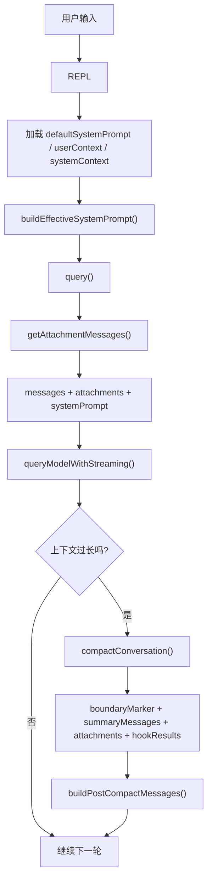

# Claude Code Source Analysis: Context System, Attachments And Compact

## Overview

Claude Code 的上下文系统，不是简单把“历史消息数组”原样丢给模型。

真正送到模型前的上下文，至少由 3 层共同组成：

1. `system prompt`
2. `attachments`
3. `compact` 之后重写过的对话上下文

一句话总结：

**Claude Code 不是只维护 message history，而是在维护一个会被动态组装、动态注入、动态压缩的上下文系统。**

## Core Idea

如果没有这套上下文系统，Claude Code 很快就会遇到 3 个问题：

- prompt 不够稳定，agent 身份和规则容易漂移
- 运行时状态太多，不能都靠自然语言消息去表达
- 长会话会越来越大，最终超过上下文限制

所以它把“上下文”拆成了三类职责：

- `system prompt` 负责定义 agent 的顶层身份和行为边界
- `attachments` 负责注入当前回合特有的运行时信息
- `compact` 负责在长会话里压缩历史，同时保留关键状态

## Main Call Chain

最常见的主线程链路大致是：

```text
REPL
  -> 加载 defaultSystemPrompt / userContext / systemContext
  -> buildEffectiveSystemPrompt()
  -> query()
  -> getAttachmentMessages()
  -> queryModelWithStreaming()
  -> auto compact / reactive compact
  -> buildPostCompactMessages()
  -> 下一轮继续
```

所以从代码层面看：

- REPL 负责准备主线程的静态上下文
- `query()` 负责在每轮里补动态 attachment
- `compact` 负责在过长时重写消息结构

## Flow Diagram



## Layer 1: `system prompt`

`system prompt` 这层定义的是“这个 agent 到底是谁、遵守什么顶层规则”。

`buildEffectiveSystemPrompt(...)` 的优先级大致是：

1. `overrideSystemPrompt`
2. coordinator prompt
3. agent prompt
4. custom system prompt
5. default system prompt

最后再把 `appendSystemPrompt` 拼到尾部。

这意味着 Claude Code 不是只有一个固定 prompt，而是会根据：

- 当前是否有主线程 agent definition
- 当前是不是 coordinator mode
- 当前是不是 proactive mode
- 用户有没有显式 override / append

去动态组装真正的 system prompt。

一个很关键的点是：

**主线程 agent definition 不是只决定工具，它也直接决定主线程 system prompt。**

所以 Claude Code 的 agent identity，有很大一部分是由这层建立的。

## Layer 2: `attachments`

`attachments` 这层负责注入“这一轮才知道”的动态上下文。

这也是 Claude Code 和普通聊天系统差别很大的地方，因为很多运行时信息并不适合直接写进普通 user message 里。

### `query()` 是在每轮里动态收集 attachment

在 `src/query.ts` 里，每次真正请求模型前，都会调用：

```ts
getAttachmentMessages(...)
```

然后把拿到的 attachment message `yield` 出去，并且推入当前轮的 `toolResults`。

这一步非常关键，因为它说明：

- attachment 不只是 UI 辅助信息
- 它会真正进入下一次模型请求的上下文

也就是说，attachment 是 Claude Code 的正式上下文载体之一。

### `attachments` 不是只有一种

`src/utils/attachments.ts` 里会组装很多不同类型的 attachment。最关键的几类有：

#### 1. `queued_command`

把排队中的 prompt 或 task-notification 注入到当前回合里。

这层的作用是：

- 让模型能在同一轮里看到新来的提示
- 让后台任务完成通知能回到主线程上下文

#### 2. `nested_memory`

把 `CLAUDE.md`、rules、memory 文件转成 attachment 注入。

这层不是简单“读一次文件就完了”，它还会做：

- 路径遍历
- 规则匹配
- 去重
- `readFileState` 缓存
- `loadedNestedMemoryPaths` 防重复注入

所以 Claude Code 的 memory / rules 系统，本质上也是 attachment 驱动的。

#### 3. `plan_mode` / `plan_mode_exit`

plan mode 并不是靠另一个 runtime 实现的，而是通过 mode 状态加 attachment 持续提醒模型：

- 现在正在 plan mode
- 刚刚退出了 plan mode
- 当前是否已有 plan 文件

这也是为什么 plan/execute 可以和同一个 `query()` runtime 共存。

#### 4. `teammate_mailbox` / `agent_pending_messages`

多 agent 协作时，消息不是直接塞进主消息流，而是先进入 mailbox 或 pending queue，再转成 attachment 给对应 agent。

所以很多 agent 间通信，本质上也是 attachment 注入。

#### 5. `critical_system_reminder`

这是一个比普通 prompt 更轻、更动态的补充提醒层。

它适合放“这一轮绝对不能忘”的规则，而不是把所有东西都写死在 system prompt 里。

### 为什么要单独设计 attachment 层

因为很多上下文有这些特点：

- 它是运行时产生的，不是会话开始时就固定的
- 它可能只对某一轮有效
- 它需要结构化表达，而不是自然语言
- 它可能在 compact 后还需要被重建

所以 Claude Code 没有把所有东西都塞进 user / assistant message，而是单独做了一层 attachment 机制。

## Layer 3: `compact`

`compact` 负责解决长会话上下文膨胀的问题。

但它不是简单“总结一下旧消息”，而是一次有结构的上下文重写。

### `compact` 的结果不是一段摘要，而是一组重写后的消息

`CompactionResult` 里最关键的字段有：

- `boundaryMarker`
- `summaryMessages`
- `attachments`
- `hookResults`
- 可选 `messagesToKeep`

`buildPostCompactMessages(...)` 会把它们按固定顺序重新拼起来：

```text
boundaryMarker
-> summaryMessages
-> messagesToKeep
-> attachments
-> hookResults
```

所以 compact 之后，当前会话上下文其实已经不是“原历史消息”，而是“压缩后的新上下文”。

### compact 真正保留的不是所有历史，而是“关键状态”

这层设计里最重要的一点是：

**Claude Code 不试图保留所有旧消息，而是优先保留继续工作所需的关键状态。**

比如 compact 后会专门保留或重建这些东西：

- plan 文件引用
- invoked skills
- 当前仍处在 plan mode 这件事
- 异步 agent 信息
- 必要的文件引用
- hook 结果

这也是为什么 compact 之后系统还能继续工作，而不是“总结完就失忆”。

### compact 边界本身也是一种状态标记

compact 不是悄悄改消息数组，而是显式插入一个 `boundaryMarker`。

这有两个重要作用：

- 告诉系统和 UI：这里发生过一次上下文重写
- 为后续 scrollback、resume、partial compact、relink 提供锚点

所以 compact boundary 不是装饰，而是上下文结构的一部分。

## Code-Level Design

从代码层面，这套上下文系统可以拆成 5 步。

### 1. REPL 先准备静态上下文

在 `src/screens/REPL.tsx` 里，主线程在发起 `query()` 前会先加载：

- `defaultSystemPrompt`
- `userContext`
- `systemContext`

然后调用 `buildEffectiveSystemPrompt(...)`，并把结果放到：

```ts
toolUseContext.renderedSystemPrompt = systemPrompt
```

所以 system prompt 是在进入 query 之前就准备好的。

### 2. `query()` 每轮再补动态 attachment

在 `src/query.ts` 里，请求模型前会调用 `getAttachmentMessages(...)`。

这些 attachment 会被：

- `yield` 给 UI
- 追加到当前轮上下文里

所以 attachment 不是额外日志，而是 active context 的一部分。

### 3. attachment 里最重的一类是 memory / rules 注入

`nested_memory` 相关逻辑会：

- 找到相关 `CLAUDE.md` / rules / memory 文件
- 转成 attachment
- 写入 `readFileState`
- 通过 `loadedNestedMemoryPaths` 去重

这意味着 Claude Code 的“项目规则注入”不是靠一段大 prompt 写死的，而是运行时按路径和状态动态注入的。

### 4. compact 触发后，会生成一套新的 post-compact 消息

compact 发生后，系统不会继续沿用旧的 messages array，而是创建：

- compact boundary
- summary messages
- compact 后要保留的 attachments
- hook 结果

然后通过 `buildPostCompactMessages(...)` 生成新的上下文数组。

接着 `query()` 会继续使用这组 post-compact messages 进入后续回合。

### 5. compact 会专门补保留型 attachment

compact 逻辑里有一批 “createXAttachmentIfNeeded(...)” 形式的辅助函数，用来确保以下状态不丢：

- plan
- skills
- plan mode
- async agents

这一步很关键，因为很多运行时状态原本是靠 attachment 注入的，如果 compact 只做摘要而不重建 attachment，这些状态就会丢失。

## Simplified Pseudocode

下面这段伪代码可以抓住主线：

```ts
async function replTurn() {
  const defaultSystemPrompt = await getSystemPrompt(...)
  const userContext = await getUserContext()
  const systemContext = await getSystemContext()

  const systemPrompt = buildEffectiveSystemPrompt({
    mainThreadAgentDefinition,
    toolUseContext,
    defaultSystemPrompt,
    customSystemPrompt,
    appendSystemPrompt,
  })

  toolUseContext.renderedSystemPrompt = systemPrompt

  for await (const event of query({
    messages,
    systemPrompt,
    userContext,
    systemContext,
    toolUseContext,
  })) {
    render(event)
  }
}

async function* query(state) {
  const attachments = await getAttachmentMessages(...)
  for (const att of attachments) {
    yield att
    state.messages.push(att)
  }

  const response = await callModel({
    systemPrompt: state.systemPrompt,
    messages: state.messages,
  })

  if (shouldCompact(response, state)) {
    const compacted = await compactConversation(state.messages, ...)
    state.messages = buildPostCompactMessages(compacted)
  }
}
```

## Why This Design Matters

这套设计的价值主要有 4 个：

1. prompt identity 稳定
   主线程 agent 的身份、规则和模式不会轻易漂移。
2. 运行时状态可结构化注入
   计划、技能、memory、队列消息、teammate mailbox 都能按类型进入上下文。
3. 长会话可持续
   compact 让会话不会无限膨胀。
4. compact 后不至于失忆
   关键状态会以 attachment 或 boundary 的形式被保留下来。

所以 Claude Code 的“上下文能力”并不只是模型上下文窗口大，而是它在应用层主动管理上下文。

## Key Source Files

如果你要顺着源码读，建议按这个顺序：

1. `src/utils/systemPrompt.ts`
   看 system prompt 怎么被组装。
2. `src/screens/REPL.tsx`
   看主线程什么时候准备 `systemPrompt / userContext / systemContext`。
3. `src/utils/attachments.ts`
   看 attachment 是怎么按类型生成的。
4. `src/query.ts`
   看 attachment 怎么在每轮里被注入。
5. `src/services/compact/compact.ts`
   看 compact 怎么把长会话重写成新的上下文。
6. `src/utils/plans.ts`
   看 plan 文件如何和 compact / resume 协同。

## One-Sentence Summary

Claude Code 的上下文系统本质上不是“历史消息列表”，而是：

**system prompt 定义身份，attachments 注入动态状态，compact 在长会话里重写并保留关键上下文，这三层一起维持 agent 的持续工作能力。**
