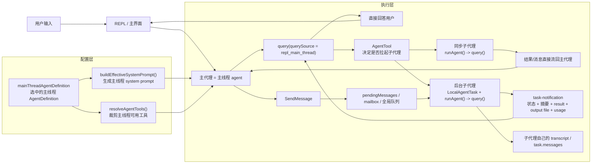
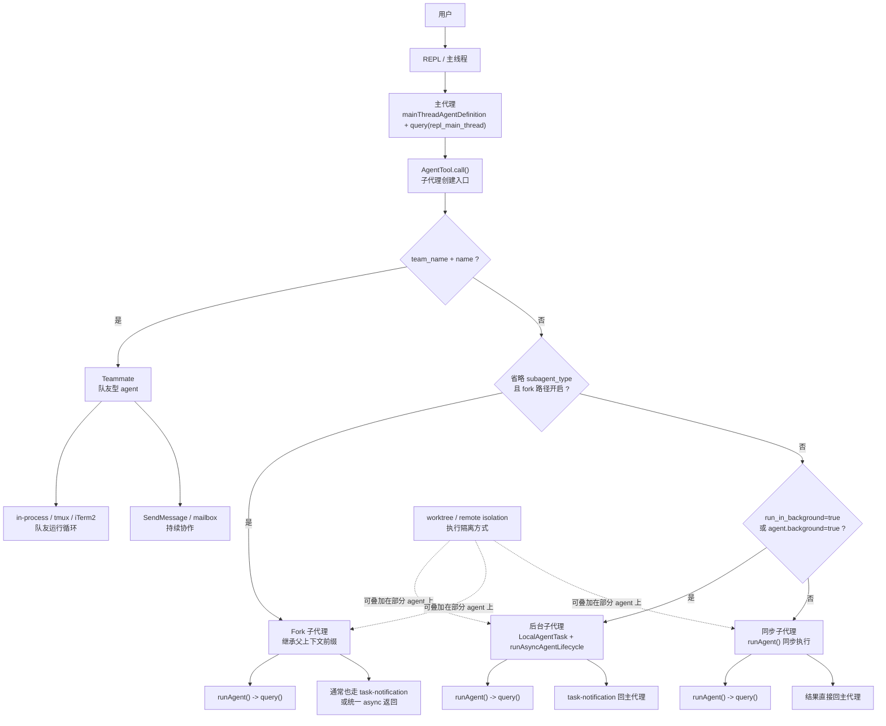

# Claude Code Source Analysis: Master / Sub-Agent Design

## Overview

在这个项目里，所谓 master / sub-agent，并不是“一个完全不同的总控框架 + 一套完全不同的 worker 框架”。

更准确地说，它的设计是：

- 当前主代理负责拆任务、选择子代理类型、收集结果、继续调度
- 子代理负责在一个隔离上下文里独立执行一段任务
- 主代理和子代理底层都复用同一套执行引擎：`runAgent() -> query()`

也就是说，这是一种“同一个 agent runtime 被反复嵌套调用”的设计，而不是两套不同系统拼在一起。

## Core Idea

这套设计可以压缩成一句话：

`AgentTool` 负责“决定怎么生 agent”，`createSubagentContext()` 负责“决定怎么隔离 agent”，`runAgent()` 负责“真正跑 agent”，`SendMessage` 和 task system 负责“让 agent 之间继续协作”。

对应的关键文件：

- `src/tools/AgentTool/AgentTool.tsx`
- `src/tools/AgentTool/runAgent.ts`
- `src/utils/forkedAgent.ts`
- `src/tasks/LocalAgentTask/LocalAgentTask.tsx`
- `src/tools/SendMessageTool/SendMessageTool.ts`
- `src/utils/swarm/inProcessRunner.ts`

## Why Subagents Exist

设计子代理，不是为了“看起来像多智能体”，而是为了把大任务拆成更容易管理的小工作单元。

简要来说，它主要解决 4 个问题：

- 避免主代理把所有分析、读写、执行过程都堆在一个上下文里，导致上下文越来越乱
- 让主代理更像调度者，负责拆任务、看结果、决定下一步，而不是亲自做每一件小事
- 让耗时任务可以并行推进，不必全部堵在主线程里串行执行
- 让不同子任务拥有不同的工具、权限、提示词、模型或隔离环境

一句话总结：

子代理的真正目的，是把“大任务”拆成“可隔离、可并行、可约束、可回收”的小任务单元。

## Common Agent Fields

`BaseAgentDefinition` 里字段不少，但最常用的通常是下面这些：

| 字段 | 最常见用途 |
|------|------------|
| `agentType` | agent 的名字和唯一标识，用来选择主代理或 spawn 子代理 |
| `whenToUse` | 描述这个 agent 适合什么场景 |
| `tools` | 指定这个 agent 能使用哪些工具 |
| `disallowedTools` | 指定这个 agent 不能使用哪些工具 |
| `model` | 给这个 agent 指定默认模型 |
| `permissionMode` | 指定这个 agent 的权限模式 |
| `initialPrompt` | 在第一次真正执行前，先插入一段固定提示 |
| `memory` | 是否启用持久记忆，以及记忆作用域 |
| `maxTurns` | 限制 agent 最多运行多少轮 |
| `background` | 指定这个 agent 默认按后台任务方式运行 |
| `isolation` | 指定是否在 `worktree` 或 `remote` 隔离环境中运行 |
| `skills` | 启动时预加载哪些 skills |

如果只记最核心的一小撮，可以先抓这 6 个：

- `agentType`
- `whenToUse`
- `tools`
- `model`
- `permissionMode`
- `initialPrompt`

## Simplified Code Extraction

如果只想先抓住这套设计的骨架，可以先看下面这 4 段“从源码抽出来再简化”的代码。

注意：

- 这不是逐行拷贝原仓库代码
- 这是把关键逻辑压缩成最容易理解的版本
- 可以把它当作“阅读正式源码前的地图”

### 1. AgentTool 负责决定走哪条 spawn 路径

```ts
async function agentToolCall(input, parentContext) {
  const teamName = resolveTeamName(input, parentContext)

  if (teamName && input.name) {
    return spawnTeammate(input, parentContext)
  }

  const selectedAgent = resolveAgentDefinition(input.subagent_type)
  const shouldRunAsync =
    input.run_in_background === true || selectedAgent.background === true

  const runAgentParams = {
    agentDefinition: selectedAgent,
    promptMessages: buildPromptMessages(input),
    toolUseContext: parentContext,
    isAsync: shouldRunAsync,
    availableTools: buildWorkerTools(parentContext, selectedAgent),
  }

  if (shouldRunAsync) {
    const task = registerAsyncAgent(...)
    void runAsyncAgentLifecycle({
      taskId: task.agentId,
      makeStream: () => runAgent(runAgentParams),
    })
    return { status: "async_launched", agentId: task.agentId }
  }

  return await runAgent(runAgentParams)
}
```

这段代码表达的核心意思是：

- 主代理不直接“实现子代理逻辑”
- 主代理只是先判断要创建哪一种 agent
- 真正执行时，最后还是统一掉到 `runAgent()`

### 2. createSubagentContext 负责把父上下文变成子上下文

```ts
function createSubagentContext(parentContext, overrides = {}) {
  return {
    options: overrides.options ?? parentContext.options,
    messages: overrides.messages ?? parentContext.messages,
    agentId: overrides.agentId ?? createAgentId(),

    abortController:
      overrides.abortController ??
      createChildAbortController(parentContext.abortController),

    readFileState: clone(parentContext.readFileState),
    contentReplacementState: clone(parentContext.contentReplacementState),

    getAppState: overrides.getAppState ?? parentContext.getAppState,
    setAppState: overrides.shareSetAppState ? parentContext.setAppState : () => {},
    setAppStateForTasks:
      parentContext.setAppStateForTasks ?? parentContext.setAppState,

    setResponseLength: overrides.shareSetResponseLength
      ? parentContext.setResponseLength
      : () => {},

    queryTracking: {
      chainId: randomUUID(),
      depth: (parentContext.queryTracking?.depth ?? -1) + 1,
    },
  }
}
```

这段代码表达的核心意思是：

- 子代理不是直接拿父代理原始上下文来跑
- 系统会先复制一个“隔离后的运行盒子”
- 哪些能力共享、哪些能力禁掉，都是显式决定的

### 3. runAgent 的本质是“搭子环境，然后跑 query()”

```ts
async function* runAgent(params) {
  const initialMessages = [
    ...(params.forkContextMessages ?? []),
    ...params.promptMessages,
  ]

  const agentToolUseContext = createSubagentContext(params.toolUseContext, {
    agentId: createAgentId(),
    messages: initialMessages,
    options: buildAgentOptions(params),
    shareSetAppState: !params.isAsync,
    shareSetResponseLength: true,
  })

  for await (const message of query({
    messages: initialMessages,
    systemPrompt: buildAgentSystemPrompt(params),
    userContext: getUserContext(),
    systemContext: getSystemContext(),
    toolUseContext: agentToolUseContext,
    canUseTool: params.canUseTool,
    querySource: params.querySource,
  })) {
    yield message
  }
}
```

这段代码表达的核心意思是：

- `runAgent()` 不是另一套智能体框架
- 它做的事情主要是：
  1. 组装 agent 的初始消息
  2. 创建 agent 自己的上下文
  3. 调用统一的 `query()` 执行循环

### 4. SendMessage 负责让后台 agent 可以被继续驱动

```ts
async function sendMessage(input, context) {
  const appState = context.getAppState()
  const agentId = appState.agentNameRegistry.get(input.to) ?? input.to
  const task = appState.tasks[agentId]

  if (!task) {
    return tryResumeAgentFromDisk(agentId, input.message)
  }

  if (task.status === "running") {
    queuePendingMessage(agentId, input.message)
    return { success: true, message: "queued" }
  }

  return resumeStoppedAgent(agentId, input.message)
}
```

这段代码表达的核心意思是：

- 后台子代理不是一次 spawn 完就彻底失联
- 主代理后面还可以继续给它发消息
- 这让子代理变成“可持续协作的 worker”，而不是一次性函数调用

### 用一句最短的话理解这 4 段代码

```text
AgentTool 决定怎么生
createSubagentContext 决定怎么隔离
runAgent 决定怎么跑
SendMessage 决定怎么继续协作
```

## Who Is The Master

这里的 master 不是一个单独类名，而是“当前掌控任务推进权的 agent”。

常见情况：

- 在主 REPL 中，当前主线程 agent 就是 master
- 在 team 模式下，leader 或 coordinator 是 master
- 某个子代理内部如果再拉起新的子代理，它自己又成为上层 master

所以这是一个递归的父子结构，不是固定的一层主控。

## Main Agent Relationship Diagram

下面这张图专门补充“主代理不是一个单独类，而是主线程 agent”这件事。



可以把这张图压缩成三句话：

- 主代理不是单独的 `MasterAgent` 类，而是 `mainThreadAgentDefinition` 塑形后的主线程 agent
- 同步子代理像函数调用，结果会直接流回主代理
- 后台子代理像独立 task，默认通过 `task-notification` 把结构化结果回给主代理

对应源码位置：

- `src/main.tsx:2060`
- `src/screens/REPL.tsx:814`
- `src/screens/REPL.tsx:2780`
- `src/query.ts:1567`
- `src/tasks/LocalMainSessionTask.ts:54`

## Where The Subagents Sit

如果前一张图解决的是“主代理是什么”，那下面这张图解决的是“几类子代理都挂在系统的哪里”。



这张图里最关键的点是：

- 这几类子代理并不是散落在不同系统里，而是都先经过 `AgentTool.call()` 这个统一入口
- 同步子代理、后台子代理、fork 子代理底层都还是落到 `runAgent() -> query()` 这条执行骨架上
- teammate 更像“长期协作成员”，所以它和普通 sub-agent 的区别主要在生命周期和通信机制
- `worktree` / `remote` 更像执行隔离方式，可以叠加在部分 agent 上，但它们不是独立的协作类别

对应源码位置：

- `src/tools/AgentTool/AgentTool.tsx:282`
- `src/tools/AgentTool/AgentTool.tsx:318`
- `src/tools/AgentTool/AgentTool.tsx:567`
- `src/tools/AgentTool/AgentTool.tsx:686`
- `src/tools/AgentTool/AgentTool.tsx:765`

## Spawn Entry

所有“创建 agent”的动作，核心都从 `AgentTool.call()` 开始。

入口文件：

- `src/tools/AgentTool/AgentTool.tsx`

它会根据输入参数，把创建请求分成四条主要路径：

1. `team_name + name`
   创建 teammate，走 `spawnTeammate()`
2. `run_in_background=true`
   创建后台子代理，注册为 task
3. 省略 `subagent_type` 且 fork 模式开启
   创建 fork sub-agent
4. 其他情况
   创建普通同步 sub-agent

这就是这套设计最重要的第一层：它不是只有一种 sub-agent，而是至少有同步、后台、fork、teammate 这几种变体。

参考：

- `src/tools/AgentTool/AgentTool.tsx:282`
- `src/tools/AgentTool/AgentTool.tsx:318`
- `src/tools/AgentTool/AgentTool.tsx:686`

## Shared Runtime

虽然 spawn 路径不同，但真正执行时，大部分 agent 最后都会进入 `runAgent()`。

入口：

- `src/tools/AgentTool/runAgent.ts:248`

而 `runAgent()` 内部最终又会调用 `query()` 驱动完整的 agentic turn。

因此：

- 主代理跑的是 `query()`
- 同步子代理跑的是 `query()`
- 后台子代理跑的是 `query()`
- in-process teammate 跑的也还是 `runAgent() -> query()`

这一点非常关键。它说明 Claude Code 的 master/sub-agent 设计不是“主代理特殊、子代理另写一套”，而是：

- 执行引擎统一
- 生命周期和上下文策略不同

参考：

- `src/tools/AgentTool/runAgent.ts:747`
- `src/utils/swarm/inProcessRunner.ts:1169`

## Context Isolation

这套设计里最核心的抽象之一是 `createSubagentContext()`。

文件：

- `src/utils/forkedAgent.ts:345`

它的职责不是执行 agent，而是为子代理构造一个新的 `ToolUseContext`，把“父代理的环境”转换成“子代理自己的运行盒子”。

它做的事情包括：

- 默认给子代理分配新的 `agentId`
- 默认创建新的子级 `AbortController`
- 默认让子代理不能直接控制父 UI
- 默认把 `setAppState` 变成 no-op，避免任意修改主线程状态
- 克隆读文件状态和内容替换状态，减少上下文污染
- 继承并增加 query depth，形成父子层级

关键逻辑：

- `abortController` 默认是子 controller，而不是硬复用父 controller
- `setAppState` 默认不共享
- `setResponseLength` 可以按需共享，用于统计与显示
- `setAppStateForTasks` 单独保留到根 store，保证后台任务仍能登记和清理

这说明它的隔离不是“开一个新进程就算了”，而是显式地把哪些能力共享、哪些能力隔离做成了上下文策略。

## Sync Sub-Agent

同步子代理的模型可以理解为：

“主代理先停一下，把一段具体工作交给 worker，等 worker 跑完，再继续主线程。”

特点：

- 生命周期短
- 主代理等待结果
- 不依赖独立消息通道
- 更像一次函数式调用

虽然同步子代理也有自己的 `agentId` 和子上下文，但它通常是当前 turn 的一部分。

从设计上说，这种形式适合：

- 快速探索
- 一次性分析
- 小规模任务拆分

参考：

- `src/tools/AgentTool/AgentTool.tsx:765`
- `src/tools/AgentTool/runAgent.ts:697`

## Async Background Sub-Agent

后台子代理的模型可以理解为：

“主代理把 worker 发出去，让它自己跑，主线程不必阻塞等待。”

这类 agent 在启动时会先注册成一个本地任务：

- `registerAsyncAgent()`

参考：

- `src/tasks/LocalAgentTask/LocalAgentTask.tsx:466`

注册时会创建：

- 独立 task state
- 独立 abort controller
- 输出文件链接
- 后台运行标记

然后由 `AgentTool` 异步启动真正的执行生命周期：

- `runAsyncAgentLifecycle(...)`

参考：

- `src/tools/AgentTool/AgentTool.tsx:686`
- `src/tools/AgentTool/AgentTool.tsx:733`

这条设计说明主代理在后台场景里更像一个调度器：

- 它创建 worker
- 把 worker 挂到 task system
- 记录 agentId
- 后续通过通知或 `SendMessage` 继续协调

## Name Registry And Continuing Agents

后台 agent 被创建后，如果提供了 `name`，系统会把 `name -> agentId` 记录到 `agentNameRegistry` 里。

参考：

- `src/tools/AgentTool/AgentTool.tsx:700`
- `src/state/AppStateStore.ts:162`

这个设计非常重要，因为它解决了一个核心问题：

“子代理不是只能 spawn 一次然后结束，它可以被继续驱动。”

后续如果主代理要继续给某个后台 agent 下任务，就可以通过 `SendMessage` 按名字或 `agentId` 找到它。

## SendMessage As The Coordination Bus

`SendMessage` 是这套 master/sub-agent 设计里的关键通信机制之一。

文件：

- `src/tools/SendMessageTool/SendMessageTool.ts`

当消息发给后台 agent 时，系统会：

- 先通过 `agentNameRegistry` 或原始 `agentId` 定位目标
- 如果目标 task 正在运行，就把消息排进 pending queue
- 等它下一个 tool round 再处理
- 如果它已经停止，则尝试自动 resume

参考：

- `src/tools/SendMessageTool/SendMessageTool.ts:800`

这意味着：

- 子代理不是一次性黑盒
- 它们可以是可继续的长期 worker
- 主代理和 worker 之间是松耦合消息驱动，而不是强耦合同步调用

## Teammate Design

teammate 和普通 sub-agent 的区别，不在于它们的大脑不同，而在于生命周期和协作方式不同。

teammate 更像常驻协作者：

- 有 team 身份
- 可以长期存在
- 可以和 leader 或其他 teammate 通信
- 更适合并行协作

在 in-process teammate 模式下，它最终仍然调用普通 `runAgent()`：

- `src/utils/swarm/inProcessRunner.ts:1175`

但它会运行在 teammate 的专属上下文里：

- 有 teammate identity
- 有当前工作 abort controller
- 可以保留自己的对话上下文
- 可以显示权限提示，因为它和 leader 共用终端环境

这说明 teammate 的本质不是另一种执行器，而是：

- 同一个 agent runtime
- 加上 team 级别的身份、生命周期和通信约束

## Fork Sub-Agent

fork sub-agent 是这套设计里一个更特殊的变种。

它的目标不是简单隔离，而是尽可能继承父代理的上下文和 prompt cache。

在 fork 路径里：

- 子代理尽量复用父代理的 system prompt
- prompt messages 通过 `buildForkedMessages()` 构造
- 工具池尽量保持和父代理一致

参考：

- `src/tools/AgentTool/AgentTool.tsx:483`
- `src/tools/AgentTool/AgentTool.tsx:512`

这里的 fork 不是 Linux 那种进程级 `fork()`。

更准确地说，它复制的是 agent 的请求上下文前缀，而不是操作系统进程状态。也就是：

- 父代理当前的消息历史
- 父代理已经渲染好的 system prompt
- 父代理当前那份工具定义
- 再追加一小段新的子任务 directive

所以 Claude Code 这里的 fork，本质上是“从父代理当前轨迹里分叉出一个 worker”，目的是复用上下文和 prompt cache，而不是复制运行中的进程。

它这样设计的目的，是让 fork 子代理和父代理之间尽量共享缓存前缀，从而降低 token 成本并提升响应效率。

所以 fork 的取向和普通 sub-agent 不一样：

- 普通 sub-agent 更强调角色化和任务隔离
- fork sub-agent 更强调上下文继承和缓存命中

### Why `model` Is Ignored In Fork Path

fork 路径里会显式忽略调用参数里的 `model`。

原因不是作者忘了支持，而是 fork 的核心目标就是：

- 尽量复用父代理已经命中的 prompt cache
- 让子代理和父代理共享尽可能长的请求前缀

如果 fork child 改成另一种模型：

- 请求前缀就不再和父代理兼容
- cache 共享价值会立刻下降
- fork 这条路径最重要的性能收益就没了

所以在 `AgentTool.tsx` 里，fork 路径传给 `runAgent()` 的其实是：

- `model: undefined`
- `useExactTools: true`
- `override.systemPrompt = forkParentSystemPrompt`

也就是说，fork child 会尽量继承父代理的模型、system prompt 和工具定义，而不是重新自由选择。

参考：

- `src/tools/AgentTool/AgentTool.tsx:418`
- `src/tools/AgentTool/AgentTool.tsx:610`
- `src/tools/AgentTool/prompt.ts:89`

### What `permissionMode: bubble` Means

fork 的 synthetic agent definition 里，把权限模式设成了 `bubble`。

这里的含义不是“权限更宽”，而是：

- 子代理自己的权限提示不要静默吞掉
- 如果需要确认，提示要冒泡到父终端
- 即使 fork child 是 async/background 形态，也仍然允许把权限交互显示给主线程用户

在 `runAgent.ts` 里，这个模式会影响 `shouldAvoidPermissionPrompts` 的判断：

- 普通 async agent 默认倾向避免权限弹窗
- `bubble` 模式会显式关闭这种避免逻辑

所以 `bubble` 的本质更接近：

**权限交互向上冒泡到父级终端，而不是让 fork child 自己静默决定。**

参考：

- `src/tools/AgentTool/forkSubagent.ts:48`
- `src/tools/AgentTool/runAgent.ts:438`

### Why Placeholder `tool_result` Matters

`buildForkedMessages()` 最巧的一步，是给父代理最后一条 assistant message 里的每个 `tool_use` 都配一个 placeholder `tool_result`。

而且这些 placeholder 的内容是固定文本：

```text
Fork started — processing in background
```

它这么做有两个目的。

第一个目的，是让所有 fork child 的请求前缀尽量字节级一致。

如果每个 child 都把真实工具结果塞进去：

- 前缀会立刻分叉
- prompt cache 很难共享

而统一 placeholder 后，多个 fork child 共享的是：

- 同一份父历史
- 同一条 assistant message
- 同一组 `tool_result` 占位块

只有最后追加的 directive text 不同。

第二个目的，是让消息结构对 API 来说保持合法。

因为父 assistant message 里已经包含了 `tool_use`，那么子请求前缀里最好也补出对应的 `tool_result`，否则会更容易落入不完整的 tool-use 轨迹。

所以这些 placeholder 不是为了表达真实结果，而是为了：

- 保持配对结构稳定
- 最大化 cache 共享
- 给每个 fork child 建出统一的上下文前缀模板

参考：

- `src/tools/AgentTool/forkSubagent.ts:91`
- `src/tools/AgentTool/forkSubagent.ts:98`
- `src/tools/AgentTool/forkSubagent.ts:141`

## Responsibility Split

把职责压缩成最简单的分工，可以这样记：

主代理负责：

- 判断是否拆任务
- 选择 agent 类型
- 决定同步还是后台
- 决定是否 team/fork/worktree 隔离
- 收集子代理结果
- 继续主线决策

子代理负责：

- 在自己的上下文中独立执行
- 调工具、读写文件、总结结果
- 在需要时通过消息机制与主代理继续协作

这其实是一个很经典的 planner/coordinator + worker 结构，只不过两边都复用了统一的 Claude Code agent runtime。

## Why This Design Works

这套设计的优点主要有四个：

1. 统一引擎
   主代理和子代理都用 `runAgent() -> query()`，减少实现分裂

2. 上下文可控
   通过 `createSubagentContext()` 明确哪些能力共享，哪些隔离

3. 生命周期灵活
   同步、后台、fork、teammate 都能共存

4. 协作可持续
   通过 task system 和 `SendMessage`，子代理可以被追踪、继续和恢复

## Simplified Mental Model

如果要用最简化的脑图理解这套结构，可以记成：

```text
Master Agent
  ├─ 自己直接执行
  ├─ Spawn Sync Sub-Agent
  │    └─ 跑完立即把结果交回
  ├─ Spawn Async Sub-Agent
  │    └─ 注册成 task，后台继续执行
  ├─ Spawn Fork Sub-Agent
  │    └─ 尽量继承父上下文和缓存前缀
  └─ Spawn Teammate
       └─ 成为长期协作者，通过 SendMessage 协同
```

底层统一结构则是：

```text
AgentTool
  -> choose spawn path
  -> createSubagentContext
  -> runAgent
  -> query
  -> task/message coordination
```

## Conclusion

Claude Code 的 master/sub-agent 设计，本质上不是“一个大脑指挥多个傀儡”，也不是“多套框架并存”。

它更像是：

- 一个统一的 agent runtime
- 一套显式的上下文隔离机制
- 一层灵活的 spawn 策略
- 一套可追踪、可恢复、可继续的消息与任务系统

因此，所谓 master/sub-agent，在这个项目里更准确的理解应该是：

“父代理通过 `AgentTool` 生成不同形态的子代理；子代理通过隔离后的上下文运行同一套引擎；再通过 task 和消息系统形成持续协作。”
