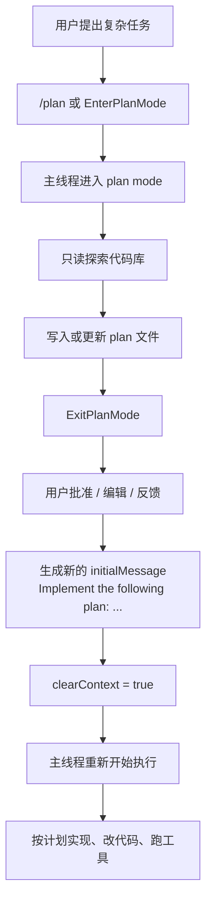

# Claude Code Source Analysis: Plan And Execute

## Overview

这个项目里确实有很明确的 “plan and execute” 工作流，但它不是一个单独叫 `PlanAndExecute` 的类或模块。

更准确地说，它是由下面几块一起组成的：

- `EnterPlanMode` 或 `/plan`：把当前主会话切到先规划、后编码的模式
- `Plan` built-in agent：只读的规划型子代理
- `utils/plans.ts`：负责 plan 文件的路径、存储、恢复
- `ExitPlanMode`：提交/确认计划，并把计划重新喂给主线程开始执行

一句话总结：

这个项目里的 plan and execute，本质上是“先进入 plan mode 产出计划，再把计划作为新的初始任务交回主线程执行”。

## Core Idea

这套机制不是：

- 一个 planner agent 永久负责规划
- 一个 executor agent 永久负责执行

而更像是：

1. 主线程先切到 plan mode
2. 在只读约束下探索代码并写出计划
3. 计划被确认后，系统生成一条新的初始消息：
   `Implement the following plan: ...`
4. 主线程用这条新消息重新开始执行

所以它更像“模式切换 + 任务重启”，而不是“两个完全独立的长期 agent 接力”。

## Main Building Blocks

### 1. EnterPlanMode

`EnterPlanMode` 负责把当前主会话切到 `plan` 模式。

特点：

- 只能在主线程使用，agent context 里不能调用
- 会更新当前 permission mode 为 `plan`
- 返回明确的 planning instructions，要求先探索和设计方案，不要写代码

参考：

- `src/tools/EnterPlanModeTool/EnterPlanModeTool.ts`
- `src/commands/plan/plan.tsx`

### 2. Plan Agent

项目里还有一个专门的 `Plan` built-in agent。

它的作用不是直接实现代码，而是：

- 只读探索代码库
- 设计实现方案
- 输出 step-by-step plan
- 列出关键文件

这个 agent 明确禁用了写文件相关工具，也禁用了 `Agent` 和 `ExitPlanMode`。

参考：

- `src/tools/AgentTool/built-in/planAgent.ts`

### 3. Plan File

计划不是只存在内存里，而是会落到 plan 文件。

`src/utils/plans.ts` 负责：

- 生成 plan slug
- 决定 plan 文件路径
- 读取 plan 内容
- resume 时恢复 plan 文件

主会话和子代理都可以有自己的 plan 文件。

参考：

- `src/utils/plans.ts`

### 4. ExitPlanMode

`ExitPlanMode` 是从 “只规划” 切回 “开始执行” 的关键点。

它会：

- 读取当前 plan 文件
- 处理用户批准或反馈
- 把计划包装成一条新的初始消息
- 清掉旧上下文
- 让主线程以新的执行任务重新开始

最关键的那条消息形态大致是：

```text
Implement the following plan:

<plan content>
```

参考：

- `src/tools/ExitPlanModeTool/ExitPlanModeV2Tool.ts`
- `src/components/permissions/ExitPlanModePermissionRequest/ExitPlanModePermissionRequest.tsx`

## Flow Diagram



## Code-Level Design

如果从代码层面看，这套 plan and execute 不是一个单独类，而是几段明确的数据流拼起来的。

### 1. EnterPlanMode 先改主线程状态

进入 plan mode 时，并不会切到另一个 planner runtime。

代码真正做的事情是：

- 调 `handlePlanModeTransition(fromMode, 'plan')`
- 再把 `toolPermissionContext.mode` 改成 `plan`

也就是说，plan mode 本质上是主线程 permission context 的一种状态，而不是新的执行器。

参考：

- `src/tools/EnterPlanModeTool/EnterPlanModeTool.ts`
- `src/utils/permissions/permissionSetup.ts`
- `src/bootstrap/state.ts`

### 2. query 仍然是原来的 query，只是多了 plan attachments

主线程进入 plan mode 后，并不会换掉 `query()`。

真正的做法是：

- 继续跑原来的主线程 query loop
- 但在 attachment 注入阶段增加 `plan_mode`、`plan_mode_reentry`、`plan_mode_exit`

这样模型每轮都能知道：

- 当前是否还在 plan mode
- 是否刚退出 plan mode
- 当前 plan 文件是否存在

参考：

- `src/utils/attachments.ts`

### 3. plan 被设计成持久化文件，而不是临时消息

`utils/plans.ts` 专门负责 plan 文件系统：

- `getPlanSlug()`：给当前 session 生成 slug
- `getPlanFilePath(agentId?)`：计算主会话或子代理的 plan 文件路径
- `getPlan(agentId?)`：读取 plan 内容
- `copyPlanForResume(...)`：resume 时恢复 plan 文件

也就是说，plan 在这里是一个可恢复、可引用、可跨 compact 保留的工件。

参考：

- `src/utils/plans.ts`

### 4. compact 时会额外保 plan

为了防止 compact 后丢失计划，系统专门做了两类 attachment：

- `plan_file_reference`
- `plan_mode`

前者保 plan 内容和路径，后者保“当前仍处于 plan mode”这件事。

这说明作者没有把 plan 只当一段普通文本，而是把它当成需要长期保留的结构化上下文。

参考：

- `src/services/compact/compact.ts`

### 5. ExitPlanMode 不是简单退出，而是生成新的 initialMessage

这一步是 execute 阶段真正的起点。

用户批准 plan 后，代码不会去唤醒一个 executor 对象，而是往全局 app state 里写入：

- 一条新的 `initialMessage`
- `clearContext: true`
- 新的 permission mode

而这条消息的内容本质上是：

```text
Implement the following plan:

<plan content>
```

所以执行阶段其实是“把 plan 重新包装成一条新的用户任务”。

参考：

- `src/components/permissions/ExitPlanModePermissionRequest/ExitPlanModePermissionRequest.tsx`
- `src/tools/ExitPlanModeTool/ExitPlanModeV2Tool.ts`

### 6. REPL 监听 initialMessage，并重新启动主线程

REPL 里有一个 effect 专门监听 `appState.initialMessage`。

如果它发现：

- 有 pending `initialMessage`
- 且 `clearContext` 为真

就会：

1. 清空当前会话上下文
2. 保留并恢复 plan slug
3. 更新新的 permission mode
4. 最后调用 `onQuery([initialMsg.message], ...)` 重新起一轮主线程查询

所以 execute 阶段并不是“在原规划回合后面继续接着跑”，而是：

- 清掉旧上下文
- 保留计划工件
- 用计划作为新的 seed
- 重新启动主线程 query

参考：

- `src/screens/REPL.tsx`

### 最小伪代码

```ts
enterPlanMode() {
  appState.toolPermissionContext.mode = 'plan'
}

duringQuery() {
  if (mode === 'plan') {
    inject(plan_mode_attachment)
  }
}

writePlan() {
  saveToPlanFile(getPlanFilePath(), planContent)
}

exitPlanMode(plan) {
  appState.initialMessage = {
    message: `Implement the following plan:\n\n${plan}`,
    clearContext: true,
  }
}

REPL_effect() {
  if (initialMessage.clearContext) {
    clearConversation()
    restorePlanSlug()
    onQuery([initialMessage.message])
  }
}
```

这段代码抓住了最核心的实现方式：

这个项目不是靠一个 `PlanAndExecute` 类来运转，而是靠：

- `plan mode` 状态
- `plan file` 持久化
- `plan attachments`
- `ExitPlanMode -> initialMessage`
- `REPL 重新启动 query`

这几段代码链拼起来。

## What "Execute" Really Means

这里的 execute，不是把一个现成的 executor 对象唤醒。

它真正做的是：

- 结束 planning phase
- 把 plan 内容转成新的用户任务
- 重新启动主线程 query 流程

也就是说，执行阶段本质上还是主代理在跑，只是它拿到的输入不再是最初的模糊需求，而是一份已经整理好的实现计划。

## Team Variant

在 team / teammate 场景里，plan mode 还可以带审批流。

也就是说：

- worker 先写计划
- 通过 `ExitPlanMode` 请求批准
- leader 批准后，worker 再继续实施

所以这个项目里的 plan and execute 不只是“个人先计划再执行”，也支持“团队里先提计划、再批准执行”的变体。

## How It Differs From Classic Plan-And-Execute

如果和很多 AI agent 框架里的经典 Plan-and-Execute 对比，这个项目的差异主要是：

- 它没有单独暴露一个统一的 `PlanAndExecute` orchestrator 类
- 它更依赖 mode 切换，而不是 planner/executor 两个固定角色长期对接
- 计划是落在文件里的，而不是只存在消息历史里
- 执行阶段是通过重新喂一条新的初始消息触发的

所以它更像：

- `Plan mode`
- `Plan file`
- `Approval / exit`
- `Re-seed execution`

这 4 步拼出来的工作流。

## Simplified Pseudocode

```ts
if (userWantsPlanningFirst) {
  enterPlanMode()

  const plan = exploreCodebaseAndWritePlan()

  if (userApproves(plan)) {
    initialMessage = `Implement the following plan:\n\n${plan}`
    clearContext = true
    runMainThreadAgain(initialMessage)
  }
}
```

这段伪代码抓住了最核心的一点：

这个项目里的 plan and execute，本质不是“双 agent 接力”，而是“主线程先规划，再用计划重新启动执行”。

## Key Source Files

- `src/tools/EnterPlanModeTool/EnterPlanModeTool.ts`
- `src/commands/plan/plan.tsx`
- `src/tools/AgentTool/built-in/planAgent.ts`
- `src/utils/plans.ts`
- `src/tools/ExitPlanModeTool/ExitPlanModeV2Tool.ts`
- `src/components/permissions/ExitPlanModePermissionRequest/ExitPlanModePermissionRequest.tsx`

## Conclusion

这个项目确实有 plan and execute，但它不是一个单点模块，而是一条完整工作流：

- 进入 plan mode
- 只读规划
- 保存和批准计划
- 用计划重新启动主线程执行

从设计上看，它把“规划”和“执行”分成两个阶段，但执行者本质上仍然是同一个主线程 agent。
