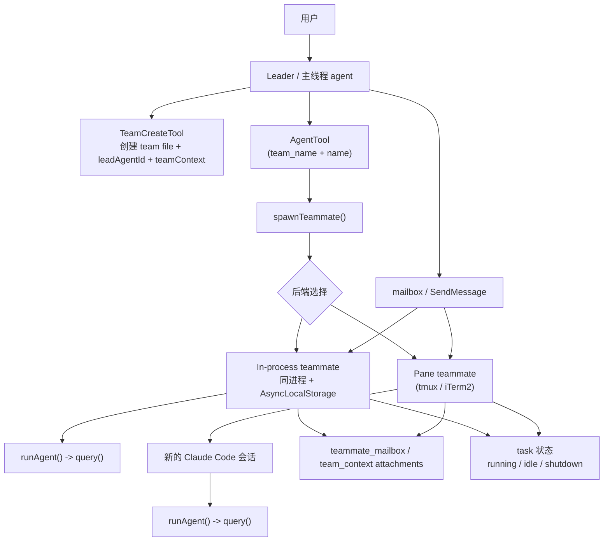

# Claude Code Source Analysis: Team Agents And Teammates

## Overview

在这个项目里，team agent 不是“普通子代理换个名字”。

更准确地说，它是一层建立在普通 agent runtime 外面的协作系统：

- leader 负责面对用户、创建团队、派发队友
- teammate 负责在团队里长期存在、接收任务、回传进展
- 底层执行时，teammate 仍然复用同一个 `runAgent() -> query()` 引擎
- 但在执行引擎外面，又额外包了一层 team file、mailbox、backend 和 task lifecycle

所以 team agent 的设计重点不是“新的推理引擎”，而是“新的协作壳子”。

## Core Idea

这套设计可以压缩成一句话：

`TeamCreateTool` 负责建立团队，`AgentTool` 负责把普通 spawn 分流成 teammate spawn，`spawnTeammate()` 负责选择运行后端，`mailbox + attachments` 负责队友之间通信，`runAgent()` 负责真正执行每个 teammate。

对应的关键文件：

- `src/tools/TeamCreateTool/TeamCreateTool.ts`
- `src/tools/AgentTool/AgentTool.tsx`
- `src/tools/shared/spawnMultiAgent.ts`
- `src/utils/swarm/spawnInProcess.ts`
- `src/utils/swarm/inProcessRunner.ts`
- `src/utils/teammateMailbox.ts`
- `src/utils/attachments.ts`
- `src/utils/swarm/teammatePromptAddendum.ts`

## Relationship Diagram



## 1. 先有 Team，再有 Teammate

team agent 不是直接 `spawn` 出来的，它先要有团队底座。

`TeamCreateTool` 会做几件关键事情：

- 生成 `leadAgentId`
- 在 `~/.claude/teams/{team}/config.json` 写入 team file
- 把 leader 自己作为第一个 member 写进去
- 初始化 team 对应的 task list 目录
- 把 `teamContext` 挂到 `AppState`

所以从代码设计上看，team agent 不是“若干 agent 的松散集合”，而是建立在一份显式 team metadata 上的。

## 2. AgentTool 如何分流到 Team Agent

普通 sub-agent 和 teammate 的分界点在 `AgentTool.call()`。

只要同时满足：

- `team_name` 存在
- `name` 存在

代码就不会走普通 sub-agent 路径，而是直接调用 `spawnTeammate(...)`。

也就是说：

- 普通 sub-agent 由 `subagent_type` / `run_in_background` / fork 等条件决定
- team agent 则是由 `team_name + name` 明确触发

这里还做了两个重要约束：

- teammate 不能再 spawn teammate，因为 team roster 是扁平的
- in-process teammate 不能再 spawn background agent，因为生命周期会变得很混乱

## 3. Teammate 的两类运行后端

`spawnTeammate()` 不是直接运行 agent，而是先选择 teammate 的后端。

### 3.1 In-process teammate

这是同进程队友模式。

特点：

- 跟 leader 跑在同一个 Node.js 进程里
- 通过 `AsyncLocalStorage` 保存自己的 `TeammateContext`
- 用 `in_process_teammate` task 类型挂到 `AppState.tasks`
- 真正执行时还是调用 `runAgent()`

这条路径的分层是：

1. `spawnInProcessTeammate()` 创建 `TeammateContext`
2. 注册 `InProcessTeammateTaskState`
3. `startInProcessTeammate()` 异步启动执行循环
4. `runWithTeammateContext(...)` 里再跑 `runAgent() -> query()`

一句话理解：

in-process teammate = 同一个进程里的“带身份隔离的长期 worker”。

### 3.2 Pane teammate

这是 tmux / iTerm2 队友模式。

特点：

- 不是复用当前进程，而是拉起新的 Claude Code 会话
- 每个 teammate 可以拥有自己的 pane / window
- leader 会把 agent identity 参数通过 CLI 传进去
- 初始 prompt 不直接传到标准输入，而是先写进 teammate 的 mailbox

这条路径更像：

leader 创建新终端 pane，然后让那个 pane 里的新 Claude Code 进程以“teammate 身份”加入团队。

## 4. Team Identity 是怎么保存的

team agent 设计里，一个 teammate 不是匿名 worker，而是有稳定身份的。

最核心的身份字段包括：

- `agentId`
- `agentName`
- `teamName`
- `color`
- `planModeRequired`
- `parentSessionId`

其中：

- `agentId` 通常是 `agentName@teamName`
- `agentName` 用来做 mailbox 路由
- `teamName` 用来归属到某个 team
- `parentSessionId` 用来和 leader 会话建立关联

在 in-process 路径里，这些字段会进入 `TeammateContext`。
在 task 层里，它们会作为 `identity` 子对象写进 `InProcessTeammateTaskState`。

## 5. Communication：不是共享消息历史，而是 Mailbox

team agent 最关键的设计点之一是：

**队友之间并不共享同一份对话历史。**

它们主要通过 mailbox 通信。

邮箱文件就在：

`~/.claude/teams/{team_name}/inboxes/{agent_name}.json`

每个 teammate 都有自己的 inbox，其他 agent 往里面写消息；收件方下一轮再读出来。

这和普通后台子代理很不一样：

- 普通后台子代理更偏 task-notification
- teammate 更偏 mailbox message bus

## 6. Mailbox 消息如何进入模型上下文

mailbox 里的消息不会直接变成主线程消息，而是会在 attachment 阶段注入：

- `teammate_mailbox`
- `team_context`

其中：

- `teammate_mailbox` 负责把收件箱中的消息带进当前回合
- `team_context` 只在 teammate 前几轮注入，用来告诉它自己是谁、team config 在哪、task list 在哪

所以 team agent 的运行方式不是“实时共享聊天界面”，而是：

`mailbox -> attachment -> 当前 agent 的下一轮 query`

## 7. 为什么 teammate 必须用 SendMessage

teammate prompt 里有一个非常重要的约束：

**直接输出普通文本，别人是看不到的。**

如果队友想和 leader 或其他 teammate 沟通，必须调用 `SendMessage`。

这意味着：

- leader 面向用户
- teammate 面向团队通信系统
- teammate 的普通回答主要属于自己的局部 transcript
- 真正跨 agent 可见的信息，必须经过 `SendMessage`

这也是它和普通 sub-agent 最大的行为差异之一。

## 8. Permission Bridge：队友权限如何回到 Leader

in-process teammate 还有一个很特别的设计：

它虽然是独立队友，但工具权限审批可以桥接回 leader。

大意是：

- teammate 发起工具调用
- 如果需要 ask permission
- 优先复用 leader 的 ToolUseConfirm UI
- 如果 UI bridge 不可用，再退回 mailbox permission request / response

所以 team agent 不是“权限彻底独立”的设计，而是“执行身份独立，但审批可上浮到 leader”。

## 9. Lifecycle：Teammate 是长期存在的，不是一次性调用

普通同步子代理更像一次函数调用：

- spawn
- run
- return
- 结束

teammate 则不同，它可以：

- `running`
- `idle`
- 等下一条消息或任务
- 接收 shutdown request
- 再继续执行下一轮

这就是为什么它需要单独的 task 类型、mailbox 和状态管理，而不是直接复用普通子代理那套一次性返回模型。

## 10. 为什么 Team Agent 要单独设计

如果只用普通子代理，很难自然表达下面这些能力：

- 队友有稳定身份和名字
- 队友可以持续在线，而不是一次调用完就销毁
- leader 和多个 teammate 可以长期协作
- teammate 可以通过 tmux / iTerm2 / in-process 多种后端存在
- 团队里可以有 task list、mailbox、plan approval、shutdown protocol

所以 team agent 本质上解决的是：

**如何把“多次一次性子代理调用”升级成“一个真正可协作的 agent team”。**

## Simplified Code Extraction

下面这段简化代码，可以先抓 team agent 的骨架。

```ts
async function agentToolCall(input, context) {
  if (input.team_name && input.name) {
    return spawnTeammate(input, context)
  }

  return spawnRegularSubagent(input, context)
}

async function spawnTeammate(input, context) {
  if (isInProcessEnabled()) {
    const spawned = await spawnInProcessTeammate(input, context)

    startInProcessTeammate({
      identity: spawned.identity,
      taskId: spawned.taskId,
      prompt: input.prompt,
      teammateContext: spawned.teammateContext,
      toolUseContext: context,
    })

    return spawned
  }

  const pane = await createTeammatePane()
  await launchClaudeCodeWithTeammateIdentity(pane, input)
  await writeToMailbox(input.name, {
    from: "team-lead",
    text: input.prompt,
  })

  return { status: "teammate_spawned" }
}

async function runTeammate(identity, teammateContext) {
  return runWithTeammateContext(teammateContext, async () => {
    for await (const message of runAgent(...)) {
      handleProgress(message)
    }

    await sendIdleNotificationToLeader(identity)
    await waitForNextPromptOrShutdown(identity)
  })
}
```

这段代码想表达的核心是：

- teammate 只是 spawn 路径不同
- 真正执行时仍然复用 `runAgent()`
- 真正让它“像队友”的，是外层的 team identity、mailbox 和 lifecycle

## Short Summary

team agent 的设计，不是“再造一套新的智能体引擎”，而是：

- 先用 `TeamCreateTool` 建立团队模型
- 再用 `AgentTool -> spawnTeammate()` 创建带 team identity 的 agent
- 用 in-process 或 tmux / iTerm2 后端承载这些 agent
- 用 mailbox、attachments 和 `SendMessage` 做跨 agent 通信
- 用 task state 管理它们的长期生命周期

所以一句话总结就是：

**teammate = 复用普通 agent runtime 的长期协作 worker。**
