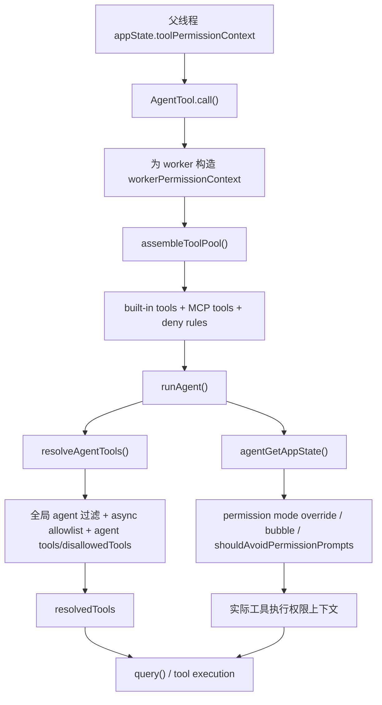

# Claude Code Source Analysis: Tool Resolution And Permission Isolation

## Overview

Claude Code 里的子 agent，并不是简单继承父级“当前能用什么工具”。

更准确地说，它会经过两层处理：

1. **工具解析**
   决定这个 agent 最终拿到哪一组工具
2. **权限隔离**
   决定这些工具在什么 permission context 下运行、什么时候弹权限确认

一句话总结：

**Claude Code 把“工具池组装”和“工具权限执行”拆成了两层独立机制，这样子 agent 既能有自己的能力边界，也能有自己的权限行为。**

## Core Idea

如果没有这两层拆分，系统会很容易出问题：

- 父 agent 的工具限制会错误泄漏到子 agent
- 某个子 agent 的 frontmatter 定义会无法真正生效
- 后台 agent 会拿到本不该拿到的危险工具
- 没有 UI 的 agent 还会试图自己弹权限对话框

所以作者把流程设计成：

```text
先决定“给它哪些工具”
再决定“这些工具在什么权限模式下执行”
```

这也是为什么源码里既有：

- `assembleToolPool(...)`
- `resolveAgentTools(...)`

又有：

- `toolPermissionContext`
- `shouldAvoidPermissionPrompts`
- `allowedTools` / session rules

## Flow Diagram



## Layer 1: Tool Pool Assembly

第一层先解决一个问题：

**这个 agent 可能拿到哪些候选工具？**

这一步发生在 `AgentTool.call()` 里。

### 1. worker 不直接复用父 agent 的工具池

在 `AgentTool.tsx` 里，子 agent 会先构造一个自己的 `workerPermissionContext`：

```ts
const workerPermissionContext = {
  ...appState.toolPermissionContext,
  mode: selectedAgent.permissionMode ?? 'acceptEdits'
}
```

然后再调用：

```ts
const workerTools = assembleToolPool(workerPermissionContext, appState.mcp.tools)
```

这说明子 agent 的候选工具池，不是父级那份 `tools` 的简单拷贝，而是重新按它自己的 permission mode 组装一遍。

这一步的目的很明确：

- 避免父级的工具限制直接污染子 agent
- 让 agent definition 自己的 `permissionMode` 真正生效

### 2. `assembleToolPool()` 先组“大池子”

`assembleToolPool(...)` 的职责是把可用工具先拼成一个大候选池。

它做的事主要有：

- 调 `getTools(permissionContext)` 拿到当前环境允许的 built-in tools
- 过滤掉被 deny rules 拦掉的 MCP tools
- built-in tools 和 MCP tools 合并
- 按 tool name 排序，保证 prompt cache 稳定
- 按名字去重，built-in tools 优先

所以这一层解决的是：

**从系统全量工具里，先得到这个 permission context 下的候选工具全集。**

### 3. `getTools()` 已经先做了一轮环境与 deny 过滤

`getTools(permissionContext)` 不是单纯返回所有 built-in tools。

它会先考虑：

- 当前是不是 simple mode
- 当前是不是 REPL mode
- 某些 feature flag 是否打开
- 该工具 `isEnabled()` 是否为真
- deny rules 是否已经把它屏蔽

所以到 `assembleToolPool()` 时，很多不该出现的 built-in tools 其实已经被过滤掉了。

## Layer 2: Agent-Specific Tool Resolution

第二层解决的是：

**从候选大池子里，这个 agent 最终到底能用哪几个？**

这一步主要在 `resolveAgentTools(...)` 里完成。

### 1. 先过一层 agent 级全局过滤

`resolveAgentTools(...)` 在处理 agent 自己的 `tools` / `disallowedTools` 之前，会先调用：

```ts
filterToolsForAgent(...)
```

这层过滤的是“所有 agent 都应该遵守的全局边界”。

最重要的几条规则是：

- `ALL_AGENT_DISALLOWED_TOOLS`
  所有 agent 都默认不能拿到的工具
- `CUSTOM_AGENT_DISALLOWED_TOOLS`
  非 built-in agent 额外不能拿到的工具
- `ASYNC_AGENT_ALLOWED_TOOLS`
  后台 agent 只能拿这个 allowlist 里的工具

另外还有两个特殊点：

- MCP 工具默认直接放行
- `plan` 模式下允许 `ExitPlanMode`

也就是说，**agent definition 自己写得再宽，也不能绕过这层全局 agent 安全边界。**

### 2. `tools` 和 `disallowedTools` 再做第二轮收窄

通过全局过滤后，`resolveAgentTools(...)` 再处理 agent frontmatter 里的：

- `tools`
- `disallowedTools`

规则大致是：

- `tools` 省略或是 `['*']`，表示拿到全部允许工具
- `disallowedTools` 会从候选池中剔除对应工具
- 如果 `tools` 指定了具体名单，就只解析这些工具

所以可以把这一层理解成：

**全局规则先划大框，agent 自己再在大框里做白名单或黑名单控制。**

### 3. `Agent(...)` 是一个特殊工具规格

`resolveAgentTools(...)` 里还有一个特殊处理：

如果在 `tools` 里写的是类似：

```text
Agent(worker, researcher)
```

它不会只是“把 AgentTool 加进去”，还会额外解析出：

- `allowedAgentTypes`

这样这个 agent 以后再调用 Agent tool 时，只能继续派生指定类型的子 agent。

所以工具解析这层，不只是选工具，还会把一部分“工具的参数化约束”一起解析出来。

### 4. fork 路径是一个例外

正常子 agent 会走：

```ts
resolveAgentTools(agentDefinition, availableTools, isAsync)
```

但 fork 路径会显式绕过这一步：

```ts
useExactTools: true
```

这意味着 fork child 直接继承父级的 exact tools。

原因不是普通过滤不重要，而是 fork 要尽量保持：

- 工具定义字节一致
- prompt 前缀一致
- prompt cache 命中率更高

所以 fork 是一个典型的“为缓存共享而有意绕过正常工具解析”的特例。

## Layer 3: Permission Isolation

拿到 `resolvedTools` 之后，事情还没结束。

因为“能看到某个工具”不等于“执行时会怎样被批准”。

这就是权限隔离层的职责。

### 1. `runAgent()` 会重新包装一个 agent 专属 `toolPermissionContext`

在 `runAgent.ts` 里，`agentGetAppState()` 会基于父级 app state 再构造一层新的 `toolPermissionContext`。

这里最关键的一点是：

**子 agent 拿到的是重新包装过的权限上下文，不是父级原封不动那一份。**

### 2. agent definition 的 `permissionMode` 不总是强制覆盖父级

代码里有一个很重要的保护：

如果父级当前已经是这些模式之一：

- `bypassPermissions`
- `acceptEdits`
- `auto`

那子 agent 的 `permissionMode` 不会再强行覆盖它。

这说明作者的意图是：

- 某些全局会话级权限模式优先级更高
- 不是每个 agent 都能随便把父级会话拖到另一个权限模式

所以这里不是“agent definition 说了算”，而是“agent definition 在父会话允许的范围内生效”。

### 3. `shouldAvoidPermissionPrompts` 决定能不能弹权限确认

对子 agent 来说，另一个关键字段是：

```ts
shouldAvoidPermissionPrompts
```

它控制的是：

- 这个 agent 是否应该避免弹权限对话框
- 没有 UI 的情况下，是不是应该直接走自动拒绝/静默路径

默认规则大致是：

- 同步 agent：通常可以弹 prompt
- 异步 agent：通常避免弹 prompt
- `bubble` 模式：即使是 async，也允许把权限提示冒泡到父终端

这层非常关键，因为后台 agent 和前台 agent 的交互能力不一样。

### 4. `allowedTools` 会变成 session-level always allow rules

`runAgent()` 里还有一个常被忽略的点：

如果传入了 `allowedTools`，它不会只是工具列表过滤，而是会写进：

```ts
toolPermissionContext.alwaysAllowRules.session
```

同时保留 SDK 通过 `--allowedTools` 注入的 `cliArg` 规则。

这说明：

- 工具解析层决定“有哪些工具会暴露给模型”
- 权限层还能进一步决定“其中哪些调用在本会话里是默认允许的”

这两层是叠加关系，不是二选一。

## Async Agents And Safety Boundaries

后台 agent 的工具和权限限制会更严格。

### 1. async agent 有自己的 allowlist

`ASYNC_AGENT_ALLOWED_TOOLS` 明确限制了后台 agent 只能使用一部分工具，例如：

- Read
- Bash
- Edit / Write
- Search
- Skill
- ToolSearch

而像这些工具则默认不能给普通 async agent：

- AgentTool
- TaskOutputTool
- ExitPlanMode
- TaskStopTool

因为这些工具要么容易递归，要么依赖主线程抽象，要么会和全局状态冲突。

### 2. in-process teammate 是 async 里的特例

`filterToolsForAgent(...)` 对 in-process teammate 开了小口子：

- 可以继续拿到 AgentTool
- 可以拿到一部分 task / SendMessage 相关工具

但这不是普通 async agent 的默认行为，而是为了 team 协作特地开的例外。

所以整套设计不是“后台 agent 一刀切”，而是：

- 默认严格
- 对特定协作形态做精确豁免

## MCP And Required Servers

这块也值得单独强调一下。

### 1. MCP 工具默认不走普通 agent disallow 逻辑

在 `filterToolsForAgent(...)` 里，`mcp__` 前缀工具会直接放行。

这说明作者把 MCP 视作一个独立工具命名空间，不希望它被普通 agent disallow 常量粗暴拦掉。

### 2. 但 agent 仍然可以声明 `requiredMcpServers`

在 `AgentTool.call()` 里，spawn 前还会检查：

- 所需 MCP server 是否连接完成
- 是否已经认证并真正暴露出工具
- 必要时等待最多 30 秒

如果缺失，就直接拒绝启动 agent。

所以 MCP 不是“有工具就算了”，而是：

- 工具解析层允许它进入池子
- spawn 层再校验 agent 依赖的 MCP server 是否真的可用

## Simplified Pseudocode

下面这段伪代码可以抓住主线：

```ts
function spawnAgent(selectedAgent, appState) {
  const workerPermissionContext = {
    ...appState.toolPermissionContext,
    mode: selectedAgent.permissionMode ?? 'acceptEdits',
  }

  const workerTools = assembleToolPool(
    workerPermissionContext,
    appState.mcp.tools,
  )

  return runAgent({
    agentDefinition: selectedAgent,
    availableTools: workerTools,
  })
}

function runAgent({ agentDefinition, availableTools, isAsync }) {
  const permissionContext = buildAgentPermissionContext(agentDefinition, isAsync)

  const resolvedTools = useExactTools
    ? availableTools
    : resolveAgentTools(agentDefinition, availableTools, isAsync)

  return query({
    tools: resolvedTools,
    toolPermissionContext: permissionContext,
  })
}
```

## Why This Design Matters

这套设计最重要的价值有 5 个：

1. 子 agent 不会被父 agent 的工具池偶然污染。
2. agent frontmatter 里的 `tools` / `disallowedTools` 能真正生效。
3. 后台 agent 会自动落进更严格的安全边界。
4. fork 路径可以为 prompt cache 有意识地保留 exact tools。
5. 工具暴露和权限批准被拆成两层，模型能力边界更清晰。

所以 Claude Code 这块的设计重点不是“给模型很多工具”，而是：

**先精确决定它能看到什么，再精确决定这些能力如何被批准执行。**

## Key Source Files

如果要顺着源码读，建议按这个顺序：

1. `src/tools.ts`
   看 `getTools()` 和 `assembleToolPool()` 怎样组装候选工具池。
2. `src/tools/AgentTool/AgentTool.tsx`
   看子 agent 如何用自己的 permission mode 组装 `workerTools`。
3. `src/tools/AgentTool/agentToolUtils.ts`
   看 `filterToolsForAgent()` 和 `resolveAgentTools()`。
4. `src/tools/AgentTool/runAgent.ts`
   看 agent 专属 `toolPermissionContext` 怎样被包装。
5. `src/constants/tools.ts`
   看全局 disallow / allowlist 常量。
6. `src/tools/AgentTool/loadAgentsDir.ts`
   看 agent frontmatter 里的 `tools`、`disallowedTools`、`permissionMode` 怎样进入定义。

## One-Sentence Summary

Claude Code 在子 agent 上不是简单继承父级权限，而是：

**先用 `assembleToolPool()` 和 `resolveAgentTools()` 算出这名 agent 能看到哪些工具，再用 agent 专属的 `toolPermissionContext` 决定这些工具如何被批准执行，从而实现工具能力和权限行为的双重隔离。**
