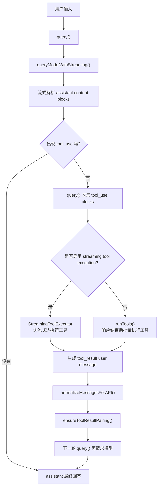

# Claude Code Source Analysis: `tool_use` And `tool_result`

## Overview

如果把 Claude Code 看成一个 agent runtime，那么 `tool_use -> tool_result` 就是它最关键的闭环之一。

普通聊天模型的典型路径是：

```text
用户输入 -> 模型回答 -> 结束
```

而 Claude Code 更常见的路径是：

```text
用户输入 -> assistant 产生 tool_use -> 本地执行工具 -> 生成 tool_result -> 再次请求模型 -> 最终回答
```

一句话总结：

- `tool_use` 是 assistant 发给系统的结构化工具指令
- `tool_result` 是系统回给模型的结构化工具结果

它们共同把“一次对话”变成了一个可循环的 agentic turn。

## Core Idea

这里最容易混淆的点有两个：

1. `tool_use` 不是给用户看的自然语言，而是 assistant 的结构化调用指令。
2. `tool_result` 不是普通 assistant 文本，而是下一轮发回模型的 user message block。

所以这条链路真正的形态更像：

```text
assistant(tool_use)
  -> local runtime executes tool
  -> user(tool_result)
  -> assistant(继续思考 / 继续调用工具 / 最终回答)
```

## Flow Diagram



## What `tool_use` Means

`tool_use` 的含义不是“模型在说一句话”，而是“模型在要求 runtime 帮它调用一个工具”。

典型结构类似这样：

```json
{
  "type": "tool_use",
  "id": "toolu_123",
  "name": "Read",
  "input": {
    "file_path": "package.json"
  }
}
```

在代码层面，底层流式 API 会先在 `src/services/api/claude.ts` 里把 `tool_use` block 拼出来：

- `content_block_start` 遇到 `tool_use` 时先创建 block，并把 `input` 初始化成空字符串
- `content_block_delta` 遇到 `input_json_delta` 时不断把 `partial_json` 追加进去
- `content_block_stop` 时再调用 `normalizeContentFromAPI(...)`，把完整 block 变成 Claude Code 内部 assistant message

所以 `tool_use` 的输入参数不是一次性拿到的，而是流式拼出来的。

## What `tool_result` Means

`tool_result` 是工具执行完成后，runtime 发回给模型的结果块。

它不是 assistant message，而是一个 user message 里的结构化 block。典型结构类似：

```json
{
  "type": "tool_result",
  "tool_use_id": "toolu_123",
  "content": "...工具执行结果...",
  "is_error": false
}
```

这里有个很关键的设计：

- UI 上看到的工具结果渲染，不一定等于模型真正看到的 `tool_result` serialization
- 模型侧真正的 block 由每个工具自己的 `mapToolResultToToolResultBlockParam(...)` 决定

也就是说，Claude Code 把“用户怎么显示结果”和“模型怎么消费结果”分开了。

## Code-Level Design

从代码层面，这条链路可以拆成 6 步。

### 1. 模型流式返回 `tool_use`

`queryModelWithStreaming()` 在 `src/services/api/claude.ts` 中解析流式事件：

- `content_block_start` 创建 `tool_use`
- `input_json_delta` 逐步追加工具输入 JSON
- `content_block_stop` 生成完整 assistant message 并 `yield`

这一步的职责很明确：

- 把流式 API 还原成 Claude Code 内部消息
- 不负责执行工具

### 2. `query()` 识别 `tool_use`

`src/query.ts` 收到 assistant message 后，会做两件关键的事：

- 收集 message 里的全部 `tool_use` block
- 把 `needsFollowUp = true`

如果开启了流式工具执行，还会立刻把这些 block 送进 `StreamingToolExecutor.addTool(...)`。

所以：

- `queryModelWithStreaming()` 负责“把 `tool_use` 拼出来”
- `query()` 负责“看到 `tool_use` 后决定下一步怎么办”

### 3. 工具有两种执行路径

Claude Code 这里不是只有一种工具执行模式。

#### 路径 A：`StreamingToolExecutor`

如果允许边生成边执行工具，`StreamingToolExecutor` 会在 assistant 还没完全结束时就开始跑工具。

这层的特点是：

- 能尽早启动工具
- 会维护 queued / executing / completed 状态
- 支持并发安全判断
- 在 fallback、兄弟工具报错、用户中断时生成 synthetic error `tool_result`

#### 路径 B：`runTools()`

如果不走 streaming path，`query()` 会在 assistant 响应完成后统一调用 `runTools(...)`。

`runTools()` 不是简单串行跑，它会：

- 用 `partitionToolCalls(...)` 把工具分成并发安全和非并发安全两类
- 只读/并发安全工具成批并行执行
- 有副作用或不安全工具串行执行

也就是说，Claude Code 在工具层已经有一层轻量调度器。

### 4. `tool_result` 由工具自己定义序列化方式

每个工具都会实现：

```ts
mapToolResultToToolResultBlockParam(content, toolUseID)
```

这一步很关键，因为它决定：

- 模型看到的结果 block 长什么样
- 结果是普通文本、结构化内容，还是带图片的 content array

所以 runtime 并不强行规定所有工具结果都长成一种格式，而是把结果序列化权交给具体工具。

### 5. `query()` 把结果回填成下一轮输入

无论走 `StreamingToolExecutor` 还是 `runTools()`，最后产出的都是 message update。

`query()` 会把这些 update 中的 user messages 再经过 `normalizeMessagesForAPI(...)`，然后推入 `toolResults`。

这一步的真实含义是：

- 工具执行结果不会只停留在 UI
- 它们会重新进入“下一次模型请求”的消息历史

所以 `tool_result` 是 runtime 循环继续下去的桥。

### 6. 发请求前再做一次配对修复

在真正把消息发给模型前，`src/services/api/claude.ts` 会调用：

```ts
messagesForAPI = ensureToolResultPairing(messagesForAPI)
```

它会做两种防御性修复：

- 如果有 `tool_use` 没有对应 `tool_result`，插入 synthetic error result
- 如果有 orphaned `tool_result` 指向不存在的 `tool_use`，把它剥掉

这层非常重要，因为 API 对 `tool_use` / `tool_result` 配对要求很严格。

换句话说，Claude Code 不是“假设上游永远正确”，而是在真正发请求前再做一次结构自检。

## Simplified Pseudocode

下面这段伪代码可以抓住整条链的主线：

```ts
async function* query() {
  const assistantMessages = []
  const toolUseBlocks = []
  const toolResults = []

  for await (const message of queryModelWithStreaming()) {
    yield message

    if (message.type === 'assistant') {
      assistantMessages.push(message)

      const blocks = message.message.content.filter(b => b.type === 'tool_use')
      toolUseBlocks.push(...blocks)

      if (streamingToolExecutor) {
        for (const block of blocks) {
          streamingToolExecutor.addTool(block, message)
        }
      }
    }

    if (streamingToolExecutor) {
      for (const result of streamingToolExecutor.getCompletedResults()) {
        yield result.message
        toolResults.push(normalize(result.message))
      }
    }
  }

  const updates = streamingToolExecutor
    ? streamingToolExecutor.getRemainingResults()
    : runTools(toolUseBlocks, assistantMessages, canUseTool, toolUseContext)

  for await (const update of updates) {
    yield update.message
    toolResults.push(normalize(update.message))
  }

  const nextMessages = [...assistantMessages, ...toolResults]
  return query(nextMessages)
}
```

## Error Handling And Recovery

这条链里还有几个容易忽略但很关键的设计点。

### 1. 中断时也尽量补全 `tool_result`

如果用户中断了流式执行：

- streaming path 会调用 `getRemainingResults()`
- non-streaming path 会调用 `yieldMissingToolResultBlocks(...)`

目标是一样的：

不要留下没有结果的 `tool_use`。

### 2. fallback 时会丢弃旧 executor 的结果

如果模型 fallback 触发，旧的 `StreamingToolExecutor` 会被 discard，然后重新建一个新的 executor。

这样做是为了避免：

- 上一次请求里的旧 `tool_use_id`
- 和重试请求里的新 `tool_use_id`

交叉污染，造成 orphaned `tool_result`。

### 3. 严格模式下甚至不允许自动修复

`ensureToolResultPairing()` 在 strict mode 下如果发现配对不一致，会直接报错，而不是自动修复。

这说明作者把“结构正确性”看得很重，尤其是在训练/标注场景里，不希望模型上下文被 synthetic placeholder 污染。

## UI Boundary

REPL 并不是等整轮结束后才知道发生了什么。

`handleMessageFromStream(...)` 会一边消费流式事件，一边更新：

- 正在输出的文本
- 正在输入的 `tool_use` 参数
- thinking 状态
- 完整 assistant message
- 完整 `tool_result` message

所以用户在 UI 里看到的是一个渐进式过程：

```text
模型开始输出
-> 出现工具调用
-> 工具开始执行
-> 工具结果落下来
-> 模型继续回答
```

这也是为什么 `query()` 被设计成 async generator，而不是普通 async function。

## Key Source Files

如果要顺着源码读这条链，建议按这个顺序看：

1. `src/services/api/claude.ts`
   看 `tool_use` 是怎么从流式事件里被拼出来的。
2. `src/query.ts`
   看 `query()` 怎么识别 `tool_use`、执行工具、回填 `tool_result`。
3. `src/services/tools/StreamingToolExecutor.ts`
   看流式工具执行、并发、fallback 和中断处理。
4. `src/services/tools/toolOrchestration.ts`
   看非流式工具执行和并发分批逻辑。
5. `src/Tool.ts`
   看工具如何定义 `mapToolResultToToolResultBlockParam(...)`。
6. `src/utils/messages.ts`
   看 `normalizeMessagesForAPI(...)`、`ensureToolResultPairing(...)` 和 UI stream handling。

## One-Sentence Summary

`tool_use -> tool_result` 的本质不是“调一个工具然后把结果打印出来”，而是：

**assistant 用 `tool_use` 驱动本地 runtime，runtime 执行工具后把结果重新编码成 `tool_result` user blocks，再把它们送回下一轮模型请求，从而形成 Claude Code 的 agentic loop。**
