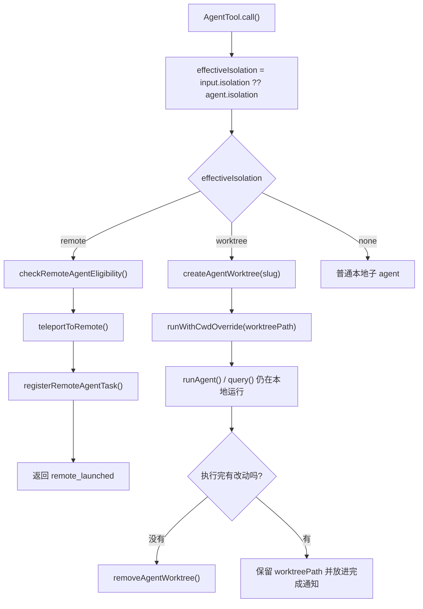

# Claude Code Source Analysis: Worktree And Remote Isolation

## Overview

Claude Code 里的 `isolation`，不是单纯一个布尔开关。

在 AgentTool 里，它至少有两条不同的隔离路径：

1. `worktree`
   让子 agent 在本地仓库的隔离副本里运行
2. `remote`
   让子 agent 直接在远端 CCR session 里运行

一句话总结：

**`worktree` 还是本地 agent runtime，只是换了工作目录；`remote` 则是把任务委派到远端会话，连执行环境都换掉了。**

## Core Idea

作者设计隔离层，主要是在解决两个不同问题：

- **本地隔离**
  子 agent 需要改代码，但不能直接污染父线程当前 working tree
- **环境隔离**
  某些任务需要完全独立的远端执行环境，而不是本机进程里的子 agent

所以这块设计不是“一个隔离机制做所有事”，而是：

- `worktree` 解决本地文件系统副本隔离
- `remote` 解决运行环境级别隔离

## Flow Diagram



## Isolation Entry Point

这两条路径的共同入口都在 `AgentTool.call()`。

代码先计算：

```ts
const effectiveIsolation = isolation ?? selectedAgent.isolation
```

也就是说，隔离模式既可以：

- 来自这次 Agent tool 调用的显式参数
- 也可以来自 agent definition 自己的 `isolation` 字段

然后再按模式分流。

所以 isolation 是 agent spawn 阶段的能力，不是 `runAgent()` 内部临时决定的。

## Path 1: Worktree Isolation

`worktree` 是这篇里最重要的一条本地隔离路径。

### 它的本质是什么

它不是新 runtime，也不是远程执行。

本质上它还是：

```text
AgentTool -> runAgent() -> query()
```

只是这个 agent 不在父线程当前 cwd 上工作，而是在：

- 一个临时 git worktree
- 或 hook 创建出的隔离目录

里工作。

所以 worktree 隔离的重点不是“换执行器”，而是“换工作副本”。

### 1. 创建 worktree

当 `effectiveIsolation === 'worktree'` 时，`AgentTool.tsx` 会先生成一个稳定 slug：

```ts
const slug = `agent-${earlyAgentId.slice(0, 8)}`
```

然后调用：

```ts
createAgentWorktree(slug)
```

`createAgentWorktree(...)` 这层会做几件事：

- 先校验 slug，防路径逃逸
- 优先尝试 hook-based worktree creation
- 否则回退到 git worktree
- 对 git worktree 使用 canonical git root，而不是当前 worktree root
- 新建后跑一轮 post-creation setup
- 如果是已存在 worktree，则走 fast resume path

这里有个特别重要的点：

**agent worktree 总是尽量挂在主仓库的 canonical root 下，而不是嵌套挂在另一个 worktree 里面。**

这样做是为了：

- 避免 worktree 套 worktree
- 让后续 stale cleanup 能统一扫描到

### 2. post-creation setup 不是空壳

worktree 创建完后，不是简单 `git worktree add` 就结束了。

还会做一些补充配置，比如：

- 复制局部 settings
- 配置 hooks
- 复制 `.worktreeinclude` 指定文件
- 处理一些 worktree 内的环境同步

所以这个 worktree 设计不是一个“纯 git 命令包装器”，而是一个带会话语义的隔离工作副本。

### 3. 真正切换隔离靠 `runWithCwdOverride()`

创建完 worktree 后，AgentTool 不会去全局 `process.chdir()`。

它用的是：

```ts
runWithCwdOverride(worktreePath, fn)
```

这层基于 `AsyncLocalStorage`，作用是：

- 当前 agent 及其所有异步后代里，`getCwd()` / `pwd()` 都看到 worktreePath
- 但不会影响其他并发 agent 或主线程

这点非常关键，因为 Claude Code 允许多个 agent 并发工作。

如果用全局 `chdir`，不同 agent 会互相踩 cwd。

所以 worktree 隔离能成立，靠的不只是 worktree 目录本身，还靠这层 async-context cwd override。

### 4. `cwd` 参数和 worktree 的关系

在 AgentTool 里：

```ts
const cwdOverridePath = cwd ?? worktreeInfo?.worktreePath
```

这说明：

- 如果显式传了 `cwd`，它优先级更高
- 否则才使用 worktreePath

也就是说，最终真正生效的是“cwd override”，worktree 只是其中一种来源。

不过从 schema 设计上看，`cwd` 和 `isolation: "worktree"` 是被视作互斥意图的，所以正常使用时不应该把它们混在一起。

### 5. fork + worktree 是一个特殊组合

如果 fork child 同时跑在 worktree 里，系统还会额外在 promptMessages 里塞一条 worktree notice。

它主要提醒 fork child：

- 继承来的路径是父 cwd 下的路径
- 现在自己工作在另一个 worktreePath 下
- 需要把父路径翻译到自己的 worktree 根目录
- 编辑前最好重新读文件，避免 inherited context 过期

所以 fork + worktree 不是只改 cwd，还会显式补提示，帮助 child 正确理解隔离语境。

## Worktree Cleanup Design

worktree 隔离最漂亮的一块，在于它不是盲目删目录，而是带判断地清理。

### 1. 执行结束后先看有没有变化

AgentTool 会在执行结束后调用 `cleanupWorktreeIfNeeded()`。

这层会先取出：

- `worktreePath`
- `worktreeBranch`
- `headCommit`
- `gitRoot`
- `hookBased`

然后分情况处理。

### 2. hook-based worktree 默认保留

如果是 hook-based worktree：

- 系统默认保留
- 因为它不一定能用 git 可靠判断改动

所以 hook-based worktree 的清理策略是保守的。

### 3. git worktree 会检查 dirty state 和新增提交

对于 git-based worktree，系统会调用：

```ts
hasWorktreeChanges(worktreePath, headCommit)
```

它会检查两件事：

- `git status --porcelain` 是否有未提交改动
- `git rev-list --count headCommit..HEAD` 是否出现了新提交

而且这里是 **fail-closed** 的：

- 只要 git 检查失败
- 就当成“有变化”

因为这里的调用方是“决定要不要删 worktree”，所以作者宁可误保留，也不愿误删。

### 4. 没变化就删，有变化就保留

策略很直接：

- 没变化：`removeAgentWorktree(...)`
- 有变化：保留 worktree，并把路径带回上层

`removeAgentWorktree(...)` 对 git worktree 会做两步：

- `git worktree remove --force`
- 删除临时 branch

对 hook-based worktree，则委托给 `WorktreeRemove` hook。

### 5. worktree 路径会回传给主线程

如果最终保留了 worktree，路径不会静默丢掉。

它会被放进：

- async agent 的完成通知
- 失败通知
- killed 通知

这样父线程就能知道：

- 这个 agent 的改动还留在哪个 worktree
- 用户后续可以去 inspect / merge / resume

所以 worktree 不是“一次性临时目录”，而是可能成为一个可交接的产物。

## Path 2: Remote Isolation

`remote` 则是完全不同的一条路径。

### 它的本质是什么

remote 不是本地 `runAgent()` 换个 cwd。

而是：

- 在本地 spawn 点做资格检查
- 创建一个远端 session
- 注册成本地 task
- 然后立即返回 `remote_launched`

换句话说，**remote isolation 不是本地 agent 的一种执行细节，而是一种任务转交。**

### 1. remote 是一条提前返回的分支

在 `AgentTool.call()` 里，只要：

```ts
effectiveIsolation === 'remote'
```

代码就不会继续走后面的：

- promptMessages 构造
- workerTools 组装
- `runAgent()` 本地执行
- worktree cleanup

而是直接进入 remote 分支，并在成功后马上返回。

所以 remote 和 worktree 不只是实现不同，它们在控制流位置上都不一样。

### 2. 先做资格检查

remote 启动前会先跑：

```ts
checkRemoteAgentEligibility()
```

如果不满足条件，会把错误列表格式化后直接报错。

检查项大致包括：

- 是否已登录 Claude.ai
- 是否有 cloud environment
- 当前是否在 git repo
- 是否有 git remote
- GitHub app 是否安装
- 组织策略是否允许 remote sessions

这说明 remote 不是“能跑就跑”，而是一个前置条件很强的能力。

### 3. 真正创建远端会话的是 `teleportToRemote()`

资格通过后，AgentTool 调：

```ts
teleportToRemote({
  initialMessage: prompt,
  description,
  signal,
})
```

这层会负责：

- 校验 OAuth token
- 拿 organization UUID
- 选 repo source / bundle / environment
- 创建远端 session

所以 AgentTool 自己并不直接处理远端环境细节，它只是调用 teleport 层。

### 4. 本地还会注册一个 remote task

远端 session 创建成功后，AgentTool 还会在本地调用：

```ts
registerRemoteAgentTask(...)
```

这样做的目的，是把远端任务也纳入本地 task system：

- 有 `taskId`
- 有输出文件
- 有可轮询状态
- 有 session URL

所以从主线程视角看，remote agent 虽然不在本地跑，但仍然是一个本地可跟踪任务。

### 5. 返回值也和本地 agent 不一样

remote 分支返回的是：

```ts
{
  status: 'remote_launched',
  taskId,
  sessionUrl,
  description,
  prompt,
  outputFile
}
```

这和本地常见的：

- `completed`
- `async_launched`

不一样。

所以 remote isolation 不是“后台 agent 的一个小变体”，而是有自己独立的输出模式。

## Worktree vs Remote

这两条路径最容易混淆的地方，是它们都叫 isolation。

但它们隔离的层次不一样。

| 维度 | `worktree` | `remote` |
|---|---|---|
| 执行位置 | 本地进程内 | 远端 session |
| runtime | 仍然走 `runAgent() -> query()` | 不走本地 `runAgent()` 主链 |
| 主要隔离对象 | 文件系统副本 / cwd | 整个执行环境 |
| 返回方式 | 正常 subagent 完成或 async 通知 | `remote_launched` |
| 清理逻辑 | 结束后检查变更再删或保留 | 本地注册 remote task，不做 worktree 清理 |
| 与 prompt / tool pool 的关系 | 本地照常组装 | 远端会话负责后续执行 |

最短理解就是：

- `worktree` = 本地隔离工作副本
- `remote` = 把任务发到远端环境

## Simplified Pseudocode

下面这段伪代码可以抓住主线：

```ts
function spawnAgent(input, selectedAgent) {
  const effectiveIsolation = input.isolation ?? selectedAgent.isolation

  if (effectiveIsolation === 'remote') {
    checkRemoteAgentEligibility()
    const session = teleportToRemote({ initialMessage: input.prompt })
    registerRemoteAgentTask(session)
    return { status: 'remote_launched' }
  }

  let worktreeInfo = null
  if (effectiveIsolation === 'worktree') {
    worktreeInfo = createAgentWorktree(`agent-${agentId}`)
  }

  const cwdOverridePath = input.cwd ?? worktreeInfo?.worktreePath

  return runWithCwdOverride(cwdOverridePath, async () => {
    const result = await runAgent(...)

    if (worktreeInfo) {
      if (hasWorktreeChanges(worktreeInfo.path, worktreeInfo.headCommit)) {
        return { result, worktreePath: worktreeInfo.path }
      }
      removeAgentWorktree(worktreeInfo.path, ...)
    }

    return result
  })
}
```

## Why This Design Matters

这套设计的价值主要有 4 个：

1. 本地改动可以安全隔离
   子 agent 能大胆改代码，但不直接污染父级 working tree。
2. 并发 agent 不会互相踩 cwd
   `runWithCwdOverride()` 让隔离目录只在自己的 async 上下文里生效。
3. 有价值的 worktree 不会被误删
   改动存在时，系统会保留 worktree 并把路径带回给主线程。
4. 远端任务能纳入统一 task 体系
   remote 虽然换了执行环境，但仍然能在本地被追踪和展示。

所以 isolation 在 Claude Code 里不是一个 UI 选项，而是影响：

- 执行位置
- cwd 解析
- 清理策略
- 返回形态

的一层核心运行时设计。

## Key Source Files

如果你要顺着源码读，建议按这个顺序：

1. `src/tools/AgentTool/AgentTool.tsx`
   看 isolation 分流、cwd override 和 cleanup 主逻辑。
2. `src/utils/worktree.ts`
   看 worktree 的创建、恢复、删除和改动检查。
3. `src/utils/cwd.ts`
   看 `runWithCwdOverride()` 如何用 AsyncLocalStorage 做并发 cwd 隔离。
4. `src/tools/AgentTool/forkSubagent.ts`
   看 fork + worktree 组合时的路径翻译提示。
5. `src/tasks/RemoteAgentTask/RemoteAgentTask.tsx`
   看 remote eligibility、task 注册和 session URL。
6. `src/utils/teleport.tsx`
   看远端 session 是怎么真正创建出来的。

## One-Sentence Summary

Claude Code 里的 `worktree` 和 `remote` 都叫隔离，但本质不同：

**`worktree` 是让本地 agent 在隔离副本里继续跑，`remote` 则是把任务直接发到远端会话执行，而 AgentTool 负责在 spawn 阶段把这两条路径分流开。**
