# 从源码理解 Agent 系统：运行循环、任务编排、Skills、记忆与 Prompt

## 文档定位

这份文档基于 `cc-haha` 源码，集中回答 Agent 系统设计中最常见的 11 个面试问题。它不是简单罗列代码调用关系，而是尝试回答三个层面的问题：

1. 系统实际上是怎样运行的；
2. 为什么要采用这样的架构；
3. 面试中应该怎样准确表达，而不把模型能力、Prompt 约束和运行时机制混为一谈。

源码根目录：

```text
/Users/songxijun/workspace/otherProject/cc-haha
```

需要先说明一个边界：当前源码快照包含部分 generated stub，尤其是实验性的 Skill Search 和部分内部 Coordinator 模块。因此，本文只把能够从公开实现直接确认的机制写成确定结论；对于由模型根据 Prompt 完成的语义判断，以及根据代码结构归纳出的设计思想，会明确标注其边界。

## 一页总览

| 问题 | 核心结论 |
| --- | --- |
| 用户输入如何走到最终结果 | 不是一次模型请求，而是“模型推理、工具执行、结果回灌、再次推理”的状态循环 |
| Agent 如何理解意图 | 没有独立通用意图分类器，主要由模型结合 Prompt、工具定义、Skills 和上下文完成 |
| 如何决定顺序及模型/工具调用 | 业务决策由模型完成，依赖和并发约束由 Task/Agent 协议与运行时共同执行 |
| Skill 如何匹配 | 先加载紧凑元数据，由模型进行语义选择；显式命令和路径规则走确定性匹配 |
| Skill 如何分层 | 同时存在来源治理分层、渐进披露分层和执行隔离分层 |
| Skill 能否自动沉淀 | 可以由模型辅助提炼和提出改进，但创建或更新仍需要用户触发或确认 |
| 长短期记忆如何设计 | 当前消息和会话摘要解决连续执行，文件式长期记忆解决跨会话复用 |
| 为什么有静态与动态长期记忆 | 更准确地说，是同一记忆库的“稳定索引加载 + 相关主题按需召回” |
| 如何避免记忆无限膨胀 | 通过写入门控、去重更新、索引上限、召回预算和后台整合共同治理 |
| 何时召回及如何避免污染 | 先用元数据筛选，允许召回为空，再限制数量、大小并进行跨轮去重 |
| 动态与静态 Prompt 的区别 | 静态部分提供稳定规则并利于缓存，动态部分按运行状态装配当前真正需要的信息 |

---

## 1. 用户输入到最终完成经历哪些步骤？

### 面试回答

一个成熟 Agent 系统处理用户输入时，不是把问题交给大模型、等待一段文本返回就结束，而是运行一个可持续推进的 Agent Loop。

用户输入首先进入交互层。系统会完成输入标准化，识别 slash command、本地 Bash、图片或其他结构化内容，并把普通请求转换成用户消息。接着，系统为本轮请求装配运行环境，包括可用工具、MCP 连接、权限状态、System Prompt、User Context、System Context、Skills 和记忆信息。

上下文准备完成后，请求进入 `query()` 主循环。每一轮循环都会把当前有效消息、System Prompt、动态上下文和工具定义发送给模型。模型可以直接生成答案，也可以返回一个或多个 `tool_use`。如果模型选择工具，运行时会校验参数和权限，执行工具，把结果封装成 `tool_result` 追加回消息历史，然后再次调用模型。这个过程会持续到模型不再请求工具，或者遇到中止、最大轮数、预算限制、不可恢复错误等终止条件。

模型给出最终文本后，系统还会执行 Stop Hooks、记忆提取、状态持久化、UI 收尾等逻辑。因此，一次用户请求实际上是“输入接入、上下文装配、模型决策、工具执行、结果回灌、完成检查”的完整生命周期，而不是单次 LLM API 调用。

### 流程图：一次用户请求的完整生命周期

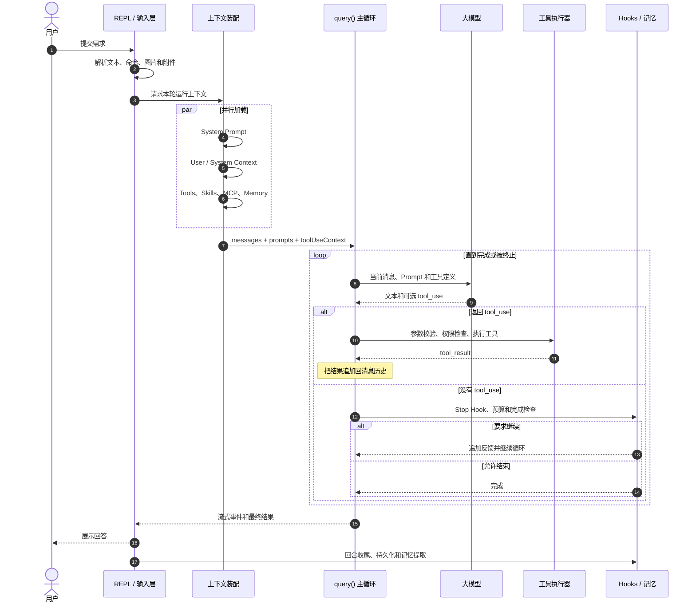

读图时要抓住中间的 `loop`：一次用户输入可以对应多次模型调用和多次工具执行。模型负责提出行动，运行时负责执行和把真实结果送回模型。

### 机制拆解

#### 1. 输入接入和预处理

交互层先区分不同类型的输入：

- 普通自然语言会进入模型处理流程；
- slash command 可能在本地直接执行，也可能展开成一段新的 Prompt；
- Bash 模式可以直接执行本地命令；
- 图片、粘贴内容和 IDE 选择会被转换为结构化消息内容；
- 某些立即执行命令可以绕开正在运行的 Query Queue。

这一步解决的是“用户输入是什么”，还没有解决“用户真正想完成什么”。前者是确定性解析，后者主要由模型进行语义理解。

#### 2. 本轮上下文装配

进入模型前，系统会准备几组不同职责的上下文：

- `systemPrompt`：Agent 身份、行为规则、工具使用规范和全局约束；
- `userContext`：项目说明、用户配置、工作目录等用户侧上下文；
- `systemContext`：当前运行状态和系统侧补充信息；
- `toolUseContext`：工具集合、权限、AbortController、文件读取状态、Agent 定义等运行时对象；
- `messages`：当前有效的对话历史、工具调用和工具结果。

这些内容不是简单拼成一个字符串，而是保持不同层次和生命周期，在真正发请求前再组合。

#### 3. 进入 Agent Loop

`query()` 内部维护一个跨迭代 `State`，保存消息、工具上下文、压缩状态、轮数、恢复状态和 Stop Hook 状态。它使用 `while (true)` 推进，而不是递归调用自身。

这样设计的好处是：工具执行、上下文压缩、API fallback、Prompt 过长恢复和 Stop Hook 阻塞都可以表示为明确的状态迁移，系统也能知道“上一轮为什么继续”。

#### 4. 模型与工具形成闭环

模型收到的不是工具执行结果以外的隐藏状态，而是包含完整工具定义的请求。模型返回 `tool_use` 后，运行时才真正执行工具。工具结果再次作为消息交给模型，让模型基于真实结果继续推理。

```text
用户请求
  -> 模型判断下一步
  -> tool_use
  -> 运行时执行工具
  -> tool_result
  -> 模型继续判断
  -> 最终答案
```

这也是 Agent 与普通聊天机器人的核心区别：模型不只生成答案，还能通过环境反馈不断修正下一步行动。

#### 5. 完成并不只由模型一句话决定

模型不再返回工具调用后，系统还要检查：

- Stop Hook 是否允许结束；
- Token Budget 是否要求继续；
- 是否存在可恢复的上下文过长或输出截断；
- 是否达到最大轮数；
- 是否被用户中止；
- 是否需要进行长期记忆提取和回合收尾。

因此，最终完成是“模型停止行动意图”和“运行时满足结束条件”的共同结果。

### 面试时应强调

不要把调用链描述成固定工作流。固定的是运行协议，具体经过几轮、调用哪些工具、是否创建子 Agent，是模型根据当前状态动态决定的。

### 主要代码位置

- `cc-haha/src/screens/REPL.tsx`：输入提交、上下文准备、消费 Query 流式事件
- `cc-haha/src/utils/processUserInput/processUserInput.ts`：输入解析与命令路由
- `cc-haha/src/query.ts`：Agent 主循环、模型调用、工具回灌与结束判断
- `cc-haha/src/services/tools/toolExecution.ts`：单个工具执行流程
- `cc-haha/src/query/stopHooks.ts`：停止阶段的 Hook 处理

---

## 2. 用户输入一个需求之后，Agent 如何理解用户意图，并行任务如何拆解？

### 面试回答

这套系统没有为所有用户请求建立一个独立、固定的通用意图分类器。它采用的是模型驱动的语义理解：把用户请求、系统规则、当前项目上下文、可用工具、Skills 元数据和 Agent 定义共同提供给主模型，由主模型判断用户目标、约束条件以及下一步行动。

任务拆解同样不是一个硬编码算法自动生成 DAG，而是由模型在 Task 和 Agent 协议约束下完成。对于较复杂的需求，模型可以创建多个 Task，给 Task 设置 `blocks`、`blockedBy` 和状态；也可以通过 Agent Tool 把独立子问题分配给子 Agent。系统 Prompt 会告诉模型：相互独立、不会修改同一状态的工作适合并行；存在数据依赖、共享写入或前一步结果决定后一步输入的任务应该串行。

因此，可以把它理解为两层：模型负责“语义拆解”，运行时负责“执行约束”。模型判断哪些工作可以独立进行，并在一次回复中产生多个 Agent 或工具调用；运行时根据并发安全属性、任务依赖、权限和共享状态，决定这些调用是否真的可以同时运行。

### 流程图：意图理解与任务拆解

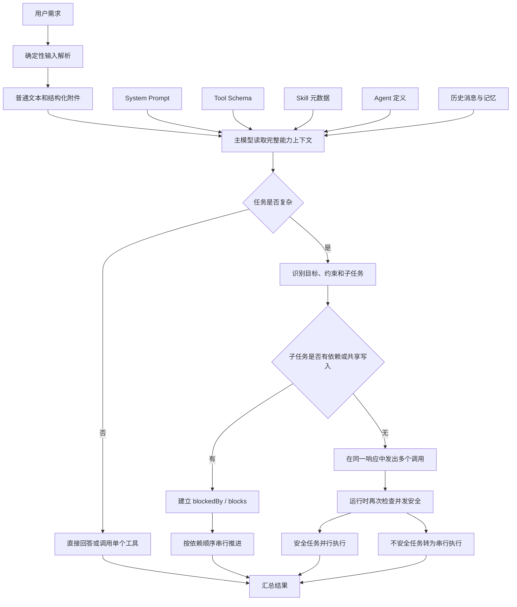

左半部分表示语义理解所依赖的信息，右半部分表示拆解结果如何落到依赖和并发。模型做语义判断，运行时不重新理解需求，而是执行结构化约束。

### 机制拆解

#### 1. 确定性输入解析不等于意图理解

输入处理模块能够识别命令、文件、图片和文本边界，但它不会把任意自然语言映射成一组预定义 Intent。真正的目标识别发生在模型读取完整上下文之后。

这种方式比固定意图分类更灵活，适合开放式编程任务；代价是行为不是完全确定的，因此需要通过 Prompt、工具 Schema、权限和运行时验证来收敛模型行为。

#### 2. 模型根据“能力说明”选择拆解方式

模型看到的不只有工具名称，还包括：

- Tool 的用途、输入 Schema 和限制；
- Skill 的名称、描述和使用时机；
- 可用子 Agent 的类型及 `whenToUse`；
- Task 工具如何描述依赖和完成状态；
- System Prompt 对并发、探索和验证的规则。

这些说明共同构成了模型的行动空间。所谓意图理解，不只是给请求贴一个标签，而是把请求映射为目标、约束、可用能力和下一步动作。

#### 3. 任务拆解通常包含四个判断

模型需要判断：

1. 任务是否复杂到值得显式拆分；
2. 子任务之间是否存在输入输出依赖；
3. 子任务是否会修改同一文件、状态或外部资源；
4. 子任务的结果是只需汇总，还是会决定后续路线。

例如，“分别调查三个互不依赖的模块”适合并行；“先定位接口，再根据接口修改调用方”存在依赖，更适合串行；“多个 Agent 同时修改同一文件”即使语义上独立，也可能因为共享写入而不适合并行。

#### 4. 并行有两个不同层次

- **语义并行**：主模型在一条 Assistant Message 中发出多个 Agent/Tool 调用，表达这些任务可以同时进行。
- **运行时并行**：执行器检查工具的 `isConcurrencySafe`，安全调用并行运行，存在副作用的调用串行运行。

面试中要把这两者区分开。模型认为“可以并行”不代表系统会不加检查地并发执行。

#### 5. 子 Agent 是上下文隔离，不只是并发线程

子 Agent 的价值不仅是提高速度。它还能把大量局部探索和工具输出放在独立上下文中，最后只把结论返回主线程，从而减少主上下文噪声。即使某些子任务最终串行执行，使用子 Agent 仍然可能有上下文隔离价值。

### 面试时应强调

这不是“规则系统负责理解意图，模型只负责生成”的架构。更准确的说法是：模型承担开放语义理解和任务规划，运行时通过结构化协议、安全约束和状态管理保证执行可控。

### 主要代码位置

- `cc-haha/src/utils/processUserInput/processUserInput.ts`：确定性输入解析
- `cc-haha/src/tools/TaskCreateTool/prompt.ts`：何时创建任务及任务字段说明
- `cc-haha/src/tools/TaskUpdateTool/TaskUpdateTool.ts`：任务状态和依赖持久化
- `cc-haha/src/tools/AgentTool/prompt.ts`：子 Agent 选择、并行与上下文隔离规则
- `cc-haha/src/tools/AgentTool/AgentTool.tsx`：Agent 调用 Schema 和分派入口

---

## 3. 任务拆解后，Agent 如何决定先做什么、后做什么？什么时候调用模型，什么时候调用工具？

### 面试回答

这套系统把决策分成“语义决策”和“运行时调度”两层。

语义层由模型负责。模型根据用户目标、当前任务状态、已有工具结果和依赖关系，决定下一步是继续分析、调用工具、创建子任务、询问用户，还是给出最终答案。模型请求中的 `toolChoice` 默认不是强制指定某个工具，所以模型保留直接回答或选择工具的能力。

运行时层负责执行模型已经表达出来的动作。模型返回 `tool_use`，系统就验证参数、检查权限并执行工具；模型没有返回 `tool_use`，系统就进入完成检查。多个工具调用到达执行器后，并发安全的调用可以成批并行，具有副作用或无法确认安全性的调用会被串行执行。工具结果按协议回灌给模型，再由模型决定后续步骤。

所以，“先做什么”主要由任务依赖和模型判断决定；“能不能同时做”和“是否允许执行”由运行时决定；“是否还要继续”则由模型输出与 Stop Hook、轮数和预算共同决定。

### 流程图：模型决策与工具调度的边界

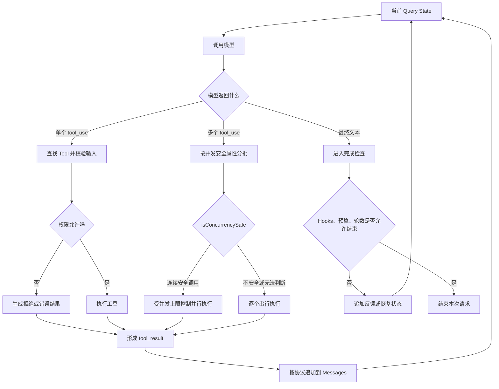

这张图把三个容易混淆的决定分开了：模型决定“想调用什么”，权限系统决定“允不允许”，执行器决定“怎样安全执行”。

### 机制拆解

#### 1. 为什么每一轮通常先调用模型

开放式任务无法仅靠固定流程知道下一步。系统先让模型阅读当前状态，由模型输出文本或工具调用。如果工具执行产生了新事实，系统必须再次调用模型，因为只有模型能结合新结果重新规划。

因此，一个回合中可能出现多次模型调用：

```text
模型调用 1：决定读取配置
工具调用：Read
模型调用 2：发现需要搜索引用
工具调用：Grep
模型调用 3：形成修改方案
工具调用：Edit
模型调用 4：检查结果并生成最终回答
```

#### 2. 什么时候应调用工具

从架构角度看，只要下一步依赖模型上下文之外的真实状态，就应该通过工具获得事实或执行动作，例如：

- 读取未进入上下文的文件；
- 搜索代码引用；
- 运行测试或命令；
- 修改文件；
- 查询 MCP 或外部服务；
- 启动子 Agent。

模型可以基于已有上下文做推理，但不能把推测当作环境事实。Tool 的作用是让 Agent 观察和改变真实世界。

#### 3. 依赖关系决定业务顺序

如果 B 的输入来自 A 的输出，A 必须先完成。如果多个任务只需要在最后汇总，没有共享写状态，它们可以并行。Task 系统通过 `blockedBy` 和 `blocks` 显式保存这种依赖，模型也可以在每次工具结果回来后重新评估计划。

这是一种动态规划，而不是一开始生成计划后机械执行到底。新证据可能让后续步骤失效，因此模型需要有重规划能力。

#### 4. 并发安全决定物理执行顺序

执行器会读取 Tool 的 `isConcurrencySafe`：

- Read、Search 等只读操作通常可以并发；
- Edit、Write 或状态变更操作通常需要独占执行；
- 参数无法通过 Schema 校验，或者安全判断抛出异常时，会保守地按不安全处理；
- 即使并发执行，结果仍按原始工具调用顺序输出，保证消息协议稳定。

这是一个重要的工程点：LLM 负责提出并行意图，但并发正确性不能只依赖 LLM。

#### 5. 完成判断也是一种调度

模型没有请求工具，不一定立即结束。Stop Hook 可以阻止完成并追加反馈，让模型继续；Token Budget 也可以要求继续；上下文过长可能触发 Compact 后重试；达到最大轮数则必须停止。

因此，调度器管理的不只是工具先后顺序，还包括恢复、继续和终止。

### 面试时应强调

不要回答成“大模型决定一切”，也不要回答成“框架预先编排好一切”。更准确的是：模型负责高层语义决策，框架负责权限、安全、并发、状态和生命周期。

### 主要代码位置

- `cc-haha/src/query.ts`：模型调用、`tool_use` 判断、继续与完成逻辑
- `cc-haha/src/services/tools/toolOrchestration.ts`：工具调用分批、并行与串行执行
- `cc-haha/src/services/tools/StreamingToolExecutor.ts`：流式工具并发控制和有序输出
- `cc-haha/src/Tool.ts`：Tool 接口、并发安全和权限相关能力
- `cc-haha/src/tools/TaskUpdateTool/TaskUpdateTool.ts`：任务依赖状态

---

## 4. 用户输入进来后，系统如何匹配 Skill？

### 面试回答

Skill 匹配采用“确定性发现 + 模型语义选择 + 调用时完整加载”的组合方式。

系统首先从 managed、user、project、plugin、bundled 和 MCP 等来源发现 Skills。发现阶段主要解析 `SKILL.md` 的 frontmatter，例如 `name`、`description`、`whenToUse`、`allowedTools`、`context` 和模型配置，不把所有 Skill 正文都塞进上下文。

随后，系统在 Skill Tool 的说明中向模型提供一个经过预算控制的 Skill 列表。模型根据用户请求和 Skill 的名称、描述、使用条件判断是否调用某个 Skill。模型发出 Skill Tool 后，运行时再次校验 Skill 名称、调用来源和是否允许模型自动调用，只有通过校验才展开完整 `SKILL.md` 正文，执行参数替换、权限设置，并以内联或 fork 方式运行。

除此之外，显式 `/skill-name` 不需要模型做语义匹配，可以直接确定性命中；某些路径条件和动态目录发现也可以激活特定 Skill。因此它不是单一向量搜索，而是多种匹配入口共同工作。

### 流程图：Skill 发现、匹配与加载

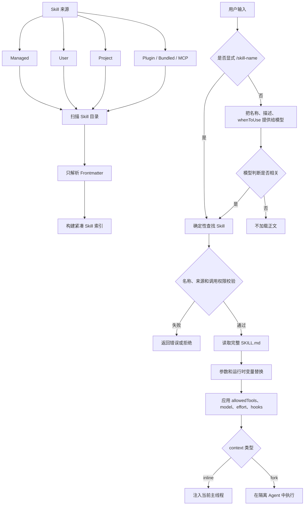

关键点是 `Frontmatter -> 选择 -> 完整正文` 三段式加载。未命中的 Skill 正文不会进入本轮上下文。

### 机制拆解

#### 1. Skill 发现阶段只加载元数据

如果系统有几十或上百个 Skills，把所有正文放进 System Prompt 会迅速消耗上下文，并让模型难以区分真正相关的能力。因此启动阶段优先读取 frontmatter，构建紧凑索引。

这一步解决的是“有哪些 Skill 可以用”，不是“现在一定要用哪一个”。

#### 2. 元数据质量决定语义匹配质量

模型主要依据以下信息进行判断：

- `name`：稳定标识；
- `description`：Skill 做什么；
- `whenToUse`：什么场景、哪些触发语句适合使用；
- 是否允许模型调用；
- 当前上下文中是否存在更直接的工具或命令。

如果描述过于宽泛，容易误触发；描述缺少场景和反例，则容易漏触发。正文写得再好，如果元数据没有让模型选中，也不会发挥作用。

#### 3. Skill 调用后才加载完整正文

当 Skill 被选中，系统才读取和展开正文，完成：

- 参数替换；
- `${CLAUDE_SKILL_DIR}` 等运行时变量替换；
- `allowedTools` 权限作用域设置；
- model、effort 和 hooks 配置；
- inline 或 fork 执行方式选择；
- 本地 Skill 中受控脚本的执行。

这就是渐进披露：先用低成本元数据路由，再为命中的 Skill 支付完整上下文成本。

#### 4. 三种典型匹配方式

1. **模型语义匹配**：模型根据元数据主动调用；
2. **用户显式调用**：用户输入 `/skill-name`，确定性执行；
3. **环境触发**：路径规则或运行中发现的 Skill 目录使能力进入可用范围。

#### 5. 当前源码的能力边界

本源码快照中的实验性 `skillSearch/localSearch.ts` 和 `skillSearch/prefetch.ts` 是 generated stub。因此可以确认的核心机制是“元数据进入 Prompt 后由模型选择”，不能仅依据这份源码宣称系统已经实现完整的向量化 Skill 检索或远程语义搜索。

### 面试时应强调

Skill 匹配不是只看关键词，也不是每次加载全部 Skill。它本质上是一个受上下文预算约束的两阶段路由：先发现和展示元数据，再按模型选择加载正文。

### 主要代码位置

- `cc-haha/src/skills/loadSkillsDir.ts`：Skill 来源、frontmatter 解析和完整正文加载
- `cc-haha/src/tools/SkillTool/prompt.ts`：Skill 列表预算和模型选择说明
- `cc-haha/src/tools/SkillTool/SkillTool.ts`：调用校验、Skill 展开与执行
- `cc-haha/src/services/skillSearch/localSearch.ts`：当前快照中的实验性搜索 stub
- `cc-haha/src/utils/attachments.ts`：运行中动态发现 Skill 后的上下文注入

---

## 5. Skill 分层体系如何设计？为什么要这样分层？不同层级的职责边界是什么？

### 面试回答

Skill 分层不能只按目录层级理解。源码中至少可以看到三条相互独立的分层轴：来源治理层、内容披露层和执行隔离层。

来源治理层解决“Skill 从哪里来、作用域多大、谁能够覆盖谁”。例如 managed Skill 由组织治理，user Skill 跨项目复用，project Skill 只服务当前项目，plugin 和 bundled Skill 随产品分发，MCP Skill 来自外部连接。

内容披露层解决“多少信息应该在什么时候进入上下文”。Frontmatter 负责发现和路由；`SKILL.md` 正文负责目标、步骤、约束和成功条件；references/assets 提供按需资料和模板；scripts 把需要确定性和可重复性的步骤变成可执行程序。

执行隔离层解决“Skill 应该在哪里运行以及拥有多大权限”。简单 Skill 可以 inline 注入当前主线程；复杂、输出量大或可独立完成的 Skill 可以 fork 到子 Agent；`allowedTools`、model、effort 和 hooks 进一步限定执行环境。

这样分层的核心原因是控制上下文成本、提高触发准确性、隔离副作用并支持不同治理范围。每一层只解决一个问题，避免把发现、说明、执行和权限全部耦合进一个巨大的 Prompt 文件。

### 分层图：Skill 的三条职责轴

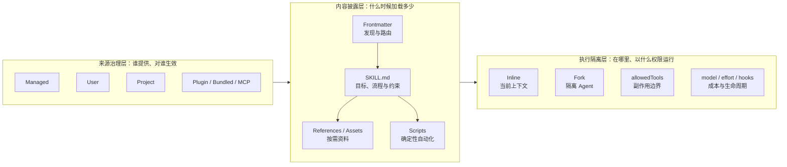

这三条轴不能合并为一个简单的父子目录树：同一个 Project Skill 仍然可以采用 Frontmatter 渐进披露，并选择 Inline 或 Fork 执行。

### 机制拆解

#### 1. 来源治理层

| 来源 | 主要职责 |
| --- | --- |
| Managed | 组织统一下发和治理，适合安全政策与标准流程 |
| User | 用户级复用，不依赖单一项目 |
| Project | 项目专属流程、约束和知识 |
| Plugin | 随插件能力一起安装和升级 |
| Bundled | 产品内置的官方能力 |
| MCP | 外部服务通过连接暴露的能力 |

这层主要处理作用域、优先级、去重、覆盖和信任边界，不负责具体执行步骤。

#### 2. 内容披露层

| 组成 | 职责边界 |
| --- | --- |
| Frontmatter | 告诉模型“这是什么、什么时候用”，用于发现和路由 |
| `SKILL.md` 正文 | 告诉模型“命中后应该怎样完成任务” |
| References | 保存详细规范、API 说明和领域知识，按需阅读 |
| Assets | 保存输出模板、素材和可复用资源 |
| Scripts | 执行确定性强、重复性高、模型不应临场重写的操作 |

这层遵循 Progressive Disclosure。入口应该短而准确，细节只在任务真正需要时加载。

#### 3. 执行隔离层

- **Inline Skill**：直接进入当前上下文，适合步骤短、需要与用户频繁互动的任务；
- **Fork Skill**：交给隔离 Agent，适合独立、耗时、工具输出多的任务；
- **Allowed Tools**：限制 Skill 可以产生的副作用；
- **Model/Effort**：根据任务难度控制推理成本；
- **Hooks**：在执行前后增加验证、审批或收尾逻辑。

#### 4. Skill、Prompt、Tool、Agent 的边界

- Prompt 定义全局长期有效的行为规则；
- Skill 封装可重复任务的触发条件、流程与领域约束；
- Tool 是具有明确输入输出的原子执行接口；
- Agent 是拥有独立上下文、工具和生命周期的执行主体；
- MCP 是外部能力和资源的连接协议。

Skill 不应该复制 Tool 的底层实现，也不应该把所有全局规则都包进去。它更像能力编排层：告诉 Agent 在特定场景下如何组合知识、工具和检查步骤。

#### 5. 为什么分层能提高稳定性

如果不分层，会出现几个典型问题：

- 全部 Skill 正文常驻 Prompt，导致上下文膨胀和注意力竞争；
- 描述和执行逻辑混在一起，触发条件难以评估；
- 自动化步骤全靠模型临场生成，结果不稳定；
- 权限范围过宽，一个文档同时承担路由和副作用；
- 复杂 Skill 污染主 Agent 上下文，影响后续任务。

分层后，各层可以单独测试：元数据测试触发率，正文测试任务成功率，脚本测试确定性，权限测试安全边界。

### 面试时应强调

“Skill 分层”不是简单把一个大 Markdown 拆成几个小文件，而是把发现、知识、流程、执行和治理分成不同生命周期与责任边界。

### 主要代码位置

- `cc-haha/src/skills/loadSkillsDir.ts`：来源治理和 Skill 文件结构
- `cc-haha/src/skills/bundledSkills.ts`：Bundled Skill 的提取与加载
- `cc-haha/src/tools/SkillTool/prompt.ts`：元数据层和上下文预算
- `cc-haha/src/tools/SkillTool/SkillTool.ts`：inline/fork、权限、模型与执行配置
- `cc-haha/src/tools/AgentTool/prompt.ts`：fork 的上下文隔离原则

---

## 6. 有没有 Skill 沉淀机制？Skill 是系统自动沉淀，还是只能用户手动构造？

### 面试回答

源码中存在 Skill 沉淀机制，但它不是完全无人值守的自动学习系统，而是“模型辅助提炼 + 用户控制落盘”的人机协作流程。

第一条路径是 `/skillify`。用户在完成一个真实任务后主动调用它，系统会读取本次会话的用户消息和 Session Memory，识别其中可复用的流程，并通过访谈补齐 Skill 名称、触发场景、步骤、工具权限、Agent 使用方式以及 inline/fork 选择。模型生成完整 `SKILL.md` 后，必须先展示给用户审阅，得到确认才能写入。

第二条路径是 Skill Improvement。系统在项目 Skill 被使用期间，每累计五个用户回合，可以调用一个较小模型分析用户的修正、偏好和新增要求，形成结构化更新建议。建议先展示给用户；用户接受后，侧路模型才会重写项目中的 `SKILL.md`，用户拒绝则不修改。

因此，Skill 既不是只能手写，也不是系统每轮自动创建和发布。更准确的说法是：系统可以自动发现可复用模式、生成草稿和提出改进，但创建、更新和持久化具有明确的人类审批门槛。

### 流程图：Skill 的创建与增量改进

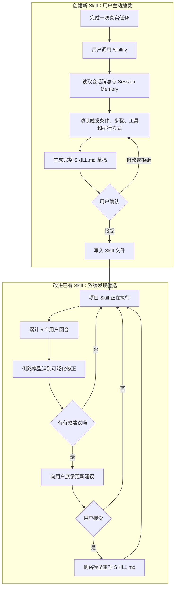

两条路径都保留了人工控制点。系统自动完成的是分析和起草，不是未经授权的永久能力发布。

### 机制拆解

#### 1. 为什么不能每轮自动生成 Skill

一次性任务、偶然偏好和临时环境问题并不一定值得成为长期能力。如果系统从每次对话中自动创建 Skill，会快速产生：

- 大量只使用一次的伪 Skill；
- 触发描述互相重叠；
- 临时解决方案固化为错误规范；
- 未经审查的脚本和权限配置；
- 后续维护和评估成本。

所以 Skill 沉淀需要“重复价值”和“行为稳定性”两个判断，而用户审批是最直接的质量门槛。

#### 2. `/skillify` 是从真实任务反推能力

它不是让用户从空白开始写规范，而是基于已经成功执行的会话提炼：

- 用户真正想解决的问题；
- 实际采用的步骤和顺序；
- 哪些步骤可以并行；
- 使用过哪些工具；
- 哪些地方需要用户确认；
- 每一步的成功标准；
- 未来什么输入应该触发这个 Skill。

这种方式比脱离任务凭空设计 Skill 更可靠，因为输入来自真实执行轨迹。

#### 3. Skill Improvement 是增量演化

它关注的是用户在 Skill 执行过程中出现的可泛化反馈，例如：

- “以后这一阶段也要询问 X”；
- “不要再使用 Y 方法”；
- “这个项目始终先执行 Z 检查”；
- “这一步应改成并行”。

系统忽略一次性回答和闲聊，只把可能影响未来执行的变化作为候选建议。即使检测自动发生，修改仍要经用户同意。

#### 4. 自动沉淀的合理完整生命周期

从工程角度，一个成熟的 Skill 沉淀流程应该包括：

```text
真实任务完成
  -> 识别重复模式
  -> 生成 Skill 草稿
  -> 用户审阅
  -> 保存
  -> 用代表性任务评估
  -> 运行中收集修正
  -> 提议增量更新
  -> 再次审批
```

当前源码覆盖了提炼、建议和审批修改，但没有表现出一个完全自治、自动发布、自动回滚和全量评测的 Skill 平台。

#### 5. 功能开关边界

`/skillify` 在当前源码中受 `USER_TYPE === 'ant'` 限制，并且设置了 `disableModelInvocation: true`，表示只能由用户显式调用。Skill Improvement 也受 Feature Gate 控制。面试时不应把实验性能力描述成所有构建默认具备的公共功能。

### 面试时应强调

Skill 沉淀的重点不是“让模型自动写 Markdown”，而是把真实任务经验转化为可触发、可执行、可评估、可维护的能力资产。自动生成容易，质量治理才是关键。

### 主要代码位置

- `cc-haha/src/skills/bundled/skillify.ts`：从会话提炼 Skill、访谈和确认流程
- `cc-haha/src/utils/hooks/skillImprovement.ts`：定期分析改进建议和执行改写
- `cc-haha/src/hooks/useSkillImprovementSurvey.ts`：用户接受或拒绝更新
- `cc-haha/src/skills/bundled/index.ts`：Bundled Skill 注册入口

---

## 7. 长短期记忆如何设计？短期记忆和长期记忆分别保存什么？

### 面试回答

这套系统的记忆不是简单分成“内存数据库”和“向量数据库”，而是按信息生命周期分为工作上下文、会话摘要和跨会话长期记忆。

最短期的是当前 Query State 和 Messages。它保存当前对话中的用户消息、模型回复、工具调用、工具结果、附件以及当前轮执行状态，是模型继续推理的直接工作记忆。随着会话变长，系统会通过 Snip、Microcompact 和 Auto Compact 压缩旧内容，保留完成当前任务仍然需要的状态。

中间层是 Session Memory。它把长会话中仍需延续的任务目标、当前进度、涉及文件、有效工作流和错误经验整理成结构化 Markdown。它的主要目标是帮助当前会话跨越上下文压缩继续工作，并不等同于跨会话永久知识。

长期记忆使用文件式 Memdir，主要保存未来会话仍有价值、并且无法轻易从代码和 Git 重新推导的信息。源码把它分为 `user`、`feedback`、`project` 和 `reference` 四类，例如用户角色与偏好、用户对工作方式的纠正、项目的非代码背景，以及外部系统参考信息。代码结构、Git 历史、临时任务状态和已经写在 CLAUDE.md 中的内容不应该重复保存。

### 分层图：三种时间尺度的记忆

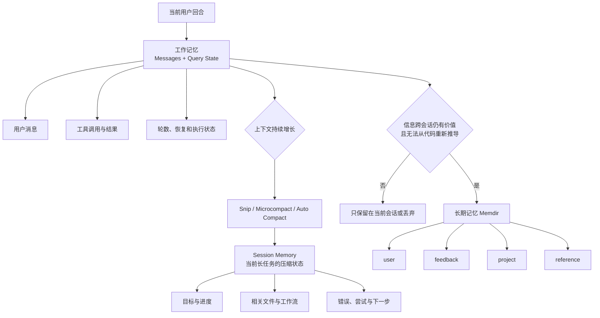

这张图体现的是信息生命周期，而不是数据库类型。相同的 Markdown 存储形式，也可能因为用途不同而属于不同记忆层。

### 机制拆解

#### 1. 工作记忆：当前 Messages 与 Query State

它主要保存：

- 当前对话消息；
- 模型生成的工具调用；
- 工具返回结果；
- 当前轮数和继续原因；
- 文件读取状态和去重信息；
- Compact、恢复和 Stop Hook 状态。

这一层更新频繁、与当前执行强相关，生命周期通常不超过当前会话。

#### 2. Session Memory：对长会话的任务级压缩

Session Memory 关注“怎样继续完成眼前的任务”，典型内容包括：

- 当前任务说明；
- 已完成和待完成事项；
- 当前工作状态；
- 已修改或重点关注的文件；
- 已验证的工作流程；
- 遇到的错误和无效尝试；
- 下一步建议。

它比原始消息更紧凑，但仍然偏向当前任务，不应该把所有内容升级为长期记忆。

#### 3. 长期记忆：跨会话仍有价值的信息

源码定义了四种类型：

| 类型 | 保存内容 |
| --- | --- |
| `user` | 用户角色、知识背景、职责和沟通偏好 |
| `feedback` | 用户确认或纠正过的工作方式，以及背后的原因 |
| `project` | 代码中无法直接推导的项目目标、协作背景、事件和时间约束 |
| `reference` | 外部系统、服务或资源的稳定参考信息 |

长期记忆不是活动日志，也不是把整段会话永久存档。它应该是压缩后的可复用知识。

#### 4. 为什么代码事实通常不进入长期记忆

代码、Git 和项目文档是更权威的数据源。如果把函数位置、当前架构或最近修改重复写入长期记忆，一旦代码变化就会产生陈旧副本。Agent 下次应优先重新读取真实项目状态，而不是相信可能过时的记忆。

#### 5. Task、Plan 和 Memory 不能混为一谈

- Task/Plan 负责当前工作如何推进；
- Session Memory 负责当前长会话如何连续；
- Long-term Memory 负责未来会话如何复用稳定信息。

如果把临时任务状态写进长期记忆，记忆库会迅速膨胀，并在未来召回已经失效的状态。

### 面试时应强调

区分长短期记忆的关键不是存储介质，而是信息的有效期、权威来源和未来复用价值。

### 主要代码位置

- `cc-haha/src/query.ts`：当前 Query State 和 Messages 生命周期
- `cc-haha/src/services/sessionMemory/`：Session Memory 生成、更新和预算控制
- `cc-haha/src/memdir/memoryTypes.ts`：长期记忆类型及不应保存的内容
- `cc-haha/src/memdir/memdir.ts`：长期记忆目录、写入规则和索引说明
- `cc-haha/src/memdir/paths.ts`：项目和 Agent 记忆路径作用域

---

## 8. 为什么要把长期记忆分成静态长期记忆和动态长期记忆？

### 面试回答

严格按照源码术语，这里不是两个完全独立的长期记忆系统，而是同一套文件式长期记忆的两种读取和注入路径：稳定索引加载与相关主题动态召回。

稳定部分是 `MEMORY.md`。它不是保存所有记忆正文，而是作为长期记忆的入口索引，记录有哪些主题文件、各自包含什么内容。这个索引有 200 行和 25KB 上限，可以在构建上下文时稳定加载，让模型始终知道“有哪些长期知识可能存在”。

动态部分是 Topic Memory。每个用户回合根据当前请求扫描记忆文件的元数据，再由一个选择模型挑选最多五个确定相关的主题文件，把这些文件正文作为运行时附件注入当前上下文。不相关的 Topic 不会进入本轮 Prompt。

这种设计同时解决了可发现性和上下文成本问题：只加载索引会缺少细节，加载所有正文又会产生严重噪声；先加载稳定索引，再按当前请求召回少量正文，可以在信息完整性、Token 成本、Prompt 缓存和注意力质量之间取得平衡。

### 流程图：稳定索引与动态 Topic 召回

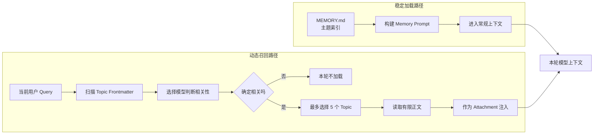

索引回答“系统可能知道什么”，动态正文回答“当前问题具体需要知道什么”。

### 机制拆解

#### 1. 稳定索引承担导航，而不是正文存储

`MEMORY.md` 更像目录：

- 告诉模型有哪些记忆主题；
- 提供每个 Topic 的一句话概览；
- 指向具体文件；
- 保持体积稳定；
- 允许模型在需要时继续主动读取。

把入口限制在 200 行和 25KB，是为了防止索引自身逐渐变成另一个大正文文件。

#### 2. 动态召回承担当前请求需要的细节

Topic 文件可以保存更完整的背景、偏好和规则。召回阶段先只看文件名、description、type 等元数据，不立即读取全部正文。选择完成后，才加载少量命中文件。

这和 Skill 的渐进披露思想一致：入口负责路由，正文按需加载。

#### 3. 为什么不只做动态召回

完全依赖动态检索会有几个问题：

- 模型不知道记忆系统的整体范围；
- 召回模型可能因为用户表达不同而漏检；
- 稳定的高层用户信息可能每轮都需要；
- 缺少统一索引会让文件难以治理和整理。

稳定索引提供了全局地图和最低限度背景。

#### 4. 为什么不直接加载全部长期记忆

全量加载会导致：

- Token 成本持续增加；
- 无关偏好和历史信息干扰当前判断；
- 互相冲突或过期的信息同时进入上下文；
- System Prompt 缓存频繁失效；
- 真正关键的信息在大量文本中被稀释。

#### 5. “静态”和“动态”描述的准确边界

所谓静态，不表示内容永远不更新，而是指它作为稳定入口被常规装配；所谓动态，不表示数据存储在易失内存，而是指正文是否根据当前请求按需注入。

### 面试时应强调

最好说“长期记忆采用静态索引和动态主题召回两阶段读取”，而不是说“系统有两个彼此独立的长期记忆库”。

### 主要代码位置

- `cc-haha/src/memdir/memdir.ts`：`MEMORY.md` 构建、读取及 200 行/25KB 上限
- `cc-haha/src/memdir/findRelevantMemories.ts`：按当前 Query 选择相关 Topic
- `cc-haha/src/memdir/memoryScan.ts`：扫描记忆文件元数据
- `cc-haha/src/utils/attachments.ts`：读取命中正文并作为附件注入
- `cc-haha/src/query.ts`：每个用户回合启动记忆预取并消费结果

---

## 9. 每一轮都触发长期记忆存储，会不会导致记忆快速膨胀？如何处理？

### 面试回答

如果把每轮原始对话直接写入长期记忆，记忆一定会快速膨胀，而且大部分内容没有跨会话价值。源码虽然允许按较短间隔触发记忆提取，但“触发提取”不等于“每轮创建新记忆”。系统通过写入门控、增量游标、去重更新、索引上限、召回预算和后台整合共同治理增长。

首先，提取器只处理尚未分析的新消息；如果没有合格的新回合就跳过。如果主 Agent 在当前区间已经主动写过记忆，自动提取可以直接跳过并推进游标，避免同一事实被重复保存。并发到来的提取请求会合并，而不是启动多次重复工作。

其次，提取 Prompt 明确要求先检查现有记忆：已有主题应该更新原文件，错误或过期信息应修改或移除，不能为相同事实创建重复文件。`MEMORY.md` 本身还有 200 行和 25KB 上限，迫使系统保持索引简洁。

最后，AutoDream 会在满足时间和会话数量条件后进行后台整合，合并重复主题、清除矛盾和陈旧内容、精炼正文并压缩索引。即便写入层仍然产生增长，召回层还有数量、文件大小和单会话总字节限制，避免记忆库大小直接转化为上下文污染。

### 流程图：长期记忆写入与治理管线

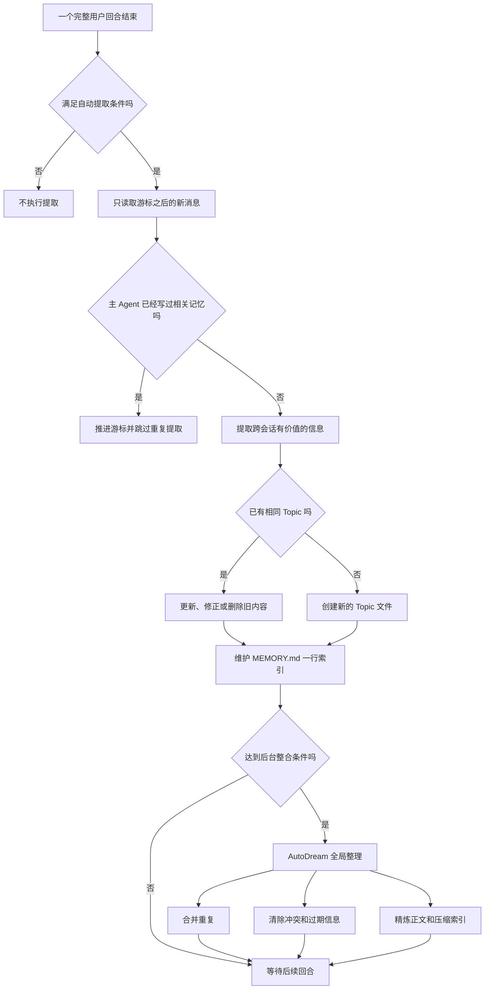

治理不是单一限流器，而是一条从“是否值得写”到“已有内容怎样演化”再到“后台怎样巩固”的完整管线。

### 机制拆解

#### 1. 写入前的触发门控

自动提取并不是无条件执行。系统会检查：

- 是否是主线程合适的 Query Source；
- Auto Memory 和相关 Feature Gate 是否开启；
- 是否积累了足够的 eligible turns；
- 是否存在尚未处理的新消息；
- 当前是否已经有提取任务运行；
- 主模型是否已经主动完成记忆写入。

这些检查先控制提取频率。

#### 2. 增量游标避免重复分析

系统记录上一次处理到哪里，下一次只分析新增消息，而不是重新扫描整段会话。即使本次没有生成新记忆，游标也需要合理推进，否则同一段消息会被反复送去提取。

#### 3. 更新优先于新增

记忆文件按语义主题组织，而不是按日期流水组织。遇到同一个用户偏好或项目背景时，应更新现有 Topic；新事实推翻旧事实时，应修正旧内容；信息不再有效时，应删除，而不是不断追加版本。

这种“主题状态”模型比“事件日志”更适合作为长期记忆。

#### 4. 索引和文件层的硬限制

- `MEMORY.md` 最多 200 行、25KB；
- 动态扫描只考虑有限数量的候选文件；
- 每次抽取只读取有限的最近回合；
- 召回每轮最多注入五个文件；
- 单个文件和单会话注入都有字节预算。

硬限制不能替代内容治理，但能防止最坏情况下无限占用模型上下文。

#### 5. AutoDream 进行二阶段整合

实时提取需要低延迟，很难同时进行全局整理。AutoDream 把较重的工作放到后台：

- 合并重复主题；
- 处理矛盾信息；
- 删除过期状态；
- 精炼措辞；
- 重新组织 Topic；
- 压缩 `MEMORY.md` 索引。

这是典型的“在线写入 + 离线巩固”架构。

#### 6. 存储膨胀和上下文膨胀要分别治理

即使磁盘上存在较多记忆，只要召回足够严格，也不一定污染上下文；反过来，即使文件数量少，若每轮全量注入，也会影响模型。因此系统分别控制：

- 存什么、是否重复；
- 文件如何合并和淘汰；
- 当前回合召回什么；
- 最终注入多少内容。

### 面试时应强调

避免记忆膨胀不能只靠“降低写入频率”。更完整的答案应该包含写入门控、语义去重、更新与删除、后台巩固和召回预算。

### 主要代码位置

- `cc-haha/src/services/extractMemories/extractMemories.ts`：提取门控、游标、跳过和合并逻辑
- `cc-haha/src/services/extractMemories/prompts.ts`：去重、更新和删除要求
- `cc-haha/src/services/autoDream/autoDream.ts`：后台整合触发条件
- `cc-haha/src/services/autoDream/consolidationPrompt.ts`：合并、清理和精炼规则
- `cc-haha/src/memdir/memdir.ts`：长期记忆索引大小限制

---

## 10. 大模型如何判断哪些长期记忆需要找回？如何避免找回导致上下文污染？

### 面试回答

长期记忆召回采用“轻量候选扫描、模型相关性选择、严格注入预算”的多阶段方式，而不是把用户 Query 与全部正文直接拼接。

每个有效用户回合开始时，系统可以异步启动记忆预取。它先扫描记忆文件的文件名和 frontmatter，只读取有限行数的元数据，并排除 `MEMORY.md`，因为入口索引已经通过其他路径加载。随后，一个独立选择模型根据当前用户请求、候选名称和描述，挑选最多五个“确定有帮助”的记忆；如果没有明确相关项，允许返回空列表。

选中后，系统才读取正文，并执行多重去重：已经在过去回合注入过、已经被 Read/Write/Edit 工具读取过，或当前上下文已经包含的文件不会再次注入。每个文件最多读取有限行数和字节数，单会话也有总注入预算。对于当前已经成功使用的工具，普通用法参考记忆会被降噪，但包含警告、陷阱和已知问题的记忆仍然可以召回。

这套机制的关键不是追求最高召回率，而是允许“不召回”。在 Agent 上下文中，错误召回会改变模型决策，因此 Precision 往往比 Recall 更重要。

### 流程图：长期记忆召回与防污染

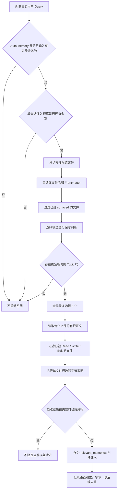

防污染依靠四道门：是否触发、选择是否足够相关、是否重复、最终注入是否超预算。

### 机制拆解

#### 1. 什么时候启动召回

系统会先检查：

- Auto Memory 和相关开关是否启用；
- 是否存在真实的非 Meta 用户消息；
- 用户输入是否包含足够语义，单词级输入会跳过；
- 当前会话累计注入是否已经达到上限；
- 当前 Query 是否被中止。

召回作为异步预取启动，不阻塞主模型的第一次响应。后续工具执行期间如果选择结果已经完成，系统再以零等待方式消费；未完成则不会为了记忆强行延迟主循环。

#### 2. 为什么初筛只看元数据

先读全部正文成本高，也会把无关内容暴露给召回模型。文件名、description、type 和前几行通常足以判断主题相关性。只有命中的候选才读取正文，实现两阶段检索。

#### 3. 选择器的保守规则

选择 Prompt 明确要求：

- 最多五个；
- 只有确定有用才选择；
- 不确定就不要选；
- 可以返回空；
- 避免选择当前已在使用工具的普通说明资料；
- 但保留警告、陷阱和已知问题类记忆。

这种规则专门针对上下文污染风险，而不是普通搜索引擎式的“尽可能多找一些”。

#### 4. 注入前进行跨通道去重

同一个文件可能通过长期记忆召回、FileRead、Edit 或过去回合附件进入上下文。系统使用 `readFileState` 和已注入路径集合统一过滤，避免相同正文重复占用 Token。

Compact 后旧附件离开当前有效消息视图，系统允许未来重新召回，因为压缩摘要不一定保留了完整细节。

#### 5. 数量和大小双重预算

- 每轮全局最多五个 Topic；
- 单文件最多读取有限行数；
- 单文件有字节上限；
- 超限时保留开头并提示原文件路径；
- 单会话有累计字节上限；
- 扫描候选文件数量也有上限。

限制数量控制主题噪声，限制大小控制单个 Topic 过长，二者缺一不可。

#### 6. 防污染还依赖记忆内容治理

召回算法无法完全修复错误记忆。因此写入阶段还要保存来源、原因和更新时间，更新冲突内容，并由 AutoDream 清理陈旧信息。召回时可以利用 mtime，让主模型意识到信息新旧程度。

### 面试时应强调

记忆召回应设计成一个可拒绝的选择器，而不是强制 Top-K。对于会影响 Agent 行动的长期记忆，宁可不召回，也不要把“关键词相似但语义无关”的内容注入上下文。

### 主要代码位置

- `cc-haha/src/memdir/findRelevantMemories.ts`：选择器 Prompt、最多五个和空结果策略
- `cc-haha/src/memdir/memoryScan.ts`：候选文件及 frontmatter 扫描
- `cc-haha/src/utils/attachments.ts`：触发条件、正文读取、大小限制和去重
- `cc-haha/src/query.ts`：每个用户回合启动预取、零等待消费和附件回灌

---

## 11. 动态 Prompt 和静态 Prompt 有什么区别？

### 面试回答

静态 Prompt 和动态 Prompt 的本质区别是信息的变化频率、适用范围以及装配时机。

静态 Prompt 保存跨任务稳定的规则，例如 Agent 身份、通用行为边界、工具使用原则、输出风格底线和安全约束。这些内容在多个回合中通常不变化，适合放在 Prompt 前部并参与 Provider Prompt Cache，从而减少重复计算和请求成本。

动态 Prompt 根据当前会话和运行状态生成，例如项目环境信息、Memory 索引、当前语言和 Output Style、MCP 连接说明、Session Guidance、Coordinator 或自定义 Agent Prompt。它们必须在运行时装配，因为不同目录、用户、连接状态和 Agent 会得到不同内容。

源码中已经明确把 System Prompt 分成 `Static content (cacheable)` 和 `Dynamic content (registry-managed)`，中间还可以插入缓存边界。但要注意，Dynamic Section 不等于每一轮都重新计算。很多动态 Section 会在会话范围内缓存；只有被标记为 volatile/uncached 的内容才会逐轮重新生成，因为任何前部内容变化都会破坏 Provider 的前缀缓存。

此外，System Prompt 之外还有 `userContext`、`systemContext` 和 Attachments。它们也是动态上下文，但不一定都应该塞进 System Prompt。成熟架构会按照信息权威性、生命周期和缓存需求选择不同注入通道。

### 流程图：Prompt 与动态上下文装配

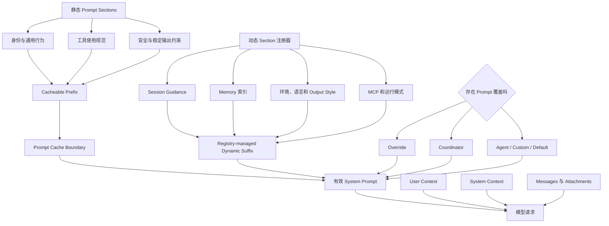

图中的 Cache Boundary 很关键：把稳定前缀和动态后缀分开，既允许运行时装配，又尽量保留 Provider Prompt Cache。

### 机制拆解

#### 1. 静态 Prompt 适合保存什么

- Agent 的长期身份和职责；
- 不随项目变化的行为规则；
- 通用工具使用原则；
- 安全和权限边界；
- 稳定的输出要求；
- 所有任务都应该遵守的约束。

静态内容应该尽量稳定。频繁变化的信息放在前部，会导致后续长 Prompt 无法命中缓存。

#### 2. 动态 Prompt 适合保存什么

- 当前工作目录和环境信息；
- 当前会话启用的 Skills；
- Memory 配置和入口索引；
- 当前语言、Output Style 和模型配置；
- MCP Server 当前提供的说明；
- Coordinator、Agent Definition 或用户自定义 Prompt；
- 只对当前状态有效的指导。

这些信息和当前运行实例相关，无法在构建时固定。

#### 3. Prompt 装配存在明确优先级

有效 System Prompt 不是简单累加。源码中的优先级大致是：

1. `overrideSystemPrompt` 完全替换其他 Prompt；
2. Coordinator Prompt；
3. 主线程 Agent Prompt；
4. 用户自定义 System Prompt；
5. Default System Prompt；
6. `appendSystemPrompt` 在允许时追加到末尾。

这保证不同运行模式不会同时注入互相冲突的身份定义。

#### 4. 动态内容为什么还要注册和缓存

动态 Section 通过注册器管理，可以明确：

- 该 Section 是否允许缓存；
- 在什么时机重新计算；
- 是否会破坏全局缓存边界；
- Feature Gate 变化后如何更新；
- 空结果是否应该省略。

如果所有动态信息每轮都重新拼接，哪怕只变化一个时间戳，也可能使后续数万 Token 的 Prompt Cache 失效。

#### 5. System Prompt 与动态上下文的边界

不是所有动态信息都应该写进 System Prompt：

- `userContext` 可以作为用户侧元上下文前置；
- `systemContext` 在真正调用模型前追加；
- Attachments 适合注入工具结果、相关记忆和本轮临时状态；
- Messages 保存对话和 Agent 行动轨迹。

分开这些通道可以让内容的来源和生命周期更清楚，也有利于 Compact 后重建。

#### 6. 动态 Prompt 的主要风险

- 把不可信外部文本提升为高权威指令，造成 Prompt Injection；
- 每轮装配过多无关信息，引发上下文污染；
- 动态内容顺序不稳定，破坏缓存；
- 不同 Prompt 来源互相覆盖；
- 已过期环境信息继续留在上下文。

因此动态 Prompt 需要来源标记、优先级、预算、转义/隔离和刷新策略。

### 面试时应强调

静态与动态不是“写死字符串”和“字符串模板”的简单区别。真正的区别是信息生命周期、权威级别、缓存策略和注入位置。

### 主要代码位置

- `cc-haha/src/constants/prompts.ts`：静态与动态 System Prompt Section 的组装边界
- `cc-haha/src/constants/systemPromptSections.ts`：Section 注册、缓存和 uncached 规则
- `cc-haha/src/utils/systemPrompt.ts`：Override、Coordinator、Agent、Custom、Default 的优先级
- `cc-haha/src/screens/REPL.tsx`：每轮并行加载 System/User/System Context
- `cc-haha/src/query.ts`：发送模型前组合 Prompt 和 Context
- `cc-haha/src/context.ts`：用户与项目上下文构建

---

## 面试总结：如何把 11 个问题串成一个完整架构

前面 11 个问题看起来分别属于运行循环、任务规划、Skill、Memory 和 Prompt，实际上它们共同回答的是一个更大的问题：

> 怎样把一个概率性的语言模型，组织成一个能够持续理解目标、调用真实能力、管理上下文、积累经验，并且可控地完成任务的 Agent 系统？

可以把完整架构概括为五层：

1. **Agent Runtime**：让一次用户输入能够持续运行，直到任务完成；
2. **Planning and Orchestration**：把自然语言目标转换成有依赖关系的行动；
3. **Capability System**：让 Agent 按需获得可复用流程和真实执行能力；
4. **Context and Memory**：决定当前模型应该看到什么，以及哪些信息值得跨会话保留；
5. **Harness and Governance**：约束模型行为，控制权限、成本、上下文和长期演化。

这五层不是五个互相独立的服务，而是围绕同一个 Query Loop 协同工作。Runtime 是纵向执行主干，另外四层不断为它提供决策、能力、上下文和控制。

### 总体架构图

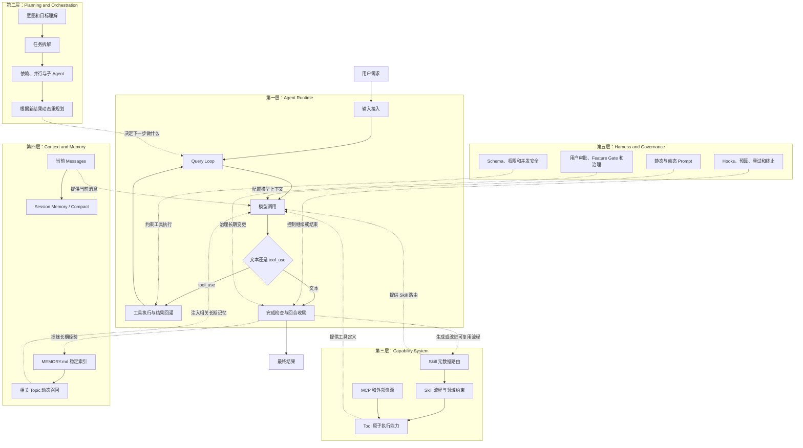

读这张图时，可以把 Agent Runtime 看成发动机：Planning 决定方向，Capability 提供动作，Context and Memory 提供信息，Harness and Governance 提供护栏。模型本身只是发动机中的决策核心，不等于整个 Agent 系统。

### 第一层：Agent Runtime，解决“怎样持续运行到完成”

这一层主要对应第 1 和第 3 个问题。

用户输入进入系统后，Runtime 负责完成输入预处理、上下文装配、模型请求、工具执行、结果回灌、错误恢复和最终收尾。核心不是一次 API 请求，而是一个持续迭代的 Query Loop：模型先根据当前状态提出下一步行动；如果行动是工具调用，运行时执行工具并把真实结果送回模型；模型基于新结果继续判断，直到不再需要行动并满足结束条件。

Runtime 还负责那些不应该交给模型自由决定的事情：

- 工具输入是否符合 Schema；
- 用户是否授权当前操作；
- 多个工具能否并行；
- API 失败后是否重试或切换模型；
- 上下文过长时是否 Compact；
- 是否达到最大轮数或 Token Budget；
- Stop Hook 是否允许结束；
- 用户中止后如何清理状态。

所以 Runtime 的本质是一个受控状态机。它把模型的概率性输出转换成可观察、可恢复、可终止的工程流程。

### 第二层：Planning and Orchestration，解决“下一步应该做什么”

这一层主要对应第 2 和第 3 个问题。

系统没有为开放式任务准备一个覆盖所有场景的固定意图树。主模型结合用户输入、System Prompt、历史消息、Skill 元数据、工具定义和 Agent 定义，理解目标和约束，再决定是否拆任务、创建依赖、调用工具或启动子 Agent。

规划分为两个不同层次：

- **语义规划**由模型完成：识别目标、拆解子任务、判断哪些结果会影响后续路线；
- **执行编排**由运行时落实：保存 `blockedBy` 等依赖，控制并发安全、权限和共享状态。

这套规划不是“一次生成计划，之后机械执行”。每次 Tool Result 或子 Agent 结果回来后，模型都可以重新判断原计划是否仍然成立。对于真实工程任务，这种 Replan 很重要，因为 Agent 在执行前通常并不知道完整环境状态。

子 Agent 也属于编排层，但它的价值不只是并行。子 Agent 可以拥有独立 Prompt、工具、权限和上下文，把局部探索产生的大量中间信息隔离起来，最后只将结论返回主线程。因此，子 Agent 同时解决吞吐量和上下文污染问题。

### 第三层：Capability System，解决“Agent 可以用什么能力”

这一层主要对应第 4、第 5 和第 6 个问题。

Capability System 可以进一步区分为 Skill 和 Tool：

- **Skill** 负责把某类重复任务的触发条件、领域知识、步骤、约束和成功标准封装起来；
- **Tool** 负责读取文件、执行命令、修改代码或访问外部服务等真实动作；
- **MCP** 负责把外部系统的工具和资源接入 Agent；
- **Agent Definition** 负责组合特定 Prompt、工具、模型、权限和记忆，形成不同执行角色。

Skill 采用渐进披露。系统平时只暴露 `name`、`description`、`whenToUse` 等紧凑元数据，由模型进行语义路由；命中后才加载完整 `SKILL.md`，再按需访问 references、assets 和 scripts。这样既保持能力可发现，又避免全部 Skill 正文长期占用上下文。

Skill 还具有治理和执行边界。Managed、User、Project、Plugin、Bundled 和 MCP 表示不同来源与作用域；Inline 与 Fork 表示不同上下文隔离方式；`allowedTools`、model、effort 和 hooks 控制副作用与执行成本。

能力系统也可以演化，但不是无人监督地自我修改。`/skillify` 可以从真实会话中提炼新 Skill，Skill Improvement 可以发现用户的可泛化修正，但最终写入需要用户触发或确认。这使系统具备经验沉淀能力，同时避免偶然对话直接污染长期能力库。

### 第四层：Context and Memory，解决“当前应该让模型看到什么”

这一层主要对应第 7、第 8、第 9 和第 10 个问题。

Agent 的效果不仅取决于模型能力，还取决于送进上下文的信息是否正确、相关和及时。源码中的 Context and Memory 可以按时间尺度分成三层：

1. **工作记忆**：当前 Messages、Tool Calls、Tool Results 和 Query State，服务正在执行的步骤；
2. **会话记忆**：Session Memory、Compact Summary 和关键任务状态，服务长会话连续执行；
3. **长期记忆**：用户偏好、反馈、项目非代码背景和外部参考，服务跨会话复用。

长期记忆又采用两阶段读取：`MEMORY.md` 作为稳定索引进入常规上下文，Topic 正文根据当前 Query 动态召回。它不是两个独立数据库，而是同一文件式记忆库的“全局导航 + 按需细节”。

这一层最重要的设计目标不是“记得越多越好”，而是控制有效上下文。系统从四个阶段治理记忆：

- **写入门控**：只保存未来仍有价值且无法从代码重新推导的信息；
- **存储治理**：已有 Topic 优先更新，冲突和过期内容需要修正或删除；
- **后台巩固**：通过 AutoDream 合并重复、压缩索引和清理陈旧内容；
- **召回治理**：只根据元数据选择确定相关的少量文件，允许零召回，并限制数量和字节。

因此，Memory 的完整问题不是“用什么向量库”，而是信息从产生、筛选、存储、整合、召回到遗忘的生命周期设计。

### 第五层：Harness and Governance，解决“怎样让系统稳定、可控和经济地运行”

这一层主要对应第 11 个问题，同时横向约束前面所有问题。

Harness 可以理解为模型之外的工程控制面。它包括 Prompt 组织、工具 Schema、权限、Hooks、上下文预算、Compact、重试、Feature Gate、用户审批和观测机制。它不直接替代模型推理，而是定义模型能够看到什么、能够做什么、失败后怎样恢复以及什么时候必须停止。

Prompt 分层是 Harness 的重要组成：

- 静态 Prompt 保存稳定身份、通用工具原则和安全边界，适合形成可缓存前缀；
- 动态 Prompt 根据 Session、Memory、环境、MCP 和当前 Agent 装配；
- User Context、System Context 和 Attachments 承载不同生命周期的运行时信息；
- Prompt 来源有明确优先级，避免 Coordinator、Agent、Custom 和 Default Prompt 互相冲突。

Harness 还弥补了大模型的三个天然弱点：

1. 模型输出具有概率性，因此用 Schema 和状态机约束接口；
2. 模型不知道真实环境，因此用 Tools 建立观察和行动闭环；
3. 模型上下文有限且注意力会被噪声干扰，因此用渐进披露、Compact、召回预算和隔离 Agent 管理上下文。

### 11 个问题与五层架构的对应关系

| 架构层 | 对应问题 | 主要解决的问题 |
| --- | --- | --- |
| Agent Runtime | 1、3 | 输入怎样进入循环，模型与工具怎样交替，系统怎样结束或恢复 |
| Planning and Orchestration | 2、3 | 怎样理解目标、拆任务、建立依赖、并行和动态重规划 |
| Capability System | 4、5、6 | Skill 怎样匹配、如何分层、怎样从真实经验中沉淀和改进 |
| Context and Memory | 7、8、9、10 | 长短期信息保存什么、如何治理、何时召回以及怎样避免污染 |
| Harness and Governance | 11，并横跨 1-10 | Prompt 怎样装配，权限、预算、Hooks、审批和缓存怎样约束系统 |

第 3 个问题同时属于 Runtime 和 Orchestration，因为“先做什么”是语义规划问题，“怎样安全执行”是运行时问题。第 11 个问题虽然以 Prompt 为入口，实际上涉及整个 Harness，因为 Prompt 只是控制面的一个组成部分。

### 一次用户请求如何穿过五层

把五层放回一次真实请求，可以得到下面这条主线：

1. 用户提交需求，Runtime 将其转换为标准消息；
2. Harness 选择有效 System Prompt，并装配 User Context、System Context、工具和权限；
3. Context and Memory 加载稳定索引，并异步预取可能相关的 Topic；
4. Capability System 向模型暴露 Tools、Skills 和可用 Agent 的紧凑描述；
5. 模型理解用户目标，Planning 层形成直接行动或子任务结构；
6. Runtime 接收 `tool_use`，执行权限和 Schema 校验；
7. 调度器依据依赖和 `isConcurrencySafe` 选择串行或并行；
8. 工具和子 Agent 返回真实结果，Runtime 将结果追加回 Messages；
9. 模型根据新证据继续执行或重新规划；
10. 上下文增长时，Memory/Compact 层压缩旧信息并保留关键状态；
11. 模型不再请求工具后，Harness 执行 Stop Hook、预算和终止检查；
12. 回合完成后，系统提取有长期价值的信息，并可能生成 Skill 改进建议；
13. 最终结果返回用户，新的记忆和能力在后续会话中再次参与上下文装配。

这条主线展示了 Agent 的两个关键循环：回合内的行动反馈循环，以及跨回合、跨会话的经验演化循环。

### 两个反馈闭环

#### 1. 回合内的行动反馈闭环

```text
模型判断
  -> 调用工具或子 Agent
  -> 环境返回真实结果
  -> 结果进入 Messages
  -> 模型基于新证据重新判断
```

这个闭环解决“模型如何与真实环境交互”。它让 Agent 能够观察、行动、验证和修正，而不是只根据预训练知识一次性猜答案。

#### 2. 跨会话的经验反馈闭环

```text
真实任务执行
  -> 提取高价值记忆或流程
  -> 去重、整合和人工审批
  -> 形成长期 Memory 或 Skill
  -> 后续任务按需召回或触发
  -> 新的用户反馈继续修正
```

这个闭环解决“系统如何越用越贴合用户和项目”。Memory 主要积累事实、偏好和背景，Skill 主要积累可复用的做事方法。两者都需要治理，否则学习能力会变成长期污染源。

### 三个控制平面必须区分

进一步追问时，需要始终区分以下三类机制：

1. **模型能力**：意图理解、语义规划、Skill 选择、结果综合和动态重规划；
2. **Prompt 协议**：告诉模型有哪些能力、什么时候适合拆任务、何时并行以及什么条件算完成；
3. **运行时保障**：Schema、权限、并发安全、状态持久化、预算、重试、审批和终止条件。

例如，“独立任务应该并行”如果只写在 Agent Tool Prompt 中，它属于给模型的规划指导；真正执行时，工具是否并发还要由 `isConcurrencySafe` 和调度器判断。再比如，“模型根据 description 选择 Skill”是语义路由，而 Skill 名称是否存在、是否允许模型调用、能使用哪些工具则是运行时校验。

很多 Agent 架构回答不准确，往往是把 Prompt 中的建议当成运行时强制规则，或者把模型的语义判断描述成确定性算法。能够清楚区分这三个控制平面，比单纯记住调用链更重要。

### 四条贯穿架构的设计原则

#### 1. 模型负责模糊判断，代码负责确定性约束

意图理解、任务拆解和相关性判断很难穷举，适合交给模型；权限、参数校验、并发安全、状态迁移和大小限制必须由代码执行。架构的重点不是消灭模型的不确定性，而是把不确定性限制在适合它的决策范围内。

#### 2. 一切上下文都需要生命周期

不是所有信息都应该永久存在：工具结果可能只对当前步骤有用，Session Memory 服务当前长任务，长期记忆服务未来会话，Skill 服务稳定重复流程。根据有效期选择存储和注入路径，可以避免上下文和知识库不断膨胀。

#### 3. 能力和知识采用渐进披露

Skill 先暴露元数据再加载正文，Memory 先加载索引再召回 Topic，子 Agent 只返回局部结论，动态 Prompt 只装配当前有效信息。共同目标是让模型在当前决策点只看到真正有价值的内容。

#### 4. 自动化越接近长期副作用，越需要治理

只读搜索可以积极并行，文件修改需要权限，长期记忆写入需要去重和清理，Skill 创建和更新需要用户确认。副作用越难恢复、影响时间越长，系统越不能只依赖模型自主判断。

### 30 秒回答模板

> 我会把 Agent 系统分成五层。Runtime 用 Query Loop 把模型推理、工具执行和结果回灌连成闭环；Planning 由模型理解意图和拆任务，由运行时落实依赖与并发；Capability 用 Skill 封装可复用流程，用 Tool 和 MCP 执行真实动作；Context and Memory 管理当前消息、会话摘要以及长期记忆的写入和召回；Harness 则通过 Prompt 分层、权限、Schema、Hooks、预算和审批控制整个生命周期。核心原则是模型负责开放语义判断，确定性代码负责安全、一致性和治理。

### 2 分钟回答模板

> 我理解的 Agent 不是“LLM 加几个工具”，而是一个围绕 Query Loop 构建的五层系统。第一层 Runtime 接收用户输入，装配上下文并调用模型；模型如果返回 `tool_use`，运行时就检查 Schema 和权限、执行工具，再把 `tool_result` 回灌，直到满足完成条件。第二层是 Planning，开放式意图和任务拆解由模型完成，但 Task 依赖、并发安全和子 Agent 隔离由框架落实。第三层是 Capability，Skill 用元数据进行低成本路由，命中后再加载完整流程，Tool 和 MCP 负责真实副作用；Skill 还能从真实会话中辅助提炼，但写入要经过用户确认。第四层是 Context and Memory，它区分当前 Messages、Session Memory 和跨会话长期记忆，长期记忆采用 `MEMORY.md` 稳定索引加 Topic 动态召回，并通过去重、预算和后台整合避免膨胀。第五层是 Harness，通过静态/动态 Prompt、Hooks、Compact、权限、Feature Gate 和审批约束所有层。整套架构的关键，是把模型擅长的模糊语义决策和代码擅长的确定性控制分开。

### 5 分钟展开顺序

如果面试官允许详细介绍，可以按下面顺序展开，避免在 11 个问题之间跳来跳去：

1. 先画 Query Loop，解释一次请求为什么会多次调用模型和工具；
2. 再解释模型如何基于 Prompt、Tools、Skills 和 Context 理解目标；
3. 从 `tool_use` 引出依赖、并发、权限和子 Agent 隔离；
4. 从“模型有哪些能力”引出 Skill、Tool、MCP 的边界和渐进披露；
5. 从长任务上下文增长引出 Messages、Session Memory 和 Compact；
6. 从跨会话连续性引出长期记忆的索引、Topic、写入治理和召回防污染；
7. 从所有模块的约束引出静态/动态 Prompt 和 Harness；
8. 最后用“模型负责语义，运行时负责确定性”总结设计哲学。

这个顺序从一次请求的执行主线自然扩展到能力、记忆和治理，比逐题背诵更像一个完整的系统设计回答。

### 常见追问的收束方式

#### 如果面试官问：这套系统最核心的模块是什么？

回答 Query Loop，但要补充它不能独立成立。Query Loop 是执行主干，真正的稳定性来自工具协议、上下文管理和 Harness 共同配合。

#### 如果面试官问：为什么不把规划全部写成固定工作流？

开放式工程任务的路径依赖真实环境，执行前无法穷举。模型适合做语义规划和动态 Replan，固定代码适合执行依赖、权限、状态和错误处理。二者组合比纯工作流或纯模型自治更实用。

#### 如果面试官问：Skill 和 Memory 有什么本质区别？

Memory 保存“未来可能需要知道什么”，例如用户偏好和项目背景；Skill 保存“遇到某类任务应该怎样做”，例如步骤、工具和成功标准。Memory 偏事实与上下文，Skill 偏流程与能力。

#### 如果面试官问：怎样评估这套系统？

应该分层评估：意图和 Skill 看路由准确率，Planning 看任务完成率和无效步骤，Tool 层看调用成功率与权限违规，Memory 看写入质量、召回 Precision 和污染率，Runtime 看延迟、Token、重试和恢复成功率，最终仍以端到端任务成功率和用户纠正次数作为核心指标。

#### 如果面试官问：最大的工程风险是什么？

主要不是模型“不会回答”，而是错误上下文和错误副作用：无关记忆或 Skill 污染决策、Prompt 来源冲突、并发写入破坏状态、权限过宽、自动沉淀固化偶然错误。对应措施是渐进披露、来源优先级、并发安全、最小权限、人工审批和可淘汰的记忆治理。

### 最终收束

如果只保留一句话，可以这样总结：

> Agent 架构的本质，是用 Query Loop 建立模型与环境的行动反馈，用 Skill 和 Tool 扩展能力，用 Context 和 Memory 管理有限注意力与长期经验，再用 Harness 把模型的不确定性约束在安全、可恢复、可评估的工程边界内。

## 源码限制说明

当前 `cc-haha` 源码快照存在 generated stub。本文涉及的 Query Loop、工具调度、Skill 基础加载、Skillify、Skill Improvement、Memdir、Memory Recall 和 Prompt Sections 均能找到实际实现；但实验性的 Skill Search 和部分内部 Coordinator/Worker 逻辑并不完整。

因此本文采用以下口径：

- 能从实际代码确认的行为，写成确定机制；
- 由 System Prompt 驱动的行为，明确说明为模型决策；
- “静态/动态长期记忆”等非源码原生术语，按照实际加载路径进行架构映射；
- 不根据 stub 推断未公开的搜索、调度或内部服务实现。
