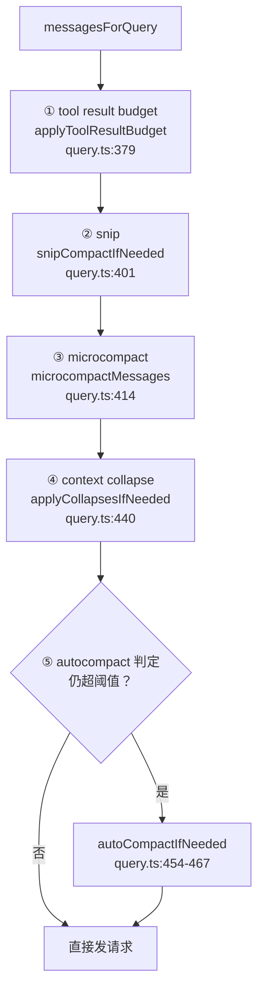
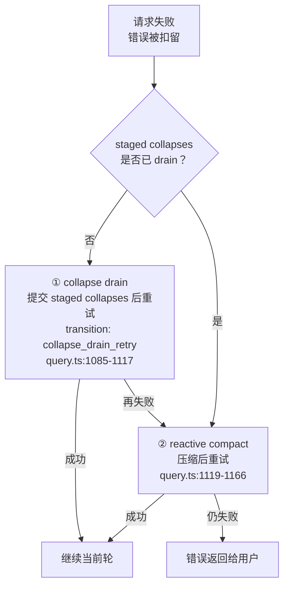

# Claude Code 压缩防御策略：五级收缩、恢复链与三不原则

## 文档定位

本文基于 `cc-haha` 源码，完整回答一个问题：**当上下文不断增长直至超出窗口时，Claude Code 是如何层层设防的？**

它不是"上下文满了就压一把"的单一机制，而是一套纵深防御（defense in depth）：

1. **主动防御**：五级逐层升级的请求前收缩，尽量不触发真正的压缩（第 1 节）；
2. **被动防御**：请求失败后的扣留-恢复链，压缩失败还有兜底（第 2 节）；
3. **保护性设计**：压缩动作本身不能造成二次伤害--不丢信息、不破缓存、恢复一致（第 3 节）；
4. **治理机制**：熔断、预警、遥测与压缩后清理（第 4 节）。

源码根目录：

```text
/Users/songxijun/workspace/otherProject/cc-haha
```

边界说明：`snipCompact.ts`、`contextCollapse/`、`reactiveCompact.ts`、`cachedMicrocompact.ts` 在该仓库中为 generated stub，模块内部实现不可查；本文所有结论均基于 `query.ts`、`microCompact.ts`、`autoCompact.ts`、`compact.ts`、`sessionMemoryCompact.ts`、`toolResultStorage.ts`、`sessionStorage.ts` 等真实调用点、常量与注释，并逐处标注 `file:line`。

阅读建议：本文是"防御纵深"的统摄视角；各机制的细节展开见同目录 `context-system-attachments-and-compact.md`（上下文分层）与 `10_memory_patterns_basics/ClaudeCode长短期记忆架构设计文档.md`（4.2.1 / 4.6 / 8.2 节）。

## 一页总览

| 层次 | 机制 | 触发时机 | 无损性 | 成本 |
| ---- | ---- | ---- | ---- | ---- |
| 主动 1 | tool result budget | 每轮请求前 | 完全无损（原文落盘） | 纯磁盘操作 |
| 主动 2 | snip | 每轮请求前 | 无损（transcript 保留） | 纯视图过滤 |
| 主动 3 | microcompact | 每轮请求前 | 半无损 | 低 |
| 主动 4 | context collapse | autocompact 之前 | 局部有损（span 摘要） | 需生成摘要 |
| 主动 5 | autocompact | 收缩后仍超阈值 | 全局有损（整段变摘要） | 最贵 |
| 被动 1 | collapse drain | 请求失败后 | 复用已 staged 的折叠 | 免费 |
| 被动 2 | reactive compact | drain 后仍失败 | 有损压缩 | 高 |
| 保护 | 冻结决策 / 快照 / 预算重置 / resume 重放 | 全程 | -- | -- |
| 治理 | 熔断 / 预警 / 清理 / 遥测 | 全程 | -- | -- |

---

## 1. 主动防御：五级递进的请求前收缩

### 1.1 调用顺序与总链路

每轮发模型请求前，`query.ts` 对 `messagesForQuery`（最近一次 compact boundary 之后的可用消息视图）按固定顺序执行五级收缩。**任何一级把上下文压回阈值以下，后面的级别就不再执行**：



顺序设计的意图，源码注释写得很直白：

- "Apply snip before microcompact"（`query.ts:401`）
- "Apply microcompact before autocompact"（`query.ts:414`）
- "Runs BEFORE autocompact so that if collapse gets us under the autocompact threshold, autocompact is a no-op"（`query.ts:428-439`）

即**第 4 级存在的意义就是让第 5 级尽量不发生**：局部折叠一段旧消息比重写整个会话摘要便宜得多、也保真得多。整体原则：从最便宜、最无损的开始，逐级升级。

### 1.2 第 1 级：tool result budget（单条工具结果预算）

入口 `enforceToolResultBudget`（`toolResultStorage.ts:769`）。

**计量方式**：按 API 级 user message 聚合。`collectCandidatesByMessage`（`toolResultStorage.ts:600-639`）按 assistant 消息边界分组，模拟 `normalizeMessagesForAPI` 的合并行为，把同一 API 级消息里所有 `tool_result` 的体积加总后与预算比较。

**替换决策**：超预算后 `selectFreshToReplace`（:675-692）按体积**从大到小**挑出最肥的结果，逐个持久化：

- 写入当前 session 目录下 `tool-results/` 子目录，按 `tool_use_id` 命名保存为 `.txt` 或 `.json`（:27, 104-117）；
- 上下文里替换为"引用卡"（`buildLargeToolResultMessage`，:189-199）：**文件路径 + 原始大小 + 前 2000 字节预览**（`PREVIEW_SIZE_BYTES = 2000`，:109）；
- 单条结果的落盘阈值由 `MAX_TOOL_RESULT_BYTES` 决定，按 4 字节/token 保守折算（`constants/toolLimits.ts:25-33`）。

**冻结机制**（缓存防御的关键）：某个结果一旦被决定替换，决策按 `tool_use_id` 冻结、跨轮复用（:367-393 的 seenIds/replacements 设计说明，:739-768 的 frozen 机制文档）。若替换状态每轮变化，消息前缀字节就会变化，prompt cache 全部作废。

**信息无损**：模型随时可以 Read 引用卡里的路径取回完整内容--从"占着上下文"变成"按需取回"。

### 1.3 第 2 级：snip（整段历史回合裁剪）

`snipCompactIfNeeded(messagesForQuery)`（调用点 `query.ts:401-410`，本体为 stub）。

**行为**：把与当前工作不再相关的整段历史回合从**模型可见视图**中过滤；原始消息仍保留在 transcript 与 UI scrollback（`commands/compact/compact.ts:44-45` 注释："REPL keeps snipped messages for UI scrollback"）。

**resume 重放**：恢复会话时按 snip boundary 记录的 `snipMetadata.removedUuids` 重放移除并 relink（`sessionStorage.ts:1974-2010` 的 `applySnipRemovals`），避免重新加载完整未裁剪历史。

**与 autocompact 的联动**：snip 释放的 token 会计入下一级的判定--`autoCompact.ts:225` 的 `tokenCountWithEstimation(messages) - snipTokensFreed`。

### 1.4 第 3 级：microcompact（历史工具结果轻压缩）

入口 `microcompactMessages`（`microCompact.ts:253-293`，调用点 `query.ts:414-419`）。

**可压缩工具白名单**（`COMPACTABLE_TOOLS`，`microCompact.ts:41-50`）：Read、Bash、Grep、Glob、WebSearch、WebFetch、Edit、 Write--即所有"结果大且会过时"的只读/编辑类工具。

**两条路径**：

1. **cached 路径**（缓存可用时，`microCompact.ts:296-399`）：通过 **cache editing 在 API 层删除旧工具结果**，本地消息内容完全不动（注释明确 "Does NOT modify local message content (cache_reference and cache_edits are added at API layer)"）。按 count 阈值（`triggerThreshold`）触发，保留最近 `keepRecent` 条，优先删最旧；
2. **time-based 路径**（`maybeTimeBasedMicrocompact`，:446-530）：距上次压缩的间隔超过 `gapThresholdMinutes` 时，把较旧可压缩结果的内容**清空**，保留最近 `max(1, keepRecent)` 条，并输出释放 token 估算日志。

**重要边界**：缓存不可用时**不做任何压缩**，交给 autocompact 兜底（:288-292 注释："Legacy microcompact path removed... no compaction happens here; autocompact handles context pressure instead"）。宁可留给上级，不做不可靠的动作。

### 1.5 第 4 级：context collapse（局部折叠）

`applyCollapsesIfNeeded(messagesForQuery)`（调用点 `query.ts:440-447`，本体为 stub）。

**行为**：把当前会话中某一段**旧消息 span** 折叠为局部摘要占位，而不是把整段历史压成单一总摘要：

```text
折叠前：A -> B -> C -> D -> E -> F
折叠后模型看到的视图：A -> [B~D 的折叠摘要] -> E -> F
```

**视图重建**：折叠摘要内容、起止消息边界和 staged 状态记录在 collapse store（commit log）；每轮进入 query loop 时 `projectView()` 重放 commit log 重建"局部摘要占位 + 其余未折叠消息"的视图（`query.ts:434-436` 注释："Summary messages live in the collapse store, not the REPL array... projectView() replays the commit log on every entry"）。

**对 autocompact 的抑制**：collapse 启用时 autocompact 主动让位--`autoCompact.ts:215-224` 检查 `isContextCollapseEnabled()`，为真则直接返回 false（不触发 autocompact），把上下文压力完全交给折叠机制。

### 1.6 第 5 级：autocompact（自动压缩）

判定与执行在 `autoCompactIfNeeded`（`autoCompact.ts:226-330`，调用点 `query.ts:454-467`）。

**触发阈值**：`getAutoCompactThreshold(model) = 有效上下文窗口 - AUTOCOMPACT_BUFFER_TOKENS`，缓冲为 **13,000 token**（`autoCompact.ts:62, 72-90`）。可用环境变量 `CLAUDE_AUTOCOMPACT_PCT_OVERRIDE` 按窗口百分比覆盖（便于测试）。token 计数扣减 snip 已释放部分（`snipTokensFreed`）。

**触发后的内部分流**（优先用便宜的）：

1. **会话记忆压缩优先**（`trySessionMemoryCompaction`，`autoCompact.ts:287-310`）：
   - 读取后台持续维护的 `{projectDir}/{sessionId}/session-memory/summary.md`（SessionMemory 子系统每轮按阈值更新）；
   - 以其结构化内容（10 section 模板：Session Title / Current State / Task specification / Files and Functions / Workflow / Errors & Corrections / Codebase and System Documentation / Learnings / Key results / Worklog，`SessionMemory/prompts.ts:11-41`）为压缩基础；
   - 超长 section 截断：每个 section 上限 **2,000 token**（`MAX_SECTION_LENGTH`，按 4 字节/token 折算成字符截断，`prompts.ts:8, 256-324`），截断提醒里优先保留 Current State 和 Errors & Corrections（`prompts.ts:185`）；
   - 截断结果包装为 `isCompactSummary: true` 的 compact summary message（`sessionMemoryCompact.ts:464-482`）；
   - 手动 `/compact` 无自定义总结指令时同样优先走此路径（`commands/compact/compact.ts:55-83`，注释明确 "session memory compaction doesn't support custom instructions"）。
2. **传统整会话压缩兜底**（`compactConversation`，`compact.ts:440`）：构造 compact prompt，模型基于当前会话生成 **9 段式结构化摘要**（Primary Request and Intent / Key Technical Concepts / Files and Code Sections / Errors and fixes / Problem Solving / All user messages / Pending Tasks / Current Work / Optional Next Step，`prompt.ts:66-77`），要求保留文件名、代码片段、错误修复、用户原话与下一步任务。

**局部压缩变体**：`partialCompactConversation()`（`compact.ts:765-800`）不压整个会话，围绕用户选定的 pivot message 做定点压缩：`from` 方向保留选中位置之前、压缩之后的消息；`up_to` 方向压缩之前、保留之后（并剔除旧 boundary/summary）。

### 1.7 compact 的输出结构

所有压缩路径共用 `CompactionResult`（`compact.ts:299-310`）与统一的重组函数 `buildPostCompactMessages`（:330-338），**顺序固定**：

```text
boundaryMarker（compact_boundary 系统消息）
-> summaryMessages（一条或多条摘要 user message）
-> messagesToKeep（保留消息，部分路径才有）
-> attachments（必要附件）
-> hookResults（hook 结果）
```

`CompactionResult` 还携带压缩前后 token 计数（`preCompactTokenCount` / `postCompactTokenCount` / `truePostCompactTokenCount`）与压缩本身的用量（`compactionUsage`），用于遥测与"压缩是否值回票价"的度量。

---

## 2. 被动防御：请求失败后的恢复链

如果五级收缩都没拦住、请求真的失败了，错误会先被**扣留（withheld）**而不外发给用户，然后按代价从低到高依次尝试恢复。

### 2.1 错误扣留

`query.ts:788-825` 识别两类**可恢复**错误并扣留：

- `isWithheldPromptTooLong`：上下文超长（`query.ts:811`，另有 collapse 模块自己的同名判断 :802）；
- `isWithheldMediaSizeError`：图片 / PDF / 多图尺寸超限（`query.ts:816`）。

### 2.2 恢复链：先免费后昂贵



1. **collapse drain**（`contextCollapse.recoverFromOverflow`，`query.ts:1085-1117`）：把已经 staged、尚未提交的折叠先提交掉，然后带着折叠后的视图重试（transition 标记 `collapse_drain_retry`）。**成本为零**--折叠摘要早已算好，只是还没生效。已 drain 过（transition reason 已是 `collapse_drain_retry`）则跳过，避免循环；
2. **reactive compact**（`tryReactiveCompact`，`query.ts:1119-1166`）：做一次真正的压缩再重试（transition 标记 `reactive_compact_retry`）。媒体尺寸错误走 **strip-retry**：剥离超大媒体后重试（`query.ts:1074-1076` 注释）。手动 `/compact` 也有 reactive 入口（`reactiveCompactOnPromptTooLong`，`commands/compact/compact.ts:175-179`）。

### 2.3 实验方向：reactive-only 模式

存在一个 ant 内部的实验开关（`REACTIVE_COMPACT` feature + `tengu_cobalt_raccoon`，`autoCompact.ts:185-200`）：**关闭主动 autocompact，完全依赖 reactive compact 捕获 API 的 prompt-too-long**。注释同时指出了代价：该模式下 query loop 里的 `trySessionMemoryCompaction` 也不会执行，只有 `/compact` 调用点仍优先会话记忆压缩。这个方向说明"主动压缩 vs 被动兜底"的边界本身仍在演进。

---

## 3. 保护性设计：压缩本身不能造成二次伤害

压缩如果处理不当会带来三类二次伤害，每类都有针对性设计。

### 3.1 不丢信息

| 机制 | 原文去向 |
| ---- | ---- |
| tool result budget | 落盘 `tool-results/<tool_use_id>.txt|.json`，可 Read 取回 |
| snip | 保留在 transcript 与 UI scrollback |
| microcompact（cached 路径） | 本地消息内容完全不动，仅 API 层删除 |
| microcompact（time-based）/ collapse / compact | 真有损，被压在防御纵深的最后几级 |

### 3.2 不破缓存

压缩动作如果导致消息前缀的逐字节变化，prompt cache 全部作废--等于用 token 成本换 token 空间。两处针对性设计：

- tool result budget 的替换决策按 `tool_use_id` **冻结**跨轮复用（`toolResultStorage.ts:367-393, 739-768`）；
- relevant_memories 注入的 header 使用 attachment **创建时的快照**而非发送时重算（`messages.ts:3708` 的 `m.header ?? memoryHeader(...)`），文件后来被改也不影响已注入内容的字节稳定性。

另有缓存断裂检测的教训级注释：会话记忆压缩路径曾漏掉 `notifyCompaction` 通知，导致 20% 的 `tengu_prompt_cache_break` 事件被误报为 systemPromptChanged（`autoCompact.ts:305-312`，2026-03-01 修复）--压缩后的"缓存基线重置"本身也需要被治理。

### 3.3 恢复一致

- resume 时 snip 按 `removedUuids` 重放并 relink（`sessionStorage.ts:1974-2010`）；
- tool result 替换状态重建（`toolResultStorage.ts:960-988`），恢复后的视图与压缩前一致；
- 记忆注入的 60KB 会话预算靠**扫描消息流**里的相关 attachment 求和（`attachments.ts:279-288`），而非全局计数器--**compact 后旧 attachment 从消息流消失、计数自动归零**，"压缩后允许重新召回"不需要任何专门代码。单条 memory 正文读取同样有界：最多 200 行 / 4096 字节（`MAX_MEMORY_LINES` / `MAX_MEMORY_BYTES`，`attachments.ts:269, 277`）。

---

## 4. 治理机制：熔断、预警、清理与遥测

防御纵深之外还有一层"对防御系统本身的防御"：

### 4.1 autocompact 熔断器

`MAX_CONSECUTIVE_AUTOCOMPACT_FAILURES = 3`（`autoCompact.ts:67-70`）：连续 3 次 autocompact 失败后停止重试。这条熔断来自真实事故--源码注释记录：曾观察到 **1,279 个会话出现 50 次以上连续失败（最高 3,272 次），全局每天浪费约 25 万次 API 调用**（BQ 2026-03-10）。成功一次即重置计数。

### 4.2 接近阈值的用户预警

`calculateTokenWarningState`（`autoCompact.ts:97-139`）在 autocompact 阈值之上再留 **20,000 token** 的 warning / error 缓冲（`WARNING_THRESHOLD_BUFFER_TOKENS` / `ERROR_THRESHOLD_BUFFER_TOKENS`，:63-64），换算成"距自动压缩还剩 N%"展示给用户。UI 侧有配套的警告抑制状态（`compactWarningState.ts`）：压缩成功后抑制警告，新一轮压缩尝试开始时清除--避免"刚压完又立刻警告"的闪烁。

### 4.3 压缩后清理

`runPostCompactCleanup`（autoCompact 成功路径调用，`autoCompact.ts:175` 注释）在每次 autocompact 后执行 **`resetContextCollapse()`**：折叠机制的 commit log 与新起点对齐，避免旧折叠状态污染压缩后的消息流。此外还有 `setLastSummarizedMessageId(undefined)`（会话记忆压缩会剪消息，旧 UUID 不复存在）与 `markPostCompaction()` 标记。

### 4.4 遥测与诊断

- `RecompactionInfo`（`compact.ts:312-323`）区分**同链循环压缩**（H2）与跨 agent / 手动 vs 自动（H1/H3/H5），让 `tengu_compact` 事件不用 join 就能定位"为什么又压了一次"；
- `CompactionResult` 携带压缩前后 token 数与压缩自身用量，度量压缩的净收益；
- query loop 各关键点（snip 释放、autocompact 判定、drain、reactive 重试）都有调试日志（如 `autoCompact.ts:229-231`）。

---

## 5. 总结

```text
防御纵深 = 主动五级收缩（每轮请求前，从无损到有损、从便宜到昂贵）
         + 被动恢复链（扣留 -> collapse drain -> reactive compact -> 重试）
         + 三不原则（不丢信息、不破缓存、恢复一致）
         + 治理机制（熔断、预警、压缩后清理、遥测）
```

一句话表达设计思想：

> 能用便宜的视图操作就不用昂贵的摘要压缩；必须压缩时优先复用已维护的会话笔记；真失败了还有扣留-恢复链兜底；压缩对缓存和恢复的副作用被当作一等公民来防御；连防御系统本身也有熔断器和预警，防止它从保护者变成资源黑洞。

## 关键源码文件

| 文件 | 职责 |
| ---- | ---- |
| `src/query.ts` | 五级收缩调用顺序（:379-467）、错误扣留（:788-825）、恢复链分发（:1085-1166） |
| `src/utils/toolResultStorage.ts` | 第 1 级：预算控制、落盘、引用卡、冻结决策、resume 重建 |
| `src/services/compact/microCompact.ts` | 第 3 级：COMPACTABLE_TOOLS、cached / time-based 双路径 |
| `src/services/compact/autoCompact.ts` | 第 5 级：阈值（窗口-13k）、分流、熔断器、预警状态、reactive-only 实验 |
| `src/services/compact/sessionMemoryCompact.ts` | 会话记忆压缩（优先路径）与 section 截断 |
| `src/services/compact/compact.ts` | `compactConversation` / `partialCompactConversation` / `CompactionResult` / 重组顺序 |
| `src/services/compact/prompt.ts` | 9 段式摘要 prompt |
| `src/services/SessionMemory/` | summary.md 维护、10 section 模板、2k token 截断 |
| `src/utils/sessionStorage.ts` | resume 重放（snip removedUuids） |
| `src/constants/toolLimits.ts` | MAX_TOOL_RESULT_BYTES、字节/token 折算 |
