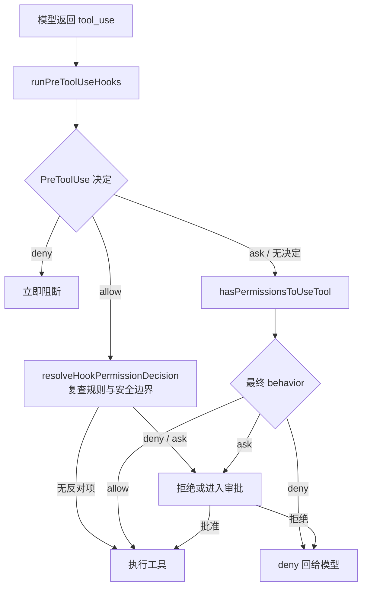

# Claude Code 权限系统全貌：模式、规则、判定管线与审批流

> 源码基线：`cc-haha` commit `5a86ab097fd1f74ebd193674a3897238dc3daefb`（2026-04-21）。下文所有 `src/...:line` 引用均相对于该版本。

## 文档定位

本文基于 `cc-haha` 源码，完整回答：**一个工具调用从发出到执行，权限系统在这中间做了什么？**

`src/utils/permissions/`（该基线下约 9.4k 行 TypeScript）是权限核心，但一次判定横跨 PreToolUse hook、规则判定、工具自身的 `checkPermissions()`、模式转换以及交互式/Headless 审批。同目录 `tool-resolution-and-permission-isolation.md` 讲的是 agent 侧的工具装配与隔离；本文讲的是**每一次工具调用的判定全链路**：

- 五种外部模式、实验性 `auto` 与内部 `bubble` 哨兵（第 1 节）；
- 规则语法与解析（第 2 节）；
- 规则来源与加载边界（第 3 节）；
- 判定管线：hook -> 规则/工具检查 -> 模式转换 -> 审批（第 4 节）；
- 审批 UI 与 `PermissionUpdate` 的持久化边界（第 5 节）；
- 沙箱、危险模式与路径安全（第 6 节）。

源码根目录：

```text
/Users/songxijun/workspace/otherProject/cc-haha
```

类型定义已抽到 `src/types/permissions.ts`（解 import 环）；UI 组件在 `src/components/permissions/`。

## 一页总览

| 问题 | 核心结论 |
| ---- | ---- |
| 有哪些模式 | 外部可表达 `default` / `plan` / `acceptEdits` / `bypassPermissions` / `dontAsk`；`auto` 仅在 `TRANSCRIPT_CLASSIFIER` 构建中进入运行时校验集；`bubble` 只在内部类型联合中 |
| 规则怎么写 | `Tool` 或 `Tool(content)`；content 支持转义括号、shell 前缀 `:*`、通配符 `*` |
| 规则从哪来 | 5 种 settings source + `cliArg` + `command` + `session`，共 8 种 `PermissionRuleSource` |
| 普通判定顺序 | PreToolUse -> tool-wide deny/ask -> `tool.checkPermissions()` -> bypass/allow -> `dontAsk`/`auto`/Headless 末端处理 |
| 什么拦得住 bypass | deny、必须交互的工具、内容级 ask 规则和 `safetyCheck` 都在 bypass 快速放行之前返回 |
| `PermissionUpdate` 存哪 | 每个更新都显式带 `destination`；只有 user/project/local 会落盘，session/cliArg 只改运行时上下文 |
| hook 能否改判定 | `deny` 立即阻断；`ask` 强制进入正常审批；`allow` 可跳过普通提示，但仍受 deny/ask 规则和安全检查约束 |

---

## 1. 权限模式

### 1.1 模式清单

定义在 `src/types/permissions.ts:16-38` 与 `src/utils/permissions/PermissionMode.ts:42-105`：

| 模式 | 语义 | 备注 |
| ---- | ---- | ---- |
| `default` | 正常判定：规则 allow 才放行，否则问用户 | 默认 |
| `plan` | 计划模式：只读工具可用，执行类需退出计划 | `--permission-mode plan` 或 Shift+Tab |
| `acceptEdits` | 文件编辑类自动允许 | 外部用户循环的第二站 |
| `bypassPermissions` | 跳过普通审批并快速 allow | 仍受 4.3 节列出的前置收紧检查约束 |
| `dontAsk` | 把本该 ask 的判定**转成 deny**（不是转成 allow） | `src/utils/permissions/permissions.ts:503-517`，在 inner 判定之后转换 |
| `auto` | 对普通 `ask` 运行 fast path 或 AI 分类器 | 仅在 `TRANSCRIPT_CLASSIFIER` 构建中进入运行时模式集；`isExternalPermissionMode()` 对 ant 排除它 |

`InternalPermissionMode` 还包含 `bubble`，但 `INTERNAL_PERMISSION_MODES` 的运行时校验数组没有把它列为用户可设置模式。它用于内部权限冒泡语义，不应算成 CLI/UI 模式（`src/types/permissions.ts:26-38`）。

### 1.2 切换方式

- **Shift+Tab 循环**：`getNextPermissionMode()`（`src/utils/permissions/getNextPermissionMode.ts:34-78`）。普通外部用户依次经过 `default -> acceptEdits -> plan`，只有 bypass 可用时才插入 `bypassPermissions`；ant 跳过 acceptEdits/plan，并按可用性转到 bypass 或 auto。`cyclePermissionMode()` 再调用 `transitionPermissionMode()` 执行 Plan/auto 的进入和退出副作用（`:88-100`）；
- **CLI / 设置**：`--permission-mode` 和 settings 的 `permissions.defaultMode` 都可指定模式；不同入口各自解析，不能把 `src/main.tsx:725-733` 的 SSH 参数转发代码当作所有 CLI 解析的唯一入口；
- 启动时请求 bypass 或允许危险跳过、且用户尚未确认时，`showSetupScreens()` 展示 `BypassPermissionsModeDialog`；这是**进入危险模式前的确认**，不是“退出前确认”（`src/interactiveHelpers.tsx:218-223`）。

---

## 2. 规则语法与解析

### 2.1 基本格式

规则字符串解析在 `src/utils/permissions/permissionRuleParser.ts:81-152`：

```text
Bash                      # 整个工具
Bash(npm install)         # 内容限定
Bash(npm install:*)       # shell 前缀（legacy 语法）
Read(//path/**/*.ts)      # 路径模式
WebFetch(domain:example.com)
mcp__server__tool         # MCP 工具
```

- 括号内支持转义：`\(`、`\)`、`\\`（`escapeRuleContent` / `unescapeRuleContent`，顺序有讲究：先转义反斜杠再转义括号）；
- 括号不匹配、内容后有多余字符等畸形输入一律**降级为纯工具名**处理（容错而非报错）；
- **遗留工具名别名**（`src/utils/permissions/permissionRuleParser.ts:18-40`）：`Task -> Agent`、`KillShell -> TaskStop`、`AgentOutputTool/BashOutputTool -> TaskOutput`--工具改名后旧规则继续生效。

### 2.2 shell 规则的三种形态

`src/utils/permissions/shellRuleMatching.ts:22-37` 把 shell 类规则表示为判别联合：

| 形态 | 示例 | 匹配语义 |
| ---- | ---- | ---- |
| `exact` | `Bash(npm install)` | 命令完全一致 |
| `prefix` | `Bash(npm:*)` | 前缀匹配（`permissionRuleExtractPrefix()`，`:39-48`，legacy `:*` 尾语法） |
| `wildcard` | `Bash(npm run *)` | 未转义 `*` 的通配符（`hasWildcards()`，`:50-78`；`\*` 视为字面量） |

### 2.3 行为优先级

规则行为只有三种：`allow` / `deny` / `ask`（`src/types/permissions.ts:40-44`）。从普通工具调用的返回顺序看，tool-wide deny 最早，随后是 tool-wide ask 和工具内容级判定；bypass 与 tool-wide allow 都位于这些收紧检查之后，最后才把 `passthrough` 转为 ask。不要把 settings source 的数组顺序误解为 allow 可以覆盖 deny。

---

## 3. 规则来源与合并

### 3.1 八种 source

`PermissionRuleSource`（`src/types/permissions.ts:50-62`）：

```text
userSettings     ~/.claude/settings.json（全局）
projectSettings  <project>/.claude/settings.json（随仓库共享）
localSettings    <project>/.claude/settings.local.json（gitignore）
flagSettings     --settings 指定的文件
policySettings   managed-settings.json 或远端下发（企业策略）
cliArg           命令行参数（--allowedTools 等）
command          当前命令/skill 附带
session          会话内临时规则
```

前五种即 `SETTING_SOURCES`（`src/utils/settings/constants.ts:3-24`）。加载时 `settingsJsonToRules()`（`src/utils/permissions/permissionsLoader.ts:85-114`）把各 settings 的 `permissions.allow/deny/ask` 数组逐条解析成带 source 的 `PermissionRule`；运行中 `syncPermissionRulesFromDisk()`（`src/utils/permissions/permissions.ts:1416-1470`）替换磁盘来源的运行时规则。

### 3.2 托管规则的加载边界

`shouldAllowManagedPermissionRulesOnly()`（`src/utils/permissions/permissionsLoader.ts:27-44`）开启后，磁盘加载器只返回 `policySettings` 规则，并拒绝通过 loader 新增可编辑 settings 规则（`:120-132,229-242`）；相关审批 UI 也会隐藏持久化的 "always allow" 选项。热同步还会清空 user/project/local/cliArg/session 的运行时规则（`src/utils/permissions/permissions.ts:1419-1470`）。这几段代码共同构成托管限制；不应仅凭其中一个函数笼统推导所有内部 `command` 规则的行为。

### 3.3 additionalDirectories

工作目录范围也是一种权限（`AdditionalWorkingDirectory`，`src/types/permissions.ts:133-145`，source 复用 `PermissionRuleSource`），由 `PermissionUpdate` 的 `addDirectories` 操作维护。

---

## 4. 判定管线：一次工具调用的完整判定

### 4.1 两级入口



`runPreToolUseHooks()` 把 hook 输出变成 `allow` / `deny` / `ask`（`src/services/tools/toolHooks.ts:435-556`），最终由 `resolveHookPermissionDecision()` 合并：

- `deny` 立即返回；
- `ask` 作为 `forceDecision` 交给正常权限函数，保留 hook 的提示原因；
- `allow` 通常跳过普通交互提示，但先运行 `checkRuleBasedPermissions()`，所以 tool-wide deny/ask、工具返回的 deny、内容级 ask 和 safetyCheck 仍能覆盖它；需要用户交互且 hook 没提供 `updatedInput`，或上下文设置 `requireCanUseTool` 时，会完整调用 `canUseTool`（`src/services/tools/toolHooks.ts:321-432`；`src/utils/permissions/permissions.ts:1060-1155`）。

因此，“Hook allow 永远完整调用 `canUseTool`”和“Hook allow 可以越过所有规则”都不准确。Headless/async agent 在末端 `ask` 时先运行 `PermissionRequest` hook；没有决定或 hook 执行失败才自动 deny（`src/utils/permissions/permissions.ts:400-470,929-951`）。

### 4.2 核心判定器 `hasPermissionsToUseToolInner()`

核心顺序位于 `src/utils/permissions/permissions.ts:1158-1319`。

按步骤编号，**前面的先赢**：

| 步 | 检查 | 结果 |
| ---- | ---- | ---- |
| 1a | 整工具 deny 规则（`getDenyRuleForTool`） | deny |
| 1b | 整工具 ask 规则 | ask（例外：Bash + 沙箱自动放行时下穿） |
| 1c | **工具自身 `checkPermissions`**（各工具实现：Read 查路径、Bash 查命令规则等） | 进入后续判断 |
| 1d | 工具返回 deny | deny |
| 1e | 工具 `requiresUserInteraction()` 且返回 ask | ask（bypass 也不放行） |
| 1f | 工具返回**内容级 ask 规则**（如 `Bash(npm publish:*)`） | ask（bypass 免疫） |
| 1g | **safetyCheck**（.git/、.claude/、.vscode/、shell 配置等敏感路径，`src/utils/permissions/filesystem.ts:620-665`） | ask（bypass 免疫） |
| 2a | bypassPermissions 模式（或 plan + bypass 可用） | allow |
| 2b | 整工具 allow 规则（`toolAlwaysAllowedRule`） | allow |
| 3 | 工具返回 `passthrough` | 转成 ask（兜底） |

注意判定不是"先规则后工具"的单向流：**工具的 checkPermissions（1c）先于模式与 allow 规则（2a/2b）执行**，因此工具能凭内容级 ask 规则和安全检查压过 bypass 模式。

### 4.3 bypass 快速放行之前的收紧检查

`bypassPermissions` 的快速 allow 位于 `hasPermissionsToUseToolInner()` 的步骤 2a。它之前已有四类可返回项（`src/utils/permissions/permissions.ts:1167-1280`）：

1. **deny**：既包括 tool-wide deny，也包括工具 `checkPermissions()` 返回的 deny；
2. **必须交互的工具**：`requiresUserInteraction()` 且工具判定为 ask；
3. **内容级 ask 规则**：例如 `Bash(npm publish:*)`；
4. **safetyCheck**：敏感路径或可疑 Windows 路径等安全检查。

所以 bypass 是“跳过普通审批”，不是跳过工具输入解析、工具级检查或所有安全边界。

### 4.4 模式末端转换

外层 `hasPermissionsToUseTool()`（`src/utils/permissions/permissions.ts:473-955`）在 inner 结果之后处理 `dontAsk`、`auto` 和 Headless ask：

- `dontAsk` 模式：ask -> **deny**（不是 allow），带 `DONT_ASK_REJECT_MESSAGE`；
- `auto` 模式：普通 ask 会先尝试 acceptEdits 和安全工具 allowlist fast path，再运行 `yoloClassifier.ts`；不可由分类器审批的 safetyCheck 和必须交互工具保持 ask。分类器连续/累计拒绝达到阈值时，交互式路径回退到人工提示，Headless 路径中止（`src/utils/permissions/permissions.ts:518-688,818-951,980-1057`）。

---

## 5. 审批 UI 与规则持久化

### 5.1 按工具定制的审批组件

`src/components/permissions/` 下每个工具有专属请求组件：`BashPermissionRequest`、`FileEditPermissionRequest`、`FileWritePermissionRequest`、`NotebookEditPermissionRequest`、`WebFetchPermissionRequest`、`SkillPermissionRequest`、`SandboxPermissionRequest`、`AskUserQuestionPermissionRequest`、`MonitorPermissionRequest` 等，另有兜底 `FallbackPermissionRequest` / `PermissionDialog`、解释层 `PermissionExplanation` / `PermissionRuleExplanation` / `PermissionDecisionDebugInfo`。

### 5.2 审批结果的去处：PermissionUpdate

审批组件可产生 `PermissionUpdate`（`src/types/permissions.ts:95-131`），操作类型：

```text
addRules / replaceRules / removeRules   增删规则（带 behavior）
setMode                                 切模式
addDirectories / removeDirectories      调整额外目录
```

`destination` 是每个 `PermissionUpdate` 的必填字段，不存在全局“默认 session”。`applyPermissionUpdate()` 会把五种 destination 都应用到当前内存上下文，但 `persistPermissionUpdate()` 只对 `userSettings` / `projectSettings` / `localSettings` 写盘；`session` 和 `cliArg` 不落盘（`src/utils/permissions/PermissionUpdate.ts:55-223`）。具体审批组件显式选择作用域：例如普通 Fallback 的 “don't ask again” 写 `localSettings`，单次 “yes” 不新增规则（`src/components/permissions/FallbackPermissionRequest.tsx:55-89`）。

`createReadRuleSuggestion()` 的 `destination = 'session'` 只是这个 helper 自己的默认参数（`src/utils/permissions/PermissionUpdate.ts:355-388`），不能推广成所有权限更新的默认值。`deletePermissionRule()` 会同步更新内存，并只对可编辑 settings source 执行磁盘删除（`src/utils/permissions/permissions.ts:1329-1370`）。

### 5.3 遥测与解释

`src/utils/permissions/permissionExplainer.ts` 生成人类可读的“为什么问你/为什么拒绝”；`src/utils/permissions/shadowedRuleDetection.ts` 检测被其他规则遮蔽的规则，帮助用户发现配置冲突。

---

## 6. 沙箱联动与危险模式防御

- **沙箱自动放行**：`autoAllowBashIfSandboxed` 开启时，可沙箱化的 Bash 命令跳过 tool-wide ask 规则，再由 Bash 的 `checkPermissions()` 处理命令级规则（`src/utils/permissions/permissions.ts:1182-1205`）；不沙箱化的命令照常保留 ask；
- **危险前缀清单**：`dangerousPatterns.ts` 提供解释器/执行器模式，`permissionSetup.ts` 的 `isDangerousBashPermission()` 等函数识别 tool-wide、prefix 与 wildcard 的高风险 allow 规则；进入 auto 时会暂时剥离并在退出后恢复（`src/utils/permissions/permissionSetup.ts:84-147,515-578`）；
- **路径安全**：`checkPathSafetyForAutoEdit()` 检查 Claude 配置、敏感文件、符号链接解析和可疑 Windows 路径；`allWorkingDirectories()` 与 `pathInWorkingPath()` 判定授权工作目录；`matchingRuleForInput()` 和 `checkReadPermissionForTool()` 处理路径规则（`src/utils/permissions/filesystem.ts:610-730,955-1180`）。Bash 只读判定还会拒绝把含 UNC 路径的命令标成只读（`src/tools/BashTool/readOnlyValidation.ts:1675-1692`）；
- **bypass 熔断开关**：`src/utils/permissions/bypassPermissionsKillswitch.ts` 可通过远端门控停用 bypass 能力；
- **PowerShell 特例**：auto 模式下 PowerShell 默认保留人工审批；只有 `POWERSHELL_AUTO_MODE` 构建特性启用时才进入分类器路径（`src/utils/permissions/permissions.ts:560-590`）。

---

## 7. 总结

```text
权限系统 = 模式（default/plan/acceptEdits/bypass/dontAsk/auto）
         + 规则（Tool(content)，allow/deny/ask 三行为，8 种来源）
         + 判定管线（hook 前置 -> deny/ask -> 工具检查 -> 模式/allow -> 末端转换）
         + 审批（按工具定制 UI，PermissionUpdate 显式选择内存或 settings destination）
         + 防御例外（deny、必须交互、内容级 ask、safetyCheck 位于 bypass 之前）
```

一句话设计思想：

> 判定顺序刻意让显式收紧项排在 bypass 和 tool-wide allow 之前；PreToolUse allow 也需要复查规则与安全项。是否只影响当前会话或写入 settings，不由一个隐含默认值决定，而由审批组件生成的 `PermissionUpdate.destination` 明确表达。

## 关键源码文件

| 文件 | 职责 |
| ---- | ---- |
| `src/utils/permissions/permissions.ts` | 核心判定器 `hasPermissionsToUseTool`、规则查询及末端模式转换 |
| `src/types/permissions.ts` | 全部类型：模式、规则、更新、判定结果 |
| `src/utils/permissions/permissionRuleParser.ts` | 规则字符串解析、转义、遗留别名 |
| `src/utils/permissions/shellRuleMatching.ts` | shell 规则 exact/prefix/wildcard 三形态 |
| `src/utils/permissions/permissionsLoader.ts` | settings -> 规则加载及 managed-only 边界 |
| `src/utils/permissions/PermissionUpdate.ts` | 审批结果的持久化操作与目的地 |
| `src/utils/permissions/getNextPermissionMode.ts` | Shift+Tab 模式循环 |
| `src/utils/permissions/filesystem.ts` | 路径安全、工作目录判定和 Read/Edit 规则匹配 |
| `src/utils/permissions/yoloClassifier.ts` | `TRANSCRIPT_CLASSIFIER` 构建中的 auto 模式分类器 |
| `src/utils/permissions/dangerousPatterns.ts` | 解释器类危险 allow 前缀清单 |
| `src/services/tools/toolHooks.ts` | PreToolUse hook 与权限判定的接合层 |
| `src/utils/hooks.ts:553-583` | hook permissionDecision -> PermissionBehavior 映射 |
| `src/components/permissions/` | 按工具定制的审批 UI 组件群 |
