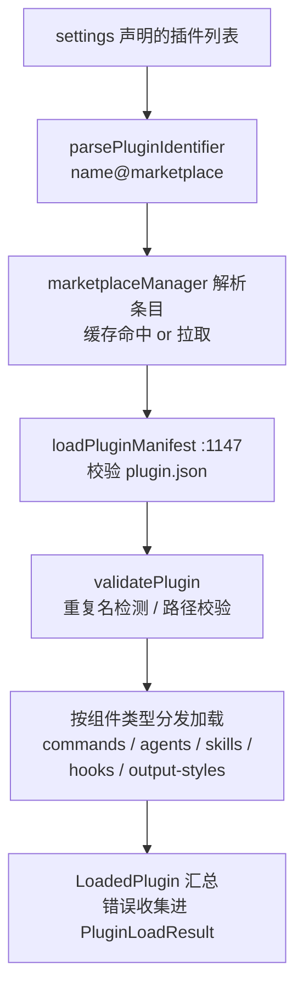

# Claude Code 插件系统架构：清单、Marketplace、安装与运行时集成

## 文档定位

本文基于 `cc-haha` 源码，完整回答：**插件（plugin）是什么、从哪来、怎么装、装完怎么进入运行时？**

`utils/plugins/`（20.4k 行）是 utils 下最大的子目录，承载插件全生命周期。插件的本质可以一句话概括：

> 一个包含 `plugin.json` 清单的目录，向 Claude Code 注入五类组件（commands / agents / skills / hooks / output-styles），并可附带 MCP / LSP server 配置与用户配置项。

覆盖内容：

- 磁盘布局与安装状态（第 1 节）；
- 插件清单 schema 与组件类型（第 2 节）；
- 发现与加载流程（第 3 节）；
- Marketplace 体系与六种来源（第 4 节）；
- 安装、作用域与自动更新（第 5 节）；
- 运行时集成与变量替换（第 6 节）；
- 安全治理（第 7 节）。

源码根目录：

```text
/Users/songxijun/workspace/otherProject/cc-haha
```

入口命令：`/plugin`（src/commands/plugin/）、`/reload-plugins`。

## 一页总览

| 问题 | 核心结论 |
| ---- | ---- |
| 插件是什么 | 目录 + `plugin.json` 清单；注入 5 类组件 + 可选 MCP/LSP server |
| 从哪来 | settings 里声明的 `plugin@marketplace`，或 `--plugin-dir` 的会话级插件 |
| marketplace 是什么 | 托管插件目录的仓库/URL/本地目录，经 `known_marketplaces.json` 登记缓存 |
| 装在哪 | `~/.claude/plugins/` 下按版本分目录缓存，安装状态记在 `installed_plugins.json` |
| 作用域 | user / project / local / managed（策略）/ flag（仅会话），映射自 settings 层级 |
| 命令如何命名 | `pluginName:commandName`（子目录再插一层 `:` 命名空间） |
| 变量替换 | `${CLAUDE_PLUGIN_ROOT}`、`${user_config.KEY}` 在 hook/MCP/LSP 配置里展开 |
| 安全治理 | 官方名仿冒阻断、下架检测自动卸载、策略白名单、敏感配置进 keychain |

---

## 1. 磁盘布局与安装状态

### 1.1 目录结构

`marketplaceManager.ts:1-17` 的文件结构注释 + `pluginDirectories.ts`：

```text
~/.claude/plugins/                     # 或 cowork_plugins（--cowork 切换）
├── installed_plugins.json             # 安装状态（v1 格式，v2 已迁移合并）
├── known_marketplaces.json            # 已登记的 marketplace 配置
├── marketplaces/                      # marketplace 缓存
│   ├── my-marketplace.json            # URL 来源：直接缓存 manifest
│   └── github-marketplace/            # GitHub/git 来源：克隆的仓库
│       └── .claude-plugin/
│           └── marketplace.json
├── <pluginId>@<version>/              # 版本化插件缓存（getVersionedCachePath）
│   └── (解压后的插件目录)
└── data/
    └── <sanitized-plugin-id>/         # 插件可写数据目录（getDataDir）
```

要点：

- **版本化安装路径**：插件按版本分目录（`getVersionedCachePath`，pluginLoader.ts:139-176），更新即装新版本目录，旧版本由 `cacheUtils` 标记孤儿后清理；zip 缓存（`zipCache.ts`）避免重复下载；
- `--cowork` 标志或 `CLAUDE_CODE_USE_COWORK_PLUGINS` 切到 `cowork_plugins` 目录，两套生态隔离（pluginDirectories.ts:34-62）；
- `installed_plugins.json` 有 v1/v2 两代格式，`installedPluginsManager.ts` 负责一次性迁移合并（migrationCompleted 防重入）；
- 安装条目记录 version / installedAt / lastUpdated / installPath / gitCommitSha（版本钉住）。

### 1.2 内置插件

`plugins/builtinPlugins.ts`：随 CLI 一起发布的内置插件挂在保留的 `@builtin` marketplace 下（`BUILTIN_MARKETPLACE_NAME = 'builtin'`），不占文件系统路径（path 用 sentinel 值），`/plugin` UI 对它们跳过 marketplace 查找。

---

## 2. 插件清单与组件类型

### 2.1 plugin.json（PluginManifestSchema，schemas.ts:884-897）

清单 schema 由多个子 schema 拼合（`.partial().shape` 展开）：

```text
PluginManifestMetadataSchema     name / version / description / author / homepage...
PluginManifestHooksSchema        hooks：inline 或指向外部文件（补充 hooks/hooks.json）
PluginManifestCommandsSchema     commands：补充 commands/ 目录的额外命令路径
PluginManifestAgentsSchema       agents：补充 agents/ 目录
PluginManifestSkillsSchema       skills：补充 skills/ 目录
PluginManifestOutputStylesSchema output-styles：补充 output-styles/ 目录
PluginManifestChannelsSchema     assistant-mode channels（含各自的 userConfig）
PluginManifestMcpServerSchema    mcpServers：inline / .mcp.json 引用 / MCPB 文件
PluginManifestLspServerSchema    lspServers：语言服务器配置（文件扩展名映射）
PluginManifestSettingsSchema     插件提供的 settings
PluginManifestUserConfigSchema   用户配置项（见 2.3）
```

**约定目录 + 清单补充**是贯穿的设计：标准位置（`commands/`、`agents/`、`skills/`、`hooks/hooks.json`、`output-styles/`、`.mcp.json`）自动生效，清单字段只用来声明**额外**路径。

### 2.2 五类可注入组件

`PluginComponent`（types/plugin.ts:72-78）：`commands` / `agents` / `skills` / `hooks` / `output-styles`。每类有独立的 loadPlugin* 模块（见第 6 节），加载结果汇总进 `LoadedPlugin`（:48-68）--含各组件的 paths、hooksConfig、mcpServers、lspServers、settings、enabled、isBuiltin、sha。

### 2.3 userConfig：插件的用户配置协议

`PluginUserConfigOptionSchema`（schemas.ts:570-620）：类型 `string/number/boolean/directory/file`，带 title / description / required / default / min / max / sensitive 标志：

- **enable 时弹配置对话框**（复用 MCPB 的 `validateUserConfig`，结构刻意对齐 `McpbUserConfigurationOption`）；
- 非敏感值存 `settings.json` 的 `pluginConfigs[pluginId].options`；**sensitive 值存安全存储**（macOS keychain 或 .credentials.json，与 OAuth token 共享条目）；
- 值以 `${user_config.KEY}` 出现在 MCP/LSP 配置与 hook 命令中；key 命名规则保证可变成 `CLAUDE_PLUGIN_OPTION_<KEY>` 环境变量。

---

## 3. 发现与加载流程

`pluginLoader.ts`（3302 行）模块头（:1-37）写明发现来源与优先级：

```text
1. Marketplace 插件：settings 中声明的 plugin@marketplace
2. 会话级插件：--plugin-dir CLI 参数或 SDK plugins 选项
```

加载管线（`loadPluginsFromMarketplaces` :1888 及外围）：



工程细节：

- **错误不中断**：单个插件加载失败进 `PluginLoadResult.errors`（类型安全的判别联合，types/plugin.ts），其余插件继续；
- **启用状态**：enabled 标志支持逐插件开关（`pluginOptionsStorage.ts`），settings 变更触发热重载（`loadPluginHooks.ts:8-14` 的快照对比）；
- **依赖解析**：`dependencyResolver.ts` 的 `verifyAndDemote` 校验插件间依赖；
- **孤儿过滤**：`orphanedPluginFilter.ts` 清理安装状态里已无来源的条目；
- zip 下载走 `zipCache`，git 来源经 `gitAvailability` 检查后 sparse clone。

---

## 4. Marketplace 体系

### 4.1 六种来源（MarketplaceSourceSchema，schemas.ts:902-1003）

判别联合，按 `source` 字段区分：

| source | 形态 | 说明 |
| ------ | ---- | ---- |
| `url` | 直接 URL 指向 marketplace.json | 可带自定义 HTTP headers（私有源认证） |
| `github` | `owner/repo` + ref + path + sparsePaths | 默认路径 `.claude-plugin/marketplace.json` |
| `git` | 完整 git URL + ref + path | 同上，支持稀疏检出 |
| `npm` | npm 包名 | 包内含 marketplace 清单 |
| `file` | 本地文件路径 | 指向 marketplace.json |
| `directory` | 本地目录 | 含 `.claude-plugin/marketplace.json` |
| `hostPattern` / `pathPattern` | 模式匹配 | 按主机/路径规则发现 |

官方市场：`anthropics/claude-plugins-official`（officialMarketplace.ts:12-25），名称保留 `claude-code-marketplace`、`anthropic-marketplace` 等，第三方不可用（见 7.1）。

### 4.2 known_marketplaces.json 与 reconciler

- 登记态存 `known_marketplaces.json`（来源、installLocation、lastUpdated、autoUpdate）；
- **settings 是意图，known 是事实**：`reconciler.ts`（:1-14）做两层--`diffMarketplaces()`（纯比较、memoized）与 `reconcileMarketplaces()`（幂等、只增不减的安装）；settings 与 JSON 冲突时 **settings 赢**；
- NPM 包不直接作为插件来源，必须经 marketplace 条目引用（pluginLoader.ts:4-5 注释）。

---

## 5. 安装、作用域与自动更新

### 5.1 五种作用域（pluginIdentifier.ts:26-40）

```text
policySettings -> managed   企业策略下发，不可手动安装
userSettings   -> user      全局
projectSettings-> project   随仓库共享
localSettings  -> local     gitignore 的本地
flagSettings   -> flag      仅本会话（--plugin-dir / SDK），不持久化
```

与权限规则的 source 体系同构（`SETTING_SOURCE_TO_SCOPE`），persistable 作用域写入 `installed_plugins.json`，`flag` 只活在内存。

### 5.2 安装与更新

- `pluginInstallationHelpers.ts`（595 行）：安装路径校验（`validatePathWithinBase` 防路径穿越）、zip 解压、目录转换；
- `headlessPluginInstall.ts`：无 UI 环境的安装流程；
- **自动更新**（`pluginAutoupdate.ts`）：后台刷新 marketplace -> 比对已装版本 -> 装新版本目录 -> 通过回调通知 REPL 提示重启；更新先于 REPL 挂载完成时用 pendingNotification 补发（竞态处理，:25-33）；官方市场中部分默认不自动更新（pluginDirectories.ts:31-33 的名单）；
- `installCounts.ts` 维护安装计数，`fetchTelemetry.ts` 分类拉取失败遥测。

---

## 6. 运行时集成

### 6.1 组件注入

| 组件 | 模块 | 备注 |
| ---- | ---- | ---- |
| commands | `loadPluginCommands.ts`（946 行） | 命令名 `pluginName:commandName`，子目录插 `:` 命名空间（:73-91）；支持 frontmatter（effort、shell 等） |
| agents | `loadPluginAgents.ts`（375 行） | agent 定义文件进入 AgentTool 的 agentDefinitions |
| skills | loader 内处理 | 进入 skill 注册表 |
| hooks | `loadPluginHooks.ts`（305 行） | hooks.json 转成 16 种事件的 matcher（PreToolUse/PostToolUse/PermissionDenied/SessionStart/Stop/SubagentStart/PreCompact/PostCompact 等） |
| output-styles | `loadPluginOutputStyles.ts` | 输出风格注册 |

### 6.2 MCP / LSP 集成与变量替换

`mcpPluginIntegration.ts`（634 行）把插件声明的 MCP server 并入运行时连接池（含 channels 概念：assistant-mode 分通道配置，未配置通道会触发配置流程）；`lspPluginIntegration.ts` / `lspRecommendation.ts` 处理 LSP server 与推荐。

变量替换（mcpPluginIntegration.ts:462）：`${CLAUDE_PLUGIN_ROOT}`、`${user_config.X}` 与一般 `${VAR}` 三类，在 hook 命令、MCP/LSP 配置中展开；敏感的 user_config 值不回填进 skill/agent 内容。`mcpbHandler.ts`（968 行）处理 MCPB 格式的 server 包。

---

## 7. 安全治理

1. **官方名仿冒阻断**（pluginDirectories.ts:7-33，第一层防线）：`claude-marketplace`、`claude-code-marketplace`、`anthropic-marketplace` 等名称保留给官方市场，第三方 marketplaces.json 中出现即拦截（间接变体如 `my-claude-marketplace` 不拦）；
2. **下架检测与自动卸载**（`pluginBlocklist.ts`）：比对已装插件与最新 marketplace manifest，被移除的插件自动卸载并进 flagged 名单。注释记录了一次成本决策：原安全清单经 GitHub 拉取、每周约 2950 万次请求仅为 UI 文案，已被移除（#25447）；
3. **策略管控**（`pluginPolicy.ts` / `managedPlugins.ts`）：managed settings 可限定允许的插件与 marketplace（`isSourceAllowedByPolicy`）；
4. **路径安全**：`validatePathWithinBase` 防止清单里的相对路径逃出插件目录；marketplace 缓存路径同样受控；
5. **敏感配置隔离**：userConfig 的 sensitive 项进 keychain/credentials 文件而非 settings.json（2.3 节）。

---

## 8. 总结

```text
插件系统 = 清单协议（plugin.json：约定目录 + 清单补充，五类组件 + MCP/LSP/userConfig）
         + 分发层（marketplace 六种来源，settings 意图 -> known 事实的幂等 reconcile）
         + 安装层（版本化缓存目录、五作用域、自动更新、下架自动卸载）
         + 运行时（组件注入 + ${CLAUDE_PLUGIN_ROOT}/${user_config} 变量替换 + 热重载）
         + 治理（官方名保留、策略白名单、敏感值进 keychain、路径防穿越）
```

一句话设计思想：

> 把"扩展 Claude Code"统一收敛为一个带清单的目录协议：marketplace 只负责发现与分发，settings 声明意图并永远优先，安装状态落盘可 reconcile；运行时按组件类型各自接入既有机制（命令、agent、skill、hook、MCP），插件本身不获得任何专属执行通道。

## 关键源码文件

| 文件 | 职责 |
| ---- | ---- |
| `src/utils/plugins/pluginLoader.ts` | 发现、加载、校验主流程（3302 行） |
| `src/utils/plugins/schemas.ts` | 全部 schema：manifest、marketplace 来源、安装文件（1681 行） |
| `src/utils/plugins/marketplaceManager.ts` | marketplace 登记、缓存、拉取（2643 行） |
| `src/utils/plugins/installedPluginsManager.ts` | installed_plugins.json 读写与 v1/v2 迁移 |
| `src/utils/plugins/pluginDirectories.ts` | 目录布局、cowork 切换、官方名保留 |
| `src/utils/plugins/pluginIdentifier.ts` | `name@marketplace` 解析与作用域映射 |
| `src/utils/plugins/pluginInstallationHelpers.ts` | 安装路径校验与解压 |
| `src/utils/plugins/pluginAutoupdate.ts` | 后台自动更新与重启通知 |
| `src/utils/plugins/reconciler.ts` | settings <-> known_marketplaces 幂等对账 |
| `src/utils/plugins/pluginBlocklist.ts` | 下架检测与自动卸载 |
| `src/utils/plugins/loadPlugin{Commands,Agents,Hooks,OutputStyles}.ts` | 各组件运行时注入 |
| `src/utils/plugins/mcpPluginIntegration.ts` | MCP server 集成与变量替换 |
| `src/types/plugin.ts` | LoadedPlugin / PluginComponent / 错误类型 |
| `src/plugins/builtinPlugins.ts` | `@builtin` 内置插件注册表 |
